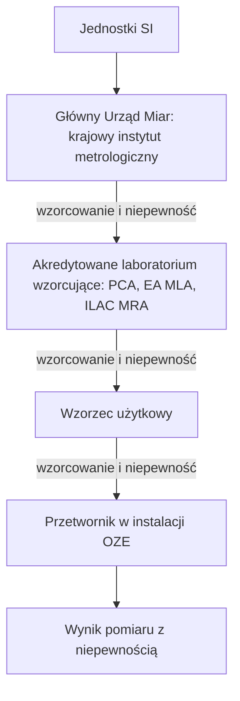

import { SlideContainer, Slide, InstructorNotes, LearningObjective } from '@site/src/components/SlideComponents';

<LearningObjective>

Student odróżnia dokładność od niepewności pomiaru, oblicza niepewność standardową złożoną i rozszerzoną prostego toru pomiarowego według GUM (przewodnika wyrażania niepewności pomiaru, JCGM 100:2008) oraz wyjaśnia, jak wzorcowanie, spójność pomiarowa i dryft wpływają na wiarygodność pomiaru i na nastawy zabezpieczeń.

</LearningObjective>

<SlideContainer>

<Slide title="Dokładność, błąd i niepewność" type="info">

- **Dokładność pomiaru** (VIM 2.13; VIM — ang. International Vocabulary of Metrology, międzynarodowy słownik metrologii, JCGM 200:2012, wyd. 3): „zbieżność zachodząca pomiędzy wartością wielkości zmierzoną, a wartością wielkości prawdziwą menzurandu” (brzmienie polskie wg Vademecum Głównego Urzędu Miar, 2022). Menzurand to wielkość, którą zamierzamy zmierzyć.
- Wg VIM (uwaga 1 do 2.13) dokładność nie jest wielkością i nie ma wartości liczbowej; pomiar jest dokładniejszy, gdy daje mniejszy błąd pomiaru.
- **Błąd pomiaru** (VIM 2.16): wartość zmierzona minus wartość odniesienia. Znamy go tylko wtedy, gdy mamy wartość odniesienia, np. ze wzorca o pomijalnej niepewności (uwaga 1); w pracującej instalacji zwykle jej nie ma.
- **Niepewność pomiaru** (VIM 2.26): nieujemny parametr opisujący rozrzut wartości przypisywanych menzurandowi na podstawie wykorzystanej informacji (tłumaczenie własne). Obejmuje także składniki od efektów systematycznych, np. poprawek i wartości przypisanych wzorcom (uwaga 1), i dotyczy konkretnej wartości zmierzonej (uwaga 4).
- **Największy dopuszczalny błąd pomiaru** (MPE, ang. maximum permissible error, VIM 4.26; polski termin wg przekładu słownika metrologii prawnej wydanego przez Główny Urząd Miar): skrajna wartość błędu dopuszczona przez specyfikację lub przepisy dla danego przyrządu.
- Zapis „dokładność ±0,5%” w karcie katalogowej przetwornika to w praktyce MPE, czyli granica błędu, a nie niepewność naszego wyniku; niepewność toru trzeba obliczyć ze wszystkich składników (ocena własna).

Źródło: [VIM 2.13](https://jcgm.bipm.org/vim/en/2.13.html); [VIM 2.16](https://jcgm.bipm.org/vim/en/2.16.html); [VIM 2.26](https://jcgm.bipm.org/vim/en/2.26.html); [VIM 4.26](https://jcgm.bipm.org/vim/en/4.26.html); [Główny Urząd Miar, Vademecum 2022](https://www.gum.gov.pl/ftp/pdf/Wydawnictwa/Vademecum_2022/5_Terminologia_metrologiczna.pdf); [Główny Urząd Miar, słownik metrologii prawnej](https://www.gum.gov.pl/ftp/pdf/Wydawnictwa/Miedzynarodowy_Slownik_Terminow_Metrologii_Prawnej.pdf)

<InstructorNotes>

Czas: ~2,5 min

Zaczynamy od słów, bo w metrologii każde ma swoje miejsce. Dokładność to pojęcie jakościowe: mówimy, że jeden pomiar jest dokładniejszy od drugiego, ale według słownika VIM dokładności nie wyraża się liczbą. Błąd to różnica między wynikiem a wartością odniesienia; w pracującej biogazowni czy farmie PV zwykle go nie znamy, bo obok przetwornika nie stoi wzorzec. Niepewność mówi, jak szeroki jest przedział wartości, które możemy rozsądnie przypisać wielkości mierzonej. Liczba z karty katalogowej to najczęściej granica dopuszczalnego błędu, a nie niepewność naszego pomiaru w terenie.

Pytanie do sali: czy przetwornik z kartą „±0,5%” da wynik z niepewnością 0,5%? Nie, bo dochodzą wzorcowanie, dryft i karta wejść. Typowe nieporozumienie: „dokładność czujnika 0,5%” to cała prawda o pomiarze.

</InstructorNotes>

</Slide>

<Slide title="Niepewność według GUM w czterech krokach" type="info">

- **GUM** (ang. Guide to the Expression of Uncertainty in Measurement — przewodnik wyrażania niepewności pomiaru) to JCGM 100:2008, z poprawką Amd.1:2026. Polskie terminy poniżej pochodzą z przekładu Głównego Urzędu Miar „Ewaluacja danych pomiarowych — Przewodnik wyrażania niepewności pomiaru” (2019).
- **Krok 1 — model**: wynik oblicza się z wielkości wejściowych, $y = f(x_1, \dots, x_N)$.
- **Krok 2 — niepewności standardowe składników**: **metoda typu A** to statystyczna analiza serii obserwacji (4.2); **metoda typu B** korzysta z innych informacji: wcześniejszych pomiarów, danych producenta, świadectw wzorcowania, danych z podręczników (4.3.1). Dla **rozkładu prostokątnego** o połowie szerokości $a$: $u = a/\sqrt{3}$ (4.3.7).
- **Krok 3 — złożenie**: dla nieskorelowanych wielkości wejściowych liczy się **niepewność standardową złożoną** $u_c$ (5.1.2); **współczynniki wrażliwości** $c_i = \partial f / \partial x_i$ mówią, jak wynik zmienia się ze zmianą każdej wielkości wejściowej (5.1.3).
- **Krok 4 — rozszerzenie i zapis**: **niepewność rozszerzona** $U = k \cdot u_c$ (6.2.1); **współczynnik rozszerzenia** $k = 2$ daje przedział o poziomie ufności ok. 95% przy rozkładzie zbliżonym do normalnego (6.3.3).

$$
u_c(y) = \sqrt{\sum_{i=1}^{N} c_i^2\, u^2(x_i)}, \qquad U = k\, u_c(y)
$$

- EA-4/02 M:2022 (dokument EA, European co-operation for Accreditation — europejska współpraca w dziedzinie akredytacji; kopia udostępniona przez hiszpańską jednostkę akredytującą ENAC), pkt 5.1: przy rozkładzie normalnym i wystarczająco wiarygodnym oszacowaniu należy stosować standardowy współczynnik $k = 2$ (prawdopodobieństwo rozszerzenia ok. 95%). Świadectwo wzorcowania podaje $U$ i $k$, więc do budżetu wpisuje się $u = U/k$.

Źródło: [JCGM 100:2008 (GUM)](https://www.bipm.org/documents/20126/2071204/JCGM_100_2008_E.pdf); [BIPM, publikacje JCGM](https://www.bipm.org/en/committees/jc/jcgm/publications); [Główny Urząd Miar, przekład GUM, 2019](https://www.gum.gov.pl/ftp/pdf/Publikacje/Przewodnik_JCGM_100_ver__fin_27_08_2019_popr_.pdf); [EA-4/02 M:2022, kopia ENAC](https://www.enac.es/documents/7020/635abf3f-262a-4b3b-952f-10336cdfae9e)

<InstructorNotes>

Czas: ~2,5 min

GUM to wspólny język laboratoriów na całym świecie i najłatwiej zapamiętać go w czterech krokach. Najpierw zapisujemy model, czyli z czego liczymy wynik. Potem dla każdego składnika wyznaczamy niepewność standardową. Metoda typu A to statystyka z powtarzanych pomiarów; w instalacji OZE częściej korzystamy z metody typu B, czyli z karty katalogowej i świadectwa wzorcowania. Jeśli producent podaje tylko granice, zakładamy rozkład prostokątny i dzielimy połowę szerokości przez pierwiastek z trzech. Składniki łączymy przez pierwiastek z sumy kwadratów, a na końcu mnożymy przez współczynnik rozszerzenia, zwykle dwa.

Pytanie do sali: dlaczego nie dodajemy składników arytmetycznie? Bo niezależne błędy rzadko osiągają swoje granice jednocześnie. Typowe nieporozumienie: niepewność ze świadectwa wzorcowania wpisuje się do budżetu bez dzielenia przez k.

</InstructorNotes>

</Slide>

<Slide title="Przykład: budżet niepewności pomiaru napełnienia" type="tip">

**Przykład ilustracyjny — dane umowne.** Tor pomiaru napełnienia zbiornika biogazu (przetwornik z wyjściem 4–20 mA, karta wejść 12 bit, zakres 0–100% napełnienia); wartości składników przyjęto umownie, a wzory pochodzą z GUM.

| Składnik | Dane (umowne) | Rozkład i wzór | $u_i$ [% zakresu] | Udział w wariancji |
|---|---|---|---|---|
| przetwornik (MPE z karty) | ±0,5% | prostokątny, $a/\sqrt{3}$ | 0,289 | 18,1% |
| świadectwo wzorcowania | U = 0,4%, k = 2 | normalny, $U/k$ | 0,200 | 8,7% |
| dryft między wzorcowaniami | ±1,0% w roku | prostokątny, $a/\sqrt{3}$ | 0,577 | 72,5% |
| karta wejść analogowych | ±0,1% | prostokątny, $a/\sqrt{3}$ | 0,058 | 0,7% |
| kwantyzacja 12 bit | q = 100%/3276,8 = 0,0305% | prostokątny, $q/\sqrt{12}$ | 0,0088 | ≈ 0 |

$$
u_c = \sqrt{0{,}289^2 + 0{,}200^2 + 0{,}577^2 + 0{,}058^2 + 0{,}0088^2} \approx 0{,}678\%, \qquad U = 2 \times 0{,}678\% \approx 1{,}36\% \approx 1{,}4\%
$$

- Wszystkie składniki wyrażono w % zakresu, więc współczynniki wrażliwości są równe 1. Liczba kodów na 4–20 mA: [część 2](./02-tor-pomiarowy.mdx); wzór na kwantyzację: GUM F.2.2.1.
- Wynik: $u_c \approx 0{,}68\%$ i **U ≈ 1,4% zakresu (k = 2)**. Dryft daje 72,5% wariancji: o jakości pomiaru decydują stabilność przetwornika i odstęp między wzorcowaniami, a nie rozdzielczość karty (ocena własna).
- Podnoszenie do kwadratu sprawia, że małe składniki znikają: karta i kwantyzacja to razem mniej niż 1% wariancji.
- Dane rzeczywiste do porównania: Reda (2011, raport NREL — National Renewable Energy Laboratory, tabl. 3) podaje dla piranometru termoelektrycznego (z termostosem) niepewności rozszerzone (U95) składników; największa pozycja to wzorcowanie, 3%. Suma pozycji wynosi 8,9%, a złożenie jako pierwiastek z sumy kwadratów 4,1% (wartości wg raportu).

Źródło: [JCGM 100:2008 (GUM)](https://www.bipm.org/documents/20126/2071204/JCGM_100_2008_E.pdf); [Reda, NREL 2011](https://docs.nlr.gov/docs/fy11osti/52194.pdf); obliczenia własne

<InstructorNotes>

Czas: ~3 min

To przykład umowny, ale zbudowany tak, jak buduje się prawdziwy budżet. Mamy pięć składników w procentach zakresu. Granice z karty katalogowej zamieniamy na niepewność standardową przez pierwiastek z trzech, niepewność ze świadectwa dzielimy przez dwa, a kwantyzację przez pierwiastek z dwunastu. Wynik to niepewność rozszerzona około 1,4% zakresu. Proszę spojrzeć na ostatnią kolumnę: prawie trzy czwarte wariancji to dryft, a dwanaście bitów karty nie ma znaczenia. Zamiast droższej karty lepiej skrócić odstęp między wzorcowaniami albo wybrać stabilniejszy przetwornik. Wartość 1,4% wykorzystamy w części piątej, przy czasie napełniania zbiornika biogazu.

Pytanie do sali: ile wyniesie U, jeśli dryft spadnie do ±0,5%? Około 0,9%. Typowe nieporozumienie: najsłabszym ogniwem toru jest zawsze przetwornik A/C.

</InstructorNotes>

</Slide>

<Slide title="Wzorcowanie i spójność pomiarowa" type="info">

- **Wzorcowanie** (ang. calibration, VIM 2.39): działanie, które w określonych warunkach w pierwszym kroku ustala zależność między wartościami odtwarzanymi przez wzorzec pomiarowy (z ich niepewnościami) a wskazaniami przyrządu, a w drugim kroku wykorzystuje ją do uzyskiwania wyniku pomiaru ze wskazania (tłumaczenie własne; początek definicji jak w Vademecum Głównego Urzędu Miar).
- Wg VIM (uwaga 2 do 2.39) wzorcowania nie należy mylić z adiustacją układu pomiarowego (regulacją, często błędnie nazywaną „samokalibracją”) ani ze sprawdzeniem wzorcowania.
- **Spójność pomiarowa** (VIM 2.41) to „właściwość wyniku pomiaru, przy której wynik może być związany z odniesieniem poprzez udokumentowany, nieprzerwany łańcuch wzorcowań (kalibracji), z których każde wnosi swój udział do niepewności pomiaru” (brzmienie wg PCA DA-06 wyd. 9).

- PCA (Polskie Centrum Akredytacji), dokument DA-06 wyd. 9 z 24.02.2025, stosowany od 24.04.2025: polityka jest zgodna z ILAC-P10 (ILAC — International Laboratory Accreditation Cooperation, międzynarodowa współpraca w dziedzinie akredytacji laboratoriów); funkcję krajowego instytutu metrologicznego w Polsce pełni Główny Urząd Miar.
- DA-06 (pkt 3.1.1): wyposażenie powinno być wzorcowane w krajowych instytutach metrologicznych albo w akredytowanych laboratoriach wzorcujących, których jednostka akredytująca jest sygnatariuszem porozumień o wzajemnym uznawaniu EA MLA lub ILAC MRA.
- **Legalizacja** to procedura oceny zgodności w metrologii prawnej (słownik metrologii prawnej Głównego Urzędu Miar), a nie wzorcowanie; liczniki rozliczeniowe: [część 1](./01-cele-architektura-i-czas.mdx).

Źródło: [VIM 2.39](https://jcgm.bipm.org/vim/en/2.39.html); [VIM 2.41](https://jcgm.bipm.org/vim/en/2.41.html); [Główny Urząd Miar, Vademecum 2022](https://www.gum.gov.pl/ftp/pdf/Wydawnictwa/Vademecum_2022/5_Terminologia_metrologiczna.pdf); [PCA, DA-06 wyd. 9](https://www.pca.gov.pl/storage/file/core_files/2025/2/24/3d55b9731b8b02dc888469e823e3b2b6/DA-06_9.pdf); [PCA, dokumenty ogólne](https://www.pca.gov.pl/o-pca/dokumenty/pca/dokumenty-ogolne); [Główny Urząd Miar, słownik metrologii prawnej](https://www.gum.gov.pl/ftp/pdf/Wydawnictwa/Miedzynarodowy_Slownik_Terminow_Metrologii_Prawnej.pdf)

<InstructorNotes>

Czas: ~2,5 min

Wzorcowanie to porównanie przyrządu z wzorcem o znanej niepewności i zapisanie wyniku, na przykład jako poprawki albo krzywej wzorcowania. Samo wzorcowanie niczego w przyrządzie nie reguluje. Jeśli technik przestawia zero i zakres, to jest adiustacja, a po niej trzeba sprawdzić przyrząd ponownie. Schemat pokazuje łańcuch spójności pomiarowej: od jednostek SI przez Główny Urząd Miar i akredytowane laboratoria aż do wzorca, którym serwis sprawdza przetwornik na obiekcie. Każde ogniwo dodaje swoją niepewność i każde musi być udokumentowane.

Pytanie do sali: czy świadectwo z dowolnego laboratorium zapewnia spójność pomiarową? Polityka PCA dopuszcza inne drogi tylko z dodatkowymi dowodami. Typowe nieporozumienie: przycisk „kalibracja” w menu przetwornika to wzorcowanie.

</InstructorNotes>

</Slide>

<Slide title="Dryft i odstępy między wzorcowaniami" type="warning">

- **Dryft** (ang. instrumental drift, VIM 4.21): ciągła lub skokowa zmiana wskazania w czasie, spowodowana zmianami właściwości metrologicznych przyrządu; nie wynika ze zmiany wielkości mierzonej ani wielkości wpływającej (tłumaczenie własne).
- ILAC-G24:2022 / OIML D 10:2022 (OIML — Organisation Internationale de Métrologie Légale, Międzynarodowa Organizacja Metrologii Prawnej): przyrządy mogą dryfować z upływem czasu lub wskutek użytkowania (6.1); ponowne wzorcowanie ma m.in. oszacować odchyłkę od wartości odniesienia i potwierdzić deklarowaną niepewność (4.2).
- Początkowy odstęp dobiera się na podstawie oceny ryzyka: zalecenia producenta, skłonność do zużycia i dryftu, intensywność użytkowania, warunki środowiskowe, dane o podobnych przyrządach (5.1). Potem koryguje się go na podstawie historii wyników, np. metodą „schodkową” albo kartą kontrolną (6.1–6.3).

| Czujnik w OZE | Co wiadomo o dryfcie | Źródło |
|---|---|---|
| piranometr termoelektryczny | starzenie 0,2% na rok jako składnik niepewności | Reda (NREL 2011), tabl. 3 |
| anemometr czaszowy | utrata właściwości z wiekiem; po okresie przejściowym ok. 450 dni sprawność anemometrów ma tendencję do spadku | Pindado i in. (2012) |
| czujnik elektrochemiczny detektora gazu w powietrzu | wymianę zaleca się zwykle, gdy czułość spadnie poniżej 50% początkowej | DGUV T 021 (2023; DGUV — niemieckie ustawowe ubezpieczenie wypadkowe) |
| pomiar napięć ogniw w BMS (Battery Management System — system zarządzania baterią) | brak lub niedokładność kalibracji i szybki dryf wśród przyczyn błędnych pomiarów | Rosewater i Williams (2015), [W2, część 4](../wyklad-02-analiza-ryzyka/04-fta-eta-i-bow-tie.mdx) |

- IEA PVPS T13-03 (2014; IEA PVPS — program fotowoltaiczny Międzynarodowej Agencji Energetycznej): przy dwóch stale porównywanych czujnikach promieniowania ponowne wzorcowanie co dwa lata jest rozsądne; przy jednym czujniku należy rozważyć wzorcowanie co rok.
- Dwa czujniki wzorcowane z tym samym błędem mylą się razem: to uszkodzenie spowodowane wspólną przyczyną (CCF — Common Cause Failure), [W2, część 4](../wyklad-02-analiza-ryzyka/04-fta-eta-i-bow-tie.mdx).

Źródło: [VIM 4.21](https://jcgm.bipm.org/vim/en/4.21.html); [ILAC-G24:2022 / OIML D 10:2022](https://www.oiml.org/en/files/pdf_d/d010-e22.pdf); [Reda, NREL 2011](https://docs.nlr.gov/docs/fy11osti/52194.pdf); [Pindado i in., 2012](https://doi.org/10.3390/en5051664); [DGUV, T 021](https://res.jedermann.de/data/downloads/T021_Gesamtdokument.pdf); [IEA PVPS T13-03:2014](https://iea-pvps.org/wp-content/uploads/2020/01/IEA-PVPS_T13-D2_3_Analytical_Monitoring_of_PV_Systems_Final.pdf)

<InstructorNotes>

Czas: ~2 min

W budżecie dryft okazał się największym składnikiem, więc zobaczmy, co o nim wiemy. Dryft to powolna zmiana wskazania przy tej samej wielkości mierzonej. Wytyczne ILAC i OIML nie podają jednego uniwersalnego odstępu między wzorcowaniami: zaczynamy od oceny ryzyka, a potem korygujemy odstęp na podstawie historii. W metodzie schodkowej przyrząd, który przy kolejnych wzorcowaniach mieści się w granicach, dostaje dłuższy odstęp, a ten, który z nich wypada, krótszy. Tabela pokazuje, że dryft dotyczy wszystkich technologii OZE.

Pytanie do sali: dlaczego IEA dopuszcza rzadsze wzorcowanie, gdy mamy dwa czujniki promieniowania? Bo ich porównanie ujawnia dryft jednego z nich. Typowe nieporozumienie: dwa identyczne czujniki wzorcowane razem chronią przed błędem kalibracji.

</InstructorNotes>

</Slide>

<Slide title="Niepewność a nastawy zabezpieczeń" type="warning">

- Energetyka jądrowa ma formalną metodę: wytyczna RG 1.105, wersja 4 (luty 2021), amerykańskiego dozoru jądrowego US NRC (Nuclear Regulatory Commission) uznaje normę ANSI/ISA-67.04.01-2018 dotyczącą nastaw aparatury związanej z bezpieczeństwem.
- Przepis 10 CFR 50.36 (CFR — Code of Federal Regulations, zbiór przepisów federalnych USA) cytowany w RG 1.105: jeśli dla zmiennej ustalono granicę bezpieczeństwa, nastawę trzeba dobrać tak, aby automatyczne działanie ochronne skorygowało stan nienormalny, zanim zostanie przekroczona granica bezpieczeństwa (tłumaczenie własne).
- Wg RG 1.105 przedział tolerancji dla losowych, niezależnych składników niepewności należy szacować tak, aby obejmował niepewność z prawdopodobieństwem 95% przy poziomie ufności 95% (95/95); wydanie 2018 normy ISA uzupełniło rozdz. 4.6 o metody uwzględniania m.in. skutków dryftu.
- Zasada dla instalacji OZE (ocena własna, na podstawie RG 1.105), dla granicy górnej, np. napełnienia: granica z analizy ryzyka (HAZOP — badanie zagrożeń i zdolności do działania; LOPA — analiza warstw ochrony) → minus niepewność całego toru z dryftem między wzorcowaniami → minus zmiana wielkości w czasie zadziałania funkcji → nastawa.
- Nastawa i czas zadziałania należą do specyfikacji SIF (Safety Instrumented Function — przyrządowa funkcja bezpieczeństwa) razem z wymaganym PFDavg (średnie prawdopodobieństwo niebezpiecznego uszkodzenia na żądanie) i interwałem testów sprawdzających T₁ ([W2, część 6](../wyklad-02-analiza-ryzyka/06-podsumowanie.mdx); [W2, część 5](../wyklad-02-analiza-ryzyka/05-lopa-i-sil.mdx)). Przykład dla zbiornika biogazu: [część 5](./05-uszkodzenia-toru-i-przyklad-biogazowy.mdx). Nastawy detektorów w biogazowni: W9.

Źródło: [US NRC, RG 1.105 Rev. 4, 2021](https://www.nrc.gov/docs/ML2033/ML20330A329.pdf)

<InstructorNotes>

Czas: ~1,5 min

Na koniec pytanie, po co inżynierowi bezpieczeństwa cała ta metrologia. Odpowiedź bardzo dokładnie zapisała energetyka jądrowa. Nastawa zabezpieczenia nie może leżeć na samej granicy wyznaczonej w analizie ryzyka, bo przetwornik może wskazywać za mało o całą swoją niepewność, a zanim funkcja zadziała, proces idzie dalej. Dlatego od granicy odejmujemy niepewność toru razem z dryftem i zapas na czas zadziałania. Nie przenosimy wymagań jądrowych do biogazowni, bierzemy tylko zasadę.

Pytanie do sali: co się stanie z zapasem, jeśli przetwornik nie był wzorcowany od trzech lat? Dryft rośnie, więc zapas się kurczy. Typowe nieporozumienie: nastawę ustawia się równo na granicy z HAZOP.

</InstructorNotes>

</Slide>

</SlideContainer>

## Źródła

1. JCGM (2012). *JCGM 200:2012 International vocabulary of metrology — Basic and general concepts and associated terms (VIM)*, wyd. 3. BIPM. [https://www.bipm.org/documents/20126/2071204/JCGM_200_2012.pdf](https://www.bipm.org/documents/20126/2071204/JCGM_200_2012.pdf); wersja online: [https://jcgm.bipm.org/vim/en/index.html](https://jcgm.bipm.org/vim/en/index.html); hasła 2.13, 2.16, 2.26, 2.39, 2.41, 4.21, 4.26: [https://jcgm.bipm.org/vim/en/2.13.html](https://jcgm.bipm.org/vim/en/2.13.html), [https://jcgm.bipm.org/vim/en/2.16.html](https://jcgm.bipm.org/vim/en/2.16.html), [https://jcgm.bipm.org/vim/en/2.26.html](https://jcgm.bipm.org/vim/en/2.26.html), [https://jcgm.bipm.org/vim/en/2.39.html](https://jcgm.bipm.org/vim/en/2.39.html), [https://jcgm.bipm.org/vim/en/2.41.html](https://jcgm.bipm.org/vim/en/2.41.html), [https://jcgm.bipm.org/vim/en/4.21.html](https://jcgm.bipm.org/vim/en/4.21.html), [https://jcgm.bipm.org/vim/en/4.26.html](https://jcgm.bipm.org/vim/en/4.26.html)
2. JCGM (2008). *JCGM 100:2008 Evaluation of measurement data — Guide to the expression of uncertainty in measurement (GUM)*, wyd. 1, z poprawką Amd.1:2026. BIPM. [https://www.bipm.org/documents/20126/2071204/JCGM_100_2008_E.pdf](https://www.bipm.org/documents/20126/2071204/JCGM_100_2008_E.pdf); wykaz publikacji JCGM: [https://www.bipm.org/en/committees/jc/jcgm/publications](https://www.bipm.org/en/committees/jc/jcgm/publications)
3. Główny Urząd Miar (2019). *Ewaluacja danych pomiarowych — Przewodnik wyrażania niepewności pomiaru* (przekład JCGM 100:2008). [https://www.gum.gov.pl/ftp/pdf/Publikacje/Przewodnik_JCGM_100_ver__fin_27_08_2019_popr_.pdf](https://www.gum.gov.pl/ftp/pdf/Publikacje/Przewodnik_JCGM_100_ver__fin_27_08_2019_popr_.pdf)
4. Główny Urząd Miar (2022). *Polska administracja miar i administracja probiercza — Vademecum*, rozdz. 5: Terminologia metrologiczna. [https://www.gum.gov.pl/ftp/pdf/Wydawnictwa/Vademecum_2022/5_Terminologia_metrologiczna.pdf](https://www.gum.gov.pl/ftp/pdf/Wydawnictwa/Vademecum_2022/5_Terminologia_metrologiczna.pdf)
5. Główny Urząd Miar (2015). *Międzynarodowy Słownik Terminów Metrologii Prawnej* (przekład OIML V 1:2013). [https://www.gum.gov.pl/ftp/pdf/Wydawnictwa/Miedzynarodowy_Slownik_Terminow_Metrologii_Prawnej.pdf](https://www.gum.gov.pl/ftp/pdf/Wydawnictwa/Miedzynarodowy_Slownik_Terminow_Metrologii_Prawnej.pdf)
6. EA (2022). *EA-4/02 M:2022 Evaluation of the Uncertainty of Measurement in Calibration*. European co-operation for Accreditation (kopia udostępniona przez ENAC). [https://www.enac.es/documents/7020/635abf3f-262a-4b3b-952f-10336cdfae9e](https://www.enac.es/documents/7020/635abf3f-262a-4b3b-952f-10336cdfae9e)
7. Reda I. (2011). *Method to Calculate Uncertainties in Measuring Shortwave Solar Irradiance Using Thermopile and Semiconductor Solar Radiometers* (NREL/TP-3B10-52194). National Renewable Energy Laboratory. [https://docs.nlr.gov/docs/fy11osti/52194.pdf](https://docs.nlr.gov/docs/fy11osti/52194.pdf); rekord OSTI: [https://www.osti.gov/biblio/1021250](https://www.osti.gov/biblio/1021250)
8. PCA (2025). *DA-06 Polityka dotycząca spójności pomiarowej wyników pomiarów*, wyd. 9 z 24.02.2025. Polskie Centrum Akredytacji. [https://www.pca.gov.pl/storage/file/core_files/2025/2/24/3d55b9731b8b02dc888469e823e3b2b6/DA-06_9.pdf](https://www.pca.gov.pl/storage/file/core_files/2025/2/24/3d55b9731b8b02dc888469e823e3b2b6/DA-06_9.pdf); wykaz dokumentów ogólnych: [https://www.pca.gov.pl/o-pca/dokumenty/pca/dokumenty-ogolne](https://www.pca.gov.pl/o-pca/dokumenty/pca/dokumenty-ogolne)
9. ILAC, OIML (2022). *ILAC-G24:2022 / OIML D 10:2022 Guidelines for the determination of recalibration intervals of measuring equipment*. [https://www.oiml.org/en/files/pdf_d/d010-e22.pdf](https://www.oiml.org/en/files/pdf_d/d010-e22.pdf)
10. Pindado S., Barrero-Gil A., Sanz A. (2012). Cup Anemometers' Loss of Performance Due to Ageing Processes, and Its Effect on Annual Energy Production (AEP) Estimates. *Energies* 5(5): 1664. [https://doi.org/10.3390/en5051664](https://doi.org/10.3390/en5051664)
11. DGUV, BG RCI (2023). *DGUV Information 213-056 (Merkblatt T 021) Gaswarneinrichtungen und -geräte für toxische Gase/Dämpfe und Sauerstoff — Einsatz und Betrieb* (stan: październik 2023). [https://res.jedermann.de/data/downloads/T021_Gesamtdokument.pdf](https://res.jedermann.de/data/downloads/T021_Gesamtdokument.pdf)
12. Woyte A., Richter M., Moser D., Reich N., Green M., Mau S., Beyer H.G. (2014). *Analytical Monitoring of Grid-connected Photovoltaic Systems: Good Practices for Monitoring and Performance Analysis* (Report IEA-PVPS T13-03:2014). IEA PVPS. [https://iea-pvps.org/wp-content/uploads/2020/01/IEA-PVPS_T13-D2_3_Analytical_Monitoring_of_PV_Systems_Final.pdf](https://iea-pvps.org/wp-content/uploads/2020/01/IEA-PVPS_T13-D2_3_Analytical_Monitoring_of_PV_Systems_Final.pdf)
13. US NRC (2021). *Regulatory Guide 1.105, Revision 4: Setpoints for Safety-Related Instrumentation* (ADAMS ML20330A329). U.S. Nuclear Regulatory Commission. [https://www.nrc.gov/docs/ML2033/ML20330A329.pdf](https://www.nrc.gov/docs/ML2033/ML20330A329.pdf)
