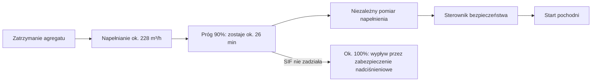

import { SlideContainer, Slide, InstructorNotes, LearningObjective } from '@site/src/components/SlideComponents';

<LearningObjective>

Student rozpoznaje typowe uszkodzenia toru pomiarowego i sposoby ich wykrywania oraz przekłada wymagania z analiz HAZOP i LOPA zbiornika biogazu na specyfikację toru pomiarowego z zapasem czasu dla funkcji bezpieczeństwa.

</LearningObjective>

<SlideContainer>

<Slide title="Jak zawodzi tor pomiarowy" type="warning">

Zestawienie dydaktyczne (ocena własna) — uszkodzenia wzdłuż toru pomiarowego z [części 2](./02-tor-pomiarowy.mdx):

| Uszkodzenie | Przykładowa przyczyna | Co widać w danych bez diagnostyki |
|---|---|---|
| brak sygnału | przerwa w przewodzie, brak zasilania pętli | „0%” albo najniższa wartość, jak przy pustym zbiorniku |
| sygnał zamrożony („zawieszony”) | zacięty czujnik, zamrożony rejestr karty wejść, utrata komunikacji z podtrzymaniem ostatniej wartości | płaska, wiarygodnie wyglądająca linia |
| dryft, utrata wzorcowania | starzenie, temperatura, zabrudzenie | wartość coraz bardziej błędna, ale wiarygodna |
| nasycenie zakresu, błędne skalowanie | zakres dobrany tylko do normalnej pracy, zły przelicznik | stała wartość na granicy zakresu albo wartość „normalna” |
| zakłócenia, utrata zasilania, błąd zegara | zakłócenia elektromagnetyczne, brak zasilania rezerwowego, brak synchronizacji | szum, luka w danych, zdarzenia w złej kolejności |

- SINTEF (PDS Data Handbook, 2021) dzieli uszkodzenia na: **niebezpieczne niewykrywalne (DU)** — niewykrywane automatycznie w chwili wystąpienia, ujawnia je dopiero test funkcjonalny albo żądanie zadziałania; **niebezpieczne wykrywalne (DD)** — wykrywane automatycznie, np. przez autodiagnostykę lub porównanie czujników; **bezpieczne (S)** — powodują fałszywe zadziałanie lub utrzymują urządzenie w stanie bezpiecznym.
- Dane SINTEF dla przetworników z norweskiego przemysłu naftowego i gazowego: **pokrycie diagnostyczne** (DC, ang. diagnostic coverage), czyli udział uszkodzeń niebezpiecznych wykrywanych automatycznie, wynosi 65% dla przetworników ciśnienia i przepływu oraz 70% dla poziomu i temperatury.
- Zatem ok. 30–35% niebezpiecznych uszkodzeń przetwornika czeka ukrytych do testu sprawdzającego albo do rzeczywistego żądania (ocena własna na podstawie SINTEF).
- Przetwornik poziomu ma największe $\lambda_{DU}$ z tych czterech: 1,9 na 10⁶ h, ok. 4 razy więcej niż przetwornik ciśnienia (0,48 na 10⁶ h).
- To są rodzaje uszkodzeń ukrytych i ocena wykrywalności D z [W2, części 3](../wyklad-02-analiza-ryzyka/03-fmea-i-fmeca.mdx) oraz $\lambda_{DU}$ i testy sprawdzające z [W2, części 5](../wyklad-02-analiza-ryzyka/05-lopa-i-sil.mdx).

Źródło: [SINTEF, PDS Data Handbook 2021 — przykładowe strony](https://www.sintef.no/globalassets/project/pds/presentations/pds-data-handbook-2021-example-pages-2021-09-07.pdf); [SINTEF, PDS Data Handbook](https://www.sintef.no/en/publications/publication/0198cc96b219-a6550074-ccb4-478f-b7a2-f7386cca694d/); obliczenia własne

<InstructorNotes>

Czas: ~2,5 min

Zaczynamy od katalogu, bo każde uszkodzenie wygląda w danych inaczej. Przerwa w przewodzie jest łatwa do zauważenia: sygnał spada poniżej zakresu. Groźniejsze są uszkodzenia, które dają wartość wiarygodną, czyli zamrożoną, powoli dryfującą albo źle przeskalowaną. Dane SINTEF pochodzą z przemysłu naftowego i gazowego, a nie z OZE, ale pokazują skalę problemu: autodiagnostyka przetwornika wykrywa około dwóch trzecich uszkodzeń niebezpiecznych, a reszta czeka ukryta do testu sprawdzającego albo do prawdziwego żądania. To dokładnie uszkodzenia ukryte, o których mówiliśmy przy FMEA w W2.

Pytanie do sali: które uszkodzenia z tabeli zauważy operator patrzący tylko na ekran? Typowe nieporozumienie: przetwornik z autodiagnostyką sam zgłosi każde swoje uszkodzenie.

</InstructorNotes>

</Slide>

<Slide title="Sygnalizacja uszkodzeń: NAMUR NE 43 i NE 107" type="info">

- **NE 43** stowarzyszenia NAMUR (Interessengemeinschaft Automatisierungstechnik der Prozessindustrie — stowarzyszenie automatyki przemysłu procesowego) standaryzuje poziom sygnału, którym przetwornik z wyjściem analogowym zgłasza uszkodzenie. Aktualne wydanie: 2021-07-26 (poprzednie: 2003-02-03).
- Wydanie z 2021 r. wprowadziło głównie margines bezpieczeństwa przy wykrywaniu sygnału w systemie sterowania i opisało zachowanie urządzenia podczas inicjalizacji. Wartości tego marginesu nie podajemy: tekst NE 43 jest płatny i go nie czytaliśmy.

| Prąd w pętli | Znaczenie (wg literatury branżowej) | Napięcie na rezystorze 250 Ω |
|---|---|---|
| 3,8–20,5 mA | informacja pomiarowa | 0,95–5,125 V |
| ≤ 3,6 mA | informacja o uszkodzeniu | ≤ 0,9 V |
| ≥ 21 mA | informacja o uszkodzeniu | ≥ 5,25 V |

- Rezystor 250 Ω i zakres 1–5 V dla sygnału 4–20 mA: [część 2](./02-tor-pomiarowy.mdx). Przerwa w pętli daje 0 mA, a zwarcie — prąd powyżej zakresu (ocena własna).
- **NE 107** (wyd. 2025-07-15, zastąpiło wyd. 2017-04-10) dotyczy samokontroli i diagnostyki urządzeń polowych. Opisuje cztery sygnały statusu: awaria (F — ang. Failure), kontrola funkcji (C — ang. Function check), poza specyfikacją (S — ang. Out of specification) i żądanie konserwacji (M — ang. Maintenance request). Wydanie z 2025 r. ujednolica ich kolory i symbole na ekranach i diodach.
- NE 43 ujawnia przerwę i zwarcie, ale nie wykryje wartości zamrożonej ani źle przeskalowanej, bo taka wartość mieści się w paśmie 3,8–20,5 mA (ocena własna).
- Karta wejść i sterownik muszą być skonfigurowane tak, by prąd w paśmie uszkodzenia oznaczał uszkodzenie, a nie „0%” albo „100%” (ocena własna).

Źródło: [NAMUR, NE 43, 2021](https://www.namur.net/en/publications/news-archive/ne-43-has-been-revised.html); [DIN Media, NAMUR NE 43:2021-07-26](https://www.dinmedia.de/en/technical-rule/namur-ne-43/343977319); [Lesman, NE 43 — wartości wg literatury branżowej](https://www.lesman.com/what-does-namur-ne-43-do-for-me); [NAMUR, NE 107, 2025](https://www.namur.net/en/publications/news-archive/ne107-self-monitoring-and-diagnostics-of-field-devices-has-been-revised.html); [NAMUR, NE 107, 2017](https://www.namur.net/en/publications/news-archive/ne-107-has-been-revised.html); obliczenia własne

<InstructorNotes>

Czas: ~2 min

Żywe zero z części drugiej ma drugą stronę: skoro prawidłowy sygnał zaczyna się od 4 mA, przetwornik może zgłosić uszkodzenie prądem spoza pasma pomiarowego. NE 43 porządkuje te poziomy. Wartości w tabeli podaję za literaturą branżową, bo tekst zalecenia jest płatny, a wydanie z 2021 r. wprowadziło margines wykrywania po stronie systemu sterowania. Na rezystorze 250 Ω uszkodzenie to napięcie najwyżej 0,9 V albo co najmniej 5,25 V. NE 107 idzie dalej: urządzenie mówi, czy jest sprawne, czy trwa kontrola funkcji, czy pracuje poza specyfikacją, czy potrzebuje konserwacji.

Pytanie do sali: co pokaże ekran, jeśli karta wejść zamienia 3 mA na 0%? Pusty zbiornik zamiast alarmu. Typowe nieporozumienie: NE 43 wykrywa każde uszkodzenie toru.

</InstructorNotes>

</Slide>

<Slide title="Diagnostyka, porównanie czujników i zasilanie" type="info">

- Kontrole wiarygodności w sterowniku lub w archiwum danych (ocena własna): **zakres** (wartość poza przedziałem pomiarowym), **szybkość zmian** (skok niemożliwy fizycznie), **wartość zamrożona** (brak zmian przez ustaloną liczbę próbek, choć proces powinien się zmieniać), **zgodność z wielkością powiązaną** (np. przy postoju agregatu napełnienie zbiornika musi rosnąć). Jakość danych szerzej — W5.
- **Porównanie czujników**: według definicji SINTEF uszkodzenie niebezpieczne jest wykrywalne (DD), gdy wykrywa je automatycznie np. autodiagnostyka lub porównanie czujników. Drugi, niezależny pomiar przesuwa więc część uszkodzeń z DU do DD (ocena własna na podstawie SINTEF).
- Porównanie nie ujawni błędu wspólnego: dwa identyczne czujniki z tą samą błędną kalibracją albo ze wspólnym zasilaniem zawiodą razem — to uszkodzenie spowodowane wspólną przyczyną (CCF) z [W2, części 4](../wyklad-02-analiza-ryzyka/04-fta-eta-i-bow-tie.mdx).
- **Zasilanie**: IEC 62040-3:2021 (wyd. 3.0) podaje metodę określania parametrów i wymagań badań UPS (Uninterruptible Power Supply — zasilacz bezprzerwowy); tak brzmi tytuł normy.
- Rejestrator i sterownik powinny zapisać utratę własnego zasilania i chwilę jego powrotu, a zapis zdarzeń musi przetrwać awarię, którą ma zarejestrować (ocena własna; w źródłach, z których korzystamy, nie znaleźliśmy takiego wymagania).
- Sygnał życia (ang. heartbeat) rejestratora w SCADA (Supervisory Control and Data Acquisition — system nadzoru i akwizycji danych) odróżnia „brak danych” od „zera” (ocena własna); por. lokalną autonomię z [części 1](./01-cele-architektura-i-czas.mdx) i „zielony ekran” z [W1, części 5](../wyklad-01-zagrozenia-ramy-prawne/05-monitoring-a-warstwy-ochrony.mdx).

Źródło: [SINTEF, PDS Data Handbook 2021 — przykładowe strony](https://www.sintef.no/globalassets/project/pds/presentations/pds-data-handbook-2021-example-pages-2021-09-07.pdf); [IEC 62040-3:2021, próbka normy](https://cdn.standards.iteh.ai/samples/100462/e539fa74c78f44208501e78afde62152/IEC-62040-3-2021.pdf)

<InstructorNotes>

Czas: ~2,5 min

Diagnostyka nie kończy się na przetworniku. W sterowniku albo w archiwum danych możemy sprawdzać, czy wartość mieści się w zakresie, czy nie zmienia się szybciej, niż pozwala fizyka, czy nie stoi w miejscu i czy zgadza się z inną wielkością. Najmocniejszym narzędziem jest drugi, niezależny pomiar: rozbieżność między czujnikami ujawnia uszkodzenie, które pojedynczy czujnik ukrywa. Ale dwa takie same czujniki, wzorcowane tym samym błędnym wzorcem, pokażą ten sam błąd i będą ze sobą zgodne. Z zasilaniem jest podobnie: monitoring, który gaśnie razem z instalacją, nie zapisze przebiegu awarii.

Pytanie do sali: jak odróżnić w SCADA wartość zero od braku danych? Typowe nieporozumienie: dwa czujniki zawsze oznaczają dwa razy większe bezpieczeństwo.

</InstructorNotes>

</Slide>

<Slide title="Buncefield i Texas City: wskazanie, które zawiodło" type="danger">

- **Buncefield, 11.12.2005** (baza paliw w Wielkiej Brytanii; raport brytyjskiego urzędu HSE i agencji środowiskowych, 2011): o 03:05 wskazanie automatycznego miernika poziomu w zbiorniku (ATG, ang. automatic tank gauge) „spłaszczyło się” — przestało rejestrować rosnący poziom, choć zbiornik nadal się napełniał (pkt 11).
- Miernik zaciął się 14 razy między 31.08.2005 (powrót zbiornika do eksploatacji po konserwacji) a 11.12.2005 (pkt 26). Niezależny wyłącznik wysokiego poziomu był w praktyce niesprawny, bo instalujący i obsługa nie rozumieli w pełni kluczowej roli kłódki (pkt 20).
- O 05:37 benzyna zaczęła wypływać przez odpowietrzenia w dachu zbiornika; o 06:01 uruchomiono alarm pożarowy i niemal natychmiast doszło do wybuchu chmury par (pkt 12, 14). Wniosek raportu (pkt 99): systemy ochrony bezpieczeństwa procesowego nie powinny polegać na reakcji operatora na alarmy, a zabezpieczenie przed przepełnieniem powinno być niezależne od zwykłego monitoringu ruchowego.
- **Texas City, 23.03.2005** (rafineria BP; raport CSB — U.S. Chemical Safety and Hazard Investigation Board, 2007; 15 ofiar śmiertelnych, 180 rannych): przetwornik poziomu mierzył w przedziale 5 stóp (1,5 m) w dolnych 9 stopach (2,7 m) kolumny o wysokości 170 stóp (52 m).
- „O 13:04 poziom cieczy w kolumnie wynosił 158 stóp (48 m), ale komputerowy system sterowania wskazywał operatorom, że poziom wynosi 78% zakresu przetwornika poziomu (7,9 stopy, czyli 2,4 m cieczy w kolumnie)” (rys. 6, tłumaczenie własne). Nadmiarowy alarm wysokiego poziomu nie zadziałał, a kolumna nie miała innych wskazań poziomu ani automatycznych zabezpieczeń.
- Wniosek (ocena własna): w obu przypadkach tor pokazywał wartość wiarygodną, ale błędną, a rezerwowe zabezpieczenie miało uszkodzenie ukryte. W Texas City zakres pomiarowy obejmował normalną pracę, a nie awarię. Płaska linia też jest sygnałem.

Źródło: [HSE (COMAH Competent Authority), 2011 — kopia IChemE](https://www.icheme.org/media/10706/buncefield-report.pdf); [HSE, 2011 — archiwum](https://webarchive.nationalarchives.gov.uk/ukgwa/20220701173308mp_/https://www.hse.gov.uk/comah/buncefield/buncefield-report.pdf); [CSB, 2007](https://www.csb.gov/assets/1/20/csbfinalreportbp.pdf)

<InstructorNotes>

Czas: ~2,5 min

Dwa znane wypadki mają wspólny wątek: pomiar poziomu pokazywał wartość, która wyglądała normalnie. W Buncefield miernik zaciął się o 3:05 i do przelania, czyli przez ponad dwie i pół godziny, pokazywał płaską linię, choć zbiornik się napełniał. Zacinał się już wcześniej czternaście razy, a niezależny wyłącznik był w praktyce niesprawny przez niezrozumienie roli kłódki. W Texas City przetwornik mierzył tylko dolne metry wysokiej kolumny, a przy 48 m cieczy system pokazywał 2,4 m. W obu przypadkach rezerwowe zabezpieczenie miało uszkodzenie ukryte.

Pytanie do sali: jaka prosta reguła w archiwum danych zwróciłaby uwagę na problem w Buncefield? Na przykład brak zmian poziomu podczas napełniania; raport nie twierdzi jednak, że zapobiegłaby wypadkowi. Typowe nieporozumienie: brak alarmu oznacza, że proces jest w normie.

</InstructorNotes>

</Slide>

<Slide title="Zbiornik biogazu: od HAZOP i LOPA do specyfikacji" type="success">

Tabela pomiarów z [W2, części 2](../wyklad-02-analiza-ryzyka/02-hazid-i-hazop.mdx) — HAZOP (Hazard and Operability Study — badanie zagrożeń i zdolności do działania) — i funkcja bezpieczeństwa z LOPA (Layer of Protection Analysis — analiza warstw ochrony) zamienione w specyfikację toru pomiarowego:

| Wielkość | Zakres i zasada | Miejsce | Rola | Podstawa |
|---|---|---|---|---|
| napełnienie: pomiar ciągły | 0–100% objętości użytkowej; zasadę dobiera projektant | zbiornik gazu, wskazanie w systemie sterowania | ruchowa: praca agregatu kogeneracyjnego, odbiór gazu | TRAS 2.6.3(3), LfU 2024: ciągły nadzór i wskazanie; reszta: ocena własna |
| napełnienie: minimum i maksimum | osobne urządzenia sygnalizujące, wykonane oddzielnie od pomiaru ciągłego | zbiornik gazu | ochronna: automatyczne włączenie dodatkowego urządzenia zużywającego gaz (np. pochodni) przed wypływem przez zabezpieczenie nadciśnieniowe; wyłączenie odbiorników przy minimum | TRAS 2.6.3(3) |
| ciśnienie w przestrzeni gazowej | zakres według nastaw zabezpieczeń nad- i podciśnieniowych podanych przez producenta | przestrzeń gazowa | ruchowa; zadziałanie zabezpieczenia ma wywołać alarm i zostać zarejestrowane | TRAS 120 (alarm i rejestracja); reszta: ocena własna |
| O₂ w biogazie | typowo 0–2% obj.; przy dozowaniu 6% powietrza ok. 1,2% obj. (W2) | strona tłoczna sprężarki | ruchowa: dozowanie powietrza; w instalacji istniejącej wykrywanie wlotu powietrza | TRAS 1.5.2.2.1, 2.4(8); reszta: ocena własna |
| H₂S w biogazie | do 0,4% obj. = 4000 ppm, więc zakres co najmniej 0–5000 ppm ([część 2](./02-tor-pomiarowy.mdx)) | przed i za odsiarczaniem | ruchowa: odsiarczanie, agregat, adsorber | TRAS 1.5.2.2.1; zakres: ocena własna |
| CH₄ w biogazie | typowo 45–75% obj., więc zakres do 100% obj.; czujnik katalityczny mierzy tylko do DGW | surowy gaz, zasilanie agregatu | ruchowa: jakość gazu, kontrola wiarygodności pomiaru O₂ | TRAS 1.5.2.2.1; DGUV T 023, tabl. 1; reszta: ocena własna |

- Pomiar ciągły i urządzenia minimum i maksimum to **dwa osobne tory pomiarowe**. TRAS wymaga ich rozdzielenia; to ta sama niezależność, której LOPA wymaga od SIF (Safety Instrumented Function — przyrządowa funkcja bezpieczeństwa) w [W2, części 5](../wyklad-02-analiza-ryzyka/05-lopa-i-sil.mdx) (ocena własna).
- W źródłach, z których korzystamy (TRAS 120, SVLFG TI 4, DGUV T 021 i T 023, BMWFJ 2012, LfU 2024), nie ma wymaganej dokładności tych pomiarów. Dokładność wynika z celu i z zapasu czasu — następny slajd.
- **Analizator procesowy** to nie **detektor gazu** (urządzenie ostrzegawcze): T 021 i T 023 dotyczą gazów w powietrzu, a przy pomiarach gazów procesowych T 021 każe zapytać producenta. SVLFG TI 4 (3.6.1.5) wymaga detekcji gazu w pomieszczeniu agregatu; H₂S i CH₄ w powietrzu, dobór detektorów i nastawy — W9.

Źródło: [KAS, TRAS 120](https://www.kas-bmu.de/files/publikationen/TRAS/TRAS%20(endgueltige%20Fassung)/LesefassTRAS120.pdf); [LfU Bayern, 2024](https://www.lfu.bayern.de/energie/biogashandbuch/doc/kap222.pdf); [SVLFG, TI 4](https://cdn.svlfg.de/fiona8-blobs/public/svlfgonpremiseproduction/45b79757c1f38081/ce7f71d90169/ti04-sicherheitsregeln-biogasanlagen.pdf); [DGUV, T 023](https://res.jedermann.de/data/downloads/T023_Gesamtdokument.pdf); [DGUV, T 021](https://res.jedermann.de/data/downloads/T021_Gesamtdokument.pdf); [BMWFJ, 2012](https://www.land-oberoesterreich.gv.at/Mediendateien/Formulare/Dokumente%20UWD%20Abt_AUWR/AUWR_BMWFJ_Grundlage_Technisch_Biogasanlage.pdf); obliczenia własne

<InstructorNotes>

Czas: ~3 min

Tu spłacamy obietnicę z W2. Tabela z HAZOP mówiła, co mierzyć i gdzie; teraz dopisujemy zakres i rolę każdego pomiaru. Najważniejszy jest podział napełnienia na dwa tory. Pomiar ciągły służy do prowadzenia instalacji, a osobne urządzenia minimum i maksimum uruchamiają pochodnię albo wyłączają odbiorniki. TRAS wymaga, by były wykonane oddzielnie, a austriacka wytyczna z 2012 r. dodaje niezależną kontrolę wzrokową, np. wziernikiem albo wskaźnikiem linkowym. Uczciwie mówię też, czego nie wiemy: żadne z tych źródeł nie podaje wymaganej dokładności.

Pytanie do sali: dlaczego analizator H₂S w biogazie nie może służyć jako detektor H₂S w powietrzu? Inne stężenia, inne przyrządy, inny cel. Typowe nieporozumienie: im więcej pomiarów składu gazu, tym bezpieczniejszy zbiornik.

</InstructorNotes>

</Slide>

<Slide title="Przykład: ile czasu daje zbiornik biogazu" type="tip">

**Przykład ilustracyjny — dane umowne.** Zbiornik z przykładu LOPA w [W2, części 5](../wyklad-02-analiza-ryzyka/05-lopa-i-sil.mdx); parametry agregatu, objętość i progi przyjęto umownie, wartość opałowa metanu to stała z tablic, a niepewność pochodzi z budżetu w [części 3](./03-niepewnosc-i-wzorcowanie.mdx).

- Założenia: agregat kogeneracyjny o mocy elektrycznej 500 kW i sprawności elektrycznej 0,40; biogaz z 55% obj. CH₄ (w zakresie 45–75% obj. wg TRAS 120); wartość opałowa metanu ok. 9,97 kWh/m³ w warunkach normalnych; objętość użytkowa zbiornika 1000 m³.
- Po zatrzymaniu agregatu fermentacja trwa i zbiornik się napełnia. Moc w paliwie 500 kW / 0,40 = 1250 kW, strumień metanu 1250 / 9,97 ≈ 125,4 m³/h, strumień biogazu:

$$
\dot{V}_{bg} = \frac{P_{el}}{\eta_{el}\, H_u\, x_{CH_4}} = \frac{500}{0{,}40 \cdot 9{,}97 \cdot 0{,}55}\ \frac{\text{m}^3}{\text{h}} \approx 228\ \frac{\text{m}^3}{\text{h}}
$$

- Próg SIF: 90% napełnienia; zabezpieczenie nadciśnieniowe działa przy ok. 100%. Zostaje 100 m³, czyli 100/228 h ≈ **26 min** na pomiar, logikę i start pochodni.
- Niepewność toru napełnienia U ≈ 1,4% zakresu (dokładniej 1,36%, k = 2) to ok. 14 m³ (13,6 m³), czyli ok. **3,6 min** zapasu. Tor o niepewności 5% zakresu zabrałby 50 m³, czyli ok. **13 min** — połowę zapasu.

- **Czas bezpieczeństwa procesu** (ang. process safety time): definicja IEC 61511-1 w brzmieniu cytowanym przez Beharrysingha i in. (2018) — okres między uszkodzeniem w procesie lub w podstawowym systemie sterowania procesem (mogącym doprowadzić do zdarzenia niebezpiecznego) a wystąpieniem zdarzenia niebezpiecznego, jeśli przyrządowa funkcja bezpieczeństwa nie zostanie wykonana (tłumaczenie własne).
- Wniosek (ocena własna): czas zadziałania SIF ze specyfikacji ([W2, część 6](../wyklad-02-analiza-ryzyka/06-podsumowanie.mdx)) musi być wyraźnie krótszy niż zapas, a niezależność urządzenia maksimum jest ważniejsza niż jego precyzja (Buncefield).

Źródło: [KAS, TRAS 120](https://www.kas-bmu.de/files/publikationen/TRAS/TRAS%20(endgueltige%20Fassung)/LesefassTRAS120.pdf); [Beharrysingh i in., 2018](https://oaktrust.library.tamu.edu/server/api/core/bitstreams/5553932f-d7dc-46c4-afdd-aa09a086fe66/content); obliczenia własne

<InstructorNotes>

Czas: ~3 min

Liczymy, ile czasu daje zbiornik. Agregat staje, fermentacja trwa, więc zbiornik napełnia się strumieniem około 228 m³ na godzinę. Jeśli funkcja bezpieczeństwa zadziała przy 90%, a zabezpieczenie nadciśnieniowe przy około 100%, zostaje 100 m³, czyli około 26 minut. Czas bezpieczeństwa procesu biegnie wprawdzie od zatrzymania agregatu, ale funkcja może zadziałać dopiero po osiągnięciu progu, więc w praktyce liczy się ten zapas. Niepewność toru z części trzeciej kosztuje około 3,6 minuty, a tor o niepewności 5% zabrałby połowę zapasu. Dokładność przekłada się więc wprost na czas.

Pytanie do sali: co jest groźniejsze, niepewność 1,4% czy urządzenie maksimum, które nie zadziała? Typowe nieporozumienie: dokładniejszy czujnik zastępuje niezależny.

</InstructorNotes>

</Slide>

<Slide title="Pomiary składu gazu i czas odpowiedzi" type="info">

- DGUV T 023 (DGUV Information 213-057, stan: październik 2023) rozróżnia **czas ustalania wskazania** $t_x$ (niem. Einstellzeit) — od nagłej zmiany z czystego powietrza na gaz wzorcowy (lub odwrotnie) na wejściu przyrządu do chwili, gdy wskazanie osiągnie ustaloną część x wskazania końcowego ($t_{90}$: 90%) — oraz **czas reakcji** (niem. Ansprechzeit) do zaobserwowania określonej reakcji, np. wskazania lub alarmu. Czas reakcji zależy od $t_x$ i od sposobu doprowadzenia próbki.
- Linie poboru próbki wydłużają czas do alarmu zależnie od długości, więc mają być jak najkrótsze (T 023, T 021). Pomiar nieciągły, np. z przełącznikiem punktów pomiarowych, wydłuża ten czas o maksymalny czas cyklu (T 023).
- Przy ustalaniu progów alarmowych uwzględnia się opóźnienia: transport gazu, czas ustalania wskazania i czas, po którym środek ochronny zaczyna działać (T 023).
- Kondensat może zatkać linię poboru próbki, a niektóre gazy adsorbują się na powierzchniach, więc stężenie w próbce spada (T 023). Wymianę czujnika elektrochemicznego zaleca się zwykle, gdy jego czułość spadnie poniżej 50% początkowej (T 021; dotyczy detektorów w powietrzu, dla analizatora procesowego to analogia).

**Przykład ilustracyjny — dane umowne.** Czas transportu próbki w linii o wymiarach i przepływie przyjętych umownie: $t = V/Q = \dfrac{\pi d^2 L / 4}{Q}$.

| Linia poboru próbki | Objętość | Przepływ | Czas transportu |
|---|---|---|---|
| d = 4 mm, L = 20 m | 0,25 l | 1 l/min | ok. 15 s |
| d = 6 mm, L = 50 m | 1,41 l | 0,5 l/min | ok. 170 s ≈ 2,8 min |

- Wniosek (ocena własna): ekstrakcyjna analiza gazu wystarcza do sterowania (dozowanie powietrza, jakość gazu), ale jest zbyt wolna i pośrednia, by być główną warstwą ochrony zbiornika. Tę rolę pełni pomiar napełnienia z ograniczeniem poboru gazu, a pomiar O₂ jest rozwiązaniem TRAS 120 (2.4(8)) dla instalacji istniejących. Dobór detektorów i nastawy — W9.

Źródło: [DGUV, T 023](https://res.jedermann.de/data/downloads/T023_Gesamtdokument.pdf); [DGUV, T 023 — strona wydawcy](https://publikationen.dguv.de/regelwerk/dguv-informationen/283/gaswarneinrichtungen-fuer-den-explosionsschutz-einsatz-und-betrieb); [DGUV, T 021](https://res.jedermann.de/data/downloads/T021_Gesamtdokument.pdf); [KAS, TRAS 120](https://www.kas-bmu.de/files/publikationen/TRAS/TRAS%20(endgueltige%20Fassung)/LesefassTRAS120.pdf); obliczenia własne

<InstructorNotes>

Czas: ~2,5 min

Skład gazu mierzymy zwykle ekstrakcyjnie: pompka zasysa próbkę linią do analizatora. Każdy element tego toru dodaje opóźnienie. Proste rachunki pokazują, że krótka i cienka linia daje kilkanaście sekund, a dłuższa i szersza przy małym przepływie prawie trzy minuty. Do tego dochodzi czas ustalania wskazania analizatora, a przy przełączaniu punktów pomiarowych cały cykl. Kondensat i adsorpcja mogą dodatkowo zaniżać wynik. Dla sterowania dozowaniem powietrza to nie problem, dla ochrony zbiornika tak, dlatego główną ochronę daje napełnienie, a nie skład gazu.

Pytanie do sali: jak sprawdzić rzeczywisty czas reakcji całego toru? Podać gaz wzorcowy na wejściu linii i zmierzyć czas. Typowe nieporozumienie: czas z karty katalogowej analizatora to czas całego toru.

</InstructorNotes>

</Slide>

</SlideContainer>

## Źródła

1. SINTEF (2021). *Reliability Data for Safety Equipment — PDS Data Handbook, 2021 Edition*. [https://www.sintef.no/en/publications/publication/0198cc96b219-a6550074-ccb4-478f-b7a2-f7386cca694d/](https://www.sintef.no/en/publications/publication/0198cc96b219-a6550074-ccb4-478f-b7a2-f7386cca694d/); przykładowe strony (2021-09-07): [https://www.sintef.no/globalassets/project/pds/presentations/pds-data-handbook-2021-example-pages-2021-09-07.pdf](https://www.sintef.no/globalassets/project/pds/presentations/pds-data-handbook-2021-example-pages-2021-09-07.pdf)
2. NAMUR (2021). *NE 43 has been revised* (NE 43 „Standardization of the Signal Level for the Failure Information of Digital Transmitters”, wyd. 2021-07-26). [https://www.namur.net/en/publications/news-archive/ne-43-has-been-revised.html](https://www.namur.net/en/publications/news-archive/ne-43-has-been-revised.html)
3. DIN Media (b.d.). *NAMUR NE 43:2021-07-26* — karta katalogowa. [https://www.dinmedia.de/en/technical-rule/namur-ne-43/343977319](https://www.dinmedia.de/en/technical-rule/namur-ne-43/343977319)
4. Lesman Instrument Company (b.d.). *What does NAMUR NE 43 do for me?* (strona dystrybutora; poziomy sygnału wg literatury branżowej). [https://www.lesman.com/what-does-namur-ne-43-do-for-me](https://www.lesman.com/what-does-namur-ne-43-do-for-me)
5. NAMUR (2025). *NE107 „Self-monitoring and diagnostics of field devices” has been revised* (wyd. 2025-07-15). [https://www.namur.net/en/publications/news-archive/ne107-self-monitoring-and-diagnostics-of-field-devices-has-been-revised.html](https://www.namur.net/en/publications/news-archive/ne107-self-monitoring-and-diagnostics-of-field-devices-has-been-revised.html)
6. NAMUR (2017). *NE 107 has been revised* (wyd. 2017-04-10). [https://www.namur.net/en/publications/news-archive/ne-107-has-been-revised.html](https://www.namur.net/en/publications/news-archive/ne-107-has-been-revised.html)
7. IEC (2021). *IEC 62040-3:2021 Uninterruptible power systems (UPS) — Part 3: Method of specifying the performance and test requirements*, wyd. 3.0, próbka normy (iTeh). [https://cdn.standards.iteh.ai/samples/100462/e539fa74c78f44208501e78afde62152/IEC-62040-3-2021.pdf](https://cdn.standards.iteh.ai/samples/100462/e539fa74c78f44208501e78afde62152/IEC-62040-3-2021.pdf)
8. COMAH Competent Authority (HSE, Environment Agency, SEPA) (2011). *Buncefield: Why did it happen? The underlying causes of the explosion and fire at the Buncefield oil storage depot, Hemel Hempstead, Hertfordshire on 11 December 2005*. HSE; kopia udostępniona przez IChemE: [https://www.icheme.org/media/10706/buncefield-report.pdf](https://www.icheme.org/media/10706/buncefield-report.pdf); archiwum HSE: [https://webarchive.nationalarchives.gov.uk/ukgwa/20220701173308mp_/https://www.hse.gov.uk/comah/buncefield/buncefield-report.pdf](https://webarchive.nationalarchives.gov.uk/ukgwa/20220701173308mp_/https://www.hse.gov.uk/comah/buncefield/buncefield-report.pdf)
9. U.S. Chemical Safety and Hazard Investigation Board (2007). *Investigation Report: Refinery Explosion and Fire, BP Texas City, Texas, March 23, 2005*, raport nr 2005-04-I-TX. [https://www.csb.gov/assets/1/20/csbfinalreportbp.pdf](https://www.csb.gov/assets/1/20/csbfinalreportbp.pdf)
10. Kommission für Anlagensicherheit (2019). *TRAS 120 — Sicherheitstechnische Anforderungen an Biogasanlagen* (Lesefassung). [https://www.kas-bmu.de/files/publikationen/TRAS/TRAS%20(endgueltige%20Fassung)/LesefassTRAS120.pdf](https://www.kas-bmu.de/files/publikationen/TRAS/TRAS%20(endgueltige%20Fassung)/LesefassTRAS120.pdf)
11. Bayerisches Landesamt für Umwelt (2024). *Biogashandbuch Bayern, Kap. 2.2.2 Immissionsschutz, einschließlich Klimaschutz* (stan: lipiec 2024). [https://www.lfu.bayern.de/energie/biogashandbuch/doc/kap222.pdf](https://www.lfu.bayern.de/energie/biogashandbuch/doc/kap222.pdf)
12. SVLFG (2015). *Technische Information 4 — Sicherheitsregeln für Biogasanlagen* (stan: listopad 2015, wg pobranego pliku). [https://cdn.svlfg.de/fiona8-blobs/public/svlfgonpremiseproduction/45b79757c1f38081/ce7f71d90169/ti04-sicherheitsregeln-biogasanlagen.pdf](https://cdn.svlfg.de/fiona8-blobs/public/svlfgonpremiseproduction/45b79757c1f38081/ce7f71d90169/ti04-sicherheitsregeln-biogasanlagen.pdf)
13. DGUV, BG RCI (2023). *DGUV Information 213-057 (Merkblatt T 023) Gaswarneinrichtungen und -geräte für den Explosionsschutz — Einsatz und Betrieb* (stan: październik 2023). [https://res.jedermann.de/data/downloads/T023_Gesamtdokument.pdf](https://res.jedermann.de/data/downloads/T023_Gesamtdokument.pdf); strona DGUV: [https://publikationen.dguv.de/regelwerk/dguv-informationen/283/gaswarneinrichtungen-fuer-den-explosionsschutz-einsatz-und-betrieb](https://publikationen.dguv.de/regelwerk/dguv-informationen/283/gaswarneinrichtungen-fuer-den-explosionsschutz-einsatz-und-betrieb)
14. DGUV, BG RCI (2023). *DGUV Information 213-056 (Merkblatt T 021) Gaswarneinrichtungen und -geräte für toxische Gase/Dämpfe und Sauerstoff — Einsatz und Betrieb* (stan: październik 2023). [https://res.jedermann.de/data/downloads/T021_Gesamtdokument.pdf](https://res.jedermann.de/data/downloads/T021_Gesamtdokument.pdf); strona DGUV: [https://publikationen.dguv.de/regelwerk/dguv-informationen/621/gaswarneinrichtungen-fuer-toxische-gase/daempfe-und-sauerstoff-einsatz-und-betrieb-merkblatt-t-021](https://publikationen.dguv.de/regelwerk/dguv-informationen/621/gaswarneinrichtungen-fuer-toxische-gase/daempfe-und-sauerstoff-einsatz-und-betrieb-merkblatt-t-021)
15. BMWFJ (2012). *Technische Grundlage für die Beurteilung von Biogasanlagen*. Bundesministerium für Wirtschaft, Familie und Jugend (Austria); plik udostępniony przez Land Oberösterreich. [https://www.land-oberoesterreich.gv.at/Mediendateien/Formulare/Dokumente%20UWD%20Abt_AUWR/AUWR_BMWFJ_Grundlage_Technisch_Biogasanlage.pdf](https://www.land-oberoesterreich.gv.at/Mediendateien/Formulare/Dokumente%20UWD%20Abt_AUWR/AUWR_BMWFJ_Grundlage_Technisch_Biogasanlage.pdf)
16. Beharrysingh A., Hernandez M., Ng C., Maher C. (2018). Process Safety Time Analysis for Upstream Facilities. 21st Annual International Symposium, Mary Kay O'Connor Process Safety Center, Texas A&M University. [https://oaktrust.library.tamu.edu/server/api/core/bitstreams/5553932f-d7dc-46c4-afdd-aa09a086fe66/content](https://oaktrust.library.tamu.edu/server/api/core/bitstreams/5553932f-d7dc-46c4-afdd-aa09a086fe66/content)
