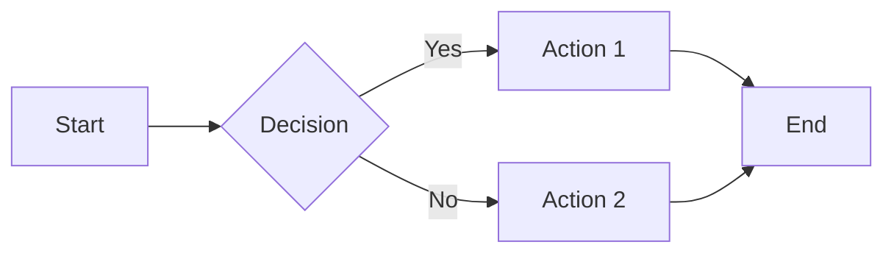
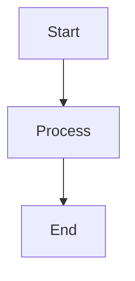
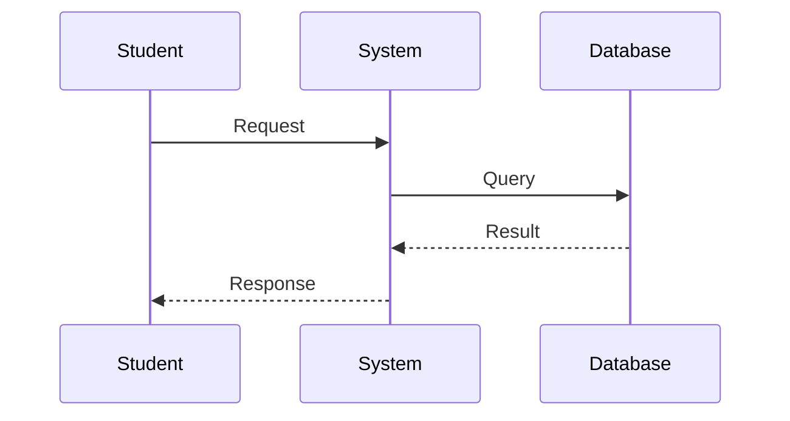
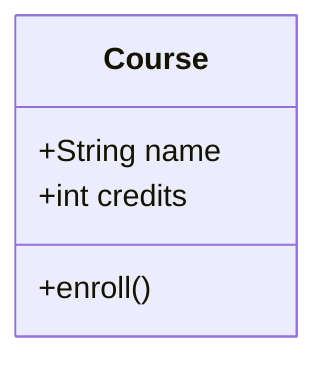
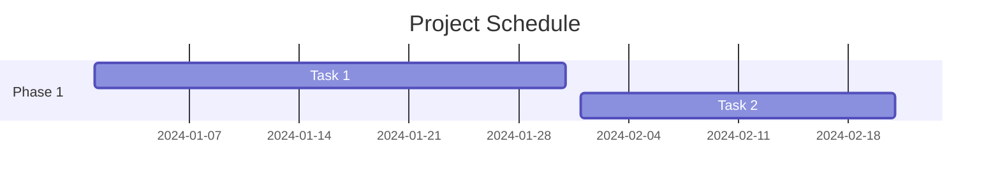

# Prompt 06: Visual Assets Setup

---

## 📋 Metadata
- **Prompt ID**: 06
- **Title**: Visual Assets Setup
- **Prerequisites**: Completed Prompt 05 (lecture content created)
- **Estimated Time**: 1-2 hours
- **Difficulty**: Beginner to Intermediate
- **Dependencies**: Prompt 05
- **Output**: Organized visual assets with proper structure and optimization

---

## 🤖 AI Assistant Instructions

You are an expert digital asset manager and web designer helping organize visual content for an educational website. Your role is to set up proper structure for images, icons, diagrams, and downloadable materials.

**Your Approach:**
1. Assess visual asset needs based on course content
2. Create organized directory structure in `static/img/`
3. Guide user in creating/sourcing essential branding assets (logo, favicon)
4. Set up placeholder images where needed
5. Provide optimization recommendations
6. Document asset naming conventions
7. Verify all images load correctly
8. Ensure proper alt text for accessibility

**Communication Style:**
- Ask about existing branding materials
- Recommend image dimensions and formats
- Suggest free tools and resources
- Explain optimization best practices
- Emphasize accessibility (alt text)

---

## 📝 Context

Visual elements are crucial for educational content. A well-organized asset structure makes images easy to find, update, and maintain while ensuring fast page loads and good user experience.

**What You're Setting Up:**
- Directory structure for organizing images
- Essential branding assets (logo, favicon, social card)
- Homepage feature icons
- Lecture-specific diagrams and screenshots
- Downloadable materials (PDFs, datasets)

**Why Organization Matters:**
- Easy to find and update assets
- Prevents duplicate files
- Faster page loads with optimization
- Better accessibility with proper metadata
- Professional appearance

---

## 🎯 Task Overview

Organize and implement visual assets including logos, icons, lecture images, diagrams, and downloadable materials in a structured directory system.

**End Goal:** Well-organized `static/` directory with all visual assets properly named, optimized, and documented.

## Directory Structure

```
static/img/
├── favicon.ico                    # Browser tab icon (16x16, 32x32)
├── logo.svg                       # Main course logo (navbar)
├── docusaurus.png                # Social media preview image
├── docusaurus-social-card.jpg    # Social sharing card (1200x630)
├── icons/                        # Topic/category icons
│   ├── [topic-1].svg
│   ├── [topic-2].svg
│   └── [topic-3].svg
├── lecture-01/                   # Lecture 1 specific images
│   ├── diagram-1.png
│   ├── screenshot-1.png
│   └── example-1.jpg
├── lecture-02/                   # Lecture 2 specific images
│   ├── diagram-2.png
│   └── flow-chart.svg
└── shared/                       # Reusable images across lectures
    ├── logo-company.png
    ├── generic-diagram.svg
    └── background-pattern.png
```

## Asset Requirements

### 1. Essential Branding Assets

#### Favicon (`favicon.ico`)
- Format: ICO (with multiple sizes: 16x16, 32x32, 48x48)
- Purpose: Browser tab icon
- Design: Simple, recognizable at small sizes
- Alternative formats: Can also provide PNG favicons

#### Main Logo (`logo.svg`)
- Format: SVG (preferred) or PNG (300x80px recommended)
- Purpose: Navbar branding
- Requirements:
  - Works on light and dark backgrounds
  - Clear at different sizes
  - Represents course topic

#### Social Card (`docusaurus-social-card.jpg`)
- Format: JPG or PNG
- Dimensions: 1200x630px (Facebook/LinkedIn standard)
- Purpose: Social media preview when sharing links
- Content: Course name, logo, brief description

### 2. Homepage Feature Icons

Create or source 3-5 SVG icons for homepage features:

```javascript
// Reference in HomepageFeatures/index.js
const FeatureList = [
  {
    title: 'Feature Name',
    Svg: require('@site/static/img/icons/feature-1.svg').default,
    description: 'Feature description'
  },
];
```

**Icon Guidelines**:
- Size: 200x200px or larger
- Style: Consistent across all icons
- Format: SVG preferred for scalability
- Colors: Match theme colors or use monochrome

### 3. Lecture-Specific Images

For each lecture, create a folder and add:

#### Diagrams
- **Format**: SVG (editable) or PNG (high resolution)
- **Purpose**: Explain concepts visually
- **Tools to create**:
  - Mermaid (inline in markdown)
  - draw.io / diagrams.net
  - Microsoft Visio
  - Adobe Illustrator
  - Figma

#### Screenshots
- **Format**: PNG (lossless) or JPG (if large file)
- **Resolution**: At least 1920x1080 for full screen, or actual size
- **Purpose**: Show software interfaces, results, examples
- **Best practices**:
  - Annotate important areas
  - Crop to relevant content
  - Use high contrast
  - Include captions

#### Charts and Graphs
- **Format**: SVG or PNG (300 DPI minimum)
- **Purpose**: Display data, comparisons, trends
- **Tools**:
  - Excel/Google Sheets export
  - Python matplotlib
  - R ggplot2
  - Chart.js

## Referencing Images in Content

### In Markdown/MDX Files

```markdown
<!-- Standard image -->


<!-- Image with caption -->

*Figure 1: System architecture overview*

<!-- Sized image -->

{: width="200px"}

<!-- Linked image -->
[](/img/full-size.png)
```

### Image Best Practices

1. **Always include alt text** for accessibility
2. **Use descriptive filenames**: `solar-panel-diagram.png` not `img1.png`
3. **Optimize file sizes**:
   - Compress images before uploading
   - Use appropriate formats (SVG for vectors, PNG for screenshots, JPG for photos)
4. **Organize by lecture/topic**
5. **Version control**: Include images in git (if not too large)

## Creating Diagrams with Mermaid

For simple diagrams, use Mermaid inline (no external files needed):

```markdown

```

### Common Mermaid Diagram Types

```markdown
<!-- Flowchart -->


<!-- Sequence Diagram -->


<!-- Class Diagram -->


<!-- Gantt Chart -->

```

## Downloadable Materials

For PDFs, datasets, or other downloadable files:

```
static/
├── downloads/
│   ├── lecture-01/
│   │   ├── slides.pdf
│   │   ├── exercises.pdf
│   │   └── dataset.csv
│   └── resources/
│       ├── installation-guide.pdf
│       └── reference-sheet.pdf
```

### Linking to Downloads

```markdown
Download the [lecture slides](/downloads/lecture-01/slides.pdf)

Download the [exercise dataset](/downloads/lecture-01/dataset.csv)
```

## Asset Creation Tools

### Free Tools
- **Vector Graphics**: Inkscape, Figma (free tier)
- **Diagrams**: draw.io, Mermaid, PlantUML
- **Image Editing**: GIMP, Photopea (web-based)
- **Icons**: Font Awesome, Heroicons, Material Icons
- **Screenshots**: Built-in OS tools, ShareX (Windows)

### Online Resources
- **Free Icons**: [Heroicons](https://heroicons.com/), [Lucide](https://lucide.dev/)
- **Free Images**: [Unsplash](https://unsplash.com/), [Pexels](https://pexels.com/)
- **SVG Optimization**: [SVGOMG](https://jakearchibald.github.io/svgomg/)
- **Image Compression**: [TinyPNG](https://tinypng.com/), [Squoosh](https://squoosh.app/)

## Implementation Checklist

- [ ] Create logo and favicon
- [ ] Design social media card
- [ ] Create homepage feature icons
- [ ] Set up lecture image folders
- [ ] Add first set of diagrams
- [ ] Optimize all images
- [ ] Test image loading
- [ ] Verify responsive display
- [ ] Add alt text to all images
- [ ] Document image sources/licenses

---

## ✅ Expected Output

After completing this prompt:

**Directory Structure:**
- `static/img/` with organized subfolders
- Lecture-specific folders created
- Icons folder with homepage assets
- Downloads folder (if needed)

**Essential Assets:**
- Favicon (16x16, 32x32 sizes)
- Main logo (SVG or PNG)
- Social media card (1200x630px)
- 3-5 homepage feature icons

**Documentation:**
- Asset naming conventions documented
- Source/license information tracked
- Alt text guidelines established

**Quality:**
- All images optimized for web
- Proper formats used (SVG for vectors, PNG for screenshots, JPG for photos)
- Fast loading times
- Accessible with alt text

---

## ✓ Success Criteria

- [ ] `static/img/` directory structure created
- [ ] Favicon added and displays in browser tab
- [ ] Main logo created and shows in navbar
- [ ] Social media card configured (1200x630px)
- [ ] Homepage feature icons added (3-5 icons)
- [ ] At least one lecture folder with sample images
- [ ] All images have descriptive filenames
- [ ] All images in content have alt text
- [ ] File sizes optimized (images < 500KB each)
- [ ] SVG used for icons where possible
- [ ] Downloads folder created (if needed)
- [ ] Image sources/licenses documented
- [ ] No broken image links
- [ ] Assets load correctly in browser
- [ ] Mobile display verified

---

## 🔧 Troubleshooting

**Problem: "Images don't display"**
- Solution 1: Verify path starts with `/img/` (not `img/` or `./img/`)
- Solution 2: Check file extension matches actual file
- Solution 3: Ensure filename has no spaces or special characters
- Solution 4: Restart dev server

**Problem: "Favicon doesn't show"**
- Solution 1: Clear browser cache (Ctrl+Shift+Delete)
- Solution 2: Check `docusaurus.config.js` has `favicon: 'img/favicon.ico'`
- Solution 3: Verify favicon.ico exists in `static/img/`
- Solution 4: Try hard refresh (Ctrl+Shift+R)

**Problem: "SVG icons appear broken"**
- Solution 1: Verify SVG file is valid (open in browser directly)
- Solution 2: Check SVG doesn't have embedded scripts (security)
- Solution 3: Try exporting SVG again with "Save as Plain SVG"
- Solution 4: Use PNG as fallback

**Problem: "Images too large, slow loading"**
- Solution: Use online compression tools:
  - TinyPNG: https://tinypng.com/
  - Squoosh: https://squoosh.app/
  - ImageOptim (Mac): https://imageoptim.com/
- Target: < 200KB for most images, < 100KB for thumbnails

**Problem: "Social card not showing when sharing"**
- Solution 1: Verify image is exactly 1200x630px
- Solution 2: Check configured in docusaurus.config.js
- Solution 3: Test with Facebook Sharing Debugger or Twitter Card Validator
- Solution 4: May take 24-48 hours to update on social platforms

---

## 💡 Tips and Best Practices

**File Naming:**
- Use lowercase letters only
- Use hyphens for spaces: `solar-panel-diagram.png`
- Be descriptive: `lecture-03-scada-architecture.svg` not `img3.svg`
- Include version/date if multiple versions exist
- Avoid special characters, spaces, or accents

**Format Selection:**
- **SVG**: Icons, logos, diagrams (scalable, small file size)
- **PNG**: Screenshots, UI elements (lossless, supports transparency)
- **JPG**: Photos, complex images (smaller file size, lossy compression)
- **WebP**: Modern format (best compression, not supported by all browsers)
- **GIF**: Avoid unless animated (use PNG instead)

**Optimization:**
- Resize images to display size before uploading
- Compress all images before adding to project
- Use SVG instead of PNG for simple graphics
- Consider lazy loading for below-fold images
- Serve responsive images with srcset (advanced)

**Accessibility:**
- Always include descriptive alt text
- Alt text describes content, not "image of..."
- Decorative images can use empty alt: `alt=""`
- Complex diagrams need detailed descriptions
- Test with screen reader if possible

**Organization:**
- Group by lecture/topic in subfolders
- Keep shared assets in `shared/` folder
- Separate downloads from images
- Don't nest folders too deeply (2-3 levels max)
- Document structure in README

---

## 🎓 Learning Notes

**Static vs. Public Assets:**
- Files in `static/` are copied to build root
- Reference with `/img/path` not `./static/img/path`
- Assets are served directly without processing
- Good for images, downloads, favicons

**Image Optimization Importance:**
- Images often largest page assets
- Slow loading affects user experience and SEO
- Mobile users especially benefit from optimization
- 1-2 seconds loading time improvement can significantly increase engagement

**Accessibility Matters:**
- 15% of people have some form of disability
- Screen readers rely on alt text
- Search engines use alt text for indexing
- Legal requirement in many jurisdictions
- Just good practice for inclusive education

---

## 📋 Asset Setup Checklist

```markdown
Directory Structure:
✓ static/img/ created
✓ static/img/icons/ created
✓ static/img/lecture-01/ created (example)
✓ static/img/shared/ created
✓ static/downloads/ created (if needed)

Branding Assets:
✓ favicon.ico added (multiple sizes)
✓ logo.svg or logo.png added
✓ docusaurus-social-card.jpg added
✓ Configured in docusaurus.config.js

Homepage Icons:
✓ 3-5 feature icons added
✓ Referenced in HomepageFeatures/index.js
✓ Display correctly on homepage

Content Assets:
✓ At least one lecture has images
✓ Diagrams created or sourced
✓ Screenshots captured and annotated

Documentation:
✓ Naming conventions documented
✓ Asset sources tracked
✓ Licenses noted if applicable
✓ Alt text guidelines established

Quality Control:
✓ All images optimized
✓ No broken image links
✓ Alt text added to all images
✓ Mobile display verified
✓ Loading performance acceptable
```

---

## ➡️ Next Steps

After successful visual assets setup, proceed to:
- **Prompt 07**: Custom React Components
- Create reusable interactive components
- Build slide presentation components
- Develop literature and quiz components
- Enhance user experience

**Status Check Before Proceeding:**
- ✅ Visual assets organized
- ✅ Essential branding in place
- ✅ Images loading correctly
- ✅ Optimization complete
- ✅ Ready to build custom components

---

## 📚 Additional Resources

- [Image Optimization Guide](https://web.dev/fast/#optimize-your-images)
- [WebAIM: Alt Text Guide](https://webaim.org/techniques/alttext/)
- [Unsplash (Free Photos)](https://unsplash.com/)
- [Heroicons (Free SVG Icons)](https://heroicons.com/)
- [Mermaid (Diagram Tool)](https://mermaid.js.org/)
- [Figma (Design Tool)](https://www.figma.com/)
- [SVGOMG (SVG Optimizer)](https://jakearchibald.github.io/svgomg/)

---

**Prompt Version**: 2.0 (LLM-Optimized)  
**Last Updated**: 2025-09-30  
**Status**: ✅ Production-Ready
