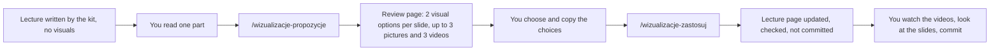

# Visualisations, pictures and videos for lecture parts

How the lecturer adds visuals to a lecture after it has been written. Agreed on 29.09.2026. Not part of the website (Docusaurus only builds `bezp-monit/`).



## What was agreed

1. **Candidates go on a separate review page**, never hidden inside the real slide. The review page is a draft (`docs/propozycje/`, git-ignored), visible only in `npm start`.
2. **Two visual options per slide that differ in kind**, e.g. a static diagram and an interactive component.
3. **Pictures only where a photo shows what a diagram cannot**: real equipment, markings, damage, scale. Each candidate says in one sentence what the student learns from it.
4. **Videos**: as many and as long as they are relevant; **no time limit**. Each video's time is added to the slide's "Czas", and the lecture's timing table shows the real total, also above 90 minutes. Nothing is cut automatically.
5. **Licences**: a picture is embedded only with a free licence (CC0, public domain, CC BY, CC BY-SA, Unsplash, Pexels) and full attribution; everything else becomes a link card.
6. **Videos are embedded, never copied**, and marked "nieobejrzany" until you have watched the fragment.
7. **Both steps run in Claude Code on your computer**, which has a normal internet connection (the cloud chats cannot reach Wikimedia Commons or YouTube).

## Once: set up Claude Code

- The two commands and the agent are installed in `.claude/skills/` and `.claude/agents/` (since 30.09.2026).
- Open a terminal in `D:\code\KIOZE-sys-bez-monit` and start `claude`. Claude Code loads `CLAUDE.md`, the two skills in `.claude/skills/` and the agent in `.claude/agents/`. Type `/wiz`: both commands appear in the suggestions; `/agents` lists `media-researcher`.
- `bezp-monit/node_modules` must exist (`npm ci` in `bezp-monit/`, as for `npm start`).
- Optional, fewer permission prompts: add to `.claude/settings.local.json` (your own file, not committed):
  ```json
  {
    "permissions": {
      "allow": [
        "Bash(node _wizualizacje/tools/commons.mjs:*)",
        "Bash(node _wizualizacje/tools/video.mjs:*)",
        "Bash(node _wizualizacje/tools/check-page.mjs:*)",
        "WebSearch"
      ]
    }
  }
  ```
  Otherwise answer the prompts; "Yes, and don't ask again" for these commands is safe (they only read public metadata, and `commons.mjs download` writes only the file you name).

## For each lecture part

Work in one Claude Code chat per lecture, on your computer. A ready prompt to start it: `prompts/W01.md` (copy it for other lectures).

### 1. Read the part

Start `npm start` in `bezp-monit/` and read the part as the students will see it. Note what you want visualised, if anything specific.

### 2. Get proposals

In Claude Code:

```
/wizualizacje-propozycje W2 4
```

Variants: `/wizualizacje-propozycje W2 4 s3-s6` (only some slides), `… bez mediów` (visuals only), `… tylko media` (pictures and videos only). You can add wishes in plain words after the command ("na slajdzie 5 chcę zdjęcie oznakowania Ex").

Claude reads the part and the rules, designs two options per slide, sends research agents for pictures and videos in parallel, checks licences and embedding, writes the review page, checks that it compiles, and gives you its address, for example `http://localhost:3000/docs/propozycje/wyklad-02-analiza-ryzyka/fta-eta-i-bow-tie`. The lecture itself is not touched.

An example of a review page is installed at `http://localhost:3000/docs/propozycje/przyklad/fta-eta-i-bow-tie` (its picture licences were not checked).

### 3. Choose

On the review page, for each slide:

- **Wizualizacja**: "Wariant A", "Wariant B" or "bez zmian". The options are shown at the width they will have on the slide; interactive ones work.
- **Zdjęcia, filmy**: "pomiń", "na slajd" (shown on the slide and in presentation mode) or "dla chętnych" (in a collapsed block under the slide, not projected). Badges show the licence status and whether a video may be embedded. Videos play from the page.
- **Uwagi**: anything in plain words: "film od 1:20 do 3:10", "zostaw tabelę", "zdjęcie mniejsze", "bez zmiany notatek".

Then "Kopiuj wybory" at the bottom. Your choices stay in the browser if you reload the page; "Wyczyść" resets them.

### 4. Apply

In Claude Code:

```
/wizualizacje-zastosuj
```

and paste the copied text after the command (in the same message). Claude:

- inserts the chosen visual; a table or list that it replaces moves to "Dla chętnych";
- checks each chosen picture's licence again, downloads free ones into `img/` next to the page and adds them with attribution; others become link cards;
- adds the videos with their fragments, marked as not watched;
- updates the instructor notes (only what the new form requires, plus how to use it in class), the "Czas" lines, the timing table in `index.md`, the page's sources and the lecture's records (`_lecture-kit/lectures/WNN/claims.md`, `revisions.md`);
- checks the page, runs the lint and a build that does not disturb your `npm start`, and reports.

It does not commit. It asks once whether another chat is working on this lecture or the next one right now; if so, wait until that chat has finished.

### 5. Check before class

- **Watch every video fragment** listed in the report (links start at the fragment). Then remove `watched={false}` from that `<Video …>`. Until then `npm start` shows the badge "Nieobejrzany".
- Look at the changed slides in presentation mode (▶ Prezentacja): a slide with a visual and a video may need scrolling; the report lists such slides.
- Read the timing in the report: the lecture may now be longer than 90 minutes. Decide what to shorten, if anything.

### 6. Commit and push

When you are satisfied: commit (or ask Claude Code to commit: explicit paths only, never `git add -A`) and push. The push deploys the site.

## Where things are

| What | Where |
|---|---|
| This process | `_wizualizacje/README.md` |
| Skills | `.claude/skills/wizualizacje-propozycje/`, `.claude/skills/wizualizacje-zastosuj/` |
| Research agent | `.claude/agents/media-researcher.md` |
| Components and design rules | `_wizualizacje/components.md` |
| Rules for pictures and videos | `_wizualizacje/media-rules.md` |
| Format of the review page and of the choices | `_wizualizacje/review-page.md`, example `_wizualizacje/example-review-page.mdx` |
| Ideas per slide for W1 and W2 | `_wizualizacje/ideas-W1-W2.md` |
| Tools (Node, no install) | `_wizualizacje/tools/`: `commons.mjs` (search, licence, download), `video.mjs` (exists, embeddable, duration, chapters), `check-page.mjs` (review and lecture pages) |
| Review pages | `bezp-monit/docs/propozycje/<lecture>/<NN-part>.mdx` (git-ignored) |
| Saved choices | `_wizualizacje/choices/<lecture>/<NN-part>.yml` |
| Visual components | `bezp-monit/src/components/viz/` (charts, diagrams, calculators), `media/` (`Figure`, `MediaLink`, `Video`, `Extra`), `review/` (review page only) |
| Examples of all components | W99 (draft): `http://localhost:3000/docs/wyklady-bezp/wyklad-99-test-wizualizacji` |

## Notes

- **One part at a time.** Proposals for a whole lecture at once make a very long review page; one part (6–9 slides) is easier to judge.
- **Doing it again**: running the propose step for a part that already has a review page asks whether to overwrite it or write a second version. After applying, a new proposal starts from the updated page.
- **The lecture kit** (`_lecture-kit/`) is unchanged in how it writes lectures: writers still add no pictures and plan exactly 90 minutes. The lint accepts the visual and media components, and a total above 90 minutes only when the lecture contains videos.
- **Revision chats** (`_lecture-kit/06-revision.md`) keep the timing that this step set.
- **Previews on the review page** load from Wikimedia Commons and YouTube only in your browser, only on the draft page.
- **If something fails**: a review page shows 404 → `npm start` is not running (review pages are drafts and exist only there); the build fails after applying → Claude Code shows the error and fixes it before reporting; a video disappears from YouTube later → the facade still shows the title, and `node _wizualizacje/tools/video.mjs <id>` tells you it no longer exists.
