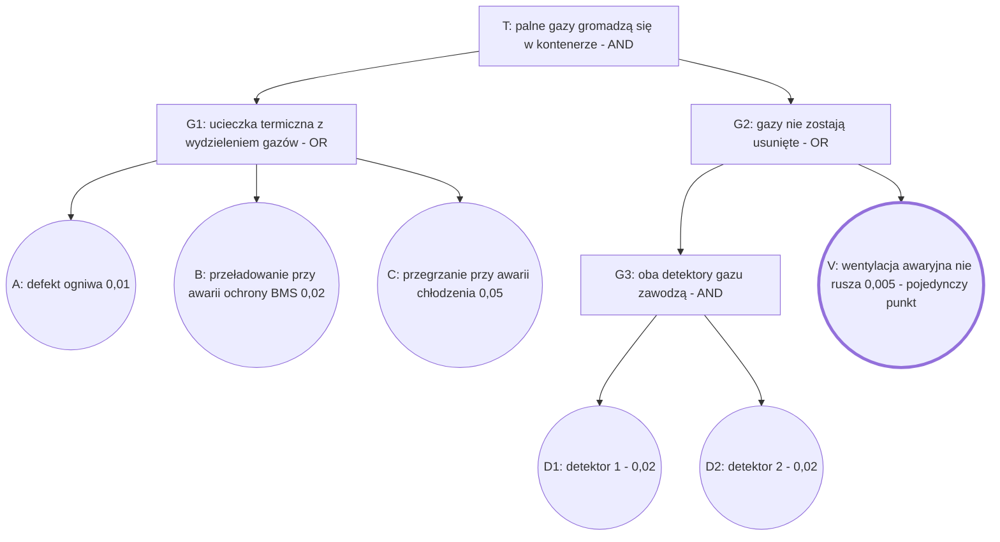
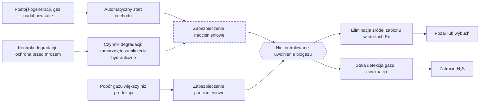

import { Review, ReviewSlide, Option, ImageCandidate, VideoCandidate } from '@site/src/components/review';
import { Claim, FaultTree, BowTie } from '@site/src/components/viz';

:::warning[Przykład interfejsu]

Ta strona pokazuje, jak wygląda strona wyboru. Kandydaci na zdjęcia nie mają sprawdzonej licencji (Wikimedia Commons nie było dostępne z chmury, w której powstał przykład), a fragmentów filmów nikt jeszcze nie obejrzał. Prawdziwą stronę dla wybranej części wykładu tworzy `/wizualizacje-propozycje` w Claude Code na Twoim komputerze.

:::

**Jak wybierać.** Dla każdego slajdu: wybierz wariant A, B albo „bez zmian”; przy zdjęciach i filmach zaznacz „na slajd”, „dla chętnych” albo zostaw „pomiń”; w polu uwag dopisz poprawki (np. „film od 1:20 do 3:10”). Na dole strony kliknij „Kopiuj wybory” i wklej tekst w Claude Code po poleceniu `/wizualizacje-zastosuj`. Wybory zostają w przeglądarce po odświeżeniu strony.

Wykład: [FTA, ETA i bow-tie](../../wyklady-bezp/wyklad-02-analiza-ryzyka/04-fta-eta-i-bow-tie.mdx) (W2, część 4).

<Review part="przyklad/04-fta-eta-i-bow-tie">

<ReviewSlide id="s2" title="Przykład drzewa: gazy w kontenerze BESS" now="diagram Mermaid drzewa T–G1–G2–G3 z liczbami, lista minimalnych przekrojów, dwa punkty tekstu">

<Option id="A" kind="statyczna" summary="To samo drzewo, ale z wnioskiem nad rysunkiem i wyróżnionym wentylatorem V, który występuje w każdym przekroju drugiego rzędu." replaces="diagram Mermaid (nowa wersja tego samego diagramu)">

<Claim>Wentylator V występuje w każdym przekroju drugiego rzędu: to pojedynczy punkt uszkodzenia gałęzi G2.</Claim>

</Option>

<Option id="B" kind="interaktywna" summary="Kalkulator drzewa: studenci włączają drugi wentylator i współczynnik β i widzą, jak zmienia się P(T). Łączy ten slajd z kwantyfikacją." replaces="diagram Mermaid; lista przekrojów przechodzi do bloku „Dla chętnych”">

<Claim>Ponad 90% prawdopodobieństwa pochodzi z przekrojów z jednym wentylatorem, a wspólna przyczyna psuje korzyść z dwóch detektorów.</Claim>

<FaultTree source="dane umowne z W2; NASA Fault Tree Handbook 2002; IEC 61025:2006; Lundteigen i Rausand (NTNU)" />

</Option>

<ImageCandidate id="IMG1" title="Tesvolt battery energy storage system Rheineck" preview="https://commons.wikimedia.org/wiki/Special:FilePath/Tesvolt_battery_energy_storage_system_Rheineck.jpg?width=640" page="https://commons.wikimedia.org/wiki/File:Tesvolt_battery_energy_storage_system_Rheineck.jpg" status="do sprawdzenia" learn="Jak wygląda rzeczywisty magazyn energii, dla którego liczymy to drzewo: skala zabudowy i miejsce, w którym mogą gromadzić się gazy." why="Wikimedia Commons; autor i licencja do odczytania na stronie pliku." />

<ImageCandidate id="IMG2" title="Tesvolt Batteriespeicher in Container" preview="https://commons.wikimedia.org/wiki/Special:FilePath/Tesvolt_Batteriespeicher_in_Container.jpg?width=640" page="https://commons.wikimedia.org/wiki/File:Tesvolt_Batteriespeicher_in_Container.jpg" status="do sprawdzenia" learn="Wnętrze kontenera z szafami bateryjnymi: zamknięta przestrzeń, w której działają detektory D1, D2 i wentylacja V." why="Wikimedia Commons; autor i licencja do odczytania na stronie pliku." />

<VideoCandidate id="VID1" youtube="0RrqiO3k94k" title="Test shows explosive power of a lithium-ion battery thermal runaway" channel="CBS News" lang="EN" fragment="do ustalenia po obejrzeniu (brak rozdziałów w opisie)" embeddable="tak" learn="Co oznacza zdarzenie szczytowe T w praktyce: zapłon gazów wydzielonych przy ucieczce termicznej w zamkniętej przestrzeni." why="Materiał telewizji informacyjnej; osadzanie włączone (oEmbed, 29.09.2026). Przed zajęciami sprawdzić, czy komentarz nie przesadza." />

<VideoCandidate id="VID2" youtube="_t9w4ihCov0" title="Lecture 14 - Fault Tree Analysis (Minimal Cut Sets, Importance Measures)" channel="Dr. Zaman Sajid" lang="EN" fragment="do ustalenia: wybrać część o minimalnych przekrojach" embeddable="tak" learn="Drugi, rozpisany krok po kroku przykład wyznaczania minimalnych przekrojów, dla chętnych do samodzielnej nauki." why="Wykład akademicki; lepiej jako „dla chętnych” niż na slajd." />

</ReviewSlide>

<ReviewSlide id="s7" title="Bow-tie dla zbiornika biogazu" now="diagram Mermaid bow-tie (zagrożenia, bariery, skutki, czynnik degradacji), jeden punkt o skali skutków">

<Option id="A" kind="statyczna" summary="Ten sam bow-tie z wnioskiem nad rysunkiem; zdarzenie szczytowe jako sześciokąt w środku, bariera wyłączana przez mróz obrysowana przerywaną linią." replaces="diagram Mermaid (nowa wersja tego samego diagramu)">

<Claim>Zamarznięte zamknięcie hydrauliczne wyłącza barierę bez żadnego sygnału. Dlatego czynnik degradacji ma własny środek kontroli.</Claim>

</Option>

<Option id="B" kind="interaktywna" summary="Bow-tie ze stanem barier: przełącznik „mróz” pokazuje, jak czynnik degradacji wyłącza zabezpieczenie i które ścieżki zostają otwarte." replaces="diagram Mermaid">

<Claim>Zamarznięte zamknięcie hydrauliczne wyłącza barierę bez żadnego sygnału. Dlatego czynnik degradacji ma własny środek kontroli.</Claim>

<BowTie source="TRAS 120 (KAS, 2019); CCPS i Energy Institute, Bow Ties in Risk Management (2018)" />

</Option>

<ImageCandidate id="IMG1" title="Biogasholder and flare" preview="https://commons.wikimedia.org/wiki/Special:FilePath/Biogasholder_and_flare.JPG?width=640" page="https://commons.wikimedia.org/wiki/File:Biogasholder_and_flare.JPG" status="do sprawdzenia" learn="Bariera „automatyczny start pochodni” w rzeczywistości: zbiornik gazu i pochodnia stoją obok siebie." why="Wikimedia Commons; autor i licencja do odczytania na stronie pliku." />

<ImageCandidate id="IMG2" title="Biogasanlage Lauterhofen" preview="https://commons.wikimedia.org/wiki/Special:FilePath/Biogasanlage_Lauterhofen_001.JPG?width=640" page="https://commons.wikimedia.org/wiki/File:Biogasanlage_Lauterhofen_001.JPG" status="do sprawdzenia" learn="Skala biogazowni rolniczej: komory z dachami membranowymi, czyli zbiorniki, których dotyczy diagram." why="Wikimedia Commons; autor i licencja do odczytania na stronie pliku." />

<ImageCandidate id="IMG3" title="BioSecure: zabezpieczenie nad- i podciśnieniowe (strona producenta)" page="https://biogastechnik-sued.de/en/home/products/biosecure-overpressure-and-underpressure-protection/" status="niewolna" learn="Jak wygląda zabezpieczenie nad- i podciśnieniowe z zamknięciem cieczowym, czyli bariera, którą wyłącza mróz." why="Zdjęcia producenta bez wolnej licencji: na slajdzie tylko jako link." />

</ReviewSlide>

</Review>
