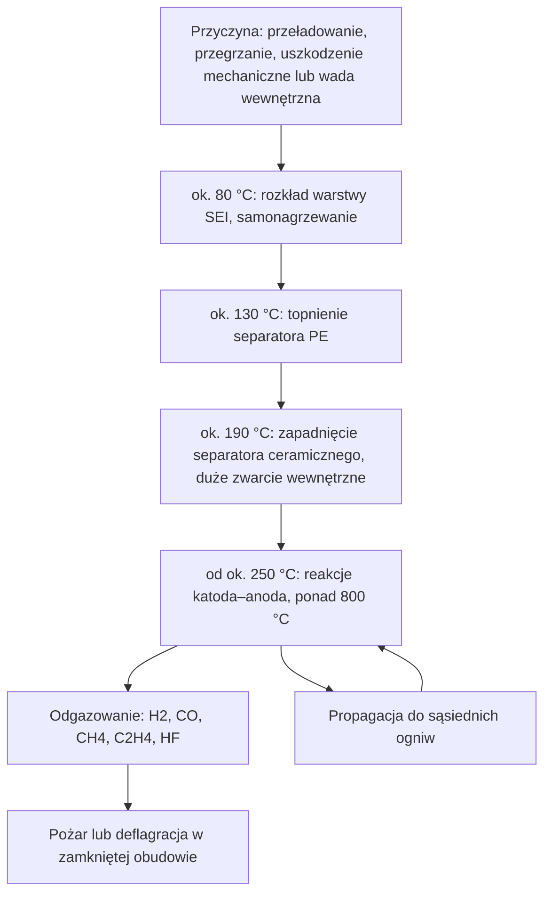

import { SlideContainer, Slide, InstructorNotes, LearningObjective, Example } from '@site/src/components/SlideComponents';

<LearningObjective>

Po tej części student potrafi sklasyfikować zagrożenia w instalacjach fotowoltaicznych, wiatrowych, bateryjnych magazynach energii i biogazowniach, wskazać ich źródła oraz krytycznie odczytać statystykę wypadków.

</LearningObjective>

<SlideContainer>

<Slide title="Skala OZE w Polsce" type="info">

Odnawialne źródła energii (OZE) stanowią już dużą część krajowego systemu elektroenergetycznego (KSE). Są rozproszone i często pracują bez stałej obsługi.

| Wskaźnik | Wartość | Stan na | Źródło |
|---|---|---|---|
| Moc zainstalowana w KSE ogółem | 77 331 MW | 31.12.2025 | PSE |
| w tym „elektrownie wiatrowe i inne odnawialne” | 37 106 MW (ok. 48%) | 31.12.2025 | PSE |
| Mikroinstalacje OZE (99,9% to PV) | 1 636 673 szt., ok. 13,9 GW | koniec 2025 | URE |
| Biogazownie rolnicze | 209 instalacji, 188,8 MWe | 28.05.2026 | KOWR |
| Pierwsza energia z morskiej farmy wiatrowej | Baltic Power, do 1,2 GW | 10.07.2026 | inwestor |

- W 2025 r. moc w kategorii PSE „wiatr i inne OZE” wzrosła o ok. 5,3 GW.
- Ponad 1,6 mln mikroinstalacji oznacza, że zagrożenia OZE dotyczą zwykłych budynków mieszkalnych, a nie tylko elektrowni.

Źródło: [PSE, Raport 2025 KSE](https://www.pse.pl/dane-systemowe/funkcjonowanie-kse/raporty-roczne-z-funkcjonowania-kse-za-rok); [URE, 19.03.2026](https://www.ure.gov.pl/pl/urzad/informacje-ogolne/aktualnosci/13173,Raport-URE-w-Polsce-mamy-juz-ponad-16-mln-mikroinstalacji-OZE.html); [KOWR, 2026](https://www.gov.pl/web/kowr/aktualna-sytuacja-na-rynku-biogazu-rolniczego-w-polsce-06-2026); [Baltic Power, 10.07.2026](https://balticpower.pl/aktualnosci/morska-farma-wiatrowa-baltic-power-po-raz-pierwszy-wyprodukowa%C5%82a-i-dostarczy%C5%82a-energi%C4%99-z-morza-dla-polskiej-sieci-energetycznej/)

<InstructorNotes>

Czas: ~2 min

Zaczynamy od skali, bo ona uzasadnia cały przedmiot. Prawie połowa mocy zainstalowanej w KSE to według PSE wiatr i inne odnawialne źródła. Proszę zwrócić uwagę, że PSE nie wydziela w tej tabeli fotowoltaiki jako osobnej pozycji, więc tej liczby nie da się wprost rozbić na technologie. Druga liczba jest ważniejsza dla bezpieczeństwa: ponad półtora miliona mikroinstalacji. To są dachy domów, szkół i gospodarstw, a nie ogrodzone elektrownie z dyżurnym inżynierem. Nikt tych instalacji na bieżąco nie obserwuje, więc monitoring zdalny i samoczynne zabezpieczenia stają się podstawą bezpieczeństwa.

Pytanie do sali: kto ma instalację PV w domu rodzinnym i czy wie, gdzie jest rozłącznik DC?

Typowe nieporozumienie: „OZE to głównie duże farmy”. Pod względem liczby obiektów dominują małe instalacje dachowe.

</InstructorNotes>

</Slide>

<Slide title="Mapa zagrożeń: energia, ogień, gazy" type="warning">

**Zagrożenie** to potencjalne źródło szkody (definicje w części 2). Poniżej cztery klasy zagrożeń związanych z energią i substancjami. BESS (Battery Energy Storage System) to bateryjny magazyn energii, a strefa Ex to przestrzeń zagrożona wybuchem.

| Klasa | PV | Wiatr | BESS | Biogaz |
|---|---|---|---|---|
| Elektryczne | napięcie DC przy świetle dziennym | łuk i porażenie w turbinie | wysokie napięcie DC, zwarcie | urządzenie elektryczne jako źródło zapłonu w strefie Ex |
| Pożarowe | łuk na złączach i rozłącznikach DC | pożar gondoli na wysokości | niekontrolowany wzrost temperatury ogniw | zapłon uwolnionego gazu |
| Wybuchowe | — | — | deflagracja gazów z ogniw w obudowie | metan w mieszaninie z powietrzem |
| Toksyczne i duszące | produkty spalania | — | HF, CO, HCN w gazach z ogniw | H₂S, niedobór tlenu |

Źródło: [Fraunhofer ISE, 2013](https://www.ise.fraunhofer.de/en/press-media/press-releases/2013/fire-protection-in-photovoltaic-systems.html); [EU-OSHA, 2013](https://osha.europa.eu/sites/default/files/OSH%20in%20Wind%20energy%20sector.pdf); [IEC 62485-5:2020](https://webstore.iec.ch/en/publication/29086); [DNV GL, 2020](https://www.aps.com/-/media/APS/APSCOM-PDFs/About/Our-Company/Newsroom/McMickenFinalTechnicalReport.pdf?la=en&sc_lang=en&hash=5447FA391CD988DD24226FA485F81F23); [ILO ICSC 0165](https://chemicalsafety.ilo.org/dyn/icsc/showcard.display?p_card_id=0165&p_version=2&p_lang=en); [Casson Moreno i in., 2016](https://doi.org/10.1016/j.renene.2015.10.017)

<InstructorNotes>

Czas: ~2 min

Tabelę czytamy wierszami, nie kolumnami. Wtedy widać, że każda technologia ma swoje „główne” zagrożenie. W PV jest to prąd stały, którego nie da się wyłączyć, dopóki świeci słońce. W magazynach bateryjnych jest to łańcuch: przegrzanie ogniwa, gazy, pożar lub wybuch. W biogazowni są to gazy: metan wybucha, siarkowodór zabija. W turbinie wiatrowej to przede wszystkim wysokość: pożaru na stu metrach nikt z ziemi nie ugasi.

Kreska w tabeli nie oznacza, że zagrożenia nie ma w ogóle. Oznacza, że nie jest ono charakterystyczne dla tej technologii.

Pytanie: dlaczego wiersz „wybuchowe” dotyczy BESS, skoro w magazynie nie ma paliwa gazowego? Odpowiedź przyjdzie za kilka slajdów: gaz powstaje w ogniwach podczas awarii.

</InstructorNotes>

</Slide>

<Slide title="Mapa zagrożeń: ludzie, otoczenie, cyber" type="warning">

| Klasa | PV | Wiatr | BESS | Biogaz |
|---|---|---|---|---|
| Mechaniczne | spadające moduły podczas akcji gaśniczej | awaria łopaty, odrzut lodu | — | nad- i podciśnienie w zbiornikach gazu |
| Praca na wysokości | prace na dachu | drabiny w wieży, ewakuacja z gondoli | — | — |
| Środowiskowe | — | spadające płonące elementy | dym toksyczny, ewakuacja okolicy | uwolnienia substancji do otoczenia |
| Cyber | falowniki z łącznością | SCADA, zdalny dostęp | zdalny dostęp do BMS i EMS | zdalne sterowanie procesem |

- SCADA (Supervisory Control and Data Acquisition) to nadrzędny system sterowania i zbierania danych. BMS (Battery Management System) to system zarządzania baterią, a EMS (Energy Management System) to system zarządzania energią.
- Te same łącza służą monitoringowi i sterowaniu, dlatego zagrożenia cyber dotyczą wszystkich technologii (szerzej w W10).
- W jednej instalacji występuje zwykle kilka klas naraz, np. PV z magazynem energii na dachu budynku.

Źródło: [EU-OSHA, 2013](https://osha.europa.eu/sites/default/files/OSH%20in%20Wind%20energy%20sector.pdf); [IEA Wind TCP Task 19, 2022](https://iea-wind.org/wp-content/uploads/2022/09/Task-19-Technical-Report-on-International-Recommendations-for-Ice-Fall-and-Ice-Throw-Risk-Assessments.pdf); [KP PSP Kętrzyn, 2023](https://www.gov.pl/web/kppsp-ketrzyn/pozar-turbiny-wiatrowej); [KW PSP Poznań, 2026](https://www.gov.pl/web/kwpsp-poznan/pozar-magazynu-energii-w-czajkowie); [KAS, TRAS 120](https://www.kas-bmu.de/files/publikationen/TRAS/TRAS%20(endgueltige%20Fassung)/LesefassTRAS120.pdf)

<InstructorNotes>

Czas: ~2 min

Druga połowa mapy dotyczy ludzi i otoczenia. W energetyce wiatrowej dominują zagrożenia mechaniczne i praca na wysokości: technicy wiele razy dziennie wchodzą po drabinach, a ewakuacja rannego z gondoli to osobne zadanie ratownicze. W przypadku BESS zwracam uwagę na wiersz środowiskowy. Przy pożarze magazynu w Czajkowie w maju 2026 roku straż ewakuowała 65 osób. Magazyn energii zagraża więc także sąsiadom, nie tylko obsłudze.

Wiersz „cyber” jest celowo wspólny. Falownik z Wi-Fi, zdalny dostęp serwisu do turbiny i sterownik biogazowni łączy to samo: ktoś spoza obiektu może wpłynąć na jego pracę.

Typowe nieporozumienie: „cyberbezpieczeństwo to sprawa działu IT”. W instalacji OZE atak może zmienić nastawy zabezpieczeń, a to już jest sprawa bezpieczeństwa technicznego.

</InstructorNotes>

</Slide>

<Slide title="PV: napięcie DC i łuk elektryczny" type="danger">

- Moduł PV działa jak **źródło prądowe**: dopóki pada na niego światło, przewody stringów są pod napięciem. Otwarcie rozłącznika DC ani odłączenie od sieci nie odłącza modułów na dachu.
- W instalacji PV nie ma jednego punktu, w którym można ją całkowicie odłączyć (Ramali i in., 2022).
- Napięcia DC sięgają 1000–1500 V. Nawet po pokryciu modułów pianą gaśniczą napięcie mogło wywołać prąd przez ciało powyżej 20 mA, co oznacza zagrożenie porażeniem (Bosco i in., 2015, za Ramali i in., 2022).
- **Łuk elektryczny** prądu stałego nie gaśnie sam, bo prąd nie przechodzi przez zero. **Łuk szeregowy** powstaje na luźnym lub źle zaciśniętym złączu; jego prąd nie przekracza prądu stringu, więc zabezpieczenie nadprądowe go nie wykryje. **Łuk równoległy** powstaje między biegunami lub do ziemi po uszkodzeniu izolacji.
- IEC 63027:2023 dotyczy urządzeń do wykrywania i opcjonalnie przerywania łuku DC w obwodach PV do 1500 V DC; opisane w niej badania dotyczą łuku szeregowego.
- Gaszenie wodą: niemieckie zalecenie straży pożarnych AGBF i DFV (2023), oparte na DIN VDE 0132, wymaga dla niskiego napięcia odległości co najmniej 1 m przy prądzie rozproszonym i 5 m przy prądzie zwartym. Inne wytyczne podają większe odległości, np. UL co najmniej 6 m z prądem rozproszonym, CAL FIRE 10 m (przegląd Ramali i in., 2022). W Polsce obowiązują procedury PSP.

Źródło: [Ramali i in., 2022](https://doi.org/10.1007/s10694-022-01269-4); [AGBF i DFV, 2023](https://www.agbf.de/downloads-fachausschuss-vorbeugender-brand-und-gefahrenschutz/28-fa-vbg-oeffentlich-empfehlungen?download=397%3A2023-04-photovoltaikanlagen); [IEC 63027:2023](https://webstore.iec.ch/en/publication/27362)

<InstructorNotes>

Czas: ~2,5 min

To najważniejszy slajd o fotowoltaice. W zwykłej instalacji domowej wyłączamy bezpiecznik i obwód jest martwy. W PV tak się nie da: moduł na słońcu sam jest źródłem, a rozłącznik przy falowniku odcina tylko odcinek za sobą. Przewody na dachu nadal mają kilkaset woltów.

Druga sprawa to łuk. Łuk prądu przemiennego gaśnie zwykle przy przejściu prądu przez zero, sto razy na sekundę. Łuk prądu stałego takiej okazji nie ma i może palić się długo na luźnym złączu. Bezpiecznik go nie widzi, bo prąd łuku szeregowego jest nie większy niż prąd roboczy. Dlatego powstały detektory łuku, które rozpoznają jego charakterystyczny szum.

Pytanie: czy bezpiecznik gPV w stringu ochroni przed łukiem na złączu? Nie ochroni, i warto, żeby każdy umiał powiedzieć dlaczego.

</InstructorNotes>

</Slide>

<Slide title="PV: co mówią dane o pożarach" type="info">

| Kraj i źródło | Okres | Najważniejsze wyniki | Zastrzeżenie |
|---|---|---|---|
| Niemcy: Fraunhofer ISE, TÜV Rheinland | ok. 20 lat do 2013 | ok. 1,3 mln instalacji; 120 pożarów spowodowanych przez PV; 75 z dużymi szkodami (ok. 0,006% instalacji) | wyniki pośrednie projektu |
| Wielka Brytania: BRE dla BEIS | VII 2015 – II 2018 | 80 pożarów, 58 spowodowanych przez PV; najczęściej rozłączniki DC; główna rozpoznana przyczyna: zły montaż | w 28 przypadkach przyczyna źródłowa nieznana |
| Polska: raporty PSP (Bednarczyk) | 2018–2021 | 411 zdarzeń, 128 spowodowanych przez PV; błędy montażu 28,9%, wady wyrobu 21,1%, nieznane 34,3% | PSP nie rejestruje kategorii „przyczyna: PV” |

- Niemiecki poradnik z 2015 r. dzieli przyczyny szkód mniej więcej po 1/3: wady komponentów, błędy projektu, błędy montażu.
- W danych niemieckich i brytyjskich pożary zaczynają się zwykle w połączeniach po stronie DC (złącza, rozłączniki, puszki przyłączeniowe), a nie w ogniwach.
- We wszystkich trzech zbiorach ważną przyczyną są błędy montażu, więc jakość wykonania jest środkiem bezpieczeństwa.

Źródło: [Fraunhofer ISE, 2013](https://www.ise.fraunhofer.de/en/press-media/press-releases/2013/fire-protection-in-photovoltaic-systems.html); [Fraunhofer ISE i TÜV Rheinland, 2015](https://www.ise.fraunhofer.de/content/dam/ise/de/downloads/pdf/Leitfaden_Brandrisiko_in_PV-Anlagen_V02.pdf); [BRE NSC, 2018](https://assets.publishing.service.gov.uk/government/uploads/system/uploads/attachment_data/file/786882/Fires_and_solar_PV_systems-Investigations_Evidence_Issue_2.9.pdf); [Bednarczyk, 2022](https://www.ppoz.pl/czytelnia/ratownictwo-i-ochrona-ludnosci/Fotowoltaika-pod-lupa/idn:2751)

<InstructorNotes>

Czas: ~2,5 min

Mamy trzy niezależne zbiory danych z trzech krajów i zbieżny obraz. Pożary spowodowane przez PV są rzadkie w stosunku do liczby instalacji: w Niemczech około sześciu tysięcznych procenta instalacji spowodowało pożar z dużymi szkodami. Jeżeli już do pożaru dochodzi, zaczyna się on zwykle w miejscu połączenia, a nie w samym module. W Wielkiej Brytanii na czele listy są rozłączniki DC montowane na zewnątrz; w 7 przypadkach woda dostała się do nich przez dławnice skierowane do góry.

Proszę zapamiętać ostatnią kolumnę. W Polsce PSP nie ma w formularzu pola „przyczyna: instalacja PV”, więc autor musiał przeczytać opisy zdarzeń. Jedna trzecia przyczyn pozostała nieznana.

Typowe nieporozumienie: „fotowoltaika często się pali”. Dane mówią raczej, że źle zamontowana fotowoltaika może się zapalić.

</InstructorNotes>

</Slide>

<Slide title="Wiatr: główne zagrożenia" type="warning">

- **Awaria łopaty**, np. Vineyard Wind 1 (USA), 13.07.2024: regulator BSEE wstrzymał produkcję energii i budowę kolejnych turbin oraz zażądał analizy ryzyka dla personelu. BSEE wszczęło własne dochodzenie; jego wyników nie opublikowano (stan IX 2026).
- **Pożar gondoli**: gaszenie z zewnątrz jest praktycznie niemożliwe ze względu na wysokość (Uadiale i in., 2014). Podławki (pow. kętrzyński), 6.08.2023: pożar na wysokości ok. 100 m; PSP wyznaczyła strefę 200 m i pilnowała spadających płonących elementów.
- **Wyładowania atmosferyczne** to obok zmęczenia, erozji krawędzi natarcia i oblodzenia główna przyczyna uszkodzeń łopat. W badaniu z USA łopata ulegała uszkodzeniu od pioruna średnio raz na 8,4 roku na turbinę (za przeglądem Katsaprakakis i in., 2021).
- **Odrzut lodu**: reguła orientacyjna $d = 1{,}5\,(D + H)$, gdzie $D$ to średnica wirnika, a $H$ wysokość piasty; autorzy sami nazywają ją zgrubnym szacunkiem. IEA Wind Task 19 zaleca ocenę ryzyka dla konkretnej lokalizacji. Przykład ilustracyjny — dane umowne: $D = 150$ m, $H = 120$ m daje $d = 405$ m.
- **Praca na wysokości i ratownictwo**: wielokrotne wchodzenie po drabinach, ciasne przestrzenie; EU-OSHA proponuje windę w wieżach od 60 m oraz drugą drogę ewakuacji.
- **Zagrożenia elektryczne**: łuk i porażenie podczas prac w turbinie (EU-OSHA).

Źródło: [BSEE, 2024](https://www.bsee.gov/newsroom/latest-news/statements-and-releases/press-releases/bsee-issues-new-order-to-vineyard-wind); [KP PSP Kętrzyn, 2023](https://www.gov.pl/web/kppsp-ketrzyn/pozar-turbiny-wiatrowej); [Uadiale i in., 2014](https://publications.iafss.org/publications/fss/11/983/view/fss_11-983.pdf); [Katsaprakakis i in., 2021](https://doi.org/10.3390/en14185974); [Seifert i in., 2003](https://www.nhsec.nh.gov/projects/2008-04/documents/app_appendix_26.pdf); [IEA Wind TCP Task 19, 2022](https://iea-wind.org/wp-content/uploads/2022/09/Task-19-Technical-Report-on-International-Recommendations-for-Ice-Fall-and-Ice-Throw-Risk-Assessments.pdf); [EU-OSHA, 2013](https://osha.europa.eu/sites/default/files/OSH%20in%20Wind%20energy%20sector.pdf)

<InstructorNotes>

Czas: ~2 min

W turbinie wiatrowej kluczowa jest wysokość. Pożar gondoli oznacza w praktyce utratę turbiny, a straż może tylko zabezpieczyć teren. Tak było w Podławkach: strefa dwustu metrów i obserwacja spadających płonących elementów, żeby nie zapaliło się zboże dookoła.

Wzór na odrzut lodu pokazuję celowo z zastrzeżeniem. Przy wirniku 150 m i piaście na 120 m daje około czterystu metrów. Mówi on jednak tylko, gdzie postawić tablicę ostrzegawczą. Nie mówi, jakie jest prawdopodobieństwo trafienia człowieka, a to właśnie jest ryzyko. Dlatego zalecenia IEA wymagają analizy dla konkretnego miejsca.

Pytanie: czy system wykrywania oblodzenia, który zatrzymuje wirnik, usuwa zagrożenie lodem? Nie usuwa. Zamienia odrzut lodu z obracającego się wirnika na spadanie lodu z zatrzymanej turbiny. Strefa ostrzegawcza jest nadal potrzebna.

</InstructorNotes>

</Slide>

<Slide title="Wiatr: skąd brać wiarygodne dane" type="info">

- Najbardziej systematyczną publiczną statystyką jest **G+** (Global Offshore Wind Health and Safety Organisation): dane zgłaszane przez firmy członkowskie, z jawnym mianownikiem (przepracowane godziny). Obejmuje tylko morskie farmy wiatrowe i tylko firmy członkowskie.
- Dane za 2025 r. (publikacja 11.06.2026): 69,2 mln przepracowanych godzin, TRIR (Total Recordable Injury Rate, wskaźnik wszystkich rejestrowanych urazów) 3,48, brak wypadków śmiertelnych.
- Dane za 2024 r.: 1 wypadek śmiertelny, TRIR 2,93; najczęstsza przyczyna urazów to ręczne przenoszenie ładunków (121 zdarzeń).
- Raport za 2025 r. podaje dla roku 2024 inne wartości bazowe niż raport za 2024 r. Liczby porównujemy więc tylko w obrębie jednego raportu.
- Liczby typu „1370 wypadków od 1970 r.” w publikacji EU-OSHA (2013) i w przeglądach naukowych pochodzą z bazy CWIF, budowanej z doniesień prasowych. Nie są wskaźnikiem częstości.
- Dla farm lądowych, także w Polsce, nie ma porównywalnego zbioru. Wg danych KG PSP cytowanych przez Gramwzielone.pl w latach 2021–2025 dochodziło do 5–8 pożarów turbin rocznie.

Źródło: [Energy Institute, 2026](https://www.energyinst.org/exploring-energy/resources/news-centre/media-releases/offshore-wind-safety-improves-despite-strong-sector-expansion); [Energy Institute, 2025](https://www.energyinst.org/exploring-energy/resources/news-centre/media-releases/unprecedented-growth-in-offshore-wind-accompanied-by-a-rise-in-injury-rates); [EU-OSHA, 2013](https://osha.europa.eu/sites/default/files/OSH%20in%20Wind%20energy%20sector.pdf); [Gramwzielone.pl, 30.04.2026](https://www.gramwzielone.pl/trendy/20356707/pozary-fotowoltaiki-elektrykow-i-elektrowni-wiatrowych-jaka-jest-ich-skala-w-polsce)

<InstructorNotes>

Czas: ~2 min

Ten slajd dotyczy jakości źródeł. W internecie łatwo znaleźć liczby w rodzaju „tysiąc trzysta siedemdziesiąt wypadków turbin od 1970 roku”. Cytuje je nawet agencja unijna i recenzowane artykuły. Wszystkie jednak pochodzą z jednej bazy prowadzonej na podstawie wycinków prasowych. Recenzja naukowa artykułu nie sprawia, że dane, które autor przepisał z prasy, stają się audytowane.

Najbardziej systematyczne dane publikuje G+, ale tylko dla morskich farm i tylko na podstawie zgłoszeń firm członkowskich. Dane mają jawny mianownik, czyli przepracowane godziny. Zwracam uwagę na drobiazg: kolejne raporty przeliczają rok poprzedni, więc nie wolno sklejać liczb z różnych raportów w jeden szereg.

Pytanie: jakiej informacji brakuje w zdaniu „w Polsce pali się kilka turbin rocznie”, żeby ocenić ryzyko? Liczby pracujących turbin i czasu ich pracy.

</InstructorNotes>

</Slide>

<Slide title="BESS: przebieg niekontrolowanego wzrostu temperatury" type="danger">

**Niekontrolowany wzrost temperatury** (ang. thermal runaway) to proces, w którym ciepło reakcji w ogniwie litowo-jonowym przyspiesza kolejne reakcje.

- Temperatury dotyczą jednego ogniwa 20 Ah z katodą NCM/LMO (Feng i in., 2018). Zależą od konstrukcji ogniwa, stanu naładowania (SOC) i metody badania. SEI to warstwa pasywacyjna na anodzie.
- **Zwarcie wewnętrzne wyzwala proces**, a głównym źródłem ciepła są reakcje powyżej temperatury krytycznej.
- Gaszenie środkiem gazowym nie zatrzymuje procesu (DNV GL, 2020). Ochrona polega na zapobieganiu i ograniczaniu propagacji.

Źródło: [Feng i in., 2018](https://doi.org/10.3389/fenrg.2018.00126); [DNV GL, 2020](https://www.aps.com/-/media/APS/APSCOM-PDFs/About/Our-Company/Newsroom/McMickenFinalTechnicalReport.pdf?la=en&sc_lang=en&hash=5447FA391CD988DD24226FA485F81F23)

<InstructorNotes>

Czas: ~2,5 min

Proszę prześledzić diagram od góry. Na początku jest jakaś przyczyna: przeładowanie, przegrzanie, uderzenie albo wada fabryczna w samym ogniwie. Około osiemdziesięciu stopni zaczyna się rozkładać warstwa na anodzie i ogniwo zaczyna grzać się samo. Potem topi się separator, dochodzi do dużego zwarcia wewnętrznego i od około dwustu pięćdziesięciu stopni reakcje między elektrodami podnoszą temperaturę powyżej ośmiuset stopni.

Dwie rzeczy są kluczowe dla inżyniera. Pierwsza: proces wytwarza palne i toksyczne gazy. Druga: ciepło jednego ogniwa podgrzewa sąsiednie, stąd pętla na diagramie. Liczby traktujemy jako orientacyjne, bo pochodzą z badań konkretnego ogniwa.

Typowe nieporozumienie: „wystarczy dobrze ugasić”. Gazowy środek gaśniczy nie chłodzi ogniw, więc proces biegnie dalej.

</InstructorNotes>

</Slide>

<Slide title="BESS: gazy, chemia ogniw i źródła awarii" type="warning">

| Cecha (Shen i in., 2023) | LFP | NCM |
|---|---|---|
| Objętość wydzielonych gazów | 0,569 L/Ah | 1,814–2,752 L/Ah |
| Skład gazu | wysoki udział H₂ | H₂, CO, CO₂, C₂H₄, CH₄ |
| Zagrożenie wg dolnej granicy wybuchowości | najwyższe w badaniu | niższe |

- LFP to ogniwa litowo-żelazowo-fosforanowe, a NCM niklowo-kobaltowo-manganowe. **Dolna granica wybuchowości** (DGW, ang. LEL) to najniższe stężenie gazu w powietrzu, przy którym mieszanina może się zapalić. Wniosek autorów: mniej gazu nie oznacza mniejszego zagrożenia wybuchem.
- Pożary ogniw Li-ion wydzielały 20–200 mg HF na Wh pojemności nominalnej (Larsson i in., 2017). Przykład ilustracyjny — dane umowne: moduł 5 kWh daje 100–1000 g HF.
- EPRI (2024): z 81 zdarzeń w bazie przyczynę ustalono dla 26; tylko 3 (11%) przypisano ogniwom, a większość integracji, montażowi i eksploatacji.
- 72% awarii o znanym wieku systemu wystąpiło podczas budowy, rozruchu lub w pierwszych dwóch latach pracy.

Źródło: [Shen i in., 2023](https://doi.org/10.3390/electronics12071603); [Larsson i in., 2017](https://doi.org/10.1038/s41598-017-09784-z); [EPRI, 2024](https://restservice.epri.com/publicdownload/000000003002030360/0/Product)

<InstructorNotes>

Czas: ~2 min

Często słyszymy, że ogniwa LFP są bezpieczne. Badanie Shena pokazuje, że sprawa jest bardziej złożona. Autorzy piszą, że ogniwo LFP ma lepszą stabilność termiczną i wydziela kilka razy mniej gazu. Ten gaz zawiera jednak dużo wodoru, więc łatwiej tworzy mieszaninę wybuchową. Wybór chemii to kompromis, a nie rozwiązanie problemu.

Druga część slajdu mówi, skąd biorą się awarie. Według EPRI zawodzą głównie integracja, montaż i sterowanie, a nie same ogniwa. Większość awarii zdarza się na początku życia instalacji. Wniosek praktyczny: odbiór techniczny i rozruch to okres szczególnego nadzoru.

Pytanie: skoro 72% awarii zdarza się wcześnie, jak zaplanowalibyście monitoring nowego magazynu w pierwszych dwóch latach?

</InstructorNotes>

</Slide>

<Slide title="BESS: McMicken, Moss Landing, Czajków" type="danger">

| | McMicken (USA), 19.04.2019 | Moss Landing (USA), 16.01.2025 | Czajków (PL), 7.05.2026 |
|---|---|---|---|
| System | 2 MW / 2 MWh, NMC, obudowa kontenerowa | 300 MW / 1200 MWh, NMC, dawny budynek turbin | kontener ok. 2 MW(h), ok. 107 500 ogniw Li-ion |
| Przebieg | dym ok. 17:00; po ok. 3 h otwarcie drzwi i deflagracja; 4 strażaków ciężko rannych | pożar w trakcie testu pojemności (WECC wskazuje wysoki SOC podczas testów jako czynnik ryzyka); tryskacze nieskuteczne; pożar przebił dach | kilkukrotne ponowne zapłony; do 24 zastępów PSP i OSP; ewakuacja 65 osób; komunikaty PSP nie informują o poszkodowanych |
| Przyczyna | wg DNV GL: wada wewnętrzna ogniwa (osadzanie litu, dendryty); inne raporty (UL FSRI, Exponent) oceniają przyczynę inaczej | nieustalona; raport WECC nie jest analizą przyczyn | nieopublikowana |

- Moss Landing: w 2025 r. spłonęło ok. 56 000 z ok. 100 000 modułów. 18.09.2026, ok. 20 miesięcy po pożarze, zapaliła się część uszkodzonych modułów pozostawionych w budynku (EPA: ok. 1300).
- Uszkodzone moduły pozostają zagrożeniem długo po pożarze, więc potrzebne są monitoring i procedury ich bezpiecznego usuwania.

Źródło: [DNV GL, 2020](https://www.aps.com/-/media/APS/APSCOM-PDFs/About/Our-Company/Newsroom/McMickenFinalTechnicalReport.pdf?la=en&sc_lang=en&hash=5447FA391CD988DD24226FA485F81F23); [APS, 2020](https://www.aps.com/en/About/Our-Company/Newsroom/Articles/Equipment-failure-at-McMicken-Battery-Facility); [UL FSRI, 2020](https://fsri.org/research-update/report-four-firefighters-injured-lithium-ion-battery-energy-storage-system); [UL, 2021](https://collateral-library-production.s3.amazonaws.com/uploads/asset_file/attachment/31718/Executive_Summary_for_DNVGL_APS_Report_Responses.pdf); [WECC, 2025](https://www.wecc.org/sites/default/files/documents/progress_report/2025/Moss%20Landing%20BESS%20Fire%20Report%20Final%2012.22.25.pdf); [US EPA, 2026](https://www.epa.gov/ca/moss-landing-vistra-battery-fire-updates); [KW PSP Poznań, 2026](https://www.gov.pl/web/kwpsp-poznan/pozar-magazynu-energii-w-czajkowie); [KP PSP Ostrzeszów, 2026](https://www.gov.pl/web/kppsp-ostrzeszow/pozar-magazynu-energii-na-naczepie)

<InstructorNotes>

Czas: ~3 min

Trzy przypadki pokazują trzy skale. McMicken to mały kontenerowy magazyn, ale bardzo dobrze zbadany. Po trzech godzinach od pojawienia się dymu strażacy otworzyli drzwi. Gazy nagromadzone w środku wybuchły i czterech strażaków zostało ciężko rannych. Do tego przypadku wrócimy w części piątej i rozłożymy go na warstwy ochrony.

Moss Landing to jeden z największych magazynów na świecie, umieszczony w hali. Przyczyny nadal nie ustalono, a raport WECC wprost zastrzega, że nie jest analizą przyczyn. Uszkodzone moduły zapaliły się ponownie po dwudziestu miesiącach.

Czajków to dobrze udokumentowany w komunikatach PSP przypadek z Polski: ponowne zapłony, ewakuacja i sprzęt specjalistyczny. Przyczyny nie opublikowano i nie wolno jej zgadywać.

Pytanie: co łączy te trzy zdarzenia, mimo różnej skali?

</InstructorNotes>

</Slide>

<Slide title="Biogazownia: metan i siarkowodór" type="danger">

| Gaz | Główne zagrożenie | Wartości odniesienia | Uwaga praktyczna |
|---|---|---|---|
| Metan CH₄ | wybuch; przy dużym stężeniu niedobór tlenu | granice wybuchowości 4,4–17% obj. (GisChem) | lżejszy od powietrza (gęstość względna 0,6) |
| Siarkowodór H₂S | ostra toksyczność | Polska: NDS 7 mg/m³ (ok. 5 ppm), NDSCh 14 mg/m³; IOELV UE: 5 ppm (8 h), 10 ppm (15 min); IDLH (NIOSH): 100 ppm | cięższy od powietrza (1,19): gromadzi się w dołach, studzienkach, zbiornikach; powyżej wartości dopuszczalnej węch może przestać ostrzegać |

- Granice wybuchowości metanu: DGW 4,4% obj. i GGW (górna granica wybuchowości, ang. UEL) 17% obj. wg karty GisChem (BG RCI, BGHM), czyli 100% DGW = 4,4% obj. CH₄. Starsze źródła, np. ICSC 0291 (2000), podają 5–15% obj. Dla biogazu (60% CH₄) SVLFG podaje ok. 6–22% obj.
- NDS i NDSCh to najwyższe dopuszczalne stężenie (8 h) i najwyższe dopuszczalne stężenie chwilowe (15 min) według załącznika do rozporządzenia MRPiPS w brzmieniu z Dz.U. 2026 poz. 447. IOELV to orientacyjna wartość dopuszczalna w UE, a IDLH to stężenie bezpośrednio zagrażające życiu lub zdrowiu.
- **Rhadereistedt** (Niemcy), XI 2005: przy napełnianiu zbiornika wstępnego kosubstratami bogatymi w białko uwolnił się H₂S; zginęły 4 osoby (UBA, 2006).
- Casson Moreno i in. (2016): 169 wypadków w łańcuchu biogazowym w latach 1995–2014, ok. 12% to poważne awarie; w latach 2007–2011 liczba wypadków wzrosła ponad pięciokrotnie, szybciej niż produkcja.
- UBA (2019): przy kontrolach od lat stwierdzano istotne braki w zabezpieczeniach w ok. 70% skontrolowanych biogazowni (w 2018 r. w Niemczech działało ok. 9000 instalacji). Odpowiedzią była TRAS 120 (ogłoszona 21.01.2019).

Źródło: [GisChem, BG RCI i BGHM](https://www.gischem.de/download/01_0-000074-82-8-000000_2_1_1255.PDF); [SVLFG, TI 4](https://cdn.svlfg.de/fiona8-blobs/public/svlfgonpremiseproduction/45b79757c1f38081/ce7f71d90169/ti04-sicherheitsregeln-biogasanlagen.pdf); [ILO ICSC 0291](https://chemicalsafety.ilo.org/dyn/icsc/showcard.display?p_card_id=0291&p_version=2&p_lang=en); [ILO ICSC 0165](https://chemicalsafety.ilo.org/dyn/icsc/showcard.display?p_card_id=0165&p_version=2&p_lang=en); [NIOSH, 1994](https://www.cdc.gov/niosh/idlh/7783064.html); [ISAP, Dz.U. 2026 poz. 447](https://isap.sejm.gov.pl/isap.nsf/DocDetails.xsp?id=WDU20260000447); [UBA, 2006](https://www.umweltbundesamt.de/system/files/medien/publikation/long/3097.pdf); [Casson Moreno i in., 2016](https://doi.org/10.1016/j.renene.2015.10.017); [UBA, TRAS 120](https://www.umweltbundesamt.de/themen/biogasanlagen-neue-technische-regel-soll-sicherheit); [KOWR, 2026](https://www.gov.pl/web/kowr/aktualna-sytuacja-na-rynku-biogazu-rolniczego-w-polsce-06-2026)

<InstructorNotes>

Czas: ~3 min

W biogazowni mamy dwa gazy o przeciwnym charakterze. Metan jest lżejszy od powietrza i tworzy z nim mieszaninę wybuchową w zakresie od około czterech i pół do siedemnastu procent objętościowych; starsze karty podają od pięciu do piętnastu procent. Przy detektorach: sto procent DGW to cztery i cztery dziesiąte procent metanu. Siarkowodór jest cięższy od powietrza, zbiera się w zagłębieniach i jest silnie toksyczny. Przy wyższych stężeniach porażony zostaje nerw węchowy i człowiek przestaje czuć zapach zgniłych jaj właśnie wtedy, gdy stężenie jest największe.

Rhadereistedt to podręcznikowy przypadek. Czterech ludzi zginęło nie w komorze fermentacyjnej, tylko przy zbiorniku wstępnym, podczas przyjmowania wsadu. W Polsce około 91% wsadu biogazowni rolniczych to odpady (KOWR), a część z nich ma dużo białka i siarki, więc ten mechanizm jest u nas aktualny.

Typowe nieporozumienie: „poczuję siarkowodór, zanim będzie groźny”. Na węch nie wolno liczyć. Potrzebne są stałe detektory i osobiste mierniki gazu.

</InstructorNotes>

</Slide>

<Slide title="Jak czytać statystyki wypadków" type="tip">

- **Ekspozycja, czyli mianownik**: liczbę zdarzeń dzielimy przez liczbę instalacji, zainstalowane GWh lub przepracowane godziny. EPRI podaje, że wskaźnik awarii wielkoskalowych magazynów BESS (ang. grid-scale) spadł o 97% w latach 2018–2023. Sama liczba zdarzeń tego nie pokazuje.
- **Obecność to nie przyczyna**: zdarzenia PSP, w których raporcie pojawia się „fotowoltaika”, wzrosły ze 145 (2020) do 808 (2024). To obecność PV na miejscu zdarzenia, a nie pożary spowodowane przez PV (dane PSP cytowane przez Globenergia).
- **Stronniczość zgłoszeń**: bazy z wycinków prasowych (CWIF) zawyżają zdarzenia spektakularne i nie znają mianownika.
- **Źródło pierwotne**: pytaj, czy liczba pochodzi z raportu z dochodzenia, ze statystyki z jawną definicją zdarzenia, czy z prasy. Przegląd naukowy nie poprawia jakości danych przepisanych z prasy.

<Example title="Przykład ilustracyjny — dane umowne">

Rok 1: 100 zdarzeń przy 200 000 instalacji, czyli 50 na 100 tys. Rok 2: 400 zdarzeń przy 1 000 000 instalacji, czyli 40 na 100 tys. Liczba zdarzeń wzrosła czterokrotnie, a wskaźnik spadł o 20%.

</Example>

Źródło: [EPRI, 2024](https://restservice.epri.com/publicdownload/000000003002030360/0/Product); [Globenergia](https://globenergia.pl/ile-instalacji-fotowoltaicznych-plonie-w-polsce-w-ciagu-roku-mamy-dane/); [EU-OSHA, 2013](https://osha.europa.eu/sites/default/files/OSH%20in%20Wind%20energy%20sector.pdf)

<InstructorNotes>

Czas: ~2,5 min

To slajd, który warto zapamiętać na całe życie zawodowe. Każda liczba wypadków ma sens dopiero wtedy, gdy znamy mianownik. Przykład na slajdzie jest umowny, ale mechanizm jest prawdziwy: przy szybko rosnącej liczbie instalacji liczba zdarzeń może rosnąć, nawet jeśli każda instalacja staje się bezpieczniejsza. Dlatego EPRI podaje dla magazynów energii wskaźnik awarii, a nie samą liczbę zdarzeń.

Druga pułapka dotyczy danych PSP o fotowoltaice. Ktoś przeczyta „808 zdarzeń” i napisze, że PV spowodowała 808 pożarów. PSP wyraźnie zastrzega, że to tylko obecność instalacji na miejscu zdarzenia.

Pytanie: gdyby liczba zdarzeń z PV rosła wolniej niż liczba instalacji, co to mówiłoby o ryzyku na jedną instalację? A jakich danych potrzebujecie, żeby to sprawdzić?

</InstructorNotes>

</Slide>

</SlideContainer>

## Źródła

1. PSE S.A., *Raport 2025 KSE – Zestawienie danych ilościowych dotyczących funkcjonowania KSE w 2025 roku*, 2026. https://www.pse.pl/dane-systemowe/funkcjonowanie-kse/raporty-roczne-z-funkcjonowania-kse-za-rok
2. Urząd Regulacji Energetyki, *Raport URE: w Polsce mamy już ponad 1,6 mln mikroinstalacji OZE*, 19.03.2026. https://www.ure.gov.pl/pl/urzad/informacje-ogolne/aktualnosci/13173,Raport-URE-w-Polsce-mamy-juz-ponad-16-mln-mikroinstalacji-OZE.html
3. Krajowy Ośrodek Wsparcia Rolnictwa, *Aktualna sytuacja na rynku biogazu rolniczego w Polsce* (stan na 28.05.2026), 2026. https://www.gov.pl/web/kowr/aktualna-sytuacja-na-rynku-biogazu-rolniczego-w-polsce-06-2026
4. Baltic Power, komunikat o pierwszej dostawie energii z morskiej farmy wiatrowej do sieci, 10.07.2026. https://balticpower.pl/aktualnosci/morska-farma-wiatrowa-baltic-power-po-raz-pierwszy-wyprodukowa%C5%82a-i-dostarczy%C5%82a-energi%C4%99-z-morza-dla-polskiej-sieci-energetycznej/
5. Fraunhofer ISE, *Fire Protection in Photovoltaic Systems – Facts replace Fiction*, komunikat prasowy, 12.02.2013. https://www.ise.fraunhofer.de/en/press-media/press-releases/2013/fire-protection-in-photovoltaic-systems.html
6. Sepanski A., Reil F., Vaaßen W. (TÜV Rheinland), Schmidt H. (Fraunhofer ISE), *Bewertung des Brandrisikos in Photovoltaik-Anlagen – Leitfaden*, wyd. 2, 2015, Fraunhofer ISE. https://www.ise.fraunhofer.de/content/dam/ise/de/downloads/pdf/Leitfaden_Brandrisiko_in_PV-Anlagen_V02.pdf
7. BRE National Solar Centre, *Fire and Solar PV Systems – Investigations and Evidence*, raport P100874-1004, Issue 2.9, 2018, BEIS. https://assets.publishing.service.gov.uk/government/uploads/system/uploads/attachment_data/file/786882/Fires_and_solar_PV_systems-Investigations_Evidence_Issue_2.9.pdf
8. Bednarczyk Ł., *Fotowoltaika pod lupą*, Przegląd Pożarniczy, 17.10.2022. https://www.ppoz.pl/czytelnia/ratownictwo-i-ochrona-ludnosci/Fotowoltaika-pod-lupa/idn:2751
9. Globenergia, artykuł z danymi PSP o zdarzeniach z udziałem instalacji PV w latach 2020–2025, 2025. https://globenergia.pl/ile-instalacji-fotowoltaicznych-plonie-w-polsce-w-ciagu-roku-mamy-dane/
10. Ramali i in., *A Review on Safety Practices for Firefighters During Photovoltaic (PV) Fire*, Fire Technology, 2022, Springer. https://doi.org/10.1007/s10694-022-01269-4
11. IEC, *IEC 63027:2023 Photovoltaic power systems – DC arc detection and interruption*, 2023. https://webstore.iec.ch/en/publication/27362
12. IEC, *IEC 62485-5:2020 Safety requirements for secondary batteries and battery installations – Part 5: Safe operation of stationary lithium ion batteries*, 2020. https://webstore.iec.ch/en/publication/29086
13. BSEE, *BSEE Issues New Order to Vineyard Wind*, 2024. https://www.bsee.gov/newsroom/latest-news/statements-and-releases/press-releases/bsee-issues-new-order-to-vineyard-wind
14. KP PSP Kętrzyn, *Pożar turbiny wiatrowej*, 2023. https://www.gov.pl/web/kppsp-ketrzyn/pozar-turbiny-wiatrowej
15. Uadiale S., Urbán É., Carvel R., Lange D., Rein G., *Overview of Problems and Solutions in Fire Protection Engineering of Wind Turbines*, Fire Safety Science 11, 2014, s. 983–995, IAFSS. https://publications.iafss.org/publications/fss/11/983/view/fss_11-983.pdf
16. Katsaprakakis D.A., Papadakis N., Ntintakis I., *A Comprehensive Analysis of Wind Turbine Blade Damage*, Energies 14(18):5974, 2021, MDPI. https://doi.org/10.3390/en14185974
17. Seifert H., Westerhellweg A., Kröning J. (DEWI), *Risk Analysis of Ice Throw from Wind Turbines*, BOREAS VI, 2003. https://www.nhsec.nh.gov/projects/2008-04/documents/app_appendix_26.pdf
18. IEA Wind TCP Task 19, *International Recommendations for Ice Fall and Ice Throw Risk Assessments*, wyd. 2, 2022. https://iea-wind.org/wp-content/uploads/2022/09/Task-19-Technical-Report-on-International-Recommendations-for-Ice-Fall-and-Ice-Throw-Risk-Assessments.pdf
19. EU-OSHA, *Occupational safety and health in the wind energy sector*, 2013. https://osha.europa.eu/sites/default/files/OSH%20in%20Wind%20energy%20sector.pdf
20. Energy Institute (G+), *Offshore wind safety improves despite strong sector expansion*, 11.06.2026. https://www.energyinst.org/exploring-energy/resources/news-centre/media-releases/offshore-wind-safety-improves-despite-strong-sector-expansion
21. Energy Institute (G+), *Unprecedented growth in offshore wind accompanied by a rise in injury rates*, 12.06.2025. https://www.energyinst.org/exploring-energy/resources/news-centre/media-releases/unprecedented-growth-in-offshore-wind-accompanied-by-a-rise-in-injury-rates
22. Gramwzielone.pl, artykuł o skali pożarów PV i turbin wiatrowych w Polsce (dane KG PSP), 30.04.2026. https://www.gramwzielone.pl/trendy/20356707/pozary-fotowoltaiki-elektrykow-i-elektrowni-wiatrowych-jaka-jest-ich-skala-w-polsce
23. Feng X., Zheng S., He X., Wang L., Wang Y., Ren D., Ouyang M., *Time Sequence Map for Interpreting the Thermal Runaway Mechanism of Lithium-Ion Batteries With LiNixCoyMnzO2 Cathode*, Frontiers in Energy Research, 2018. https://doi.org/10.3389/fenrg.2018.00126
24. Shen H. i in., *Thermal Runaway Characteristics and Gas Composition Analysis of Lithium-Ion Batteries with Different LFP and NCM Cathode Materials under Inert Atmosphere*, Electronics 12(7):1603, 2023, MDPI. https://doi.org/10.3390/electronics12071603
25. Larsson F., Andersson P., Blomqvist P., Mellander B.-E., *Toxic fluoride gas emissions from lithium-ion battery fires*, Scientific Reports 7:10018, 2017. https://doi.org/10.1038/s41598-017-09784-z
26. EPRI, TWAICE, PNNL, *2024 White Paper: Insights from EPRI's Battery Energy Storage Systems (BESS) Failure Incident Database – Analysis of Failure Root Cause*, raport 3002030360, 2024. https://restservice.epri.com/publicdownload/000000003002030360/0/Product
27. DNV GL (Hill D.M.) dla APS, *McMicken Battery Energy Storage System Event – Technical Analysis and Recommendations*, Doc. 10209302-HOU-R-01, 18.07.2020. https://www.aps.com/-/media/APS/APSCOM-PDFs/About/Our-Company/Newsroom/McMickenFinalTechnicalReport.pdf?la=en&sc_lang=en&hash=5447FA391CD988DD24226FA485F81F23
28. APS, *Equipment failure at McMicken Battery Facility*, 2020. https://www.aps.com/en/About/Our-Company/Newsroom/Articles/Equipment-failure-at-McMicken-Battery-Facility
29. UL FSRI, *Four Firefighters Injured In Lithium-Ion Battery Energy Storage System Explosion – Arizona*, 2020. https://fsri.org/research-update/report-four-firefighters-injured-lithium-ion-battery-energy-storage-system
30. WECC, *Moss Landing BESS Fire Report*, 22.12.2025. https://www.wecc.org/sites/default/files/documents/progress_report/2025/Moss%20Landing%20BESS%20Fire%20Report%20Final%2012.22.25.pdf
31. US EPA, *Moss Landing Vistra Battery Fire Updates*, 2025–2026. https://www.epa.gov/ca/moss-landing-vistra-battery-fire-updates
32. KW PSP Poznań, *Pożar magazynu energii w Czajkowie*, 7.05.2026. https://www.gov.pl/web/kwpsp-poznan/pozar-magazynu-energii-w-czajkowie
33. KP PSP Ostrzeszów, *Pożar magazynu energii na naczepie*, 11.05.2026. https://www.gov.pl/web/kppsp-ostrzeszow/pozar-magazynu-energii-na-naczepie
34. ILO/WHO, *International Chemical Safety Card 0291: Methane*, 2000. https://chemicalsafety.ilo.org/dyn/icsc/showcard.display?p_card_id=0291&p_version=2&p_lang=en
35. ILO/WHO, *International Chemical Safety Card 0165: Hydrogen sulfide*, 2017. https://chemicalsafety.ilo.org/dyn/icsc/showcard.display?p_card_id=0165&p_version=2&p_lang=en
36. CDC/NIOSH, *Immediately Dangerous to Life or Health: Hydrogen sulfide*, 1994. https://www.cdc.gov/niosh/idlh/7783064.html
37. Rozporządzenie MRPiPS z 26.03.2026 zmieniające rozporządzenie w sprawie najwyższych dopuszczalnych stężeń i natężeń czynników szkodliwych dla zdrowia w środowisku pracy (nowy załącznik), Dz.U. 2026 poz. 447, ISAP. https://isap.sejm.gov.pl/isap.nsf/DocDetails.xsp?id=WDU20260000447
38. Umweltbundesamt, *Informationspapier: Zur Sicherheit bei Biogasanlagen*, 2006. https://www.umweltbundesamt.de/system/files/medien/publikation/long/3097.pdf
39. Casson Moreno V., Papasidero S., Scarponi G.E., Guglielmi D., Cozzani V., *Analysis of accidents in biogas production and upgrading*, Renewable Energy 96B, 2016, s. 1127–1134, Elsevier. https://doi.org/10.1016/j.renene.2015.10.017
40. Umweltbundesamt, *Biogasanlagen: Neue Technische Regel soll Sicherheit erhöhen*. https://www.umweltbundesamt.de/themen/biogasanlagen-neue-technische-regel-soll-sicherheit
41. KAS, *TRAS 120 Sicherheitstechnische Anforderungen an Biogasanlagen* (Lesefassung), 2018/2019. https://www.kas-bmu.de/files/publikationen/TRAS/TRAS%20(endgueltige%20Fassung)/LesefassTRAS120.pdf
42. AGBF bund, DFV, *Empfehlungen der AGBF und des DFV – Umgang mit Photovoltaik-Anlagen* (2023-04), 2023. https://www.agbf.de/downloads-fachausschuss-vorbeugender-brand-und-gefahrenschutz/28-fa-vbg-oeffentlich-empfehlungen?download=397%3A2023-04-photovoltaikanlagen
43. BG RCI, BGHM, GisChem, *Datenblatt Methan (CAS-Nr. 74-82-8)*, stan z 21.09.2026. https://www.gischem.de/download/01_0-000074-82-8-000000_2_1_1255.PDF
44. SVLFG (dawniej LBG), *Technische Information 4: Sicherheitsregeln für Biogasanlagen*, wyd. 11.2015. https://cdn.svlfg.de/fiona8-blobs/public/svlfgonpremiseproduction/45b79757c1f38081/ce7f71d90169/ti04-sicherheitsregeln-biogasanlagen.pdf
45. UL LLC, *Executive Summary of the Underwriters Laboratories and UL Responses on Battery Energy Storage System Incidents and Safety*, 2021. https://collateral-library-production.s3.amazonaws.com/uploads/asset_file/attachment/31718/Executive_Summary_for_DNVGL_APS_Report_Responses.pdf
