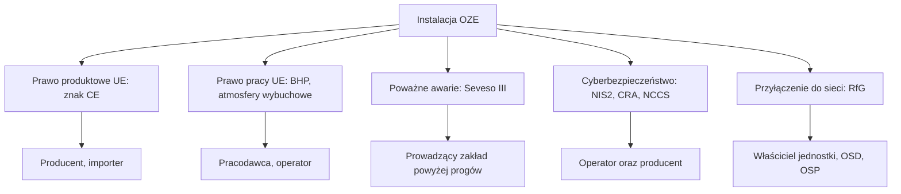

import { SlideContainer, Slide, InstructorNotes, LearningObjective, Example } from '@site/src/components/SlideComponents';

<LearningObjective>

Po tej części student wskazuje, które akty prawa UE i Polski dotyczą danej instalacji OZE, odróżnia przepisy obowiązujące od projektów i wie, kto odpowiada za ich spełnienie. Stan prawny: wrzesień 2026.

</LearningObjective>

<SlideContainer>

<Slide title="Mapa ram prawnych" type="info">

- Skróty: NIS2 to dyrektywa o cyberbezpieczeństwie podmiotów, CRA (Cyber Resilience Act) to akt o cyberodporności produktów, NCCS to kodeks sieci dotyczący cyberbezpieczeństwa w elektroenergetyce, RfG (Requirements for Generators) to kodeks przyłączania jednostek wytwórczych. OSD i OSP to operatorzy systemu dystrybucyjnego i przesyłowego.
- Polska dodaje przepisy krajowe: Prawo budowlane i warunki techniczne, ochronę przeciwpożarową, BHP (atmosfery wybuchowe, NDS), dozór techniczny i ustawę o krajowym systemie cyberbezpieczeństwa.
- Przy każdym akcie rozróżniamy trzy stany: **obowiązuje**, **przyjęty, ale jeszcze nie stosowany** oraz **projekt**.

Źródło: [KE, Blue Guide 2022](https://eur-lex.europa.eu/legal-content/EN/TXT/PDF/?uri=CELEX%3A52022XC0629%2804%29); [EU-OSHA, 89/391/EWG](https://osha.europa.eu/en/legislation/directives/the-osh-framework-directive/1); [EUR-Lex, 2012/18/UE](https://eur-lex.europa.eu/legal-content/EN/TXT/PDF/?uri=CELEX:32012L0018); [KE, NIS2](https://digital-strategy.ec.europa.eu/en/policies/nis2-directive); [EUR-Lex, 2016/631](https://eur-lex.europa.eu/legal-content/EN/TXT/HTML/?uri=CELEX:32016R0631)

<InstructorNotes>

Czas: ~2 min

Na pierwszy rzut oka prawo dotyczące OZE wygląda jak gąszcz. Da się je jednak uporządkować według pytania: kogo dany akt obowiązuje. Prawo produktowe obowiązuje producenta. Kupujemy falownik z deklaracją zgodności i znakiem CE, a odpowiedzialność za jego konstrukcję spoczywa na producencie. Prawo pracy obowiązuje pracodawcę i operatora, bo dotyczy tego, jak urządzenie jest używane. Seveso dotyczy tylko zakładów z dużą ilością substancji niebezpiecznych. Przepisy cyber obowiązują i operatorów, i producentów. Kodeks sieci RfG dotyczy właściciela jednostki wytwórczej, a parametry ustala operator systemu.

Proszę zapamiętać trzy stany aktu prawnego. W 2026 roku wiele przepisów jest w ruchu i łatwo pomylić projekt z obowiązującym prawem.

Pytanie: kogo obowiązuje znak CE na falowniku, a kogo ocena ryzyka na farmie PV?

</InstructorNotes>

</Slide>

<Slide title="Nowe ramy prawne, znak CE i normy zharmonizowane" type="info">

- **NLF** (New Legislative Framework, nowe ramy prawne): akty UE określają **wymagania zasadnicze**. Producent wykazuje zgodność, wystawia deklarację zgodności i umieszcza znak **CE**.
- Stosowanie norm zharmonizowanych jest **dobrowolne**; producent może zastosować inne specyfikacje techniczne (Blue Guide 2022, pkt 1.1.3).
- Wyrób zgodny z normą zharmonizowaną korzysta z **domniemania zgodności** z odpowiadającymi jej wymaganiami zasadniczymi.
- Warunkiem domniemania jest publikacja odniesienia do normy w Dzienniku Urzędowym UE, czasem z ograniczeniami. Przykład: EN 18031-1/-2/-3:2024 dla urządzeń radiowych (decyzja wykonawcza (UE) 2025/138).
- Łańcuch: akt prawny → zlecenie normalizacyjne Komisji → norma EN (CEN, CENELEC) → publikacja w Dz.Urz. UE → domniemanie zgodności.
- Pakiet „Omnibus IV” (COM(2025) 503 i 504 z 21.05.2025) o cyfrowych instrukcjach i deklaracjach zgodności to **projekt**; 9.06.2026 wstępne porozumienie Rady i Parlamentu Europejskiego, formalnie nieprzyjęty (IX 2026).

Źródło: [KE, Blue Guide 2022](https://eur-lex.europa.eu/legal-content/EN/TXT/PDF/?uri=CELEX%3A52022XC0629%2804%29); [KE, normy zharmonizowane](https://single-market-economy.ec.europa.eu/single-market/goods/european-standards/harmonised-standards_en); [EUR-Lex, decyzja 2025/138](https://eur-lex.europa.eu/legal-content/EN/TXT/PDF/?uri=OJ:L_202500138); [KE, Omnibus IV](https://single-market-economy.ec.europa.eu/publications/digitalisation-and-alignment-common-specifications_en); [Rada UE, 9.06.2026](https://www.consilium.europa.eu/en/press/press-releases/2026/06/09/simplification-council-and-parliament-strike-deal-to-help-growing-businesses-thrive-and-accelerate-digitalisation/)

<InstructorNotes>

Czas: ~2 min

To jest mechanizm, na którym opiera się cały rynek urządzeń. Prawo nie mówi, jak zbudować falownik. Mówi, jakie wymagania zasadnicze musi on spełnić, na przykład żeby nie razić prądem. Szczegóły techniczne są w normach. Jeżeli producent zastosuje normę zharmonizowaną, której odniesienie opublikowano w Dzienniku Urzędowym, zakłada się, że wymagania są spełnione. To jest domniemanie zgodności.

Proszę zauważyć, że norma pozostaje dobrowolna. Producent może zrobić inaczej, ale wtedy sam musi udowodnić zgodność, co jest trudniejsze i droższe. Przykład norm EN 18031 pokazuje, że Komisja potrafi ograniczyć domniemanie, jeżeli norma ma słabe punkty.

Typowe nieporozumienie: „znak CE to certyfikat jakości wydany przez urząd”. W większości przypadków to deklaracja samego producenta.

</InstructorNotes>

</Slide>

<Slide title="Prawo produktowe: co musi spełnić wyrób" type="info">

| Akt | Czego dotyczy w OZE | Daty kluczowe | Status IX 2026 |
|---|---|---|---|
| LVD 2014/35/UE, EMC 2014/30/UE | sprzęt elektryczny: falowniki, rozdzielnice, moduły | LVD stosowana od 20.04.2016 | obowiązują |
| RED 2014/53/UE + rozp. delegowane 2022/30 | urządzenia z modułem radiowym, np. falowniki i rejestratory z Wi-Fi: wymagania cyber | cyber od 1.08.2025 | obowiązuje |
| Dyrektywa maszynowa 2006/42/WE → rozp. 2023/1230 | maszyny; w praktyce branżowej także turbiny wiatrowe | dyrektywa do 19.01.2027; rozporządzenie od 20.01.2027 | rozporządzenie przyjęte, stosowane od 2027 |
| ATEX 2014/34/UE, PED 2014/68/UE | urządzenia do stref Ex i urządzenia ciśnieniowe, np. w biogazowni | — | obowiązują |
| Rozporządzenie bateryjne 2023/1542 | baterie, w tym stacjonarne BESS | stosowane od 18.02.2024 etapami; należyta staranność od 18.08.2027 | obowiązuje etapami |
| CPR 2024/3110 | wyroby budowlane, np. kable z klasą reakcji na ogień | stosowane od 8.01.2026; stare CPR uchylone w 2039 | obowiązuje, okres przejściowy |

- Skróty: LVD to dyrektywa niskonapięciowa, EMC kompatybilność elektromagnetyczna, RED urządzenia radiowe, PED urządzenia ciśnieniowe, CPR wyroby budowlane.
- Rozporządzenie bateryjne wymaga dla stacjonarnych BESS dokumentacji badań bezpieczeństwa według załącznika V (art. 12; wg TÜV SÜD). Daty etykiet i paszportu baterii sprawdź w EUR-Lex.

Źródło: [EUR-Lex, 2014/35/UE](https://eur-lex.europa.eu/legal-content/PL/TXT/?uri=CELEX:32014L0035); [EUR-Lex, 2023/2444](https://eur-lex.europa.eu/legal-content/EN/TXT/HTML/?uri=CELEX:32023R2444); [KE, maszyny](https://single-market-economy.ec.europa.eu/sectors/mechanical-engineering/machinery_en); [EUR-Lex, 2006/42/WE](https://eur-lex.europa.eu/legal-content/PL/TXT/?uri=CELEX:32006L0042); [KE, lista ATEX](https://single-market-economy.ec.europa.eu/single-market/european-standards/harmonised-standards/equipment-explosive-atmospheres-atex_en); [KE, baterie](https://environment.ec.europa.eu/topics/waste-and-recycling/batteries_en); [EUR-Lex, 2025/1561](https://eur-lex.europa.eu/legal-content/EN/TXT/HTML/?uri=CELEX:32025R1561); [KE, CPR 2024](https://single-market-economy.ec.europa.eu/sectors/construction/construction-products-regulation-cpr/cpr-2024-revision_en); [Energy-Storage.News, 2025](https://www.energy-storage.news/one-year-on-eu-batteries-regulation-and-ce-marking-impacting-energy-storage-systems/)

<InstructorNotes>

Czas: ~2 min

Z tej tabeli projektant nie musi znać każdego artykułu. Musi wiedzieć, jakich dokumentów żądać od dostawcy. Falownik z Wi-Fi podlega dziś nie tylko dyrektywie niskonapięciowej i kompatybilności elektromagnetycznej, ale od sierpnia 2025 roku także wymaganiom cyberbezpieczeństwa z dyrektywy radiowej. Turbina wiatrowa jest w praktyce certyfikowana jako maszyna. Od 20 stycznia 2027 roku nowe maszyny będą oceniane według rozporządzenia, a nie dyrektywy.

Magazyn bateryjny ma osobne rozporządzenie, które wchodzi etapami. Część terminów przesunięto, na przykład obowiązki należytej staranności na sierpień 2027 roku. Dlatego zawsze sprawdzamy aktualny tekst w EUR-Lex, a nie w starych prezentacjach.

Pytanie: jakie dokumenty zgodności zażądacie od dostawcy kontenerowego magazynu energii z modemem LTE?

</InstructorNotes>

</Slide>

<Slide title="Prawo pracy: obowiązki pracodawcy i operatora" type="info">

- **89/391/EWG** (dyrektywa ramowa BHP): pracodawca ocenia wszystkie ryzyka dla pracowników, m.in. przy wyborze sprzętu i substancji. Zasady prewencji to m.in. unikanie ryzyka, zwalczanie go u źródła i pierwszeństwo środków zbiorowych przed indywidualnymi.
- **1999/92/WE**: pracodawca dzieli miejsca, w których może wystąpić atmosfera wybuchowa, na strefy (art. 7) i prowadzi aktualny **dokument zabezpieczenia przed wybuchem** (art. 8). Dokument aktualizuje się przy istotnych zmianach stanowisk pracy.
- Strefy dla gazów: **0**, gdy atmosfera wybuchowa występuje stale, długo lub często; **1**, gdy może wystąpić okazjonalnie w normalnej pracy; **2**, gdy w normalnej pracy jest mało prawdopodobna, a jeśli wystąpi, to krótko.
- **2009/104/WE**: sprzęt roboczy, np. wciągarki i dźwigi serwisowe, musi być właściwie dobrany i sprawdzany przez kompetentne osoby (po montażu i okresowo), a wyniki się zapisuje.
- **98/24/WE + 2009/161/UE**: ocena ryzyka od czynników chemicznych. Dla H₂S IOELV wynosi 5 ppm (7 mg/m³) dla 8 h i 10 ppm (14 mg/m³) dla krótkiego czasu.
- Obowiązki te spoczywają na operatorze niezależnie od znaków CE na sprzęcie: prawo produktowe dotyczy wyrobu, prawo pracy jego użytkowania.

Źródło: [EU-OSHA, 89/391/EWG](https://osha.europa.eu/en/legislation/directives/the-osh-framework-directive/1); [EUR-Lex, 1999/92/WE](https://eur-lex.europa.eu/legal-content/EN/TXT/HTML/?uri=CELEX:31999L0092); [EU-OSHA, 2009/104/WE](https://osha.europa.eu/en/legislation/directives/3); [EU-OSHA, 98/24/WE](https://osha.europa.eu/en/legislation/directives/75); [EUR-Lex, 2009/161/UE](https://eur-lex.europa.eu/legal-content/EN/TXT/HTML/?uri=CELEX:32009L0161)

<InstructorNotes>

Czas: ~2 min

Druga rodzina aktów dotyczy miejsca pracy. Tu odpowiada pracodawca, czyli w praktyce operator farmy lub biogazowni. Najważniejsza dla naszego przedmiotu jest dyrektywa 1999/92. To ona każe podzielić teren biogazowni na strefy zagrożenia wybuchem i prowadzić dokument zabezpieczenia przed wybuchem. W Polsce skrót DZPW słyszy się w każdej biogazowni. W magazynach energii ta logika zaczyna mieć znaczenie, bo gazy z ogniw też tworzą mieszaninę wybuchową.

Strefy 0, 1 i 2 różnią się tym, jak często i jak długo może występować atmosfera wybuchowa. Od strefy zależy, jakie urządzenia wolno w niej zamontować.

Typowe nieporozumienie: „kupiłem urządzenia z certyfikatem ATEX, więc mam spokój”. Certyfikat dotyczy wyrobu. Klasyfikacja stref i dokument zabezpieczenia przed wybuchem należą do operatora.

</InstructorNotes>

</Slide>

<Slide title="Seveso III a biogazownie i BESS" type="warning">

Dyrektywa 2012/18/UE (Seveso III, stosowana od 1.06.2015) obejmuje zakłady według **ilości substancji niebezpiecznych**, a nie rodzaju instalacji.

| Pozycja w załączniku I | Próg niższy | Próg wyższy |
|---|---|---|
| P2: gazy łatwopalne kat. 1 lub 2 (np. surowy biogaz) | 10 t | 50 t |
| Poz. 18: skroplone gazy łatwopalne i gaz ziemny; biogaz uzdatniony (uwaga 19) | 50 t | 200 t |
| Poz. 15: wodór | 5 t | 50 t |

- BESS nie występuje w załączniku I jako pozycja nazwana.
- Poniżej progów nadal obowiązują przepisy BHP, w tym ochrona przed wybuchem, oraz przepisy przeciwpożarowe.

<Example title="Przykład ilustracyjny — dane umowne">

Surowy biogaz 60% CH₄ i 40% CO₂ ma gęstość ok. 1,22 kg/m³ (0 °C, gęstości składników z tablic). Próg 10 t odpowiada więc ok. 8200 m³ gazu. Zbiornik z 3000 m³ gazu to ok. 3,7 t, czyli poniżej progu. Obliczenie trzeba jednak wykonać z uwzględnieniem sumowania substancji (uwaga 4 do załącznika).

</Example>

Źródło: [EUR-Lex, 2012/18/UE](https://eur-lex.europa.eu/legal-content/EN/TXT/PDF/?uri=CELEX:32012L0018)

<InstructorNotes>

Czas: ~2 min

Studenci często zakładają, że każda biogazownia jest zakładem Seveso. Tak nie jest. Seveso działa według ilości substancji w zakładzie, a nie według rodzaju instalacji. Przykład na slajdzie jest umowny, ale pokazuje rząd wielkości. Dziesięć ton surowego biogazu to kilka tysięcy metrów sześciennych, więc typowa mała instalacja rolnicza zwykle nie przekracza progu. Duża instalacja z biometanem skroplonym albo z magazynem wodoru może już go przekroczyć.

Zwracam uwagę na słowo „zwykle”. Operator musi to policzyć, łącznie z zasadą sumowania różnych substancji. Nie wystarczy zapewnienie, że „u nas na pewno nie”.

Pytanie: dlaczego niższy próg dla wodoru (5 t) jest o połowę mniejszy niż dla gazów łatwopalnych ogółem (10 t)?

</InstructorNotes>

</Slide>

<Slide title="Cyberbezpieczeństwo i przyłączenie do sieci" type="info">

| Akt | Kogo dotyczy | Kluczowe daty | Status IX 2026 |
|---|---|---|---|
| NIS2 (UE) 2022/2555 → nowelizacja ustawy o KSC (Dz.U. 2026 poz. 252) | średnie i duże podmioty m.in. sektora energii | w mocy od 3.04.2026; wniosek o wpis do wykazu podmiotów kluczowych i ważnych do 3.10.2026; SZBI do 3.04.2027; pierwszy audyt (tylko podmioty kluczowe) do 3.04.2028 | obowiązuje |
| CRA (UE) 2024/2847 | producenci produktów z elementami cyfrowymi, np. falowników i sterowników | zgłaszanie aktywnie wykorzystywanych podatności od 11.09.2026 (24 h i 72 h); pełne stosowanie od 11.12.2027 | stosowany częściowo |
| NCCS (UE) 2024/1366 | podmioty elektroenergetyczne o wysokim lub krytycznym wpływie | w mocy od 13.06.2024; wdrażanie etapami w kolejnych latach | obowiązuje |
| RfG (UE) 2016/631 | moduły wytwarzania energii od 0,8 kW, typy A–D | stosowane od 27.04.2019 | obowiązuje |
| Rewizja RfG | m.in. magazyny energii, pojazdy elektryczne | konsultacje projektu 8.07–25.08.2026; przyjęcie planowane w IV kw. 2026 | projekt |

- KSC to krajowy system cyberbezpieczeństwa, a SZBI to system zarządzania bezpieczeństwem informacji.
- Progi RfG w Polsce (decyzja Prezesa URE z 16.07.2018): moduły wytwarzania energii typu A od 0,8 kW, typu B od 200 kW, typu C od 10 MW, typu D od 75 MW lub przyłączone na napięciu ≥ 110 kV. Dla porównania RfG dopuszcza w Europie kontynentalnej progi B, C, D najwyżej 1, 50 i 75 MW.
- Nowe wymogi ogólnego stosowania PSE (zatwierdzone przez Prezesa URE 15.05.2025) stosuje się dla typów B–D, gdy warunki przyłączenia wydano od 1.12.2025, a dla typu A od 1.01.2027.

Źródło: [KE, NIS2](https://digital-strategy.ec.europa.eu/en/policies/nis2-directive); [gov.pl, nowelizacja KSC](https://www.gov.pl/web/baza-wiedzy/nowelizacja-ustawy-o-krajowym-systemie-cyberbezpieczenstwa); [KE, CRA](https://digital-strategy.ec.europa.eu/en/policies/cra-summary); [EUR-Lex, NCCS](https://eur-lex.europa.eu/legal-content/EN/TXT/PDF/?uri=CELEX%3A02024R1366-20250914); [EUR-Lex, RfG](https://eur-lex.europa.eu/legal-content/EN/TXT/HTML/?uri=CELEX:32016R0631); [PSE, NC RfG](https://www.pse.pl/kodeksy/rfg); [KE, inicjatywa 14165](https://ec.europa.eu/info/law/better-regulation/have-your-say/initiatives/14165-Revision-of-the-Network-Code-on-Requirements-for-Grid-Connection-of-Generators_en)

<InstructorNotes>

Czas: ~2 min

Tu są dwa tematy, które coraz bardziej się przenikają. NIS2 i polska nowelizacja ustawy o KSC dotyczą firm, czyli operatorów. Średni lub duży wytwórca energii musi zarządzać ryzykiem cyber i zgłaszać incydenty. Pierwszy termin, wniosek o wpis do wykazu podmiotów kluczowych i ważnych, to 3 października 2026 roku, czyli pół roku po wejściu nowelizacji w życie. CRA dotyczy producentów: od 11 września 2026 roku producent falownika musi zgłosić aktywnie wykorzystywaną podatność w ciągu 24 godzin.

RfG to kodeks przyłączeniowy. Z punktu widzenia bezpieczeństwa ważne jest, że określa zachowanie jednostek przy zakłóceniach w sieci i ich zabezpieczenia. Jego rewizja, która obejmie magazyny energii, jest nadal projektem.

Pytanie: czy właściciel dachowej instalacji PV 8 kW podlega ustawie o KSC? Nie, bo nie jest średnim ani dużym przedsiębiorstwem. Kodeks RfG obejmuje go jednak jako jednostkę typu A.

</InstructorNotes>

</Slide>

<Slide title="Prawo budowlane: PV i magazyny energii" type="info">

- **PV powyżej 6,5 kW** (art. 29 ust. 4 pkt 3 lit. c): montaż urządzeń PV do 150 kW nie wymaga pozwolenia ani zgłoszenia, ale powyżej 6,5 kW projekt uzgadnia się z rzeczoznawcą ds. zabezpieczeń przeciwpożarowych. Po zakończeniu montażu zawiadamia się PSP i przekazuje **plan instalacji PV dla ekip ratowniczych**. Dawny art. 56 ust. 1a jest uchylony.
- **Magazyny energii**: ustawa z 4.12.2025 (Dz.U. 2025 poz. 1847), w mocy od 7.01.2026; definicja magazynu energii elektrycznej (art. 3 pkt 27) od 20.09.2026.

| Pojemność nominalna | Wolnostojący | Instalowany na obiekcie budowlanym |
|---|---|---|
| do 30 kWh | bez pozwolenia i zgłoszenia | bez pozwolenia i zgłoszenia |
| powyżej 30 do 300 kWh | zgłoszenie, uzgodnienie ppoż., zawiadomienie PSP z planem | zgłoszenie, uzgodnienie ppoż., zawiadomienie PSP z planem |
| powyżej 300 do 2000 kWh | zgłoszenie, uzgodnienie ppoż., zawiadomienie PSP z planem | pozwolenie na budowę |
| powyżej 2000 kWh | pozwolenie na budowę | pozwolenie na budowę |

- Podstawa: art. 29 ust. 1 pkt 3c i 40, ust. 2 pkt 39, ust. 3 pkt 3 lit. h, ust. 4 pkt 3 lit. c, art. 30 oraz art. 33 ust. 3 i 4bb Prawa budowlanego (tekst jednolity Dz.U. 2026 poz. 524). „Plan” pokazuje lokalizację magazynu i dane istotne dla bezpieczeństwa ekip ratowniczych.

Źródło: [ISAP, Prawo budowlane, t.j. Dz.U. 2026 poz. 524](https://isap.sejm.gov.pl/isap.nsf/DocDetails.xsp?id=WDU20260000524); [ISAP, Dz.U. 2025 poz. 1847](https://isap.sejm.gov.pl/isap.nsf/DocDetails.xsp?id=WDU20250001847)

<InstructorNotes>

Czas: ~2,5 min

Zasadę dla fotowoltaiki warto znać na pamięć: powyżej 6,5 kW projekt uzgadnia rzeczoznawca do spraw zabezpieczeń przeciwpożarowych, a PSP dostaje zawiadomienie razem z planem instalacji dla ratowników. Ten obowiązek jest dziś zapisany w artykule 29. W starszych materiałach, także na stronach komend PSP, znajdziecie odwołanie do artykułu 56 ustęp 1a, który jest już uchylony.

Nowością od stycznia 2026 roku są magazyny energii. Po raz pierwszy Prawo budowlane określa progi pojemności. Mały magazyn domowy do 30 kWh nie wymaga formalności. Powyżej tej wartości potrzebne są zgłoszenie, uzgodnienie przeciwpożarowe i zawiadomienie straży z planem, a magazyn powyżej 300 kWh w budynku wymaga pozwolenia na budowę. Proszę zauważyć, że straż pożarna ma dostać plan z danymi dla ratowników. Wymóg jest zbieżny z wnioskami z dochodzeń po pożarach, takich jak McMicken.

Pytanie: jakie formalności będą potrzebne dla kontenerowego magazynu 1 MWh stojącego obok farmy PV?

</InstructorNotes>

</Slide>

<Slide title="Warunki techniczne i ochrona ppoż. w IX 2026" type="warning">

- **WT 2002** (rozporządzenie Ministra Infrastruktury z 12.04.2002 w sprawie warunków technicznych, jakim powinny odpowiadać budynki i ich usytuowanie; t.j. Dz.U. 2022 poz. 1225): przepisy obowiązujące do 19.09.2026; w ISAP rozporządzenie ma status „uznany za uchylony”.
- **Okres przejściowy**: art. 102a–102c Prawa budowlanego, dodane ustawą z 31.07.2026 (Dz.U. 2026 poz. 1161; ten przepis w mocy od 2.09.2026). Przez 18 miesięcy od 20.09.2026, czyli do 20.03.2028, projekt może zostać sporządzony według przepisów obowiązujących do 19.09.2026; art. 102a przewiduje oświadczenie inwestora.
- **Nowe WT** nie zostały opublikowane w Dzienniku Ustaw (stan na 29.09.2026). Projekt rozporządzenia Ministra Finansów i Gospodarki (RCL, projekt 12412604, wersja z 6.08.2026) jest na etapie notyfikacji. **To projekt, nie prawo**; jego treść omawia następny slajd.
- **Ochrona ppoż.**: uzgadnianie projektów reguluje rozporządzenie MSWiA z 5.08.2023 (Dz.U. 2023 poz. 1563). Wymagania dla obiektów zawiera rozporządzenie MSWiA z 7.06.2010 (Dz.U. 2010 nr 109 poz. 719, z tekstem jednolitym).
- **Wytyczne CNBOP-PIB i PSME** dla wielkoskalowych i przemysłowych magazynów energii są w przygotowaniu; zakończenie planowano na koniec 2026 r. (wg Gramwzielone).

Źródło: [ISAP, rozporządzenie MI z 12.04.2002](https://isap.sejm.gov.pl/isap.nsf/DocDetails.xsp?id=WDU20020750690); [ISAP, Dz.U. 2026 poz. 1161](https://isap.sejm.gov.pl/isap.nsf/DocDetails.xsp?id=WDU20260001161); [RCL, projekt 12412604](https://legislacja.gov.pl/projekt/12412604); [KG PSP](https://www.gov.pl/web/kgpsp/zmiany-w-przepisach-z-zakresu-ochrony-przeciwpozarowej); [ISAP, Dz.U. 2010 nr 109 poz. 719](https://isap.sejm.gov.pl/isap.nsf/DocDetails.xsp?id=WDU20101090719); [Gramwzielone, 7.07.2026](https://www.gramwzielone.pl/magazynowanie-energii/20366280/wytyczne-przeciwpozarowe-dla-magazynow-energii-powstana-do-konca-roku)

<InstructorNotes>

Czas: ~1,5 min

Ten slajd opisuje sytuację wyjątkową. Stare warunki techniczne z 2002 roku obowiązywały do 19 września 2026 roku, a nowych jeszcze nie ogłoszono. Ustawodawca zareagował przepisem epizodycznym: przez półtora roku można projektować według starych zasad. Nowe rozporządzenie jest w procesie legislacyjnym; na stronie Rządowego Centrum Legislacji widać, że przeszło etap notyfikacji, ale nie zostało podpisane.

Praktyczna rada: w każdym projekcie z tego okresu trzeba napisać wprost, według których warunków technicznych został sporządzony.

</InstructorNotes>

</Slide>

<Slide title="Projekt nowych WT: wymagania dla PV i BESS" type="warning">

Projekt rozporządzenia w wersji z 6.08.2026 (RCL 12412604). **To projekt, a nie obowiązujące prawo.**

| Obszar | Proponowane wymaganie |
|---|---|
| PV: przewody DC | prowadzone na zewnątrz budynku; wewnątrz tylko w tynku lub w obudowie EI 30 albo EI 60 (§ 303) |
| PV: ratownicy | **wyłącznik awaryjny PV**: napięcie DC poza strefą modułów poniżej 30 V w ciągu 30 s albo odłączenie przewodów DC w budynku (§ 304) |
| PV: środki ochrony | **urządzenie do monitorowania stanu izolacji** po stronie DC oraz **urządzenie do wykrywania i przerywania łuku DC** (§ 305) |
| BESS powyżej 2 kWh | BMS, który monitoruje napięcie, prąd i temperaturę oraz zapobiega przeładowaniu, przeciążeniu i zwarciu, a w razie awarii **odłącza baterię** (§ 311) |
| BESS w budynku | **wyłącznik awaryjny BESS**; najwyżej 600 kWh w strefie pożarowej (§ 312–313) |
| BESS: gazy | wentylacja utrzymująca stężenie poniżej 25% DGW; detekcja gazu, która włącza alarm, steruje wentylacją i odłącza baterie; powyżej 60 kWh także odciążenie wybuchowe (§ 315–316) |

Źródło: [RCL, projekt rozporządzenia w sprawie warunków technicznych, wersja z 6.08.2026 (DOCX)](https://legislacja.gov.pl/docs//582/12412604/13216444/dokument791486.docx); [RCL, projekt 12412604](https://legislacja.gov.pl/projekt/12412604)

<InstructorNotes>

Czas: ~2 min

Ten projekt jest dla nas cenny niezależnie od tego, kiedy wejdzie w życie, bo pokazuje kierunek i wprost rozdziela monitoring od ochrony. W paragrafie o BMS jest lista: monitoruj napięcie, prąd i temperaturę, a obok niej funkcje, które działają same: zapobiegaj przeładowaniu, odłącz baterię. W paragrafie o gazach detektor nie tylko alarmuje, ale steruje wentylacją i odłącza baterie. Tak wygląda warstwa ochrony. Dla fotowoltaiki projekt wymaga detekcji łuku zgodnej z normą o wykrywaniu łuku DC i monitorowania izolacji.

Wiele z tych wymagań jest zbieżnych z wnioskami z dochodzeń po pożarach, o których mówiliśmy, takich jak McMicken.

Pytanie: które z wymagań w tabeli są monitoringiem, a które funkcją ochronną? Wrócimy do tego w części piątej.

</InstructorNotes>

</Slide>

<Slide title="BHP, kwalifikacje i dozór techniczny" type="info">

- **Atmosfera wybuchowa**: rozporządzenie Ministra Gospodarki z 8.07.2010 (Dz.U. 2010 nr 138 poz. 931). Pracodawca dzieli przestrzenie na strefy 0, 1, 2 (§ 5) i przed udostępnieniem miejsca pracy sporządza na podstawie oceny ryzyka **dokument zabezpieczenia przed wybuchem (DZPW)**, aktualizowany po zmianach (§ 7). Kolejność środków: zapobiegać powstaniu atmosfery wybuchowej, zapobiegać zapłonowi, ograniczać skutki wybuchu (§ 4).
- **NDS/NDSCh**: rozporządzenie MRPiPS z 12.06.2018 (Dz.U. 2018 poz. 1286), załącznik w brzmieniu z Dz.U. 2026 poz. 447 (w mocy od 2.04.2026): H₂S — NDS 7 mg/m³, NDSCh 14 mg/m³; CO — NDS 23 mg/m³ (20 ppm), NDSCh 117 mg/m³ (100 ppm); CO₂ — NDS 9000 mg/m³, NDSCh 27 000 mg/m³.
- **Świadectwa kwalifikacyjne**: rozporządzenie MKiŚ z 1.07.2022 (Dz.U. 2022 poz. 1392) rozróżnia stanowiska **eksploatacji** i **dozoru**. Grupa 1 obejmuje urządzenia elektroenergetyczne wytwarzające, magazynujące i przesyłające energię, grupa 2 urządzenia cieplne, a grupa 3 gazowe.
- **Dozór techniczny (UDT)**: rozporządzenie Rady Ministrów z 7.12.2012 (Dz.U. 2012 poz. 1468) wymienia m.in. dźwigi do transportu osób lub ładunków, wciągarki, żurawie, podesty ruchome oraz zbiorniki ciśnieniowe powyżej progów (iloczyn nadciśnienia i pojemności ponad 50 bar·dm³ i nadciśnienie ponad 0,5 bara).
- **Cyber**: operator objęty nowelizacją ustawy o KSC składa do 3.10.2026 wniosek o wpis do wykazu podmiotów kluczowych i ważnych, wdraża SZBI do 3.04.2027, a podmiot kluczowy przeprowadza pierwszy audyt do 3.04.2028.

Źródło: [ISAP, Dz.U. 2010 nr 138 poz. 931](https://isap.sejm.gov.pl/isap.nsf/DocDetails.xsp?id=WDU20101380931); [ISAP, Dz.U. 2018 poz. 1286](https://isap.sejm.gov.pl/isap.nsf/DocDetails.xsp?id=WDU20180001286); [ISAP, Dz.U. 2026 poz. 447](https://isap.sejm.gov.pl/isap.nsf/DocDetails.xsp?id=WDU20260000447); [URE, Dz.U. 2022 poz. 1392](https://www.ure.gov.pl/download/9/12973/1392.pdf); [ISAP, Dz.U. 2012 poz. 1468](https://isap.sejm.gov.pl/isap.nsf/DocDetails.xsp?id=WDU20120001468); [gov.pl, nowelizacja KSC](https://www.gov.pl/web/baza-wiedzy/nowelizacja-ustawy-o-krajowym-systemie-cyberbezpieczenstwa)

<InstructorNotes>

Czas: ~2 min

To są przepisy, z którymi spotkacie się jako pracownicy operatora. Dokument zabezpieczenia przed wybuchem sporządza się przed dopuszczeniem ludzi do pracy i aktualizuje przy zmianach instalacji. Kolejność środków w paragrafie czwartym to ta sama hierarchia, którą widzieliśmy w części drugiej: najpierw nie dopuścić do atmosfery wybuchowej, potem do zapłonu, na końcu ograniczać skutki.

Najwyższe dopuszczalne stężenia określają, ile siarkowodoru lub tlenku węgla może być w powietrzu na stanowisku pracy. Siedem miligramów siarkowodoru na metr sześcienny to około pięciu ppm. Załącznik był w 2026 roku wymieniany, więc wartości zawsze sprawdzamy w aktualnym tekście.

Kto obsługuje, konserwuje lub nadzoruje urządzenia energetyczne, musi mieć świadectwo odpowiedniej grupy i rodzaju. Dozór UDT obejmuje urządzenia wymienione w rozporządzeniu z 2012 roku. Czy konkretne urządzenie, na przykład winda serwisowa w wieży turbiny, do nich należy, rozstrzyga się na podstawie tego wykazu, a nie na wyczucie.

Pytanie: jakie świadectwo będzie potrzebne technikowi, który obsługuje biogazownię z agregatem kogeneracyjnym?

</InstructorNotes>

</Slide>

<Slide title="Kto za co odpowiada" type="success">

| Podmiot | Główne obowiązki | Podstawa |
|---|---|---|
| Producent, importer | ocena zgodności, deklaracja zgodności, znak CE, dokumentacja; zgłaszanie podatności | NLF, LVD, RED, rozp. bateryjne, CRA |
| Projektant | dobór wyrobów z CE; uzgodnienie ppoż. projektu PV powyżej 6,5 kW i BESS powyżej 30 kWh | Prawo budowlane art. 29 i 33, MSWiA 2023 |
| Wykonawca, instalator | jakość montażu, częsta przyczyna pożarów PV; kwalifikacje do prac eksploatacyjnych | dane DE, UK, PL; MKiŚ 2022 |
| Właściciel, operator, pracodawca | ocena ryzyka, strefy Ex i DZPW, NDS, sprzęt roboczy, kontrole okresowe, cyber | 89/391, 1999/92, MG 2010, Prawo budowlane art. 62, KSC |
| PSP, UDT | PSP: zawiadomienia, akcje ratownicze; UDT: dozór nad urządzeniami technicznymi | Prawo budowlane art. 29, 33 i 56 ust. 1, RM 2012 |
| OSD, OSP, URE | wymagania przyłączeniowe i zabezpieczenia sieciowe; URE: regulacja, rejestry, aukcje | RfG 2016/631, prawo energetyczne |

Źródło: [KE, Blue Guide 2022](https://eur-lex.europa.eu/legal-content/EN/TXT/PDF/?uri=CELEX%3A52022XC0629%2804%29); [ISAP, Prawo budowlane, t.j. Dz.U. 2026 poz. 524](https://isap.sejm.gov.pl/isap.nsf/DocDetails.xsp?id=WDU20260000524); [BRE NSC, 2018](https://assets.publishing.service.gov.uk/government/uploads/system/uploads/attachment_data/file/786882/Fires_and_solar_PV_systems-Investigations_Evidence_Issue_2.9.pdf); [EUR-Lex, 1999/92/WE](https://eur-lex.europa.eu/legal-content/EN/TXT/HTML/?uri=CELEX:31999L0092); [EUR-Lex, RfG](https://eur-lex.europa.eu/legal-content/EN/TXT/HTML/?uri=CELEX:32016R0631)

<InstructorNotes>

Czas: ~2 min

Na koniec części prawnej porządkujemy odpowiedzialność. Kiedy zdarzy się wypadek, pierwsze pytanie brzmi: kto miał obowiązek i czy go wypełnił. Producent odpowiada za wyrób, projektant za dobór i uzgodnienia, wykonawca za montaż. Operator odpowiada za wszystko, co dzieje się w trakcie eksploatacji: ocenę ryzyka, strefy, pomiary, kontrole i cyberbezpieczeństwo. Straż pożarna, UDT i operatorzy sieci to podmioty zewnętrzne. Nie przejmują odpowiedzialności operatora, tylko ją weryfikują albo reagują na zdarzenia.

Proszę zwrócić uwagę na wiersz wykonawcy. W danych z trzech krajów błędy montażu należą do głównych przyczyn pożarów PV, więc to nie jest mało ważna rola.

Pytanie: jeżeli rozłącznik DC z certyfikatem zapalił się, bo woda dostała się przez odwróconą dławnicę, kto zawinił?

</InstructorNotes>

</Slide>

</SlideContainer>

## Źródła

### Prawo UE

1. Komisja Europejska, *The „Blue Guide” on the implementation of EU product rules 2022* (2022/C 247/01), Dz.Urz. UE C 247, 29.06.2022. https://eur-lex.europa.eu/legal-content/EN/TXT/PDF/?uri=CELEX%3A52022XC0629%2804%29
2. Komisja Europejska, *Harmonised standards*. https://single-market-economy.ec.europa.eu/single-market/goods/european-standards/harmonised-standards_en
3. Decyzja wykonawcza Komisji (UE) 2025/138 z 28.01.2025 (normy EN 18031 dla dyrektywy 2014/53/UE). https://eur-lex.europa.eu/legal-content/EN/TXT/PDF/?uri=OJ:L_202500138
4. Komisja Europejska, *Digitalisation and alignment of common specifications* (COM(2025) 503 i 504), 2025. https://single-market-economy.ec.europa.eu/publications/digitalisation-and-alignment-common-specifications_en
5. Rada UE, *Simplification: Council and Parliament strike deal to help growing businesses thrive and accelerate digitalisation* (wstępne porozumienie w sprawie pakietu Omnibus IV), komunikat prasowy, 9.06.2026. https://www.consilium.europa.eu/en/press/press-releases/2026/06/09/simplification-council-and-parliament-strike-deal-to-help-growing-businesses-thrive-and-accelerate-digitalisation/
6. Dyrektywa 2014/35/UE (LVD), EUR-Lex. https://eur-lex.europa.eu/legal-content/PL/TXT/?uri=CELEX:32014L0035
7. Rozporządzenie delegowane Komisji (UE) 2023/2444 (data stosowania rozporządzenia 2022/30), EUR-Lex. https://eur-lex.europa.eu/legal-content/EN/TXT/HTML/?uri=CELEX:32023R2444
8. Komisja Europejska, *Machinery* (rozporządzenie (UE) 2023/1230). https://single-market-economy.ec.europa.eu/sectors/mechanical-engineering/machinery_en
9. Dyrektywa 2006/42/WE w sprawie maszyn, EUR-Lex. https://eur-lex.europa.eu/legal-content/PL/TXT/?uri=CELEX:32006L0042
10. Komisja Europejska, lista norm zharmonizowanych ATEX 2014/34/UE. https://single-market-economy.ec.europa.eu/single-market/european-standards/harmonised-standards/equipment-explosive-atmospheres-atex_en
11. Komisja Europejska, DG ENV, *Batteries*. https://environment.ec.europa.eu/topics/waste-and-recycling/batteries_en
12. Rozporządzenie (UE) 2025/1561 zmieniające rozporządzenie (UE) 2023/1542, EUR-Lex. https://eur-lex.europa.eu/legal-content/EN/TXT/HTML/?uri=CELEX:32025R1561
13. Komisja Europejska, *CPR 2024 revision*. https://single-market-economy.ec.europa.eu/sectors/construction/construction-products-regulation-cpr/cpr-2024-revision_en
14. Bellino N. (TÜV SÜD), *One year on: EU Batteries Regulation and CE marking impacting energy storage systems*, Energy-Storage.News, 20.11.2025. https://www.energy-storage.news/one-year-on-eu-batteries-regulation-and-ce-marking-impacting-energy-storage-systems/
15. EU-OSHA, *Directive 89/391/EEC – OSH „Framework Directive”*. https://osha.europa.eu/en/legislation/directives/the-osh-framework-directive/1
16. Dyrektywa 1999/92/WE (atmosfery wybuchowe w miejscu pracy), EUR-Lex. https://eur-lex.europa.eu/legal-content/EN/TXT/HTML/?uri=CELEX:31999L0092
17. EU-OSHA, *Directive 2009/104/EC – use of work equipment*. https://osha.europa.eu/en/legislation/directives/3
18. EU-OSHA, *Directive 98/24/EC – risks related to chemical agents at work*. https://osha.europa.eu/en/legislation/directives/75
19. Dyrektywa Komisji 2009/161/UE (trzeci wykaz IOELV), EUR-Lex. https://eur-lex.europa.eu/legal-content/EN/TXT/HTML/?uri=CELEX:32009L0161
20. Dyrektywa 2012/18/UE (Seveso III), EUR-Lex. https://eur-lex.europa.eu/legal-content/EN/TXT/PDF/?uri=CELEX:32012L0018
21. Komisja Europejska, *NIS2 Directive*. https://digital-strategy.ec.europa.eu/en/policies/nis2-directive
22. Komisja Europejska, *Cyber Resilience Act – summary*. https://digital-strategy.ec.europa.eu/en/policies/cra-summary
23. Rozporządzenie delegowane Komisji (UE) 2024/1366 (NCCS), wersja skonsolidowana z 14.09.2025, EUR-Lex. https://eur-lex.europa.eu/legal-content/EN/TXT/PDF/?uri=CELEX%3A02024R1366-20250914
24. Rozporządzenie Komisji (UE) 2016/631 (RfG), EUR-Lex. https://eur-lex.europa.eu/legal-content/EN/TXT/HTML/?uri=CELEX:32016R0631
25. Komisja Europejska, inicjatywa 14165 *Revision of the Network Code on Requirements for Grid Connection of Generators*. https://ec.europa.eu/info/law/better-regulation/have-your-say/initiatives/14165-Revision-of-the-Network-Code-on-Requirements-for-Grid-Connection-of-Generators_en

### Prawo polskie

26. gov.pl, Baza wiedzy, *Nowelizacja ustawy o krajowym systemie cyberbezpieczeństwa*, 2026. https://www.gov.pl/web/baza-wiedzy/nowelizacja-ustawy-o-krajowym-systemie-cyberbezpieczenstwa
27. Obwieszczenie Marszałka Sejmu RP z 27.03.2026 w sprawie ogłoszenia jednolitego tekstu ustawy – Prawo budowlane, Dz.U. 2026 poz. 524, ISAP. https://isap.sejm.gov.pl/isap.nsf/DocDetails.xsp?id=WDU20260000524
28. Ustawa z 4.12.2025 o zmianie ustawy – Prawo budowlane oraz niektórych innych ustaw, Dz.U. 2025 poz. 1847, ISAP. https://isap.sejm.gov.pl/isap.nsf/DocDetails.xsp?id=WDU20250001847
29. Ustawa z 31.07.2026 o zmianie ustawy o samorządach zawodowych architektów oraz inżynierów budownictwa oraz ustawy – Prawo budowlane, Dz.U. 2026 poz. 1161, ISAP. https://isap.sejm.gov.pl/isap.nsf/DocDetails.xsp?id=WDU20260001161
30. Rozporządzenie Ministra Infrastruktury z 12.04.2002 w sprawie warunków technicznych, jakim powinny odpowiadać budynki i ich usytuowanie, Dz.U. 2002 nr 75 poz. 690 (t.j. Dz.U. 2022 poz. 1225), ISAP. https://isap.sejm.gov.pl/isap.nsf/DocDetails.xsp?id=WDU20020750690
31. Rządowe Centrum Legislacji, projekt rozporządzenia Ministra Finansów i Gospodarki w sprawie warunków technicznych, jakim powinny odpowiadać budynki i ich usytuowanie, oraz warunków technicznych użytkowania budynków mieszkalnych (projekt 12412604). https://legislacja.gov.pl/projekt/12412604
32. Tekst projektu (wersja z 6.08.2026, etap notyfikacji), RCL. https://legislacja.gov.pl/docs//582/12412604/13216444/dokument791486.docx
33. KG PSP, *Zmiany w przepisach z zakresu ochrony przeciwpożarowej* (rozporządzenie MSWiA z 5.08.2023, Dz.U. 2023 poz. 1563). https://www.gov.pl/web/kgpsp/zmiany-w-przepisach-z-zakresu-ochrony-przeciwpozarowej
34. Rozporządzenie MSWiA z 7.06.2010 w sprawie ochrony przeciwpożarowej budynków, innych obiektów budowlanych i terenów, Dz.U. 2010 nr 109 poz. 719, ISAP. https://isap.sejm.gov.pl/isap.nsf/DocDetails.xsp?id=WDU20101090719
35. Gramwzielone.pl, *Wytyczne przeciwpożarowe dla magazynów energii powstaną do końca roku*, 7.07.2026 (źródło branżowe). https://www.gramwzielone.pl/magazynowanie-energii/20366280/wytyczne-przeciwpozarowe-dla-magazynow-energii-powstana-do-konca-roku
36. Rozporządzenie Ministra Gospodarki z 8.07.2010 w sprawie minimalnych wymagań, dotyczących bezpieczeństwa i higieny pracy, związanych z możliwością wystąpienia w miejscu pracy atmosfery wybuchowej, Dz.U. 2010 nr 138 poz. 931, ISAP. https://isap.sejm.gov.pl/isap.nsf/DocDetails.xsp?id=WDU20101380931
37. Rozporządzenie MRPiPS z 12.06.2018 w sprawie najwyższych dopuszczalnych stężeń i natężeń czynników szkodliwych dla zdrowia w środowisku pracy, Dz.U. 2018 poz. 1286, ISAP. https://isap.sejm.gov.pl/isap.nsf/DocDetails.xsp?id=WDU20180001286
38. Rozporządzenie MRPiPS z 26.03.2026 zmieniające rozporządzenie w sprawie NDS (nowy załącznik), Dz.U. 2026 poz. 447, ISAP. https://isap.sejm.gov.pl/isap.nsf/DocDetails.xsp?id=WDU20260000447
39. Rozporządzenie Ministra Klimatu i Środowiska z 1.07.2022 w sprawie szczegółowych zasad stwierdzania posiadania kwalifikacji przez osoby zajmujące się eksploatacją urządzeń, instalacji i sieci, Dz.U. 2022 poz. 1392 (tekst na stronie URE). https://www.ure.gov.pl/download/9/12973/1392.pdf
40. Rozporządzenie Rady Ministrów z 7.12.2012 w sprawie rodzajów urządzeń technicznych podlegających dozorowi technicznemu, Dz.U. 2012 poz. 1468, ISAP. https://isap.sejm.gov.pl/isap.nsf/DocDetails.xsp?id=WDU20120001468
41. PSE S.A., *NC RfG* (progi mocy typów B–D wg decyzji Prezesa URE z 16.07.2018; wymogi ogólnego stosowania zatwierdzone 15.05.2025). https://www.pse.pl/kodeksy/rfg
