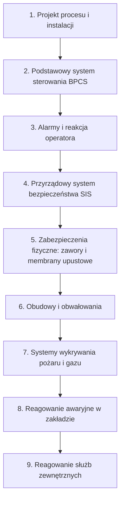

import { SlideContainer, Slide, InstructorNotes, LearningObjective, Example } from '@site/src/components/SlideComponents';

<LearningObjective>

Po tej części student odróżnia funkcje monitoringu od funkcji ochronnych, wymienia warunki, które musi spełnić niezależna warstwa ochrony, i potrafi przeanalizować awarię warstwa po warstwie.

</LearningObjective>

<SlideContainer>

<Slide title="Monitoring a funkcja ochronna" type="info">

**Funkcja ochronna** działa sama i doprowadza instalację do stanu bezpiecznego. **Monitoring** dostarcza informacji człowiekowi, który dopiero decyduje, co zrobić.

| Cecha | Warstwa ochrony | Monitoring |
|---|---|---|
| Działanie | samoczynne albo określona, przećwiczona reakcja człowieka | informacja dla człowieka |
| Czas reakcji | zdefiniowany, krótszy niż czas do wystąpienia szkody | godziny, dni, tygodnie |
| Niezależność | od przyczyny zdarzenia i od innych warstw | często wspólny sprzęt i sieć ze sterowaniem |
| Weryfikacja | testy okresowe, cel PFD, SIL lub PL | zwykle brak celu niezawodności |
| Zaliczenie w analizie LOPA | tak | nie; wspiera inne warstwy |

- PFD (Probability of Failure on Demand) to prawdopodobieństwo niezadziałania na żądanie, PL (Performance Level) to poziom zapewnienia bezpieczeństwa wg ISO 13849-1, a LOPA (Layer of Protection Analysis) to analiza warstw zabezpieczeń (W2).
- Funkcje ochronne projektuje się według norm bezpieczeństwa funkcjonalnego (IEC 61508, IEC 61511, ISO 13849-1, IEC 62061).
- DNV o systemach monitorowania stanu turbin (CMS): CMS nie zastępuje niezależnych systemów bezpieczeństwa i nie może ingerować w system bezpieczeństwa ani sterowania.

Źródło: zestawienie na podstawie [University of Michigan, SAFEChE](https://safeche.engin.umich.edu/tutorials/lopa-tutorial); [HSE RR716, 2009](https://www.hse.gov.uk/research/rrpdf/rr716.pdf); [DNV-SE-0439](https://www.dnv.com/energy/standards-guidelines/dnv-se-0439-certification-of-condition-monitoring/)

<InstructorNotes>

Czas: ~2,5 min

To jest centralne rozróżnienie całego przedmiotu, który nazywa się „Systemy bezpieczeństwa i monitorowania”. Oba elementy są potrzebne, ale pełnią inne role. Zabezpieczenie działa samo, w określonym czasie, i jest testowane. Monitoring pokazuje stan instalacji i czeka, aż ktoś zareaguje.

Najlepszy dowód, że to nie jest akademicki podział, pochodzi od jednostki certyfikującej. DNV w dokumencie o certyfikacji systemów monitorowania stanu turbin pisze wprost, że taki system nie zastępuje niezależnych systemów bezpieczeństwa i nie może ingerować w system bezpieczeństwa.

Pytanie: czy czujnik temperatury w kontenerze BESS to monitoring, czy zabezpieczenie? Odpowiedź: zależy od tego, co się dzieje z jego sygnałem. Jeżeli trafia tylko na ekran, to monitoring. Jeżeli samoczynnie wyłącza baterię i jest testowany, może być elementem funkcji ochronnej.

</InstructorNotes>

</Slide>

<Slide title="Warstwy ochrony w modelu cebuli" type="info">

- Kolejność warstw według CCPS (za materiałami SAFEChE). Każda następna warstwa działa, gdy poprzednia zawiedzie.
- BPCS (Basic Process Control System) to podstawowy system sterowania, np. sterownik farmy lub biogazowni.
- IEC 61511-1 (rys. 9) grupuje warstwy w sterowanie i monitoring, zapobieganie, ograniczanie skutków oraz reagowanie awaryjne (wg prezentacji Purdue P2SAC). **Monitoring należy do grupy sterowania**, razem z BPCS.

Źródło: [University of Michigan, SAFEChE](https://safeche.engin.umich.edu/tutorials/lopa-tutorial); [Goteti, Purdue P2SAC, 2020](https://engineering.purdue.edu/P2SAC/presentations/documents/Safety_Life_Cycle_Per_IEC_ISA_61511_1.pdf); [CCPS, 2015](https://ccps.aiche.org/publications/books/guidelines-initiating-events-and-independent-protection-layers-layer-protection-analysis)

<InstructorNotes>

Czas: ~3 min

Model cebuli pochodzi z przemysłu procesowego, ale pasuje do każdej instalacji OZE. Najgłębsza warstwa to sam projekt, na przykład wybór mniej niebezpiecznej technologii. Potem jest zwykłe sterowanie, potem alarm i operator, dalej automatyczny system bezpieczeństwa i zabezpieczenia mechaniczne, które działają bez zasilania. Zewnętrzne warstwy nie zapobiegają już zdarzeniu, tylko ograniczają jego skutki: obwałowania, detekcja pożaru, akcja ratownicza.

Proszę spróbować przyporządkować warstwy do biogazowni. Warstwa piąta to na przykład zabezpieczenie nad- i podciśnieniowe zbiornika gazu, które działa czysto mechanicznie. Warstwa dziewiąta to straż pożarna.

Najważniejsza uwaga: monitoring leży w tej samej grupie co zwykłe sterowanie. Jeżeli sterowanie zawiedzie, na przykład zawiesi się sterownik, monitoring często zawiedzie razem z nim.

</InstructorNotes>

</Slide>

<Slide title="Model sera szwajcarskiego" type="warning">

- Reason (2000): każda bariera jest jak plaster sera szwajcarskiego z dziurami, które otwierają się, zamykają i przesuwają.
- Wypadek następuje, gdy dziury w wielu warstwach na chwilę ustawią się w jednej linii.
- **Błędy czynne** to niebezpieczne działania osób, które mają bezpośredni kontakt z systemem. **Uwarunkowania ukryte** to decyzje projektowe i organizacyjne, które tworzą długotrwałe słabości barier.
- Podejście systemowe: nie zmienimy natury człowieka, ale możemy zmienić warunki, w jakich pracuje.
- Przykłady ukrytych dziur w OZE: wyłączony monitoring, alarmy, na które nikt nie reaguje, łącze SCADA, które przestało działać bez sygnalizacji.
- Warstwy na wspólnym sterowniku mają dziury skorelowane. HSE (RR716) stwierdził, że wspólny sterownik PLC dwóch warstw tworzy przyczynę wspólną i narusza kryterium niezależności.

Źródło: [Reason, BMJ 2000](https://doi.org/10.1136/bmj.320.7237.768); [Reason, 1990](https://doi.org/10.1017/CBO9781139062367); [HSE RR716, 2009](https://www.hse.gov.uk/research/rrpdf/rr716.pdf)

<InstructorNotes>

Czas: ~2 min

Model powstał w badaniach awarii złożonych systemów technicznych (Reason, 1990); w artykule z BMJ (2000) autor zastosował go w medycynie. Żadna bariera nie jest doskonała, każda ma dziury. Wypadek wymaga, żeby dziury w kilku barierach ustawiły się naraz.

Dla inżyniera najważniejsze są dziury ukryte. To nie są błędy popełnione w chwili wypadku, tylko decyzje sprzed miesięcy lub lat: brak procedury, oszczędność na czujniku, jeden sterownik do wszystkiego. Druga lekcja dotyczy korelacji. Jeżeli dwie warstwy korzystają z tego samego sterownika, jego awaria otwiera dziury w obu naraz. Wtedy nie są to dwie warstwy, tylko jedna.

Typowe nieporozumienie: „winny jest człowiek, który popełnił błąd”. Reason pokazuje, że błąd człowieka jest zwykle ostatnim ogniwem, a nie przyczyną źródłową.

</InstructorNotes>

</Slide>

<Slide title="Kiedy warstwa jest warstwą ochrony" type="tip">

- Kryteria CCPS dla **niezależnej warstwy ochrony** (IPL, Independent Protection Layer): jest **skuteczna** (zapobiega skutkowi), **niezależna** od zdarzenia inicjującego i od innych warstw oraz **audytowalna** (można ją zwalidować, przetestować i udokumentować).
- Wg Derbyshire (IChemE, 2016) IEC 61511-1:2016 (pkt 9.3) pozwala przyjąć dla warstwy w BPCS niezaprojektowanego według IEC 61511 zmniejszenie ryzyka **≤ 10**, czyli PFD ≥ 0,1. Gdy BPCS jest źródłem zdarzenia, w danym scenariuszu można zaliczyć najwyżej jedną warstwę BPCS.
- **Alarm** to sygnał wymagający od operatora terminowej reakcji (ISA-18.2). Komunikat, który nie wymaga działania, nie jest alarmem.
- Reakcję operatora na alarm można zaliczyć z PFD nie mniejszym niż 0,1 (czyli redukcja ryzyka najwyżej 10) tylko gdy alarm jest niezależny od przyczyny, jest czas na wykrycie, diagnozę i działanie, a procedura jest formalna i audytowalna (HSE RR716; exida). exida zaleca PFD ≥ 0,5, jeśli system alarmowy nie został zracjonalizowany lub jego działania nie potwierdzono pomiarami.
- HSE (CHIS6): długoterminowa średnia w normalnej pracy — nie więcej niż 1 alarm na 10 min.

<Example title="Przykład ilustracyjny — dane umowne">

Dwie niezależne warstwy o PFD 0,1 i 0,01 dają łącznie $0{,}1 \cdot 0{,}01 = 0{,}001$, czyli zmniejszenie ryzyka 1000 razy. Jeżeli obie korzystają z tego samego sterownika, mnożenie jest nieuprawnione.

</Example>

Źródło: [University of Michigan, SAFEChE](https://safeche.engin.umich.edu/tutorials/lopa-tutorial); [Derbyshire, IChemE 2016](https://www.icheme.org/media/11752/hazards-26-paper-15-iec-61511-functional-safety-in-the-process-industry-the-long-awaited-iec-61511-edition-2-and-what-it-means-for-the-process-industry.pdf); [Dunn i Sands, ISA InTech 2020](https://www.isa.org/intech-home/2020/march-april/features/alarm-management-questions-that-everyone-asks); [HSE RR716, 2009](https://www.hse.gov.uk/research/rrpdf/rr716.pdf); [Stauffer i Clarke, exida 2012](https://www.exida.com/articles/UsingAlarmsasaLayerofProtection.pdf); [HSE CHIS6, 2000](https://www.hse.gov.uk/pubns/chis6.pdf)

<InstructorNotes>

Czas: ~2,5 min

Trzy słowa do zapamiętania: skuteczna, niezależna, audytowalna. Jeśli którejkolwiek cechy brakuje, warstwa nie jest warstwą ochrony w sensie analizy ryzyka, nawet jeśli coś robi.

Zwykły system sterowania dostaje najwyżej współczynnik dziesięć. Dlaczego tak mało? Bo nie projektuje się go według norm bezpieczeństwa funkcjonalnego i często to on jest przyczyną problemu. Podobnie z operatorem. Alarm, na który operator ma pięć sekund, albo alarm tonący w setce innych komunikatów, nie może być warstwą ochrony.

Przykład liczbowy jest umowny i pokazuje tylko zasadę. Prawdopodobieństwa mnożymy wyłącznie wtedy, gdy warstwy są naprawdę niezależne. Szczegółowe obliczenia zrobimy w W2.

Pytanie: czy SMS do dyżurnego z systemu SCADA farmy PV spełnia kryteria warstwy ochrony? Proszę sprawdzić każde z trzech kryteriów osobno.

</InstructorNotes>

</Slide>

<Slide title="Monitoring i ochrona w technologiach OZE" type="info">

| Technologia | Funkcje monitoringu | Funkcje ochronne |
|---|---|---|
| PV | wydajność (IEC 61724-1), prądy stringów, termowizja (IEC TS 62446-3) | monitorowanie prądu różnicowego w falowniku (IEC 62109-2, wg Sandia); detekcja łuku DC (IEC 63027); zabezpieczenie sieciowe z wykrywaniem pracy wyspowej (EN 50549-1) |
| Wiatr | monitorowanie stanu (CMS): drgania układu napędowego; SCADA | niezależny system bezpieczeństwa turbiny, np. przy nadmiernej prędkości obrotowej (DNV-ST-0438; W7) |
| BESS | EMS i SCADA, trendy danych z BMS | odłączenie przez BMS po przekroczeniu granic napięcia, prądu lub temperatury; detekcja gazu z wentylacją lub odciążeniem wybuchowym; bariery termiczne |
| Biogaz | poziom w zbiorniku gazu, temperatura i ciśnienie w komorze, praca agregatu | mechaniczne zabezpieczenia nad- i podciśnieniowe (TRAS 120); detekcja gazu z działaniem automatycznym (IEC 60079-29-0) |

- Funkcje ochronne działają lokalnie, w milisekundach lub sekundach, i są częścią certyfikowanego wyrobu albo instalacji. Monitoring działa w skali godzin do miesięcy i wymaga decyzji człowieka.
- Projekt nowych WT (wersja z 6.08.2026, część 3) zapisuje ten podział: BMS ma monitorować napięcie, prąd i temperaturę, ale także sam odłączać baterię; detektor gazu ma nie tylko alarmować, lecz także sterować wentylacją i odłączać baterie (§ 311, § 315).

Źródło: [IEC 61724-1:2021](https://webstore.iec.ch/en/publication/65561); [IEC TS 62446-3:2017](https://webstore.iec.ch/en/publication/28628); [Flicker i in., Sandia 2014](https://www.osti.gov/servlets/purl/1313068); [IEC 63027:2023](https://webstore.iec.ch/en/publication/27362); [EN 50549-1:2019, fragment](https://cdn.standards.iteh.ai/samples/63319/b79e8a132ea843cd83cd14550c14978a/SIST-EN-50549-1-2019.pdf); [DNV-SE-0439](https://www.dnv.com/energy/standards-guidelines/dnv-se-0439-certification-of-condition-monitoring/); [DNV-ST-0438](https://www.dnv.com/energy/standards-guidelines/dnv-st-0438-control-and-protection-systems-for-wind-turbines/); [DNV GL, 2020](https://www.aps.com/-/media/APS/APSCOM-PDFs/About/Our-Company/Newsroom/McMickenFinalTechnicalReport.pdf?la=en&sc_lang=en&hash=5447FA391CD988DD24226FA485F81F23); [KAS, TRAS 120](https://www.kas-bmu.de/files/publikationen/TRAS/TRAS%20(endgueltige%20Fassung)/LesefassTRAS120.pdf); [IEC 60079-29-0:2025](https://webstore.iec.ch/en/publication/77173)

<InstructorNotes>

Czas: ~2,5 min

Ta tabela to mapa kolejnych wykładów. Proszę spojrzeć na kolumny osobno. W lewej są rzeczy, które pokazują stan: wydajność, drgania, trendy. W prawej są rzeczy, które same działają: falownik odłącza się przy prądzie upływu, detektor przerywa łuk, BMS odłącza baterię, zawór hydrauliczny upuszcza nadmiar gazu.

Tę samą wielkość fizyczną można mierzyć w obu kolumnach. Temperatura ogniwa w BMS może wyłączyć baterię, a ta sama temperatura na wykresie w SCADA jest tylko informacją. O przynależności decyduje droga sygnału i sposób zaprojektowania, a nie czujnik.

Szczegóły każdej technologii omówimy w W6, W7, W8 i W9.

Typowe nieporozumienie: „termowizja chroni instalację PV przed pożarem”. Termowizja pozwala znaleźć gorące złącze, zanim się zapali. Ochrona pojawia się dopiero wtedy, gdy ktoś to złącze wymieni.

</InstructorNotes>

</Slide>

<Slide title="McMicken 2019 warstwa po warstwie" type="danger">

| Warstwa | Stan w McMicken | Skutek |
|---|---|---|
| Jakość ogniwa | wada wewnętrzna: osadzanie litu i dendryty | początek procesu w jednym ogniwie |
| BMS i monitoring | zarejestrował spadek napięcia ogniwa z 4,06 do 3,82 V o 16:54:30; system ochrony otworzył wyłączniki DC i styczniki AC ok. 16:55:20 | odłączenie nie zatrzymało zwarcia wewnętrznego w ogniwie |
| Bariery termiczne | brak | propagacja w całym stojaku |
| Gaszenie (Novec 1230) | zadziałało zgodnie z projektem | nie zatrzymało procesu |
| Detekcja gazu i wentylacja | brak | nagromadzenie palnych gazów |
| Plan reagowania | brak procedury gaszenia, wentylacji i wejścia | otwarcie drzwi po ok. 3 h, deflagracja, 4 strażaków ciężko rannych |

- DNV GL wymienia pięć czynników: awaria ogniwa, gaszenie niezdolne zatrzymać proces, brak barier termicznych, gazy bez wentylacji, plan awaryjny bez procedur. To dziury ustawione w jednej linii.
- Monitoring i odłączenie zadziałały, ale ani pomiar, ani odłączenie nie zatrzymują zwarcia wewnętrznego w ogniwie; dane posłużyły do analizy po zdarzeniu.

Źródło: [DNV GL, 2020](https://www.aps.com/-/media/APS/APSCOM-PDFs/About/Our-Company/Newsroom/McMickenFinalTechnicalReport.pdf?la=en&sc_lang=en&hash=5447FA391CD988DD24226FA485F81F23); [UL FSRI, 2020](https://fsri.org/research-update/report-four-firefighters-injured-lithium-ion-battery-energy-storage-system)

<InstructorNotes>

Czas: ~2,5 min

Rozkładamy teraz McMicken na warstwy. Pierwsza warstwa zawiodła, bo ogniwo miało wadę wewnętrzną, której nie da się wykryć z zewnątrz. BMS zapisał spadek napięcia, a niecałą minutę później system ochrony odłączył baterię. Ani zapis, ani odłączenie nie zatrzymują jednak zwarcia wewnętrznego w ogniwie. Barier między ogniwami nie było, więc ciepło przeszło na cały stojak. Gaszenie zadziałało zgodnie z projektem, ale środek gazowy gasi płomień, a nie chłodzi ogniw na tyle, by zatrzymać niekontrolowany wzrost temperatury. Nie było detekcji gazu ani wentylacji, więc gazy się gromadziły. Na końcu zabrakło procedury: plan awaryjny nie przewidywał gaszenia, wentylacji ani bezpiecznego wejścia, więc otwarcie drzwi poruszyło nagromadzone palne gazy, które zapaliły się od gorącego elementu lub iskry.

To jest model sera szwajcarskiego w czystej postaci. Każda z tych dziur sama w sobie nie spowodowałaby wypadku.

Pytanie: którą jedną warstwę dodalibyście, żeby strażacy nie zostali ranni? Proszę uzasadnić wybór kryteriami warstwy ochrony.

</InstructorNotes>

</Slide>

<Slide title="Jak monitoring wspiera bezpieczeństwo" type="success">

- **Wczesne ostrzeganie**: termowizja PV służy m.in. konserwacji zapobiegawczej ze względu na bezpieczeństwo pożarowe (IEC TS 62446-3). CMS można uwzględnić w planie przeglądów turbiny (DNV-SE-0439).
- **Diagnostyka i dowody testów**: zapisy prób okresowych i zadziałań pokazują, czy warstwy ochrony mają zakładaną niezawodność. IEC 61511 wyd. 2 wymaga m.in. próby po naprawie (wg Derbyshire, 2016).
- **Rejestracja sekwencji zdarzeń** (SOE, Sequence of Events): dane BMS z McMicken pozwoliły odtworzyć przebieg awarii co do sekundy.
- **Wskaźniki systemu alarmowego**: IEC 62682:2022 (rozdz. 16) opisuje ocenę m.in. średniej i szczytowej liczby alarmów na konsolę operatora.
- **Granice**: „w SCADA wszystko było zielone” nie dowodzi, że zabezpieczenia działają. W instalacjach bez stałej obsługi reakcja zdalnego operatora bywa powolna, dlatego główny ciężar spoczywa na automatyce (ocena własna).
- W W2 policzymy, o ile każda warstwa zmniejsza ryzyko (LOPA, SIL).

Źródło: [IEC TS 62446-3:2017](https://webstore.iec.ch/en/publication/28628); [DNV-SE-0439](https://www.dnv.com/energy/standards-guidelines/dnv-se-0439-certification-of-condition-monitoring/); [Derbyshire, IChemE 2016](https://www.icheme.org/media/11752/hazards-26-paper-15-iec-61511-functional-safety-in-the-process-industry-the-long-awaited-iec-61511-edition-2-and-what-it-means-for-the-process-industry.pdf); [DNV GL, 2020](https://www.aps.com/-/media/APS/APSCOM-PDFs/About/Our-Company/Newsroom/McMickenFinalTechnicalReport.pdf?la=en&sc_lang=en&hash=5447FA391CD988DD24226FA485F81F23); [IEC 62682:2022, fragment](https://cdn.standards.iteh.ai/samples/103485/6f7b44e368fc4f4d93216f716a51771a/IEC-62682-2022.pdf)

<InstructorNotes>

Czas: ~2 min

Po tym wszystkim ktoś mógłby pomyśleć, że monitoring jest mało ważny. Tak nie jest. Monitoring nie jest warstwą ochrony, ale wspiera wszystkie warstwy. Pozwala wykryć usterkę, zanim stanie się zdarzeniem inicjującym. Dostarcza dowodów, że zabezpieczenia są sprawne. Zapisuje przebieg zdarzeń, dzięki czemu możemy uczyć się na awariach. Mierzy też, czy system alarmowy nie przytłacza operatora.

Trzeba jednak pamiętać o jego granicach. Zielony ekran w SCADA oznacza tylko tyle, że nic nie przyszło. Nie oznacza, że wszystko działa. Jeżeli łącze padło, ekran też może być zielony.

W kolejnych wykładach, od W3 do W5, zajmiemy się tym, jak zbudować monitoring, któremu można ufać. W W2 policzymy wkład poszczególnych warstw w zmniejszenie ryzyka.

</InstructorNotes>

</Slide>

</SlideContainer>

## Źródła

1. University of Michigan, SAFEChE, *LOPA tutorial* (kryteria IPL i warstwy wg CCPS). https://safeche.engin.umich.edu/tutorials/lopa-tutorial
2. CCPS, *Guidelines for Initiating Events and Independent Protection Layers in Layer of Protection Analysis*, 2015, CCPS/Wiley. https://ccps.aiche.org/publications/books/guidelines-initiating-events-and-independent-protection-layers-layer-protection-analysis
3. Goteti P. (Honeywell Process Solutions), *Safety Life Cycle per IEC/ISA 61511*, Purdue P2SAC, 1.12.2020. https://engineering.purdue.edu/P2SAC/presentations/documents/Safety_Life_Cycle_Per_IEC_ISA_61511_1.pdf
4. Derbyshire A.W., *The long awaited IEC 61511 edition 2 and what it means for the process industry*, IChemE Symposium Series 161 (Hazards 26), 2016. https://www.icheme.org/media/11752/hazards-26-paper-15-iec-61511-functional-safety-in-the-process-industry-the-long-awaited-iec-61511-edition-2-and-what-it-means-for-the-process-industry.pdf
5. HSL dla HSE, *A review of Layers of Protection Analysis (LOPA) analyses of overfill of fuel storage tanks*, Research Report RR716, 2009. https://www.hse.gov.uk/research/rrpdf/rr716.pdf
6. Reason J., *Human error: models and management*, BMJ 320(7237), 2000, s. 768–770. https://doi.org/10.1136/bmj.320.7237.768
7. Reason J., *Human Error*, Cambridge University Press, 1990 (m.in. rozdz. 7 „Latent errors and systems disasters”). https://doi.org/10.1017/CBO9781139062367
8. Dunn D.G., Sands N.P., *Alarm management questions that everyone asks*, ISA InTech, III–IV 2020. https://www.isa.org/intech-home/2020/march-april/features/alarm-management-questions-that-everyone-asks
9. Stauffer T., Clarke P., *Using Alarms as a Layer of Protection*, exida, 2012. https://www.exida.com/articles/UsingAlarmsasaLayerofProtection.pdf
10. HSE, *Better alarm handling*, Chemicals Information Sheet No 6, 2000. https://www.hse.gov.uk/pubns/chis6.pdf
11. IEC, *IEC 62682:2022 Management of alarm systems for the process industries* (fragment udostępniony przez dystrybutora norm). https://cdn.standards.iteh.ai/samples/103485/6f7b44e368fc4f4d93216f716a51771a/IEC-62682-2022.pdf
12. DNV, *DNV-SE-0439 Certification of condition monitoring*, wyd. 06.2016 (zm. 10.2021). https://www.dnv.com/energy/standards-guidelines/dnv-se-0439-certification-of-condition-monitoring/
13. DNV, *DNV-ST-0438 Control and protection systems for wind turbines*. https://www.dnv.com/energy/standards-guidelines/dnv-st-0438-control-and-protection-systems-for-wind-turbines/
14. Flicker J., Armijo K., Johnson J., *Recommendations for RCD Ground Fault Detector Trip Thresholds*, SAND2014-17754C, Sandia National Laboratories, 2014. https://www.osti.gov/servlets/purl/1313068
15. IEC, *IEC 63027:2023 Photovoltaic power systems – DC arc detection and interruption*, 2023. https://webstore.iec.ch/en/publication/27362
16. CENELEC, *EN 50549-1:2019 Requirements for generating plants to be connected in parallel with distribution networks – Part 1* (fragment udostępniony przez dystrybutora norm). https://cdn.standards.iteh.ai/samples/63319/b79e8a132ea843cd83cd14550c14978a/SIST-EN-50549-1-2019.pdf
17. IEC, *IEC 61724-1:2021 Photovoltaic system performance – Part 1: Monitoring*, 2021. https://webstore.iec.ch/en/publication/65561
18. IEC, *IEC TS 62446-3:2017 Photovoltaic modules and plants – Outdoor infrared thermography*, 2017. https://webstore.iec.ch/en/publication/28628
19. DNV GL (Hill D.M.) dla APS, *McMicken Battery Energy Storage System Event – Technical Analysis and Recommendations*, 18.07.2020. https://www.aps.com/-/media/APS/APSCOM-PDFs/About/Our-Company/Newsroom/McMickenFinalTechnicalReport.pdf?la=en&sc_lang=en&hash=5447FA391CD988DD24226FA485F81F23
20. UL FSRI, *Four Firefighters Injured In Lithium-Ion Battery Energy Storage System Explosion – Arizona*, 2020. https://fsri.org/research-update/report-four-firefighters-injured-lithium-ion-battery-energy-storage-system
21. KAS, *TRAS 120 Sicherheitstechnische Anforderungen an Biogasanlagen* (Lesefassung), 2018/2019. https://www.kas-bmu.de/files/publikationen/TRAS/TRAS%20(endgueltige%20Fassung)/LesefassTRAS120.pdf
22. IEC, *IEC 60079-29-0:2025 Explosive atmospheres – Part 29-0: Gas detection equipment – General requirements and test methods*, 2025. https://webstore.iec.ch/en/publication/77173
