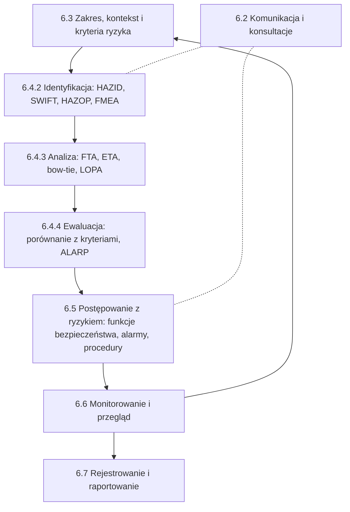

import { SlideContainer, Slide, InstructorNotes, LearningObjective } from '@site/src/components/SlideComponents';

<LearningObjective>

Student umieszcza metody analizy ryzyka w procesie ISO 31000:2018, dobiera metodę według IEC 31010:2019 i rozumie, skąd biorą się kryteria tolerowalności oraz dlaczego matryca ryzyka ma ograniczenia.

</LearningObjective>

<SlideContainer>

<Slide title="Powtórka z W1 i pytania na dziś" type="info">

- **Zagrożenie** to potencjalne źródło szkody, a **ryzyko** to kombinacja prawdopodobieństwa wystąpienia szkody i jej ciężkości (ISO 17776:2016, 3.1.8 i 3.1.17). Ryzyko resztkowe i pozostałe definicje: [W1](../wyklad-01-zagrozenia-ramy-prawne/index.md).
- ISO 31000:2018 definiuje ryzyko szerzej: jako wpływ niepewności na cele. W bezpieczeństwie technicznym posługujemy się definicją „prawdopodobieństwo i ciężkość szkody”.
- **Warstwy ochrony** (model „cebuli” CCPS, Center for Chemical Process Safety): proces, podstawowy system sterowania, alarmy z reakcją operatora, przyrządowy system bezpieczeństwa (SIS, Safety Instrumented System), zabezpieczenia mechaniczne, ograniczanie skutków, reagowanie awaryjne.
- Dzisiejsze pytania: jakie scenariusze awarii są możliwe, jak często i z jakim skutkiem wystąpią oraz ile warstw ochrony i jakiej jakości potrzeba.
- Odpowiedź daje zestaw metod: HAZID, HAZOP, FMEA, FTA, ETA, bow-tie i LOPA z doborem SIL.

Źródło: [ISO 17776:2016, próbka normy](https://cdn.standards.iteh.ai/samples/63062/31506ec1697048de9e86ca03644d2790/ISO-17776-2016.pdf); [ISO, 2018](https://www.iso.org/news/ref2263.html); [U. Michigan SAFEChE, samouczek LOPA](https://safeche.engin.umich.edu/tutorials/lopa-tutorial)

<InstructorNotes>

Czas: ~2 min

Na pierwszym wykładzie ustaliliśmy język: zagrożenie, ryzyko, ryzyko resztkowe i warstwy ochrony. Dziś odpowiadamy na pytanie praktyczne: skąd projektant wie, jakie scenariusze awarii rozważyć i ile zabezpieczeń zastosować. Proszę zwrócić uwagę na dwie definicje ryzyka. W zarządzaniu organizacją ISO 31000 mówi o wpływie niepewności na cele, który może być też pozytywny. W bezpieczeństwie technicznym interesuje nas szkoda, jej prawdopodobieństwo i ciężkość. Model cebuli z W1 będzie dziś wracał w LOPA: każdą warstwę trzeba będzie policzyć.

Pytanie do sali: czy system SCADA farmy PV, czyli system nadzoru i zbierania danych, jest warstwą ochrony? Typowe nieporozumienie: „skoro widzimy alarm, to jesteśmy chronieni”. Wrócimy do tego przy kryteriach niezależnej warstwy ochrony.

</InstructorNotes>

</Slide>

<Slide title="Proces ISO 31000 i miejsce metod" type="info">

- ISO 31000:2018 to wytyczne (nie podlegają certyfikacji). Rozdział 6 opisuje proces, a jego rdzeniem jest **ocena ryzyka**: identyfikacja, analiza i ewaluacja (6.4).
- **Ewaluacja ryzyka** polega na porównaniu wyników analizy z ustalonymi wcześniej kryteriami ryzyka (6.4.4). Kryteria ustala się na etapie kontekstu (6.3.4).
- Przyporządkowanie metod na schemacie odpowiada rodzinom technik z IEC 31010:2019, załącznik B.
- Stan normy (wrzesień 2026): ISO 31000:2018 obowiązuje, ale jest w rewizji; projekt ISO/CD 31000 (wyd. 3) zamknął konsultacje 1.03.2026.

Źródło: [ISO 31000:2018, podgląd ANSI](https://webstore.ansi.org/preview-pages/ISO/preview_ISO+31000-2018.pdf); [ISO 31000:2018, iso.org](https://www.iso.org/standard/65694.html); [ISO/CD 31000](https://www.iso.org/standard/88574.html); [IEC 31010:2019, podgląd ASSP](https://www.assp.org/docs/default-source/standards-documents/preview/31010_2019_wms_preview.pdf?sfvrsn=75159747_2)

<InstructorNotes>

Czas: ~3 min

Ten schemat to mapa całego wykładu. Najpierw ustalamy zakres i kryteria: co chronimy i jakie ryzyko uznamy za tolerowane. Kryteriów nie wymyśla się po analizie, żeby wynik „pasował”. Potem identyfikujemy zagrożenia metodami HAZID, HAZOP czy FMEA, analizujemy je drzewami i LOPA, a na końcu porównujemy z kryteriami. Postępowanie z ryzykiem to dla inżyniera konkretne decyzje: dodatkowa funkcja bezpieczeństwa, alarm, procedura. Pętla monitorowania i przeglądu oznacza, że analiza nie kończy się na odbiorze instalacji.

Proszę pamiętać, że ISO 31000 jest w rewizji, więc przy pracy dyplomowej warto sprawdzić aktualne wydanie. Typowe nieporozumienie: HAZOP „daje ryzyko”. HAZOP identyfikuje scenariusze; liczby pojawiają się dopiero w analizie.

</InstructorNotes>

</Slide>

<Slide title="Dobór metody według IEC 31010" type="tip">

- IEC 31010:2019 (wyd. 2.0) podaje wytyczne doboru i stosowania technik oceny ryzyka. Grupuje je według zastosowania, a dobór opisuje rozdział 7 z tablicami A.1 i A.2.
- HAZID nie jest osobną pozycją IEC 31010; opisuje go ISO 17776:2016 jako identyfikację zagrożeń na etapach projektu.

| Metoda | Rodzina wg IEC 31010 | Typowy etap | Pytanie, na które odpowiada |
|---|---|---|---|
| HAZID, SWIFT | identyfikacja (SWIFT: B.2.6) | koncepcja | Jakie zagrożenia dotyczą obiektu i otoczenia? |
| HAZOP | identyfikacja (B.2.4) | projekt szczegółowy | Jakie odchylenia są możliwe i czy zabezpieczenia wystarczą? |
| FMEA, FMECA | identyfikacja (B.2.3) | projekt urządzenia, eksploatacja | Jak może uszkodzić się element i co z tego wynika? |
| FTA, ETA | skutki i prawdopodobieństwo (B.5.7, B.5.6) | projekt, badanie zdarzeń | Jakie kombinacje przyczyn i jakie skutki, jak często? |
| bow-tie, LOPA | analiza zabezpieczeń (B.4.2, B.4.4) | projekt, przegląd zabezpieczeń | Czy bariery wystarczą i są niezależne? |

Kolumny „typowy etap” i „pytanie” to zestawienie dydaktyczne; tablice A.1 i A.2 normy stosują własne kryteria doboru.

Skróty: HAZID — Hazard Identification; SWIFT — Structured What-If Technique; HAZOP — Hazard and Operability Study; FMEA, FMECA — Failure Modes and Effects (and Criticality) Analysis; FTA — Fault Tree Analysis; ETA — Event Tree Analysis; LOPA — Layer of Protection Analysis.

Źródło: [IEC 31010:2019, podgląd ASSP](https://www.assp.org/docs/default-source/standards-documents/preview/31010_2019_wms_preview.pdf?sfvrsn=75159747_2); [IEC 31010:2019, IEC Webstore](https://webstore.iec.ch/en/publication/59809); [ISO 17776:2016](https://www.iso.org/standard/63062.html); [IEC 61882:2016, podgląd](https://www.en-standard.eu/publicdoc/iec_previews/121973.pdf)

<InstructorNotes>

Czas: ~2 min

Ta tabela jest ściągą na cały semestr. Dobór metody zaczyna się od pytania, a nie od mody. Na etapie koncepcji farmy wiatrowej nie mamy schematów, więc HAZOP nie ma na czym pracować. Wtedy robimy HAZID z listą kontrolną. Gdy mamy schematy technologiczne biogazowni, HAZOP przechodzi węzeł po węźle. FMEA pasuje do urządzenia, na przykład falownika albo przekładni. FTA i ETA stosujemy, gdy trzeba policzyć częstość konkretnego zdarzenia. LOPA odpowiada na pytanie, czy zabezpieczenia wystarczą.

Zwróćcie uwagę, że IEC 31010 zalicza FMEA i HAZOP do technik identyfikacji. Pytanie do sali: którą metodę wybralibyście dla procedury wymiany łopaty turbiny, gdzie nie ma schematu instalacji? Dobrą odpowiedzią jest SWIFT albo HAZOP procedury, bo IEC 61882 dopuszcza badanie procedur.

</InstructorNotes>

</Slide>

<Slide title="Kryteria tolerowalności ryzyka" type="warning">

- Kryteria ustala organizacja lub regulator przed analizą (ISO 31000, 6.3.4). Nie wynikają z żadnej metody analizy.
- Brytyjski urząd HSE (Health and Safety Executive) w dokumencie R2P2 (Reducing Risks, Protecting People, 2001) dzieli ryzyko na trzy obszary: nietolerowane, tolerowane pod warunkiem ALARP i powszechnie akceptowane.
- Według R2P2 (HSE 2001; te same wartości w dokumencie dyskusyjnym z 1999 r., cyt. Foster 2000) granica ryzyka indywidualnego śmierci wynosi $10^{-3}$/rok dla pracowników i $10^{-4}$/rok dla osób postronnych; $10^{-6}$/rok to granica obszaru powszechnie akceptowanego.
- Ryzyko społeczne: wypadek z ≥ 50 ofiarami śmiertelnymi częstszy niż 1/5000 na rok HSE uznaje za nietolerowany (Foster 2000; Mullins i in. 2018).
- **ALARP** (As Low As Reasonably Practicable — tak nisko, jak jest to rozsądnie wykonalne): ryzyko obniża się, dopóki koszt, czas i trud nie są rażąco nieproporcjonalne do uzyskanej redukcji.
- Przepisy holenderskie (Bkl, art. 5.7): ryzyko lokalizacyjne $10^{-6}$/rok jest wartością graniczną dla budynków i miejsc wrażliwych.
- Polskich liczbowych kryteriów dla instalacji OZE tu nie podajemy; nie były przedmiotem przeglądu źródeł i trzeba je sprawdzić dla konkretnego obiektu.

Źródło: [Foster (HSE), IRPA-10, 2000](https://www.irpa.net/irpa10/cdrom/00637.pdf); [Mullins i in., 2018](https://www.icheme.org/media/16927/hazards-28-paper-21.pdf); [HSE, R2P2](https://assets.publishing.service.gov.uk/media/6634988fcf3b5081b14f30cd/IQ8.10.J_Document_9_Health_and_Safety_Executive__Reducing_risks__protecting_people__HSE_s_decision-making_process__2001.pdf); [HSE, SPC/Permissioning/37](https://www.hse.gov.uk/foi/internalops/hid_circs/permissioning/spc_perm_37/); [HSE, ALARP at a glance](https://www.hse.gov.uk/enforce/expert/alarpglance.htm); [RIVM](https://www.rivm.nl/omgevingsveiligheid/handboek/toelichtingen-kernbegrippen/afstanden-en-gebieden); [IPLO](https://iplo.nl/thema/externe-veiligheid/externe-veiligheid-in-omgevingsplan/plaatsgebonden-risico/)

<InstructorNotes>

Czas: ~3 min

Liczby z R2P2 pojawiają się w wielu publikacjach o bezpieczeństwie procesowym, ale proszę je traktować jako przykład, a nie polskie prawo. Cytujemy je za referatem autora z HSE z 2000 roku, omawiającym dokument dyskusyjny z 1999 roku, bo pełny tekst R2P2 przeniesiono do archiwum brytyjskiego. Kluczowa idea to trzy obszary. W środkowym obszarze nie wystarczy „zmieścić się w liczbie”: trzeba wykazać, że dalsza redukcja byłaby rażąco nieproporcjonalna do kosztów. Holendrzy stosują wartość $10^{-6}$ na rok jako prawną granicę przy budynkach wrażliwych, a Brytyjczycy jako wytyczną.

Pytanie do sali: skąd wziąć kryterium dla magazynu energii przy osiedlu? Najpierw trzeba sprawdzić przepisy dla danej kategorii obiektu. Tam, gdzie liczbowych kryteriów nie ma, organizacja ustala własne, tak jak przewiduje ISO 31000. Typowe nieporozumienie: ryzyko ALARP oznacza ryzyko zerowe. HSE podkreśla, że tak nie jest.

</InstructorNotes>

</Slide>

<Slide title="Matryca ryzyka: budowa" type="info">

**Przykład ilustracyjny — dane umowne.** Matryca 5 × 5 dla skutków dotyczących ludzi.

| Częstość / skutek | C1 | C2 | C3 | C4 | C5 |
|---|---|---|---|---|---|
| F5: ≥ $10^{-1}$/rok | T | T | N | N | N |
| F4: $10^{-2}$ do $10^{-1}$/rok | A | T | T | N | N |
| F3: $10^{-3}$ do $10^{-2}$/rok | A | A | T | T | N |
| F2: $10^{-4}$ do $10^{-3}$/rok | A | A | A | T | T |
| F1: &lt; $10^{-4}$/rok | A | A | A | A | T |

- Skutki: C1 — pierwsza pomoc; C2 — uraz z absencją; C3 — ciężki trwały uraz; C4 — jedna ofiara śmiertelna; C5 — wiele ofiar śmiertelnych.
- Kategorie: A — akceptowane; T — tolerowane pod warunkiem ALARP; N — nietolerowane. Tu: suma indeksów Fi + Cj ≥ 8 daje N, 6–7 daje T.
- Zasady budowy: logarytmiczne i rozłączne przedziały częstości, każdy stopień skutku to mniej więcej rząd wielkości, osobne skale dla ludzi, środowiska i mienia.
- Granice kategorii kalibruje się względem liczbowych kryteriów tolerowalności (Baybutt 2015). Nie ma normy dla matryc, dlatego firmy tworzą własne (Baybutt 2018).

Źródło: [Baybutt, 2018](https://doi.org/10.1002/prs.11905); [Baybutt, 2015](https://doi.org/10.1016/j.jlp.2015.09.010); obliczenia własne

<InstructorNotes>

Czas: ~2 min

Na osi częstości stosujemy dekady, czyli logarytmiczne i rozłączne przedziały. Kategorie skutków definiujemy słownie i osobno dla ludzi, środowiska i mienia. Kolory w komórkach to decyzja organizacji: tu przyjąłem prostą regułę sumy indeksów, która odpowiada mnożeniu częstości przez skutek w skali logarytmicznej.

Uwaga: ta przykładowa matryca nie jest skalibrowana do R2P2. Komórka F1 × C4, czyli jedna ofiara śmiertelna z częstością do $10^{-4}$ na rok, ma kategorię A, a R2P2 za powszechnie akceptowane uznaje ryzyko indywidualne nie większe niż $10^{-6}$ na rok. Kalibracja wymaga przeliczenia częstości scenariusza na ryzyko indywidualne. Pytanie do sali: do której komórki trafi pożar gondoli bez ofiar, ale z utratą turbiny? Do żadnej, bo ta matryca opisuje tylko ludzi.

</InstructorNotes>

</Slide>

<Slide title="Ograniczenia matrycy ryzyka" type="warning">

- IEC 31010:2019 umieszcza matrycę ryzyka w grupie „rejestrowanie i raportowanie” (B.10.3), a nie wśród technik analizy.
- Cox (2008), słaba rozdzielczość: typowa matryca poprawnie i jednoznacznie porównuje tylko niewielką część losowych par zagrożeń (np. mniej niż 10 %) i nadaje tę samą ocenę ilościowo bardzo różnym ryzykom.
- Cox (2008), błędy: matryca może dać wyższą kategorię ilościowo mniejszemu ryzyku; gdy częstość i skutek są ujemnie skorelowane, bywa „gorsza niż bezużyteczna”.
- Kategorie nie nadają się do rozdziału środków na redukcję ryzyka, a ocena skutków jest subiektywna: różni oceniający mogą dać przeciwne oceny tego samego ryzyka.
- Kompresja zakresu w naszej matrycy: F2 × C4 i F3 × C4 (jedna ofiara) mają tę samą kategorię T, choć częstości różnią się ok. 10 razy.
- Komórki F4 × C2 (uraz z absencją) i F2 × C4 (ofiara śmiertelna) matryca traktuje jako równoważne (obie T), choć szkody są innego rodzaju.
- Baybutt (2016) opisuje odwrócenie rankingu ryzyk. Zalecenie: kalibrować matrycę i dokumentować założenia ocen.

Źródło: [Cox, 2008](https://doi.org/10.1111/j.1539-6924.2008.01030.x); [PubMed 18419665](https://pubmed.ncbi.nlm.nih.gov/18419665/); [Baybutt, 2016](https://doi.org/10.1002/prs.11768); [IEC 31010:2019, podgląd ASSP](https://www.assp.org/docs/default-source/standards-documents/preview/31010_2019_wms_preview.pdf?sfvrsn=75159747_2)

<InstructorNotes>

Czas: ~2 min

Cox wykazał, że matryca ma słabą rozdzielczość i może błędnie szeregować ryzyka; należy jej używać ostrożnie, opisując założenia. IEC 31010 zalicza ją do technik rejestrowania i raportowania (B.10.3). Najważniejsze zjawisko to kompresja zakresu: w jednej kategorii lądują ryzyka różniące się o rząd wielkości, jak jedna ofiara przy częstości F2 i F3. Z kolei częsty uraz z absencją i rzadka ofiara śmiertelna mają ten sam kolor, choć społecznie oceniamy je zupełnie inaczej.

Nie znaczy to, że matrycy nie wolno używać. Wolno, pod warunkiem że jest skalibrowana, a założenia ocen są zapisane. Typowe nieporozumienie: „ryzyko w zielonym polu nie wymaga działań”. Czasem tanie działanie w zielonym polu daje więcej niż drogie w żółtym. Pytanie do sali: co zrobić, gdy dwie osoby w zespole oceniają ten sam scenariusz na C3 i C5? Wrócić do definicji kategorii i zapisać, na jakim scenariuszu opiera się ocena.

</InstructorNotes>

</Slide>

</SlideContainer>

## Źródła

1. International Organization for Standardization (2018). *ISO 31000:2018 Risk management — Guidelines* (podgląd). ANSI Webstore. [https://webstore.ansi.org/preview-pages/ISO/preview_ISO+31000-2018.pdf](https://webstore.ansi.org/preview-pages/ISO/preview_ISO+31000-2018.pdf)
2. International Organization for Standardization (2018). *ISO 31000:2018* — karta normy (status: do rewizji). [https://www.iso.org/standard/65694.html](https://www.iso.org/standard/65694.html)
3. International Organization for Standardization (2026). *ISO/CD 31000 Risk management — Guidelines* (projekt wyd. 3). [https://www.iso.org/standard/88574.html](https://www.iso.org/standard/88574.html)
4. International Organization for Standardization (2018). The new ISO 31000 keeps risk management simple. [https://www.iso.org/news/ref2263.html](https://www.iso.org/news/ref2263.html)
5. IEC/ISO (2019). *IEC 31010:2019 Risk management — Risk assessment techniques*, wyd. 2.0. IEC Webstore. [https://webstore.iec.ch/en/publication/59809](https://webstore.iec.ch/en/publication/59809); podgląd (ASSP): [https://www.assp.org/docs/default-source/standards-documents/preview/31010_2019_wms_preview.pdf?sfvrsn=75159747_2](https://www.assp.org/docs/default-source/standards-documents/preview/31010_2019_wms_preview.pdf?sfvrsn=75159747_2)
6. International Organization for Standardization (2016). *ISO 17776:2016 Petroleum and natural gas industries — Offshore production installations — Major accident hazard management during the design of new installations*. [https://www.iso.org/standard/63062.html](https://www.iso.org/standard/63062.html); próbka: [https://cdn.standards.iteh.ai/samples/63062/31506ec1697048de9e86ca03644d2790/ISO-17776-2016.pdf](https://cdn.standards.iteh.ai/samples/63062/31506ec1697048de9e86ca03644d2790/ISO-17776-2016.pdf)
7. IEC (2016). *IEC 61882:2016 Hazard and operability studies (HAZOP studies) — Application guide*, podgląd. [https://www.en-standard.eu/publicdoc/iec_previews/121973.pdf](https://www.en-standard.eu/publicdoc/iec_previews/121973.pdf)
8. University of Michigan, SAFEChE (b.d.). *LOPA tutorial*. [https://safeche.engin.umich.edu/tutorials/lopa-tutorial](https://safeche.engin.umich.edu/tutorials/lopa-tutorial)
9. Health and Safety Executive (2001). *Reducing risks, protecting people: HSE's decision-making process* (R2P2). HSE Books. [https://assets.publishing.service.gov.uk/media/6634988fcf3b5081b14f30cd/IQ8.10.J_Document_9_Health_and_Safety_Executive__Reducing_risks__protecting_people__HSE_s_decision-making_process__2001.pdf](https://assets.publishing.service.gov.uk/media/6634988fcf3b5081b14f30cd/IQ8.10.J_Document_9_Health_and_Safety_Executive__Reducing_risks__protecting_people__HSE_s_decision-making_process__2001.pdf)
10. Foster R.B. (HSE) (2000). Reducing Risks, Protecting People — A Harmonised Approach. IRPA-10 (Hiroshima, 14–19.05.2000), referat P-10-158. [https://www.irpa.net/irpa10/cdrom/00637.pdf](https://www.irpa.net/irpa10/cdrom/00637.pdf)
11. Health and Safety Executive (b.d.). *Guidance on ALARP Decisions in COMAH* (SPC/Permissioning/37, wytyczne wycofane). [https://www.hse.gov.uk/foi/internalops/hid_circs/permissioning/spc_perm_37/](https://www.hse.gov.uk/foi/internalops/hid_circs/permissioning/spc_perm_37/)
12. Health and Safety Executive (b.d.). *ALARP „at a glance”*. [https://www.hse.gov.uk/enforce/expert/alarpglance.htm](https://www.hse.gov.uk/enforce/expert/alarpglance.htm)
13. RIVM (b.d.). *Handboek Omgevingsveiligheid — Afstanden en gebieden*. [https://www.rivm.nl/omgevingsveiligheid/handboek/toelichtingen-kernbegrippen/afstanden-en-gebieden](https://www.rivm.nl/omgevingsveiligheid/handboek/toelichtingen-kernbegrippen/afstanden-en-gebieden)
14. IPLO (b.d.). *Plaatsgebonden risico in het omgevingsplan*. [https://iplo.nl/thema/externe-veiligheid/externe-veiligheid-in-omgevingsplan/plaatsgebonden-risico/](https://iplo.nl/thema/externe-veiligheid/externe-veiligheid-in-omgevingsplan/plaatsgebonden-risico/)
15. Cox L.A. Jr. (2008). What's wrong with risk matrices? *Risk Analysis* 28(2): 497–512. [https://doi.org/10.1111/j.1539-6924.2008.01030.x](https://doi.org/10.1111/j.1539-6924.2008.01030.x)
16. Baybutt P. (2015). Calibration of risk matrices for process safety. *Journal of Loss Prevention in the Process Industries* 38: 163–168. [https://doi.org/10.1016/j.jlp.2015.09.010](https://doi.org/10.1016/j.jlp.2015.09.010)
17. Baybutt P. (2016). Designing risk matrices to avoid risk ranking reversal errors. *Process Safety Progress* 35(1): 41–46. [https://doi.org/10.1002/prs.11768](https://doi.org/10.1002/prs.11768)
18. Baybutt P. (2018). Guidelines for designing risk matrices. *Process Safety Progress* 37(1): 49–55. [https://doi.org/10.1002/prs.11905](https://doi.org/10.1002/prs.11905)
19. Mullins J., Doyle A., Taylor K. (2018). The role of Individual and Societal Risk in the ALARP demonstration for Pipelines. IChemE Symposium Series 163 (Hazards 28). [https://www.icheme.org/media/16927/hazards-28-paper-21.pdf](https://www.icheme.org/media/16927/hazards-28-paper-21.pdf)
