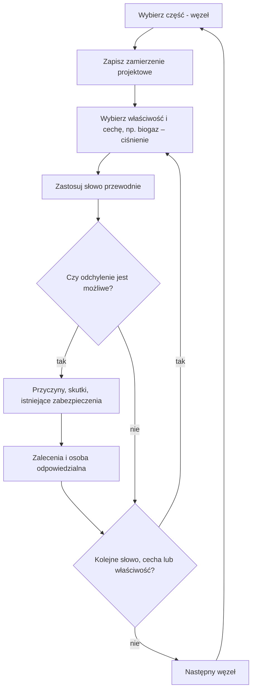

import { SlideContainer, Slide, InstructorNotes, LearningObjective } from '@site/src/components/SlideComponents';

<LearningObjective>

Student odróżnia HAZID od HAZOP, stosuje słowa przewodnie IEC 61882:2016 do węzła instalacji biogazowej i przekłada wyniki badania na wymagania dla alarmów, blokad i funkcji bezpieczeństwa.

</LearningObjective>

<SlideContainer>

<Slide title="HAZID: identyfikacja zagrożeń w fazie koncepcji" type="info">

- **HAZID** (Hazard Identification — identyfikacja zagrożeń): warsztat zespołu, który przegląda cały obiekt i jego otoczenie według listy kategorii zagrożeń, korzystając z ograniczonej informacji projektowej.
- ISO 17776:2016 (wyd. 2, potwierdzona w 2022 r.) dotyczy morskich instalacji wydobywczych. Wymaga identyfikacji zagrożeń na każdym etapie projektu: wybór koncepcji (6.3.2), definiowanie koncepcji (7.3.1), projekt szczegółowy (8.3.2).
- Słowa przewodnie HAZID zawiera załącznik F normy. Dla prostych instalacji norma (4.6) wskazuje listy kontrolne oparte na wcześniejszych ocenach ryzyka.
- Logikę etapów (koncepcja, projekt, eksploatacja) można przenieść na projekt farmy wiatrowej, magazynu energii czy biogazowni. To interpretacja, a nie zakres normy.
- **SWIFT** (Structured What-If Technique — ustrukturyzowana technika „co, jeśli”) to według IEC 31010:2019 (B.2.6) technika identyfikacji ryzyka, obok HAZOP i FMEA.
- Wynik HAZID: rejestr zagrożeń i lista obszarów do szczegółowej analizy (HAZOP, FMEA, LOPA).

Źródło: [ISO 17776:2016](https://www.iso.org/standard/63062.html); [ISO 17776:2016, próbka normy](https://cdn.standards.iteh.ai/samples/63062/31506ec1697048de9e86ca03644d2790/ISO-17776-2016.pdf); [IEC 31010:2019, podgląd ASSP](https://www.assp.org/docs/default-source/standards-documents/preview/31010_2019_wms_preview.pdf?sfvrsn=75159747_2)

<InstructorNotes>

Czas: ~2 min

HAZID robimy wtedy, gdy projekt jest jeszcze na etapie koncepcji i nie ma szczegółowych schematów. Zespół siada nad planem zagospodarowania terenu i pyta kategoria po kategorii: co z zewnątrz może nam zaszkodzić, jakie mamy substancje, jakie energie, kto będzie pracował na obiekcie. Norma ISO 17776 pochodzi z przemysłu naftowego, ale jej główna myśl jest uniwersalna: identyfikację zagrożeń powtarza się na każdym etapie projektu, coraz dokładniej.

SWIFT opiera się na pytaniach „co, jeśli”; opis metody zawiera załącznik B normy IEC 31010, do którego warto sięgnąć przed pierwszym użyciem. Moim zdaniem sprawdza się tam, gdzie analizujemy organizację pracy lub procedurę, a schematów instalacji brak. Typowe nieporozumienie: HAZID to jednorazowy formularz do wniosku o pozwolenie. W praktyce to punkt wyjścia do HAZOP i do projektu zabezpieczeń.

</InstructorNotes>

</Slide>

<Slide title="Lista kontrolna HAZID dla OZE" type="tip">

**Przykład ilustracyjny** — lista zbudowana z zagrożeń opisanych w źródłach; nie jest to lista z załącznika F ISO 17776.

| Kategoria | Pytanie kontrolne | Przykład z OZE |
|---|---|---|
| Zagrożenia zewnętrzne | Czy wyładowanie atmosferyczne może zainicjować pożar? | wyładowania wymieniane jako pierwsza przyczyna zapłonu w turbinach wiatrowych |
| Substancje palne | Gdzie może powstać mieszanina wybuchowa? | metan: dolna granica wybuchowości (DGW, ang. LEL) 4,4 % obj., górna (GGW) 17 % obj. (GisChem); starsze źródła (ICSC) podają 5–15 % obj. |
| Substancje toksyczne | Gdzie H₂S może się gromadzić? | H₂S cięższy od powietrza; paraliżuje węch |
| Energia chemiczna | Co się stanie po ucieczce termicznej ogniwa? | palne gazy gromadzą się w kontenerze BESS bez wentylacji |
| Energia elektryczna | Czy w obwodzie DC może się utrzymać łuk? | detekcja i przerywanie łuku DC w instalacjach PV |
| Praca na wysokości | Jak ewakuować poszkodowanego z gondoli? | wielokrotne wchodzenie po drabinach w wieży |

Źródło: [Uadiale i in., 2014](https://publications.iafss.org/publications/fss/11/983/view/fss_11-983.pdf); [GisChem, BG RCI: metan](https://www.gischem.de/download/01_0-000074-82-8-000000_2_1_1255.PDF); [ICSC 0291 metan](https://chemicalsafety.ilo.org/dyn/icsc/showcard.display?p_card_id=0291&p_version=2&p_lang=en); [ICSC 0165 H₂S](https://chemicalsafety.ilo.org/dyn/icsc/showcard.display?p_card_id=0165&p_version=2&p_lang=en); [DNV GL, McMicken, 2020](https://www.aps.com/-/media/APS/APSCOM-PDFs/About/Our-Company/Newsroom/McMickenFinalTechnicalReport.ashx); [IEC 63027:2023](https://webstore.iec.ch/en/publication/27362); [EU-OSHA, 2013](https://osha.europa.eu/sites/default/files/OSH%20in%20Wind%20energy%20sector.pdf)

<InstructorNotes>

Czas: ~2 min

To przykład, jak mogłaby wyglądać lista kontrolna dla parku, w którym są turbiny, PV, magazyn energii i biogazownia. Każdy wiersz ma oparcie w źródle. Przegląd pożarów turbin wymienia wyładowania atmosferyczne jako pierwszą przyczynę zapłonu, choć jego dane pochodzą ze zbioru doniesień prasowych, więc traktujemy je jakościowo. Granice wybuchowości metanu podaję za niemiecką kartą GisChem; starsza karta ICSC podaje od 5 do 15 procent, więc warto sprawdzać, z jakiego źródła pochodzi wartość. Raport DNV GL z McMicken wskazuje gromadzenie się gazów bez wentylacji jako jeden z czynników wybuchu.

Pytanie do sali: czego brakuje w tej liście dla farmy PV na dachu? Dobre odpowiedzi: dostęp straży pożarnej, obciążenie dachu, napięcie DC obecne przy świetle dziennym. Typowe nieporozumienie: lista kontrolna zastępuje myślenie. Lista to minimum, a zespół dopisuje zagrożenia specyficzne dla lokalizacji.

</InstructorNotes>

</Slide>

<Slide title="HAZOP: zamierzenie projektowe i odchylenie" type="info">

- **HAZOP** (Hazard and Operability Study — badanie zagrożeń i zdolności do działania, wg tytułu PN-EN 61882:2016), IEC 61882:2016 (wyd. 2.0): ustrukturyzowane i systematyczne badanie zespołowe.
- **Zamierzenie projektowe**: pożądany lub określony przez projektanta zakres zachowania właściwości, który zapewnia spełnienie wymagań przez obiekt (3.1.4).
- **Część** (w praktyce procesowej: **węzeł**) to fragment systemu badany w danej chwili.
- **Właściwość** (3.1.5; w 2016 r. zastąpiła pojęcie „element”): składnik części, który pozwala określić jej istotne cechy, np. materiał, czynność, urządzenie. **Cecha** (3.1.1): wielkość jakościowa lub ilościowa, np. ciśnienie, temperatura, napięcie.
- **Słowo przewodnie** określa rodzaj odchylenia od zamierzenia projektowego. **Odchylenie** to odejście od zamierzenia projektowego. Odchylenie = słowo przewodnie + cecha, np. WIĘCEJ + ciśnienie biogazu = nadciśnienie.
- Zasada (4.2): dla każdej części po kolei zespół bada każdą właściwość pod kątem odchyleń od zamierzenia projektowego, stosując kolejne słowa przewodnie.
- Właściwości często opisuje się dokładniej cechami, np. wejście (biogaz): temperatura, ciśnienie, skład (4.2).

Źródło: [IEC 61882:2016, próbka normy](https://cdn.standards.iteh.ai/samples/20730/64bc0f1bde424e8083959f2d3c4567a2/IEC-61882-2016.pdf); [IEC 61882:2016, wersja z oznaczonymi zmianami](https://cdn.standards.iteh.ai/sist-preview/20730/be46905d6bdf4c07b6a71f332961ca9e/IEC-61882-2016.pdf); [PN-EN 61882:2016, katalog Biblioteki Akademii Pożarniczej](https://biblioteka.apoz.edu.pl/en/search_results/2124454)

<InstructorNotes>

Czas: ~2 min

HAZOP zaczyna się od pytania, co instalacja ma robić. To jest zamierzenie projektowe. Jeśli nie umiemy go zapisać jednym zdaniem dla danego węzła, to węzeł jest źle wybrany. Potem bierzemy właściwość, na przykład biogaz, jej cechę, na przykład ciśnienie, i słowo przewodnie, na przykład WIĘCEJ. Razem dają odchylenie: nadciśnienie. Dla każdego sensownego odchylenia pytamy o przyczyny, skutki i istniejące zabezpieczenia.

Nowe wydanie normy mówi o właściwościach zamiast o elementach, a materiał rozumie szeroko, łącznie z danymi i oprogramowaniem. To dobrze pasuje do systemów sterowania: właściwością może być sygnał z czujnika, a cechą jego wartość. Typowe nieporozumienie: HAZOP to przegląd schematu przez jednego doświadczonego inżyniera. Siłą metody jest systematyczność i zespół.

</InstructorNotes>

</Slide>

<Slide title="Słowa przewodnie IEC 61882" type="info">

| Słowo przewodnie | Znaczenie wg IEC 61882:2016, tabl. 1 | Przykład: zbiornik biogazu |
|---|---|---|
| BRAK, NIE (NO, NOT) | całkowite zaprzeczenie zamierzenia projektowego | brak odbioru gazu przez kogenerację |
| WIĘCEJ (MORE) | ilościowy wzrost | nadciśnienie |
| MNIEJ (LESS) | ilościowy spadek | podciśnienie |
| ORAZ (AS WELL AS) | jakościowa modyfikacja lub zwiększenie | tlen z powietrza w biogazie |
| CZĘŚĆ (PART OF) | jakościowa modyfikacja lub zmniejszenie | za mało metanu, by pochodnia spaliła gaz |
| ODWROTNIE (REVERSE) | logiczne przeciwieństwo zamierzenia | przepływ wsteczny w przewodzie gazowym |
| INNY NIŻ (OTHER THAN) | całkowite zastąpienie | powietrze zamiast biogazu w przewodzie przy rozruchu |

- Słowa czasu i kolejności (tabl. 2): WCZEŚNIEJ, PÓŹNIEJ (EARLY, LATE) — względem czasu zegarowego; PRZED, PO (BEFORE, AFTER) — względem kolejności.
- Przykład kolejności: zabezpieczenie nadciśnieniowe zadziała PRZED startem pochodni, choć niemiecka reguła techniczna TRAS 120 (pkt 2.1(14)) wymaga odwrotnej kolejności.

Źródło: [IEC 61882:2016, próbka normy](https://cdn.standards.iteh.ai/samples/20730/64bc0f1bde424e8083959f2d3c4567a2/IEC-61882-2016.pdf); [TRAS 120, KAS](https://www.kas-bmu.de/files/publikationen/TRAS/TRAS%20(endgueltige%20Fassung)/LesefassTRAS120.pdf); [Jenkins i in., 2012](https://www.icheme.org/media/9063/xxiii-paper-67.pdf)

<InstructorNotes>

Czas: ~3 min

Znaczenia słów przewodnich są przetłumaczone z tablic normy, a przykłady w trzeciej kolumnie są moje, dla membranowego zbiornika biogazu. Proszę zwrócić uwagę na różnicę między WIĘCEJ a ORAZ. WIĘCEJ to zmiana ilościowa tej samej cechy, na przykład wyższe ciśnienie. ORAZ oznacza, że pojawia się coś dodatkowego, na przykład tlen w biogazie. INNY NIŻ to całkowite zastąpienie: przy pierwszym rozruchu w przewodach może być powietrze zamiast biogazu. Przegląd wypadków w biogazowniach opisuje wybuchy właśnie podczas pierwszego uruchomienia.

Słowa czasu i kolejności są ważne dla automatyki. Pytanie do sali: jakie odchylenie daje słowo PÓŹNIEJ dla startu pochodni? Pochodnia rusza za późno i gaz uchodzi przez zabezpieczenie. Typowe nieporozumienie: każde słowo trzeba „na siłę” zastosować do każdej cechy. Pomija się kombinacje fizycznie bez sensu, ale zapisuje się, że je rozważono.

</InstructorNotes>

</Slide>

<Slide title="Zespół i przebieg badania HAZOP" type="info">

- Zespół (4.1): przeszkolony i doświadczony prowadzący, protokolant oraz specjaliści z różnych dziedzin.
- Procedura (rozdz. 6): definicja (zakres, cele, role), przygotowanie (plan, dane, słowa przewodnie), badanie, dokumentacja i działania następcze (6.5.6: przypisanie odpowiedzialności za postępowanie z ryzykiem).

Źródło: [IEC 61882:2016, próbka normy](https://cdn.standards.iteh.ai/samples/20730/64bc0f1bde424e8083959f2d3c4567a2/IEC-61882-2016.pdf); [IEC 61882 wyd. 2.0, podgląd ANSI](https://webstore.ansi.org/preview-pages/iec/preview_iec61882%7Bed2.0%7Db.pdf)

<InstructorNotes>

Czas: ~2 min

Norma wymaga prowadzącego, który zna metodę, protokolanta i specjalistów. W biogazowni będą to na przykład technolog, automatyk, elektryk i osoba z eksploatacji, bo to ona wie, co naprawdę dzieje się zimą przy zamknięciach hydraulicznych.

Schemat pokazuje pętlę badania. Najważniejszy jest ostatni krok procedury, czyli działania następcze. Zalecenie bez osoby odpowiedzialnej i terminu zwykle nie zostaje wykonane. Pytanie do sali: ile czasu zajmie HAZOP biogazowni z dziesięcioma węzłami, jeśli przyjmiemy umownie dwie godziny na węzeł? Kilka dni pracy całego zespołu, dlatego badanie trzeba zaplanować w harmonogramie projektu jak każdy inny etap.

</InstructorNotes>

</Slide>

<Slide title="Arkusz HAZOP i ograniczenia metody" type="warning">

- Kolumny arkusza (praktyka; sposoby zapisu opisuje zał. A normy): węzeł, właściwość i cecha, słowo przewodnie, odchylenie, przyczyny, skutki, istniejące zabezpieczenia, zalecenia, osoba odpowiedzialna.
- Zapis może mieć postać arkuszy, oznaczonych schematów lub raportu z badania (zał. A).
- HAZOP stosuje się także poza instalacjami procesowymi: zał. B podaje przykłady procedur, systemu ochrony pociągu, planowania awaryjnego i sterowania zaworem piezoelektrycznym.
- Ograniczenia (5.3): potrzebny jest dość szczegółowy opis systemu, a HAZOP uzupełnia, lecz nie zastępuje projektowania według norm i doświadczenia.
- Warianty typu „checklist HAZOP” nie są HAZOP w rozumieniu normy.
- HAZOP nie daje liczb; wskazuje scenariusze, które ocenia się dalej ilościowo (LOPA, FTA).
- Przepisy zwykle nie narzucają metody. TRAS 120 (1.5.1) wymaga systematycznego przeglądu źródeł zagrożeń, nie wskazując HAZOP.

Źródło: [IEC 61882:2016, próbka normy](https://cdn.standards.iteh.ai/samples/20730/64bc0f1bde424e8083959f2d3c4567a2/IEC-61882-2016.pdf); [IEC 61882:2016, podgląd](https://www.en-standard.eu/publicdoc/iec_previews/121973.pdf); [IEC 61882 wyd. 2.0, podgląd ANSI](https://webstore.ansi.org/preview-pages/iec/preview_iec61882%7Bed2.0%7Db.pdf); [TRAS 120, KAS](https://www.kas-bmu.de/files/publikationen/TRAS/TRAS%20(endgueltige%20Fassung)/LesefassTRAS120.pdf)

<InstructorNotes>

Czas: ~2 min

Arkusz to protokół rozumowania zespołu. Kolumna „istniejące zabezpieczenia” jest najważniejsza dla dalszej pracy, bo z niej LOPA wybierze kandydatów na niezależne warstwy ochrony. Przykłady z załącznika B normy pokazują, że HAZOP nie jest zarezerwowany dla chemii. Można nim badać procedurę rozruchu magazynu energii albo logikę sterowania.

Ograniczenia są dwa. Po pierwsze HAZOP wymaga dobrego opisu systemu, więc na etapie koncepcji jest za wcześnie. Po drugie nie zwalnia z przestrzegania norm projektowych. Niemiecka reguła TRAS 120 nie narzuca HAZOP, tylko wymaga systematycznego przeglądu, więc wybór metody należy do projektanta. Typowe nieporozumienie: skoro zrobiliśmy HAZOP, to instalacja jest bezpieczna. HAZOP mówi, czego szukać, a nie ile ochrony wystarczy.

</InstructorNotes>

</Slide>

<Slide title="Przykład HAZOP: ciśnienie w zbiorniku biogazu" type="tip">

**Przykład ilustracyjny** — wiersze zbudowane z wymagań TRAS 120 i przeglądu wypadków (Jenkins i in. 2012); nie jest to opublikowany arkusz.

Węzeł: komora fermentacyjna ze zintegrowanym membranowym zbiornikiem gazu. Zamierzenie: utrzymać biogaz w dopuszczalnym zakresie ciśnienia i napełnienia i kierować go do kogeneracji; pochodnia jako urządzenie rezerwowe.

| Odchylenie | Przyczyny | Skutki | Istniejące zabezpieczenia → zalecenia |
|---|---|---|---|
| WIĘCEJ + ciśnienie: nadciśnienie | postój kogeneracji przy trwającej produkcji gazu | wyrzut biogazu przez zabezpieczenie nadciśnieniowe; palna chmura (CH₄: DGW 4,4 % obj., GGW 17 % obj.; wg ICSC 5–15 % obj.) i H₂S przy instalacji | zabezpieczenia nad- i podciśnieniowe (2.4(7)); kontrola napełnienia z automatyczną sygnalizacją (2.6.3(3)); pochodnia ma pierwszeństwo przed zabezpieczeniem (2.1(14)) → sprawdzić automatyczny start pochodni przed nastawą zabezpieczenia; chronić zabezpieczenie przed mrozem (2.1(6)) |
| MNIEJ + ciśnienie: podciśnienie | pobór gazu przez kogenerację lub sprężarkę większy niż produkcja; zbyt małe przekroje przewodów (2.4(8)) | uszkodzenie membrany; zassanie powietrza i mieszanina wybuchowa wewnątrz instalacji | zabezpieczenie podciśnieniowe (2.4(7)); wymiarowanie przewodów (2.4(8)) → blokada kogeneracji i sprężarki przy niskim napełnieniu; pomiar O₂ tam, gdzie możliwy jest dopływ powietrza |

Numery w nawiasach to punkty TRAS 120.

Źródło: [TRAS 120, KAS](https://www.kas-bmu.de/files/publikationen/TRAS/TRAS%20(endgueltige%20Fassung)/LesefassTRAS120.pdf); [Jenkins i in., 2012](https://www.icheme.org/media/9063/xxiii-paper-67.pdf); [GisChem, BG RCI: metan](https://www.gischem.de/download/01_0-000074-82-8-000000_2_1_1255.PDF); [ICSC 0291 metan](https://chemicalsafety.ilo.org/dyn/icsc/showcard.display?p_card_id=0291&p_version=2&p_lang=en)

<InstructorNotes>

Czas: ~3 min

TRAS 120 to niemiecka reguła techniczna dla biogazowni, wydana w 2018 roku po serii awarii. W Polsce nie jest obowiązkowa, ale dobrze opisuje stan techniki, więc używamy jej jako wzorca. Zobaczcie, jak zespół pracuje z wierszem nadciśnienia. Przyczyną jest postój kogeneracji, a gaz nadal powstaje. Istniejące zabezpieczenia to mechaniczne zabezpieczenie nadciśnieniowe, kontrola napełnienia i pochodnia. Zalecenie nie brzmi „dodać zabezpieczenie”, tylko „sprawdzić kolejność działania i ochronę przed mrozem”. Zamarznięte zamknięcie hydrauliczne to przykład uszkodzenia ukrytego: nikt go nie widzi, dopóki zabezpieczenie nie jest potrzebne.

Wiersz podciśnienia pokazuje, że niebezpieczne może być też „za mało”. Zassane powietrze tworzy mieszaninę wybuchową wewnątrz instalacji. Pytanie do sali: kto w nocy zauważy spadek napełnienia w instalacji bez stałej obsługi? Stąd zalecenie automatycznej blokady zamiast samego alarmu.

</InstructorNotes>

</Slide>

<Slide title="Przykład HAZOP: skład biogazu" type="tip">

**Przykład ilustracyjny** — ten sam węzeł, cecha: skład gazu.

| Odchylenie | Przyczyny | Skutki | Istniejące zabezpieczenia → zalecenia |
|---|---|---|---|
| ORAZ + skład: tlen w biogazie | przedawkowanie powietrza do biologicznego odsiarczania; nieszczelność po stronie ssawnej | atmosfera wybuchowa w zbiorniku i przewodach | wymaganie szczelności; dodatkowe środki przeciwwybuchowe, gdy elementy nie są „technicznie szczelne” (2.3(6)) → ograniczyć i mierzyć dozowanie powietrza |
| WIĘCEJ + stężenie H₂S | awaria odsiarczania; nasycony adsorber z węglem aktywnym (3.7) | toksyczność: ok. 100 ppm paraliżuje węch, ok. 5000 ppm zabija w ciągu sekund; wartość graniczna na stanowisku pracy 5 ppm (1.5.2.2.1) | monitorowanie instalacji odsiarczania: adsorbery z węglem aktywnym nadzoruje się pomiarowo (2.6.3(6)) → stała detekcja H₂S tam, gdzie gaz może się gromadzić; zakaz wyłączania zabezpieczeń |

- TRAS 120 (2.6.3(6)) wymaga nadzoru adsorberów po to, by zapobiec ich zapłonowi; traktowanie go jako ochrony przed H₂S to interpretacja autora.
- Precedens: w listopadzie 2005 r. w Rhadereistedt (Dolna Saksonia) przy napełnianiu zbiornika wstępnego kosubstratami bogatymi w białko uwolnił się H₂S; zginęły 4 osoby (UBA 2006). Jenkins i in. (2012), na podstawie doniesień prasowych, podają, że zabezpieczenia były ręcznie wyłączone.
- Opublikowane zastosowania: HAZOP biogazowni wsparty symulacją dynamiczną — przy niesprawnym zabezpieczeniu ciśnieniowym komory osiągalna produkcja biogazu spada do ok. 2/3 (Salm i in. 2017); HAZOP z metodą FTOPSIS dla instalacji uszlachetniania biogazu (Severi i in. 2022).

Źródło: [TRAS 120, KAS](https://www.kas-bmu.de/files/publikationen/TRAS/TRAS%20(endgueltige%20Fassung)/LesefassTRAS120.pdf); [Jenkins i in., 2012](https://www.icheme.org/media/9063/xxiii-paper-67.pdf); [UBA, 2006](https://www.umweltbundesamt.de/system/files/medien/publikation/long/3097.pdf); [Salm i in., 2017](https://doi.org/10.3303/CET1757100); [Severi i in., 2022](https://www.sciencedirect.com/science/article/pii/S0045653522023384)

<InstructorNotes>

Czas: ~2 min

Skład gazu jest cechą równie ważną jak ciśnienie. Tlen w biogazie pojawia się, gdy przedawkujemy powietrze do biologicznego odsiarczania albo gdy przewód jest nieszczelny po stronie ssawnej. Siarkowodór jest groźny, bo przy około stu ppm przestajemy go czuć, więc nos nie jest czujnikiem. Wartości progowe pochodzą z TRAS 120.

Przypadek z Rhadereistedt pokazuje, co znaczy wyłączenie zabezpieczeń: zginęły cztery osoby. Niemiecki Federalny Urząd Środowiska i przegląd wypadków Jenkinsa i współautorów opisują to samo zdarzenie, ale o wyłączonych zabezpieczeniach wiemy tylko z przeglądu opartego na doniesieniach prasowych. Pytanie do sali: gdzie postawić detektor H₂S, skoro gaz jest cięższy od powietrza? Nisko, w miejscach, gdzie może się gromadzić, i przy stanowiskach pracy. Typowe nieporozumienie: HAZOP dotyczy tylko awarii sprzętu. Tu przyczyną są też decyzje ludzi.

</InstructorNotes>

</Slide>

<Slide title="Od wyników HAZOP do wymagań" type="success">

- Zalecenia HAZOP trafiają na listę działań z osobami odpowiedzialnymi (IEC 61882, 6.5.6) i zamyka się je jak zadania projektowe.
- **Alarm**: sygnał wymagający terminowej reakcji operatora (ISA-18.2). Każdy alarm wynikający z HAZOP musi mieć przyczynę, reakcję i czas na reakcję; racjonalizację alarmów opisuje IEC 62682:2022 (rozdz. 9) — W5.
- **Blokada**: automatyczne działanie, np. start pochodni przed zadziałaniem zabezpieczenia nadciśnieniowego (TRAS 120, 2.6.3(3)).
- **Procedura**: np. zakaz wyłączania zabezpieczeń, zimowa kontrola zamknięć hydraulicznych.
- **Pomiar i detekcja**: jakie wielkości mierzyć (napełnienie, O₂, H₂S, CH₄), gdzie i z jaką dokładnością — tor pomiarowy w W3.
- Scenariusze o poważnych skutkach i słabych zabezpieczeniach przechodzą do LOPA, która rozstrzyga, czy potrzebna jest przyrządowa funkcja bezpieczeństwa (SIF, Safety Instrumented Function) i z jakim poziomem nienaruszalności bezpieczeństwa (SIL, Safety Integrity Level).

Źródło: [IEC 61882:2016, próbka normy](https://cdn.standards.iteh.ai/samples/20730/64bc0f1bde424e8083959f2d3c4567a2/IEC-61882-2016.pdf); [ISA InTech, 2020](https://www.isa.org/intech-home/2020/march-april/features/alarm-management-questions-that-everyone-asks); [IEC 62682:2022, próbka normy](https://cdn.standards.iteh.ai/samples/103485/6f7b44e368fc4f4d93216f716a51771a/IEC-62682-2022.pdf); [TRAS 120, KAS](https://www.kas-bmu.de/files/publikationen/TRAS/TRAS%20(endgueltige%20Fassung)/LesefassTRAS120.pdf)

<InstructorNotes>

Czas: ~2 min

To jest most między analizą a projektem systemów, o których będziemy mówić przez resztę semestru. Z arkusza HAZOP wychodzą cztery rodzaje wymagań: alarmy, blokady, procedury i pomiary. Proszę zapamiętać definicję alarmu: to sygnał, który wymaga terminowej reakcji człowieka. Komunikat, na który nikt nie musi reagować, nie jest alarmem, tylko informacją. Jeśli HAZOP zaleca alarm, musi też określić, kto reaguje i w jakim czasie.

Gdy skutki są poważne, a istniejące zabezpieczenia budzą wątpliwości, sam HAZOP nie wystarczy. Wtedy przechodzimy do LOPA i liczymy, czy potrzebna jest przyrządowa funkcja bezpieczeństwa. Pytanie do sali: czy zalecenie „dodać alarm wysokiego ciśnienia” rozwiązuje problem w biogazowni bez stałej obsługi? Raczej nie, i to zobaczymy w przykładzie LOPA.

</InstructorNotes>

</Slide>

</SlideContainer>

## Źródła

1. International Organization for Standardization (2016). *ISO 17776:2016 Petroleum and natural gas industries — Offshore production installations — Major accident hazard management during the design of new installations*, wyd. 2. [https://www.iso.org/standard/63062.html](https://www.iso.org/standard/63062.html); próbka: [https://cdn.standards.iteh.ai/samples/63062/31506ec1697048de9e86ca03644d2790/ISO-17776-2016.pdf](https://cdn.standards.iteh.ai/samples/63062/31506ec1697048de9e86ca03644d2790/ISO-17776-2016.pdf)
2. IEC/ISO (2019). *IEC 31010:2019 Risk management — Risk assessment techniques*, podgląd (ASSP). [https://www.assp.org/docs/default-source/standards-documents/preview/31010_2019_wms_preview.pdf?sfvrsn=75159747_2](https://www.assp.org/docs/default-source/standards-documents/preview/31010_2019_wms_preview.pdf?sfvrsn=75159747_2)
3. IEC (2016). *IEC 61882:2016 Hazard and operability studies (HAZOP studies) — Application guide*, wyd. 2.0, próbka. [https://cdn.standards.iteh.ai/samples/20730/64bc0f1bde424e8083959f2d3c4567a2/IEC-61882-2016.pdf](https://cdn.standards.iteh.ai/samples/20730/64bc0f1bde424e8083959f2d3c4567a2/IEC-61882-2016.pdf); wersja z oznaczonymi zmianami: [https://cdn.standards.iteh.ai/sist-preview/20730/be46905d6bdf4c07b6a71f332961ca9e/IEC-61882-2016.pdf](https://cdn.standards.iteh.ai/sist-preview/20730/be46905d6bdf4c07b6a71f332961ca9e/IEC-61882-2016.pdf); podgląd ANSI: [https://webstore.ansi.org/preview-pages/iec/preview_iec61882%7Bed2.0%7Db.pdf](https://webstore.ansi.org/preview-pages/iec/preview_iec61882%7Bed2.0%7Db.pdf); podgląd: [https://www.en-standard.eu/publicdoc/iec_previews/121973.pdf](https://www.en-standard.eu/publicdoc/iec_previews/121973.pdf)
4. BMU / Kommission für Anlagensicherheit (2018, zm. 2019). *TRAS 120 Sicherheitstechnische Anforderungen an Biogasanlagen* (BAnz AT 21.01.2019 B4; tekst ujednolicony KAS). [https://www.kas-bmu.de/files/publikationen/TRAS/TRAS%20(endgueltige%20Fassung)/LesefassTRAS120.pdf](https://www.kas-bmu.de/files/publikationen/TRAS/TRAS%20(endgueltige%20Fassung)/LesefassTRAS120.pdf)
5. Jenkins A., Gornall L., Cripps H. (2012). Lessons for safe design and operation of anaerobic digesters. IChemE Symposium Series 158 (Hazards XXIII). [https://www.icheme.org/media/9063/xxiii-paper-67.pdf](https://www.icheme.org/media/9063/xxiii-paper-67.pdf)
6. Umweltbundesamt (2006). *Informationspapier: Zur Sicherheit bei Biogasanlagen*. [https://www.umweltbundesamt.de/system/files/medien/publikation/long/3097.pdf](https://www.umweltbundesamt.de/system/files/medien/publikation/long/3097.pdf)
7. Salm A.S.M., Casson Moreno V., Antonioni G., Cozzani V. (2017). Dynamic simulation of disturbances triggering loss of operability in a biogas production plant. *Chemical Engineering Transactions* 57. [https://doi.org/10.3303/CET1757100](https://doi.org/10.3303/CET1757100)
8. Severi C.A., Pérez V., Pascual C., Muñoz R., Lebrero R. (2022). Identification of critical operational hazards in a biogas upgrading pilot plant through a multi-criteria decision-making and FTOPSIS-HAZOP approach. *Chemosphere* 307: 135845. [https://www.sciencedirect.com/science/article/pii/S0045653522023384](https://www.sciencedirect.com/science/article/pii/S0045653522023384)
9. ILO/WHO (2000). *International Chemical Safety Card 0291: Methane*. [https://chemicalsafety.ilo.org/dyn/icsc/showcard.display?p_card_id=0291&p_version=2&p_lang=en](https://chemicalsafety.ilo.org/dyn/icsc/showcard.display?p_card_id=0291&p_version=2&p_lang=en)
10. ILO/WHO (2017). *International Chemical Safety Card 0165: Hydrogen sulfide*. [https://chemicalsafety.ilo.org/dyn/icsc/showcard.display?p_card_id=0165&p_version=2&p_lang=en](https://chemicalsafety.ilo.org/dyn/icsc/showcard.display?p_card_id=0165&p_version=2&p_lang=en)
11. Uadiale, Urbán, Carvel, Lange, Rein (2014). Overview of problems and solutions in fire protection engineering of wind turbines. *Fire Safety Science* 11: 983–995. [https://publications.iafss.org/publications/fss/11/983/view/fss_11-983.pdf](https://publications.iafss.org/publications/fss/11/983/view/fss_11-983.pdf)
12. DNV GL (2020). *McMicken Battery Energy Storage System Event — Technical Analysis and Recommendations*, raport dla APS. [https://www.aps.com/-/media/APS/APSCOM-PDFs/About/Our-Company/Newsroom/McMickenFinalTechnicalReport.ashx](https://www.aps.com/-/media/APS/APSCOM-PDFs/About/Our-Company/Newsroom/McMickenFinalTechnicalReport.ashx)
13. IEC (2023). *IEC 63027:2023 Photovoltaic power systems — DC arc detection and interruption*. [https://webstore.iec.ch/en/publication/27362](https://webstore.iec.ch/en/publication/27362)
14. EU-OSHA (2013). *Occupational safety and health in the wind energy sector*. [https://osha.europa.eu/sites/default/files/OSH%20in%20Wind%20energy%20sector.pdf](https://osha.europa.eu/sites/default/files/OSH%20in%20Wind%20energy%20sector.pdf)
15. Dunn D.G., Sands N.P. (2020). Alarm management questions that everyone asks. *ISA InTech*. [https://www.isa.org/intech-home/2020/march-april/features/alarm-management-questions-that-everyone-asks](https://www.isa.org/intech-home/2020/march-april/features/alarm-management-questions-that-everyone-asks)
16. IEC (2022). *IEC 62682:2022 Management of alarm systems for the process industries*, wyd. 2.0, próbka. [https://cdn.standards.iteh.ai/samples/103485/6f7b44e368fc4f4d93216f716a51771a/IEC-62682-2022.pdf](https://cdn.standards.iteh.ai/samples/103485/6f7b44e368fc4f4d93216f716a51771a/IEC-62682-2022.pdf)
17. BG RCI, BGHM (b.d.). *GisChem: Methan (CAS 74-82-8)* — karta substancji. [https://www.gischem.de/download/01_0-000074-82-8-000000_2_1_1255.PDF](https://www.gischem.de/download/01_0-000074-82-8-000000_2_1_1255.PDF)
18. Polski Komitet Normalizacyjny (2016). *PN-EN 61882:2016 Badania zagrożeń i zdolności do działania (badania HAZOP) — Przewodnik zastosowań* (wersja angielska) — rekord w katalogu Biblioteki Akademii Pożarniczej. [https://biblioteka.apoz.edu.pl/en/search_results/2124454](https://biblioteka.apoz.edu.pl/en/search_results/2124454)
