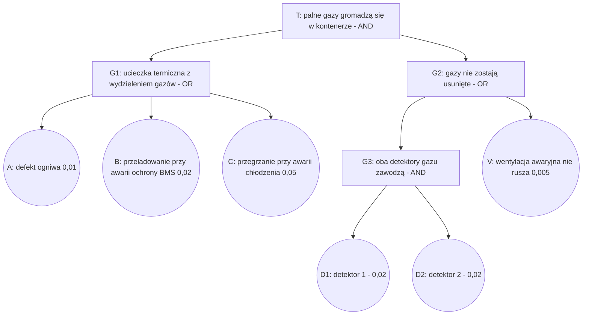
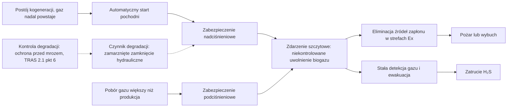

import { SlideContainer, Slide, InstructorNotes, LearningObjective } from '@site/src/components/SlideComponents';

<LearningObjective>

Student buduje i oblicza proste drzewo niezdatności, wyznacza minimalne przekroje, ocenia wpływ uszkodzeń spowodowanych wspólną przyczyną oraz łączy drzewo niezdatności z drzewem zdarzeń i diagramem bow-tie.

</LearningObjective>

<SlideContainer>

<Slide title="Analiza drzewa niezdatności: pojęcia" type="info">

- **FTA** (Fault Tree Analysis — analiza drzewa niezdatności): metoda dedukcyjna, „od góry” — od **zdarzenia szczytowego** do kombinacji przyczyn. Norma: IEC 61025:2006 (wyd. 2.0).
- **Zdarzenie podstawowe**: zdarzenie lub stan, którego nie rozwija się dalej. **Zdarzenie nierozwinięte**: zdarzenie bez zdarzeń wejściowych, np. z braku informacji.
- **Bramka AND**: wyjście zachodzi tylko wtedy, gdy zajdą wszystkie wejścia. **Bramka OR**: gdy zajdzie którekolwiek. Inne symbole: XOR, priorytetowa AND, INHIBIT, zdarzenie „domowe”, przeniesienie (NUREG-0492, tabl. IV-1).
- **Minimalny przekrój** (minimal cut set): najmniejszy zbiór zdarzeń, których wystąpienie powoduje zdarzenie szczytowe.
- Bezpłatne podręczniki: NUREG-0492 (amerykańska Nuclear Regulatory Commission, 1981) i NASA Fault Tree Handbook (wersja 1.1, 2002).
- Zastosowania w OZE: ogólne drzewo niezdatności turbiny wiatrowej rozwiązywane metodą binarnych diagramów decyzyjnych (BDD, Binary Decision Diagrams) z miarami ważności (Márquez i in. 2016), pływające turbiny morskie (Kang i in. 2019), deflagracja w magazynie energii — bramka AND czterech warunków: źródło zapłonu, materiał palny, utleniacz, przestrzeń zamknięta (Yuan i in. 2026).

Źródło: [IEC 61025:2006, IEC Webstore](https://webstore.iec.ch/en/publication/4311); [IEC 61025:2006, próbka normy](https://cdn.standards.iteh.ai/samples/12812/5a2b487cba2344309309a9d4fc72b2b9/IEC-61025-2006.pdf); [NUREG-0492](https://www.nrc.gov/docs/ML1007/ML100780465.pdf); [NASA FTH, 2002](https://extapps.ksc.nasa.gov/Reliability/Documents/Fault_Tree_Handbook_with_Aerospace_Applications_August_2002.pdf); [Márquez i in., 2016](https://doi.org/10.1016/j.renene.2015.09.038); [Kang i in., 2019](https://www.sciencedirect.com/science/article/abs/pii/S0960148118310474); [Yuan i in., 2026](https://www.mdpi.com/2227-9717/14/4/674)

<InstructorNotes>

Czas: ~2 min

FMEA szła od elementu do skutku. Drzewo niezdatności idzie w przeciwną stronę: zaczynamy od jednego, precyzyjnie opisanego zdarzenia niepożądanego i pytamy, jakie kombinacje przyczyn mogą do niego doprowadzić. Potrzebne są właściwie tylko dwie bramki, AND i OR. Najważniejszym wynikiem jakościowym są minimalne przekroje, czyli najmniejsze zestawy zdarzeń, które wystarczą do awarii.

Oba podręczniki, amerykańskiego dozoru jądrowego i NASA, są bezpłatne i bardzo dobre do samodzielnej nauki. Ciekawa jest praca o deflagracji w magazynach energii: na najwyższym poziomie ma bramkę AND czterech warunków. Wystarczy usunąć jeden z nich, na przykład materiał palny dzięki wentylacji, żeby przerwać tę gałąź. Odciążenie wybuchowe ogranicza skutki, czyli nadciśnienie, ale nie zapobiega deflagracji. Typowe nieporozumienie: zdarzenie szczytowe może brzmieć „awaria magazynu”. Musi być konkretne, inaczej drzewo nie ma granic.

</InstructorNotes>

</Slide>

<Slide title="Przykład drzewa: gazy w kontenerze BESS" type="tip">

**Przykład ilustracyjny — dane umowne.** A, B, C — prawdopodobieństwa w ciągu roku; D1, D2, V — prawdopodobieństwa niezadziałania na żądanie.

- Minimalne przekroje drugiego rzędu: \{A, V\}, \{B, V\}, \{C, V\}; trzeciego rzędu: \{A, D1, D2\}, \{B, D1, D2\}, \{C, D1, D2\}.
- BMS (Battery Management System) — system zarządzania baterią.
- Struktura nawiązuje do czynników z McMicken (2019): wg DNV GL (2020) ucieczkę termiczną zapoczątkowała wada ogniwa, a palne gazy gromadziły się bez możliwości wentylacji; przyczyna źródłowa jest sporna (UL 2021).

Źródło: [DNV GL, McMicken, 2020](https://www.aps.com/-/media/APS/APSCOM-PDFs/About/Our-Company/Newsroom/McMickenFinalTechnicalReport.ashx); [UL, 2021](https://collateral-library-production.s3.amazonaws.com/uploads/asset_file/attachment/31718/Executive_Summary_for_DNVGL_APS_Report_Responses.pdf); [IEC 61025:2006, próbka normy](https://cdn.standards.iteh.ai/samples/12812/5a2b487cba2344309309a9d4fc72b2b9/IEC-61025-2006.pdf)

<InstructorNotes>

Czas: ~2 min

To drzewo zbudowałem na potrzeby wykładu, a liczby są umowne. Zdarzenie szczytowe to gromadzenie się palnych gazów w kontenerze. Musi zajść jednocześnie ucieczka termiczna z wydzieleniem gazów i brak ich usunięcia, stąd bramka AND na górze. Ucieczkę termiczną może zapoczątkować defekt ogniwa, przeładowanie przy niesprawnej ochronie albo przegrzanie przy awarii chłodzenia, stąd OR. Gazy nie zostaną usunięte, jeśli zawiodą oba detektory albo nie ruszy wentylacja.

Minimalne przekroje czytamy wprost z drzewa. Proszę zwrócić uwagę na rząd: przekroje z wentylatorem mają tylko dwa zdarzenia, a przekroje z detektorami trzy. Pytanie do sali: który element projektant powinien wzmocnić w pierwszej kolejności? Intuicja podpowiada, że wentylator, bo jest pojedynczym punktem uszkodzenia w gałęzi G2. Sprawdzimy to liczbowo.

</InstructorNotes>

</Slide>

<Slide title="Kwantyfikacja: bramki AND i OR" type="info">

- AND, zdarzenia niezależne: $P = \prod_i p_i$. Dla G3: $0{,}02 \times 0{,}02 = 4 \times 10^{-4}$.
- OR, wzór dokładny: $P = 1 - \prod_i (1 - p_i)$. Dla G1: $1 - 0{,}99 \cdot 0{,}98 \cdot 0{,}95 = 0{,}07831$.
- Przybliżenie zdarzeń rzadkich: $P \approx \sum_i p_i = 0{,}08$; zawyża wynik o 2,2 %, czyli zachowawczo. Według podręcznika NASA jest uzasadnione, bo większość prawdopodobieństw uszkodzeń jest mniejsza niż 0,1.
- Dla $p$ = 0,1; 0,2; 0,3 wynik dokładny to 0,496, a suma 0,6 — zawyżenie o 21 %.
- Zdarzenie szczytowe: G2 $= 1 - (1 - 4 \times 10^{-4})(1 - 0{,}005) = 0{,}005398$, więc $P_T = 0{,}07831 \times 0{,}005398 = 4{,}23 \times 10^{-4}$. Suma minimalnych przekrojów daje $4{,}32 \times 10^{-4}$.
- Przekroje zawierające V dają 92,6 % wyniku. Udział zdarzenia w prawdopodobieństwie szczytowym to jedna z miar ważności opisanych przez NASA.

Źródło: [NASA FTH, 2002](https://extapps.ksc.nasa.gov/Reliability/Documents/Fault_Tree_Handbook_with_Aerospace_Applications_August_2002.pdf); [NUREG-0492](https://www.nrc.gov/docs/ML1007/ML100780465.pdf); obliczenia własne

<InstructorNotes>

Czas: ~3 min

Rachunek jest prosty, ale trzeba pamiętać o dwóch założeniach. Mnożenie w bramce AND wymaga niezależności zdarzeń. Suma w bramce OR jest tylko przybliżeniem: dokładny wzór odejmuje od jedności iloczyn prawdopodobieństw, że nic się nie stanie. Dla małych wartości różnica jest niewielka i zawsze zachowawcza, bo suma zawyża wynik. Dla dużych prawdopodobieństw przybliżenie przestaje mieć sens, co widać na przykładzie 0,1, 0,2 i 0,3.

Wynik dla zdarzenia szczytowego potwierdza intuicję: ponad dziewięćdziesiąt procent prawdopodobieństwa pochodzi z przekrojów z wentylatorem. Para detektorów jest dobrze zabezpieczona, a pojedynczy wentylator nie. Pytanie do sali: co da dodanie drugiego, niezależnego wentylatora? Przekroje z V staną się przekrojami trzeciego rzędu i wynik spadnie wielokrotnie. Typowe nieporozumienie: dokładność obliczeń jest ważniejsza niż jakość danych wejściowych.

</InstructorNotes>

</Slide>

<Slide title="Uszkodzenia spowodowane wspólną przyczyną" type="warning">

- Mnożenie w bramce AND zakłada niezależność. Dwa detektory tego samego typu mogą zawieść razem, np. przez wspólne zasilanie lub tę samą kalibrację (przykłady). Rosewater i Williams (2015) opisują błędy kalibracji i szybki dryf pomiaru napięć ogniw w BMS.
- **Model współczynnika β**: ułamek β uszkodzeń kanału dotyczy obu kanałów jednocześnie. IEC 61508-6 stosuje go w uproszczonych wzorach na PFDavg (average probability of dangerous failure on demand — średnie prawdopodobieństwo niebezpiecznego uszkodzenia na żądanie), wg Lundteigen i Rausand.
- Dla pary: $P \approx ((1-\beta)\,q)^2 + \beta q$, gdzie $q = 0{,}02$ — **przykład ilustracyjny, dane umowne**:

| β | Część niezależna | Część wspólna | G3 razem |
|---|---|---|---|
| 0 | $4{,}0 \times 10^{-4}$ | 0 | $4{,}0 \times 10^{-4}$ |
| 0,02 | $3{,}84 \times 10^{-4}$ | $4{,}0 \times 10^{-4}$ | $7{,}84 \times 10^{-4}$ (51 % wspólna) |
| 0,05 | $3{,}61 \times 10^{-4}$ | $1{,}0 \times 10^{-3}$ | $1{,}36 \times 10^{-3}$ (73 % wspólna) |
| 0,10 | $3{,}24 \times 10^{-4}$ | $2{,}0 \times 10^{-3}$ | $2{,}32 \times 10^{-3}$ (86 % wspólna) |

- Przy β = 0,10 para zawodzi 5,8 razy częściej niż przy pełnej niezależności, a $P_T$ rośnie o 35 %, do $5{,}73 \times 10^{-4}$.
- Wniosek: redundancja bez różnorodności i separacji daje mniej, niż sugeruje mnożenie.

Źródło: [Lundteigen i Rausand, NTNU, rozdz. 8](https://www.ntnu.edu/documents/624876/1277046207/SIS+book+-+chapter+08+-+PFDavg+with+IEC+61508+formulas/0be9ac0d-7e57-4641-9043-7d2554c16cac); [Rosewater i Williams, 2015](https://doi.org/10.1016/j.jpowsour.2015.09.068); obliczenia własne

<InstructorNotes>

Czas: ~3 min

To najważniejszy slajd tej części. Na papierze dwa detektory po dwa procent dają cztery dziesięciotysięczne, bo mnożymy. W rzeczywistości oba detektory mogą pochodzić od tego samego producenta, być kalibrowane przez tę samą osobę tym samym gazem wzorcowym i mieć wspólne zasilanie. Model beta mówi: pewien ułamek uszkodzeń dotyka obu kanałów naraz. Już przy dziesięciu procentach para zawodzi prawie sześć razy częściej, a uszkodzenia wspólne stanowią większość wyniku.

Wartości beta w tabeli są umowne. W praktyce szacuje się je dla konkretnego układu. Pytanie do sali: jak obniżyć beta dla detekcji gazu w kontenerze? Dobre odpowiedzi: dwa różne typy czujników, na przykład wodoru i tlenku węgla, osobne zasilanie, różne terminy kalibracji. Typowe nieporozumienie: druga sztuka tego samego czujnika zawsze poprawia bezpieczeństwo stokrotnie.

</InstructorNotes>

</Slide>

<Slide title="Analiza drzewa zdarzeń" type="info">

- **ETA** (Event Tree Analysis — analiza drzewa zdarzeń), IEC 62502:2010: modeluje skutki zdarzenia inicjującego jakościowo i ilościowo.
- Gałęzie to powodzenie lub niepowodzenie kolejnych barier i warunków (np. zapłon). Częstość wyniku = $f_{IE} \times \prod$ (prawdopodobieństwa gałęzi); suma częstości wyników równa się $f_{IE}$, co służy do kontroli.
- IEC 61511-3:2016, zał. B: półilościowa ETA do wyznaczania SIL (obok LOPA w zał. F).

**Przykład ilustracyjny — dane umowne.** Zdarzenie inicjujące: G1 z drzewa niezdatności, $f_{IE} \approx 0{,}08$/rok; usunięcie gazów zawodzi z $P = 0{,}0054$ (G2); zapłon z $P = 0{,}5$ (założenie).

| Wynik | Ścieżka | Częstość [1/rok] |
|---|---|---|
| Gazy usunięte | usunięcie działa (0,9946) | 0,0796 |
| Palna atmosfera bez zapłonu | usunięcie zawodzi, brak zapłonu (0,5) | $2{,}16 \times 10^{-4}$ |
| Deflagracja | usunięcie zawodzi, zapłon (0,5) | $2{,}16 \times 10^{-4}$ |

- Wynik „bez zapłonu” nie jest bezpieczny: w McMicken (2019) do wybuchu doszło około 3 h po pierwszych sygnałach, po otwarciu drzwi, gdy zapaliła się palna mieszanina gazów z baterii (APS; UL).

Źródło: [IEC 62502:2010, ANSI Webstore](https://webstore.ansi.org/standards/iec/iec62502ed2010); [IEC 61511-3:2016, podgląd ANSI/ISA](https://webstore.ansi.org/preview-pages/ISA/preview_ANSI+ISA+61511.3-2018+(IEC+61511-3-2016).pdf); [APS](https://www.aps.com/en/About/Our-Company/Newsroom/Articles/Equipment-failure-at-McMicken-Battery-Facility); [UL, 2021](https://collateral-library-production.s3.amazonaws.com/uploads/asset_file/attachment/31718/Executive_Summary_for_DNVGL_APS_Report_Responses.pdf); obliczenia własne

<InstructorNotes>

Czas: ~2 min

Drzewo zdarzeń patrzy w przód: zdarzenie inicjujące już zaszło i pytamy, co dalej. W każdym węźle bariera działa albo nie, gaz się zapala albo nie. Częstość każdego wyniku to częstość zdarzenia inicjującego pomnożona przez prawdopodobieństwa na ścieżce. Suma wyników musi dać częstość wyjściową, i to jest dobra kontrola rachunku na kolokwium.

Przykład łączy się z poprzednim drzewem: zdarzeniem inicjującym jest bramka G1, a prawdopodobieństwo niepowodzenia usunięcia gazów bierzemy z bramki G2. Prawdopodobieństwo zapłonu przyjąłem umownie. Proszę zwrócić uwagę na wynik środkowy. Palna atmosfera bez zapłonu wygląda niewinnie, ale w McMicken właśnie taka atmosfera wybuchła po otwarciu drzwi przez strażaków. Typowe nieporozumienie: końcowe stany drzewa zdarzeń są albo „bezpieczne”, albo „wypadek”. Trzeba je opisywać dokładnie, łącznie z tym, co może stać się później.

</InstructorNotes>

</Slide>

<Slide title="Bow-tie: bariery i czynniki degradacji" type="info">

- Diagram **bow-tie** łączy przyczyny i skutki wokół **zdarzenia szczytowego**, czyli utraty kontroli nad zagrożeniem (CCPS i Energy Institute 2018; IEC 31010:2019, B.4.2).
- Lewa strona: **zagrożenia inicjujące** i **bariery zapobiegawcze**. Prawa strona: **skutki** i **bariery ograniczające skutki**.
- **Czynniki degradacji** (dawniej: czynniki eskalacji) osłabiają bariery; przeciwdziałają im **środki kontroli degradacji**.
- Bariera musi być skuteczna, niezależna i audytowalna. Bariera aktywna realizuje ciąg: wykryj, zdecyduj, działaj (czujnik, logika, element wykonawczy).
- Zwykle 1–5 barier na ścieżkę zagrożenia; po stronie skutków 1–3, najwyżej 5 (Johnson i in. 2018). Szkolenia, zarządzanie zmianą i audyty wpływają na bariery, ale **same nie są barierami**.
- Lewą stronę można analizować ilościowo jak drzewo niezdatności, a prawą jak drzewo zdarzeń (interpretacja dydaktyczna).

Źródło: [CCPS, Bow Ties in Risk Management](https://www.aiche.org/ccps/resources/publications/books/bow-ties-risk-management-concept-book-process-safety); [Energy Institute](https://www.energyinst.org/technical/publications/topics/human-and-organisational-factors/bow-ties-in-risk-management-a-concept-book-for-process-safety); [Johnson i in., 2018](https://www.icheme.org/media/16937/hazards-28-paper-31.pdf); [IEC 31010:2019, podgląd ASSP](https://www.assp.org/docs/default-source/standards-documents/preview/31010_2019_wms_preview.pdf?sfvrsn=75159747_2)

<InstructorNotes>

Czas: ~2 min

Bow-tie, czyli „muszka”, to diagram jakościowy, który świetnie sprawdza się w rozmowie z kierownictwem i z eksploatacją. Na środku jest zdarzenie szczytowe, czyli moment utraty kontroli nad zagrożeniem. Po lewej widać, co może do niego doprowadzić i co temu zapobiega, a po prawej, jakie są skutki i co je ogranicza. Nowy element w stosunku do starszych podręczników to czynniki degradacji: rzeczy, które robią dziury w barierach.

Bardzo ważna reguła z książki CCPS i Energy Institute: szkolenie, procedura zarządzania zmianą czy audyt nie są barierami. Wspierają bariery, ale same niczego nie zatrzymują. Pytanie do sali: czy „regularna kalibracja detektorów gazu” jest barierą? Nie. To środek kontroli degradacji dla bariery, którą jest detekcja gazu z automatyczną wentylacją.

</InstructorNotes>

</Slide>

<Slide title="Bow-tie dla zbiornika biogazu" type="tip">

**Przykład ilustracyjny** zbudowany z wymagań TRAS 120; szczegółowe diagramy bow-tie dla biogazowni podają Casson Moreno i in. (2018).

- Skala skutków: w ocenie Scarponiego i in. (2015) rozerwanie komory fermentacyjnej może (przy opóźnionym zapłonie) prowadzić do wybuchu chmury gazu o zasięgu szkód ok. 100 m; zasięg pożaru błyskawicznego to ok. 25 m.

Źródło: [TRAS 120, KAS](https://www.kas-bmu.de/files/publikationen/TRAS/TRAS%20(endgueltige%20Fassung)/LesefassTRAS120.pdf); [Casson Moreno i in., 2018](https://doi.org/10.1016/j.ress.2017.07.013); [Scarponi i in., 2015](https://www.aidic.it/cet/15/43/321.pdf)

<InstructorNotes>

Czas: ~2 min

Ten diagram podsumowuje przykład HAZOP z drugiej części. Zagrożenia inicjujące to nadciśnienie przy postoju kogeneracji i podciśnienie przy zbyt dużym poborze gazu. Bariery zapobiegawcze to automatyczny start pochodni i mechaniczne zabezpieczenia ciśnieniowe. Po prawej stronie są skutki uwolnienia i bariery, które je ograniczają.

Proszę zwrócić uwagę na linię przerywaną: zamarznięte zamknięcie hydrauliczne to czynnik degradacji, który wyłącza barierę bez żadnego sygnału. TRAS 120 odpowiada na to wymaganiem ochrony przed mrozem. Zespół Scarponiego oszacował, że rozerwanie komory może dać strefę szkód rzędu stu metrów, więc prawa strona diagramu nie jest teoretyczna. Pytanie do sali: gdzie na tym diagramie jest SCADA biogazowni? Pokazuje stan barier, ale sama nie jest barierą.

</InstructorNotes>

</Slide>

</SlideContainer>

## Źródła

1. IEC (2006). *IEC 61025:2006 Fault tree analysis (FTA)*, wyd. 2.0. IEC Webstore. [https://webstore.iec.ch/en/publication/4311](https://webstore.iec.ch/en/publication/4311); próbka: [https://cdn.standards.iteh.ai/samples/12812/5a2b487cba2344309309a9d4fc72b2b9/IEC-61025-2006.pdf](https://cdn.standards.iteh.ai/samples/12812/5a2b487cba2344309309a9d4fc72b2b9/IEC-61025-2006.pdf)
2. Vesely W.E., Goldberg F.F., Roberts N.H., Haasl D.F. (1981). *Fault Tree Handbook* (NUREG-0492). U.S. Nuclear Regulatory Commission. [https://www.nrc.gov/docs/ML1007/ML100780465.pdf](https://www.nrc.gov/docs/ML1007/ML100780465.pdf)
3. Stamatelatos M., Vesely W. i in. (2002). *Fault Tree Handbook with Aerospace Applications*, wersja 1.1. NASA. [https://extapps.ksc.nasa.gov/Reliability/Documents/Fault_Tree_Handbook_with_Aerospace_Applications_August_2002.pdf](https://extapps.ksc.nasa.gov/Reliability/Documents/Fault_Tree_Handbook_with_Aerospace_Applications_August_2002.pdf)
4. Lundteigen, Rausand (NTNU) (b.d.). *PFDavg with IEC 61508 formulas* — slajdy do rozdz. 8 książki *Reliability of Safety-Critical Systems* (Wiley). NTNU. [https://www.ntnu.edu/documents/624876/1277046207/SIS+book+-+chapter+08+-+PFDavg+with+IEC+61508+formulas/0be9ac0d-7e57-4641-9043-7d2554c16cac](https://www.ntnu.edu/documents/624876/1277046207/SIS+book+-+chapter+08+-+PFDavg+with+IEC+61508+formulas/0be9ac0d-7e57-4641-9043-7d2554c16cac)
5. García Márquez F.P., Pinar Pérez J.M., Pliego Marugán A., Papaelias M. (2016). Identification of critical components of wind turbines using FTA over the time. *Renewable Energy* 87(2): 869–883. [https://doi.org/10.1016/j.renene.2015.09.038](https://doi.org/10.1016/j.renene.2015.09.038)
6. Kang J., Sun L., Guedes Soares C. (2019). Fault Tree Analysis of floating offshore wind turbines. *Renewable Energy* 133: 1455–1467. [https://doi.org/10.1016/j.renene.2018.08.097](https://doi.org/10.1016/j.renene.2018.08.097)
7. Yuan Q., Qiu Y., Liang X., Huang D., Yuan C. (2026). An integrated framework for deflagration risk analysis in electrochemical energy storage stations: combining Fault Tree Analysis and Fuzzy Bayesian Network. *Processes* 14(4): 674. [https://doi.org/10.3390/pr14040674](https://doi.org/10.3390/pr14040674)
8. Rosewater D., Williams A. (2015). Analyzing system safety in lithium-ion grid energy storage. *Journal of Power Sources* 300: 460–471. [https://doi.org/10.1016/j.jpowsour.2015.09.068](https://doi.org/10.1016/j.jpowsour.2015.09.068)
9. IEC (2010). *IEC 62502:2010 Analysis techniques for dependability — Event tree analysis (ETA)*. ANSI Webstore. [https://webstore.ansi.org/standards/iec/iec62502ed2010](https://webstore.ansi.org/standards/iec/iec62502ed2010)
10. ANSI/ISA (2018). *ANSI/ISA-61511-3-2018 (IEC 61511-3:2016 IDT)*, podgląd. [https://webstore.ansi.org/preview-pages/ISA/preview_ANSI+ISA+61511.3-2018+(IEC+61511-3-2016).pdf](https://webstore.ansi.org/preview-pages/ISA/preview_ANSI+ISA+61511.3-2018+(IEC+61511-3-2016).pdf)
11. DNV GL (2020). *McMicken Battery Energy Storage System Event — Technical Analysis and Recommendations*, raport dla APS. [https://www.aps.com/-/media/APS/APSCOM-PDFs/About/Our-Company/Newsroom/McMickenFinalTechnicalReport.ashx](https://www.aps.com/-/media/APS/APSCOM-PDFs/About/Our-Company/Newsroom/McMickenFinalTechnicalReport.ashx)
12. Arizona Public Service (2020). Equipment failure at McMicken Battery Facility. [https://www.aps.com/en/About/Our-Company/Newsroom/Articles/Equipment-failure-at-McMicken-Battery-Facility](https://www.aps.com/en/About/Our-Company/Newsroom/Articles/Equipment-failure-at-McMicken-Battery-Facility)
13. UL (2021). *Executive Summary of the Underwriters Laboratories and UL Responses on Battery Energy Storage System Incidents and Safety*. [https://collateral-library-production.s3.amazonaws.com/uploads/asset_file/attachment/31718/Executive_Summary_for_DNVGL_APS_Report_Responses.pdf](https://collateral-library-production.s3.amazonaws.com/uploads/asset_file/attachment/31718/Executive_Summary_for_DNVGL_APS_Report_Responses.pdf)
14. CCPS, Energy Institute (2018). *Bow Ties in Risk Management: A Concept Book for Process Safety*. Wiley, ISBN 978-1-119-49039-5. [https://www.aiche.org/ccps/resources/publications/books/bow-ties-risk-management-concept-book-process-safety](https://www.aiche.org/ccps/resources/publications/books/bow-ties-risk-management-concept-book-process-safety)
15. Johnson M., Manton M., Cowley C., Scanlon M. (2018). Bow Ties in Risk Management; using the new CCPS-EI book to avoid pitfalls. IChemE Symposium Series 163 (Hazards 28). [https://www.icheme.org/media/16937/hazards-28-paper-31.pdf](https://www.icheme.org/media/16937/hazards-28-paper-31.pdf)
16. Casson Moreno V., Guglielmi D., Cozzani V. (2018). Identification of critical safety barriers in biogas facilities. *Reliability Engineering & System Safety* 169: 81–94. [https://doi.org/10.1016/j.ress.2017.07.013](https://doi.org/10.1016/j.ress.2017.07.013)
17. Scarponi G.E., Guglielmi D., Casson Moreno V., Cozzani V. (2015). Risk assessment of a biogas production and upgrading plant. *Chemical Engineering Transactions* 43. [https://doi.org/10.3303/CET1543321](https://doi.org/10.3303/CET1543321)
18. BMU / Kommission für Anlagensicherheit (2018, zm. 2019). *TRAS 120 Sicherheitstechnische Anforderungen an Biogasanlagen* (tekst ujednolicony KAS). [https://www.kas-bmu.de/files/publikationen/TRAS/TRAS%20(endgueltige%20Fassung)/LesefassTRAS120.pdf](https://www.kas-bmu.de/files/publikationen/TRAS/TRAS%20(endgueltige%20Fassung)/LesefassTRAS120.pdf)
19. IEC/ISO (2019). *IEC 31010:2019*, podgląd (ASSP). [https://www.assp.org/docs/default-source/standards-documents/preview/31010_2019_wms_preview.pdf?sfvrsn=75159747_2](https://www.assp.org/docs/default-source/standards-documents/preview/31010_2019_wms_preview.pdf?sfvrsn=75159747_2)
