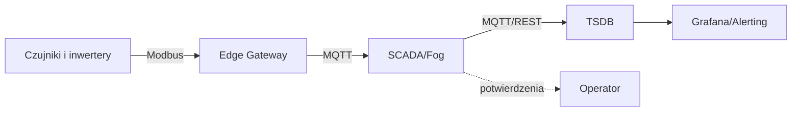

# Ć1: Projekt architektury monitoringu farmy PV

## Cel zajęć

Zaprojektowanie kompletnego łańcucha monitoringu dla farmy PV (1–5 MW): od czujników i sterowników (edge), przez warstwę SCADA/fog, po magazyn danych i wizualizację. Ćwiczenie rozwija umiejętności doboru tagów, KPI oraz filozofii alarmowania.

## Rezultaty (deliverables)

1. Uproszczony P&ID i schemat architektury (edge → SCADA → DB → dashboard).
2. Lista tagów (≥ 50) z opisami: nazwa, jednostka, częstotliwość, źródło, jakość.
3. Definicje KPI: PR, Availability (opcjonalnie: CF przy hybrydzie), wraz z formułami.
4. Filozofia alarmowania: 5–8 reguł z priorytetami i eskalacją.
5. Krótka notatka decyzji projektowych (1–2 strony): założenia, kompromisy, ryzyka.

## Materiały i narzędzia

- Dokumentacja: IEC 61724 (PV monitoring), specyfikacje inwerterów.
- Oprogramowanie: narzędzie do rysowania diagramów (np. draw.io), arkusz kalkulacyjny do listy tagów, Markdown do opisów.
- (Opcjonalnie) pvlib do symulacji referencyjnej produkcji oraz Grafana do prototypu dashboardu.

## Ramy zadania

### 1. Kontekst techniczny

- Moc zainstalowana: 3 MWp, 3 inwertery centralne; lokalizacja: klimat umiarkowany.
- Dostępne czujniki: pyranometr POA, temp. modułów (3 punkty), liczniki energii AC, monitoring stringów (24 kanały/inwerter).

### 2. Architektura danych

- Edge: akwizycja (Modbus RTU/TCP), wstępna normalizacja, buforowanie, publish do MQTT.
- Fog/SCADA: agregacja, krótkoterminowy historyk, logika alarmów P1–P4.
- Cloud/DB: TSDB (InfluxDB/TimescaleDB), retencja i downsampling, Grafana.

### 3. Lista tagów (przykładowe kategorie)

- Inwertery: P_AC, Q_AC, V_AC, I_AC, E_total, błędy.
- DC: V_DC, I_DC_string[k], T_radiator, stan MPPT.
- Środowiskowe: G_POA, T_mod[i], T_amb, wiatr (opcjonalnie).
- Statusy: dostępność, tryb pracy, potwierdzenia alarmów.

### 4. KPI i formuły

- PR = E_rzecz / E_teor(G_POA, T_mod), okno 15 min i 1 h.
- Availability = czas_dostępny / (czas_pracy + przestoje), raport dobowy/miesięczny.

### 5. Filozofia alarmowania

- Priorytety: P1 (bezpieczeństwo), P2 (produkcja), P3 (konserwacja), P4 (info).
- Przykład reguły:

```text
Alarm: Spadek PR w warunkach wysokiej irradiancji
Warunek: PR_30min < 0.80 oraz G_POA > 400 W/m^2 przez ≥ 30 min
Działanie: powiadomienie P2 (serwis), zgłoszenie w CMMS
Eskalacja: brak potwierdzenia 60 min → SMS do kierownika zmiany
```

## Przebieg zajęć (90–120 min)

1. 0–10 min — Wprowadzenie i wymagania.
2. 10–40 min — Projekt architektury i P&ID (draft).
3. 40–70 min — Lista tagów + definicje KPI.
4. 70–100 min — Filozofia alarmów i scenariusze eskalacji.
5. 100–120 min — Prezentacje grupowe i feedback.

## Kryteria oceny

- Kompletność artefaktów (30%)
- Poprawność techniczna i realizm założeń (30%)
- Jakość definicji KPI i alarmów (25%)
- Klarowność dokumentacji i diagramów (15%)

## Wskazówki i dobre praktyki

- Używaj spójnych jednostek i nazw tagów (namespace, prefiksy).
- Planuj retencję danych i downsampling już na etapie projektu.
- Zabezpiecz edge/fog na wypadek utraty łączności (store‑and‑forward).
- Uzgodnij z operatorem formaty raportów i SLA alarmów.

## (Opcjonalnie) Diagram przepływu danych




