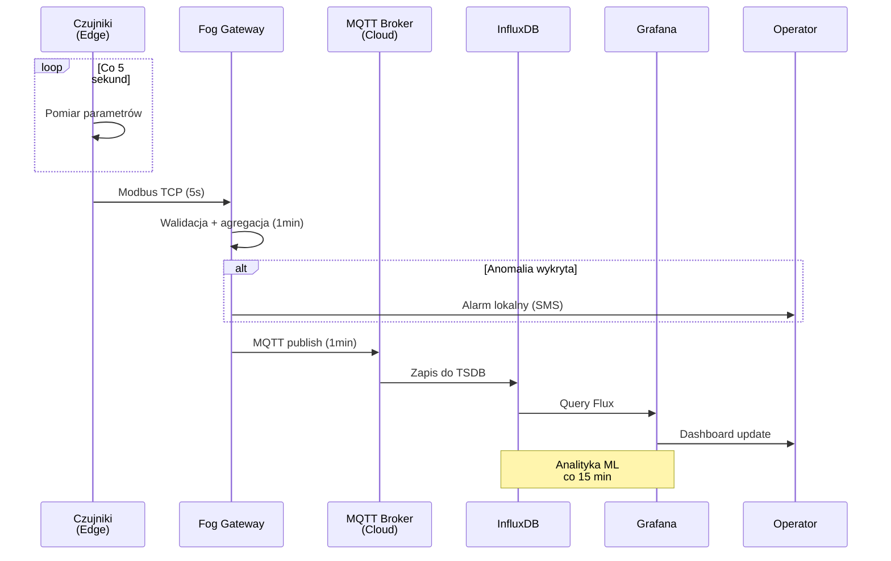
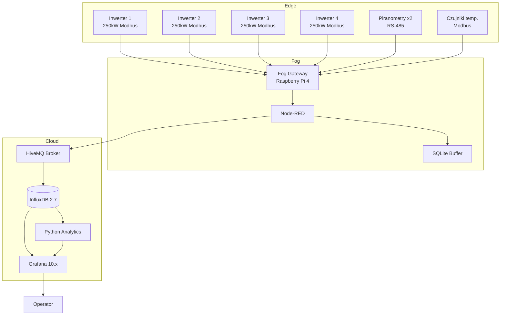

# Ćwiczenie 5: Mini-projekt zespołowy — Proof of Concept systemu monitoringu OZE

## 📋 Informacje organizacyjne

**Czas trwania**: 2 godziny  
**Format**: Praca zespołowa (2-3 osoby)  
**Typ zajęć**: Projekt integracyjny  
**Waga w ocenie**: 20% oceny z ćwiczeń

## 🎯 Cele dydaktyczne

Po ukończeniu tego ćwiczenia studenci będą potrafili:

1. **Zaprojektować** kompletną architekturę systemu monitoringu dla rzeczywistej instalacji OZE
2. **Zdefiniować** dashboardy operacyjne i serwisowe uwzględniające potrzeby różnych użytkowników
3. **Opracować** filozofię alarmowania z priorytetyzacją i regułami eskalacji
4. **Zaplanować** strategię pomiaru i rejestrowania (M&R) danych z uwzględnieniem norm branżowych
5. **Oszacować** zwrot z inwestycji (ROI) dla systemu monitoringu w kontekście utrzymania predykcyjnego
6. **Integrować** wiedzę z wykładów W1-W10 w praktycznym rozwiązaniu

## 📝 Kontekst i uzasadnienie

Mini-projekt POC (Proof of Concept) stanowi syntezę wiedzy zdobytej podczas całego kursu. Studenci wcielają się w rolę zespołu projektowego opracowującego system monitoringu dla rzeczywistej instalacji OZE. 

**Znaczenie praktyczne:**
- Symulacja rzeczywistego procesu projektowego w branży OZE
- Integracja aspektów technicznych, ekonomicznych i eksploatacyjnych
- Przygotowanie do pracy inżynierskiej w sektorze energetyki odnawialnej
- Rozwój kompetencji zespołowych i zarządzania projektem

:::info Powiązanie z wykładami
To ćwiczenie integruje materiał z:
- **W1**: Architektura edge-fog-cloud
- **W3**: Protokoły komunikacyjne (OPC UA, MQTT)
- **W5**: Bazy danych czasowych, wizualizacja (Grafana)
- **W6**: Wykrywanie anomalii
- **W7-W8**: Specyfika monitoringu dla różnych technologii OZE
- **W10**: Aspekty bezpieczeństwa
:::

---

## 🏗️ Zadanie 1: Schemat architektury systemu (30 min)

### 1.1. Wybór typu instalacji

Zespół wybiera **jeden z następujących wariantów** instalacji OZE:

#### Wariant A: Farma fotowoltaiczna 1 MW
- 4 inwertery centralne × 250 kW
- 40 stringów po 25 modułów
- Monitoring na poziomie string, inwerter, stacja transformatorowa
- Czujniki irradiancji (piranometry), temperatura modułów
- Zintegrowany system BESS 500 kWh (opcjonalnie)

**Przykład rzeczywisty**: Farma PV Witnica (lubuskie), 1.2 MW, ROI monitoringu: 1.8 roku

#### Wariant B: Elektrownia wiatrowa 6 MW
- 2 turbiny × 3 MW (np. Vestas V112 lub Enercon E-92)
- Monitoring wibracji (CMS), parametry SCADA
- Czujniki meteorologiczne (anemometry, wind vane)
- Analiza krzywych mocy, pitch control
- Prognozowanie produkcji krótkoterminowej

**Przykład rzeczywisty**: Farm Margonin (wielkopolskie), monitoring CMS wykrył uszkodzenie łożyska 3 tygodnie przed awarią

#### Wariant C: Biogazownia 500 kW el.
- Bioreaktor + kogenerator (silnik gazowy)
- Monitoring procesu fermentacji (temperatura, pH, przepływ)
- Analiza składu biogazu (CH₄, CO₂, H₂S, O₂)
- System bezpieczeństwa (detekcja wycieków, ATEX)
- Monitoring efektywności kogeneracji (elektryczna + cieplna)

**Przykład rzeczywisty**: Biogazownia w Lubieniu (dolnośląskie), monitoring H₂S zapobiegł korozji silnika (oszczędność: 80 tys. PLN)

#### Wariant D: System hybrydowy PV+BESS 500 kW / 1 MWh
- Instalacja fotowoltaiczna 500 kW
- Magazyn energii litowo-jonowy 1 MWh
- Inteligentne zarządzanie przepływem energii
- Monitoring BMS (SoC, SoH, cell balancing)
- Peak shaving i arbitraż energetyczny

**Przykład rzeczywisty**: Instalacja hybrydowa w IKEA Kraków, redukcja kosztów energii o 25% dzięki monitoringowi i optymalizacji ładowania

### 1.2. Projektowanie architektury systemu

Zespół opracowuje **diagram architektury trójwarstwowej**:

#### Warstwa Edge (Brzegowa)
**Definicja komponentów:**
- Urządzenia pomiarowe (czujniki, smart meters)
- Kontrolery lokalne (PLC, RTU)
- Inteligentne inwertery / turbinowe SCADA
- Edge gateways z bufferowaniem

**Do określenia:**
- Typy urządzeń z konkretnymi modelami (np. "Fronius Symo GEN24")
- Protokoły komunikacji na poziomie edge (Modbus RTU, RS-485)
- Częstotliwość akwizycji danych (1s, 10s, 1min)
- Lokalna logika alarmowa (threshold-based)

**Przykładowa specyfikacja Edge:**
```
Inwerter 1-4: Fronius Symo GEN24 250 kW
- Protokół: Modbus TCP (port 502)
- Dane: P_AC, U_DC, I_DC, temp., status
- Częstotliwość: 5 sekund
- Lokalne alarmy: Przegrzanie >75°C, DC overvoltage

String monitors: Tigo TS4-A-O (40 szt.)
- Dane: U_string, I_string, bypass status
- Protokół: Cloud Connect via gateway
- Częstotliwość: 30 sekund
```

#### Warstwa Fog (Lokalna agregacja)
**Funkcje do zaprojektowania:**
- Agregacja danych z urządzeń Edge
- Pre-processing i filtracja (outlier removal)
- Downsampling i kompresja (1s → 1min średnie)
- Buforowanie przy utracie połączenia z Cloud
- Protocol bridging (Modbus → MQTT/OPC UA)
- Lokalne dashboardy HMI

**Do określenia:**
- Platforma Fog (Raspberry Pi, Siemens IOT2050, Dell Edge Gateway)
- Oprogramowanie (Node-RED, Ignition Edge, KEPServerEX)
- Algorytmy agregacji (średnia, min, max, last)
- Pojemność bufora (np. 7 dni danych przy utracie cloud)

**Przykładowa konfiguracja Fog:**
```
Hardware: Raspberry Pi 4 (8GB RAM) + SSD 256GB
Software: Node-RED v3.1, Mosquitto MQTT, SQLite (buffer)

Pipeline:
1. Modbus RTU/TCP reader (4 inwertery)
2. Data validator (range check, spike detection)
3. Aggregator (5s → 1min średnie, min, max)
4. MQTT publisher (topic: farm/pv/metrics)
5. Local buffer (SQLite, 168h retention)
6. Local dashboard (Node-RED Dashboard)
```

#### Warstwa Cloud (Centralna analityka)
**Komponenty platformy:**
- Broker MQTT lub OPC UA Aggregation Server
- Baza danych czasoszeregowa (InfluxDB, TimescaleDB)
- Platforma wizualizacji (Grafana)
- Warstwa analityczna (Python, ML models)
- System alarmowy i notyfikacji
- API dla integracji zewnętrznych

**Do określenia:**
- Architektura cloud (on-premise, hybrid, public cloud)
- Retention policy (real-time: 30 dni, agregaty 5-min: 2 lata, hourly: 10 lat)
- Backup strategy (incremental daily, full weekly)
- Security (TLS, authentication, RBAC)

**Przykładowy stack Cloud:**
```
Hosting: AWS EC2 t3.medium (2 vCPU, 4GB RAM)
MQTT Broker: HiveMQ Community Edition
Database: InfluxDB 2.7 (retention: 30d/2y/10y)
Visualization: Grafana 10.x
Analytics: Python 3.11 + pandas, scikit-learn
Alerting: Grafana Alerting + SMTP/SMS gateway
```

### 1.3. Diagram przepływu danych

Zespół rysuje **sekwencję przepływu danych** od czujnika do dashboardu:



**Elementy wymagane w diagramie:**
- Wszystkie warstwy (Edge → Fog → Cloud)
- Protokoły komunikacji (Modbus, MQTT, HTTP/API)
- Częstotliwości transferu
- Punkty buforowania
- Ścieżki alarmów (lokalne vs. cloud)
- Interakcja użytkownika (operator, serwisant)

---

## 📊 Zadanie 2: Dashboard operacyjny (25 min)

### 2.1. Definicja użytkownika i potrzeb

**Użytkownik:** Operator dzienny instalacji OZE

**Potrzeby informacyjne:**
- Bieżąca produkcja energii (kW, kWh dzienne/miesięczne)
- Stan pracy urządzeń (online/offline, alarmy aktywne)
- Performance Ratio (PR) lub Capacity Factor (CF)
- Porównanie z prognozą produkcji
- Lista alarmów aktywnych (priorytetyzowana)
- Kluczowe parametry środowiskowe (irradiancja, prędkość wiatru, temperatura)

### 2.2. Projekt panelu operacyjnego

**Układ dashboardu (Grid Layout):**

```
┌─────────────────────────────────────────────────────┐
│  🏭 FARMA PV PRZYKŁADOWA — Dashboard Operacyjny     │
├─────────────┬───────────────┬───────────────────────┤
│  Moc chwilowa│  Dziś        │  Status urządzeń      │
│   750 kW    │  4,235 kWh   │  🟢 4/4 OK            │
│             │               │  🔴 0 alarmy          │
├─────────────┴───────────────┴───────────────────────┤
│  Wykres mocy w czasie (ostatnie 24h)                │
│  [====================================]              │
│                                                      │
├──────────────────────────────────────────────────────┤
│  Performance Ratio      │  Prognoza vs Rzeczywistość│
│  PR = 87.5%            │  [===========]            │
│  Cel: >85% ✅          │  102% realizacji          │
├────────────────────────┴───────────────────────────┤
│  Alarmy aktywne                                     │
│  🔴 BRAK                                           │
│                                                      │
└──────────────────────────────────────────────────────┘
```

**Wymagane panele (minimum 6):**

1. **Panel główny - Moc i energia**
   - Gauge: Moc chwilowa (kW)
   - Counter: Energia dzienna (kWh)
   - Counter: Energia miesięczna (MWh)
   - Trend: Wykres mocy 24h

2. **Panel statusu urządzeń**
   - Status grid (4 inwertery / 2 turbiny)
   - LED indicators (🟢 OK, 🟡 Warning, 🔴 Alarm)
   - Ostatnia aktualizacja (timestamp)

3. **Panel Performance Ratio / Capacity Factor**
   - Gauge: PR aktualne (%)
   - Line: Trend PR ostatnie 7 dni
   - Threshold: Linia celu (np. 85%)
   - Stat: PR miesięczne (porównanie)

4. **Panel prognoza vs. rzeczywistość**
   - Wykres porównawczy (expected vs actual)
   - Stat: % realizacji prognozy
  - Alert jeśli ≤ 90% prognozy

5. **Panel alarmów aktywnych**
   - Tabela: Czas | Priorytet | Źródło | Opis | Akcja
   - Filtr po priorytecie (Critical, Warning, Info)
   - Licznik alarmów niepotwierdzonych
   - Auto-refresh co 10s

6. **Panel parametrów środowiskowych**
   - Irradiancja (W/m²) lub prędkość wiatru (m/s)
   - Temperatura otoczenia (°C)
   - Temperatura modułów/gondoli (°C)
   - Wilgotność względna (%)

**Grafana Query Example (InfluxDB):**
```flux
from(bucket: "oze_monitoring")
  |> range(start: -24h)
  |> filter(fn: (r) => r["_measurement"] == "inverter_power")
  |> filter(fn: (r) => r["_field"] == "P_AC_kW")
  |> aggregateWindow(every: 5m, fn: mean, createEmpty: false)
  |> yield(name: "mean")
```

### 2.3. Funkcjonalności dashboardu operacyjnego

**Interaktywność:**
- ✅ Auto-refresh (10-30 sekund)
- ✅ Time range selector (Last 1h / 24h / 7d / 30d)
- ✅ Drill-down (klik na inwerter → szczegóły)
- ✅ Export danych (CSV, PDF)
- ✅ Alarmy akustyczne (opcjonalnie)

**Responsywność:**
- Desktop: Full dashboard (6+ paneli)
- Tablet: Stacked layout (2 kolumny)
- Mobile: Lista kluczowych metryk

:::tip Wskazówka projektowa
Dashboard operacyjny powinien odpowiadać na pytanie: **"Czy instalacja pracuje prawidłowo TERAZ?"**

Operator musi w **≤ 10 sekund** ocenić stan instalacji i zidentyfikować problemy.
:::

---

## 🔧 Zadanie 3: Dashboard serwisowy (25 min)

### 3.1. Definicja użytkownika i potrzeb

**Użytkownik:** Serwisant / Inżynier utrzymania ruchu

**Potrzeby informacyjne:**
- Analiza trendów długoterminowych (degradacja, sezonowość)
- Historia alarmów i zdarzeń (root cause analysis)
- Raporty konserwacyjne (MTBF, MTTR)
- Predykcja awarii (predictive maintenance)
- Optymalizacja harmonogramów przeglądów
- Analiza kosztów eksploatacji

### 3.2. Projekt panelu serwisowego

**Układ dashboardu:**

```
┌─────────────────────────────────────────────────────┐
│  🔧 FARMA PV — Dashboard Serwisowy                  │
├──────────────────────────────────────────────────────┤
│  Trendy długoterminowe (12 miesięcy)                │
│  PR trend: [============================]           │
│  Degradacja: -0.5%/rok ✅ (norma: ≤ 1%/rok)          │
│                                                      │
├──────────────────────────────────────────────────────┤
│  Historia alarmów (30 dni)      │  MTBF/MTTR       │
│  Critical: 2                     │  MTBF: 720h      │
│  Warning: 15                     │  MTTR: 4.2h      │
│  Trend: [========]               │  Availability:   │
│                                  │  99.2% ✅        │
├──────────────────────────────────┴──────────────────┤
│  Predictive Maintenance                             │
│  Inwerter 3: Wentylator - wymiana zalecana w 45 dni│
│  String 12: Spadek prądu -8% → inspekcja wizualna  │
│                                                      │
├──────────────────────────────────────────────────────┤
│  Koszty eksploatacji (YTD)                          │
│  Konserwacje planowe: 15,000 PLN                    │
│  Naprawy nieplanowane: 8,500 PLN                    │
│  Oszczędności z PM*: ~12,000 PLN                    │
│  * dzięki wczesnemu wykryciu                        │
└──────────────────────────────────────────────────────┘
```

**Wymagane panele (minimum 5):**

1. **Analiza trendów PR/CF (12 miesięcy)**
   - Line chart: PR/CF miesięczny
   - Regression line: Trend degradacji (%/rok)
   - Comparison: Rok bieżący vs. rok poprzedni
   - Sezonowość (identyfikacja wzorców)

2. **Historia alarmów i analiza przyczyn**
   - Tabela: Data | Urządzenie | Typ | Przyczyna | Naprawa | Koszt
   - Histogram: Alarmy per kategoria
   - Pareto chart: Top 5 przyczyn alarmów
   - Time to resolution (średnia, median)

3. **Metryki niezawodności**
   - MTBF (Mean Time Between Failures): Średni czas między awariami
   - MTTR (Mean Time To Repair): Średni czas naprawy
   - Availability = (Total time - Downtime) / Total time × 100%
   - Target vs. Actual (comparison gauges)

4. **Predictive Maintenance**
   - Lista komponentów z predykcją awarii
   - Scoring (risk score: 0-100)
   - Zalecane akcje serwisowe
   - Harmonogram sugerowanych przeglądów

**Przykład predykcji:**
```
Komponent: Inwerter 3 - Wentylator
Aktualna wydajność: 78% nominalnej
Trend degradacji: -2% miesięcznie
Predykcja awarii: 45 dni ±15 dni
Risk score: 75/100 (HIGH)
Zalecana akcja: Wymiana prewencyjna w oknie serwisowym
Koszt wymiany planowej: 2,500 PLN
Koszt awarii + przestoju: 15,000 PLN
Oszczędność: 12,500 PLN
```

5. **Analiza kosztów eksploatacji**
   - Breakdown kosztów (części, robocizna, przestój)
   - Trend kosztów w czasie
   - Benchmark: Koszt/MWh wyprodukowanej energii
   - ROI z monitoringu i PM

**Grafana Query Example (Predykcja):**
```flux
// Wykrywanie degradacji wydajności inwertera
from(bucket: "oze_monitoring")
  |> range(start: -90d)
  |> filter(fn: (r) => r["_measurement"] == "inverter_efficiency")
  |> filter(fn: (r) => r["inverter_id"] == "INV-03")
  |> aggregateWindow(every: 1d, fn: mean)
  |> derivative(unit: 1d, nonNegative: false)
  |> map(fn: (r) => ({ r with _value: r._value * 30.0 })) // degradacja miesięczna
```

### 3.3. Raporty serwisowe

**Automatyczne raporty (PDF/Email):**

1. **Raport dzienny** (dla operatora)
   - Energia wyprodukowana
   - PR/CF dzienny
   - Lista alarmów
   - Porównanie z prognozą

2. **Raport tygodniowy** (dla serwisu)
   - Statystyki availability
   - Top alarmy
   - Zużycie części zamiennych
   - Zalecenia konserwacyjne

3. **Raport miesięczny** (dla zarządu)
   - KPI finansowe (przychody, koszty O&M)
   - Performance benchmarking
   - Analiza trendów
   - Plan działania (action items)

:::info Powiązanie z normą
Raporty powinny być zgodne z wymaganiami:
- **IEC 61724-1**: Monitoring wydajności systemów fotowoltaicznych
- **IEC 61400-25**: Monitoring elektrowni wiatrowych
- **ISO 14224**: Zbiór i wymiana danych niezawodnościowych
:::

---

## ⚠️ Zadanie 4: Filozofia alarmowania (20 min)

### 4.1. Klasyfikacja priorytetów alarmów

Zespół definiuje **system priorytetyzacji alarmów** zgodnie z najlepszymi praktykami SCADA:

#### Poziomy priorytetów (4-stopniowa skala)

**CRITICAL (Krytyczny)** — Czerwony 🔴
- **Definicja**: Zagrożenie bezpieczeństwa ludzi lub poważne ryzyko uszkodzenia sprzętu
- **Czas reakcji**: Natychmiastowy (≤ 5 minut)
- **Akcja**: Automatyczne wyłączenie (E-stop) lub alarm do operatora + SMU (stanowisko kierowania)
- **Przykłady:**
  - Pożar (detekcja dymu/temp. >80°C)
  - BESS thermal runaway (ΔT cel > 10°C/min)
  - Zwarcie DC w PV
  - Overspeed turbiny (>120% nominal)
  - Wyciek H₂S w biogazowni (>10 ppm)

**HIGH (Wysoki)** — Pomarańczowy 🟠
- **Definicja**: Poważna degradacja wydajności lub ryzyko awarii urządzenia
- **Czas reakcji**: ≤ 1 godzina
- **Akcja**: Powiadomienie operatora, przygotowanie ekipy serwisowej
- **Przykłady:**
  - Awaria inwertera (0 kW mimo irradiancji)
  - String-out detection (brak prądu z całego stringa)
  - Wibracje turbiny >ISO 10816 Grade C
  - SoC baterii ≤ 10% (deep discharge risk)
  - Brak komunikacji z >2 urządzeniami

**MEDIUM (Średni)** — Żółty 🟡
- **Definicja**: Spadek wydajności lub anomalia wymagająca uwagi
- **Czas reakcji**: ≤ 24 godziny
- **Akcja**: Zaplanowana inspekcja, monitoring trendu
- **Przykłady:**
  - PR ≤ 80% (cel: >85%)
  - Temperatura modułu +10°C powyżej średniej
  - Drift czujnika irradiancji >5%
  - Drobne vibracje (ISO Grade B)
  - CH₄ w biogazie ≤ 55% (cel: 55-65%)

**LOW (Niski)** — Niebieski 🔵
- **Definicja**: Informacja o zmianie stanu lub zdarzeniu nie wpływającym na produkcję
- **Czas reakcji**: ≤ 7 dni (przegląd rutynowy)
- **Akcja**: Zapis do logu, przegląd w raporcie tygodniowym
- **Przykłady:**
  - Przełączenie trybu pracy (grid → island)
  - Zakończenie cyklu czyszczenia modułów
  - Aktualizacja firmware
  - Scheduled maintenance reminder
  - Zmiana harmonogramu

### 4.2. Reguły alarmowe (5-8 reguł)

Zespół definiuje **5-8 konkretnych reguł alarmowych** z logiką detekcji:

**Przykładowe reguły dla farmy PV:**

#### Reguła 1: Awaria inwertera (HIGH)
```yaml
Nazwa: INV_FAILURE
Warunek: (P_AC < 1 kW) AND (Irradiance > 300 W/m²) AND (Status = "Running")
Czas持续: 5 minut
Priorytet: HIGH
Akcja: 
  - Powiadomienie: SMS do operatora + email do serwisu
  - Dashboard: Podświetlenie inwertera na czerwono
  - Log: Zapis zdarzenia z kontekstem (irradiancja, temperatura)
Eskalacja: Jeśli brak potwierdzenia przez 30 min → powiadomienie supervisora
```

#### Reguła 2: String underperformance (MEDIUM)
```yaml
Nazwa: STRING_UNDERPERFORM
Warunek: (I_string < 0.85 × I_string_avg) FOR duration > 15min
Gdzie: I_string_avg = średnia z pozostałych stringów na tym samym inwerterzе
Priorytet: MEDIUM
Akcja:
  - Powiadomienie: Email do serwisu
  - Dashboard: Highlight stringa z markerem ⚠️
  - Analiza: Porównanie z historiąlast 7 days)
Zalecana inspekcja: Wizualna w ciągu 48h (możliwe zacienienie, uszkodzenie)
```

#### Reguła 3: PR poniżej celu (MEDIUM)
```yaml
Nazwa: PR_BELOW_TARGET
Warunek: (PR_daily < 85%) AND (Irradiance_sum > 4 kWh/m²/day)
Czas: 3 kolejne dni
Priorytet: MEDIUM
Akcja:
  - Trigger: Raport analityczny (identify root cause)
  - Możliwe przyczyny: Soiling, degradacja, shading, inverter clipping
  - Dashboard: Widoczny wskaźnik ⚠️ na panelu PR
Eskalacja: Po 7 dniach → HIGH (wymaga interwencji)
```

#### Reguła 4: BESS thermal anomaly (CRITICAL)
```yaml
Nazwa: BESS_THERMAL_RUNAWAY
Warunek: (ΔT_cell > 10°C w ciągu 5 min) OR (T_max_cell > 55°C)
Priorytet: CRITICAL
Akcja:
  - Automatyczne: E-stop ładowania/rozładowania
  - Wentylacja: Włączenie wentylatorów na MAX
  - Powiadomienie: SMS + call do operatora + serwisu + straży pożarnej (jeśli T>60°C)
  - Monitoring: Co 10s do ustabilizowania
Protokół bezpieczeństwa: Zgodnie z NFPA 855
```

#### Reguła 5: Communication loss (HIGH)
```yaml
Nazwa: COMM_LOSS
Warunek: Brak danych z urządzenia > 10 minut
Priorytet: HIGH (jeśli critical device) / MEDIUM (jeśli non-critical)
Akcja:
  - Sprawdzenie: Ping urządzenia, status gateway
  - Powiadomienie: Email + wpis w log
  - Eskalacja: Po 1h → wysłanie technika do sprawdzenia
Retry logic: 3 próby reconnect z interwałem 2 min
```

### 4.3. Eskalacja i potwierdzanie alarmów

**Macierz eskalacji:**

| Priorytet | Powiadomienie 1 | Brak potwierdzenia | Powiadomienie 2 | Brak reakcji | Powiadomienie 3 |
|-----------|-----------------|-------------------|-----------------|--------------|-----------------|
| CRITICAL | Operator (SMS+call) | 5 min | Supervisor (call) | 10 min | Dyrektor + Straż |
| HIGH | Operator (SMS) | 30 min | Supervisor (SMS) | 2h | Dyrektor |
| MEDIUM | Email serwis | 4h | Supervisor | 24h | - |
| LOW | Log only | - | - | - | - |

**Proces potwierdzania:**
1. Operator otrzymuje alarm
2. Potwierdza odbiór w systemie (ACK - acknowledge)
3. Podejmuje akcję zgodnie z procedurą
4. Zamyka alarm po rozwiązaniu problemu
5. System wymaga komentarza (root cause + action taken)

:::warning Alarm Flooding Prevention
**Maksymalna liczba alarmów**: 5-10 alarmów na operatora na godzinę

**Techniki redukcji:**
- **Grouping**: Alarmy powiązane grupowane (np. "Inwerter 2: 5 alarmów")
- **Suppression**: Alarmy pochodne ukryte (jeśli alarm główny aktywny)
- **Delay**: Alarmy LOW/MEDIUM z opóźnieniem (avoid spurious)
- **Filtering**: Dead-band (strefa nieczułości) dla danych analogowych

**Standard**: ISA-18.2 (Management of Alarm Systems for the Process Industries)
:::

---

## 📈 Zadanie 5: Plan M&R danych (15 min)

### 5.1. M&R = Measurement & Recording

**M&R Plan** określa **co, jak często, i jak długo** mierzyć i przechowywać dane.

### 5.2. Definicja parametrów do pomiaru

Zespół tworzy **tabelę parametrów monitorowanych**:

| Parametr | Jednostka | Rozdzielczość | Częstotliwość akwizycji | Źródło danych |
|----------|-----------|---------------|------------------------|---------------|
| P_AC_total | kW | 0.1 kW | 5 s | Inwertery (suma) |
| P_AC_inv_1 | kW | 0.1 kW | 5 s | Inwerter 1 |
| U_DC_inv_1 | V | 1 V | 5 s | Inwerter 1 |
| I_string_01 | A | 0.01 A | 30 s | String monitor 1 |
| Irradiance | W/m² | 1 W/m² | 10 s | Piranometr |
| T_ambient | °C | 0.1°C | 60 s | Czujnik temp. |
| T_module | °C | 0.1°C | 60 s | Czujnik PT100 |
| Energy_daily | kWh | 0.01 kWh | On change | Licznik energii |
| Alarm_status | - | - | On change | SCADA |

**Minimalna lista dla PV** (≥50 tagów):
- 4 inwertery × 8 parametrów = 32 tagi
- 10 stringów × 2 parametry (U, I) = 20 tagów
- Meteorologia: 5 tagów (irradiancja, temp. x2, wilgotność, wiatr)
- Status: 5 tagów (grid status, AC breaker, DC disconnect, etc.)
- **Suma: ~62 tagi**

### 5.3. Strategia przechowywania danych (Retention Policy)

**Hierarchia retencji** (kompromis: szczegółowość vs. koszt storage):

| Poziom agregacji | Retencja | Wielkość danych | Przypadek użycia |
|------------------|----------|-----------------|------------------|
| **Raw data** (5s) | 7 dni | ~2 GB/miesiąc | Analiza szczegółowa awarii, debugowanie |
| **1-min średnie** | 30 dni | ~500 MB/miesiąc | Monitoring operacyjny, trendy krótkoterminowe |
| **5-min średnie** | 2 lata | ~2 GB/2 lata | Analiza wydajności, raporty serwisowe |
| **Hourly średnie** | 10 lat | ~1 GB/10 lat | Trendy długoterminowe, degradacja, benchmarking |
| **Daily totals** | Lifetime | ~50 MB/10 lat | Rozliczenia finansowe, analizy roczne |

**Implementacja w InfluxDB:**
```flux
// Retention Policy - automatyczna agregacja
option task = {name: "downsample_to_5min", every: 5m}

from(bucket: "raw_data")
  |> range(start: -5m)
  |> aggregateWindow(every: 5m, fn: mean)
  |> to(bucket: "aggregated_5min", org: "oze")
```

**Szacunek storage (farma 1MW, 62 tagi):**
- Raw (7d): 62 tagi × 17,280 samples/d × 7d × 8 bytes ≈ **60 MB**
- 1-min (30d): 62 × 1,440 × 30 × 8 ≈ **22 MB**
- 5-min (2y): 62 × 288 × 730 × 8 ≈ **105 MB**
- **Total: ~200 MB** (bardzo efektywne!)

### 5.4. Backup i disaster recovery

**Strategia kopii zapasowych:**

1. **Database backup**
   - Incremental: Codziennie (tylko zmiany)
   - Full: Co tydzień (pełna kopia)
   - Retention: 4 tygodnie (rolling)
   - Location: Off-site (cloud lub drugi serwer)

2. **Configuration backup**
   - Dashboardy Grafana: Export do JSON (version control Git)
   - Reguły alarmowe: YAML files w repozytorium
   - Node-RED flows: Export do plików .json
   - SCADA tags: CSV export co miesiąc

3. **Recovery Time Objective (RTO)** i **Recovery Point Objective (RPO)**
   - RTO: < 4 godziny (czas przywrócenia systemu)
   - RPO: < 1 godzina (akceptowalna utrata danych)

**Test disaster recovery:**
- Symulacja awarii serwera co 6 miesięcy
- Weryfikacja procedur przywracania
- Dokumentacja lessons learned

:::tip Best Practice
**Reguła 3-2-1** dla backupów:
- **3** kopie danych (produkcja + 2 backupy)
- **2** różne media (dysk + cloud)
- **1** kopia off-site (inna lokalizacja fizyczna)
:::

---

## 💰 Zadanie 6: ROI utrzymaniowe (20 min)

### 6.1. Analiza kosztów i korzyści

Zespół przeprowadza **analizę zwrotu z inwestycji** dla systemu monitoringu.

#### Koszty implementacji (CAPEX)

**Dla farmy PV 1 MW:**

| Pozycja | Koszt jednostkowy | Ilość | Suma |
|---------|-------------------|-------|------|
| **Hardware** | | | |
| Fog gateway (Raspberry Pi + SSD) | 800 PLN | 1 | 800 PLN |
| String monitors (opcjonalnie) | 300 PLN | 10 | 3,000 PLN |
| Piranometry (irradiancja) | 2,000 PLN | 2 | 4,000 PLN |
| Czujniki temp. modułów | 200 PLN | 4 | 800 PLN |
| **Subtotal Hardware** | | | **8,600 PLN** |
| **Software** | | | |
| InfluxDB Cloud (1 rok) | 200 PLN/mies. | 12 | 2,400 PLN |
| Grafana Cloud Pro | 400 PLN/mies. | 12 | 4,800 PLN |
| Node-RED (open source) | 0 PLN | - | 0 PLN |
| **Subtotal Software** | | | **7,200 PLN** |
| **Usługi** | | | |
| Konfiguracja systemu | 15,000 PLN | 1 | 15,000 PLN |
| Szkolenie operatorów | 3,000 PLN | 1 | 3,000 PLN |
| **Subtotal Usługi** | | | **18,000 PLN** |
| **CAPEX TOTAL** | | | **33,800 PLN** |

#### Koszty operacyjne (OPEX - roczne)

| Pozycja | Koszt roczny |
|---------|--------------|
| Licencje software (InfluxDB + Grafana) | 7,200 PLN |
| Hosting / Cloud services | 2,400 PLN |
| Konserwacja systemu (10% CAPEX) | 3,400 PLN |
| Kalibracja czujników (co 2 lata) | 1,500 PLN |
| **OPEX TOTAL** | **14,500 PLN/rok** |

#### Korzyści (oszczędności roczne)

**1. Zwiększona produkcja energii** (główna korzyść)

Założenia:
- Farma 1 MW, 1,200 MWh/rok (przed monitoringiem)
- PR wzrasta z 80% do 87% dzięki monitoringowi (+7%)
- Cena energii: 500 PLN/MWh

Obliczenia:
```
Dodatkowa energia = 1,200 MWh × 7% = 84 MWh/rok
Dodatkowy przychód = 84 MWh × 500 PLN = 42,000 PLN/rok
```

**2. Redukcja przestojów** (downtime reduction)

Założenia:
- Availability bez monitoringu: 96% (downtime: 350h/rok)
- Availability z monitoringiem: 99% (downtime: 88h/rok)
- Redukcja przestoju: 262 godziny/rok
- Średnia moc w czasie produkcji: 700 kW
- Cena energii: 500 PLN/MWh

Obliczenia:
```
Uniknięta strata produkcji = 262h × 0.7 MW = 183 MWh/rok
Wartość = 183 MWh × 500 PLN = 91,500 PLN/rok
```

**3. Utrzymanie predykcyjne** (predictive maintenance)

Założenia:
- Koszt napraw nieplanowanych: 50,000 PLN/rok (bez monitoringu)
- Koszt konserwacji planowych: 35,000 PLN/rok (z monitoringiem)
- Oszczędność: 30% kosztów serwisowych

Obliczenia:
```
Oszczędność serwisowa = 50,000 - 35,000 = 15,000 PLN/rok
```

**4. Przedłużenie żywotności urządzeń**

- Inwertery: Żywotność +15% (z 12 do 13.8 lat)
- Uniknięcie wcześniejszej wymiany: ~20,000 PLN (amortyzowane)

**Sumaryczne korzyści roczne:**
```
Zwiększona produkcja:        42,000 PLN
Redukcja przestojów:         91,500 PLN
Oszczędności serwisowe:      15,000 PLN
Przedłużenie żywotności:      5,000 PLN (roczna amortyzacja)
───────────────────────────────────────
TOTAL BENEFITS:            153,500 PLN/rok
```

### 6.2. Obliczenie ROI

**ROI (Return on Investment):**

```
ROI = (Korzyści roczne - OPEX) / CAPEX

ROI = (153,500 - 14,500) / 33,800
ROI = 139,000 / 33,800
ROI = 4.11 (411%)

Payback Period = CAPEX / (Korzyści - OPEX)
Payback = 33,800 / 139,000
Payback = 0.24 roku = 3 miesiące
```

**Wnioski:**
- ✅ **ROI: 411% rocznie** (każda zainwestowana złotówka generuje 4.11 PLN zysku rocznie)
- ✅ **Payback: 3 miesiące** (inwestycja zwraca się w pierwszy kwartał)
- ✅ **NPV (5 lat)**: ~550,000 PLN (przy dyskontowaniu 5%)
- ✅ **IRR**: > 400% (bardzo atrakcyjna inwestycja)

:::info Benchmark branżowy
**Typowe ROI dla monitoringu OZE:**
- PV farms: 1-2 lata payback
- Wind farms: 0.5-1.5 roku payback
- BESS: 0.5-1 rok payback (ze względu na safety)

Nasz projekt (3 miesiące) jest **bardzo konkurencyjny**! ✅
:::

### 6.3. Analiza wrażliwości

**Pytania "what-if":**

| Scenariusz | Zmiana | Impact na ROI | Payback |
|------------|--------|---------------|---------|
| **Base case** | - | 411% | 3 mies. |
| Cena energii -20% | 500 → 400 PLN/MWh | 305% | 4 mies. |
| PR gain tylko +3% | Zamiast +7% | 180% | 6 mies. |
| CAPEX +50% | +17,000 PLN | 274% | 4.5 mies. |
| OPEX +50% | +7,250 PLN/rok | 359% | 3.5 mies. |
| **Worst case** (wszystkie powyższe) | Combined | 120% | 10 mies. |

**Wniosek**: Nawet w pesymistycznym scenariuszu ROI pozostaje **pozytywne** (payback ≤ 1 rok) ✅

---

## 📊 Zadanie 7: Prezentacja i dokumentacja (20 min)

### 7.1. Struktura prezentacji zespołowej

Każdy zespół przygotowuje **10-minutową prezentację** zawierającą:

#### Slajd 1: Tytuł i zespół
- Nazwa projektu
- Typ instalacji
- Skład zespołu

#### Slajd 2: Architektura systemu
- Diagram Edge-Fog-Cloud
- Protokoły komunikacji
- Główne komponenty

#### Slajd 3: Dashboard operacyjny
- Screenshot/mockup
- Kluczowe panele (min. 6)
- Funkcjonalności

#### Slajd 4: Dashboard serwisowy
- Screenshot/mockup
- Raporty i analityka
- Predictive maintenance

#### Slajd 5: Filozofia alarmów
- Priorytety (4 poziomy)
- 5-8 kluczowych reguł
- Macierz eskalacji

#### Slajd 6: Plan M&R
- Lista parametrów (min. 50 tagów)
- Retention policy
- Backup strategy

#### Slajd 7: ROI i ekonomia
- CAPEX / OPEX
- Korzyści roczne
- Payback period
- Sensitivity analysis

#### Slajd 8: Wyzwania i rozwiązania
- Napotkane problemy projektowe
- Przyjęte rozwiązania
- Trade-offs

#### Slajd 9: Lessons learned
- Co zadziałało dobrze
- Co można poprawić
- Rekomendacje

#### Slajd 10: Q&A
- Pytania do prowadzącego/grupy
- Dyskusja

### 7.2. Dokumentacja pisemna

**Raport projektu** (3-5 stron A4):

**Struktura raportu:**
1. **Executive Summary** (0.5 strony)
   - Typ instalacji, moc
   - Główne założenia projektowe
   - Kluczowe wyniki (ROI, payback)

2. **Architektura systemu** (1 strona)
   - Diagram z opisem
   - Uzasadnienie wyborów technologicznych
   - Lista komponentów sprzętowych i programowych

3. **Dashboardy i wizualizacja** (1 strona)
   - Opis dashboardu operacyjnego (6 paneli)
   - Opis dashboardu serwisowego (5 paneli)
   - Screenshoty lub mockupy

4. **Alarmy i M&R** (1 strona)
   - Filozofia alarmowania (priorytety)
   - 5-8 reguł alarmowych
   - Plan M&R (min. 50 tagów)
   - Retention policy

5. **Analiza ekonomiczna** (0.5-1 strona)
   - CAPEX/OPEX
   - Korzyści i ROI
   - Sensitivity analysis
   - Rekomendacje

6. **Wnioski** (0.5 strony)
   - Kluczowe osiągnięcia
   - Wyzwania
   - Dalszy rozwój

**Format:**
- PDF lub Markdown
- Diagramy edytowalne (draw.io, Visio, Mermaid)
- Źródła danych/założeń udokumentowane
- Bibliografia (min. 3 pozycje)

---

## ✅ Kryteria oceny

### Ocena punktowa (100 punktów)

| Kryterium | Punkty | Opis |
|-----------|--------|------|
| **Architektura systemu** | 20 | Kompletność, poprawność techniczna, uzasadnienia |
| **Dashboard operacyjny** | 15 | Funkcjonalność, ergonomia, 6 wymaganych paneli |
| **Dashboard serwisowy** | 15 | Analityka, raporty, PM, 5 wymaganych paneli |
| **Filozofia alarmów** | 15 | Priorytety, reguły (5-8), eskalacja, anti-flooding |
| **Plan M&R** | 10 | Kompletność listy (≥50 tagów), retention, backup |
| **ROI i ekonomia** | 10 | Poprawność obliczeń, realistyczność założeń, sensitivity |
| **Prezentacja** | 10 | Jasność przekazu, materiały wizualne, czas (10 min) |
| **Raport pisemny** | 5 | Struktura, język, formatting, bibliografia |
| **Współpraca zespołowa** | 5 | Podział pracy, peer review |
| **Bonus: Innowacyjność** | +5 | Nietypowe rozwiązania, dodatkowe funkcje |

**Skala ocen:**
- **90-100 pkt**: 5.0 (Celujący)
- **85-89 pkt**: 4.5 (Bardzo dobry+)
- **75-84 pkt**: 4.0 (Bardzo dobry)
- **65-74 pkt**: 3.5 (Dobry+)
- **51-64 pkt**: 3.0 (Dostateczny)
- **poniżej 51 pkt**: 2.0 (Niedostateczny - wymaga poprawy)

### Kryteria jakościowe

**Architektura:**
- ✅ Wszystkie 3 warstwy zdefiniowane (Edge-Fog-Cloud)
- ✅ Protokoły komunikacji określone
- ✅ Redundancja i failover przewidziane
- ✅ Bezpieczeństwo (szyfrowanie, uwierzytelnianie)

**Dashboardy:**
- ✅ Odpowiadają potrzebom użytkowników
- ✅ Kluczowe metryki wyeksponowane
- ✅ Intuicyjna nawigacja
- ✅ Real-time + trendy historyczne

**Alarmy:**
- ✅ Jasna klasyfikacja priorytetów
- ✅ Reguły precyzyjnie sformułowane
- ✅ Mechanizmy anti-flooding
- ✅ Zgodność z ISA-18.2

**Ekonomia:**
- ✅ Realistyczne założenia kosztowe
- ✅ Poprawne obliczenia ROI
- ✅ Uwzględnienie ryzyk (sensitivity)
- ✅ Porównanie z benchmarkami branżowymi

---

## 🛠️ Narzędzia i zasoby

### Zalecane narzędzia do projektowania

**Diagramy architektury:**
- [draw.io](https://app.diagrams.net/) - Darmowe, online
- Lucidchart - Wersja edukacyjna
- Microsoft Visio - Jeśli dostępne
- Mermaid - Diagramy w markdown

**Mockupy dashboardów:**
- Grafana Playground - Testowy environment
- Figma - Mockupy UI
- PowerPoint/Google Slides - Proste schematy
- Screenshot z przykładowych dashboardów Grafana

**Obliczenia ekonomiczne:**
- Excel / Google Sheets
- Python + pandas (dla zaawansowanych)
- Kalkulatory ROI online

**Collaboration:**
- Google Docs - Wspólna edycja raportu
- Miro / Mural - Virtual whiteboard
- Git/GitHub - Version control (zaawansowane)

### Przykładowe dane i szablony

**Dostępne w materiałach kursu:**
- Template architektury (draw.io)
- Przykładowy dashboard Grafana (JSON export)
- Szablon listy tagów (Excel)
- Template reguł alarmowych (YAML)
- Kalkulator ROI (Excel)
- Szablon raportu (Markdown/Word)

**Publiczne datasety do testów:**
- [NREL Solar Power Data](https://www.nrel.gov/grid/solar-power-data.html)
- [Open Power System Data](https://open-power-system-data.org/)
- Symulowane dane BMS (dostarczone przez prowadzącego)

---

## 📅 Harmonogram ćwiczenia (120 minut)

### Faza 1: Wprowadzenie i organizacja (10 min)

**Minuty 0-10:**
- Prezentacja zadania przez prowadzącego (5 min)
- Podział na zespoły 2-3 osobowe (2 min)
- Wybór wariantu instalacji przez zespoły (3 min)

### Faza 2: Projektowanie architektury (30 min)

**Minuty 10-40:**
- Dyskusja koncepcyjna w zespole (10 min)
- Rysowanie diagramu architektury (15 min)
- Uzupełnienie specyfikacji komponentów (5 min)

**Checkpoint 1** (minuta 40):
- Krótka prezentacja architektury dla prowadzącego (2 min/zespół)
- Feedback i korekty

### Faza 3: Projektowanie dashboardów (30 min)

**Minuty 40-70:**
- Dashboard operacyjny: definicja 6 paneli (15 min)
- Dashboard serwisowy: definicja 5 paneli (15 min)
- Szkice/mockupy dashboardów

### Faza 4: Alarmy i M&R (25 min)

**Minuty 70-95:**
- Filozofia alarmów: priorytety i reguły (15 min)
- Plan M&R: lista tagów i retention (10 min)

### Faza 5: Ekonomia i ROI (15 min)

**Minuty 95-110:**
- Szacunek kosztów CAPEX/OPEX (7 min)
- Kalkulacja korzyści (5 min)
- Obliczenie ROI i payback (3 min)

### Faza 6: Finalizacja i prezentacje (10 min)

**Minuty 110-120:**
- Przygotowanie prezentacji (5 min)
- Krótkie prezentacje zespołów (3-4 min/zespół)
- Podsumowanie prowadzącego (2 min)

:::warning Zarządzanie czasem
**To ćwiczenie jest intensywne!** Zespoły muszą efektywnie zarządzać czasem.

**Wskazówki:**
- Podzielcie zadania w zespole (1 osoba = architektura, 1 = dashboardy, 1 = ROI)
- Pracujcie równolegle gdzie możliwe
- Nie perfekcjonujcie - cel to **działający POC**, nie produkcyjny system
- Skup się na **kluczowych elementach**, detale dopracujcie w raporcie
:::

---

## 💡 Przykładowe rozwiązanie (wariant A: Farma PV 1 MW)

### Architektura (uproszczona)



### Dashboard operacyjny - kluczowe panele

1. **Moc chwilowa** (Gauge, 0-1000 kW)
2. **Energia dzienna** (Stat, kWh)
3. **Status inwerterów** (4× LED, grid layout)
4. **Wykres mocy 24h** (Time series)
5. **Performance Ratio** (Gauge, target 85%)
6. **Alarmy aktywne** (Table, auto-refresh 10s)

### Filozofia alarmów - przykładowe reguły

1. **INV_FAILURE** (HIGH): `P < 1 kW AND Irr > 300 W/m² FOR 5 min`
2. **STRING_FAULT** (MEDIUM): `I_string < 0.8×avg FOR 15 min`
3. **PR_LOW** (MEDIUM): `PR < 80% FOR 3 days`
4. **COMM_LOSS** (HIGH): No data > 10min
5. **OVERTEMP** (HIGH): T_module > 75°C

### ROI - kluczowe liczby

- **CAPEX**: 34,000 PLN
- **OPEX**: 14,500 PLN/rok
- **Korzyści**: 153,500 PLN/rok
- **ROI**: 411%
- **Payback**: 3 miesiące

---

## 🎓 Wskazówki dla zespołów

### Do's (Rób)

✅ **Rozpocznij od use cases:**
- Kto będzie używał systemu?
- Jakie pytania muszą być odpowiedziane?
- Jakie decyzje będą podejmowane na podstawie danych?

✅ **Bądź konkretny:**
- Nie "czujniki temperatury" ale "PT100, zakres -40 do +85°C, dokładność ±0.5°C"
- Nie "database" ale "InfluxDB 2.7, retention 30d/2y, backup daily"

✅ **Uzasadniaj wybory:**
- Dlaczego MQTT a nie OPC UA?
- Dlaczego InfluxDB a nie PostgreSQL?
- Każdy wybór powinien mieć racjonalne uzasadnienie

✅ **Myśl o użytkownikach:**
- Operator: Potrzebuje szybkiej oceny stanu (≤ 10 s)
- Serwisant: Potrzebuje danych do diagnozy
- Zarząd: Potrzebuje KPI finansowych

### Don'ts (Nie rób)

❌ **Nie kopiuj bez zrozumienia:**
- Zrozum każdy element architektury
- Potraf wyjaśnić każdą regułę alarmową

❌ **Nie przesadzaj ze złożonością:**
- POC = Proof of Concept (uproszczony prototyp)
- Focus na kluczowych funkcjach
- "Perfect is the enemy of done"

❌ **Nie ignoruj ekonomii:**
- System może być technicznie doskonały, ale nieopłacalny
- ROI musi być pozytywne (≤ 3 lata payback dla akceptacji)

❌ **Nie zapominaj o bezpieczeństwie:**
- Cybersecurity (szyfrowanie, uwierzytelnianie)
- Safety (alarmy krytyczne, E-stop)
- Compliance (normy IEC, ISO)

---

## 📚 Materiały pomocnicze

### Literatura zalecana

1. **Borlase, S. G.** (2017). *Smart Grids: Advanced Technologies and Solutions*. Rozdział 5-6.
2. **IEC 61724-1**: *Photovoltaic system performance monitoring*
3. **ISA-18.2**: *Management of Alarm Systems for the Process Industries*
4. **Grafana Documentation**: [grafana.com/docs/grafana/latest/dashboards/](https://grafana.com/docs/grafana/latest/dashboards/)
5. **InfluxDB Best Practices**: [docs.influxdata.com/influxdb/v2.7/write-data/best-practices/](https://docs.influxdata.com/influxdb/v2.7/write-data/best-practices/)

### Case studies branżowe

**Dostępne online:**
- [Greenbyte - Wind Farm Monitoring Case Studies](https://www.greenbyte.com/customers/)
- [SMA - PV Monitoring Solutions](https://www.sma.de/en/products/monitoring-control)
- [Fluence - BESS Monitoring](https://fluenceenergy.com/)

### Webinaria i tutoriale

- NREL: *Best Practices in PV Operations and Maintenance*
- AWS IoT: *Building Industrial IoT Solutions*
- Grafana Labs: *Dashboard Design Best Practices*

---

## ❓ FAQ - Najczęściej zadawane pytania

**Q1: Czy musimy zaimplementować system (kod, hardware)?**

A: **Nie.** To jest **projekt koncepcyjny** (POC = Proof of Concept dokumentacyjny):
- Wymagane: Diagramy, mockupy, specyfikacje
- Niewymagane: Działający kod, fizyczny hardware
- Opcjonalnie (bonus): Prosty prototyp (np. Node-RED flow, Grafana dashboard)

---

**Q2: Jak szczegółowa powinna być lista tagów?**

A: **Minimum 50 tagów** z następującymi informacjami:
- Nazwa taga (np. `INV_01_P_AC`)
- Opis (np. "Inwerter 1 - Moc AC")
- Źródło (np. "Fronius Symo, Modbus register 40083")
- Typ danych (REAL, INT, BOOL)
- Jednostka (kW, V, A, °C)
- Częstotliwość akwizycji (5s, 1min, on change)

---

**Q3: Czy ROI musi być dokładne?**

A: **Założenia muszą być realistyczne**, obliczenia **poprawne matematycznie**.

**Dopuszczalne:**
- Szacunki oparte na literaturze/benchmarkach
- Uproszczenia (np. stała cena energii)
- Zakresy wartości (CAPEX: 30-40 tys. PLN)

**Niedopuszczalne:**
- Nieralistyczne założenia (PR gain +20% - niemożliwe)
- Błędy w obliczeniach
- Brak uzasadnienia liczb

---

**Q4: Jak długa może być prezentacja?**

A: **Maksymalnie 10 minut** + 2-3 minuty Q&A.

**Struktura:**
- 1-2 min: Intro, architektura
- 2-3 min: Dashboardy (screenshoty)
- 2 min: Alarmy i M&R
- 2 min: ROI
- 1 min: Wnioski
- 2-3 min: Q&A

**Praktyczny tip**: Rehearsal prezentacji wcześniej!

---

**Q5: Czy można użyć AI/ChatGPT do pomocy?**

A: **Tak, z ograniczeniami:**

**Dozwolone:**
- Pomoc w formy diagrams
- Sprawdzenie obliczeń
- Proof-reading raportu
- Generowanie przykładowych queries

**Niedozwolone:**
- Kopiowanie całych rozwiązań bez zrozumienia
- Oddanie całego zadania AI
- Plagiat z internetu

**Zasada**: Musisz **rozumieć i umieć wyjaśnić** każdy element projektu!

---

**Q6: Co jeśli nie ukończymy w czasie 2h?**

A: **To normalne!** Ćwiczenie jest intensywne.

**W czasie zajęć:**
- Skoncentrujcie się na **kluczowych elementach**
- Zróbcie **szkice i notatki**

**Po zajęciach:**
- Dopracujcie raport (termin: 7 dni)
- Uzupełnijcie szczegóły
- Przygotujcie finalną prezentację

**Ocena**: 50% za pracę na zajęciach + 50% za raport końcowy

---

## 🌟 Przykłady dodatkowych funkcji (punkty bonusowe)

### Funkcje zaawansowane (+5 punktów każda)

1. **Machine Learning dla predykcji:**
   - Model predykcji produkcji (accuracy >85%)
   - Anomaly detection z autoencoder
   - Prognoza degradacji komponentów

2. **Digital Twin:**
   - Model symulacyjny instalacji
   - Scenariusze "what-if"
   - Testowanie reguł alarmowych offline

3. **Integracja z systemami zewnętrznymi:**
   - API do systemu EMS
   - Raportowanie do OSD (Operator Systemu Dystrybucyjnego)
   - Integracja z systemem billing

4. **Zaawansowana wizualizacja:**
   - Heatmapa efektywności stringów
   - 3D wizualizacja farmy z color-coding statusu
   - Geolokalizacja na mapie

5. **Aplikacja mobilna:**
   - Powiadomienia push
- Dashboard mobilny (responsive)
   - Potwierdzanie alarmów z telefonu

**Maksymalny bonus**: +10 punktów (2 zaawansowane funkcje)

---

## 📝 Deliverables (wymagane artefakty)

### Do oddania po ćwiczeniu:

**1. Prezentacja** (PDF lub PowerPoint)
- 10 slajdów
- Format: 16:9
- Deadline: Koniec zajęć (upload na platformę)

**2. Raport projektu** (PDF)
- 3-5 stron A4
- Font: 11-12pt, 1.5 line spacing
- Deadline: 7 dni po zajęciach

**3. Diagramy** (edytowalne)
- Architektura systemu (draw.io, Visio, lub PNG high-res)
- Przepływ danych (sequence diagram)
- Format: Edytowalny (XML, VSDX) lub PNG 300 DPI

**4. Lista tagów** (Excel lub CSV)
- Min. 50 pozycji
- Kolumny: Tag Name, Description, Source, Data Type, Unit, Frequency
- Template dostarczony przez prowadzącego

**5. Kalkulator ROI** (Excel)
- Arkusz z obliczeniami
- Pokazane wzory
- Sensitivity analysis

**Opcjonalnie (bonus):**
- Działający prototyp (Node-RED flow, Grafana dashboard JSON)
- Demo video (screencast, 2-3 min)
- Extended analysis (>5 stron)

---

## 🎓 Podsumowanie dla wykładowcy

:::tip Wskazówki metodyczne dla prowadzącego

**Przygotowanie:**
- Przygotuj 4 warianty instalacji (PV, Wind, Biogas, Hybrid)
- Udostępnij templates i przykładowe dane
- Zarezerwuj sale z projektorami dla prezentacji

**Podczas zajęć:**
- **Minuta 0-10**: Briefing, podział zespołów
- **Minuta 40**: Checkpoint - weryfikacja architektury (2 min/zespół)
- **Minuta 95**: Checkpoint - status postępów
- **Minuta 110-120**: Quick presentations (3-4 min/zespół)

**Kluczowe punkty do podkreślenia:**
1. **Holistyczne podejście** - monitoring to nie tylko hardware, ale całość systemu
2. **User-centric design** - dashboard musi służyć użytkownikowi (operator ≠ serwisant)
3. **Ekonomia ma znaczenie** - ROI uzasadnia inwestycję
4. **Bezpieczeństwo first** - alarmy Critical muszą być niezawodne
5. **Skalowa** - projekt powinien przewidywać rozbudowę

**Częste błędy studentów:**
- Zbyt skomplikowana architektura (over-engineering)
- Dashboardy z 20 panelami (information overload)
- Wszystkie alarmy jako HIGH (brak priorytetyzacji)
- Nierealistyczne ROI (zbyt optymistyczne założenia)
- Brak uzasadnień dla wyborów technologicznych

**Czas na pytania:** Zarezerwuj 10-15 min na końcu dla Q&A

**Assessment:** Ocena na żywo (preliminary) + szczegółowa po raporcie
:::

---

## 🔗 Powiązania z innymi ćwiczeniami

**Ten mini-projekt integruje:**
- [Ćwiczenie 1](../cwiczenie-01-projekt-architektury-pv/) - Architektura systemu
- [Ćwiczenie 2](../cwiczenie-02-lab-komunikacji/) - Protokoły komunikacyjne
- [Ćwiczenie 3](../cwiczenie-03-analiza-danych/) - Analiza danych, PR/CF
- [Ćwiczenie 4](../cwiczenie-04-bess-monitoring-bezpieczenstwo/) - BESS monitoring i bezpieczeństwo

**Progresja dydaktyczna:**
```
Ć1: Podstawy architektury (teoria)
  ↓
Ć2: Komunikacja (praktyka techniczna)
  ↓
Ć3: Analiza danych (praktyka analityczna)
  ↓
Ć4: Bezpieczeństwo (specjalizacja BESS)
  ↓
Ć5: Integracja (synteza całości) ← JESTEŚMY TUTAJ
```

---

## 📊 Przykładowy raport - struktura

```markdown
# Mini-Projekt POC: System Monitoringu Farmy PV 1 MW

## Executive Summary
Zaprojektowano system monitoringu dla farmy PV 1 MW wykorzystujący
architekturę Edge-Fog-Cloud. System zapewnia real-time monitoring, 
predykcję awarii i ROI 411% (payback 3 miesiące).

## 1. Architektura systemu
[Diagram + opis 3 warstw]

## 2. Dashboardy
### 2.1 Dashboard operacyjny
[Lista 6 paneli + mockup]

### 2.2 Dashboard serwisowy  
[Lista 5 paneli + mockup]

## 3. Alarmy i M&R
### 3.1 Filozofia alarmów
[4 priorytety + 5-8 reguł]

### 3.2 Plan M&R
[Lista ≥50 tagów, retention policy]

## 4. Analiza ROI
[CAPEX/OPEX, korzyści, obliczenia, sensitivity]

## 5. Wnioski i rekomendacje
[Kluczowe ustalenia, dalszy rozwój]

## Bibliografia
[Min. 3 pozycje]
```

---

## ✅ Checklist przed oddaniem

**Przed submitem sprawdź:**

**Kompletność:**
- [ ] Diagram architektury Edge-Fog-Cloud
- [ ] Dashboard operacyjny (6 paneli)
- [ ] Dashboard serwisowy (5 paneli)
- [ ] Filozofia alarmów (priorytety + 5-8 reguł)
- [ ] Plan M&R (≥50 tagów + retention)
- [ ] ROI (CAPEX, OPEX, benefits, payback)
- [ ] Prezentacja (10 slajdów)
- [ ] Raport (3-5 stron)

**Jakość:**
- [ ] Wszystkie wybory technologiczne uzasadnione
- [ ] Obliczenia ROI są poprawne
- [ ] Dashboardy odpowiadają potrzebom użytkowników
- [ ] Alarmy są priorytetyzowane logicznie
- [ ] Język akademicki, bez błędów
- [ ] Diagramy są czytelne i profesjonalne
- [ ] Bibliografia zawiera min. 3 pozycje

**Współpraca:**
- [ ] Wszyscy członkowie zespołu uczestniczyli
- [ ] Podział pracy był równy
- [ ] Peer review przeprowadzony

---

## 🎯 Rezultaty uczenia się

Po ukończeniu tego ćwiczenia studenci:

✅ **Rozumieją** kompleksowość projektowania systemów monitoringu OZE  
✅ **Potrafią** integrować wiedzę z różnych dziedzin (technika, ekonomia, eksploatacja)  
✅ **Znają** narzędzia branżowe (SCADA, TSDB, Grafana)  
✅ **Umieją** uzasadniać decyzje projektowe  
✅ **Mogą** szacować ROI dla rozwiązań monitoringowych  
✅ **Są przygotowani** do pracy w branży OZE jako inżynierowie systemów monitoringu  

---

**Powrót do**: [Przegląd ćwiczeń](../README.md)  
**Następne**: [Projekty końcowe](../../projekty/README.md)

---

**Ćwiczenie opracował**: Dr inż. [Imię Nazwisko]  
**Ostatnia aktualizacja**: 2025-09-30  
**Wersja**: 2.0
