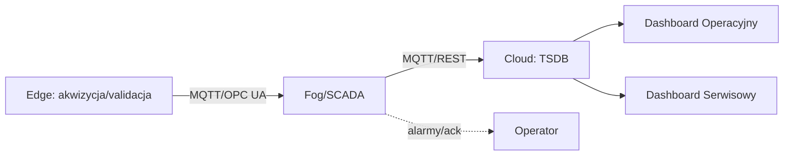

# Ć5: Mini‑projekt zespołowy POC — monitoring instalacji OZE

## Cel zajęć

Zespół (3–4 osoby) przygotowuje Proof‑of‑Concept (POC) monitoringu wybranej instalacji OZE (PV/wiatr/biogaz/BESS lub hybryda). POC obejmuje schemat architektury, 2 dashboardy (operacyjny i serwisowy), filozofię alarmów (5–8 reguł), plan M&R danych oraz ocenę ROI utrzymaniowego.

## Rezultaty (deliverables)

1. Diagram architektury z opisem komponentów (edge/fog/cloud) i przepływów danych.
2. Dashboard operacyjny (KPI, statusy, alarmy) i serwisowy (diagnostyka, trendy, SOE).
3. Filozofia alarmowania: 5–8 reguł z priorytetami i eskalacjami.
4. Plan M&R (Maintenance & Reliability) danych: retencje, backup, walidacja jakości.
5. Krótka analiza ROI utrzymaniowego: założenia, oszczędności, ryzyka.

## Materiały i narzędzia

- Narzędzia do diagramów (draw.io), InfluxDB/Grafana, broker MQTT/OPC UA, repozytorium kodu/konfiguracji.
- Dane przykładowe z ćwiczeń lub symulacje (Node‑RED/pvlib/generator SCADA).

## Zakres POC i wytyczne

### Architektura

- Edge: akwizycja i walidacja, buforowanie (store‑and‑forward).
- Fog/SCADA: agregacja, logika alarmowa, krótki historyk.
- Cloud: TSDB, provisioning dashboardów, alerting i integracje.



### Dashboardy

- Operacyjny: PR/CF/Availability, statusy urządzeń, alarmy P1–P3, podgląd SOE.
- Serwisowy: heatmapy (np. T_cell/V_cell), szczegółowe trendy, wskaźniki jakości danych.

### Filozofia alarmów (przykłady)

```text
P1: Dym/H2S/ΔT > prog → sekwencja E‑stop + powiadomienia
P2: PR_30min < 0.8 przy G_POA > 400 W/m^2 (≥ 30 min) → zgłoszenie serwisowe
P3: Brak danych > 10 min z edge → przełączenie na bufor, alert P3
```

### Plan M&R danych

- Retencje: raw (7–14 dni), 1‑min (6 mies.), 15‑min (3 lata); backup tygodniowy/miesięczny.
- Walidacja: zakresy, jakość, imputacja kontrolowana; monitoring kardynalności TSDB.

### ROI utrzymaniowy (szacowanie)

- Założenia: spadek przestojów o X%, poprawa PR/CF o Y%, koszty mycia/serwisu.
- Wzór: ROI = (zysk energii + redukcja OPEX − koszt systemu) / koszt systemu.

## Harmonogram pracy zespołu (2 × 45 min)

1. Plan i podział ról (10 min).
2. Projekt architektury i alarmów (35 min).
3. Dashboardy i M&R danych (35 min).
4. ROI i przygotowanie prezentacji (10 min).

## Kryteria oceny (rubryka)

- Architektura i uzasadnienie decyzji — 25%
- Dashboardy (użyteczność, czytelność, kompletność) — 25%
- Filozofia alarmów i M&R danych — 25%
- Analiza ROI i prezentacja — 25%

## Wskazówki i dobre praktyki

- Wersjonuj konfiguracje (provisioning) i trzymaj w repo wraz z diagramami.
- Definiuj KPI i progi na podstawie danych; unikaj arbitralnych wartości.
- Zadbaj o spójne nazwy tagów, jednostki i strefy czasowe.


