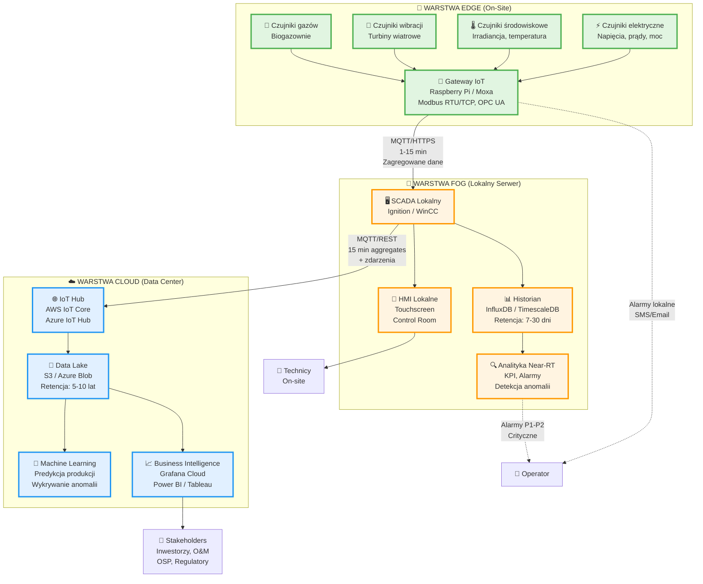

# Architektura przepływu danych w monitoringu OZE

Kompleksowy system monitorowania wykorzystuje architekturę **edge–fog–cloud** do zapewnienia niezawodności, szybkości reakcji i zaawansowanej analityki danych.

## Diagram architektury

---

## Warstwy architektury

### 🔹 Warstwa EDGE (On-Site)

**Akwizycja i wstępna obróbka danych**

- **Zbieranie danych**: 1-10 Hz z czujników
- **Filtracja i walidacja**: Usuwanie szumów, sprawdzanie zakresów
- **Buforowanie**: 1-48h lokalnego przechowywania
- **Lokalne alarmy**: Reakcja < 100ms dla safety-critical

**Funkcje:**
- Akwizycja surowych sygnałów
- Normalizacja jednostek
- Store-and-forward (buforowanie podczas utraty łączności)
- Emergency stop i lokalne reguły bezpieczeństwa

---

### 🔸 Warstwa FOG (Lokalny Serwer)

**Agregacja i analityka lokalna**

- **Konsolidacja**: Zbieranie z wielu źródeł edge
- **Normalizacja tagów**: Ujednolicona struktura danych
- **Retencja**: 7-30 dni szczegółowych danych
- **KPI i HMI**: Operacyjne dashboardy w czasie rzeczywistym

**Funkcje:**
- Agregacja danych z dziesiątek/setek urządzeń
- Time-Series Database (InfluxDB, TimescaleDB)
- Near-real-time analytics (progi adaptacyjne, CUSUM)
- Lokalne HMI dla operatorów
- Cache i synchronizacja z cloud

---

### ☁️ Warstwa CLOUD (Data Center)

**Składowanie długoterminowe i zaawansowana analityka**

- **Retencja**: 5-10 lat danych zagregowanych
- **Machine Learning**: Predykcja, wykrywanie anomalii
- **Benchmarking**: Porównania między obiektami w portfolio
- **Integracja**: ERP, CMMS, OSP portals

**Funkcje:**
- Data Lake/Warehouse (S3, Azure Blob, Parquet)
- Modele ML (XGBoost, LSTM, autoencoders)
- Raporty biznesowe (Power BI, Tableau, Grafana Cloud)
- Fleet-wide analytics i optymalizacja O&M
- Compliance i audyty

---

## Kluczowe protokoły i technologie

### 🔌 Komunikacja Edge
- **Modbus RTU/TCP**: Legacy, dominujący w PV/wiatr
- **OPC UA** (IEC 62541): Nowoczesny, structured data
- **CAN Bus**: Automotive-grade, turbiny wiatrowe
- **Ethernet/IP**: Przemysłowe sieci Ethernet

### 📡 Transport danych
- **MQTT** (ISO/IEC 20922): Lightweight telemetry, pub-sub
  - QoS 0/1/2 dla gwarantowanego dostarczenia
  - Retained messages, Last Will Testament
- **HTTPS/REST**: Synchroniczne API calls
- **Apache Kafka**: Event streaming dla dużych wdrożeń

### 💾 Bazy danych
- **InfluxDB**: Open-source TSDB, doskonała wydajność
- **TimescaleDB**: PostgreSQL extension dla time-series
- **AWS Timestream**: Serverless TSDB w cloud
- **Parquet**: Columnar format dla archiwizacji (kompresja 10:1)

### 🔒 Bezpieczeństwo
- **TLS 1.3**: Szyfrowanie end-to-end
- **X.509 certyfikaty**: Mutual authentication MQTT/OPC UA
- **VPN/VPC**: Segregacja sieci OT/IT
- **IEC 62443**: Standard cyberbezpieczeństwa przemysłowego

---

## Scenariusze awaryjne

| Scenariusz | Zachowanie systemu |
|------------|-------------------|
| **Utrata łączności Edge → Fog** | Edge buforuje dane (do 24 h), synchronizacja po przywróceniu |
| **Utrata łączności Fog → Cloud** | Fog przechowuje dane (do 30 dni), synchronizacja po przywróceniu. Alarmy lokalne działają normalnie |
| **Awaria Fog** | Edge wysyła dane bezpośrednio do Cloud (jeśli ma łączność). Lokalne HMI niedostępne, wymagana wizyta serwisu |
| **Awaria Cloud** | Edge i Fog działają normalnie (island mode). Brak długoterminowej analityki i dashboardów biznesowych, ale proces kontrolowany |

---

## Kluczowe zasady projektowe

### 1. Latency drives layering
- **Emergency stop**: < 10 ms → **Edge**
- **Alarmy operacyjne**: < 1 s → **Edge/Fog**
- **Dashboardy operacyjne**: < 10 s → **Fog**
- **Raporty biznesowe**: < 1 min → **Cloud**

### 2. Resilience
- Edge + Fog **muszą działać bez cloud** przez dni–tygodnie
- Edge musi działać **bez fog** przez godziny
- Redundancja fog dla instalacji > 10 MW

### 3. Retencja vs. koszty

| Warstwa | Rozdzielczość | Retencja | Przykład (farma 10 MW) |
|---------|---------------|----------|------------------------|
| Edge | 1–10 s | 1–48 h | 10 GB (RAM/flash) |
| Fog | 1–10 s | 7–30 dni | 500 GB (SSD/HDD) |
| Cloud | 15 min (aggregates) | 5–10 lat | 100 GB/rok (S3, compressed) |

### 4. Otwarte standardy
- Preferuj open-source i open standards nad vendor lock-in
- OPC UA, MQTT, InfluxDB, Grafana jako de facto standardy
- API-first design dla integracji

---

## Powiązane wykłady

- [Wykład 1: Architektura monitoringu](/docs/wyklady/wyklad-01-architektura-w1/02-warstwy-architektury)
- [Wykład 3: Protokoły komunikacyjne](/docs/wyklady/wyklad-03-protokoly)
- [Wykład 4: Standardy i integracja](/docs/wyklady/wyklad-04-standardy-integracja)
- [Wykład 5: Jakość danych i strumienie](/docs/wyklady/wyklad-05-jakosc-danych-strumienie)

