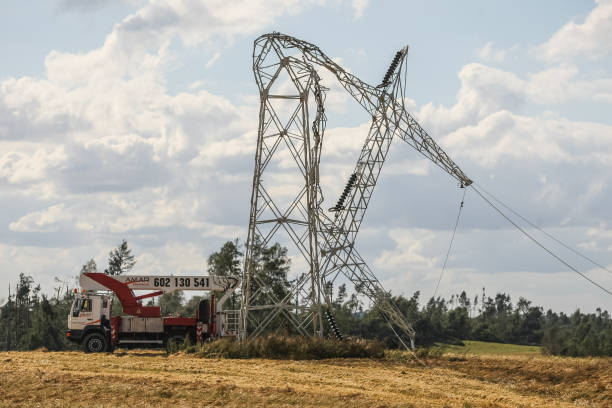
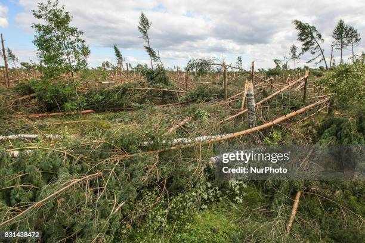

import { 
  SlideContainer, 
  Slide, 
  KeyPoints, 
  SupportingDetails, 
  InstructorNotes,
  VisualSeparator,
  InfoBox,
  WarningBox,
  SuccessBox,
  LearningObjective,
  KeyConcept,
  Example
} from '@site/src/components/SlideComponents';

<SlideContainer>

<Slide title="🎥 Wprowadzenie: energetyka wiatrowa – bezpieczeństwo i ryzyko" type="info">

<SupportingDetails title="🎬 Materiał wideo">

  <iframe
    src="https://www.youtube.com/embed/-eCqMjbNQTA"
    title="YouTube video"
    style={{position: 'absolute', top: '0', left: '0', width: '100%', height: '100%'}}
    frameBorder="0"
    allow="accelerometer; autoplay; clipboard-write; encrypted-media; gyroscope; picture-in-picture; web-share"
    allowFullScreen
  />

</SupportingDetails>

<KeyPoints title="📊 Najważniejsze liczby (skrótem)">
- 🌍 5818 udokumentowanych wypadków turbin (stan na 31.03.2025); raportowanie mocno niedoszacowane (~91% pożarów poza statystykami)
- 🌊 Offshore 2023: 1679 incydentów (+94% r/r); 61,9 mln roboczogodzin (+39% r/r)
- 🕯️ 246 ofiar śmiertelnych w 180 wypadkach; 672 wypadki z obrażeniami
- 🪓 Łopaty: ~3800 awarii rocznie (~0,54%/rok przy ~700 tys. łopat); odłamki do 1 mili
- 🔥 Pożary: 478 zgłoszonych (2000–2024); szacunki 50–117 rocznie globalnie; pożary gondoli → 90% strat całkowitych/znacznych
- 🇵🇱 Polska: >9 GW mocy; rekord 6,7 GW (02.2022); liberalizacja 10H (2025) do 500–700 m; Baltic Power 1,2 GW od 2026
</KeyPoints>

<InstructorNotes>
**Kluczowa myśl**: bezpieczeństwo w energetyce wiatrowej to **aktywne zarządzanie ryzykiem**, a nie tylko zgodność z przepisami. Wzrost skali sektora oznacza większą ekspozycję na zdarzenia i większą odpowiedzialność po stronie inżynierów.

Na początek osadzam wątek w realnych danych. Bazy zdarzeń, takie jak SAS, dokumentują **5818 wypadków** do marca 2025 r., ale raportowanie jest **mocno niedoszacowane** – badania wskazują, że nawet **~91% pożarów** nie trafia do statystyk. To znaczy, że obraz ryzyka bywa zbyt „różowy” i musimy myśleć w kategoriach pełniejszej, często ukrytej ekspozycji.

W obszarze **offshore** widzimy dynamiczny wzrost: **1679 incydentów w 2023 r.** (około **+94% r/r**), przy rekordowych **61,9 mln roboczogodzin**. To nie tylko liczby – to konsekwencja pracy w środowisku trudniejszym technicznie i logistycznie, gdzie błędy kosztują więcej.

Z perspektywy skutków: do marca 2025 r. odnotowano **246 ofiar śmiertelnych w 180 wypadkach** oraz **672 wypadki z obrażeniami**. To uzmysławia, że mówimy o bezpieczeństwie **ludzi**, nie tylko urządzeń.

Technicznie najbardziej „kosztowne” są dwa zjawiska. Po pierwsze **awarie łopat** – szacunkowo **~3800 rocznie** (ok. **0,54%/rok** przy ~700 tys. łopat). Odłamki potrafią przemieszczać się na duże odległości, co rozszerza strefę ryzyka poza samą turbinę. Po drugie **pożary**, zwłaszcza **pożary gondoli**, które w **~90%** kończą się **całkowitą lub znaczną stratą**. Oficjalnie zebrano **478 pożarów (2000–2024)**, ale modele i dane ubezpieczeniowe sugerują **50–117 pożarów rocznie** globalnie.

Polski kontekst – incydenty: publicznie dostępne dane o zdarzeniach są ograniczone, ale sygnały ryzyka są wyraźne. Zanotowano rekordowe **ograniczenia wytwarzania (curtailment)** w kwietniu 2024 r., co ujawnia ryzyka **operacyjne i systemowe**. W badaniach wskazano na **transport ponadgabarytowy** jako krytyczne źródło incydentów (wypadki drogowe, rozbieżności dokumentacyjne). W eksploatacji pojawiają się **ekstremalne zjawiska wiatrowe**, susze wiatrowe i **oblodzenie/zrzut lodu** (udokumentowane przypadki do ~140 m), które zwiększają ekspozycję poza strefę turbiny. W obszarze **offshore Bałtyk** ryzyka obejmują potencjalne **wycieki olejów** (przekładnie, hydraulika, smary) oraz narażenia personelu (temperatura, **PEM**, hałas, prace w izolacji). Wniosek: konieczne są **ujednolicone rejestry incydentów**, szybkie raportowanie oraz priorytet na **prewencję pożarów gondoli** i **awarii łopat**.

Chcę, aby studenci zapamiętali trzy rzeczy: **(1) dane są niepełne, więc projektujemy z marginesem bezpieczeństwa**, **(2) monitorujemy kluczowe mechanizmy awarii – łopaty i źródła pożarów**, **(3) łączymy bezpieczeństwo ludzi, majątku i ciągłość pracy**. To wprowadzenie ustawia nas pod dalszą, metodyczną analizę ryzyka i dobór środków kontroli.
</InstructorNotes>

</Slide>

<Slide title="🎥 Wprowadzenie: fotowoltaika (PV) – bezpieczeństwo i ryzyko" type="info">

<SupportingDetails title="🎬 Materiał wideo">

  <iframe
    src="https://www.youtube.com/embed/9FtOgsZZzww?start=5"
    title="YouTube video"
    style={{position: 'absolute', top: '0', left: '0', width: '100%', height: '100%'}}
    frameBorder="0"
    allow="accelerometer; autoplay; clipboard-write; encrypted-media; gyroscope; picture-in-picture; web-share"
    allowFullScreen
  />

  <iframe
    src="https://www.youtube.com/embed/NeUOIFegm9c"
    title="YouTube video"
    style={{position: 'absolute', top: '0', left: '0', width: '100%', height: '100%'}}
    frameBorder="0"
    allow="accelerometer; autoplay; clipboard-write; encrypted-media; gyroscope; picture-in-picture; web-share"
    allowFullScreen
  />

</SupportingDetails>

<KeyPoints title="📊 Najważniejsze liczby (skrótem)">
- 🔥 Globalnie: ~0,0293 pożaru/MW/rok (≈29/GW/rok); duża zmienność między krajami
- 🌍 Włochy/Australia: 0,015–0,047; Niemcy/USA: &lt;0,0051 pożarów/MW/rok; Europa/NA: 0,02–0,03%/instalację/rok
- 🧩 Inicjacja pożarów (udział): złącza 17%, izolatory 15%, falowniki 14%, moduły 10%
- ⚡ Główna przyczyna: łuk elektryczny DC; często powiązany z błędami montażowymi i jakością złączy
- 🛠️ Inspekcje: 62% instalacji z problemami bezpieczeństwa (analiza 2021–2023); do 97% nieprawidłowości na dachach w audytach międzynarodowych
- 🇵🇱 Polska: brak jednolitego raportowania PSP; szacunki 308 pożarów (2018–2021) przy ~2,2 mln interwencji; sektor >22 GW (2025)
</KeyPoints>

<InstructorNotes>
**Teza**: w PV najczęściej zawodzą **połączenia i praktyka montażowa**, a kluczowym mechanizmem zapłonu jest **łuk elektryczny DC**. Skuteczne bezpieczeństwo wynika z jakości komponentów, standardów montażu i systematycznych inspekcji.

Zacznę od osadzenia w liczbach: globalnie obserwujemy ok. **29 pożarów na każdy GW mocy rocznie**, z dużą rozpiętością między krajami wynikającą z różnic w **raportowaniu** i **wymogach inspekcyjnych**. Na poziomie komponentów najczęściej pojawiają się problemy **złączy (ok. 17%)**, następnie **izolatorów (15%)** i **falowników (14%)**. To prowadzi wprost do wniosku, że kontrola jakości złączy, kompatybilność wtyk/gniazdo i sposób zaciskania są krytyczne.

Przyczyna źródłowa to **łuk elektryczny DC** – trudniejszy do wygaszenia niż w AC. Typowe scenariusze to: niekompatybilne złącza, niedociągnięte zaciski, wnikanie wilgoci, degradacja materiałów. Inspekcje międzynarodowe pokazują, że **problemy bezpieczeństwa są powszechne** (od setek projektów do setek tysięcy punktów danych), co potwierdza potrzebę **standaryzacji przeglądów** i **termografii** w utrzymaniu.

W Polsce brakuje spójnej ewidencji pożarów PV – dostępne liczby są **niepewne** i najpewniej **niedoszacowane**. Jednocześnie sektor urósł do **>22 GW**, a wiele mikroinstalacji powstało bez pełnych projektów inżynierskich. To zwiększa wagę **procedur odbioru**, **kontroli okresowych** i **edukacji instalatorów**. Przejście do dalszych części: będziemy łączyć te dane z metodami analizy ryzyka i doborem środków kontroli, m.in. **AFCI**, szybkie wyłączenie i standardy łączeniowe.
</InstructorNotes>

</Slide>

<Slide title="🎥 Wprowadzenie: biogaz – bezpieczeństwo i ryzyko" type="info">

<SupportingDetails title="🎬 Materiał wideo">

  <iframe
    src="https://www.youtube.com/embed/FI1FjNTqyKo"
    title="YouTube video"
    style={{position: 'absolute', top: '0', left: '0', width: '100%', height: '100%'}}
    frameBorder="0"
    allow="accelerometer; autoplay; clipboard-write; encrypted-media; gyroscope; picture-in-picture; web-share"
    allowFullScreen
  />

</SupportingDetails>

<KeyPoints title="📊 Najważniejsze liczby (skrótem)">
- 🧪 Dominujące zdarzenia: wybuchy gazów ≈69,3%, toksyczne emisje ≈21,3%, asfiksja ≈4%, pożary ≈2,7%
- 🧍‍♂️ Skutki: ≥51 ofiar śmiertelnych, 76 rannych (1990–2023, wybrane badania)
- 🇪🇺 Europa: 169 wypadków (1995–2014); w ostatniej dekadzie >800 zdarzeń na 13 171 stacji
- ⚠️ Poważne awarie: częstość ≈2,3×10⁻⁵/rok; większość poważnych zdarzeń od wycieków biogazu
- 📍 Geografia (Europa): gł. Niemcy (≈76%), następnie Francja (≈11%), Włochy (≈6%), UK (≈2%)
- 🇵🇱 Polska: ~400 instalacji, ~300 MW (2024); luka w publicznych statystykach incydentów
</KeyPoints>

<InstructorNotes>
**Teza**: w biogazowniach dominują **wybuchy metanu** i **emisje H₂S**, a ciężar skutków spada na personel pracujący na obiekcie. Bezpieczeństwo opiera się na kontroli procesu, wentylacji, detekcji gazów i reżimie prac niebezpiecznych.

W danych globalnych widać, że **wybuchy** stanowią około **69% zdarzeń**, a **toksyczne emisje** i **asfiksja** odpowiadają za znaczącą część pozostałych. Europejskie zestawienia pokazują **setki incydentów** na przestrzeni dekady, przy obliczonej częstości poważnych awarii rzędu **2,3×10⁻⁵/rok**. To potwierdza, że nawet przy dobrej kulturze bezpieczeństwa, **ryzyko resztkowe** wymaga stałej kontroli.

Najczęstsze mechanizmy: **wycieki/akumulacja biogazu**, **nadciśnienie i pęknięcia membran**, **prace gorące** bez właściwego gazfree i zezwoleń, a także **H₂S** w przestrzeniach zamkniętych. W praktyce oznacza to wymóg rygorystycznych procedur LOTO, gas detection, wentylacji, kategorii stref **ATEX** i kompetencji personelu.

W Polsce sektor jest mniejszy (**~400 instalacji**, **~300 MW**), ale występują **luki w ewidencji incydentów** i udokumentowane problemy środowiskowe (poferment, odory). Dlatego podkreślam: **projektowanie pod bezpieczeństwo procesu**, **monitoring gazów** i **standaryzacja prac niebezpiecznych** są kluczowe. To będzie punkt wyjścia do metod HAZOP/ETA/FTA w kolejnych częściach.
</InstructorNotes>

</Slide>

<Slide title="🎥 Wprowadzenie: magazyny energii (BESS) – bezpieczeństwo i ryzyko" type="info">

<SupportingDetails title="🎬 Materiał wideo">

  <iframe
    src="https://www.youtube.com/embed/_tyCV5RpLIY"
    title="YouTube video"
    style={{position: 'absolute', top: '0', left: '0', width: '100%', height: '100%'}}
    frameBorder="0"
    allow="accelerometer; autoplay; clipboard-write; encrypted-media; gyroscope; picture-in-picture; web-share"
    allowFullScreen
  />

</SupportingDetails>

<KeyPoints title="📊 Najważniejsze liczby (skrótem)">
- 📉 98% spadek awaryjności (2018–2024); wdrożenia USA 645→12 191 MWh przy wzroście incydentów 2→12
- 🔎 Przyczyny: sterowanie ≈46%, balance-of-system ≈43%, ogniwa/moduły ≈11%
- 🌏 Znane zdarzenia: Surprise (2019), Victorian Big Battery (2021), Moss Landing (2024–2025)
- 🇰🇷 Korea Płd.: 296 incydentów w H1 2025; 543 incydenty w 2024 r.
- 🇺🇸 USA: >25 tys. przypadków przegrzania/pożaru Li-ion (2017–2022)
- 🇵🇱 Polska: >2,5 GW zakontraktowane (aukcja 12/2024); poważne incydenty bateryjne (Gdańsk 2025, Warszawa 2024)
</KeyPoints>

<InstructorNotes>
**Teza**: współczesne BESS są coraz **bezpieczniejsze systemowo**, ale wciąż wrażliwe na błędy **sterowania**, **uszczelnień/środowiska** i **procedur reagowania**. Dominują przyczyny „pozasame ogniwa”, dlatego nacisk kładziemy na integrację i walidację systemu.

Na liczbach: obserwujemy **98% spadek wskaźnika awaryjności (2018–2024)**, mimo wielokrotnego wzrostu wdrożeń. Analizy EPRI/PNNL/TWAICE wskazują, że **~89% awarii** to sterowanie i komponenty równowagi systemu, a nie „chemia” ogniw. Przypomnę znane przypadki: **Surprise (2019)** z niekontrolowaną ucieczką termiczną i obrażeniami strażaków, **Victorian Big Battery (2021)** z łukiem po wycieku chłodziwa i rozprzestrzenianiem ogniem po dachu, oraz **Moss Landing (2024–2025)** z serią zdarzeń mimo skali i zabezpieczeń.

Wnioski praktyczne: testy integracyjne i walidacja software’u, **uszczelnienia środowiskowe**, kontrola wilgoci, detekcja i wentylacja gazów, a także procedury wejścia/gaszenia. W Polsce sektor rośnie (**>2,5 GW zakontraktowane**), ale katalog incydentów publicznych jest ograniczony; znamy przypadki **Gdańsk 2025** (ok. 1 MWh ogniw) i tragiczny wypadek **Warszawa 2024**. Dlatego przykładamy wagę do norm **NFPA 855**, **UL9540A**, oraz praktyk reagowania (IAFF/UL/FSRI) i szkoleń PSP.
</InstructorNotes>

</Slide>

<VisualSeparator type="energy" />

<Slide title="🌱 Kontekst branży OZE i znaczenie bezpieczeństwa" type="info">

<KeyPoints title="📈 Rozwój branży OZE">
- **47% udział OZE** w produkcji netto energii elektrycznej w UE (2024) - rekordowy poziom
- **29% udział OZE** w Polsce (2024) - wzrost z 26% w 2023 i 10% w 2015
- **Transformacja energetyczna** w pełnym toku
- **Bezpieczeństwo = podstawa** trwałego funkcjonowania
</KeyPoints>

<SupportingDetails title="🔍 Specyficzne cechy instalacji OZE">
**Rozproszenie geograficzne:**
- Farmy PV: dziesiątki hektarów, tysiące modułów
- Farmy wiatrowe: turbiny oddalone o kilometry
- Biogazownie: kompleksy technologiczne z wieloma systemami

**Złożoność technologiczna:**
- Połączenia różnych technologii (PV + BESS, hybrydy)
- Wysokie napięcia DC w PV (do 1500V)
- Systemy automatyczne bez stałej obsługi

**Wymagania regulacyjne:**
- Surowsze normy bezpieczeństwa niż tradycyjna energetyka
- Wymogi raportowania incydentów
- Certyfikacje i audyty bezpieczeństwa
</SupportingDetails>

<InstructorNotes>
Zacznę od aktualnych statystyk - w 2024 roku **OZE (Odnawialne Źródła Energii)** osiągnęły **47% udziału w produkcji netto energii elektrycznej w UE**, co stanowi rekordowy poziom w historii i wzrost o 2,6 punktu procentowego w porównaniu z 2023 rokiem. W Polsce udział OZE w wytwarzaniu energii elektrycznej wyniósł **29%**, co oznacza dynamiczny wzrost z 26% w 2023 roku i spektakularną transformację energetyczną kraju, która jeszcze w 2015 roku generowała jedynie 10% energii z odnawialnych źródeł.

**Kluczowa myśl** to fakt, że **każdy wzrost udziału OZE oznacza wzrost liczby instalacji**, a więc i potencjalnych zagrożeń. Bezpieczeństwo staje się **wąskim gardłem** rozwoju branży. Jeśli nie będziemy potrafić bezpiecznie projektować i eksploatować instalacji OZE, cała transformacja energetyczna może się zatrzymać.

Konkretne liczby robią wrażenie - farmy **PV (Photovoltaic)** o mocy stu megawatów to czterysta tysięcy modułów, czyli czterysta tysięcy punktów potencjalnej awarii. Turbina wiatrowa sześć megawatów to sto dwudziestometrowa wieża plus osiemdziesięciometrowe łopaty, co oznacza ogromne ryzyko mechaniczne. **Rozproszenie geograficzne** i **złożoność technologiczna** to wyzwania, z którymi tradycyjna energetyka nie miała do czynienia.

Zadam studentom pytanie o konsekwencje - co będzie, jeśli z powodu problemów bezpieczeństwa zaczniemy odbiegać od celów transformacji energetycznej?
</InstructorNotes>

</Slide>

<VisualSeparator type="energy" />

<Slide title="📚 Definicja bezpieczeństwa w OZE" type="tip">

<KeyPoints title="🔑 Podstawowa definicja">
- 🛡️ **Kompleksowe zarządzanie ryzykiem** - nie tylko przepisy
- 👥 **Bezpieczeństwo ludzi** - pracownicy, mieszkańcy okolicy  
- 🌍 **Bezpieczeństwo środowiska** - ochrona przed wyciekami
- 💰 **Bezpieczeństwo majątku** - ochrona inwestycji przed szkodami
- ⚡ **Bezpieczeństwo operacyjne** - ciągłość dostaw energii
</KeyPoints>

<KeyConcept title="Definicja bezpieczeństwa w OZE">
Bezpieczeństwo w instalacjach OZE to **kompleksowe zarządzanie ryzykiem** obejmujące wszystkie aspekty funkcjonowania instalacji - od projektowania, przez budowę i eksploatację, do końca życia technicznego.
</KeyConcept>

<InstructorNotes>
**Kluczowa różnica** to rozróżnienie między bezpieczeństwem a przestrzeganiem przepisów. Bezpieczeństwo to **aktywne zarządzanie ryzykiem** - znajdowanie potencjalnych problemów zanim się pojawią, nie czekanie na awarie.

Instalacja może być zgodna z przepisami, ale nadal niebezpieczna jeśli nie uwzględnia specyficznych warunków lokalnych - na przykład częstych burz w regionie czy skłonności do pożarów trawy. **Prawdziwe bezpieczeństwo** wymaga głębokiej analizy ryzyka, nie tylko checkboxów w formalnych procedurach.

Bezpieczeństwo w **OZE (Odnawialnych Źródłach Energii)** opiera się na **czterech filarach**, z których każdy ma równe znaczenie. **Bezpieczeństwo ludzi** to ochrona przed porażeniami, upadkami, narażeniem na gazy. **Bezpieczeństwo środowiska** to zapobieganie wyciekom, pożarom, nadmiernemu hałasowi. **Bezpieczeństwo majątku** to ochrona sprzętu przed uszkodzeniami i minimalizacja strat finansowych. **Bezpieczeństwo operacyjne** to ciągłość dostaw energii dla sieci.

Teraz gdy wiemy, co to bezpieczeństwo, zobaczmy jakie są podstawowe pojęcia, których będziemy używać przez cały kurs.
</InstructorNotes>

</Slide>

<VisualSeparator type="default" />

<Slide title="📝 Podstawowe pojęcia i definicje" type="info">

<KeyPoints title="🔑 Kluczowe definicje">
- ⚠️ **Zagrożenie (Hazard)** - źródło potencjalnej szkody
- 📊 **Ryzyko (Risk)** - kombinacja prawdopodobieństwa i skutków
- 🚨 **Incydent bezpieczeństwa** - zdarzenie niezamierzone
- 🔧 **Awarie** - nieplanowane zatrzymania instalacji
</KeyPoints>

<SupportingDetails title="📖 Szczegółowe definicje">
**Zagrożenie (Hazard)** - źródło potencjalnej szkody lub sytuacja, która może spowodować straty ludzi, środowiska lub majątku.

**Ryzyko (Risk)** - kombinacja prawdopodobieństwa wystąpienia szkody i jej konsekwencji:
- Prawdopodobieństwo wystąpienia zdarzenia  
- Skutki tego zdarzenia

**Incydent bezpieczeństwa** - zdarzenie niezamierzone, które prowadzi lub może prowadzić do szkody ludzi, środowiska lub majątku.

**Awarie** - nieplanowane zatrzymania instalacji spowodowane uszkodzeniami technicznymi lub czynnikami zewnętrznymi.
</SupportingDetails>

<InfoBox title="💡 Kluczowa różnica">
**Zagrożenie** ≠ **Ryzyko**: Zagrożenie to potencjalna przyczyna szkody (np. wysoka temperatura), ryzyko to ocena jak prawdopodobne jest wystąpienie szkody w konkretnych warunkach.
</InfoBox>

<InstructorNotes>
**Najczęstszy błąd** studentów to mieszanie **zagrożenia** z **ryzykiem**. To fundamentalna różnica, którą muszą zrozumieć od początku kursu.

**Zagrożenie** to "co może się stać" - na przykład wysokie napięcie w instalacji **PV (Photovoltaic)**. **Ryzyko** to "jak prawdopodobne, że się stanie" - na przykład ryzyko porażenia operatora przy pracach konserwacyjnych to kombinacja prawdopodobieństwa wystąpienia zdarzenia i jego konsekwencji.

Praktyczny przykład do zapamiętania - **zagrożenie** to łuk elektryczny w inwerterze PV. **Ryzyko** to szacunek, że prawdopodobieństwo porażenia operatora jest niskie dzięki zabezpieczeniom, ale konsekwencje byłyby wysokie, nawet śmiertelne.

**Incydent** to problem bezpieczeństwa obejmujący pożar, porażenie, wyciek gazów. **Awaria** to problem techniczny, na przykład zatrzymanie produkcji energii. W farmie PV brak produkcji to awaria, ale jeśli spowodowała pożar, to już incydent bezpieczeństwa.
</InstructorNotes>

</Slide>

<VisualSeparator type="default" />

<Slide title="⚡ Specyficzne zagrożenia w technologiach OZE" type="warning">

<KeyPoints title="🔍 Główne kategorie zagrożeń">
- ⚡ **Zagrożenia elektryczne** - wysokie napięcia, łuki elektryczne
- 🔥 **Zagrożenia pożarowe** - przegrzania, zwarcia
- 🔧 **Zagrożenia mechaniczne** - uszkodzenia, upadki
- 💨 **Zagrożenia gazowe** - wycieki, eksplozje
</KeyPoints>

<SupportingDetails title="🔧 Zagrożenia według technologii">
**Fotowoltaika (PV):**
- ⚡ Zagrożenia elektryczne: wysokie napięcia DC, łuki elektryczne
- 🔥 Zagrożenia pożarowe: zwarcie w okablowaniu, przegrzanie
- 🔧 Zagrożenia mechaniczne: uszkodzenie modułów, upadki z wysokości

**Energia wiatrowa:**
- 🔧 Zagrożenia mechaniczne: pęknięcie łopatek, awarie przekładni
- 💨 Zagrożenia aerodynamiczne: ekstremalne wiatry, oblodzenie
- 🏗️ Zagrożenia wysokościowe: prace na wieżach turbin

**Magazyny energii (BESS):**
- 🌡️ Thermal runaway: niekontrolowane rozgrzanie baterii
- 💨 Zagrożenia gazowe: uwolnienie gazów przy awarii
- ⚡ Zagrożenia elektryczne: wysokie napięcia, prądy zwarciowe

**Instalacje biogazowe:**
- 💥 Zagrożenia wybuchowe: mieszaniny gazów w strefach ATEX
- ☠️ Zagrożenia toksyczne: H₂S, metan, amoniak
- 🔥 Zagrożenia pożarowe: gazy palne
</SupportingDetails>

<WarningBox title="⚠️ Kluczowa różnica">
Każda technologia OZE ma **unikalne zagrożenia** - nie można stosować tych samych procedur bezpieczeństwa dla PV i turbin wiatrowych.
</WarningBox>

<InstructorNotes>
**Kluczowe przesłanie** to fakt, że nie ma "bezpieczeństwa OZE" jako jednolitej kategorii - każda technologia ma inne zagrożenia wymagające innych podejść. To najczęstszy błąd projektantów, który studenci muszą unikać.

**W fotowoltaice** łuki elektryczne **DC (Direct Current – prąd stały)** są znacznie trudniejsze do wygaszenia niż w systemach **AC (Alternating Current – prąd przemienny)**. **W energetyce wiatrowej** sto dwudziestometrowa wieża oznacza ogromne ryzyko upadku przy ekstremalnych wiatrach. **W magazynach energii BESS (Battery Energy Storage Systems)** zjawisko thermal runaway (niekontrolowane rozgrzanie) może nastąpić w krótkim czasie. **W biogazowniach** siarkowodór **H₂S** jest śmiertelny już przy stężeniu zero jeden procent.

Pytania do studentów wywołają refleksję - które zagrożenie w **PV (Photovoltaic)** jest najczęściej pomijane? Odpowiedź to łuki elektryczne DC, bo większość inżynierów myśli o systemach AC. Dlaczego **BESS** jest szczególnie niebezpieczny? Szybkość rozwoju pożaru - to nie są godziny jak w tradycyjnym pożarze, ale minuty.

Te zagrożenia to nie teoria - pokażę studentom konkretny przykład rzeczywistego incydentu.
</InstructorNotes>

</Slide>

<VisualSeparator type="energy" />

<Slide title="📖 Kontekst: Nawałnica 2017 w Polsce – tło incydentów" type="warning">

  
  

<KeyPoints title="📋 Skala zdarzenia (11.08.2017)">
- 🌪️ System burzowy (łuk-echo), porywy wiatru do **151 km/h**
- 🏚️ **20 000** uszkodzonych budynków; **6** ofiar śmiertelnych
- 🌲 Zniszczone lasy: **39 200 ha** całkowicie, **40 500 ha** częściowo; >**8 mln m³** drewna powalonego
- 🔌 Do **440 000** odbiorców bez zasilania; odbudowa sieci: **2–3 dni** w wielu miejscach
- 💶 Szacowane koszty: **500 mln – 1 mld EUR**
</KeyPoints>

<InfoBox title="ℹ️ Ograniczenia danych">
Brak jednoznacznie udokumentowanego, publicznego przypadku farmy PV w Polsce w 2017 r. o parametrach: 200 tys. EUR strat i 2 tygodnie przestoju. Dane wskazują natomiast szerokie skutki burzy dla infrastruktury.
</InfoBox>

<InstructorNotes>
**Cel**: osadzić analizę bezpieczeństwa w realnym tle nawałnicy z sierpnia 2017 r. Obrazy po lewej i prawej od razu pokazują **skalę oddziaływania**: wiatr, zniszczenia infrastruktury i długotrwałe przerwy w zasilaniu. To kontekst, w którym instalacje OZE funkcjonują w Polsce.

**Kluczowa myśl**: ekstremalne zjawiska pogodowe są **nieusuwalnym** elementem ryzyka. Nie projektujemy „na pogodny dzień”, tylko pod **ekstremum**, które statystycznie powraca. Przy porywach wiatru rzędu 150 km/h zagrożone są nie tylko linie i stacje, ale też komponenty PV, turbiny wiatrowe, systemy BESS oraz logistyka serwisowa.

**Implikacje dla OZE**: dla PV oznacza to przepięcia i prądy piorunowe, zalania, uszkodzenia tras kablowych i opóźnioną detekcję zdarzeń. Dla wiatru to obciążenia konstrukcji, zrzut lodu i ograniczenia dostępu serwisowego. Dla BESS – infiltracja wilgoci, kondensacja, utrudniona wentylacja i kontrola gazów. Dla biogazu – ryzyka mechaniczne i utrata zasilania awaryjnego.

**Dane i ograniczenia**: nie dysponujemy **publicznie weryfikowalnym** przypadkiem farmy PV z 2017 r. o wskazanych parametrach strat i przestoju. Mamy jednak wiarygodny obraz strat systemowych. To wystarcza, by uzasadnić **rezyliencję**: selektywne SPD, właściwe uziemienie i ekwipotencjalizację, ekranowanie tras DC, odporność na zalania oraz procedury „storm mode”.

**Wniosek projektowy**: bezpieczeństwo to **architektura + operacje**. Architektura ogranicza skutki (SPD, separacja stref, odwodnienie, dobór obudów), a operacje zmniejszają ekspozycję (wyprzedzające alarmy meteorologiczne, ograniczenie pracy, inspekcje powyburzowe, transparentne kryteria wejścia na obiekt).

**Pytanie do grupy**: które trzy czynności wdrożylibyście w pierwszej kolejności po przejściu burzy na farmie PV i jakie **dane z monitoringu** potwierdzą priorytety (asymetrie stringów, alarmy SPD, wilgotność w szafach)? To buduje most do kolejnego slajdu z modelem incydentu.
</InstructorNotes>

</Slide>

<Slide title="📖 Edukacyjny scenariusz PV: burza i konsekwencje" type="warning">

<KeyPoints title="📋 Hipotetyczny przebieg (na bazie wzorców zdarzeń)">
- ⛈️ Uderzenie pioruna → uszkodzenie inwertera → zwarcie w **DC**
- 🔥 Lokalny pożar okablowania; detekcja po spadku mocy (zbyt późno)
- 💸 Strata rzędu **~200 000 EUR** i przestój **~2 tygodnie** (wartości edukacyjne)
- 🧰 Braki: niewystarczające **SPD**, brak/źle dobrane **AFCI**, brak procedur „storm mode”
</KeyPoints>

<Example title="Środki kontroli i wnioski">
**Prewencja i detekcja:**
- Selektywne **SPD** po stronie DC/AC; dobór klas, uziemienie, koordynacja
- **AFCI** po stronie stringów i rozdzielni; kalibracja pod szum i transjenty
- Monitoring **poziomu stringów** i inferencja zdarzeń (wzorce asymetrii, nagłe odchylenia)

**Operacje i procedury:**
- Tryb burzowy: ograniczenie pracy, przeglądy powyburzowe, zasady wejścia na obiekt
- Przegląd połączeń DC (złącza, korytka, prowadzenie), przegląd termowizyjny
</Example>

<WarningBox title="🚨 Uwaga metodologiczna">
To **scenariusz edukacyjny** zbudowany na typowych mechanizmach uszkodzeń PV podczas burz. Służy do ilustracji doboru zabezpieczeń i organizacji reakcji.
</WarningBox>

<InstructorNotes>
**Zamysł**: to **modelowy scenariusz** zbudowany na znanych mechanizmach uszkodzeń PV podczas burz. Używam go, aby połączyć **zjawisko atmosferyczne** z **łańcuchem technicznym** i decyzjami operacyjnymi.

**Przebieg techniczny**: uderzenie pioruna generuje przepięcia i prądy piorunowe. W praktyce widzimy uszkodzenie inwertera, zaburzenia w torze DC i ryzyko łuku elektrycznego. System monitoringu najczęściej „widzi” to jako **nagły spadek mocy** lub asymetrię między stringami – symptom, nie przyczynę.

**Środki kontroli**: **SPD** po stronie DC/AC muszą być dobrane selektywnie i skoordynowane z uziemieniem. **AFCI** na poziomie stringów i rozdzielni ogranicza czas trwania łuku. Krytyczna jest **jakość złączy DC** i prowadzenie tras kablowych, bo lokalne opory i wilgoć sprzyjają inicjacji łuku.

**Monitoring i analityka**: skuteczna detekcja wczesna opiera się na porównaniach string‑po‑stringu, progach dla nagłych odchyleń prądu i mocy oraz inspekcji termicznej newralgicznych punktów. Proszę studentów, by wskazali, jakie **progi** ustawiliby, aby złapać zjawisko wcześnie, ale bez zalewu fałszywych alarmów.

**Operacje**: definiuję **tryb burzowy** jako zestaw decyzji: ograniczenie pracy, czasowe podniesienie czułości alarmów, obowiązkowa kontrola SPD po zdarzeniu, przegląd szaf DC i tras, rygor **LOTO** oraz zasady bezpiecznego wejścia i ewentualnego gaszenia pożarów elektrycznych.

**Wniosek**: bezpieczeństwo PV przy burzach to połączenie **projektu**, **monitoringu** i **procedur**. Zadanie dla grupy: zaproponujcie trzy konkretne działania, które skrócą **czas wykrycia** i **skalę szkód** w tym scenariuszu – oraz wskażcie metryki, którymi ocenicie skuteczność.
</InstructorNotes>

</Slide>

<VisualSeparator type="default" />

<Slide title="🗂️ Struktura kursu (10 wykładów)" type="info">

<KeyPoints title="📋 Podział tematyczny">
- 🏗️ **Wykłady 1-3**: Podstawy bezpieczeństwa i metody analizy
- ⚡ **Wykłady 4-6**: Bezpieczeństwo technologii (PV, wiatr, BESS, biogaz)
- 📊 **Wykłady 7-9**: Systemy monitoringu, cyberbezpieczeństwo, analiza danych
- 👥 **Wykład 10**: Zarządzanie bezpieczeństwem i kultura
</KeyPoints>

<SupportingDetails title="🔧 Progresja kompetencji">
**Etap 1**: Teoretyczne podstawy → Definicje, metody analizy ryzyka
**Etap 2**: Praktyczne zastosowania → Konkretne technologie i ich zagrożenia  
**Etap 3**: Zaawansowane narzędzia → Monitoring, AI, predykcyjne utrzymanie
**Etap 4**: Zarządzanie → Procedury, kultura bezpieczeństwa, liderstwo
</SupportingDetails>

<InstructorNotes>
**Logika struktury** jest progressywna - kurs prowadzi od podstaw teoretycznych do zaawansowanych kompetencji menedżerskich. Studenci muszą zrozumieć tę progresję, żeby wiedzieć, dlaczego tak a nie inaczej jest ułożony program.

**Pierwsze trzy wykłady** to fundament - studenci muszą zrozumieć podstawy metodologii bezpieczeństwa zanim przejdą do konkretnych technologii. Bez tego fundamentu nie będą potrafić poprawnie analizować zagrożeń w różnych systemach OZE.

**Wykłady czwarty do szósty** to praktyczne zastosowania - każda technologia ma inne wyzwania bezpieczeństwa wymagające specyficznych podejść. **Wykłady siódmy do dziewiątego** to nowoczesne technologie - monitoring, sztuczna inteligencja, cyberbezpieczeństwo. **Wykład dziesiąty** to liderstwo - zarządzanie zespołami i kulturą bezpieczeństwa.

Często studenci pytają, czy mogą zacząć od konkretnych technologii. Odpowiedź jest nie - najpierw trzeba zrozumieć podstawy metodologii bezpieczeństwa, które są uniwersalne dla wszystkich technologii.
</InstructorNotes>

</Slide>

</SlideContainer>
