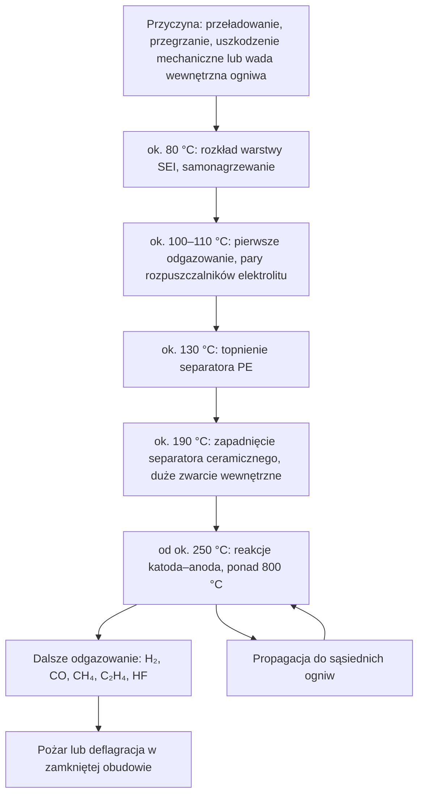

import { SlideContainer, Slide, InstructorNotes, LearningObjective } from '@site/src/components/SlideComponents';

<LearningObjective>

Student klasyfikuje zagrożenia w instalacjach fotowoltaicznych, wiatrowych, bateryjnych magazynach energii i biogazowniach, wskazuje ich źródła na przykładach zdarzeń opisanych w raportach i krytycznie odczytuje statystykę wypadków.

</LearningObjective>

<SlideContainer>

<Slide title="Skala OZE w Polsce" type="info">

Odnawialne źródła energii (OZE) stanowią dużą część mocy krajowego systemu elektroenergetycznego (KSE).

| Wskaźnik | Wartość | Stan na | Źródło |
|---|---|---|---|
| Moc zainstalowana w KSE ogółem | 77 331 MW | 31.12.2025 | PSE |
| w tym „elektrownie wiatrowe i inne odnawialne” | 37 106 MW (ok. 48%) | 31.12.2025 | PSE |
| Mikroinstalacje OZE (99,9% to fotowoltaika, PV) | 1 636 673 szt., niemal 13,9 GW | koniec 2025 | URE |
| Biogazownie rolnicze | 209 instalacji, 188,8 MWe | 28.05.2026 | KOWR |
| Pierwsza energia z morskiej farmy wiatrowej | Baltic Power, do 1,2 GW | 10.07.2026 | inwestor |

- PSE — Polskie Sieci Elektroenergetyczne; URE — Urząd Regulacji Energetyki; KOWR — Krajowy Ośrodek Wsparcia Rolnictwa.
- W 2025 r. moc w kategorii PSE „wiatr i inne OZE” wzrosła o ok. 5,3 GW. PSE nie wydziela w tej tabeli fotowoltaiki.
- URE liczy 1 612 450 prosumentów, więc zagrożenia OZE dotyczą także zwykłych budynków, a nie tylko elektrowni (ocena własna).
- Wniosek (ocena własna): większość tych instalacji pracuje bez stałej obsługi, dlatego podstawą bezpieczeństwa są samoczynne zabezpieczenia, a zdalny monitoring je uzupełnia.

Źródło: [PSE, Raport 2025 KSE](https://www.pse.pl/dane-systemowe/funkcjonowanie-kse/raporty-roczne-z-funkcjonowania-kse-za-rok); [URE, 19.03.2026](https://www.ure.gov.pl/pl/urzad/informacje-ogolne/aktualnosci/13173,Raport-URE-w-Polsce-mamy-juz-ponad-16-mln-mikroinstalacji-OZE.html); [KOWR, 2026](https://www.gov.pl/web/kowr/aktualna-sytuacja-na-rynku-biogazu-rolniczego-w-polsce-06-2026); [Baltic Power, 10.07.2026](https://balticpower.pl/aktualnosci/morska-farma-wiatrowa-baltic-power-po-raz-pierwszy-wyprodukowa%C5%82a-i-dostarczy%C5%82a-energi%C4%99-z-morza-dla-polskiej-sieci-energetycznej/)

<InstructorNotes>

Czas: ~2 min

Zaczynamy od skali, bo ona uzasadnia cały przedmiot. Według PSE prawie połowa mocy zainstalowanej w KSE to wiatr i inne źródła odnawialne. Ta kategoria łączy kilka technologii, więc z tej tabeli nie odczytamy mocy samej fotowoltaiki. Dla bezpieczeństwa ważniejsza jest liczba mikroinstalacji: ponad półtora miliona. Nad takim dachem nikt nie czuwa przez całą dobę, więc zabezpieczenia muszą zadziałać same, a zdalny monitoring tylko je wspiera. Do różnicy między monitoringiem a ochroną wrócimy w części piątej.

Pytanie do sali: kto ma instalację PV w domu rodzinnym i wie, gdzie jest rozłącznik po stronie prądu stałego? Typowe nieporozumienie: „OZE to przede wszystkim duże farmy”. Tymczasem samych mikroinstalacji jest ponad półtora miliona.

</InstructorNotes>

</Slide>

<Slide title="Mapa zagrożeń: energia, ogień, gazy" type="warning">

**Zagrożenie** to potencjalne źródło szkody (definicje w [części 2](./02-pojecia-podstawowe.mdx)). BESS (Battery Energy Storage System — bateryjny magazyn energii); DC (direct current — prąd stały); strefa Ex to strefa zagrożenia wybuchem, czyli przestrzeń, w której może wystąpić atmosfera wybuchowa (strefy 0/1/2: [część 3](./03-ramy-prawne-ue-i-polska.mdx)).

| Klasa | PV | Wiatr | BESS | Biogaz |
|---|---|---|---|---|
| Elektryczne | napięcie DC oświetlonych modułów | łuk i porażenie podczas prac w turbinie | napięcie DC baterii, zwarcie | urządzenie elektryczne jako źródło zapłonu w strefie Ex |
| Pożarowe | łuk na złączach i rozłącznikach DC | pożar gondoli na wysokości | niekontrolowany wzrost temperatury ogniw | zapłon uwolnionego gazu |
| Wybuchowe | — | — | deflagracja gazów z ogniw w zamkniętej obudowie | mieszanina metanu z powietrzem |
| Toksyczne i duszące | produkty spalania | — | HF, CO, HCN w gazach z ogniw | H₂S, niedobór tlenu |

- HF — fluorowodór, CO — tlenek węgla, HCN — cyjanowodór, H₂S — siarkowodór.
- Kreska oznacza, że zagrożenie nie jest charakterystyczne dla danej technologii, a nie że go nie ma.

Źródło: [Fraunhofer ISE, 2013](https://www.ise.fraunhofer.de/en/press-media/press-releases/2013/fire-protection-in-photovoltaic-systems.html); [BRE NSC, 2018](https://assets.publishing.service.gov.uk/government/uploads/system/uploads/attachment_data/file/786882/Fires_and_solar_PV_systems-Investigations_Evidence_Issue_2.9.pdf); [EU-OSHA, 2013](https://osha.europa.eu/sites/default/files/OSH%20in%20Wind%20energy%20sector.pdf); [Uadiale i in., 2014](https://publications.iafss.org/publications/fss/11/983/view/fss_11-983.pdf); [IEC 62485-5:2020](https://webstore.iec.ch/en/publication/29086); [DNV GL, 2020](https://www.aps.com/-/media/APS/APSCOM-PDFs/About/Our-Company/Newsroom/McMickenFinalTechnicalReport.pdf?la=en&sc_lang=en&hash=5447FA391CD988DD24226FA485F81F23); [ILO ICSC 0291](https://chemicalsafety.ilo.org/dyn/icsc/showcard.display?p_card_id=0291&p_version=2&p_lang=en); [ILO ICSC 0165](https://chemicalsafety.ilo.org/dyn/icsc/showcard.display?p_card_id=0165&p_version=2&p_lang=en)

<InstructorNotes>

Czas: ~2 min

Tabelę czytamy najpierw wierszami, potem kolumnami. Wtedy widać, że każda technologia ma swoje dominujące zagrożenie. W PV jest to napięcie stałe oświetlonych modułów, którego nie usuwa rozłącznik przy falowniku. W magazynie bateryjnym jest to łańcuch: przegrzanie ogniwa, gazy, pożar albo wybuch. W biogazowni są to gazy: metan tworzy z powietrzem mieszaninę wybuchową, a siarkowodór jest silnie toksyczny. W turbinie wiatrowej kluczowa jest wysokość, bo pożaru gondoli praktycznie nie da się gasić z zewnątrz.

Pytanie do sali: skąd wiersz „wybuchowe” przy BESS, skoro w magazynie nie ma paliwa gazowego? Odpowiedź przyjdzie za kilka slajdów: gaz powstaje w ogniwach podczas awarii. Typowe nieporozumienie: kreska w tabeli znaczy „brak zagrożenia”.

</InstructorNotes>

</Slide>

<Slide title="Mapa zagrożeń: ludzie, otoczenie, cyber" type="warning">

| Klasa | PV | Wiatr | BESS | Biogaz |
|---|---|---|---|---|
| Mechaniczne | spadające moduły podczas akcji gaśniczej | awaria łopaty, odrzut i spadanie lodu | — | nad- i podciśnienie w zbiornikach gazu |
| Praca na wysokości | prace na dachu | drabiny w wieży, ewakuacja z gondoli | — | — |
| Otoczenie | — | spadające płonące elementy | toksyczny dym, ewakuacja sąsiedztwa | uwolnienia substancji do otoczenia |
| Cyber | falowniki z łącznością | SCADA, zdalny dostęp serwisu | zdalny dostęp do BMS i EMS | zdalne sterowanie procesem |

- SCADA (Supervisory Control and Data Acquisition — system nadzoru i akwizycji danych); BMS (Battery Management System — system zarządzania baterią); EMS (Energy Management System — system zarządzania energią).
- Te same łącza służą monitoringowi i sterowaniu, dlatego zagrożenia cyber dotyczą wszystkich technologii (szerzej w W10).
- W jednej instalacji występuje zwykle kilka klas naraz, np. PV z magazynem energii na dachu budynku.
- Komórki PV w dwóch pierwszych wierszach i cały wiersz „cyber” to zestawienie dydaktyczne (ocena własna).

Źródło: [EU-OSHA, 2013](https://osha.europa.eu/sites/default/files/OSH%20in%20Wind%20energy%20sector.pdf); [BSEE, 2024](https://www.bsee.gov/newsroom/latest-news/statements-and-releases/press-releases/bsee-statement-on-vineyard-wind); [IEA Wind TCP Task 19, 2022](https://iea-wind.org/wp-content/uploads/2022/09/Task-19-Technical-Report-on-International-Recommendations-for-Ice-Fall-and-Ice-Throw-Risk-Assessments.pdf); [KP PSP Kętrzyn, 2023](https://www.gov.pl/web/kppsp-ketrzyn/pozar-turbiny-wiatrowej); [KW PSP Poznań, 2026](https://www.gov.pl/web/kwpsp-poznan/pozar-magazynu-energii-w-czajkowie); [KAS, TRAS 120](https://www.kas-bmu.de/files/publikationen/TRAS/TRAS%20(endgueltige%20Fassung)/LesefassTRAS120.pdf)

<InstructorNotes>

Czas: ~2 min

Druga połowa mapy dotyczy ludzi i otoczenia. W energetyce wiatrowej przeważają zagrożenia mechaniczne i praca na wysokości: technicy wiele razy dziennie wchodzą po drabinach, a ewakuacja rannego z gondoli to osobne zadanie ratownicze. Przy magazynach energii proszę zwrócić uwagę na wiersz „otoczenie”. Podczas pożaru magazynu w Czajkowie w maju 2026 roku straż ewakuowała 65 osób z obiektu i sąsiednich budynków, więc magazyn zagraża także sąsiadom.

Wiersz „cyber” jest celowo wspólny. Falownik z łącznością bezprzewodową, zdalny dostęp serwisu do turbiny i sterownik biogazowni łączy jedno: ktoś spoza obiektu może wpłynąć na jego pracę. Typowe nieporozumienie: „cyberbezpieczeństwo to sprawa działu IT”. Zdalna zmiana nastaw zabezpieczeń jest już sprawą bezpieczeństwa technicznego.

</InstructorNotes>

</Slide>

<Slide title="PV: napięcie DC i łuk elektryczny" type="danger">

- Moduł PV jest źródłem energii: dopóki pada na niego światło, przewody stringów są pod napięciem. **Napięcia DC oświetlonych modułów nie usuwa rozłącznik przy falowniku** ani odłączenie instalacji od sieci.
- W instalacji PV nie ma jednego punktu, w którym można ją całkowicie odłączyć (Ramali i in., 2022).
- Napięcia DC sięgają 1000–1500 V. Nawet po pokryciu modułów pianą gaśniczą napięcie mogło wywołać prąd przez ciało powyżej 20 mA (Bosco i in., 2015, za Ramali i in., 2022).
- **Łuk elektryczny** prądu stałego nie gaśnie sam, bo prąd nie przechodzi przez zero. Łuk szeregowy na luźnym złączu ma prąd nie większy niż prąd stringu, więc zabezpieczenie nadprądowe go nie wykryje.
- Gaszenie: wymagane odległości zależą od napięcia i rodzaju prądu gaśniczego (rozproszony albo zwarty) i różnią się między wytycznymi różnych krajów (AGBF i DFV, 2023; przegląd Ramali i in., 2022).
- W Polsce postępowanie ratowników opisuje dokument Komendy Głównej Państwowej Straży Pożarnej (KG PSP) „Standardowe zasady postępowania podczas zdarzeń w obrębie instalacji fotowoltaicznych” (2022).
- Wykrywanie łuku, odłączanie i działania ratownicze omówimy w W6.

Źródło: [Ramali i in., 2022](https://doi.org/10.1007/s10694-022-01269-4); [Ramali i in., 2022, kopia PMC](https://pmc.ncbi.nlm.nih.gov/articles/PMC9134713/); [AGBF i DFV, 2023](https://www.agbf.de/downloads-fachausschuss-vorbeugender-brand-und-gefahrenschutz/28-fa-vbg-oeffentlich-empfehlungen?download=397%3A2023-04-photovoltaikanlagen); [KG PSP, 2022, publikacja KP PSP Wołomin](https://www.gov.pl/web/kppsp-wolomin/standardowe-zasady-postepowania-podczas-zdarzen-w-obrebie-instalacji-fotowoltaicznych)

<InstructorNotes>

Czas: ~2,5 min

To najważniejszy slajd o fotowoltaice. W instalacji domowej po wyłączeniu wyłącznika obwód za nim traci zasilanie, a przed pracą i tak sprawdzamy brak napięcia. W PV tak nie jest: oświetlony moduł sam jest źródłem, a rozłącznik przy falowniku odcina tylko odcinek za sobą. Przewody na dachu pozostają pod napięciem, dopóki pada światło.

Druga sprawa to łuk. Łuk prądu przemiennego gaśnie zwykle przy przejściu prądu przez zero, sto razy na sekundę. Łuk prądu stałego takiej okazji nie ma i może palić się długo na luźnym złączu. Celowo nie podaję dziś odległości gaśniczych: zależą od napięcia, rodzaju prądu gaśniczego i przyjętej wytycznej, a w Polsce obowiązują procedury PSP.

Pytanie do sali: czy bezpiecznik w stringu ochroni przed łukiem szeregowym na złączu? Nie, bo prąd łuku nie przekracza prądu roboczego.

</InstructorNotes>

</Slide>

<Slide title="PV: co mówią dane o pożarach" type="info">

| Kraj i źródło | Okres | Najważniejsze wyniki | Zastrzeżenie |
|---|---|---|---|
| Niemcy: Fraunhofer ISE, TÜV Rheinland | ok. 20 lat do 2013 | ok. 1,3 mln instalacji; 350 pożarów z udziałem PV, w tym 120 spowodowanych przez PV; 75 z dużymi szkodami (ok. 0,006% instalacji) | wyniki warsztatu eksperckiego (2013) |
| Wielka Brytania: BRE (Building Research Establishment) | VII 2015 – II 2018 | 80 pożarów, 58 spowodowanych przez PV; najczęściej zawodziły rozłączniki DC; główna rozpoznana przyczyna: zły montaż | przyczyna źródłowa nieznana w 28 z 58 |
| Polska: raporty PSP (Bednarczyk, 2022) | 2018–2021 | 411 zdarzeń, 128 spowodowanych przez PV; błędy montażu 28,9%, wady wyrobu 21,1%, czynniki zewnętrzne 14,1%, błędy projektu 1,6%, nieznane 34,3% | PSP nie ma kategorii „przyczyna: PV” |

- Poradnik Fraunhofer ISE i TÜV Rheinland (2015): przyczyny szkód dzielą się w przybliżeniu po 1/3 — wady komponentów, błędy projektu i błędy montażu.
- BRE: typowe usterki to woda wnikająca przez dławnice skierowane do góry, kilka przewodów w jednej dławnicy i rozłączniki o zbyt małych parametrach.
- W danych niemieckich i brytyjskich pożar zaczyna się zwykle w połączeniach po stronie DC (złącza, rozłączniki, puszki przyłączeniowe), a nie w ogniwach (ocena własna na podstawie obu raportów).
- We wszystkich trzech zbiorach ważną przyczyną są błędy montażu, więc jakość wykonania jest środkiem bezpieczeństwa.

Źródło: [Fraunhofer ISE, 2013](https://www.ise.fraunhofer.de/en/press-media/press-releases/2013/fire-protection-in-photovoltaic-systems.html); [Fraunhofer ISE i TÜV Rheinland, 2015](https://www.ise.fraunhofer.de/content/dam/ise/de/downloads/pdf/Leitfaden_Brandrisiko_in_PV-Anlagen_V02.pdf); [BRE NSC, 2018](https://assets.publishing.service.gov.uk/government/uploads/system/uploads/attachment_data/file/786882/Fires_and_solar_PV_systems-Investigations_Evidence_Issue_2.9.pdf); [Bednarczyk, 2022](https://www.ppoz.pl/czytelnia/ratownictwo-i-ochrona-ludnosci/Fotowoltaika-pod-lupa/idn:2751)

<InstructorNotes>

Czas: ~2,5 min

Mamy trzy niezależne zbiory danych z trzech krajów i zbieżny obraz. W Niemczech pożar z dużymi szkodami spowodowało około sześciu tysięcznych procenta instalacji, więc w stosunku do ich liczby takie pożary są rzadkie. Jeżeli już do pożaru dochodzi, zaczyna się on zwykle w miejscu połączenia. W Wielkiej Brytanii w siedmiu przypadkach woda dostała się do rozłączników przez dławnice skierowane do góry.

Proszę zwrócić uwagę na ostatnią kolumnę. PSP nie ma w formularzu pola „przyczyna: instalacja PV”, więc autor polskiej analizy czytał opisy zdarzeń, a jedna trzecia przyczyn pozostała nieznana. Pytanie do sali: co łączy wodę w rozłączniku i źle zaciśnięte złącze? Oba błędy powstają przy montażu. Typowe nieporozumienie: „fotowoltaika często się pali”. Dane mówią raczej, że źle zamontowana instalacja może się zapalić.

</InstructorNotes>

</Slide>

<Slide title="Wiatr: główne zagrożenia" type="warning">

- **Awaria łopaty**: Vineyard Wind 1 (USA), 13.07.2024. BSEE (Bureau of Safety and Environmental Enforcement — federalny urząd USA nadzorujący bezpieczeństwo i ochronę środowiska w morskiej energetyce) wstrzymał produkcję energii i budowę kolejnych turbin, nakazał zabezpieczenie dowodów i zażądał analizy ryzyka dla personelu.
- BSEE prowadzi własne dochodzenie; jego ustaleń ani raportu końcowego nie opublikowano (stan IX 2026).
- **Pożar gondoli**: szanse gaszenia z zewnątrz są bardzo małe ze względu na wysokość i odległe położenie farm (Uadiale i in., 2014). Podławki (pow. kętrzyński), 6.08.2023: pożar na wysokości ok. 100 m; PSP wyznaczyła strefę 200 m i pilnowała spadających płonących elementów.
- **Wyładowania atmosferyczne** są obok zmęczenia materiału, erozji krawędzi natarcia i oblodzenia główną przyczyną uszkodzeń łopat; w badaniu z USA łopata ulegała uszkodzeniu od pioruna średnio raz na 8,4 roku na turbinę (za przeglądem Katsaprakakis i in., 2021).
- **Lód**: dla odrzutu lodu z wirującego wirnika i spadania lodu z zatrzymanej turbiny IEA Wind Task 19 zaleca ocenę ryzyka dla konkretnej lokalizacji; odległości omówimy w W7.
- **Praca na wysokości i ratownictwo**: wielokrotne wchodzenie po drabinach, ciasne przestrzenie. Przegląd EU-OSHA (Europejskiej Agencji Bezpieczeństwa i Zdrowia w Pracy, 2013) przytacza zalecenie grupy roboczej władz państw UE i przemysłu (winda w wieżach od 60 m) oraz propozycję drugiej drogi ewakuacji z literatury.
- **Zagrożenia elektryczne**: łuk i porażenie podczas prac w turbinie (EU-OSHA, 2013).

Źródło: [BSEE, 2024a](https://www.bsee.gov/newsroom/latest-news/statements-and-releases/press-releases/bsee-statement-on-vineyard-wind); [BSEE, 2024b](https://www.bsee.gov/newsroom/latest-news/statements-and-releases/press-releases/bsee-issues-new-order-to-vineyard-wind); [Uadiale i in., 2014](https://publications.iafss.org/publications/fss/11/983/view/fss_11-983.pdf); [KP PSP Kętrzyn, 2023](https://www.gov.pl/web/kppsp-ketrzyn/pozar-turbiny-wiatrowej); [Katsaprakakis i in., 2021](https://doi.org/10.3390/en14185974); [IEA Wind TCP Task 19, 2022](https://iea-wind.org/wp-content/uploads/2022/09/Task-19-Technical-Report-on-International-Recommendations-for-Ice-Fall-and-Ice-Throw-Risk-Assessments.pdf); [EU-OSHA, 2013](https://osha.europa.eu/sites/default/files/OSH%20in%20Wind%20energy%20sector.pdf)

<InstructorNotes>

Czas: ~2 min

W turbinie wiatrowej kluczowa jest wysokość. Pożar gondoli oznacza w praktyce utratę turbiny, a straż może tylko zabezpieczyć teren. Tak było w Podławkach: strefa dwustu metrów i obserwacja spadających płonących elementów, żeby nie doszło do pożarów wtórnych. Przy Vineyard Wind proszę zauważyć pierwszą reakcję regulatora: zatrzymanie pracy i zabezpieczenie dowodów, a dopiero potem dochodzenie. Ponad dwa lata później jego wyniki nie są opublikowane, więc o przyczynie nie mówimy.

Pytanie do sali: czy system wykrywania oblodzenia, który zatrzymuje wirnik, usuwa zagrożenie lodem? Nie usuwa: zamienia odrzut lodu z wirującego wirnika na spadanie lodu z zatrzymanej turbiny, więc strefa ostrzegawcza jest nadal potrzebna. Typowe nieporozumienie: jedna uniwersalna odległość bezpieczna wystarczy dla każdej farmy.

</InstructorNotes>

</Slide>

<Slide title="Wiatr: skąd brać wiarygodne dane" type="info">

- Najbardziej systematyczną publiczną statystyką są dane **G+** (Global Offshore Wind Health and Safety Organisation), publikowane przez Energy Institute (ocena własna): zgłoszenia firm członkowskich z jawnym mianownikiem, czyli przepracowanymi godzinami. Obejmują tylko morskie farmy wiatrowe i tylko członków G+.
- Raport za 2025 r. (11.06.2026): 69,2 mln przepracowanych godzin (o 5% więcej niż w 2024 r.), TRIR (Total Recordable Injury Rate — wskaźnik wszystkich rejestrowanych urazów) 3,48, czyli o 4% więcej niż w 2024 r., brak wypadków śmiertelnych.
- Raport za 2024 r. (12.06.2025): 79 mln godzin, 1 wypadek śmiertelny, TRIR 2,93; najczęstszą przyczyną urazów było ręczne przenoszenie ładunków (121 zdarzeń).
- Kolejne raporty przeliczają rok poprzedni: dla 2024 r. raport za 2024 r. podaje 99 urazów z utratą dni pracy, a raport za 2025 r. — 95. Dlatego TRIR 3,48 nie porównujemy z 2,93, tylko ze zmianą podaną w tym samym raporcie (+4%).
- Liczby typu „1370 wypadków od 1970 r.” w publikacji EU-OSHA (2013) i w przeglądach naukowych pochodzą z bazy CWIF (Caithness Wind Farm Information Forum), budowanej z doniesień prasowych i komunikatów. Nie są wskaźnikiem częstości.
- Dla farm lądowych, także w Polsce, porównywalnego zbioru nie ma. Wg danych KG PSP cytowanych przez Gramwzielone.pl w latach 2021–2025 dochodziło do 5–8 pożarów turbin rocznie.

Źródło: [Energy Institute, 2026](https://www.energyinst.org/exploring-energy/resources/news-centre/media-releases/offshore-wind-safety-improves-despite-strong-sector-expansion); [Energy Institute, 2025](https://www.energyinst.org/exploring-energy/resources/news-centre/media-releases/unprecedented-growth-in-offshore-wind-accompanied-by-a-rise-in-injury-rates); [G+, statystyki](https://www.gplusoffshorewind.com/work-programme/workstreams/statistics); [EU-OSHA, 2013](https://osha.europa.eu/sites/default/files/OSH%20in%20Wind%20energy%20sector.pdf); [Gramwzielone.pl, 30.04.2026](https://www.gramwzielone.pl/trendy/20356707/pozary-fotowoltaiki-elektrykow-i-elektrowni-wiatrowych-jaka-jest-ich-skala-w-polsce)

<InstructorNotes>

Czas: ~2 min

Ten slajd dotyczy jakości źródeł. Liczby w rodzaju „tysiąc trzysta siedemdziesiąt wypadków od 1970 roku” cytuje agencja unijna i recenzowane artykuły, ale wszystkie pochodzą z jednej bazy prowadzonej na podstawie doniesień prasowych. Recenzja artykułu nie sprawia, że przepisane z prasy dane stają się audytowane.

Najbardziej systematyczne dane publikuje G+, z jawnym mianownikiem, czyli przepracowanymi godzinami. Obejmują jednak tylko morskie farmy i tylko firmy członkowskie. Kolejne raporty przeliczają poprzedni rok, więc nie sklejamy liczb z różnych raportów w jeden szereg.

Pytanie do sali: czego brakuje w zdaniu „w Polsce pali się kilka turbin rocznie”, żeby ocenić ryzyko? Liczby pracujących turbin i czasu ich pracy, czyli mianownika. Typowe nieporozumienie: dane z recenzowanego artykułu są zawsze danymi pierwotnymi.

</InstructorNotes>

</Slide>

<Slide title="BESS: przebieg niekontrolowanego wzrostu temperatury" type="danger">

**Niekontrolowany wzrost temperatury** (ang. thermal runaway) to proces, w którym ciepło reakcji w ogniwie litowo-jonowym przyspiesza kolejne reakcje wydzielające ciepło.

- Temperatury dotyczą jednego ogniwa 20 Ah z katodą NCM/LMO (tlenki litu z niklem, kobaltem i manganem oraz tlenek litowo-manganowy; Feng i in., 2018). Zależą od konstrukcji ogniwa, stanu naładowania (SOC, State of Charge) i metody badania.
- SEI (Solid Electrolyte Interphase) to warstwa pasywacyjna na anodzie; PE — separator z polietylenu.
- **Duże zwarcie wewnętrzne wyzwala reakcje katoda–anoda**; to one, a nie samo zwarcie, są głównym źródłem ciepła (Feng i in., 2018).
- Gazy wydzielają się etapami: pierwsze odgazowanie (pary rozpuszczalników elektrolitu) następuje już przy ok. 100–110 °C, czyli przed dużym zwarciem wewnętrznym; kolejne przy ok. 250 °C i po rozpoczęciu reakcji katoda–anoda (Feng i in., 2018).
- Gaszenie środkiem gazowym nie zatrzymuje procesu (DNV GL, 2020). Ochrona polega na zapobieganiu i ograniczaniu propagacji.

Źródło: [Feng i in., 2018](https://doi.org/10.3389/fenrg.2018.00126); [DNV GL, 2020](https://www.aps.com/-/media/APS/APSCOM-PDFs/About/Our-Company/Newsroom/McMickenFinalTechnicalReport.pdf?la=en&sc_lang=en&hash=5447FA391CD988DD24226FA485F81F23)

<InstructorNotes>

Czas: ~2 min

Proszę prześledzić diagram od góry. Na początku jest przyczyna: przeładowanie, przegrzanie, uderzenie albo wada fabryczna w samym ogniwie. Około osiemdziesięciu stopni zaczyna się rozkładać warstwa na anodzie i ogniwo grzeje się samo. Potem topi się separator, dochodzi do dużego zwarcia wewnętrznego, a od około dwustu pięćdziesięciu stopni reakcje między elektrodami podnoszą temperaturę powyżej ośmiuset stopni. Liczby traktujemy orientacyjnie, bo pochodzą z badań jednego typu ogniwa.

Pytanie do sali: dlaczego pętla na diagramie jest groźniejsza niż przegrzanie jednego ogniwa? Bo zamienia awarię jednej celi w pożar całego modułu albo szafy. Typowe nieporozumienie: „wystarczy dobrze ugasić”. Środek gazowy gasi płomień, ale nie chłodzi ogniw na tyle, by zatrzymać proces.

</InstructorNotes>

</Slide>

<Slide title="BESS: gazy, chemia ogniw i źródła awarii" type="warning">

| Cecha (Shen i in., 2023) | LFP | NCM |
|---|---|---|
| Objętość wydzielonych gazów | 0,569 L/Ah | 1,814–2,752 L/Ah |
| Skład gazu | wysoki udział H₂ | H₂, CO, CO₂, C₂H₄, CH₄ |
| Zagrożenie wg dolnej granicy wybuchowości | najwyższe w badaniu | niższe |

- LFP to ogniwa litowo-żelazowo-fosforanowe, NCM — niklowo-kobaltowo-manganowe. **Dolna granica wybuchowości** (DGW, ang. LEL — Lower Explosive Limit) to najmniejsze stężenie gazu palnego w powietrzu, przy którym mieszanina może się zapalić. Wniosek autorów: mniej gazu nie oznacza mniejszego zagrożenia wybuchem.
- Pożary ogniw litowo-jonowych wydzielały 20–200 mg fluorowodoru (HF) na Wh pojemności nominalnej (Larsson i in., 2017).
- EPRI (Electric Power Research Institute, 2024): z 81 zdarzeń w bazie przyczynę ustalono dla 26; tylko 3 (11%) przypisano bezpośrednio ogniwom. Najczęstsze kategorie przyczyn to integracja, montaż i budowa oraz eksploatacja.
- 72% awarii o znanym wieku systemu wystąpiło podczas budowy, rozruchu lub w pierwszych dwóch latach pracy (EPRI, 2024).

**Przykład ilustracyjny — dane umowne.** Moduł 5 kWh, czyli 5000 Wh, przy 20–200 mg HF na Wh może w pożarze wydzielić 100–1000 g fluorowodoru.

Źródło: [Shen i in., 2023](https://doi.org/10.3390/electronics12071603); [Larsson i in., 2017](https://doi.org/10.1038/s41598-017-09784-z); [EPRI, 2024](https://restservice.epri.com/publicdownload/000000003002030360/0/Product)

<InstructorNotes>

Czas: ~2 min

Często słyszymy, że ogniwa LFP są bezpieczne. Badanie Shena pokazuje, że sprawa jest bardziej złożona. Autorzy piszą, że ogniwo LFP ma lepszą stabilność termiczną i wydziela kilka razy mniej gazu. Ten gaz zawiera jednak dużo wodoru, więc łatwiej tworzy mieszaninę wybuchową. Wybór chemii to kompromis, a nie rozwiązanie problemu.

Druga część slajdu mówi, skąd biorą się awarie. Według EPRI zawodzą głównie integracja, montaż i eksploatacja, a nie same ogniwa, a większość awarii zdarza się na początku życia instalacji. Przykład z fluorowodorem pokazuje skalę: nawet jeden moduł może w pożarze uwolnić setki gramów silnie toksycznego gazu.

Pytanie do sali: skoro 72% awarii zdarza się wcześnie, jak zaplanowalibyście nadzór nad nowym magazynem w pierwszych dwóch latach?

</InstructorNotes>

</Slide>

<Slide title="BESS: McMicken, Moss Landing, Czajków" type="danger">

| | McMicken (USA), 19.04.2019 | Moss Landing (USA), 16.01.2025 | Czajków (PL), 7.05.2026 |
|---|---|---|---|
| System | 2 MW / 2 MWh, NCM, kontener | 300 MW / 1200 MWh, NCM, dawny budynek turbin | kontener na naczepie, ok. 2 MW(h), ok. 107 500 ogniw litowo-jonowych |
| Przebieg | dym ok. 17:00; po ok. 3 h otwarcie drzwi i deflagracja; 4 strażaków ciężko rannych | pożar podczas testu pojemności (WECC wskazuje wysoki SOC jako czynnik ryzyka); tryskacze nieskuteczne; ogień przebił dach | kilkukrotne ponowne zapłony; do 24 zastępów PSP i OSP; ewakuacja 65 osób; komunikaty PSP nie informują o poszkodowanych |
| Przyczyna | wg DNV GL: wada wewnętrzna ogniwa (osadzanie litu, dendryty); inne raporty oceniają przyczynę inaczej | nieustalona: dochodzenie CPUC trwa (stan 14.07.2026); raport WECC nie jest analizą przyczyn | nieopublikowana (stan 29.09.2026) |

- Moss Landing: w 2025 r. spłonęło ok. 56 000 z ok. 100 000 modułów. 18.09.2026, ok. 20 miesięcy po pożarze, zapaliła się część uszkodzonych modułów pozostawionych w spalonym budynku: ok. 1300 modułów, bez poszkodowanych; władze hrabstwa wydały zapobiegawczy nakaz pozostania w domach (US EPA, strona zaktualizowana 25.09.2026).
- WECC — Western Electricity Coordinating Council (organizacja odpowiedzialna za niezawodność systemu elektroenergetycznego zachodniej części Ameryki Północnej); CPUC — California Public Utilities Commission (regulator w Kalifornii); US EPA — Environmental Protection Agency (federalna agencja ochrony środowiska USA); OSP — ochotnicza straż pożarna.
- Wniosek (ocena własna): uszkodzone moduły pozostają zagrożeniem długo po pożarze, więc potrzebny jest nad nimi nadzór i procedura bezpiecznego usuwania.

Źródło: [DNV GL, 2020](https://www.aps.com/-/media/APS/APSCOM-PDFs/About/Our-Company/Newsroom/McMickenFinalTechnicalReport.pdf?la=en&sc_lang=en&hash=5447FA391CD988DD24226FA485F81F23); [APS, 2020](https://www.aps.com/en/About/Our-Company/Newsroom/Articles/Equipment-failure-at-McMicken-Battery-Facility); [UL FSRI, 2020](https://fsri.org/research-update/report-four-firefighters-injured-lithium-ion-battery-energy-storage-system); [UL, 2021](https://collateral-library-production.s3.amazonaws.com/uploads/asset_file/attachment/31718/Executive_Summary_for_DNVGL_APS_Report_Responses.pdf); [WECC, 2025](https://www.wecc.org/sites/default/files/documents/progress_report/2025/Moss%20Landing%20BESS%20Fire%20Report%20Final%2012.22.25.pdf); [US EPA, 2026](https://www.epa.gov/ca/moss-landing-vistra-battery-fire-updates); [CPUC, 14.07.2026](https://www.cpuc.ca.gov/news-and-updates/all-news/cpuc-generation-and-energy-storage-team-keeping-californias-electric-grid-safe-and-reliable); [KW PSP Poznań, 2026](https://www.gov.pl/web/kwpsp-poznan/pozar-magazynu-energii-w-czajkowie); [KP PSP Ostrzeszów, 2026](https://www.gov.pl/web/kppsp-ostrzeszow/pozar-magazynu-energii-na-naczepie)

<InstructorNotes>

Czas: ~2,5 min

Trzy przypadki pokazują trzy skale. McMicken to mały magazyn kontenerowy, ale bardzo dobrze zbadany. Po trzech godzinach od pojawienia się dymu strażacy otworzyli drzwi, nagromadzone gazy wybuchły i czterech strażaków zostało ciężko rannych. Przyczynę opisują różnie różni badacze: DNV GL wskazuje wadę ogniwa, a inne raporty się z tym nie zgadzają. Do McMicken wrócimy w części piątej i rozłożymy go na warstwy ochrony.

Moss Landing to magazyn o pojemności 1200 MWh w hali. Przyczyna wciąż nie jest znana, a uszkodzone moduły zapaliły się ponownie po dwudziestu miesiącach. Czajków to dobrze udokumentowany w komunikatach PSP przypadek z Polski; przyczyny nie opublikowano i nie wolno jej zgadywać.

Pytanie do sali: co łączy te trzy zdarzenia mimo różnej skali?

</InstructorNotes>

</Slide>

<Slide title="Biogazownia: metan i siarkowodór" type="danger">

| Gaz | Główne zagrożenie | Wartości odniesienia | Uwaga praktyczna |
|---|---|---|---|
| Metan CH₄ | wybuch; przy dużym stężeniu niedobór tlenu | DGW 4,4% obj., GGW 17% obj. | lżejszy od powietrza (gęstość względna 0,56) |
| Siarkowodór H₂S | ostra toksyczność | NDS 7 mg/m³ (ok. 5 ppm), NDSCh 14 mg/m³ (ok. 10 ppm); IOELV 5 ppm (8 h) i 10 ppm (15 min); IDLH 100 ppm | cięższy od powietrza (1,19): gromadzi się w dołach i studzienkach; powyżej wartości dopuszczalnej węch może przestać ostrzegać |

- GGW — górna granica wybuchowości (ang. UEL). Wartości dla metanu wg bazy substancji GESTIS niemieckiego instytutu IFA (dane CHEMSAFE) i karty GisChem; 100% DGW = 4,4% obj. CH₄. Starsze źródła, np. karta ICSC 0291 (ILO/WHO, 2000), podają 5–15% obj. Dla biogazu (60% CH₄) SVLFG podaje ok. 6–22% obj.
- NDS i NDSCh to najwyższe dopuszczalne stężenie (8 h) i najwyższe dopuszczalne stężenie chwilowe (15 min), wg załącznika w brzmieniu Dz.U. 2026 poz. 447; IOELV — orientacyjna wartość dopuszczalna UE; IDLH — stężenie bezpośrednio zagrażające życiu lub zdrowiu (amerykański instytut NIOSH). Przeliczenie na ppm (25 °C) własne.
- Stężenia H₂S w strumieniu biogazu nie porównuje się z NDS: NDS dotyczy powietrza na stanowisku pracy.
- **Rhadereistedt** (Niemcy), XI 2005: przy napełnianiu zbiornika wstępnego kosubstratami bogatymi w białko uwolnił się H₂S; zginęły 4 osoby (Umweltbundesamt, UBA, 2006).
- Casson Moreno i in. (2016): 169 wypadków w łańcuchu biogazowym w latach 1995–2014, prawie 12% to poważne awarie. UBA (2019): w ok. 70% skontrolowanych biogazowni od lat stwierdzano istotne braki w zabezpieczeniach; odpowiedzią była reguła TRAS 120 (ogłoszona 21.01.2019).

Źródło: [IFA GESTIS, metan](https://gestis.dguv.de/data?name=010000); [GisChem, metan](https://www.gischem.de/download/01_0-000074-82-8-000000_2_1_1255.PDF); [ILO ICSC 0291](https://chemicalsafety.ilo.org/dyn/icsc/showcard.display?p_card_id=0291&p_version=2&p_lang=en); [SVLFG, TI 4](https://cdn.svlfg.de/fiona8-blobs/public/svlfgonpremiseproduction/45b79757c1f38081/ce7f71d90169/ti04-sicherheitsregeln-biogasanlagen.pdf); [ILO ICSC 0165](https://chemicalsafety.ilo.org/dyn/icsc/showcard.display?p_card_id=0165&p_version=2&p_lang=en); [NIOSH, 1994](https://www.cdc.gov/niosh/idlh/7783064.html); [ISAP, Dz.U. 2026 poz. 447](https://isap.sejm.gov.pl/isap.nsf/DocDetails.xsp?id=WDU20260000447); [UBA, 2006](https://www.umweltbundesamt.de/system/files/medien/publikation/long/3097.pdf); [Casson Moreno i in., 2016](https://doi.org/10.1016/j.renene.2015.10.017); [UBA, 2019](https://www.umweltbundesamt.de/themen/biogasanlagen-neue-technische-regel-soll-sicherheit); [KOWR, 2026](https://www.gov.pl/web/kowr/aktualna-sytuacja-na-rynku-biogazu-rolniczego-w-polsce-06-2026)

<InstructorNotes>

Czas: ~2,5 min

W biogazowni mamy dwa gazy o przeciwnym charakterze. Metan jest lżejszy od powietrza i tworzy z nim mieszaninę wybuchową między czterema i czterema dziesiątymi a siedemnastoma procentami objętościowymi. Stężenie gazu palnego podaje się często w procentach DGW: dziesięć procent DGW to zaledwie czterdzieści cztery setne procenta metanu w powietrzu. Siarkowodór jest cięższy od powietrza, zbiera się w zagłębieniach i jest silnie toksyczny, a przy wyższych stężeniach węch przestaje ostrzegać.

Rhadereistedt to podręcznikowy przypadek: cztery osoby zginęły nie przy komorze fermentacyjnej, tylko przy zbiorniku wstępnym. W Polsce około 91% wsadu biogazowni rolniczych to odpady (KOWR), więc moim zdaniem ten mechanizm jest u nas aktualny.

Typowe nieporozumienie: porównywanie stężenia H₂S w biogazie z NDS. NDS dotyczy powietrza, którym oddycha pracownik.

</InstructorNotes>

</Slide>

<Slide title="Jak czytać statystyki wypadków" type="tip">

- **Mianownik**: liczbę zdarzeń dzielimy przez ekspozycję, np. liczbę instalacji, moc albo przepracowane godziny. EPRI zestawia awarie BESS z wielkością wdrożeń i podaje, że wskaźnik awarii wielkoskalowych magazynów spadł w latach 2018–2023 o 97%. Sama liczba zdarzeń tego nie pokazuje.
- **Obecność to nie przyczyna**: zdarzenia, w których PSP odnotowała obecność instalacji PV, wzrosły ze 145 (2020) do 808 (2024), czyli ponad pięciokrotnie (dane PSP cytowane przez Globenergia). PSP zastrzega, że to obecność PV na miejscu zdarzenia, a nie pożary spowodowane przez PV.
- **Różne jednostki to nie jeden szereg**: wg danych KG PSP cytowanych przez Gramwzielone.pl w 2025 r. doszło do 312 pożarów budynków z instalacją PV. To pożary budynków, a nie wszystkie zdarzenia, więc nie zestawiamy tej liczby z liczbą 808.
- **Stronniczość zgłoszeń**: baza CWIF rejestruje to, o czym napisała prasa, i nie zna mianownika; według EU-OSHA sama CWIF zastrzega, że jej baza może obejmować tylko 9% rzeczywistych wypadków.
- **Źródło pierwotne**: pytaj, czy liczba pochodzi z raportu z dochodzenia, ze statystyki z jawną definicją zdarzenia, czy z prasy.

**Przykład ilustracyjny — dane umowne.** Rok 1: 100 zdarzeń przy 200 000 instalacji, czyli 50 na 100 tys. instalacji. Rok 2: 400 zdarzeń przy 1 000 000 instalacji, czyli 40 na 100 tys. Liczba zdarzeń wzrosła czterokrotnie, a wskaźnik spadł o 20%.

Źródło: [EPRI, 2024](https://restservice.epri.com/publicdownload/000000003002030360/0/Product); [Globenergia](https://globenergia.pl/ile-instalacji-fotowoltaicznych-plonie-w-polsce-w-ciagu-roku-mamy-dane/); [Gramwzielone.pl, 30.04.2026](https://www.gramwzielone.pl/trendy/20356707/pozary-fotowoltaiki-elektrykow-i-elektrowni-wiatrowych-jaka-jest-ich-skala-w-polsce); [EU-OSHA, 2013](https://osha.europa.eu/sites/default/files/OSH%20in%20Wind%20energy%20sector.pdf)

<InstructorNotes>

Czas: ~2 min

Ten slajd warto zapamiętać na całe życie zawodowe. Liczba wypadków ma sens dopiero wtedy, gdy znamy mianownik. Przykład na slajdzie jest umowny, ale mechanizm jest prawdziwy: przy szybko rosnącej liczbie instalacji liczba zdarzeń może rosnąć, nawet jeśli każda instalacja staje się bezpieczniejsza.

Druga pułapka dotyczy danych PSP o fotowoltaice. Ktoś przeczyta „808 zdarzeń” i napisze, że fotowoltaika spowodowała 808 pożarów. PSP zastrzega, że to tylko obecność instalacji na miejscu zdarzenia. Liczba 312 dotyczy innej kategorii, pożarów budynków, więc zestawienie obu liczb jako trendu byłoby błędem.

Pytanie do sali: gdyby liczba zdarzeń z PV rosła wolniej niż liczba instalacji, co to mówiłoby o ryzyku na jedną instalację? I jakich danych potrzebujecie, żeby to sprawdzić?

</InstructorNotes>

</Slide>

</SlideContainer>

## Źródła

1. PSE S.A. (2026). *Raport 2025 KSE — Zestawienie danych ilościowych dotyczących funkcjonowania KSE w 2025 roku*. [https://www.pse.pl/dane-systemowe/funkcjonowanie-kse/raporty-roczne-z-funkcjonowania-kse-za-rok](https://www.pse.pl/dane-systemowe/funkcjonowanie-kse/raporty-roczne-z-funkcjonowania-kse-za-rok)
2. Urząd Regulacji Energetyki (2026). *Raport URE: w Polsce mamy już ponad 1,6 mln mikroinstalacji OZE* (19.03.2026). [https://www.ure.gov.pl/pl/urzad/informacje-ogolne/aktualnosci/13173,Raport-URE-w-Polsce-mamy-juz-ponad-16-mln-mikroinstalacji-OZE.html](https://www.ure.gov.pl/pl/urzad/informacje-ogolne/aktualnosci/13173,Raport-URE-w-Polsce-mamy-juz-ponad-16-mln-mikroinstalacji-OZE.html)
3. Krajowy Ośrodek Wsparcia Rolnictwa (2026). *Aktualna sytuacja na rynku biogazu rolniczego w Polsce* (dane na 28.05.2026). [https://www.gov.pl/web/kowr/aktualna-sytuacja-na-rynku-biogazu-rolniczego-w-polsce-06-2026](https://www.gov.pl/web/kowr/aktualna-sytuacja-na-rynku-biogazu-rolniczego-w-polsce-06-2026)
4. Baltic Power (2026). *Morska farma wiatrowa Baltic Power po raz pierwszy wyprodukowała i dostarczyła energię z morza dla polskiej sieci energetycznej* (10.07.2026). [https://balticpower.pl/aktualnosci/morska-farma-wiatrowa-baltic-power-po-raz-pierwszy-wyprodukowa%C5%82a-i-dostarczy%C5%82a-energi%C4%99-z-morza-dla-polskiej-sieci-energetycznej/](https://balticpower.pl/aktualnosci/morska-farma-wiatrowa-baltic-power-po-raz-pierwszy-wyprodukowa%C5%82a-i-dostarczy%C5%82a-energi%C4%99-z-morza-dla-polskiej-sieci-energetycznej/)
5. Fraunhofer ISE (2013). *Fire Protection in Photovoltaic Systems — Facts replace Fiction* (komunikat prasowy, 12.02.2013). [https://www.ise.fraunhofer.de/en/press-media/press-releases/2013/fire-protection-in-photovoltaic-systems.html](https://www.ise.fraunhofer.de/en/press-media/press-releases/2013/fire-protection-in-photovoltaic-systems.html)
6. Sepanski A., Reil F., Vaaßen W., Schmidt H. i in. (2015). *Leitfaden: Bewertung des Brandrisikos in Photovoltaik-Anlagen und Erstellung von Sicherheitskonzepten zur Risikominimierung*, wyd. 2. TÜV Rheinland, Fraunhofer ISE. [https://www.ise.fraunhofer.de/content/dam/ise/de/downloads/pdf/Leitfaden_Brandrisiko_in_PV-Anlagen_V02.pdf](https://www.ise.fraunhofer.de/content/dam/ise/de/downloads/pdf/Leitfaden_Brandrisiko_in_PV-Anlagen_V02.pdf)
7. BRE National Solar Centre (2018). *Fire and Solar PV Systems — Investigations and Evidence*, raport P100874-1004, Issue 2.9. BEIS. [https://assets.publishing.service.gov.uk/government/uploads/system/uploads/attachment_data/file/786882/Fires_and_solar_PV_systems-Investigations_Evidence_Issue_2.9.pdf](https://assets.publishing.service.gov.uk/government/uploads/system/uploads/attachment_data/file/786882/Fires_and_solar_PV_systems-Investigations_Evidence_Issue_2.9.pdf)
8. Bednarczyk Ł. (2022). Fotowoltaika pod lupą. *Przegląd Pożarniczy* (17.10.2022). [https://www.ppoz.pl/czytelnia/ratownictwo-i-ochrona-ludnosci/Fotowoltaika-pod-lupa/idn:2751](https://www.ppoz.pl/czytelnia/ratownictwo-i-ochrona-ludnosci/Fotowoltaika-pod-lupa/idn:2751)
9. Ramali M.R., Mohd Nizam Ong N.A.F., Md Said M.S. i in. (2022). A Review on Safety Practices for Firefighters During Photovoltaic (PV) Fire. *Fire Technology* 59(1): 247–270. Springer. [https://doi.org/10.1007/s10694-022-01269-4](https://doi.org/10.1007/s10694-022-01269-4); kopia PMC: [https://pmc.ncbi.nlm.nih.gov/articles/PMC9134713/](https://pmc.ncbi.nlm.nih.gov/articles/PMC9134713/)
10. AGBF bund, DFV (2023). *Empfehlungen der AGBF und des DFV — Umgang mit Photovoltaik-Anlagen* (2023-04). [https://www.agbf.de/downloads-fachausschuss-vorbeugender-brand-und-gefahrenschutz/28-fa-vbg-oeffentlich-empfehlungen?download=397%3A2023-04-photovoltaikanlagen](https://www.agbf.de/downloads-fachausschuss-vorbeugender-brand-und-gefahrenschutz/28-fa-vbg-oeffentlich-empfehlungen?download=397%3A2023-04-photovoltaikanlagen)
11. KG PSP (2022). *Standardowe zasady postępowania podczas zdarzeń w obrębie instalacji fotowoltaicznych* (21.03.2022), materiał udostępniony przez KP PSP Wołomin. [https://www.gov.pl/web/kppsp-wolomin/standardowe-zasady-postepowania-podczas-zdarzen-w-obrebie-instalacji-fotowoltaicznych](https://www.gov.pl/web/kppsp-wolomin/standardowe-zasady-postepowania-podczas-zdarzen-w-obrebie-instalacji-fotowoltaicznych)
12. BSEE (2024a). *BSEE Statement on Vineyard Wind Offshore Incident*. [https://www.bsee.gov/newsroom/latest-news/statements-and-releases/press-releases/bsee-statement-on-vineyard-wind](https://www.bsee.gov/newsroom/latest-news/statements-and-releases/press-releases/bsee-statement-on-vineyard-wind)
13. BSEE (2024b). *BSEE Issues New Order to Vineyard Wind in Continuing Investigation*. [https://www.bsee.gov/newsroom/latest-news/statements-and-releases/press-releases/bsee-issues-new-order-to-vineyard-wind](https://www.bsee.gov/newsroom/latest-news/statements-and-releases/press-releases/bsee-issues-new-order-to-vineyard-wind)
14. KP PSP Kętrzyn (2023). *Pożar turbiny wiatrowej*. [https://www.gov.pl/web/kppsp-ketrzyn/pozar-turbiny-wiatrowej](https://www.gov.pl/web/kppsp-ketrzyn/pozar-turbiny-wiatrowej)
15. Uadiale S., Urbán É., Carvel R., Lange D., Rein G. (2014). Overview of Problems and Solutions in Fire Protection Engineering of Wind Turbines. *Fire Safety Science* 11: 983–995. IAFSS. [https://publications.iafss.org/publications/fss/11/983/view/fss_11-983.pdf](https://publications.iafss.org/publications/fss/11/983/view/fss_11-983.pdf)
16. Katsaprakakis D.A., Papadakis N., Ntintakis I. (2021). A Comprehensive Analysis of Wind Turbine Blade Damage. *Energies* 14(18): 5974. [https://doi.org/10.3390/en14185974](https://doi.org/10.3390/en14185974)
17. IEA Wind TCP Task 19 (2022). *International Recommendations for Ice Fall and Ice Throw Risk Assessments*, wyd. 2. [https://iea-wind.org/wp-content/uploads/2022/09/Task-19-Technical-Report-on-International-Recommendations-for-Ice-Fall-and-Ice-Throw-Risk-Assessments.pdf](https://iea-wind.org/wp-content/uploads/2022/09/Task-19-Technical-Report-on-International-Recommendations-for-Ice-Fall-and-Ice-Throw-Risk-Assessments.pdf)
18. EU-OSHA (2013). *Occupational safety and health in the wind energy sector*. [https://osha.europa.eu/sites/default/files/OSH%20in%20Wind%20energy%20sector.pdf](https://osha.europa.eu/sites/default/files/OSH%20in%20Wind%20energy%20sector.pdf)
19. Energy Institute (2026). *Offshore wind safety improves despite strong sector expansion* (11.06.2026). [https://www.energyinst.org/exploring-energy/resources/news-centre/media-releases/offshore-wind-safety-improves-despite-strong-sector-expansion](https://www.energyinst.org/exploring-energy/resources/news-centre/media-releases/offshore-wind-safety-improves-despite-strong-sector-expansion)
20. Energy Institute (2025). *Unprecedented growth in offshore wind accompanied by a rise in injury rates* (12.06.2025). [https://www.energyinst.org/exploring-energy/resources/news-centre/media-releases/unprecedented-growth-in-offshore-wind-accompanied-by-a-rise-in-injury-rates](https://www.energyinst.org/exploring-energy/resources/news-centre/media-releases/unprecedented-growth-in-offshore-wind-accompanied-by-a-rise-in-injury-rates)
21. G+ Global Offshore Wind Health and Safety Organisation (b.d.). *Health and safety statistics*. [https://www.gplusoffshorewind.com/work-programme/workstreams/statistics](https://www.gplusoffshorewind.com/work-programme/workstreams/statistics)
22. Gramwzielone.pl (2026). *Pożary fotowoltaiki, elektryków i elektrowni wiatrowych. Jaka jest ich skala w Polsce?* (30.04.2026, dane KG PSP). [https://www.gramwzielone.pl/trendy/20356707/pozary-fotowoltaiki-elektrykow-i-elektrowni-wiatrowych-jaka-jest-ich-skala-w-polsce](https://www.gramwzielone.pl/trendy/20356707/pozary-fotowoltaiki-elektrykow-i-elektrowni-wiatrowych-jaka-jest-ich-skala-w-polsce)
23. Feng X., Zheng S., He X., Wang L., Wang Y., Ren D., Ouyang M. (2018). Time Sequence Map for Interpreting the Thermal Runaway Mechanism of Lithium-Ion Batteries With LiNixCoyMnzO2 Cathode. *Frontiers in Energy Research* 6: 126. [https://doi.org/10.3389/fenrg.2018.00126](https://doi.org/10.3389/fenrg.2018.00126)
24. Shen H. i in. (2023). Thermal Runaway Characteristics and Gas Composition Analysis of Lithium-Ion Batteries with Different LFP and NCM Cathode Materials under Inert Atmosphere. *Electronics* 12(7): 1603. [https://doi.org/10.3390/electronics12071603](https://doi.org/10.3390/electronics12071603)
25. Larsson F., Andersson P., Blomqvist P., Mellander B.-E. (2017). Toxic fluoride gas emissions from lithium-ion battery fires. *Scientific Reports* 7: 10018. [https://doi.org/10.1038/s41598-017-09784-z](https://doi.org/10.1038/s41598-017-09784-z)
26. EPRI, TWAICE, PNNL (2024). *2024 White Paper: Insights from EPRI's Battery Energy Storage Systems (BESS) Failure Incident Database — Analysis of Failure Root Cause*, raport 3002030360. [https://restservice.epri.com/publicdownload/000000003002030360/0/Product](https://restservice.epri.com/publicdownload/000000003002030360/0/Product)
27. Hill D.M. (DNV GL) (2020). *McMicken Battery Energy Storage System Event — Technical Analysis and Recommendations*, dok. 10209302-HOU-R-01. APS. [https://www.aps.com/-/media/APS/APSCOM-PDFs/About/Our-Company/Newsroom/McMickenFinalTechnicalReport.pdf?la=en&sc_lang=en&hash=5447FA391CD988DD24226FA485F81F23](https://www.aps.com/-/media/APS/APSCOM-PDFs/About/Our-Company/Newsroom/McMickenFinalTechnicalReport.pdf?la=en&sc_lang=en&hash=5447FA391CD988DD24226FA485F81F23)
28. APS (2020). *Equipment failure at McMicken Battery Facility*. [https://www.aps.com/en/About/Our-Company/Newsroom/Articles/Equipment-failure-at-McMicken-Battery-Facility](https://www.aps.com/en/About/Our-Company/Newsroom/Articles/Equipment-failure-at-McMicken-Battery-Facility)
29. UL FSRI (2020). *Four Firefighters Injured In Lithium-Ion Battery Energy Storage System Explosion — Arizona*. [https://fsri.org/research-update/report-four-firefighters-injured-lithium-ion-battery-energy-storage-system](https://fsri.org/research-update/report-four-firefighters-injured-lithium-ion-battery-energy-storage-system)
30. UL LLC (2021). *Executive Summary of the Underwriters Laboratories and UL Responses on Battery Energy Storage System Incidents and Safety*. [https://collateral-library-production.s3.amazonaws.com/uploads/asset_file/attachment/31718/Executive_Summary_for_DNVGL_APS_Report_Responses.pdf](https://collateral-library-production.s3.amazonaws.com/uploads/asset_file/attachment/31718/Executive_Summary_for_DNVGL_APS_Report_Responses.pdf)
31. WECC (2025). *Moss Landing BESS Fire Report* (22.12.2025). [https://www.wecc.org/sites/default/files/documents/progress_report/2025/Moss%20Landing%20BESS%20Fire%20Report%20Final%2012.22.25.pdf](https://www.wecc.org/sites/default/files/documents/progress_report/2025/Moss%20Landing%20BESS%20Fire%20Report%20Final%2012.22.25.pdf)
32. US EPA Region 9 (2026). *Moss Landing Vistra Battery Fire Updates* (aktualizacja 25.09.2026). [https://www.epa.gov/ca/moss-landing-vistra-battery-fire-updates](https://www.epa.gov/ca/moss-landing-vistra-battery-fire-updates)
33. California Public Utilities Commission (2026). *CPUC Generation and Energy Storage Team: Keeping California's Electric Grid Safe and Reliable* (14.07.2026). [https://www.cpuc.ca.gov/news-and-updates/all-news/cpuc-generation-and-energy-storage-team-keeping-californias-electric-grid-safe-and-reliable](https://www.cpuc.ca.gov/news-and-updates/all-news/cpuc-generation-and-energy-storage-team-keeping-californias-electric-grid-safe-and-reliable)
34. KW PSP Poznań (2026). *Pożar magazynu energii w Czajkowie* (7.05.2026). [https://www.gov.pl/web/kwpsp-poznan/pozar-magazynu-energii-w-czajkowie](https://www.gov.pl/web/kwpsp-poznan/pozar-magazynu-energii-w-czajkowie)
35. KP PSP Ostrzeszów (2026). *Pożar magazynu energii na naczepie* (11.05.2026). [https://www.gov.pl/web/kppsp-ostrzeszow/pozar-magazynu-energii-na-naczepie](https://www.gov.pl/web/kppsp-ostrzeszow/pozar-magazynu-energii-na-naczepie)
36. IFA (DGUV) (2025). *GESTIS-Stoffdatenbank: Methan* (stan 2023, sprawdzono 2025; dane wybuchowości: CHEMSAFE). [https://gestis.dguv.de/data?name=010000](https://gestis.dguv.de/data?name=010000)
37. BG RCI, BGHM (2026). *GisChem — Datenblatt Methan (CAS 74-82-8)*. [https://www.gischem.de/download/01_0-000074-82-8-000000_2_1_1255.PDF](https://www.gischem.de/download/01_0-000074-82-8-000000_2_1_1255.PDF)
38. ILO/WHO (2000). *International Chemical Safety Card 0291: Methane*. [https://chemicalsafety.ilo.org/dyn/icsc/showcard.display?p_card_id=0291&p_version=2&p_lang=en](https://chemicalsafety.ilo.org/dyn/icsc/showcard.display?p_card_id=0291&p_version=2&p_lang=en)
39. ILO/WHO (2017). *International Chemical Safety Card 0165: Hydrogen sulfide*. [https://chemicalsafety.ilo.org/dyn/icsc/showcard.display?p_card_id=0165&p_version=2&p_lang=en](https://chemicalsafety.ilo.org/dyn/icsc/showcard.display?p_card_id=0165&p_version=2&p_lang=en)
40. CDC/NIOSH (1994). *Immediately Dangerous to Life or Health: Hydrogen sulfide*. [https://www.cdc.gov/niosh/idlh/7783064.html](https://www.cdc.gov/niosh/idlh/7783064.html)
41. MRPiPS (2018, zał. 2026). *Rozporządzenie w sprawie najwyższych dopuszczalnych stężeń i natężeń czynników szkodliwych dla zdrowia w środowisku pracy* (Dz.U. 2018 poz. 1286), załącznik w brzmieniu Dz.U. 2026 poz. 447. ISAP. [https://isap.sejm.gov.pl/isap.nsf/DocDetails.xsp?id=WDU20260000447](https://isap.sejm.gov.pl/isap.nsf/DocDetails.xsp?id=WDU20260000447)
42. SVLFG (2015). *Technische Information 4: Sicherheitsregeln für Biogasanlagen* (wyd. 11.2015). [https://cdn.svlfg.de/fiona8-blobs/public/svlfgonpremiseproduction/45b79757c1f38081/ce7f71d90169/ti04-sicherheitsregeln-biogasanlagen.pdf](https://cdn.svlfg.de/fiona8-blobs/public/svlfgonpremiseproduction/45b79757c1f38081/ce7f71d90169/ti04-sicherheitsregeln-biogasanlagen.pdf)
43. Umweltbundesamt (2006). *Informationspapier: Zur Sicherheit bei Biogasanlagen*. [https://www.umweltbundesamt.de/system/files/medien/publikation/long/3097.pdf](https://www.umweltbundesamt.de/system/files/medien/publikation/long/3097.pdf)
44. Casson Moreno V., Papasidero S., Scarponi G.E., Guglielmi D., Cozzani V. (2016). Analysis of accidents in biogas production and upgrading. *Renewable Energy* 96B: 1127–1134. [https://doi.org/10.1016/j.renene.2015.10.017](https://doi.org/10.1016/j.renene.2015.10.017)
45. Umweltbundesamt (2019). *Biogasanlagen: Neue Technische Regel soll Sicherheit erhöhen*. [https://www.umweltbundesamt.de/themen/biogasanlagen-neue-technische-regel-soll-sicherheit](https://www.umweltbundesamt.de/themen/biogasanlagen-neue-technische-regel-soll-sicherheit)
46. Kommission für Anlagensicherheit (2019). *TRAS 120 — Sicherheitstechnische Anforderungen an Biogasanlagen* (Lesefassung). [https://www.kas-bmu.de/files/publikationen/TRAS/TRAS%20(endgueltige%20Fassung)/LesefassTRAS120.pdf](https://www.kas-bmu.de/files/publikationen/TRAS/TRAS%20(endgueltige%20Fassung)/LesefassTRAS120.pdf)
47. Globenergia (2025). *Ile instalacji fotowoltaicznych płonie w Polsce w ciągu roku? Mamy dane* (dane PSP). [https://globenergia.pl/ile-instalacji-fotowoltaicznych-plonie-w-polsce-w-ciagu-roku-mamy-dane/](https://globenergia.pl/ile-instalacji-fotowoltaicznych-plonie-w-polsce-w-ciagu-roku-mamy-dane/)
48. IEC (2020). *IEC 62485-5:2020 Safety requirements for secondary batteries and battery installations — Part 5: Safe operation of stationary lithium ion batteries*. [https://webstore.iec.ch/en/publication/29086](https://webstore.iec.ch/en/publication/29086)
