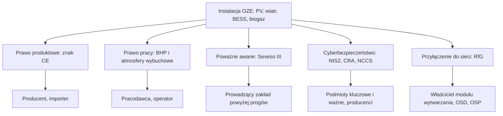

import { SlideContainer, Slide, InstructorNotes, LearningObjective } from '@site/src/components/SlideComponents';

<LearningObjective>

Student wskazuje akty prawa UE i Polski, które dotyczą danej instalacji OZE (odnawialnych źródeł energii), odróżnia przepisy obowiązujące, przyjęte, lecz jeszcze niestosowane, oraz projekty i przypisuje obowiązki właściwemu podmiotowi (stan prawny: wrzesień 2026).

</LearningObjective>

<SlideContainer>

<Slide title="Mapa ram prawnych" type="info">

- Skróty: PV — fotowoltaika; BESS (Battery Energy Storage System — bateryjny magazyn energii); BHP — bezpieczeństwo i higiena pracy; NIS2 (Network and Information Systems — dyrektywa (UE) 2022/2555 o cyberbezpieczeństwie podmiotów); CRA (Cyber Resilience Act — akt o cyberodporności produktów); NCCS (Network Code on Cybersecurity — kodeks sieci dotyczący cyberbezpieczeństwa); RfG (Requirements for Generators — kodeks sieci dotyczący przyłączenia jednostek wytwórczych); OSD i OSP — operator systemu dystrybucyjnego i przesyłowego.
- Warstwa polska: Prawo budowlane i warunki techniczne, ochrona przeciwpożarowa, przepisy BHP (atmosfery wybuchowe, najwyższe dopuszczalne stężenia), dozór techniczny, ustawa o krajowym systemie cyberbezpieczeństwa, Prawo ochrony środowiska.
- Dyrektywę UE wdraża ustawa krajowa (np. NIS2 przez nowelizację ustawy o krajowym systemie cyberbezpieczeństwa); rozporządzenie UE stosuje się bezpośrednio.
- Przy każdym akcie podajemy stan i datę: **obowiązuje** (np. nowelizacja ustawy o krajowym systemie cyberbezpieczeństwa od 3.04.2026), **przyjęty, jeszcze niestosowany** (np. rozporządzenie maszynowe od 20.01.2027), **projekt** (np. nowe warunki techniczne dla budynków, projekt z 6.08.2026).

Źródło: [KE, Blue Guide 2022](https://eur-lex.europa.eu/legal-content/EN/TXT/PDF/?uri=CELEX%3A52022XC0629%2804%29); [EU-OSHA, 89/391/EWG](https://osha.europa.eu/en/legislation/directives/the-osh-framework-directive/1); [EUR-Lex, 2012/18/UE](https://eur-lex.europa.eu/legal-content/EN/TXT/PDF/?uri=CELEX:32012L0018); [KE, NIS2](https://digital-strategy.ec.europa.eu/en/policies/nis2-directive); [KE, CRA](https://digital-strategy.ec.europa.eu/en/policies/cra-summary); [EUR-Lex, 2016/631](https://eur-lex.europa.eu/legal-content/EN/TXT/HTML/?uri=CELEX:32016R0631); [EUR-Lex, 2023/1230](https://eur-lex.europa.eu/legal-content/EN/ALL/?uri=CELEX:32023R1230); [ISAP, Dz.U. 2026 poz. 252](https://isap.sejm.gov.pl/isap.nsf/DocDetails.xsp?id=WDU20260000252); [RCL, projekt 12412604](https://legislacja.gov.pl/projekt/12412604)

<InstructorNotes>

Czas: ~2 min

Prawo dotyczące instalacji OZE wygląda na gąszcz, ale da się je uporządkować jednym pytaniem: kogo dany akt obowiązuje. Prawo produktowe obowiązuje producenta i importera. Kupujemy falownik z deklaracją zgodności, a za jego konstrukcję odpowiada producent. Prawo pracy obowiązuje pracodawcę, bo dotyczy tego, jak urządzenia są używane. Seveso obejmuje tylko zakłady z dużą ilością substancji niebezpiecznych. Przepisy cyber dzielą się na te dla podmiotów, czyli operatorów, i te dla producentów. Kodeks RfG dotyczy właściciela modułu wytwarzania, a parametry ustala operator systemu.

W 2026 roku wiele aktów jest w ruchu, dlatego przy każdym podajemy stan i datę. Pytanie do sali: kogo obowiązuje znak CE na falowniku, a kogo ocena ryzyka na farmie PV? Typowe nieporozumienie: „skoro portale branżowe opisują projekt, to już obowiązuje”.

</InstructorNotes>

</Slide>

<Slide title="Nowe ramy prawne, znak CE i normy zharmonizowane" type="info">

- **NLF** (New Legislative Framework — nowe ramy prawne): akty UE określają **wymagania zasadnicze**. Producent przeprowadza ocenę zgodności, wystawia deklarację zgodności UE i umieszcza znak **CE**.
- Stosowanie norm zharmonizowanych jest **dobrowolne**: producent zawsze może zastosować inne specyfikacje techniczne (Blue Guide 2022, pkt 1.1.3).
- Wyrób zgodny z normą zharmonizowaną korzysta z **domniemania zgodności** z odpowiadającymi jej wymaganiami zasadniczymi.
- Warunek domniemania: publikacja odniesienia do normy w Dzienniku Urzędowym UE. Publikacja może zawierać ograniczenia.
- Przykład ograniczenia: normy EN 18031-1/-2/-3:2024 dla urządzeń radiowych (decyzja wykonawcza (UE) 2025/138) nie dają domniemania zgodności, jeśli użytkownik może nie ustawić żadnego hasła.
- Łańcuch: akt prawny → zlecenie normalizacyjne Komisji → norma EN (europejska, opracowana przez europejskie organizacje normalizacyjne CEN, CENELEC lub ETSI) → odniesienie w Dzienniku Urzędowym UE → domniemanie zgodności.

Źródło: [KE, Blue Guide 2022](https://eur-lex.europa.eu/legal-content/EN/TXT/PDF/?uri=CELEX%3A52022XC0629%2804%29); [KE, normy zharmonizowane](https://single-market-economy.ec.europa.eu/single-market/goods/european-standards/harmonised-standards_en); [EUR-Lex, decyzja 2025/138](https://eur-lex.europa.eu/legal-content/EN/TXT/PDF/?uri=OJ:L_202500138)

<InstructorNotes>

Czas: ~2 min

Na tym mechanizmie opiera się cały rynek urządzeń. Akt prawny nie mówi, jak zbudować falownik. Mówi, jakie wymagania zasadnicze ma spełnić, na przykład że nie może razić prądem. Szczegóły techniczne są w normach. Jeżeli producent zastosuje normę zharmonizowaną, której odniesienie opublikowano w Dzienniku Urzędowym, przyjmuje się, że odpowiadające jej wymagania są spełnione. Norma pozostaje jednak dobrowolna: producent może zrobić inaczej, ale wtedy sam musi wykazać zgodność. Przykład norm EN 18031 pokazuje, że Komisja potrafi ograniczyć domniemanie, gdy norma dopuszcza słabe rozwiązanie, tu urządzenie bez hasła. Do norm wrócimy w części czwartej.

Typowe nieporozumienie: „znak CE to certyfikat wydany przez urząd”. W większości przypadków to deklaracja samego producenta. Pytanie do sali: kto ponosi skutki, gdy deklaracja okaże się nieprawdziwa?

</InstructorNotes>

</Slide>

<Slide title="Prawo produktowe: co musi spełnić wyrób" type="info">

| Akt | Czego dotyczy w OZE | Daty | Stan IX 2026 |
|---|---|---|---|
| LVD 2014/35/UE, EMC 2014/30/UE | sprzęt elektryczny: falowniki, moduły PV, rozdzielnice | LVD stosowana od 20.04.2016 | obowiązują |
| RED 2014/53/UE + rozp. delegowane 2022/30 | wymagania cyber dla urządzeń radiowych, np. falownika z Wi-Fi | od 1.08.2025; uchylone ze skutkiem od 11.12.2027 (rozp. 2026/339), potem CRA | obowiązuje |
| Rozp. maszynowe 2023/1230 (zastąpi dyrektywę 2006/42/WE) | maszyny, np. turbiny wiatrowe (wniosek z definicji maszyny) | dyrektywa do 19.01.2027; rozporządzenie od 20.01.2027 | przyjęte, jeszcze niestosowane |
| ATEX 2014/34/UE, PED 2014/68/UE | urządzenia do stref zagrożenia wybuchem i urządzenia ciśnieniowe, np. w biogazowni | w mocy od 2014 r. | obowiązują |
| Rozp. bateryjne 2023/1542 | baterie, w tym stacjonarne BESS | stosowane od 18.02.2024, etapami (niżej) | obowiązuje etapami |
| CPR 2024/3110 | wyroby budowlane, np. kable z klasą reakcji na ogień | stosowane od 8.01.2026 | obowiązuje, okres przejściowy |

- Art. 12 rozporządzenia bateryjnego: stacjonarny BESS ma być bezpieczny w normalnej pracy; od 18.08.2024 dokumentacja techniczna zawiera dowody badań parametrów z załącznika V, m.in. **ochrony przed propagacją termiczną** i **emisji gazów**, oraz instrukcje postępowania, gdy zagrożenie wystąpi, np. pożar lub wybuch.
- Etykieta z informacjami ogólnymi (m.in. skład chemiczny, substancje niebezpieczne, możliwy środek gaśniczy): od 18.08.2026 albo 18 miesięcy od aktu wykonawczego Komisji, jeśli ta data jest późniejsza (art. 13). Paszport baterii, m.in. przemysłowych powyżej 2 kWh: od 18.02.2027 (art. 77). Należyta staranność: od 18.08.2027 (rozp. 2025/1561).
- Skróty: LVD (Low Voltage Directive — dyrektywa niskonapięciowa), EMC (Electromagnetic Compatibility — kompatybilność elektromagnetyczna), RED (Radio Equipment Directive — dyrektywa radiowa), ATEX (Atmosphères Explosibles — urządzenia do atmosfer wybuchowych), PED (Pressure Equipment Directive — urządzenia ciśnieniowe), CPR (Construction Products Regulation — wyroby budowlane).

Źródło: [EUR-Lex, 2014/35/UE](https://eur-lex.europa.eu/legal-content/PL/TXT/?uri=CELEX:32014L0035); [EUR-Lex, 2014/30/UE](https://eur-lex.europa.eu/legal-content/PL/TXT/?uri=CELEX:32014L0030); [EUR-Lex, 2023/2444](https://eur-lex.europa.eu/legal-content/EN/TXT/HTML/?uri=CELEX:32023R2444); [EUR-Lex, 2026/339](https://eur-lex.europa.eu/legal-content/EN/TXT/HTML/?uri=CELEX:32026R0339); [EUR-Lex, 2023/1230](https://eur-lex.europa.eu/legal-content/EN/ALL/?uri=CELEX:32023R1230); [EUR-Lex, 2006/42/WE](https://eur-lex.europa.eu/legal-content/PL/TXT/?uri=CELEX:32006L0042); [EUR-Lex, 2014/34/UE](https://eur-lex.europa.eu/legal-content/EN/ALL/?uri=CELEX:32014L0034); [EUR-Lex, 2014/68/UE](https://eur-lex.europa.eu/legal-content/EN/ALL/?uri=CELEX:32014L0068); [EUR-Lex, 2023/1542](https://eur-lex.europa.eu/legal-content/EN/TXT/HTML/?uri=CELEX:32023R1542); [EUR-Lex, 2025/1561](https://eur-lex.europa.eu/legal-content/EN/TXT/HTML/?uri=CELEX:32025R1561); [KE, CPR 2024](https://single-market-economy.ec.europa.eu/sectors/construction/construction-products-regulation-cpr/cpr-2024-revision_en)

<InstructorNotes>

Czas: ~2,5 min

Projektant nie musi znać każdego artykułu tych aktów. Musi wiedzieć, jakich dokumentów żądać od dostawcy. Falownik z modułem Wi-Fi podlega od sierpnia 2025 roku także wymaganiom cyberbezpieczeństwa z dyrektywy radiowej. To reżim przejściowy: od 11 grudnia 2027 roku te wymagania przejmie akt o cyberodporności. Tekst rozporządzenia maszynowego nie wymienia turbin wiatrowych; to, że turbina jest maszyną, wynika z definicji maszyny (ocena własna).

Najwięcej zmienia się w rozporządzeniu bateryjnym. Artykuł 12 wymaga dla stacjonarnych magazynów badań propagacji termicznej i emisji gazów, czyli zjawisk, które widzieliśmy przy pożarach BESS w części pierwszej. Przy etykiecie proszę zwrócić uwagę na regułę „późniejszej daty”: termin zależy od tego, kiedy Komisja przyjmie akt wykonawczy, dlatego sprawdzamy go w EUR-Lex. Pytanie: jakich dokumentów zgodności zażądacie od dostawcy kontenerowego magazynu z modemem LTE?

</InstructorNotes>

</Slide>

<Slide title="Prawo pracy: obowiązki pracodawcy i operatora" type="info">

- **89/391/EWG** (dyrektywa ramowa BHP): pracodawca ocenia ryzyko dla pracowników, m.in. przy wyborze sprzętu i substancji. Zasady prewencji to m.in. unikanie ryzyka, zwalczanie go u źródła i pierwszeństwo środków zbiorowych przed indywidualnymi.
- **1999/92/WE**: pracodawca klasyfikuje miejsca, w których może wystąpić atmosfera wybuchowa, na **strefy** (art. 7) i prowadzi aktualny **dokument zabezpieczenia przed wybuchem (DZPW)** (art. 8), zmieniany przy istotnych zmianach, rozbudowie lub przebudowie stanowisk pracy.
- Strefy dla gazów: **0** — atmosfera wybuchowa występuje stale, przez długi czas lub często; **1** — może wystąpić okazjonalnie w normalnej pracy; **2** — w normalnej pracy jest mało prawdopodobna, a jeśli wystąpi, trwa krótko.
- **2009/104/WE**: sprzęt roboczy, np. wciągarki i dźwigi serwisowe, musi być odpowiedni do pracy i sprawdzany przez osoby kompetentne po montażu i okresowo; wyniki się zapisuje.
- **98/24/WE** i **2009/161/UE**: ocena ryzyka od czynników chemicznych. Dla H₂S wskaźnikowe wartości IOELV (Indicative Occupational Exposure Limit Values — wskaźnikowe dopuszczalne wartości narażenia zawodowego) wynoszą 5 ppm (7 mg/m³) dla 8 h i 10 ppm (14 mg/m³) krótkoterminowo.
- Obowiązki BHP spoczywają na operatorze niezależnie od znaku CE na sprzęcie: prawo produktowe dotyczy wyrobu, prawo pracy jego użytkowania.

Źródło: [EU-OSHA, 89/391/EWG](https://osha.europa.eu/en/legislation/directives/the-osh-framework-directive/1); [EUR-Lex, 1999/92/WE](https://eur-lex.europa.eu/legal-content/EN/TXT/HTML/?uri=CELEX:31999L0092); [EU-OSHA, 2009/104/WE](https://osha.europa.eu/en/legislation/directives/3); [EU-OSHA, 98/24/WE](https://osha.europa.eu/en/legislation/directives/75); [EUR-Lex, 2009/161/UE](https://eur-lex.europa.eu/legal-content/EN/TXT/HTML/?uri=CELEX:32009L0161)

<InstructorNotes>

Czas: ~2 min

Druga rodzina aktów dotyczy miejsca pracy i tu odpowiada pracodawca, w praktyce operator farmy lub biogazowni. Dla naszego przedmiotu najważniejsza jest dyrektywa 1999/92. To ona każe podzielić teren biogazowni na strefy zagrożenia wybuchem i prowadzić DZPW. Od strefy zależy, jakie urządzenia wolno w niej zamontować. W magazynach energii ta logika też może mieć znaczenie, bo gazy uwalniane z ogniw podczas awarii mogą tworzyć mieszaninę wybuchową (ocena własna).

Wartości IOELV to poziom unijny; polskie najwyższe dopuszczalne stężenia zobaczymy za kilka slajdów. Typowe nieporozumienie: „kupiłem urządzenia z certyfikatem ATEX, więc mam spokój”. Certyfikat dotyczy wyrobu, a klasyfikacja stref i DZPW należą do operatora. Pytanie do sali: kto wyznacza strefy w biogazowni, producent agregatu kogeneracyjnego czy operator?

</InstructorNotes>

</Slide>

<Slide title="Seveso III a biogazownie i BESS" type="warning">

Dyrektywa 2012/18/UE (Seveso III, stosowana od 1.06.2015) obejmuje zakłady według **ilości substancji niebezpiecznych**, a nie rodzaju instalacji. W Polsce zakład zalicza się do zakładu o zwiększonym ryzyku (**ZZR**) albo o dużym ryzyku (**ZDR**) wystąpienia poważnej awarii przemysłowej: art. 248 Prawa ochrony środowiska (POŚ) i rozporządzenie Ministra Rozwoju z 29.01.2016 (Dz.U. 2016 poz. 138), które podaje progi w Mg (1 Mg = 1 t).

| Pozycja w załączniku rozporządzenia | Próg ZZR | Próg ZDR |
|---|---|---|
| Tabela 1, P2: gazy łatwopalne kategorii 1 lub 2 (np. surowy biogaz) | 10 t | 50 t |
| Tabela 2, poz. 18: łatwopalne gazy ciekłe kategorii 1 lub 2 i gaz ziemny; biogaz uszlachetniony do jakości gazu ziemnego, z najwyżej 1% tlenu, można zaliczyć do tej pozycji (objaśnienie 19) | 50 t | 200 t |
| Tabela 2, poz. 15: wodór | 5 t | 50 t |

- BESS nie jest pozycją nazwaną w załączniku I dyrektywy.
- Poniżej progów nadal obowiązują przepisy BHP (w tym ochrona przed wybuchem) i przeciwpożarowe.

**Przykład ilustracyjny — dane umowne.** Surowy biogaz: 60% CH₄ i 40% CO₂ (obj.), gęstość w warunkach normalnych 0,6 × 0,717 + 0,4 × 1,977 ≈ 1,22 kg/m³. Próg 10 t odpowiada więc ok. 8200 m³ gazu, a zbiornik z 3000 m³ gazu zawiera ok. 3,7 t. O zaliczeniu zakładu decydują jednak rzeczywisty skład i klasyfikacja gazu oraz reguła sumowania substancji (uwaga 4 do załącznika I dyrektywy); przykład pokazuje tylko rząd wielkości.

Źródło: [EUR-Lex, 2012/18/UE](https://eur-lex.europa.eu/legal-content/EN/TXT/PDF/?uri=CELEX:32012L0018); [ISAP, Dz.U. 2016 poz. 138](https://isap.sejm.gov.pl/isap.nsf/DocDetails.xsp?id=WDU20160000138); [ISAP, POŚ, t.j. Dz.U. 2025 poz. 647](https://isap.sejm.gov.pl/isap.nsf/DocDetails.xsp?id=WDU20250000647); gęstości składników z tablic (0 °C, 1013 hPa), obliczenia własne

<InstructorNotes>

Czas: ~2 min

Studenci często zakładają, że każda biogazownia jest zakładem Seveso. Tak nie jest: decyduje ilość substancji niebezpiecznych w zakładzie, a nie rodzaj instalacji. Przykład na slajdzie ma dane umowne, ale pokazuje rząd wielkości. Dziesięć ton surowego biogazu to około ośmiu tysięcy metrów sześciennych w warunkach normalnych. Rolnicza instalacja, która magazynuje kilka tysięcy metrów sześciennych gazu pod ciśnieniem bliskim atmosferycznemu, zwykle nie przekracza progu (ocena własna). Instalacja ze sprężonym lub skroplonym biometanem albo z magazynem wodoru musi liczyć bardzo starannie.

Proszę zwrócić uwagę na słowo „zwykle”. Prowadzący zakład musi to policzyć, z regułą sumowania różnych substancji; zakład ZZR lub ZDR ma dodatkowe obowiązki z POŚ, które sprawdzamy w tekście jednolitym w ISAP. Pytanie do sali: dlaczego próg ZZR dla wodoru (5 t) jest niższy niż dla gazów łatwopalnych ogółem (10 t)?

</InstructorNotes>

</Slide>

<Slide title="Cyberbezpieczeństwo i przyłączenie do sieci" type="info">

| Akt | Kogo dotyczy | Kluczowe daty | Stan IX 2026 |
|---|---|---|---|
| NIS2 (UE) 2022/2555 → nowelizacja ustawy o KSC (krajowym systemie cyberbezpieczeństwa), Dz.U. 2026 poz. 252 | podmioty kluczowe i ważne z załącznika 1, m.in. przedsiębiorstwa energetyczne z koncesją na wytwarzanie energii elektrycznej | w mocy od 3.04.2026; dalsze terminy niżej | obowiązuje |
| CRA (UE) 2024/2847 | producenci produktów z elementami cyfrowymi, np. falowników i sterowników | zgłaszanie aktywnie wykorzystywanych podatności i poważnych incydentów od 11.09.2026 (24 h i 72 h); pełne stosowanie od 11.12.2027 | stosowany częściowo |
| NCCS (UE) 2024/1366 | przedsiębiorstwa energetyczne i inne podmioty sektora elektroenergetycznego (art. 2) | w mocy od 13.06.2024; cykliczne oceny ryzyka, wdrażanie etapami | obowiązuje |
| RfG (UE) 2016/631 | moduły wytwarzania energii od 0,8 kW, typy A–D | stosowane od 27.04.2019 | obowiązuje |
| Rewizja RfG (inicjatywa 14165) | ACER (Agency for the Cooperation of Energy Regulators — agencja UE ds. współpracy regulatorów energetyki) zaleca objęcie m.in. magazynów energii i pojazdów elektrycznych | projekt z 8.07.2026, uwagi do 25.08.2026; przyjęcie planowane w IV kw. 2026 | projekt |

- **Podmiot kluczowy** przekracza progi średniego przedsiębiorcy, **podmiot ważny** jest średnim przedsiębiorcą (art. 5 KSC). Wniosek o wpis do wykazu podmiotów kluczowych i ważnych składa się według harmonogramu ministra ds. informatyzacji; gov.pl: samodzielna rejestracja do 3.10.2026.
- Obowiązki z rozdziału 3 KSC, w tym **SZBI** (system zarządzania bezpieczeństwem informacji): do 3.04.2027. Pierwszy audyt podmiotu kluczowego: do 3.04.2028. Kary pieniężne z art. 73 ust. 1–4, art. 73a–73c i art. 76b: najwcześniej od 3.04.2028 (art. 35 nowelizacji).
- Progi typów w Polsce (decyzja Prezesa URE, Urzędu Regulacji Energetyki, z 16.07.2018): B od 200 kW, C od 10 MW, D od 75 MW lub przy przyłączeniu na napięciu ≥ 110 kV. Wymogi ogólnego stosowania PSE (Polskich Sieci Elektroenergetycznych), zatwierdzone 15.05.2025: typy B–D przy warunkach przyłączenia wydanych od 1.12.2025, typ A od 1.01.2027.

Źródło: [KE, NIS2](https://digital-strategy.ec.europa.eu/en/policies/nis2-directive); [ISAP, Dz.U. 2026 poz. 252](https://isap.sejm.gov.pl/isap.nsf/DocDetails.xsp?id=WDU20260000252); [gov.pl, nowelizacja KSC](https://www.gov.pl/web/baza-wiedzy/nowelizacja-ustawy-o-krajowym-systemie-cyberbezpieczenstwa); [Ministerstwo Energii, wykaz podmiotów](https://www.gov.pl/web/energia/wykaz-podmiotow-kluczowych-i-podmiotow-waznych-ministerstwo-cyfryzacji-uruchomilo-mozliwosc-samodzielnej-rejestracji); [KE, CRA](https://digital-strategy.ec.europa.eu/en/policies/cra-summary); [EUR-Lex, NCCS](https://eur-lex.europa.eu/legal-content/EN/TXT/PDF/?uri=CELEX%3A02024R1366-20250914); [KE, DG ENER](https://energy.ec.europa.eu/topics/energy-security/critical-infrastructure-and-cybersecurity_en); [EUR-Lex, RfG](https://eur-lex.europa.eu/legal-content/EN/TXT/HTML/?uri=CELEX:32016R0631); [PSE, NC RfG](https://www.pse.pl/kodeksy/rfg); [KE, inicjatywa 14165](https://ec.europa.eu/info/law/better-regulation/have-your-say/initiatives/14165-Revision-of-the-Network-Code-on-Requirements-for-Grid-Connection-of-Generators_en); [ACER](https://www.acer.europa.eu/news-and-events/news/acer-proposes-amendments-electricity-grid-connection-network-codes)

<InstructorNotes>

Czas: ~2,5 min

Nowelizacja ustawy o KSC wdraża NIS2 i dotyczy firm, czyli operatorów. Duży lub średni wytwórca z koncesją musi zarządzać ryzykiem cyber i zgłaszać incydenty, a podmiot kluczowy także przejść audyt. Sama ustawa nie wpisuje daty 3 października: termin wniosku wynika z harmonogramu ministra, a gov.pl podaje rejestrację do tego dnia. CRA dotyczy producentów: od 11 września 2026 r. producent falownika wysyła wczesne ostrzeżenie o aktywnie wykorzystywanej podatności w ciągu 24 godzin.

RfG określa zachowanie jednostek przy zakłóceniach. Polskie progi typów B i C (0,2 i 10 MW) są niższe niż maksima unijne dla Europy kontynentalnej (1 i 50 MW); próg typu D (75 MW) jest równy maksimum. Pytanie: czy właściciel domowej instalacji PV 8 kW podlega ustawie o KSC? Nie: osoba prywatna nie jest podmiotem z załącznika 1 (przedsiębiorstwem energetycznym z koncesją na wytwarzanie) ani średnim lub dużym przedsiębiorcą. Nową instalację 8 kW RfG obejmuje jako moduł typu A.

</InstructorNotes>

</Slide>

<Slide title="Prawo budowlane: PV i magazyny energii" type="info">

- **PV do 150 kW** (i magazyn energii do 30 kWh) instaluje się bez pozwolenia na budowę i bez zgłoszenia (art. 29 ust. 4 pkt 3 lit. c).
- **PV powyżej 6,5 kW**: projekt uzgadnia się z rzeczoznawcą do spraw zabezpieczeń przeciwpożarowych; po zakończeniu prac zawiadamia się Państwową Straż Pożarną (PSP) i przekazuje jej „plan urządzenia fotowoltaicznego dla ekip ratowniczych”. Dawny art. 56 ust. 1a jest uchylony.
- **Magazyny energii**: ustawa z 4.12.2025 (Dz.U. 2025 poz. 1847), w mocy od 7.01.2026; definicja magazynu energii elektrycznej (art. 3 pkt 27) od 20.09.2026.

| Pojemność nominalna | Magazyn wolnostojący | Magazyn instalowany na obiekcie budowlanym |
|---|---|---|
| do 30 kWh | bez pozwolenia i zgłoszenia | bez pozwolenia i zgłoszenia |
| powyżej 30 do 300 kWh | zgłoszenie; uzgodnienie ppoż. projektu zagospodarowania; zawiadomienie PSP z planem | zgłoszenie z dokumentacją uzgodnioną pod względem ppoż.; zawiadomienie PSP z planem |
| powyżej 300 do 2000 kWh | zgłoszenie; uzgodnienie ppoż. projektu zagospodarowania i projektu architektoniczno-budowlanego; zawiadomienie PSP z planem | pozwolenie na budowę |
| powyżej 2000 kWh | pozwolenie na budowę | pozwolenie na budowę |

- Podstawa (t.j. Dz.U. 2026 poz. 524): art. 29 ust. 1 pkt 3c i 40, ust. 2 pkt 39, ust. 3 pkt 3 lit. h, ust. 4 pkt 3 lit. c, art. 30 oraz art. 33 ust. 3 i 4bb. „Plan” pokazuje lokalizację magazynu i dane istotne dla ekip ratowniczych; ppoż. — ochrona przeciwpożarowa.

Źródło: [ISAP, Prawo budowlane, t.j. Dz.U. 2026 poz. 524](https://isap.sejm.gov.pl/isap.nsf/DocDetails.xsp?id=WDU20260000524); [ISAP, Dz.U. 2025 poz. 1847](https://isap.sejm.gov.pl/isap.nsf/DocDetails.xsp?id=WDU20250001847); [KP PSP Łańcut, 2021](https://www.gov.pl/web/kppsp-lancut/zgloszenie-instalacji-fotowoltaicznej-o-mocy-powyzej-65-kw)

<InstructorNotes>

Czas: ~2,5 min

Zasadę dla fotowoltaiki warto znać na pamięć: powyżej 6,5 kW projekt uzgadnia rzeczoznawca do spraw zabezpieczeń przeciwpożarowych, a straż pożarna dostaje zawiadomienie wraz z planem instalacji dla ratowników. W starszych materiałach, także na stronach komend PSP, znajdziecie odwołanie do artykułu 56 ustęp 1a, który jest już uchylony.

Nowością są magazyny energii: po raz pierwszy Prawo budowlane określa progi pojemności. Magazyn domowy do 30 kWh nie wymaga formalności. Powyżej tej wartości potrzebne są zgłoszenie, uzgodnienie przeciwpożarowe i zawiadomienie straży z planem, a magazyn powyżej 300 kWh na budynku wymaga pozwolenia na budowę. Wymóg planu dla ratowników jest zbieżny z wnioskami z dochodzeń po pożarach magazynów (ocena własna). Pytanie: jakie formalności będą potrzebne dla kontenerowego magazynu 1 MWh obok farmy PV? To 1000 kWh, czyli wiersz od 300 do 2000 kWh.

</InstructorNotes>

</Slide>

<Slide title="Warunki techniczne i ochrona ppoż. w IX 2026" type="warning">

- **WT 2002** (rozporządzenie Ministra Infrastruktury z 12.04.2002 w sprawie warunków technicznych, jakim powinny odpowiadać budynki i ich usytuowanie; t.j. Dz.U. 2022 poz. 1225): przepisy obowiązujące do 19.09.2026; w ISAP status „uznany za uchylony”.
- **Okres przejściowy**: art. 102a–102c Prawa budowlanego, dodane ustawą z 31.07.2026 (Dz.U. 2026 poz. 1161; ten przepis w mocy od 2.09.2026). Przez 18 miesięcy od 20.09.2026 projekt zagospodarowania lub projekt architektoniczno-budowlany może być sporządzony według dotychczasowych WT (z oświadczeniem inwestora); to samo dotyczy budów z art. 29 ust. 2 i robót z art. 29 ust. 4.
- **Nowe WT** nie zostały opublikowane w Dzienniku Ustaw (stan 29.09.2026). Projekt nr 12412604 na stronie Rządowego Centrum Legislacji (RCL): ostatni zakończony etap to „Notyfikacja” (ostatnia zmiana 2.09.2026); etap „Skierowanie projektu do podpisu ministra” nie ma daty. **To projekt z 6.08.2026, nie prawo.**
- Projekt przewiduje dla PV m.in. wyłącznik awaryjny dla ekip ratowniczych, monitorowanie stanu izolacji po stronie DC (prądu stałego) oraz wykrywanie i przerywanie łuku DC, a dla BESS m.in. BMS (Battery Management System — system zarządzania baterią) z odłączaniem baterii, wyłącznik awaryjny, detekcję gazu i wentylację; szczegóły w W6 i W8.
- **Ochrona ppoż.**: obowiązki właściciela obiektu — art. 4 ust. 1 ustawy o ochronie przeciwpożarowej (t.j. Dz.U. 2025 poz. 188); uzgadnianie projektów — rozporządzenie Ministra Spraw Wewnętrznych i Administracji (MSWiA) z 5.08.2023 (Dz.U. 2023 poz. 1563); ochrona ppoż. budynków — rozporządzenie MSWiA z 7.06.2010 (Dz.U. 2010 nr 109 poz. 719, ma tekst jednolity).
- **Wytyczne CNBOP-PIB i PSME** (instytut badawczy ochrony przeciwpożarowej i Polskie Stowarzyszenie Magazynowania Energii) dla wielkoskalowych i przemysłowych magazynów energii: zapowiedziane do końca 2026 r. (wg Gramwzielone), nieopublikowane (stan 29.09.2026).

Źródło: [ISAP, rozporządzenie MI z 12.04.2002](https://isap.sejm.gov.pl/isap.nsf/DocDetails.xsp?id=WDU20020750690); [ISAP, Dz.U. 2026 poz. 1161](https://isap.sejm.gov.pl/isap.nsf/DocDetails.xsp?id=WDU20260001161); [RCL, projekt 12412604](https://legislacja.gov.pl/projekt/12412604); [RCL, projekt z 6.08.2026 (DOCX)](https://legislacja.gov.pl/docs//582/12412604/13216444/dokument791486.docx); [ISAP, Dz.U. 2025 poz. 188](https://isap.sejm.gov.pl/isap.nsf/DocDetails.xsp?id=WDU20250000188); [KG PSP, Dz.U. 2023 poz. 1563](https://www.gov.pl/web/kgpsp/zmiany-w-przepisach-z-zakresu-ochrony-przeciwpozarowej); [ISAP, Dz.U. 2010 nr 109 poz. 719](https://isap.sejm.gov.pl/isap.nsf/DocDetails.xsp?id=WDU20101090719); [Gramwzielone, 7.07.2026](https://www.gramwzielone.pl/magazynowanie-energii/20366280/wytyczne-przeciwpozarowe-dla-magazynow-energii-powstana-do-konca-roku); [CNBOP-PIB, aktualności](https://www.cnbop.pl/pl/aktualnosci)

<InstructorNotes>

Czas: ~2 min

Ten slajd opisuje sytuację wyjątkową. Stare warunki techniczne z 2002 roku obowiązywały do 19 września 2026 roku, a nowych nie ogłoszono. Ustawodawca dodał przepisy epizodyczne: przez półtora roku można projektować według dotychczasowych zasad, z oświadczeniem inwestora. Według strony RCL ostatnim zakończonym etapem prac nad nowym rozporządzeniem jest notyfikacja; projekt nie trafił jeszcze do podpisu. Wymagania projektu dla PV i magazynów omówimy w W6 i W8; dziś ważne jest tylko to, że to wciąż projekt.

Praktyczna rada: w projekcie z tego okresu trzeba napisać wprost, według których warunków technicznych go sporządzono. Typowe nieporozumienie: „portal branżowy podał progi alarmowe dla magazynów, więc to prawo”. Liczby z prasy bywają z innej wersji projektu, dlatego czytamy sam tekst na stronie RCL. Pytanie do sali: gdzie sprawdzicie, czy nowe warunki techniczne już opublikowano?

</InstructorNotes>

</Slide>

<Slide title="BHP, kwalifikacje i dozór techniczny" type="info">

- **Atmosfera wybuchowa**: rozporządzenie Ministra Gospodarki (MG) z 8.07.2010 (Dz.U. 2010 nr 138 poz. 931). Kolejność środków (§ 4): zapobiegać powstaniu atmosfery wybuchowej, zapobiegać zapłonowi, ograniczać skutki wybuchu. Pracodawca wyznacza strefy 0, 1, 2 (§ 5) i przed udostępnieniem miejsca pracy sporządza na podstawie oceny ryzyka DZPW, aktualizowany po zmianach (§ 7); urządzenia stosuje się w atmosferze wybuchowej tylko wtedy, gdy przewiduje to DZPW (§ 11).
- **NDS i NDSCh** (najwyższe dopuszczalne stężenie i najwyższe dopuszczalne stężenie chwilowe): rozporządzenie z 12.06.2018 (Dz.U. 2018 poz. 1286), załącznik w brzmieniu z Dz.U. 2026 poz. 447 (w mocy od 2.04.2026): H₂S — 7 i 14 mg/m³; CO — 23 mg/m³ (20 ppm) i 117 mg/m³ (100 ppm); CO₂ — 9000 i 27 000 mg/m³.
- **Świadectwa kwalifikacyjne**: rozporządzenie Ministra Klimatu i Środowiska (MKiŚ) z 1.07.2022 (Dz.U. 2022 poz. 1392) rozróżnia stanowiska **eksploatacji** i **dozoru**. Grupa 1 obejmuje urządzenia elektroenergetyczne (m.in. wytwarzające, przesyłające i magazynujące energię), grupa 2 cieplne, grupa 3 gazowe.
- **Dozór techniczny** (UDT — Urząd Dozoru Technicznego): rozporządzenie Rady Ministrów (RM) z 7.12.2012 (Dz.U. 2012 poz. 1468) wymienia m.in. dźwigi do transportu osób lub ładunków, wciągarki i wciągniki, żurawie, podesty ruchome oraz zbiorniki stałe ciśnieniowe, gdy iloczyn ciśnienia i pojemności przekracza 50 bar·dm³, a ciśnienie 0,5 bar.

Źródło: [ISAP, Dz.U. 2010 nr 138 poz. 931](https://isap.sejm.gov.pl/isap.nsf/DocDetails.xsp?id=WDU20101380931); [ISAP, Dz.U. 2018 poz. 1286](https://isap.sejm.gov.pl/isap.nsf/DocDetails.xsp?id=WDU20180001286); [ISAP, Dz.U. 2026 poz. 447](https://isap.sejm.gov.pl/isap.nsf/DocDetails.xsp?id=WDU20260000447); [URE, Dz.U. 2022 poz. 1392](https://www.ure.gov.pl/download/9/12973/1392.pdf); [ISAP, Dz.U. 2012 poz. 1468](https://isap.sejm.gov.pl/isap.nsf/DocDetails.xsp?id=WDU20120001468)

<InstructorNotes>

Czas: ~2,5 min

Z tymi przepisami spotkacie się jako pracownicy operatora. DZPW sporządza się przed dopuszczeniem ludzi do pracy i aktualizuje przy zmianach instalacji. Kolejność środków w paragrafie 4 to hierarchia znana z części drugiej: najpierw nie dopuścić do powstania atmosfery wybuchowej, potem do zapłonu, na końcu ograniczać skutki.

NDS i NDSCh mówią, ile siarkowodoru czy tlenku węgla może być w powietrzu na stanowisku pracy. Załącznik wymieniono w 2026 roku, więc wartości zawsze sprawdzamy w aktualnym tekście. Typowe nieporozumienie: porównywanie NDS ze stężeniem H₂S w strumieniu biogazu. To stężenie procesowe w gazie, a nie narażenie pracownika.

Kto obsługuje lub nadzoruje urządzenia energetyczne, potrzebuje świadectwa właściwej grupy. O tym, czy winda serwisowa w wieży turbiny podlega dozorowi, rozstrzyga wykaz w rozporządzeniu, a nie intuicja. Pytanie: świadectwa których grup mogą być potrzebne w biogazowni z agregatem kogeneracyjnym?

</InstructorNotes>

</Slide>

<Slide title="Kto za co odpowiada" type="success">

| Podmiot | Główne obowiązki | Podstawa |
|---|---|---|
| Producent, importer | ocena zgodności, deklaracja zgodności, znak CE, dokumentacja techniczna (BESS: badania wg art. 12); zgłaszanie podatności | NLF, LVD, RED, rozp. bateryjne, CRA |
| Projektant | dobór wyrobów z CE; projekt uzgodniony pod względem ppoż. (PV powyżej 6,5 kW; BESS powyżej 30 kWh w trybie zgłoszenia) | Prawo budowlane art. 29 i 33; MSWiA 2023 |
| Wykonawca, instalator | montaż zgodny z projektem; kwalifikacje do prac eksploatacyjnych | Prawo budowlane; MKiŚ 2022 |
| Właściciel obiektu | wymagania ppoż., urządzenia ppoż. i ich sprawne działanie, ewakuacja, przygotowanie obiektu do akcji ratowniczej; umową może przenieść obowiązki na zarządcę lub użytkownika | ustawa o ochronie ppoż., art. 4 ust. 1 i 1a |
| Pracodawca, operator, prowadzący zakład | ocena ryzyka, strefy i DZPW, NDS, sprzęt roboczy, cyberbezpieczeństwo; sprawdzenie progów ZZR i ZDR | 89/391, 1999/92, 2009/104, MG 2010, rozp. NDS 2018, KSC, POŚ art. 248 |
| PSP, UDT, OSD, OSP, URE | PSP: przyjmuje zawiadomienia wraz z planem dla ekip ratowniczych; UDT: dozór; operatorzy i URE: wymagania przyłączeniowe | Prawo budowlane art. 29, 33 i 56 ust. 1; RM 2012; RfG |

Źródło: [KE, Blue Guide 2022](https://eur-lex.europa.eu/legal-content/EN/TXT/PDF/?uri=CELEX%3A52022XC0629%2804%29); [ISAP, Prawo budowlane, t.j. Dz.U. 2026 poz. 524](https://isap.sejm.gov.pl/isap.nsf/DocDetails.xsp?id=WDU20260000524); [ISAP, Dz.U. 2025 poz. 188](https://isap.sejm.gov.pl/isap.nsf/DocDetails.xsp?id=WDU20250000188); [EUR-Lex, 1999/92/WE](https://eur-lex.europa.eu/legal-content/EN/TXT/HTML/?uri=CELEX:31999L0092); [ISAP, Dz.U. 2016 poz. 138](https://isap.sejm.gov.pl/isap.nsf/DocDetails.xsp?id=WDU20160000138); [EUR-Lex, RfG](https://eur-lex.europa.eu/legal-content/EN/TXT/HTML/?uri=CELEX:32016R0631)

<InstructorNotes>

Czas: ~2 min

Na koniec porządkujemy odpowiedzialność. Po wypadku pierwsze pytanie brzmi: kto miał obowiązek i czy go wypełnił. Producent odpowiada za wyrób, projektant za dobór i uzgodnienia, wykonawca za montaż. Właściciel obiektu ma własne obowiązki przeciwpożarowe, w tym zapewnienie sprawności urządzeń przeciwpożarowych i przygotowanie obiektu do akcji ratowniczej. Pracodawca i operator odpowiadają za eksploatację, a prowadzący zakład z dużą ilością gazu musi sprawdzić progi Seveso. Straż pożarna, dozór techniczny i operatorzy sieci nie przejmują tej odpowiedzialności; weryfikują ją albo reagują na zdarzenia.

Pytanie do sali: rozłącznik DC z certyfikatem zapalił się, bo woda dostała się przez źle zamontowaną dławnicę. Kto zawinił? Typowe nieporozumienie: „za wszystko odpowiada producent, bo wydał deklarację zgodności”.

</InstructorNotes>

</Slide>

</SlideContainer>

## Źródła

1. Komisja Europejska (2022). *The „Blue Guide” on the implementation of EU product rules 2022* (2022/C 247/01). Dz.Urz. UE C 247, 29.06.2022. [https://eur-lex.europa.eu/legal-content/EN/TXT/PDF/?uri=CELEX%3A52022XC0629%2804%29](https://eur-lex.europa.eu/legal-content/EN/TXT/PDF/?uri=CELEX%3A52022XC0629%2804%29)
2. Komisja Europejska (b.d.). *Harmonised standards*. [https://single-market-economy.ec.europa.eu/single-market/goods/european-standards/harmonised-standards_en](https://single-market-economy.ec.europa.eu/single-market/goods/european-standards/harmonised-standards_en)
3. Komisja Europejska (2025). *Decyzja wykonawcza (UE) 2025/138 z 28.01.2025 w sprawie norm zharmonizowanych EN 18031-1/-2/-3:2024 dla dyrektywy 2014/53/UE*. EUR-Lex. [https://eur-lex.europa.eu/legal-content/EN/TXT/PDF/?uri=OJ:L_202500138](https://eur-lex.europa.eu/legal-content/EN/TXT/PDF/?uri=OJ:L_202500138)
4. Parlament Europejski i Rada UE (2014). *Dyrektywa 2014/35/UE (LVD)*. EUR-Lex. [https://eur-lex.europa.eu/legal-content/PL/TXT/?uri=CELEX:32014L0035](https://eur-lex.europa.eu/legal-content/PL/TXT/?uri=CELEX:32014L0035)
5. Parlament Europejski i Rada UE (2014). *Dyrektywa 2014/30/UE (EMC)*. EUR-Lex. [https://eur-lex.europa.eu/legal-content/PL/TXT/?uri=CELEX:32014L0030](https://eur-lex.europa.eu/legal-content/PL/TXT/?uri=CELEX:32014L0030)
6. Komisja Europejska (2023). *Rozporządzenie delegowane (UE) 2023/2444 zmieniające datę stosowania rozporządzenia delegowanego (UE) 2022/30*. EUR-Lex. [https://eur-lex.europa.eu/legal-content/EN/TXT/HTML/?uri=CELEX:32023R2444](https://eur-lex.europa.eu/legal-content/EN/TXT/HTML/?uri=CELEX:32023R2444)
7. Komisja Europejska (2026). *Rozporządzenie delegowane (UE) 2026/339 z 16.02.2026 uchylające rozporządzenie delegowane (UE) 2022/30*. EUR-Lex. [https://eur-lex.europa.eu/legal-content/EN/TXT/HTML/?uri=CELEX:32026R0339](https://eur-lex.europa.eu/legal-content/EN/TXT/HTML/?uri=CELEX:32026R0339)
8. Parlament Europejski i Rada UE (2023). *Rozporządzenie (UE) 2023/1230 w sprawie maszyn*. EUR-Lex. [https://eur-lex.europa.eu/legal-content/EN/ALL/?uri=CELEX:32023R1230](https://eur-lex.europa.eu/legal-content/EN/ALL/?uri=CELEX:32023R1230)
9. Parlament Europejski i Rada UE (2006). *Dyrektywa 2006/42/WE w sprawie maszyn*. EUR-Lex. [https://eur-lex.europa.eu/legal-content/PL/TXT/?uri=CELEX:32006L0042](https://eur-lex.europa.eu/legal-content/PL/TXT/?uri=CELEX:32006L0042)
10. Parlament Europejski i Rada UE (2014). *Dyrektywa 2014/34/UE (ATEX)*. EUR-Lex. [https://eur-lex.europa.eu/legal-content/EN/ALL/?uri=CELEX:32014L0034](https://eur-lex.europa.eu/legal-content/EN/ALL/?uri=CELEX:32014L0034)
11. Parlament Europejski i Rada UE (2014). *Dyrektywa 2014/68/UE (PED)*. EUR-Lex. [https://eur-lex.europa.eu/legal-content/EN/ALL/?uri=CELEX:32014L0068](https://eur-lex.europa.eu/legal-content/EN/ALL/?uri=CELEX:32014L0068)
12. Parlament Europejski i Rada UE (2023). *Rozporządzenie (UE) 2023/1542 w sprawie baterii i zużytych baterii*. EUR-Lex. [https://eur-lex.europa.eu/legal-content/EN/TXT/HTML/?uri=CELEX:32023R1542](https://eur-lex.europa.eu/legal-content/EN/TXT/HTML/?uri=CELEX:32023R1542)
13. Parlament Europejski i Rada UE (2025). *Rozporządzenie (UE) 2025/1561 zmieniające rozporządzenie (UE) 2023/1542 w zakresie należytej staranności*. EUR-Lex. [https://eur-lex.europa.eu/legal-content/EN/TXT/HTML/?uri=CELEX:32025R1561](https://eur-lex.europa.eu/legal-content/EN/TXT/HTML/?uri=CELEX:32025R1561)
14. Komisja Europejska (b.d.). *CPR 2024 revision* (rozporządzenie (UE) 2024/3110). [https://single-market-economy.ec.europa.eu/sectors/construction/construction-products-regulation-cpr/cpr-2024-revision_en](https://single-market-economy.ec.europa.eu/sectors/construction/construction-products-regulation-cpr/cpr-2024-revision_en)
15. EU-OSHA (b.d.). *Directive 89/391/EEC — OSH „Framework Directive”*. [https://osha.europa.eu/en/legislation/directives/the-osh-framework-directive/1](https://osha.europa.eu/en/legislation/directives/the-osh-framework-directive/1)
16. Parlament Europejski i Rada UE (1999). *Dyrektywa 1999/92/WE w sprawie minimalnych wymagań dotyczących bezpieczeństwa i ochrony zdrowia pracowników zatrudnionych na stanowiskach pracy, na których może wystąpić atmosfera wybuchowa*. EUR-Lex. [https://eur-lex.europa.eu/legal-content/EN/TXT/HTML/?uri=CELEX:31999L0092](https://eur-lex.europa.eu/legal-content/EN/TXT/HTML/?uri=CELEX:31999L0092)
17. EU-OSHA (b.d.). *Directive 2009/104/EC — use of work equipment*. [https://osha.europa.eu/en/legislation/directives/3](https://osha.europa.eu/en/legislation/directives/3)
18. EU-OSHA (b.d.). *Directive 98/24/EC — risks related to chemical agents at work*. [https://osha.europa.eu/en/legislation/directives/75](https://osha.europa.eu/en/legislation/directives/75)
19. Komisja Europejska (2009). *Dyrektywa 2009/161/UE ustanawiająca trzeci wykaz wskaźnikowych dopuszczalnych wartości narażenia zawodowego*. EUR-Lex. [https://eur-lex.europa.eu/legal-content/EN/TXT/HTML/?uri=CELEX:32009L0161](https://eur-lex.europa.eu/legal-content/EN/TXT/HTML/?uri=CELEX:32009L0161)
20. Parlament Europejski i Rada UE (2012). *Dyrektywa 2012/18/UE w sprawie kontroli zagrożeń poważnymi awariami związanymi z substancjami niebezpiecznymi (Seveso III)*. EUR-Lex. [https://eur-lex.europa.eu/legal-content/EN/TXT/PDF/?uri=CELEX:32012L0018](https://eur-lex.europa.eu/legal-content/EN/TXT/PDF/?uri=CELEX:32012L0018)
21. Komisja Europejska (b.d.). *NIS2 Directive*. [https://digital-strategy.ec.europa.eu/en/policies/nis2-directive](https://digital-strategy.ec.europa.eu/en/policies/nis2-directive)
22. Komisja Europejska (b.d.). *Cyber Resilience Act — summary*. [https://digital-strategy.ec.europa.eu/en/policies/cra-summary](https://digital-strategy.ec.europa.eu/en/policies/cra-summary)
23. Komisja Europejska (2025). *Rozporządzenie delegowane (UE) 2024/1366 (NCCS)*, wersja skonsolidowana z 14.09.2025. EUR-Lex. [https://eur-lex.europa.eu/legal-content/EN/TXT/PDF/?uri=CELEX%3A02024R1366-20250914](https://eur-lex.europa.eu/legal-content/EN/TXT/PDF/?uri=CELEX%3A02024R1366-20250914)
24. Komisja Europejska, DG ENER (b.d.). *Critical infrastructure and cybersecurity*. [https://energy.ec.europa.eu/topics/energy-security/critical-infrastructure-and-cybersecurity_en](https://energy.ec.europa.eu/topics/energy-security/critical-infrastructure-and-cybersecurity_en)
25. Komisja Europejska (2016). *Rozporządzenie (UE) 2016/631 ustanawiające kodeks sieci dotyczący wymogów w zakresie przyłączenia jednostek wytwórczych do sieci (RfG)*. EUR-Lex. [https://eur-lex.europa.eu/legal-content/EN/TXT/HTML/?uri=CELEX:32016R0631](https://eur-lex.europa.eu/legal-content/EN/TXT/HTML/?uri=CELEX:32016R0631)
26. Komisja Europejska (2026). *Revision of the Network Code on Requirements for Grid Connection of Generators* (inicjatywa 14165). Have your say. [https://ec.europa.eu/info/law/better-regulation/have-your-say/initiatives/14165-Revision-of-the-Network-Code-on-Requirements-for-Grid-Connection-of-Generators_en](https://ec.europa.eu/info/law/better-regulation/have-your-say/initiatives/14165-Revision-of-the-Network-Code-on-Requirements-for-Grid-Connection-of-Generators_en)
27. ACER (b.d.). *ACER proposes amendments to electricity grid connection network codes*. [https://www.acer.europa.eu/news-and-events/news/acer-proposes-amendments-electricity-grid-connection-network-codes](https://www.acer.europa.eu/news-and-events/news/acer-proposes-amendments-electricity-grid-connection-network-codes)
28. PSE S.A. (b.d.). *NC RfG* (progi typów wg decyzji Prezesa URE z 16.07.2018; wymogi ogólnego stosowania zatwierdzone 15.05.2025). [https://www.pse.pl/kodeksy/rfg](https://www.pse.pl/kodeksy/rfg)
29. Sejm RP (2026). *Ustawa z 23.01.2026 o zmianie ustawy o krajowym systemie cyberbezpieczeństwa oraz niektórych innych ustaw* (Dz.U. 2026 poz. 252). ISAP. [https://isap.sejm.gov.pl/isap.nsf/DocDetails.xsp?id=WDU20260000252](https://isap.sejm.gov.pl/isap.nsf/DocDetails.xsp?id=WDU20260000252)
30. gov.pl, Baza wiedzy (2026). *Nowelizacja ustawy o krajowym systemie cyberbezpieczeństwa*. [https://www.gov.pl/web/baza-wiedzy/nowelizacja-ustawy-o-krajowym-systemie-cyberbezpieczenstwa](https://www.gov.pl/web/baza-wiedzy/nowelizacja-ustawy-o-krajowym-systemie-cyberbezpieczenstwa)
31. Ministerstwo Energii (2026). *Wykaz podmiotów kluczowych i podmiotów ważnych. Ministerstwo Cyfryzacji uruchomiło możliwość samodzielnej rejestracji*. gov.pl. [https://www.gov.pl/web/energia/wykaz-podmiotow-kluczowych-i-podmiotow-waznych-ministerstwo-cyfryzacji-uruchomilo-mozliwosc-samodzielnej-rejestracji](https://www.gov.pl/web/energia/wykaz-podmiotow-kluczowych-i-podmiotow-waznych-ministerstwo-cyfryzacji-uruchomilo-mozliwosc-samodzielnej-rejestracji)
32. Minister Rozwoju (2016). *Rozporządzenie z 29.01.2016 w sprawie rodzajów i ilości znajdujących się w zakładzie substancji niebezpiecznych, decydujących o zaliczeniu zakładu do zakładu o zwiększonym lub dużym ryzyku wystąpienia poważnej awarii przemysłowej* (Dz.U. 2016 poz. 138). ISAP. [https://isap.sejm.gov.pl/isap.nsf/DocDetails.xsp?id=WDU20160000138](https://isap.sejm.gov.pl/isap.nsf/DocDetails.xsp?id=WDU20160000138)
33. Marszałek Sejmu RP (2025). *Obwieszczenie z 9.05.2025 w sprawie ogłoszenia jednolitego tekstu ustawy – Prawo ochrony środowiska* (Dz.U. 2025 poz. 647). ISAP. [https://isap.sejm.gov.pl/isap.nsf/DocDetails.xsp?id=WDU20250000647](https://isap.sejm.gov.pl/isap.nsf/DocDetails.xsp?id=WDU20250000647)
34. Marszałek Sejmu RP (2026). *Obwieszczenie z 27.03.2026 w sprawie ogłoszenia jednolitego tekstu ustawy – Prawo budowlane* (Dz.U. 2026 poz. 524). ISAP. [https://isap.sejm.gov.pl/isap.nsf/DocDetails.xsp?id=WDU20260000524](https://isap.sejm.gov.pl/isap.nsf/DocDetails.xsp?id=WDU20260000524)
35. Sejm RP (2025). *Ustawa z 4.12.2025 o zmianie ustawy – Prawo budowlane oraz niektórych innych ustaw* (Dz.U. 2025 poz. 1847). ISAP. [https://isap.sejm.gov.pl/isap.nsf/DocDetails.xsp?id=WDU20250001847](https://isap.sejm.gov.pl/isap.nsf/DocDetails.xsp?id=WDU20250001847)
36. KP PSP w Łańcucie (2021). *Zgłoszenie instalacji fotowoltaicznej o mocy powyżej 6,5 kW* (stan prawny sprzed 2026 r.). gov.pl. [https://www.gov.pl/web/kppsp-lancut/zgloszenie-instalacji-fotowoltaicznej-o-mocy-powyzej-65-kw](https://www.gov.pl/web/kppsp-lancut/zgloszenie-instalacji-fotowoltaicznej-o-mocy-powyzej-65-kw)
37. Minister Infrastruktury (2002). *Rozporządzenie z 12.04.2002 w sprawie warunków technicznych, jakim powinny odpowiadać budynki i ich usytuowanie* (Dz.U. 2002 nr 75 poz. 690; t.j. Dz.U. 2022 poz. 1225). ISAP. [https://isap.sejm.gov.pl/isap.nsf/DocDetails.xsp?id=WDU20020750690](https://isap.sejm.gov.pl/isap.nsf/DocDetails.xsp?id=WDU20020750690)
38. Sejm RP (2026). *Ustawa z 31.07.2026 o zmianie ustawy o samorządach zawodowych architektów oraz inżynierów budownictwa oraz ustawy – Prawo budowlane* (Dz.U. 2026 poz. 1161). ISAP. [https://isap.sejm.gov.pl/isap.nsf/DocDetails.xsp?id=WDU20260001161](https://isap.sejm.gov.pl/isap.nsf/DocDetails.xsp?id=WDU20260001161)
39. Rządowe Centrum Legislacji (2026). *Projekt rozporządzenia Ministra Finansów i Gospodarki w sprawie warunków technicznych, jakim powinny odpowiadać budynki i ich usytuowanie oraz warunków technicznych użytkowania budynków mieszkalnych* (projekt 12412604). [https://legislacja.gov.pl/projekt/12412604](https://legislacja.gov.pl/projekt/12412604)
40. Rządowe Centrum Legislacji (2026). *Projekt z dnia 6 sierpnia 2026 r.* (tekst projektu 12412604, DOCX). [https://legislacja.gov.pl/docs//582/12412604/13216444/dokument791486.docx](https://legislacja.gov.pl/docs//582/12412604/13216444/dokument791486.docx)
41. Marszałek Sejmu RP (2025). *Obwieszczenie z 5.02.2025 w sprawie ogłoszenia jednolitego tekstu ustawy o ochronie przeciwpożarowej* (Dz.U. 2025 poz. 188). ISAP. [https://isap.sejm.gov.pl/isap.nsf/DocDetails.xsp?id=WDU20250000188](https://isap.sejm.gov.pl/isap.nsf/DocDetails.xsp?id=WDU20250000188)
42. KG PSP (2023). *Zmiany w przepisach z zakresu ochrony przeciwpożarowej* (rozporządzenie MSWiA z 5.08.2023, Dz.U. 2023 poz. 1563). gov.pl. [https://www.gov.pl/web/kgpsp/zmiany-w-przepisach-z-zakresu-ochrony-przeciwpozarowej](https://www.gov.pl/web/kgpsp/zmiany-w-przepisach-z-zakresu-ochrony-przeciwpozarowej)
43. Minister Spraw Wewnętrznych i Administracji (2010). *Rozporządzenie z 7.06.2010 w sprawie ochrony przeciwpożarowej budynków, innych obiektów budowlanych i terenów* (Dz.U. 2010 nr 109 poz. 719). ISAP. [https://isap.sejm.gov.pl/isap.nsf/DocDetails.xsp?id=WDU20101090719](https://isap.sejm.gov.pl/isap.nsf/DocDetails.xsp?id=WDU20101090719)
44. Gramwzielone.pl (2026). *Wytyczne przeciwpożarowe dla magazynów energii powstaną do końca roku*, 7.07.2026 (źródło branżowe). [https://www.gramwzielone.pl/magazynowanie-energii/20366280/wytyczne-przeciwpozarowe-dla-magazynow-energii-powstana-do-konca-roku](https://www.gramwzielone.pl/magazynowanie-energii/20366280/wytyczne-przeciwpozarowe-dla-magazynow-energii-powstana-do-konca-roku)
45. CNBOP-PIB (2026). *Aktualności* (stan 29.09.2026). [https://www.cnbop.pl/pl/aktualnosci](https://www.cnbop.pl/pl/aktualnosci)
46. Minister Gospodarki (2010). *Rozporządzenie z 8.07.2010 w sprawie minimalnych wymagań, dotyczących bezpieczeństwa i higieny pracy, związanych z możliwością wystąpienia w miejscu pracy atmosfery wybuchowej* (Dz.U. 2010 nr 138 poz. 931). ISAP. [https://isap.sejm.gov.pl/isap.nsf/DocDetails.xsp?id=WDU20101380931](https://isap.sejm.gov.pl/isap.nsf/DocDetails.xsp?id=WDU20101380931)
47. Minister Rodziny, Pracy i Polityki Społecznej (2018). *Rozporządzenie z 12.06.2018 w sprawie najwyższych dopuszczalnych stężeń i natężeń czynników szkodliwych dla zdrowia w środowisku pracy* (Dz.U. 2018 poz. 1286). ISAP. [https://isap.sejm.gov.pl/isap.nsf/DocDetails.xsp?id=WDU20180001286](https://isap.sejm.gov.pl/isap.nsf/DocDetails.xsp?id=WDU20180001286)
48. Minister właściwy do spraw pracy (2026). *Rozporządzenie zmieniające rozporządzenie w sprawie najwyższych dopuszczalnych stężeń i natężeń czynników szkodliwych dla zdrowia w środowisku pracy (nowy załącznik)* (Dz.U. 2026 poz. 447). ISAP. [https://isap.sejm.gov.pl/isap.nsf/DocDetails.xsp?id=WDU20260000447](https://isap.sejm.gov.pl/isap.nsf/DocDetails.xsp?id=WDU20260000447)
49. Minister Klimatu i Środowiska (2022). *Rozporządzenie z 1.07.2022 w sprawie szczegółowych zasad stwierdzania posiadania kwalifikacji przez osoby zajmujące się eksploatacją urządzeń, instalacji i sieci* (Dz.U. 2022 poz. 1392; tekst na stronie URE). [https://www.ure.gov.pl/download/9/12973/1392.pdf](https://www.ure.gov.pl/download/9/12973/1392.pdf)
50. Rada Ministrów (2012). *Rozporządzenie z 7.12.2012 w sprawie rodzajów urządzeń technicznych podlegających dozorowi technicznemu* (Dz.U. 2012 poz. 1468). ISAP. [https://isap.sejm.gov.pl/isap.nsf/DocDetails.xsp?id=WDU20120001468](https://isap.sejm.gov.pl/isap.nsf/DocDetails.xsp?id=WDU20120001468)
