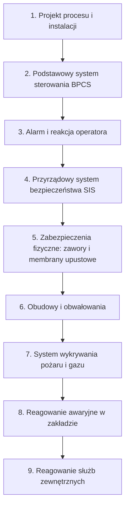

import { SlideContainer, Slide, InstructorNotes, LearningObjective } from '@site/src/components/SlideComponents';

<LearningObjective>

Student odróżnia funkcje monitoringu od funkcji ochronnych, sprawdza, czy dana warstwa spełnia kryteria niezależnej warstwy ochrony, i analizuje awarię warstwa po warstwie.

</LearningObjective>

<SlideContainer>

<Slide title="Monitoring a funkcja ochronna" type="info">

**Funkcja ochronna** działa samoczynnie (albo przez określoną, przećwiczoną reakcję człowieka) i doprowadza instalację do stanu bezpiecznego. **Monitoring** dostarcza informacji człowiekowi, który dopiero decyduje, co zrobić.

| Cecha | Warstwa ochrony | Monitoring |
|---|---|---|
| Działanie | samoczynne albo określona, przećwiczona reakcja człowieka | informacja dla człowieka |
| Czas reakcji | zdefiniowany, krótszy niż czas do wystąpienia szkody | godziny, dni, tygodnie |
| Niezależność | od przyczyny zdarzenia i od innych warstw | często wspólny sprzęt i sieć ze sterowaniem |
| Weryfikacja | testy okresowe, cel PFD lub SIL | zwykle brak celu niezawodności |
| Zaliczenie w LOPA | tak, jeśli spełnia kryteria IPL | nie; wspiera inne warstwy |

- Skróty: PFD (Probability of Failure on Demand — prawdopodobieństwo niezadziałania na żądanie); SIL (Safety Integrity Level — poziom nienaruszalności bezpieczeństwa); LOPA (Layer of Protection Analysis — analiza warstw ochrony, W2); IPL (Independent Protection Layer — niezależna warstwa ochrony).
- IEC 61511-1:2016 (3.2.3): **BPCS** (Basic Process Control System — podstawowy system sterowania procesem) steruje procesem, ale nie realizuje żadnej SIF (Safety Instrumented Function — przyrządowa funkcja bezpieczeństwa). Według uwagi 2 do tej definicji BPCS zwykle może realizować różne funkcje, np. sterowanie procesem, **monitoring i alarmy**.
- DNV o certyfikacji CMS (Condition Monitoring System — system monitorowania stanu) turbin wiatrowych: CMS nie zastępuje niezależnych systemów bezpieczeństwa i nie może ingerować w system bezpieczeństwa ani sterowania turbiny.

Źródło: [IEC 61511-1:2016, próbka normy](https://cdn.standards.iteh.ai/samples/20175/f68c8f8865b14e3c8f453f4e8bc8070d/IEC-61511-1-2016.pdf); [DNV-SE-0439](https://www.dnv.com/energy/standards-guidelines/dnv-se-0439-certification-of-condition-monitoring/); tabela: zestawienie własne na podstawie [SAFEChE, samouczek LOPA](https://safeche.engin.umich.edu/tutorials/lopa-tutorial) i [HSE RR716, 2009](https://www.hse.gov.uk/research/rrpdf/rr716.pdf)

<InstructorNotes>

Czas: ~2,5 min

To rozróżnienie jest osią całego przedmiotu, który nie przypadkiem nazywa się „Systemy bezpieczeństwa i monitorowania”. Oba elementy są potrzebne, ale pełnią inne role. Funkcja ochronna działa sama, w określonym czasie, i jest regularnie testowana. Monitoring pokazuje stan instalacji i czeka, aż ktoś zareaguje. Norma o przyrządowych systemach bezpieczeństwa wymienia monitoring i alarmy wśród funkcji, które zwykle może realizować podstawowy system sterowania. DNV przy certyfikacji monitorowania stanu turbin zastrzega, że taki system nie zastępuje systemów bezpieczeństwa.

Pytanie do sali: czy czujnik temperatury w kontenerze magazynu energii to monitoring, czy zabezpieczenie? Zależy od drogi sygnału. Jeśli trafia tylko na ekran, jest monitoringiem. Jeśli samoczynnie odłącza baterię i jest testowany, może być częścią funkcji ochronnej. Typowe nieporozumienie: „skoro widzimy alarm, to jesteśmy chronieni”.

</InstructorNotes>

</Slide>

<Slide title="Warstwy ochrony w modelu cebuli" type="info">

- Kolejność warstw za samouczkiem LOPA SAFEChE (University of Michigan); model cebuli opisuje też CCPS (Center for Chemical Process Safety, 2015). Każda następna warstwa działa, gdy poprzednia zawiedzie.
- **SIS** (Safety Instrumented System — przyrządowy system bezpieczeństwa): czujniki, sterownik bezpieczeństwa i elementy wykonawcze, oddzielone od BPCS. Realizuje **SIF**, czyli funkcje, które po wykryciu stanu niebezpiecznego samoczynnie doprowadzają instalację do stanu bezpiecznego.
- IEC 61511-1:2016 przedstawia typowe warstwy ochrony i środki zmniejszania ryzyka na rysunku 9. Według prezentacji Purdue P2SAC rysunek grupuje je w: sterowanie i monitoring, zapobieganie, ograniczanie skutków, reagowanie awaryjne. **Monitoring należy do grupy sterowania**, razem z BPCS.

Źródło: [SAFEChE, samouczek LOPA](https://safeche.engin.umich.edu/tutorials/lopa-tutorial); [CCPS, 2015](https://ccps.aiche.org/publications/books/guidelines-initiating-events-and-independent-protection-layers-layer-protection-analysis); [IEC 61511-1:2016, próbka normy](https://cdn.standards.iteh.ai/samples/20175/f68c8f8865b14e3c8f453f4e8bc8070d/IEC-61511-1-2016.pdf); [Goteti, Purdue P2SAC, 2020](https://engineering.purdue.edu/P2SAC/presentations/documents/Safety_Life_Cycle_Per_IEC_ISA_61511_1.pdf)

<InstructorNotes>

Czas: ~2,5 min

Model cebuli pochodzi z przemysłu procesowego, ale pasuje do każdej instalacji OZE. Najgłębsza warstwa to sam projekt, na przykład mniejsza ilość substancji niebezpiecznej na miejscu. Dalej są: zwykłe sterowanie, alarm z reakcją operatora, automatyczny system bezpieczeństwa i zabezpieczenia mechaniczne, które działają bez zasilania. Warstwy zewnętrzne już nie zapobiegają zdarzeniu, tylko ograniczają jego skutki: obwałowania, wykrywanie pożaru i gazu, akcja ratownicza.

Spróbujmy przyporządkować warstwy do biogazowni. Warstwą piątą jest zabezpieczenie nad- i podciśnieniowe zbiornika gazu, a dziewiątą straż pożarna. Najważniejsza uwaga: monitoring leży w tej samej grupie co sterowanie. Jeśli zawiesi się sterownik, monitoring często zawiedzie razem z nim. Typowe nieporozumienie: im więcej ekranów w dyspozytorni, tym więcej warstw ochrony.

</InstructorNotes>

</Slide>

<Slide title="Model sera szwajcarskiego" type="warning">

- Reason (2000): każda bariera jest jak plaster sera szwajcarskiego z dziurami, które otwierają się, zamykają i przesuwają.
- Do wypadku dochodzi, gdy dziury w wielu warstwach na chwilę ustawią się w jednej linii.
- **Błędy czynne** to niebezpieczne działania osób, które mają bezpośredni kontakt z systemem. **Uwarunkowania ukryte** to decyzje projektowe i organizacyjne, które tworzą długotrwałe dziury i słabości barier.
- Podejście systemowe: nie zmienimy natury człowieka, ale możemy zmienić warunki, w jakich pracuje.
- Ukryte dziury w instalacjach OZE (ocena własna): wyłączony monitoring, alarmy, na które nikt nie reaguje, łącze SCADA (Supervisory Control and Data Acquisition — system nadzoru i akwizycji danych), które przestało działać bez sygnalizacji.
- Warstwy na wspólnym sterowniku mają dziury skorelowane. W raporcie RR716 brytyjskiego urzędu HSE (Health and Safety Executive) stwierdzono, że wspólny sterownik PLC (Programmable Logic Controller — programowalny sterownik logiczny) dwóch warstw tworzy wspólną przyczynę uszkodzeń i narusza kryterium niezależności.

Źródło: [Reason, BMJ 2000](https://doi.org/10.1136/bmj.320.7237.768); [Reason, 1990](https://doi.org/10.1017/CBO9781139062367); [HSE RR716, 2009](https://www.hse.gov.uk/research/rrpdf/rr716.pdf)

<InstructorNotes>

Czas: ~2 min

Model powstał w badaniach awarii złożonych systemów technicznych (Reason, 1990); w artykule w BMJ z 2000 roku autor zastosował go w medycynie. Żadna bariera nie jest doskonała, każda ma dziury. Do wypadku dochodzi, gdy dziury w kilku barierach ustawią się naraz.

Dla inżyniera najważniejsze są dziury ukryte. To nie błędy popełnione w chwili wypadku, lecz decyzje sprzed miesięcy lub lat: brak procedury, oszczędność na czujniku, jeden sterownik do wszystkiego. Jeśli dwie warstwy korzystają z tego samego sterownika, jego awaria otwiera dziury w obu naraz; wtedy mamy jedną warstwę, a nie dwie.

Pytanie do sali: jaką dziurę tworzy alarm wyłączony na czas serwisu, którego nikt potem nie włączył? Typowe nieporozumienie: „winny jest człowiek, który popełnił błąd”. Reason pokazuje, że błąd człowieka jest zwykle ostatnim ogniwem, a nie przyczyną źródłową.

</InstructorNotes>

</Slide>

<Slide title="Kiedy warstwa jest warstwą ochrony" type="tip">

- Kryteria CCPS: **niezależna warstwa ochrony** (IPL) jest **skuteczna** (zapobiega skutkowi), **niezależna** od zdarzenia inicjującego i od innych warstw oraz **audytowalna** (można ją zwalidować, przetestować i udokumentować).
- Dla BPCS niezaprojektowanego według IEC 61511 norma IEC 61511-1:2016 (rozdz. 9.3) ogranicza przypisywaną mu redukcję ryzyka do **≤ 10**, czyli PFD ≥ 0,1 (wg Derbyshire'a, 2016). Gdy BPCS jest przyczyną zdarzenia, w danym scenariuszu można uznać najwyżej jedną warstwę BPCS.
- **Alarm** to sygnał dźwiękowy lub wizualny, który wskazuje operatorowi nieprawidłowość wymagającą terminowej reakcji (ISA-18.2, wg ISA InTech 2020). Komunikat, który nie wymaga działania, nie jest alarmem.
- Reakcję operatora na alarm można zaliczyć z PFD **nie mniejszym niż 0,1** (redukcja ryzyka najwyżej 10) tylko wtedy, gdy alarm jest niezależny od przyczyny, jest czas na wykrycie, diagnozę i działanie, a procedura jest formalna i audytowalna (HSE RR716; Buncefield Standards Task Group 2007; exida). exida zaleca PFD ≥ 0,5, jeśli system alarmowy nie został zracjonalizowany lub jego działania nie potwierdzono pomiarami.
- HSE (CHIS6): długoterminowa średnia w normalnej pracy to nie więcej niż 1 alarm na 10 min.

**Przykład ilustracyjny — dane umowne.** Dwie niezależne warstwy o PFD 0,1 i 0,01 dają łącznie PFD = 0,1 × 0,01 = 0,001, czyli RRF (Risk Reduction Factor — współczynnik zmniejszenia ryzyka) = 1/0,001 = 1000. Jeśli obie warstwy korzystają z tego samego sterownika, nie są niezależne i mnożenie jest nieuprawnione. Obliczenia LOPA: [W2](../wyklad-02-analiza-ryzyka/index.md).

Źródło: [SAFEChE, samouczek LOPA](https://safeche.engin.umich.edu/tutorials/lopa-tutorial); [Derbyshire, IChemE 2016](https://www.icheme.org/media/11752/hazards-26-paper-15-iec-61511-functional-safety-in-the-process-industry-the-long-awaited-iec-61511-edition-2-and-what-it-means-for-the-process-industry.pdf); [Dunn i Sands, ISA InTech 2020](https://www.isa.org/intech-home/2020/march-april/features/alarm-management-questions-that-everyone-asks); [HSE RR716, 2009](https://www.hse.gov.uk/research/rrpdf/rr716.pdf); [BSTG, 2007](https://www.icheme.org/media/10697/safety-and-environmental-standards-for-fuel-storage-sites.pdf); [Stauffer i Clarke, exida 2012](https://www.exida.com/articles/UsingAlarmsasaLayerofProtection.pdf); [HSE CHIS6, 2000](https://www.hse.gov.uk/pubns/chis6.pdf); obliczenia własne

<InstructorNotes>

Czas: ~2,5 min

Trzy słowa do zapamiętania: skuteczna, niezależna, audytowalna. Jeśli którejkolwiek cechy brakuje, warstwa nie jest warstwą ochrony w sensie analizy ryzyka, nawet jeśli coś robi. Zwykły system sterowania dostaje najwyżej współczynnik dziesięć, bo nie projektuje się go według norm bezpieczeństwa funkcjonalnego i często to on jest przyczyną problemu. Podobnie z operatorem: alarm, na który zostaje pięć sekund, albo alarm tonący w setce innych komunikatów, nie jest warstwą ochrony.

Przykład liczbowy jest umowny i pokazuje tylko zasadę: prawdopodobieństwa mnożymy wyłącznie dla warstw naprawdę niezależnych. Pełne obliczenia zrobimy w W2. Pytanie do sali: co znaczy w praktyce, że 0,1 dla operatora to granica, a nie wartość domyślna? Typowe nieporozumienie: każdy komunikat w SCADA jest alarmem.

</InstructorNotes>

</Slide>

<Slide title="Monitoring i ochrona w technologiach OZE" type="info">

| Technologia | Funkcje monitoringu | Funkcje ochronne |
|---|---|---|
| PV | wydajność (IEC 61724-1:2021), prądy stringów, termowizja (IEC TS 62446-3:2017) | monitorowanie prądu różnicowego w falownikach beztransformatorowych (IEC 62109-2:2011, wg Sandia); detekcja i przerywanie łuku DC (IEC 63027:2023); zabezpieczenie sieciowe z wykrywaniem pracy wyspowej (EN 50549-1:2019+A1:2023) |
| Wiatr | CMS: drgania układu napędowego; SCADA | niezależny system bezpieczeństwa turbiny, np. przy nadmiernej prędkości obrotowej (DNV-ST-0438; W7) |
| BESS | EMS i SCADA, trendy danych z BMS | odłączenie przez BMS po przekroczeniu granic napięcia, prądu lub temperatury; detekcja gazu z wentylacją; bariery termiczne |
| Biogaz | napełnienie zbiornika gazu, temperatura i ciśnienie w komorze, praca agregatu | zabezpieczenia nad- i podciśnieniowe komór i zbiorników gazu (TRAS 120, 2.4(7)); detekcja gazu z działaniem automatycznym (IEC 60079-29-0:2025) |

- Skróty: PV — fotowoltaika; BESS (Battery Energy Storage System — bateryjny magazyn energii); BMS (Battery Management System — system zarządzania baterią); EMS (Energy Management System — system zarządzania energią).
- Funkcje ochronne działają lokalnie, w milisekundach lub sekundach, i są częścią wyrobu albo instalacji. Monitoring działa w skali godzin do miesięcy i wymaga decyzji człowieka (ocena własna).
- Projekt nowych warunków technicznych dla budynków (WT; **projekt** z 6.08.2026, § 311 i § 315) zapisuje ten podział: BMS lub inne środki ochrony mają stale monitorować napięcie, prąd i temperaturę, ale też same awaryjnie odłączać baterię; w pomieszczeniu, w którym gaz może się wydzielać podczas normalnej pracy, urządzenie wykrywające atmosferę wybuchową ma alarmować, sterować wentylacją i odłączać baterie. Stan prawny: wrzesień 2026, projekt nie jest obowiązującym prawem.

Źródło: [IEC 61724-1:2021](https://webstore.iec.ch/en/publication/65561); [IEC TS 62446-3:2017](https://webstore.iec.ch/en/publication/28628); [Flicker i in., Sandia 2014](https://www.osti.gov/servlets/purl/1313068); [IEC 62109-2:2011](https://webstore.iec.ch/en/publication/6471); [IEC 63027:2023](https://webstore.iec.ch/en/publication/27362); [EN 50549-1:2019, próbka](https://cdn.standards.iteh.ai/samples/63319/b79e8a132ea843cd83cd14550c14978a/SIST-EN-50549-1-2019.pdf); [EVS, EN 50549-1:2019+A1:2023](https://www.evs.ee/en/evs-en-50549-1-2019-a1-2023); [DNV-SE-0439](https://www.dnv.com/energy/standards-guidelines/dnv-se-0439-certification-of-condition-monitoring/); [DNV-ST-0438](https://www.dnv.com/energy/standards-guidelines/dnv-st-0438-control-and-protection-systems-for-wind-turbines/); [DNV GL, 2020](https://www.aps.com/-/media/APS/APSCOM-PDFs/About/Our-Company/Newsroom/McMickenFinalTechnicalReport.pdf?la=en&sc_lang=en&hash=5447FA391CD988DD24226FA485F81F23); [KAS, TRAS 120](https://www.kas-bmu.de/files/publikationen/TRAS/TRAS%20(endgueltige%20Fassung)/LesefassTRAS120.pdf); [IEC 60079-29-0:2025](https://webstore.iec.ch/en/publication/77173); [RCL, projekt 12412604](https://legislacja.gov.pl/projekt/12412604)

<InstructorNotes>

Czas: ~2,5 min

Proszę czytać tę tabelę kolumnami. W lewej są funkcje, które pokazują stan: wydajność, drgania, trendy. W prawej są funkcje, które same działają: falownik odłącza się przy prądzie upływu, detektor przerywa łuk, BMS odłącza baterię, zabezpieczenie nadciśnieniowe upuszcza nadmiar gazu. Tę samą wielkość fizyczną można mierzyć w obu kolumnach. Temperatura ogniwa w BMS może wyłączyć baterię, a ta sama temperatura na wykresie w SCADA jest tylko informacją. O przynależności decyduje droga sygnału i sposób zaprojektowania, a nie czujnik.

Szczegóły każdej technologii omówimy w W6, W7, W8 i W9. Typowe nieporozumienie: „termowizja chroni instalację PV przed pożarem”. Termowizja pozwala znaleźć gorące złącze, zanim się zapali; ochrona pojawia się dopiero wtedy, gdy ktoś to złącze wymieni.

</InstructorNotes>

</Slide>

<Slide title="Ćwiczenie: monitoring czy warstwa ochrony" type="tip">

Dla każdego przypadku sprawdźcie trzy kryteria IPL: czy działanie jest **skuteczne** (zdąży i zatrzyma scenariusz), czy jest **niezależne** od przyczyny i od innych warstw, czy jest **audytowalne** (da się je przetestować i udokumentować). Wynik: monitoring, funkcja ochronna czy niezależna warstwa ochrony?

1. SMS z systemu SCADA farmy PV do dyżurnego.
2. BMS otwierający styczniki przy przekroczeniu temperatury.
3. Roczna termowizja dachu z modułami PV.
4. Mechaniczne zabezpieczenie nad- i podciśnieniowe zbiornika biogazu.
5. CMS drgań przekładni turbiny wiatrowej.
6. Detektor gazu w kontenerze BESS, który uruchamia wentylację i odłącza baterie.

Źródło: kryteria IPL — [SAFEChE, samouczek LOPA](https://safeche.engin.umich.edu/tutorials/lopa-tutorial); przypadki — opracowanie własne

<InstructorNotes>

Czas: ~2 min

Dwie minuty pracy w parach. Odpowiedzi to ocena własna według kryteriów CCPS. SMS: monitoring, bo wspólne łącze ze sterowaniem, nieokreślony czas reakcji, brak testów. BMS: funkcja ochronna; warstwą ochrony może być, jeśli jest niezależny od przyczyny i testowany, ale zwarcia wewnątrz ogniwa nie zatrzyma. Termowizja: monitoring, który zmniejsza częstość zdarzeń, lecz nie działa w chwili zdarzenia. Zabezpieczenie nad- i podciśnieniowe: klasyczna warstwa ochrony, działa bez zasilania i sterowania, jeśli jest utrzymywane. CMS: monitoring; DNV wprost to zastrzega. Detektor gazu: kandydat na warstwę ochrony, jeśli nie zależy od sterownika, który może być przyczyną, zdąży przed nagromadzeniem gazu i jest testowany. Typowe nieporozumienie: „BMS to tylko monitoring, bo mierzy”.

</InstructorNotes>

</Slide>

<Slide title="McMicken 2019 warstwa po warstwie" type="danger">

| Warstwa | Stan w McMicken | Skutek |
|---|---|---|
| Jakość ogniwa | wada wewnętrzna: osadzanie litu i dendryty (wg DNV GL) | początek procesu w jednym ogniwie |
| BMS i ochrona | 16:54:30 zapis spadku napięcia ogniwa z 4,06 do 3,82 V; ok. 16:55:20 otwarcie wyłączników DC i styczników AC | odłączenie nie zatrzymało zwarcia wewnętrznego w ogniwie |
| Bariery termiczne | brak | propagacja w całym stojaku |
| Gaszenie (Novec 1230) | zadziałało zgodnie z projektem | nie zatrzymało procesu |
| Detekcja gazu i wentylacja | brak możliwości wentylacji gazów (DNV GL); brak ciągłego monitorowania gazów z odczytem zdalnym (UL FSRI) | nagromadzenie palnych gazów |
| Plan reagowania | brak procedury gaszenia, wentylacji i wejścia | otwarcie drzwi po ok. 3 h, deflagracja, 4 strażaków ciężko rannych |

- DNV GL wymienia pięć czynników: awaria wewnętrzna ogniwa, gaszenie niezdolne zatrzymać proces, brak barier termicznych, gazy bez możliwości wentylacji, plan awaryjny bez procedur gaszenia, wentylacji i wejścia. To dziury ustawione w jednej linii.
- Monitoring i odłączenie zadziałały, ale ani pomiar, ani odłączenie nie zatrzymują zwarcia wewnętrznego w ogniwie; dane BMS posłużyły do analizy po zdarzeniu.
- Raporty z dochodzeń nie są zgodne: według UL (2021) raporty DNV GL, instytutu FSRI organizacji UL i firmy Exponent zgadzają się, że rannych spowodował zapłon palnych gazów z baterii, ale różnią się m.in. co do przyczyny źródłowej.

Źródło: [DNV GL, 2020](https://www.aps.com/-/media/APS/APSCOM-PDFs/About/Our-Company/Newsroom/McMickenFinalTechnicalReport.pdf?la=en&sc_lang=en&hash=5447FA391CD988DD24226FA485F81F23); [UL FSRI, 2020](https://fsri.org/research-update/report-four-firefighters-injured-lithium-ion-battery-energy-storage-system); [UL, 2021](https://collateral-library-production.s3.amazonaws.com/uploads/asset_file/attachment/31718/Executive_Summary_for_DNVGL_APS_Report_Responses.pdf)

<InstructorNotes>

Czas: ~2,5 min

Rozkładamy McMicken na warstwy. Ogniwo miało wadę wewnętrzną, której nie da się wykryć z zewnątrz. BMS zapisał spadek napięcia, a niecałą minutę później system ochrony odłączył baterię, ale odłączenie nie zatrzymuje zwarcia wewnątrz ogniwa. Barier między ogniwami nie było, więc ciepło przeszło na cały stojak. Środek gazowy gasi płomień, ale nie chłodzi ogniw na tyle, by zatrzymać proces. Bez detekcji gazu i wentylacji gazy się gromadziły, a plan awaryjny nie przewidywał bezpiecznego wejścia.

Podobny wzór widać w Carnegie Road w Liverpoolu 15.09.2020: według [raportu straży pożarnej Merseyside](https://planningregister.cherwell.gov.uk/Document/Download?module=PLA&recordNumber=154109&planId=1951104&imageId=30&isPlan=False&fileName=Appendix+2++-+Liverpool+BESS+Significant+Investigation+Report+(1).pdf) wybuch nastąpił przed przybyciem zastępów. Pytanie do sali: którą jedną warstwę dodalibyście, żeby strażacy nie zostali ranni? Uzasadnijcie wybór kryteriami warstwy ochrony.

</InstructorNotes>

</Slide>

<Slide title="Jak monitoring wspiera bezpieczeństwo" type="success">

- **Wczesne ostrzeganie**: termowizja PV służy m.in. konserwacji zapobiegawczej ze względu na bezpieczeństwo pożarowe (IEC TS 62446-3:2017); CMS można uwzględnić w planie przeglądów i konserwacji turbiny (DNV-SE-0439).
- **Dowody sprawności warstw**: zapisy testów sprawdzających i zadziałań pokazują, czy warstwy ochrony mają zakładaną niezawodność. Wydanie 2 IEC 61511 wymaga m.in. testu sprawdzającego po naprawie (wg Derbyshire'a, 2016).
- **Rejestracja sekwencji zdarzeń** (SOE, Sequence of Events): dane BMS z McMicken pozwoliły odtworzyć przebieg awarii co do sekundy.
- **Wskaźniki systemu alarmowego**: IEC 62682:2022 (rozdz. 16) opisuje monitorowanie i ocenę systemu alarmowego, m.in. średnią i szczytową liczbę alarmów na konsolę operatora.
- **Granice**: przy obejściu (ang. bypass) sygnał wejściowy może być odcięty od logiki wyłączającej, a operator nadal widzi pomiar i alarm (IEC 61511-1:2016, 3.2.4, uwaga 1). „Zielony ekran” w SCADA nie dowodzi więc, że zabezpieczenia działają (ocena własna).
- W instalacjach bez stałej obsługi reakcja zdalnego operatora bywa powolna, dlatego główny ciężar spoczywa na automatyce (ocena własna). Ile każda warstwa zmniejsza ryzyko, policzymy w [W2](../wyklad-02-analiza-ryzyka/index.md).

Źródło: [IEC TS 62446-3:2017](https://webstore.iec.ch/en/publication/28628); [DNV-SE-0439](https://www.dnv.com/energy/standards-guidelines/dnv-se-0439-certification-of-condition-monitoring/); [Derbyshire, IChemE 2016](https://www.icheme.org/media/11752/hazards-26-paper-15-iec-61511-functional-safety-in-the-process-industry-the-long-awaited-iec-61511-edition-2-and-what-it-means-for-the-process-industry.pdf); [DNV GL, 2020](https://www.aps.com/-/media/APS/APSCOM-PDFs/About/Our-Company/Newsroom/McMickenFinalTechnicalReport.pdf?la=en&sc_lang=en&hash=5447FA391CD988DD24226FA485F81F23); [IEC 62682:2022, próbka normy](https://cdn.standards.iteh.ai/samples/103485/6f7b44e368fc4f4d93216f716a51771a/IEC-62682-2022.pdf); [IEC 61511-1:2016, próbka normy](https://cdn.standards.iteh.ai/samples/20175/f68c8f8865b14e3c8f453f4e8bc8070d/IEC-61511-1-2016.pdf)

<InstructorNotes>

Czas: ~2,5 min

Po tej części ktoś mógłby uznać, że monitoring jest mało ważny. Tak nie jest: monitoring nie jest warstwą ochrony, ale wspiera wszystkie warstwy. Pozwala wykryć usterkę, zanim stanie się zdarzeniem inicjującym. Dostarcza dowodów, że zabezpieczenia są sprawne. Zapisuje przebieg zdarzeń, dzięki czemu uczymy się na awariach. Mierzy też, czy system alarmowy nie przytłacza operatora. Trzeba jednak znać jego granice: zielony ekran oznacza tylko, że nic nie przyszło, a jeśli łącze padło, ekran też może być zielony.

W kolejnych wykładach, od W3 do W5, zajmiemy się tym, jak zbudować monitoring, któremu można ufać: W3 — architektura i tor pomiarowy, W4 — komunikacja, W5 — jakość danych i alarmy. Pytanie do sali: jak sprawdzić, że brak alarmu nie oznacza zerwanego łącza?

</InstructorNotes>

</Slide>

</SlideContainer>

## Źródła

1. IEC (2016). *IEC 61511-1:2016 Functional safety — Safety instrumented systems for the process industry sector — Part 1*, próbka normy (iTeh). [https://cdn.standards.iteh.ai/samples/20175/f68c8f8865b14e3c8f453f4e8bc8070d/IEC-61511-1-2016.pdf](https://cdn.standards.iteh.ai/samples/20175/f68c8f8865b14e3c8f453f4e8bc8070d/IEC-61511-1-2016.pdf)
2. University of Michigan, SAFEChE (b.d.). *LOPA tutorial* (model warstw ochrony; kryteria IPL według CCPS). [https://safeche.engin.umich.edu/tutorials/lopa-tutorial](https://safeche.engin.umich.edu/tutorials/lopa-tutorial)
3. CCPS (2015). *Guidelines for Initiating Events and Independent Protection Layers in Layer of Protection Analysis*. CCPS/Wiley. [https://ccps.aiche.org/publications/books/guidelines-initiating-events-and-independent-protection-layers-layer-protection-analysis](https://ccps.aiche.org/publications/books/guidelines-initiating-events-and-independent-protection-layers-layer-protection-analysis)
4. Goteti P. (2020). *Safety Life Cycle per IEC/ISA 61511* (prezentacja, Honeywell Process Solutions). Purdue P2SAC. [https://engineering.purdue.edu/P2SAC/presentations/documents/Safety_Life_Cycle_Per_IEC_ISA_61511_1.pdf](https://engineering.purdue.edu/P2SAC/presentations/documents/Safety_Life_Cycle_Per_IEC_ISA_61511_1.pdf)
5. Reason J. (2000). Human error: models and management. *BMJ* 320(7237): 768–770. [https://doi.org/10.1136/bmj.320.7237.768](https://doi.org/10.1136/bmj.320.7237.768)
6. Reason J. (1990). *Human Error*. Cambridge University Press. [https://doi.org/10.1017/CBO9781139062367](https://doi.org/10.1017/CBO9781139062367)
7. Chambers C., Wilday J., Turner S. (2009). *A review of Layers of Protection Analysis (LOPA) analyses of overfill of fuel storage tanks* (RR716). Health and Safety Laboratory dla HSE. [https://www.hse.gov.uk/research/rrpdf/rr716.pdf](https://www.hse.gov.uk/research/rrpdf/rr716.pdf)
8. Derbyshire A.W. (2016). The long awaited IEC 61511 edition 2 and what it means for the process industry. IChemE Symposium Series 161 (Hazards 26). [https://www.icheme.org/media/11752/hazards-26-paper-15-iec-61511-functional-safety-in-the-process-industry-the-long-awaited-iec-61511-edition-2-and-what-it-means-for-the-process-industry.pdf](https://www.icheme.org/media/11752/hazards-26-paper-15-iec-61511-functional-safety-in-the-process-industry-the-long-awaited-iec-61511-edition-2-and-what-it-means-for-the-process-industry.pdf)
9. Dunn D.G., Sands N.P. (2020). Alarm management questions that everyone asks. *ISA InTech*. [https://www.isa.org/intech-home/2020/march-april/features/alarm-management-questions-that-everyone-asks](https://www.isa.org/intech-home/2020/march-april/features/alarm-management-questions-that-everyone-asks)
10. Buncefield Standards Task Group (2007). *Safety and environmental standards for fuel storage sites* (raport końcowy). [https://www.icheme.org/media/10697/safety-and-environmental-standards-for-fuel-storage-sites.pdf](https://www.icheme.org/media/10697/safety-and-environmental-standards-for-fuel-storage-sites.pdf)
11. Stauffer T., Clarke P. (2012). *Using Alarms as a Layer of Protection*. exida. [https://www.exida.com/articles/UsingAlarmsasaLayerofProtection.pdf](https://www.exida.com/articles/UsingAlarmsasaLayerofProtection.pdf)
12. Health and Safety Executive (2000). *Better alarm handling* (Chemicals Information Sheet No 6). [https://www.hse.gov.uk/pubns/chis6.pdf](https://www.hse.gov.uk/pubns/chis6.pdf)
13. IEC (2022). *IEC 62682:2022 Management of alarm systems for the process industries*, próbka normy (iTeh). [https://cdn.standards.iteh.ai/samples/103485/6f7b44e368fc4f4d93216f716a51771a/IEC-62682-2022.pdf](https://cdn.standards.iteh.ai/samples/103485/6f7b44e368fc4f4d93216f716a51771a/IEC-62682-2022.pdf)
14. IEC (2021). *IEC 61724-1:2021 Photovoltaic system performance — Part 1: Monitoring*. [https://webstore.iec.ch/en/publication/65561](https://webstore.iec.ch/en/publication/65561)
15. IEC (2017). *IEC TS 62446-3:2017 Photovoltaic modules and plants — Outdoor infrared thermography*. [https://webstore.iec.ch/en/publication/28628](https://webstore.iec.ch/en/publication/28628)
16. Flicker J., Armijo K., Johnson J. (2014). *Recommendations for RCD Ground Fault Detector Trip Thresholds* (SAND2014-17754C). Sandia National Laboratories. [https://www.osti.gov/servlets/purl/1313068](https://www.osti.gov/servlets/purl/1313068)
17. IEC (2011). *IEC 62109-2:2011 Safety of power converters for use in photovoltaic power systems — Part 2: Particular requirements for inverters*. [https://webstore.iec.ch/en/publication/6471](https://webstore.iec.ch/en/publication/6471)
18. IEC (2023). *IEC 63027:2023 Photovoltaic power systems — DC arc detection and interruption*. [https://webstore.iec.ch/en/publication/27362](https://webstore.iec.ch/en/publication/27362)
19. CENELEC (2019, zm. A1:2023). *EN 50549-1:2019+A1:2023 Requirements for generating plants to be connected in parallel with distribution networks — Part 1: Connection to a LV distribution network — Generating plants up to and including Type B*. Wersja skonsolidowana: [https://www.evs.ee/en/evs-en-50549-1-2019-a1-2023](https://www.evs.ee/en/evs-en-50549-1-2019-a1-2023); próbka wyd. 2019 (SIST): [https://cdn.standards.iteh.ai/samples/63319/b79e8a132ea843cd83cd14550c14978a/SIST-EN-50549-1-2019.pdf](https://cdn.standards.iteh.ai/samples/63319/b79e8a132ea843cd83cd14550c14978a/SIST-EN-50549-1-2019.pdf)
20. DNV (2016, zm. 2021). *DNV-SE-0439 Certification of condition monitoring*. [https://www.dnv.com/energy/standards-guidelines/dnv-se-0439-certification-of-condition-monitoring/](https://www.dnv.com/energy/standards-guidelines/dnv-se-0439-certification-of-condition-monitoring/)
21. DNV (2016, zm. 2021). *DNV-ST-0438 Control and protection systems for wind turbines*. [https://www.dnv.com/energy/standards-guidelines/dnv-st-0438-control-and-protection-systems-for-wind-turbines/](https://www.dnv.com/energy/standards-guidelines/dnv-st-0438-control-and-protection-systems-for-wind-turbines/)
22. Kommission für Anlagensicherheit (2019). *TRAS 120 — Sicherheitstechnische Anforderungen an Biogasanlagen* (Lesefassung). [https://www.kas-bmu.de/files/publikationen/TRAS/TRAS%20(endgueltige%20Fassung)/LesefassTRAS120.pdf](https://www.kas-bmu.de/files/publikationen/TRAS/TRAS%20(endgueltige%20Fassung)/LesefassTRAS120.pdf)
23. IEC (2025). *IEC 60079-29-0:2025 Explosive atmospheres — Part 29-0: Gas detection equipment — General requirements and test methods*. [https://webstore.iec.ch/en/publication/77173](https://webstore.iec.ch/en/publication/77173)
24. Minister Finansów i Gospodarki (2026). *Projekt rozporządzenia w sprawie warunków technicznych, jakim powinny odpowiadać budynki i ich usytuowanie* (projekt z 6.08.2026, nr 12412604). Rządowe Centrum Legislacji. [https://legislacja.gov.pl/projekt/12412604](https://legislacja.gov.pl/projekt/12412604); tekst projektu: [https://legislacja.gov.pl/docs//582/12412604/13216444/dokument791486.docx](https://legislacja.gov.pl/docs//582/12412604/13216444/dokument791486.docx)
25. Hill D.M. (DNV GL) (2020). *McMicken Battery Energy Storage System Event — Technical Analysis and Recommendations*, dok. 10209302-HOU-R-01. APS. [https://www.aps.com/-/media/APS/APSCOM-PDFs/About/Our-Company/Newsroom/McMickenFinalTechnicalReport.pdf?la=en&sc_lang=en&hash=5447FA391CD988DD24226FA485F81F23](https://www.aps.com/-/media/APS/APSCOM-PDFs/About/Our-Company/Newsroom/McMickenFinalTechnicalReport.pdf?la=en&sc_lang=en&hash=5447FA391CD988DD24226FA485F81F23)
26. UL FSRI (2020). *Four Firefighters Injured In Lithium-Ion Battery Energy Storage System Explosion — Arizona*. [https://fsri.org/research-update/report-four-firefighters-injured-lithium-ion-battery-energy-storage-system](https://fsri.org/research-update/report-four-firefighters-injured-lithium-ion-battery-energy-storage-system)
27. UL LLC (2021). *Executive Summary of the Underwriters Laboratories and UL Responses on Battery Energy Storage System Incidents and Safety*. [https://collateral-library-production.s3.amazonaws.com/uploads/asset_file/attachment/31718/Executive_Summary_for_DNVGL_APS_Report_Responses.pdf](https://collateral-library-production.s3.amazonaws.com/uploads/asset_file/attachment/31718/Executive_Summary_for_DNVGL_APS_Report_Responses.pdf)
28. Merseyside Fire and Rescue Service (2021). *Significant Incident Report, Incident 018965 – 15092020* (Carnegie Road, Liverpool), wersja 1.2; załącznik 2 w rejestrze planistycznym Cherwell District Council. [https://planningregister.cherwell.gov.uk/Document/Download?module=PLA&recordNumber=154109&planId=1951104&imageId=30&isPlan=False&fileName=Appendix+2++-+Liverpool+BESS+Significant+Investigation+Report+(1).pdf](https://planningregister.cherwell.gov.uk/Document/Download?module=PLA&recordNumber=154109&planId=1951104&imageId=30&isPlan=False&fileName=Appendix+2++-+Liverpool+BESS+Significant+Investigation+Report+(1).pdf)
