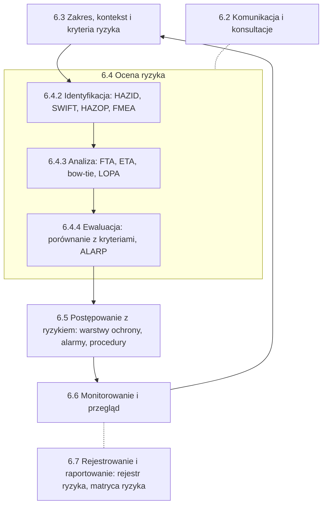

import { SlideContainer, Slide, InstructorNotes, LearningObjective } from '@site/src/components/SlideComponents';

<LearningObjective>

Student umieszcza metody analizy ryzyka w procesie ISO 31000:2018, dobiera je według IEC 31010:2019, wskazuje podstawę oceny ryzyka zawodowego w polskim prawie pracy oraz wyjaśnia, skąd biorą się kryteria tolerowalności ryzyka i jakie ograniczenia ma matryca ryzyka.

</LearningObjective>

<SlideContainer>

<Slide title="Od opisu zagrożeń do analizy ryzyka" type="info">

- Przypomnienie z W1: scenariusz to łańcuch **zagrożenie → sytuacja zagrożenia → zdarzenie niebezpieczne → szkoda** (definicje: [W1, część 2](../wyklad-01-zagrozenia-ramy-prawne/02-pojecia-podstawowe.mdx)). Między przyczyną a szkodą stoją warstwy ochrony, a o ich zaliczeniu decydują kryteria IPL (Independent Protection Layer — niezależna warstwa ochrony): [W1, część 5](../wyklad-01-zagrozenia-ramy-prawne/05-monitoring-a-warstwy-ochrony.mdx).
- Trzy pytania na dziś: **jakie scenariusze** są możliwe, **jak często i z jakim skutkiem** wystąpią oraz **ile warstw ochrony i jakiej jakości** potrzeba.

| Ogniwo scenariusza | Metoda, która na nie patrzy | Część |
|---|---|---|
| zagrożenia obiektu i jego otoczenia | HAZID, SWIFT | [2](./02-hazid-i-hazop.mdx) |
| odchylenia od zamierzenia projektowego | HAZOP | [2](./02-hazid-i-hazop.mdx) |
| uszkodzenia urządzeń i ich skutki | FMEA, FMECA | [3](./03-fmea-i-fmeca.mdx) |
| częstość zdarzenia niebezpiecznego | FTA | [4](./04-fta-eta-i-bow-tie.mdx) |
| przebieg po zdarzeniu i bariery | ETA, bow-tie | [4](./04-fta-eta-i-bow-tie.mdx) |
| warstwy ochrony i wymagana niezawodność | LOPA, SIL | [5](./05-lopa-i-sil.mdx) |

- Przyporządkowanie metod do ogniw to ujęcie dydaktyczne (ocena własna); w praktyce metody się zazębiają.
- Skróty: HAZID (Hazard Identification — identyfikacja zagrożeń); SWIFT (Structured What-If Technique — ustrukturyzowana technika „co, jeśli”); HAZOP (Hazard and Operability Study — badanie zagrożeń i zdolności do działania); FMEA (Failure Modes and Effects Analysis — analiza rodzajów i skutków uszkodzeń); FMECA (Failure Modes, Effects and Criticality Analysis — analiza rodzajów, skutków i krytyczności uszkodzeń); FTA (Fault Tree Analysis — analiza drzewa niezdatności); ETA (Event Tree Analysis — analiza drzewa zdarzeń); bow-tie (analiza muszki, ang. bow-tie); LOPA (Layer of Protection Analysis — analiza warstw ochrony); SIL (Safety Integrity Level — poziom nienaruszalności bezpieczeństwa).

Źródło: pojęcia — [W1, część 2](../wyklad-01-zagrozenia-ramy-prawne/02-pojecia-podstawowe.mdx); warstwy ochrony — [W1, część 5](../wyklad-01-zagrozenia-ramy-prawne/05-monitoring-a-warstwy-ochrony.mdx); przyporządkowanie metod — ocena własna na podstawie [IEC 31010:2019, podgląd ASSP](https://www.assp.org/docs/default-source/standards-documents/preview/31010_2019_wms_preview.pdf?sfvrsn=75159747_2)

<InstructorNotes>

Czas: ~2 min

Na pierwszym wykładzie opisaliśmy zagrożenia i nazwaliśmy ogniwa scenariusza. Zapowiedziałem wtedy, że metody analizy ryzyka rozkładają scenariusz właśnie na takie ogniwa, i dziś to pokażę. HAZID i HAZOP szukają zagrożeń i odchyleń. FMEA zaczyna od uszkodzenia jednego urządzenia. Drzewo niezdatności liczy, jak często dochodzi do zdarzenia, a drzewo zdarzeń i bow-tie pokazują, co dzieje się potem. LOPA sprawdza, czy warstwy z modelu cebuli naprawdę wystarczą. Tabela jest moim uporządkowaniem, nie podziałem z normy.

Pytanie do sali: od której metody zaczniecie, jeśli macie tylko plan zagospodarowania terenu przyszłej biogazowni? Typowe nieporozumienie: jedna dobra metoda wystarczy do wszystkiego.

</InstructorNotes>

</Slide>

<Slide title="Proces ISO 31000 i miejsce metod" type="info">

- ISO 31000:2018 (Risk management — Guidelines) to **wytyczne**, które nie podlegają certyfikacji. Rozdział 6 opisuje proces, a jego rdzeniem jest **ocena ryzyka**: identyfikacja ryzyka, analiza ryzyka i ewaluacja ryzyka (6.4).
- **Ewaluacja ryzyka** to porównanie wyników analizy z ustalonymi **kryteriami ryzyka** (6.4.4). Kryteria określa się wcześniej, przy ustalaniu zakresu, kontekstu i kryteriów (6.3.4).
- Metody przypisano według rodzin technik IEC 31010:2019 (zał. B): identyfikacja ryzyka (B.2), analiza zabezpieczeń (B.4), skutki i prawdopodobieństwo (B.5), ocena znaczenia ryzyka (B.8), rejestrowanie i raportowanie (B.10). Zastosowanie technik w krokach procesu ISO 31000 IEC 31010 zestawia w tabl. A.3; uproszczone przypisanie na schemacie to ocena własna.
- Stan normy: ISO 31000:2018 jest aktualna, ze statusem „do rewizji”; wydanie 3 jest na etapie projektu komitetu (ISO/CD 31000, konsultacje zamknięte 1.03.2026).

Źródło: [ISO 31000:2018, podgląd ANSI](https://webstore.ansi.org/preview-pages/ISO/preview_ISO+31000-2018.pdf); [ISO, ISO 31000:2018](https://www.iso.org/standard/65694.html); [ISO, ISO/CD 31000](https://www.iso.org/standard/88574.html); [IEC 31010:2019, podgląd ASSP](https://www.assp.org/docs/default-source/standards-documents/preview/31010_2019_wms_preview.pdf?sfvrsn=75159747_2)

<InstructorNotes>

Czas: ~2,5 min

Ten schemat jest mapą całego wykładu. Zaczynamy od zakresu i kryteriów: co chronimy i jakie ryzyko uznamy za tolerowane. Kryteriów nie dobiera się po analizie tak, żeby wynik „pasował”. Potem identyfikujemy zagrożenia, analizujemy scenariusze, porównujemy wynik z kryteriami i decydujemy o postępowaniu. Dla inżyniera oznacza to konkretne rzeczy: dodatkową funkcję bezpieczeństwa, alarm albo procedurę. Pętla monitorowania i przeglądu mówi, że analiza nie kończy się na odbiorze instalacji. Zarządzanie zmianą i badanie zdarzeń zamykają pętlę i wracają do analizy ryzyka — w W10.

Typowe nieporozumienie: HAZOP „daje ryzyko”. HAZOP identyfikuje scenariusze, a liczby pojawiają się dopiero w analizie. Pytanie do sali: w którym kroku procesu powstaje lista alarmów?

</InstructorNotes>

</Slide>

<Slide title="Dobór metody według IEC 31010" type="tip">

- IEC 31010:2019 (wyd. 2.0) podaje wytyczne doboru i stosowania technik oceny ryzyka w wielu różnych sytuacjach (rozdz. 1). Techniki grupuje według zastosowania, a dobór opisuje rozdział 7 z tablicami A.1 (cechy technik) i A.2 (techniki i ich orientacyjne cechy). Wydanie z 2019 r. jest aktualne.
- HAZID nie jest osobną pozycją IEC 31010; identyfikację zagrożeń na kolejnych etapach projektu opisuje ISO 17776:2016 (potwierdzona w 2022 r.).

| Metoda | Rodzina wg IEC 31010 | Typowy etap | Pytanie, na które odpowiada |
|---|---|---|---|
| HAZID, SWIFT | identyfikacja ryzyka (SWIFT: B.2.6) | koncepcja | Jakie zagrożenia dotyczą obiektu i otoczenia? |
| HAZOP | identyfikacja ryzyka (B.2.4) | projekt szczegółowy, procedury | Jakie odchylenia są możliwe i co je zatrzyma? |
| FMEA, FMECA | identyfikacja ryzyka (B.2.3) | projekt urządzenia, eksploatacja | Jak może się uszkodzić element i co z tego wynika? |
| FTA, ETA | skutki i prawdopodobieństwo (B.5.7, B.5.6) | projekt, badanie zdarzeń | Jakie kombinacje przyczyn i skutków, jak często? |
| bow-tie, LOPA | analiza zabezpieczeń (B.4.2, B.4.4) | projekt, przegląd zabezpieczeń | Czy bariery wystarczą i czy są niezależne? |

- Kolumny „typowy etap” i „pytanie” to zestawienie dydaktyczne (ocena własna); tablice A.1 i A.2 normy stosują własne kryteria doboru.
- HAZOP wymaga dość szczegółowego opisu systemu (IEC 61882:2016, 5.3); na etapie koncepcji takiego opisu zwykle jeszcze nie ma, więc zaczyna się od HAZID (ocena własna).

Źródło: [IEC 31010:2019, podgląd ASSP](https://www.assp.org/docs/default-source/standards-documents/preview/31010_2019_wms_preview.pdf?sfvrsn=75159747_2); [IEC, IEC 31010:2019](https://webstore.iec.ch/en/publication/59809); [ISO, ISO 17776:2016](https://www.iso.org/standard/63062.html); [IEC 61882:2016, podgląd](https://www.en-standard.eu/publicdoc/iec_previews/121973.pdf)

<InstructorNotes>

Czas: ~2 min

Ta tabela to ściąga na cały semestr. Dobór metody zaczyna się od pytania, a nie od mody. Na etapie koncepcji farmy wiatrowej nie ma schematów, więc HAZOP nie ma na czym pracować; robimy HAZID z listą kontrolną. Gdy są schematy technologiczne biogazowni, HAZOP przechodzi węzeł po węźle. FMEA pasuje do urządzenia, na przykład falownika albo przekładni. Drzewa stosujemy, gdy trzeba policzyć częstość konkretnego zdarzenia, a LOPA, gdy pytamy, czy zabezpieczenia wystarczą.

Proszę zauważyć, że norma zalicza FMEA i HAZOP do technik identyfikacji, a nie analizy. Pytanie do sali: którą metodę wybralibyście dla procedury wymiany łopaty turbiny? Dobra odpowiedź to SWIFT albo HAZOP procedury.

</InstructorNotes>

</Slide>

<Slide title="Ocena ryzyka w polskim prawie" type="info">

- **Kodeks pracy** (t.j. Dz.U. 2026 poz. 1245): pracodawca odpowiada za stan bezpieczeństwa i higieny pracy w zakładzie pracy (art. 207 § 1). Według art. 226 pracodawca „ocenia i dokumentuje ryzyko zawodowe związane z wykonywaną pracą oraz stosuje niezbędne środki profilaktyczne zmniejszające ryzyko” i informuje pracowników o tym ryzyku.
- **Rozporządzenie w sprawie ogólnych przepisów BHP** (MPiPS z 26.09.1997, t.j. Dz.U. 2003 nr 169 poz. 1650 ze zm.), § 2 pkt 7: ryzyko zawodowe to „prawdopodobieństwo wystąpienia niepożądanych zdarzeń związanych z wykonywaną pracą, powodujących straty, w szczególności wystąpienia u pracowników niekorzystnych skutków zdrowotnych w wyniku zagrożeń zawodowych występujących w środowisku pracy lub sposobu wykonywania pracy”.
- Tamże § 39a: ocenę przeprowadza się m.in. przy doborze wyposażenia stanowisk, substancji i przy zmianie organizacji pracy (ust. 1); dokumentacja zawiera w szczególności opis stanowiska, wyniki oceny dla każdego czynnika z niezbędnymi środkami profilaktycznymi oraz datę i osoby oceniające (ust. 3).
- Dokument zabezpieczenia przed wybuchem (DZPW) pracodawca sporządza na podstawie oceny ryzyka (rozp. MG z 8.07.2010, § 7); DZPW i progi ZZR/ZDR: [W1, część 3](../wyklad-01-zagrozenia-ramy-prawne/03-ramy-prawne-ue-i-polska.mdx).
- Ani Kodeks pracy, ani rozporządzenie ogólne BHP nie wskazują metody oceny; art. 226 i § 39a nie podają też liczbowych kryteriów ryzyka.
- **PN-N-18002:2011** „Systemy zarządzania bezpieczeństwem i higieną pracy — Ogólne wytyczne do oceny ryzyka zawodowego” to Polska Norma stosowana dobrowolnie; w katalogu PKN jest aktualna. Dla wydania z 2000 r. CIOP-PIB opisuje schemat 3 × 3: trzy stopnie ciężkości następstw i trzy stopnie prawdopodobieństwa dają ryzyko małe, średnie lub duże (wydanie z 2000 r. zalecało skalę trój- albo pięciostopniową).
- Ocena ryzyka zawodowego dotyczy stanowiska pracy, a metody z tego wykładu analizują instalację; wyniki analiz zasilają oba dokumenty (ocena własna).

Stan prawny: wrzesień 2026.

Źródło: [ISAP, Kodeks pracy, t.j. Dz.U. 2026 poz. 1245](https://isap.sejm.gov.pl/isap.nsf/DocDetails.xsp?id=WDU20260001245); [ISAP, rozp. MPiPS z 26.09.1997](https://isap.sejm.gov.pl/isap.nsf/DocDetails.xsp?id=WDU19971290844); [ISAP, t.j. Dz.U. 2003 nr 169 poz. 1650](https://isap.sejm.gov.pl/isap.nsf/DocDetails.xsp?id=WDU20031691650); [ISAP, Dz.U. 2010 nr 138 poz. 931](https://isap.sejm.gov.pl/isap.nsf/DocDetails.xsp?id=WDU20101380931); [PKN, PN-N-18002:2011](https://sklep.pkn.pl/pn-n-18002-2011p.html); [CIOP-PIB](https://archiwum.ciop.pl/22111.html)

<InstructorNotes>

Czas: ~2 min

Jako inżynierowie w Polsce spotkacie się z oceną ryzyka najpierw w prawie pracy. Kodeks pracy nakłada obowiązek oceny i dokumentowania ryzyka zawodowego, a rozporządzenie ogólne BHP mówi, co ma się znaleźć w dokumentacji. Proszę porównać definicję ryzyka zawodowego z definicją z W1. Przepis mówi o prawdopodobieństwie niepożądanych zdarzeń powodujących straty, a W1 łączy prawdopodobieństwo z ciężkością szkody; to moja uwaga, nie treść przepisu. Metody nie narzuca ani Kodeks pracy, ani rozporządzenie ogólne BHP, a norma PN-N-18002 jest dobrowolna.

Ocena na stanowisku pracy i analiza instalacji to dwa różne dokumenty, ale korzystają z tych samych scenariuszy. Pytanie do sali: skąd autor oceny ryzyka na stanowisku operatora biogazowni weźmie scenariusz uwolnienia siarkowodoru?

</InstructorNotes>

</Slide>

<Slide title="Kryteria tolerowalności ryzyka" type="warning">

- Kryteria ryzyka organizacja określa przed oceną ryzyka, na etapie kontekstu (ISO 31000:2018, 6.3.4); ewaluacja porównuje z nimi wynik (6.4.4). Wartości liczbowe może też narzucać regulator (ocena własna).
- HSE R2P2 (2001), pkt 130: ryzyko indywidualne śmierci **10⁻⁶ /rok**, zarówno dla pracowników, jak i dla osób postronnych, HSE stosuje jako **wytyczną** dla granicy między obszarem powszechnie akceptowanym a tolerowanym.
- Pkt 132: dla górnej granicy HSE odwołuje się do swojego dokumentu o tolerowalności ryzyka w elektrowniach jądrowych: **10⁻³ /rok** dla pracowników, a dla osób postronnych o rząd wielkości mniej, **10⁻⁴ /rok**; pkt 133: te granice „rzadko rozstrzygają” (ang. rarely bite).
- Pkt 136: wypadek z co najmniej 50 ofiarami śmiertelnymi w jednym zdarzeniu HSE proponuje uznać za nietolerowany, jeśli jego szacowana częstość przekracza 1/5000 na rok, czyli 2 × 10⁻⁴ /rok.
- Holandia: ryzyko lokalizacyjne 10⁻⁶ /rok to wartość graniczna (niderl. grenswaarde) dla budynków bardzo wrażliwych i wrażliwych oraz miejsc wrażliwych (Bkl, art. 5.7; RIVM, IPLO). Ta sama liczba jest tam wymogiem prawnym, a w R2P2 wytyczną.
- Cel dla jednego scenariusza w LOPA ustala się niżej niż granicę dla osoby, bo ta sama osoba jest narażona także na inne ryzyka. Stanley i in. (2018) przytaczają praktykę obniżania granicy nietolerowanej dla pracowników o rząd wielkości (do 10⁻⁴ /rok) i proponują cel w środku obszaru ALARP, 10⁻⁵ /rok; firmy, które chcą ograniczyć ciężar wykazywania ALARP, mogą przyjąć 10⁻⁶ /rok. Wrócimy do tego w [części 5](./05-lopa-i-sil.mdx).
- Trzy obszary i zasada ALARP: [W1, część 2](../wyklad-01-zagrozenia-ramy-prawne/02-pojecia-podstawowe.mdx).

Źródło: [HSE, R2P2, 2001](https://assets.publishing.service.gov.uk/media/6634988fcf3b5081b14f30cd/IQ8.10.J_Document_9_Health_and_Safety_Executive__Reducing_risks__protecting_people__HSE_s_decision-making_process__2001.pdf); [ISO 31000:2018, podgląd ANSI](https://webstore.ansi.org/preview-pages/ISO/preview_ISO+31000-2018.pdf); [RIVM](https://www.rivm.nl/omgevingsveiligheid/handboek/toelichtingen-kernbegrippen/afstanden-en-gebieden); [IPLO](https://iplo.nl/thema/externe-veiligheid/externe-veiligheid-in-omgevingsplan/plaatsgebonden-risico/); [Stanley i in., 2018](https://www.icheme.org/media/16956/hazards-28-paper-50.pdf); obliczenia własne

<InstructorNotes>

Czas: ~2,5 min

W W1 obiecałem liczby do schematu HSE. Oto one, przeczytane w samym dokumencie R2P2. Proszę zwrócić uwagę na słowa. Wartość jeden na milion rocznie HSE nazywa wytyczną. Górne granice pochodzą z dokumentu o elektrowniach jądrowych, a HSE sam pisze, że rzadko rozstrzygają: częściej decydują względy społeczne, a same granice wyprowadzono dla działalności najtrudniejszych do kontrolowania. HSE podkreśla też, że liczbowe kryteria proponuje tylko dla nielicznych kategorii ryzyka.

Holendrzy tę samą liczbę zapisali w przepisach jako granicę przy budynkach wrażliwych. Czy dla danego obiektu w Polsce istnieją kryteria liczbowe, trzeba sprawdzić w przepisach dla tej kategorii obiektu; w źródłach przejrzanych do tego wykładu takich nie znaleźliśmy. Typowe nieporozumienie: ryzyko poniżej granicy nie wymaga już żadnych działań.

</InstructorNotes>

</Slide>

<Slide title="Matryca ryzyka: budowa" type="info">

**Przykład ilustracyjny — dane umowne.** Matryca 5 × 5 dla skutków dotyczących ludzi; przedziały częstości, kategorie skutków i regułę przypisania kategorii przyjęto dla przykładu.

| Częstość f [1/rok] | C1 | C2 | C3 | C4 | C5 |
|---|---|---|---|---|---|
| F5: f ≥ 10⁻¹ | T | T | N | N | N |
| F4: 10⁻² ≤ f &lt; 10⁻¹ | A | T | T | N | N |
| F3: 10⁻³ ≤ f &lt; 10⁻² | A | A | T | T | N |
| F2: 10⁻⁴ ≤ f &lt; 10⁻³ | A | A | A | T | T |
| F1: f &lt; 10⁻⁴ | A | A | A | A | T |

- Skutki: C1 — pierwsza pomoc; C2 — uraz z absencją; C3 — ciężki trwały uraz; C4 — jedna ofiara śmiertelna; C5 — wiele ofiar śmiertelnych.
- Kategorie: A — akceptowane; T — tolerowane pod warunkiem ALARP; N — nietolerowane. Reguła przykładu: Fi + Cj ≥ 8 → N; 6–7 → T; ≤ 5 → A.
- Zasady budowy (zestawienie własne): logarytmiczne i rozłączne przedziały częstości; osobne skale skutków dla ludzi, środowiska i mienia; granice kategorii skalibrowane względem liczbowych kryteriów tolerowalności (temat pracy Baybutta, 2015).
- Baybutt (2018): matryce są zwodniczo proste, ich projektowanie ma pułapki nawet dla doświadczonych użytkowników, a wobec braku ustalonych norm firmy tworzą własne matryce.
- Ta matryca nie jest skalibrowana do R2P2: komórka F1 × C4 (jedna ofiara śmiertelna przy częstości do 10⁻⁴ /rok) ma kategorię A, choć gdyby ginęła zawsze ta sama osoba, jej ryzyko mogłoby być do 100 razy wyższe od wytycznej 10⁻⁶ /rok (ocena własna).

Źródło: [Baybutt, 2015](https://doi.org/10.1016/j.jlp.2015.09.010); [Baybutt, 2018](https://doi.org/10.1002/prs.11905); [HSE, R2P2, 2001](https://assets.publishing.service.gov.uk/media/6634988fcf3b5081b14f30cd/IQ8.10.J_Document_9_Health_and_Safety_Executive__Reducing_risks__protecting_people__HSE_s_decision-making_process__2001.pdf); obliczenia własne

<InstructorNotes>

Czas: ~2 min

Na osi częstości stosujemy dekady, czyli przedziały logarytmiczne i rozłączne. Kategorie skutków opisujemy słownie i osobno dla ludzi, środowiska i mienia. Kategorie w komórkach to decyzja organizacji; tu przyjąłem regułę sumy indeksów, która odpowiada mnożeniu częstości przez skutek w skali logarytmicznej, o ile kolejne kategorie skutków różnią się o stały czynnik — w przykładzie przyjmujemy to umownie. Wychodzi dziesięć komórek A, dziewięć T i sześć N.

Porównanie z R2P2 wymaga ostrożności: częstość scenariusza to jeszcze nie ryzyko indywidualne, bo trzeba uwzględnić, kto i jak często jest narażony. Mimo to widać, że F1 × C4 w kategorii A jest zbyt łagodne. Pytanie do sali: do której komórki trafi pożar gondoli bez ofiar, ale z utratą turbiny? Do żadnej, bo ta matryca opisuje tylko ludzi.

</InstructorNotes>

</Slide>

<Slide title="Ograniczenia matrycy ryzyka" type="warning">

- IEC 31010:2019 umieszcza matrycę ryzyka (B.10.3, ang. consequence/likelihood matrix) w grupie technik rejestrowania i raportowania (B.10), a nie wśród technik analizy.
- Cox (2008), słaba rozdzielczość: typowa matryca poprawnie i jednoznacznie porównuje tylko niewielką część losowo wybranych par zagrożeń (np. mniej niż 10%) i może nadać tę samą ocenę ilościowo bardzo różnym ryzykom (kompresja zakresu).
- Cox (2008), błędy: matryca może nadać wyższą kategorię ilościowo mniejszemu ryzyku; gdy częstości i skutki są ujemnie skorelowane, bywa „gorsza niż bezużyteczna”.
- Cox (2008): na kategoriach z matrycy nie da się oprzeć skutecznego rozdziału środków na zmniejszanie ryzyka, a kategorii ciężkości nie da się obiektywnie przypisać niepewnym skutkom — różni użytkownicy mogą dać przeciwne oceny tego samego ryzyka.
- Nasza matryca: F2 × C4 i F3 × C4 (jedna ofiara) mają tę samą kategorię T, choć przedziały częstości różnią się o rząd wielkości. F4 × C2 (uraz z absencją) i F2 × C4 (ofiara śmiertelna) też są T: matryca traktuje je jak równoważne, choć szkody są innego rodzaju.
- Baybutt (2016) opisuje możliwe odwrócenie rankingu: wyższe ryzyko może trafić do niższej kategorii, a niższe do wyższej. Cox zaleca używać matryc ostrożnie i z opisem przyjętych ocen.

Źródło: [IEC 31010:2019, podgląd ASSP](https://www.assp.org/docs/default-source/standards-documents/preview/31010_2019_wms_preview.pdf?sfvrsn=75159747_2); [Cox, 2008](https://doi.org/10.1111/j.1539-6924.2008.01030.x); [PubMed 18419665](https://pubmed.ncbi.nlm.nih.gov/18419665/); [Baybutt, 2016](https://doi.org/10.1002/prs.11768); obliczenia własne

<InstructorNotes>

Czas: ~2 min

Cox wykazał, że matryca ma słabą rozdzielczość i może błędnie szeregować ryzyka, a jego wniosek brzmi: używać ostrożnie i opisywać przyjęte oceny. IEC 31010 zalicza matrycę do technik rejestrowania i raportowania. Najważniejsze zjawisko widać w naszym przykładzie: w jednej kategorii lądują ryzyka różniące się o rząd wielkości. Z kolei częsty uraz z absencją i rzadka ofiara śmiertelna mają tę samą kategorię, choć społecznie oceniamy je zupełnie inaczej.

Nie znaczy to, że matrycy nie wolno używać. Wolno, pod warunkiem że jest skalibrowana, a założenia są zapisane. Pytanie do sali: co zrobić, gdy dwie osoby w zespole oceniają ten sam scenariusz na C3 i C5? Typowe nieporozumienie: ryzyko w kategorii A nie wymaga żadnych działań.

</InstructorNotes>

</Slide>

</SlideContainer>

## Źródła

1. ISO (2018). *ISO 31000:2018 Risk management — Guidelines*, podgląd. ANSI Webstore. [https://webstore.ansi.org/preview-pages/ISO/preview_ISO+31000-2018.pdf](https://webstore.ansi.org/preview-pages/ISO/preview_ISO+31000-2018.pdf)
2. ISO (2018). *ISO 31000:2018 Risk management — Guidelines* — karta normy (status: do rewizji). [https://www.iso.org/standard/65694.html](https://www.iso.org/standard/65694.html)
3. ISO (2026). *ISO/CD 31000 Risk management — Guidelines* (projekt wyd. 3). [https://www.iso.org/standard/88574.html](https://www.iso.org/standard/88574.html)
4. IEC/ISO (2019). *IEC 31010:2019 Risk management — Risk assessment techniques*, wyd. 2.0. [https://webstore.iec.ch/en/publication/59809](https://webstore.iec.ch/en/publication/59809); podgląd (ASSP): [https://www.assp.org/docs/default-source/standards-documents/preview/31010_2019_wms_preview.pdf?sfvrsn=75159747_2](https://www.assp.org/docs/default-source/standards-documents/preview/31010_2019_wms_preview.pdf?sfvrsn=75159747_2)
5. ISO (2016). *ISO 17776:2016 Petroleum and natural gas industries — Offshore production installations — Major accident hazard management during the design of new installations*, wyd. 2. [https://www.iso.org/standard/63062.html](https://www.iso.org/standard/63062.html)
6. IEC (2016). *IEC 61882:2016 Hazard and operability studies (HAZOP studies) — Application guide*, podgląd. [https://www.en-standard.eu/publicdoc/iec_previews/121973.pdf](https://www.en-standard.eu/publicdoc/iec_previews/121973.pdf)
7. Marszałek Sejmu RP (2026). *Obwieszczenie z 1.09.2026 w sprawie ogłoszenia jednolitego tekstu ustawy — Kodeks pracy*, Dz.U. 2026 poz. 1245. ISAP. [https://isap.sejm.gov.pl/isap.nsf/DocDetails.xsp?id=WDU20260001245](https://isap.sejm.gov.pl/isap.nsf/DocDetails.xsp?id=WDU20260001245)
8. Minister Pracy i Polityki Socjalnej (1997). *Rozporządzenie z 26.09.1997 w sprawie ogólnych przepisów bezpieczeństwa i higieny pracy*, t.j. Dz.U. 2003 nr 169 poz. 1650 ze zm. ISAP. [https://isap.sejm.gov.pl/isap.nsf/DocDetails.xsp?id=WDU20031691650](https://isap.sejm.gov.pl/isap.nsf/DocDetails.xsp?id=WDU20031691650); akt podstawowy: [https://isap.sejm.gov.pl/isap.nsf/DocDetails.xsp?id=WDU19971290844](https://isap.sejm.gov.pl/isap.nsf/DocDetails.xsp?id=WDU19971290844)
9. Minister Gospodarki (2010). *Rozporządzenie z 8.07.2010 w sprawie minimalnych wymagań, dotyczących bezpieczeństwa i higieny pracy, związanych z możliwością wystąpienia w miejscu pracy atmosfery wybuchowej*, Dz.U. 2010 nr 138 poz. 931. ISAP. [https://isap.sejm.gov.pl/isap.nsf/DocDetails.xsp?id=WDU20101380931](https://isap.sejm.gov.pl/isap.nsf/DocDetails.xsp?id=WDU20101380931)
10. PKN (2011). *PN-N-18002:2011 Systemy zarządzania bezpieczeństwem i higieną pracy — Ogólne wytyczne do oceny ryzyka zawodowego*. Sklep PKN. [https://sklep.pkn.pl/pn-n-18002-2011p.html](https://sklep.pkn.pl/pn-n-18002-2011p.html)
11. CIOP-PIB (b.d.). *Jak oszacować ryzyko zawodowe związane ze zidentyfikowanymi zagrożeniami?* (schemat wg PN-N-18002:2000). [https://archiwum.ciop.pl/22111.html](https://archiwum.ciop.pl/22111.html)
12. Health and Safety Executive (2001). *Reducing risks, protecting people: HSE's decision-making process* (R2P2). HSE Books; kopia dokumentu HSE udostępniona na GOV.UK. [https://assets.publishing.service.gov.uk/media/6634988fcf3b5081b14f30cd/IQ8.10.J_Document_9_Health_and_Safety_Executive__Reducing_risks__protecting_people__HSE_s_decision-making_process__2001.pdf](https://assets.publishing.service.gov.uk/media/6634988fcf3b5081b14f30cd/IQ8.10.J_Document_9_Health_and_Safety_Executive__Reducing_risks__protecting_people__HSE_s_decision-making_process__2001.pdf)
13. RIVM (b.d.). *Handboek Omgevingsveiligheid — Afstanden en gebieden*. [https://www.rivm.nl/omgevingsveiligheid/handboek/toelichtingen-kernbegrippen/afstanden-en-gebieden](https://www.rivm.nl/omgevingsveiligheid/handboek/toelichtingen-kernbegrippen/afstanden-en-gebieden)
14. IPLO (b.d.). *Plaatsgebonden risico in het omgevingsplan*. [https://iplo.nl/thema/externe-veiligheid/externe-veiligheid-in-omgevingsplan/plaatsgebonden-risico/](https://iplo.nl/thema/externe-veiligheid/externe-veiligheid-in-omgevingsplan/plaatsgebonden-risico/)
15. Stanley A., Nicholls C., Burnup B., Smith J. (2018). Risk tolerability targets; misconceived, misunderstood and misapplied. IChemE Symposium Series 163 (Hazards 28). [https://www.icheme.org/media/16956/hazards-28-paper-50.pdf](https://www.icheme.org/media/16956/hazards-28-paper-50.pdf)
16. Cox L.A. Jr. (2008). What's wrong with risk matrices? *Risk Analysis* 28(2): 497–512. [https://doi.org/10.1111/j.1539-6924.2008.01030.x](https://doi.org/10.1111/j.1539-6924.2008.01030.x); streszczenie (PubMed): [https://pubmed.ncbi.nlm.nih.gov/18419665/](https://pubmed.ncbi.nlm.nih.gov/18419665/)
17. Baybutt P. (2015). Calibration of risk matrices for process safety. *Journal of Loss Prevention in the Process Industries*. [https://doi.org/10.1016/j.jlp.2015.09.010](https://doi.org/10.1016/j.jlp.2015.09.010)
18. Baybutt P. (2016). Designing risk matrices to avoid risk ranking reversal errors. *Process Safety Progress* 35(1): 41–46. [https://doi.org/10.1002/prs.11768](https://doi.org/10.1002/prs.11768)
19. Baybutt P. (2018). Guidelines for designing risk matrices. *Process Safety Progress* 37(1): 49–55. [https://doi.org/10.1002/prs.11905](https://doi.org/10.1002/prs.11905)
