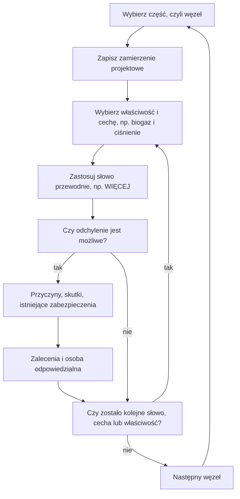

import { SlideContainer, Slide, InstructorNotes, LearningObjective } from '@site/src/components/SlideComponents';

<LearningObjective>

Student odróżnia HAZID od HAZOP, stosuje słowa przewodnie IEC 61882:2016 do węzła instalacji biogazowej i przekłada wyniki badania na wymagania dla alarmów, blokad, procedur i pomiarów.

</LearningObjective>

<SlideContainer>

<Slide title="HAZID i SWIFT na etapie koncepcji" type="info">

- **HAZID** (Hazard Identification — identyfikacja zagrożeń): w praktyce warsztat zespołu na wczesnym etapie projektu, który przy ograniczonej informacji projektowej przegląda cały obiekt i jego otoczenie według kategorii zagrożeń (ujęcie praktyczne, ocena własna).
- ISO 17776:2016 (wyd. 2, potwierdzona w 2022 r.) dotyczy zarządzania zagrożeniami poważnymi awariami przy projektowaniu nowych morskich instalacji wydobywczych ropy i gazu. Przewiduje identyfikację zagrożeń na kolejnych etapach projektu, słowa przewodnie HAZID podaje w zał. F, a dla prostych instalacji wskazuje listy kontrolne oparte na wcześniejszych ocenach ryzyka (4.6).
- Przeniesienie tej logiki na farmę wiatrową, BESS (Battery Energy Storage System — bateryjny magazyn energii) czy biogazownię to interpretacja (ocena własna), a nie zakres normy.
- **SWIFT** (Structured What-If Technique — ustrukturyzowana technika „co, jeśli”): IEC 31010:2019 wymienia ją (B.2.6) wśród technik identyfikacji ryzyka, obok HAZOP (Hazard and Operability Study — badanie zagrożeń i zdolności do działania; B.2.4) i FMEA (Failure Modes and Effects Analysis — analiza rodzajów i skutków uszkodzeń; B.2.3).

Zestawienie dydaktyczne (ocena własna) — przykładowa lista kontrolna:

| Kategoria | Pytanie kontrolne | Przykład z OZE (źródło) |
|---|---|---|
| zagrożenia zewnętrzne | Czy wyładowanie atmosferyczne może zainicjować pożar? | turbiny wiatrowe: wyładowania na pierwszym miejscu wśród przyczyn zapłonu w zestawieniu doniesień prasowych (CWIF), wg Uadiale i in. 2014 |
| substancje palne | Gdzie może powstać mieszanina wybuchowa? | metan: dolna granica wybuchowości (DGW) 4,4% obj., górna (GGW) 17% obj. (IFA GESTIS, dane CHEMSAFE; GisChem); starsze źródła: 5–15% obj. |
| substancje toksyczne | Gdzie może się gromadzić H₂S? | siarkowodór cięższy od powietrza (gęstość względna 1,19); powyżej wartości dopuszczalnej zapach może przestać ostrzegać (ICSC 0165) |
| energia chemiczna | Dokąd trafią gazy uwolnione z ogniw? | BESS McMicken: palne gazy gromadziły się bez możliwości wentylacji (DNV GL 2020) |
| energia elektryczna | Czy w obwodzie prądu stałego (DC) może się utrzymać łuk? | fotowoltaika (PV): detekcja i przerywanie łuku DC (IEC 63027:2023) |
| praca na wysokości | Jak ewakuować poszkodowanego z gondoli? | turbiny: wielokrotne wchodzenie po drabinach w wieży (EU-OSHA 2013) |

- Wynik HAZID to **rejestr zagrożeń**: z niego wybiera się węzły do HAZOP, urządzenia do FMEA i scenariusze do LOPA (Layer of Protection Analysis — analiza warstw ochrony). Wartości dla metanu i siarkowodoru: [W1, część 1](../wyklad-01-zagrozenia-ramy-prawne/01-zagrozenia-w-instalacjach-oze.mdx).

Źródło: [ISO, ISO 17776:2016](https://www.iso.org/standard/63062.html); [ISO 17776:2016, próbka normy](https://cdn.standards.iteh.ai/samples/63062/31506ec1697048de9e86ca03644d2790/ISO-17776-2016.pdf); [IEC 31010:2019, podgląd ASSP](https://www.assp.org/docs/default-source/standards-documents/preview/31010_2019_wms_preview.pdf?sfvrsn=75159747_2); [Uadiale i in., 2014](https://publications.iafss.org/publications/fss/11/983/view/fss_11-983.pdf); [IFA GESTIS, metan](https://gestis.dguv.de/data?name=010000); [GisChem, metan](https://www.gischem.de/download/01_0-000074-82-8-000000_2_1_1255.PDF); [ILO ICSC 0291](https://chemicalsafety.ilo.org/dyn/icsc/showcard.display?p_card_id=0291&p_version=2&p_lang=en); [ILO ICSC 0165](https://chemicalsafety.ilo.org/dyn/icsc/showcard.display?p_card_id=0165&p_version=2&p_lang=en); [DNV GL, 2020](https://www.aps.com/-/media/APS/APSCOM-PDFs/About/Our-Company/Newsroom/McMickenFinalTechnicalReport.pdf?la=en&sc_lang=en&hash=5447FA391CD988DD24226FA485F81F23); [IEC 63027:2023](https://webstore.iec.ch/en/publication/27362); [EU-OSHA, 2013](https://osha.europa.eu/sites/default/files/OSH%20in%20Wind%20energy%20sector.pdf)

<InstructorNotes>

Czas: ~2,5 min

HAZID robimy wtedy, gdy projekt jest na etapie koncepcji i nie ma szczegółowych schematów. Zespół siada nad planem zagospodarowania terenu i pyta kategoria po kategorii: co z zewnątrz może nam zaszkodzić, jakie mamy substancje i energie, kto będzie pracował na obiekcie. ISO 17776 pochodzi z przemysłu naftowego, ale jej myśl jest uniwersalna: identyfikację zagrożeń powtarza się przy wyborze koncepcji, przy jej definiowaniu i w projekcie szczegółowym, to punkty 6.3.2, 7.3.1 i 8.3.2. Dane o pożarach turbin pochodzą z doniesień prasowych, więc traktujemy je jakościowo.

Pytanie do sali: czego brakuje w tej liście dla instalacji PV na dachu? Typowe nieporozumienie: lista kontrolna zastępuje myślenie. Lista to minimum, a zespół dopisuje zagrożenia swojej lokalizacji.

</InstructorNotes>

</Slide>

<Slide title="HAZOP: zamierzenie projektowe i odchylenie" type="info">

- **HAZOP** według IEC 61882:2016 (wyd. 2; jest aktualna) to ustrukturyzowane i systematyczne badanie zespołowe oparte na słowach przewodnich. PN-EN 61882:2016-07 to wersja angielska z polskim tytułem „Badania zagrożeń i zdolności do działania (badania HAZOP) — Przewodnik zastosowań”; polska wersja językowa PN-IEC 61882:2005 została wycofana i zastąpiona.
- **Część** (w praktyce procesowej **węzeł**) to fragment systemu badany w danej chwili. **Zamierzenie projektowe** (3.1.4): pożądany lub określony przez projektanta zakres zachowania właściwości, który zapewnia spełnienie wymagań przez obiekt.
- **Właściwość** (ang. property, 3.1.5; w wydaniu z 2016 r. zastąpiła pojęcie „element”): składnik części, który pozwala rozpoznać jej zasadnicze aspekty (ang. essential features), np. materiał, czynność, urządzenie.
- **Cecha** (ang. characteristic, 3.1.1): wielkość jakościowa lub ilościowa, np. ciśnienie, temperatura, napięcie.
- **Słowo przewodnie** (3.1.6) określa konkretny rodzaj odchylenia od zamierzenia projektowego. **Odchylenie** to odejście od zamierzenia projektowego: odchylenie = słowo przewodnie + cecha, np. WIĘCEJ + ciśnienie biogazu = nadciśnienie.
- Zasada badania (4.2): dla każdej części po kolei zespół bada każdą właściwość pod kątem odchyleń od zamierzenia projektowego, które mogą prowadzić do niepożądanych (lub pożądanych) skutków.
- Aktualna PN nie ma polskiej wersji tekstu: polskie terminy pochodzą z wycofanej polskiej wersji albo z tłumaczenia, a „właściwość” (pojęcie z 2016 r.) to tłumaczenie własne.

Źródło: [IEC, IEC 61882:2016](https://webstore.iec.ch/en/publication/24321); [IEC 61882:2016, próbka normy](https://cdn.standards.iteh.ai/samples/20730/64bc0f1bde424e8083959f2d3c4567a2/IEC-61882-2016.pdf); [IEC 61882:2016, wersja z oznaczonymi zmianami](https://cdn.standards.iteh.ai/sist-preview/20730/be46905d6bdf4c07b6a71f332961ca9e/IEC-61882-2016.pdf); [PKN, PN-EN 61882:2016-07](https://sklep.pkn.pl/pn-en-61882-2016-07e.html); [PKN, PN-IEC 61882:2005](https://sklep.pkn.pl/pn-iec-61882-2005p.html)

<InstructorNotes>

Czas: ~2 min

HAZOP zaczyna się od pytania, co węzeł ma robić. To jest zamierzenie projektowe; jeśli nie umiemy go zapisać jednym zdaniem, węzeł jest źle wybrany. Potem bierzemy właściwość, na przykład biogaz, jego cechę, na przykład ciśnienie, i słowo przewodnie WIĘCEJ. Razem dają odchylenie: nadciśnienie. Dla każdego sensownego odchylenia pytamy o przyczyny, skutki i istniejące zabezpieczenia.

Uwaga na słowa. Polska norma jest dziś tekstem angielskim, więc część polskich nazw, na przykład właściwość, tłumaczymy sami. Cecha to wielkość, którą da się opisać, a właściwość to składnik części, na przykład materiał albo czynność; nie wolno ich mylić. Typowe nieporozumienie: HAZOP to przegląd schematu przez jednego doświadczonego inżyniera. Siłą metody jest systematyczność i zespół.

</InstructorNotes>

</Slide>

<Slide title="Słowa przewodnie IEC 61882" type="info">

| Słowo przewodnie | Znaczenie wg IEC 61882:2016, tabl. 1 | Przykład: zbiornik biogazu (ocena własna) |
|---|---|---|
| BRAK, NIE (NO, NOT) | całkowite zaprzeczenie zamierzenia projektowego | brak odbioru gazu przez agregat kogeneracyjny |
| WIĘCEJ, MNIEJ (MORE, LESS) | ilościowy wzrost, ilościowy spadek | nadciśnienie, podciśnienie |
| ORAZ (AS WELL AS) | jakościowa modyfikacja lub zwiększenie | tlen z powietrza w biogazie |
| CZĘŚĆ (PART OF) | jakościowa modyfikacja lub zmniejszenie | biogaz o zbyt małej zawartości metanu |
| ODWROTNIE (REVERSE) | logiczne przeciwieństwo zamierzenia projektowego | przepływ wsteczny w przewodzie gazowym |
| INNY NIŻ (OTHER THAN) | całkowite zastąpienie | powietrze zamiast biogazu w przewodach przy pierwszym rozruchu |

- Słowa czasu i kolejności (tabl. 2): WCZEŚNIEJ i PÓŹNIEJ — względem czasu zegarowego; PRZED i PO — względem kolejności.
- Przykład kolejności: niemiecka reguła techniczna TRAS 120 dla biogazowni (2.1(14)) wymaga, by dodatkowe urządzenie zużywające gaz (np. pochodnia) miało pierwszeństwo przed zadziałaniem zabezpieczenia nadciśnieniowego. Odchylenie „zabezpieczenie zadziała PRZED startem pochodni” oznacza wypływ biogazu przez zabezpieczenie.
- Przykład czasu: pochodnia startuje PÓŹNIEJ, niż zakłada projekt, więc napełnienie zbiornika dochodzi do nastawy zabezpieczenia (ocena własna).

Źródło: [IEC 61882:2016, próbka normy](https://cdn.standards.iteh.ai/samples/20730/64bc0f1bde424e8083959f2d3c4567a2/IEC-61882-2016.pdf); [KAS, TRAS 120](https://www.kas-bmu.de/files/publikationen/TRAS/TRAS%20(endgueltige%20Fassung)/LesefassTRAS120.pdf); [Jenkins i in., 2012](https://www.icheme.org/media/9063/xxiii-paper-67.pdf)

<InstructorNotes>

Czas: ~2,5 min

Znaczenia słów przewodnich przetłumaczyłem z tablic normy, a przykłady w trzeciej kolumnie są moje, dla membranowego zbiornika biogazu. Proszę zwrócić uwagę na różnicę między WIĘCEJ a ORAZ. WIĘCEJ to zmiana ilościowa tej samej cechy, na przykład wyższe ciśnienie. ORAZ oznacza, że pojawia się coś dodatkowego, na przykład tlen w biogazie. INNY NIŻ to całkowite zastąpienie: przy pierwszym rozruchu w przewodach może być powietrze. Według przeglądu Jenkinsa i współautorów co najmniej pięć instalacji miało wybuchnąć przy pierwszym uruchomieniu; autorzy wskazują na niestosowanie zasad rozruchu, m.in. przedmuchu gazem obojętnym i zezwoleń na prace niebezpieczne pożarowo.

Słowa czasu i kolejności są ważne dla automatyki. Typowe nieporozumienie: każde słowo trzeba zastosować do każdej cechy. Kombinacje bez sensu fizycznego się pomija, ale warto zapisać, że je rozważono. Pytanie do sali: jakie odchylenie daje słowo ODWROTNIE dla dozowania powietrza do odsiarczania?

</InstructorNotes>

</Slide>

<Slide title="Zespół i przebieg badania HAZOP" type="info">

- Zespół (4.1): badanie prowadzi przeszkolony i doświadczony prowadzący, najlepiej wspierany przez protokolanta; badanie opiera się na specjalistach z różnych dziedzin.
- Procedura (rozdz. 6): definicja — zakres, cele, role i odpowiedzialność (6.2); przygotowanie — plan, dane, słowa przewodnie i odchylenia (6.3); badanie (6.4); dokumentacja i działania następcze (6.5), w tym przypisanie odpowiedzialności za postępowanie z ryzykiem (6.5.6).

Źródło: [IEC 61882:2016, próbka normy](https://cdn.standards.iteh.ai/samples/20730/64bc0f1bde424e8083959f2d3c4567a2/IEC-61882-2016.pdf); [IEC 61882 wyd. 2.0, podgląd ANSI](https://webstore.ansi.org/preview-pages/iec/preview_iec61882%7Bed2.0%7Db.pdf)

<InstructorNotes>

Czas: ~2 min

Norma przewiduje prowadzącego, który zna metodę, najlepiej z protokolantem, oraz specjalistów z różnych dziedzin. W biogazowni byliby to moim zdaniem technolog, automatyk, elektryk i ktoś z eksploatacji, bo to on wie, co naprawdę dzieje się zimą przy zamknięciach cieczowych.

Schemat pokazuje pętlę badania: węzeł, zamierzenie, właściwość i cecha, słowo przewodnie, a potem przyczyny, skutki i zabezpieczenia. Najważniejszy jest ostatni krok procedury, czyli działania następcze. Zalecenie bez osoby odpowiedzialnej i terminu zwykle nie zostaje wykonane. Pytanie do sali: ile czasu zajmie HAZOP biogazowni z dziesięcioma węzłami, jeśli umownie przyjmiemy dwie godziny na węzeł? Kilka dni pracy całego zespołu, więc badanie trzeba zaplanować w harmonogramie projektu jak każdy inny etap.

</InstructorNotes>

</Slide>

<Slide title="Arkusz HAZOP i ograniczenia metody" type="warning">

- Kolumny arkusza (praktyka, ocena własna): węzeł, właściwość i cecha, słowo przewodnie, odchylenie, przyczyny, skutki, istniejące zabezpieczenia, zalecenia, osoba odpowiedzialna.
- Zał. A normy opisuje sposoby zapisu: arkusze HAZOP, oznaczone dokumenty projektowe i raport z badania.
- Zał. B podaje przykłady spoza instalacji procesowych: procedury, system automatycznej ochrony pociągu, planowanie awaryjne, sterowanie zaworem piezoelektrycznym.
- Ograniczenia (5.3): badanie wymaga dość szczegółowego opisu systemu i uzupełnia, a nie zastępuje, projektowania opartego na doświadczeniu i kodeksach praktyki.
- Nazwą HAZOP norma nie obejmuje wariantów takich jak HAZOP z listą kontrolną (ang. checklist HAZOP), HAZOP 1 lub 2 czy HAZOP oparty na wiedzy (ang. knowledge-based HAZOP).
- HAZOP wskazuje scenariusze, ale nie daje liczb; częstości i potrzebną ochronę ocenia się dalej, np. drzewem niezdatności i LOPA (ocena własna).
- TRAS 120 (1.5.1) wymaga identyfikacji i oceny źródeł zagrożeń w ramach systematycznego przeglądu, ale nie wskazuje metody HAZOP.

Źródło: [IEC 61882:2016, próbka normy](https://cdn.standards.iteh.ai/samples/20730/64bc0f1bde424e8083959f2d3c4567a2/IEC-61882-2016.pdf); [IEC 61882:2016, podgląd](https://www.en-standard.eu/publicdoc/iec_previews/121973.pdf); [IEC 61882 wyd. 2.0, podgląd ANSI](https://webstore.ansi.org/preview-pages/iec/preview_iec61882%7Bed2.0%7Db.pdf); [KAS, TRAS 120](https://www.kas-bmu.de/files/publikationen/TRAS/TRAS%20(endgueltige%20Fassung)/LesefassTRAS120.pdf)

<InstructorNotes>

Czas: ~2 min

Arkusz to protokół rozumowania zespołu. Kolumna „istniejące zabezpieczenia” jest najważniejsza dla dalszej pracy, bo z niej LOPA wybierze kandydatów na niezależne warstwy ochrony. Przykłady z załącznika B pokazują, że HAZOP nie jest zarezerwowany dla chemii: można nim zbadać procedurę rozruchu magazynu energii albo logikę sterowania.

Ograniczenia są dwa. HAZOP wymaga dobrego opisu systemu, więc na etapie koncepcji jest za wcześnie. Nie zwalnia też z norm projektowych. Niemiecka reguła dla biogazowni nie narzuca HAZOP, tylko systematyczny przegląd, więc wybór metody należy do projektanta. Typowe nieporozumienie: skoro zrobiliśmy HAZOP, instalacja jest bezpieczna. HAZOP mówi, czego szukać, a nie ile ochrony wystarczy. Pytanie do sali: czy da się zrobić HAZOP algorytmu sterowania systemu zarządzania baterią (BMS, Battery Management System)?

</InstructorNotes>

</Slide>

<Slide title="Przykład HAZOP: ciśnienie w zbiorniku biogazu" type="tip">

**Przykład ilustracyjny — dane umowne.** Węzeł i wiersze zbudowałem z wymagań TRAS 120 i przeglądu wypadków Jenkinsa i in. (2012); nie jest to opublikowany arkusz.

Węzeł: komora fermentacyjna ze zintegrowanym membranowym zbiornikiem gazu. Zamierzenie projektowe: utrzymać biogaz w dopuszczalnym zakresie ciśnienia i napełnienia i kierować go do agregatu kogeneracyjnego; pochodnia jako urządzenie rezerwowe.

| Odchylenie | Przyczyny | Skutki | Istniejące zabezpieczenia | Zalecenia |
|---|---|---|---|---|
| WIĘCEJ + ciśnienie: nadciśnienie | postój agregatu przy trwającej produkcji gazu | wypływ biogazu przez zabezpieczenie nadciśnieniowe; palna i toksyczna chmura (CH₄, H₂S) przy instalacji | zabezpieczenia nad- i podciśnieniowe, np. hydrauliczno-mechaniczne (2.4(7)); ciągły pomiar napełnienia z automatyczną sygnalizacją (2.6.3(3)) | sprawdzić, czy pochodnia startuje automatycznie przed zadziałaniem zabezpieczenia (2.1(14), 2.6.3(3)); eksploatować elementy z kondensatem w sposób chroniony przed mrozem (2.1(6)) |
| MNIEJ + ciśnienie: podciśnienie | pobór gazu przez agregat lub sprężarkę większy niż produkcja; zbyt małe przekroje przewodów | uszkodzenie membrany; zassanie powietrza i mieszanina wybuchowa wewnątrz instalacji | zabezpieczenie podciśnieniowe (2.4(7)); wymiarowanie przewodów (2.4(8)) | ograniczyć, a w razie potrzeby zatrzymać pobór gazu przed zadziałaniem zabezpieczenia; jeśli istniejąca instalacja tego nie zapewnia, mierzyć O₂ po stronie tłocznej sprężarki (2.4(8)) |

- Liczby w nawiasach to punkty TRAS 120 (KAS, 2018, korekta 2019), używanej tu jako wzorzec stanu techniki (ocena własna).
- TRAS 120 (2.1(14)): zabezpieczenia nadciśnieniowe służą wyłącznie zapobieganiu niedopuszczalnym ciśnieniom, więc nie są ruchowym wylotem gazu.
- Punkt 2.1(6) dotyczy ogólnie elementów, w których może się skraplać wilgoć; odniesienie go do zamknięć cieczowych zabezpieczeń to ocena własna.
- Jenkins i in. (2012) wskazują zagrożenie, gdy duża ilość powietrza zmiesza się z metanem; granice wybuchowości metanu: [W1, część 1](../wyklad-01-zagrozenia-ramy-prawne/01-zagrozenia-w-instalacjach-oze.mdx).

Źródło: [KAS, TRAS 120](https://www.kas-bmu.de/files/publikationen/TRAS/TRAS%20(endgueltige%20Fassung)/LesefassTRAS120.pdf); [KAS, ogłoszone TRAS](https://www.kas-bmu.de/tras-endgueltige-version.html); [Jenkins i in., 2012](https://www.icheme.org/media/9063/xxiii-paper-67.pdf)

<InstructorNotes>

Czas: ~3 min

TRAS 120 to niemiecka reguła techniczna dla biogazowni. W Polsce nie jest obowiązkowa, ale dobrze opisuje stan techniki, więc traktujemy ją jako wzorzec. Zobaczcie, jak zespół pracuje z wierszem nadciśnienia. Przyczyną jest postój agregatu, a gaz nadal powstaje. Zalecenie nie brzmi „dodać zabezpieczenie”, tylko „sprawdzić kolejność działania i ochronę przed mrozem”. Zamarznięte zamknięcie cieczowe to uszkodzenie ukryte: nikt go nie widzi, dopóki zabezpieczenie nie jest potrzebne.

Wiersz podciśnienia pokazuje, że niebezpieczne bywa też „za mało”. Zassane powietrze tworzy mieszaninę wybuchową wewnątrz instalacji. TRAS każe najpierw ograniczyć pobór gazu, a pomiar tlenu traktuje jako rozwiązanie dla instalacji istniejących. Pytanie do sali: kto w nocy zauważy spadek napełnienia w biogazowni bez stałej obsługi?

</InstructorNotes>

</Slide>

<Slide title="Przykład HAZOP: skład biogazu" type="tip">

**Przykład ilustracyjny — dane umowne.** Ten sam węzeł, cecha: skład gazu; wiersze zbudowałem z TRAS 120, informacji technicznej SVLFG TI 4 i danych OSHA.

| Odchylenie | Przyczyny | Skutki | Istniejące zabezpieczenia | Zalecenia |
|---|---|---|---|---|
| ORAZ + skład: tlen w biogazie | przedawkowanie powietrza do biologicznego odsiarczania; nieszczelność po stronie ssawnej; powietrze po pracach serwisowych | atmosfera wybuchowa w zbiorniku i przewodach | pompa dozująca powietrze nastawiona na najwyżej 6% strumienia biogazu i dobrana tak, by przy awarii regulacji nie podała istotnie więcej; zawór zwrotny blisko przestrzeni gazowej (SVLFG TI 4); dodatkowe środki przeciwwybuchowe po utracie szczelności (TRAS 2.3(6)) | mierzyć O₂ w biogazie; po pracach z wlotem powietrza nie kierować gazu o zbyt dużej zawartości O₂ do adsorbera z węglem aktywnym (TRAS 2.4(3)) |
| WIĘCEJ + stężenie H₂S | awaria odsiarczania | więcej H₂S w gazie; przy uwolnieniu zatrucie, a przy 100–150 ppm utrata węchu (OSHA) | nadzór adsorberów z węglem aktywnym przyrządami pomiarowymi — w TRAS po to, by uniknąć zapłonu (2.6.3(6)) | mierzyć H₂S w gazie przed i za odsiarczaniem; stała detekcja H₂S w powietrzu tam, gdzie gaz może się gromadzić; zakaz wyłączania zabezpieczeń |

- Obliczenie własne: powietrze zawiera 20,95% obj. O₂, więc przy dozowaniu 6% powietrza względem biogazu $x_{O_2} = \dfrac{0{,}06 \cdot 0{,}2095}{1 + 0{,}06} \approx 0{,}012$, czyli ok. 1,2% obj. O₂, zanim bakterie zużyją tlen. Odczyt rzędu kilku procent O₂ wskazuje raczej nieszczelność lub awarię ograniczenia dozowania.
- Surowy biogaz zawiera 0,01–0,4% obj. H₂S, czyli 100–4000 ppm (SVLFG TI 4). To stężenie procesowe w gazie: nie porównuje się go z NDS, które dotyczy powietrza na stanowisku pracy ([W1, część 1](../wyklad-01-zagrozenia-ramy-prawne/01-zagrozenia-w-instalacjach-oze.mdx)).
- UBA (2006): w listopadzie 2005 r. w Rhadereistedt (Dolna Saksonia) przy napełnianiu zbiornika wstępnego kosubstratami bogatymi w białko uwolnił się H₂S; zginęły cztery osoby. Jenkins i in. (2012), za doniesieniami prasowymi, opisują zdarzenie z 2005 r. przy zbiorniku przyjęciowym z ręcznie wyłączonymi zabezpieczeniami i czterema ofiarami; że to to samo zdarzenie, wnioskujemy z roku, mechanizmu i liczby ofiar (ocena własna).
- Opublikowane zastosowania HAZOP w biogazie: badanie wsparte symulacją dynamiczną (Salm i in. 2017) oraz HAZOP z metodą FTOPSIS dla instalacji uszlachetniania biogazu (Severi i in. 2022).

Źródło: [KAS, TRAS 120](https://www.kas-bmu.de/files/publikationen/TRAS/TRAS%20(endgueltige%20Fassung)/LesefassTRAS120.pdf); [SVLFG, TI 4](https://cdn.svlfg.de/fiona8-blobs/public/svlfgonpremiseproduction/45b79757c1f38081/ce7f71d90169/ti04-sicherheitsregeln-biogasanlagen.pdf); [OSHA, H₂S](https://www.osha.gov/hydrogen-sulfide/hazards); [UBA, 2006](https://www.umweltbundesamt.de/system/files/medien/publikation/long/3097.pdf); [Jenkins i in., 2012](https://www.icheme.org/media/9063/xxiii-paper-67.pdf); [Salm i in., 2017](https://doi.org/10.3303/CET1757100); [Severi i in., 2022](https://www.sciencedirect.com/science/article/pii/S0045653522023384); obliczenia własne

<InstructorNotes>

Czas: ~3 min

Skład gazu to cecha równie ważna jak ciśnienie. Tlen pojawia się, gdy przedawkujemy powietrze do biologicznego odsiarczania albo gdy przewód jest nieszczelny. Proszę zauważyć, że dwa zabezpieczenia są rozwiązaniami projektowymi: pompa, która fizycznie nie poda dużo więcej powietrza, i zawór zwrotny. Z prostego rachunku wynika, że poprawne dozowanie daje około jednego procenta tlenu, więc kilka procent to sygnał nieszczelności.

Przy siarkowodorze pilnujemy dwóch różnych pomiarów. W gazie procesowym mamy setki lub tysiące ppm i porównujemy je z wymaganiami agregatu albo adsorbera. W powietrzu chronimy ludzi, a nos nie jest czujnikiem. Rhadereistedt pokazuje, że zagrożenie pojawiło się przy przyjęciu wsadu, nie przy komorze. Pytanie do sali: gdzie postawić detektor H₂S, skoro gaz jest cięższy od powietrza?

</InstructorNotes>

</Slide>

<Slide title="Od wyników HAZOP do wymagań" type="success">

- Zalecenia trafiają na listę działań z osobami odpowiedzialnymi (IEC 61882:2016, 6.5.6) i zamyka się je jak zadania projektu.
- **Alarm** (definicja: [W1, część 5](../wyklad-01-zagrozenia-ramy-prawne/05-monitoring-a-warstwy-ochrony.mdx)): każdy alarm wynikający z HAZOP potrzebuje przyczyny, oczekiwanej reakcji i czasu na nią (ocena własna); racjonalizację alarmów opisuje IEC 62682:2022 (rozdz. 9) — W5.
- **Blokada**: automatyczne włączenie dodatkowego urządzenia zużywającego gaz (np. pochodni) przed wypływem biogazu przez zabezpieczenie nadciśnieniowe albo wyłączenie odbiorników przy minimalnym napełnieniu (TRAS 120, 2.6.3(3)); ograniczenie poboru gazu przed zadziałaniem zabezpieczenia podciśnieniowego (2.4(8)).
- **Procedura**: zakaz wyłączania zabezpieczeń; zimowa kontrola zamknięć cieczowych i elementów z kondensatem (ocena własna na podstawie 2.1(6)).
- **Pomiar i detekcja**: jakie wielkości mierzyć (napełnienie, O₂, H₂S, CH₄), gdzie i z jaką dokładnością — tor pomiarowy w W3. Dobór detektorów i progi alarmowe omówimy w W9.

| Wielkość | Gdzie | Po co (podstawa) |
|---|---|---|
| napełnienie zbiornika gazu | ciągły pomiar ruchowy oraz osobne urządzenia sygnalizujące minimum i maksimum | start pochodni, wyłączenie odbiorników; minimum i maksimum sygnalizuje system ochronny (TRAS 2.6.3(3)) |
| ciśnienie, podciśnienie | system gazowy | ograniczenie poboru przed zadziałaniem zabezpieczenia (ocena własna na podstawie TRAS 2.4(8)) |
| O₂ w biogazie | strona tłoczna sprężarki | wykrycie wlotu powietrza w instalacji istniejącej (TRAS 2.4(8)); kontrola dozowania powietrza (ocena własna na podstawie SVLFG TI 4) |
| H₂S w gazie procesowym | przed i za odsiarczaniem | skład gazu dla agregatu i adsorbera (ocena własna) |
| H₂S w powietrzu | zbiornik wstępny, zagłębienia, stanowiska pracy | ochrona ludzi; wartości NDS: [W1, część 1](../wyklad-01-zagrozenia-ramy-prawne/01-zagrozenia-w-instalacjach-oze.mdx) |
| CH₄ | gaz procesowy; pomieszczenia z instalacją gazową | jakość gazu i wykrywanie wycieku (ocena własna) |

- Scenariusze o poważnych skutkach i słabych zabezpieczeniach trafiają do LOPA, która rozstrzyga, czy potrzebna jest przyrządowa funkcja bezpieczeństwa i o jakim poziomie nienaruszalności: [część 5](./05-lopa-i-sil.mdx).

Źródło: [IEC 61882:2016, próbka normy](https://cdn.standards.iteh.ai/samples/20730/64bc0f1bde424e8083959f2d3c4567a2/IEC-61882-2016.pdf); [IEC 62682:2022, próbka normy](https://cdn.standards.iteh.ai/samples/103485/6f7b44e368fc4f4d93216f716a51771a/IEC-62682-2022.pdf); [IEC, IEC 62682:2022](https://webstore.iec.ch/en/publication/65543); [KAS, TRAS 120](https://www.kas-bmu.de/files/publikationen/TRAS/TRAS%20(endgueltige%20Fassung)/LesefassTRAS120.pdf); [SVLFG, TI 4](https://cdn.svlfg.de/fiona8-blobs/public/svlfgonpremiseproduction/45b79757c1f38081/ce7f71d90169/ti04-sicherheitsregeln-biogasanlagen.pdf)

<InstructorNotes>

Czas: ~3 min

To jest most między analizą a projektem systemów, o których mówimy przez resztę semestru. Z arkusza HAZOP wychodzą cztery rodzaje wymagań: alarmy, blokady, procedury i pomiary. Jeśli HAZOP zaleca alarm, musi też określić, kto reaguje i w jakim czasie; komunikat, na który nikt nie musi reagować, alarmem nie jest.

Tabela pomiarów pokazuje, co trzeba mierzyć i dlaczego, ale celowo nie podaje dokładności: w źródłach, z których korzystamy, takich wymagań nie znaleźliśmy. Wymagania dla toru pomiarowego wyprowadzimy w W3. Zwróćcie uwagę na napełnienie: TRAS wymaga, by urządzenia sygnalizujące minimum i maksimum były wykonane oddzielnie od pomiaru napełnienia, a minimum i maksimum zgłaszał system ochronny. Pytanie do sali: czy zalecenie „dodać alarm wysokiego ciśnienia” rozwiązuje problem w biogazowni bez stałej obsługi? Raczej nie, i to zobaczymy w przykładzie LOPA.

</InstructorNotes>

</Slide>

</SlideContainer>

## Źródła

1. ISO (2016). *ISO 17776:2016 Petroleum and natural gas industries — Offshore production installations — Major accident hazard management during the design of new installations*, wyd. 2. [https://www.iso.org/standard/63062.html](https://www.iso.org/standard/63062.html); próbka: [https://cdn.standards.iteh.ai/samples/63062/31506ec1697048de9e86ca03644d2790/ISO-17776-2016.pdf](https://cdn.standards.iteh.ai/samples/63062/31506ec1697048de9e86ca03644d2790/ISO-17776-2016.pdf)
2. IEC/ISO (2019). *IEC 31010:2019 Risk management — Risk assessment techniques*, podgląd (ASSP). [https://www.assp.org/docs/default-source/standards-documents/preview/31010_2019_wms_preview.pdf?sfvrsn=75159747_2](https://www.assp.org/docs/default-source/standards-documents/preview/31010_2019_wms_preview.pdf?sfvrsn=75159747_2)
3. Uadiale, Urbán, Carvel, Lange, Rein (2014). Overview of problems and solutions in fire protection engineering of wind turbines. *Fire Safety Science* 11: 983–995. [https://publications.iafss.org/publications/fss/11/983/view/fss_11-983.pdf](https://publications.iafss.org/publications/fss/11/983/view/fss_11-983.pdf)
4. IFA (DGUV) (2025). *GESTIS-Stoffdatenbank: Methan* (stan 2023, sprawdzono 2025; dane wybuchowości: CHEMSAFE). [https://gestis.dguv.de/data?name=010000](https://gestis.dguv.de/data?name=010000)
5. BG RCI, BGHM (2026). *GisChem — Datenblatt Methan (CAS 74-82-8)*. [https://www.gischem.de/download/01_0-000074-82-8-000000_2_1_1255.PDF](https://www.gischem.de/download/01_0-000074-82-8-000000_2_1_1255.PDF)
6. ILO/WHO (2000). *International Chemical Safety Card 0291: Methane*. [https://chemicalsafety.ilo.org/dyn/icsc/showcard.display?p_card_id=0291&p_version=2&p_lang=en](https://chemicalsafety.ilo.org/dyn/icsc/showcard.display?p_card_id=0291&p_version=2&p_lang=en)
7. ILO/WHO (2017). *International Chemical Safety Card 0165: Hydrogen sulfide*. [https://chemicalsafety.ilo.org/dyn/icsc/showcard.display?p_card_id=0165&p_version=2&p_lang=en](https://chemicalsafety.ilo.org/dyn/icsc/showcard.display?p_card_id=0165&p_version=2&p_lang=en)
8. Hill D.M. (DNV GL) (2020). *McMicken Battery Energy Storage System Event — Technical Analysis and Recommendations*, dok. 10209302-HOU-R-01. APS. [https://www.aps.com/-/media/APS/APSCOM-PDFs/About/Our-Company/Newsroom/McMickenFinalTechnicalReport.pdf?la=en&sc_lang=en&hash=5447FA391CD988DD24226FA485F81F23](https://www.aps.com/-/media/APS/APSCOM-PDFs/About/Our-Company/Newsroom/McMickenFinalTechnicalReport.pdf?la=en&sc_lang=en&hash=5447FA391CD988DD24226FA485F81F23)
9. IEC (2023). *IEC 63027:2023 Photovoltaic power systems — DC arc detection and interruption*. [https://webstore.iec.ch/en/publication/27362](https://webstore.iec.ch/en/publication/27362)
10. EU-OSHA (2013). *Occupational safety and health in the wind energy sector*. [https://osha.europa.eu/sites/default/files/OSH%20in%20Wind%20energy%20sector.pdf](https://osha.europa.eu/sites/default/files/OSH%20in%20Wind%20energy%20sector.pdf)
11. IEC (2016). *IEC 61882:2016 Hazard and operability studies (HAZOP studies) — Application guide*, wyd. 2.0. [https://webstore.iec.ch/en/publication/24321](https://webstore.iec.ch/en/publication/24321); próbka: [https://cdn.standards.iteh.ai/samples/20730/64bc0f1bde424e8083959f2d3c4567a2/IEC-61882-2016.pdf](https://cdn.standards.iteh.ai/samples/20730/64bc0f1bde424e8083959f2d3c4567a2/IEC-61882-2016.pdf); wersja z oznaczonymi zmianami: [https://cdn.standards.iteh.ai/sist-preview/20730/be46905d6bdf4c07b6a71f332961ca9e/IEC-61882-2016.pdf](https://cdn.standards.iteh.ai/sist-preview/20730/be46905d6bdf4c07b6a71f332961ca9e/IEC-61882-2016.pdf); podgląd ANSI: [https://webstore.ansi.org/preview-pages/iec/preview_iec61882%7Bed2.0%7Db.pdf](https://webstore.ansi.org/preview-pages/iec/preview_iec61882%7Bed2.0%7Db.pdf); podgląd: [https://www.en-standard.eu/publicdoc/iec_previews/121973.pdf](https://www.en-standard.eu/publicdoc/iec_previews/121973.pdf)
12. PKN (2016). *PN-EN 61882:2016-07 Badania zagrożeń i zdolności do działania (badania HAZOP) — Przewodnik zastosowań* (wersja angielska). Sklep PKN. [https://sklep.pkn.pl/pn-en-61882-2016-07e.html](https://sklep.pkn.pl/pn-en-61882-2016-07e.html); PN-IEC 61882:2005 (wersja polska, wycofana): [https://sklep.pkn.pl/pn-iec-61882-2005p.html](https://sklep.pkn.pl/pn-iec-61882-2005p.html)
13. BMU, Kommission für Anlagensicherheit (2018, korekta 2019). *TRAS 120 Sicherheitstechnische Anforderungen an Biogasanlagen* (BAnz AT 21.01.2019 B4; tekst ujednolicony KAS). [https://www.kas-bmu.de/files/publikationen/TRAS/TRAS%20(endgueltige%20Fassung)/LesefassTRAS120.pdf](https://www.kas-bmu.de/files/publikationen/TRAS/TRAS%20(endgueltige%20Fassung)/LesefassTRAS120.pdf); wykaz ogłoszonych TRAS: [https://www.kas-bmu.de/tras-endgueltige-version.html](https://www.kas-bmu.de/tras-endgueltige-version.html)
14. Jenkins A., Gornall L., Cripps H. (2012). Lessons for safe design and operation of anaerobic digesters. IChemE Symposium Series 158 (Hazards XXIII). [https://www.icheme.org/media/9063/xxiii-paper-67.pdf](https://www.icheme.org/media/9063/xxiii-paper-67.pdf)
15. SVLFG (2015). *Technische Information 4 — Sicherheitsregeln für Biogasanlagen* (stan: listopad 2015, wg pobranego pliku). [https://cdn.svlfg.de/fiona8-blobs/public/svlfgonpremiseproduction/45b79757c1f38081/ce7f71d90169/ti04-sicherheitsregeln-biogasanlagen.pdf](https://cdn.svlfg.de/fiona8-blobs/public/svlfgonpremiseproduction/45b79757c1f38081/ce7f71d90169/ti04-sicherheitsregeln-biogasanlagen.pdf)
16. OSHA (b.d.). *Hydrogen Sulfide — Hazards*. U.S. Department of Labor. [https://www.osha.gov/hydrogen-sulfide/hazards](https://www.osha.gov/hydrogen-sulfide/hazards)
17. Umweltbundesamt (2006). *Informationspapier: Zur Sicherheit bei Biogasanlagen*. [https://www.umweltbundesamt.de/system/files/medien/publikation/long/3097.pdf](https://www.umweltbundesamt.de/system/files/medien/publikation/long/3097.pdf)
18. Salm A.S.M., Casson Moreno V., Antonioni G., Cozzani V. (2017). Dynamic simulation of disturbances triggering loss of operability in a biogas production plant. *Chemical Engineering Transactions* 57. [https://doi.org/10.3303/CET1757100](https://doi.org/10.3303/CET1757100)
19. Severi C.A., Pérez V., Pascual C., Muñoz R., Lebrero R. (2022). Identification of critical operational hazards in a biogas upgrading pilot plant through a multi-criteria decision-making and FTOPSIS-HAZOP approach. *Chemosphere* 307: 135845. [https://www.sciencedirect.com/science/article/pii/S0045653522023384](https://www.sciencedirect.com/science/article/pii/S0045653522023384)
20. IEC (2022). *IEC 62682:2022 Management of alarm systems for the process industries*, wyd. 2.0. [https://webstore.iec.ch/en/publication/65543](https://webstore.iec.ch/en/publication/65543); próbka: [https://cdn.standards.iteh.ai/samples/103485/6f7b44e368fc4f4d93216f716a51771a/IEC-62682-2022.pdf](https://cdn.standards.iteh.ai/samples/103485/6f7b44e368fc4f4d93216f716a51771a/IEC-62682-2022.pdf)
