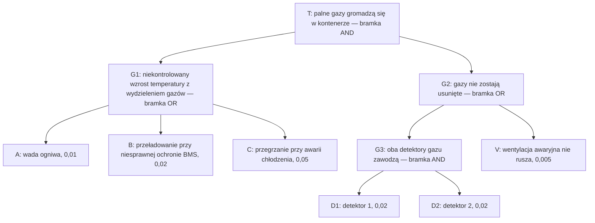
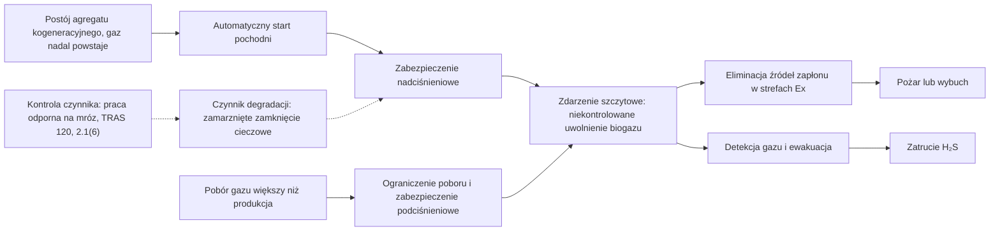

import { SlideContainer, Slide, InstructorNotes, LearningObjective } from '@site/src/components/SlideComponents';

<LearningObjective>

Student buduje i oblicza proste drzewo niezdatności, wyznacza minimalne przekroje, ocenia wpływ uszkodzeń spowodowanych wspólną przyczyną oraz łączy drzewo niezdatności z drzewem zdarzeń i diagramem bow-tie.

</LearningObjective>

<SlideContainer>

<Slide title="Analiza drzewa niezdatności: pojęcia" type="info">

- **FTA** (Fault Tree Analysis — analiza drzewa niezdatności) to metoda dedukcyjna, „od góry”: od **zdarzenia szczytowego** do kombinacji przyczyn. Norma: IEC 61025:2006 (wyd. 2.0), jest aktualna.
- **Zdarzenie podstawowe** (3.9): zdarzenie lub stan, którego nie można dalej rozwinąć. **Zdarzenie nierozwinięte** (3.12): zdarzenie bez zdarzeń wejściowych, np. z braku informacji. **Zdarzenie pośrednie**: wyjście bramki, które rozwija się dalej.
- **Bramka AND**: wyjście zachodzi tylko wtedy, gdy zajdą wszystkie wejścia. **Bramka OR**: gdy zajdzie którekolwiek. Inne symbole (m.in. XOR, priorytetowa AND, INHIBIT, zdarzenie zewnętrzne (symbol domku), przeniesienie) zestawia NUREG-0492, tabl. IV-1.
- **Minimalny przekrój** (ang. minimal cut set, 3.7): najmniejszy zbiór zdarzeń, których wystąpienie powoduje zdarzenie szczytowe.
- Bezpłatne podręczniki: NUREG-0492 (US Nuclear Regulatory Commission, 1981) i NASA Fault Tree Handbook (wersja 1.1, 2002).
- Zastosowania w odnawialnych źródłach energii (OZE): ogólne drzewo niezdatności turbiny wiatrowej rozwiązywane metodą binarnych diagramów decyzyjnych z miarami ważności (García Márquez i in., 2016); pływające turbiny morskie (Kang i in., 2019); deflagracja w magazynie energii, gdzie na szczycie jest bramka AND czterech warunków: źródło zapłonu, materiał palny, utleniacz, przestrzeń zamknięta (Yuan i in., 2026).

Źródło: [IEC Webstore, IEC 61025:2006](https://webstore.iec.ch/en/publication/4311); [IEC 61025:2006, próbka normy](https://cdn.standards.iteh.ai/samples/12812/5a2b487cba2344309309a9d4fc72b2b9/IEC-61025-2006.pdf); [NUREG-0492](https://www.nrc.gov/docs/ML1007/ML100780465.pdf); [NASA FTH, 2002](https://extapps.ksc.nasa.gov/Reliability/Documents/Fault_Tree_Handbook_with_Aerospace_Applications_August_2002.pdf); [García Márquez i in., 2016](https://doi.org/10.1016/j.renene.2015.09.038); [Kang i in., 2019](https://doi.org/10.1016/j.renene.2018.08.097); [Yuan i in., 2026](https://www.mdpi.com/2227-9717/14/4/674)

<InstructorNotes>

Czas: ~2 min

FMEA szła od elementu do skutku. Drzewo niezdatności idzie w przeciwną stronę: zaczynamy od jednego, precyzyjnie opisanego zdarzenia niepożądanego i pytamy, jakie kombinacje przyczyn mogą do niego doprowadzić. W praktyce wystarczą dwie bramki, AND i OR. Najważniejszym wynikiem jakościowym są minimalne przekroje, czyli najmniejsze zestawy zdarzeń, które wystarczą do awarii.

Praca Yuana i współautorów to dobry wzór: na szczycie bramka AND czterech warunków. Wystarczy usunąć jeden z nich, na przykład materiał palny dzięki wentylacji, żeby przerwać tę gałąź. Ich wynik 28% to wskaźnik z modelu (rozmyta sieć bayesowska, oceny ekspertów) dla scenariusza odniesienia, a nie częstość na rok. Typowe nieporozumienie: zdarzenie szczytowe może brzmieć „awaria magazynu”. Musi być konkretne, inaczej drzewo nie ma granic. Pytanie do sali: jakie zdarzenie szczytowe wybralibyście dla falownika PV?

</InstructorNotes>

</Slide>

<Slide title="Przykład drzewa: gazy w kontenerze BESS" type="tip">

**Przykład ilustracyjny — dane umowne.** Drzewo i liczby ułożyłem na potrzeby wykładu: A, B i C to prawdopodobieństwa w ciągu roku, a D1, D2 i V — prawdopodobieństwa niezadziałania na żądanie.

- Skróty: BESS (Battery Energy Storage System — bateryjny magazyn energii); BMS (Battery Management System — system zarządzania baterią). Niekontrolowany wzrost temperatury (ang. thermal runaway): [W1, część 1](../wyklad-01-zagrozenia-ramy-prawne/01-zagrozenia-w-instalacjach-oze.mdx).
- Zdarzenie T wymaga jednocześnie źródła gazu (G1) i braku jego usunięcia (G2), stąd bramka AND na szczycie.
- Minimalne przekroje drugiego rzędu: \{A, V\}, \{B, V\}, \{C, V\}; trzeciego rzędu: \{A, D1, D2\}, \{B, D1, D2\}, \{C, D1, D2\}.
- Struktura nawiązuje do McMicken (2019), ale go nie modeluje. Wg DNV GL (2020) proces zapoczątkowało uszkodzenie wewnętrzne jednego ogniwa, a palne gazy gromadziły się bez możliwości wentylacji; inne raporty różnią się m.in. co do przyczyny źródłowej (UL — Underwriters Laboratories, 2021).

Źródło: [DNV GL, 2020](https://www.aps.com/-/media/APS/APSCOM-PDFs/About/Our-Company/Newsroom/McMickenFinalTechnicalReport.pdf?la=en&sc_lang=en&hash=5447FA391CD988DD24226FA485F81F23); [UL, 2021](https://collateral-library-production.s3.amazonaws.com/uploads/asset_file/attachment/31718/Executive_Summary_for_DNVGL_APS_Report_Responses.pdf); [IEC 61025:2006, próbka normy](https://cdn.standards.iteh.ai/samples/12812/5a2b487cba2344309309a9d4fc72b2b9/IEC-61025-2006.pdf)

<InstructorNotes>

Czas: ~2 min

To drzewo zbudowałem na potrzeby wykładu, a liczby są umowne. Zdarzenie szczytowe to gromadzenie się palnych gazów w kontenerze. Muszą zajść jednocześnie dwie rzeczy: ogniwa wydzielają gaz i gaz nie zostaje usunięty. Wydzielanie gazu może zapoczątkować wada ogniwa, przeładowanie przy niesprawnej ochronie albo przegrzanie przy awarii chłodzenia, stąd bramka OR. Gazy nie zostaną usunięte, jeśli zawiodą oba detektory albo nie ruszy wentylacja.

Minimalne przekroje czytamy wprost z drzewa. Przekroje z wentylatorem mają tylko dwa zdarzenia, a przekroje z detektorami trzy. Pytanie do sali: który element projektant powinien wzmocnić najpierw? Intuicja podpowiada wentylator, bo jest pojedynczym punktem uszkodzenia w gałęzi G2. Sprawdzimy to liczbowo. Typowe nieporozumienie: takie drzewo odtwarza przebieg konkretnej awarii. Ono tylko porządkuje możliwe kombinacje przyczyn.

</InstructorNotes>

</Slide>

<Slide title="Kwantyfikacja: bramki AND i OR" type="info">

- AND, zdarzenia niezależne: $P = \prod_i p_i$. Dla G3: $0{,}02 \times 0{,}02 = 4 \times 10^{-4}$.
- OR, wzór dokładny: $P = 1 - \prod_i (1 - p_i)$. Dla G1: $1 - 0{,}99 \cdot 0{,}98 \cdot 0{,}95 = 0{,}07831$.
- **Przybliżenie rzadkich zdarzeń**: $P \approx \sum_i p_i = 0{,}08$, czyli wynik zawyżony o 2,2% (zachowawczo). Podręcznik NASA uzasadnia takie przybliżenia tym, że większość prawdopodobieństw uszkodzeń jest mniejsza niż 0,1 (rozdz. 2.1).
- Dla $p$ = 0,1; 0,2; 0,3 wynik dokładny to 0,496, a suma 0,6, czyli zawyżenie o 21%.
- Zdarzenie szczytowe: $G2 = 1 - (1 - 4 \times 10^{-4})(1 - 0{,}005) = 0{,}005398$, więc $P_T = 0{,}07831 \times 0{,}005398 = 4{,}23 \times 10^{-4}$. Suma minimalnych przekrojów daje $4{,}32 \times 10^{-4}$.
- Przekroje z V dają 92,6% sumy przekrojów. Udział zdarzenia w prawdopodobieństwie zdarzenia szczytowego to jedna z miar ważności, które opisuje NASA (rozdz. 7.5).

Źródło: [NASA FTH, 2002](https://extapps.ksc.nasa.gov/Reliability/Documents/Fault_Tree_Handbook_with_Aerospace_Applications_August_2002.pdf); [NUREG-0492](https://www.nrc.gov/docs/ML1007/ML100780465.pdf); obliczenia własne

<InstructorNotes>

Czas: ~3 min

Rachunek jest prosty, ale opiera się na dwóch założeniach. Mnożenie w bramce AND wymaga niezależności zdarzeń. Suma w bramce OR jest tylko przybliżeniem: wzór dokładny odejmuje od jedności iloczyn prawdopodobieństw, że nic się nie stanie. Dla małych wartości różnica jest niewielka i zachowawcza, bo suma zawyża wynik. Dla dużych prawdopodobieństw przybliżenie przestaje mieć sens, co widać na przykładzie 0,1, 0,2 i 0,3.

Wynik potwierdza intuicję: ponad dziewięćdziesiąt procent pochodzi z przekrojów z wentylatorem. Para detektorów jest dobrze zabezpieczona, a pojedynczy wentylator nie. Pytanie do sali: co da drugi, niezależny wentylator? Przekroje z V staną się przekrojami trzeciego rzędu, a prawdopodobieństwo zdarzenia szczytowego spadnie prawie trzynastokrotnie. Typowe nieporozumienie: precyzja rachunku jest ważniejsza niż jakość danych wejściowych.

</InstructorNotes>

</Slide>

<Slide title="Uszkodzenia spowodowane wspólną przyczyną" type="warning">

- Mnożenie w bramce AND zakłada niezależność. **CCF** (Common Cause Failure — uszkodzenie spowodowane wspólną przyczyną): dwa lub więcej kanałów zawodzi jednocześnie z jednej przyczyny, np. przez wspólne zasilanie albo tę samą błędną kalibrację (przykłady własne).
- Rosewater i Williams (2015) wymieniają wśród przyczyn niedokładnego pomiaru napięć ogniw w BMS m.in. brak lub niedokładność kalibracji i szybki dryf pomiaru; na takich danych obliczenia sterowania mogą doprowadzić do przekroczenia dopuszczalnego prądu stałego (DC).
- **Model współczynnika β**: ułamek β uszkodzeń kanału dotyczy wszystkich kanałów jednocześnie, $\lambda = (1-\beta)\lambda + \beta\lambda$. Według Lundteigen i Rausanda IEC 61508-6 stosuje go w uproszczonych wzorach na PFDavg, czyli średnie prawdopodobieństwo niebezpiecznego uszkodzenia na żądanie ([część 5](./05-lopa-i-sil.mdx)).
- Lista kontrolna IEC 61508-6, zał. D (37 pytań) daje β od 0,5% do 5% dla układów logicznych i od 1% do 10% dla czujników i elementów wykonawczych (wg Rausanda i Lundteigen, NTNU).

**Przykład ilustracyjny — dane umowne.** Para detektorów D1, D2 z drzewa ($q = 0{,}02$) i umowne wartości β z zakresu dla czujników; $P \approx ((1-\beta)\,q)^2 + \beta q$.

| β | Część niezależna | Część wspólna | G3 razem | Udział części wspólnej |
|---|---|---|---|---|
| 0 | $4{,}0 \times 10^{-4}$ | 0 | $4{,}0 \times 10^{-4}$ | 0% |
| 0,02 | $3{,}84 \times 10^{-4}$ | $4{,}0 \times 10^{-4}$ | $7{,}84 \times 10^{-4}$ | 51% |
| 0,05 | $3{,}61 \times 10^{-4}$ | $1{,}0 \times 10^{-3}$ | $1{,}36 \times 10^{-3}$ | 73% |
| 0,10 | $3{,}24 \times 10^{-4}$ | $2{,}0 \times 10^{-3}$ | $2{,}32 \times 10^{-3}$ | 86% |

- Przy β = 0,10 para zawodzi 5,8 razy częściej niż przy pełnej niezależności, a $P_T$ rośnie o 35%, do $5{,}73 \times 10^{-4}$.
- Wniosek: redundancja bez różnorodności i separacji daje mniej, niż sugeruje mnożenie. Ten sam efekt zobaczymy dla funkcji 1oo2 w [części 5](./05-lopa-i-sil.mdx).

Źródło: [Rausand i Lundteigen, NTNU, rozdz. 10](https://www.ntnu.edu/documents/624876/1277046207/SIS+book+-+chapter+10+-+CCF+definition+and+classification/b6b58f95-3d5a-4860-9b6f-a54493786bdd); [Lundteigen i Rausand, NTNU, rozdz. 8](https://www.ntnu.edu/documents/624876/1277046207/SIS+book+-+chapter+08+-+PFDavg+with+IEC+61508+formulas/0be9ac0d-7e57-4641-9043-7d2554c16cac); [Rosewater i Williams, 2015](https://sandia.gov/ess-ssl/docs/other/1-s2-0-S037877531530327X-main.pdf); obliczenia własne

<InstructorNotes>

Czas: ~2,5 min

To najważniejszy slajd tej części. Na papierze dwa detektory po dwa procent dają cztery dziesięciotysięczne, bo mnożymy. W rzeczywistości oba mogą pochodzić od tego samego producenta, być kalibrowane przez tę samą osobę tym samym gazem wzorcowym i mieć wspólne zasilanie. Model beta mówi: pewien ułamek uszkodzeń dotyka obu kanałów naraz. Już przy dziesięciu procentach para zawodzi prawie sześć razy częściej, a uszkodzenia wspólne stanowią większość wyniku.

Wartości beta w tabeli są umowne, ale mieszczą się w zakresie podawanym dla czujników. W praktyce wyznacza się je listą kontrolną dla konkretnego układu. Pytanie do sali: jak obniżyć beta dla detekcji gazu w kontenerze? Na przykład dwa różne typy czujników, osobne zasilanie, różne terminy kalibracji. Typowe nieporozumienie: druga sztuka tego samego czujnika zawsze poprawia wynik tyle, ile wynika z mnożenia, tu 50-krotnie.

</InstructorNotes>

</Slide>

<Slide title="Analiza drzewa zdarzeń" type="info">

- **ETA** (Event Tree Analysis — analiza drzewa zdarzeń): IEC 62502:2010 (wyd. 1.0, jest aktualna) opisuje modelowanie skutków **zdarzenia inicjującego** oraz ich analizę jakościową i ilościową.
- Gałęzie to powodzenie lub niepowodzenie kolejnych barier i warunków, np. zapłonu. Częstość wyniku $= f_{IE} \times \prod$ prawdopodobieństw na ścieżce; suma częstości wyników równa się $f_{IE}$, co służy do kontroli.
- IEC 61511-3:2016 podaje półilościową metodę drzewa zdarzeń do wyznaczania wymaganego SIL (Safety Integrity Level — poziom nienaruszalności bezpieczeństwa) w zał. B, a LOPA (Layer of Protection Analysis — analiza warstw ochrony) w zał. F ([część 5](./05-lopa-i-sil.mdx)).

**Przykład ilustracyjny — dane umowne.** Zdarzeniem inicjującym jest bramka G1 z drzewa, traktowana jako częstość $f_{IE} = 0{,}07831$ /rok; niepowodzenie usunięcia gazów to G2 ($P = 0{,}005398$), a prawdopodobieństwo zapłonu 0,5 jest założeniem.

| Wynik | Ścieżka | Częstość [1/rok] |
|---|---|---|
| Gazy usunięte | usunięcie działa (0,994602) | 0,07789 |
| Palna atmosfera bez zapłonu | usunięcie zawodzi, brak zapłonu (0,5) | $2{,}11 \times 10^{-4}$ |
| Deflagracja | usunięcie zawodzi, zapłon (0,5) | $2{,}11 \times 10^{-4}$ |
| Suma kontrolna | wszystkie ścieżki | 0,07831 |

- Wartości 0,5 nie wzięto z literatury: opublikowanego prawdopodobieństwa zapłonu dla gazów z ogniw w kontenerze nie znaleziono. Dla uwolnień węglowodorów stosuje się korelacje, w których prawdopodobieństwo zapłonu zależy m.in. od strumienia wypływu, rodzaju płynu i scenariusza (wg Bain i in., 2012).
- Wynik „bez zapłonu” nie jest bezpieczny. W McMicken ok. 3 h po początku niekontrolowanego wzrostu temperatury strażacy otworzyli drzwi, poruszając pozostałe palne gazy; wg osi czasu DNV GL drzwi otwarto o 20:02, a wybuch nastąpił o 20:04. Raporty są zgodne, że rannych spowodował zapłon palnych gazów z baterii (UL, 2021).

Źródło: [IEC Webstore, IEC 62502:2010](https://webstore.iec.ch/en/publication/7131); [IEC 61511-3:2016, podgląd ANSI/ISA](https://webstore.ansi.org/preview-pages/ISA/preview_ANSI+ISA+61511.3-2018+(IEC+61511-3-2016).pdf); [Bain i in., 2012](https://www.icheme.org/media/9183/paper47-hazards-23.pdf); [DNV GL, 2020](https://www.aps.com/-/media/APS/APSCOM-PDFs/About/Our-Company/Newsroom/McMickenFinalTechnicalReport.pdf?la=en&sc_lang=en&hash=5447FA391CD988DD24226FA485F81F23); [UL, 2021](https://collateral-library-production.s3.amazonaws.com/uploads/asset_file/attachment/31718/Executive_Summary_for_DNVGL_APS_Report_Responses.pdf); obliczenia własne

<InstructorNotes>

Czas: ~2,5 min

Drzewo zdarzeń patrzy w przód: zdarzenie inicjujące już zaszło i pytamy, co dalej. W każdym węźle bariera działa albo nie, gaz się zapala albo nie. Częstość wyniku to częstość zdarzenia inicjującego pomnożona przez prawdopodobieństwa na ścieżce, a suma wyników musi dać częstość wyjściową. To dobra kontrola rachunku na kolokwium.

Przykład łączy się z drzewem niezdatności: zdarzeniem inicjującym jest bramka G1, a niepowodzenie usuwania gazów bierzemy z bramki G2. Dwa wyniki z nieudanym usuwaniem dają razem wynik drzewa, 4,23 razy dziesięć do minus czwartej. Proszę zwrócić uwagę na wynik środkowy: palna atmosfera bez zapłonu wygląda niewinnie, ale w McMicken właśnie taka atmosfera wybuchła po otwarciu drzwi. Pytanie do sali: jaką gałąź dopisalibyście za tym wynikiem? Typowe nieporozumienie: końcowy stan drzewa jest albo bezpieczny, albo jest wypadkiem.

</InstructorNotes>

</Slide>

<Slide title="Bow-tie: bariery i czynniki degradacji" type="info">

- Diagram **bow-tie** (analiza muszki, ang. bow-tie) łączy przyczyny i skutki wokół **zdarzenia szczytowego**, czyli utraty kontroli nad zagrożeniem (CCPS — Center for Chemical Process Safety, i Energy Institute, 2018; wg Johnsona i in., 2018). IEC 31010:2019 opisuje go w B.4.2, wśród technik analizy środków kontroli ryzyka.
- Zdarzenie szczytowe odpowiada zdarzeniu niebezpiecznemu z [W1, część 2](../wyklad-01-zagrozenia-ramy-prawne/02-pojecia-podstawowe.mdx) (ocena własna). Elementy: **zagrożenie**; po lewej **przyczyny** (ang. threats) i **bariery zapobiegawcze**; po prawej **skutki** i **bariery ograniczające skutki**.
- **Czynniki degradacji** (dawniej: czynniki eskalacji) to „dziury” w barierach, czyli spadek ich skuteczności lub niezawodności; przeciwdziałają im **środki kontroli czynników degradacji**.
- Bariera musi być skuteczna, niezależna i audytowalna, czyli spełniać te same trzy kryteria co warstwa ochrony z [W1, część 5](../wyklad-01-zagrozenia-ramy-prawne/05-monitoring-a-warstwy-ochrony.mdx). Bariera aktywna ma trzy elementy: wykryj, zdecyduj, działaj (czujnik, logika, element wykonawczy).
- Reguły książki dają zwykle 1–5 barier na ścieżce przyczyny, a po stronie skutków zwykle 1–3, najwyżej 5 (wg Johnsona i in., 2018).
- Szkolenia, kompetencje, zarządzanie zmianą (MOC, Management of Change), audyty oraz programy przeglądów i konserwacji wpływają na wiele barier, ale **same nie są barierami**.

Źródło: [CCPS, Bow Ties in Risk Management](https://www.aiche.org/ccps/resources/publications/books/bow-ties-risk-management-concept-book-process-safety); [Energy Institute](https://www.energyinst.org/technical/publications/topics/human-and-organisational-factors/bow-ties-in-risk-management-a-concept-book-for-process-safety); [Johnson i in., 2018](https://www.icheme.org/media/16937/hazards-28-paper-31.pdf); [IEC 31010:2019, podgląd ASSP](https://www.assp.org/docs/default-source/standards-documents/preview/31010_2019_wms_preview.pdf?sfvrsn=75159747_2)

<InstructorNotes>

Czas: ~2 min

Bow-tie, czyli muszka, to diagram jakościowy, który dobrze sprawdza się w rozmowie z kierownictwem i z eksploatacją. Na środku jest zdarzenie szczytowe, czyli moment utraty kontroli nad zagrożeniem. Po lewej widać, co może do niego doprowadzić i co temu zapobiega, a po prawej, jakie są skutki i co je ogranicza. Lewą stronę można liczyć jak drzewo niezdatności, a prawą jak drzewo zdarzeń; to moja interpretacja dydaktyczna.

Ważna reguła z książki CCPS i Energy Institute: szkolenie, procedura zarządzania zmianą czy audyt nie są barierami. Wspierają bariery, ale same niczego nie zatrzymują. Pytanie do sali: czy regularna kalibracja detektorów gazu jest barierą? Nie. To środek kontroli czynnika degradacji dla bariery, którą jest detekcja gazu z automatyczną wentylacją. Typowe nieporozumienie: im więcej barier na diagramie, tym bezpieczniej.

</InstructorNotes>

</Slide>

<Slide title="Bow-tie dla zbiornika biogazu" type="tip">

**Przykład ilustracyjny — dane umowne.** Diagram zbudowałem z wymagań TRAS 120 (Technische Regel für Anlagensicherheit — niemiecka reguła techniczna bezpieczeństwa instalacji) i przykładu HAZOP (Hazard and Operability Study — badanie zagrożeń i zdolności do działania) z [części 2](./02-hazid-i-hazop.mdx); dobór barier jest umowny, a szczegółowe diagramy bow-tie dla biogazowni podają Casson Moreno i in. (2018).

- TRAS 120: dodatkowe urządzenie zużywające gaz, np. pochodnia, ma pierwszeństwo przed zadziałaniem zabezpieczenia nadciśnieniowego (2.1(14)). Urządzenia wykrywające niedopuszczalne napełnienie, oddzielne od pomiaru napełnienia (lub środek równoważny), muszą zapewnić jej automatyczne włączenie; napełnienie minimalne i maksymalne sygnalizuje system ochronny (2.6.3(3)).
- TRAS 120 wymaga zabezpieczeń nad- i podciśnieniowych, np. hydrauliczno-mechanicznych (2.4(7)); przed zadziałaniem zabezpieczenia podciśnieniowego trzeba ograniczyć, a w razie potrzeby zatrzymać pobór gazu (2.4(8)).
- Zadziałanie zabezpieczenia nadciśnieniowego też uwalnia biogaz, ale w przewidzianym miejscu; barierą jest ono wobec rozerwania zbiornika (ocena własna).
- TRAS 120, 2.1(6): elementy, w których może skraplać się wilgoć z biogazu lub które zawierają kondensat, muszą pracować w sposób odporny na mróz. Odniesienie tego wymagania do zamknięć cieczowych to nasza interpretacja (ocena własna).
- Skala skutków: Scarponi i in. (2015) dla natychmiastowego uwolnienia z komory fermentacyjnej (scenariusz LOC3) podają zasięg szkód wybuchu chmury gazu ok. 100 m (próg nadciśnienia 14 kPa) i zasięg pożaru błyskawicznego ok. 25 m (granica ½ DGW); częstości nie podają.
- SCADA (Supervisory Control and Data Acquisition — system nadzoru i akwizycji danych) pokazuje stan barier, ale sama nie jest barierą (ocena własna).
- Ex — strefy zagrożenia wybuchem ([W1, część 3](../wyklad-01-zagrozenia-ramy-prawne/03-ramy-prawne-ue-i-polska.mdx)); DGW — dolna granica wybuchowości ([W1, część 1](../wyklad-01-zagrozenia-ramy-prawne/01-zagrozenia-w-instalacjach-oze.mdx)).

Źródło: [KAS, TRAS 120](https://www.kas-bmu.de/files/publikationen/TRAS/TRAS%20(endgueltige%20Fassung)/LesefassTRAS120.pdf); [Scarponi i in., 2015](https://www.aidic.it/cet/15/43/321.pdf); [Casson Moreno i in., 2018](https://doi.org/10.1016/j.ress.2017.07.013)

<InstructorNotes>

Czas: ~2 min

Ten diagram zbiera przykład HAZOP z drugiej części. Przyczyny po lewej to nadciśnienie przy postoju agregatu kogeneracyjnego i podciśnienie przy zbyt dużym poborze gazu. Bariery zapobiegawcze to automatyczny start pochodni i zabezpieczenia ciśnieniowe. Po prawej są skutki uwolnienia i bariery, które je ograniczają.

Proszę zwrócić uwagę na linię przerywaną: zamarznięte zamknięcie cieczowe to czynnik degradacji, który wyłącza barierę bez żadnego sygnału. Zespół Scarponiego oszacował dla natychmiastowego uwolnienia z komory zasięg szkód rzędu stu metrów, więc prawa strona nie jest teoretyczna. Pytanie do sali: gdzie na tym diagramie jest SCADA biogazowni? Pokazuje stan barier, ale sama nie jest barierą. W9 rozszerzy ten przykład. Typowe nieporozumienie: pochodnia i zabezpieczenie nadciśnieniowe to jedna bariera.

</InstructorNotes>

</Slide>

</SlideContainer>

## Źródła

1. IEC (2006). *IEC 61025:2006 Fault tree analysis (FTA)*, wyd. 2.0. [https://webstore.iec.ch/en/publication/4311](https://webstore.iec.ch/en/publication/4311); próbka normy: [https://cdn.standards.iteh.ai/samples/12812/5a2b487cba2344309309a9d4fc72b2b9/IEC-61025-2006.pdf](https://cdn.standards.iteh.ai/samples/12812/5a2b487cba2344309309a9d4fc72b2b9/IEC-61025-2006.pdf)
2. Vesely W.E., Goldberg F.F., Roberts N.H., Haasl D.F. (1981). *Fault Tree Handbook* (NUREG-0492). U.S. Nuclear Regulatory Commission. [https://www.nrc.gov/docs/ML1007/ML100780465.pdf](https://www.nrc.gov/docs/ML1007/ML100780465.pdf)
3. Stamatelatos M., Vesely W. i in. (2002). *Fault Tree Handbook with Aerospace Applications*, wersja 1.1. NASA Office of Safety and Mission Assurance. [https://extapps.ksc.nasa.gov/Reliability/Documents/Fault_Tree_Handbook_with_Aerospace_Applications_August_2002.pdf](https://extapps.ksc.nasa.gov/Reliability/Documents/Fault_Tree_Handbook_with_Aerospace_Applications_August_2002.pdf)
4. García Márquez F.P., Pinar Pérez J.M., Pliego Marugán A., Papaelias M. (2016). Identification of critical components of wind turbines using FTA over the time. *Renewable Energy* 87(2): 869–883. [https://doi.org/10.1016/j.renene.2015.09.038](https://doi.org/10.1016/j.renene.2015.09.038)
5. Kang J., Sun L., Guedes Soares C. (2019). Fault Tree Analysis of floating offshore wind turbines. *Renewable Energy* 133: 1455–1467. [https://doi.org/10.1016/j.renene.2018.08.097](https://doi.org/10.1016/j.renene.2018.08.097)
6. Yuan Q., Qiu Y., Liang X., Huang D., Yuan C. (2026). An integrated framework for deflagration risk analysis in electrochemical energy storage stations: combining Fault Tree Analysis and Fuzzy Bayesian Network. *Processes* 14(4): 674. [https://doi.org/10.3390/pr14040674](https://doi.org/10.3390/pr14040674)
7. Hill D.M. (DNV GL) (2020). *McMicken Battery Energy Storage System Event — Technical Analysis and Recommendations*, dok. 10209302-HOU-R-01. APS. [https://www.aps.com/-/media/APS/APSCOM-PDFs/About/Our-Company/Newsroom/McMickenFinalTechnicalReport.pdf?la=en&sc_lang=en&hash=5447FA391CD988DD24226FA485F81F23](https://www.aps.com/-/media/APS/APSCOM-PDFs/About/Our-Company/Newsroom/McMickenFinalTechnicalReport.pdf?la=en&sc_lang=en&hash=5447FA391CD988DD24226FA485F81F23)
8. UL LLC (2021). *Executive Summary of the Underwriters Laboratories and UL Responses on Battery Energy Storage System Incidents and Safety*. [https://collateral-library-production.s3.amazonaws.com/uploads/asset_file/attachment/31718/Executive_Summary_for_DNVGL_APS_Report_Responses.pdf](https://collateral-library-production.s3.amazonaws.com/uploads/asset_file/attachment/31718/Executive_Summary_for_DNVGL_APS_Report_Responses.pdf)
9. Rausand M., Lundteigen M.A. (b.d.). *Chapter 10. Common Cause Failures (CCFs)* — slajdy do książki *Reliability of Safety-Critical Systems: Theory and Applications* (Wiley 2014). NTNU. [https://www.ntnu.edu/documents/624876/1277046207/SIS+book+-+chapter+10+-+CCF+definition+and+classification/b6b58f95-3d5a-4860-9b6f-a54493786bdd](https://www.ntnu.edu/documents/624876/1277046207/SIS+book+-+chapter+10+-+CCF+definition+and+classification/b6b58f95-3d5a-4860-9b6f-a54493786bdd)
10. Lundteigen M.A., Rausand M. (b.d.). *Chapter 8. PFD formulas in IEC 61508* — slajdy do tej samej książki. NTNU. [https://www.ntnu.edu/documents/624876/1277046207/SIS+book+-+chapter+08+-+PFDavg+with+IEC+61508+formulas/0be9ac0d-7e57-4641-9043-7d2554c16cac](https://www.ntnu.edu/documents/624876/1277046207/SIS+book+-+chapter+08+-+PFDavg+with+IEC+61508+formulas/0be9ac0d-7e57-4641-9043-7d2554c16cac)
11. Rosewater D., Williams A. (2015). Analyzing system safety in lithium-ion grid energy storage. *Journal of Power Sources* 300: 460–471. [https://doi.org/10.1016/j.jpowsour.2015.09.068](https://doi.org/10.1016/j.jpowsour.2015.09.068); kopia autorska (Sandia): [https://sandia.gov/ess-ssl/docs/other/1-s2-0-S037877531530327X-main.pdf](https://sandia.gov/ess-ssl/docs/other/1-s2-0-S037877531530327X-main.pdf)
12. IEC (2010). *IEC 62502:2010 Analysis techniques for dependability — Event tree analysis (ETA)*, wyd. 1.0. [https://webstore.iec.ch/en/publication/7131](https://webstore.iec.ch/en/publication/7131)
13. ANSI/ISA (2018). *ANSI/ISA-61511-3-2018 (IEC 61511-3:2016 IDT)*, podgląd. [https://webstore.ansi.org/preview-pages/ISA/preview_ANSI+ISA+61511.3-2018+(IEC+61511-3-2016).pdf](https://webstore.ansi.org/preview-pages/ISA/preview_ANSI+ISA+61511.3-2018+(IEC+61511-3-2016).pdf)
14. Bain B., Celnik M., Korneliussen G. (2012). Practical application of the UKOOA ignition model. IChemE Symposium Series 158 (Hazards XXIII). [https://www.icheme.org/media/9183/paper47-hazards-23.pdf](https://www.icheme.org/media/9183/paper47-hazards-23.pdf)
15. CCPS, Energy Institute (2018). *Bow Ties in Risk Management: A Concept Book for Process Safety*. Wiley. [https://www.aiche.org/ccps/resources/publications/books/bow-ties-risk-management-concept-book-process-safety](https://www.aiche.org/ccps/resources/publications/books/bow-ties-risk-management-concept-book-process-safety); [https://www.energyinst.org/technical/publications/topics/human-and-organisational-factors/bow-ties-in-risk-management-a-concept-book-for-process-safety](https://www.energyinst.org/technical/publications/topics/human-and-organisational-factors/bow-ties-in-risk-management-a-concept-book-for-process-safety)
16. Johnson M., Manton M., Cowley C., Scanlon M. (2018). Bow Ties in Risk Management; using the new CCPS-EI book to avoid pitfalls. IChemE Symposium Series 163 (Hazards 28). [https://www.icheme.org/media/16937/hazards-28-paper-31.pdf](https://www.icheme.org/media/16937/hazards-28-paper-31.pdf)
17. IEC, ISO (2019). *IEC 31010:2019 Risk management — Risk assessment techniques*, podgląd (ASSP). [https://www.assp.org/docs/default-source/standards-documents/preview/31010_2019_wms_preview.pdf?sfvrsn=75159747_2](https://www.assp.org/docs/default-source/standards-documents/preview/31010_2019_wms_preview.pdf?sfvrsn=75159747_2)
18. Casson Moreno V., Guglielmi D., Cozzani V. (2018). Identification of critical safety barriers in biogas facilities. *Reliability Engineering & System Safety* 169: 81–94. [https://doi.org/10.1016/j.ress.2017.07.013](https://doi.org/10.1016/j.ress.2017.07.013)
19. Scarponi G.E., Guglielmi D., Casson Moreno V., Cozzani V. (2015). Risk assessment of a biogas production and upgrading plant. *Chemical Engineering Transactions* 43. [https://doi.org/10.3303/CET1543321](https://doi.org/10.3303/CET1543321); PDF: [https://www.aidic.it/cet/15/43/321.pdf](https://www.aidic.it/cet/15/43/321.pdf)
20. Kommission für Anlagensicherheit (2019). *TRAS 120 — Sicherheitstechnische Anforderungen an Biogasanlagen* (Lesefassung: wersja 12/2018 z korektą z 27.02.2019). [https://www.kas-bmu.de/files/publikationen/TRAS/TRAS%20(endgueltige%20Fassung)/LesefassTRAS120.pdf](https://www.kas-bmu.de/files/publikationen/TRAS/TRAS%20(endgueltige%20Fassung)/LesefassTRAS120.pdf)
