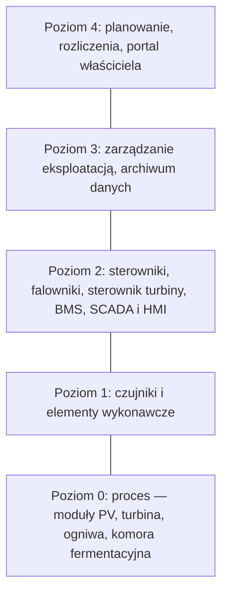

import { SlideContainer, Slide, InstructorNotes, LearningObjective } from '@site/src/components/SlideComponents';

<LearningObjective>

Student wyjaśnia cele monitoringu instalacji OZE, przyporządkowuje elementy systemu do poziomów modelu IEC 62264, wskazuje, co musi działać lokalnie po utracie łącza, i dobiera sposób synchronizacji zegarów do wymaganej dokładności znaczników czasu.

</LearningObjective>

<SlideContainer>

<Slide title="Po co monitorujemy instalacje OZE" type="info">

Pięć celów monitoringu to grupowanie dydaktyczne (ocena własna); każdy cel ma własne źródło.

- **Wydajność, gwarancje i usterki**: IEC 61724-1:2021 (wstęp) wymienia porównanie wydajności z oczekiwaniami projektowymi i gwarancjami oraz wykrywanie i lokalizowanie usterek. Raport IEA PVPS T13-03:2014 (program fotowoltaiczny Międzynarodowej Agencji Energetycznej) — pomiar uzysku energii, ocenę wydajności i szybkie wykrycie błędów projektowych lub nieprawidłowego działania (tłumaczenie własne).
- **Stan urządzeń**: dane SCADA (Supervisory Control and Data Acquisition — system nadzoru i akwizycji danych) turbin wiatrowych są atrakcyjną ekonomicznie podstawą monitorowania stanu, bo nie wymagają dodatkowych czujników ani sprzętu akwizycji (przegląd Maldonado-Correa i in., 2020).
- **Informacje ważne dla bezpieczeństwa**: alarmy, zapis zdarzeń, dowody sprawności zabezpieczeń; NREL (National Renewable Energy Laboratory, 2018) wymienia alarmy i diagnostykę. Monitoring wspiera warstwy ochrony, ale sam nie jest warstwą ([W1, część 5](../wyklad-01-zagrozenia-ramy-prawne/05-monitoring-a-warstwy-ochrony.mdx)).
- **Operator sieci i sprawozdawczość**: raporty dla interesariuszy obiektu (NREL 2018); po utracie łącza monitoringu operatorzy sieci zachowali dostęp do sterowania zachowaniem turbin w sieci (wg komunikatu ENERCON, 2022). Protokoły wymiany danych — W4.
- **Rozliczenia**: NREL (2018) wymienia pomiar energii do rozliczeń. Liczniki rozliczeniowe energii podlegają metrologii prawnej: ustawa z 11 maja 2001 r. – Prawo o miarach (t.j. Dz.U. 2022 poz. 2063) i dyrektywa 2014/32/UE w sprawie przyrządów pomiarowych (MID; m.in. liczniki energii elektrycznej czynnej, MI-003); stan prawny: wrzesień 2026. Tym zakresem wykład się nie zajmuje.

Źródło: [IEC 61724-1:2021, próbka normy](https://cdn.standards.iteh.ai/samples/103495/100a1ea212914dd38ba72a9138af4ce1/IEC-61724-1-2021.pdf); [IEA PVPS T13-03:2014](https://iea-pvps.org/wp-content/uploads/2020/01/IEA-PVPS_T13-D2_3_Analytical_Monitoring_of_PV_Systems_Final.pdf); [Maldonado-Correa i in., 2020](https://doi.org/10.3390/en13123132); [NREL, 2018](https://www.nrel.gov/docs/fy19osti/73822.pdf); [ENERCON, 2022 (przedruk: windfair.net)](https://w3.windfair.net/wind-energy/pr/40316-enercon-wind-turbine-wind-farm-satellite-communication-converter-disruption-remote-monitoring-scada-ka-sat-russia-ukraine-europe-access); [ISAP, Prawo o miarach, t.j. 2022](https://isap.sejm.gov.pl/isap.nsf/DocDetails.xsp?id=WDU20220002063); [EUR-Lex, dyrektywa 2014/32/UE](https://eur-lex.europa.eu/eli/dir/2014/32/oj/eng)

<InstructorNotes>

Czas: ~2,5 min

Zaczynamy od pytania, po co w ogóle mierzymy. Te pięć celów to moje grupowanie, ale każdy ma oparcie w źródle: norma fotowoltaiczna mówi o gwarancjach i usterkach, przegląd prac o turbinach o monitorowaniu stanu z danych SCADA, raport NREL o rozliczeniach, alarmach i raportach. Cele się nakładają, bo te same dane trafiają do różnych odbiorców. Liczniki rozliczeniowe zostawiamy metrologii prawnej: tam decydują ustawa i dyrektywa, a nie projektant monitoringu.

Pytanie do sali: który cel wymaga najdokładniejszych danych? Zwykle rozliczenia i gwarancje, bo ułamek procenta to konkretne pieniądze. Dla bezpieczeństwa często ważniejsze jest, żeby informacja przyszła na czas i nie zależała od tego, co ma wykryć. Typowe nieporozumienie: skoro mamy jeden system monitoringu, spełnia on wszystkie cele naraz.

</InstructorNotes>

</Slide>

<Slide title="Poziomy architektury według IEC 62264" type="info">

- IEC 62264-1:2013 (wyd. 2) jest aktualna: katalog IEC nie podaje nowszego wydania, data stabilności 2028. Według wstępu norma opiera się na hierarchicznym modelu referencyjnym Purdue dla CIM (Computer-Integrated Manufacturing — produkcja zintegrowana komputerowo). ISA (International Society of Automation) opisuje ISA-95 jako normę znaną też jako IEC 62264; w 2025 r. ISA wydało nowe wydanie części 1 (ANSI/ISA-95.00.01-2025).
- Poziomy wg IEC 62264-1:2013, 3.1 (tłumaczenie własne): 0 — rzeczywisty proces fizyczny; 1 — funkcje wykrywania i oddziaływania na proces fizyczny; 2 — funkcje monitorowania i sterowania procesem fizycznym; 3 — funkcje zarządzania przepływem pracy prowadzącym do wytworzenia żądanych produktów końcowych; 4 — funkcje działalności biznesowej potrzebne do zarządzania organizacją produkcyjną.
- Skale czasu wg specyfikacji OPC 10030 (OPC Foundation, nie tekst IEC): poziom 4 — miesiące, tygodnie i dni; poziom 3 — dni, zmiany, godziny, minuty i sekundy; poziom 2 — reakcje w czasie rzeczywistym, w ułamkach sekundy.
- Przypisanie urządzeń OZE do poziomów na schemacie to ocena własna. Skróty: BMS (Battery Management System — system zarządzania baterią); HMI (Human-Machine Interface — interfejs człowiek–maszyna); PV — fotowoltaika.
- Model Purdue traktujemy tu jako obraz struktury warstw. Wytyczne NIST (National Institute of Standards and Technology — amerykański krajowy instytut norm i technologii) SP 800-82r3 (2023) używają go w przykładzie segmentacji sieci; strefy bezpieczeństwa omówimy w W10.

Źródło: [IEC, IEC 62264-1:2013](https://webstore.iec.ch/en/publication/6675); [IEC 62264-1:2013, podgląd](https://cdn.standards.iteh.ai/samples/16715/d49a9bbae3d54b639880eeb8ef21b8e8/IEC-62264-1-2013.pdf); [ISA, ANSI/ISA-95.00.01-2025](https://www.isa.org/products/ansi-isa-95-00-01-2025-iec-62264-1-mod-enterprise); [ISA, norma ISA-95](https://www.isa.org/standards-and-publications/isa-standards/isa-95-standard); [OPC Foundation, OPC 10030, 4.2.3](https://reference.opcfoundation.org/ISA-95/v100/docs/4.2.3); [NIST SP 800-82r3](https://doi.org/10.6028/NIST.SP.800-82r3)

<InstructorNotes>

Czas: ~2,5 min

Model poziomów pochodzi z przemysłu wytwórczego, a IEC 62264 opiera go na modelu Purdue. Dla nas to wygodna mapa: poziom zero to sam proces, jeden to czujniki i elementy wykonawcze, dwa to sterowanie i nadzór, trzy to zarządzanie eksploatacją, cztery to biznes. Przypisanie urządzeń OZE jest moje. W fabryce na poziomie trzecim działa system zarządzania produkcją, u nas raczej system eksploatacji i zarządzania majątkiem operatora. Skale czasu rosną z poziomem: ułamki sekundy na dole, miesiące na górze.

Pytanie do sali: na którym poziomie jest BMS, a na którym portal inwestora? Typowe nieporozumienie: model Purdue to schemat sieci komputerowej. To przede wszystkim podział funkcji; segmentacją sieci zajmiemy się w W10.

</InstructorNotes>

</Slide>

<Slide title="Elementy systemu: od sterownika do archiwum" type="info">

| Element | Rola wg NIST SP 800-82r3 (tłumaczenie własne) | Przykład w OZE (ocena własna) |
|---|---|---|
| PLC (Programmable Logic Controller — programowalny sterownik logiczny) | programowalna pamięć instrukcji dla funkcji takich jak obsługa wejść i wyjść, logika, odmierzanie czasu, zliczanie | sterowanie pompami i mieszadłami biogazowni |
| RTU (Remote Terminal Unit — zdalna stacja telemechaniki) | urządzenie terenowe SCADA sterujące lokalnym procesem; słownik NIST podaje wąską, historyczną definicję: komputer z łącznością radiową tam, gdzie nie ma łączności przewodowej | stacja w odległej rozdzielni farmy PV |
| IED (Intelligent Electronic Device — inteligentne urządzenie elektroniczne) | np. przekaźnik zabezpieczeniowy; może komunikować się bezpośrednio z serwerem sterowania | zabezpieczenie linii w stacji farmy wiatrowej |
| SCADA | zbiera informacje z terenu, przesyła je do centrum i pokazuje operatorowi, który nadzoruje lub steruje całym systemem niemal w czasie rzeczywistym (2.3.2) | dyspozytornia farmy wiatrowej |
| HMI | operatorzy i inżynierowie monitorują i konfigurują nastawy i algorytmy sterowania oraz parametry sterownika | panel operatora biogazowni |
| archiwum danych procesowych (ang. historian) | scentralizowana baza danych wspierająca analizę danych metodami statystycznego sterowania procesem (słownik NIST) | dane 10-minutowe turbin |

- Skrót SCADA znamy z W1 (część 5); tu interesuje nas miejsce elementów w architekturze.
- NIST SP 800-82r3: „SIS jest często niezależny od wszystkich innych systemów sterowania w taki sposób, że uszkodzenie BPCS nie wpływa szkodliwie na działanie SIS” (tłumaczenie własne). SIS (Safety Instrumented System — przyrządowy system bezpieczeństwa) i BPCS (Basic Process Control System — podstawowy system sterowania procesem): [W1, część 5](../wyklad-01-zagrozenia-ramy-prawne/05-monitoring-a-warstwy-ochrony.mdx).

Źródło: [NIST SP 800-82r3](https://doi.org/10.6028/NIST.SP.800-82r3); [NIST CSRC, słownik: RTU](https://csrc.nist.gov/glossary/term/remote_terminal_unit); [NIST CSRC, słownik: data historian](https://csrc.nist.gov/glossary/term/data_historian)

<InstructorNotes>

Czas: ~2 min

Tabela to słownik ról, a nie katalog produktów. Sterownik PLC wykonuje program: czyta wejścia, liczy logikę i ustawia wyjścia. Zdalna stacja telemechaniki robi podobne rzeczy w odległym miejscu i przede wszystkim komunikuje się z centrum. Definicja w słowniku NIST, z łącznością radiową, jest wąska i historyczna; ten sam słownik zauważa, że sterowniki PLC z łącznością radiową mogą zastępować RTU. Inteligentne urządzenie elektroniczne to typowo przekaźnik zabezpieczeniowy, który sam powoduje wyłączenie zwarcia i przy okazji raportuje.

Najważniejszy jest cytat na dole: system bezpieczeństwa jest często niezależny od zwykłego sterowania. Pytanie do sali: który element z tabeli może być jednocześnie funkcją ochronną? Typowe nieporozumienie: archiwum danych to część SCADA, więc ma te same wymagania co sterowanie.

</InstructorNotes>

</Slide>

<Slide title="Architektura w PV, wietrze, BESS i biogazowni" type="info">

| Technologia | Poziom 1 | Poziom 2 | Poziomy 3–4 |
|---|---|---|---|
| PV | nasłonecznienie w płaszczyźnie modułów, temperatura otoczenia i modułu, prędkość wiatru; napięcie, prąd i moc DC i AC (T13-03, tabl. 1) | falowniki, rejestrator danych, SCADA | portal, analiza wydajności |
| Wiatr | m.in. prędkość wiatru i wirnika, kąt łopat, temperatury przekładni, generatora i łożysk | sterownik turbiny i SCADA: w większości nowych turbin ponad 200 zmiennych w interwałach 1–10 min | analiza danych, monitorowanie stanu (W7) |
| BESS | pomiary ogniw: napięcie, prąd, temperatura (ocena własna) | BMS (m.in. stan naładowania, stan zdrowia, temperatura ogniw); lokalny EMS: zarządzanie urządzeniami, sterowanie PCS, komunikacja | nadrzędny EMS koordynujący kilka lokalnych EMS |
| Biogazownia | napełnienie, ciśnienie, skład gazu (ocena własna) | sterownik procesu i SCADA (ocena własna) | zarządzanie eksploatacją (ocena własna) |

- Skróty: BESS (Battery Energy Storage System — bateryjny magazyn energii); EMS (Energy Management System — system zarządzania energią); PCS (Power Conversion System — układ przekształtnikowy); DC i AC — prąd stały i przemienny.
- PV: tabl. 1 raportu IEA PVPS T13-03:2014 (parametry mierzone w czasie rzeczywistym, wg IEC 61724) obejmuje także czas trwania przestojów systemu.
- Wiatr: najczęstszy interwał danych SCADA to 10 min, co według przeglądu Maldonado-Correa i in. (2020) ogranicza możliwości diagnostyczne.
- BESS (podręcznik DOE, Departamentu Energii USA, *Energy Storage Handbook* 2020, rozdz. 15): BMS dostarcza m.in. stan naładowania, stan zdrowia i temperaturę ogniw; PCS współpracuje z BMS, by nie przekroczyć granic baterii; rozdział nie podaje hierarchii BMS ogniwo–moduł–szafa.
- Biogazownia: w przejrzanych źródłach nie znaleźliśmy opisu architektury, więc wiersz to ocena własna. Funkcje ochronne we wszystkich technologiach leżą blisko procesu, na poziomach 1–2 (ocena własna).

Źródło: [IEA PVPS T13-03:2014](https://iea-pvps.org/wp-content/uploads/2020/01/IEA-PVPS_T13-D2_3_Analytical_Monitoring_of_PV_Systems_Final.pdf); [Maldonado-Correa i in., 2020](https://doi.org/10.3390/en13123132); [Nguyen i in., DOE ESHB 2020, rozdz. 15](https://www.sandia.gov/app/uploads/sites/163/2023/01/ESHB2020_Ch15_ESMS_Nguyen.pdf)

<InstructorNotes>

Czas: ~2,5 min

Ta sama drabina poziomów wygląda w każdej technologii trochę inaczej. W fotowoltaice poziom pierwszy to stacja meteo i pomiary elektryczne, a sercem poziomu drugiego jest falownik z rejestratorem. Turbina ma własny sterownik i zapisuje ponad dwieście zmiennych, ale najczęściej jako średnie dziesięciominutowe. W magazynie energii podręcznik Departamentu Energii USA pokazuje BMS, lokalny system zarządzania energią i nadrzędny system dla kilku magazynów. Dla biogazowni nie znalazłem źródła, więc wiersz jest mój.

Proszę zauważyć, gdzie leżą funkcje ochronne: BMS, sterownik turbiny, zabezpieczenia. Zawsze nisko, blisko procesu. Pytanie do sali: czy dziesięciominutowa średnia temperatury łożyska wystarczy, żeby wykryć jego nagłe zatarcie? Typowe nieporozumienie: im wyżej w hierarchii, tym więcej wiemy o procesie.

</InstructorNotes>

</Slide>

<Slide title="Przetwarzanie lokalne i w chmurze" type="warning">

- **Przetwarzanie brzegowe** (ang. edge computing), czyli przetwarzanie lokalne: w rejestratorze, sterowniku lub bramie w obiekcie. **Chmura**: serwery poza obiektem, dostępne przez łącze, np. portal operatora (opis podręcznikowy). Raport IEA PVPS T13-34:2026 opisuje platformy monitoringu PV przesyłające m.in. moc DC i AC, napięcia, prądy i warunki środowiskowe; wymienia też platformy chmurowe.
- NREL (2020) w analizie przestojów falowników: przerwy w komunikacji występują z podobną częstością jak rzeczywiste przerwy w produkcji, dlatego metoda musi je od siebie odróżniać (tłumaczenie własne streszczenia).
- IEA PVPS T13-03:2014: dostępność danych monitoringu powinna wynosić 99% lub więcej; okresy bez danych o nasłonecznieniu lub produkcji wyłącza się z analizy; dostępność poniżej 95% wskazuje na system akwizycji danych niskiej jakości.
- Zasada (ocena własna): funkcje chroniące ludzi i urządzenia działają lokalnie i nie zależą od łącza ani od chmury; kryterium niezależności: [W1, część 5](../wyklad-01-zagrozenia-ramy-prawne/05-monitoring-a-warstwy-ochrony.mdx).
- Zasada (ocena własna): rejestrator buforuje dane w czasie przerwy i wysyła je po przywróceniu łącza. W przejrzanych źródłach nie znaleźliśmy takiego wymagania, więc trzeba je zapisać w specyfikacji.
- Zasada (ocena własna): portal pokazuje „brak danych”, a nie „0 kW”. Zielony ekran nie dowodzi, że wszystko działa (W1, część 5). Flagi jakości danych — W5.

Źródło: [NREL/CP-5K00-76022, 2020](https://research-hub.nrel.gov/en/publications/overcoming-communications-outages-in-inverter-downtime-analysis-p); [IEA PVPS T13-03:2014](https://iea-pvps.org/wp-content/uploads/2020/01/IEA-PVPS_T13-D2_3_Analytical_Monitoring_of_PV_Systems_Final.pdf); [IEA PVPS T13-34:2026](https://iea-pvps.org/wp-content/uploads/2026/02/IEA-PVPS-T13-34-2026-REPORT-Digitalisation-Twins.pdf)

<InstructorNotes>

Czas: ~2,5 min

Wszystko, co wymaga szybkiej reakcji, dzieje się lokalnie. Chmura jest dobra do analiz floty, porównań i raportów, ale łącze bywa zawodne. NREL, analizując przestoje falowników, zauważył, że przerwy w komunikacji zdarzają się mniej więcej tak często jak prawdziwe postoje produkcji. Jeśli algorytm tego nie odróżnia, zapisze awarię falownika, której nie było.

Trzy zasady na slajdzie są moje, bo w przejrzanych źródłach nie znalazłem ich w formie wymagania. Buforowanie trzeba więc wpisać do specyfikacji zamówienia, a nie zakładać. Pytanie do sali: co pokaże portal, jeśli rejestrator stracił zasilanie o jedenastej, a wrócił o czternastej? Typowe nieporozumienie: brak danych to zero produkcji. Dla portalu to różnica jednej liczby, a dla oceny gwarancji i analizy awarii — zasadnicza.

</InstructorNotes>

</Slide>

<Slide title="Utrata łącza: przypadek KA-SAT 2022" type="warning">

- Według komunikatu prasowego ENERCON z 28.03.2022 (przedruk w serwisie windfair.net): od 24.02.2022 zakłócona była łączność satelitarna przez KA-SAT, z której firma korzystała do zdalnego monitorowania i serwisu turbin.
- Według komunikatu dotyczyło to ok. 30 000 terminali satelitarnych w Europie, w tym 5800 turbin ENERCON w Europie Środkowej o łącznej mocy ponad 10 GW.
- Komunikat: „Nie ma i nigdy nie było zagrożenia dla turbin” (tłumaczenie własne); operatorzy sieci zachowali nieograniczony dostęp do turbin, by sterować ich zachowaniem w sieci.
- Według komunikatu ok. 22.03.2022 ponad połowa turbin była znów połączona; większość miała wrócić do Wielkanocy 2022.
- Wniosek (ocena własna): według producenta utrata łącza monitoringu nie stworzyła zagrożenia dla turbin, bo sterowanie i zabezpieczenia działają lokalnie, a kanał operatora sieci był oddzielny; zabrakło jednak zdalnego monitoringu, diagnostyki i serwisu.
- Przyczynę zakłócenia i ochronę łączy omówimy w W10.

Źródło: [ENERCON, 2022 (przedruk: windfair.net)](https://w3.windfair.net/wind-energy/pr/40316-enercon-wind-turbine-wind-farm-satellite-communication-converter-disruption-remote-monitoring-scada-ka-sat-russia-ukraine-europe-access)

<InstructorNotes>

Czas: ~1,5 min

To dobry przykład z energetyki wiatrowej. Opieramy się na komunikacie samego producenta, przedrukowanym w serwisie branżowym, więc to jego perspektywa. Tysiące turbin straciły łączność satelitarną służącą do zdalnego monitorowania i serwisu. Producent podkreślał, że turbiny nie były zagrożone, a operatorzy sieci zachowali dostęp potrzebny do sterowania. Odbudowa trwała tygodnie; według komunikatu wymieniano modemy satelitarne i korzystano z łączy komórkowych.

Pytanie do sali: co by się stało, gdyby zabezpieczenia turbiny wymagały potwierdzenia z centrum przez to łącze? Typowe nieporozumienie: brak łączności oznacza zagrożenie albo postój instalacji. Według komunikatu turbiny nie były zagrożone, a operatorzy sieci mieli do nich dostęp; zabrakło zdalnego monitoringu SCADA i serwisu.

</InstructorNotes>

</Slide>

<Slide title="Znacznik czasu i skala UTC" type="info">

- **Znacznik czasu** to chwila przypisana próbce, zapisowi lub zdarzeniu. Dane z wielu urządzeń da się zestawić tylko we wspólnej skali czasu (ocena własna).
- **UTC** (Coordinated Universal Time — uniwersalny czas koordynowany) jest skalą odniesienia: standardy NERC (Ameryka Północna) PRC-002-5 (wymaganie R10) i PRC-028-1 (R6) wymagają synchronizacji do UTC „z przesunięciem czasu lokalnego albo bez niego” (tłumaczenie własne).
- IEC 61724-1:2021 ma osobny punkt 6.2 „Znaczniki czasu” (ang. Timestamps); znamy tylko jego tytuł, więc wymagania trzeba sprawdzić w tekście normy.
- Czas lokalny ze zmianą czasu: jesienią jedna godzina lokalna się powtarza, wiosną jednej brakuje. Dlatego zapis w UTC, a czas lokalny tylko do wyświetlania (ocena własna).
- Znacznik interwału: trzeba udokumentować, czy oznacza początek, czy koniec interwału uśredniania (ocena własna).
- Przykład: w [Zadaniu 1](../../cwiczenia/karty/zadanie-01-pv-stacja-hulajnog.md) zapisy co 15 min mają format „YYYY-MM-DD HH:MM” bez strefy czasowej. Co trzeba ustalić przed analizą?
- Rejestracja sekwencji zdarzeń (SOE) w McMicken: [W1, część 5](../wyklad-01-zagrozenia-ramy-prawne/05-monitoring-a-warstwy-ochrony.mdx).

Źródło: [NERC, PRC-002-5](https://www.nerc.com/globalassets/standards/reliability-standards/prc/prc-002-5.pdf); [NERC, PRC-028-1](https://www.nerc.com/globalassets/standards/reliability-standards/prc/prc-028-1.pdf); [IEC 61724-1:2021, próbka normy](https://cdn.standards.iteh.ai/samples/103495/100a1ea212914dd38ba72a9138af4ce1/IEC-61724-1-2021.pdf)

<InstructorNotes>

Czas: ~2 min

Znacznik czasu wygląda na drobiazg, dopóki nie trzeba połączyć danych z falownika, stacji meteo i zabezpieczeń. Standardy północnoamerykańskie mówią wprost: odniesieniem jest UTC, a czas lokalny co najwyżej jako przesunięcie. W danych z czasem lokalnym jesienna zmiana czasu daje dwie godziny o tych samych znacznikach, a wiosenna dziurę, której nikt nie zgubił.

Popatrzmy na dane z Zadania 1. Mamy godzinę i minutę, ale nie wiemy, czy to czas lokalny, czy UTC, ani czy zapis o 12:15 opisuje kwadrans przed, czy po tej chwili. Pytanie do sali: jak to sprawdzić w samych danych? Na przykład porównać maksimum nasłonecznienia z godziną górowania Słońca. Typowe nieporozumienie: wystarczy, że zegar rejestratora chodzi dokładnie.

</InstructorNotes>

</Slide>

<Slide title="Synchronizacja zegarów: NTP, PTP i GNSS" type="info">

| Metoda | Dokładność (źródło) | Zastosowanie (ocena własna) |
|---|---|---|
| NTP (Network Time Protocol), RFC 5905 (2010) | rzędu kilku ms w zastosowaniach energetycznych (Macii i Rinaldi); RFC 5905 podaje precyzję (ang. precise within) od kilkudziesięciu µs (serwery pierwotne) do kilkudziesięciu ms (interwał odpytywania do 36 h) | rejestratory, sterowniki, SCADA, archiwum |
| PTP (Precision Time Protocol), IEEE 1588-2019 i IEC 61588:2021 (wyd. 3) | poniżej 1 µs (IEEE 1588-2019); z profilem IEC/IEEE 61850-9-3:2016 poniżej 1 µs nawet przy 15 zegarach przezroczystych w kaskadzie (Macii i Rinaldi) | automatyka stacji elektroenergetycznych |
| odbiornik GNSS (Global Navigation Satellite System — globalny system nawigacji satelitarnej) | ok. ±100 ns, zwykle z sygnałem 1 impulsu na sekundę (Macii i Rinaldi) | źródło czasu dla serwera NTP lub PTP; wg RFC 5905 np. serwer pierwotny z odbiornikiem GPS (Global Positioning System) |

- Wymagania NERC (Ameryka Północna; w Polsce nie są wiążące, traktujemy je jako punkt odniesienia — ocena własna): PRC-002-5 (R10) — zegary rejestracji sekwencji zdarzeń i zakłóceń w granicach ±2 ms od UTC; PRC-028-1 dla źródeł przyłączonych przez falowniki — ±100 ms dla danych z poziomu falownika i ±1 ms dla pozostałych urządzeń. Oba standardy przyjął zarząd NERC 8.10.2024, a FERC, federalny regulator energetyki USA, zatwierdził je 20.02.2025.
- Macii i Rinaldi, powołując się na IEC 61850-5:2013, podają sześć klas dokładności synchronizacji: od 1 µs (pomiary fazorów) przez 1 ms (znakowanie szybkich zdarzeń) do ponad 1 s (tekstu normy nie sprawdzaliśmy).
- Ryzyko GNSS: 6.04.2019 o 23:59:42 UTC licznik tygodni GPS przeszedł przez zero; część źle zaprojektowanych urządzeń miała wtedy problemy, inne zawiodły kilka miesięcy wcześniej lub później (GPS.gov).
- Sekundy przestępne: międzynarodowa służba ruchu obrotowego Ziemi IERS (Biuletyn C 72, 6.07.2026) — na koniec grudnia 2026 r. nie będzie sekundy przestępnej, UTC − TAI (międzynarodowy czas atomowy) = −37 s od 1.01.2017; Generalna Konferencja Miar (CGPM, 2022, rezolucja 4) postanowiła zwiększyć dopuszczalną różnicę UT1 − UTC (UT1 — czas wyznaczany z obrotu Ziemi) w 2035 r. lub wcześniej.
- Szczegóły protokołów — W4.

Źródło: [RFC 5905](https://www.rfc-editor.org/rfc/rfc5905.html); [IEEE 1588-2019](https://standards.ieee.org/ieee/1588/6825/); [IEC 61588:2021](https://webstore.iec.ch/en/publication/68542); [IEC/IEEE 61850-9-3:2016](https://webstore.iec.ch/en/publication/24998); [Macii i Rinaldi](https://iris.unitn.it/retrieve/handle/11572/372687/600120/IMM-D-22-00022-accepted.pdf); [NERC, PRC-002-5](https://www.nerc.com/globalassets/standards/reliability-standards/prc/prc-002-5.pdf); [NERC, PRC-028-1](https://www.nerc.com/globalassets/standards/reliability-standards/prc/prc-028-1.pdf); [GPS.gov](https://www.gps.gov/news/gps-week-number-rollover); [IERS, Biuletyn C 72](https://datacenter.iers.org/data/latestVersion/16_BULLETIN_C16.txt); [BIPM, CGPM 2022, rezolucja 4](https://www.bipm.org/en/cgpm-2022/resolution-4)

<InstructorNotes>

Czas: ~2,5 min

Trzy sposoby synchronizacji różnią się dokładnością o kilka rzędów wielkości. Protokół NTP przez zwykłą sieć daje zwykle milisekundy i to wystarcza rejestratorom oraz SCADA. PTP, ze wsparciem przełączników sieciowych, schodzi poniżej mikrosekundy i służy automatyce stacji. Odbiornik satelitarny daje około stu nanosekund, ale potrzebuje anteny i sam bywa słabym punktem, co pokazało przejście licznika tygodni GPS przez zero w 2019 roku.

Wymagania NERC to dobry punkt odniesienia, choć u nas nie są wiążące: dwie milisekundy dla rejestratorów zdarzeń, a dla nowych źródeł falownikowych milisekunda dla urządzeń i sto milisekund dla danych z falowników. Pytanie do sali: której metody użyjemy w farmie PV, żeby spełnić sto milisekund? Typowe nieporozumienie: dokładność zegara to to samo co rozdzielczość znacznika czasu.

</InstructorNotes>

</Slide>

<Slide title="Czas w badaniu zdarzeń: blackout 2003" type="warning">

- 14.08.2003 rozległa awaria systemu elektroenergetycznego w USA i Kanadzie. Raport wstępny amerykańsko-kanadyjskiego zespołu (XI 2003, s. 103), cytowany w wytycznych do projektu standardu NERC PRC-002-3 (2018): ustalenie dokładnej sekwencji zdarzeń było podstawą dalszych części dochodzenia, a jednym z głównych problemów było to, że „choć wiele danych dotyczących zdarzenia miało znaczniki czasu, sposób ich nadawania różnił się w zależności od źródła, a nie wszystkie znaczniki były zsynchronizowane” (tłumaczenie własne).
- Raport końcowy (IV 2004), rekomendacja 28: wymagać stosowania rejestratorów danych synchronizowanych w czasie (tytuł, tłumaczenie własne).
- Raport z wdrażania rekomendacji (2006, s. 37–38): części rekomendacji 28 były w różnym stanie wdrożenia; NERC rozpoczął prace nad standardem dla urządzeń rejestrujących zakłócenia, synchronizowanych w czasie.
- Dalsze wymagania NERC: PRC-018-1 włączono do PRC-002-2 (13.11.2014), który zawierał już wymaganie R10 (±2 ms od UTC); obecna wersja to PRC-002-5, a dla źródeł falownikowych dodano PRC-028-1 (oba zatwierdzone przez FERC 20.02.2025; ±1 ms i ±100 ms). Ta droga jest zbieżna z rekomendacją 28 (ocena własna).
- Studium przypadku NASPI (North American Synchrophasor Initiative), udostępnione przez Departament Energii USA, bez daty wydania: szczegółowe, zsynchronizowane w czasie dane synchrofazorowe pozwalają badającym od razu zrozumieć stan sieci przed zdarzeniem, w jego trakcie i po nim.
- Porównanie: dane BMS z McMicken pozwoliły odtworzyć przebieg awarii co do sekundy ([W1, część 5](../wyklad-01-zagrozenia-ramy-prawne/05-monitoring-a-warstwy-ochrony.mdx)). Wniosek (ocena własna): bez wspólnej skali czasu nie da się wykazać, co było przyczyną, a co skutkiem.

Źródło: [NERC, projekt PRC-002-3, 2018](https://www.nerc.com/globalassets/standards/projects/2015-09/prc-002-3---clean.pdf); [NERC, PRC-002-5](https://www.nerc.com/globalassets/standards/reliability-standards/prc/prc-002-5.pdf); [Task Force, raport końcowy 2004](https://www.energy.gov/sites/default/files/oeprod/DocumentsandMedia/BlackoutFinal-Web.pdf); [Task Force, raport z wdrażania 2006](https://www.energy.gov/sites/prod/files/oeprod/DocumentsandMedia/BlackoutFinalImplementationReport%282%29.pdf); [DOE, studium NASPI](https://www.energy.gov/sites/prod/files/2016/12/f34/NASPI_Case_Study_8-10-11_0.pdf)

<InstructorNotes>

Czas: ~2 min

Awaria z sierpnia 2003 roku w Ameryce Północnej jest klasycznym przykładem, że czas to dowód. Zespół badający przyczyny miał mnóstwo danych ze znacznikami czasu, ale każde źródło znakowało czas po swojemu i nie wszystkie zegary były zsynchronizowane. Tymczasem właśnie sekwencja zdarzeń była podstawą wszystkich dalszych ustaleń. Jedna z rekomendacji raportu końcowego dotyczyła wprost rejestratorów synchronizowanych w czasie, a wymagania NERC z kolejnych lat idą w tym samym kierunku, aż po nowy standard dla źródeł falownikowych.

Pytanie do sali: jeśli zegar zabezpieczenia spieszy się o dwie sekundy, co pomyśli analityk, widząc wyłączenie przed zwarciem? Typowe nieporozumienie: dane z różnych systemów wystarczy posortować po godzinie.

</InstructorNotes>

</Slide>

</SlideContainer>

## Źródła

1. IEC (2021). *IEC 61724-1:2021 Photovoltaic system performance — Part 1: Monitoring*, wyd. 2.0. [https://webstore.iec.ch/en/publication/65561](https://webstore.iec.ch/en/publication/65561); próbka normy: [https://cdn.standards.iteh.ai/samples/103495/100a1ea212914dd38ba72a9138af4ce1/IEC-61724-1-2021.pdf](https://cdn.standards.iteh.ai/samples/103495/100a1ea212914dd38ba72a9138af4ce1/IEC-61724-1-2021.pdf)
2. Woyte A., Richter M., Moser D., Reich N., Green M., Mau S., Beyer H.G. (2014). *Analytical Monitoring of Grid-connected Photovoltaic Systems: Good Practices for Monitoring and Performance Analysis* (Report IEA-PVPS T13-03:2014). IEA PVPS. [https://iea-pvps.org/wp-content/uploads/2020/01/IEA-PVPS_T13-D2_3_Analytical_Monitoring_of_PV_Systems_Final.pdf](https://iea-pvps.org/wp-content/uploads/2020/01/IEA-PVPS_T13-D2_3_Analytical_Monitoring_of_PV_Systems_Final.pdf)
3. Maldonado-Correa J., Martín-Martínez S., Artigao E., Gómez-Lázaro E. (2020). Using SCADA Data for Wind Turbine Condition Monitoring: A Systematic Literature Review. *Energies* 13(12): 3132. [https://doi.org/10.3390/en13123132](https://doi.org/10.3390/en13123132)
4. NREL, Sandia, SunSpec Alliance (2018). *Best Practices for Operation and Maintenance of Photovoltaic and Energy Storage Systems; 3rd Edition* (NREL/TP-7A40-73822). [https://www.nrel.gov/docs/fy19osti/73822.pdf](https://www.nrel.gov/docs/fy19osti/73822.pdf)
5. ENERCON GmbH (2022). *Over 50 per cent of WECs back online following disruption to satellite communication* (komunikat prasowy z 28.03.2022, przedruk w serwisie windfair.net). [https://w3.windfair.net/wind-energy/pr/40316-enercon-wind-turbine-wind-farm-satellite-communication-converter-disruption-remote-monitoring-scada-ka-sat-russia-ukraine-europe-access](https://w3.windfair.net/wind-energy/pr/40316-enercon-wind-turbine-wind-farm-satellite-communication-converter-disruption-remote-monitoring-scada-ka-sat-russia-ukraine-europe-access)
6. Marszałek Sejmu RP (2022). *Obwieszczenie z 16.09.2022 w sprawie ogłoszenia jednolitego tekstu ustawy – Prawo o miarach* (Dz.U. 2022 poz. 2063; ustawa z 11.05.2001, Dz.U. 2001 nr 63 poz. 636). ISAP. [https://isap.sejm.gov.pl/isap.nsf/DocDetails.xsp?id=WDU20220002063](https://isap.sejm.gov.pl/isap.nsf/DocDetails.xsp?id=WDU20220002063); ELI: [https://api.sejm.gov.pl/eli/acts/DU/2022/2063](https://api.sejm.gov.pl/eli/acts/DU/2022/2063)
7. Parlament Europejski i Rada UE (2014). *Dyrektywa 2014/32/UE w sprawie harmonizacji ustawodawstw państw członkowskich odnoszących się do udostępniania na rynku przyrządów pomiarowych (wersja przekształcona)*. EUR-Lex. [https://eur-lex.europa.eu/eli/dir/2014/32/oj/eng](https://eur-lex.europa.eu/eli/dir/2014/32/oj/eng)
8. IEC (2013). *IEC 62264-1:2013 Enterprise-control system integration — Part 1: Models and terminology*, wyd. 2.0. [https://webstore.iec.ch/en/publication/6675](https://webstore.iec.ch/en/publication/6675); podgląd: [https://cdn.standards.iteh.ai/samples/16715/d49a9bbae3d54b639880eeb8ef21b8e8/IEC-62264-1-2013.pdf](https://cdn.standards.iteh.ai/samples/16715/d49a9bbae3d54b639880eeb8ef21b8e8/IEC-62264-1-2013.pdf)
9. ISA (2025). *ANSI/ISA-95.00.01-2025 (IEC 62264-1 Mod) Enterprise-Control System Integration — Part 1: Models and Terminology*. [https://www.isa.org/products/ansi-isa-95-00-01-2025-iec-62264-1-mod-enterprise](https://www.isa.org/products/ansi-isa-95-00-01-2025-iec-62264-1-mod-enterprise); przegląd normy ISA-95: [https://www.isa.org/standards-and-publications/isa-standards/isa-95-standard](https://www.isa.org/standards-and-publications/isa-standards/isa-95-standard)
10. OPC Foundation (b.d.). *OPC 10030 OPC Unified Architecture — Common Object Model: ISA-95*, v1.00, 4.2.3. [https://reference.opcfoundation.org/ISA-95/v100/docs/4.2.3](https://reference.opcfoundation.org/ISA-95/v100/docs/4.2.3)
11. Stouffer K., Pease M., Tang C., Zimmerman T., Pillitteri V., Lightman S., Hahn A., Saravia S., Sherule A., Thompson M. (2023). *Guide to Operational Technology (OT) Security* (NIST SP 800-82r3). NIST. [https://doi.org/10.6028/NIST.SP.800-82r3](https://doi.org/10.6028/NIST.SP.800-82r3)
12. NIST (b.d.). *CSRC Glossary: remote terminal unit (RTU)*. [https://csrc.nist.gov/glossary/term/remote_terminal_unit](https://csrc.nist.gov/glossary/term/remote_terminal_unit); *data historian*: [https://csrc.nist.gov/glossary/term/data_historian](https://csrc.nist.gov/glossary/term/data_historian)
13. Nguyen T., Byrne R., Rosewater D., Trevizan R. (2020). Energy Storage Management Systems. W: *DOE Energy Storage Handbook*, rozdz. 15. Sandia National Laboratories. [https://www.sandia.gov/app/uploads/sites/163/2023/01/ESHB2020_Ch15_ESMS_Nguyen.pdf](https://www.sandia.gov/app/uploads/sites/163/2023/01/ESHB2020_Ch15_ESMS_Nguyen.pdf)
14. NREL (2020). *Overcoming Communications Outages in Inverter Downtime Analysis: Preprint* (NREL/CP-5K00-76022), 47th IEEE PVSC. [https://research-hub.nrel.gov/en/publications/overcoming-communications-outages-in-inverter-downtime-analysis-p](https://research-hub.nrel.gov/en/publications/overcoming-communications-outages-in-inverter-downtime-analysis-p)
15. Schill C., Louwen A., Bruckman L., Jahn U. (red.) (2026). *Digitalisation and Digital Twins in Photovoltaic Systems* (IEA PVPS T13-34:2026). IEA PVPS. [https://iea-pvps.org/wp-content/uploads/2026/02/IEA-PVPS-T13-34-2026-REPORT-Digitalisation-Twins.pdf](https://iea-pvps.org/wp-content/uploads/2026/02/IEA-PVPS-T13-34-2026-REPORT-Digitalisation-Twins.pdf)
16. NERC (2024). *PRC-002-5 Disturbance Monitoring and Reporting Requirements* (przyjęty przez zarząd NERC 8.10.2024, zatwierdzony przez FERC 20.02.2025). [https://www.nerc.com/globalassets/standards/reliability-standards/prc/prc-002-5.pdf](https://www.nerc.com/globalassets/standards/reliability-standards/prc/prc-002-5.pdf); projekt PRC-002-3 z wytycznymi (2018, projekt 2015-09): [https://www.nerc.com/globalassets/standards/projects/2015-09/prc-002-3---clean.pdf](https://www.nerc.com/globalassets/standards/projects/2015-09/prc-002-3---clean.pdf)
17. NERC (2024). *PRC-028-1 Disturbance Monitoring and Reporting Requirements for Inverter-Based Resources* (zatwierdzony przez FERC 20.02.2025). [https://www.nerc.com/globalassets/standards/reliability-standards/prc/prc-028-1.pdf](https://www.nerc.com/globalassets/standards/reliability-standards/prc/prc-028-1.pdf)
18. Mills D., Martin J., Burbank J., Kasch W. (2010). *RFC 5905: Network Time Protocol Version 4: Protocol and Algorithms Specification*. IETF. [https://www.rfc-editor.org/rfc/rfc5905.html](https://www.rfc-editor.org/rfc/rfc5905.html)
19. IEEE (2020). *IEEE Std 1588-2019 Standard for a Precision Clock Synchronization Protocol for Networked Measurement and Control Systems*. [https://standards.ieee.org/ieee/1588/6825/](https://standards.ieee.org/ieee/1588/6825/)
20. IEC (2021). *IEC 61588:2021 Precision clock synchronization protocol for networked measurement and control systems*, wyd. 3.0 (wersja poprawiona 2026-01). [https://webstore.iec.ch/en/publication/68542](https://webstore.iec.ch/en/publication/68542)
21. IEC/IEEE (2016). *IEC/IEEE 61850-9-3:2016 Communication networks and systems for power utility automation — Part 9-3: Precision time protocol profile for power utility automation*, wyd. 1.0 (data stabilności 2026 — przed zajęciami sprawdzić). [https://webstore.iec.ch/en/publication/24998](https://webstore.iec.ch/en/publication/24998)
22. Macii D., Rinaldi S. (2022). Time Synchronization for Smart Grids Applications: Requirements and Uncertainty Issues. *IEEE Instrumentation & Measurement Magazine* 25(6): 11–18. [https://doi.org/10.1109/MIM.2022.9847197](https://doi.org/10.1109/MIM.2022.9847197); manuskrypt przyjęty do druku (repozytorium IRIS Uniwersytetu w Trydencie): [https://iris.unitn.it/retrieve/handle/11572/372687/600120/IMM-D-22-00022-accepted.pdf](https://iris.unitn.it/retrieve/handle/11572/372687/600120/IMM-D-22-00022-accepted.pdf)
23. National Coordination Office for Space-Based PNT (b.d.). *GPS Week Number Rollover*. GPS.gov. [https://www.gps.gov/news/gps-week-number-rollover](https://www.gps.gov/news/gps-week-number-rollover)
24. IERS (2026). *Bulletin C 72* (Paryż, 6.07.2026). [https://datacenter.iers.org/data/latestVersion/16_BULLETIN_C16.txt](https://datacenter.iers.org/data/latestVersion/16_BULLETIN_C16.txt)
25. BIPM (2022). *Resolution 4 of the 27th CGPM: On the use and future development of UTC*. [https://www.bipm.org/en/cgpm-2022/resolution-4](https://www.bipm.org/en/cgpm-2022/resolution-4)
26. U.S.-Canada Power System Outage Task Force (2004). *Final Report on the August 14, 2003 Blackout in the United States and Canada: Causes and Recommendations*. US DOE. [https://www.energy.gov/sites/default/files/oeprod/DocumentsandMedia/BlackoutFinal-Web.pdf](https://www.energy.gov/sites/default/files/oeprod/DocumentsandMedia/BlackoutFinal-Web.pdf)
27. U.S.-Canada Power System Outage Task Force (2006). *Final Report on the Implementation of the Task Force Recommendations*. US DOE. [https://www.energy.gov/sites/prod/files/oeprod/DocumentsandMedia/BlackoutFinalImplementationReport%282%29.pdf](https://www.energy.gov/sites/prod/files/oeprod/DocumentsandMedia/BlackoutFinalImplementationReport%282%29.pdf)
28. US DOE (b.d.). *Case Study — NASPI and Synchrophasor Technologies*. [https://www.energy.gov/sites/prod/files/2016/12/f34/NASPI_Case_Study_8-10-11_0.pdf](https://www.energy.gov/sites/prod/files/2016/12/f34/NASPI_Case_Study_8-10-11_0.pdf)
