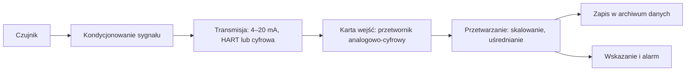

import { SlideContainer, Slide, InstructorNotes, LearningObjective } from '@site/src/components/SlideComponents';

<LearningObjective>

Student opisuje tor pomiarowy od czujnika do zapisu, oblicza bilans pętli 4–20 mA i rozdzielczość przetwornika analogowo-cyfrowego oraz ocenia, jak zakres, próbkowanie, uśrednianie, czas odpowiedzi i kompresja zmieniają zarejestrowany sygnał.

</LearningObjective>

<SlideContainer>

<Slide title="Tor pomiarowy według VIM" type="info">

- VIM (JCGM 200:2012, wyd. 3) to międzynarodowy słownik metrologii; nowszego wydania nie opublikowano (stan: 30.09.2026). **Tor pomiarowy** (ang. measuring chain, 3.10): „ciąg elementów układu pomiarowego tworzących jedną drogę sygnału od czujnika do elementu wyjściowego” (tłumaczenie własne).
- **Układ pomiarowy** (ang. measuring system, 3.2): zestaw przyrządów pomiarowych i często innych urządzeń, łącznie z zasilaniem, zestawiony do uzyskiwania wartości mierzonych w określonych przedziałach. **Czujnik** (ang. sensor, 3.8): element układu, na który bezpośrednio oddziałuje zjawisko, ciało lub substancja niosące wielkość mierzoną, np. pływak przyrządu do pomiaru poziomu.
- **Przetwornik pomiarowy** (ang. measuring transducer, 3.7): urządzenie, którego wielkość wyjściowa ma określoną zależność od wielkości wejściowej, np. termopara, przekładnik prądowy. Przetwornik z wyjściem 4–20 mA (ang. transmitter) nazywamy dalej krótko **przetwornikiem**.
- **Przedział pomiarowy**, czyli zakres pomiarowy (ang. measuring interval, 4.7): wartości, które przyrząd lub układ mierzy z określoną niepewnością instrumentalną w określonych warunkach. **Rozdzielczość** (ang. resolution, 4.14): najmniejsza zmiana wielkości mierzonej, która powoduje dostrzegalną zmianę wskazania.

Źródło: [JCGM, VIM 3.10](https://jcgm.bipm.org/vim/en/3.10.html); [VIM 3.2](https://jcgm.bipm.org/vim/en/3.2.html); [VIM 3.8](https://jcgm.bipm.org/vim/en/3.8.html); [VIM 3.7](https://jcgm.bipm.org/vim/en/3.7.html); [VIM 4.7](https://jcgm.bipm.org/vim/en/4.7.html); [VIM 4.14](https://jcgm.bipm.org/vim/en/4.14.html); [BIPM, publikacje JCGM](https://www.bipm.org/en/committees/jc/jcgm/publications); [Główny Urząd Miar, słowniki metrologiczne](https://infokiosk.gum.gov.pl/inf/wiedza/publikacje/slowniki-metrologiczne/514,Slowniki-metrologiczne.html); [FieldComm Group, HART](https://www.fieldcommgroup.org/technologies/hart/hart-technology-detail)

<InstructorNotes>

Czas: ~2 min

Słownik VIM daje nam wspólny język. Polskie nazwy to powszechne terminy techniczne: polskiego wydania VIM (PKN-ISO/IEC Guide 99:2010) nie ma w wolnym dostępie, dlatego przy każdym podaję termin angielski. Czujnik to tylko pierwszy element, na który działa zjawisko: pływak, element platynowy, fotokomórka. Tor pomiarowy to cała droga sygnału aż do elementu wyjściowego, a w monitoringu także przez kartę wejść, program sterownika i archiwum. Każdy blok schematu może zniekształcić albo zgubić informację, więc przejdziemy je po kolei.

Pytanie do sali: gdzie po drodze może zniknąć trzydziestosekundowy pik stężenia gazu? Kandydatów jest kilka: wolny czujnik, filtr, zbyt rzadkie próbkowanie, uśrednianie, kompresja w archiwum. Typowe nieporozumienie: dokładność pomiaru to dokładność czujnika z karty katalogowej. Wynik zależy od całego toru, o czym powie też część trzecia.

</InstructorNotes>

</Slide>

<Slide title="Pętla prądowa 4–20 mA" type="info">

- IEC 60381-1:1982 (wyd. 2.0) dotyczy analogowych sygnałów prądu stałego, którymi elementy systemów pomiarów i sterowania procesów przemysłowych przesyłają informację. W katalogu IEC jest aktualna, ale jej data stabilności to 2026 — przed zajęciami sprawdzić, czy ją potwierdzono.
- **Pętla prądowa 4–20 mA**: przetwornik wymusza w obwodzie szeregowym prąd zależny od wartości mierzonej; 4 mA odpowiada początkowi, a 20 mA końcowi przedziału pomiarowego (podstawy).
- **Żywe zero** (ang. live zero): początek zakresu to 4 mA, a nie 0 mA. Prąd 0 mA, albo wyraźnie mniejszy niż 4 mA, oznacza uszkodzenie — przerwę w obwodzie, brak zasilania lub uszkodzony przetwornik — a nie poprawny odczyt „zero”.
- Przetwornik **dwuprzewodowy** jest zasilany z pętli, więc na własne potrzeby ma mniej niż 4 mA. **Czteroprzewodowy** ma osobne zasilanie, gdy potrzebuje więcej energii, np. analizator gazu z podgrzewaniem (podstawy).
- Dlaczego prąd, a nie napięcie: w obwodzie szeregowym przez wszystkie elementy płynie ten sam prąd (prawo Kirchhoffa), więc spadek napięcia na rezystancji kabla nie zmienia sygnału, dopóki wystarcza napięcie zasilania; mała rezystancja odbiornika zmniejsza wrażliwość na zakłócenia indukowane (podstawy).
- Poziomy prądu, którymi przetwornik sygnalizuje uszkodzenie (NAMUR NE 43): [część 5](./05-uszkodzenia-toru-i-przyklad-biogazowy.mdx).

Źródło: [IEC, IEC 60381-1:1982](https://webstore.iec.ch/en/publication/1948); zasada pętli prądowej, żywe zero i sposoby zasilania — opis podręcznikowy

<InstructorNotes>

Czas: ~2,5 min

Aktualne wydanie normy dla tego sygnału pochodzi z 1982 roku, a samą pętlę spotkamy dziś w wielu instalacjach. Jej siła to prostota: jeden obwód szeregowy, jeden prąd, który nie zależy od długości kabla. Najważniejsza jest idea żywego zera. Jeśli dolny koniec zakresu to 4 mA, to zero miliamperów nie może być wynikiem pomiaru, tylko sygnałem, że coś się zepsuło. Przy sygnale 0–20 mA przerwany przewód wyglądałby jak pusty zbiornik albo brak gazu.

Pytanie do sali: co pokaże pomiar napełnienia zbiornika gazu, gdy ktoś przetnie kabel przy sygnale 0–20 mA, a co przy 4–20 mA? Typowe nieporozumienie: 4 mA to „mały prąd, prawie zero”. Nie, to pełnoprawny początek zakresu.

</InstructorNotes>

</Slide>

<Slide title="Bilans napięć w pętli 4–20 mA" type="tip">

**Przykład ilustracyjny — dane umowne.** Pętlę dwuprzewodową zbudowano z założonych wartości: zasilacz 24 V, minimalne napięcie zasilania przetwornika 10,5 V (jak z karty katalogowej), kabel 2 × 500 m z miedzi o przekroju 0,5 mm², rezystor pomiarowy 250 Ω.

$$
R_{max} = \frac{U_{zas} - U_{p,min}}{I_{max}} = \frac{24\ \mathrm{V} - 10{,}5\ \mathrm{V}}{0{,}020\ \mathrm{A}} = 675\ \Omega
$$

- Kabel ($\rho = 0{,}0175\ \Omega \cdot \mathrm{mm^2/m}$): $R_k = 0{,}0175 \cdot 1000 / 0{,}5 = 35\ \Omega$, czyli 0,7 V spadku napięcia przy 20 mA.
- Rezystor pomiarowy 250 Ω zamienia 4, 12 i 20 mA na 1, 3 i 5 V (prawo Ohma). Wg noty aplikacyjnej Texas Instruments (TI) do komunikacji HART potrzebna jest rezystancja 230–600 Ω, typowo 250 Ω.
- Obciążenie 250 Ω + 35 Ω = 285 Ω jest mniejsze niż 675 Ω, więc budżet jest spełniony z zapasem 390 Ω. Przy 20 mA przetwornik ma do dyspozycji 24 V − 0,020 A × 285 Ω = 18,3 V ≥ 10,5 V.
- Przerwa w przewodzie daje 0 V na rezystorze, wyraźnie poza przedziałem 1–5 V, więc odbiornik może ją rozpoznać jako uszkodzenie (żywe zero).
- Minimalne napięcie i dopuszczalne obciążenie konkretnego przetwornika podaje jego karta katalogowa; tu przyjęto je umownie. Budżet sprawdza się dla największego prądu: przy sygnale uszkodzenia ≥ 21 mA ([część 5](./05-uszkodzenia-toru-i-przyklad-biogazowy.mdx)), np. 22 mA, $R_{max} = 13{,}5\ \mathrm{V} / 0{,}022\ \mathrm{A} \approx 614\ \Omega$, nadal więcej niż 285 Ω (ocena własna).

Źródło: [Wu, TI SLAAEH0, 2023](https://www.ti.com/lit/pdf/slaaeh0); obliczenia własne

<InstructorNotes>

Czas: ~2 min

Bilans pętli to rachunek, który warto zrobić przed zakupem kabla i przetwornika. Zasilacz daje 24 wolty, przetwornik potrzebuje co najmniej 10,5, więc przy dwudziestu miliamperach na resztę obwodu zostaje 13,5 wolta, czyli 675 omów. Kilometr przewodu to tylko 35 omów, a rezystor pomiarowy 250 omów. Zapas jest duży, bo dane przykładu są umowne i mało wymagające; przy długich liniach i kilku odbiornikach bywa inaczej.

Pytanie do sali: czy możemy dołączyć szeregowo drugi odbiornik 250 omów, np. wskaźnik w dyspozytorni? Tak: 535 omów to nadal mniej niż 675. A trzeci? 785 omów to już za dużo i przy wysokim prądzie przetwornik straci zasilanie. Typowe nieporozumienie: długość kabla nie ma znaczenia, bo to sygnał prądowy. Ma, gdy zabraknie napięcia.

</InstructorNotes>

</Slide>

<Slide title="HART: cyfrowa informacja w pętli analogowej" type="info">

- Protokół **HART** (Highway Addressable Remote Transducer) nakłada na pętlę 4–20 mA dwukierunkową komunikację cyfrową metodą **FSK** (Frequency Shift Keying — kluczowanie z przesuwem częstotliwości) opartą na standardzie Bell 202, z szybkością 1200 bit/s, bez przerywania sygnału 4–20 mA (FieldComm Group).
- Sygnał cyfrowy niesie m.in. status urządzenia, diagnostykę oraz dodatkowe wartości mierzone lub obliczane; polecenia uniwersalne pozwalają odczytać do czterech zmiennych dynamicznych. Możliwe są połączenia punkt–punkt i wielopunktowe (ang. multidrop).
- Typowe urządzenie HART może podawać 2–3 aktualizacje zmiennej głównej na sekundę (FieldComm Group).
- Wg noty aplikacyjnej TI: 1200 Hz oznacza bit 1, a 2200 Hz bit 0; sygnał FSK to sinusoida o wartości międzyszczytowej 1 mA; w połączeniu wielopunktowym prąd każdego urządzenia jest stały, 4 mA, i nie niesie wartości mierzonej.
- Sinusoida FSK ma wartość średnią równą zeru, więc nie zmienia składowej stałej sygnału analogowego (podstawy).
- Wniosek (ocena własna): wartość analogowa może nadal trafiać do logiki funkcji bezpieczeństwa ([W2, część 5](../wyklad-02-analiza-ryzyka/05-lopa-i-sil.mdx)), a HART dodaje diagnostykę ([część 5](./05-uszkodzenia-toru-i-przyklad-biogazowy.mdx)). Sieci polowe i protokoły cyfrowe — W4.

Źródło: [FieldComm Group, HART Technology Detail](https://www.fieldcommgroup.org/technologies/hart/hart-technology-detail); [FieldComm Group, HART Technology Explained](https://www.fieldcommgroup.org/technologies/hart/hart-technology-explained); [Wu, TI SLAAEH0, 2023](https://www.ti.com/lit/pdf/slaaeh0)

<InstructorNotes>

Czas: ~1,5 min

HART to sprytny kompromis: stary, pewny sygnał analogowy zostaje, a na nim płynie cicha rozmowa cyfrowa. Dwie częstotliwości oznaczają zera i jedynki, a ich średnia jest równa zeru, więc sterownik czytający miliampery nie widzi różnicy. Dzięki temu z tego samego przetwornika możemy odczytać jego status, diagnostykę i dodatkowe wartości.

Szybkość to tylko kilka aktualizacji na sekundę, więc HART nie służy do szybkiej regulacji. Pytanie do sali: czy funkcja bezpieczeństwa powinna czekać na cyfrową wartość z HART, czy korzystać z sygnału analogowego? Typowe nieporozumienie: skoro przetwornik ma HART, to jego diagnostyka sama zadziała. Ktoś musi ją odczytać i wiedzieć, co zrobić z komunikatem.

</InstructorNotes>

</Slide>

<Slide title="Przetwornik A/C, rozdzielczość i zakres" type="info">

- **Przetwornik analogowo-cyfrowy** (A/C, ang. ADC) o N bitach ma $2^N$ kodów. Krok kwantyzacji $q = FS/2^N$, gdzie FS to pełny zakres wejścia, to wartość jednego **LSB** (Least Significant Bit — najmniej znaczący bit); błąd kwantyzacji idealnego przetwornika mieści się w ±½ LSB (podstawy).
- GUM (JCGM 100:2008, F.2.2.1): dla rozdzielczości wskazania δx przyjmuje się rozkład prostokątny, więc $u = \delta x/\sqrt{12} \approx 0{,}29\,\delta x$.

**Przykład ilustracyjny — dane umowne.** Karta wejść 12-bitowa o zakresie 0–20 mA i analizator H₂S z wyjściem 4–20 mA skalowanym 0–5000 ppm; zakres obejmuje 100–4000 ppm w surowym biogazie z [W2, część 2](../wyklad-02-analiza-ryzyka/02-hazid-i-hazop.mdx).

- $q = 20\ \mathrm{mA}/4096 = 4{,}88\ \mu\mathrm{A}$; przedział 4–20 mA zajmuje $16/20 \cdot 4096 = 3276{,}8$ kodu.
- 1 LSB ≈ 5000 ppm / 3276,8 ≈ 1,53 ppm, a $u = 1{,}53/\sqrt{12} \approx 0{,}44$ ppm. Karta 16-bitowa dałaby ≈ 0,095 ppm na LSB.
- Kwantyzacja rzadko jest słabym ogniwem: w budżecie niepewności z [części 3](./03-niepewnosc-i-wzorcowanie.mdx) jej udział jest bliski zera (ocena własna). Słabym ogniwem bywają **zakres i skalowanie**: ten sam przetwornik ustawiony na 0–1000 ppm osiąga **nasycenie zakresu** przy 1000 ppm i zapis nie pokazuje, jak wysoko naprawdę wzrosło stężenie.

Źródło: [JCGM 100:2008, zał. F (ISO)](https://www.iso.org/sites/JCGM/GUM/JCGM100/C045315e-html/C045315e_FILES/MAIN_C045315e/AF_e.html); [JCGM 100:2008 (BIPM)](https://www.bipm.org/documents/20126/2071204/JCGM_100_2008_E.pdf); kwantyzacja — podstawy; obliczenia własne

<InstructorNotes>

Czas: ~2,5 min

Karta wejść zamienia prąd na liczbę. Dwanaście bitów to 4096 poziomów, ale przy wejściu 0–20 mA pasmo 4–20 mA wykorzystuje tylko cztery piąte z nich. Na zakresie 5000 ppm jeden krok to około półtora ppm, a niepewność z kwantyzacji jest jeszcze ponad trzy razy mniejsza. To liczby znacznie mniejsze niż inne składniki niepewności, które policzymy w części trzeciej.

Prawdziwy problem leży gdzie indziej. Ktoś chce lepszej rozdzielczości i ustawia zakres 0–1000 ppm. W normalnej pracy wszystko wygląda dobrze, a przy awarii odsiarczania wykres zatrzymuje się płasko na 1000 ppm. Pytanie do sali: jak odróżnić na wykresie nasycenie zakresu od rzeczywiście stałego stężenia? Typowe nieporozumienie: więcej bitów zawsze oznacza lepszy pomiar.

</InstructorNotes>

</Slide>

<Slide title="Próbkowanie i aliasing" type="warning">

- Twierdzenie o próbkowaniu (podstawy): sygnał o najwyższej częstotliwości $f_{max}$ trzeba próbkować z częstotliwością $f_s > 2 f_{max}$. Składowa o częstotliwości $f$ powyżej $f_s/2$ (częstotliwości Nyquista) pojawia się w danych jako składowa o częstotliwości $|f - k f_s|$, gdzie $k$ jest liczbą całkowitą dobraną tak, by wynik leżał w przedziale od 0 do $f_s/2$ — to **aliasing**.

**Przykład ilustracyjny — dane umowne.** Składowa 50 Hz, np. zakłócenie od sieci, w sygnale próbkowanym bez filtra.

- Próbkowanie z częstotliwością 49 Hz: w danych pojawia się oscylacja 1 Hz, której w procesie nie ma.
- Próbkowanie z częstotliwością 50 Hz albo 1 Hz: składowa daje 0 Hz, czyli stałe przesunięcie, którego wartość zależy od fazy próbkowania.
- Aliasingu nie da się usunąć po próbkowaniu. Pomaga analogowy **filtr antyaliasingowy** przed przetwornikiem A/C albo szybkie próbkowanie i filtracja cyfrowa przed zmniejszeniem liczby próbek (podstawy).
- Uśrednianie blokowe w interwale zapisu także działa jak filtr dolnoprzepustowy (podstawy).
- Wiatr: większość nowych turbin zapisuje w SCADA (Supervisory Control and Data Acquisition — system nadzoru i akwizycji danych) ponad 200 zmiennych w interwałach 1–10 min, najczęściej 10 min, co według przeglądu Maldonado-Correa i in. (2020) ogranicza możliwości diagnostyczne. Diagnostyka drgań wymaga próbkowania rzędu kiloherców, czyli o rzędy wielkości szybszego (zasada, ocena własna); CMS (Condition Monitoring System — system monitorowania stanu) omówimy w W7.

Źródło: [Maldonado-Correa i in., 2020](https://doi.org/10.3390/en13123132); twierdzenie o próbkowaniu i aliasing — podstawy; obliczenia własne

<InstructorNotes>

Czas: ~2,5 min

Próbkowanie to robienie zdjęć sygnału w równych odstępach. Jeśli sygnał zmienia się szybciej, niż robimy zdjęcia, zobaczymy coś, czego nie ma, jak koła dyliżansu, które na filmie kręcą się do tyłu. Składowa pięćdziesięciu herców próbkowana co jedną czterdziestą dziewiątą sekundy udaje powolną oscylację jednego herca. Próbkowana dokładnie co sekundę zamienia się w stałe przesunięcie, które wygląda jak błąd zera.

Tego nie naprawi żaden program po fakcie, dlatego filtr stawia się przed przetwornikiem. Uśrednianie w oknie jednej sekundy obejmuje pięćdziesiąt pełnych okresów, więc całkowicie usuwa składową sieciową. Pytanie do sali: czy dziesięciominutowe dane SCADA pokażą drgania przekładni? Typowe nieporozumienie: im częściej zapisujemy, tym lepiej, niezależnie od filtrów.

</InstructorNotes>

</Slide>

<Slide title="Uśrednianie, filtracja i czas odpowiedzi" type="info">

- IEC 61724-1:2021 (3.2–3.4, tłumaczenie własne): **interwał próbkowania** — czas między próbkami; **zapis** — dane zarejestrowane i przechowywane; **interwał zapisu** τ — czas między zapisami.
- IEA PVPS T13-03:2014: dane należy próbkować co sekundę lub częściej, a średnie zapisywać co 5–15 min; dłuższe średnie mogą utrudnić analizę, krótsze przeciążyć bazę danych. Lindig i in. (2020): dane pogodowe mierzone co 1 min i elektryczne co 15 min uśredniono do wspólnego interwału.

**Przykład ilustracyjny — dane umowne.** Pik stężenia 1000 ppm trwający 30 s w oknie 10-minutowym, poza nim 0 ppm; próg alarmu 500 ppm i czujnik o t₉₀ = 30 s przyjęto umownie.

- Średnia 10-minutowa: 1000 ppm × 30 s / 600 s = 50 ppm, poniżej progu 500 ppm, więc zapis samej średniej ukrywa zdarzenie. Warto zapisywać też minimum i maksimum w interwale (ocena własna).
- **Czas odpowiedzi na skok** (ang. step response time, VIM 4.23): czas od skokowej zmiany wielkości wejściowej do chwili, gdy wskazanie ustali się w określonych granicach wokół wartości końcowej. t₉₀ to czas dojścia do 90% zmiany — jeden z możliwych wyborów tych granic (podstawy).
- Czujnik pierwszego rzędu: $y(t) = 1 - e^{-t/\tau}$ i $t_{90} = \tau \ln 10$. Dla t₉₀ = 30 s stała czasowa τ ≈ 13 s, a impuls gazu trwający 10 s osiąga tylko ok. 54% wartości rzeczywistej.

Źródło: [IEC 61724-1:2021, próbka normy](https://cdn.standards.iteh.ai/samples/103495/100a1ea212914dd38ba72a9138af4ce1/IEC-61724-1-2021.pdf); [IEA PVPS T13-03:2014](https://iea-pvps.org/wp-content/uploads/2020/01/IEA-PVPS_T13-D2_3_Analytical_Monitoring_of_PV_Systems_Final.pdf); [Lindig i in., 2020](https://doi.org/10.3390/en13195099); [JCGM, VIM 4.23](https://jcgm.bipm.org/vim/en/4.23.html); obliczenia własne

<InstructorNotes>

Czas: ~2,5 min

Norma fotowoltaiczna starannie odróżnia próbkę od zapisu. Próbkujemy często, a zapisujemy średnie, bo inaczej baza danych by pękła. Średnia ma jednak cenę. Trzydziestosekundowy pik tysiąca ppm w dziesięciominutowym oknie daje średnią pięćdziesiąt ppm i w archiwum nie ma po nim śladu. Dlatego warto zapisywać również minimum i maksimum w interwale, jeśli rejestrator na to pozwala.

Druga pułapka to sam czujnik. Czujnik o czasie t₉₀ równym trzydzieści sekund reaguje jak filtr, więc z krótkiego impulsu gazu pokaże niewiele ponad połowę wartości. Pytanie do sali: co jest gorsze dla alarmu, wolny czujnik czy średnia dziesięciominutowa? Typowe nieporozumienie: czas odpowiedzi z karty katalogowej to czas całego toru. Dochodzą przetwarzanie, próbkowanie i logika.

</InstructorNotes>

</Slide>

<Slide title="Zapis danych i kompresja" type="warning">

- **Strefa nieczułości** (ang. deadband) w archiwum: nową wartość zapisuje się tylko wtedy, gdy różni się od ostatnio zapisanej o więcej niż nastawa; między zapisami archiwum pokazuje linię poziomą albo interpolację (opis podręcznikowy).
- **Kompresja danych** metodą „drzwi wahadłowych” (ang. swinging door): punkt zapisuje się dopiero wtedy, gdy prosta od ostatniego zapisanego punktu nie mieści się w zadanej odchyłce dla wszystkich próbek pośrednich; przy odczycie archiwum interpoluje liniowo. Obie metody są stratne (opis podręcznikowy).

**Przykład ilustracyjny — dane umowne.** W archiwum ustawiono strefę nieczułości 50 ppm dla sygnału H₂S.

- Powolna zmiana o 40 ppm nie zostanie nigdy zapisana: na wykresie widać płaską linię, podobną do **sygnału zamrożonego** ([część 5](./05-uszkodzenia-toru-i-przyklad-biogazowy.mdx)).
- Zakres, skalowanie, liczba bitów, interwał próbkowania, interwał zapisu, kompresja i precyzja zapisu należą do specyfikacji toru pomiarowego i trzeba je dokumentować tak jak dane czujnika (ocena własna).
- Integralność sygnału (podstawy): skrętka ekranowana z ekranem uziemionym po jednej stronie, separacja galwaniczna, np. między wieżą turbiny albo polem PV a budynkiem, ochrona przeciwprzepięciowa długich linii zewnętrznych.
- Walidacja i jakość danych — W5.

Źródło: strefa nieczułości, kompresja i integralność sygnału — opis podręcznikowy (ocena własna); obliczenia własne

<InstructorNotes>

Czas: ~2,5 min

Archiwum danych rzadko zapisuje wszystko, co dostaje. Strefa nieczułości i kompresja oszczędzają miejsce, ale są stratne: to, co nie przekroczy progu, znika bez śladu. Jeśli strefa wynosi pięćdziesiąt ppm, powolny wzrost o czterdzieści nigdy się nie pojawi, a wykres wygląda jak zamrożony sygnał. Analityk, który po roku szuka przyczyny awarii, nie wie, czy czujnik stał, czy archiwum nie zapisywało.

Dlatego ustawienia archiwum należą do toru pomiarowego i trzeba je dokumentować tak samo jak zakres czujnika. Pytanie do sali: kto w biogazowni zmienia ustawienia archiwum i czy ktoś to zapisuje? Typowe nieporozumienie: dane w archiwum to surowe pomiary. Często są już przetworzone, uśrednione i skompresowane.

</InstructorNotes>

</Slide>

</SlideContainer>

## Źródła

1. JCGM (2012). *International vocabulary of metrology — Basic and general concepts and associated terms (VIM)*, wyd. 3, JCGM 200:2012. BIPM. [https://jcgm.bipm.org/vim/en/index.html](https://jcgm.bipm.org/vim/en/index.html); hasła: [https://jcgm.bipm.org/vim/en/3.2.html](https://jcgm.bipm.org/vim/en/3.2.html), [https://jcgm.bipm.org/vim/en/3.7.html](https://jcgm.bipm.org/vim/en/3.7.html), [https://jcgm.bipm.org/vim/en/3.8.html](https://jcgm.bipm.org/vim/en/3.8.html), [https://jcgm.bipm.org/vim/en/3.10.html](https://jcgm.bipm.org/vim/en/3.10.html), [https://jcgm.bipm.org/vim/en/4.7.html](https://jcgm.bipm.org/vim/en/4.7.html), [https://jcgm.bipm.org/vim/en/4.14.html](https://jcgm.bipm.org/vim/en/4.14.html), [https://jcgm.bipm.org/vim/en/4.23.html](https://jcgm.bipm.org/vim/en/4.23.html)
2. BIPM (b.d.). *JCGM publications* (wykaz aktualnych wydań GUM i VIM). [https://www.bipm.org/en/committees/jc/jcgm/publications](https://www.bipm.org/en/committees/jc/jcgm/publications)
3. Główny Urząd Miar (b.d.). *Słowniki metrologiczne* (m.in. PKN-ISO/IEC Guide 99:2010, bez pliku do pobrania). [https://infokiosk.gum.gov.pl/inf/wiedza/publikacje/slowniki-metrologiczne/514,Slowniki-metrologiczne.html](https://infokiosk.gum.gov.pl/inf/wiedza/publikacje/slowniki-metrologiczne/514,Slowniki-metrologiczne.html)
4. IEC (1982). *IEC 60381-1:1982 Analogue signals for process control systems — Part 1: Direct current signals*, wyd. 2.0. [https://webstore.iec.ch/en/publication/1948](https://webstore.iec.ch/en/publication/1948)
5. FieldComm Group (b.d.). *HART Technology Detail*. [https://www.fieldcommgroup.org/technologies/hart/hart-technology-detail](https://www.fieldcommgroup.org/technologies/hart/hart-technology-detail)
6. FieldComm Group (b.d.). *HART Technology Explained*. [https://www.fieldcommgroup.org/technologies/hart/hart-technology-explained](https://www.fieldcommgroup.org/technologies/hart/hart-technology-explained)
7. Wu J. (2023). *A Basic Guide to the HART Protocol* (nota aplikacyjna SLAAEH0). Texas Instruments. [https://www.ti.com/lit/pdf/slaaeh0](https://www.ti.com/lit/pdf/slaaeh0)
8. JCGM (2008). *Evaluation of measurement data — Guide to the expression of uncertainty in measurement* (GUM), JCGM 100:2008, zał. F; w 2026 r. wydano zmianę 1 (JCGM 100:2008/Amd.1:2026, nieliniowość modeli pomiaru). [https://www.iso.org/sites/JCGM/GUM/JCGM100/C045315e-html/C045315e_FILES/MAIN_C045315e/AF_e.html](https://www.iso.org/sites/JCGM/GUM/JCGM100/C045315e-html/C045315e_FILES/MAIN_C045315e/AF_e.html); PDF: [https://www.bipm.org/documents/20126/2071204/JCGM_100_2008_E.pdf](https://www.bipm.org/documents/20126/2071204/JCGM_100_2008_E.pdf)
9. IEC (2021). *IEC 61724-1:2021 Photovoltaic system performance — Part 1: Monitoring*, wyd. 2.0, próbka normy. [https://cdn.standards.iteh.ai/samples/103495/100a1ea212914dd38ba72a9138af4ce1/IEC-61724-1-2021.pdf](https://cdn.standards.iteh.ai/samples/103495/100a1ea212914dd38ba72a9138af4ce1/IEC-61724-1-2021.pdf)
10. Woyte A., Richter M., Moser D., Reich N., Green M., Mau S., Beyer H.G. (2014). *Analytical Monitoring of Grid-connected Photovoltaic Systems: Good Practices for Monitoring and Performance Analysis* (Report IEA-PVPS T13-03:2014). IEA PVPS. [https://iea-pvps.org/wp-content/uploads/2020/01/IEA-PVPS_T13-D2_3_Analytical_Monitoring_of_PV_Systems_Final.pdf](https://iea-pvps.org/wp-content/uploads/2020/01/IEA-PVPS_T13-D2_3_Analytical_Monitoring_of_PV_Systems_Final.pdf)
11. Lindig S., Louwen A., Moser D., Topic M. (2020). Outdoor PV System Monitoring — Input Data Quality, Data Imputation and Filtering Approaches. *Energies* 13(19): 5099. [https://doi.org/10.3390/en13195099](https://doi.org/10.3390/en13195099)
12. Maldonado-Correa J., Martín-Martínez S., Artigao E., Gómez-Lázaro E. (2020). Using SCADA Data for Wind Turbine Condition Monitoring: A Systematic Literature Review. *Energies* 13(12): 3132. [https://doi.org/10.3390/en13123132](https://doi.org/10.3390/en13123132)
