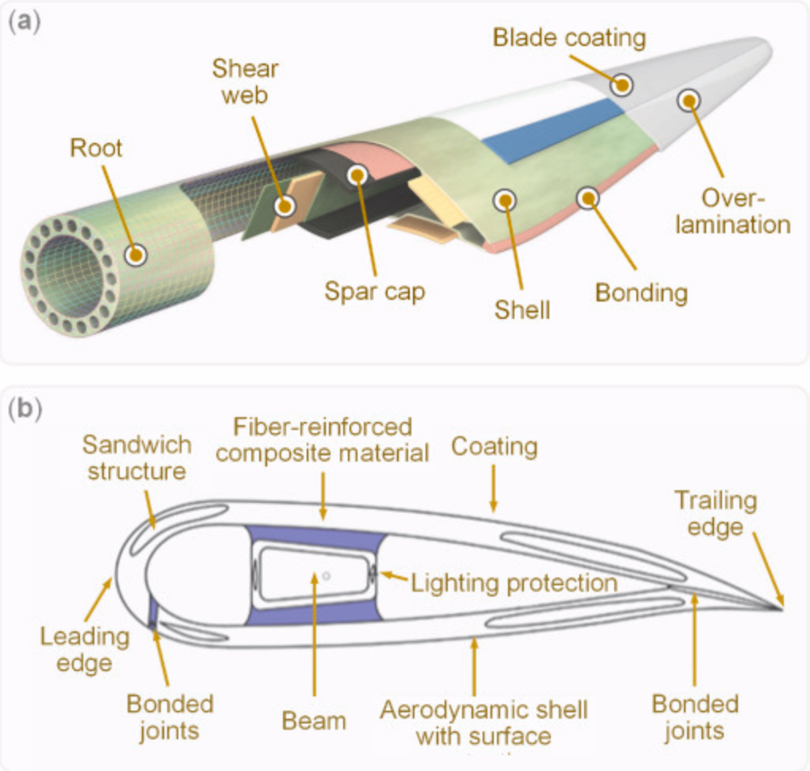
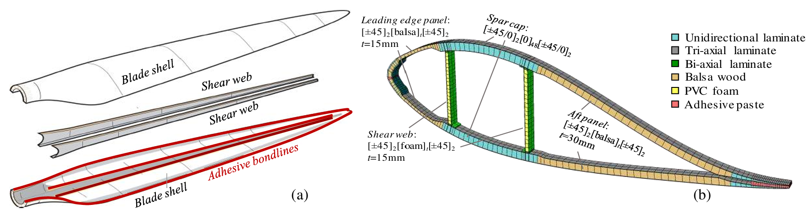
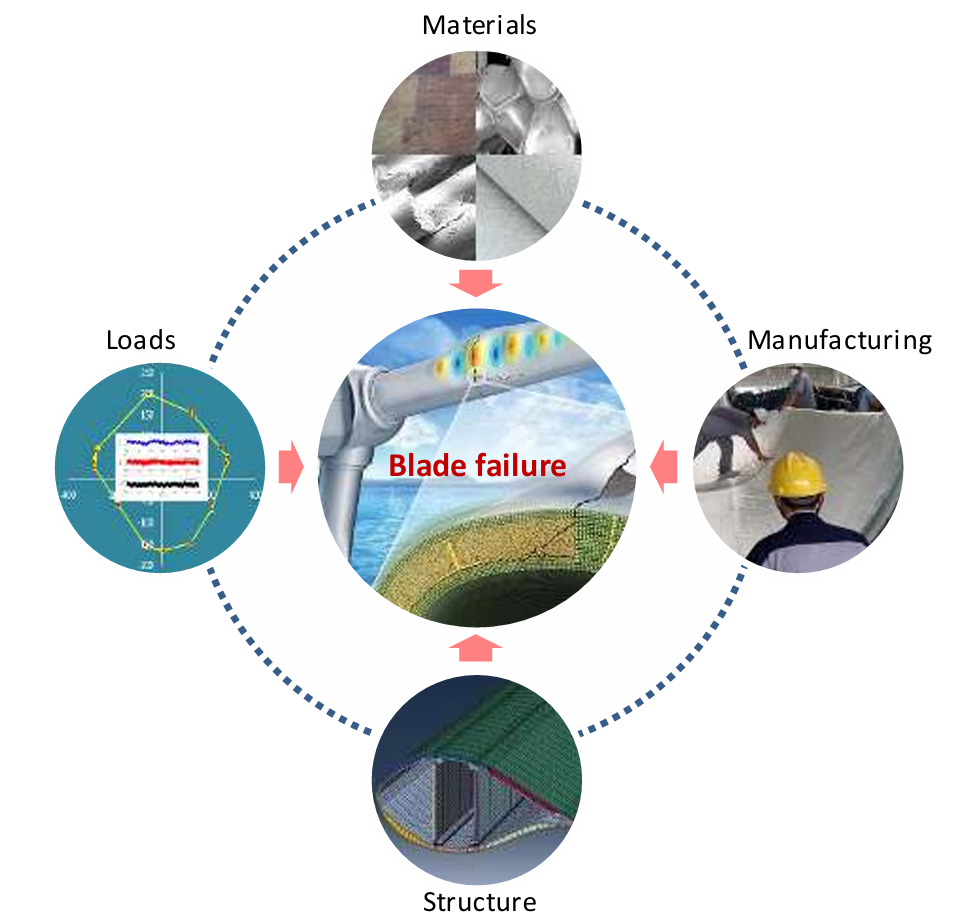
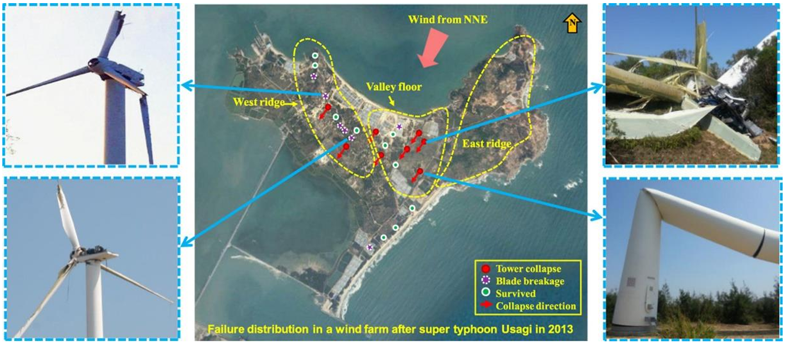
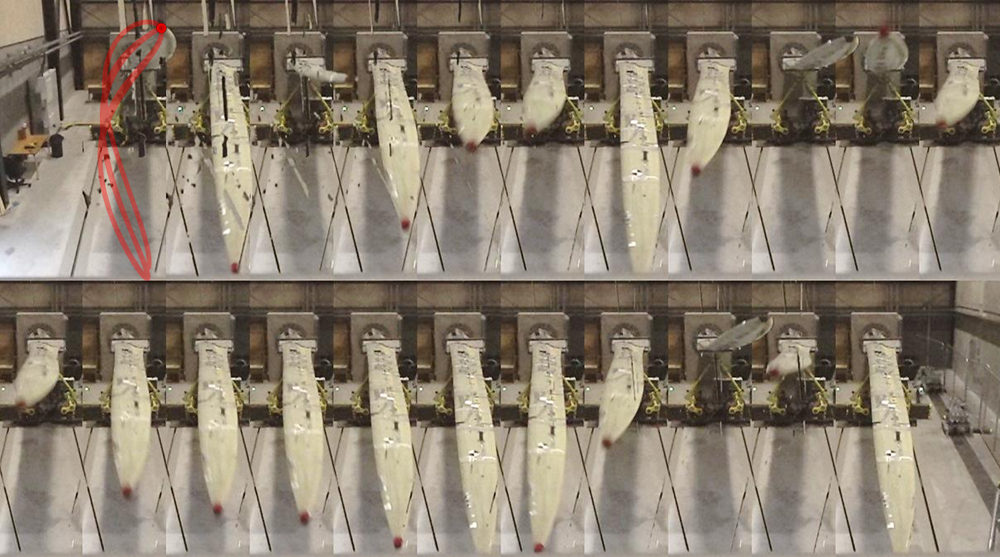
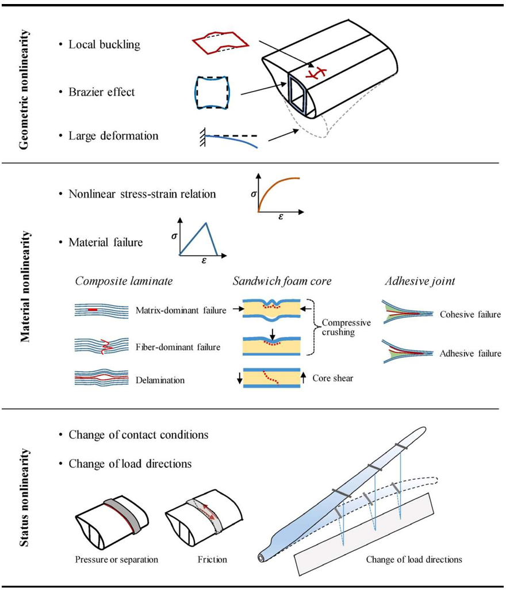
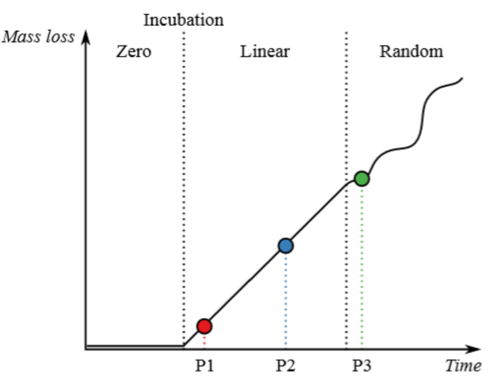
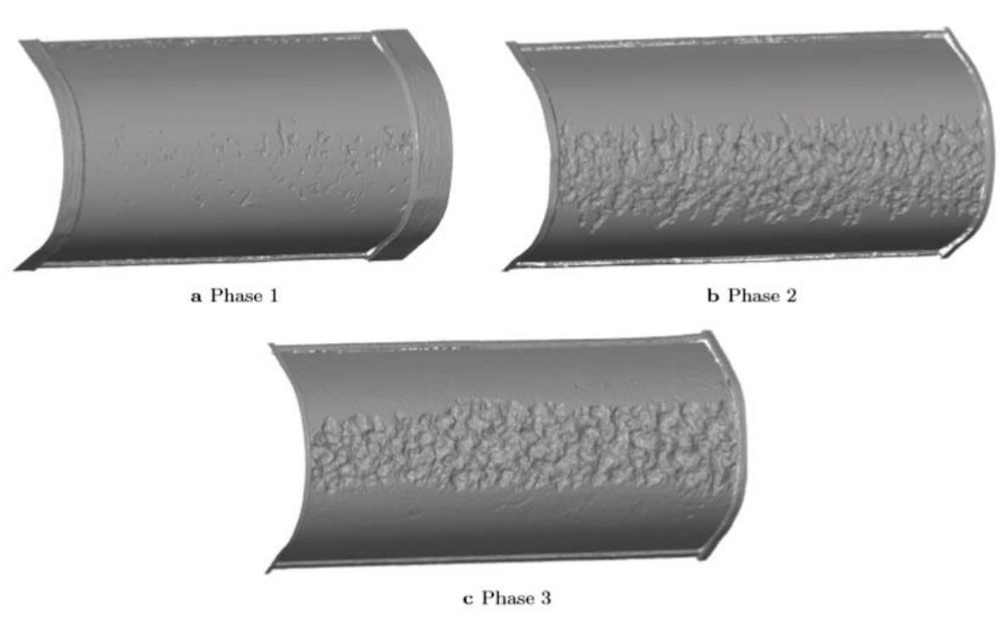

import { 
  SlideContainer, 
  Slide, 
  KeyPoints, 
  SupportingDetails, 
  InstructorNotes,
  VisualSeparator,
  InfoBox,
  WarningBox,
  SuccessBox,
  LearningObjective,
  KeyConcept,
  Example
} from '@site/src/components/SlideComponents';

<SlideContainer>

<Slide title="🎯 Zagrożenia mechaniczne i aerodynamiczne turbin" type="info">

<LearningObjective>
Po tej sekcji student identyfikuje główne zagrożenia mechaniczne i aerodynamiczne w turbinach wiatrowych, rozumie mechanizmy ich powstawania i potrafi scharakteryzować podstawowe metody zapobiegania.
</LearningObjective>

<KeyPoints title="📋 Główne tematy">
- 🔧 **Zagrożenia mechaniczne** - awarie łopatek, przekładni i generatorów
- 💨 **Zagrożenia aerodynamiczne** - ekstremalne wiatry i obciążenia
- 🌨️ **Zagrożenia środowiskowe** - oblodzenie i burze
- 🛡️ **Metody zapobiegania** - systemy bezpieczeństwa i monitoring
</KeyPoints>

<InstructorNotes>
**Turbiny wiatrowe** pracują w **ekstremalnych warunkach** przez cały czas eksploatacji. W Polsce mamy około **sześciu tysięcy turbin**, co daje nam szesnaście tysięcy łopatek. Statystyki pokazują, że średnio **jedna do dwóch awarii łopatek** zdarza się rocznie na każde sto turbin.

Konsekwencje są poważne. Fragmenty mogą być wyrzucone na odległość **powyżej ośmiuset metrów**. Dlatego **wczesne wykrywanie** i **systemy zapobiegania** są kluczowe.

Dzisiaj omówimy cztery główne kategorie zagrożeń. Zacznijmy od **zagrożeń mechanicznych** - to awarie łopatek, przekładni i generatorów. Następnie przejdziemy do **zagrożeń aerodynamicznych**, czyli ekstremalnych wiatrów i obciążeń. Potem zajmiemy się **zagrożeniami środowiskowymi** - oblodzeniem i burzami. Na końcu omówimy **metody zapobiegania** poprzez systemy bezpieczeństwa i monitoring.

**CMS** to skrót od Condition Monitoring Systems - systemów monitorowania stanu. Są one kluczowe dla wczesnego wykrywania problemów.
</InstructorNotes>

</Slide>

<VisualSeparator type="energy" />

<Slide title="🔧 Klasyfikacja zagrożeń mechanicznych" type="warning">

<KeyPoints title="📊 Główne kategorie zagrożeń">
- 🌪️ **Łopaty wirnika** - pęknięcia, uszkodzenia strukturalne
- ⚙️ **Przekładnia i generator** - awarie łożysk, zużycie
- 🏗️ **Konstrukcja wieży** - pękanie, korozja, fundament
- 🔗 **Systemy połączeń** - luzy, uszkodzenia śrub
</KeyPoints>

<WarningBox title="⚠️ Krytyczne zagrożenie">
Uszkodzenie łopaty może skutkować **oderwaniem kawałków metalu lub włókna szklanego** o masie do 500kg, które mogą zostać wyrzucone na odległość ponad 800m.
</WarningBox>

<InstructorNotes>
**Zagrożenia mechaniczne** dzielą się na cztery główne kategorie.

Pierwsza to **łopaty wirnika** - tutaj mamy pęknięcia i uszkodzenia strukturalne. Druga kategoria to **przekładnia i generator** - głównie awarie łożysk i zużycie mechaniczne. Trzecia to **konstrukcja wieży** - pękanie, korozja i problemy z fundamentem. Czwarta kategoria to **systemy połączeń** - luzy i uszkodzenia śrub.

**Najkrytyczniejsze jest uszkodzenie łopaty**. Fragmenty o masie do **pięćset kilogramów** mogą być wyrzucone na odległość **ponad osiemset metrów**. To pokazuje, dlaczego wczesne wykrywanie jest tak ważne.

Przejdziemy teraz do szczegółowej analizy pęknięć strukturalnych.
</InstructorNotes>

</Slide>

<VisualSeparator type="default" />

<Slide title="🌪️ Pęknięcia strukturalne łopaty wirnika" type="warning">

  

    <h3>📍 Lokalizacja pęknięć</h3>
    <ul>
      <li><strong>Korzeń łopaty</strong> - obszar największych naprężeń</li>
      <li><strong>Krawędź natarcia</strong> - najbardziej narażona część</li>
      <li><strong>Środek ciężkości</strong> - punkty krytyczne obciążenia</li>
      <li><strong>Połączenia z piastą</strong> - mocowania mechaniczne</li>
    </ul>
  

  
  

    <h3>⚙️ Przyczyny powstawania</h3>
    <ul>
      <li><strong>Zmęczenie materiałów</strong> - cykliczne obciążenia przez lata</li>
      <li><strong>Koncentracja naprężeń</strong> - wady konstrukcyjne lub produkcyjne</li>
      <li><strong>Mikropęknięcia</strong> - niewidoczne wady przemysłowe</li>
      <li><strong>Starzenie materiału</strong> - degradacja żywicy i włókien</li>
    </ul>
  

  
  

    <h3>⚠️ Skutki pęknięć</h3>
    <ul>
      <li><strong>Oderwanie fragmentów</strong> - kawałki do 500kg</li>
      <li><strong>Uszkodzenie turbiny</strong> - kompletna awaria systemu</li>
      <li><strong>Zagrożenie dla okolicy</strong> - fragmenty na 800m+</li>
      <li><strong>Kosztowna naprawa</strong> - wymiana całej łopaty</li>
    </ul>
  

 

**Rysunek 1. Widok trójwymiarowy typowej łopaty turbiny wiatrowej i jej komponentów (zaadaptowane z Gurit).** (b) Widok przekroju poprzecznego elementów łopaty turbiny wiatrowej (zaadaptowane z).

<InstructorNotes>
**Korzeń łopaty** to obszar **największych naprężeń**, dlatego pęknięcia najczęściej tam występują. Pokazuję schemat rozkładu naprężeń - **krawędź natarcia**, **środek ciężkości** i **połączenia z piastą** to punkty krytyczne. **Zmęczenie materiałów** przez cykliczne obciążenia oraz **koncentracja naprężeń** w wadach konstrukcyjnych to główne przyczyny. **Mikropęknięcia** niewidoczne gołym okiem mogą w ciągu tygodni doprowadzić do katastrofalnej awarii - jeden mały pęknięcie propaguje się i może skutkować **oderwaniem fragmentów do 500kg**. **Metody wykrywania** obejmują ultradźwięki, penetranty fluorescencyjne i monitoring wibracji - charakterystyki wibracyjne zmieniają się z rozwojem pęknięcia. Przejdziemy teraz do wizualizacji konkretnych przypadków.
</InstructorNotes>

</Slide>

<VisualSeparator type="default" />

<Slide title="🏗️ Konstrukcja strukturalna łopaty turbiny wiatrowej" type="info">

**Rysunek 2. Typowa konstrukcja strukturalna łopaty turbiny wiatrowej.** (a) Szkic pokazujący, że łopata jest złożona przez klejenie czterech części. (b) Przekrój poprzeczny komercyjnie dostępnej dużej łopaty wirnika turbiny wiatrowej. Cztery linie klejenia są używane do połączenia dwóch ścianek nośnych z parą pasów nośnych. Dwie linie klejenia są używane do połączenia dwóch powłok generujących siłę nośną na krawędzi natarcia (lewy koniec) i krawędzi spływu (prawy koniec). Dwa pasy nośne składają się z znacznej ilości laminatów jednokierunkowych odpowiedzialnych za przenoszenie momentu zginającego w kierunku płaszczyzny (czyli zginanie wokół osi mniejszej). Konstrukcje warstwowe są używane do budowy złożonej geometrii powłok aerodynamicznych, które muszą być lekkie i jednocześnie odporne na wyboczenie.

<InstructorNotes>
Ten rysunek pokazuje **kluczowe elementy konstrukcyjne** łopaty z dwóch perspektyw. Po lewej widzimy **schemat montażu** - łopata składa się z czterech głównych podzespołów połączonych klejeniem. Po prawej mamy **przekrój poprzeczny** rzeczywistej komercyjnej łopaty użytecznościowej.

**Cztery spoiny klejowe** łączą dwie dźwigary-środniki - to są **shear webs**, które przenoszą siły ścinające. **Kolejne dwie spoiny** łączą skorupy aerodynamiczne na krawędzi natarcia i spływu. **Pasy dźwigara** - to są **spar caps** - zawierają znaczny udział **laminatów jednokierunkowych** i to właśnie one przenoszą dominujący moment zginający w kierunku klapowym, czyli wokół osi słabej.

**Skorupy aerodynamiczne** to konstrukcje kanapkowe - mają rdzeń z pianki PVC lub drewna balsa i cienkie okładziny z kompozytu włóknistego. To kompromis między małą masą a odpornością na wyboczenie cienkościennych powłok o złożonej krzywiźnie.

Warto podkreślić **ścieżkę obciążeń**: od ciśnienia aerodynamicznego na skorupie, przez ścieżkę nośną do pasów dźwigara i dalej do piasty. Ta struktura powstaje przez **infuzję próżniową** - proces VARI, a następnie przechodzi badania nieniszczące, **NDT**, ukierunkowane na strefy krytyczne - pasy dźwigara i spoiny na krawędziach natarcia i spływu.

Kluczowe zrozumienie: już na starcie łopata **rodzi się z pewną populacją nieciągłości** - pęcherzyki powietrza, falistość włókien. Część z nich pozostaje utajona, a część staje się inicjatorami degradacji pod zmęczeniem i wpływem środowiska w całym 20-25-letnim cyklu życia. To uzasadnia, dlaczego widoczne w przekroju miejsca są podatne na defekty i późniejsze mechanizmy uszkodzeń.
</InstructorNotes>

</Slide>

<VisualSeparator type="default" />

<Slide title="🔄 Aspekty interaktywne wpływające na awarię łopaty wirnika" type="warning">

**Rysunek 3. Interaktywne aspekty wpływające na awarię łopaty wirnika.** Współdziałanie między właściwościami materiałów, procesami produkcyjnymi, projektami strukturalnymi i obciążeniami eksploatacyjnymi (oraz warunkami środowiskowymi) jest kluczowe, aby być rozważanym w ich całości, jeśli integralność strukturalna kompozytowych łopat wirnika ma wytrzymać wyznaczony okres eksploatacji 20 do 25 lat.

<InstructorNotes>
Ten diagram syntetyzuje **cztery zbiory czynników**, które współdziałają ze sobą, a nie działają osobno. To materiały, wytwarzanie, konstrukcja i obciążenia wraz z warunkami środowiskowymi. Autorzy akcentują, że tylko **kolektywne ujęcie tych domen** pozwala osiągnąć zakładane 20-25 lat pracy łopaty.

To jest mapa **myślenia systemowego**. Drobna zmiana w procesie produkcyjnym - na przykład jakość adhezji w spoinie - może nieliniowo wzmocnić podatność konstrukcji na lokalne wyboczenia pod zadanym widmem obciążeń i mikroklimatem. Nie możemy patrzeć na każdy element osobno - musimy widzieć **pętlę przyczynową**.

Przykład takiej pętli: jak **falistość włókien** - to defekt materiałowy związany z procesem wytwarzania - zmienia efektywną sztywność i odkształcalność konstrukcji. To z kolei, pod kombinacją zginanie-skręcanie, czyli pod obciążeniami eksploatacyjnymi, prowadzi do przyspieszonego rozwoju delaminacji. Ten sam diagram dobrze łączy się z wprowadzeniem do **multidyscyplinarnego projektowania łopat** i pokazuje, czemu proste marginesy bezpieczeństwa nie wystarczą w rzeczywistej eksploatacji. Potrzebujemy podejścia holistycznego.
</InstructorNotes>

</Slide>

<VisualSeparator type="default" />

<Slide title="🌪️ Awaria farmy wiatrowej podczas tajfunu" type="danger">

**Rysunek 4. Farma wiatrowa zlokalizowana na wyspie przybrzeżnej uderzona przez tajfun w 2013 roku.** Łącznie 35 z 75 łopat o długości 22,9 metra zostało całkowicie złamanych w farmie wiatrowej. Miejsce pęknięcia znajduje się od 6 do 11 m od korzenia łopaty. Szacowana prędkość wiatru podczas tajfunu była wyższa niż projektowa prędkość wiatru przetrwania turbiny.

<InstructorNotes>
To **dramatyczny przykład** tego, co się dzieje, gdy obciążenia przekraczają projektową prędkość wiatru przetrwania turbiny - **survival wind speed**. Fotografia dokumentuje ekstremalne obciążenie wiatrem: **35 z 75 łopat** o długości 22,9 metra uległo całkowitemu złamaniu podczas tajfunu w 2013 roku na wyspie przybrzeżnej.

**Lokalizacja pęknięcia** jest bardzo charakterystyczna - mieści się między 6 a 11 metrami od nasady łopaty. To nie przypadek. To obszar, gdzie **rozkład naprężeń w strefie przejściowej grubości** generuje gorące punkty inicjacji złamań. Wszystkie pęknięcia w podobnym miejscu potwierdzają, że to krytyczny obszar konstrukcyjny.

Ten pojedynczy kadr jest materiałem do dyskusji o **event-driven design** - projektowaniu ukierunkowanym na rzadkie, ale katastrofalne zdarzenia. Jak takie zdarzenia zmieniają profil ryzyka i wymagania na sterowanie oraz zatrzymania awaryjne? Dla studentów warto zestawić to zdjęcie z listą typowych przyczyn polowych: awarie systemów sterowania, wyboczenia pod obciążeniami skrajnymi, defekty produkcyjne, uderzenia piorunów.

To wyjaśnia, dlaczego tak cenne są nieliczne, solidnie udokumentowane studia po-zdarzeniowe oraz jak przekładają się one na rekomendacje konstrukcyjne i algorytmy sterowania w regionach narażonych na tajfuny czy huragany. Ważne jest też zrozumienie ograniczeń dostępu do danych z eksploatacji - często jest to tajemnica handlowa.
</InstructorNotes>

</Slide>

<VisualSeparator type="default" />

<Slide title="🧪 Test pełnoskalowy łopaty pod złożonym obciążeniem" type="info">

**Rysunek 5. Ustawienie testu pełnoskalowej łopaty pod złożonym zginaniem płaszczyznowym i skręcaniem.** Pożądany stan złożonego zginania i skręcania jest osiągany przez przesunięcie linii obciążenia (linii działania sił) w taki sposób, że nie przechodzą one przez środki ścinania przekrojów łopaty. Krokowe obciążenie statyczne jest przyłożone, aby doprowadzić łopatę do zniszczenia.

<InstructorNotes>
Ten rysunek pokazuje stanowisko do **obciążania pełnoskalowej łopaty** kombinacją zginania klapowego oraz skręcania. To modelowy przykład, jak uzyskać w laboratorium stan bliższy rzeczywistości - **multiaxial**, a nie tylko czyste zginanie.

**Krytyczny szczegół** tej metody: linie przyłożenia sił są celowo przesunięte poza środki ścinania przekrojów łopaty. To powoduje, że obciążenie nie przechodzi przez środek ścinania, co wymusza interakcję momentów i skrętu. Obciążanie prowadzi się skokowo aż do kolapsu konstrukcji.

Publikowane kampanie testowe pokazują **sekwencję trybów uszkodzeń** z dominującą rolą nieliniowości geometrycznej. To są cienkościenne powłoki wrażliwe na niedoskonałości - **imperfection-sensitive thin-walled shells**. W badaniach pionierskich pod kombinacją zginanie-skręcanie kolaps inicjował się od zgniatania laminatów pasów dźwigara pod ściskaniem, z lokalnym wyboczeniem i napędzaną nim delaminacją. W innych próbach krytyczne bywało wyboczenie paneli krawędzi spływu przy stanach ściskających.

To są przykłady **kaskadowego przejścia** z pierwszego trybu do kolejnych - ważne, żeby studenci potrafili rozpoznać tę sekwencję w danych z czujników i oględzinach po-testowych. Warto też dodać, że choć większość publicznych wyników dotyczy łopat szklano-epoksydowych, presja skalowania wypycha rynek ku hybrydom z włóknem węglowym. Tu potrzeba nowych danych pełnoskalowych, bo mechanizmy kolapsu i marginesy wyboczeniowe mogą się istotnie zmienić.
</InstructorNotes>

</Slide>

<VisualSeparator type="default" />

<Slide title="🌀 Test dwuosiowego zmęczenia łopaty" type="info">

**Rysunek 6. Łopata o długości 14,3 metra pod dwuosiowym zmęczeniem, która jest wzbudzana przez naziemny dwuosiowy wzbudnik z ograniczonym luzem wstecznym opracowany przez R&D A/S w ramach projektu BLATIGUE (Szybki i efektywny test zmęczeniowy dużych łopat turbin wiatrowych, 64016-0023) finansowanego przez Duński Program Rozwoju i Demonstracji Technologii Energetycznych (EUDP).** Czerwony nos klauna jest zamontowany na końcu łopaty, aby wizualizować jej trajektorię pod dwuosiowym zmęczeniem. Trajektoria końca łopaty w ciągu 1 sekundy okresu jest nałożona na rysunek.

<InstructorNotes>
To rzadki w literaturze, a bardzo pouczający kadr - łopata pobudzana dwukierunkowo poprzez naziemny wzbudnik dwuosiowy z ograniczonym luzem wstecznym, **backlash-constrained**. Na końcówce zamontowano czerwony nos klauna, który wizualizuje trajektorię czubka. Na zdjęcie nałożono ślad z jednej sekundy ruchu.

Ten prosty zabieg dydaktyczny natychmiast pokazuje, że **rzeczywista odpowiedź zmęczeniowa nie jest jednowymiarowa**. Sprzężenie modów - zginanie klapowe, krawędziowe i skręcanie - kreśli eliptyczne, często niestacjonarne orbity przemieszczeń. Łopata nie porusza się w prosty sposób, ale wykonuje skomplikowane ruchy przestrzenne.

Z punktu widzenia metodologii testów: **dwuosiowe pobudzanie** adresuje ograniczenia klasycznych testów uniflex - to są testy, gdzie pobudzamy pierwszą postać własną i dopasowujemy rozkład momentu masami dostrajającymi. Autorzy stawiają istotne pytanie o równoważność uszkodzeń względem rzeczywistej eksploatacji - mówimy o około 10 do potęgi 10 cykli w eksploatacji versus około 2 razy 10 do potęgi 6 w laboratorium.

Rysunek pokazuje technologiczny postęp i kierunek prac nad bardziej wiernym odwzorowaniem spektrum eksploatacyjnego w próbach pełnoskalowych. To ewolucja metodologii testowej, która pozwala lepiej przewidywać zachowanie łopat w rzeczywistych warunkach.
</InstructorNotes>

</Slide>

<VisualSeparator type="default" />

<Slide title="📊 Nieliniowości strukturalne w kompozytowych łopatach turbin wiatrowych" type="info">

**Rysunek 7. Przykłady trzech typów nieliniowości strukturalnych, które mogą być doświadczane przez kompozytowe łopaty turbin wiatrowych.** W zależności od celu symulacji, odpowiednie nieliniowości muszą być modelowane, aby uchwycić uszkodzenia i zniszczenie łopat.

<InstructorNotes>
Grafika grupuje przykłady trzech typów nieliniowości, które trzeba świadomie uwzględnić w symulacjach, żeby realistycznie uchwycić inicjację i propagację uszkodzeń.

**Nieliniowości geometryczne** - to duże ugięcia i czopy, na przykład końcówka może się ugiąć o około 25 procent rozpiętości. To wyboczenia paneli, zjawiska post-buckling, czyli zachowanie po wyboczeniu. To one często stoją za kaskadą trybów prowadzącą do kolapsu w cienkościennych, dwukrzywiznowych powłokach łopaty.

**Nieliniowości materiałowe**, zwane też degeneracyjnymi - to uszkadzanie ciągłe, CDM, mikropękania matrycy, odrywanie włókno-matryca, delaminacje, degradacja sztywności w funkcji cykli zmęczeniowych. Potrzebne są modele zdolne łączyć ujęcie kontinuum z lokalnymi podejściami mechaniki pękania.

**Nieliniowości kontaktu i warunków brzegowych** - na przykład kontaktowe domykanie się krawędzi spływu, przeskoki luzów, tarcie i zmienne podparcia. Drobny szczegół konstrukcyjny - luz, tolerancje - może przełączać odpowiedź układu między reżimami.

Rysunek jest wezwaniem, żeby w zależności od celu symulacji dobrać adekwatny zestaw nieliniowości. W warstwie praktycznej autorzy podkreślają, że postęp wymaga łączenia wszystkich rozpatrywanych nieliniowości i przejścia od łopaty idealnej do as-built i as-damaged - z defektami wrodzonymi i uszkodzeniami serwisowymi, docelowo spiętych w cyfrowe bliźniaki floty łopat. To pomost do nowych strategii obliczeniowych i zmiany paradygmatu w ocenie żywotności.
</InstructorNotes>

</Slide>

<VisualSeparator type="default" />

<Slide title="Progresja awarii - studium przypadku" type="info">

<Example title="Progresja awarii - studium przypadku">
**Turbina 2.5MW, farma w Wielkopolsce:**
- **Tydzień 1**: Wykryto mikropęknięcie 5mm w korzeniu łopaty podczas inspekcji
- **Tydzień 2**: Pęknięcie wzrosło do 20mm, wzrost drgań o 15%
- **Tydzień 3**: Pęknięcie 80mm, zatrzymano turbinę dla bezpieczeństwa
- **Skutek**: Wymiana łopaty (3 tygodnie przestoju, 150 000 EUR kosztów)
- **Alternatywa**: Gdyby nie wcześnie wykryto - katastrofalna awaria (ponad 1 mln EUR)
</Example>

<InstructorNotes>
To **realny przypadek** z farmy wiatrowej w Wielkopolsce. Turbina o mocy **dwa i pół megawata**. 

W pierwszym tygodniu wykryto mikropęknięcie **pięć milimetrów** w korzeniu łopaty podczas rutynowej inspekcji. W drugim tygodniu pęknięcie wzrosło do **dwudziestu milimetrów**. Zaobserwowano też **wzrost drgań o piętnaście procent** - to był sygnał ostrzegawczy. W trzecim tygodniu pęknięcie osiągnęło **osiemdziesiąt milimetrów**. Turbina została zatrzymana dla bezpieczeństwa.

Wymiana łopaty kosztowała **sto pięćdziesiąt tysięcy euro** i zajęła trzy tygodnie przestoju. To dużo, ale gdyby pęknięcie nie zostało wykryte wcześnie, mogłoby dojść do **katastrofalnej awarii**. Oderwanie fragmentu łopaty, uszkodzenie struktury turbiny, potencjalne zagrożenie dla okolicy - to koszt **ponad miliona euro** plus długotrwały przestój.

Ten przypadek pokazuje, dlaczego **monitoring wibracji** i **regularne inspekcje** są kluczowe.
</InstructorNotes>

</Slide>

<VisualSeparator type="default" />

<Slide title="��️ Trzy fazy progresji erozji" type="info">

**Rysunek 8. Trzy fazy progresji erozji.** Erozja jest definiowana i mierzona w tej pracy przez utratę materiału odzwierciedloną w utracie masy. Przejście od liniowej utraty masy do losowej utraty masy jest wyjaśnione przez przejście od erozji pojedynczego materiału (żelkot), do erozji wielu materiałów (żelkot, kompozyt nie‑strukturalny, kompozyt strukturalny).

<InstructorNotes>
Ten wykres pokazuje **krzywą postępu erozji w czasie** mierzoną ubytkiem masy - widzimy wyraźne **trzy fazy procesu**. Na początku obserwujemy **prawie liniowy przyrost ubytku masy** - w fazie 1 dominują drobne uszkodzenia w pojedynczej warstwie, czyli **żelkoce** (gelcoat). Po przebiciu warstwy zewnętrznej i odsłonięciu kolejnych materiałów następuje **przejście do zachowania losowego** - bardziej rozproszonego, bo erozji podlegają już różne warstwy: żelkot, laminat niestrukturalny i **laminat strukturalny**. To tłumaczy **nagłe przyspieszenia i "skoki"** ubytku w późniejszych etapach. **Wniosek praktyczny** jest kluczowy: metryki oparte wyłącznie na tempie ubytku masy mogą "spłaszczać" obraz w fazie 1 i **przegapiać punkt krytyczny** - moment przejścia między fazą liniową a losową. Dlatego ważne jest wykrywanie tego momentu przejścia przez **analizę trendów**, nie tylko pojedyncze pomiary. Przejdziemy teraz do wizualizacji sekwencji faz.
</InstructorNotes>

</Slide>

<Slide title="🖼️ Trzy fazy uszkodzenia" type="info">

**Rysunek 9. Trzy fazy uszkodzenia.** W fazie 1 i 2, żelkot jest jedynym materiałem, który jest usuwany. W fazie 3, materiał kompozytowy jest również tracony.

<InstructorNotes>
Ten obraz pokazuje **sekwencję trzech faz** uszkodzeń krawędzi natarcia - widzimy progresję od powierzchownych uszkodzeń do degradacji strukturalnej. **Faza 1-2** to erozja ograniczona do **żelkotu** - zarysowania, mikrowgłębienia (pits), bez naruszenia kompozytu. Zmiany są głównie **aerodynamiczne** - wzrost oporu, spadek siły nośnej, ale nie ma jeszcze wpływu na strukturę. **Faza 3** to moment krytyczny - erozja wnika w **laminat kompozytowy**, następuje ubytek materiału konstrukcyjnego. Poza aerodynamiką zaczyna oddziaływać na **trwałość** - wilgoć i sól wnikają głębiej, co może inicjować pęknięcia i przyspieszać zmęczenie. **Granica między fazą 2 a 3 to punkt decyzyjny** dla utrzymania ruchu - to moment na **naprawy prewencyjne**, zanim wilgoć wejdzie w laminat. Dla inspekcji oznacza to potrzebę **wychwytywania płytkich defektów mniejszych niż 1mm** zanim przejdą w ubytki strukturalne. **Wczesne wykrywanie** w fazie 1-2 pozwala na tańsze i szybsze naprawy niż wymiana uszkodzonych sekcji kompozytu.
</InstructorNotes>

</Slide>

<Slide title="🖼️ Progresja erozji krawędzi natarcia (LEE) od etapu 1 do etapu 5" type="info">

**Rysunek 10. Progresja erozji krawędzi natarcia (LEE) od etapu 1 do etapu 5.** Małe wgłębienia nakładają się i stają się większymi wgłębieniami, które również nakładają się na siebie, aż większe kawałki powłoki są usunięte. Po prawej stronie widać, jak ekstremalny przypadek erozji krawędzi natarcia prowadzi do delaminacji, eksponując komponent strukturalny na degradację.

<InstructorNotes>
Ten obraz ilustruje **pięć etapów cyklu życia LEE** od pitów do delaminacji odsłaniającej warstwy strukturalne. **Etap 1** to liczne pity - typowo 0,1-0,3mm głębokości, 0,5-4mm średnicy. **Etap 2-3** pokazuje łączenie się pitów w większe wgłębienia (voids) - nieregularne, typowo 10-40mm średnicy, 0,3-0,8mm głębokości. **Etap 4** to wysoka gęstość i skala wgłębień - to często **moment największych skutków aerodynamicznych**. Dywany rozproszonych defektów działają silniej niż jedna duża "dziura" - straty **AEP** (Annual Energy Production) mogą być większe niż w etapie 5. **Etap 5** to delaminacja i odsłonięcie laminatu - jedna duża cecha, strukturalnie groźna, choć aerodynamika bywa mniej dotknięta niż przy "dywanie" wgłębień w etapie 4. **Wniosek praktyczny**: już etap 1 przy dużej gęstości potrafi **obniżyć AEP o 3-5%**, dlatego detekcja pitów około 0,3mm/2mm jest zasadna. Etap 5 wymaga **priorytetowej interwencji** z uwagi na ryzyko degradacji struktury (wilgoć, zmęczenie), nawet jeśli chwilowy wpływ na AEP bywa mniejszy niż w etapie 4.
</InstructorNotes>

</Slide>

<Slide title="�� Uszkodzenia powierzchniowe łopaty wirnika" type="info">

  

    <h3>🌊 Erozja krawędzi natarcia</h3>
    <ul>
      <li><strong>Przyczyna:</strong> uderzenia kropli deszczu, cząstek pyłu, owadów z prędkością 100-200 m/s</li>
      <li><strong>Lokalizacja:</strong> szczególnie morskie farmy wiatrowe (sól, wilgoć)</li>
      <li><strong>Progresja:</strong> usunięcie warstwy ochronnej, naruszenie struktury nośnej</li>
      <li><strong>Wpływ:</strong> zmiana profilu aerodynamicznego, spadek wydajności o 5-15%</li>
    </ul>
  

  
  

    <h3>⚡ Uszkodzenia podczas burz</h3>
    <ul>
      <li><strong>Błyskawiczne obciążenia</strong> - nagłe zmiany prędkości wiatru</li>
      <li><strong>Uderzenia piorunów</strong> - bezpośrednie trafienia w łopatę</li>
      <li><strong>Siła wiatru</strong> - przekraczająca założenia projektowe</li>
      <li><strong>Fragmenty wyrwane</strong> - przez ekstremalne wiatry</li>
    </ul>
  

  
  

    <h3>🧹 Zabrudzenie i zanieczyszczenia</h3>
    <ul>
      <li><strong>Nagromadzenie</strong> - owadów, pyłu, ptasiego guana</li>
      <li><strong>Zmiana charakterystyk</strong> - aerodynamicznych</li>
      <li><strong>Zwiększone obciążenia</strong> - nierównomierne naprężenia</li>
      <li><strong>Spadek wydajności</strong> - energetycznej</li>
    </ul>
  

<WarningBox title="⚠️ Erozja - problem morskich farm">
Na farmach morskich erozja krawędzi natarcia może osiągnąć **5-8mm głębokości** w ciągu 5-7 lat, co wymaga kosztownej naprawy lub wymiany krawędzi.
</WarningBox>

<Example title="Systemy ochronne">
**Rozwiązania techniczne:**
- **Grippy tapes** - specjalne taśmy na krawędzi natarcia (wymiana co 2 lata)
- **Powłoki ochronne** - powłoki poliuretanowe zwiększające odporność
- **Monitoring** - kamery inspekcyjne, pomiary skuteczności aerodynamicznej
- **Czyszczenie** - regularne mycie łopatek na lądzie (niemożliwe offshore)
</Example>

<InstructorNotes>
**Erozja krawędzi natarcia** to problem szczególnie dotkliwy na **farmach morskich**. Offshor oznacza farmy wiatrowe zlokalizowane na morzu. Sól i wilgoć przyspieszają zużycie. Na farmach lądowych większy problem stanowią **uderzenia piorunów** i uszkodzenia od owadów.

**Uszkodzenia powierzchniowe** mogą wydawać się mniej groźne niż pęknięcia strukturalne, ale ich **skutki kumulują się w czasie**. Erozja osiągająca **pięć do ośmiu milimetrów głębokości** w ciągu pięciu do siedmiu lat wymaga kosztownej naprawy. Zmiana profilu aerodynamicznego powoduje **spadek wydajności o pięć do piętnastu procent**.

**Rozwiązania techniczne** obejmują specjalne taśmy na krawędzi natarcia - te taśmy wymienia się co dwa lata. Stosuje się też **powłoki poliuretanowe** zwiększające odporność oraz **monitoring kamerami inspekcyjnymi**.

**Częstotliwość inspekcji** różni się w zależności od lokalizacji. Dla farm lądowych to dwa do trzech lat. Dla farm offshore - nawet co rok, ze względu na trudniejsze warunki środowiskowe.
</InstructorNotes>

</Slide>

<VisualSeparator type="default" />

<Slide title="⚙️ Zagrożenia w przekładni i generatorze" type="info">

<KeyPoints title="�� Awarie układu napędowego">
- 🏗️ **Zużycie łożysk** - główna przyczyna przestojów
- ⚡ **Awarie generatora** - problemy z izolacją, przegrzanie
- �� **Problemy z przekładnią** - uszkodzenia zębów, nieszczelności
- ��️ **Zagrożenia termiczne** - przegrzanie, pożary
</KeyPoints>

  

    <h3>�� Najczęstsze przyczyny przestojów</h3>
    <ul>
      <li><strong>Awarie łożysk</strong> (35%) - szczególnie w przekładniach</li>
      <li><strong>Problemy z generatorem</strong> (20%) - głównie izolacja i systemy chłodzenia</li>
      <li><strong>Awarie systemów kontrolnych</strong> (18%) - pitch, yaw, SCADA</li>
      <li><strong>Uszkodzenia łopatek</strong> (12%) - pęknięcia, uszkodzenia powierzchni</li>
      <li><strong>Problemy elektryczne</strong> (15%) - transformatory, kable, połączenia</li>
    </ul>
  

  
  

    <h3>⏱️ Czasy napraw</h3>
    <ul>
      <li><strong>Wymiana łożysk:</strong> 2-3 tygodnie</li>
      <li><strong>Naprawa generatora:</strong> 1-2 tygodnie</li>
      <li><strong>Wymiana łopaty:</strong> 3-4 tygodnie + specjalny sprzęt</li>
    </ul>
  

<InstructorNotes>
**Awarie układu napędowego** to najczęstszy powód przestojów turbin. Aż **trzydzieści pięć procent awarii** to problemy z **łożyskami**, szczególnie w przekładniach.

**Przekładnia** i **generator** pracują w ekstremalnych warunkach. Mamy wysokie obroty, zmienne obciążenia i **zagrożenia termiczne** - czyli przegrzanie. Problemy z **izolacją generatora** i **systemami chłodzenia** to dwadzieścia procent awarii.

**Uszkodzenia zębów przekładni** i **nieszczelności** wymagają kompleksowych napraw. **Czasy napraw są znaczące**. Wymiana łożysk zajmuje dwa do trzech tygodni. Naprawa generatora to jeden do dwóch tygodni. Wymiana łopaty to trzy do czterech tygodni plus specjalny sprzęt dźwigowy.

Dlatego **monitoring predykcyjny** jest kluczowy. Pozwala wykryć problemy przed katastrofalną awarią.
</InstructorNotes>

</Slide>

<VisualSeparator type="default" />

<Slide title="🔍 Praktyczny przykład - awaria łożyska" type="tip">

<Example title="Studium przypadku: Turbina 3MW, farma na Pomorzu Zachodnim">
- **Monitorowanie**: System CMS wykazał wzrost temperatury łożyska głównego
- **Progresja**: W ciągu 72 godzin temperatura wzrosła z 85°C do 120°C
- **Akcja**: Automatyczne zatrzymanie turbiny przy 130°C
- **Skutek**: Zaplanowana wymiana łożyska vs. katastrofalna awaria
- **Koszt**: 50 000 EUR vs. potencjalnie 500 000 EUR przy awarii katastrofalnej
</Example>

<SuccessBox title="✅ Korzyści z CMS">
System CMS zapewnia **10-90 dni ostrzeżenia** przed krytyczną awarią, umożliwiając planową wymianę zamiast awaryjnego przestoju.
</SuccessBox>

<InstructorNotes>
To przykład z farmy na Pomorzu Zachodnim. Turbina o mocy **trzy megawaty**. System **CMS** wykazał wzrost temperatury łożyska głównego. 

W ciągu **siedemdziesięciu dwóch godzin** temperatura wzrosła z **osiemdziesięciu pięciu stopni Celsjusza** do **stu dwudziestu stopni**. System automatycznie zatrzymał turbinę przy **stu trzydziestu stopniach**.

**Planowa wymiana łożyska** kosztowała około **pięćdziesiąt tysięcy euro**. Gdyby doszło do **katastrofalnej awarii**, koszt wyniósłby **pięćset tysięcy euro** plus straty z przestoju.

**System CMS zapewnia dziesięć do dziewięćdziesięciu dni ostrzeżenia** przed krytyczną awarią. To umożliwia planową wymianę zamiast awaryjnego przestoju.

Ważne jest to, że **progresja awarii jest widoczna w trendach**, nie w pojedynczych pomiarach. **Monitoring to analiza trendów**, nie tylko sprawdzanie wartości. To kluczowa różnica.
</InstructorNotes>

</Slide>

<VisualSeparator type="default" />

<Slide title="🌪️ Turbina wiatrowa w obliczu tornada - analiza nagrania" type="warning">

<SupportingDetails title="🎬 Materiał wideo - turbina trafiona przez tornado">

  <iframe
    src="https://www.youtube.com/embed/R5IOGiJjvxA"
    title="YouTube video - Wind turbine hit by tornado"
    style={{position: 'absolute', top: '0', left: '0', width: '100%', height: '100%'}}
    frameBorder="0"
    allow="accelerometer; autoplay; clipboard-write; encrypted-media; gyroscope; picture-in-picture; web-share"
    allowFullScreen
  />

</SupportingDetails>

<KeyPoints title="🔍 Kluczowe obserwacje z nagrania">
- 🌪️ **Elastyczność łopat** - widoczna deformacja pod wpływem ekstremalnych obciążeń
- �� **Odporność strukturalna** - turbina przetrwała spotkanie z tornadem
- ⚡ **Granice wytrzymałości** - turbiny projektowane na 140 mph, tornada osiągają 300 mph
- �� **Testy wytrzymałościowe** - producenci testują łopaty milionami cykli na 25+ lat pracy
</KeyPoints>

<InstructorNotes>
To nagranie to **rzadki i cenny materiał** pokazujący turbinę wiatrową trafioną przez **tornado**. Widzimy tutaj coś niezwykłego - **turbina przetrwała** to spotkanie z jedną z najbardziej niszczycielskich sił natury.

Widzimy wyraźnie **elastyczność łopat** - jak się deformują pod wpływem ekstremalnych sił wiatrowych. To nie jest awaria, to **prawidłowa odpowiedź konstrukcji** na obciążenia przekraczające normę. Łopaty są zaprojektowane tak, żeby się uginać, nie pękać - to kluczowa cecha zapewniająca bezpieczeństwo.

**Turbiny wiatrowe są projektowane** na wiatry do około **140 mil na godzinę**, co odpowiada około **225 kilometrów na godzinę**. Ale **tornada mogą osiągać prędkości do 300 mil na godzinę** - to **ponad 480 kilometrów na godzinę**. Ta różnica pokazuje nam, dlaczego nawet dobrze zaprojektowana turbina może być uszkodzona lub zniszczona przez tornado.

**Producentów turbin** wykonują **ekstremalne testy wytrzymałościowe**. W procesie certyfikacji łopaty są poddawane **milionom cykli obciążeń** - symulują one **25 lat i więcej** normalnej eksploatacji. Testy obejmują zginanie łopat **do momentu pęknięcia**, aby poznać granice wytrzymałości materiału. To gwarantuje, że turbiny wytrzymają dziesiątki lat normalnej pracy.

**Uszkodzenia od tornad** zależą od **siły tornada** i **odległości turbiny od ścieżki tornada**. Silne wiatry mogą spowodować **pęknięcie łopat**, **zawalenie wieży** lub **uszkodzenie fundamentu**. W niektórych przypadkach turbiny można naprawić, ale często uszkodzenia są tak poważne, że **wymagają całkowitej wymiany**.

**Możemy zmniejszyć ryzyko** uszkodzeń przez tornada. Po pierwsze, **lokalizacja farmy** - obszary mniej narażone na tornada, otoczone wzgórzami lub górami, z dala od głównych miast. Po drugie, **materiały konstrukcyjne** - silniejsze, bardziej wytrzymałe. Po trzecie, **funkcje bezpieczeństwa** - automatyczne wyłączenie przy bardzo silnych wiatrach, systemy zapobiegające pękaniu łopat.

To nagranie pokazuje nam, że **nawet najlepsze projektowanie** nie gwarantuje odporności na wszystko. **Tornada to zjawiska ekstremalne**, które przekraczają założenia projektowe większości konstrukcji. Ważne jest, żeby studenci zrozumieli różnicę między **warunkami projektowymi** a **warunkami ekstremalnymi** - i dlaczego **systemy bezpieczeństwa** i **monitoring** są tak kluczowe.

Po obejrzeniu tego nagrania przejdziemy do szczegółowej analizy **zagrożeń aerodynamicznych** i **systemów ochrony** przed ekstremalnymi wiatrami - zobaczymy, jak współczesne turbiny radzą sobie z siłami, które mogą je zniszczyć.
</InstructorNotes>

</Slide>

<VisualSeparator type="default" />

<Slide title="💨 Zagrożenia aerodynamiczne i obciążenia wiatrem" type="warning">

<KeyPoints title="��️ Główne zagrożenia aerodynamiczne">
- �� **Gusty wiatrowe** - nagłe zmiany prędkości i kierunku
- �� **Burzowe wiatry** - prędkości przekraczające 25 m/s
- 🌊 **Turbulencje** - nieregularne przepływy powietrza
- 🌀 **Wiry** - zjawiska aerodynamiczne przy nieprawidłowej orientacji
</KeyPoints>

  

    <h3>�� Klasyfikacja wiatrów według prędkości</h3>
    <ul>
      <li><strong>Eksploatacja normalna</strong>: 4-15 m/s - standardowa praca turbiny</li>
      <li><strong>Silny wiatr</strong>: 15-25 m/s - zwiększona czujność, możliwość zatrzymania</li>
      <li><strong>Warunki burzowe</strong>: 25-35 m/s - automatyczne zatrzymanie turbiny</li>
      <li><strong>Wiatr ekstremalny</strong>: >35 m/s - awaryjne składowanie, ryzyko strukturalne</li>
    </ul>
  

  
  

    <h3>⚙️ Obciążenia na łopaty (turbina 3MW)</h3>
    <ul>
      <li><strong>Siła aerodynamiczna</strong>: do 500 000 N przy wichurze</li>
      <li><strong>Moment zginający w korzeniu</strong>: do 2 000 000 Nm</li>
      <li><strong>Naprężenia w korzeniu</strong>: do 250 MPa</li>
    </ul>
  

<InstructorNotes>
**Gusty wiatrowe** i **burzowe wiatry** to główne zagrożenia aerodynamiczne. To nagłe zmiany prędkości z **dziesięciu do trzydziestu metrów na sekundę** w ciągu sekund.

**Klasyfikacja wiatrów** pokazuje progowe wartości. **Eksploatacja normalna** to wiatry od czterech do piętnastu metrów na sekundę - to standardowa praca turbiny. **Warunki burzowe** od dwudziestu pięciu do trzydziestu pięciu metrów na sekundę wymagają automatycznego zatrzymania. Wiatry **powyżej trzydziestu pięciu metrów na sekundę** to ryzyko strukturalne.

**Obciążenia na łopaty są ogromne**. Przy wichurze siła aerodynamiczna osiąga **pięćset tysięcy niutonów**. Moment zginający w korzeniu to **dwa miliony niutonometrów**. Naprężenia dochodzą do **dwustu pięćdziesięciu megapaskali**.

Dla turbiny o mocy trzech megawatów te wartości pokazują, dlaczego **systemy bezpieczeństwa** muszą działać niezawodnie. Jedna sekunda opóźnienia może kosztować katastrofę.
</InstructorNotes>

</Slide>

<VisualSeparator type="default" />

<Slide title="🛡️ Skutki ekstremalnych wiatrów i systemy ochrony" type="danger">

<WarningBox title="�� Skutki ekstremalnych wiatrów">
**Prędkość wiatru 40 m/s** (144 km/h):
- Siły na łopatach przekraczają 3x wartości projektowe
- Ryzyko uszkodzenia struktury wieży
- Możliwość oderwania łopaty lub przewrócenia turbiny
</WarningBox>

<KeyConcept title="Systemy ochrony przed ekstremalnymi wiatrami">
Współczesne turbiny wyposażone są w **systemy redundantne** (wielokrotne):
1. **System anemometrów** - pomiar prędkości wiatru w czasie rzeczywistym
2. **System pitch** - natychmiastowe ustawienie łopatek w pozycję "feather"
3. **Mechaniczne hamulce** - awaryjne zatrzymanie wirnika
4. **System yaw** - odpowiednie ustawienie względem wiatru
</KeyConcept>

<InstructorNotes>
**Fizyka jest kluczowa**. Siła wiatru rośnie **kwadratowo** z prędkością. Wiatr o prędkości czterdziestu metrów na sekundę to nie dwa razy, ale **cztery razy silniejszy** niż wiatr dwudziestu metrów na sekundę.

To tłumaczy, dlaczego systemy bezpieczeństwa muszą działać błyskawicznie. W grudniu 2017 roku wichura w północnej Polsce osiągnęła **czterdzieści pięć metrów na sekundę**. Kilka turbin zostało uszkodzonych, ale większość przetrwała dzięki **systemom bezpieczeństwa**.

**Systemy redundantne** to fundament. **Anemometry** - zwykle trzy niezależne czujniki wiatru. **System pitch** - to system zmiany kąta łopatek - ma backup w postaci mechanicznych hamulców. **Zasilanie awaryjne** i **komunikacja** mają swoje kopie zapasowe.

Nie można polegać na jednym systemie. **Każdy element ma backup**, często nawet podwójny.

Przejdziemy teraz do zagrożeń środowiskowych, szczególnie oblodzenia.
</InstructorNotes>

</Slide>

<VisualSeparator type="energy" />

<Slide title="❄️ Zagrożenia środowiskowe - oblodzenie" type="note">

<KeyPoints title="❄️ Problemy z oblodzeniem">
- 🧊 **Oblodzenie łopatek** - zmniejszenie efektywności, wzrost masy
- ⚖️ **Nierównomierne oblodzenie** - brak równowagi, wibracje
- 🎯 **Rzuty lodem** - fragmenty lodu wyrzucane na odległość
- 🛑 **Automatyczne zatrzymanie** - systemy wykrywania lodu
</KeyPoints>

  

    <h3>��️ Warunki sprzyjające oblodzeniu</h3>
    <ul>
      <li><strong>Temperatura</strong>: -5°C do +2°C</li>
      <li><strong>Wilgotność</strong>: >80%</li>
      <li><strong>Prędkość wiatru</strong>: 5-15 m/s (zbyt niska do odparowania)</li>
      <li><strong>Warunki</strong>: mgła, mżawka, deszcz przy ujemnej temperaturze</li>
    </ul>
  

  
  

    <h3>⚠️ Efekty oblodzenia</h3>
    <ul>
      <li><strong>Masa</strong>: warstwa lodu 5cm = dodatkowe 500kg na łopatę</li>
      <li><strong>Aerodynamika</strong>: zmiana profilu łopaty, spadek wydajności o 20-50%</li>
      <li><strong>Wibracje</strong>: nierównomierne oblodzenie powoduje brak równowagi</li>
      <li><strong>Ryzyko</strong>: fragmenty lodu wyrzucane na odległość do 400m</li>
    </ul>
  

<InstructorNotes>
W Polsce **oblodzenie** to realne zagrożenie od października do marca. Szczególnie dotyczy to **regionów górskich i nadmorskich**.

To nie tylko problem wydajności, ale przede wszystkim **bezpieczeństwa**. **Warstwa lodu pięć centymetrów** na łopacie o długości pięćdziesięciu metrów to dodatkowa masa rzędu **pięćset kilogramów**. Zmienia to charakterystyki aerodynamiczne i mechaniczne, powodując **spadek wydajności o dwadzieścia do pięćdziesięciu procent** i **nierównomierne obciążenia**.

**Nierównomierne oblodzenie** powoduje brak równowagi i wibracje. Najgroźniejsze są **rzuty lodem**. Fragmenty z osiemdziesięciometrowej wysokości przy prędkości wylotowej łopaty to realne zagrożenie dla ludzi i mienia w promieniu **dwustu do czterystu metrów**.

Warunki sprzyjające to temperatura od **minus pięciu do plus dwóch stopni Celsjusza**, wilgotność powyżej osiemdziesięciu procent i wiatr od pięciu do piętnastu metrów na sekundę. Zbyt niska prędkość uniemożliwia odparowanie.
</InstructorNotes>

</Slide>

<VisualSeparator type="default" />

<Slide title="🛡️ Systemy wykrywania i zapobiegania oblodzeniu" type="success">

  

    <h3>⚡ Systemy aktywne</h3>
    <ul>
      <li><strong>Ogrzewanie elektryczne</strong> - kable grzejne w łopatach</li>
      <li><strong>Ogrzewanie powietrzem</strong> - ciepłe powietrze we wnętrzu łopaty</li>
      <li><strong>Systemy anty-oblodzeniowe</strong> - płyny zmniejszające temperaturę zamarzania</li>
    </ul>
  

  
  

    <h3>�� Systemy pasywne</h3>
    <ul>
      <li><strong>Monitoring wibracji</strong> - wykrywanie zmian charakterystyk</li>
      <li><strong>Pomiary mocy</strong> - spadek wydajności wskazuje na oblodzenie</li>
      <li><strong>Kamera termowizyjna</strong> - wykrywanie zimnych punktów</li>
      <li><strong>Akustyczne monitoring</strong> - zmiana dźwięku pracy turbiny</li>
    </ul>
  

<InfoBox title="�� Wymagania prawne">
Zgodnie z **normą IEC 61400-1**, turbiny w regionach o ryzyku oblodzenia muszą mieć certyfikowane systemy bezpieczeństwa zapobiegające rzutom lodem na odległość większą niż 2,5x wysokość turbiny.
</InfoBox>

<InstructorNotes>
Mamy dwa typy systemów. **Systemy aktywne** to ogrzewanie elektryczne lub powietrzem. Są skuteczne, ale **kosztowne w eksploatacji**. Instalacja kosztuje pięćdziesiąt do stu pięćdziesięciu tysięcy euro. Eksploatacja to dziesięć do trzydziestu tysięcy rocznie.

**Systemy pasywne** to monitoring wibracji, pomiary mocy i kamery termowizyjne. Są tańsze - instalacja dwadzieścia do pięćdziesięciu tysięcy, eksploatacja poniżej pięciu tysięcy rocznie. Ale wymagają **odpowiedniego algorytmu wykrywania**.

Zgodnie z **normą IEC 61400-1** - to międzynarodowa norma dotycząca turbin wiatrowych - turbiny w regionach o ryzyku oblodzenia muszą mieć certyfikowane systemy. Systemy te zapobiegają rzutom lodem na odległość większą niż **dwa i pół razy wysokość turbiny**.

Na farmach w Tatrach i na Pomorzu oblodzenie występuje regularnie przez **cztery do pięciu miesięcy w roku**. Wybór systemu ma kluczowe znaczenie ekonomiczne.

Przejdziemy teraz do podsumowania metod zapobiegania.
</InstructorNotes>

</Slide>

<VisualSeparator type="default" />

<Slide title="��️ Metody zapobiegania - systemy bezpieczeństwa" type="success">

<KeyPoints title="🔧 Główne systemy ochrony">
- 📊 **Condition Monitoring Systems (CMS)** - ciągły monitoring stanu
- 🎛️ **Systemy kontroli** - pitch, yaw, hamulce
- ⚡ **Systemy elektryczne** - UPS, redundancja zasilania
- �� **Systemy alarmowe** - powiadomienia, automatyczne zatrzymania
</KeyPoints>

<InstructorNotes>
**Systemy bezpieczeństwa** działają na wielu poziomach. **CMS** - Condition Monitoring Systems - zapewnia ciągły monitoring stanu. Monitorujemy wibracje, temperaturę i stan oleju.

**Systemy kontroli** to pitch, yaw i hamulce. **Pitch** to system zmiany kąta łopatek. **Yaw** to system zmiany orientacji turbiny względem wiatru. Te systemy reagują na zmiany warunków.

**Systemy elektryczne** z **UPS** - Uninterruptible Power Supply, czyli zasilacz bezprzerwowy - i redundancją zasilania gwarantują działanie nawet przy awarii sieci.

**Systemy alarmowe** powiadamiają operatorów i mogą automatycznie zatrzymać turbinę.

Wszystkie te systemy muszą działać **synchronicznie**. Jedna awaria nie może prowadzić do katastrofy dzięki **redundancji** - czyli wielokrotnym zapasom.
</InstructorNotes>

</Slide>

<Slide title="��️ Metody zapobiegania - systemy bezpieczeństwa" type="success">

<SupportingDetails title="�� Rola CMS w bezpieczeństwie">
CMS zapewnia wczesne ostrzeganie na podstawie danych o drganiach, temperaturze i stanie oleju, wspierając decyzje o bezpiecznym zatrzymaniu i planowym utrzymaniu ruchu.

Szczegółową architekturę, dobór sensorów i algorytmy omawia sekcja „Condition Monitoring Systems (CMS) - architektura”.
</SupportingDetails>

<InstructorNotes>
**CMS to fundament bezpieczeństwa**. Zbiera dane o **drganiach, temperaturze i stanie oleju**. Analizuje trendy i zapewnia **wczesne ostrzeganie** przed awariami.

System wspiera decyzje o **bezpiecznym zatrzymaniu** i **planowym utrzymaniu ruchu**. Zamiast reagowania na katastrofy, możemy planować naprawy.

**Analiza danych** z CMS pozwala przewidzieć awarie **dziesięć do dziewięćdziesięciu dni** wcześniej. To umożliwia planowe naprawy zamiast awaryjnych przestojów.

Szczegółową architekturę, dobór sensorów i algorytmy omówimy w kolejnej sekcji wykładu. Teraz przejdziemy do zasady redundancji.
</InstructorNotes>

</Slide>

<Slide title="��️ Metody zapobiegania - systemy bezpieczeństwa" type="success">

<KeyConcept title="Zasada redundancji w systemach bezpieczeństwa">
W każdej turbinie wiatrowej **kluczowe systemy bezpieczeństwa** mają **minimum podwójną redundancję**:
- **Anemometry**: zwykle 3 niezależne czujniki wiatru
- **System pitch**: mechaniczne hamulce + system pitch
- **Zasilanie**: sieć + UPS + generatory awaryjne
- **Komunikacja**: przewodowe + radiowe + satelitarne backupy
</KeyConcept>

<InstructorNotes>
**Zasada redundancji** to fundament bezpieczeństwa. Żaden krytyczny system nie może mieć pojedynczego punktu awarii.

**Anemometry** - zwykle trzy niezależne czujniki wiatru. Pomiar wiatru decyduje o bezpieczeństwie, więc musimy mieć backup.

**System pitch** ma backup w postaci mechanicznych hamulców. Jeśli pitch zawiedzie, hamulce zatrzymają turbinę.

**Zasilanie** ma potrójną redundancję. Sieć elektryczna, **UPS** - zasilacz bezprzerwowy - i generatory awaryjne.

**Komunikacja** to przewodowa, radiowa i satelitarna - trzy niezależne ścieżki.

**Minimum podwójna redundancja** oznacza, że nawet przy awarii jednego systemu, drugi przejmie funkcję. To nie luksus, to wymóg bezpieczeństwa.
</InstructorNotes>

</Slide>

<Slide title="��️ Metody zapobiegania - systemy bezpieczeństwa" type="success">

<SuccessBox title="✅ Skuteczność systemów bezpieczeństwa">
Nowoczesne turbiny z prawidłowo wdrożonym systemem CMS – weryfikacja danych literaturowych:

| Parametr | Podana wartość | Ocena | Realne dane z literatury |
| --- | --- | --- | --- |
| Redukcja katastrofalnych awarii łożysk | 95% | Zawyżona/błędna interpretacja | 93% oszczędności kosztów (nie redukcja awarii); 95,1% dokładność detekcji |
| Redukcja awarii łopatek | 80% | Nieudokumentowana | Brak wiarygodnych źródeł |
| Wydłużenie MTBF | 75% | Nieudokumentowana | MTBF powyżej 7000h dla nowoczesnych turbin, brak danych o 75% poprawie |
| Wczesne ostrzeżenie | 30-90 dni | Częściowo potwierdzona | ≥30 dni udokumentowane; 90-180 dni dla progresji uszkodzeń łożysk; powyżej 15 dni dla niektórych systemów |
</SuccessBox>

<InstructorNotes>
Ta tabela pokazuje **weryfikację danych literaturowych**. Ważne jest, żebyście rozumieli różnicę między **marketingowymi deklaracjami** a **rzeczywistymi danymi**.

**Dziewięćdziesiąt trzy procent oszczędności kosztów** to nie to samo co dziewięćdziesiąt pięć procent redukcji awarii. To częsty błąd interpretacji.

**MTBF powyżej siedmiu tysięcy godzin** dla nowoczesnych turbin to fakt. MTBF to średni czas między awariami. Ale **siedemdziesiąt pięć procent poprawy** przez CMS nie jest udokumentowana w literaturze.

**Wczesne ostrzeżenie trzydzieści do dziewięćdziesięciu dni** jest częściowo potwierdzone. **Minimum trzydzieści dni** to udokumentowane minimum. **Dziewięćdziesiąt do stu osiemdziesięciu dni** obserwuje się dla progresji uszkodzeń łożysk.

**System CMS** to inwestycja zwracająca się w dwa do trzech lat przez uniknięcie jednej poważnej awarii. W branży mówi się "jeśli coś może się zepsuć, to się zepsuje" - dlatego **redundancja** jest kluczowa.
</InstructorNotes>

</Slide>

<VisualSeparator type="energy" />

<Slide title="📊 Podsumowanie - Kluczowe zasady" type="tip">

<KeyPoints title="🔑 Najważniejsze wnioski">
- �� **Wczesne wykrywanie** - system CMS to fundament bezpieczeństwa
- 🔄 **Ciągły monitoring** - trendy są ważniejsze niż pojedyncze pomiary
- 🛡️ **Redundancja systemów** - nie można polegać na jednym systemie
- �� **Predykcyjne utrzymanie** - zapobieganie zamiast reagowania na awarie
</KeyPoints>

<InfoBox title="�� Przewodnia myśl">
**Bezpieczeństwo turbin wiatrowych** to nie tylko odpowiednie projektowanie, ale przede wszystkim **aktywny monitoring** i **systematyczna analiza danych**. Najniebezpieczniejsze są awarie, które postępują powoli i niepostrzeżenie.
</InfoBox>

<InstructorNotes>
**Bezpieczeństwo turbin wiatrowych** to nie statyczna lista wymagań. To **dynamiczny proces monitoringu i analizy** - to **inżynieria systemów w praktyce**.

Mamy cztery filary bezpieczeństwa. **Wczesne wykrywanie** przez CMS, **ciągły monitoring** trendów, **redundancja systemów** i **predykcyjne utrzymanie**.

Najniebezpieczniejsze są **awarie postępujące powoli i niepostrzeżenie**. Dlatego trendy są ważniejsze niż pojedyncze pomiary.

Po zrozumieniu zagrożeń mechanicznych i aerodynamicznych przejdziemy do **systemów kontroli** - pitch i yaw. To są odpowiedzi na te zagrożenia.

Pytania do przemyślenia: jak zaprojektować CMS dla farmy pięćdziesięciu turbin? Jakie dane są najważniejsze? Jak często aktualizować progi alarmowe?
</InstructorNotes>

</Slide>

</SlideContainer>
