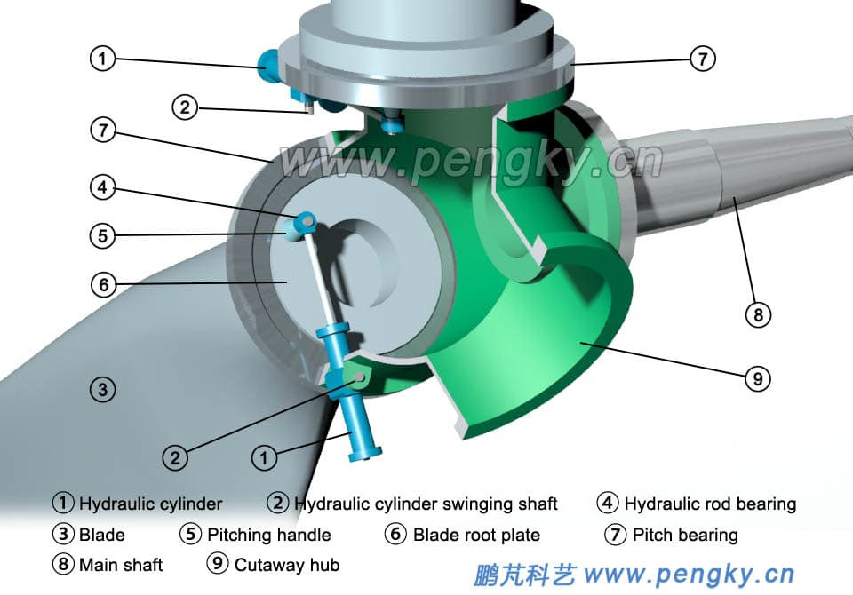
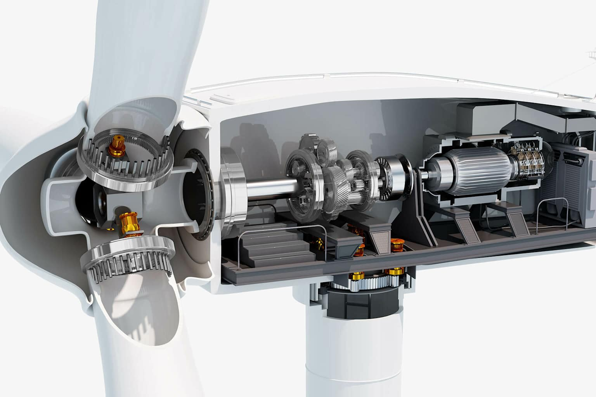
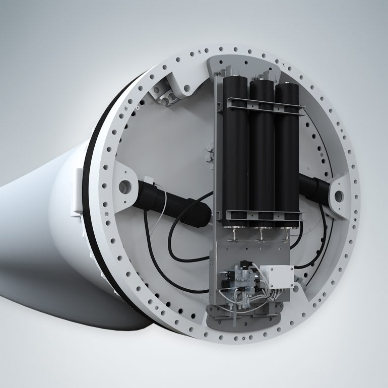
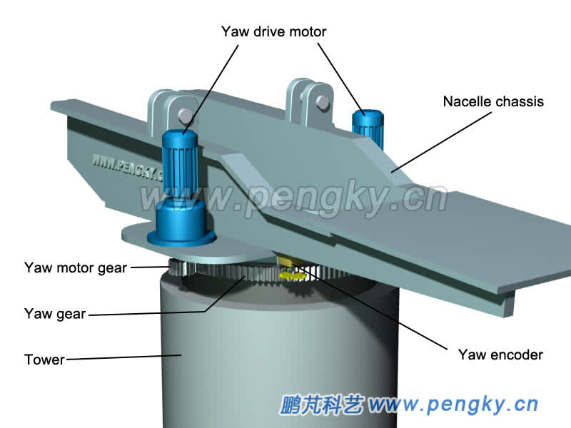
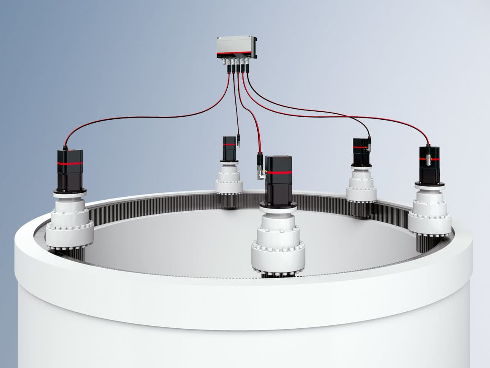
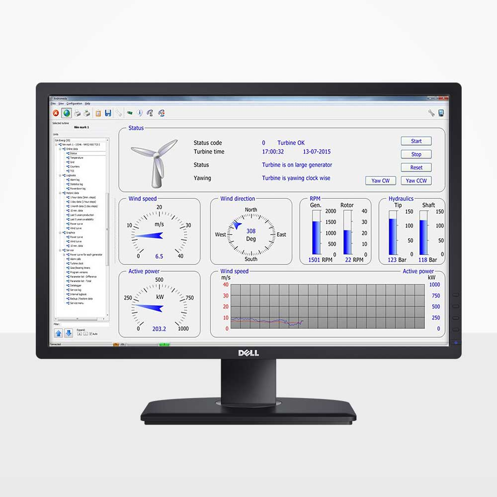
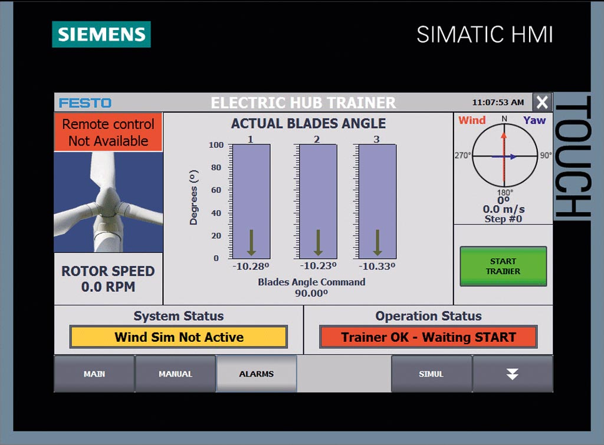

import { 
  SlideContainer, 
  Slide, 
  KeyPoints, 
  SupportingDetails, 
  InstructorNotes,
  VisualSeparator,
  InfoBox,
  WarningBox,
  SuccessBox,
  LearningObjective,
  KeyConcept,
  Example
} from '@site/src/components/SlideComponents';

<SlideContainer>

<Slide title="🎯 Systemy kontroli pitch i yaw" type="info">

<LearningObjective>
Po tej sekcji student rozumie funkcjonowanie systemów kontroli pitch (kąt natarcia łopatek) i yaw (orientacja względem wiatru), potrafi identyfikować główne zagrożenia w tych systemach oraz zna podstawowe rozwiązania bezpieczeństwa.
</LearningObjective>

<KeyPoints title="📋 Główne tematy">
- 🎛️ **System pitch** - kontrola kąta natarcia łopatek
- 🧭 **System yaw** - orientacja turbiny względem wiatru  
- ⚙️ **Mechanizmy wykonawcze** - siłowniki, przekładnie, silniki
- 🛡️ **Systemy bezpieczeństwa** - redundancja, awaryjne zatrzymanie
</KeyPoints>

<InstructorNotes>

**Co się stanie, jeśli łopatka nie może się obrócić przy silnym wietrze?** To pytanie wprowadza nas w temat systemów kontroli. **Pitch i yaw to w praktyce „oczy i mięśnie" turbiny** – bez nich turbina nie widzi, skąd wieje wiatr i nie potrafi na to zareagować. W tej części bardziej interesuje nas **bezpieczeństwo i konsekwencje awarii**, a nie tylko czysta teoria sterowania.

W języku „dla operatora": **pitch = bezpieczeństwo i obciążenia**, **yaw = ustawienie do wiatru i wydajność**. W dalszej części wrócimy do konkretnych przykładów awarii, w których te systemy odegrały kluczową rolę.
</InstructorNotes>

</Slide>

<VisualSeparator type="energy" />

<Slide title="🎛️ System Pitch - rola i elementy" type="info">

<KeyPoints title="🔧 Podstawowe elementy systemu pitch">
- 🕹️ **Siłowniki pitch** - mechaniczne urządzenia obracające łopatki
- 📊 **Sensory pozycji** - pomiar aktualnego kąta łopatek
- 🎛️ **Układ kontrolny** - algorytmy sterowania i procedury bezpieczeństwa
- ⚡ **Zasilanie awaryjne** - baterie UPS dla krytycznej funkcji
</KeyPoints>

<InstructorNotes>

Te cztery punkty razem tworzą **pełny obraz systemu pitch**, a nie cztery oddzielne „klocki". Użyjmy prostej analogii: **siłowniki to „ręce"**, sensory to **„oczy"**, układ kontrolny to **„mózg"**, a zasilanie awaryjne to **„serce"**, które musi działać nawet wtedy, gdy cała reszta ma problem.

W praktyce każdy z tych elementów może być pojedynczym punktem krytycznym – awaria jednego z nich często oznacza, że **cały system pitch przestaje spełniać swoją funkcję bezpieczeństwa**. **Który z tych elementów wydaje się wam najsłabszym ogniwem i dlaczego?**
</InstructorNotes>

<SupportingDetails title="📈 Zasady działania systemu pitch - pozycje łopatek">
**Pozycje łopatek:**
- **Normal operation**: 0° do 25° - optymalna produkcja energii
- **Feather position**: 86° do 90° - minimalne obciążenie, zatrzymanie
- **Emergency position**: >90° - maksymalna pozycja bezpieczna
</SupportingDetails>

<InstructorNotes>

Te trzy pozycje to **„alfabet bezpieczeństwa pitch"**. W prostych słowach: 0–25° to **„praca"**, 86–90° to **„stop"**, a >90° to **„awaryjne zatrzymanie"**. Analogia do samochodu: normal operation to jazda, feather to hamulec, a emergency to hamulec awaryjny.

Kluczowe nie są tylko same wartości kątów, ale **szybkość i niezawodność przejścia między nimi**. Przy silnych wiatrach opóźnienie nawet o kilka sekund może przełożyć się na niebezpieczne obciążenia całej konstrukcji turbiny.
</InstructorNotes>

  

    
  

**Rysunek 1.1, Schemat niezależnego systemu pitch.**

<InstructorNotes>

Rysunek przedstawia szczegółowy schemat niezależnego systemu pitch z siłownikami hydraulicznymi umieszczonymi przy piaście turbiny. Każda z trzech łopatek posiada indywidualny siłownik hydrauliczny, co zapewnia niezależną kontrolę kąta natarcia każdej łopatki. Schemat ilustruje połączenia hydrauliczne rozdzielające ciśnienie do poszczególnych siłowników oraz mechaniczne ogniwa przekazujące ruch siłownika na obrót łopatki. Taka architektura umożliwia precyzyjną optymalizację wydajności przy zmiennych prędkościach wiatru i zapewnia redundancję - awaria jednego siłownika nie uniemożliwia kontroli pozostałych łopatek.

Na Rysunku 1.1 widzimy **niezależny system pitch** – każda łopatka ma swój siłownik hydrauliczny. Taka architektura daje bezpieczeństwo: awaria jednego siłownika nie „paraliżuje" całej turbiny. Sieć przewodów hydraulicznych dzieli ciśnienie między siłowniki.

</InstructorNotes>
  
  

    
  

**Rysunek 1.2, Konfiguracja łożyska pitch i przekładni**

<InstructorNotes>

Ilustracja techniczna przedstawia kluczowe komponenty mechaniczne systemu kontroli pitch - łożysko pitch oraz przekładnię redukcyjną. Mechanizm przekładni przekształca ruch siłownika w obrót łopatki, jednocześnie redukując prędkość obrotową, ale zwiększając moment obrotowy, co umożliwia małemu siłownikowi obracanie ciężkiej łopatki. Łożysko pitch musi wytrzymać ogromne obciążenia osiowe i promieniowe podczas pracy turbiny, będąc krytycznym elementem dla bezpieczeństwa i niezawodności systemu. Cały układ jest zaprojektowany w kompaktowej formie, aby zmieścić się przy nasadzie łopatki, gdzie przestrzeń jest bardzo ograniczona.

Na Rysunku 1.2 widzimy **mechanizm przekładni i łożysko pitch**. Przekładnia redukuje prędkość, ale **mnoży moment obrotowy**, dzięki czemu niewielki siłownik może poruszyć bardzo ciężką łopatą. **Dlaczego nie możemy po prostu połączyć siłownika bezpośrednio z łopatką, bez przekładni?**

</InstructorNotes>
  
  

    
  

**Rysunek 1.3, Fotografia systemu siłowników hydraulicznych pitch**

<InstructorNotes>

Fotografia przedstawia rzeczywistą implementację systemu siłowników hydraulicznych pitch zainstalowanego w piaście turbiny wiatrowej. Widoczna jest kompaktowa konstrukcja całego układu, który musi zmieścić się w ograniczonej przestrzeni piaste. Obraz pokazuje cylinder hydrauliczny jako główny element wykonawczy generujący siłę potrzebną do obracania łopatki, przewody ciśnieniowe odporne na wibracje i ekstremalne temperatury, oraz połączenie mechaniczne z łożyskiem pitch. To praktyczne zastosowanie mechanizmów kontroli pitch w nowoczesnych instalacjach turbinowych, pokazujące wyzwania techniczne związane z instalacją systemu w ciasnej przestrzeni.

Rysunek 1.3 to **zderzenie z rzeczywistością** – w piaście jest bardzo ciasno i wszystkie elementy muszą być kompaktowe. Przewody i miejsca mocowania siłowników muszą wytrzymać wibracje, ekstremalne temperatury i umożliwiać serwisowanie w tak ograniczonej przestrzeni.

**Które elementy tego systemu wydają się wam najbardziej narażone na awarie i dlaczego?**

</InstructorNotes>

</Slide>

<VisualSeparator type="default" />

<Slide title="⚙️ Sterowanie pitch i bezpieczne zatrzymanie" type="info">

<SupportingDetails title="🔁 Tryby i proces sterowania">
**Tryby sterowania:**
- **Power control**: regulacja mocy przez zmianę kąta
- **Speed control**: kontrolowanie prędkości obrotowej
- **Safety control**: awaryjne zatrzymanie przy ekstremalnych warunkach

**Proces sterowania (pętla regulacji):**
1. Monitoring parametrów (wiatr, moc, prędkość)
2. Analiza algorytmów kontrolnych
3. Wysyłanie sygnałów do siłowników
4. Weryfikacja pozycji przez sensory
5. Feedback loop - korekta sygnałów
</SupportingDetails>

<InstructorNotes>

Te trzy tryby to trzy różne „perspektywy" patrzenia na ten sam system. **Power control** wiąże się z ekonomią i produkcją energii, **speed control** ze stabilnością pracy generatora, a **safety control** z przeżyciem turbiny w trudnych warunkach.

Cały układ pracuje w klasycznej **pętli sprzężenia zwrotnego**: czujniki mierzą, sterownik analizuje, siłowniki reagują i wszystko wraca jako informacja zwrotna. Tutaj naprawdę liczą się **sekundy, a czasem ułamki sekund** – zbyt powolna reakcja może oznaczać nie tylko spadek mocy, ale realne zagrożenie dla konstrukcji.
</InstructorNotes>

<KeyConcept title="Zasada fail-safe w systemie pitch">
W przypadku **awarii zasilania lub systemu kontrolnego**, wszystkie łopatki **automatycznie** przechodzą w pozycję **feather** (90°), minimalizując obciążenia wiatrowe i zatrzymując turbinę bezpiecznie.
</KeyConcept>

<InstructorNotes>

**„Fail-safe" to filozofia, nie tylko detal konstrukcyjny**. Gdy coś się psuje, system ma sam przejść w stan bezpieczny, bez udziału człowieka. W przypadku pitch oznacza to automatyczne przejście łopatek do pozycji feather i szybkie odciążenie turbiny.

Fail-safe opiera się na **prostych, możliwie niezawodnych mechanizmach**: sprężynach, zaworach bezpieczeństwa, niezależnym zasilaniu z baterii czy UPS. To nie jest „miły dodatek", tylko **wymóg norm i dobrej praktyki inżynierskiej**, szczególnie w instalacjach OZE podłączonych do systemu elektroenergetycznego.
</InstructorNotes>

<Example title="Sekwencja bezpiecznego zatrzymania">
**Hipoteza**: Wiatr przekracza 25 m/s, turbina musi się zatrzymać

**Sekwencja działań (czas rzeczywisty)**:
1. **T+0s**: Anemometer wykrywa prędkość 25.5 m/s
2. **T+0.1s**: System kontrolny wysyła sygnał STOP
3. **T+0.5s**: Siłowniki zaczynają obracać łopatki do feather
4. **T+3s**: Łopatki w pozycji 87° - moc spada do 0
5. **T+8s**: Wirnik zatrzymany - turbina bezpieczna
6. **T+15s**: Mechaniczne hamulce aktywowane (backup)
</Example>

<InstructorNotes>

To krótka historia „w zwolnionym tempie": od momentu, gdy anemometr „zauważa" przekroczenie progu, do chwili pełnego zatrzymania wirnika. **Od T+0s do T+8s mija zaledwie kilka sekund**, a w tym czasie system musi wykonać serię bardzo konkretnych kroków.

**Opóźnienia w tej sekwencji są naprawdę niebezpieczne** – jeśli reakcja pitch nastąpi za późno, łopaty zdążą się rozpędzić do poziomów, przy których trudno już cokolwiek uratować. **Co by się stało, gdyby sygnał STOP dotarł pięć sekund później niż w tym przykładzie?**
</InstructorNotes>

<WarningBox title="⚠️ Krytyczne zagrożenie">
**Total pitch failure** (awaria wszystkich systemów pitch) przy wietrze >30 m/s może prowadzić do:
- Przyspieszenia wirnika do niebezpiecznych prędkości
- Uszkodzenia struktury turbiny
- Ryzyka oderwania łopatek
</WarningBox>

<InstructorNotes>

Liczby z przykładu: decyzja w milisekundach, ruch łopat w kilka sekund, pełne zatrzymanie w kilkanaście sekund. System bezpieczeństwa nie działa „abstrakcyjnie", tylko w bardzo konkretnych ramach czasowych.

Przypomnijmy ideę **fail-safe** – gdy pojawia się problem, turbina ma sama przejść w stan bezpieczny, bez czekania na operatora. Niezależne zasilanie, sprężyny i zawory bezpieczeństwa to elementy, które to umożliwiają. Szczegóły konstrukcyjne omówimy później.

W 2019 roku awaria pitch w jednej z turbin w Danii doprowadziła do jej zniszczenia przy silnym wietrze – zawiódł właśnie mechanizm przejścia do feather. **Jakie sygnały z systemu CMS byłyby najlepszym wczesnym wskaźnikiem problemów z pitch?**
</InstructorNotes>

</Slide>

<VisualSeparator type="default" />

<Slide title="🧭 System Yaw - orientacja względem wiatru" type="info">

<KeyPoints title="🎯 Cele systemu yaw">
- 🧭 **Optymalna orientacja** - ustawienie wirnika prostopadle do wiatru
- 🔄 **Komunikacja z wiatrem** - śledzenie zmian kierunku
- ⚖️ **Minimalizacja obciążeń** - równomierne obciążenie łopatek
- 🛡️ **Procedury bezpieczeństwa** - ochrona przed ekstremalnymi kątami
</KeyPoints>

<InstructorNotes>

**Yaw to system optymalizacji, a nie główny system bezpieczeństwa**. Pitch decyduje o tym, czy turbina „przeżyje" ekstremalne warunki, natomiast yaw dba o to, żeby była dobrze ustawiona do wiatru i długo, efektywnie pracowała.

**Równomierne obciążenie łopatek** jest kluczowe. Jeśli turbina jest stale „skręcona" względem wiatru, jedna strona wirnika dostaje większe obciążenia niż druga – to przekłada się na szybsze zużycie łożysk, przekładni i samych łopat.
</InstructorNotes>

<SupportingDetails title="🔧 Elementy składowe systemu yaw">
**Mechanizmy wykonawcze:**
- **Yaw motors** - silniki przemieszczające gondolę
- **Yaw brakes** - hamulce utrzymujące pozycję
- **Slew drive** - przekładnia redukująca prędkość obrotową
- **Gear reduction** - zmniejszenie prędkości obrotowej

**Sensory i monitoring:**
- **Wind vane** - czujnik kierunku wiatru na gondoli
- **Position sensors** - monitoring aktualnej pozycji gondoli
- **Load sensors** - pomiar nierównomiernych obciążeń
- **Motor feedback** - informacje zwrotne z silników yaw
</SupportingDetails>

<InstructorNotes>

Yaw to w dużej mierze **„mechanika ciężka"**: silniki obracają gondolę, hamulce ją trzymają, a przekładnie dbają o to, żeby ruch był wolny i kontrolowany. Zbyt szybki obrót gondoli byłby niebezpieczny zarówno dla konstrukcji, jak i dla kabli przechodzących przez wieżę.

**Wiatrowskaz (wind vane)** to w praktyce „oczy systemu yaw" – bez poprawnego sygnału o kierunku wiatru sterownik nie wie, w którą stronę ustawiać gondolę. **Co się stanie, jeśli wiatrowskaz zostanie oblodzony lub mechanicznie uszkodzony?**
</InstructorNotes>

  

    
  

**Rysunek 2.1, Architektura systemu yaw**

<InstructorNotes>

Schemat przedstawia kompleksową architekturę systemu yaw z wieloma silnikami yaw rozmieszczonymi równomiernie wokół podstawy gondoli. Wszystkie silniki współpracują z zębatym pierścieniem yaw, tworząc zintegrowany system napędowy. Ilustracja pokazuje również hamulce yaw aktywne podczas braku obrotu gondoli, czujniki pozycji monitorujące aktualną orientację oraz kompletny układ mechaniczny napędu yaw. Wielosilnikowa redundancja zapewnia niezawodność systemu - awaria jednego silnika nie uniemożliwia obracania gondoli przez pozostałe silniki, co jest kluczowe dla ciągłości pracy turbiny we wszystkich warunkach wiatrowych.

</InstructorNotes>
  
  

    
  

**Rysunek 2.2, Komponenty systemu kontroli yaw**

<InstructorNotes>

Schemat techniczny przedstawia szczegółowe komponenty systemu kontroli yaw - silniki elektryczne, przekładnie redukcyjne oraz mechanizmy hamulcowe rozmieszczone równomiernie wokół obwodu gondoli. Rozproszony układ wielu napędów yaw zapewnia równomierne rozłożenie siły obrotowej i stabilność pozycjonowania. Kluczowym elementem jest synchronizacja wszystkich silników - muszą one działać z tą samą prędkością i momentem obrotowym, w przeciwnym razie może dojść do zablokowania mechanizmu lub uszkodzenia zębatego pierścienia. Przekładnie redukują prędkość obrotową, ale zwiększają moment obrotowy, umożliwiając precyzyjne pozycjonowanie ciężkiej gondoli względem kierunku wiatru.

</InstructorNotes>

<SupportingDetails title="⚙️ Algorytmy sterowania yaw">
**Algorytmy podstawowe:**
- **Active yawing** - ciągłe śledzenie optymalnej pozycji
- **Delta position control** - korekta tylko przy znaczących zmianach kierunku  
- **Load balancing** - minimalizacja różnic w obciążeniach łopatek

**Ograniczenia systemu:**
- **Maximum rotation speed**: 0.6°/s (ochrona przed nadmierną prędkością)
- **Maximum angle**: ±30° od kierunku wiatru
- **Emergency stop**: zatrzymanie przy ekstremalnych warunkach

**Procedury awaryjne:**
- **Yaw brake engagement** - natychmiastowe zatrzymanie
- **Manual override** - możliwość ręcznego sterowania
- **Position memory** - zapamiętywanie ostatniej bezpiecznej pozycji
</SupportingDetails>

<InstructorNotes>

Algorytmy yaw to **ciągłe szukanie kompromisu** między dokładnym ustawieniem do wiatru a zużyciem mechanizmów. Active yawing daje najlepszą orientację, ale oznacza częste ruchy i szybsze zużycie. Delta position control ogranicza liczbę ruchów, reagując dopiero, gdy zmiana kierunku wiatru jest istotna.

Wartość **0,6°/s** to celowo „powolny" ruch – dzięki temu nie szarpiemy gondolą, nie niszczymy kabli i nie dokładamy turbiny zbędnych obciążeń dynamicznych. To jak wolne, kontrolowane obracanie dużego dźwigu, a nie szybki ruch małego silniczka.
</InstructorNotes>

<InfoBox title="💡 Optymalizacja vs bezpieczeństwo">
System yaw **nie jest** systemem bezpieczeństwa w tym samym sensie co pitch. Jego głównym celem jest **maksymalizacja wydajności**, ale **zawodność yaw** może prowadzić do zwiększonych obciążeń strukturalnych i szybszego zużycia.
</InfoBox>

<InstructorNotes>

Podsumujmy: **pitch = bezpieczeństwo, yaw = wydajność i komfort pracy turbiny**. Awaria yaw nie zatrzyma turbiny od razu, ale w dłuższej perspektywie „zjada" jej żywotność przez nierównomierne obciążenia.

Prędkość obrotu yaw to około **0,6°/s**. **Czy yaw powinien ruszać się cały czas, gdy kierunek wiatru lekko drży?** Yaw **nie musi gonić każdej małej fluktuacji**, ważne jest dobre ustawienie w średnim czasie i rozsądne zużycie mechanizmów.
</InstructorNotes>

</Slide>

<VisualSeparator type="default" />

<Slide title="⚡ Zasilanie awaryjne i redundancja systemów" type="warning">

<KeyPoints title="Zakres w tej sekcji">
- **Pitch/Yaw**: minimalne wymagania zasilania awaryjnego (UPS, priorytety)
</KeyPoints>

<InfoBox title="Głębsze omówienie w kolejnej sekcji">
Pełną architekturę zasilania i redundancji omawia wykład „Układy hamulcowe i systemy bezpieczeństwa".
</InfoBox>

<InstructorNotes>

Ten slajd jest **łącznikiem z kolejnym wykładem o hamulcach i zasilaniu awaryjnym**. Bez niezależnego zasilania system pitch może po prostu „nie zdążyć" zareagować, kiedy sieć zewnętrzna już padnie.

Szczegóły architektury zasilania – układ UPS, baterie, priorytety odbiorników – będą omawiane osobno. Ważna myśl: **system bezpieczeństwa, który traci zasilanie jako pierwszy, tak naprawdę nie jest systemem bezpieczeństwa**.
</InstructorNotes>

</Slide>

<VisualSeparator type="default" />

<Slide title="🔧 Diagnostyka i monitorowanie systemów kontroli" type="info">

<KeyPoints title="📊 Parametry monitorowania">
- 📈 **Stan siłowników pitch** - pozycja, ciśnienie hydrauliczne/pneumatyczne
- 🔄 **System yaw** - pozycja gondoli, prędkość obrotów, moment obrotowy
- ⚡ **Systemy zasilania** - napięcie, natężenie, stan baterii UPS
- 🎛️ **Systemy kontrolne** - sygnały we/wy, komunikacja, błędy
</KeyPoints>

<InstructorNotes>

Te parametry to w praktyce **„panel kontrolny zdrowia" systemów pitch i yaw**. Szczególnie ważne jest monitorowanie **pozycji i ciśnienia** w siłownikach pitch – niewielkie odchylenia i powolne spadki ciśnienia często są pierwszym sygnałem, że coś zaczyna się psuć.

**Stan baterii UPS** jest krytyczny. Jeśli bateria jest rozładowana, to w chwili zaniku zasilania system bezpieczeństwa po prostu nie ma z czego „żyć". Monitoring techniczny to realne decyzje serwisowe, a nie tylko ładne wykresy.
</InstructorNotes>

<SupportingDetails title="🔍 Metody diagnostyki">
**Monitoring ciągły:**
- **Pitch position tracking** - śledzenie pozycji każdej łopatki
- **Yaw response time** - czas reakcji na zmiany wiatru
- **Power consumption** - zużycie energii przez systemy kontrolne
- **Communication health** - spójność transmisji danych

**Wykrywanie anomalii:**
- **Trend analysis** - analiza długoterminowych zmian parametrów
- **Threshold monitoring** - porównanie z wartościami granicznymi
- **Comparative analysis** - porównanie między łopatkami/turbinami
- **Pattern recognition** - rozpoznawanie charakterystycznych wzorców awarii
</SupportingDetails>

<InstructorNotes>

Ewolucja podejścia do diagnostyki: od prostych progów alarmowych, przez analizę trendów, aż po **rozpoznawanie wzorców i metody uczenia maszynowego**. Same wartości „tu i teraz" często niewiele mówią – dopiero **trend w czasie** odsłania powolną degradację.

Bardziej zaawansowane metody nie zastępują prostych progów, tylko je uzupełniają. Operator wciąż potrzebuje jasnego, prostego alarmu, ale w tle może działać analityka, która ostrzega dużo wcześniej, zanim przekroczone zostaną klasyczne granice.
</InstructorNotes>

  

    
  

**Rysunek 3.1, Interfejs monitorowania SCADA turbiny wiatrowej**

<InstructorNotes>

Zrzut ekranu przedstawia interfejs systemu SCADA (Supervisory Control and Data Acquisition) umożliwiający centralne monitorowanie i zarządzanie farmą wiatrową. Interfejs wyświetla parametry operacyjne w czasie rzeczywistym dla wielu turbin jednocześnie, w tym prędkość wirnika, moc wyjściową, kąty pitch i pozycję yaw, aktualizowane co kilka sekund. Wskaźniki statusu w kolorach (zielony - normalna praca, żółty - ostrzeżenie, czerwony - alarm) umożliwiają szybką identyfikację problemów w całej flocie turbin. System automatycznie wykrywa anomalie i generuje powiadomienia alarmowe, co pozwala operatorom na natychmiastową reakcję na problemy operacyjne i efektywne zarządzanie farmą wiatrową z jednego miejsca.

SCADA to **„okno operatora na całą farmę"**. Z jednego ekranu widać wiele turbin, ich moc, prędkość, kąty pitch i ustawienie yaw. Kolory statusu – zielony, żółty, czerwony – oraz automatyczne alarmy pozwalają szybko zidentyfikować problemy.

</InstructorNotes>
  
  

    
  

**Rysunek 3.2, Ekran HMI parametrów kontroli pitch**

<InstructorNotes>

Ekran HMI (Human-Machine Interface) przedstawia szczegółowy widok parametrów kontroli pitch, służący do diagnostyki głębokiej systemu. Interfejs zawiera graficzną reprezentację pozycji każdej z trzech łopat, umożliwiając wykrycie nierównomierności mogących wskazywać na problemy z siłownikami. Wyświetlane są odczyty ciśnienia hydraulicznego - kluczowy parametr diagnostyczny pozwalający wykryć degradację siłownika przed awarią, oraz wartości zadane kąta pitch w porównaniu z rzeczywistymi pozycjami. Wykresy trendów pokazują zmiany parametrów w czasie, umożliwiając analizę długoterminową i wykrycie powolnych zmian niewidocznych w pojedynczych pomiarach. Analiza danych historycznych pozwala na porównanie aktualnej wydajności z historycznymi wzorcami i przewidywanie potencjalnych problemów.

Rysunek 3.2 to przykład **diagnostyki w głąb jednego systemu**. Operator widzi dokładne pozycje łopat, ciśnienie w układzie hydraulicznym i wartości zadane, a także wykresy trendów i dane historyczne. Takie widoki pozwalają wychwycić problemy z siłownikami pitch, zanim dojdzie do awarii.

Nowoczesne systemy SCADA to nie tylko kolorowe wykresy, ale **realne narzędzia decyzyjne**. Operator musi umieć połączyć informacje z wielu ekranów i na tej podstawie podjąć decyzję – od zmiany trybu pracy po zatrzymanie turbiny.

</InstructorNotes>

<KeyConcept title="Predictive maintenance w systemach kontroli">
Nowoczesne systemy **Condition-Based Maintenance (CBM)** wykorzystują:
- **Machine Learning** do przewidywania awarii siłowników
- **Digital Twin** do symulacji różnych scenariuszy
- **IoT sensors** do ciągłego monitoringu stanu
- **Edge computing** do analizy danych w czasie rzeczywistym
</KeyConcept>

<InstructorNotes>

**Diagnostyka to dziś coś więcej niż progi i wykresy**. Uczenie maszynowe potrafi wychwycić wzorce zużycia, których człowiek nie zauważy na pierwszy rzut oka, a cyfrowy bliźniak (digital twin) pozwala „przetestować" różne scenariusze bez ryzyka dla prawdziwej turbiny.

To nie jest science fiction – takie rozwiązania są już stosowane w nowoczesnych farmach wiatrowych. Inżynier OZE coraz częściej musi rozumieć zarówno **mechanikę i elektrykę**, jak i **dane oraz algorytmy**, bo wszystko zaczyna się łączyć w jednym systemie.
</InstructorNotes>

<Example title="Przykład diagnostyki - degradacja siłownika pitch">
**Scenariusz monitoringu** (3-miesięczny okres):
- **Tydzień 1**: Ciśnienie hydrauliczne 210 bar (nominalne)
- **Tydzień 8**: Spadek do 205 bar - pierwsze oznaki degradacji
- **Tydzień 12**: 200 bar - przekroczenie progu alarmowego
- **Tydzień 15**: Planowana wymiana - uniknięcie awarii

**Parametry analizowane**:
- Ciśnienie hydrauliczne
- Czas reakcji siłownika
- Pozycjonowanie i dokładność
- Temperatura oleju
- Poziom hałasu
</Example>

<InstructorNotes>

To krótkie **case study z serwisu turbiny**. Tydzień 1 – wszystko w normie. Tydzień 8 – pierwsze, jeszcze „niegroźne" odchylenia. Tydzień 12 i 15 – decyzja o planowanej wymianie.

Dzięki analizie trendów udało się **uniknąć nagłej awarii** i zatrzymania turbiny w złym momencie. **Jakie inne parametry – oprócz ciśnienia – warto obserwować przy ocenie stanu siłownika?** Czas reakcji, temperatura oleju, hałas to przykłady.
</InstructorNotes>

<InfoBox title="💡 Korzyści monitoringu predykcyjnego">
**Wczesne wykrywanie** problemów z systemami kontroli pozwala na:
- **40% redukcję** czasu przestoju związanych z systemami pitch/yaw
- **60% redukcję** kosztów napraw przez lepsze planowanie
- **Zwiększenie bezpieczeństwa** przez eliminację nagłych awarii
</InfoBox>

<InstructorNotes>

Na tym slajdzie pojawiają się **konkretne liczby**, a nie ogólne hasła: mniej przestojów, niższe koszty, wyższe bezpieczeństwo. Takie wyniki pochodzą z realnych wdrożeń na farmach wiatrowych, a nie z idealizowanych modeli.

W praktyce najbardziej liczy się **uniknięcie nagłych, niekontrolowanych awarii** – to one są najdroższe i najbardziej niebezpieczne dla ludzi oraz infrastruktury. Monitoring predykcyjny ma sprawić, żeby jak najwięcej interwencji było **planowanych**, a nie „gaszących pożar".
</InstructorNotes>

<InstructorNotes>

**Praktyczne wdrożenie** - systemy CBM wymagają inwestycji w sensory i oprogramowanie, ale zwracają się w ciągu 2-3 lat przez uniknięcie awarii krytycznych.

**Machine learning** - nowoczesne systemy uczą się charakterystyk danej turbiny i potrafią przewidzieć awarie, których nie wykryłyby tradycyjne progi alarmowe.

**Standardy branżowe** - IEC 61400-25 definiuje protokoły komunikacyjne dla systemów monitoringu, co umożliwia interoperacyjność między różnymi dostawcami.
</InstructorNotes>

</Slide>

<VisualSeparator type="energy" />

<Slide title="🚨 Procedury awaryjne i reakcja na incydenty" type="warning">

<KeyPoints title="Zakres w tej sekcji">
- Interakcja systemów pitch/yaw z procedurami awaryjnymi
</KeyPoints>

<InfoBox title="Szczegóły procedur">
Szczegółowe procedury i zarządzanie kryzysowe omówione są w „Układy hamulcowe i systemy bezpieczeństwa".
</InfoBox>

<InstructorNotes>

Ten slajd domyka wątek kontroli i **otwiera drzwi do rozmowy o procedurach awaryjnych**. Nawet najlepiej zaprojektowane systemy pitch i yaw są tylko częścią większej układanki: liczą się też procedury, szkolenia załogi i organizacja pracy.

W kolejnym wykładzie skupimy się już bardziej na **hamulcach, procedurach E‑STOP i zarządzaniu incydentami**, a ten slajd pokazuje, jak systemy kontroli wpisują się w całą architekturę bezpieczeństwa.
</InstructorNotes>

</Slide>

<VisualSeparator type="default" />

<Slide title="📊 Podsumowanie - Systemy kontroli jako fundament bezpieczeństwa" type="success">

<KeyPoints title="🔑 Kluczowe wnioski">
- 🎛️ **System pitch** to najważniejszy element bezpieczeństwa turbiny
- 🧭 **System yaw** wpływa na wydajność i długoterminową niezawodność
- 🔋 **Redundancja zasilania** jest krytyczna dla funkcjonowania systemów
- 📊 **Monitoring predykcyjny** pozwala unikać nagłych awarii
</KeyPoints>

<InstructorNotes>

Cztery wnioski to **„cztery filary systemu kontroli"**. Pitch to przede wszystkim bezpieczeństwo konstrukcji, yaw – wydajność i równomierne obciążenia, redundancja zasilania – niezawodność, a monitoring predykcyjny – przewidywalność i spokój w eksploatacji.

Spróbujmy połączyć te punkty z przykładami z wcześniejszych slajdów: gdzie widać rolę pitch, gdzie yaw, a gdzie w praktyce „zadziałał" monitoring.
</InstructorNotes>

<SuccessBox title="✅ Sukces operacyjny">
Nowoczesne turbiny z właściwie zaprojektowanymi systemami kontroli osiągają:
- **99.5% availability** - czas dostępności do produkcji
- **poniżej 10 unexpected stops** - nieprzewidziane zatrzymania rocznie
- **15-20 lat** średni czas eksploatacji przed modernizacją
</SuccessBox>

<InstructorNotes>

Liczby na tym slajdzie to w praktyce **cele dla nowoczesnych farm wiatrowych**: bardzo wysoka dostępność, niewiele nieplanowanych zatrzymań i długi czas eksploatacji przed modernizacją. Takie wyniki nie biorą się z jednego „magicznego" rozwiązania, tylko z dobrze działającego całego systemu kontroli.

Osiągnięcie 15–20 lat pracy bez poważnych problemów wymaga zarówno dobrego projektu, jak i konsekwentnego monitoringu oraz serwisu. **System kontroli to inwestycja, która realnie się zwraca**.
</InstructorNotes>

<KeyConcept title="Filozofia bezpieczeństwa systemów kontroli">
**"Control systems are the nervous system of a wind turbine"** - systemy kontroli to nie tylko elementy techniczne, ale **zdolność turbiny do reagowania na zmieniające się warunki** i **ochrony samej siebie** przed szkodami.
</KeyConcept>

<InstructorNotes>

**Systemy kontroli są jak układ nerwowy turbiny** – zbierają informacje, przetwarzają je i wysyłają sygnały do „mięśni", czyli układów wykonawczych. Bez tego układu turbina jest tylko dużą, drogą konstrukcją mechaniczną.

W projektowaniu nowoczesnych turbin nie chodzi już tylko o „moc i sprawność", ale właśnie o **zdolność inteligentnego reagowania na zmieniające się warunki**. To jest fundament filozofii bezpieczeństwa, do której będziemy wracać także przy innych instalacjach OZE.
</InstructorNotes>

<InfoBox title="🎓 Następne kroki">
Po poznaniu systemów kontroli przejdziemy do **układów hamulcowych i systemów bezpieczeństwa** - ostatniej linii obrony przed awariami strukturalnymi.
</InfoBox>

<InstructorNotes>

**Systemy kontroli są sercem bezpieczeństwa turbiny**. Bez nich konstrukcja nie potrafi reagować na zmieniający się wiatr i zaczyna być realnym zagrożeniem, a nie źródłem „zielonej" energii.

W poprzednim wykładzie mówiliśmy o zagrożeniach mechanicznych i aerodynamicznych, a teraz zobaczyliśmy, jak systemy kontroli pozwalają tym zagrożeniom przeciwdziałać. Kolejnym krokiem będą układy hamulcowe i procedury, czyli „ostatnia linia obrony".

**Jak zaprojektowalibyście prosty system monitoringu pitch/yaw i jakie procedury operacyjne uważacie za absolutne minimum na farmie wiatrowej?**
</InstructorNotes>

</Slide>

</SlideContainer>
