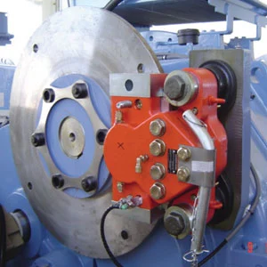
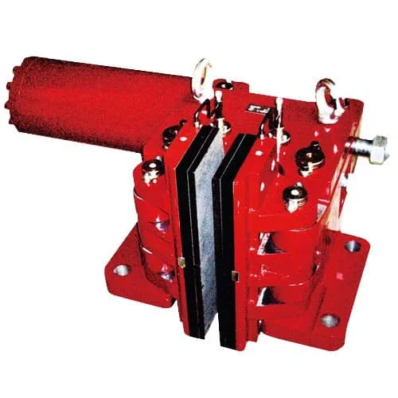
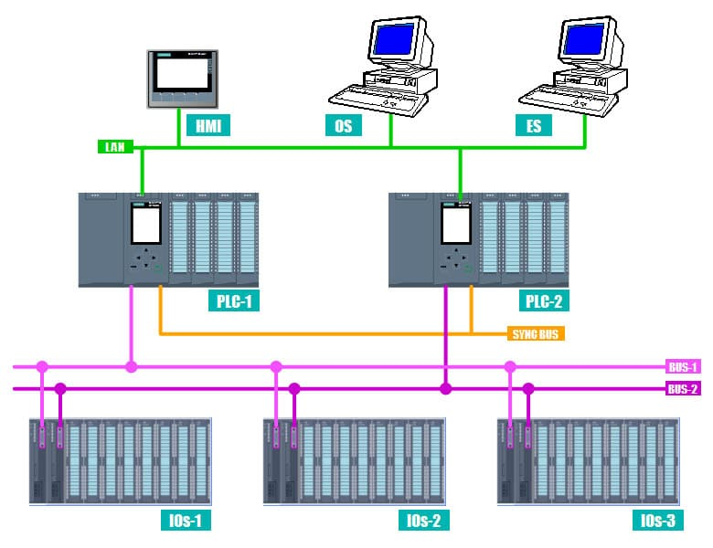
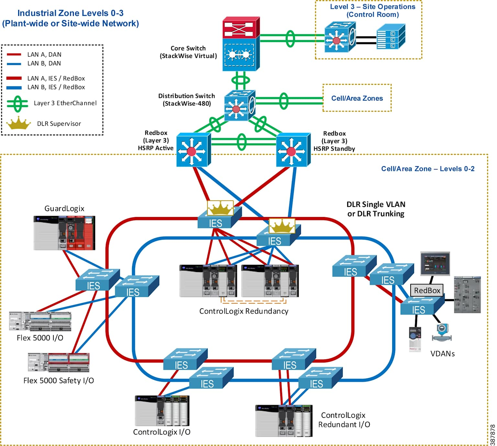

import { 
  SlideContainer, 
  Slide, 
  KeyPoints, 
  SupportingDetails, 
  InstructorNotes,
  VisualSeparator,
  InfoBox,
  WarningBox,
  SuccessBox,
  LearningObjective,
  KeyConcept,
  Example
} from '@site/src/components/SlideComponents';

<SlideContainer>

<Slide title="🎯 Układy hamulcowe i systemy bezpieczeństwa" type="info">

<LearningObjective>
Po tej sekcji student rozumie funkcjonowanie układów hamulcowych w turbinach wiatrowych, identyfikuje główne systemy bezpieczeństwa, potrafi scharakteryzować procedury awaryjne i zna zasady redundancji w systemach krytycznych.
</LearningObjective>

<InstructorNotes>

To jest **kompleksowy cel** – studenci powinni nie tylko rozumieć, jak działają hamulce, ale także **identyfikować systemy bezpieczeństwa** i **charakteryzować procedury**. Chodzi o to, żeby potrafili prześledzić cały łańcuch: od wykrycia zagrożenia, przez decyzję systemów bezpieczeństwa, aż do zatrzymania turbiny.

Ten wykład ma zbudować umiejętność patrzenia na turbinę jak na **system krytyczny**, w którym każdy błąd może mieć poważne konsekwencje. Po tej części student ma być w stanie nie tylko opisać elementy, ale też zadać właściwe pytania o ryzyko, redundancję i procedury w realnym projekcie. To przygotowuje ich do **praktycznego projektowania** i **audytów bezpieczeństwa** w rzeczywistych farmach wiatrowych.
</InstructorNotes>

<KeyPoints title="📋 Główne tematy">
- 🛑 **Układy hamulcowe** - mechanizmy i typy hamulców
- ⚡ **Systemy bezpieczeństwa** - wielopoziomowa ochrona
- 🔄 **Redundancja systemów** - niezależne linie obrony
- 🚨 **Procedury awaryjne** - reakcja na sytuacje krytyczne
</KeyPoints>

<InstructorNotes>

Te cztery tematy to **mapa drogi** dla całego wykładu. Hamulce to **mechaniczna warstwa** bezpieczeństwa, systemy bezpieczeństwa to **architektura**, redundancja to **strategia niezawodności**, a procedury to **ludzka warstwa** odpowiedzi na awarie.

**Co zostaje, gdy wszystkie inne systemy zawiodą?** Odpowiedź brzmi: **hamulce i procedury bezpieczeństwa**. Ten wykład dotyczy **ostatnich linii obrony** przed katastrofą: hamulców, architektury bezpieczeństwa, redundancji i procedur awaryjnych.

W poprzednich wykładach poznaliśmy **zagrożenia**, potem **systemy kontroli pitch i yaw**, a teraz widzimy, jak wygląda **pełna warstwa bezpieczeństwa**. Łączymy perspektywę **mechaniczną (hamulce)** i **systemową (bezpieczeństwo, procedury, redundancja)**.
</InstructorNotes>

</Slide>

<VisualSeparator type="energy" />

<Slide title="🛑 Typy układów hamulcowych" type="warning">

<KeyPoints title="🔧 Klasyfikacja hamulców">
- 🔄 **Hamulce aerodynamiczne** - pitch łopatek jako główne hamowanie
- ⚙️ **Hamulce mechaniczne** - tarczowe, bębnowe, sprzęgłowe
- 🔋 **Hamulce elektrodynamiczne** - prądy wirowe w generatorze
- 🛡️ **Systemy awaryjne** - niezależne hamulce awaryjne
</KeyPoints>

<InstructorNotes>

Te cztery typy hamulców pokazują **hierarchię hamowania**. Hamulce aerodynamiczne (pitch) to **pierwsza linia**, mechaniczne to **druga linia**, elektrodynamiczne to **wsparcie**, a awaryjne to **ostatnia deska ratunku**. Każdy typ ma swoje miejsce w systemie bezpieczeństwa i działa w innym przedziale czasów reakcji oraz obciążeń.

W praktyce oznacza to, że turbina nie polega na jednym „magicznym” hamulcu, ale na **wielu warstwach ochrony**, które uruchamiają się w zależności od scenariusza. Dobry projekt nie zakłada, że zawsze zadziała pierwszy poziom – zakłada, że kolejne poziomy też muszą przejąć funkcję bezpieczeństwa, jeśli coś pójdzie nie tak wyżej w hierarchii.
</InstructorNotes>

<SupportingDetails title="📊 Charakterystyka hamulców aerodynamicznych">
**System pitch jako hamulec podstawowy:**
- **Szybkość reakcji**: &lt; 3 sekundy do pełnego hamowania
- **Siła hamowania**: Zmniejszenie mocy o 95-98%
- **Zakres działania**: 0-25 m/s wiatru
- **Energia**: Energia wiatrowa → pozycja feather łopatek

**Zasada działania:**
1. Wykrycie warunków wymagających zatrzymania
2. Natychmiastowe wysłanie sygnału do siłowników pitch
3. Obrót łopatek do pozycji feather (86-90°)
4. Znaczne zmniejszenie współczynnika siły aerodynamicznej
5. Ostateczne zatrzymanie wirnika

**Ograniczenia:**
- Wymaga sprawnego systemu pitch
- Ograniczona skuteczność przy bardzo silnych wiatrach
- Zależność od zasilania elektrycznego
</SupportingDetails>

<InstructorNotes>

Hamulce aerodynamiczne to **najszybsze** – mniej niż 3 sekundy. To jest **główna zaleta** – szybkość reakcji i możliwość bardzo szybkiego zredukowania mocy przez zmianę kąta łopatek. Ale są też **ograniczenia**: wymagają sprawnego pitch, mogą być mniej skuteczne przy bardzo silnych wiatrach i zawsze zależą od dostępności energii do sterowania.

Warto zobaczyć w nich nie tylko hamulec, ale też **narzędzie do regulacji obciążeń** – ten sam mechanizm, który zwiększa moc przy słabszym wietrze, ma nas uratować w warunkach krytycznych. Gdy wiatr przekracza wartości projektowe, system pitch jest pierwszym, który musi „zareagować nerwowo” i ustawić łopaty w feather. **Dlaczego hamulce aerodynamiczne mogą być mniej skuteczne przy bardzo silnych wiatrach?** To pytanie prowadzi do dyskusji o granicach aerodynamiki i roli hamulców mechanicznych.
</InstructorNotes>


<SupportingDetails title="⚙️ Hamulce mechaniczne - szczegółowa analiza">
**Hamulce tarczowe (disc brakes):**
- **Lokalizacja**: Na głównym wale, między generatorem a przekładnią
- **Typ**: Hydrauliczne, pneumatyczne lub elektromechaniczne
- **Moment hamujący**: 3-5x maksymalny moment nominalny turbiny
- **Czas hamowania**: 10-15 sekund z maksymalnej prędkości

**Hamulce sprzęgłowe:**
- **Zastosowanie**: Głównie w turbinach z przekładnią
- **Mechanizm**: Rozłączenie przekładni + hamulce na generatorze
- **Zalety**: Ochrona przekładni przed przeciążeniem
- **Wady**: Złożoność systemu, więcej elementów do konserwacji

**Hamulce bębnowe:**
- **Typowe zastosowanie**: Starsze turbiny &lt; 2MW
- **Zasada**: Cierne okładziny dociskane do bębna
- **Utrzymanie**: Wymagają regularnej konserwacji okładzin
</SupportingDetails>

<InstructorNotes>

Hamulce mechaniczne to **fizyczna siła** – 3-5x moment nominalny. Hamulce tarczowe to **najczęstsze** w nowoczesnych turbinach, sprzęgłowe chronią przekładnię, a bębnowe to **starsza technologia**. **Czas hamowania 10-15 sekund** to kompromis między siłą a zużyciem – zbyt szybkie hamowanie oznaczałoby skokowe obciążenia i ekstremalne temperatury, zbyt wolne byłoby niebezpieczne dla konstrukcji.

Warto zwrócić uwagę, że hamulce mechaniczne zwykle **nie pracują w normalnej eksploatacji** – wchodzą do gry głównie przy zatrzymaniach awaryjnych lub serwisowych. To system, który musi zachować pełną sprawność mimo długich okresów „bezczynności”, co stawia wysokie wymagania przed utrzymaniem ruchu i kontrolą stanu okładzin.
</InstructorNotes>

<div style={{width: '100%', margin: '0 auto', display: 'flex', flexDirection: 'column', gap: '20px'}}>
  <div style={{width: '90%', margin: '0 auto'}}>
    
  </div>

**Rysunek 2.1, Przekrój hamulca tarczowego na wale głównym turbiny wiatrowej**

<InstructorNotes>

Przekrój pokazuje szczegóły konstrukcji hamulca tarczowego umieszczonego na wale głównym turbiny, między generatorem a przekładnią. Widzimy tarczę hamulcową (typowa średnica 500-1500 mm w zależności od rozmiaru turbiny), zaciski hydrauliczne z wieloma tłokami, okładziny cierne o wysokiej pojemności termicznej oraz system mocowania do wału głównego. Konstrukcja zacisku wykorzystuje mechanizm sprężynowo-zamykany, hydraulicznie-otwierany, zapewniający działanie fail-safe – hamulec aktywuje się automatycznie przy utracie ciśnienia hydraulicznego, co zapewnia krytyczną ochronę bezpieczeństwa.

To nie jest tylko schemat, ale rzeczywista konstrukcja stosowana w turbinach wiatrowych. Kluczowy element to **mechanizm fail-safe**: hamulec zamyka się sprężynowo, a otwiera się hydraulicznie. To oznacza, że gdy zanika ciśnienie hydrauliczne – z jakiegokolwiek powodu – hamulec automatycznie się zamyka. To nie jest opcja, ale **wymóg bezpieczeństwa**.

Nowoczesne konstrukcje zawierają czujniki zużycia, systemy monitorowania okładzin oraz powłoki odporne na korozję, niezbędne w zastosowaniach offshore i w trudnych warunkach środowiskowych. **Dlaczego konstrukcja normalnie zamknięta jest tak ważna w systemach bezpieczeństwa turbin?** W sytuacji awaryjnej nie możemy polegać na zasilaniu zewnętrznym. Hamulec musi działać nawet wtedy, gdy wszystko inne zawiedzie.

</InstructorNotes>

  <div style={{width: '90%', margin: '0 auto'}}>
    
  </div>

**Rysunek 2.2, Hamulec tarczowy z ochroną przed awarią hydrauliczną**

<InstructorNotes>

Schemat przedstawia hamulec tarczowy serii SDBH-I z wbudowaną ochroną przed awarią hydrauliczną, zaprojektowany zgodnie ze standardem JB/T10917-2008. Hamulec wykorzystuje zasadę normalnie zamkniętego (normally closed) z hydraulicznym otwieraniem, co zapewnia automatyczne i szybkie zadziałanie w przypadku awarii zasilania, utraty ciśnienia w układzie hydraulicznym lub awaryjnego wyłączenia.

Podczas normalnej pracy system utrzymuje hamulec w stanie otwartym przy ciśnieniu roboczym 8-9.5 MPa, a gdy ciśnienie spadnie poniżej progu lub zniknie, hamulec natychmiast przechodzi w stan zadziałania, zapewniając wbudowaną ochronę fail-safe. System wyposażony jest w czujnik zużycia okładzin ciernych, który monitoruje stan zużycia w czasie rzeczywistym i może być podłączony do systemu sterowania w celu blokady ochronnej i alarmów awaryjnych, wspierając strategie predykcyjnego utrzymania ruchu opartego na stanie.

Czujnik zużycia okładzin to nie tylko "miły dodatek", ale element wspierający **predykcyjne utrzymanie ruchu**. Gdy okładziny zbliżają się do granicy bezpieczeństwa, system może wcześniej zaalarmować operatorów, umożliwiając planowaną wymianę zamiast nagłej awarii. **Jakie są praktyczne konsekwencje zastosowania hamulców z monitoringiem zużycia w farmach wiatrowych?** To nie tylko kwestia bezpieczeństwa, ale także ekonomii – planowana wymiana jest znacznie tańsza niż awaryjna naprawa w środku burzy.

</InstructorNotes>
</div>

<WarningBox title="⚠️ Zasady projektowania hamulców">
**Zgodnie z normą IEC 61400-1**, systemy hamulcowe muszą spełniać:
- **Redundancja**: Minimum 2 niezależne systemy hamowania
- **Niezależność**: Działanie niezależnie od systemów kontrolnych
- **Zasilanie**: Zapewnienie bezpiecznego zatrzymania i utrzymania funkcji zgodnie z analizą ryzyka
- **Testowanie**: Możliwość testów funkcjonalnych bez ryzyka
</WarningBox>

<InstructorNotes>

To są **wymogi normatywne** – nie opcje, ale **obowiązki**. **Redundancja minimum 2 systemów** to absolutne minimum, a w praktyce często spotyka się więcej poziomów zabezpieczeń niż wymaga sama norma. **Niezależność** oznacza, że awaria jednego systemu nie może wpłynąć na drugi – innymi słowy: błąd w systemie sterowania nie może „zabrać ze sobą” systemu bezpieczeństwa.

Kluczowy jest też wymóg **możliwości testów bez ryzyka** – system trzeba regularnie sprawdzać, ale tak, by test nie wprowadzał dodatkowego zagrożenia dla ludzi i turbiny. **Dlaczego testowanie bez ryzyka jest tak ważne?** Bo system bezpieczeństwa, którego boimy się testować, prędzej czy później zawiedzie wtedy, gdy będzie najbardziej potrzebny.
</InstructorNotes>

<Example title="Przykład - Awaria systemu pitch, aktywacja hamulców mechanicznych">
**Scenariusz**: Turbina 3MW, awaria wszystkich siłowników pitch przy wietrze 20 m/s

**Sekwencja awaryjna**:
1. **T+0s**: Wykrycie awarii systemu pitch
2. **T+0.1s**: Alarm w centrum kontroli
3. **T+1s**: Automatyczna aktywacja hamulców mechanicznych
4. **T+3s**: Hydrauliczne dociskanie okładzin do tarcz
5. **T+12s**: Zatrzymanie wirnika (z maksymalnej prędkości obrotowej)
6. **T+15s**: Potwierdzenie zatrzymania, turbina w trybie bezpiecznym

**Parametry hamowania**:
- Początkowa prędkość: 25 RPM (maksymalna)
- Siła hamująca: 1,200,000 Nm momentu
- Zużycie energii: 30 kWh na proces hamowania
- Temperatura okładzin: wzrost do 180°C
</Example>

<InstructorNotes>

To jest **realny scenariusz awaryjny**. Od wykrycia awarii pitch (T+0s) do zatrzymania (T+12s) mija zaledwie 12 sekund – to czas na zatrzymanie z maksymalnej prędkości. **Temperatura 180°C** pokazuje, jak dużo energii jest rozpraszane – to wymaga systemów chłodzenia.

**Hierarchia hamowania**: najpierw działa pitch (hamulec aerodynamiczny), dopiero później **hamulce mechaniczne** i awaryjne. Hamulce mechaniczne są projektowane tak, aby zatrzymać **ogromny moment bezwładności** przy maksymalnej prędkości wirnika w kilkanaście sekund.

Wyobraźcie sobie 60-metrowe łopaty rozpędzone do 25 RPM – zatrzymanie tego w 10–15 sekund oznacza potężne siły i temperatury w układzie hamulcowym. Na Rysunku 1 widzimy **klasyfikację hamulców**, a na Rysunku 2 – **szczegóły hamulca tarczowego** na wale głównym.
</InstructorNotes>

</Slide>

<VisualSeparator type="default" />

<Slide title="⚡ Systemy bezpieczeństwa - architektura wielopoziomowa" type="info">

<KeyPoints title="🛡️ Poziomy ochrony bezpieczeństwa">
- 🥇 **Poziom 1**: Monitoring i wykrywanie zagrożeń
- 🥈 **Poziom 2**: Systemy kontroli prewencyjnej (pitch, yaw)
- 🥉 **Poziom 3**: Układy hamulcowe i zatrzymanie
- 🚨 **Poziom 4**: Systemy awaryjne i komunikacja
</KeyPoints>

<InstructorNotes>

Te cztery poziomy to **warstwy obrony**. Poziom 1 to **wykrywanie**, Poziom 2 to **prewencja**, Poziom 3 to **hamowanie**, a Poziom 4 to **reakcja**. Każdy poziom ma swoje zadanie i czas reakcji – od milisekund (Poziom 1) do minut (Poziom 4).

Można o tym myśleć jak o systemie zabezpieczeń w samolocie: najpierw czujniki i systemy ostrzegania, potem automatyka, dalej hamulce i blokady, a na końcu procedury załogi. W turbinie wiatrowej te poziomy muszą ze sobą współpracować – jeśli jeden zawiedzie, kolejne powinny ograniczyć skutki zagrożenia i doprowadzić turbinę do stanu bezpiecznego.
</InstructorNotes>

<SupportingDetails title="📊 Detalna architektura systemów bezpieczeństwa">
**Poziom 1 - Wykrywanie i monitoring:**
- **Sensory środowiskowe**: Anemometry, sensory oblodzenia, termometry
- **Sensory mechaniczne**: Akcelerometry, sensory wibracji, tensometry
- **Sensory elektryczne**: Monitoring prądów, napięć, mocy
- **Systemy komunikacyjne**: SCADA, protokoły bezpieczeństwa, backup

**Poziom 2 - Kontrola prewencyjna:**
- **System pitch**: Kontrola kąta łopatek, redukcja obciążeń
- **System yaw**: Optymalna orientacja, minimalizacja szkodliwych obciążeń
- **Kontrola mocy**: Regulacja produkcji, unikanie przeciążeń
- **Monitoring predykcyjny**: Wykrywanie wczesnych symptomów awarii

**Poziom 3 - Hamowanie i zatrzymanie:**
- **Hamulce podstawowe**: System pitch + hamulce mechaniczne
- **Hamulce awaryjne**: Niezależne systemy hamulcowe
- **Systemy blokady**: Zapewnienie utrzymania pozycji zatrzymanej
- **Kontrola bezpieczeństwa**: Weryfikacja zatrzymania, alarmy

**Poziom 4 - Reakcja awaryjna:**
- **Komunikacja krytyczna**: Alarmy do centrum kontroli
- **Ewakuacja**: Procedury bezpieczeństwa personelu
- **Izolacja**: Odłączenie elektryczne, zabezpieczenie terenu
- **Raportowanie**: Dokumentacja incydentu, analiza przyczyn
</SupportingDetails>

<InstructorNotes>

To jest **szczegółowa architektura** – każdy poziom składa się z konkretnych elementów. Poziom 1 to **sensory i monitoring**, Poziom 2 to **kontrola prewencyjna**, Poziom 3 to **hamowanie**, a Poziom 4 to **reakcja awaryjna**. **Komunikacja** jest kluczowa na każdym poziomie, bo bez sprawnego przesyłu informacji nawet najlepsze czujniki i hamulce nie zadziałają na czas.

Warto zauważyć, że wiele elementów pojawia się na kilku poziomach – na przykład SCADA i komunikacja krytyczna są obecne zarówno przy monitoringu, jak i przy reakcji awaryjnej. To pokazuje, że system bezpieczeństwa nie jest zbiorem niezależnych klocków, ale **spójną siecią współpracujących modułów**, które razem tworzą obronę wielowarstwową.
</InstructorNotes>

{/* TODO: Dodać obraz ./img/03-architektura-systemu-bezpieczenstwa.png */}
<div style={{width: '70%', margin: '0 auto', padding: '20px', backgroundColor: '#f5f5f5', borderRadius: '8px', textAlign: 'center'}}>
  <p style={{color: '#666', fontStyle: 'italic'}}>Miejsce na rysunek: Architektura wielopoziomowego systemu bezpieczeństwa turbiny</p>
</div>

**Rysunek 3. Architektura wielopoziomowego systemu bezpieczeństwa turbiny wiatrowej – od sensorów i SCADA po układy hamulcowe i procedury awaryjne.**

**Rysunek 3, Architektura wielopoziomowego systemu bezpieczeństwa turbiny**

Schemat przedstawia kompleksową architekturę bezpieczeństwa z czterema poziomami ochrony. Poziom 1 obejmuje sensory środowiskowe, mechaniczne i elektryczne oraz systemy komunikacyjne SCADA. Poziom 2 to kontrola prewencyjna przez systemy pitch i yaw oraz monitoring predykcyjny. Poziom 3 to układy hamulcowe i systemy blokady zapewniające zatrzymanie turbiny. Poziom 4 to reakcja awaryjna z komunikacją krytyczną, procedurami ewakuacji i raportowaniem. Przepływ informacji od sensorów przez SCADA do hamulców i procedur pokazuje, jak każdy poziom współpracuje z pozostałymi, tworząc spójną architekturę bezpieczeństwa.

<KeyConcept title="Zasada fail-safe w systemach bezpieczeństwa">
**Każdy poziom ochrony** musi być zaprojektowany zgodnie z zasadą **fail-safe**:
- Przy awarii jakiegokolwiek elementu system **automatycznie przechodzi w stan bezpieczny**
- **Brak zasilania = stan bezpieczny** - wszystkie hamulce aktywowane
- **Brak komunikacji = zatrzymanie** - turbina nie może pracować bez łączności z centrum kontroli
- **Niepewność co do stanu = zatrzymanie** - systemy muszą być deterministyczne
</KeyConcept>

<InstructorNotes>

Fail-safe to **fundamentalna zasada**. "Fail-safe" oznacza: **"gdy coś się psuje, system przechodzi w stan bezpieczny"**. **Brak zasilania = stan bezpieczny** – to wymaga mechanicznych zabezpieczeń. **Determinizm** oznacza, że system zawsze wie, co robić – nie ma "może".
</InstructorNotes>

<Example title="Przepływ danych w systemie bezpieczeństwa - przykład praktyczny">
**Normalna praca** (wiatr 12 m/s):
1. **Sensory**: Wysyłanie danych co 100ms
2. **SCADA**: Analiza, porównanie z progami
3. **Pitch control**: Optymalna pozycja łopatek
4. **Monitoring**: Wszystkie parametry w normie

**Sytuacja awaryjna** (wiatr 28 m/s, awaria pitch):
1. **T+0s**: Anemometer → wartość &gt;25 m/s → ALARM
2. **T+0.1s**: SCADA → wykrywa awarię pitch → ESCALATION
3. **T+0.5s**: System awaryjny → aktywacja hamulców mechanicznych
4. **T+1s**: Backup communication → powiadomienie centrum
5. **T+2s**: Safety PLC → potwierdzenie stanu bezpiecznego
6. **T+15s**: Turbina zatrzymana → dokumentacja incydentu
</Example>

<InstructorNotes>

To pokazuje **przepływ danych** w dwóch scenariuszach – normalnej pracy i awaryjnej. Różnica w **czasach reakcji**: normalna praca to ciągły monitoring, awaryjna to **kaskada reakcji** w milisekundach i sekundach. **Backup communication** (GSM) to przykład redundancji, która pozwala zachować łączność nawet przy awarii głównego łącza.

Warto zwrócić uwagę, że w scenariuszu awaryjnym każdy z elementów – anemometr, SCADA, system awaryjny, Safety PLC – ma przypisaną bardzo konkretną rolę i maksymalny czas na reakcję. Ten slajd można czytać jak **scenariusz filmowy**: kto pierwszy „widzi” problem, kto podejmuje decyzję, kto fizycznie zatrzymuje turbinę i kto na końcu dokumentuje całe zdarzenie.
</InstructorNotes>

<InfoBox title="💡 Klasyfikacja zagrożeń według czasu reakcji">
- **Krytyczne** (&lt; 1 sekunda): Awaria pitch, ekstremalne wiatry
- **Wysokie** (1-10 sekund): Awarie łożysk, problemy z generatorem  
- **Średnie** (10 sekund - 1 minuta): Problemy z yaw, komunikacją
- **Niskie** (&gt; 1 minuta): Degradacja długoterminowa, planowane naprawy
</InfoBox>

<InstructorNotes>

Ta klasyfikacja pokazuje **priorytety czasowe**. **Krytyczne** zagrożenia wymagają reakcji w **milisekundach**, **wysokie** w **sekundach**, **średnie** w **minutach**, a **niskie** mogą czekać. Systemy bezpieczeństwa muszą być zaprojektowane pod **najgorszy scenariusz** – krytyczne zagrożenia, w których liczy się każda setna sekundy.

Można to powiązać z konkretnymi przykładami: awaria pitch przy silnym wietrze to zagrożenie krytyczne, problemy z generatorem to zagrożenie wysokie, a powolna degradacja łożysk to zwykle zagrożenie średnie lub niskie. **Bezpieczeństwo to system**, a nie pojedyncze urządzenie. Cztery poziomy ochrony tworzą **spójną architekturę**, w której awaria jednego elementu nie powinna prowadzić od razu do katastrofy. Na Rysunku 3 widzimy przepływ informacji: od sensorów, przez SCADA, aż po hamulce i procedury.

**Na którym poziomie tej architektury najczęściej zawodzą systemy w praktyce?** To dobry punkt wyjścia do dyskusji o **błędach ludzkich, komunikacji i procedurach**. **Fail-safe** oznacza, że w razie wątpliwości turbina **ma się zatrzymać**, a nie kontynuować pracę.
</InstructorNotes>

</Slide>

<VisualSeparator type="default" />

<Slide title="🔄 Redundancja w systemach bezpieczeństwa" type="success">

<KeyPoints title="🔧 Strategie redundancji">
- 🔄 **Redundancja funkcjonalna** - różne sposoby wykonania tej samej funkcji
- ⚡ **Redundancja sprzętowa** - podwójne, potrójne elementy
- 🎯 **Redundancja czasowa** - reakcja w różnych czasach
- 🌐 **Redundancja przestrzenna** - różne lokalizacje systemów
</KeyPoints>

<InstructorNotes>

Te cztery strategie pokazują **różne podejścia** do redundancji. **Funkcjonalna** to różne sposoby wykonania tej samej funkcji, **sprzętowa** to podwójne elementy, **czasowa** to reakcja w różnych czasach, a **przestrzenna** to różne lokalizacje. **Najlepsze** systemy używają wszystkich czterech strategii, bo każdy typ redundancji chroni przed innym rodzajem awarii.

Można to odnieść do turbiny: hamulec aerodynamiczny i mechaniczny to redundancja funkcjonalna, podwójne zasilanie i dwa PLC to redundancja sprzętowa, szybka reakcja automatyki i wolniejsza reakcja operatora to redundancja czasowa, a różne lokalizacje czujników i szaf sterowniczych – redundancja przestrzenna. Wspólnie tworzą one **sieć zabezpieczeń**, która znacznie zmniejsza ryzyko pojedynczego punktu krytycznego.
</InstructorNotes>

<SupportingDetails title="📈 Przykłady redundantnych systemów">
**Redundancja w systemach hamulcowych:**
- **Hamulec główny**: System pitch + hydrauliczne hamulce tarczowe
- **Hamulec awaryjny**: Pneumatyczne hamulce + mechaniczne blokady
- **Hamulec zapasowy**: Elektromechaniczne hamulce sprzęgłowe
- **Zasilanie**: Sieć + UPS + baterie + generatory awaryjne

**Redundancja w systemach kontrolnych:**
- **PLC główny**: Programowalny sterownik podstawowy
- **PLC bezpieczeństwa**: Dedykowany safety PLC (Siemens S7-1500F)
- **Hardware safety**: Przerywacze bezpieczeństwa, relé bezpieczeństwa
- **Komunikacja**: Ethernet + Modbus RTU + GSM backup

**Redundancja sensoryczna:**
- **Anemometry**: 3 niezależne czujniki wiatru
- **Pitch sensors**: 3 sensory pozycji na każdą łopatkę
- **Temperature**: Wielopunktowe pomiary w kluczowych lokalizacjach
- **Vibration**: Akcelerometry w różnych osiach i lokalizacjach
</SupportingDetails>

<InstructorNotes>

Te przykłady pokazują **konkretne zastosowania** redundancji. **Hamulce** mają trzy poziomy (główny, awaryjny, zapasowy), **kontrolne** mają PLC główny i safety PLC, a **sensoryczne** mają wielokrotne czujniki. **3 anemometry** to standard – jeśli jeden zawiedzie, pozostałe działają.
</InstructorNotes>

<SupportingDetails title="⚙️ Zasady projektowania redundantnych systemów">
**Niezależność (Independence):**
- Różni dostawcy komponentów tam, gdzie to możliwe
- Niezależne ścieżki zasilania
- Różne protokoły komunikacyjne
- Fizyczne oddzielenie instalacji

**Różnorodność (Diversity):**
- Różne zasady fizyczne działania (hydrauliczne vs. pneumatyczne)
- Różne technologie (optyczne vs. indukcyjne sensory)
- Różne źródła informacji (sensory vs. modelowanie)

**Monitorowanie redundancji:**
- Ciągłe sprawdzanie spójności danych między systemami
- Detekcja dysfunkcji elementów redundantnych
- Alerting przy utracie redundancji
- Automatyczne przełączanie na backup
</SupportingDetails>

<InstructorNotes>

Te zasady to **fundament** projektowania redundantnych systemów. **Niezależność** oznacza różnych dostawców i osobne ścieżki, **różnorodność** oznacza różne zasady fizyczne, a **monitorowanie** oznacza ciągłe sprawdzanie spójności działania. **Automatyczne przełączanie** to klucz – system musi działać bez interwencji człowieka, szczególnie wtedy, gdy czasu na reakcję jest bardzo mało.

Ważne jest, żeby redundancja nie była tylko „na papierze”: jeśli dwa systemy dzielą ten sam zasilacz, kanał komunikacyjny lub szafę sterowniczą, to tak naprawdę nie są od siebie niezależne. Ten slajd zachęca, by patrzeć na redundancję **krytycznym okiem** i szukać ukrytych zależności, które mogą ujawnić się dopiero w sytuacji awaryjnej.
</InstructorNotes>

<div style={{width: '100%', margin: '0 auto', display: 'flex', flexDirection: 'column', gap: '20px'}}>
  <div style={{width: '90%', margin: '0 auto'}}>
    
  </div>

**Rysunek 4.1, Redundantna konfiguracja PLC w systemach bezpieczeństwa**

<InstructorNotes>

Schemat przedstawia redundantną konfigurację PLC, w której dwa niezależne sterowniki działają równolegle, zapewniając odporną na awarie kontrolę bezpieczeństwa. Architektura pokazuje podwójne procesory z oddzielnymi zasilaczami, modułami I/O oraz interfejsami komunikacyjnymi, połączone przez linki synchronizacyjne, które porównują wyjścia i wykrywają rozbieżności.

W systemach bezpieczeństwa turbin wiatrowych ta redundancja zapewnia, że pojedyncza awaria sprzętu, błąd oprogramowania lub błąd komunikacji nie może uniemożliwić awaryjnych działań ochronnych, takich jak przejście pitch do pozycji feather lub aktywacja hamulców mechanicznych. Jeśli jeden sterownik ulegnie awarii lub wygeneruje rozbieżne wyjścia, system automatycznie przechodzi do wcześniej określonego stanu bezpiecznego, jednocześnie alarmując operatorów, eliminując w ten sposób pojedyncze punkty awarii w łańcuchu bezpieczeństwa turbiny.

To nie jest tylko "backup" – to równoległa praca, która zapewnia, że sygnały bezpieczeństwa docierają nawet wtedy, gdy jeden z kontrolerów ma problem. **Dlaczego równoległa praca dwóch PLC jest lepsza niż prosty backup?** W sytuacji awaryjnej nie możemy pozwolić sobie na opóźnienie spowodowane przełączaniem na backup. Oba kontrolery muszą działać jednocześnie, porównywać swoje wyjścia i reagować natychmiast.

</InstructorNotes>

  <div style={{width: '90%', margin: '0 auto'}}>
    
  </div>

**Rysunek 4.2, Topologia redundantnej sieci komunikacyjnej w systemach bezpieczeństwa**

<InstructorNotes>

Schemat techniczny przedstawia redundantną topologię sieci komunikacyjnej implementującą równoległe ścieżki danych między sterownikami, sensorami i siłownikami. Architektura sieciowa charakteryzuje się zduplikowanymi kanałami komunikacyjnymi, które jednocześnie przesyłają te same dane, zapewniając, że krytyczne sygnały bezpieczeństwa docierają do systemów hamulcowych nawet w przypadku zakłócenia jednej ze ścieżek komunikacyjnych.

W systemach bezpieczeństwa turbin wiatrowych ta topologia łączy wiele czujników temperatury, monitorów wibracji i czujników prędkości z redundantnymi sterownikami bezpieczeństwa, przy czym każda ścieżka danych może niezależnie wyzwalać procedury hamowania awaryjnego. To nie jest tylko "backup" – to równoległa transmisja, która zapewnia, że sygnał bezpieczeństwa dotrze nawet wtedy, gdy jedna z linii komunikacyjnych ulegnie awarii.

**Dlaczego równoległe ścieżki komunikacyjne są krytyczne w systemach bezpieczeństwa turbin?** W sytuacji awaryjnej nie możemy pozwolić sobie na opóźnienie spowodowane przełączaniem na backup. Sygnał musi dotrzeć natychmiast, a redundancja komunikacyjna to gwarantuje. Każda ścieżka może niezależnie wyzwolić procedury hamowania awaryjnego, co eliminuje pojedyncze punkty awarii w komunikacji.

</InstructorNotes>
</div>

<KeyConcept title="Reliability Engineering w turbinach wiatrowych">
**Availability** = **Reliability** × **Maintainability** × **Redundancy Factor**

Gdzie:
- **Reliability** (R): Prawdopodobieństwo bezawaryjnej pracy
- **Maintainability** (M): Szybkość i łatwość naprawy
- **Redundancy Factor** (RF): Współczynnik zwiększenia dostępności przez redundancję

**Przykład obliczenia**:
- System główny: R=0.95, M=0.90 → Availability = 0.86
- + Redundancja RF=0.98 → Final Availability = 0.94
</KeyConcept>

<InstructorNotes>

To jest **matematyka niezawodności**. Availability to iloczyn Reliability, Maintainability i Redundancy Factor. **Redundancja zwiększa dostępność** – z 0.86 do 0.94 w przykładzie. To nie jest teoria, ale **praktyczne narzędzie** do projektowania systemów, które pozwala policzyć, czy dodatkowy poziom zabezpieczeń ma sens ekonomiczny.

Warto, żeby student potrafił nie tylko obliczyć wskaźnik, ale też **zinterpretować wynik**: czy 0.94 to dużo, czy mało w kontekście farmy wiatrowej? Jak zmieniłyby się te wartości, gdyby skrócić czas napraw (lepsze utrzymanie ruchu) albo dodać jeszcze jeden poziom redundancji? Takie pytania pojawiają się przy realnych decyzjach inwestycyjnych.
</InstructorNotes>

<Example title="Case study - Analiza redundancji w rzeczywistej turbinie">
**Turbina**: 3MW, farma wiatrowa w północnej Polsce

**System hamulcowy - analiza redundancji**:
```
Poziom 1: Pitch system (Primary)
  - Availability: 99.2%
  - MTBF: 8,760 godzin
  - MTTR: 6 godzin

Poziom 2: Mechanical brakes (Secondary)  
  - Availability: 99.8%
  - MTBF: 17,520 godzin
  - MTTR: 12 godzin

Poziom 3: Emergency brake (Backup)
  - Availability: 99.9%
  - MTBF: 35,040 godzin
  - MTTR: 24 godziny

Total System Availability: 99.99% (4.38 min przestoju/rok)
```

**Koszty vs. korzyści**:
- Koszt systemów redundantnych: +15% ceny turbiny
- Redukcja przestojów: -80% czasu offline
- ROI: 3.2 lata
</Example>

<InstructorNotes>

To jest **realny case study** z farmy w Polsce. **99.99% dostępności** oznacza tylko **4.38 min przestoju rocznie** – to bardzo dobry wynik jak na system hamulcowy turbiny 3MW. **ROI 3.2 lata** pokazuje, że redundancja się **zwraca** – koszt +15% ceny turbiny, ale redukcja przestojów -80%.

Ten przykład łączy **dane techniczne** (Availability, MTBF, MTTR) z **danymi ekonomicznymi** (koszty przestojów, czas zwrotu inwestycji). Dzięki temu widać, że inżynier bezpieczeństwa musi myśleć nie tylko o normach i ryzyku, ale też o opłacalności rozwiązań, które proponuje.
</InstructorNotes>

<SuccessBox title="✅ Wskaźniki skuteczności redundantnych systemów">
**Nowoczesne turbiny z właściwą redundancją osiągają:**
- **99.9% availability** - mniej niż 8 godzin przestoju rocznie
- **poniżej 1 catastrophic failure** per 1000 turbin/rok
- **2x dłuższy** średni czas między awariami (MTBF)
- **50% redukcja** kosztów utrzymania ruchu
</SuccessBox>

<InstructorNotes>

Te liczby pokazują **konkretne korzyści** – 99.9% dostępności, mniej niż 1 katastrofalna awaria na 1000 turbin rocznie. **2x dłuższy MTBF** oznacza mniej awarii, a **50% redukcja kosztów** oznacza oszczędności. To nie są teoretyczne wartości, ale **rzeczywiste wyniki**.

**Ekonomika redundancji** – to nie jest „zbytek", ale sposób na ograniczenie strat z tytułu przestojów. Jeden dzień przestoju turbiny 3MW może oznaczać kilkanaście–kilkadziesiąt tysięcy euro utraconego przychodu. Na Rysunkach 4.1 i 4.2 widzimy konkretne implementacje redundancji: redundantną konfigurację PLC oraz topologię redundantnej sieci komunikacyjnej. Te dwa rysunki pokazują, jak w praktyce realizuje się równoległe ścieżki sterowania i komunikacji, które zapewniają, że sygnały bezpieczeństwa docierają nawet w przypadku awarii jednego z elementów.

**Gdybyście mieli wybrać tylko jeden element do podwojenia – który dałby największy wzrost niezawodności?** To dobre ćwiczenie z **krytycznego myślenia inżynierskiego**. Łączmy matematykę niezawodności z **praktycznymi decyzjami projektowymi**.
</InstructorNotes>

</Slide>

<VisualSeparator type="default" />

<Slide title="🚨 Procedury awaryjne i zarządzanie kryzysowe" type="warning">

<KeyPoints title="📋 Klasyfikacja sytuacji awaryjnych">
- 🚨 **Stop 1** - Zatrzymanie planowane (konserwacja, burza)
- ⚠️ **Stop 2** - Zatrzymanie awaryjne (problemy techniczne)
- 🚨 **Stop 3** - Zatrzymanie krytyczne (zagrożenie bezpieczeństwa)
- 🔥 **Emergency** - Sytuacja katastrofalna (pożar, uszkodzenie struktury)
</KeyPoints>

<InstructorNotes>

Te cztery poziomy pokazują **hierarchię** sytuacji awaryjnych. Stop 1 to **planowane**, Stop 2 to **awaryjne**, Stop 3 to **krytyczne**, a Emergency to **katastrofalne**. Każdy poziom ma **inny czas reakcji** i **inne zasoby** – od standardowego personelu (Stop 1) do pełnej ekipy + służby zewnętrzne (Emergency).

Ta klasyfikacja pomaga uporządkować myślenie o incydentach: nie każde zatrzymanie turbiny jest „katastrofą”, ale każde wymaga właściwej reakcji i dokumentacji. Dobrze zaprojektowany system bezpieczeństwa i procedur pozwala szybko przejść z poziomu 2 lub 3 z powrotem do bezpiecznej pracy, a poziom Emergency powinien być zarezerwowany tylko dla naprawdę skrajnych sytuacji.
</InstructorNotes>

<SupportingDetails title="📊 Hierarchia odpowiedzi na incydenty">
**Stop 1 - Zatrzymanie planowane:**
- **Initiation**: Operator farmy, SCADA automatyczny
- **Response time**: &lt; 2 minuty
- **Resources**: Standardowy personel techniczny
- **Documentation**: Logowanie standardowe

**Stop 2 - Zatrzymanie awaryjne:**
- **Initiation**: Lokalne systemy bezpieczeństwa, EIC
- **Response time**: &lt; 30 sekund (automatyczne)
- **Resources**: Technicy + inżynierowie (2-4 osoby)
- **Documentation**: Szczegółowe raportowanie, analiza przyczyn

**Stop 3 - Zatrzymanie krytyczne:**
- **Initiation**: Safety PLC, krytyczne sensory
- **Response time**: &lt; 5 sekund
- **Resources**: Pełny zespół awaryjny (6-8 osób)
- **Documentation**: Pełna analiza incydentu, audyt bezpieczeństwa

**Emergency - Sytuacja katastrofalna:**
- **Initiation**: Wieloźródłowa detekcja, zewnętrzne alarmy
- **Response time**: Natychmiastowa
- **Resources**: Pełna ekipa awaryjna + służby zewnętrzne
- **Documentation**: Pełne śledztwo, raport do organów nadzoru
</SupportingDetails>

<InstructorNotes>

To pokazuje **szczegóły** każdego poziomu. Różnice w **czasach reakcji**: Stop 1 to < 2 minuty, Stop 2 to < 30 sekund, Stop 3 to < 5 sekund, Emergency to natychmiastowa. **Dokumentacja** staje się bardziej szczegółowa wraz z poziomem – od standardowego logowania (Stop 1) do pełnego śledztwa (Emergency).

Warto zauważyć, że wraz z przechodzeniem w górę hierarchii rośnie też **presja czasu i odpowiedzialność**: przy Stop 1 jest czas na spokojne decyzje, przy Stop 3 i Emergency każda sekunda ma znaczenie. Ten slajd dobrze pokazuje, jak techniczne systemy bezpieczeństwa łączą się z organizacją pracy, podziałem ról i obowiązków w zespole.
</InstructorNotes>

<Example title="Procedura reakcji na awarię hamulców - szczegółowy scenariusz">
**Inicjacja**: Turbina T7, alarm "Primary brake failure" + "Pitch system degraded"

**Sekwencja reakcji**:

**T+0 do T+30s - Automatyczna reakcja systemów**:
1. **T+0s**: Safety PLC wykrywa awarię hamulca głównego
2. **T+2s**: Automatyczne przełączenie na hamulec awaryjny
3. **T+5s**: Aktywacja komunikacji awaryjnej (GSM backup)
4. **T+10s**: Potwierdzenie zatrzymania turbiny
5. **T+15s**: Blokada wszystkich systemów - turbina offline

**T+30s do T+5min - Reakcja operatorów**:
1. **T+30s**: Otrzymanie alarmu w centrum kontroli
2. **T+1min**: Weryfikacja statusu przez operatora SCADA
3. **T+2min**: Powiadomienie lokalnego zespołu technicznego
4. **T+3min**: Decyzja o wysłaniu ekipy naprawczej
5. **T+5min**: Ekipa w drodze do turbiny

**T+5min do T+30min - Ocena i planowanie**:
1. **T+5-10min**: Przybycie na miejsce, ocena bezpieczeństwa
2. **T+10-20min**: Diagnostyka przyczyn awarii
3. **T+20-30min**: Planowanie napraw, zamówienie części

**Dokumentacja**:
- **HSE Report**: Pełny raport bezpieczeństwa w ciągu 48h
- **Technical Analysis**: Analiza techniczna w ciągu 72h  
- **Preventive Actions**: Plan działań zapobiegawczych w ciągu 7 dni
</Example>

<InstructorNotes>

To jest **szczegółowy scenariusz** reakcji na awarię. Od automatycznej reakcji systemów (T+0 do T+30s) przez reakcję operatorów (T+30s do T+5min) aż po ocenę i planowanie (T+5min do T+30min). **Dokumentacja** jest kluczowa – HSE Report w 48h, Technical Analysis w 72h, Preventive Actions w 7 dni.

Warto zwrócić uwagę na **podział odpowiedzialności**: pierwsze sekundy należą do automatyki, kolejne minuty do operatorów i zespołu technicznego, a ostatni etap do osób odpowiedzialnych za bezpieczeństwo i zarządzanie ryzykiem. Ten opis można traktować jako wzorzec do tworzenia własnych procedur awaryjnych dla innych typów awarii.
</InstructorNotes>

{/* TODO: Dodać obraz ./img/03-timeline-reakcji-awaria-hamulcow.png */}
<div style={{width: '70%', margin: '0 auto', padding: '20px', backgroundColor: '#f5f5f5', borderRadius: '8px', textAlign: 'center'}}>
  <p style={{color: '#666', fontStyle: 'italic'}}>Miejsce na rysunek: Oś czasu reakcji na awarię układu hamulcowego</p>
</div>

**Rysunek 5. Oś czasu reakcji na awarię układu hamulcowego w turbinie – od detekcji przez Safety PLC do działań zespołu serwisowego i raportowania.**

**Rysunek 5, Oś czasu reakcji na awarię układu hamulcowego**

Oś czasu pokazuje sekwencję reakcji na awarię układu hamulcowego od momentu detekcji przez Safety PLC do działań zespołu serwisowego i raportowania. W pierwszej fazie (T+0 do T+30s) systemy automatycznie reagują: wykrycie awarii, przełączenie na hamulec awaryjny, aktywacja komunikacji backup i blokada systemów. W drugiej fazie (T+30s do T+5min) operatorzy w centrum kontroli weryfikują sytuację i wysyłają ekipę naprawczą. W trzeciej fazie (T+5min do T+30min) zespół techniczny ocenia sytuację, przeprowadza diagnostykę i planuje naprawy. Cały proces kończy się dokumentacją: raportem bezpieczeństwa, analizą techniczną i planem działań zapobiegawczych.

<WarningBox title="⚠️ Kluczowe zasady zarządzania kryzysem">
**Personel musi pamiętać**:
1. **Bezpieczeństwo ludzkie** zawsze ma pierwszeństwo
2. **Dokumentacja** wszystkich działań jest obowiązkowa  
3. **Komunikacja** z wszystkimi zainteresowanymi stronami
4. **Analiza przyczyn** przed wznowieniem eksploatacji
5. **Ściągawki** procedur awaryjnych w łatwo dostępnych miejscach
</WarningBox>

<InstructorNotes>

To są **fundamentalne zasady** zarządzania kryzysem. **Bezpieczeństwo ludzkie** zawsze ma pierwszeństwo – nawet jeśli oznacza to większe straty materialne. **Dokumentacja** jest obowiązkowa – bez niej nie można wyciągnąć wniosków i poprawić procedur.

Te zasady brzmią prosto, ale w praktyce to właśnie tutaj najczęściej pojawiają się kompromisy i błędy: skracanie procedur, pomijanie raportów, przyspieszanie powrotu do pracy pod presją produkcji. **Dlaczego analiza przyczyn przed wznowieniem eksploatacji jest tak ważna?** Bo bez niej ryzykujemy powtórkę tego samego zdarzenia – czasem w jeszcze gorszych warunkach.
</InstructorNotes>

<InfoBox title="💡 Szkolenie personelu w procedurach awaryjnych">
**Wymagane certyfikaty dla operatorów turbin**:
- **GWO BST** (Basic Safety Training) - minimum
- **GWO ART** (Advanced Rescue Training) - zalecane
- **Wysokość** - uprawnienia do pracy na wysokości
- **Pierwsza pomoc** - certyfikaty okresowe

**Częstotliwość szkoleń**:
- **Procedury podstawowe**: Co 6 miesięcy
- **Symulacje awaryjne**: Co 3 miesiące  
- **Certyfikaty bezpieczeństwa**: Corocznie
- **Przegląd procedur**: Przy każdej zmianie systemu
</InfoBox>

<InstructorNotes>

To pokazuje **wymagania** dla personelu. **GWO BST** to minimum – Basic Safety Training, które daje podstawowe umiejętności z zakresu bezpieczeństwa. **Częstotliwość szkoleń** jest kluczowa – procedury podstawowe co 6 miesięcy, symulacje co 3 miesiące, certyfikaty corocznie. **Dlaczego symulacje awaryjne są ważniejsze niż tylko teoretyczne szkolenia?** Bo w sytuacji stresowej reagujemy tym, co mamy przećwiczone, a nie tym, co kiedyś przeczytaliśmy w instrukcji.

**Najlepsze procedury niewiele dają, jeśli nikt ich nie ćwiczy**. Na Rysunku 5 widzimy oś czasu reakcji – gdzie najłatwiej o opóźnienia: czy w automatycznej reakcji systemu, czy w decyzjach ludzi? **Który etap tej sekwencji można ćwiczyć w symulatorze, a który wymaga realnych ćwiczeń terenowych?** Ważna jest rola **szkoleń GWO** i prostych, czytelnych „ściągawek" z procedurami w gondoli i na wieży, które pomagają działać szybko i zgodnie z ustalonym wzorcem.
</InstructorNotes>

</Slide>

<VisualSeparator type="energy" />

<Slide title="📊 Podsumowanie - Systemy bezpieczeństwa jako fundament" type="tip">

<KeyPoints title="🔑 Najważniejsze wnioski">
- 🛑 **Układy hamulcowe** to ostatnia linia obrony przed katastrofą
- 🛡️ **Wielopoziomowość** systemów bezpieczeństwa zapewnia niezawodność
- 🔄 **Redundancja** jest kluczowa dla ciągłości bezpiecznej eksploatacji
- 🚨 **Procedury awaryjne** muszą być ćwiczone i aktualizowane
</KeyPoints>

<InstructorNotes>

To są **kluczowe wnioski** z całego wykładu. Hamulce = ostatnia linia obrony, wielopoziomowość = niezawodność, redundancja = ciągłość, procedury = ćwiczenie. Te cztery elementy tworzą **kompleksowy system bezpieczeństwa**, w którym technika i organizacja muszą działać razem.

Warto spojrzeć wstecz na przykłady z wcześniejszych slajdów i przypisać je do tych czterech punktów: gdzie widać rolę hamulców, gdzie architekturę wielopoziomową, gdzie redundancję, a gdzie procedury i szkolenia. Dzięki temu wnioski z podsumowania nie są abstrakcyjne, ale zakotwiczone w konkretnych scenariuszach z praktyki farm wiatrowych.
</InstructorNotes>

<KeyConcept title="Filozofia bezpieczeństwa w turbinach wiatrowych">
**"Safety systems are not an afterthought - they are the foundation"** - systemy bezpieczeństwa nie są dodatkiem do turbiny, ale jej fundamentem. Każdy element projektowania, budowy i eksploatacji musi uwzględniać aspekty bezpieczeństwa od samego początku.
</KeyConcept>

<InstructorNotes>

To jest **filozofia** bezpieczeństwa. Bezpieczeństwo nie jest **dodatkiem**, ale **fundamentem**. Każdy element – od projektowania, przez budowę, aż po eksploatację – musi uwzględniać bezpieczeństwo **od samego początku**. To nie jest opcja, ale **wymóg**, szczególnie w instalacjach OZE podłączonych do systemu elektroenergetycznego.

Ten sposób myślenia oznacza, że pytania o bezpieczeństwo padają przy każdej decyzji projektowej: od doboru hamulców, przez architekturę komunikacji, aż po procedury serwisowe. Jeśli bezpieczeństwo pojawia się dopiero na końcu, jako „dodatkowy moduł”, to znaczy, że cała filozofia projektowania wymaga zmiany.
</InstructorNotes>

<SuccessBox title="✅ Wskaźniki sukcesu nowoczesnych systemów bezpieczeństwa">
**Zaawansowane farmy wiatrowe osiągają**:
- **&gt;99.9% uptime** z uwzględnieniem planowanych przestojów
- **Zero** katastrofalnych awarii na 1000 turbin rocznie  
- **poniżej 2%** nieplanowanych przestojów związanych z systemami bezpieczeństwa
- **Certyfikacja ISO 45001** - standard zarządzania bezpieczeństwem pracy
</SuccessBox>

<InstructorNotes>

Te liczby pokazują **konkretne osiągnięcia** – >99.9% uptime, zero katastrofalnych awarii na 1000 turbin rocznie. **Poniżej 2% nieplanowanych przestojów** to bardzo dobry wynik i mocny argument ekonomiczny za inwestycją w systemy bezpieczeństwa. **ISO 45001** to międzynarodowy standard zarządzania bezpieczeństwem – certyfikacja oznacza, że farma spełnia najwyższe standardy nie tylko technicznie, ale też organizacyjnie.

Można na to patrzeć jak na **metryki dojrzałości systemu bezpieczeństwa**: im bliżej tych wartości jesteśmy, tym lepiej działają zarówno projekt techniczny, jak i procedury, szkolenia oraz kultura bezpieczeństwa w organizacji.
</InstructorNotes>

<InfoBox title="🎓 Następne kroki w nauce">
Po poznaniu układów hamulcowych i systemów bezpieczeństwa przejdziemy do **architektury Condition Monitoring Systems (CMS)** - nowoczesnych systemów ciągłego monitoringu kondycji turbin.
</InfoBox>

<InstructorNotes>

To jest **przejście** do kolejnego wykładu. Układamy **puzzle bezpieczeństwa**: najpierw zagrożenia, potem systemy kontroli, teraz hamulce i procedury, a następnie CMS. Każdy element jest ważny, ale razem tworzą **kompleksowy system bezpieczeństwa i monitoringu**, w którym dane z CMS pomagają podejmować lepsze decyzje o serwisie i modernizacjach.

Zbierzmy wszystko w jedną narrację: od **zagrożeń mechanicznych**, przez **systemy kontroli pitch i yaw**, aż po **hamulce, redundancję i procedury awaryjne**. Myślmy o turbinie jako o **systemie systemów**, w którym bezpieczeństwo jest wbudowane na każdym poziomie, a CMS jest „oczami i uszami” tego systemu w codziennej eksploatacji. **Gdybyście mieli zaprojektować następną generację systemu bezpieczeństwa dla farmy offshore – od czego byście zaczęli?** To przygotowuje grunt pod kolejny wykład o **CMS i monitoringu stanu**, gdzie przejdziemy od architektury bezpieczeństwa do szczegółów danych i algorytmów.
</InstructorNotes>

</Slide>

</SlideContainer>


