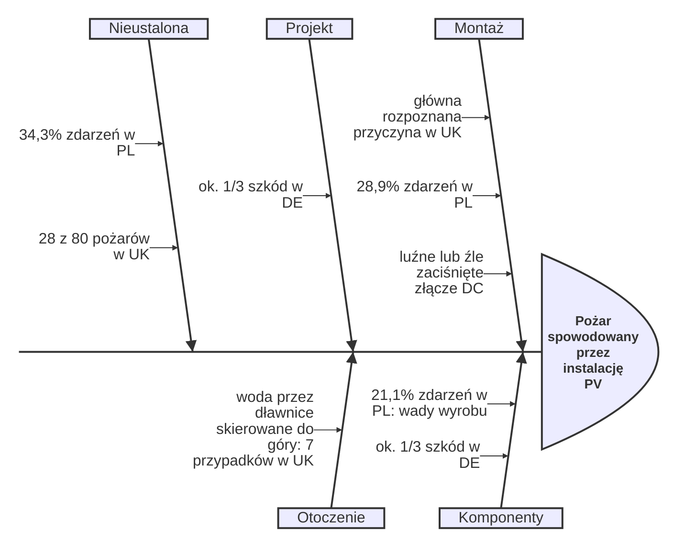
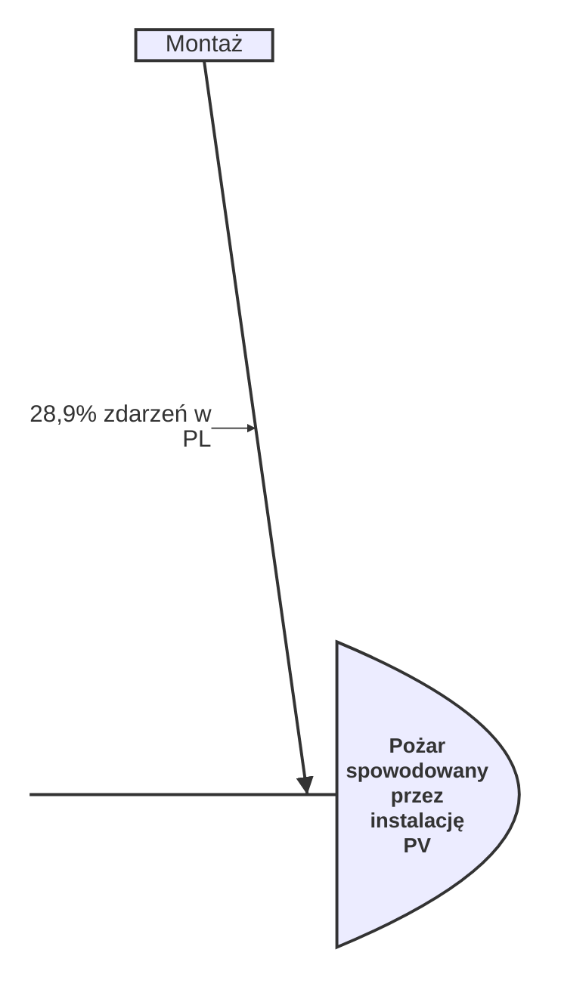
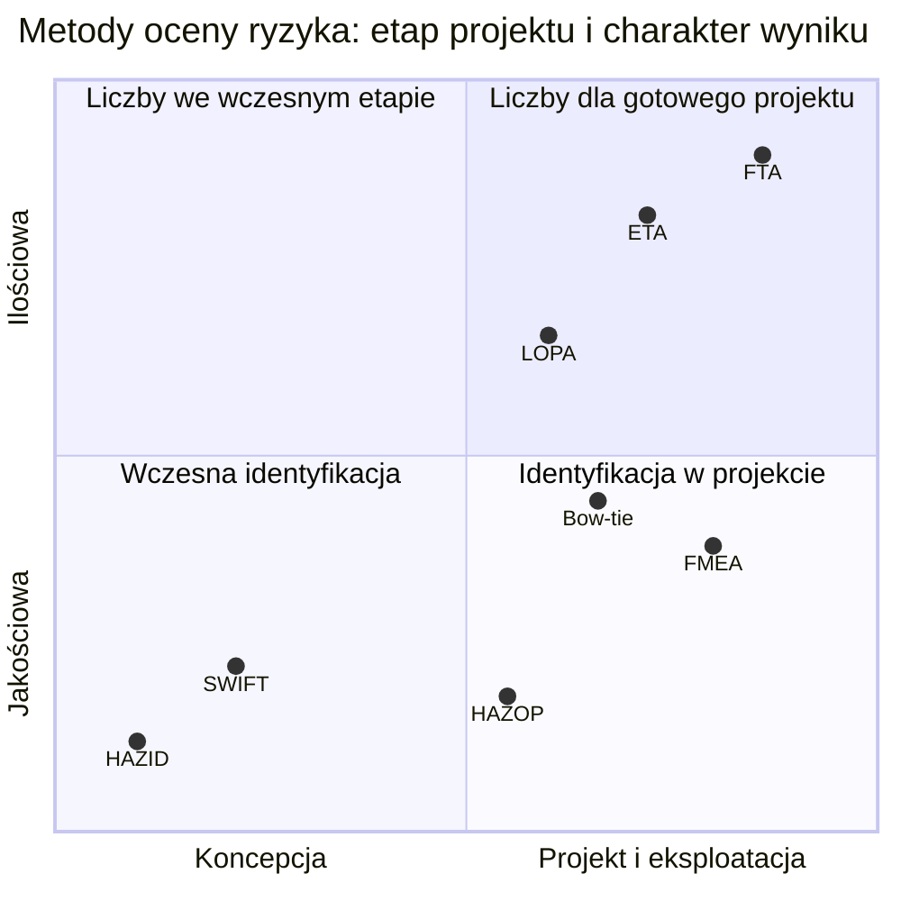
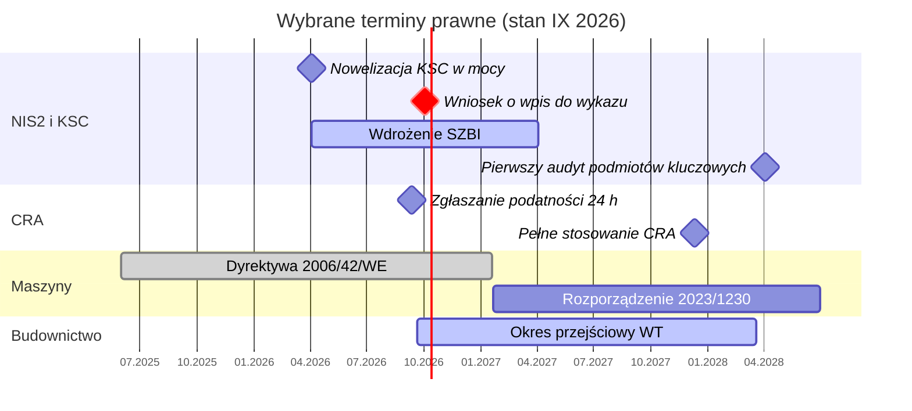

import { SlideContainer, Slide, InstructorNotes, LearningObjective } from '@site/src/components/SlideComponents';
import { Claim, Replaces, HierarchyFunnel, AlarpCarrot, OnionLayers, SwissCheese, BowTie } from '@site/src/components/viz';

<LearningObjective>

Część testowa: modele pojęciowe z W1 i W2 (hierarchia środków, ALARP, cebula, ser szwajcarski, bow-tie) narysowane według konwencji z literatury oraz trzy nowe typy diagramów Mermaid.

</LearningObjective>

<SlideContainer>

<Slide title="Hierarchia środków jako lejek" type="tip">

<Claim>Najpierw projekt, potem technika, na końcu informacja. Im niżej, tym bardziej wszystko zależy od człowieka.</Claim>

<HierarchyFunnel source="ISO 12100:2010 (metoda trzech kroków); dyrektywa 89/391/EWG; WECC 2025; DNV GL 2020" />

<Replaces>Zastępuje listę i tabelę ze slajdu „Hierarchia zmniejszania ryzyka” (W1, część 2).</Replaces>

<InstructorNotes title="Jak zbudowany jest ten slajd">

**Forma:** odwrócona piramida (jak w hierarchii środków NIOSH), ale z krokami ISO 12100. Szerokość poziomu oznacza skuteczność. Przykład z OZE stoi obok poziomu, którego dotyczy (etykiety na rysunku, a nie w osobnej tabeli: efekt *spatial contiguity*). Przerywana linia oddziela środki projektanta od środków użytkownika.

```jsx
<HierarchyFunnel source="…" />
```

</InstructorNotes>

</Slide>

<Slide title="ALARP: gdzie leży nasz scenariusz" type="info">

<Claim>Ryzyko tolerowane nie jest „wystarczająco małe”. Trzeba wykazać, że dalsze zmniejszanie byłoby rażąco nieproporcjonalne.</Claim>

<AlarpCarrot source="HSE, R2P2 (2001), wartości za Foster (2000); HSE, ALARP at a glance" />

<Replaces>Zastępuje opis słowny ze slajdu „Ryzyko tolerowane i ALARP” (W1, część 2) i liczby ze slajdu „Kryteria tolerowalności ryzyka” (W2, część 1).</Replaces>

<InstructorNotes title="Jak zbudowany jest ten slajd">

**Forma:** klasyczny trójkąt HSE (szerokość = wielkość ryzyka) z osią logarytmiczną ryzyka indywidualnego. Przełącznik „Pracownicy / Osoby postronne” przesuwa górną granicę z 10⁻³ na 10⁻⁴ na rok. Suwak ustawia ryzyko scenariusza; pod rysunkiem pojawia się wniosek.

**Na wykładzie:** ustaw 3 × 10⁻⁴ i zapytaj, czy to akceptowalne. Dla pracowników tak (z ALARP), dla sąsiadów magazynu nie.

```jsx
<AlarpCarrot source="…" />
```

</InstructorNotes>

</Slide>

<Slide title="Warstwy ochrony: cebula z grupami" type="info">

<Claim>Monitoring należy do tej samej grupy co zwykłe sterowanie. Gdy zawiedzie sterownik, często zawodzi razem z nim.</Claim>

<OnionLayers source="CCPS (za U. Michigan SAFEChE); IEC 61511-1, rys. 9 (za Goteti, Purdue P2SAC 2020)" />

<Replaces>Zastępuje schemat blokowy ze slajdu „Warstwy ochrony w modelu cebuli” (W1, część 5).</Replaces>

<InstructorNotes title="Jak zbudowany jest ten slajd">

**Forma:** prawdziwa „cebula” zamiast listy strzałek. Pierścienie mają kolory czterech grup z IEC 61511-1, więc od razu widać, które warstwy zapobiegają zdarzeniu, a które ograniczają skutki. Najechanie na pierścień lub nazwę podświetla warstwę i pokazuje przykład z OZE.

```jsx
<OnionLayers source="…" />
```

</InstructorNotes>

</Slide>

<Slide title="McMicken 2019 w modelu sera szwajcarskiego" type="danger">

<Claim>W McMicken dziury w sześciu warstwach ustawiły się w jednej linii. Jedna dobrze dobrana warstwa przerwałaby ścieżkę.</Claim>

<SwissCheese source="DNV GL, 2020; UL FSRI, 2020; Reason, 2000" />

<Replaces>Zastępuje tabelę ze slajdu „McMicken 2019 warstwa po warstwie” (W1, część 5).</Replaces>

<InstructorNotes title="Jak zbudowany jest ten slajd">

**Forma:** model Reasona narysowany na danych z raportu DNV GL. Plastry przerywane to warstwy, których nie było. Strzałka przechodzi „za” plastrami i jest widoczna tylko przez otwory. Pod rysunkiem oś czasu zdarzenia.

**Na wykładzie:** to odpowiedź na pytanie z notatek: „którą jedną warstwę dodalibyście?”. Studenci wybierają przycisk, a my sprawdzamy trzy kryteria warstwy ochrony.

```jsx
<SwissCheese source="…" />
```

</InstructorNotes>

</Slide>

<Slide title="Bow-tie ze stanem barier" type="tip">

<Claim>Zamarznięte zamknięcie hydrauliczne wyłącza barierę bez żadnego sygnału. Dlatego czynnik degradacji ma własny środek kontroli.</Claim>

<BowTie source="TRAS 120 (KAS, 2019); CCPS i Energy Institute, Bow Ties in Risk Management (2018)" />

<Replaces>Zastępuje diagram Mermaid ze slajdu „Bow-tie dla zbiornika biogazu” (W2, część 4).</Replaces>

<InstructorNotes title="Jak zbudowany jest ten slajd">

**Forma:** bow-tie w konwencji CCPS i Energy Institute: zagrożenie nad węzłem, przyczyny po lewej, skutki po prawej, czynnik degradacji pod barierą, którą osłabia. Kolor bariery to jej stan (zielona, żółta, czerwona zawsze z ikoną ✓ ! ✕).

**Na wykładzie:** zaznacz „Mróz” (bariera nadal zielona, bo działa ochrona przed mrozem), odznacz ochronę (bariera czerwona), dodaj awarię pętli BPCS: ścieżka staje się otwarta.

```jsx
<BowTie source="…" />
```

</InstructorNotes>

</Slide>

<Slide title="Przyczyny pożarów PV: diagram Ishikawy" type="info">

<Claim>Dane z trzech krajów wskazują w tym samym kierunku: połączenia DC i jakość montażu.</Claim>



Źródło: BRE NSC, 2018; Bednarczyk, 2022; Fraunhofer ISE i TÜV Rheinland, 2015.

<Replaces>Nowy typ diagramu Mermaid (`ishikawa`, od wersji 11.13) dla slajdu „PV: co mówią dane o pożarach” (W1, część 1).</Replaces>

<InstructorNotes title="Jak zbudowany jest ten slajd">

**Forma:** diagram Ishikawy (rybiej ości) jest wbudowany w Mermaid 11.13 i nowsze, więc nie wymaga żadnego komponentu. Pierwsza linia to skutek (głowa ryby), wcięcie o jeden poziom to kategoria, o dwa poziomy to przyczyna.

````md

````

Uwaga: nie ustawiamy motywu (`theme`) w nagłówku diagramu, bo wyłącza to przełączanie trybu jasnego i ciemnego.

</InstructorNotes>

</Slide>

<Slide title="Dobór metody: diagram kwadrantowy" type="tip">

<Claim>Na etapie koncepcji pracują metody jakościowe; liczby pojawiają się, gdy jest już projekt.</Claim>



Położenie metod na osiach to ilustracja dydaktyczna, a nie klasyfikacja z IEC 31010:2019.

<Replaces>Nowy widok tabeli ze slajdu „Dobór metody według IEC 31010” (W2, część 1).</Replaces>

<InstructorNotes title="Jak zbudowany jest ten slajd">

**Forma:** `quadrantChart` z Mermaid. Dobry do porównań „dwie cechy naraz”, gdy dokładne wartości nie są ważne. Kolumny tabeli z oryginału („typowy etap”, „pytanie”) zamieniają się w dwie osie.

</InstructorNotes>

</Slide>

<Slide title="Terminy prawne na osi czasu" type="warning">

<Claim>Jesienią 2026 r. kilka terminów zbiega się naraz; oś czasu pokazuje, co już obowiązuje, a co dopiero nadejdzie.</Claim>



Źródło: gov.pl, nowelizacja KSC; KE, CRA; EUR-Lex, 2023/1230; ISAP, Dz.U. 2026 poz. 1161.

<Replaces>Nowy widok dat z tabel na slajdach „Cyberbezpieczeństwo i przyłączenie do sieci”, „Prawo produktowe” i „Warunki techniczne…” (W1, część 3).</Replaces>

<InstructorNotes title="Jak zbudowany jest ten slajd">

**Forma:** `gantt` z Mermaid. Czerwona pionowa linia to dzisiejsza data z przeglądarki, więc slajd sam się aktualizuje. Kamienie milowe (romby) to terminy, paski to okresy.

**Uwaga:** paski dla dyrektywy i rozporządzenia maszynowego pokazują tylko fragment okresu obowiązywania (oś od 2025 r.).

</InstructorNotes>

</Slide>

</SlideContainer>
