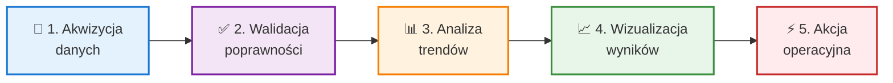

import { 
  SlideContainer, 
  Slide, 
  KeyPoints, 
  SupportingDetails, 
  InstructorNotes,
  VisualSeparator,
  InfoBox,
  WarningBox,
  SuccessBox
} from '@site/src/components/SlideComponents';

<SlideContainer>

<Slide title="🎯 Wprowadzenie i rola monitoringu w instalacjach OZE" type="info">

<KeyPoints title="📋 Cele uczenia">
- 🎓 **Zrozumienie fundamentalnej roli** monitoringu w instalacjach OZE
- 🔒 **Zapewnienie bezpieczeństwa** i ciągłości pracy instalacji
- 🔧 **Wsparcie utrzymania predykcyjnego** przez analizę danych
- 📊 **Zgodność regulacyjna** i dokumentowanie parametrów pracy
</KeyPoints>

<SupportingDetails title="📚 Kontekst wykładu">
- ⏱️ **Czas**: 90 minut
- 📖 **Zakres**: Architektura monitoringu i wskaźniki KPI
- 🏗️ **Fundamenty**: Podstawy dla całego kursu
</SupportingDetails>

<InstructorNotes>
Witamy na pierwszym wykładzie, który stanowi fundament całego kursu. Dziś poznamy cztery kluczowe role monitoringu w instalacjach OZE: **bezpieczeństwo i ciągłość pracy**, **wczesne wykrywanie anomalii**, **wsparcie utrzymania predykcyjnego** oraz **zgodność regulacyjną**. 

Te 90 minut będą bardzo praktyczne—połączymy teorię z rzeczywistym **case study** farmy fotowoltaicznej, gdzie monitoring uratował dziesiątki tysięcy euro. **Monitoring to nie tylko czujniki, ale kompletny proces transformacji danych w decyzje operacyjne**. Wszystkie następne wykłady będą budować na tych fundamentach.

Na zakończenie slajdu możecie zapytać salę: "Czy ktoś widział system monitoringu OZE w praktyce?" To świetnie angażuje i pokazuje, kto ma już doświadczenie.
</InstructorNotes>

</Slide>

<VisualSeparator type="energy" />

<Slide title="💡 Monitoring: Nie tylko zbieranie danych" type="tip">

<KeyPoints title="🔑 Definicja monitoringu">
- 📡 **Ciągły proces** zbierania danych operacyjnych
- 📊 **Analiza i wizualizacja** parametrów pracy
- 🎯 **Transformacja danych** w wiedzę operacyjną
- ⚡ **Podstawa decyzji** o utrzymaniu i optymalizacji
</KeyPoints>

<InfoBox>
**Monitoring vs. Nadzór (SCADA)**

- **Monitoring**: Obserwacja i analiza danych
- **Nadzór**: Monitoring + aktywne sterowanie i interwencje
- **SCADA**: Supervisory Control And Data Acquisition—łączy obie funkcje
</InfoBox>

**Łańcuch wartości monitoringu**—każde ogniwo musi działać bezbłędnie

<InstructorNotes>
Zaczynamy od kluczowego rozróżnienia. **Monitoring to ciągły proces zbierania i analizy danych**, nie tylko zestaw czujników na dachu. **Nadzór** idzie krok dalej—dodaje aktywne sterowanie. SCADA łączy obie funkcje w jednym systemie.

Wprowadźcie teraz termin, który będzie przewijał się przez cały kurs: **łańcuch wartości monitoringu**. To pięć ogniw: akwizycja danych, walidacja ich poprawności, analiza trendów, wizualizacja wyników i wreszcie akcja operacyjna. Każde ogniwo musi działać bezbłędnie, inaczej cały łańcuch się rwie.

Jeśli macie screenshot Grafany lub innego SCADA, pokażcie go teraz. Studenci pytają często, czy małe instalacje potrzebują SCADA—odpowiedź: poniżej 20 kWp wystarczy portal producenta, powyżej 1 MW potrzebny jest dedykowany system.
</InstructorNotes>

</Slide>

<VisualSeparator type="default" />

<Slide title="🌍 Dlaczego OZE wymaga szczególnego monitoringu?" type="info">

<KeyPoints title="⚡ Specyfika instalacji OZE">
- 🌦️ **Zmienność zasobów**: Produkcja zależy od pogody (słońce, wiatr)
- 🗺️ **Rozproszenie geograficzne**: Dziesiątki hektarów, setki turbin
- 🤖 **Tryb bezobsługowy**: Ograniczona obsługa on-site
- 📋 **Wymogi regulacyjne**: Raportowanie do OSP (Operator Systemu Przesyłowego), umowy PPA
- 🔧 **Złożoność technologiczna**: Hybrydy PV + BESS, multi-technology
</KeyPoints>

<WarningBox>
**Kluczowa zasada**

Efektywny monitoring to **kompletny łańcuch wartości**: akwizycja → walidacja → analiza → wizualizacja → akcja. Każde ogniwo musi być zaprojektowane z należytą starannością.
</WarningBox>

<InstructorNotes>
Instalacje OZE to nie elektrownie konwencjonalne—mają swoją unikalną specyfikę, która wymusza zupełnie inne podejście do monitoringu. Najpierw: **zmienność zasobów**. Moc farmy PV zmienia się od zera do stu procent w ciągu dnia, co utrudnia wykrywanie anomalii. W elektrowni węglowej stabilne 500 MW przez cały dzień—tam każda zmiana to sygnał. W OZE zmienność to naturalna cecha, trzeba odfiltrować szum od prawdziwych problemów.

Teraz **rozproszenie geograficzne**. Wyobraźcie sobie farmę wiatrową: 50 turbin rozłożonych na 5 km². Turbina numer 23 ma problem z łożyskiem. Jak to znajdziemy? Dron leci trzy godziny. **Bez monitoringu to szukanie igły w stogu siana**. 

Wreszcie regulacje: **OSP (Operator Systemu Przesyłowego) wymaga danych co 15 minut, brak danych to kary finansowe**. OSP w Polsce jest to Polskie Sieci Elektroenergetyczne (PSE). Dla małych instalacji domowych wystarczy prosty portal producenta, ale zasada pozostaje ta sama—monitoring musi działać.
</InstructorNotes>

</Slide>

<VisualSeparator type="technical" />

<Slide title="🔒 Rola #1: Bezpieczeństwo i ciągłość pracy" type="danger">

<KeyPoints title="🚨 Zagrożenia dla ciągłości">
- ⚙️ **Awarie sprzętu**: Inwertery, stringi PV, przekładnie turbin
- ⚠️ **Błędy konfiguracji**: Nieprawidłowe parametry (np. okno MPP)
- 🌧️ **Czynniki środowiskowe**: Soiling, oblodzenie, zalanie
- 🔐 **Cyberzagrożenia**: Ransomware, nieuprawniony dostęp (IEC 62443)
</KeyPoints>

<SupportingDetails title="🔥 Zagrożenia bezpieczeństwa">
- 🔥 **Pożar**: Thermal runaway (BESS), łuki elektryczne (PV, AFCI)
- ☠️ **Gazy**: Wycieki H₂, H₂S, CH₄ w biogazowniach
- 🔧 **Mechanika**: Wibracje turbin, pęknięcia łopatek (CMS)
- ⚡ **Elektryka**: Zwarcia, łuki elektryczne
</SupportingDetails>

<InstructorNotes>
Pierwsza i najważniejsza rola monitoringu to bezpieczeństwo. **Bezpieczeństwo ludzi i majątku stoi zawsze na pierwszym miejscu**, przed wszelkimi KPI i optymalizacjami finansowymi. Monitoring wykrywa zagrożenia pożarowe, gazowe, mechaniczne i elektryczne zanim staną się katastrofą.

Opowiedzcie historię z Niemiec, rok 2019: farma PV 2 MW, uszkodzona izolacja w złączu MC4. Powstał łuk elektryczny o mocy kilku kilowatów. Standardowy monitoring na poziomie inwerterów nic nie zauważył. **Efekt: pożar, 150 tysięcy euro szkód, trzy tygodnie przestoju**. Gdyby był monitoring stringów plus AFCI, problem wykryto by w sekundy.

Każda godzina przestoju w farmie 1 MW to 50-100 euro strat. Studenci pytają, czy monitoring zapobiega wszystkim awariom—odpowiedź: nie wszystkim, ale **wykrywa 80-90% problemów przed eskalacją**, a to ogromna wartość.
</InstructorNotes>

</Slide>

<VisualSeparator type="data" />

<Slide title="🔍 Rola #2: Wczesne wykrywanie anomalii i degradacji" type="warning">

<KeyPoints title="📉 Mechanizmy degradacji w PV">
- 🌫️ **Soiling**: Zabrudzenie modułów → spadek I_sc o 5–20%
- 🟡 **Delaminacja**: Yellow discoloration → wzrost temperatury
- ⚡ **PID**: Potential-Induced Degradation → spadek V_oc
- 🔥 **Hot spots**: Lokalne przegrzanie → wykrycie termowizją
</KeyPoints>

<SupportingDetails title="💨 Degradacja w turbinach wiatrowych">
- ⚙️ **Łożyska**: Wzrost amplitud drgań w charakterystycznych pasmach
- 🌀 **Łopatki**: Erozja, pioruny → asymetria mocy
- 🌡️ **Smar**: Degradacja → wzrost temperatury łożysk o 5–10°C
</SupportingDetails>

<WarningBox>
**Pułapka początkującego projektanta**

Każdy monitorowany parametr musi mieć:
1. **Threshold** (próg alarmowy) oparty na specyfikacji
2. **Action** (co robimy po przekroczeniu progu)
3. **Owner** (kto odpowiada za reakcję)

Bez tego: "data hoarding" bez wartości operacyjnej.
</WarningBox>

<InstructorNotes>
Kluczowa prawda o awariach w OZE: **większość nie pojawia się nagle**, są poprzedzone okresem degradacji. W fotowoltaice mamy soiling, delaminację, PID i hot spoty. W turbinach wiatrowych: zużycie łożysk, erozję łopatek, degradację smaru. Monitoring predykcyjny łapie te subtelne sygnały ostrzegawcze—wzrost temperatury, spadek mocy, zmianę widma drgań.

Narysujcie na tablicy wykres mocy w czasie: powolny trend spadkowy to degradacja (np. soiling), nagły skok w dół to awaria. Ta wizualizacja działa rewelacyjnie. Teraz pułapka projektanta: **każdy parametr musi mieć threshold, action i owner**. Studenci zapominają o owner—kto dostanie alert o godzinie trzeciej w nocy? Kto podejmie decyzję?

Jeśli macie wykres FFT z CMS turbiny, pokażcie prawdziwe dane. Studenci to uwielbiają. Soiling jest odwracalny, LID nieodwracalny—to też często pada na egzaminie.
</InstructorNotes>

</Slide>

<VisualSeparator type="technical" />

<Slide title="🔧 Rola #3: Utrzymanie predykcyjne (PdM)" type="success">

<KeyPoints title="✅ Korzyści Predictive Maintenance">
- 💰 **Redukcja kosztów**: Wymiana części dokładnie gdy potrzeba
- ⏰ **Zwiększenie dostępności**: Planowane interwencje w oknach niskiej produkcji
- 📦 **Optymalizacja zapasów**: Zamówienia części na podstawie prognoz
- 📊 **Data-driven decisions**: Decyzje oparte na danych, nie intuicji
</KeyPoints>

<SuccessBox>
**ROI: Farma wiatrowa 30 MW**

- **Inwestycja**: €200k w system CMS (10 turbin)
- **Wykryto w 2 lata**: 3× wczesne zużycie łożysk, 1× pęknięcie łopatki
- **Oszczędności**: €170k (naprawy planowane vs. awaryjne)
- **Uniknięte przestoje**: ~150 MWh utraconej produkcji

**Zwrot**: < 18 miesięcy ✅
</SuccessBox>

<InstructorNotes>
Utrzymanie predykcyjne to nie science fiction, tylko **już dziś standard w profesjonalnej branży OZE**. W przeciwieństwie do utrzymania reaktywnego (naprawiamy po awarii) lub prewencyjnego (wymieniamy co X miesięcy), PdM planuje interwencje na podstawie rzeczywistego stanu technicznego. Wymiana części dokładnie wtedy, gdy trzeba—nie za wcześnie, nie za późno.

Czas na liczby, które studenci zapamiętają. Farma wiatrowa 30 MW: inwestycja 200 tysięcy euro w CMS. W dwa lata system wykrył trzy wczesne zużycia łożysk i jedno pęknięcie łopatki. **Oszczędności: 170 tysięcy euro, zwrot w niecałe 18 miesięcy**. Te konkretne liczby przekonują nie tylko studentów, ale też ich przyszłych pracodawców.

Typowe zastosowania: w PV analiza trendów PR prowadzi do planowania mycia, w turbinach FFT pokazuje, kiedy wymieniać łożyska, w BESS ekstrapolacja SoH przewiduje koniec życia baterii. Dla małych instalacji wystarczy uproszczona forma, pełny PdM opłaca się od około 1 MW.
</InstructorNotes>

</Slide>

<VisualSeparator type="data" />

<Slide title="📋 Rola #4: Zgodność regulacyjna i kontraktowa" type="info">

<KeyPoints title="🏛️ Wymagania regulacyjne">
- ⚡ **OSP (Operator Systemu Przesyłowego)**: Raportowanie co 15 min, reakcja na sygnały
- 📄 **Umowy PPA**: Weryfikacja produkcji, dokumentacja przestojów
- 🌐 **Standardy branżowe**: IEC 61724 (PV), IEC 61400-25 (wiatr), IEC 61850
- 🏆 **Audyty i certyfikacje**: ISO 50001, audyty bankowe, raportowanie ESG
</KeyPoints>

<InfoBox>
**Retencja danych—wymogi typowe**

- 📊 **Dane szczegółowe** (1-min): 1–3 miesiące
- 📈 **Dane zagregowane** (15-min): 1–2 lata
- 📑 **Raporty i alarmy**: 5–10 lat

Planuj koszty składowania i backup zgodnie z wymogami!
</InfoBox>

<InstructorNotes>
Compliance to nie biurokracja dla biurokracji—**to fundamentalne zabezpieczenie biznesowe**. Operator Systemu Przesyłowego wymaga danych co 15 minut, umowy PPA wymagają dowodów produkcji, standardy IEC definiują protokoły komunikacji. Bez spełnienia tych wymogów nie ma biznesu.

Zobaczcie praktyczny przykład. Farma 10 MW, umowa PPA na 60 euro za megawatogodzinę. Operator twierdzi: wyprodukowaliśmy 1000 MWh. Kupujący energii: pokażcie dane. Brak monitoringu? Spór, arbitraż, koszty prawne przekraczające 50 tysięcy euro. **Monitoring to polisa ubezpieczeniowa**, która chroni przed takimi scenariuszami.

Retencja danych też jest krytyczna. Dane minutowe trzymamy 1-3 miesiące, 15-minutowe rok lub dwa, raporty i alarmy 5-10 lat. OSP może zażądać historycznych danych do analiz zakłóceń—trzeba je mieć. Jeśli macie przykład raportu 15-minutowego, pokażcie go, nawet zanonimizowany. Studenci pytają o GDPR—dane techniczne nie są danymi osobowymi, chyba że monitorujemy zużycie w domach.
</InstructorNotes>

</Slide>

<VisualSeparator type="energy" />

<Slide title="🌞 Case Study: Farma PV 5 MW i problem soiling" type="tip">

<KeyPoints title="📊 Obserwowana anomalia">
- 📅 **Okres**: Marzec 2020 → Październik 2020 (7 miesięcy)
- 📉 **Spadek PR**: Z 88–90% do 80% (–10 pp w 4 miesiące)
- 💰 **Strata finansowa**: ~€3000/miesiąc (60 MWh × €50/MWh)
- 🔍 **Przyczyna**: Zabrudzenie modułów (soiling) w regionie o niskich opadach
</KeyPoints>

<SupportingDetails title="🔧 System monitoringu">
- ☀️ **Pyranometr referencyjny** (ISO 9060:2018, klasa A, POA)
- 🌡️ **Czujnik temperatury** modułów (termopara)
- 📈 **Monitoring stringów** (prądy/napięcia DC)
- 💻 **SCADA** z algorytmami PR w czasie rzeczywistym
</SupportingDetails>

<InstructorNotes>
Teraz przechodzimy do rzeczywistego przypadku, który ilustruje pełny łańcuch wartości monitoringu. Farma PV 5 MW w regionie stepowym, tylko 400 mm opadów rocznie—to mniej niż Warszawa. **Performance Ratio spadło z 88% do 80% w cztery miesiące**, co oznaczało stratę około 3 tysięcy euro miesięcznie.

Kluczową rolę odegrał system monitoringu: pyranometr referencyjny w płaszczyźnie modułów, czujnik temperatury, monitoring stringów i SCADA z algorytmem PR w czasie rzeczywistym. **Bez pyranometru nie odróżnilibyśmy zabrudzenia od zwykłej sezonowości**—mniej słońca jesienią to normalka, spadek PR przy tej samej irradiancji to problem.

Narysujcie na tablicy wykres PR w czasie: marzec 88%, systematyczny spadek, październik 80%. Linia trendu mówi wszystko. Zapytajcie studentów: jesteście operatorem, widzicie ten spadek, co robicie? Jak diagnozujecie? To rodzi świetną dyskusję przed kolejnym slajdem, gdzie pokażecie proces diagnostyczny.
</InstructorNotes>

</Slide>

<VisualSeparator type="data" />

<Slide title="🔬 Case Study cd.: Diagnoza i interwencja" type="success">

<KeyPoints title="🧪 Proces diagnostyczny">
- 📊 **Analiza korelacji**: Irradiancja POA vs. moc rzeczywista
- 🔍 **Obserwacja**: Przy tej samej irradiancji, moc niższa o 6–8%
- ✅ **Eliminacja**: Temperatura OK, napięcia/prądy równomierne
- 💡 **Wniosek**: Problem równomierny → soiling, nie awaria
</KeyPoints>

<SuccessBox>
**Interwencja i ROI**

- 🚿 **Mycie modułów**: Woda zdemineralizowana + miękkie szczotki
- 💵 **Koszt**: €12 000
- 📈 **Efekt**: PR wzrósł z 80% → 87% (+7 pp)
- 💰 **Zysk**: €15 750 w 6 miesięcy (7 pp × 750 MWh × €50)
- ✅ **ROI**: 31% w 6 miesięcy

**Bonus**: Wdrożono harmonogram prewencyjnego mycia 2×/rok
</SuccessBox>

<InstructorNotes>
Diagnoza opierała się na systematycznej analizie. Najpierw korelacja: przy tej samej irradiancji moc była niższa o 6-8%. Potem eliminacja: temperatura modułów w normie, napięcia i prądy stringów równomierne, więc nie awaria pojedynczych elementów. **Wniosek: problem równomierny na całej farmie, związany z absorpcją światła—soiling**.

Interwencja kosztowała 12 tysięcy euro: mycie wodą zdemineralizowaną z miękkimi szczotkami. Efekt? **PR wzrósł z 80% do 87%, czyli plus 7 punktów procentowych**. W sześć miesięcy do końca roku to dało zysk 15 750 euro. ROI 31% w pół roku—doskonały wynik. Operator wdrożył harmonogram prewencyjnego mycia dwa razy rocznie.

To idealny przykład pełnego łańcucha wartości: akwizycja danych, analiza trendu, diagnoza przez korelację, akcja operacyjna i weryfikacja skuteczności. **Bez monitoringu problem pozostałby niezauważony przez miesiące**. Jeśli możecie, pokażcie scatter plot irradiancja versus moc przed i po myciu—punkty wracają na oczekiwaną linię.
</InstructorNotes>

</Slide>

<VisualSeparator type="technical" />

<Slide title="📊 Kluczowe wskaźniki KPI: Performance Ratio (PR)" type="info">

<KeyPoints title="📐 Definicja PR">
- 📋 **Wzór**: PR = E_rzecz / E_teor
- 🎯 **Znaczenie**: Stosunek rzeczywistej produkcji do teoretycznej (skorygowanej o warunki)
- 🌡️ **Korekty**: Uwzględnia irradiancję POA i temperaturę modułów
- ✅ **Typowe wartości**: 75–85% (stare), 85–90% (nowoczesne), > 90% (idealne)
</KeyPoints>

<InfoBox>
**Wzór szczegółowy**

$$
PR = \frac{E_{\text{AC,rzecz}}}{G_{\text{POA}} \times A \times \eta_{\text{STC}} \times (1 + \gamma \cdot \Delta T)}
$$

- E_AC: Energia rzeczywista [kWh]
- G_POA: Irradiancja w płaszczyźnie modułów [kWh/m²]
- A: Powierzchnia modułów [m²]
- η_STC: Sprawność w warunkach STC
- γ: Współczynnik temperaturowy [%/°C]
- ΔT: Różnica temperatury względem 25°C
</InfoBox>

<InstructorNotes>
Performance Ratio to **najważniejszy wskaźnik w monitoringu fotowoltaiki**—zapamiętajcie to. PR porównuje rzeczywistą produkcję z teoretyczną, ale kluczowe jest to, że uwzględnia rzeczywiste warunki: irradiancję i temperaturę. Dzięki temu można porównywać różne dni i różne lokalizacje.

Wzór wygląda skomplikowany, ale logika jest prosta: energia rzeczywista AC dzielona przez iloczyn irradiancji, powierzchni modułów, sprawności STC i korekty temperaturowej. Typowe wartości: 75-85% dla starszych instalacji, 85-90% dla nowoczesnych, powyżej 90% w idealnych warunkach. **Niski PR sygnalizuje problem techniczny, nie brak słońca**—to fundamentalna różnica.

Interpretacja: PR powyżej 85% to instalacja działa dobrze, 75-85% możliwe problemy jak soiling czy shading, poniżej 75% poważne kłopoty. PR może teoretycznie przekroczyć 100% zimą przy odbitym świetle od śniegu, ale jeśli widzicie 105%, to raczej błąd kalibracji pyranometru. W SCADA liczymy PR co kilka minut, do raportów agregujemy dziennie lub miesięcznie.
</InstructorNotes>

</Slide>

<VisualSeparator type="data" />

<Slide title="⚡ Kluczowe KPI: Availability, Capacity Factor" type="info">

<KeyPoints title="🔋 Availability (Dostępność)">
- 📋 **Definicja**: % czasu, gdy instalacja jest zdolna do produkcji
- 🧮 **Wzór**: A = t_praca / (t_praca + t_przestój_nieplan.) × 100%
- ⚠️ **Uwaga**: Przestoje planowane często nie wliczane (zależy od SLA)
- ✅ **Typowe**: > 99% (PV), 95–98% (wiatr), 97–99% (BESS)
</KeyPoints>

<SupportingDetails title="🌍 Capacity Factor (CF)">
- 📋 **Definicja**: Stosunek rzeczywistej produkcji do maksymalnej możliwej
- 🧮 **Wzór**: CF = E_rzecz / (P_nom × t) × 100%
- 🌞 **PV**: 10–20% (Europa Środkowa), 20–30% (pustynie)
- 💨 **Wiatr**: 20–35% (onshore), 40–50% (offshore)
</SupportingDetails>

<WarningBox>
**Uwaga terminologiczna**

**CF ≠ PR**

- **CF** zależy od dostępności zasobu (ile świeciło słońce)
- **PR** mierzy efektywność konwersji przy danych zasobach
- Niski CF = normalny (mało słońca zimą)
- Niski PR = problem techniczny!
</WarningBox>

<InstructorNotes>
Teraz dwa wskaźniki, które studenci często mylą—poświęćcie temu czas. **Availability to miara niezawodności**, ile procent czasu instalacja jest gotowa do produkcji. Typowe wartości: ponad 99% dla PV (brak ruchomych części!), 95-98% dla turbin wiatrowych, 97-99% dla magazynów.

Capacity Factor to stosunek rzeczywistej produkcji do maksymalnej możliwej. Tu najważniejsze: **CF zależy od dostępności zasobu, PR od sprawności technicznej**. To kluczowa różnica, która pada na każdym egzaminie. Narysujcie dwa scenariusze na tablicy. Scenariusz pierwszy: zima, dużo chmur, CF 8%, PR 88%—instalacja działa świetnie, po prostu mało słońca. Scenariusz drugi: lato, CF 18%, PR 70%—dużo słońca, ale instalacja ma problem techniczny.

CF ma wyraźną sezonowość: wysoki latem, niski zimą. PR powinien być stabilny przez cały rok. Wiatr offshore ma CF 40-50%, bo nie ma przeszkód terenowych i jest większa regularność. Można porównywać CF między lokalizacjami, ale ostrożnie—Hiszpania ma więcej słońca niż Polska, to nie znaczy, że ich instalacje są lepsze.
</InstructorNotes>

</Slide>

<VisualSeparator type="technical" />

<Slide title="🔋 Kluczowe KPI: SoC, SoH, OEE" type="info">

<KeyPoints title="🔌 State of Charge (SoC) i State of Health (SoH)">
- 📊 **SoC**: % dostępnej pojemności względem nominalnej (stan naładowania)
- 🧮 **Estymacja**: Coulomb counting + Extended Kalman Filter
- ❤️ **SoH**: % aktualnej pojemności względem nowej baterii (stan zdrowia)
- ⚠️ **Degradacja**: SoH → 80% po 3000–5000 cykli (End of Life)
</KeyPoints>

<SupportingDetails title="🏭 Overall Equipment Effectiveness (OEE)">
- 📋 **Definicja**: OEE = Availability × Performance × Quality
- 🏗️ **Kontekst**: Lean manufacturing, zaadaptowany do biogazowni
- 🎯 **Typowe wartości**: OEE > 85% dla dobrze działającej biogazowni
- 📊 **Komponenty**: A (czas pracy), P (przepływ biogazu), Q (jakość CH₄)
</SupportingDetails>

<InstructorNotes>
Przechodzimy do wskaźników specyficznych dla magazynów energii i biogazowni. **State of Charge i State of Health to fundamenty monitoringu BESS**—bez nich nie ma kontroli nad baterią. SoC to stan naładowania w procentach pojemności nominalnej, estymowany przez coulomb counting plus filtr Kalmana. Szczegóły algorytmów będą w wykładzie dziewiątym o Edge AI.

SoH to stan zdrowia, czyli aktualna pojemność względem nowej baterii. **Degradacja: LFP spada do 80% po około 5000 cykli, NMC po 3000 cykli**. 80% to powszechnie przyjęty End of Life. Studenci pytają, czy można regenerować—odpowiedź: w większości nieodwracalna, można tylko spowolnić przez odpowiednią głębokość rozładowania i temperaturę. Pomiar SoH minimum raz w miesiącu, BMS robi to automatycznie.

OEE to metoda z lean manufacturing, zaadaptowana do biogazowni: availability razy performance razy quality. Przykład: 96% czasu pracy, 90% przepływu projektowego, 95% jakości metanu daje OEE 82%. Pokazuje, jak różne branże wpływają na siebie—OZE czerpie z doświadczeń przemysłu.
</InstructorNotes>

</Slide>

<VisualSeparator type="energy" />

<Slide title="🎓 Podsumowanie: Monitoring jako fundament OZE" type="success">

<KeyPoints title="🔑 Kluczowe wnioski z W1">
- 🎯 **Monitoring** to kompletny łańcuch: akwizycja → analiza → akcja
- 🔒 **Bezpieczeństwo** zawsze priorytet—thermal runaway, łuki, gazy
- 🔧 **PdM** zwraca się szybko—ROI często < 2 lata
- 📊 **Compliance** to zabezpieczenie biznesowe, nie biurokracja
- 📈 **KPI** to narzędzia diagnostyczne: PR, Availability, CF, SoC, SoH
</KeyPoints>

<SuccessBox>
**Lekcja z case study farmy PV**

Pełny łańcuch wartości monitoringu w akcji:
1. Pyranometr + czujniki → surowe dane
2. Algorytm PR → wykrycie trendu spadkowego
3. Korelacja irradiancja–moc → diagnoza soiling
4. Mycie modułów → interwencja
5. Wzrost PR → weryfikacja skuteczności

**Bez monitoringu**: Problem niezauważony przez miesiące, utrata €15k+
</SuccessBox>

<InstructorNotes>
Zbieramy wszystko w całość. **Monitoring to kompletny łańcuch od akwizycji do akcji**, nie tylko czujniki na dachu—to kluczowy wniosek z dzisiejszego wykładu. Bezpieczeństwo zawsze priorytet: thermal runaway, łuki elektryczne, wycieki gazów. Utrzymanie predykcyjne zwraca się szybko, często poniżej dwóch lat. Compliance to nie biurokracja, ale zabezpieczenie biznesowe. KPI to narzędzia diagnostyczne: PR, Availability, CF, SoC, SoH.

Case study farmy PV pokazało pełny łańcuch wartości w akcji: od pyranometru przez algorytm PR, korelację, diagnozę soiling, mycie modułów aż do weryfikacji skuteczności. **Bez monitoringu strata ponad 15 tysięcy euro pozostałaby niezauważona**. To najlepszy przykład, dlaczego monitoring się opłaca.

Zapowiedź następnego wykładu: zagłębimy się w architekturę edge-fog-cloud, protokoły Modbus, MQTT, OPC UA, przepływ danych od czujników do chmury. Studenci powinni przejrzeć definicje KPI. Pytajcie na koniec: "Jakie aspekty monitoringu wydają się Wam najbardziej interesujące?" To pokaże, gdzie mają pasję.
</InstructorNotes>

</Slide>

</SlideContainer>

---

## 📚 Materiały uzupełniające

Pełna treść wykładu z rozszerzonymi wyjaśnieniami, przykładami i szczegółami dostępna jest w pliku: [01-wstep-rola.mdx](./01-wstep-rola.mdx)

### Literatura
- IEC 61724: Photovoltaic system performance monitoring
- IEC 61850: Communication networks and systems for power utility automation
- IEC 62443: Industrial automation and control systems security

### Polecane lektury
- "Predictive Maintenance in Renewable Energy" - IEEE Access 2021
- "Performance Ratio and Capacity Factor of PV Systems" - Solar Energy Journal

### Narzędzia
- **Grafana**: Wizualizacja danych monitoringu
- **InfluxDB**: Baza danych czasowych
- **SCADA**: Systemy nadzoru i sterowania (np. IGSS, WinCC)

