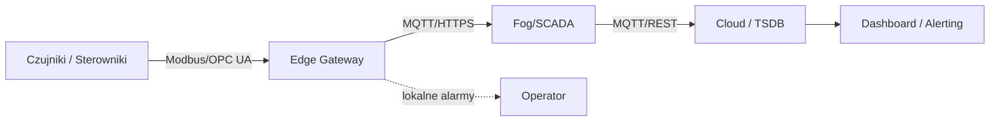

# Warstwy architektury: edge–fog–cloud

## Definicje i odpowiedzialności

- Edge — blisko urządzeń: akwizycja, wstępna filtracja, normalizacja jednostek, buforowanie, czasem proste reguły alarmowe (np. lokalne progi).
- Fog — lokalna konsolidacja: agregacja wielu źródeł, normalizacja tagów, krótkoterminowe składowanie, analityka bliska procesowi, cache na wypadek utraty łączności z chmurą.
- Cloud — długoterminowe składowanie i analityka: raporty, uczenie maszynowe, porównania międzyobiektowe, zarządzanie flotą.

## Przepływ danych (upraszczając)

## Decyzje architektoniczne

- Opóźnienia i niezawodność: reguły bezpieczeństwa i zatrzymania procesu muszą działać bez chmury (edge/fog).
- Retencja danych: krótsza na edge/fog (godziny–dni), dłuższa w chmurze (miesiące–lata).
- Standaryzacja interfejsów: OPC UA dla struktury tagów, MQTT dla lekkiej telemetrii.

## Przykład

Biogazownia 1 MW: czujniki H₂S i CH₄ zbierane przez PLC → gateway OPC UA/MQTT (edge) → serwer SCADA (fog) z lokalnym historykiem → replikacja do InfluxDB w chmurze (cloud) → dashboardy serwisowe w Grafanie, alarmy z eskalacją SMS/e-mail.

