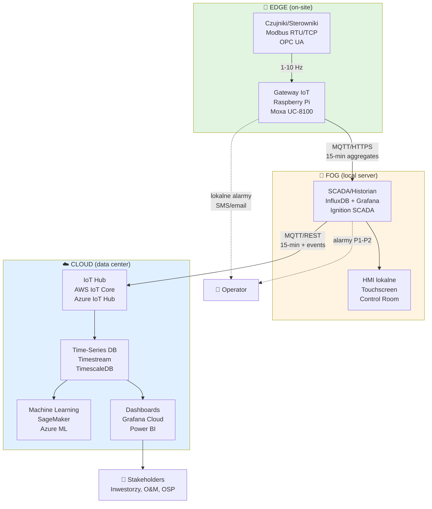

import { LearningObjective, KeyConcept, Example } from '@site/src/components/SlideComponents';
import InteractiveQuiz from '@site/src/components/InteractiveQuiz';

# Warstwy architektury: edge–fog–cloud

<LearningObjective>
Po tej sekcji student potrafi scharakteryzować trzy warstwy architektury monitoringu (edge, fog, cloud), przypisać im odpowiednie funkcje i wyjaśnić, jak decyzje architektoniczne wpływają na niezawodność, opóźnienia i retencję danych.
</LearningObjective>

## Wprowadzenie: Dlaczego warstwowa architektura?

Systemy monitoringu OZE ewoluowały od **prostych rozwiązań scentralizowanych** (wszystko w jednym SCADA w serwerowni) do **architektur rozproszonych**, które dzielą odpowiedzialności między **edge, fog i cloud**. Ta ewolucja była napędzana przez:

- **Skalę**: Nowoczesne farmy PV to tysiące punktów pomiarowych, farmy wiatrowe—setki turbin rozproszonych na dziesiątkach kilometrów
- **Łączność**: Połączenia 4G/5G są nie zawsze dostępne (odległe lokalizacje) i kosztowne (transfer terabajt ów surowych danych)
- **Opóźnienia**: Reguły bezpieczeństwa (np. odcięcie zasilania przy przekroczeniu progów) wymagają reakcji w **milisekundach**, nie sekundach
- **Niezawodność**: Utrata łączności z chmurą nie może sparaliżować krytycznych funkcji (alarmy, sterowanie lokalne)
- **Bezpieczeństwo**: Segregacja poziomów dostępu (edge/fog w OT—Operational Technology, cloud w IT—Information Technology) zgodnie z IEC 62443

<KeyConcept title="Architektura edge-fog-cloud a Purdue Model">
Model Purdue (ISA-95) definiuje hierarchię automatyki przemysłowej w 5 poziomach (0—czujniki, 1—sterowanie, 2—nadzór, 3—MES, 4—ERP). W OZE:
- **Edge** ≈ Poziomy 0–1 (czujniki + akwizycja + lokalne PLC)
- **Fog** ≈ Poziomy 2–3 (SCADA lokalne, HMI, krótkoterminowa analityka)
- **Cloud** ≈ Poziom 4+ (zarządzanie flotą, long-term analytics, integracja z systemami biznesowymi)
</KeyConcept>

<details>
<summary>📝 Notatki prowadzącego</summary>

**Czas**: 8 minut

**Przebieg**:
1. Wprowadzenie do koncepcji warstwowej architektury (3 min)
2. Pokazanie schematu Purdue Model na tablicy lub slajdzie (2 min)
3. Pytanie do sali: "Dlaczego nie możemy mieć wszystkiego w chmurze?" (3 min—dyskusja)

**Punkty kluczowe**:
- **Ewolucja**: Od SCADA monolitycznych (lata 90.–2000.) do architektury rozproszonej (2010.+)
- **Analogia do IT**: Edge-fog-cloud to odpowiednik edge computing w IoT/przemyśle 4.0
- **Bezpieczeństwo cybernetyczne**: Segregacja OT/IT chroni przed propagacją ataków

**Pytania studenckie**:
- Q: Czy w małej instalacji (np. 100 kW PV) też potrzebujemy trzech warstw?
- A: Niekoniecznie. Małe instalacje często korzystają z rozwiązań cloud-first (inwerter → WiFi → chmura producenta). Ale nawet tam, inwerter pełni rolę edge (lokalna logika MPPT, ochrony).

- Q: Co to dokładnie znaczy "fog"? To niejasny termin.
- A: Zgoda, nazwa jest marketingowa (Cisco). W praktyce: "fog = lokalny serwer/gateway z możliwościami analitycznymi, który nie jest ani w urządzeniu końcowym (edge), ani w centrum danych (cloud)".

</details>

---

## Warstwa Edge: Blisko czujników i sterowników

**Warstwa edge** to **pierwszy punkt kontaktu** między światem fizycznym (czujniki, aktuatory) a systemem cyfrowym. W instalacjach OZE, edge obejmuje:

- **Gateway IoT**: Modułowe urządzenia (Raspberry Pi, Siemens IOT2040, Moxa UC-8100) zbierające dane przez Modbus RTU/TCP, CAN bus, Ethernet/IP
- **Sterowniki PLC**: Programowalne sterowniki logiczne (np. Siemens S7-1200, Allen-Bradley CompactLogix) z wbudowanymi I/O i logiką
- **Smart invertery i BMS**: Urządzenia z wbudowanymi możliwościami komunikacyjnymi (Modbus TCP, Sunspec, OPC UA)
- **Lokalne HMI**: Panele operatorskie (touchscreeny) dla obsługi na miejscu

### Funkcje i odpowiedzialności warstwy edge

#### 1. Akwizycja danych (Data Acquisition)

Edge zbiera **surowe sygnały** z czujników (napięcia, prądy, temperatury, ciśnienia) i konwertuje je na **wartości fizyczne** (W, V, A, °C, Pa). Typowe częstotliwości próbkowania:
- **Standardowe parametry**: 1–10 Hz (moc, napięcia, temperatury)
- **Analizy drganiowe (CMS)**: 10–50 kHz (widma FFT dla diagnostyki łożysk)
- **Zdarzenia**: Event-driven (przełączenia, alarmy)

**Kluczowe wymaganie**: **Synchronizacja czasu** (NTP—Network Time Protocol, dokładność < 10 ms) dla korelacji zdarzeń między urządzeniami.

#### 2. Wstępna filtracja i walidacja

Nie wszystkie surowe dane są wartościowe. Edge wykonuje:
- **Filtrację antyaliasingową** (filtry Butterwortha, Chebyszeva) przed samplingiem
- **Usuwanie szumów**: Filtry medianowe, moving average dla wolno zmieniających się sygnałów
- **Walidację zakresów**: Odrzucanie wartości poza granicami fizycznymi (np. temperatura < -50°C lub > 150°C dla czujników w OZE)
- **Dead-band filtering**: Ignorowanie zmian < delta (np. transmit tylko gdy zmiana temperatury > 0.5°C) → redukcja ruchu sieciowego

#### 3. Normalizacja jednostek

Różne urządzenia raportują w różnych jednostkach. Edge standaryzuje:
- Moc: W → kW
- Energia: Wh → kWh
- Irradiancja: W/m² (bez konwersji—standard)
- Temperatura: °C (Europa) lub °F (USA) → zawsze konwertuj do jednej

#### 4. Buforowanie (buffering)

Edge utrzymuje **lokalny bufor** (zwykle RAM lub flash, 1–24 h danych) na wypadek utraty łączności z fog/cloud. Po przywróceniu łączności, dane są **synchronizowane** (store-and-forward).

**Przykład**: Gateway IoT na farmie PV w górach traci łączność LTE na 3 godziny (burza). Bufor przechowuje dane 1-minutowe (180 rekordów). Po przywróceniu łączności, dane są wysłane partiami do SCADA fog.

#### 5. Lokalne reguły alarmowe

Krytyczne alarmy **nie mogą czekać** na decyzję z chmury. Edge wykonuje:
- **Progi statyczne**: Np. temperatura BESS > 60°C → stop charging
- **Logika interlockingu**: Np. w biogazowni: jeśli H₂S > 1000 ppm → zamknij zawory dopływu, uruchom alarm
- **Restart automatyczny**: Po ustąpieniu przyczyny alarmu (np. temperatura spadła do < 55°C), wznowienie normalnej pracy

:::tip Kluczowa zasada bezpieczeństwa
**Safety-critical logic must run locally (edge/fog), not in the cloud.** Opóźnienie do chmury może wynosić 100–500 ms (plus ryzyko utraty łączności). Dla bezpieczeństwa ludzi i sprzętu, reakcja musi być < 100 ms.
:::

### Ograniczenia warstwy edge

- **Zasoby obliczeniowe**: Edge devices mają ograniczone CPU/RAM (typowo ARM Cortex-A9, 512 MB–2 GB RAM). Nie nadają się do złożonych analiz ML.
- **Brak kontekstu globalnego**: Edge zna tylko lokalne dane (jedna turbina, jeden inverter). Nie widzi korelacji między obiektami.
- **Trudność aktualizacji**: Firmware update na 100 gatewayach to wyzwanie logistyczne.

<Example title="Konfiguracja edge gateway: Farma PV 1 MW">
**Hardware**: Raspberry Pi 4 (4 GB RAM) + HAT Modbus RTU (RS-485)

**Funkcje**:
- Zbieranie danych z 4 inverterów (SMA Sunny Tripower) przez Modbus TCP, co 10 s
- Normalizacja: moc AC w W → kW
- Walidacja: odrzucanie PR > 1.2 (błąd czujnika lub danych)
- Bufor lokkalny: SQLite, 48 h danych
- Wysyłka do fog: MQTT, topic `pv/site-001/inverters/{id}/power`, co 1 min (agregacja średnia z 6 próbek)
- Alarm lokalny: jeśli moc AC = 0 przy irradiancji > 200 W/m² przez > 5 min → SMS do serwisu (przez modem LTE)

**Koszt**: ~€300 (hardware) + €15/miesiąc (4G data plan)
</Example>

<details>
<summary>📝 Notatki prowadzącego</summary>

**Czas**: 12 minut

**Przebieg**:
1. Przegląd funkcji edge (6 min, po ~1 min każda)
2. Przykład gateway (3 min)—jeśli masz fizyczny Raspberry Pi + HAT, pokaż na zajęciach!
3. Dyskusja: Jakie alarmy powinny być lokalne, a jakie mogą czekać? (3 min)

**Punkty kluczowe**:
- **Edge to nie "tylko zbieranie"**: To inteligentne przetwarzanie bliskie źródłu
- **Store-and-forward**: Kluczowa funkcja dla niezawodności w słabej łączności (farmy wiejskie, offshore)
- **Bezpieczeństwo > efektywność**: Zawsze priorytet dla lokalnych alarmów

**Pytania studenckie**:
- Q: Jakie protokoły są najpopularniejsze na edge?
- A: Modbus RTU/TCP (legacy, ale wciąż dominujący w PV/wiatr), OPC UA (nowsze, trend przemysłowy), MQTT (IoT, lekki), BACnet (HVAC, ale rzadko w OZE).

- Q: Czy edge może działać bez internetu?
- A: Tak! To kluczowa cecha. Edge + fog mogą działać w trybie "island mode" (bez chmury) przez tygodnie. Cloud jest do long-term analytics, nie do kontroli procesu.

</details>

---

## Warstwa Fog: Lokalna konsolidacja i analityka

**Warstwa fog** to **pośredni poziom** między edge a cloud, który agreguje dane z wielu urządzeń edge, wykonuje lokalną analitykę i buforuje dane na wypadek utraty łączności z chmurą. W praktyce, fog to:

- **Serwer SCADA lokalny**: PC przemysłowy (IPC) z oprogramowaniem SCADA (Ignition, WinCC, Citect) w szafie sterowniczej lub kontenerze technicznym
- **Edge server**: Potężniejszy gateway (Dell Edge Gateway 5000, HPE Edgeline) z możliwościami wirtualizacji (Docker, K3s)
- **Lokalna baza danych**: TSDB (Time-Series Database) jak InfluxDB, TimescaleDB, Historian (OSIsoft PI, GE Proficy)

### Funkcje i odpowiedzialności warstwy fog

#### 1. Agregacja wielu źródeł

Fog zbiera dane z **dziesiątek do setek** urządzeń edge:
- Farma PV 10 MW: 40 inverterów + 5 weather stations + 10 string combiner boxes → 55 źródeł
- Farma wiatrowa 30 MW: 10 turbin (każda z ~500 tagów SCADA) → 5000 tagów

**Protokoły na poziomie fog**: Modbus TCP, OPC UA (najlepszy dla interoperacyjności), MQTT (subscribe do wszystkich topics edge).

#### 2. Normalizacja tagów (Tag Naming & Structuring)

Różne producenty inwerterów używają różnych nazw tagów:
- SMA: `Pac` (moc AC)
- Fronius: `P_AC_Total`
- Huawei: `active_power`

Fog mapuje wszystkie do **jednolitej nomenklatury** (np. zgodnej z IEC 61850):
```
site-001.inverter-01.power.ac.total
site-001.inverter-02.power.ac.total
...
```

Struktura hierarchiczna ułatwia:
- **Automatyczne dashboardy** (Grafana queries dla `site-*.inverter-*.power.ac.total`)
- **Alarmy globalne** (suma mocy < 80% oczekiwanej)

#### 3. Krótkoterminowe składowanie (Short-Term Historian)

Fog przechowuje **szczegółowe dane** (1-s, 10-s interval) przez **godziny do tygodni**:
- **Zwykle**: 7–30 dni danych wysokiej rozdzielczości
- **Technologia**: InfluxDB, TimescaleDB (open-source), OSIsoft PI (komercyjne, drogie ale potężne)

Po tym okresie, dane są:
- **Agregowane** (średnia 1-min → 15-min) i wysyłane do cloud
- **Lub usuwane** (jeśli nie są potrzebne long-term)

**Przypadek użycia**: Analiza szczegółowa awarii (np. sekwencja zdarzeń podczas trip invertera) wymaga danych 1-s. Fog dostarcza ten poziom szczegółowości lokalnie, bez potrzeby ściągania terabajtów z chmury.

#### 4. Analityka bliska procesowi (Near-Real-Time Analytics)

Fog ma zasoby obliczeniowe (CPU 8-core, RAM 16-64 GB) do:
- **Kalkulacji KPI**: PR, Availability, Capacity Factor w czasie rzeczywistym (okna ruchome 15-min, 1-h, 24-h)
- **Detekcji anomalii**: Proste algorytmy (progi adaptacyjne, CUSUM, reguły eksperckie)
- **Wizualizacji lokalnej**: HMI dla operatorów na miejscu (ekrany w control room)

**Przykład**: Fog oblicza PR dla każdego invertera co 15 minut. Jeśli PR invertera < 0.75 (podczas gdy inne mają > 0.85), generuje alarm "Suspected underperformance—Inverter 12".

#### 5. Cache i synchronizacja z cloud

Fog działa jak **cache warstwy danych** między edge a cloud:
- **Upload do cloud**: Dane zagregowane (15-min averages), KPI, alarmy
- **Download z cloud**: Aktualizacje konfiguracji (nowe progi alarmowe, logika), modele ML (np. model predykcji produkcji)

**Protokoły synchronizacji**: MQTT (publish agregat ów), REST API (POST batch records), Kafka (event streaming dla dużych wdrożeń).

:::note Fog vs. Edge: Jak rozróżnić?
**Zasada**: Jeśli urządzenie **agreguje dane z wielu źródeł** i ma **lokalną bazę danych** → to fog. Jeśli **zbiera z jednego urządzenia** i ma tylko bufor → to edge. Granica jest płynna (szczególnie w małych instalacjach).
:::

### Decyzje architektoniczne dla fog

| Aspekt | Opcja A | Opcja B | Zalecenie |
|--------|---------|---------|-----------|
| **Hardware** | PC przemysłowy (IPC) | Serwer rack (Dell, HPE) | IPC dla < 50 urządzeń edge, serwer dla > 50 |
| **SCADA Software** | Open-source (Ignition, FUXA) | Komercyjne (Siemens WinCC) | Open-source dla nowych projektów (niski OPEX), komercyjne jeśli wymagana certyfikacja |
| **Historian** | InfluxDB (OSS) | OSIsoft PI | InfluxDB dla OZE (doskonała wydajność dla TSDB), PI dla integracji z legacy systems |
| **Łączność** | 4G/5G | Ethernet (fiber/wireless point-to-point) | Fiber jeśli dostępne (wyższe SLA), 4G jako backup |

<Example title="Architektura fog: Biogazownia 1 MW">
**Hardware**: Dell Edge Gateway 5100 (Intel Atom x5, 8 GB RAM, 128 GB SSD)

**Funkcje**:
1. **Agregacja**: Dane z PLC (Siemens S7-1200) przez OPC UA
   - 50 tagów procesowych: temperatury fermentatorów, przepływy CH₄/H₂S, ciśnienia, poziomy cieczy
   - Częstotliwość: 5 s
2. **Historian**: InfluxDB 2.x, retencja 30 dni (szczegółowe), 1 rok (15-min aggregates)
3. **Analityka**:
   - Kalkulacja OEE co 1 h
   - Detekcja anomalii: stężenie CH₄ < 50% przez > 2 h → alarm "Low methane content"
   - Prognoza produkcji energii na kolejne 24 h (model ARIMA w Pythonie, uruchamiany co 6 h)
4. **HMI lokalne**: Grafana dashboard (10-calowy touchscreen w control room)
5. **Synchronizacja z cloud**: MQTT do AWS IoT Core, dane 15-min + alarmy

**Koszt**: €5000 (hardware + licenses) + €50/miesiąc (cloud uplink)
</Example>

<details>
<summary>📝 Notatki prowadzącego</summary>

**Czas**: 14 minut

**Przebieg**:
1. Przegląd funkcji fog (7 min)
2. Tabela decyzyjna (2 min)—warto przygotować slajd
3. Przykład biogazowni (3 min)
4. Pytanie do sali: "Czy każda instalacja OZE potrzebuje warstwy fog?" (2 min)

**Punkty kluczowe**:
- **Fog to "mózg lokalny"**: Decyzje, które wymagają kontekstu wielu urządzeń, ale nie mogą czekać na chmurę
- **Historian ≠ backup**: To narzędzie analityczne, nie archiwum (cloud pełni rolę archiwum)
- **Open-source wygrał w OZE**: InfluxDB, Grafana, Node-RED to de facto standardy w nowych projektach (vs. Siemens, Schneider w legacy)

**Pytania studenckie**:
- Q: Dlaczego nie pominąć fog i wysyłać wszystko z edge do cloud?
- A: Można, dla małych instalacji (< 1 MW). Dla większych: (1) koszty transferu danych, (2) opóźnienia, (3) resilience (fog działa gdy cloud offline).

- Q: Co się dzieje, gdy fog upadnie (awaria hardware)?
- A: Edge buforuje dane i wysyła bezpośrednio do cloud (jeśli jest łączność). Ale lokalny HMI i near-RT analytics są niedostępne → wymaga wizyty serwisu. Dlatego: redundancja fog (active-standby) dla instalacji > 10 MW.

</details>

---

## Warstwa Cloud: Długoterminowe składowanie i analityka zaawansowana

**Warstwa cloud** to **centralne repozytorium danych** i **platforma analityki zaawansowanej** dla jednej lub wielu instalacji OZE. W przeciwieństwie do edge/fog, cloud może być:
- **Publiczny**: AWS IoT, Azure IoT Hub, Google Cloud IoT
- **Prywatny**: On-premise data center operatora (dla dużych portfoliów, np. > 100 MW)
- **Hybrydowy**: Wrażliwe dane (OT) on-premise, analityka (IT) w chmurze publicznej

### Funkcje i odpowiedzialności warstwy cloud

#### 1. Długoterminowe składowanie (Long-Term Data Lake/Warehouse)

Cloud przechowuje **lata danych** w formacie skompresowanym:
- **Retencja**: 5–10 lat (wymogi compliance, audyty, refinansowanie projektów)
- **Rozdzielczość**: 15-min aggregates (wystarczające dla analiz statystycznych, raportów)
- **Technologia**: S3 (AWS), Blob Storage (Azure) + Parquet format (kompresja 10:1 vs. CSV)

**Koszty**: ~€0.01–0.03/GB/miesiąc (S3 Standard-IA). Dla farmy 10 MW generującej 1 GB/dzień danych zagregowanych: **~€10–30/miesiąc** na storage.

#### 2. Raporty i dashboardy dla stakeholders

Cloud dostarcza **dashboardy biznesowe** (nie operacyjne—te są w fog):
- **Dla inwestorów**: Produkcja vs. plan, ROI, IRR
- **Dla O&M**: Availability, MTBF, top-10 alarmów
- **Dla OSP/regulatora**: Compliance reports (dostępność, curtailment events)

**Narzędzia**: Power BI, Tableau, Grafana Cloud, custom web apps (React + REST API).

#### 3. Uczenie maszynowe i AI

Cloud ma zasoby obliczeniowe (GPU, TPU) do:
- **Predykcja produkcji**: Modele ML (XGBoost, LSTM) przewidują produkcję PV/wiatr na 1–7 dni (input: prognozy pogodowe)
- **Detekcja anomalii**: Unsupervised learning (PCA, autoencoders) wykrywa subtelne degradacje (np. PID w PV, blade imbalance w wietrze)
- **Optymalizacja O&M**: Algorytmy planują optymalne trasy serwisowe (minimalizacja kosztów + maksymalizacja uptime)

**Przykład**: Model LSTM trained on 2 years of PV production + weather data przewiduje produkcję na jutro z MAE < 5%. Operator używa prognozy do planowania mycia modułów (w dni o przewidywanej niskiej produkcji).

#### 4. Porównania międzyobiektowe (Benchmarking)

Cloud agreguje dane z **wielu instalacji** (farmy w portfolio operatora):
- **KPI benchmarking**: Która farma ma najwyższy PR? Najniższą Availability?
- **Best practices**: Transfer wiedzy z najlepiej działających obiektów
- **Fleet-wide alerts**: Wykrycie problemów systemowych (np. bug w firmware inverterów tego samego modelu w 10 farmach)

#### 5. Integracja z systemami biznesowymi

Cloud łączy monitoring OZE z:
- **ERP**: Koszty serwisu, zamówienia części zamiennych, faktury
- **CMMS** (Computerized Maintenance Management System): Zlecenia serwisowe, harmonogramy, śledzenie SLA kontraktów
- **OSP portals**: Automatyczne raportowanie do Operator Systemu Przesyłowego (compliance, availability, curtailment)

### Decyzje architektoniczne dla cloud

| Aspekt | Pytanie | Odpowiedź/Zalecenie |
|--------|---------|---------------------|
| **Vendor lock-in** | Publiczny cloud (AWS, Azure) czy private? | Publiczny dla < 100 MW (niższe CapEx), private dla > 100 MW (niższe OpEx long-term, kontrola) |
| **Bezpieczeństwo** | Jak chronić OT data w chmurze? | Szyfrowanie end-to-end (TLS 1.3), segregacja sieci (VPC), IAM (role-based access), compliance (ISO 27001) |
| **Koszty** | Jak kontrolować cloud spend? | (1) Agreguj dane w fog (nie wysyłaj raw 1-s data), (2) używaj S3 lifecycle policies (archive do Glacier po 1 roku), (3) reserved instances dla stałych obciążeń |
| **Latency** | Czy cloud może sterować procesem? | **Nie** (z wyjątkami: demand response z tolerancją opóźnień > 1 min). Sterowanie real-time = edge/fog |

<KeyConcept title="Cloud nie jest dla real-time control">
Opóźnienie RTT (Round-Trip Time) do chmury publicznej: 50–200 ms (Europa–AWS eu-west-1) + variability (jitter). To zbyt wolne dla safety-critical logic. Cloud służy do **analityki, raportowania, długoterminowego planowania**, nie do kontroli procesu.
</KeyConcept>

<Example title="Architektura cloud: Portfolio 50 MW (10 farm PV)">
**Infrastruktura**: AWS (eu-central-1)

**Komponenty**:
1. **Ingestion**: AWS IoT Core (MQTT broker, 10 połączeń—po jednym na farmę)
2. **Storage**:
   - Surowe dane 15-min: AWS Timestream (7 dni retencji, auto-archiwizacja do S3)
   - Archiwum: S3 Standard-IA (5 lat), Parquet format
3. **Analytics**:
   - AWS Lambda: Serverless funkcje do KPI calculations (triggered co 15 min)
   - SageMaker: Trening modeli ML (produkcja prediction, anomaly detection)
4. **Dashboards**:
   - Grafana Cloud: Operacyjne dashboardy (live data)
   - QuickSight: Biznesowe raporty (monthly, quarterly) dla board
5. **Integracja**: REST API (API Gateway) dla CMMS (Maximo), ERP (SAP)

**Koszty** (miesięcznie):
- IoT Core: €50
- Timestream: €200
- S3: €30 (storage) + €20 (data transfer out)
- Lambda + SageMaker: €100
- Grafana Cloud: €150
- **Total**: **~€550/miesiąc** dla 50 MW (= €11/MW/miesiąc—bardzo kompetytywne)

**ROI**: Redukcja Availability spadków o 0.5 pp (lepsze predykcje awarii) = +25 MWh/rok/farm × 10 farm × €50/MWh = **+€12 500/rok**. Cloud zwraca się w < 6 miesięcy.
</Example>

<details>
<summary>📝 Notatki prowadzącego</summary>

**Czas**: 12 minut

**Przebieg**:
1. Przegląd funkcji cloud (6 min)
2. Tabela decyzyjna (2 min)
3. Przykład portfolio 50 MW (3 min)—pokaż rzeczywiste dashboardy (screenshot Grafana Cloud) jeśli masz
4. Dyskusja: "Bezpieczeństwo danych w chmurze—czy to ryzyko?" (1 min)

**Punkty kluczowe**:
- **Cloud to nie obciążenie, to oszczędność**: Przy dobrym projekcie (agregacja w fog, lifecycle policies), koszty cloud są niskie a wartość wysoka
- **ML w cloud to przyszłość**: Edge AI dopiero startuje (W9), cloud ML jest dojrzały i dostępny dzisiaj
- **Vendor lock-in to realne ryzyko**: Używaj open standards (MQTT, InfluxDB line protocol, Parquet), nie proprietary AWS/Azure APIs

**Pytania studenckie**:
- Q: Co z prywatnością? Czy dane produkcji nie są wrażliwe?
- A: Dla farm prywatnych (< 10 MW): raczej nie. Dla dużych portfolio (> 100 MW): tak—konkurencja może analizować twoje wzorce. Rozwiązanie: VPC, private cloud, lub anonymizacja danych (PII removal).

- Q: Czy chmura może "spaść"?
- A: Tak (AWS eu-west-1 outage 2020: 7 godzin). Dlatego: edge+fog **muszą działać bez cloud**. Cloud to "nice to have" dla analytics, nie "must have" dla kontroli.

</details>

---

## Przepływ danych: Widok całościowy

Poniższy diagram pokazuje **pełny łańcuch danych** od czujników do dashboardów, z zaznaczeniem protokołów i częstotliwości.



### Przepływ typowy (normal operation)

1. **Czujniki → Edge** (1-10 Hz, Modbus/OPC UA):
   - Surowe pomiary: napięcia, prądy, temperatury
   - Edge: filtracja, walidacja, normalizacja, buforowanie

2. **Edge → Fog** (MQTT, co 1–15 min):
   - Zagregowane wartości (średnie, min, max z okna czasowego)
   - Zdarzenia (alarmy, przełączenia statusów)

3. **Fog → Cloud** (MQTT/REST, co 15 min + event-driven):
   - Dane zagregowane (15-min aggregates—wystarczające dla long-term analytics)
   - KPI obliczone w fog (PR, Availability, CF)
   - Alarmy wysokiego priorytetu (P1, P2)

4. **Cloud → Stakeholders** (dashboardy, raporty):
   - Real-time dashboards (opóźnienie ~30 s, akceptowalne dla biznesu)
   - Raporty historyczne (monthly, yearly)
   - Prognozy ML (na 1–7 dni)

### Przepływ awaryjny (failure scenarios)

| Scenariusz | Zachowanie systemu |
|------------|--------------------|
| **Utrata łączności Edge → Fog** | Edge buforuje dane (do 24 h), synchronizacja po przywróceniu |
| **Utrata łączności Fog → Cloud** | Fog przechowuje dane (do 30 dni), synchronizacja po przywróceniu. Alarmy lokalne działają normalnie |
| **Awaria Fog** | Edge wysyła dane bezpośrednio do Cloud (jeśli ma łączność). Lokalne HMI niedostępne, wymagana wizyta serwisu |
| **Awaria Cloud** | Edge i Fog działają normalnie (island mode). Brak długoterminowej analityki i dashboardów biznesowych, ale proces kontrolowany |

<InteractiveQuiz
  question="Gdzie powinna działać logika zatrzymania awaryjnego (emergency stop) w farmie PV przy detekcji łuku elektrycznego (AFCI)?"
  options={[
    "Edge (lokalnie w combiner box lub inverterze)",
    "Fog (SCADA lokalny, po agregacji danych)",
    "Cloud (po analizie ML wszystkich farm w portfolio)",
    "Może działać na dowolnym poziomie, zależy od preferencji"
  ]}
  correctAnswer={0}
  explanation="Emergency stop musi działać lokalnie (edge), gdzie opóźnienie < 10 ms. AFCI wykrywa łuk elektryczny w milisekundach i natychmiast odcina string DC. Fog (opóźnienie 100–500 ms) i cloud (opóźnienie > 500 ms + ryzyko utraty łączności) są zbyt wolne dla safety-critical logic."
/>

<details>
<summary>📝 Notatki prowadzącego</summary>

**Czas**: 10 minut

**Przebieg**:
1. Prezentacja diagramu przepływu (5 min)—na rzutniku lub tablicy interaktywnej
2. Omówienie scenariuszy awaryjnych (3 min)—studenci często o tym nie myślą, a to kluczowe dla niezawodności
3. Quiz (2 min)

**Punkty kluczowe**:
- **Redundancja przepływu**: System musi działać nawet przy awarii jednego poziomu (graceful degradation)
- **Protokoły**: MQTT dominuje jako transport (lightweight, pub-sub), OPC UA jako semantyka (structured tags)
- **Agregacja to klucz**: Bez agregacji w fog, cloud byłby zalany terabajtami surowych danych (nieopłacalne)

**Pytania studenckie**:
- Q: Dlaczego nie websockets zamiast MQTT?
- A: Można, ale MQTT ma (1) QoS (Quality of Service—gwarantowane dostarczenie), (2) last will (automatyczna detekcja offline clients), (3) retained messages (nowy subscriber dostaje ostatnią wartość). WebSocket to tylko transport, MQTT to protokół aplikacyjny.

- Q: Co z cyberbezpieczeństwem? MQTT to plain text?
- A: MQTT sam w sobie nie szyfruje. Używa się MQTT over TLS (mqtts://) + autentykacja certyfikatami (X.509). Plus: segregacja sieci (OT w VLAN osobnym od IT), firewall rules (tylko fog może initiate połączenia do cloud, nie odwrotnie).

</details>

---

## Decyzje architektoniczne: Podsumowanie

Projektowanie architektury monitoringu OZE wymaga **zbalansowania** wielu czynników:

### 1. Opóźnienia i niezawodność

**Zasada**: **Im bliżej procesu, tym bardziej krytyczne** (safety).

- **Latency requirements**:
  - Emergency stop: < 10 ms → **Edge**
  - Alarmy operacyjne: < 1 s → **Edge/Fog**
  - Dashboardy operacyjne: < 10 s → **Fog**
  - Raporty biznesowe: < 1 min → **Cloud** (akceptowalne)

- **Resilience**:
  - Edge + Fog muszą działać **bez cloud** przez dni–tygodnie (island mode)
  - Edge musi działać **bez fog** przez godziny (local buffering)
  - **Single point of failure** (SPOF): redundancja dla fog w instalacjach > 10 MW

### 2. Retencja danych

**Koszt storage rośnie liniowo z czasem i rozdzielczością**. Strategia:

| Warstwa | Rozdzielczość | Retencja | Przykład (farma 10 MW) |
|---------|---------------|----------|------------------------|
| Edge | 1–10 s | 1–48 h | 10 GB (RAM/flash) |
| Fog | 1–10 s | 7–30 dni | 500 GB (SSD/HDD) |
| Cloud | 15 min (aggregates) | 5–10 lat | 100 GB/rok (S3, compressed) |

**Lifecycle policy**: Po 1 roku w S3 Standard → archiwizacja do S3 Glacier (€0.004/GB/miesiąc), retrieval time 1–12 h (akceptowalne dla audytów).

### 3. Standaryzacja interfejsów

**Vendor lock-in to główne ryzyko** długoterminowe. Preferuj **otwarte standardy**:

- **Protokoły**:
  - OPC UA (IEC 62541) dla structured data (tagi z typami, jednostkami, zakresami)
  - MQTT (ISO/IEC 20922) dla lightweight telemetry
  - Modbus (de facto standard, legacy ale wciąż dominujący w PV/wiatr)

- **Formaty danych**:
  - InfluxDB Line Protocol (prosty, human-readable: `measurement,tag1=value1 field1=123 timestamp`)
  - JSON (uniwersalny, ale verbose—nie dla high-frequency data)
  - Parquet (columnar, compressed—idealne dla cloud storage)

- **APIs**:
  - REST (dla cloud integrations)
  - GraphQL (dla flexible queries w dashboardach)

:::tip Praktyczna wskazówka
Przy wyborze komponentów, zadaj pytanie: **"Co się stanie, gdy za 5 lat producent tego software przestanie istnieć?"** Jeśli odpowiedź to "musimy przepisać wszystko", wybierz rozwiązanie open-source lub z otwartymi API.
:::

### 4. Koszty i skalowalność

**CapEx vs. OpEx trade-off**:

- **Mała instalacja** (< 1 MW): Cloud-first (niskie CapEx, wyższy OpEx)
  - Edge: Smart inverters z wbudowanym MQTT
  - Fog: Opcjonalny (może być pominięty, edge → cloud bezpośrednio)
  - Cloud: SaaS (np. SolarEdge Monitoring, Fronius Solar.web)
  - **CapEx**: ~€1000, **OpEx**: ~€500/rok

- **Średnia instalacja** (1–10 MW): Hybrid (fog lokalny, cloud dla analytics)
  - Edge: Gateways IoT (Raspberry Pi, Moxa)
  - Fog: SCADA lokalny (Ignition, InfluxDB + Grafana)
  - Cloud: AWS/Azure dla ML i raportów
  - **CapEx**: ~€10–30k, **OpEx**: ~€2000/rok

- **Duże portfolio** (> 100 MW): Private cloud (najniższy OpEx long-term)
  - Edge: Gateways przemysłowe (Siemens, Moxa)
  - Fog: Redundant SCADA (active-standby)
  - Cloud: On-premise data center (Kubernetes cluster, self-hosted InfluxDB/Grafana)
  - **CapEx**: ~€500k (servers, network, redundancy), **OpEx**: ~€50k/rok (bez licencji commercial SCADA)

<details>
<summary>📝 Notatki prowadzącego</summary>

**Czas**: 8 minut

**Przebieg**:
1. Przegląd 4 aspektów decyzji architektonicznych (po 2 min każdy)
2. Podsumowanie: "Nie ma one-size-fits-all, projektuj pod konkretne wymagania"

**Punkty kluczowe**:
- **Latency drives layering**: To główny powód, dla którego nie mamy wszystkiego w cloud
- **Retencja = koszty**: Studenci często nie rozumieją, że storage to ongoing expense (cloud bills każdego miesiąca)
- **Open standards = insurance**: Przeciw vendor lock-in

**Pytania studenckie**:
- Q: Czy blockchain może być użyty w monitoringu OZE (dla niemodyfikowalnych rekordów produkcji)?
- A: Teoretycznie tak (np. Energy Web Chain dla green certificates). Praktycznie: (1) koszty (gas fees), (2) latency (finalizacja bloków 10–60 s), (3) brak industry adoption. Lepsze rozwiązanie: timestamping w trust ed third-party (np. OSP portal z digital signatures).

</details>

---

## Podsumowanie

**Architektura edge-fog-cloud** to **najlepsza praktyka** dla nowoczesnych systemów monitoringu OZE, ponieważ:

1. **Edge** zapewnia **szybkość reakcji** (safety) i **niezawodność** (buffering)
2. **Fog** dostarcza **kontekst lokalny** (agregacja, near-RT analytics) i **resilience** (island mode)
3. **Cloud** umożliwia **długoterminową analitykę**, **ML/AI**, **benchmarking** i **integrację biznesową**

**Kluczowe wnioski**:
- Safety-critical logic: **Edge/Fog only** (< 100 ms latency)
- Operational analytics: **Fog** (real-time HMI, KPI)
- Strategic analytics: **Cloud** (ML, fleet management, reporting)
- Resilience: **Każda warstwa musi działać niezależnie** (graceful degradation)

W następnej sekcji przejdziemy do szczegółów **typów danych i źródeł** w instalacjach OZE—jakie parametry monitorujemy, z jakich urządzeń i w jakich formatach.


