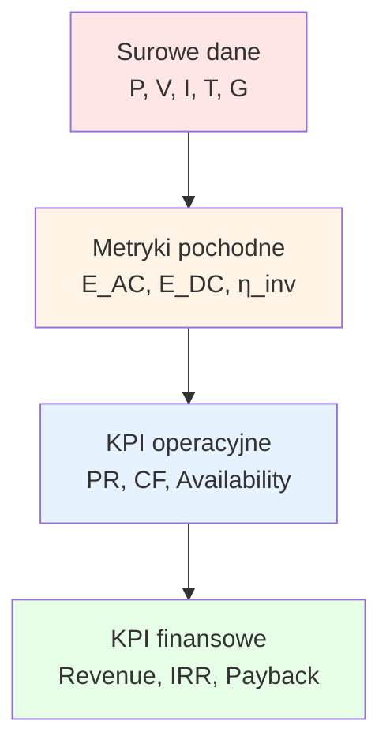

import { LearningObjective, KeyConcept, Example } from '@site/src/components/SlideComponents';
import InteractiveQuiz from '@site/src/components/InteractiveQuiz';

# KPI: Kluczowe wskaźniki wydajności w OZE

<LearningObjective>
Po tej sekcji student potrafi obliczyć i interpretować główne KPI dla różnych technologii OZE: PR dla PV, CF dla wiatru, SoC/SoH dla BESS, OEE dla biogazu oraz Availability dla wszystkich typów instalacji. Student rozumie, jakie wartości są typowe i jak KPI wskazują na problemy operacyjne.
</LearningObjective>

## Wprowadzenie: Dlaczego KPI są kluczowe?

**KPI (Key Performance Indicators)** to **kwantyfikowalne metryki**, które transformują surowe dane z monitoringu w **informacje biznesowe** o stanie i efektywności instalacji OZE. Bez KPI, dane są tylko liczbami—z KPI, stają się **narzędziem decyzyjnym**.

### Rola KPI w zarządzaniu instalacjami OZE

1. **Benchmarking**: Porównanie wydajności między instalacjami (która farma PV działa lepiej?)
2. **Trend analysis**: Wykrywanie degradacji w czasie (czy PR spada systematycznie?)
3. **Compliance**: Weryfikacja zgodności z umowami (czy Availability > 99% jak w SLA?)
4. **Financial reporting**: Podstawa rozliczeń (produkcja energii, dostępność dla PPA)
5. **Maintenance planning**: Priorytetyzacja interwencji (które turbiny wymagają uwagi?)

<KeyConcept title="KPI vs. Metryki surowe">
**Metryka surowa**: Moc invertera = 245 kW (w danej chwili)  
**KPI**: PR = 87% (za tydzień) → **kontekst**: Przy irradiancji i temperaturze, instalacja produkuje 87% teoretycznej energii. To dobry wynik, ale 2 pp niższy niż miesiąc temu → wymaga analizy przyczyn.

**KPI ≠ surowe dane**. KPI to **agregaty, normalizacje i kontekstualizacje** surowych pomiarów.
</KeyConcept>

### Hierarchia KPI w OZE

**Level 1**: Surowe dane (moc, napięcia, irradiancja)  
**Level 2**: Metryki pochodne (energia, sprawność)  
**Level 3**: KPI operacyjne (PR, CF, Availability)—**to jest przedmiot tego wykładu**  
**Level 4**: KPI finansowe (przychody, ROI)—wykraczają poza monitoring, ale bazują na Level 3

📝 Notatki prowadzącego

**Czas**: 8 minut

**Przebieg**:
1. Wprowadzenie do KPI—dlaczego są ważne (3 min)
2. Diagram hierarchii KPI (2 min)
3. Przykład: "Moc 245 kW vs. PR 87%"—różnica między raw metric a KPI (2 min)
4. Pytanie do sali: "Jakie KPI znają z innych branż?" (1 min—przykłady: OEE w produkcji, NPS w usługach)

**Punkty kluczowe**:
- **KPI to język biznesu**: Inżynierowie mówią "moc, napięcie", menedżerowie mówią "PR, Availability, Revenue"
- **Kontekstualizacja**: KPI są bezużyteczne bez kontekstu (PR 87%—czy to dobrze? Zależy od czego porównujemy)
- **Hierarchia**: Zrozumienie, że KPI bazują na surowych danych (garbage in, garbage out)

**Pytania studenckie**:
- Q: Czy możemy mieć zbyt wiele KPI?
- A: Tak! "KPI overload" = 50+ metryk → nikt nie wie, co jest ważne. **Zasada 5–7 KPI**: Wybierz kilka najważniejszych dla danego stakeholdera (operator: PR, Availability; inwestor: Revenue, IRR; serwis: MTBF, MTTR).

---

## PV — Performance Ratio (PR)

**Performance Ratio** to **najważniejszy KPI dla fotowoltaiki**, ponieważ normalizuje produkcję energii względem rzeczywistych warunków atmosferycznych. PR odpowiada na pytanie: **"Jak dobrze instalacja konwertuje dostępne światło słoneczne w energię elektryczną?"**

### Definicja i formuła

$$
PR = \frac{E_{\text{AC,rzecz}}}{E_{\text{teor}}} = \frac{E_{\text{AC,rzecz}}}{G_{\text{POA}} \times A \times \eta_{\text{STC}} \times (1 + \gamma \cdot \Delta T)}
$$

Gdzie:
- $E_{\text{AC,rzecz}}$ — rzeczywista energia AC na wyjściu inverterów [kWh]
- $G_{\text{POA}}$ — całkowita irradiancja w płaszczyźnie modułów (Plane of Array) [kWh/m²]
- $A$ — powierzchnia modułów [m²]
- $\eta_{\text{STC}}$ — sprawność modułów w warunkach STC (Standard Test Conditions: 1000 W/m², 25°C, AM1.5)
- $\gamma$ — współczynnik temperaturowy mocy [%/°C] (typowo -0.4% do -0.5%/°C dla Si)
- $\Delta T = T_{\text{moduł}} - 25°C$ — różnica temperatury modułów względem STC

**Uproszczona formuła** (gdy $E_{\text{teor}}$ jest obliczane przez SCADA):

$$
PR = \frac{E_{\text{AC,rzecz}}}{E_{\text{teor}}}
$$

### Komponenty strat uwzględniane w PR

PR < 100% z powodu **strat systemowych**:

| Składowa | Typowe straty | Przyczyny |
|----------|---------------|-----------|
| **Optyczne** | 2–5% | Odbicia od szkła, soiling (zabrudzenie), shading |
| **Temperaturowe** | 5–15% | Moduły pracują w 40–70°C (nie 25°C STC) → mniejsza moc |
| **Mismatch** | 1–3% | Różnice między modułami (tolerancje produkcyjne, degradacja nierównomierna) |
| **Konwersja DC→AC** | 2–5% | Straty w inverterze (sprawność 95–98%) |
| **Okablowanie** | 1–3% | Rezystancja kabli DC i AC |
| **Dostępność** | 0–5% | Przestoje (awarie, konserwacja) |
| **Degradacja** | 0.5–1%/rok | Długoterminowa degradacja modułów (LID, PID) |

**Razem**: Typowy PR nowej instalacji = **75–90%** (zależnie od jakości komponentów, projektowania, warunków środowiskowych).

### Typowe wartości PR

| Typ instalacji | Oczekiwany PR | Uwagi |
|----------------|---------------|-------|
| **Utility-scale, nowa** | 85–90% | Profesjonalny projekt, optymalizatory/microinvertery, tracking |
| **Utility-scale, standard** | 78–85% | String invertery, fixed tilt |
| **Commercial rooftop** | 75–82% | Częste shading (budynki), soiling |
| **Residential rooftop** | 70–80% | Suboptymalne kąty, shading, starsze komponenty |
| **Instalacja zdegradowana** | < 75% | Wymaga diagnozy (soiling, mismatch, awarie stringów) |

:::tip Kluczowa zasada
PR **nie zależy od ilości słońca** (irradiancji). Farma w Niemczech (1000 kWh/m²/rok) może mieć PR 88%, farma w Hiszpanii (1800 kWh/m²/rok) też 88%. **PR mierzy efektywność konwersji, nie dostępność zasobu.**
:::

### Analiza PR: Okna czasowe i segmentacja

**1. Okna czasowe (time windows)**

| Okno | Zastosowanie | Zalety | Wady |
|------|--------------|--------|------|
| **Chwilowe (1-min)** | Debugging, analiza szczegółowa | Wysoka rozdzielczość | Głośne (duża wariancja) |
| **Godzinowe** | Operacyjne dashboardy | Balans rozdzielczość/stabilność | Wciąż zmienne |
| **Dzienne** | Raporty operacyjne | Stabilne, reprezentatywne | Ukrywa problemy krótkoterminowe |
| **Tygodniowe/miesięczne** | Raporty dla managementu | Trend long-term | Opóźnienie w detekcji problemów |

**Best practice**: Monitoruj PR w **kilku oknach równocześnie**—1-h dla alertów, 24-h dla raportów dziennych, 30-day moving average dla trendów.

**2. Segmentacja (ang. binning)**

Analiza PR **w funkcji warunków** ujawnia problemy ukryte w średnich globalnych:

- **Segmentacja po irradiancji**: PR przy G < 200 W/m² (niska irradiancja, rano/wieczorem) vs. G > 800 W/m² (pełne słońce)
  - **Problem**: Jeśli PR niski tylko przy wysokiej irradiancji → inverter clipping (undersized inverter)
  
- **Segmentacja po temperaturze**: PR przy T_moduł < 30°C vs. > 50°C
  - **Problem**: Jeśli PR spada nadmiernie przy wysokiej temperaturze → problem z wentylacją/chłodzeniem

- **Segmentacja po porze dnia**: PR rano (6–9h) vs. południe (11–14h) vs. wieczór (16–19h)
  - **Problem**: Jeśli PR niski tylko rano → shading od wschodniej strony

<Example title="Kalkulacja PR: Farma PV 1 MW, dzień typowy">
**Dane instalacji**:
- Moc nominalna modułów (STC): P_STC = 1060 kWp (1.06 MW)
- Powierzchnia modułów: A = 6000 m²
- Sprawność modułów STC: η_STC = 17.7%
- Współczynnik temperaturowy: γ = -0.42%/°C

**Dane dnia (2025-06-15, słonecznie)**:
- Irradiancja POA: G_POA = 6.2 kWh/m² (suma całodzienna)
- Średnia temperatura modułów: T_avg = 48°C (ΔT = +23°C względem STC)
- Energia AC zmierzona: E_AC = 5850 kWh

**Obliczenia**:

1. **Energia teoretyczna (bez kompensacji temperatury)**:
   $$
   E_{\text{teor,STC}} = G_{\text{POA}} \times P_{\text{STC}} = 6.2 \times 1060 = 6572 \text{ kWh}
   $$

2. **Korekta temperaturowa**:
   $$
   \text{Loss}_{\text{temp}} = \gamma \times \Delta T = -0.42\% \times 23 = -9.66\%
   $$
   $$
   E_{\text{teor,corr}} = E_{\text{teor,STC}} \times (1 - 0.0966) = 6572 \times 0.9034 = 5938 \text{ kWh}
   $$

3. **Performance Ratio**:
   $$
   PR = \frac{E_{\text{AC,rzecz}}}{E_{\text{teor,corr}}} = \frac{5850}{5938} = 0.985 = \mathbf{98.5\%}
   $$

**Interpretacja**: PR = 98.5% to **wyjątkowo wysoki** wynik (> 95% = excellent). Oznacza, że:
- Moduły są czyste (brak soiling)
- Invertery działają optymalnie (brak clipping, wysoka sprawność)
- Brak shading, minimalne mismatch losses
- System świeży (brak degradacji)

**Typowy PR** dla tej farmy w dłuższym okresie (30 dni) byłby ~85–88% (więcej soiling, zmienne warunki, okresowe chmury).
</Example>

### Praktyczne wskazówki dla monitoringu PR

1. **Pyranometr referencyjny jest obowiązkowy**
   - Bez pomiaru irradiancji POA, nie możesz obliczyć PR
   - Klasa A (ISO 9060), kalibracja co 1–2 lata
   - Montaż: W płaszczyźnie modułów (ten sam kąt i azymut)

2. **Kompensacja temperaturowa**
   - Używaj czujnika temperatury back-of-module (termopara przyklejona do tylnej strony modułu)
   - Dla monitoringu operacyjnego (10-min intervals), kompensacja temperaturowa może być pominięta (upraszcza obliczenia)
   - Dla raportów compliance (monthly/yearly), kompensacja obowiązkowa

3. **Alarmy oparte na PR**
   - PR < 0.75 przez > 2 h (przy G > 400 W/m²) → Alarm P2 "Low PR—investigate"
   - PR spada > 5 pp w ciągu tygodnia → Alarm P3 "PR trend declining"
   - Nie alarmuj przy niskiej irradiancji (G < 200 W/m²)—PR jest głośny (noisy) przy słabym świetle

4. **Porównanie międzyobiektowe**
   - Dla portfolio farm, porównuj PR między obiektami (normalizuje różnice w irradiancji)
   - Identyfikuj outliers: Dlaczego farma A ma PR 82%, a B (podobna lokalizacja) 88%?

📝 Notatki prowadzącego

**Czas**: 18 minut

**Przebieg**:
1. Definicja i formuła PR (4 min)—wypisz na tablicy, omów każdy składnik
2. Tabela strat systemowych (3 min)
3. Typowe wartości PR (2 min)
4. Analiza okien czasowych i segmentacja (4 min)
5. Przykład kalkulacji (4 min)—wykonaj razem ze studentami (kalkulator/Excel)
6. Praktyczne wskazówki (1 min)

**Punkty kluczowe**:
- **PR to THE metric dla PV**: Jeśli musisz wybrać jeden wskaźnik, to PR
- **Temperatura ma ogromny wpływ**: ΔT = 23°C → 9.66% straty (prawie 10%!). Dlatego moduły bifacial + tracking mogą mieć wyższy PR (lepsza wentylacja)
- **PR > 95% = exceptional**: W praktyce, rzadko widziane (wymaga perfekcyjnych warunków i nowej instalacji)

**Pytania studenckie**:
- Q: Czy PR może być > 100%?
- A: Teoretycznie tak (przy niskiej temp modułów i wysokiej irradiancji odbitej od śniegu). W praktyce: jeśli widzisz PR > 105%, podejrzewaj błąd pomiaru (pyranometr under-reporting G_POA lub błąd kalibracji).

- Q: Jak często powinniśmy obliczać PR?
- A: **Continuously** w SCADA (co 1–10 min dla live dashboardów). Agreguj do 1-h, 24-h, 30-day dla raportów. Im dłuższe okno, tym stabilniejszy PR (mniej noise).

- Q: Co z PR w zimie vs. lato?
- A: PR jest zazwyczaj **wyższy zimą** (niższe temperatury modułów → mniejsze straty termiczne). Różnica: 5–10 pp między latem a zimą (np. 85% latem, 90% zimą).

---

## Wiatr — Capacity Factor (CF)

**Capacity Factor** to główny KPI dla energetyki wiatrowej, mierzący **wykorzystanie mocy nominalnej turbiny** w danym okresie. W przeciwieństwie do PR (który normalizuje po warunkach), CF **bezpośrednio zależy od dostępności zasobu wiatru**.

### Definicja i formuła

$$
CF = \frac{E_{\text{rzecz}}}{P_{\text{nom}} \times t} \times 100\%
$$

Gdzie:
- $ E_{\text{rzecz}} $ — rzeczywista energia wyprodukowana [kWh lub MWh]
- $ P_{\text{nom}} $ — moc nominalna turbiny [kW lub MW]
- $ t $ — czas [h]

**Przykład**: Turbina 3 MW produkuje 6570 MWh w ciągu roku (8760 h):

$$
CF = \frac{6570}{3 \times 8760} \times 100\% = \frac{6570}{26280} \times 100\% = 25\%
$$

### Typowe wartości CF

| Lokalizacja | Typ | Typowy CF | Uwagi |
|-------------|-----|-----------|-------|
| **Onshore, Europa Środkowa** | Klasa wiatru II–III | 20–30% | Typowe dla Polski, Niemiec (równiny, średnie wiatry) |
| **Onshore, wybrzeże** | Klasa wiatru I–II | 30–40% | Północne wybrzeża (Dania, Holandia, UK) |
| **Offshore, Morze Północne** | Klasa wiatru I | 40–50% | Wysokie i regularne wiatry, większe turbiny (> 8 MW) |
| **Onshore, góry** | Klasa wiatru I–II | 25–35% | Wysokość wieży kompensuje turbulencje |
| **Onshore, weak wind sites** | Klasa wiatru III–IV | 15–25% | Nieoptymalne lokalizacje (lasy, niska wysokość wieży) |

**Obserwacja**: CF jest **silnie zależny od lokalizacji** (w przeciwieństwie do PR w PV, który jest bardziej uniwersalny). Dlatego **pre-construction wind assessment** jest krytyczny.

### CF vs. Klasa wiatru (IEC 61400-1)

IEC 61400-1 definiuje klasy turbin według **średniej prędkości wiatru** (V_avg na wysokości piasty) i **turbulencji**:

| Klasa | V_avg [m/s] | CF oczekiwany (orientacyjnie) | Zastosowanie |
|-------|-------------|-------------------------------|--------------|
| **I** | 10 | 40–50% | Offshore, wybrzeża, najlepsze onshore |
| **II** | 8.5 | 30–40% | Dobre onshore (równiny, wybrzeża) |
| **III** | 7.5 | 20–30% | Średnie onshore (Europa Środkowa) |
| **IV** | 6 | 15–25% | Słabe wiatry (South Europe, lasy) |

**Nota**: Klasa turbiny ≠ klasa wiatru na miejscu. Turbina klasy III może działać w lokalizacji klasy I (będzie **underutilized**, ale bezpieczna). Turbina klasy I w lokalizacji klasy III będzie **over-designed** (większy rotor = wyższy CF, ale droższy CapEx).

### Analiza CF: Co wpływa na wartość?

**1. Prędkość wiatru** (dominujący czynnik)

Moc wiatru: $ P \propto v^3 $ (zależność kubiczna!). Przykład:
- Wiatr 6 m/s → P = k × 6³ = 216k
- Wiatr 8 m/s → P = k × 8³ = 512k (**2.4× więcej mocy** przy 33% wyższej prędkości!)

**2. Rozkład wiatrów (wind distribution)**

CF zależy nie tylko od **średniej prędkości**, ale od **rozkładu** (Weibull distribution):
- Lokalizacja A: V_avg = 7 m/s, wiatry stałe (Weibull k = 2.5) → CF 30%
- Lokalizacja B: V_avg = 7 m/s, wiatry zmienne (k = 1.5) → CF 25% (więcej okresów bezwietrznych i bardzo silnych wiatrów—oba niewykorzystywane)

**3. Curve mocy turbiny (power curve)**

Każda turbina ma krzywą mocy: P(v). Klucz: **cut-in** (start), **rated** (moc nominalna), **cut-out** (zatrzymanie):
- Cut-in: Typowo 3–4 m/s (turbina zaczyna produkować)
- Rated: Typowo 10–13 m/s (osiąga moc nominalną)
- Cut-out: Typowo 25 m/s (zatrzymanie dla bezpieczeństwa)

Turbiny nowoczesne (> 2020) mają **niższy cut-in** i **wyższy rotor/generator ratio** → wyższy CF w słabych wiatrach.

**4. Dostępność (Availability)**

CF uwzględnia **przestoje** (planowane i nieplanowane). Jeśli turbina stoi przez 5% czasu → CF spada o ~5% (relatywnie):
- CF teoretyczny (100% availability): 30%
- CF rzeczywisty (95% availability): 30% × 0.95 = 28.5%

<Example title="Porównanie CF: Dwie farmy wiatrowe">
**Farma A** (onshore, Polska centralna):
- 10 turbin × 3 MW = 30 MW
- Średnia prędkość wiatru (hub height 100 m): V_avg = 6.8 m/s
- Produkcja roczna: 63 000 MWh
- Availability: 97%

**Farma B** (offshore, Morze Bałtyckie):
- 20 turbin × 8 MW = 160 MW
- Średnia prędkość wiatru (hub height 120 m): V_avg = 9.2 m/s
- Produkcja roczna: 630 000 MWh
- Availability: 94% (trudniejszy dostęp dla maintenance)

**Kalkulacja CF**:

**Farma A**:
$$
CF_A = \frac{63000}{30 \times 8760} \times 100\% = \frac{63000}{262800} = 24\%
$$

**Farma B**:
$$
CF_B = \frac{630000}{160 \times 8760} \times 100\% = \frac{630000}{1401600} = 45\%
$$

**Wnioski**:
- Farma B ma **prawie 2× wyższy CF** (45% vs. 24%)
- Przyczyny: (1) Wyższa prędkość wiatru (+35%), (2) Większe turbiny (lepsze power curves), (3) Offshore (mniej turbulencji)
- **Ale**: CapEx offshore jest 2–3× wyższy niż onshore → LCOE (Levelized Cost of Energy) może być podobny
</Example>

### Praktyczne wskazówki dla monitoringu CF

1. **Porównanie między turbinami w farmie**
   - Turbiny w tej samej farmie powinny mieć **podobny CF** (±5%)
   - Jeśli turbina #5 ma CF o 15% niższy niż średnia → diagnoza (wake effect, yaw misalignment, gearbox problem)

2. **Róża wiatrów (wind rose) i wake losses**
   - Analiza rozkładu kierunków wiatru
   - Turbiny w wake (w cieniu innych turbin) mają niższy CF (o 5–15%)
   - Optymalizacja: Wake steering (yaw control) może odzyskać 2–5% produkcji

3. **Sezonowość**
   - Wiatr jest **silniejszy zimą** (w Europie) → CF zimowy może być 2× wyższy niż letni
   - Przykład: CF grudzień = 40%, CF lipiec = 20% (Europa Środkowa)

4. **CF vs. Availability**
   - CF niska może oznaczać: (1) Słabe wiatry (OK, oczekiwane) lub (2) Niska dostępność (Problem!)
   - Rozdziel: $CF_{\text{wind}} = CF \times \frac{1}{Availability}$ → CF skorygowany o przestoje

<InteractiveQuiz
  question="Farma wiatrowa 30 MW (10 × 3 MW) produkowała 65 700 MWh w ciągu roku. Jaki jest Capacity Factor?"
  options={[
    "25%",
    "30%",
    "35%",
    "40%"
  ]}
  correctAnswer={0}
  explanation="CF = E / (P_nom × t) = 65700 / (30 × 8760) = 65700 / 262800 = 0.25 = 25%. To typowy CF dla onshore w Europie Środkowej (klasa wiatru II–III)."
/>

📝 Notatki prowadzącego

**Czas**: 16 minut

**Przebieg**:
1. Definicja i formuła CF (2 min)
2. Typowe wartości i klasy wiatru (4 min)
3. Analiza czynników wpływających na CF (5 min)—kluczowa część
4. Przykład porównania farm A/B (3 min)
5. Quiz (2 min)

**Punkty kluczowe**:
- **CF ≠ PR**: CF zależy od zasobu (wiatru), PR (w PV) normalizuje po zasobie
- **Zależność kubiczna P ∝ v³**: Podkreśl kilkakrotnie—to najważniejsza relacja w energetyce wiatrowej
- **Offshore > onshore**: CF offshore może być 2× wyższy, ale CapEx też 2–3× wyższy

**Pytania studenckie**:
- Q: Dlaczego nie budujemy wszystkich farm offshore (skoro CF wyższy)?
- A: **Koszt**. Offshore CapEx: €3–4M/MW. Onshore: €1–1.5M/MW. Mimo wyższego CF, LCOE offshore jest wciąż wyższy (choć gap się zmniejsza—technologia dojrzewa). Plus: Offshore wymaga specjalistycznych statków (installation vessels), długie leady times, trudniejszy maintenance.

- Q: Co z CF dla małych turbin (< 100 kW, distributed wind)?
- A: Zazwyczaj **niższy** (15–25%), ponieważ: (1) Niższe wieże (< 30 m) → słabszy wiatr, (2) Lokalizacje sub-optimalne (dach budynku, ogród), (3) Prostsze technologie (starsze power curves). Ale: Distributed wind ma sens dla **off-grid** lub **energy independence**, nie dla maksymalnego CF.

---

## BESS — SoC i SoH

Magazyny energii (BESS) mają **dwa kluczowe KPI**:  
- **SoC (State of Charge)**: Aktualna energia przechowywana  
- **SoH (State of Health)**: Długoterminowa degradacja pojemności

Te wskaźniki są fundamentalne dla **operational control** (sterowanie ładowaniem/rozładowaniem) i **financial planning** (kiedy wymienić baterie).

### State of Charge (SoC)

**Definicja**: Procent dostępnej energii względem pojemności nominalnej.

$$
SoC(t) = \frac{Q_{\text{available}}(t)}{Q_{\text{nom}}} \times 100\%
$$

Gdzie:
- $Q_{\text{available}}(t)$ — dostępna pojemność w chwili t [Ah lub kWh]
- $Q_{\text{nom}}$ — pojemność nominalna (nowa bateria, spec sheet) [Ah lub kWh]

**Zakres**: 0% (całkowicie rozładowany) do 100% (całkowicie naładowany).

**Praktyka**: BESS rzadko używa pełnego zakresu 0–100%. Typowo:
- **Operational range**: 20–90% (chroni przed deep discharge i overcharge)
- **SOC target**: 50–60% (optimal for longevity i flexibility)

#### Metody estymacji SoC

**1. Coulomb Counting (bilans ładunku)**

Najprostsza metoda: Całkowanie prądu w czasie.

$$
SoC(t) = SoC(t_0) + \frac{1}{Q_{\text{nom}}} \int_{t_0}^{t} I(\tau) \, d\tau
$$

- $I > 0$: Ładowanie (SoC rośnie)
- $I < 0$: Rozładowanie (SoC maleje)

**Problem**: **Drift over time**. Błędy pomiaru prądu (±0.5%) kumulują się → po tygodniu, SoC może być off by ±5%. Wymaga okresowej **rekalibracji** (full charge/discharge cycle).

**2. Voltage-based (OCV method)**

SoC można estymować z **napięcia cel** (Open Circuit Voltage—OCV). Każda chemia ma charakterystyczną krzywą OCV vs. SoC.

**Problem**: OCV wymaga **braku obciążenia** (no current flow) przez kilka minut. W praktyce, BESS prawie zawsze jest pod obciążeniem → trzeba korygować o spadek napięcia na rezystancji wewnętrznej.

**3. Model-based (Kalman Filter, Extended Kalman Filter)**

Najbardziej zaawansowana metoda: **Fuzja** Coulomb counting + voltage-based + model elektrochemiczny.

- **EKF (Extended Kalman Filter)**: Algorytm rekursywny, który koryguje estymację SoC na podstawie odchyleń między przewidywanym a zmierzonym napięciem
- **Accuracy**: ±1–2% SoC (vs. ±5–10% dla prostego Coulomb counting)
- **Koszt**: Wymaga zaawansowanego BMS z CPU (typowe w high-end BESS—Tesla, Fluence)

<KeyConcept title="SoC vs. DoD (Depth of Discharge)">
**SoC** = procent naładowania (100% = pełny, 0% = pusty)  
**DoD** = procent rozładowania (0% = pełny, 100% = pusty)

Relacja: $ DoD = 100\% - SoC $

Przykład: SoC = 30% → DoD = 70% (bateria rozładowana o 70% od pełnego stanu).

**Dlaczego DoD jest używany?** W kontekście **cycle life**: Baterie mają określoną żywotność w funkcji DoD (np. "5000 cykli przy 80% DoD"). Głębsze rozładowanie (wyższy DoD) = krótsza żywotność.
</KeyConcept>

### State of Health (SoH)

**Definicja**: Procent aktualnej pojemności względem pojemności nominalnej (nowej baterii).

$$
SoH = \frac{C_{\text{actual}}}{C_{\text{rated}}} \times 100\%
$$

Gdzie:
- $ C_{\text{actual}} $ — aktualna pojemność (zmierzona przez full charge/discharge cycle) [kWh]
- $ C_{\text{rated}} $ — pojemność nominalna (z datasheet, nowa bateria) [kWh]

**Zakres**: 100% (nowa bateria) do ~80% (End of Life w większości aplikacji).

**Praktyka**: **SoH < 80%** jest uznawane za **End of Life (EoL)** dla większości aplikacji grid-scale BESS, ponieważ:
- Zmniejszona pojemność (mniej kWh do składowania)
- Zwiększona rezystancja wewnętrzna (większe straty ciepła, niższa sprawność)
- Większe ryzyko thermal runaway i awarii

**Ale**: Baterie z SoH 70–80% mogą być **second-life** applications (np. energy storage w domach, mniej krytyczne zastosowania).

#### Mechanizmy degradacji SoH

**1. Calendar aging (starzenie kalendarzowe)**

Degradacja w czasie, **niezależnie od użycia** (nawet jeśli bateria leży na półce).

- **Przyczyna**: SEI (Solid Electrolyte Interface) growth, electrolyte degradation
- **Tempo**: 2–5% per year (zależnie od temperatury i SoC storage)
- **Mitygacja**: Przechowywanie przy SoC 40–60% i temp 15–25°C (minimalizuje aging)

**2. Cycle aging (starzenie cykliczne)**

Degradacja związana z **liczbą cykli ładowania/rozładowania**.

- **Przyczyna**: Mechaniczne naprężenia (expansion/contraction), utrata Li+ do SEI
- **Tempo**: Zależy od DoD i C-rate:
  - **DoD 100%**: 1000–3000 cykli do 80% SoH (NMC), 3000–5000 (LFP)
  - **DoD 80%**: 2000–5000 cykli (NMC), 5000–8000 (LFP)
  - **DoD 50%**: 5000–10000 cykli (NMC), 8000–15000 (LFP)
  
**Wniosek**: **Shallow cycles** (niski DoD) = dłuższa żywotność.

**3. Temperatura**

Wysoka temperatura **przyspiesza degradację** (obie: calendar i cycle):
- **25°C**: Baseline
- **35°C**: Degradacja 2× szybsza
- **45°C**: Degradacja 4× szybsza

**Mitygacja**: Aktywne chłodzenie (liquid cooling) w BESS (utrzymanie temp < 30°C).

#### Tracking SoH w praktyce

**1. Periodic capacity tests**

Pełny cykl ładowania/rozładowania (100% → 0% → 100%) co 1–3 miesiące:
- Zmierz rzeczywistą pojemność (kWh delivered)
- Porównaj z pojemnością nominalną → oblicz SoH

**Problem**: Wymaga **przestoju** (BESS offline na kilka godzin). Dla grid-scale (revenue-earning assets), to kosztowne.

**2. Continuous estimation (BMS algorithms)**

Nowoczesne BMS estymują SoH **w tle**, bez dedykowanych testów:
- Track cumulative cycles, DoD, temperature exposure
- Model degradacji (empiryczny lub physics-based)
- Update SoH estimate co tydzień/miesiąc

**Accuracy**: ±3–5% SoH (wystarczające dla operacyjnych decyzji).

<Example title="Degradacja SoH: BESS 1 MWh, 5 lat eksploatacji">
**System**:
- Chemistry: LFP (LiFePO₄)—dobry wybór dla long-life aplikacji
- Pojemność nominalna: 1000 kWh (nowy, 2020)
- Operational range: SoC 20–90% (DoD 70%)
- Cykle/rok: ~250 (daily cycling, ~70% utilization)
- Średnia temperatura: 28°C (HVAC cooling)

**Degradacja po 5 latach**:

**Calendar aging**:
- Tempo: ~3%/rok (przy 28°C, SoC average ~55%)
- Total: 15% loss

**Cycle aging**:
- Total cycles: 250 × 5 = 1250 cykli
- DoD average: 70%
- Expected cycles to 80% SoH (LFP, DoD 70%): ~6000 cykli
- Degradacja after 1250 cycles: ~(1250 / 6000) × 20% ≈ 4% loss

**Combined degradation** (non-linear, ale przybliżenie):
$$
SoH \approx 100\% - 15\% - 4\% = 81\%
$$

**Zmierzone SoH** (capacity test, rok 5): **82%** (zgodne z prognozą!)

**Wniosek**:
- SoH = 82% → **Wciąż operational** (threshold 80%)
- Prognoza EoL: Za ~2 lata (rok 7), SoH spadnie < 80%
- **Planowanie wymiany**: Budżet na rok 7 (2027): €150k (wymiana modułów battery)

</Example>

### Praktyczne wskazówki dla monitoringu SoC/SoH

1. **SoC: Monitor w czasie rzeczywistym**
   - Dashboard operacyjny: Aktualne SoC, target SoC, prognoza na kolejne 24 h
   - Alarmy: SoC < 25% (ryzyko deep discharge), SoC > 95% (ryzyko overcharge)

2. **SoH: Track trendy long-term**
   - Raport miesięczny: SoH trend (wykres 12 miesięcy)
   - Prognoza EoL: Ekstrapolacja trendu → "Estimated EoL: Q3 2027"
   - Financial planning: Rezerwa na wymianę baterii (w budżecie CapEx)

3. **Cell imbalance = early warning**
   - Monitor ΔV_cell_max (max voltage difference między celami)
   - ΔV > 50 mV → aktywne balansowanie (BMS)
   - ΔV > 100 mV → podejrzenie degradacji pojedynczych cel → inspection required

4. **Temperature management = key to longevity**
   - Utrzymuj temp < 30°C (aktywne chłodzenie)
   - Monitor hot spots (ΔT_cell > 5°C → problem z chłodzeniem lub z celą)

📝 Notatki prowadzącego

**Czas**: 16 minut

**Przebieg**:
1. SoC—definicja, metody estymacji (6 min)
2. SoH—definicja, mechanizmy degradacji (6 min)
3. Przykład degradacji BESS 1 MWh (3 min)
4. Praktyczne wskazówki (1 min)

**Punkty kluczowe**:
- **SoC = operational metric**: Używane real-time do sterowania
- **SoH = financial metric**: Używane do planowania CapEx (wymiana baterii)
- **LFP vs. NMC**: LFP ma dłuższą żywotność (ale niższą gęstość energii). Dla grid-scale, LFP dominuje (od ~2020).

**Pytania studenckie**:
- Q: Dlaczego nie używamy pełnego zakresu 0–100% SoC?
- A: **Longevity**. Deep discharge (SoC < 20%) i overcharge (SoC > 95%) przyspieszają degradację. Operacyjny zakres 20–90% daje 2–3× więcej cykli (vs. 0–100%).

- Q: Co się dzieje z bateriami po EoL (SoH < 80%)?
- A: **Second-life**: Sprzedaż do aplikacji mniej wymagających (residential storage, backup power). Po second-life: **Recycling** (odzysk Li, Co, Ni). Rynek second-life batteries rośnie (Nissan Leaf, Tesla, BMW—programy second-life).

---

## Biogaz — OEE i kluczowe wskaźniki procesu

Biogazownie są **najbardziej złożonymi systemami w OZE** (proces biologiczny + chemiczny + termiczny + elektryczny). KPI muszą odzwierciedlać tę złożoność. **OEE (Overall Equipment Effectiveness)** z lean manufacturing został zaadaptowany do biogazu.

### Overall Equipment Effectiveness (OEE)

**Definicja**: Iloczyn trzech składowych—dostępności, wydajności i jakości.

$$
OEE = A \times P \times Q
$$

Gdzie:
- $ A $ — **Availability** (dostępność czasowa): $ \frac{t_{\text{run}}}{t_{\text{planned}}} $
- $ P $ — **Performance** (wydajność): $ \frac{\text{actual throughput}}{\text{design throughput}} $
- $ Q $ — **Quality** (jakość produktu): $ \frac{\text{good output}}{\text{total output}} $

#### Adaptacja OEE do biogazowni

**A — Availability**: Procent czasu, gdy fermentory i CHP są w ruchu (vs. planowany czas pracy).

$$
A = \frac{t_{\text{fermentor running}} + t_{\text{CHP running}}}{t_{\text{planned}}}
$$

Typowo: $ A > 95\% $ (biogazownie działają 24/7, przestoje tylko na planowane maintenance).

**P — Performance**: Rzeczywista produkcja biogazu vs. projektowa.

$$
P = \frac{Q_{\text{biogas,actual}}}{Q_{\text{biogas,design}}}
$$

Gdzie:
- $ Q_{\text{biogas,actual}} $ — rzeczywisty przepływ biogazu [m³/h]
- $ Q_{\text{biogas,design}} $ — projektowy przepływ (z feasibility study) [m³/h]

Typowo: $ P = 0.85–1.0 $ (85–100% projektowanej produkcji). Jeśli $ P < 0.85 $ → problem (niedokarmienie, niewłaściwa temp, problem z mikroflorą).

**Q — Quality**: Procent biogazu o wymaganej jakości (CH₄ content, H₂S < threshold).

$$
Q = \frac{V_{\text{biogas, CH₄ > 50\%, H₂S < 500 ppm}}}{V_{\text{biogas, total}}}
$$

Typowo: $ Q > 0.98 $ (98% biogazu spełnia spec). Jeśli $ Q < 0.95 $ → problem z jakością (wymaga scrubbing, desulfurization).

**Przykład OEE**:
- $ A = 0.96 $ (96% availability—4% planned maintenance)
- $ P = 0.90 $ (90% design throughput—suboptimal feeding)
- $ Q = 0.98 $ (98% good quality biogas)

$$
OEE = 0.96 \times 0.90 \times 0.98 = 0.847 = \mathbf{84.7\%}
$$

**Interpretacja**: OEE 84.7% to **dobry wynik** dla biogazowni. World-class biogas plants osiągają OEE > 90%.

### Kluczowe wskaźniki procesu (Process KPIs)

Poza OEE, biogazownie monitorują **wskaźniki procesowe** specyficzne dla fermentacji i CHP:

#### 1. Stężenie CH₄ (Methane Content)

**Target**: 50–65% CH₄ w biogazie (reszta to głównie CO₂, ~35–50%).

**Wyższy CH₄ = lepsza wartość energetyczna**:
- 50% CH₄: ~5 kWh/m³ biogas
- 60% CH₄: ~6 kWh/m³ biogas

**Monitorowanie**: Continuous (inline gas analyzer—NDIR Non-Dispersive InfraRed).

**Problemy**:
- CH₄ < 50%: Niedostateczna fermentacja metanogeniczna (problem z mikroflorą, pH, temperatura, inhibitory)
- CH₄ > 65%: Rzadkie (optymalne warunki), ale może oznaczać problem z usuwaniem CO₂ (jeśli biogas upgrading jest używany)

#### 2. Stężenie H₂S (Hydrogen Sulfide)

**Target**: < 500 ppm przed CHP (aby chronić silnik przed korozją).

**Problemy**:
- H₂S > 500 ppm: Korozja cylindrów CHP, katalizatorów exhaust treatment
- H₂S > 1000 ppm: Safety risk (toksyczny)

**Desulfurization methods**:
- **Biologiczna** (dodawanie powietrza do fermentora—bakterie utleniają H₂S)
- **Chemiczna** (dodawanie FeCl₃—żelazo wiąże siarkę)
- **External scrubber** (activated carbon filter)

Koszt desulfurization: €10–50k/rok (dla 1 MW biogazowni).

#### 3. OLR (Organic Loading Rate)

**Definicja**: Ilość substratów organicznych (volatile solids—VS) dodawana do fermentora na jednostkę objętości i czasu.

$$
OLR = \frac{m_{\text{VS}}}{V_{\text{fermentor}} \times t} \quad [\text{kg VS/m³/day}]
$$

**Typowe wartości**:
- **Mesophilic** (35–40°C): OLR = 2–4 kg VS/m³/day
- **Thermophilic** (50–60°C): OLR = 3–5 kg VS/m³/day (wyższa temp = szybsza fermentacja)

**Problemy**:
- **Overloading** (OLR too high): Akumulacja VFA (Volatile Fatty Acids), spadek pH, inhibicja metanogenów → produkcja CH₄ spada
- **Underloading** (OLR too low): Niedostateczne wykorzystanie objętości fermentora → niska produkcja biogazu

#### 4. HRT (Hydraulic Retention Time)

**Definicja**: Średni czas przebywania substratu w fermentorze.

$$
HRT = \frac{V_{\text{fermentor}}}{Q_{\text{feeding}}} \quad [\text{days}]
$$

**Typowe wartości**: HRT = 20–40 dni (mesophilic), 15–25 dni (thermophilic).

**Problemy**:
- HRT too short: Substrate nie ma czasu na pełną fermentację → niska produkcja CH₄
- HRT too long: Zbyt duża objętość fermentora (CapEx) bez dodatkowej korzyści

#### 5. CHP Efficiency (Electrical & Thermal)

**Electrical efficiency**:
$$
\eta_{\text{el}} = \frac{P_{\text{el}}}{Q_{\text{biogas}} \times LHV_{\text{biogas}}}
$$

Typowo: $ \eta_{\text{el}} = 35–42\% $ (silniki CHP—internal combustion engines).

**Thermal efficiency** (waste heat recovery):
$$
\eta_{\text{th}} = \frac{P_{\text{th}}}{Q_{\text{biogas}} \times LHV_{\text{biogas}}}
$$

Typowo: $ \eta_{\text{th}} = 40–50\% $.

**Total efficiency** (combined):
$$
\eta_{\text{total}} = \eta_{\text{el}} + \eta_{\text{th}} = 75–90\%
$$

**Best practice**: Maksymalizuj wykorzystanie ciepła (ogrzewanie fermentorów, suszarnie, sprzedaż do sieci ciepłowniczej).

<Example title="KPI biogazowni 1 MW: Analiza miesięczna">
**Parametry operacyjne** (maj 2025):

**Proces fermentacji**:
- Objętość fermentora: 2500 m³
- Feeding rate: 80 m³/day (slurry—corn silage + manure)
- OLR: 3.2 kg VS/m³/day (optymalne)
- HRT: 2500 / 80 = 31.25 days (OK)
- Temperatura: 38°C (mesophilic)
- pH: 7.1 (stable, optimal range 6.8–7.5)

**Produkcja biogazu**:
- Produkcja: 12 000 m³/day (design: 12 500 m³/day) → P = 12000/12500 = 0.96
- CH₄ content: 58% (good, > 55%)
- H₂S: 320 ppm (OK, < 500 ppm)

**CHP**:
- P_el: 970 kW (design: 1000 kW) → Performance 97%
- P_th: 1100 kW (ciepło wykorzystane: 850 kW dla fermentorów + 200 kW sprzedane do sieci ciepłowniczej)
- Runtime: 720 h/744 h (May, 31 days) → Availability CHP = 96.8%

**OEE**:
- A = 0.968 (96.8% availability)
- P = 0.96 (96% design biogas production)
- Q = 0.99 (99% biogas spełnia spec—CH₄ > 50%, H₂S < 500 ppm)

$$
OEE = 0.968 \times 0.96 \times 0.99 = 0.920 = \mathbf{92.0\%}
$$

**Interpretacja**:
- **OEE 92%** → Excellent! (> 90% = world-class)
- P = 96% (slight underperformance) → Analiza: Czy można zwiększyć OLR? (ale pH stable, więc process OK—może design był zbyt optymistyczny)
- Wszystkie parametry w normie → **Brak immediate actions**

**Financial impact**:
- Energia elektryczna: 970 kW × 720 h = 698 MWh × €80/MWh = **€55 840** (revenue)
- Ciepło sprzedane: 200 kW × 720 h = 144 MWh × €40/MWh = **€5 760**
- **Total revenue**: €61 600/miesiąc

</Example>

📝 Notatki prowadzącego

**Czas**: 14 minut

**Przebieg**:
1. OEE—definicja, adaptacja do biogazu (5 min)
2. Kluczowe wskaźniki procesu (CH₄, H₂S, OLR, HRT, CHP efficiency)—6 min
3. Przykład KPI biogazowni 1 MW—3 min

**Punkty kluczowe**:
- **OEE to holistic metric**: Łączy availability (uptime), performance (throughput), quality (product spec)
- **Biogazownie są najbardziej złożone**: Więcej KPI niż PV/wiatr, ponieważ proces jest biologiczny (nieprzewidywalny, wymaga ciągłej optymalizacji)
- **CH₄ content = King**: To najważniejszy wskaźnik jakości biogazu

**Pytania studenckie**:
- Q: Dlaczego OEE w biogazowniach jest niższy niż w produkcji przemysłowej (gdzie OEE > 95% jest możliwy)?
- A: **Zmienność procesu biologicznego**. Mikroorganizmy są wrażliwe na zmian

y (pH, temp, inhibitory). Plus: CHP są silnikami spalinowymi (wymagają maintenance co 8000–15000 h). W produkcji: Maszyny bardziej deterministyczne.

- Q: Co zrobić, gdy OLR jest zbyt wysokie (overloading)?
- A: (1) **Reduce feeding rate** (short-term), (2) **Add buffer capacity** (inoculum z innego fermentora), (3) **Monitor pH i VFA** (jeśli pH < 6.5, dodaj wapno/soda ash), (4) **Long-term**: Zwiększ objętość fermentora lub dodaj second stage digester.

---

## Dostępność (Availability) — uniwersalny KPI dla wszystkich technologii

**Availability** to **procent czasu, w którym instalacja jest zdolna do produkcji energii** (niezależnie od tego, czy w danym momencie jest zasób—słońce, wiatr). To jeden z **najważniejszych KPI dla operatorów i inwestorów**, ponieważ bezpośrednio wpływa na przychody.

### Definicja

$$
Availability = \frac{t_{\text{available}}}{t_{\text{total}}} \times 100\%
$$

Gdzie:
- $ t_{\text{available}} $ = $ t_{\text{run}} + t_{\text{standby}} $ (czas pracy + czas gotowości)
- $ t_{\text{total}} $ = $ t_{\text{available}} + t_{\text{down}} $ (czas total = dostępny + przestoje)

**Uwaga terminologiczna**: Istnieją różne definicje Availability:

| Typ | Formuła | Uwzględnia planned downtime? |
|-----|---------|------------------------------|
| **Operational Availability** | $ \frac{t_{\text{run}}}{t_{\text{total}}} $ | Tak (wlicza wszystkie przestoje) |
| **Technical Availability** | $ \frac{t_{\text{available}}}{t_{\text{total}} - t_{\text{planned}}} $ | Nie (wyłącza planowane maintenance) |
| **Contractual Availability** | Defined in SLA/PPA | Zależy od kontraktu |

**Najczęściej używana**: **Technical Availability** (wyklucza planowane przestoje—bo są przewidywalne i akceptowane).

### Typowe wartości Availability

| Technologia | Oczekiwana Availability | Uwagi |
|-------------|-------------------------|-------|
| **PV** | > 99% | Bardzo wysokie (brak ruchomych części, awarie rzadkie—głównie inwertery) |
| **Wiatr onshore** | 95–98% | Niższe (ruchome części—gearbox, generator, łopatki) |
| **Wiatr offshore** | 92–96% | Jeszcze niższe (trudniejszy dostęp dla maintenance—weather windows) |
| **BESS** | 97–99% | Wysokie (elektryczne/elektroniczne komponenty, ale thermal runaway risk) |
| **Biogaz** | 90–95% | Najniższe (proces biologiczny + CHP—silnik spalinowy wymaga częstego maintenance) |
| **Hydro run-of-river** | > 98% | Bardzo wysokie (prosta technologia, niezawodna) |

### Komponenty przestojów (Downtime)

**Planned downtime** (przestoje planowane):
- Konserwacja prewencyjna (preventive maintenance—PM): Turbiny wiatrowe co 6 miesięcy, CHP co 8000 h
- Mycie modułów PV (jeśli wymaga wyłączenia stringów)
- Wymiana komponentów end-of-life (np. inwertery po 10–15 latach)

**Unplanned downtime** (przestoje nieplanowane):
- Awarie sprzętu (failures): Gearbox turbiny, inverter failure, BMS fault
- Problemy zewnętrzne: Grid outages (odłączenie od sieci), extreme weather (huragany, powodzie)
- Błędy operacyjne: Incorrect settings, software bugs

**Formuła szczegółowa**:

$$
Availability = \frac{t_{\text{total}} - t_{\text{down,unplanned}}}{t_{\text{total}} - t_{\text{down,planned}}} \times 100\%
$$

### Availability vs. SLA (Service Level Agreement)

W umowach PPA (Power Purchase Agreement) lub O&M (Operations & Maintenance), **Availability jest zwykle gwarantowana**:

**Przykład SLA**:
- Guaranteed Availability: **> 97%** (annual average)
- Liquidated damages: **€500/MWh** not produced due to unavailability
- Force majeure exclusions: Extreme weather (> 100-year event), grid failures (not operator's fault)

**Penalty calculation** (uproszczony):
1. Measure actual Availability (monthly): 95%
2. Compare to SLA threshold: 97%
3. Shortfall: 97% - 95% = 2 pp
4. Convert to energy loss: 2% × Expected production (e.g., 10 000 MWh/month) = 200 MWh
5. Penalty: 200 MWh × €500/MWh = **€100 000**

**Dla operatora**: Availability < SLA = massive financial loss → priorytet #1 to **maximize Availability**.

### Strategie zwiększenia Availability

1. **Predictive Maintenance** (jak omówione w W1—przykłady CMS dla wiatru)
   - Detect failures early → repair before catastrophic failure → shorter downtimes

2. **Redundancy**
   - Spare parts on-site (inverters, PLC modules, sensors)
   - Redundant SCADA/fog servers (active-standby)

3. **Remote diagnostics & repair**
   - 80% problemów można zdiagnozować remote (SCADA alarms, logs)
   - Remote firmware updates, config changes (bez wizyty on-site)

4. **Fast response contracts**
   - SLA z serwisami: Response time < 24 h (dla P1 alarms), < 72 h (P2)
   - Helicopter access (offshore wind—szybszy niż czekanie na weather window)

5. **Design for reliability**
   - Over-spec components (derating—używaj invertera 90% mocy nominalnej → dłuższa żywotność)
   - Modularity (jeśli 1 inverter pada, pozostałe działają—vs. single point of failure)

<Example title="Availability analysis: Farma PV 10 MW, rok 2024">
**Przestoje**:

**Planned**:
- Q2: Mycie modułów (2 dni, wyłączenie po 1/4 farmy na raz) → 0.5 day equivalent downtime
- Q4: Wymiana 2 inverterów (end-of-life, planowana) → 1 day

**Total planned**: 1.5 days / 365 = 0.41%

**Unplanned**:
- Styczeń: Awaria invertera #5 (failure, wymiana 3 dni) → 3 days × (1/40 inverters) = 0.075 day equivalent
- Marzec: Grid outage (OSP fault, 8 h) → 0.33 day (ale force majeure—nie wlicza się do Availability contract)
- Lipiec: Lightning strike (surge damage, 3 stringi offline, repair 5 dni) → 5 days × (3/1000 strings) = 0.015 day equivalent
- Wrzesień: False alarm (software bug, SCADA restart 1 h) → 0.04 day

**Total unplanned** (excluding force majeure): 0.075 + 0.015 + 0.04 = 0.13 days

**Availability** (Technical, excluding planned):
$$
A = \frac{365 - 0.13}{365 - 1.5} \times 100\% = \frac{364.87}{363.5} \times 100\% = \mathbf{100.4\%}
$$

**Uwaga**: > 100% nie ma sensu matematycznie, ale wynika z zaokrągleń i definicji (unplanned downtimes były bardzo krótkie, < 1 dzień ekwiwalentu). Praktycznie: **Availability ≈ 99.96%** (jeśli liczymy dokładniej).

**Wniosek**: **Excellent Availability** (> 99.9%). SLA requirement: > 99% → **Pass with margin**. No penalties.

**Financial impact**: Brak kar SLA. Gdyby Availability była 98% (shortfall 1 pp), penalty byłaby ~€50k (dla farmy 10 MW, ~40 GWh/rok produkcji).
</Example>

📝 Notatki prowadzącego

**Czas**: 12 minut

**Przebieg**:
1. Definicja Availability (3 min)—wyjaśnij różne typy (Operational, Technical, Contractual)
2. Typowe wartości per technologia (2 min)
3. Availability vs. SLA—penalty calculation (4 min)
4. Przykład farmy PV (3 min)

**Punkty kluczowe**:
- **Availability ≠ Capacity Factor**: CF zależy od zasobu (wiatru, słońca), Availability zależy od uptime (awarie, maintenance)
- **SLA penalties are real**: Mogą wynosić setki tysięcy euro rocznie → operatorzy są bardzo zmotywowani do maksymalizacji Availability
- **Force majeure**: Grid faults, extreme weather zazwyczaj nie są wliczane do Availability (ale zależy od kontraktu—trzeba czytać fine print)

**Pytania studenckie**:
- Q: Jak się oblicza "equivalent downtime" gdy część instalacji jest offline (np. 1 inverter z 40)?
- A: **Weighted downtime**: $ t_{\text{eq}} = t_{\text{actual}} \times \frac{P_{\text{offline}}}{P_{\text{total}}} $. Przykład: 1 inverter (25 kW) offline przez 3 dni w farmie 1 MW: $ t_{\text{eq}} = 3 \times \frac{25}{1000} = 0.075 $ days.

- Q: Co jeśli Availability > 100% (matematycznie)?
- A: Nie może być > 100% per definition. Jeśli widzisz, to błąd w obliczeniach (zazwyczaj: incorrect accounting of planned vs. unplanned downtimes). W praktyce: Cap at 100%.

---

## Podsumowanie: Wybór właściwych KPI dla stakeholderów

Różni stakeholderzy interesują się **różnymi KPI**:

| Stakeholder | Primary KPI | Why? |
|-------------|-------------|------|
| **Operator (O&M team)** | Availability, PR/CF, Alarm rate | Operational efficiency, minimize downtimes |
| **Inwestor (Asset owner)** | Revenue, IRR, Availability | Financial returns, compliance with PPA |
| **Serwis (Maintenance)** | MTBF, MTTR, Spare parts usage | Efficiency of maintenance, cost control |
| **OSP (Grid operator)** | Availability, Curtailment response | Grid stability, compliance with grid codes |
| **Management (C-level)** | LCOE, Portfolio CF, ESG metrics | Strategic decisions, long-term viability |

**Wniosek**: **Nie ma "one size fits all" KPI**. Projektuj dashboardy i raporty **per stakeholder**, z KPI relewatnymi dla ich celów.

**Best practice**: 
- **Operational dashboard** (dla operatorów): PR/CF real-time, Availability 24-h, Active alarms, Weather forecast
- **Executive dashboard** (dla managementu): Revenue month-to-date, Availability vs. SLA, CapEx spend, Top-5 underperforming assets

W następnej sekcji przejdziemy do **Filozofii alarmowania i eskalacji**—jak przekształcić anomalie w KPI (np. spadek PR) w **konkretne akcje operacyjne** (alarmy, zlecenia serwisowe, eskalacje).

