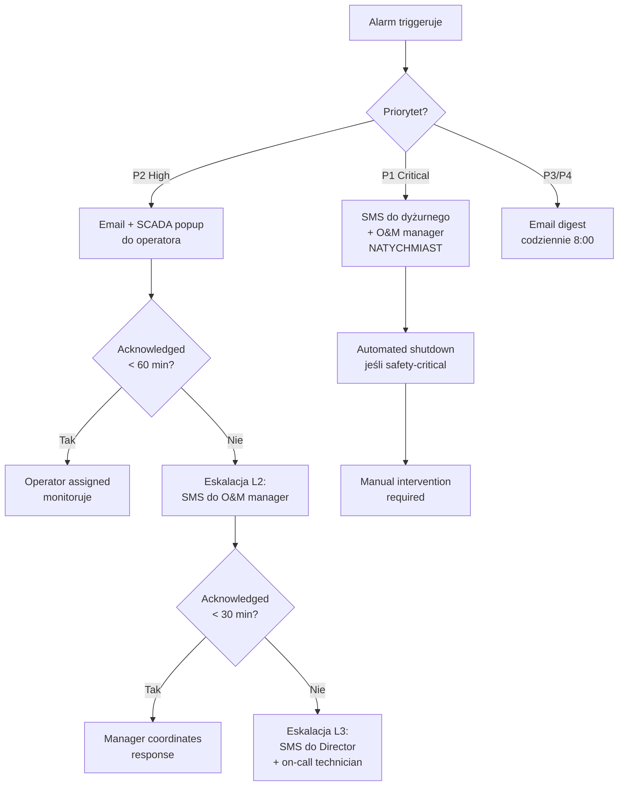

import { LearningObjective, KeyConcept, Example } from '@site/src/components/SlideComponents';

# Filozofia alarmowania i eskalacji

<LearningObjective>
Po tej sekcji student rozumie zasady projektowania efektywnego systemu alarmowego dla instalacji OZE: hierarchię priorytetów (P1–P4), techniki minimalizacji fałszywych alarmów (histereza, adaptacyjne progi), projektowanie reguł alarmowych oraz mechanizmy eskalacji do odpowiednich osób/ról w odpowiednim czasie.
</LearningObjective>

## Wprowadzenie: Problem alarm fatigue

**Alarm fatigue** (znużenie alarmami) to zjawisko, w którym operatorzy **przestają reagować na alarmy**, ponieważ jest ich **zbyt wiele** i większość to **fałszywe alarmy** (false positives). To poważny problem w przemyśle—statystyki pokazują:

- **Przeciętna instalacja przemysłowa**: 1000–5000 alarmów/dzień
- **Operator może obsłużyć**: ~150–200 alarmów/dzień (ze zrozumieniem)
- **Skutek**: 80–90% alarmów ignorowanych, w tym prawdziwe problemy!

W sektorze OZE, gdzie instalacje są często **bezobsługowe** (brak operatora on-site 24/7), alarm fatigue prowadzi do:
- **Opóźnień w reakcji**: Problem wykryty po godzinach/dniach (zamiast minut)
- **Utraty produkcji**: Przestoje nieadresowane → €€€
- **Ryzyka bezpieczeństwa**: Critical alarms (np. thermal runaway BESS) zignorowane

<KeyConcept title="Dobry alarm to akcjonowalny alarm">
**Dobry alarm** spełnia 3 kryteria (ISA-18.2 standard):
1. **Akcjonowalny**: Operator wie, co zrobić w odpowiedzi
2. **Unikalny**: Nie jest duplikatem innego alarmu
3. **Priorytetyzowany**: Jasno określony poziom ważności

**Zły alarm**: Informacyjny ("Inverter włączył się"), niejednoznaczny ("Error 0x47AB"), częsty (> 10× /h)—generuje noise, nie value.
</KeyConcept>

<details>
<summary>📝 Notatki prowadzącego</summary>

**Czas**: 6 minut

**Przebieg**:
1. Wprowadzenie problemu alarm fatigue (3 min)—pokaż dane statystyczne
2. Omów kryterium "dobry alarm" (2 min)
3. Pytanie do sali: "Czy mieliście doświadczenie z alarm fatigue? (w praktykach, projektach?)" (1 min)

**Punkty kluczowe**:
- **Quality > Quantity**: 10 dobrych alarmów > 1000 złych
- **ISA-18.2**: Standard branżowy dla alarm management (warto wspomnieć—studenci mogą spotkać w branży)
- **OZE specyficzne**: Brak operatora on-site → alarmy muszą być jeszcze bardziej precise

**Pytania studenckie**:
- Q: Jaki jest optymalny alarm rate (alarmów/dzień)?
- A: ISA-18.2 rekomenduje **< 6 alarmów/h/operator** (= 144/dzień dla 24/7 coverage). Dla OZE (remote monitoring): Target **< 50 alarmów/dzień** dla instalacji > 1 MW (mniej operatorów, więcej automatyzacji).

</details>

---

## Hierarchia priorytetów alarmów

**Priorytetyzacja** to fundament skutecznego alarm management. Nie wszystkie alarmy są równie ważne—niektóre wymagają **natychmiastowej reakcji**, inne mogą czekać.

### Standard ISA-18.2: 4 poziomy priorytetów

| Priorytet | Nazwa | Czas reakcji | Przykłady w OZE | Kolor (SCADA) |
|-----------|-------|--------------|-----------------|---------------|
| **P1** | **Critical** | < 10 min | Thermal runaway (BESS), H₂S > 1000 ppm (biogaz), Arc fault (PV) | 🔴 Czerwony |
| **P2** | **High** | < 1 h | PR < 0.75 (PV), Gearbox vibration alarm (wiatr), Grid disconnect | 🟠 Pomarańczowy |
| **P3** | **Medium** | < 24 h | String underperformance (PV), Minor CHP alarm (biogaz), Low SoH trend (BESS) | 🟡 Żółty |
| **P4** | **Low / Info** | < 1 week | Planned maintenance due, Firmware update available, Pyranometer calibration overdue | 🔵 Niebieski |

### Kryteria przypisania priorytetu

**P1 (Critical)** — Bezpieczeństwo ludzi lub ryzyko katastrofalnej awarii:
- **Safety**: Gas leaks (H₂S, CH₄), thermal runaway, fire detection
- **Catastrophic failure**: Arc fault (PV), blade detachment (wind), BMS fault (BESS)
- **Akcja**: **Natychmiastowa** (automated shutdown + manual intervention)

**P2 (High)** — Znacząca utrata produkcji lub ryzyko uszkodzenia sprzętu:
- **Production**: Inverter trip, grid disconnect, low PR/CF
- **Equipment damage**: High vibrations (wind), overtemperature (BESS), low biogas quality
- **Akcja**: **Szybka diagnoza i interwencja** (w ciągu 1 h)

**P3 (Medium)** — Drobne problemy, potencjalna degradacja:
- **Performance**: String underperformance (PV), minor OEE drop (biogas)
- **Maintenance**: Sensor drift detected, comm loss (non-critical device)
- **Akcja**: **Planowana interwencja** (w ciągu doby, może poczekać do business hours)

**P4 (Low/Info)** — Informacyjne, brak immediate impact:
- **Notifications**: Scheduled maintenance reminder, report generated
- **Warnings**: Calibration due, disk space 70% (nie krytyczne jeszcze)
- **Akcja**: **Notka do weekly review**

:::tip Zasada przypisania priorytetu
Zadaj 3 pytania:
1. **Safety risk?** → P1
2. **Significant revenue loss (> €1000/h)?** → P2
3. **Minor issue, can wait 24h?** → P3
4. **Just FYI?** → P4

Jeśli wątpliwości między P2 a P3: Start with P2, later downgrade based on actual response patterns.
:::

<details>
<summary>📝 Notatki prowadzącego</summary>

**Czas**: 8 minut

**Przebieg**:
1. Tabela priorytetów (4 min)—wyświetl na slajdzie, omów każdy poziom
2. Kryteria przypisania (3 min)
3. Przykłady: Sklasyfikuj kilka alarmów (1 min)—interaktywnie z salą

**Punkty kluczowe**:
- **P1 = rare**: Jeśli masz > 1 P1 alarm/tydzień, coś jest źle skonfigurowane (za niskie progi lub real problem w instalacji)
- **P2 = actionable**: To główny poziom dla operational alarms
- **P4 ≠ spam**: P4 to valid notifications, ale nie powinny przeszkadzać (email digest, nie SMS)

**Pytania studenckie**:
- Q: Czy możemy mieć więcej niż 4 poziomy (np. P1, P2, P3a, P3b, P4)?
- A: Można, ale **nie rekomendowane**. > 4 poziomy = confusion (operator nie pamięta różnicy między P3a a P3b). ISA-18.2 explicitly recommends 3–4 levels max.

- Q: Kto decyduje o priority dla każdego alarmu?
- A: **Process owner + Alarm engineer** (podczas alarm rationalization). Dla OZE: Typically O&M manager + Controls engineer. Review priorities co 6–12 miesięcy (based on actual response patterns).

</details>

---

## Techniki minimalizacji fałszywych alarmów

**False positives** (fałszywe alarmy) to główna przyczyna alarm fatigue. Nawet najlepiej zaprojektowana reguła alarmowa może generować false positives z powodu **szumu pomiarowego**, **zmienności procesu** lub **zdarzeń przejściowych**.

### 1. Histereza (Hysteresis)

**Problem**: Wartość oscyluje wokół progu → alarm włącza/wyłącza się wielokrotnie (chattering).

**Przykład**: Temperatura BESS = 59.8°C, próg alarmu = 60°C. Temperatura oscyluje 59.7–60.1°C → alarm triggeruje 10× w ciągu 5 minut.

**Rozwiązanie**: **Histereza** = różnica między progiem włączenia (trigger) a wyłączenia (clear).

```
Trigger: T > 60°C
Clear: T < 58°C (histereza 2°C)
```

**Rezultat**: Alarm włącza się przy 60°C, ale wyłącza dopiero gdy T spada < 58°C → eliminuje chattering.

**Typowe wartości histerezy**:
- Temperatura: 2–5°C
- Napięcia: 2–5% wartości nominalnej
- Prądy: 5–10%
- KPI (PR, CF): 2–5 punktów procentowych

### 2. Uśrednianie / Filtracja (Averaging / Filtering)

**Problem**: Krótkotrwałe szpilki (spikes) w danych → fałszywe alarmy.

**Przykład**: Irradiancja POA chwilowo spada do 150 W/m² (przejście chmury, 10 s), próg alarmu "low irradiance" = 200 W/m².

**Rozwiązanie**: Uśrednianie w oknie czasowym (moving average).

```
Trigger: AVG(G_POA, 5 min) < 200 W/m² AND持续 > 10 min
```

**Rezultat**: Krótkie spikes ignorowane, alarm tylko gdy niskie G przez dłuższy czas.

**Typowe okna uśredniania**:
- Szybko zmienne (irradiance, wind speed): 1–5 min
- Wolno zmienne (temperature, PR): 10–30 min
- KPI (Availability, OEE): 1–24 h

### 3. Dead-band (pasmo martwe)

**Problem**: Małe zmiany (< measurement accuracy) generują alarmy.

**Przykład**: Sensor temperatury ma accuracy ±0.5°C. Alarm "temperature changed > 0.3°C" triggeruje na szumie.

**Rozwiązanie**: **Dead-band** = ignoruj zmiany < threshold.

```
Trigger: ΔT > 2°C (dead-band = 2°C, > 4× sensor accuracy)
```

### 4. Progi adaptacyjne (Adaptive Thresholds)

**Problem**: Progi statyczne nie uwzględniają zmienności kontekstu (pora dnia, sezon, warunki pogodowe).

**Przykład (PV)**: Alarm "PR < 0.80" triggeruje nocą (PR = 0%, bo brak słońca) → fałszywy alarm.

**Rozwiązanie**: **Conditional threshold** (próg z warunkiem).

```
Trigger: PR < 0.80 AND G_POA > 400 W/m² AND Time: 08:00–18:00
```

**Zaawansowane**: **Dynamic threshold** (bazuje na historii).

```
Trigger: PR < (PR_avg_last_30_days - 2×σ)
```

(Użyj średnią z ostatnich 30 dni minus 2 odchylenia standardowe → próg adaptuje się do sezonowości.)

### 5. Suppression (Tłumienie kaskadowe)

**Problem**: Jedna awaria triggeruje wiele powiązanych alarmów (alarm flood).

**Przykład (BESS)**: Cell imbalance → 10 cel ma alarm "high voltage" + system alarm "rack imbalance" + BMS alarm "balancing failure" → 12 alarmów z jednego źródła.

**Rozwiązanie**: **Suppression logic** = jeśli alarm root cause jest aktywny, suppress powiązane alarmy.

```
IF Alarm["Rack-03: Cell imbalance"] == ACTIVE:
    SUPPRESS Alarm["Cell-42: High voltage"]
    SUPPRESS Alarm["Cell-43: High voltage"]
    ...
```

**Rezultat**: Operator widzi 1 alarm (root cause), nie 12 (symptoms).

**Implementacja**: **Cause-&-Effect Matrix** (matryca przyczynowo-skutkowa) definiuje relacje między alarmami.

<Example title="Histereza w praktyce: Farma PV, alarm 'Low PR'">
**Reguła bez histerezy**:
```
Trigger: PR_15min < 0.78
Clear: PR_15min >= 0.78
```

**Obserwacja**: PR oscyluje 0.77–0.79 przez 2 h (chmury przechodzące) → alarm triggeruje 15× (chattering). Operator ignoruje (alarm fatigue).

**Reguła z histerezą**:
```
Trigger: PR_15min < 0.78 AND持续 > 30 min
Clear: PR_15min > 0.82 (histereza 4 pp) OR G_POA < 200 W/m² (słabe słońce, disable alarm)
```

**Rezultat**: Alarm triggeruje tylko gdy PR rzeczywiście niska (< 0.78) przez > 30 min, wyłącza się gdy PR odzyskuje do > 0.82 → 1 alarm zamiast 15. Operator reaguje (bo wie, że to real issue).
</Example>

<details>
<summary>📝 Notatki prowadzącego</summary>

**Czas**: 12 minut

**Przebieg**:
1. Przegląd 5 technik (8 min, po ~1.5 min każda)
2. Przykład histerezy (3 min)
3. Pytanie: "Która technika jest najważniejsza?" (1 min)—dyskusja (odpowiedź: Kombinacja! Żadna pojedyncza technika nie rozwiązuje wszystkiego)

**Punkty kluczowe**:
- **Histereza = must have**: Dla każdego progu analogowego (temp, voltage, current)
- **Adaptive thresholds = advanced**: Wymaga historii danych i modeli, ale bardzo effective dla KPI (PR, CF)
- **Suppression = kluczowe dla safety-critical**: W BESS, biogas—gdzie jedna awaria może wygenerować dziesiątki alarmów

**Pytania studenckie**:
- Q: Jak dobrać wartość histerezy?
- A: **Rule of thumb**: Histereza = 2–5× typical noise / variability. Dla temperatury: 2°C (większość czujników ma noise < 0.5°C). Dla PR: 3–5 pp (PR ma natural variance ~2 pp day-to-day).

- Q: Czy możemy mieć zbyt dużą histerezę?
- A: Tak! Jeśli histereza = 20°C (dla temp 60°C trigger), alarm wyłączy się dopiero przy 40°C—może być za późno (problem już ustąpił, ale equipment damaged). Balance: Wystarczająco duża, by eliminate chattering, ale nie tak duża, by mask real issues.

</details>

---

## Projektowanie reguł alarmowych

**Dobra reguła alarmowa** to więcej niż tylko threshold. To **kompletna specyfikacja**: warunek, akcja, eskalacja, dokumentacja.

### Szablon reguły alarmowej

```yaml
Alarm_ID: PV_LOW_PR_001
Nazwa: "Low Performance Ratio w warunkach wysokiej irradiancji"
Priorytet: P2 (High)
Technologia: PV

Warunek_Trigger:
  - PR_30min < 0.78
  - G_POA_avg > 400 W/m²
  - Time: 08:00–18:00 (tylko dzień)
  -持续: > 30 min (eliminacja false positives)

Warunek_Clear:
  - PR_30min > 0.82 (histereza 4 pp)
  - OR G_POA_avg < 200 W/m² (noc/słabe światło)

Akcja:
  - Notify: O&M operator (email + SCADA popup)
  - Create_CMMS_ticket: "Low PR—investigate soiling/shading/string issues"
  - Log: Event log z kontekstem (PR value, G_POA, timestamp, inverters status)

Eskalacja:
  - IF no_acknowledgement after 60 min: SMS to O&M manager
  - IF PR < 0.70 (severe): Upgrade to P1, SMS immediately

Dokumentacja:
  - Możliwe_przyczyny: Soiling, shading, string failures, inverter clipping
  - Typowa_akcja: Check weather (rain recent?), inspect modules (dirt?), review string currents
  - Oczekiwany_response_time: Acknowledge < 1 h, diagnoza < 4 h, action plan < 24 h

Audyt:
  - Created: 2024-01-15
  - Last_review: 2024-10-01
  - Trigger_rate: 2.3 alarms/month (acceptable, target < 5)
  - False_positive_rate: 12% (target < 20%)
```

### Typy reguł

**1. Threshold alarms** (progi)

Najczęstszy typ: wartość przekracza threshold.

```
Trigger: Temperature_BESS > 60°C
```

**2. Rate-of-change alarms** (tempo zmian)

Alarm na szybkie zmiany (często oznacza problem).

```
Trigger: dT/dt > 5°C/min (BESS thermal runaway indicator)
```

**3. Deviation alarms** (odchylenia)

Alarm gdy wartość odbiega od expected/normal.

```
Trigger: |CF_turbine_05 - CF_avg_farm| > 15% (turbina underperforms vs. reszta farmy)
```

**4. Correlation alarms** (korelacje)

Alarm gdy dwa parametry razem wskazują problem.

```
Trigger: Vibration_gearbox > 12 mm/s AND Temperature_bearing > 85°C
(korelacja: High vibration + high temp = bearing failure imminent)
```

**5. Time-based alarms** (czas)

Alarm po upływie czasu bez zmiany stanu.

```
Trigger: Inverter_status == "Fault" FOR > 2 h
(Inverter w fault state przez > 2 h = wymaga interwencji, nie auto-recovery)
```

### Cause-&-Effect Matrix (Matryca przyczynowo-skutkowa)

Dla złożonych systemów (BESS, biogaz), **C&E Matrix** definiuje relacje między alarmami i akcjami.

| Przyczyna (Cause) | Skutek 1 (Effect) | Skutek 2 | Akcja automatyczna | Akcja manualna |
|-------------------|-------------------|----------|---------------------|----------------|
| BESS: Cell temp > 70°C | Rack alarm | System shutdown trigger | Stop charging/discharging | Inspect cooling system |
| Biogas: H₂S > 1000 ppm | CHP alarm | Emergency shutdown | Close gas valves, activate ventilation | Evacuate area, call fire dept |
| Wind: Gearbox vibration > 15 mm/s | High temp bearing | Turbine stop | Stop turbine, lock rotor | Schedule gearbox inspection |

**Implementacja**: W SCADA (ladder logic PLC) lub w alarm management software (Ignition, WinCC).

<Example title="Reguła korelacyjna: Wczesna detekcja awarii łożyska (wiatr)">
**Symptomy**:
1. Wzrost wibracji w paśmie 1200–1400 Hz (BPFO bearing #42)
2. Wzrost temperatury łożyska o > 10°C w ciągu tygodnia

**Pojedyncze alarmy** (za późno lub false positives):
- Alarm "High vibration" (threshold 15 mm/s) triggeruje dopiero gdy damage zaawansowany
- Alarm "High temperature" (threshold 85°C) ma false positives (hot day, normal)

**Reguła korelacyjna** (wczesna detekcja):
```yaml
Alarm_ID: WIND_BEARING_FAILURE_EARLY
Priorytet: P2

Warunek:
  - Vibration_RMS_1200_1400_Hz > 8 mm/s (50% below critical threshold, early warning)
  - AND Temperature_bearing_42 > (T_baseline + 10°C)
  - AND Trend(Temperature_bearing_42, 7 days) > +2°C/day

Akcja:
  - Notify: Maintenance team (email)
  - Schedule: Inspection during next maintenance window (< 2 weeks)
  - Monitor: Increase vibration sampling to 1/day (from 1/week)

Oczekiwany_benefit: 
  - Early detection (2–3 months before catastrophic failure)
  - Planned maintenance (€30k) vs. unplanned gearbox replacement (€300k)
```

**Rezultat**: 3 miesiące wcześniejsza detekcja → wymiana łożyska planowana (nie emergency), oszczędność €270k.
</Example>

<details>
<summary>📝 Notatki prowadzącego</summary>

**Czas**: 14 minut

**Przebieg**:
1. Szablon reguły alarmowej (4 min)—pokaż na slajdzie, omów każdą sekcję
2. Typy reguł (5 min)
3. Cause-&-Effect Matrix (2 min)
4. Przykład reguły korelacyjnej (3 min)

**Punkty kluczowe**:
- **Documentation is key**: Każda reguła musi mieć dokumentację (możliwe przyczyny, typowa akcja). Bez tego, operator nie wie, co zrobić.
- **Correlation alarms = advanced, ale powerful**: Wymagają domain knowledge (jakie parametry są skorelowane), ale dają early warning
- **C&E Matrix = mandatory dla safety-critical**: W BESS, biogas—gdzie automated shutdowns are required

**Pytania studenckie**:
- Q: Jak testować reguły alarmowe przed wdrożeniem?
- A: (1) **Simulation**: Replay historical data, see how many alarms would trigger (false positive rate?). (2) **Shadow mode**: Deploy rule, log would-be alarms, but don't notify operators—review after 1 week. (3) **Pilot**: Deploy to 1 farm in portfolio, monitor for 1 month, then roll out to all.

- Q: Ile reguł alarmowych powinno być w typowej farmie OZE?
- A: **Target**: 50–150 unique alarm types (dla 1–10 MW instalacji). **Red flag**: > 500 alarm types = too granular (alarm overload). **Balance**: Cover all critical + important scenarios, ale don't alarm on every minor deviation.

</details>

---

## Eskalacja i workflow

**Eskalacja** to proces przekazywania alarmu do wyższych poziomów odpowiedzialności, gdy nie ma reakcji na niższym poziomie. Kluczowe dla **bezobsługowych** instalacji OZE.

### Ścieżki eskalacji

Typowa ścieżka eskalacji (3-tier):



### Przypisanie do ról (Role-based Escalation)

**Nie eskaluj do konkretnych osób** (John, Mary)—eskaluj do **ról** (Operator, Manager). Osoby rotują, role są stałe.

| Rola | Zakres odpowiedzialności | Kontakt | Czas reakcji |
|------|--------------------------|---------|--------------|
| **Operator (L1)** | P2, P3 alarms, routine monitoring | Email, SCADA | < 1 h (P2), < 24 h (P3) |
| **O&M Manager (L2)** | P1 alarms, eskalacje z L1 | SMS + Phone | < 15 min (P1), < 1 h (P2 escalated) |
| **On-call Technician** | Field interventions | SMS + Phone | < 4 h (on-site arrival) |
| **Director / Asset Owner (L3)** | Critical incidents, regulatory | Phone | < 1 h (awareness), decisions as needed |

**Rotacja dyżurów**: L2 (Manager) i On-call Technician rotują co tydzień (duty roster). System automatycznie używa aktualnego dyżurnego z roster.

### Kanały komunikacji

| Kanał | Kiedy używać | Pros | Cons |
|-------|--------------|------|------|
| **SCADA popup** | P2, P3, P4 | Centralized, context-rich | Wymaga operatora przy SCADA |
| **Email** | P2, P3, P4 | Dokumentacja, attachments | Nie real-time, może być zignorowany |
| **SMS** | P1, eskalacje P2 | Fast, direct, mobile | Limit 160 znaków, może być expensive |
| **Phone call** (automated) | P1 critical | Guaranteed attention | Annoying if false positive, może nie odebrać |
| **Mobile app** (push notification) | P1, P2 | Modern, rich content, acknowledged | Wymaga app install, battery drain |

**Best practice**: **Multi-channel dla P1** (SMS + Phone + push notification), **email dla P3/P4** (non-urgent).

### Acknowledgement i closure

**Alarm lifecycle**:

1. **Triggered** (alarm aktywny)
2. **Acknowledged** (operator potwierdził, rozumie, będzie działał)
3. **In Progress** (akcja w toku—diagnoza, repair dispatched)
4. **Resolved** (problem rozwiązany)
5. **Closed** (alarm cleared, dokumentacja zaktualizowana)

**Metrics**:
- **MTTA** (Mean Time To Acknowledge): Średni czas od trigger do acknowledgement
  - Target: < 15 min (P1), < 1 h (P2)
- **MTTR** (Mean Time To Resolve): Średni czas od trigger do resolved
  - Target: < 4 h (P1), < 24 h (P2)

<Example title="Eskalacja w praktyce: Farma wiatrowa, alarm 'Gearbox vibration high'">
**Scenariusz**: Turbina-05, gearbox vibration = 14 mm/s (threshold 12 mm/s), priorytet P2.

**Timeline**:
- **T+0 min**: Alarm triggeruje → Email + SCADA popup do Operator (L1)
- **T+5 min**: Operator otwiera SCADA, widzi alarm, czyta dokumentację ("Możliwa przyczyna: Early bearing failure")
- **T+10 min**: Operator **acknowledges** alarm w SCADA (MTTA = 10 min ✓ < 1 h target)
- **T+15 min**: Operator sprawdza trend vibracji (last 7 days)—wzrost from 8 to 14 mm/s
- **T+20 min**: Operator tworzy CMMS ticket: "Turbine-05 gearbox inspection—high vibration, bearing failure suspected"
- **T+30 min**: Operator eskaluje do O&M Manager (L2): "Please schedule technician visit within 2 weeks (before reaches critical 18 mm/s)"
- **T+1 h**: Manager reviewuje, zatwierdza, schedules technician visit (za 10 dni, during next maintenance window)
- **T+10 days**: Technician on-site, inspects gearbox, confirmes bearing #42 wear, schedules replacement (za 1 miesiąc, requires crane + spare bearing order)
- **T+40 days**: Bearing replaced (planned downtime 3 days), turbine back online, alarm **resolved**
- **T+41 days**: Operator closes alarm w SCADA, adds notes: "Bearing #42 replaced, vibration now 6 mm/s (normal)"

**Metrics**:
- MTTA: 10 min ✓
- MTTR: 40 days (ale planowane, bez emergency—sukces early detection!)

**Bez eskalacji**: Alarm zignorowany → vibration osiąga 18 mm/s → catastrophic gearbox failure → emergency repair (€300k, 3 tygodnie downtime).
</Example>

<details>
<summary>📝 Notatki prowadzącego</summary>

**Czas**: 12 minut

**Przebieg**:
1. Diagram eskalacji (3 min)—pokaż na slajdzie
2. Przypisanie do ról i kanały komunikacji (4 min)
3. Alarm lifecycle + metrics (2 min)
4. Przykład eskalacji farmy wiatrowej (3 min)

**Punkty kluczowe**:
- **Role-based, not person-based**: System musi działać niezależnie od rotacji personelu
- **Multi-channel dla P1**: Redundancja kanałów = wyższa pewność delivery (zwłaszcza nocą/weekendy)
- **MTTA i MTTR to key metrics**: Track religiously, review monthly (czy targets są met?)

**Pytania studenckie**:
- Q: Co jeśli nikt nie odbiera SMS (wszyscy śpią, telefony wyłączone)?
- A: **Backup escalation**: Po 2 nieudanych próbach (SMS + call), system eskaluje do backup on-call (second technician on roster). Ultimate fallback: Security service / facility manager (who has physical access to site for safety-critical).

- Q: Czy eskalacja kosztuje (SMS, phone calls)?
- A: Tak. SMS: €0.05–0.10 each, phone calls: €0.20–0.50/min. Dla farmy 10 MW, budget €500–1000/rok na alarm communications. **But**: Cost of missed P1 alarm >> cost of SMS. Never skimp on P1 notifications.

</details>

---

## Rejestrowanie i audyt skuteczności alarmów

**Alarm management to ciągły proces**, nie jednorazowa konfiguracja. Systemy alarmowe wymagają **regularnego audytu** i **optymalizacji** na podstawie rzeczywistych danych o skuteczności.

### Co rejestrować?

Każde zdarzenie alarmowe powinno być **zalogowane** z pełnym kontekstem:

```json
{
  "alarm_id": "PV_LOW_PR_001",
  "trigger_time": "2025-10-07T14:32:18Z",
  "clear_time": "2025-10-07T16:15:42Z",
  "duration": "1h 43min",
  "priority": "P2",
  "tag": "site-001.inverter-12",
  "trigger_value": {
    "PR_30min": 0.76,
    "G_POA_avg": 650
  },
  "acknowledged_by": "operator_john",
  "acknowledged_time": "2025-10-07T14:45:03Z",
  "MTTA": "12min 45s",
  "resolved_time": "2025-10-07T16:10:00Z",
  "MTTR": "1h 37min",
  "root_cause": "Soiling (modules dirty after 2 weeks no rain)",
  "action_taken": "Scheduled module cleaning for next week",
  "false_positive": false
}
```

### Metryki skuteczności alarmów

**1. Alarm rate** (częstotliwość)

$$
\text{Alarm rate} = \frac{\text{Number of alarms}}{\text{Time period}} \quad [\text{alarms/day or alarms/h}]
$$

**Target**: < 50 alarms/day (dla instalacji > 1 MW), < 6 alarms/h/operator (ISA-18.2).

**Red flag**: > 200 alarms/day = alarm flood (konieczna rationalization).

**2. False positive rate** (FPR)

$$
FPR = \frac{\text{False positives}}{\text{Total alarms}} \times 100\%
$$

**Target**: < 20% (ISA-18.2), idealnie < 10%.

**Wysoka FPR** (> 30%) = alarm fatigue → rationalize rules (increase hysteresis, add conditions).

**3. MTTA (Mean Time To Acknowledge)**

$$
MTTA = \frac{\sum (\text{acknowledged\_time} - \text{trigger\_time})}{\text{Number of alarms}}
$$

**Target**: < 15 min (P1), < 1 h (P2), < 24 h (P3).

**Wysoka MTTA** = alarms not noticed OR operators overwhelmed → investigate root cause.

**4. MTTR (Mean Time To Resolve)**

$$
MTTR = \frac{\sum (\text{resolved\_time} - \text{trigger\_time})}{\text{Number of alarms}}
$$

**Target**: Varies by priority and type. P1: < 4 h, P2: < 24 h, P3: < 1 week.

**5. Precision & Recall** (z machine learning, ale aplikowalne do alarmów)

**Precision** (dokładność):
$$
Precision = \frac{TP}{TP + FP} = \frac{\text{True alarms}}{\text{Total triggered alarms}}
$$

Precision = 1 - FPR. High precision = few false positives.

**Recall** (czułość):
$$
Recall = \frac{TP}{TP + FN} = \frac{\text{Detected problems}}{\text{Total real problems}}
$$

Recall mierzy: "Czy wykrywamy wszystkie realne problemy?" High recall = few false negatives (missed alarms).

**Trade-off**: High precision (few false positives) vs. High recall (catch all problems). Typowo, preferujemy **recall > precision** dla safety-critical (lepiej mieć kilka false positives niż miss real problem).

### Alarm rationalization (przegląd i optymalizacja)

**Proces** (co 6–12 miesięcy):

1. **Zbierz dane**: Export alarm logs (last 6 months)
2. **Analiza**:
   - Top 20 most frequent alarms (czy to sensowne? czy spam?)
   - FPR per alarm type (które mają high FPR? → adjust thresholds)
   - "Dead alarms" (never triggered w last 6 months) → delete or review relevance
   - Alarms z high MTTA/MTTR → investigate why (unclear documentation? operator training?)
3. **Działania**:
   - **Tune thresholds**: Dla alarmów z high FPR (increase hysteresis, add conditions)
   - **Delete dead alarms**: Reduce clutter
   - **Consolidate**: Merge powiązane alarmy (suppress cascades)
   - **Update documentation**: Dla alarmów z high MTTA (operators don't know what to do)
4. **Deploy changes**: Test w shadow mode, then production
5. **Monitor**: Track metrics next 1–3 months, verify improvement

<Example title="Alarm rationalization: Farma PV 10 MW, Q3 2024 review">
**Dane** (Jul–Sep 2024):
- Total alarms: 1240 (średnio 13.7/day)
- Alarm rate: OK (target < 50/day)
- Top alarm: "Inverter communication loss" (320 occurrences, 26% of total)

**Analiza "Inverter communication loss"**:
- FPR: 65% (208 false positives z 320)—**BARDZO WYSOKI**
- Przyczyna false positives: Krótkie przerwy w łączności (< 5 s) z powodu network jitter (Wi-Fi na farmie niestabilny)

**Akcja**:
```yaml
# Przed:
Trigger: Inverter_comm_status == "Lost" FOR > 10 s

# Po (tuned):
Trigger: Inverter_comm_status == "Lost" FOR > 60 s (increased from 10 s)
Clear: Inverter_comm_status == "OK" FOR > 30 s (added hysteresis)
```

**Rezultat** (Oct 2024, 1 miesiąc po zmianie):
- "Inverter communication loss" alarms: 45 occurrences (z 320 → 45, redukcja 86%)
- FPR: 18% (z 65% → 18%, significant improvement)
- MTTA: Improved from 45 min to 12 min (operators now react faster, bo wiedzą, że alarm is real)

**Dodatkowe akcje**:
- Deleted 12 "dead alarms" (never triggered in 6 months)
- Consolidated 3 "low SoH" alarms (BESS) into 1 (were redundant, different thresholds)
- Updated documentation for 8 alarms (added "typical action" section)

**Overall impact**:
- Alarm rate: 13.7/day → 8.2/day (redukcja 40%)
- Overall FPR: 28% → 15% (improvement)
- Operator satisfaction: Anecdotally higher ("alarms are more meaningful now")
</Example>

<details>
<summary>📝 Notatki prowadzącego</summary>

**Czas**: 10 minut

**Przebieg**:
1. Co rejestrować (2 min)—pokaż przykład JSON log
2. Metryki skuteczności (4 min)
3. Alarm rationalization process (2 min)
4. Przykład rationalization (2 min)

**Punkty kluczowe**:
- **Logging is mandatory**: Bez logów, nie możesz improve. Ensure alarm logs są retained (min 1 year).
- **Metrics drive improvement**: "You can't improve what you don't measure"—track FPR, MTTA, MTTR religiously
- **Rationalization is continuous**: Co 6–12 miesięcy, inaczej alarm system degrades over time (drift w thresholds, new equipment, changed processes)

**Pytania studenckie**:
- Q: Kto powinien prowadzić alarm rationalization?
- A: **Team effort**: (1) Alarm engineer (lead), (2) Operators (input on what alarms are useful/annoying), (3) Process/Controls engineers (domain knowledge), (4) Management (approve changes, priorities). Typically 2–4 osoby, 2–3 dni pracy (dla rationalization session).

- Q: Co z alarmami, które triggerują rzadko (< 1/miesiąc), ale są critical?
- A: **Keep them!** Low frequency ≠ low importance. P1 alarms (safety-critical) mogą triggerować raz na rok, ale must remain (i muszą być tested—periodic alarm testing, e.g. simulated fire alarm co 6 miesięcy).

</details>

---

## Podsumowanie: Checklist dobrego systemu alarmowego

✅ **Priorytetyzacja**: 4 poziomy (P1–P4), jasne kryteria przypisania  
✅ **Minimalizacja false positives**: Histereza, uśrednianie, adaptive thresholds, suppression  
✅ **Dokumentacja reguł**: Każda reguła ma opis, możliwe przyczyny, typową akcję  
✅ **Eskalacja**: Role-based, multi-tier, multi-channel (email/SMS/phone)  
✅ **Logging**: Pełny kontekst każdego alarmu (trigger time, values, acknowledged by, resolved, root cause)  
✅ **Metryki**: Track alarm rate, FPR, MTTA, MTTR—review monthly  
✅ **Rationalization**: Co 6–12 miesięcy—tune thresholds, delete dead alarms, update documentation  
✅ **Operator training**: Operatorzy wiedzą, co oznaczają alarmy i co robić w odpowiedzi

**Dobry system alarmowy** to system, w którym:
- Operatorzy **ufają** alarmom (bo niski FPR)
- Operatorzy **reagują szybko** (bo dokumentacja jasna)
- Problemy **wykrywane wcześnie** (przed catastrophic failures)
- System **ewoluuje** z czasem (rationalization)

W następnej sekcji (**Podsumowanie W1**) zintegrujemy wszystkie omówione tematy: architektura, KPI, alarmy—w całościową wizję systemu monitoringu OZE.


