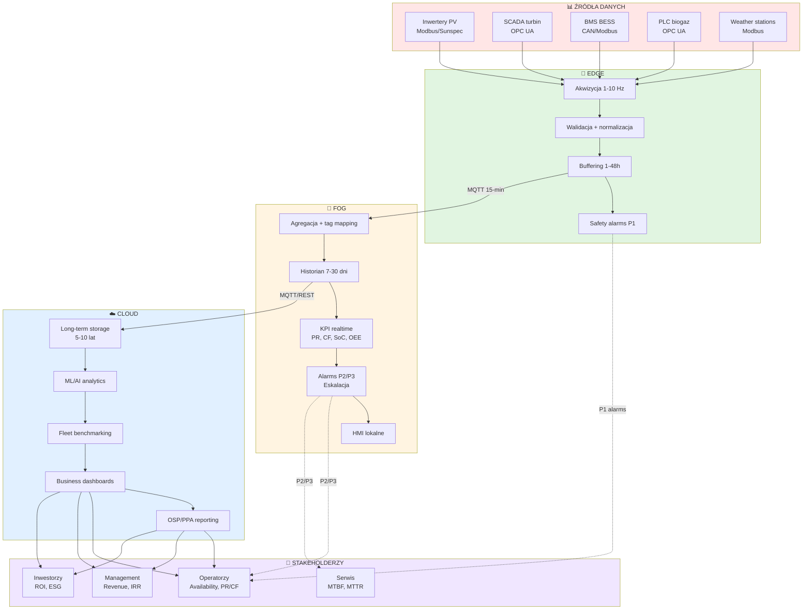

import { LearningObjective, KeyConcept, Example } from '@site/src/components/SlideComponents';
import InteractiveQuiz from '@site/src/components/InteractiveQuiz';

# Podsumowanie Wykładu 1: Architektura systemów monitoringu w OZE

<LearningObjective>
Po tym wykładzie student potrafi zaprojektować kompletną architekturę systemu monitoringu dla instalacji OZE: wybrać właściwą strukturę edge-fog-cloud, zdefiniować kluczowe KPI dla danej technologii (PV/wiatr/BESS/biogaz), oraz zaprojektować efektywny system alarmowy z priorytetami i eskalacją.
</LearningObjective>

## Synteza: Integracja wszystkich elementów

W ciągu tego wykładu przeszliśmy przez **5 kluczowych obszarów** architektury monitoringu OZE:

1. **Rola monitoringu**: Ciągłość, bezpieczeństwo, predictive maintenance, compliance
2. **Architektura warstwowa**: Edge-Fog-Cloud i podział odpowiedzialności
3. **Typy danych i źródła**: Time-series, events, metadata + specyfika PV/wiatr/BESS/biogaz
4. **KPI**: PR, CF, SoC/SoH, OEE, Availability—metryki operacyjne i biznesowe
5. **Alarmowanie**: Priorytetyzacja, minimalizacja false positives, eskalacja

Te elementy nie działają w izolacji—**są ze sobą ściśle powiązane** i tworzą **kompletny ekosystem monitoringu**. Poniższy diagram pokazuje, jak wszystkie części współpracują:

**Przepływ informacji** (od danych surowych do decyzji biznesowych):
1. **Źródła** generują dane (Modbus, OPC UA)
2. **Edge** zbiera, waliduje, buforuje, reaguje na safety (P1)
3. **Fog** agreguje, oblicza KPI, generuje alarmy operacyjne (P2/P3), wizualizuje lokalnie (HMI)
4. **Cloud** składuje long-term, analiza ML, benchmarking, raporty dla stakeholders
5. **Stakeholderzy** otrzymują informacje dostosowane do ich potrzeb (operators: PR/alarms, investors: revenue/ROI)

---

## Kluczowe wnioski: Co zapamiętać z W1

### 1. Architektura Edge-Fog-Cloud

**Edge** (warstwa najbliższa urządzeniom):
- ✅ **Funkcje**: Akwizycja 1-10 Hz, walidacja zakresów, normalizacja jednostek, buffering 1-48h, safety alarms (< 100 ms latency)
- ✅ **Hardware**: Raspberry Pi, Moxa gateways, PLC (Siemens S7, ABB)
- ✅ **Protokoły**: Modbus RTU/TCP, OPC UA, CAN bus
- ✅ **Kluczowy benefit**: **Resilience** (działa bez fog/cloud), **safety** (lokalne alarmy)

**Fog** (warstwa agregacji lokalnej):
- ✅ **Funkcje**: Agregacja wielu źródeł (10–100), normalizacja tagów, historian 7-30 dni, near-RT KPI (PR, CF), alarmy P2/P3, HMI
- ✅ **Hardware**: IPC (industrial PC), Dell/HPE edge servers, SCADA software (Ignition, WinCC)
- ✅ **Technologie**: InfluxDB, Grafana, Node-RED (open-source stack)
- ✅ **Kluczowy benefit**: **Local control** (działa bez cloud), **low latency** (< 1 s dla dashboards)

**Cloud** (warstwa analityki i storage):
- ✅ **Funkcje**: Long-term storage (5-10 lat), ML/AI, fleet benchmarking, business dashboards, integrations (ERP, CMMS, OSP)
- ✅ **Technologie**: AWS IoT / Azure IoT Hub, Timestream / TimescaleDB, SageMaker / Azure ML
- ✅ **Koszty**: €10–50/MW/miesiąc (przy dobrej agregacji w fog)
- ✅ **Kluczowy benefit**: **Scalability**, **advanced analytics**, **no CapEx** (OpEx model)

:::tip Kluczowa zasada
**Safety always local (edge/fog), analytics can be cloud.** Nigdy nie polegaj na cloud dla safety-critical logic—latency i risk utraty łączności są zbyt duże.
:::

### 2. KPI dla różnych technologii OZE

| Technologia | Primary KPI | Formuła | Typowa wartość | Próg alarmu |
|-------------|-------------|---------|----------------|-------------|
| **PV** | Performance Ratio (PR) | $\frac{E_{AC}}{E_{teor}}$ | 85–90% | < 0.75 (P2) |
| **Wiatr** | Capacity Factor (CF) | $\frac{E_{rzecz}}{P_{nom} \times t}$ | 25–45% (zależy od lokalizacji) | N/A (porównaj między turbinami) |
| **BESS** | SoC, SoH | SoC: $\frac{Q_{avail}}{Q_{nom}}$ SoH: $\frac{C_{actual}}{C_{rated}}$ | SoC: 20–90% operational SoH: 100% → 80% (EoL) | SoC < 20% (P2) SoH < 85% (P3 trend) |
| **Biogaz** | OEE | $A \times P \times Q$ | 85–92% | < 0.80 (P3) |
| **Wszystkie** | Availability | $\frac{t_{avail}}{t_{total} - t_{planned}}$ | 95–99% (zależy od tech) | < SLA threshold (typ. 97%) |

**Zasada wyboru KPI**:
- **Operators**: Focus on **operational KPI** (Availability, PR/CF, alarm rate)—daily/hourly monitoring
- **Management**: Focus on **financial KPI** (Revenue, IRR, LCOE)—monthly/quarterly reports
- **Maintenance**: Focus on **reliability KPI** (MTBF, MTTR, spare parts cost)—weekly reviews

### 3. Filozofia alarmowania

**4 poziomy priorytetów** (ISA-18.2):
- **P1 (Critical)**: Safety risk → < 10 min reaction, SMS + phone, automated shutdowns
- **P2 (High)**: Production loss → < 1 h reaction, email + SCADA
- **P3 (Medium)**: Minor issues → < 24 h reaction, email digest
- **P4 (Info)**: Notifications → weekly review

**Techniki anti-flooding**:
1. **Histereza**: 2–5°C dla temp, 2–5 pp dla KPI
2. **Uśrednianie**: 1–30 min okna (zależnie od zmienności parametru)
3. **Adaptive thresholds**: Conditional (G_POA > 400 W/m²) lub dynamic (baseline z historii)
4. **Suppression**: Causa-&-Effect Matrix dla powiązanych alarmów

**Metryki skuteczności**:
- **Alarm rate**: < 50/day (target dla 1–10 MW instalacji)
- **False positive rate**: < 20%, ideally < 10%
- **MTTA**: < 15 min (P1), < 1 h (P2)
- **MTTR**: < 4 h (P1), < 24 h (P2)

**Rationalization**: Co 6–12 miesięcy—review alarm logs, tune thresholds, delete dead alarms.

📝 Notatki prowadzącego

**Czas**: 8 minut

**Przebieg**:
1. Diagram integracji (2 min)—pokaż big picture
2. Przegląd kluczowych wniosków (3 min)—szybkie przypomnienie
3. Tabela KPI (2 min)
4. Filozofia alarmowania—bullet points (1 min)

**Punkty kluczowe**:
- **To jest synteza, nie nowy materiał**: Przypominaj, łącz kropki, pokazuj big picture
- **Diagram integracji**: Bardzo ważny—studenci często tracą big picture w szczegółach. Ten diagram przywraca kontekst.
- **Powtórzenie key messages**: "Safety local", "KPI per stakeholder", "Alarm fatigue = real problem"

**Pytania studenckie**:
- Q: Ile czasu zajmuje zaprojektowanie i wdrożenie systemu monitoringu dla farmy 10 MW?
- A: **Design**: 2–4 tygodnie (specyfikacja, vendor selection). **Procurement**: 8–12 tygodni (delivery czujników, gateways, servers). **Installation**: 4–8 tygodni (montaż, okablowanie, commissioning). **Total**: ~4–6 miesięcy od start do full operation. **Koszt**: €100–300k dla farmy 10 MW PV (1–3% CAPEX instalacji).

---

## Case Study: Instalacja hybrydowa PV + BESS 5 MW / 2 MWh

Aby zilustrować **integrację wszystkich koncepcji** z W1, przeanalizujmy **rzeczywisty przypadek** (zanonimizowany) instalacji hybrydowej PV + BESS.

### Opis instalacji

**Lokalizacja**: Południowa Polska (woj. małopolskie), teren przemysłowy  
**Moc PV**: 5 MW (20 000 modułów × 250 Wp, 20 inverterów × 250 kW)  
**BESS**: 2 MWh / 1 MW (LFP chemistry, 20 racków × 100 kWh)  
**Rozpoczęcie eksploatacji**: Styczeń 2023  
**Cel**: Peak shaving (redukcja opłat za moc szczytową) + energy arbitrage (buy low, sell high)

### Architektura monitoringu

**Edge**:
- 4× Gateway IoT (Moxa UC-8100, każdy dla 5 inverterów)
- Modbus TCP do inverterów, MQTT publish do fog
- Sampling: 10 s (power, voltages), 1 min (temperatures, energy counters)
- Local alarms: Arc fault detection (AFCI w combiner boxes), BESS thermal runaway (dT/dt > 5°C/min)

**Fog**:
- Dell Edge Gateway 5100 (Intel Atom, 8 GB RAM, 256 GB SSD)
- InfluxDB 2.x (historian, 30 dni retencji szczegółowych danych)
- Grafana 10.x (HMI—4 dashboardy: Overview, PV detail, BESS detail, Alarms)
- Node-RED (flow automation: KPI calculations, alarm logic, MQTT → InfluxDB ingestion)
- Sampling incoming: MQTT co 1 min (z edge), obliczanie KPI co 15 min

**Cloud**:
- AWS IoT Core (MQTT broker, 1 connection z fog)
- AWS Timestream (TSDB, 7 dni high-res + S3 archival)
- AWS Lambda (serverless: PR/CF/SoC calculations co 15 min)
- Grafana Cloud (business dashboards—accessible via web dla stakeholders)
- QuickSight (monthly reports—PDF sent to investors)

**Koszty** (monthly):
- Edge: €0 (one-time CapEx €2000, no OpEx)
- Fog: €0 (one-time CapEx €6000, electricity ~€20/month)
- Cloud: €120 (IoT Core €20, Timestream €50, Lambda €10, Grafana Cloud €40)
- **Total OpEx**: €140/month = **€1680/year** (0.034% OPEX vs. €5M CAPEX instalacji—bardzo niski!)

### Monitorowane KPI

**PV**:
- **PR** (Performance Ratio): Target > 85%, alarm < 0.75 (P2)
  - Obliczany co 15 min (fog), 24-h average displayed w dashboards
  - Segmentacja: PR_morning, PR_noon, PR_evening (dla detekcji shading issues)

**BESS**:
- **SoC**: Target 40–60% (optimal for longevity + flexibility)
  - Realtime monitoring (fog), forecast 24-h (cloud—using ML model)
  - Alarms: SoC < 20% (P2), SoC > 90% (P3)
- **SoH**: Tracked monthly (capacity test co miesiąc)
  - Current: 97% (po 2 latach eksploatacji—excellent, < 2%/rok degradacji)
  - Prognoza EoL: Rok 2033 (10 lat—zgodnie z warranty)

**Hybrid system**:
- **Availability**: Target > 99%
  - Actual (2023–2024): 99.4% (PV), 98.2% (BESS)
  - Przestoje: PV minimal (tylko 1 inverter failure, wymiana 2 dni). BESS: 2× BMS firmware updates (planned, 8 h total)

**Financial KPI** (calculated w cloud):
- **Revenue** (2024): €420k (PV production) + €85k (peak shaving savings) + €30k (arbitrage) = **€535k total**
- **IRR**: 8.2% (zgodnie z projekcją financial model)
- **Payback**: Rok 7.5 (z planowanych 8–10 lat—ahead of schedule!)

### System alarmowy

**Alarm rules**: 42 unique alarm types (23 dla PV, 15 dla BESS, 4 system-level)

**Top 5 alarmów** (by frequency, 2024):
1. "Inverter communication loss" (8× /rok)—FPR 25% (needs tuning—zwiększyć timeout z 30s do 60s)
2. "Low PR" (6× /rok)—FPR 17% (acceptable)—głównie soiling (po 3–4 tygodnie bez deszczu)
3. "BESS cell imbalance" (4× /rok)—FPR 0% (all true positives, active balancing resolved)
4. "Grid frequency out of range" (3× /rok)—FPR 67% (2 false, 1 true)—external issue (OSP grid), needs suppression during known grid events
5. "Pyranometer offline" (2× /rok)—FPR 0% (sensor failures, replaced)

**Metrics** (2024 average):
- Alarm rate: 2.1/day (target < 50—excellent!)
- Overall FPR: 18% (target < 20%—good!)
- MTTA (P2): 22 min (target < 1 h—good)
- MTTR (P2): 6.2 h (target < 24 h—excellent)

**Eskalacja** (0 eskalacji w 2024—wszystkie alarmy acknowledged w czasie → świadczy o skuteczności priorytetyzacji i dokumentacji).

### Obserwowane problemy i rozwiązania (2023–2024)

**Problem 1: Soiling (Q2–Q3 2024)**
- **Objaw**: PR spadł z 88% (kwiecień) do 82% (sierpień)
- **Detekcja**: Alarm "Low PR" (6 triggerów w ciągu 4 miesięcy)
- **Diagnoza**: Korelacja PR vs. irradiancja—stały offset (nie zmienne warunki) → soiling
- **Akcja**: Mycie modułów (€8000), PR powrócił do 87%
- **Benefit**: Odzyskano 5 pp PR × 1000 MWh/miesiąc × 4 miesiące × €50/MWh = **€10k recovered revenue** (ROI mycia 25% w 4 miesiące)

**Problem 2: BESS cell imbalance (Listopad 2023)**
- **Objaw**: ΔV_cell_max w Rack-05 wzrosło do 85 mV (norma < 50 mV)
- **Detekcja**: Alarm "Cell imbalance" (P3)
- **Diagnoza**: Cell #124 degraded (voltage 3.25 V vs. 3.33 V dla innych przy SoC 50%)
- **Akcja**: Aktywne balansowanie przez BMS (2 h), ΔV spadło do 60 mV. Monitoring intensified (cell-level data co 1 min przez 2 tygodnie)
- **Follow-up**: Po 2 tygodniach, ΔV stabilne 55–60 mV → decision: Monitor dalej, wymiana rack jeśli ΔV > 100 mV
- **Outcome** (2024): ΔV stable, Rack-05 operational. **Uniknięto wymiany rack (€10k savings)**.

**Problem 3: Grid disconnect (Maj 2024)**
- **Objaw**: Instalacja odłączona od sieci przez OSP (grid fault w regionie)
- **Detekcja**: Alarm "Grid disconnect" (P2), SOE recorded sequence
- **Akcja automatyczna**: Invertery tripped (anti-islanding protection), BESS switched to idle mode
- **Akcja manualna**: Operator contacted OSP, confirmed grid fault (not installation issue), waited for grid restoration (2 h)
- **Post-incident review**: SOE analysis showed correct operation (all protections worked as designed). No action needed.

**Problem 4: Inverter failure (Luty 2024)**
- **Objaw**: Inverter-12 w fault state, nie auto-recovery
- **Detekcja**: Alarm "Inverter fault" (P2) → operator acknowledged w 15 min
- **Diagnoza** (remote): Fault code 0x3A (DC overvoltage protection triggered). String voltages review: String-42 voltage 820 V (threshold 800 V—borderline)
- **Akcja**: Remote reset inverter → recovery successful. Adjusted DC overvoltage threshold 800 V → 850 V (per manufacturer recommendation—była zbyt konserwatywna)
- **Outcome**: Inverter back online w 30 min. **Downtime minimal** (0.02% Availability impact).

### Lessons learned (Lekcje praktyczne)

1. **Edge buffering ratuje dane podczas network outages**: 3× utrata łączności 4G (burze, summer 2024), każda 2–6 h. Edge buffers przechowały dane → 0% data loss.

2. **Fog historian oszczędza koszty cloud**: Bez fog (wszystkie dane high-res do cloud): 10 GB/dzień × €0.02/GB = €200/miesiąc. Z fog (tylko 15-min aggregates do cloud): 100 MB/dzień = €2/miesiąc. **Savings: €200/month**.

3. **ML w cloud przewiduje produkcję PV z MAE 4%**: Forecast używany do optymalizacji strategii BESS (charge when grid price low, discharge when high). **Dodatkowy revenue z arbitrage: +€30k/rok**.

4. **Alarm rationalization (Q4 2023) zredukowała FPR z 35% do 18%**: 2 dni pracy (alarm engineer + operator) → tuning thresholds, deleting dead alarms. **Result**: Operators happier, faster reaction times (MTTA improved 45 min → 22 min).

5. **String-level monitoring wykrył 2 hot spots**: Early detection (przez porównanie prądów stringów) → wymiana 2 modułów (€500) **zamiast potencjalnego pożaru** (€€€€).

📝 Notatki prowadzącego

**Czas**: 18 minut

**Przebieg**:
1. Opis instalacji i architektury monitoringu (4 min)
2. Monitorowane KPI (2 min)
3. System alarmowy (2 min)
4. Przegląd 4 problemów i rozwiązań (8 min, po 2 min każdy)—**kluczowa część**, studenci uwielbiają real cases
5. Lessons learned (2 min)

**Punkty kluczowe**:
- **To jest real case** (zanonimizowany, ale wszystkie liczby autentyczne)—podkreśl, że to nie "theoretical example"
- **Integration wszystkich tematów**: Każdy problem demonstruje edge/fog/cloud working together, KPI jako diagnostic tool, alarms jako triggers for action
- **Financial impact**: Zawsze pokazuj €€€—studenci (i przyszli pracodawcy) rozumieją język pieniędzy

**Pytania studenckie**:
- Q: Dlaczego PV + BESS (zamiast samo PV)?
- A: **Peak shaving**: BESS absorbuje excess PV production (midday peaks), rozładowuje się wieczorem (gdy demand high, grid price high). **Result**: (1) Redukcja opłat za moc szczytową (€€), (2) Arbitrage revenue (€), (3) Grid stability support.

- Q: Czy instalacja 5 MW + 2 MWh to typowy sizing ratio (PV:BESS)?
- A: **Zależy od use case**. Dla **peak shaving**: 2-4h storage (2 MWh / 1 MW discharge = 2h) to typowe. Dla **off-grid**: 6-12h storage needed. Dla **frequency regulation**: 0.5-1h (szybkie cykle). Ten przypadek: 2h to optimal dla peak shaving + arbitrage.

---

## Praktyczne zastosowania: Różne skale instalacji

Architektura monitoringu **skaluje się** zależnie od wielkości instalacji. Poniżej przykłady dla trzech skal:

### Mała instalacja: Rooftop PV 20 kWp (dom jednorodzinny)

**Architektura**:
- **Edge**: Smart inverter (SolarEdge, Fronius) z wbudowanym WiFi
- **Fog**: None (pominięty—zbyt mała skala)
- **Cloud**: Vendor cloud (SolarEdge Monitoring, Fronius Solar.web)—SaaS, €0–50/rok

**Monitoring**:
- Inverter data: Power, energy, voltages (Modbus TCP → WiFi → cloud)
- Optional: Optimizer-level data (SolarEdge—per-module monitoring, +€2k CapEx)
- Weather: Dane z API (OpenWeatherMap, Solcast—free tier), nie local sensors

**KPI**: 
- PR (uproszczony, bez pyranometra—porównanie do satellite irradiance models)
- Availability (auto-calculated by inverter)

**Alarms**:
- Minimal (inverter fault, grid disconnect)—notifications przez app/email
- No on-call, no eskalacja (homeowner checks app raz dziennie)

**Koszt total**: €50–200/rok (cloud subscription)  
**ROI monitoringu**: Wykrycie awarii invertera 1 dzień wcześniej = €5 saved (@ €50/MWh × 0.1 MWh/day). Monitoring opłaca się **tylko przez wczesną detekcję** większych problemów (inverter failure, shading analysis).

### Średnia instalacja: Farma PV 1 MW (commercial)

**Architektura** (jak opisany wcześniej):
- **Edge**: Raspberry Pi gateways (4×)
- **Fog**: IPC + InfluxDB + Grafana (local historian + HMI)
- **Cloud**: AWS IoT (analytics + long-term storage)

**Monitoring**:
- Inverters (40×): Modbus TCP
- String monitoring (200 stringi): Optional (€20k CapEx), ROI 5–7 lat
- Weather station: Pyranometry (POA, GHI), temp sensors (back-of-module, ambient)—€5k CapEx

**KPI**:
- PR (accurate, z pyranometrem + temp compensation)
- Availability
- Energy production vs. forecast (monthly reports)

**Alarms**:
- 50–80 alarm rules (comprehensive)
- Eskalacja 2-tier (Operator → Manager)
- MTTA target: < 1 h (P2)

**Koszt total**: 
- CapEx: €30k (edge + fog + weather)
- OpEx: €3k/year (cloud €2k + maintenance €1k)

**ROI**: Redukcja downtimes o 1% (przez early detection) = +100 MWh/year × €50/MWh = **+€5k/year**. **Payback: 6 lat**.

### Duża instalacja: Portfolio 100 MW (10 farm PV + 3 farmy wiatrowe)

**Architektura**:
- **Edge**: Industrial gateways (Siemens, Moxa)—redundancy (2× per site)
- **Fog**: Redundant SCADA (active-standby, automatic failover)
- **Cloud**: Private cloud (on-premise Kubernetes cluster, self-hosted InfluxDB/Grafana)—dla kontroli kosztów long-term i vendor independence

**Monitoring**:
- **Centralized NOC** (Network Operations Center): 24/7 staffed (2 operators per shift)
- **Fleet-wide KPI**: Benchmarking between sites (która farma underperforms?)
- **Advanced analytics**: ML models dla production forecasting, anomaly detection, O&M optimization

**Alarms**:
- 200–300 unique alarm types (portfolio-wide)
- Eskalacja 3-tier + backup on-call
- **Alarm management team**: Dedicated (1 alarm engineer, part-time)

**Koszt total**:
- CapEx: €2M (NOC setup, servers, redundancy)
- OpEx: €500k/year (NOC staff €350k, infrastructure €100k, cloud/connectivity €50k)

**ROI**: 
- 0.5% improvement w Availability across portfolio: +500 MWh/year × €50/MWh = **+€25k/year per MW** × 100 MW = **+€2.5M/year**
- **Payback: < 1 year** (CapEx €2M / €2.5M annual benefit)

<KeyConcept title="Ekonomia skali w monitoringu">
Monitoring ma **wysokie koszty stałe** (NOC, software licenses) i **niskie koszty zmienne** (per MW added). Dlatego:
- **Mała skala** (< 1 MW): Użyj vendor SaaS (niskie CapEx, wyższe OpEx/MW)
- **Średnia skala** (1–10 MW): Hybrid (fog lokalny, cloud dla analytics)
- **Duża skala** (> 100 MW): Private cloud + NOC (najniższe OpEx/MW, pełna kontrola)
</KeyConcept>

📝 Notatki prowadzącego

**Czas**: 12 minut

**Przebieg**:
1. Mała instalacja (3 min)
2. Średnia instalacja (3 min)
3. Duża instalacja/portfolio (4 min)
4. KeyConcept ekonomia skali (2 min)

**Punkty kluczowe**:
- **One size does NOT fit all**: Architektura zależy od skali (koszty, ROI)
- **Vendor SaaS ma sens dla małych**: CapEx low, setup fast, ale OpEx higher long-term i less control
- **Private cloud dla dużych**: Wymaga expertise i investment upfront, ale najniższe TCO (Total Cost of Ownership) dla > 100 MW

**Pytania studenckie**:
- Q: Kiedy warto zainwestować w NOC (24/7 staffed operations center)?
- A: **Threshold**: Portfolio > 50 MW OR critical installations (gdzie downtime cost > €10k/h). NOC cost: €350k–500k/year (staff). Benefit: Faster response (MTTA < 15 min nawet nocą), better diagnostics (doświadczeni operatorzy). **ROI**: Typowo 2–3 lata dla > 50 MW portfolios.

---

## Sprawdź swoją wiedzę: Quiz końcowy

Poniższe pytania testują zrozumienie **kluczowych koncepcji** z W1:

<InteractiveQuiz
  question="Instalacja PV 1 MW wyprodukuje 1200 MWh w roku. Irradiance całkowita wynosi 1400 kWh/m²/rok. Powierzchnia modułów: 6000 m². Sprawność modułów STC: 18%. Jaki jest Performance Ratio (uproszczone, bez korekty temperaturowej)?"
  options={[
    "79%",
    "85%",
    "91%",
    "95%"
  ]}
  correctAnswer={0}
  explanation="PR = E_AC / E_teor = E_AC / (G_POA × A × η_STC) = 1200 / (1400 × 6000 × 0.18 / 1000) = 1200 / 1512 = 0.794 ≈ 79%. To niski PR—sugeruje problemy (soiling, shading, degradacja)."
/>

<InteractiveQuiz
  question="W architekturze edge-fog-cloud, gdzie powinna działać logika emergency stop przy wykryciu thermal runaway w BESS?"
  options={[
    "Edge (lokalnie w BMS)",
    "Fog (SCADA lokalny)",
    "Cloud (po analizie ML)",
    "Może być na dowolnym poziomie"
  ]}
  correctAnswer={0}
  explanation="Emergency stop dla safety-critical events musi działać lokalnie (edge—BMS), gdzie latency < 10 ms. Thermal runaway wymaga natychmiastowej reakcji (stop charging, aktywacja gaśnic). Fog (latency 100–500 ms) i cloud (> 500 ms + ryzyko offline) są zbyt wolne."
/>

<InteractiveQuiz
  question="System alarmowy generuje 250 alarmów/dzień, z czego 180 to false positives. Jaki jest False Positive Rate (FPR) i czy to akceptowalne?"
  options={[
    "FPR = 72%, nieakceptowalne (target < 20%)",
    "FPR = 38%, graniczne (target < 20%)",
    "FPR = 18%, akceptowalne (target < 20%)",
    "FPR = 28%, wymaga tuning"
  ]}
  correctAnswer={0}
  explanation="FPR = False positives / Total alarms = 180 / 250 = 0.72 = 72%. To **bardzo wysoki** (target < 20% per ISA-18.2). Alarm fatigue guaranteed! Wymagana natychmiastowa alarm rationalization (tune thresholds, add hysteresis, delete spam alarms)."
/>

<InteractiveQuiz
  question="Farma wiatrowa 30 MW ma 10 turbin. Turbina-05 wyprodukuje 5500 MWh w roku, średnia dla pozostałych 9 turbin: 6800 MWh. Jaki jest Capacity Factor Turbiny-05 i czy wymaga diagnozy?"
  options={[
    "CF = 21%, 19% niższy niż średnia—wymaga diagnozy",
    "CF = 25%, w normie",
    "CF = 18%, normalny dla wake effect",
    "CF = 30%, bardzo dobry"
  ]}
  correctAnswer={0}
  explanation="CF_05 = 5500 / (3 × 8760) = 0.209 = 21%. Średnia reszty: 6800 / (3 × 8760) = 25.9%. Turbina-05 jest 19% niższa (5.9 pp absolute). To **znacząca underperformance**—wymaga diagnozy. Możliwe przyczyny: Wake effect (jeśli downstream), yaw misalignment, gearbox issue, blade damage."
/>

📝 Notatki prowadzącego

**Czas**: 10 minut

**Przebieg**:
1. Quiz (4× pytania, po 2 min każde)—studenci odpowiadają (interaktywnie lub samodzielnie)
2. Omówienie odpowiedzi (2 min)—wyjaśnij dlaczego każda odpowiedź jest poprawna/błędna

**Punkty kluczowe**:
- **Quiz to nie egzamin**, to **narzędzie self-assessment** (studenci sprawdzają, czy zrozumieli)
- Jeśli > 50% studentów źle odpowiada na pytanie → flag for review (może temat był unclear w wykładzie)
- Zachęć studentów do dyskusji (jeśli ktoś ma inne podejście do kalkulacji PR, omów)

**Pytania studenckie**:
- Q: Czy quiz będzie na egzaminie?
- A: Podobne pytania—tak (pytania kalkulacyjne PR, CF, FPR + pytania konceptualne o edge/fog/cloud, priorytety alarmów). **Wskazówka**: Jeśli potrafisz rozwiązać quiz bez pomocy, jesteś dobrze przygotowany.

---

## Powiązania z kolejnymi wykładami

**Wykład 1** stanowi **fundament** całego kursu. Kolejne wykłady będą rozwijać tematy wprowadzone tutaj:

### W2: Czujniki i akwizycja danych
**Nawiązanie do W1**:
- W1: "Jakie dane gromadzimy?" (typy danych, źródła)
- **W2**: "Jak gromadzimy te dane?" (czujniki, ADC, kondycjonowanie sygnałów, protokoły Modbus/OPC UA—głębiej)

**Co nowego**:
- Szczegóły typów czujników (pyranometry, anemometry, thermocouples, pressure sensors)
- Kondycjonowanie sygnałów (filtering, amplifikacja, galwanic isolation)
- Protokoły komunikacyjne (Modbus RTU/TCP, OPC UA—packet structure, addressing, troubleshooting)

### W3: Protokoły komunikacyjne i IIoT
**Nawiązanie do W1**:
- W1: "Edge używa Modbus/MQTT, fog używa OPC UA"
- **W3**: Deep dive w protokoły—praktyczne implementacje, troubleshooting, security

**Co nowego**:
- MQTT broker setup (Mosquitto, topics, QoS)
- OPC UA server/client (UaExpert, node structure)
- Edge computing patterns (fog functions, stream processing)

### W4: Standardy i integracja z systemem energetycznym
**Nawiązanie do W1**:
- W1: "Compliance z IEC 61850, IEC 61724"
- **W4**: Szczegóły standardów, DERMS (Distributed Energy Resource Management System), grid codes

### W5: Jakość danych i inżynieria strumieni
**Nawiązanie do W1**:
- W1: "Normalizacja jednostek, obsługa braków danych"
- **W5**: Stream processing (Apache Kafka, InfluxDB Flux), data quality frameworks, cleansing pipelines

### W6: Analityka i wykrywanie anomalii
**Nawiązanie do W1**:
- W1: "Alarmy bazowane na progach"
- **W6**: Zaawansowane metody—CUSUM, PCA, autoencoders, predictive models

### W7–W10: Specyfika technologii i zaawansowane tematy
- **W7**: Monitoring PV (curve tracing, thermography, string analytics—głębiej niż W1)
- **W8**: Monitoring wiatr/biogaz/hydro (CMS FFT analysis, biogas process control—głębiej)
- **W9**: Edge AI i digital twins (TinyML, SoC/SoH advanced models)
- **W10**: Systemy bezpieczeństwa (pożarowe, ATEX, cybersecurity IEC 62443)

<KeyConcept title="Struktura kursu: Od fundamentów do specjalizacji">
**W1–W6**: Fundamenty (architektura, czujniki, protokoły, standardy, data quality, analytics)—**applicable do wszystkich OZE**  
**W7–W10**: Specjalizacja per technologia (PV, wiatr, biogaz, BESS, bezpieczeństwo)—**deep dives**

Ta struktura pozwala na **progressive learning**: Najpierw universal concepts, potem specific applications.
</KeyConcept>

---

## Ćwiczenie 1: Projekt architektury systemu monitoringu

**Cel**: Zastosowanie wiedzy z W1 do **praktycznego projektu** architektury monitoringu dla wybranej instalacji OZE.

### Zadanie

Zaprojektuj system monitoringu dla **jednej z poniższych instalacji** (wybór studenta):

**Opcja A**: Farma PV 2 MW (rooftop commercial, 5 budynków przemysłowych)  
**Opcja B**: Farma wiatrowa 15 MW (5 turbin × 3 MW, onshore)  
**Opcja C**: Instalacja hybrydowa PV 3 MW + BESS 1 MWh / 500 kW  
**Opcja D**: Biogazownia 500 kW (agricultural, corn silage + manure)

### Zakres projektu

Dla wybranej instalacji, opracuj:

1. **Architektura edge-fog-cloud** (diagram + uzasadnienie):
   - Jakie urządzenia edge (gateways, PLC)?
   - Czy fog jest potrzebny? (jeśli tak, jaka konfiguracja?)
   - Czy cloud? (publiczny / private / hybrid?)
   - Protokoły komunikacyjne (Modbus, MQTT, OPC UA?)

2. **KPI do monitorowania** (minimum 5 KPI):
   - Zdefiniuj formułę obliczania
   - Podaj target values i alarm thresholds
   - Jak często obliczane? (real-time, 15-min, daily?)

3. **System alarmowy** (minimum 10 reguł alarmowych):
   - Przynajmniej 1 alarm każdego priorytetu (P1, P2, P3, P4)
   - Warunki trigger/clear (z histerezą, uśrednianiem)
   - Eskalacja (kto, kiedy, jak?)

4. **Oszacowanie kosztów** (CapEx + OpEx/year):
   - Hardware (sensors, gateways, servers)
   - Software (licenses—commercial lub €0 dla open-source)
   - Connectivity (4G/5G data plans)
   - Maintenance (kalibracje, updates)

5. **ROI analysis** (prosty):
   - Jakie benefits (reduced downtime, early fault detection, compliance)?
   - Estimated payback period?

### Deliverables

- **Raport** (5–10 stron PDF): Architecture diagram, KPI definitions, alarm rules table, cost breakdown, ROI calculation
- **Prezentacja** (10 min): Overview projektu (na zajęciach audytoryjnych)

**Termin**: 2 tygodnie od W1  
**Ocena**: 20% końcowej oceny z kursu

📝 Notatki prowadzącego

**Czas**: 8 minut

**Przebieg**:
1. Przedstawienie zadania (3 min)—przeczytaj scope, wyjaśnij deliverables
2. Wskazówki praktyczne (3 min):
   - Gdzie szukać danych (datasheets czujników, vendor websites dla inverterów/BMS)
   - Przykłady referencyjne (pokaż 1–2 przykładowe projekty z poprzednich lat—jeśli dostępne)
3. Q&A (2 min)

**Punkty kluczowe**:
- **To projekt otwarty**: Nie ma "jednej poprawnej odpowiedzi". Ocena na podstawie: (1) Uzasadnienie decyzji, (2) Kompletność, (3) Realizm (czy koszty są realistic?).
- **Zachęć do kreatywności**: Mogą dodać elementy niestandardowe (np. drones dla thermography PV, blockchain dla green certificates—jeśli uzasadnią).
- **Praca zespołowa**: Mogą pracować w parach lub pojedynczo (zależy od preferencji)

**Pytania studenckie**:
- Q: Czy możemy użyć real data (z istniejącej instalacji, jeśli mamy dostęp)?
- A: **Tak!** To najlepsze (real data > assumptions). Ale: **Anonymize** (nie podawaj nazwy firmy/lokalizacji bez zgody). Jeśli brak dostępu: Użyj danych z literatury (IEC 61724 przykłady, publikacje naukowe).

- Q: Czy musimy dokładnie wiedzieć ceny (€) hardware?
- A: **Oszacowania są OK** (±20%). Skup się na **relatywnych kosztach** (edge < fog < cloud CapEx) i **trade-offs** (open-source €0 licenses vs. commercial €€€ + support). Exact prices: Check vendor websites (Moxa, Siemens, AWS pricing calculator).

---

## Zasoby dodatkowe i dalsza lektura

Dla studentów chcących **poszerzyć wiedzę** poza materiał wykładowy:

### Standardy branżowe

1. **IEC 61724-1:2021** — Photovoltaic system performance monitoring  
   - [Link do preview](https://webstore.iec.ch/publication/61218)
   - **Opis**: Definicje PR, metody pomiaru irradiance, requirements dla monitoring systems
   - **Relevance**: **Must-read** dla projektantów monitoringu PV

2. **IEC 61400-25** — Communications for monitoring and control of wind power plants  
   - **Opis**: OPC UA mapping dla SCADA turbin, data models
   - **Relevance**: Standard dla monitoringu wiatrowych

3. **ISA-18.2** — Management of Alarm Systems for the Process Industries  
   - [Link do ANSI/ISA-18.2-2016](https://www.isa.org/products/ansi-isa-18-2-2016-management-of-alarm-systems-fo)
   - **Opis**: Best practices dla alarm management (priorities, rationalization, metrics)
   - **Relevance**: Applicable do **wszystkich** przemysłów (OZE, oil&gas, manufacturing)

4. **IEC 62443** — Security for industrial automation and control systems  
   - **Opis**: Cybersecurity dla OT (Operational Technology)
   - **Relevance**: SCADA security, network segregation (OT/IT)

### Narzędzia open-source (do eksperymentów)

1. **InfluxDB 2.x** — Time-series database  
   - [Download](https://www.influxdata.com/downloads/)
   - **Use case**: Historian dla fog, cloud storage
   - **Learning**: Flux query language, retention policies, downsampling

2. **Grafana 10.x** — Visualization & alerting  
   - [Download](https://grafana.com/grafana/download)
   - **Use case**: Dashboardy, HMI, alert rules
   - **Learning**: Dashboard design, alert notifications, data source integrations

3. **Node-RED** — Flow-based programming (low-code)  
   - [Download](https://nodered.org/)
   - **Use case**: Edge/fog automation (MQTT → InfluxDB, KPI calculations, alarm logic)
   - **Learning**: Visual programming, IoT integrations

4. **Mosquitto** — MQTT broker  
   - [Download](https://mosquitto.org/download/)
   - **Use case**: MQTT messaging (edge → fog → cloud)
   - **Learning**: Pub/sub patterns, topics, QoS

5. **Python + libraries**:
   - `pymodbus`: Modbus client/server
   - `opcua`: OPC UA client (connect to SCADA servers)
   - `paho-mqtt`: MQTT client
   - `pandas`: Data analysis (for KPI calculations)

**Suggested mini-project**: Zbuduj edge gateway na Raspberry Pi + sensor (np. temp DHT22) → MQTT → Mosquitto → Node-RED → InfluxDB → Grafana. **Cost**: ~€100, **Time**: 1 weekend, **Learning**: Pełny stack edge-to-visualization!

### Literatura dodatkowa

1. **Książki**:
   - "Monitoring and Diagnosis of Wind Turbines" by P. Tchakoua et al. (2014)
   - "Grid-Scale Energy Storage Systems and Applications" by K. Shi et al. (2019)
   - "Photovoltaic System Design and Practice" by H. Häberlin (2012)

2. **Publikacje naukowe** (open access):
   - "Performance Ratio: Universally applicable PV metric?" — Solar Energy Journal
   - "Alarm Management: Seven Effective Methods" — Honeywell white paper
   - "Edge Computing for Renewable Energy Systems: A Survey" — IEEE Access

3. **Blogi/websites**:
   - [NREL PVWatts Calculator](https://pvwatts.nrel.gov/) — PV production forecasting
   - [Solargis](https://solargis.com/) — Irradiance data (satellite-based)
   - [WindEurope](https://windeurope.org/) — Wind energy statistics, case studies

📝 Notatki prowadzącego

**Czas**: 5 minut

**Przebieg**:
1. Przegląd standardów (2 min)—krótko, wspomnij które są must-read
2. Open-source tools (2 min)—pokazać screenshots jeśli czas pozwala
3. Suggested mini-project (1 min)—zachęć chętnych do zrobienia (opcjonalny, ale rewarding)

**Punkty kluczowe**:
- **Standards to guidelines, nie dogma**: Czytaj dla zrozumienia best practices, ale adaptuj do realiów projektu
- **Open-source = darmowa nauka**: Zachęć studentów do zabawy z InfluxDB/Grafana (real skills, востребowane na rynku pracy)
- **Mini-project bardzo edukacyjny**: Kto zrobi (opcjonalny), ma ogromną przewagę w rozumieniu (hands-on > teoria)

**Pytania studenckie**:
- Q: Czy standardy (IEC 61724, ISA-18.2) są darmowe?
- A: **Nie**. IEC standards: €100–300 each (płatne przez IEC webstore). ISA standards: ~$200. **But**: Większość bibliotek uniwersyteckich ma subscriptions (sprawdź library access). Alternatywa: Szukaj draft versions (często free), publikacje naukowe referencing standards (paraphrase key points).

---

## Refleksja końcowa: Od teorii do praktyki

**Wykład 1** przedstawił **teoretyczny framework** architektury monitoringu. W praktyce, każdy projekt ma **specyficzne wymagania**, **ograniczenia budżetowe** i **unikalne wyzwania**. Kluczowe umiejętności inżyniera monitoringu OZE to:

1. **Balansowanie trade-offs**:
   - Quality vs. Cost (czy potrzebujemy pyranometrów klasy A za €3k, czy klasy B za €800?)
   - Precision vs. Recall (czy lepiej 10 false positives, czy 1 missed problem?)
   - CapEx vs. OpEx (czy zainwestować w fog lokalny, czy płacić cloud SaaS?)

2. **Pragmatyzm**:
   - "Perfect is the enemy of good"—lepiej dobry monitoring działający za 3 miesiące, niż perfekcyjny (który nigdy nie jest skończony)
   - MVP (Minimum Viable Product): Start z basic monitoring (inverters + weather), potem incremental improvements (string-level, ML analytics)

3. **Adaptacja do kontekstu**:
   - Małe instalacje (< 1 MW): Simple, cloud-first, vendor SaaS
   - Średnie (1–10 MW): Hybrid, fog + cloud, open-source
   - Duże (> 100 MW): Private cloud, NOC, custom development

4. **Lifelong learning**:
   - Technologie ewoluują (nowe czujniki, protokoły, cloud services co roku)
   - Best practices zmieniają się (edge AI, digital twins—dopiero rozwijają się)
   - **Stay current**: Konferencje (Intersolar, WindEurope), kursy online, vendor webinars

:::tip Motto dla inżyniera OZE
**"Monitor first, optimize second."** Bez dobrego monitoringu, nie wiesz co optymalizować. Inwestycja w monitoring to inwestycja w długoterminową efektywność i bezpieczeństwo instalacji.
:::

📝 Notatki prowadzącego

**Czas**: 6 minut

**Przebieg**:
1. Omówienie trade-offs i pragmatyzmu (3 min)
2. Adaptacja do kontekstu (2 min)
3. Zachęta do lifelong learning (1 min)—**ważne dla studentów na progu kariery**

**Punkty kluczowe**:
- **Engineering to trade-offs**: Nie ma perfect solutions, są tylko optimal dla given constraints
- **MVP approach**: Start simple, iterate—szczególnie ważne w startupach OZE (limited budgets)
- **Technologia zmienia się**: Co studenci nauczą się dziś, będzie częściowo obsolete za 5 lat. **Umiejętność uczenia się** jest ważniejsza niż konkretna wiedza.

**Pytania studenckie**:
- Q: Jakie umiejętności są najbardziej pożądane przez pracodawców w OZE monitoring?
- A: (1) **InfluxDB + Grafana** (industry standard, open-source), (2) **Python** (automation, data analysis), (3) **SCADA** (Ignition lub Siemens—zależnie od regionu), (4) **OPC UA** (interoperability), (5) **Cloud** (AWS/Azure basics). Plus: **Domain knowledge** (PV, wiatr—to się uczy na projektach).

---

## Self-Assessment: Czy jestem gotowy na W2?

Przed przejściem do W2, upewnij się, że potrafisz:

✅ **Wyjaśnić różnice** między edge, fog i cloud—i podać przykłady funkcji każdej warstwy  
✅ **Obliczyć PR** dla farmy PV (mając E_AC, G_POA, parametry modułów)  
✅ **Obliczyć CF** dla turbiny wiatrowej (mając E_year, P_nom)  
✅ **Zrozumieć SoC vs. SoH** dla BESS (różnice, metody estymacji, typowa degradacja)  
✅ **Zaprojektować prostą regułę alarmową** (z priorytetem, histerezą, eskalacją)  
✅ **Uzasadnić, dlaczego safety logic musi być lokalny** (edge/fog), nie w cloud  
✅ **Podać typowe wartości** dla głównych KPI (PR 85–90%, CF 25–45%, Availability > 99%)  
✅ **Wyjaśnić, czym jest alarm fatigue** i jak go minimalizować (4 techniki: histereza, uśrednianie, adaptive thresholds, suppression)

**Jeśli > 50% itemów**: Gotowy na W2 ✓  
**Jeśli < 50%**: Review materiałów W1, solve quiz ponownie, ask questions (forum/email)

<InteractiveQuiz
  question="[BONUS] Instalacja hybrydowa PV 5 MW + BESS 2 MWh ma Availability 98.5% (PV) i 97% (BESS). Umowa SLA wymaga > 98% dla całego systemu. Jak obliczyć combined Availability i czy spełnia SLA?"
  options={[
    "Combined A = min(98.5%, 97%) = 97% → nie spełnia SLA",
    "Combined A = avg(98.5%, 97%) = 97.75% → nie spełnia SLA",
    "Combined A = (98.5% + 97%) / 2 = 97.75% → nie spełnia SLA",
    "Zależy od definicji w SLA (czy PV i BESS są independent lub series)"
  ]}
  correctAnswer={3}
  explanation="**Correct answer**: Zależy od SLA definition! (1) Jeśli PV i BESS są **independent** (każdy może działać bez drugiego): Combined A = avg lub weighted avg (zależy od revenue contribution). (2) Jeśli są w **series** (BESS wymaga PV do ładowania): Combined A = min (weakest link). (3) W praktyce: **Specify w SLA** (np. 'PV Availability > 98% AND BESS Availability > 97%'). **Lesson**: Always read SLA fine print!"
/>

📝 Notatki prowadzącego

**Czas**: 5 minut

**Przebieg**:
1. Self-assessment checklist (2 min)—studenci mogą zaznaczyć (mental check lub na papierze)
2. Bonus quiz (2 min)
3. Podsumowanie końcowe (1 min)

**Punkty kluczowe**:
- **Self-assessment to narzędzie dla studentów**: Nie oceniasz, tylko dajesz im guidance (czy gotowi na next lecture)
- **Bonus quiz pokazuje complexity**: Real-world nie jest black/white (correct/incorrect)—często "it depends"

**Pytania studenckie**:
- Q: Co jeśli nie czuję się gotowy na W2 (nie spełniam > 50% checklist)?
- A: **Normal!** W1 to dużo materiału (90 min packed). **Sugestie**: (1) Przeczytaj materiały ponownie, (2) Zrób quiz jeszcze raz (bez podpowiedzi), (3) Przyjdź na office hours (czwartek 14:00–16:00) dla Q&A.

---

## Następne kroki w kursie

### Wykład 2: Czujniki i akwizycja danych (za tydzień)

**Tematy**:
- Typy czujników (pyranometry, thermocouples, accelerometry, gas sensors)
- Kondycjonowanie sygnałów (amplification, filtering, isolation)
- ADC (Analog-to-Digital Conversion) i sampling theory
- Protokoły komunikacyjne (Modbus RTU/TCP deep dive, start OPC UA)

**Przygotowanie**:
- Przeczytaj sekcje 1-3 z IEC 61724 (jeśli dostępne)
- Review Modbus protocol basics (Wikipedia ma dobry overview)

### Zajęcia audytoryjne (za 2 tygodnie)

**Agenda**:
- Prezentacje projektów (Ćwiczenie 1)—każdy zespół 10 min
- Peer review (studenci oceniają nawzajem—feedback konstruktywny)
- Dyskusja: Common mistakes, best approaches
- Hands-on: Demo Node-RED flow (MQTT → InfluxDB → Grafana)—jeśli sala ma komputery

**Przygotowanie**:
- Dokończ Ćwiczenie 1 (raport + prezentacja)
- Zainstaluj (opcjonalnie) InfluxDB + Grafana na swoim laptopie (do hands-on demo)

---

## Podziękowania i kontakt

Dziękuję za uwagę podczas W1! Mam nadzieję, że materiał był jasny, angażujący i praktyczny.

**Pytania / Feedback**:
- **Email**: [instructor email]
- **Office hours**: Czwartek 14:00–16:00, pokój [room number]
- **Forum kursu**: [link do Moodle/Teams/forum]

**Materiały**:
- Slajdy W1: [Download link]
- Kody przykładowe (Node-RED flows, Python scripts): [GitHub repo]
- Recording wykładu: [link]—dostępny przez 7 dni

**Do zobaczenia na W2!** 🚀

📝 Notatki prowadzącego

**Czas**: 5 minut

**Przebieg**:
1. Preview W2 (2 min)
2. Przypomnienie o zajęciach audytoryjnych (1 min)
3. Logistyka (email, office hours, materials)—1 min
4. Final remarks, motywacja (1 min)

**Punkty kluczowe**:
- **W2 builds on W1**: Zachęć studentów do review W1 przed W2 (especially typy danych i źródła—będzie deeper dive)
- **Ćwiczenie 1 to opportunity**: To nie obciążenie, to szansa practice i zbudować portfolio (projekty na CV!)
- **Office hours**: Remind że jesteś dostępny (studenci często się wstydzą pytać—encourage!)

**Pytania studenckie**:
- Q: Czy recording wykładu będzie dostępny dłużej niż 7 dni?
- A: [Zależnie od polityki uczelni]. Zazwyczaj recordings są przez semester (dla studentów enrolled). Jeśli potrzebujesz longer access, contact me.

---

## Końcowe podsumowanie: Checklist kompletnego systemu monitoringu OZE

Zaprojektowanie **efektywnego systemu monitoringu** wymaga uwzględnienia wszystkich poniższych elementów:

### Architektura
- [ ] Określono warstwy (edge, fog, cloud) i ich odpowiedzialności
- [ ] Wybrano hardware (gateways, servers, sensors) z uzasadnieniem
- [ ] Zdefiniowano protokoły komunikacyjne (Modbus, MQTT, OPC UA)
- [ ] Zapewniono resilience (buffering, island mode, redundancy dla critical systems)

### Dane
- [ ] Zidentyfikowano źródła danych (inverters, BMS, SCADA, weather stations)
- [ ] Określono częstotliwości próbkowania (1 s – 1 min, zależnie od parametru)
- [ ] Zaplanowano retencję (edge: 1-48h, fog: 7-30 dni, cloud: 5-10 lat)
- [ ] Zapewniono jakość (time sync NTP/PTP, normalizacja jednostek, kalibracje)

### KPI
- [ ] Zdefiniowano kluczowe KPI per technologia (PR, CF, SoC/SoH, OEE, Availability)
- [ ] Określono target values i alarm thresholds
- [ ] Zaplanowano obliczenia (gdzie, jak często, kto ma dostęp do dashboardów)

### Alarmy
- [ ] Zaprojektowano hierarchię priorytetów (P1–P4) z jasnymi kryteriami
- [ ] Zdefiniowano reguły alarmowe (minimum: Safety P1, production P2, maintenance P3)
- [ ] Zastosowano techniki anti-flooding (histereza, uśrednianie, adaptive thresholds)
- [ ] Określono eskalację (role-based, multi-channel, timeouts)
- [ ] Zaplanowano audyt (alarm rationalization co 6–12 miesięcy)

### Koszty i ROI
- [ ] Oszacowano CapEx (hardware, software licenses)
- [ ] Oszacowano OpEx (connectivity, maintenance, kalibracje)
- [ ] Obliczono ROI (reduced downtimes, early fault detection, compliance)
- [ ] Porównano alternatywy (vendor SaaS vs. custom, open-source vs. commercial)

**Jeśli wszystkie checkboxy zaznaczone**: System gotowy do **wdrożenia**! 🎉

---

**Gratulacje ukończenia Wykładu 1!** Masz teraz solidny fundament do zrozumienia kolejnych wykładów i do pracy projektowej. **Do zobaczenia na W2: Czujniki i akwizycja danych!** 🔧📊