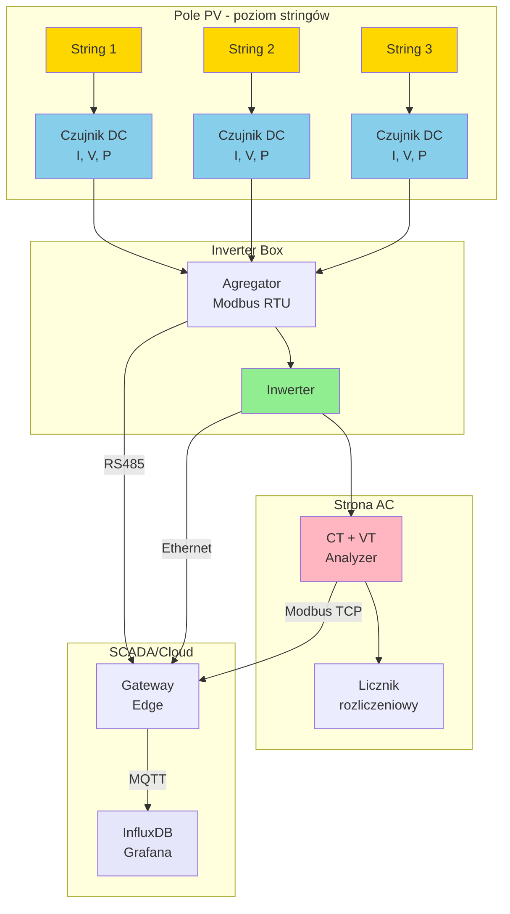
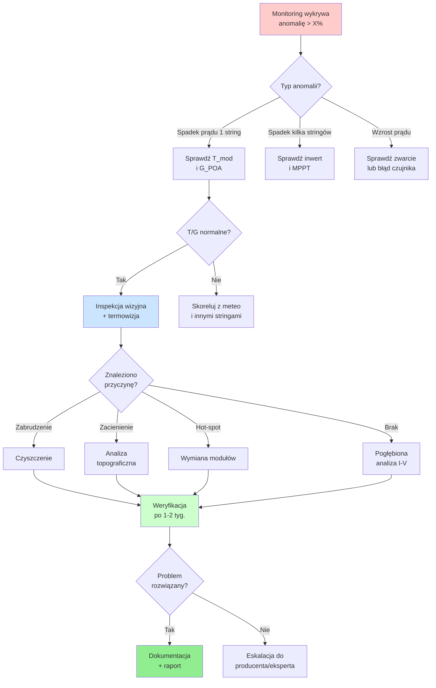

import { 
  SlideContainer, 
  Slide, 
  KeyPoints, 
  SupportingDetails, 
  InstructorNotes,
  VisualSeparator,
  LearningObjective,
  KeyConcept,
  Example
} from '@site/src/components/SlideComponents';
import { InteractiveQuiz } from '@site/src/components/InteractiveQuiz';

<LearningObjective>
Po tej sekcji student potrafi:
- Dobrać odpowiednie czujniki prądowo-napięciowe dla instalacji DC i AC w systemach OZE
- Zaprojektować system pomiarowy na poziomie stringów PV z uwzględnieniem wymagań bezpieczeństwa
- Zinterpretować dane pomiarowe do diagnostyki mismatch i zabrudzenia modułów
- Zidentyfikować typowe błędy montażowe i ich wpływ na wiarygodność KPI
</LearningObjective>

<SlideContainer>

<Slide title="⚡ Pomiary elektryczne: zakres i cel" type="info">

<KeyPoints title="📋 Co mierzymy?">
- **Prądy i napięcia DC**: monitoring stringów PV, baterii BESS, połączeń równoległych
- **Wielkości AC**: po stronie inwerterów (moc czynna/bierna, THD, cosφ)
- **Monitoring na poziomie stringów**: diagnostyka asymetrii, mismatch, zabrudzenia
- **Bezpieczeństwo elektryczne**: detekcja prądów upływu, przeciążeń, łuków elektrycznych (AFCI)
</KeyPoints>

<SupportingDetails title="🔧 Techniczny kontekst">

Pomiary elektryczne stanowią fundament każdego systemu monitoringu OZE. **Dlaczego są kluczowe?**

1. **Obliczanie KPI produkcyjnych**: Performance Ratio (PR), Availability, Specific Yield wymaga precyzyjnych danych o energii wytworzonej. Błąd pomiaru ±2% przekłada się bezpośrednio na niepewność PR, co w kontekście gwarancji PPA może prowadzić do sporów z inwestorem.

2. **Szybka diagnostyka**: Monitoring na poziomie stringów umożliwia lokalizację problemu w ciągu godzin, a nie tygodni. W instalacji 1 MWp (około 40-50 stringów) brak granularnego pomiaru oznacza, że straty z jednego uszkodzonego stringa (np. -20% mocy) zostają rozmyte w całkowitej produkcji i mogą pozostać niezauważone przez miesiące.

3. **Integracja z infrastrukturą**: Dane pomiarowe muszą być kompatybilne z BMS (Battery Management System), systemami SCADA i protokołami energetyki (IEC 61850). Wymaga to odpowiednich przetworników z interfejsami Modbus RTU/TCP, IEC 60870-5-104 lub OPC UA.

4. **Normy bezpieczeństwa**: Kategorie pomiarowe CAT III (rozdzielnice budynkowe) i CAT II (obwody wtórne) definiują wymagania izolacji i ochrony. W instalacjach PV napięcia DC sięgają 1500 V, co stawia wysokie wymogi dla sprzętu pomiarowego.

</SupportingDetails>

<InstructorNotes>
Podkreśl związek jakości pomiarów z wiarygodnością KPI (PR, Availability).

**Czas**: 12-15 min

**Przebieg**:
1. Wprowadzenie do pomiarów elektrycznych (3 min)
2. Omówienie wielkości mierzonych DC/AC (4 min)
3. Dyskusja o wpływie na KPI (3 min)
4. Przedstawienie studium przypadku błędu pomiarowego (3 min)
5. Q&A (2 min)

**Punkty kluczowe**:
- Różnica między pomiarem na poziomie inwertera vs. pomiarem stringowym
- CAT III/IV jako wymóg dla pomiarów po stronie DC w farmach PV
- Typowe błędy: niewłaściwa konfiguracja przekładników (CT ratio), brak kalibracji
- Koszt: czujnik stringowy (DC Hall) ~50-150 EUR vs. koszt niedetekcji awarii ~500-2000 EUR/rok

**Pytania studenckie**:
- Q: Czy w małej instalacji (10 kW) opłaca się monitoring stringowy?
- A: Ekonomia jest wątpliwa, ale dla celów demonstracyjnych/badawczych – tak. W praktyce stosuje się monitoring na poziomie MPPT.

- Q: Jak często kalibrować czujniki?
- A: Rekomendacja: weryfikacja co 2 lata dla instalacji komercyjnych, co 5 lat dla pomiarów nierozliczeniowych.

</InstructorNotes>

</Slide>

<VisualSeparator type="technical" />

<Slide title="🏗️ Architektura systemu pomiarowego" type="info">

### Struktur łańcucha pomiarowego

**Kluczowe decyzje projektowe:**

- **Granularność pomiaru DC**: String-level vs. combiner-level vs. tylko inwerter. Wybór zależy od wielkości instalacji i budżetu. Farmy &gt;500 kWp: monitoring stringowy dla 10-30% stringów (próbkowanie reprezentatywne).

- **Częstotliwość próbkowania**: Pomiary DC – typowo 1-10 s (zależnie od dynamiki), AC – 1 s lub ciągły monitoring mocy (RMS).

- **Redundancja**: W instalacjach krytycznych (szpitale, data center) stosuje się dublowane systemy pomiarowe z różnych producentów.

<Example title="Instalacja 100 kWp - projekt systemu pomiarowego">

**Parametry:**
- 8 stringów × 12 modułów (400 Wp), U_oc ≈ 500 V, I_sc ≈ 11 A
- 2 inwertery 50 kW (po 4 stringi każdy)

**Rozwiązanie:**
- **Czujniki DC**: 8× przetwornik Halla (0-15 A, ±0.5%), zamontowane w DC combiner box
- **Pomiar AC**: 2× analizator sieci (z CT 100A/5A), komunikacja Modbus TCP
- **Gateway**: Raspberry Pi z Node-RED, agregacja danych → InfluxDB
- **Alert**: spadek mocy stringa &gt;15% przez &gt;10 min → e-mail + SMS

**Koszt**: ~2500 EUR (bez pracy), ROI ~3 lata (oszczędności z wczesnej detekcji awarii)

</Example>

</Slide>

<Slide title="🔌 Czujniki i metody pomiaru" type="tip">

<KeyPoints title="📋 Dobór czujników - przegląd technologii">

**Pomiary prądu DC:**
- **Boczniki precyzyjne (shunt resistors)**: Rezystory o niskiej wartości (50-100 mΩ), pomiar spadku napięcia. Zalety: tanie, liniowe. Wady: straty mocy, brak izolacji galwanicznej.
- **Przetworniki Halla (Hall effect sensors)**: Pomiar indukcji magnetycznej wokół przewodnika. Zalety: izolacja galwaniczna, zerowy spadek napięcia. Wady: dryft temperaturowy (~0.1%/°C), offset.
- **Przekładniki DC (DCCT)**: Technologia flux-gate z kompensacją, klasa 0.1-0.5%. Stosowane w pomiarach referencyjnych i rozliczeniowych.

**Pomiary prądu AC:**
- **CT (Current Transformers)**: Klasyczne przekładniki prądowe, stosunek np. 100:5 A. Wymagana dokładna znajomość obciążenia wtórnego.
- **Cęgi Rogowskiego**: Cewka giętka, montaż bez przerywania obwodu. Szerokie pasmo (DC – 1 MHz), idealne dla THD.

**Pomiary napięcia:**
- **Dzielniki rezystancyjne**: Dla niskonapięciowych pomiarów DC (&lt;100 V)
- **Izolowane przetworniki różnicowe**: Dla wysokich napięć DC PV (do 1500 V), izolacja &gt;3 kV

</KeyPoints>

<SupportingDetails title="🧪 Wymagania techniczne i bezpieczeństwo">

### Parametry kluczowe przy wyborze czujników:

**1. Pasmo i częstotliwość próbkowania**
- Pomiary DC statyczne: 0.1-1 Hz wystarczające
- Analiza przejściowych (cloud transients): min. 10 Hz
- Harmoniczne AC (do 50. harmonicznej): min. 2.5 kHz

**2. Klasa dokładności**
- Rozliczenia: klasa 0.2S (±0.2% w zakresie 1-100% In)
- Monitoring produkcji: klasa 0.5-1.0 akceptowalna
- R&D / weryfikacja modeli: klasa 0.1 lub lepsza

**3. Izolacja galwaniczna i EMC**
- Napięcia &gt;120 V DC: obowiązkowa izolacja ≥2.5 kV
- Odporność na EMI/RFI (IEC 61326) w środowisku inwerterów (wysokoczęstotliwościowe zakłócenia z PWM)

**4. Dryft termiczny i kalibracja**
- Dryft zera: &lt;50 mA dla czujników ±15 A (Hall)
- Dryft wzmocnienia: &lt;0.05%/°C
- **Kalibracja**: zalecane co 2 lata, obowiązkowe dla pomiarów rozliczeniowych

**5. Bezpieczeństwo pożarowe w instalacjach DC:**
- **SPD (Surge Protection Devices)**: ochrona przed przepięciami (pioruny, komutacje)
- **DC-switch/circuit breakers**: wyłączniki zdolne do gaszenia łuku DC (trudniejsze niż AC!)
- **Separacja tras kablowych**: +DC i -DC w oddzielnych korytkach (zapobiega pożarom od zwarć izolacji)
- **Systemy detekcji łuku (AFCI)**: obowiązkowe w USA (NEC 690.11), rekomendowane w EU

:::caution Uwaga: Złącza DC jako źródło ryzyka
Według statystyk branżowych (Fraunhofer ISE, 2021) około 30% awarii pożarowych w instalacjach PV wynika z błędów w złączach DC (MC4, złącza kombinerów). Typowe przyczyny:
- Niedostateczne dokręcenie/zaprasowanie → wzrost rezystancji → przegrzanie
- Zanieczyszczenie podczas montażu → ścieżki upływu
- Działanie UV i wilgoci → degradacja uszczelek

**Rekomendacja**: Pomiary termowizyjne raz na 2 lata, monitoring prądów upływu, przegląd wszystkich połączeń DC podczas inspekcji rocznych.
:::

</SupportingDetails>

<InstructorNotes>

**Czas**: 18-20 min (to kluczowa sekcja techniczna)

**Przebieg**:
1. Przegląd technologii czujników (6 min) – użyj przykładowych urządzeń (jeśli dostępne) lub zdjęć
2. Omówienie parametrów wyboru (5 min) – wskaż na trade-offs (cena vs. dokładność)
3. Bezpieczeństwo DC i AFCI (5 min) – pokaż film lub zdjęcia uszkodzonych złącz MC4
4. Dyskusja: doświadczenia studentów z pracami przy DC (2 min)
5. Q&A (2 min)

**Punkty kluczowe**:
- **Demonstracja praktyczna**: Pokaż różnicę w montażu CT vs. cęgów Rogowskiego
- Podkreśl, że w instalacjach &gt;100 kW monitorowane są WSZYSTKIE stringi (wymóg ubezpieczenia/O&M)
- Zwróć uwagę na koszty: bocznik ~5 EUR, Hall izolowany ~40-80 EUR, DCCT ref. ~500-1500 EUR

**Typowe błędy studenckie**:
- Myślenie, że czujnik Halla nie wymaga kalibracji (offset dryfuje!)
- Ignorowanie kategorii pomiarowych CAT – ryzyko życia przy błędnym sprzęcie
- Zakładanie, że każdy CT można używać z dowolnym obciążeniem wtórnym

**Materiały pomocnicze**:
- Datasheet czujnika LEM HLSR 20-P (Hall, ±20 A)
- Przykład raportu kalibracji czujników (format PDF)
- Link do webinaru Fraunhofer ISE o pożarach DC

**Pytania studenckie**:
- Q: Dlaczego nie stosuje się boczników w instalacjach &gt;100 V DC?
- A: Można, ale tylko po stronie "zimnej" (low-side), z izolowanym pomiarem napięcia. Ryzyko porażenia przy dotknięciu bocznika w torze +DC pod pełnym napięciem względem ziemi.

- Q: Czy przetworniki Halla działają dla prądu AC?
- A: Tak, ale mają offset DC i dryft. Dla AC lepsze są CT lub cęgi Rogowskiego.

</InstructorNotes>

</Slide>

<VisualSeparator type="technical" />

<Slide title="📊 Porównanie technologii czujników prądu" type="info">

### Tabela porównawcza

| Technologia | Zakres typowy | Dokładność | Izolacja | Pasmo | Koszt | Zastosowanie |
|-------------|---------------|------------|----------|-------|-------|--------------|
| **Bocznik precyzyjny** | 1-100 A | ±0.1-0.5% | ❌ Nie | DC-100 kHz | € | Niskie napięcia, laboratoria |
| **Hall DC (kompensowany)** | 5-500 A | ±0.5-1% | ✅ 2-3 kV | DC-50 kHz | €€ | PV stringi, BESS |
| **DCCT (flux-gate)** | 10-2000 A | ±0.05-0.2% | ✅ 3-5 kV | DC-10 kHz | €€€€ | Pomiary referencyjne, rozliczenia |
| **CT (klasyczny)** | 5-5000 A | ±0.2-1% | ✅ 3 kV | 50 Hz-10 kHz | €€ | Inwertery, rozdzielnie AC |
| **Cęgi Rogowskiego** | 10-10000 A | ±0.5-2% | ✅ 1 kV | 0.1 Hz-1 MHz | €€€ | THD, surge, wielkie prądy |

:::tip Kluczowa zasada wyboru
**DC + wysokie napięcie → Hall lub DCCT (bezwzględna izolacja!)**  
**AC + analiza harmonicznych → Rogowski**  
**AC + rozliczenia → CT klasy 0.2S**  
**Laboratorium + precyzja → Bocznik + izolowany woltomierz różnicowy**
:::

<KeyConcept title="Trade-off: dokładność vs. koszt vs. łatwość montażu">

W projektowaniu systemu pomiarowego zawsze balansujemy trzy czynniki:

1. **Dokładność**: Czy potrzebujemy ±0.1% (rozliczenia), czy wystarczy ±1% (diagnostyka)?
2. **Koszt**: Budżet 50 EUR/string vs. 500 EUR/string radykalnie zmienia architekturę
3. **Łatwość montażu/serwisu**: Cęgi Rogowskiego = montaż bez przerywania obwodu, CT = wymaga przełożenia przewodu

**Przykład decyzji**: W farmie 1 MWp (50 stringów) zamiast monitorować wszystkie stringi (50 × 80 EUR = 4000 EUR), stosujemy monitoring 10 reprezentatywnych (800 EUR) + całościowy pomiar na inwerterach. Oszczędność 3200 EUR, akceptowalny trade-off dla diagnostyki.

</KeyConcept>

</Slide>

<VisualSeparator type="default" />

<Slide title="📈 Studium przypadku: Diagnostyka stringów PV" type="success">

<KeyPoints title="📋 Kontekst instalacji">

**Farma PV 500 kWp, Dolny Śląsk (2022)**
- 24 stringi PV (po 21 modułów 400 Wp)
- Napięcie stringów: U_oc ≈ 840 V, U_mpp ≈ 700 V
- System monitoringu: czujniki Hall (±0.5%) na każdym stringu
- Zbieranie danych: 10 s, agregacja 5 min w InfluxDB

</KeyPoints>

<SupportingDetails title="🔍 Przebieg diagnozy">

### Faza 1: Detekcja anomalii (luty 2022)

Dashboard Grafana pokazał **3 stringi (S07, S14, S19)** z produkcją prądu niższą o 18-25% względem pozostałych 21 stringów w tej samej sekcji.

**Szczegóły**:
- Warunki: jasne słońce, G_POA = 850 W/m², T_amb = 5°C
- Pozostałe 21 stringów: I_dc = 10.2-10.5 A (mediana 10.3 A)
- Stringi outlier: S07 = 8.4 A (-18%), S14 = 7.8 A (-24%), S19 = 8.2 A (-20%)

### Faza 2: Weryfikacja (inspekcja wizyjna)

Technik serwisowy wykonał inspekcję z użyciem:
- Termowizja FLIR (wykrycie hot-spots)
- Pomiar krzywych I-V za pomocą przenośnego testera
- Oględziny fizyczne

**Wyniki**:
- **S07**: Silne zabrudzenie (ptaki, liście) na 8 z 21 modułów → −18% irradiancji lokalnej
- **S14**: Zacienienie od rosnącej zieleni (drzewa) w godzinach 10-12 → bypass diodes aktywne, straty mocy
- **S19**: Hot-spot na 2 modułach (temperature &gt;85°C) → podejrzenie uszkodzenia diod bypass

### Faza 3: Interwencja (marzec 2022)

- **S07**: Czyszczenie mechaniczne modułów (koszt: 200 EUR)
- **S14**: Przycięcie drzew (umowa z zarządcą terenu, koszt: 500 EUR)
- **S19**: Wymiana 2 uszkodzonych modułów (koszt: 2×350 EUR = 700 EUR, w ramach gwarancji producenta)

### Faza 4: Weryfikacja efektu (kwiecień 2022)

Po miesiącu od interwencji:
- **S07**: Powrót do normy (10.2 A, +21% względem lutego)
- **S14**: Poprawa do 10.0 A (+28%), ale wciąż lekko poniżej (pozostałe zacienienie o wschodzie)
- **S19**: Pełny powrót (10.4 A, +27%)

**Łączny wzrost produkcji farmy: +3.8% (średnia z marca-grudnia)**  
**Zwrot z monitoringu**: System stringowy kosztował 2400 EUR (24 × 100 EUR), wykrył straty ok. 15 MWh/rok (wartość ~2250 EUR przy 0.15 EUR/kWh). **ROI: 1.1 roku.**

</SupportingDetails>

<Example title="Schemat decyzyjny dla diagnostyki stringów">

**Progi alertów (typowe wartości)**:
- Minor alert: spadek &gt;10% przez &gt;1 godz. przy dobrych warunkach
- Major alert: spadek &gt;20% przez &gt;30 min
- Critical: spadek &gt;50% lub wzrost prądu &gt;120% (możliwe zwarcie)

</Example>

<InstructorNotes>

**Czas**: 10-12 min

**Przebieg**:
1. Przedstawienie studium przypadku na slajdzie (4 min)
2. Wyświetlenie rzeczywistych wykresów z Grafany (jeśli dostępne) lub symulacja (2 min)
3. Dyskusja: Jak studenci podeszliby do diagnozy? (3 min)
4. Omówienie schematu decyzyjnego (2 min)
5. Podsumowanie ROI monitoringu (1 min)

**Punkty kluczowe**:
- Podkreśl wartość **granularnego monitoringu** – bez pomiaru na poziomie stringów problem mógłby pozostać niezauważony przez całe lato
- Zwróć uwagę na **czas reakcji**: od detekcji (luty) do interwencji (marzec) – w dobrze zarządzanej instalacji to 2-4 tygodnie
- ROI monitoringu: w tym przypadku 1 rok, ale zależy od wielkości instalacji i cen energii

**Materiały pomocnicze**:
- Przykładowe dashboard Grafana z alertami stringowymi (screenshot lub live demo)
- Zdjęcia z inspekcji (zabrudzenie, zacienienie, termowizja hot-spota)
- Raport z analizy I-V (PDF)

**Pytania studenckie**:
- Q: Czy 10% spadek to dużo? Czy to nie naturalna zmienność?
- A: Dla pojedynczego stringa przy jednoczesnym normalnym działaniu innych – tak, to anomalia. Naturalna zmienność między stringami to max. ±2-3% (różnice w modułach, temperaturze).

- Q: Czy można zautomatyzować proces diagnostyki?
- A: Częściowo – algorytmy (np. CUSUM, Isolation Forest) mogą automatycznie wykrywać anomalie. Ale wizualizacja i decyzja o interwencji wymaga człowieka (na razie).

</InstructorNotes>

</Slide>

<VisualSeparator type="default" />

<Slide title="📝 Quiz: Pomiary elektryczne" type="info">

<InteractiveQuiz 
  questions={[
    {
      question: "Jaką technologię czujnika prądu DC należy zastosować w stringu PV o napięciu U_oc = 1200 V?",
      options: [
        "Bocznik precyzyjny bez izolacji",
        "Przetwornik Halla z izolacją ≥2.5 kV",
        "CT klasyczny 100:5 A",
        "Woltomierz cyfrowy z dzielnikiem"
      ],
      correctAnswer: 1,
      explanation: "Przy napięciach &gt;120 V DC obowiązkowa jest izolacja galwaniczna ≥2.5 kV. Przetwornik Halla spełnia ten wymóg. Bocznik bez izolacji stwarza ryzyko porażenia, CT działa tylko na AC, a woltomierz mierzy napięcie, nie prąd."
    },
    {
      question: "Instalacja PV 1 MWp (50 stringów) ma budżet monitoringu 1500 EUR. Jaka strategia jest NAJBARDZIEJ ekonomiczna?",
      options: [
        "Monitoring wszystkich 50 stringów czujnikami po 30 EUR (łącznie 1500 EUR)",
        "Monitoring 15 reprezentatywnych stringów czujnikami po 80 EUR + całościowy pomiar na inwerterach (1200 EUR + 300 EUR)",
        "Tylko pomiar całościowy na inwerterach (300 EUR) i oszczędność 1200 EUR",
        "Monitoring co drugiego stringa (25 stringów × 60 EUR = 1500 EUR)"
      ],
      correctAnswer: 1,
      explanation: "Opcja 2 daje najlepszy balans: monitoring reprezentatywnych stringów (15 z 50 to 30%, wystarczające do detekcji systematycznych problemów) + pomiar całościowy pozwala na bilans energetyczny. Opcja 1 (tanie czujniki) może prowadzić do niskiej jakości danych. Opcja 3 nie daje granularności diagnostycznej. Opcja 4 jest mniej efektywna niż celowy dobór reprezentatywnych stringów."
    },
    {
      question: "Czujnik Halla w stringu PV pokazuje prąd 8.5 A, podczas gdy pozostałe stringi mają 10.0 A (G_POA = 900 W/m², T_mod = 45°C). Co robisz NAJPIERW?",
      options: [
        "Natychmiastowa wymiana czujnika",
        "Sprawdzenie krzywej I-V stringa przenośnym testerem",
        "Weryfikacja, czy czujnik był kalibrowany w ostatnich 2 latach",
        "Czekanie 7 dni na potwierdzenie trendu"
      ],
      correctAnswer: 2,
      explanation: "Pierwszy krok to weryfikacja, czy anomalia jest rzeczywista, czy artefakt pomiaru. Sprawdzenie kalibracji/stanu czujnika (offset dryfuje!) jest najszybsze i nieinwazyjne. Dopiero jeśli czujnik jest OK, przechodzimy do testów I-V. Wymiana czujnika bez diagnozy to strata czasu i pieniędzy. Czekanie 7 dni to utrata produkcji."
    },
    {
      question: "Co oznacza kategoria pomiarowa CAT III w kontekście instalacji PV?",
      options: [
        "Pomiary w obwodach niskonapięciowych &lt;50 V",
        "Pomiary w rozdzielnicach budynkowych i instalacjach DC &gt;120 V",
        "Pomiary tylko dla urządzeń laboratoryjnych",
        "Pomiary harmonicznych i jakości energii"
      ],
      correctAnswer: 1,
      explanation: "CAT III dotyczy pomiarów w stałych instalacjach, rozdzielnicach głównych i obwodach DC &gt;120 V (typowe dla PV). Wymaga wzmocnionej izolacji i ochrony przed przepięciami. CAT II to urządzenia końcowe, CAT IV to pomiary bezpośrednio na przyłączu energetycznym."
    },
    {
      question: "Według statystyk Fraunhofer ISE, jaki procent pożarów w instalacjach PV wynika z błędów w złączach DC?",
      options: [
        "~5%",
        "~15%",
        "~30%",
        "~60%"
      ],
      correctAnswer: 2,
      explanation: "Około 30% pożarów w instalacjach PV ma źródło w złączach DC (MC4, kombinery). Przyczyny to niedokręcenie, zanieczyszczenie, degradacja UV/wilgoć. Stąd kluczowa rola inspekcji termowizyjnych i monitoringu prądów upływu."
    }
  ]}
/>

:::tip Rekomendacja po quizie
Jeśli uzyskałeś &lt;80% poprawnych odpowiedzi, przejrzyj ponownie sekcje o doborze czujników i bezpieczeństwie DC. Zrozumienie trade-off'ów (dokładność, koszt, bezpieczeństwo) jest kluczowe dla projektowania systemów monitoringu.
:::

</Slide>

</SlideContainer>

---

## Podsumowanie i wnioski

**Kluczowe punkty z tej sekcji:**

1. **Pomiary elektryczne to fundament monitoringu OZE** – bez wiarygodnych danych o prądzie i napięciu nie ma sensownych KPI (PR, Availability).

2. **Granularność ma znaczenie** – monitoring na poziomie stringów pozwala wykryć problemy niewidoczne w pomiarach całościowych. ROI systemu stringowego to typowo 1-3 lata.

3. **Bezpieczeństwo DC jest kluczowe** – wysokie napięcia (do 1500 V), trudność gaszenia łuku, ryzyko pożarów. Wymagana izolacja ≥2.5 kV, kategorie pomiarowe CAT III/IV, regularne inspekcje złącz.

4. **Trade-off dokładność vs. koszt vs. łatwość montażu** – boczniki są tanie, ale niebezpieczne przy wysokich napięciach; Hall to dobry kompromis; DCCT dla pomiarów referencyjnych.

5. **Diagnostyka wymaga systematycznego podejścia** – detekcja anomalii → weryfikacja warunków (T, G) → inspekcja wizyjna → interwencja → weryfikacja efektu.

**Następne kroki:**
- Ćwiczenie 1: Zaprojektuj system pomiarowy dla instalacji 50 kWp (dobór czujników, budżet, komunikacja)
- Przygotowanie do następnej sekcji: Irradiancja i temperatura (czujniki meteorologiczne i ich wpływ na KPI)

