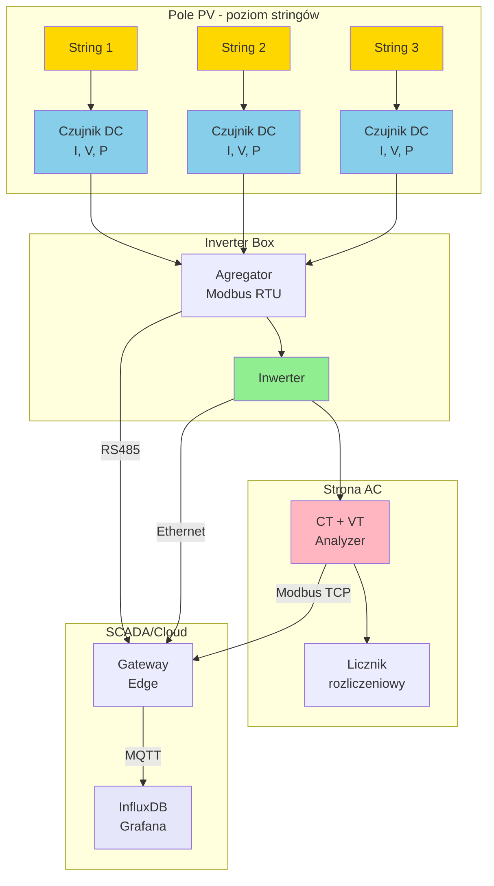
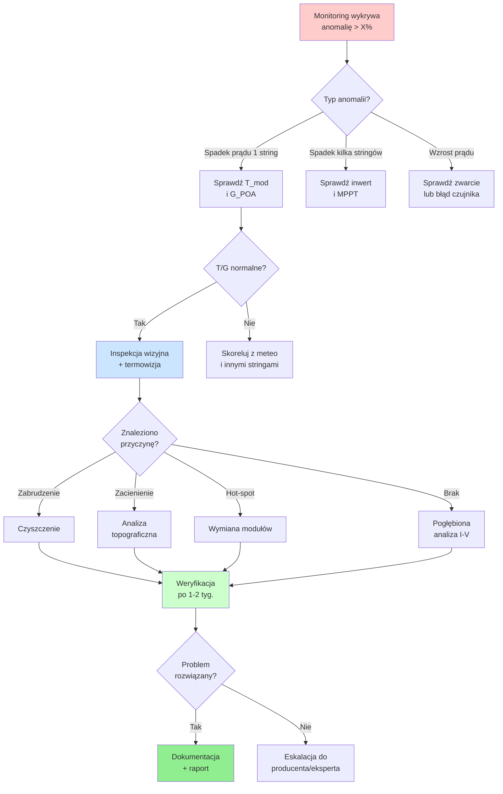

import { 
  SlideContainer, 
  Slide, 
  KeyPoints, 
  SupportingDetails, 
  InstructorNotes,
  VisualSeparator,
  LearningObjective,
  KeyConcept,
  Example
} from '@site/src/components/SlideComponents';
import { InteractiveQuiz } from '@site/src/components/InteractiveQuiz';

<LearningObjective>
Po tej sekcji student potrafi:
- Dobrać odpowiednie czujniki prądowo-napięciowe dla instalacji DC i AC w systemach OZE
- Zaprojektować system pomiarowy na poziomie stringów PV z uwzględnieniem wymagań bezpieczeństwa
- Zinterpretować dane pomiarowe do diagnostyki mismatch i zabrudzenia modułów
- Zidentyfikować typowe błędy montażowe i ich wpływ na wiarygodność KPI
</LearningObjective>

<SlideContainer>

<Slide title="⚡ Pomiary elektryczne: zakres i cel<" type="info">

<KeyPoints title="📋 Co mierzymy?">
- **Prądy i napięcia DC**: monitoring stringów PV, baterii BESS, połączeń równoległych
- **Wielkości AC**: po stronie inwerterów (moc czynna/bierna, THD, cosφ)
- **Monitoring na poziomie stringów**: diagnostyka asymetrii, mismatch, zabrudzenia
- **Bezpieczeństwo elektryczne**: detekcja prądów upływu, przeciążeń, łuków elektrycznych (AFCI)
</KeyPoints>

<SupportingDetails title="🔧 Dlaczego pomiary są kluczowe?">

**Obliczanie KPI produkcyjnych**: Performance Ratio (PR), Availability, Specific Yield wymaga precyzyjnych danych o energii wytworzonej. Błąd pomiaru ±2% przekłada się bezpośrednio na niepewność PR, co w kontekście gwarancji PPA może prowadzić do sporów z inwestorem.

**Szybka diagnostyka**: Monitoring na poziomie stringów umożliwia lokalizację problemu w ciągu godzin, a nie tygodni. W instalacji 1 MWp (około 40-50 stringów) brak granularnego pomiaru oznacza, że straty z jednego uszkodzonego stringa (np. -20% mocy) zostają rozmyte w całkowitej produkcji i mogą pozostać niezauważone przez miesiące.

</SupportingDetails>

<InstructorNotes>

Ten slajd wprowadza fundamenty – **bez dobrych pomiarów elektrycznych cały system monitoringu traci sens**. Zacznij od prostego pytania: co się stanie, jeśli Performance Ratio pokazuje 85%, ale pomiar energii ma błąd ±3%? Czyli nie wiemy, czy rzeczywisty PR wynosi 82%, 85%, czy 88%. Jeśli pomiary są niedokładne, można błędnie ocenić, że instalacja nie spełnia warunków gwarancji (lub odwrotnie — że działa dobrze, choć w rzeczywistości ma usterki). Czyli: gwarancje w umowie PPA mogą być zakwestionowane, a to oznacza spory prawne i straty finansowe.

**Kluczowy przekaz**: granularność pomiarów ma wartość ekonomiczną. W instalacji 1 MWp z pięćdziesięcioma stringami, jeśli mierzymy tylko na poziomie inwertera, jeden uszkodzony string to zaledwie -2% całkowitej mocy – zginie w szumie. Przy pomiarze stringowym widzimy problem od razu.

Typowy błąd montażowy: źle ustawiony współczynnik przekładni w przekładniku prądowym. CT ratio 100:5 A skonfigurowany jako 100:1 A da pięciokrotnie zaniżone odczyty – i nikt tego nie zauważy przez miesiące, dopóki nie pojawi się audyt.

Całość tego slajdu to około pięć do siedmiu minut. Przejdź szybko do następnego, który omawia integrację i normy bezpieczeństwa.

</InstructorNotes>

</Slide>

<VisualSeparator type="default" />

<Slide title="🔌 Integracja i normy bezpieczeństwa" type="info">

<KeyPoints title="📋 Wymagania systemowe">
- **Integracja z infrastrukturą**: Dane pomiarowe muszą być kompatybilne z BMS, systemami SCADA i protokołami energetyki (IEC 61850)
- **Interfejsy komunikacyjne**: Przetworniki z Modbus RTU/TCP, IEC 60870-5-104 lub OPC UA
- **Normy bezpieczeństwa**: Kategorie pomiarowe CAT III (rozdzielnice) i CAT II (obwody wtórne)
- **Wymagania PV**: Napięcia DC do 1500 V stawiają wysokie wymogi dla izolacji sprzętu pomiarowego
</KeyPoints>

<InstructorNotes>

Kontynuacja poprzedniego slajdu – teraz przechodzimy do aspektów integracyjnych i bezpieczeństwa.

Zwróć uwagę na kategorie pomiarowe. **CAT III i CAT IV to nie tylko symbole na obudowie** – to wymogi bezpieczeństwa przy napięciach do 1500 V w instalacjach fotowoltaicznych. Studenci często tego nie doceniają, więc warto pokazać zdjęcie uszkodzonego czujnika bez odpowiedniej izolacji.

Podkreśl znaczenie właściwych interfejsów komunikacyjnych. **Modbus to standard przemysłowy**, ale nowsze instalacje coraz częściej stosują OPC UA dla lepszej interoperacyjności i bezpieczeństwa.

Jeśli ktoś zapyta o sens monitoringu stringowego w małych instalacjach (10 kW), odpowiedź jest prosta: **ekonomicznie się nie zwraca**, ale do celów badawczych lub demonstracyjnych – jak najbardziej. W praktyce przemysłowej stosujemy monitoring na poziomie MPPT inwertera, to wystarczy.

Co do kalibracji – **weryfikacja co dwa lata dla instalacji komercyjnych**, co pięć lat dla nierozliczeniowych. To nie fanaberia, tylko standard utrzymania wiarygodności danych.

Ten slajd to około pięć do sześciu minut. Zostaw czas na pytania – doświadczenie pokazuje, że studenci chcą dyskutować o kosztach czujników (Hall DC to 50-150 EUR) versus kosztach niewykrytej awarii (500-2000 EUR rocznie strat produkcji).

</InstructorNotes>

</Slide>

<VisualSeparator type="technical" />

<Slide title="🏗️ Architektura systemu pomiarowego<" type="info">

### Struktur łańcucha pomiarowego

**Kluczowe decyzje projektowe:**

- **Granularność pomiaru DC**: String-level vs. combiner-level vs. tylko inwerter. Wybór zależy od wielkości instalacji i budżetu. Farmy &gt;500 kWp: monitoring stringowy dla 10-30% stringów (próbkowanie reprezentatywne).

- **Częstotliwość próbkowania**: Pomiary DC – typowo 1-10 s (zależnie od dynamiki), AC – 1 s lub ciągły monitoring mocy (RMS).

- **Redundancja**: W instalacjach krytycznych (szpitale, data center) stosuje się dublowane systemy pomiarowe z różnych producentów.

<InstructorNotes>

Diagram architektury to kluczowy slajd – poświęć około sześć do ośmiu minut na szczegółowe omówienie przepływu danych.

**Rozpocznij od lewej strony diagramu** – pole fotowoltaiczne. Trzy stringi (w rzeczywistości byłoby ich więcej, ale dla czytelności pokazujemy trzy). Każdy string ma dwanaście modułów. **Czujniki DC mierzą prąd, napięcie i moc** bezpośrednio przy wyjściu każdego stringa. To poziom najbardziej granularny – widzimy, co dzieje się z każdym stringiem osobno.

Przejdź do środka – **Inverter Box** (skrzynka przyinwerterowa). Czujniki komunikują się przez Modbus RTU (to popularny protokół przemysłowy, RS-485 fizycznie) z agregatorem danych. Agregator zbiera pomiary ze wszystkich stringów i przekazuje je dalej. **Dlaczego agregator? Bo inwerter ma ograniczoną liczbę wejść komunikacyjnych** – łatwiej podłączyć jeden agregator niż dziesiątki czujników bezpośrednio.

Po prawej stronie mamy **stronę zmiennoprądową** – wyjście z inwertera. Tutaj stosujemy przekładniki prądowe CT (current transformers) plus przekładniki napięciowe VT (voltage transformers) podłączone do analizatora sieci. To urządzenie mierzy moc czynną, bierną, współczynnik mocy cosφ, harmoniczne THD (total harmonic distortion). Dalej jest licznik rozliczeniowy – to urządzenie legalizowane, certyfikowane, bo na jego podstawie rozliczamy energię z operatorem sieci.

Na górze diagram pokazuje **SCADA i chmurę**. Agregator stringowy wysyła dane przez RS-485 do gateway (bramki brzegowej – edge gateway). Inwerter komunikuje się przez Ethernet. Analizator sieci przez Modbus TCP. Gateway zbiera wszystko i przesyła protokołem MQTT (message queuing telemetry transport – lekki protokół do IoT) do bazy danych InfluxDB i systemu wizualizacji Grafana w chmurze.

**Kluczowe decyzje projektowe** – to trzeba podkreślić wyraźnie. **Granularność pomiaru**: czy mierzymy każdy string osobno (string-level), czy grupę stringów w combiner box (combiner-level), czy tylko całość na inwerterze? Odpowiedź zależy od rozmiaru instalacji i budżetu. W farmach powyżej pięciuset kilowatów typowo monitorujemy dziesięć do trzydziestu procent stringów reprezentatywnie zamiast wszystkich – to kompromis między kosztem a użytecznością diagnostyczną.

**Częstotliwość próbkowania**: pomiary DC co jedną do dziesięciu sekund, pomiary zmiennoprądowe co sekundę lub ciągłe (RMS – root mean square, wartość skuteczna). Dlaczego różne częstotliwości? Bo strona DC zmienia się wolniej (chmury przesuwają się w minutach), strona zmiennoprądowa ma szybsze transjenty przy załączaniu obciążeń.

**Redundancja** – w instalacjach krytycznych (szpitale z panelami PV, centra danych) stosuje się podwójne systemy pomiarowe od różnych producentów. Dlaczego od różnych? Bo błąd systematyczny w firmware jednego producenta nie pojawi się u drugiego – to zabezpieczenie przed "common mode failure".

Pytania studentów często dotyczą kosztów. Odpowiedź: czujnik Hall DC to pięćdziesiąt do stu pięćdziesięciu euro, agregator Modbus to dwieście do pięciuset euro, gateway edge to trzysta do tysiąca euro zależnie od możliwości. W instalacji pięćdziesięciu stringów pełny monitoring to około pięć do dziesięć tysięcy euro. Czy się opłaca? Jeśli wykryjesz jedną awarię rocześniej – tak.

</InstructorNotes>

</Slide>

<VisualSeparator type="default" />

<Slide title="💼 Przykład: Projekt systemu 100 kWp<" type="success">

<Example title="Instalacja 100 kWp - kompletny projekt pomiarowy">

**Parametry instalacji:**
- 8 stringów × 12 modułów (400 Wp), U_oc ≈ 500 V, I_sc ≈ 11 A
- 2 inwertery 50 kW (po 4 stringi każdy)

**Rozwiązanie techniczne:**
- **Czujniki DC**: 8× przetwornik Halla (0-15 A, ±0.5%), zamontowane w DC combiner box
- **Pomiar AC**: 2× analizator sieci (z CT 100A/5A), komunikacja Modbus TCP
- **Gateway**: Raspberry Pi z Node-RED, agregacja danych → InfluxDB
- **Alert**: spadek mocy stringa &gt;15% przez &gt;10 min → e-mail + SMS

**Ekonomia:**
- Koszt: ~2500 EUR (bez pracy)
- ROI: ~3 lata (oszczędności z wczesnej detekcji awarii)

</Example>

<InstructorNotes>

Ten slajd pokazuje konkretny przykład projektowy – około cztery do pięciu minut.

Przejdź przez parametry instalacji. **Osiem stringów to typowa konfiguracja dla dwóch inwerterów po pięćdziesiąt kilowatów**. Każdy inwerter obsługuje cztery stringi, co daje dobrą równowagę mocy.

Podkreśl dobór czujników Halla z zakresem zero do piętnastu amperów przy prądzie zwarciowym jedenaście amperów. **To daje margines bezpieczeństwa około trzydzieści procent** – czujnik nie pracuje na maksimum, co zwiększa dokładność i żywotność.

Raspberry Pi jako gateway to popularny wybór w instalacjach demonstracyjnych i małych farmach. **Node-RED upraszcza konfigurację przepływów danych** bez programowania niskopoziomowego. W większych instalacjach używa się dedykowanych bramek przemysłowych.

Kwestia kosztów: dwa i pół tysiąca euro to całkiem sporo dla instalacji stu kilowatów, ale **zwrot w trzy lata to akceptowalny biznesplan**. Główne oszczędności to wczesna detekcja awarii zamiast wielomiesięcznych strat produkcji.

</InstructorNotes>

</Slide>

<Slide title="🔌 Czujniki prądu DC – technologie" type="tip">

<KeyPoints title="📋 Pomiary prądu stałego">

**Boczniki precyzyjne (shunt resistors)**
- Rezystory o niskiej wartości (50-100 mΩ), pomiar spadku napięcia
- Zalety: tanie, liniowe | Wady: straty mocy, brak izolacji galwanicznej
- Koszt: ~5 EUR

**Przetworniki Halla (Hall effect sensors)**
- Pomiar indukcji magnetycznej wokół przewodnika
- Zalety: izolacja galwaniczna, zerowy spadek napięcia 
- Wady: dryft (~0.1%/°C), offset
- Koszt: 40-80 EUR (izolowane)

**Przekładniki DC (DCCT - flux-gate)**
- Technologia flux-gate z kompensacją, klasa 0.1-0.5%
- Stosowane w pomiarach referencyjnych i rozliczeniowych
- Koszt: 500-1500 EUR

</KeyPoints>

<InstructorNotes>

Technologie pomiaru prądu DC – poświęć około cztery do pięciu minut na tę część.

Zacznij od pokazania fizycznych czujników, jeśli masz pod ręką – **bocznik, przetwornik Halla**. Jeśli nie, użyj dobrych zdjęć.

**Bocznik** – najprostsza metoda. Rezystor małej wartości (pięćdziesiąt do stu miliomów), mierzymy spadek napięcia. Prawo Ohma: U = I × R. **Zalety: tani (pięć euro), bardzo liniowy**. Wady: straty mocy (I² R), brak izolacji galwanicznej.

Podkreśl kwestię bezpieczeństwa. **Boczniki można stosować w instalacjach powyżej stu woltów, ale tylko po stronie low-side** (zimnej, po ujemnym torze DC względem ziemi) z izolowanym pomiarem napięcia. Dotknięcie bocznika w torze plus pod pełnym napięciem względem ziemi to recepta na katastrofę – porażenie prądem.

**Przetwornik Halla** – mierzy indukcję magnetyczną wokół przewodnika. **Efekt Halla**: pole magnetyczne od prądu w przewodniku wytwarza napięcie w półprzewodniku. Zalety: izolacja galwaniczna (dwa do trzech kilowoltów), zerowy spadek napięcia (czujnik nie jest w obwodzie prądu). Wady: dryft około 0,1% na stopień Celsjusza, offset (przesunięcie zera).

Koszt: Hall izolowany to czterdzieści do osiemdziesięciu euro – to workhorse monitoringu stringów PV. **Dobra równowaga między ceną a parametrami**.

**DCCT (DC current transformer)** – technologia flux-gate z kompensacją. **Bardzo dokładny** (klasa 0.1-0.5%), stosowany w pomiarach referencyjnych i rozliczeniowych. Koszt: pięćset do tysiąca pięćset euro. **Nie kupujemy DCCT do monitorowania stringów w farmie PV** – to przesada. Ale do pomiarów laboratoryjnych lub rozliczeniowych – to standard.

</InstructorNotes>

</Slide>

<VisualSeparator type="default" />

<Slide title="🔌 Czujniki prądu AC i pomiary napięcia" type="tip">

<KeyPoints title="📋 Pomiary prądu zmiennego">

**CT (Current Transformers)**
- Klasyczne przekładniki prądowe (np. 100:5 A)
- Wymagana znajomość obciążenia wtórnego
- Montaż: przełożenie przewodu przez przekładnik
- Koszt: €€

**Cęgi Rogowskiego**
- Cewka giętka, montaż bez przerywania obwodu
- Szerokie pasmo (DC–1 MHz), idealne dla THD
- Montaż: zakładane na przewód w 5 minut
- Koszt: €€€

</KeyPoints>

<KeyPoints title="📋 Pomiary napięcia">

**Dzielniki rezystancyjne**: Do ({'<'}100 V), proste, tanie

**Przetworniki różnicowe izolowane**: Do 1500 V, izolacja &gt;3 kV, bezpieczeństwo CAT III

</KeyPoints>

<InstructorNotes>

Pomiary AC i napięcia – około trzy do czterech minut na tę część.

**Różnica w montażu CT versus cęgów Rogowskiego to świetny przykład praktyczny**. CT (current transformer) to klasyczny przekładnik prądowy – wymaga przełożenia przewodu przez rdzeń (trzeba rozłączyć obwód, wstrzymać instalację). Cęgi Rogowskiego to giętka cewka – zakładamy ją na przewód bez przerywania pracy instalacji. **Montaż w pięć minut, bez wyłączania**. To ma ogromne znaczenie podczas serwisu i modernizacji.

CT są zaprojektowane głównie dla pięćdziesięciu hertów (lub sześćdziesięciu w USA), mają wąskie pasmo. **Cęgi Rogowskiego mają szerokie pasmo** – od DC do jednego megaherca – idealne do analizy harmonicznych THD (total harmonic distortion) i szybkich transjenów.

**Pomiary napięcia**: dla niskich napięć (poniżej stu woltów) stosujemy dzielniki rezystancyjne – proste, tanie. Dla wysokich napięć DC (do tysiąc pięćset woltów w PV) potrzebujemy izolowanych przetworników różnicowych z izolacją powyżej trzech kilowoltów. **To wymóg bezpieczeństwa CAT III**.

Co do przetworników Halla przy prądzie zmiennym – technicznie działają, ale mają offset stały i dryft. **Do AC znacznie lepsze są CT lub cęgi Rogowskiego**, które są zaprojektowane pod zmienne pole magnetyczne.

</InstructorNotes>

</Slide>

<VisualSeparator type="default" />

<Slide title="📐 Parametry wyboru czujników" type="tip">

<KeyPoints title="📋 Kluczowe wymagania techniczne">

**1. Pasmo i częstotliwość próbkowania**
- Pomiary DC statyczne: 0.1-1 Hz wystarczające
- Analiza przejściowych (cloud transients): min. 10 Hz
- Harmoniczne AC (do 50. harmonicznej): min. 2.5 kHz

**2. Klasa dokładności**
- Rozliczenia: klasa 0.2S (±0.2% w zakresie 1-100% In)
- Monitoring produkcji: klasa 0.5-1.0 akceptowalna
- R&D / weryfikacja modeli: klasa 0.1 lub lepsza

**3. Izolacja galwaniczna i EMC**
- Napięcia &gt;120 V DC: obowiązkowa izolacja ≥2.5 kV
- Odporność na EMI/RFI (IEC 61326) w środowisku inwerterów

</KeyPoints>

<InstructorNotes>

Teraz przechodzimy do parametrów technicznych – około pięć do siedmiu minut na ten slajd.

**Kluczowy przekaz**: nie każdy czujnik pasuje do każdego zastosowania. Dobór zależy od wymagań aplikacji. Dla rozliczeń energii potrzebujemy klasy 0.2S, do diagnostyki wystarczy 0.5-1.0.

Podkreśl znaczenie częstotliwości próbkowania. **Typowy błąd**: próbkowanie DC co 30 sekund, a potem zdziwienie, że nie widzimy szybkich zmian od chmur. Do analizy przejściowych potrzeba minimum 10 Hz.

Izolacja galwaniczna to nie opcja przy napięciach powyżej 120 V – to wymóg bezpieczeństwa. **CAT III oznacza izolację minimum 2,5 kV**. Studenci często to lekceważą, więc warto powtórzyć.

</InstructorNotes>

</Slide>

<VisualSeparator type="default" />

<Slide title="🔥 Dryft i kalibracja czujników" type="warning">

<KeyPoints title="📋 Dryft termiczny czujników Halla">

**Parametry dryftu:**
- **Dryft zera**: &lt;50 mA dla czujników ±15 A
- **Dryft wzmocnienia**: &lt;0.05%/°C
- **Wpływ temperatury**: ~0.1%/°C → po roku błąd systematyczny

**Kalibracja:**
- Zalecane: co 2 lata dla monitoringu produkcji
- Obowiązkowe: co 1-2 lata dla rozliczeń finansowych
- Weryfikacja: porównanie z czujnikiem referencyjnym (DCCT)

</KeyPoints>

:::tip Praktyczna rada
Offset dryfuje szczególnie przy dużych zmianach temperatury (np. zima → lato). Regularny przegląd kalibracji to nie fanaberia, tylko standard utrzymania wiarygodności danych KPI.
:::

<InstructorNotes>

Kalibracja i dryft czujników – około trzy do czterech minut na tę część.

**Typowy błąd myślowy studentów**: czujnik Halla raz skalibrowany działa wiecznie. **Nieprawda – offset dryfuje, zwłaszcza przy zmianach temperatury**. Dryft to około 0,1% na stopień Celsjusza. Co to oznacza praktycznie? Jeśli czujnik pracuje w zakresie temperatur od minus dziesięciu do plus pięćdziesięciu stopni (różnica sześćdziesiąt stopni), to dryft może wynieść sześć procent. **Po roku eksploatacji możemy mieć znaczący błąd systematyczny**.

Dryft zera to mniej niż pięćdziesiąt miliamperów dla typowych czujników plus minus piętnaście amperów. Brzmi niewinnie, ale przy prądzie nominalnym dziesięć amperów to już pół procenta błędu. Dryft wzmocnienia to poniżej 0,05% na stopień – łącznie z dryftem zera daje około 0,1% na stopień.

**Kalibracja to nie opcja, to konieczność**. Dla monitoringu produkcji: zalecane co dwa lata. Dla rozliczeń finansowych (PPA, sprzedaż energii): obowiązkowe co rok do dwóch lat. Weryfikacja przez porównanie z czujnikiem referencyjnym (DCCT klasy 0.1).

W instalacjach powyżej stu kilowatów **monitorujemy wszystkie stringi** – to wymóg ubezpieczyciela i umów O&M (eksploatacja i utrzymanie, operations and maintenance). Nie ma tu oszczędności na kalibracji.

</InstructorNotes>

</Slide>

<VisualSeparator type="default" />

<Slide title="🚨 Bezpieczeństwo pożarowe DC" type="warning">

<KeyPoints title="📋 Systemy ochrony">

**Podstawowe zabezpieczenia:**
- **SPD**: ochrona przed przepięciami (pioruny, komutacje)
- **DC-switch/circuit breakers**: wyłączniki zdolne do gaszenia łuku DC
- **Separacja tras kablowych**: +DC i -DC w oddzielnych korytkach
- **AFCI**: systemy detekcji łuku (wymóg w USA, rekomendacja w EU)

</KeyPoints>

:::caution Uwaga: Złącza DC jako źródło ryzyka
Według statystyk branżowych (Fraunhofer ISE, 2021) około **30% awarii pożarowych** w instalacjach PV wynika z błędów w złączach DC (MC4, złącza kombinerów). 

**Typowe przyczyny:**
- Niedostateczne dokręcenie/zaprasowanie → wzrost rezystancji → przegrzanie
- Zanieczyszczenie podczas montażu → ścieżki upływu
- Działanie UV i wilgoci → degradacja uszczelek

**Rekomendacja**: Pomiary termowizyjne raz na 2 lata, monitoring prądów upływu, przegląd wszystkich połączeń DC podczas inspekcji rocznych.
:::

<InstructorNotes>

Bezpieczeństwo pożarowe DC – około trzy do czterech minut, z naciskiem na aspekty praktyczne.

**Pokaż zdjęcia uszkodzonych złącz MC4** lub, jeśli masz dostęp, krótki film z testu łuku elektrycznego. To ma silny wpływ wizualny na studentów – bardziej zapamiętają niż suche dane.

**Trzydzieści procent pożarów w fotowoltaice to wina złącz DC** – według statystyk Fraunhofer ISE z dwa tysiące dwudziestego pierwszego roku. Przyczyny: niedokręcone złącza (wzrost rezystancji kontaktu, przegrzanie), zabrudzone podczas montażu (ścieżki upływu), degradacja od UV i wilgoci (uszczelek i izolacji).

**SPD** (surge protective devices) to ochrona przed przepięciami od piorunów i komutacji. **DC-switch** – wyłączniki muszą być zdolne do gaszenia łuku DC, co jest trudniejsze niż AC (brak naturalnego przejścia przez zero). **Separacja tras kablowych** – plus DC i minus DC w oddzielnych korytkach, żeby nie było ryzyka zwarcia mechanicznego.

**AFCI** (arc fault circuit interrupter) – systemy detekcji łuku elektrycznego. W USA to wymóg od National Electrical Code, u nas w Europie rekomendacja. Ale warto o tym wspomnieć – to przyszłość bezpieczeństwa PV.

Drugie nieporozumienie studentów: kategorie pomiarowe (CAT II, CAT III, CAT IV) to tylko marketing. **To kwestia życia i śmierci** przy pracy z napięciami powyżej stu dwudziestu woltów. Błędny sprzęt, brak izolacji – i mamy porażenie z konsekwencjami.

Zostaw minutę na dyskusję – często studenci mają doświadczenia z praktyk czy prac wakacyjnych przy instalacjach i chcą się podzielić obserwacjami o błędach montażowych.

</InstructorNotes>

</Slide>

<VisualSeparator type="technical" />

<Slide title="📊 Porównanie technologii czujników prądu" type="info">

### Tabela porównawcza

| Technologia | Zakres typowy | Dokładność | Izolacja | Pasmo | Koszt | Zastosowanie |
|-------------|---------------|------------|----------|-------|-------|--------------|
| **Bocznik precyzyjny** | 1-100 A | ±0.1-0.5% | ❌ Nie | DC-100 kHz | € | Niskie napięcia, laboratoria |
| **Hall DC (kompensowany)** | 5-500 A | ±0.5-1% | ✅ 2-3 kV | DC-50 kHz | €€ | PV stringi, BESS |
| **DCCT (flux-gate)** | 10-2000 A | ±0.05-0.2% | ✅ 3-5 kV | DC-10 kHz | €€€€ | Pomiary referencyjne, rozliczenia |
| **CT (klasyczny)** | 5-5000 A | ±0.2-1% | ✅ 3 kV | 50 Hz-10 kHz | €€ | Inwertery, rozdzielnie AC |
| **Cęgi Rogowskiego** | 10-10000 A | ±0.5-2% | ✅ 1 kV | 0.1 Hz-1 MHz | €€€ | THD, surge, wielkie prądy |

:::tip Kluczowa zasada wyboru
**DC + wysokie napięcie → Hall lub DCCT (bezwzględna izolacja!)**  
**AC + analiza harmonicznych → Rogowski**  
**AC + rozliczenia → CT klasy 0.2S**  
**Laboratorium + precyzja → Bocznik + izolowany woltomierz różnicowy**
:::

</Slide>

<VisualSeparator type="default" />

<Slide title="⚖️ Trade-off: dokładność vs. koszt vs. montaż" type="tip">

<KeyConcept title="Zasada kompromisu w projektowaniu">

W projektowaniu systemu pomiarowego zawsze balansujemy trzy czynniki:

**1. Dokładność** - Czy potrzebujemy ±0.1% (rozliczenia), czy wystarczy ±1% (diagnostyka)?

**2. Koszt** - Budżet 50 EUR/string vs. 500 EUR/string radykalnie zmienia architekturę

**3. Łatwość montażu/serwisu** - Cęgi Rogowskiego = montaż bez przerywania obwodu, CT = wymaga przełożenia przewodu

</KeyConcept>

<Example title="Decyzja projektowa: Farma 1 MWp">

**Scenariusz**: 50 stringów, budżet ograniczony

**Opcja A** - Pełny monitoring: 50 × 80 EUR = 4000 EUR  
**Opcja B** - Monitoring reprezentatywny: 10 stringów × 80 EUR + pomiar całościowy = 1100 EUR

**Wybór**: Opcja B  
**Oszczędność**: 2900 EUR  
**Trade-off**: Akceptowalna granularność diagnostyki przy znacznie niższych kosztach

</Example>

<InstructorNotes>

Ten slajd pokazuje praktyczne podejście do decyzji projektowych – około pięć do siedmiu minut.

**Kluczowy przekaz**: nie ma rozwiązania idealnego, zawsze to kompromis. Studenci inżynierowie muszą to zrozumieć – w przemyśle rzadko mamy nieograniczony budżet.

Przejdź przez trzy osie trade-off. **Dokładność** – dla rozliczeń finansowych potrzebujemy klasy 0.2S, ale do diagnostyki problemów technicznych wystarczy 0.5-1.0%. **Koszt** – różnica między pięćdziesięcioma euro a pięciuset euro na string to w farmie megawatowej różnica między dwudziestoma pięciu tysiącami a dwudziestoma pięcioma tysiącami euro całkowitego kosztu. **Montaż** – cęgi Rogowskiego zakładamy w pięć minut bez wyłączania instalacji, CT wymaga wstrzymania pracy i przełożenia przewodu.

Przykład farmy megawatowej ilustruje typową decyzję. Zamiast monitorować wszystkie pięćdziesiąt stringów, wybieramy dziesięć reprezentatywnych (dwadzieścia procent) plus pomiar całościowy na inwerterach. **Oszczędzamy prawie trzy tysiące euro**, a wciąż mamy wystarczającą diagnostykę do wykrycia systematycznych problemów.

Zapytaj studentów: czy oszczędność trzech tysięcy euro jest warta utraty szczegółowej informacji o czterdziestu stringach? Odpowiedź zależy od kontekstu – w instalacji badawczej pewnie nie, w komercyjnej farmie pod presją budżetową – zdecydowanie tak.

</InstructorNotes>

</Slide>

<VisualSeparator type="default" />

<Slide title="📈 Studium przypadku: Kontekst i detekcja" type="success">

<KeyPoints title="📋 Kontekst instalacji">

**Farma PV 500 kWp, Dolny Śląsk (2022)**
- 24 stringi PV (po 21 modułów 400 Wp)
- Napięcie stringów: U_oc ≈ 840 V, U_mpp ≈ 700 V
- System monitoringu: czujniki Hall (±0.5%) na każdym stringu
- Zbieranie danych: 10 s, agregacja 5 min w InfluxDB

</KeyPoints>

<SupportingDetails title="🔍 Faza 1: Detekcja anomalii (luty 2022)">

Dashboard Grafana pokazał **3 stringi (S07, S14, S19)** z produkcją prądu niższą o 18-25% względem pozostałych 21 stringów.

**Szczegóły detekcji**:
- **Warunki**: jasne słońce, G_POA = 850 W/m², T_amb = 5°C
- **Pozostałe 21 stringów**: I_dc = 10.2-10.5 A (mediana 10.3 A)
- **Stringi outlier**: 
  - S07 = 8.4 A (-18%)
  - S14 = 7.8 A (-24%)
  - S19 = 8.2 A (-20%)

:::tip Kluczowa obserwacja
Naturalna zmienność między stringami to maksymalnie 2-3% (tolerancje modułów, temperatura). Spadek 18-25% to wyraźna anomalia wymagająca interwencji.
:::

</SupportingDetails>

<InstructorNotes>

Studium przypadku – część pierwsza (kontekst i detekcja) – około trzy do czterech minut. **Studenci muszą zobaczyć, że monitoring to nie abstrakcja, tylko narzędzie, które się zwraca**.

Przedstaw historię farmy pięćset kilowatów na Dolnym Śląsku. **Dwadzieścia cztery stringi, każdy ma dwadzieścia jeden modułów po czterysta watów**. System monitoringu z czujnikami Halla na każdym stringu, dokładność plus minus 0,5%. Dane zbierane co dziesięć sekund, agregowane co pięć minut w InfluxDB.

Luty dwa tysiące dwudziestego drugiego roku, **trzy stringi pokazują osiemnaście do dwudziestu pięciu procent mniej prądu niż reszta**. To się nie dzieje przypadkiem – naturalna zmienność między stringami to maksymalnie dwa do trzech procent (różnice w tolerancjach modułów, niewielkie różnice temperatury).

Pokaż wykresy z Grafany, jeśli masz. Jeśli nie – **narysuj na tablicy prostą oś czasu z wartościami**. Dwadzieścia jeden stringów daje medianę 10,3 ampera. Trzy outliery: 8,4 A, 7,8 A, 8,2 A. **To krzyk o pomoc od instalacji**.

Warunki pomiarowe były idealne: jasne słońce, napromieniowanie osiemset pięćdziesiąt watów na metr kwadratowy (POA – plane of array), temperatura otoczenia pięć stopni Celsjusza. Nie ma wymówki na pogodę.

</InstructorNotes>

</Slide>

<VisualSeparator type="default" />

<Slide title="🔍 Studium przypadku: Inspekcja i diagnoza" type="success">

<SupportingDetails title="🔍 Faza 2: Inspekcja wizyjna">

**Technik serwisowy wykonał:**
- Termowizję FLIR (infrared imaging)
- Pomiar krzywych I-V (current-voltage characteristics)
- Oględziny fizyczne modułów

</SupportingDetails>

<KeyPoints title="📋 Wyniki diagnozy">

**String S07** (-18% prądu)
- **Przyczyna**: Silne zabrudzenie (ptaki, liście) na 8 z 21 modułów
- **Efekt**: −18% irradiancji efektywnej
- **Rozwiązanie**: Czyszczenie mechaniczne

**String S14** (-24% prądu)
- **Przyczyna**: Zacienienie od rosnącej zieleni (drzewa)
- **Efekt**: Bypass diodes aktywne, straty mocy
- **Rozwiązanie**: Przycięcie drzew

**String S19** (-20% prądu)
- **Przyczyna**: Hot-spot na 2 modułach (T &gt;85°C)
- **Efekt**: Podejrzenie uszkodzenia diod bypass
- **Rozwiązanie**: Wymiana uszkodzonych modułów

</KeyPoints>

<InstructorNotes>

Studium przypadku – część druga (inspekcja i diagnoza) – około trzy do czterech minut.

**Przeprowadź krótką dyskusję**: jak studenci podeszliby do diagnozy? Niech wymienią kroki. Zwykle pada: sprawdzić czujnik (czy to nie błąd pomiaru), pojechać na miejsce, zrobić termowizję. Dobrze – to właśnie zrobiono.

Technik serwisowy pojechał na miejsce i wykonał **trzy podstawowe procedury diagnostyczne**: termowizję kamerą FLIR (infrared imaging – widzi temperatury modułów), pomiar krzywych I-V (current-voltage characteristics – krzywa prąd-napięcie pokazuje stan modułu), oględziny fizyczne.

**Wyniki inspekcji** – każdy string miał inną przyczynę problemu. To pokazuje, dlaczego monitoring stringowy jest wartościowy – różne problemy, różne rozwiązania.

**S07**: silne zabrudzenie ptakami i liśćmi na ośmiu z dwudziestu jeden modułów. Minus osiemnaście procent irradiancji efektywnej. **Rozwiązanie: czyszczenie mechaniczne** (koszt około dwustu euro).

**S14**: zacienienie od rosnącej zieleni – drzewa urosły od czasu instalacji i teraz rzucają cień. Bypass diodes się włączają, tracą moc. **Rozwiązanie: przycięcie drzew** (umowa z zarządcą terenu, koszt pięćset euro).

**S19**: hot-spot na dwóch modułach – temperatura powyżej osiemdziesięciu pięciu stopni Celsjusza. To podejrzenie uszkodzenia diod bypass (przepalenie, zwarcie). **Rozwiązanie: wymiana dwóch modułów** (dwa razy trzysta pięćdziesiąt euro, ale na szczęście gwarancja pokryła koszt).

Każda z tych przyczyn wymaga innego podejścia do naprawy. Bez monitoringu stringowego te problemy zginęłyby w szumie całościowej produkcji.

</InstructorNotes>

</Slide>

<VisualSeparator type="default" />

<Slide title="💰 Studium przypadku: Interwencja i ROI" type="success">

<SupportingDetails title="✅ Fazy 3-4: Naprawa i efekty">

### Faza 3: Interwencja (marzec 2022)

- **S07**: Czyszczenie mechaniczne modułów (koszt: 200 EUR)
- **S14**: Przycięcie drzew (umowa z zarządcą terenu, koszt: 500 EUR)
- **S19**: Wymiana 2 uszkodzonych modułów (koszt: 2×350 EUR = 700 EUR, w ramach gwarancji)

### Faza 4: Weryfikacja efektu (kwiecień 2022)

Po miesiącu od interwencji:
- **S07**: Powrót do normy (10.2 A, +21% względem lutego)
- **S14**: Poprawa do 10.0 A (+28%), ale lekko poniżej normy (pozostałe zacienienie)
- **S19**: Pełny powrót (10.4 A, +27%)

**Łączny wzrost produkcji farmy: +3.8% (średnia z marca-grudnia)**  

</SupportingDetails>

<KeyConcept title="💡 ROI systemu monitoringu">

**Inwestycja**: System stringowy 2400 EUR (24 czujniki × 100 EUR)

**Wykryte straty**: ~15 MWh/rok (wartość ~2250 EUR przy 0.15 EUR/kWh)

**Zwrot z inwestycji: 1.1 roku**

:::tip Kluczowy wniosek
Bez pomiaru na poziomie stringów ten problem zginąłby w szumie całościowej produkcji i mógłby pozostać niezauważony przez całe lato.
:::

</KeyConcept>

<InstructorNotes>

Kontynuacja studium przypadku – około cztery do sześciu minut na kwestie interwencji i kalkulację ROI.

**Interwencja: czyszczenie za dwieście euro, przycięcie drzew za pięćset, wymiana dwóch modułów za siedemset** (na szczęście gwarancja). Łączny koszt tysiąc czterysta euro, wzrost produkcji o 3,8% w skali roku.

Teraz kluczowa kalkulacja. System monitoringu stringowego kosztował dwa tysiące czterysta euro (dwadzieścia cztery czujniki po sto euro). Wykrył straty piętnaście megawatogodzin rocznie, wartość dwa tysiące dwieście pięćdziesiąt euro przy cenie 0,15 euro za kilowatogodzinę. **Zwrot z inwestycji: rok i miesiąc**. To jest argument dla każdego inwestora.

Podkreśl **czas reakcji**: od detekcji w lutym do interwencji w marcu – dwa do czterech tygodni to norma w dobrze zarządzanej instalacji. Gorzej zarządzane farmy to miesiące, a czasem problem zostaje niezauważony do końca roku.

Jeśli ktoś zapyta, czy można to zautomatyzować – odpowiedź brzmi: częściowo. Algorytmy statystyczne (CUSUM, Isolation Forest) potrafią wykryć anomalie automatycznie. **Ale decyzja o interwencji wymaga człowieka** – przynajmniej na razie. Sztuczna inteligencja jeszcze nie rozumie kontekstu biznesowego i lokalnych warunków.

Zakończ konkluzją: **granularny monitoring to inwestycja, która się zwraca**. Bez pomiaru na poziomie stringów ten problem zginąłby w szumie całościowej produkcji.

</InstructorNotes>

</Slide>

<VisualSeparator type="default" />

<Slide title="🔄 Schemat decyzyjny diagnostyki" type="info">

**Progi alertów (typowe wartości)**:
- Minor alert: spadek &gt;10% przez &gt;1 godz. przy dobrych warunkach
- Major alert: spadek &gt;20% przez &gt;30 min
- Critical: spadek &gt;50% lub wzrost prądu &gt;120% (możliwe zwarcie)

<InstructorNotes>

Schemat decyzyjny to dobra ściągawka na zakończenie studium przypadku – około trzy do czterech minut.

Przejdź przez główne rozgałęzienia: anomalia → weryfikacja temperatury i napromieniowania → inspekcja → diagnoza → naprawa → weryfikacja efektu.

**Kluczowa zasada**: zawsze zaczynamy od weryfikacji warunków środowiskowych (temperatura, napromieniowanie). Wiele rzekomych anomalii to po prostu zmienna pogoda lub błędy czujników.

Podkreśl różnicę między typami alertów. **Minor to sygnał do obserwacji, Major wymaga reakcji w ciągu doby, Critical oznacza natychmiastową interwencję** – potencjalne zagrożenie pożarowe lub całkowita awaria.

</InstructorNotes>

</Slide>

</SlideContainer>