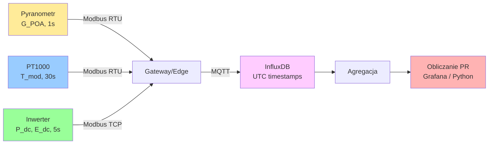

import { 
  SlideContainer, 
  Slide, 
  KeyPoints, 
  SupportingDetails, 
  InstructorNotes,
  VisualSeparator,
  LearningObjective,
  KeyConcept,
  Example
} from '@site/src/components/SlideComponents';
import { InteractiveQuiz } from '@site/src/components/InteractiveQuiz';

<LearningObjective>
Po tej sekcji student potrafi:
- Dobrać odpowiedni pyranometr według norm ISO 9060 dla różnych zastosowań w monitoringu PV
- Zaprojektować system pomiaru irradiancji z uwzględnieniem orientacji (POA vs. GHI) i korekcji kątowych
- Zmierzyć i wykorzystać temperaturę modułów (T_mod) do kompensacji mocy i obliczania Performance Ratio (PR)
- Zidentyfikować typowe błędy instalacyjne i ich wpływ na dokładność KPI
</LearningObjective>

<SlideContainer>

<Slide title="☀️ Irradiancja — pomiar i standardy ISO 9060" type="info">

<KeyPoints title="📋 Definicje i wielkości">

**Irradiancja (G)** – moc promieniowania słonecznego na jednostkę powierzchni [W/m²]. Kluczowa dla:
- Obliczania Performance Ratio (PR = E_actual / E_expected)
- Normalizacji produkcji (Specific Yield w kWh/kWp)
- Modelowania i prognozowania produkcji

**Typy pomiaru:**
- **GHI (Global Horizontal Irradiance)**: Płaszczyzna pozioma, suma bezpośredniej + rozproszonej
- **POA (Plane of Array)**: Płaszczyzna modułów PV (uwzględnia kąt nachylenia i azymut)
- **DNI (Direct Normal Irradiance)**: Tylko bezpośrednia (stosowane w CSP, PV z trackerami)
- **DHI (Diffuse Horizontal Irradiance)**: Tylko rozproszona

**Dla monitoringu PV najważniejsza jest POA** – odzwierciedla rzeczywiste naświetlenie modułów.

</KeyPoints>

<SupportingDetails title="🔧 Standard ISO 9060:2018 – klasy pyranometrów">

### Klasyfikacja dokładności:

| Klasa | Niepewność (95% CL) | Zakres spektralny | Czas reakcji | Zastosowanie | Koszt typowy |
|-------|---------------------|-------------------|--------------|--------------|--------------|
| **Secondary Standard** | &lt;3% | 300-3000 nm | &lt;5 s | Pomiary referencyjne, R&D | 2000-5000 EUR |
| **First Class** | &lt;5% | 300-3000 nm | &lt;10 s | Monitoring komercyjny, rozliczenia | 800-2000 EUR |
| **Second Class** | &lt;10% | 350-2500 nm | &lt;20 s | Monitoring prosumencki, diagnostyka | 300-800 EUR |
| **Class C** | &lt;20% | 400-2000 nm | &lt;30 s | Systemy niskobudżetowe | 100-300 EUR |

**Kluczowe parametry pyranometru:**

1. **Czułość spektralna**: Odpowiedź powinna pokrywać widmo słoneczne (AM 1.5G: 280-4000 nm). Pyranometry krzemowe (photovoltaic reference cells) mają węższe pasmo (400-1100 nm), co prowadzi do błędów w pochmurne dni (więcej niebieskiego światła).

2. **Nieliniowość**: Błąd przy zmiennej intensywności (&lt;1% dla First Class)

3. **Odpowiedź kierunkowa**: Błąd przy małych kątach padania (poranek/wieczór). Pyranometry z kopułą szklaną mają lepszą odpowiedź kątową.

4. **Dryft termiczny**: Zmiana czułości z temperaturą (&lt;2% w zakresie -20 do +50°C dla First Class)

5. **Zeroing (offset)**: Odpowiedź w nocy powinna być 0 W/m² (typowo ±1-5 W/m² dla dobrych pyranometrów)

:::caution Uwaga: Pyranometry krzemowe (PV reference cells)
Tańsze (100-300 EUR) i szybsze (ms), ale:
- Węższe pasmo spektralne → błędy w pochmurne dni (do ±5-10%)
- Wrażliwe na temperaturę i degradację
- **NIE spełniają ISO 9060** (nieoficjalna "klasa D")

Stosować tylko do szybkiego monitoringu lub tam, gdzie budżet &lt;500 EUR. Dla rozliczeń i PR zawsze termopilowy (First/Secondary Standard).
:::

</SupportingDetails>

<InstructorNotes>

**Czas**: 15-18 min

**Przebieg**:
1. Wprowadzenie do irradiancji i jej roli w monitoringu PV (4 min)
2. Omówienie typów pomiaru: GHI vs. POA (3 min) – użyj ilustracji lub modelu
3. Klasyfikacja ISO 9060 (5 min) – pokaż przykładowy pyranometr (jeśli dostępny)
4. Trade-off: pyranometry termopilowe vs. krzemowe (3 min)
5. Q&A (2 min)

**Punkty kluczowe**:
- **POA to must-have**: bez POA nie można obliczyć wiarygodnego PR (GHI wymaga modelu transpozycji, dodatkowa niepewność ±3-5%)
- Pyranometry First Class to standard dla farm &gt;500 kWp
- Kalibracja co 2 lata dla First Class, co 5 lat dla Secondary Standard
- Koszt pyranometru to 0.1-0.3% CAPEX farmy PV (niewielki, ale kluczowy)

**Demonstracja praktyczna** (jeśli dostępna):
- Pokaż różnicę w odczytach pyranometr termopilowy vs. krzemowy w pochmurny dzień
- Wyświetl certyfikat kalibracji pyranometru (niepewność, stała kalibracji)

**Materiały pomocnicze**:
- ISO 9060:2018 (wybrane fragmenty, tabelki klasyfikacji)
- Datasheets: Kipp & Zonen CMP11 (First Class), EKO ML-01 (Second Class)
- Aplikacja do transpozycji GHI→POA (pvlib-python, przykład)

**Typowe błędy studenckie**:
- Mylenie irradiancji (W/m²) z insolacją (Wh/m² lub J/m²) – to całka!
- Stosowanie GHI do obliczania PR bez transpozycji
- Niezrozumienie, że pyranometr krzemowy NIE jest zgodny z ISO 9060

**Pytania studenckie**:
- Q: Dlaczego nie wszędzie stosuje się Secondary Standard?
- A: Koszt (3000-5000 EUR) vs. First Class (1000-1500 EUR). Różnica w niepewności &lt;2%, dla większości zastosowań First Class wystarczy.

- Q: Jak często czyścić pyranometr?
- A: W zależności od środowiska. Obszary pyłowe/rolnicze: co tydzień. Czyste środowiska: co miesiąc. Zabrudzona kopuła → zaniżony pomiar G → zawyżony PR!

</InstructorNotes>

</Slide>

<VisualSeparator type="technical" />

<Slide title="🛠️ Montaż i instalacja pyranometrów" type="tip">

<KeyPoints title="📋 Kluczowe decyzje instalacyjne">

**1. Orientacja: POA vs. GHI**
- **POA (Plane of Array)**: Nachylenie i azymut = modułów PV. **REKOMENDOWANE dla PR.**
- **GHI (Global Horizontal)**: Pozioma. Wymaga transpozycji (model Perez, Hay-Davies). Niepewność +3-5%.
- W instalacjach &gt;100 kWp: POA obowiązkowy, GHI dodatkowy (porównanie z danymi satelitarnymi)

**2. Lokalizacja czujnika**
- **Blisko reprezentatywnych modułów** (±5 m), ta sama wysokość
- **Unikać zacienień** – symulacja 3D (PVsyst, HelioScope) dla całego dnia i roku
- **Unikać odbić** od białych powierzchni (dachy, śnieg), wody, reflektorów PV → błąd +5-20 W/m²

**3. Mocowanie**
- Stabilna konstrukcja (wiatr!), bez drgań
- Przewód ekranowany, prowadzenie równolegle do konstrukcji metalowej (uziemienie)
- Połączenie: 4-20 mA (długie dystanse, odporność na zakłócenia) lub 0-10 V (krótsze, &lt;50 m)

**4. Czyszczenie i konserwacja**
- Czyszczenie kopuły: woda destylowana + szmata mikrofibra (NIE detergenty!)
- Częstotliwość: co 1-4 tygodnie (zależnie od środowiska)
- Sprawdzanie poziomu (libella w korpusie pyranometru) co 6 miesięcy
- **Rejestr konserwacji** – wymóg norm ISO 9847 dla pomiarów referencyjnych

</KeyPoints>

<SupportingDetails title="🧪 Kalibracja i weryfikacja">

### Procedury kalibracyjne:

**Kalibracja fabryczna (nowy pyranometr):**
- Wykonywana przez producenta w kontrolowanych warunkach (lampy kalibracyjne, standard WRR)
- Certyfikat podaje **stałą kalibracji** (sensitivity, typowo 5-15 µV/(W/m²) dla termopilowych)
- Niepewność: ±1.5-3% (First Class)

**Rekalibracja (co 2-5 lat):**
- W akredytowanym laboratorium lub outdoor porównanie z pyranometrem referencyjnym
- Koszt: 300-800 EUR, czas: 2-4 tygodnie
- **Konieczne dla pomiarów rozliczeniowych i gwarancyjnych**

**Weryfikacja terenowa (co 1-6 miesięcy):**
- Porównanie z drugim pyranometrem (mobilny standard)
- Sprawdzenie zeroing w nocy (offset &lt;±5 W/m²)
- Test spójności: korelacja z satelitarnymi danymi (CAMS, SolarGIS) – różnica &lt;±5% w skali miesiąca

:::tip Dobra praktyka
W farmach &gt;1 MWp stosuje się **2 pyranometry POA** (różne lokalizacje) + 1 GHI. Redundancja + możliwość wykrycia dryftu/uszkodzenia przez porównanie. Koszt dodatkowy ~1500 EUR, ale eliminuje ryzyko nieświadomego błędu przez miesiące.
:::

</SupportingDetails>

<Example title="Wpływ błędów montażu na PR">

**Scenariusz**: Farma PV 1 MWp, pyranometr zamontowany z błędem azymutu +15° względem modułów.

**Symulacja (PVsyst, lokalizacja: 51°N, 15°E)**:
- Produkcja rzeczywista: 950 MWh/rok
- G_POA (błędny azymut): średnio 1180 kWh/m²/rok
- G_POA (poprawny): średnio 1150 kWh/m²/rok

**Błąd w PR:**
- PR_obliczony = 950 / (1000 × 1.18) = 0.805 (80.5%)
- PR_rzeczywisty = 950 / (1000 × 1.15) = 0.826 (82.6%)
- **Różnica: -2.1 punktów procentowych** → niewłaściwa diagnoza systemu jako "underperforming"

**Wnioski:**
- Błędy orientacji pyranometru prowadzą do systematycznego zniekształcenia PR
- Weryfikacja montażu kompasem/GPS (azymut ±2°, nachylenie ±1°)

</Example>

<InstructorNotes>

**Czas**: 12-15 min

**Przebieg**:
1. Omówienie decyzji POA vs. GHI (3 min) – użyj przykładu obliczenia PR
2. Montaż i lokalizacja czujnika (4 min) – pokaż zdjęcia dobrych i złych montaży
3. Kalibracja i weryfikacja (3 min)
4. Przykład błędu montażu i jego wpływu na PR (2 min)
5. Q&A (2 min)

**Punkty kluczowe**:
- POA to MUST dla PR – to nie jest "nice to have"
- Montaż to często zaniedbany aspekt – widziałem farmy z pyranometrem w cieniu konstrukcji wsporczej...
- Czyścić regularnie! Zabrudzona kopuła → zaniżona G → zawyżony PR → fałszywe poczucie sukcesu

**Demonstracja praktyczna**:
- Pokaż jak wygląda poprawnie zamontowany pyranometr (zdjęcie z farmy)
- Przykład certyfikatu kalibracji
- Wykres korelacji G_pyranometr vs. G_satelita (powinny się zgadzać ±5%)

**Materiały pomocnicze**:
- ISO 9847:1992 – Solar energy — Calibration of field pyranometers by comparison to a reference pyranometer
- Przykłady błędnych montaży (odbicia od białych dachów, zacienienie rano)
- Kalkulator transpozycji pvlib: https://pvlib-python.readthedocs.io/

**Pytania studenckie**:
- Q: Czy można używać danych satelitarnych zamiast pyranometru?
- A: Nie do PR! Satelity (CAMS, SolarGIS) mają niepewność ±5-10%, OK do long-term, ale nie do daily/hourly PR.

- Q: Czemu nie montować pyranometru na module PV?
- A: Można, ale moduł się grzeje (~40-60°C w słońcu), pyranometr ma dryft termiczny. Lepiej na konstrukcji obok, z wentylacją.

</InstructorNotes>

</Slide>

<Slide title="🌡️ Temperatura modułów (T_mod) – pomiar i kompensacja" type="tip">

<KeyPoints title="📋 Technologie pomiaru temperatury">

**Dlaczego mierzymy T_mod?**
1. **Kompensacja temperaturowa mocy**: Moduły PV tracą ~0.35-0.5%/°C mocy przy wzroście temperatury
2. **Obliczanie PR**: PR wymaga oczekiwanej mocy przy rzeczywistych G i T
3. **Diagnostyka przegrzewania**: Hot-spoty, zły montaż, problemy z wentylacją
4. **Modelowanie**: Walidacja modeli termicznych, prognozowanie

**Czujniki temperatury:**

| Typ czujnika | Zakres | Dokładność | Linearność | Interfejs | Koszt | Zastosowanie |
|--------------|--------|------------|------------|-----------|-------|--------------|
| **PT100** | -200 do +850°C | ±0.15°C (Class A) | Bardzo dobra | 4-wire ohm | €€€ | Stacje meteo, referencyjne |
| **PT1000** | -200 do +850°C | ±0.15-0.3°C | Bardzo dobra | 2-wire ohm | €€ | Monitoring PV (standard) |
| **NTC 10kΩ** | -40 do +125°C | ±0.5-1°C | Nieliniowa | Ohm / voltage divider | € | Niskobudżetowe, prosumenckie |
| **Termopar (K-type)** | -200 do +1200°C | ±1-2°C | Średnia | mV (cold junction comp) | € | Wysokie temperatury, eksperymentalne |
| **IR (pyrometr)** | -50 do +1000°C | ±1-3°C | - | Analog/digital | €€€€ | Bezkontaktowy, termowizja |

**Dla monitoringu PV: PT1000 to standard** (dobry kompromis dokładność/koszt).

</KeyPoints>

<SupportingDetails title="🔧 Montaż czujników temperatury">

### Kluczowe zasady instalacji:

**1. Lokalizacja na module**
- **Tylna ścianka modułu** (back-sheet), środek modułu (unikać ramki aluminiowej – odmienna temp.)
- Moduł reprezentatywny (środek tablicy, nie skraj)
- Unikać miejsc z potencjalnym hot-spotem

**2. Mocowanie**
- **Klejenie**: taśma termoprzewodząca (thermal pad, ~3-5 W/mK) + klej epoksydowy
- **NIE używać** zwykłej taśmy izolacyjnej (zły kontakt termiczny, degradacja UV)
- Przewód powinien być odciążony (nie ciągnąć czujnika!), prowadzony z tyłu konstrukcji

**3. Liczba czujników**
- Instalacje &lt;100 kWp: 1-2 czujniki
- Instalacje 100 kWp-1 MWp: 3-5 czujników (różne sekcje, orientacje)
- &gt;1 MWp: min. 1 czujnik na każdą tablicę inwerterową + czujniki w miejscach podejrzanych (przegrzewanie)

**4. Konfiguracja pomiaru**
- **PT1000 2-wire**: dla odległości &lt;10 m, rezystancja przewodów &lt;2 Ω
- **PT1000 4-wire**: dla &gt;10 m lub pomiarów ±0.1°C (kompensacja rezystancji przewodów)
- Częstotliwość próbkowania: 10-60 s (temperatura zmienia się wolno)
- Agregacja: średnia 1-5 min (redukcja szumów, spójne z G_POA i P_dc)

:::caution Typowy błąd: montaż czujnika na ramce aluminiowej
Ramka aluminiowa ma inną temperaturę niż ogniwo (~5-10°C chłodniejsza w słońcu z powodu wentylacji). Montaż tam prowadzi do **systematycznego zaniżania T_mod** → przeszacowanie oczekiwanej mocy → zaniżony PR.
:::

</SupportingDetails>

<Example title="Kompensacja temperaturowa w obliczaniu PR">

**Formuła PR z kompensacją:**

$$
PR = \frac{E_{actual}}{E_{expected}} = \frac{E_{actual}}{P_{STC} \times \frac{G_{POA}}{1000} \times [1 + \gamma (T_{mod} - 25)]}
$$

Gdzie:
- $E_{actual}$ – rzeczywista energia wyprodukowana [kWh]
- $P_{STC}$ – moc nominalna w STC [kWp]
- $G_{POA}$ – irradiancja w płaszczyźnie modułów [W/m²]
- $\gamma$ – współczynnik temperaturowy mocy [%/°C], typowo -0.35 do -0.50%/°C
- $T_{mod}$ – zmierzona temperatura modułów [°C]

**Przykład numeryczny (godzina w południe, lipiec)**:
- Instalacja: 100 kWp, moduły z γ = -0.40%/°C
- G_POA = 950 W/m²
- T_mod = 55°C
- E_actual = 85 kWh (zmierzone w ciągu godziny)

**Obliczenie E_expected:**
$$
E_{expected} = 100 \times \frac{950}{1000} \times [1 + (-0.004) \times (55 - 25)] = 100 \times 0.95 \times 0.88 = 83.6 \text{ kWh}
$$

**PR:**
$$
PR = \frac{85}{83.6} = 1.017 \text{ czyli } 101.7\%
$$

**Interpretacja**: System działa lekko lepiej niż oczekiwano (możliwe przyczyny: nowsze moduły mają lepszy γ, dobra wentylacja). PR &gt;100% jest możliwe w krótkich okresach (np. niskie temperatury powietrza + wysokie G).

**Gdyby NIE uwzględnić temperatury** (założenie T_mod = 25°C):
$$
E_{expected, no\_comp} = 100 \times 0.95 = 95 \text{ kWh}
$$
$$
PR_{no\_comp} = \frac{85}{95} = 0.895 \text{ czyli } 89.5\%
$$

**Różnica: 12 punktów procentowych!** Brak kompensacji termicznej radykalnie zniekształca PR, szczególnie latem.

</Example>

<InstructorNotes>

**Czas**: 14-16 min

**Przebieg**:
1. Wyjaśnienie dlaczego mierzymy T_mod (3 min)
2. Przegląd czujników (PT1000, NTC, termopar) (4 min)
3. Montaż i typowe błędy (4 min) – pokaż zdjęcia poprawnego i błędnego montażu
4. Przykład obliczenia PR z kompensacją (3 min) – przeprowadź live na tablicy/slajdzie
5. Q&A (2 min)

**Punkty kluczowe**:
- **Współczynnik γ** jest w datasheet modułu (szukać "temperature coefficient of P_max")
- T_mod ≠ T_amb (temperatura otoczenia)! Typowo T_mod = T_amb + 25-35°C przy G = 1000 W/m²
- PT1000 to najbardziej popularny wybór (dokładność vs. koszt)

**Demonstracja praktyczna**:
- Pokaż czujnik PT1000 + thermal pad
- Wykres T_mod vs. T_amb vs. G_POA przez jeden dzień (pokaże dynamikę)
- Live obliczenie PR na przykładzie (użyj rzeczywistych danych z lokalnej instalacji jeśli dostępne)

**Materiały pomocnicze**:
- Datasheet modułu PV z temperaturowym współczynnikiem (np. Longi, JinkoSolar)
- IEC 61853-3 (procedury pomiarowe dla T_mod)
- Wykres zależności T_mod od G_POA (z NREL, Sandia model)

**Typowe błędy studenckie**:
- Mylenie T_cell (temperatura ogniwa) z T_module (back-sheet) – różnica ~2-5°C
- Stosowanie T_amb zamiast T_mod w kompensacji (BŁĄD!)
- Niezrozumienie, że γ jest ujemny (wyższa T → niższa moc)

**Pytania studenckie**:
- Q: Czy można używać kamery termowizyjnej zamiast PT1000?
- A: Tak, ale to pomiar punktowy/periodyczny. Do ciągłego monitoringu potrzeba kontaktowych czujników. Termowizja świetna do diagnostyki hot-spotów.

- Q: Jaki jest typowy T_mod latem w Polsce?
- A: Przy G = 900-1000 W/m² i T_amb = 25-30°C → T_mod = 50-65°C. W pustynnych farmach (Arabia, Sahara) → 70-85°C!

</InstructorNotes>

</Slide>

<VisualSeparator type="default" />

<Slide title="📐 Integracja G_POA i T_mod do obliczania PR" type="info">

<KeyConcept title="Synchronizacja czasowa i agregacja danych">

**Problem**: Dane z różnych źródeł (pyranometr, PT1000, inwertery) mają różne:
- Częstotliwości próbkowania (pyranometr: 1 s, inwerter: 5 s, PT1000: 30 s)
- Znaczniki czasu (time stamps) – mogą być przesunięte o kilka sekund
- Strefy czasowe (UTC vs. local time) – kluczowy problem w międzynarodowych projektach!

**Rozwiązanie**: Wspólny pipeline agregacji danych

**Kluczowe kroki:**

1. **Konwersja do UTC**: Wszystkie znaczniki czasu w bazie danych w UTC
2. **Agregacja do wspólnego okna**: Typowo 5 lub 15 min (mean dla G i T, sum dla E)
3. **Synchronizacja**: Dopasowanie timestampów (np. przez interpolację lub najbliższy sąsiad)
4. **Filtrowanie**: Usunięcie outlierów (G&lt;10 W/m² → noc, pomiń) i błędnych odczytów

:::tip Dobra praktyka: okna agregacji
- **5 min**: Standardowe w monitoringu komercyjnym (kompromis granularności vs. szum)
- **15 min**: Często w SCADA energetycznym (zgodnie z IEC 61850)
- **1 godz. / 1 dzień**: Do raportowania dla inwestorów i long-term analiz
:::

</KeyConcept>

<SupportingDetails title="🔍 Typowe problemy synchronizacji">

**Problem 1: Brak NTP w gateway**
- Symptom: Dryf zegara edge device o kilka sekund/dzień
- Rozwiązanie: Konfiguracja NTP (pool.ntp.org), synchronizacja co 1 godz.

**Problem 2: Strefy czasowe**
- Symptom: PR jest "przesunięty" o kilka godzin (wykres PR vs. godzina jest nietypowy)
- Rozwiązanie: Wszystkie dane w UTC, konwersja do local time tylko w wizualizacji

**Problem 3: Różne częstotliwości próbkowania**
- Symptom: Niektóre minuty mają dane G ale nie mają P, lub odwrotnie
- Rozwiązanie: Agregacja do wspólnego okna (np. 5 min) + interpolacja brakujących wartości

**Problem 4: Opóźnienia w komunikacji**
- Symptom: Timestamp w bazie danych vs. rzeczywisty czas pomiaru różnią się o &gt;10 s
- Rozwiązanie: Stosowanie timestampów z czujników/inwerterów (jeśli mają RTC), nie z gateway

</SupportingDetails>

</Slide>

<Slide title="🔍 Studium przypadku: Błąd pomiaru G_POA i jego wpływ" type="success">

<KeyPoints title="📋 Kontekst problemu">

**Farma PV 2 MWp, Wielkopolska (2021)**
- Monitoring z pyranometrem krzemowym (PV reference cell, "klasa D")
- Raportowany PR: ~72-75% (czerwiec-sierpień) – znacznie poniżej oczekiwanych 82-85%
- Inwestor zaniepokojony: "System underperforming, możliwa reklamacja gwarancyjna"

</KeyPoints>

<SupportingDetails title="🔍 Diagnoza i rozwiązanie">

### Faza 1: Analiza danych (lipiec 2021)

Zewnętrzna firma audytująca (O&M expert) zauważyła:
- PR spada szczególnie w **częściowo pochmurne dni** (do 68%)
- W pełnie słoneczne dni PR bliżej 80% (nadal nisko, ale bliżej normy)
- Pyranometr krzemowy pokazuje **systematycznie wyższą irradiancję** (+8-12%) niż dane satelitarne (CAMS)

**Hipoteza**: Pyranometr krzemowy ma błąd spektralny – w pochmurne dni (więcej rozproszenia, przesunięcie widma w stronę niebieską) mierzy zawyżone G.

### Faza 2: Weryfikacja z pyranometrem referencyjnym (sierpień 2021)

Zainstalowano pyranometr First Class (Kipp & Zonen CMP11) obok istniejącego krzemowego:
- **Słoneczny dzień**: różnica ~3% (akceptowalne)
- **Pochmurny dzień**: różnica ~+10-15% (krzemowy pokazuje więcej!)

**Dane (przykład, pochmurny dzień, 1-godz. średnie)**:
| Czas | G_POA (krzemowy) | G_POA (termopilowy) | Różnica |
|------|------------------|---------------------|---------|
| 10:00 | 450 W/m² | 390 W/m² | +15% |
| 11:00 | 520 W/m² | 470 W/m² | +11% |
| 12:00 | 580 W/m² | 530 W/m² | +9% |

### Faza 3: Przeliczenie PR z poprawnymi danymi

**PR z pyranometrem krzemowym (błędne)**:
$$
PR = \frac{E_{actual}}{P_{STC} \times \frac{G_{POA, krem}}{1000}} \approx 0.73
$$

**PR z pyranometrem termopilowym (poprawne)**:
$$
PR = \frac{E_{actual}}{P_{STC} \times \frac{G_{POA, termo}}{1000}} \approx 0.84
$$

**Wynik**: System działał PRAWIDŁOWO! Problem był w pomiarze, nie w instalacji PV.

### Faza 4: Działania (wrzesień 2021)

- Wymiana pyranometru krzemowego na First Class termopilowy (koszt: 1200 EUR)
- Retrospektywna korekta raportów PR dla inwestora (za okres czerwiec-sierpień)
- Uniknięto kosztownej i nieuzasadnionej reklamacji gwarancyjnej (potencjalny koszt: &gt;50 000 EUR!)

**ROI wymiany pyranometru**: Zwrot w ciągu 1 miesiąca (uniknięcie kosztów prawnych i audytów).

</SupportingDetails>

<Example title="Lekcje i rekomendacje">

**Kluczowe wnioski:**

1. **Pyranometry krzemowe NIE nadają się do rozliczeń i gwarancji PR**
   - Błąd spektralny w zmiennych warunkach pogodowych
   - OK do szybkiego monitoringu, nieakceptowalne do celów prawnych

2. **Weryfikacja z danymi satelitarnymi (CAMS, SolarGIS)**
   - Jeśli różnica >±5-7% w skali miesiąca → sprawdź pyranometr!
   - Satelity mają niepewność ±5-10%, ale są niezależne

3. **Redundancja pyranometrów w dużych instalacjach**
   - Farmy &gt;1 MWp powinny mieć 2+ pyranometry różnych typów/producentów
   - Koszt: 1500-3000 EUR dodatkowe, ale eliminuje single point of failure

4. **Inspekcja przy odbiorze instalacji**
   - Sprawdź typ pyranometru (ISO 9060 class!)
   - Certyfikat kalibracji (&lt;2 lata)
   - Porównanie z sąsiednimi instalacjami lub satelitami

:::caution Uwaga prawna
Wiele umów PPA (Power Purchase Agreement) i gwarancji producentów odnosi się do PR obliczonego według norm IEC 61724. Norma **wymaga pyranometru zgodnego z ISO 9060** (co najmniej Second Class). Pyranometry krzemowe nie spełniają tego wymogu → możliwość unieważnienia gwarancji!
:::

</Example>

<InstructorNotes>

**Czas**: 10-12 min

**Przebieg**:
1. Przedstawienie problemu (2 min) – podkreśl niepokój inwestora
2. Omówienie diagnozy (4 min) – wyjaśnij błąd spektralny pyranometrów krzemowych
3. Pokazanie danych porównawczych (2 min) – tabela lub wykres
4. Dyskusja: Jak studenci podeszliby do tego problemu? (2 min)
5. Rekomendacje i wnioski (2 min)

**Punkty kluczowe**:
- To prawdziwy case (anonimizowany) – podkreśl, że to nie jest teoretyczny problem
- Koszt pyranometru: 1000-1500 EUR, koszt błędnej diagnozy: &gt;50 000 EUR (prawnik, audyty, wymiana sprzętu)
- Pyranometry krzemowe są często stosowane przez niewykwalifikowanych instalatorów (tańsze, szybsze) → problem branżowy

**Demonstracja praktyczna**:
- Pokaż różnicę w spektralnej czułości: termopilowy (widmo szerokie) vs. krzemowy (tylko 400-1100 nm)
- Wykres G_POA (krzemowy vs. termopilowy vs. satelity) przez tydzień (pokaże rozbieżności)

**Materiały pomocnicze**:
- IEC 61724-1:2017 – Photovoltaic system performance monitoring (wymogi dla pyranometrów)
- Przykładowy kontrakt PPA z klauzulą o pyranometrach zgodnych z ISO 9060
- Artykuł naukowy o błędach spektralnych PV reference cells (np. z Solar Energy journal)

**Pytania studenckie**:
- Q: Czy można korygować odczyty pyranometru krzemowego matematycznie?
- A: Trudne – korekta zależy od spektrum (zmienne w czasie). Prostsze i pewniejsze: użyć termopilowego.

- Q: Dlaczego ktoś w ogóle stosuje pyranometry krzemowe?
- A: Tanie (100-300 EUR vs. 1000+ EUR), szybkie (ms vs. 5-10 s), małe. OK do szybkiego monitoringu/R&D, ale nie do rozliczeń.

</InstructorNotes>

</Slide>

<VisualSeparator type="default" />

<Slide title="📝 Quiz: Irradiancja i temperatura" type="info">

<InteractiveQuiz 
  questions={[
    {
      question: "Jaką klasę pyranometru (ISO 9060) należy zastosować w farmie PV 500 kWp z gwarancją PR dla inwestora?",
      options: [
        "Pyranometr krzemowy (PV reference cell) – wystarczająco dokładny",
        "Second Class (niepewność &lt;10%) – minimum dla komercyjnych instalacji",
        "First Class (niepewność &lt;5%) – standard dla gwarancji i rozliczeń",
        "Secondary Standard (&lt;3%) – obowiązkowe dla wszystkich farm"
      ],
      correctAnswer: 2,
      explanation: "First Class to standard dla instalacji komercyjnych z gwarancjami PR. Second Class można stosować w mniejszych instalacjach prosumenckich. Secondary Standard to overkill (koszt 3000-5000 EUR). Pyranometry krzemowe NIE spełniają ISO 9060."
    },
    {
      question: "Dlaczego pomiar POA (Plane of Array) jest lepszy niż GHI dla obliczania PR w instalacji PV?",
      options: [
        "POA jest tańszy w instalacji",
        "POA bezpośrednio mierzy irradiancję w płaszczyźnie modułów, GHI wymaga transpozycji (dodatkowa niepewność ±3-5%)",
        "GHI nie działa w pochmurne dni",
        "POA jest wymagane przez prawo"
      ],
      correctAnswer: 1,
      explanation: "POA mierzy rzeczywiste naświetlenie modułów. GHI (horizontal) wymaga modelu transpozycji (Perez, Hay-Davies), co dodaje niepewność ±3-5%. POA jest rekomendowane przez IEC 61724, choć nie zawsze prawnie wymagane."
    },
    {
      question: "Gdzie należy zamontować czujnik PT1000 do pomiaru T_mod?",
      options: [
        "Na ramce aluminiowej modułu (łatwy dostęp)",
        "Na przedniej powierzchni szklanej (bezpośredni kontakt ze słońcem)",
        "Na tylnej ściance (back-sheet) w środku modułu, z taśmą termoprzewodzącą",
        "W powietrzu obok modułu (reprezentuje T_amb)"
      ],
      correctAnswer: 2,
      explanation: "Tylna ścianka (back-sheet) w środku modułu to właściwe miejsce – reprezentuje temperaturę ogniwa. Ramka aluminiowa jest chłodniejsza (błąd -5-10°C). Powierzchnia szklana nie oddaje T ogniwa. Pomiar T_amb to nie T_mod!"
    },
    {
      question: "Moduł PV ma współczynnik temperaturowy γ = -0.40%/°C. Przy T_mod = 60°C (vs. STC 25°C), jaka jest strata mocy względem nominalnej?",
      options: [
        "-10%",
        "-12%",
        "-14%",
        "-16%"
      ],
      correctAnswer: 2,
      explanation: "Strata = γ × (T_mod - 25) = -0.40%/°C × (60 - 25)°C = -0.40 × 35 = -14%. To znacząca strata – stąd potrzeba kompensacji termicznej w obliczeniach PR."
    },
    {
      question: "Jakie okno agregacji (time window) jest standardem w komercyjnym monitoringu PV?",
      options: [
        "1 sekunda (real-time)",
        "5 minut (kompromis granularności vs. szum)",
        "1 godzina (zgodne z rozliczeniami energetycznymi)",
        "1 dzień (raportowanie inwestorskie)"
      ],
      correctAnswer: 1,
      explanation: "5 minut to standard w branży – wystarczająca granularność do diagnostyki, redukuje szum, kompatybilne z większością systemów SCADA. 1 s to za dużo danych (szum), 1 h/dzień to za mało dla operacyjnego monitoringu."
    }
  ]}
/>

:::tip Rekomendacja po quizie
Jeśli uzyskałeś &lt;80% poprawnych odpowiedzi, przejrzyj sekcje o klasach pyranometrów (ISO 9060) i kompensacji temperaturowej. Zrozumienie wpływu błędów pomiarowych na PR jest kluczowe dla projektowania wiarygodnych systemów monitoringu.
:::

</Slide>

</SlideContainer>

---

## Podsumowanie i wnioski

**Kluczowe punkty z tej sekcji:**

1. **Pyranometry First Class (ISO 9060) to standard dla farm &gt;100 kWp** – koszt 1000-1500 EUR to zaledwie 0.1-0.2% CAPEX, ale decyduje o wiarygodności PR i gwarancji.

2. **POA (Plane of Array) jest kluczowe dla PR** – GHI wymaga transpozycji i dodaje niepewność ±3-5%. W instalacjach komercyjnych POA to must-have.

3. **Temperatura modułów (T_mod) radykalnie wpływa na moc** – współczynnik -0.35 do -0.50%/°C oznacza straty ~12-14% przy T_mod = 60°C. Bez kompensacji termicznej PR jest zniekształcony o &gt;10 punktów procentowych.

4. **Synchronizacja czasowa i agregacja danych** – wszystkie znaczniki czasu w UTC, agregacja do wspólnych okien (typowo 5 min), filtrowanie outlierów.

5. **Typowe błędy: pyranometry krzemowe, błędna orientacja, montaż czujnika T na ramce** – wszystkie prowadzą do systematycznych błędów w KPI, które mogą kosztować dziesiątki tysięcy EUR (reklamacje, audyty).

**Następne kroki:**
- Ćwiczenie 2: Obliczanie PR z rzeczywistych danych (G_POA, T_mod, E_actual) – hands-on z Pythonem/Excel
- Przygotowanie do następnej sekcji: Monitoring wibracji i akustyki turbin wiatrowych (zupełnie inna dziedzina czujników!)

