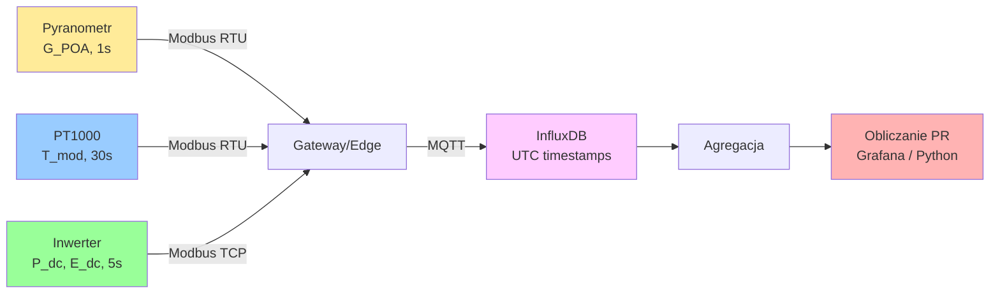

import { 
  SlideContainer, 
  Slide, 
  KeyPoints, 
  SupportingDetails, 
  InstructorNotes,
  VisualSeparator,
  LearningObjective,
  KeyConcept,
  Example
} from '@site/src/components/SlideComponents';
import { InteractiveQuiz } from '@site/src/components/InteractiveQuiz';

<LearningObjective>
Po tej sekcji student potrafi:
- Dobrać odpowiedni pyranometr według norm ISO 9060 dla różnych zastosowań w monitoringu PV
- Zaprojektować system pomiaru irradiancji z uwzględnieniem orientacji (POA vs. GHI) i korekcji kątowych
- Zmierzyć i wykorzystać temperaturę modułów (T_mod) do kompensacji mocy i obliczania Performance Ratio (PR)
- Zidentyfikować typowe błędy instalacyjne i ich wpływ na dokładność KPI
</LearningObjective>

<SlideContainer>

<Slide title="☀️ Irradiancja — podstawy i typy pomiaru" type="info">

<KeyPoints title="📋 Definicje i wielkości">

**Irradiancja (G)** – moc promieniowania słonecznego na jednostkę powierzchni [W/m²]. Kluczowa dla:
- Obliczania Performance Ratio (PR = E_actual / E_expected)
- Normalizacji produkcji (Specific Yield w kWh/kWp)
- Modelowania i prognozowania produkcji

**Typy pomiaru:**
- **GHI (Global Horizontal Irradiance)**: Płaszczyzna pozioma, suma bezpośredniej + rozproszonej
- **POA (Plane of Array)**: Płaszczyzna modułów PV (uwzględnia kąt nachylenia i azymut)
- **DNI (Direct Normal Irradiance)**: Tylko bezpośrednia (stosowane w CSP, PV z trackerami)
- **DHI (Diffuse Horizontal Irradiance)**: Tylko rozproszona

**Dla monitoringu PV najważniejsza jest POA** – odzwierciedla rzeczywiste naświetlenie modułów.

</KeyPoints>

<InstructorNotes>

Ten slajd wprowadza podstawowe pojęcia – około sześć do ośmiu minut.

Zacznij od wyjaśnienia, czym jest irradiancja i dlaczego jest kluczowa. **Irradiancja to moc na metr kwadratowy**, nie mylić z insolacją (która jest całką, czyli energią). Studenci często to mylą.

Przejdź przez typy pomiaru. **GHI to pozioma płaszczyzna** – historycznie stosowana w meteorologii, ale dla fotowoltaiki mało użyteczna bez transpozycji. **POA to płaszczyzna modułów** – właściwy wybór dla obliczania Performance Ratio, bo pokazuje rzeczywiste naświetlenie paneli.

Podkreśl, że **bez POA nie można obliczyć wiarygodnego PR**. GHI wymaga modeli transpozycji (Perez, Hay-Davies), które dodają niepewność trzy do pięciu procent. To może być decydujące w sporach o gwarancje.

DNI i DHI to bardziej zaawansowane pomiary – używane w systemach z trackerami lub koncentratorami, ale nie w standardowych instalacjach PV. Wystarczy je wspomnieć.

</InstructorNotes>

</Slide>

<VisualSeparator type="default" />

<Slide title="📊 Standard ISO 9060:2018 – klasy pyranometrów" type="info">

### Klasyfikacja dokładności:

| Klasa | Niepewność (95% CL) | Zakres spektralny | Czas reakcji | Zastosowanie | Koszt typowy |
|-------|---------------------|-------------------|--------------|--------------|--------------|
| **Secondary Standard** | &lt;3% | 300-3000 nm | &lt;5 s | Pomiary referencyjne, R&D | 2000-5000 EUR |
| **First Class** | &lt;5% | 300-3000 nm | &lt;10 s | Monitoring komercyjny, rozliczenia | 800-2000 EUR |
| **Second Class** | &lt;10% | 350-2500 nm | &lt;20 s | Monitoring prosumencki, diagnostyka | 300-800 EUR |
| **Class C** | &lt;20% | 400-2000 nm | &lt;30 s | Systemy niskobudżetowe | 100-300 EUR |

<KeyPoints title="📋 Dobór klasy pyranometru">

**First Class** to standard dla farm komercyjnych &gt;500 kWp:
- Niepewność &lt;5% wystarczy do rozliczeń i gwarancji PR
- Koszt 0.1-0.3% CAPEX instalacji (niewielki, ale kluczowy)
- Kalibracja co 2 lata

**Secondary Standard** tylko dla:
- Pomiarów referencyjnych i laboratoriów
- Projektów badawczych wymagających &lt;3% niepewności
- Koszt 2-3× wyższy niż First Class przy marginalnej poprawie dokładności

</KeyPoints>

<InstructorNotes>

Tabela klasyfikacji ISO 9060 to podstawa wyboru pyranometru – około pięć do siedmiu minut na ten slajd.

Przejdź przez tabelę kolumna po kolumnie. **Niepewność** to kluczowy parametr – dla First Class poniżej pięciu procent, co jest wystarczające dla większości zastosowań komercyjnych. **Secondary Standard** daje poniżej trzech procent, ale kosztuje dwa do trzech razy więcej – różnica nie jest warta dla typowego monitoringu.

Zwróć uwagę na **zakres spektralny**. Pyranometry termopilowe pokrywają szeroki zakres (300-3000 nm), co odpowiada całemu widmu słonecznemu. To ważne, bo w pochmurne dni widmo się zmienia (więcej niebieskiego światła).

**Czas reakcji** – dla pomiarów uśrednionych (pięć minut, godzina) nie jest krytyczny. Dziesięć sekund wystarczy. Szybsze czujniki (krzemowe, milisekundy) są potrzebne tylko do badania szybkich zmian (analiza chmur).

Koszt pyranometru to **zaledwie 0.1-0.3% całkowitego CAPEX farmy PV**, ale decyduje o wiarygodności wszystkich KPI przez dwadzieścia pięć lat. To najlepsza inwestycja w jakość danych.

**Kalibracja** – First Class co dwa lata, Secondary Standard co pięć lat. To wymóg norm i umów gwarancyjnych.

</InstructorNotes>

</Slide>

<VisualSeparator type="default" />

<Slide title="⚠️ Parametry i ograniczenia pyranometrów" type="tip">

<KeyPoints title="📋 Kluczowe parametry techniczne">

**1. Czułość spektralna**: Odpowiedź powinna pokrywać widmo słoneczne (AM 1.5G: 280-4000 nm)

**2. Nieliniowość**: Błąd przy zmiennej intensywności (&lt;1% dla First Class)

**3. Odpowiedź kierunkowa**: Błąd przy małych kątach padania (poranek/wieczór). Pyranometry z kopułą szklaną mają lepszą odpowiedź kątową

**4. Dryft termiczny**: Zmiana czułości z temperaturą (&lt;2% w zakresie -20 do +50°C dla First Class)

**5. Zeroing (offset)**: Odpowiedź w nocy powinna być 0 W/m² (typowo ±1-5 W/m² dla dobrych pyranometrów)

</KeyPoints>

:::caution Uwaga: Pyranometry krzemowe (PV reference cells)
Tańsze (100-300 EUR) i szybsze (ms), ale:
- Węższe pasmo spektralne → błędy w pochmurne dni (do ±5-10%)
- Wrażliwe na temperaturę i degradację
- **NIE spełniają ISO 9060** (nieoficjalna "klasa D")

Stosować tylko do szybkiego monitoringu lub tam, gdzie budżet &lt;500 EUR. Dla rozliczeń i PR zawsze termopilowy (First/Secondary Standard).
:::

<InstructorNotes>

Parametry techniczne to kwestie praktyczne – około pięć do siedmiu minut.

**Czułość spektralna** to najważniejszy parametr. Pyranometry krzemowe (fotoogniwa kalibracyjne) mają wąskie pasmo czterysta do tysiąc sto nanometrów – **w pochmurne dni błąd sięga pięć do dziesięć procent**, bo widmo się przesuwa w stronę niebieskiego. Termopilowe pokrywają pełne widmo (trzysta do trzech tysięcy nanometrów) – to powód, dla którego są standardem.

**Nieliniowość** – dobrze zaprojektowany pyranometr ma liniową odpowiedź od zera do tysiąc pięćset watów na metr kwadratowy. Tanie czujniki mogą mieć błąd przy niskich lub wysokich intensywnościach.

**Odpowiedź kierunkowa** (angular response) – rano i wieczorem, gdy słońce pada pod małym kątem, tani pyranometr może zaniżać pomiar. Kopuła szklana pomaga zachować równomierną odpowiedź.

**Dryft termiczny** – czujnik zmienia czułość z temperaturą. First Class ma maksymalnie dwa procent dryftu w zakresie minus dwadzieścia do plus pięćdziesiąt stopni Celsjusza. To trzeba uwzględnić w obliczeniach lub stosować kompensację.

**Zeroing** – w nocy pyranometr powinien pokazywać zero. Jeśli pokazuje plus minus pięć watów na metr kwadratowy, to offset trzeba odjąć od pomiarów dziennych.

Podkreśl **problem pyranometrów krzemowych**. Tanie, szybkie, ale **nie spełniają ISO 9060**. Można ich używać do wstępnego monitoringu lub gdy budżet poniżej pięciuset euro, ale **nigdy do rozliczeń i PR**.

Jeśli ktoś zapyta, dlaczego nie wszędzie Secondary Standard – odpowiedź: koszt trzy do pięciu tysięcy euro versus tysiąc do dwóch tysięcy euro za First Class. **Różnica w niepewności poniżej dwóch procent** – dla większości zastosowań nie warta podwojenia ceny.

Czyszczenie pyranometru – **w zależności od środowiska**. Obszary pyłowe/rolnicze: co tydzień. Czyste: co miesiąc. Zabrudzona kopuła zaniża pomiar G, co zawyża PR – fałszywe poczucie sukcesu!

</InstructorNotes>

</Slide>

<VisualSeparator type="technical" />

<Slide title="🛠️ Montaż i instalacja pyranometrów" type="tip">

<KeyPoints title="📋 Kluczowe decyzje instalacyjne">

**1. Orientacja: POA vs. GHI**
- **POA (Plane of Array)**: Nachylenie i azymut = modułów PV. **REKOMENDOWANE dla PR.**
- **GHI (Global Horizontal)**: Pozioma. Wymaga transpozycji (model Perez, Hay-Davies). Niepewność +3-5%.
- W instalacjach &gt;100 kWp: POA obowiązkowy, GHI dodatkowy (porównanie z danymi satelitarnymi)

**2. Lokalizacja czujnika**
- **Blisko reprezentatywnych modułów** (±5 m), ta sama wysokość
- **Unikać zacienień** – symulacja 3D (PVsyst, HelioScope) dla całego dnia i roku
- **Unikać odbić** od białych powierzchni (dachy, śnieg), wody, reflektorów PV → błąd +5-20 W/m²

**3. Mocowanie**
- Stabilna konstrukcja (wiatr!), bez drgań
- Przewód ekranowany, prowadzenie równolegle do konstrukcji metalowej (uziemienie)
- Połączenie: 4-20 mA (długie dystanse, odporność na zakłócenia) lub 0-10 V (krótsze, &lt;50 m)

**4. Czyszczenie i konserwacja**
- Czyszczenie kopuły: woda destylowana + szmata mikrofibra (NIE detergenty!)
- Częstotliwość: co 1-4 tygodnie (zależnie od środowiska)
- Sprawdzanie poziomu (libella w korpusie pyranometru) co 6 miesięcy

</KeyPoints>

<InstructorNotes>

Decyzje instalacyjne to praktyczne aspekty montażu – około sześć do ośmiu minut.

**POA to absolutny must dla Performance Ratio** – to nie jest "nice to have". Bez POA musimy używać GHI z transpozycją, a to dodaje trzy do pięciu procent niepewności. W sporach o gwarancje to może być decydujące.

Lokalizacja czujnika – **blisko reprezentatywnych modułów, maksymalnie pięć metrów**, ta sama wysokość. Symulacja trójwymiarowa w PVsyst lub HelioScope pomaga znaleźć miejsca bez zacienienia przez cały rok.

**Typowy błąd**: odbicia od białych dachów, śniegu, wody. Widziałem instalację, gdzie pyranometr był pięć metrów od białego dachu – **odbite światło dodawało pięć do dwudziestu watów na metr kwadratowy**, co fałszowało wszystkie KPI.

Mocowanie – **stabilna konstrukcja odporna na wiatr**, bez drgań. Przewód ekranowany, prowadzony równolegle do konstrukcji metalowej dla właściwego uziemienia.

Czyszczenie kopuły – **woda destylowana plus mikrofibra**, żadnych detergentów (zostają naloty). Częstotliwość: obszary pyłowe co tydzień, czyste co miesiąc. **Zabrudzona kopuła zaniża pomiar G, co zawyża PR** – fałszywe poczucie sukcesu!

Sprawdzanie poziomu (libella) co pół roku – przechylony pyranometr daje błędy kierunkowe.

</InstructorNotes>

</Slide>

<VisualSeparator type="default" />

<Slide title="🔬 Kalibracja i weryfikacja pyranometrów" type="tip">

<SupportingDetails title="🧪 Procedury kalibracyjne">

**Kalibracja fabryczna (nowy pyranometr):**
- Wykonywana przez producenta w kontrolowanych warunkach (lampy kalibracyjne, standard WRR)
- Certyfikat podaje **stałą kalibracji** (sensitivity, typowo 5-15 µV/(W/m²) dla termopilowych)
- Niepewność: ±1.5-3% (First Class)

**Rekalibracja (co 2-5 lat):**
- W akredytowanym laboratorium lub outdoor porównanie z pyranometrem referencyjnym
- Koszt: 300-800 EUR, czas: 2-4 tygodnie
- **Konieczne dla pomiarów rozliczeniowych i gwarancyjnych**

**Weryfikacja terenowa (co 1-6 miesięcy):**
- Porównanie z drugim pyranometrem (mobilny standard)
- Sprawdzenie zeroing w nocy (offset {'<'}±5 W/m²)
- Test spójności: korelacja z satelitarnymi danymi (CAMS, SolarGIS) – różnica &lt;5% w skali miesiąca

:::tip Dobra praktyka
W farmach &gt;1 MWp stosuje się **2 pyranometry POA** (różne lokalizacje) + 1 GHI. Redundancja + możliwość wykrycia dryftu/uszkodzenia przez porównanie. Koszt dodatkowy ~1500 EUR, ale eliminuje ryzyko nieświadomego błędu przez miesiące.
:::

</SupportingDetails>

<InstructorNotes>

Procedury kalibracyjne to kwestia jakości danych – około cztery do sześciu minut.

**Kalibracja fabryczna** – każdy nowy pyranometr ma certyfikat z konstanta kalibracji (sensitivity), typowo pięć do piętnastu mikrowoltów na wat na metr kwadratowy dla termopilowych. **To jest mnożnik, który przelicza napięcie z czujnika na irradiancję**.

**Rekalibracja co dwa do pięciu lat** – wymóg dla pomiarów rozliczeniowych. Koszt trzysta do osiemset euro, czas dwa do czterech tygodni (pyranometr musi pojechać do laboratorium). W farmach komercyjnych to obowiązek, nie opcja.

**Weryfikacja terenowa** – co jeden do sześciu miesięcy porównujemy nasz pyranometr z mobilnym standardem lub sprawdzamy korelację z danymi satelitarnymi. Różnica powyżej pięciu procent w skali miesiąca to sygnał alarmowy – możliwy dryft lub uszkodzenie.

**Dobra praktyka**: w farmach powyżej megawata stosujemy **dwa pyranometry POA w różnych lokalizacjach** plus jeden GHI. Koszt dodatkowy tysiąc pięćset euro, ale eliminuje ryzyko, że przez miesiące nie wiemy o uszkodzonym czujniku.

Pokaż przykład certyfikatu kalibracji – studenci muszą wiedzieć, jak go czytać. Wykres korelacji G_pyranometr versus G_satelita to dobra wizualizacja spójności danych.

</InstructorNotes>

</Slide>

<VisualSeparator type="default" />

<Slide title="📉 Błędy montażu i ich wpływ na PR" type="warning">

<Example title="Studium przypadku: Błędny azymut pyranometru">

**Scenariusz**: Farma PV 1 MWp, pyranometr zamontowany z błędem azymutu +15° względem modułów.

**Symulacja (PVsyst, lokalizacja: 51°N, 15°E)**:
- Produkcja rzeczywista: 950 MWh/rok
- G_POA (błędny azymut): średnio 1180 kWh/m²/rok
- G_POA (poprawny): średnio 1150 kWh/m²/rok

**Błąd w PR:**
- PR_obliczony = 950 / (1000 × 1.18) = 0.805 (80.5%)
- PR_rzeczywisty = 950 / (1000 × 1.15) = 0.826 (82.6%)
- **Różnica: -2.1 punktów procentowych** → niewłaściwa diagnoza systemu jako "underperforming"

**Wnioski:**
- Błędy orientacji pyranometru prowadzą do systematycznego zniekształcenia PR
- Weryfikacja montażu kompasem/GPS (azymut ±2°, nachylenie ±1°)

</Example>

<InstructorNotes>

Ten slajd pokazuje konsekwencje błędnego montażu – około cztery do pięciu minut.

**Kluczowy przekaz**: piętnaście stopni błędu w azymucie pyranometru daje **dwa punkty procentowe błędu w PR**. W farmie megawatowej to różnica między osiemdziesiąt przecinek pięć a osiemdziesiąt dwa przecinek sześć procent. Jeśli gwarancja w umowie PPA mówi osiemdziesiąt jeden procent, pierwsza wartość sugeruje niedotrzymanie warunków, druga – spełnienie.

Przejdź przez obliczenia. Błędny azymut powoduje, że pyranometr "widzi" więcej światła (tysiąc osiemdziesiąt versus tysiąc sto pięćdziesiąt kilowatogodzin na metr kwadratowy rocznie). **Dzieląc rzeczywistą produkcję przez zawyżoną irradiancję dostajemy zaniżony PR**.

Weryfikacja montażu – **kompas lub GPS do sprawdzenia azymutu z dokładnością plus minus dwa stopnie**, poziomica lub inklinometr do nachylenia plus minus jeden stopień. To trwa dziesięć minut przy instalacji, ale eliminuje systematyczny błąd na dwadzieścia pięć lat.

Jeśli ktoś zapyta o dane satelitarne zamiast pyranometru – odpowiedź: **nie do PR**! Satelity (CAMS, SolarGIS) mają niepewność pięć do dziesięciu procent, okej do prognoz długoterminowych, ale nie do dziennego czy godzinowego Performance Ratio.

Pytanie o montaż na module PV – można, ale moduł grzeje się do czterdziestu do sześćdziesięciu stopni w słońcu, **pyranometr ma dryft termiczny**. Lepiej na konstrukcji obok z wentylacją.

</InstructorNotes>

</Slide>

<Slide title="🌡️ Temperatura modułów – cel i technologie" type="tip">

<KeyPoints title="📋 Dlaczego mierzymy T_mod?">

1. **Kompensacja temperaturowa mocy**: Moduły PV tracą ~0.35-0.5%/°C mocy przy wzroście temperatury
2. **Obliczanie PR**: PR wymaga oczekiwanej mocy przy rzeczywistych G i T
3. **Diagnostyka przegrzewania**: Hot-spoty, zły montaż, problemy z wentylacją
4. **Modelowanie**: Walidacja modeli termicznych, prognozowanie

</KeyPoints>

<KeyPoints title="📋 Czujniki temperatury - porównanie">

| Typ czujnika | Zakres | Dokładność | Koszt | Zastosowanie |
|--------------|--------|------------|-------|--------------|
| **PT100** | -200 do +850°C | ±0.15°C | €€€ | Stacje meteo, referencyjne |
| **PT1000** | -200 do +850°C | ±0.15-0.3°C | €€ | Monitoring PV (standard) |
| **NTC 10kΩ** | -40 do +125°C | ±0.5-1°C | € | Niskobudżetowe |
| **Termopar K** | -200 do +1200°C | ±1-2°C | € | Wysokie T, eksperymentalne |
| **IR pyrometr** | -50 do +1000°C | ±1-3°C | €€€€ | Bezkontaktowy, termowizja |

**Dla monitoringu PV: PT1000 to standard** (dobry kompromis dokładność/koszt).

</KeyPoints>

<InstructorNotes>

Wprowadzenie do pomiaru temperatury modułów – około pięć do siedmiu minut.

**Dlaczego temperatura jest kluczowa**? Współczynnik temperaturowy γ to minus 0,35 do minus 0,50 procent na stopień Celsjusza. Przy pięćdziesięciu pięciu stopniach (typowa temperatura latem) mamy **straty dwanaście do piętnaście procent mocy** względem warunków STC (dwadzieścia pięć stopni). Bez kompensacji temperaturowej PR jest całkowicie zniekształcony.

Przejdź przez tabelę czujników. **PT1000 to przemysłowy standard** – dokładność plus minus 0,15-0,3 stopnia, liniowy, stabilny, koszt trzydzieści do sześćdziesiąt euro. PT100 jest dokładniejszy, ale trzy razy droższy – niepotrzebny dla typowego monitoringu.

NTC (termistory) są tanie (pięć do piętnastu euro), ale **nieliniowe** – wymagają tabeli kalibracyjnej lub równania Steinhart-Hart. Okej dla budżetowych systemów prosumenckich.

Termopary to przeszłość – niższa dokładność, wymagają kompensacji cold junction. IR (pirometry bezkontaktowe) to narzędzie diagnostyczne, nie do ciągłego monitoringu.

**T_mod to nie T_amb**! Studenci to mylą. Temperatura modułu to temperatura otoczenia plus dwadzieścia pięć do trzydzieści pięć stopni przy napromieniowaniu tysiąc watów na metr kwadratowy. W lecie w Polsce: T_mod pięćdziesiąt do sześćdziesiąt pięć stopni.

</InstructorNotes>

</Slide>

<VisualSeparator type="default" />

<Slide title="🔧 Montaż czujników temperatury" type="tip">

<KeyPoints title="📋 Kluczowe zasady instalacji">

**1. Lokalizacja na module**
- **Tylna ścianka modułu** (back-sheet), środek modułu (unikać ramki aluminiowej – odmienna temp.)
- Moduł reprezentatywny (środek tablicy, nie skraj)
- Unikać miejsc z potencjalnym hot-spotem

**2. Mocowanie**
- **Klejenie**: taśma termoprzewodząca (thermal pad, ~3-5 W/mK) + klej epoksydowy
- **NIE używać** zwykłej taśmy izolacyjnej (zły kontakt termiczny, degradacja UV)
- Przewód odciążony (nie ciągnąć czujnika!), prowadzony z tyłu konstrukcji

**3. Liczba czujników**
- Instalacje &lt;100 kWp: 1-2 czujniki
- Instalacje 100 kWp-1 MWp: 3-5 czujników (różne sekcje, orientacje)
- &gt;1 MWp: min. 1 czujnik na każdą tablicę inwerterową

**4. Konfiguracja pomiaru**
- PT1000 2-wire: dla odległości &lt;10 m
- PT1000 4-wire: dla &gt;10 m lub pomiarów ±0.1°C
- Próbkowanie: 10-60 s | Agregacja: średnia 1-5 min

</KeyPoints>

:::caution Typowy błąd: montaż czujnika na ramce aluminiowej
Ramka aluminiowa ma inną temperaturę niż ogniwo (~5-10°C chłodniejsza w słońcu z powodu wentylacji). Montaż tam prowadzi do **systematycznego zaniżania T_mod** → przeszacowanie oczekiwanej mocy → zaniżony PR.
:::

<InstructorNotes>

Praktyczne aspekty montażu czujników – około pięć do siedmiu minut.

**Lokalizacja**: tylna ścianka modułu (back-sheet), środek, unikać ramki aluminiowej. Ramka jest pięć do dziesięciu stopni chłodniejsza przez wentylację – **to systematyczny błąd, który zniekształca wszystkie obliczenia PR**.

Mocowanie – **taśma termoprzewodząca plus klej epoksydowy**. Widziałem instalacje, gdzie użyto zwykłej taśmy izolacyjnej – po roku degradacja UV, czujnik się odkleił. Thermal pad zapewnia dobry kontakt termiczny (trzy do pięciu watów na metr kelwin).

Przewód musi być odciążony – nie może ciągnąć czujnika. Prowadzić z tyłu konstrukcji, chronić przed UV i mechanicznymi uszkodzeniami.

**Liczba czujników** zależy od wielkości i złożoności instalacji. W małych systemach (poniżej stu kilowatów) wystarczą jeden do dwóch. W farmach megawatowych potrzeba minimum jeden na każdą sekcję inwerterową.

Konfiguracja pomiaru – **PT1000 2-wire dla odległości poniżej dziesięciu metrów**, 4-wire dla dłuższych tras lub gdy potrzebujemy dokładności plus minus 0,1 stopnia (kompensuje rezystancję przewodów).

Próbkowanie co dziesięć do sześćdziesięciu sekund wystarczy – **temperatura zmienia się wolno**. Agregacja do średniej co jeden do pięciu minut, spójnie z G_POA i mocą DC.

Pokaż zdjęcia poprawnego i błędnego montażu – studenci muszą zobaczyć różnicę. Czujnik PT1000 z thermal padem to niewielki koszt (około pięćdziesiąt euro), ale decyduje o jakości kompensacji temperaturowej przez dwadzieścia pięć lat.

</InstructorNotes>

</Slide>

<VisualSeparator type="default" />

<Slide title="📐 Kompensacja temperaturowa w PR" type="info">

<Example title="Obliczanie PR z kompensacją temperatury">

**Formuła PR z kompensacją:**

$$
PR = \frac{E_{actual}}{E_{expected}} = \frac{E_{actual}}{P_{STC} \times \frac{G_{POA}}{1000} \times [1 + \gamma (T_{mod} - 25)]}
$$

Gdzie: $\gamma$ – współczynnik temperaturowy mocy [%/°C], typowo -0.35 do -0.50%/°C

**Przykład (godzina w południe, lipiec)**:
- Instalacja: 100 kWp, γ = -0.40%/°C
- G_POA = 950 W/m², T_mod = 55°C
- E_actual = 85 kWh

**Obliczenie:**
$$
E_{expected} = 100 \times \frac{950}{1000} \times [1 - 0.004 \times 30] = 100 \times 0.95 \times 0.88 = 83.6 \text{ kWh}
$$

$$
PR = \frac{85}{83.6} = 1.017 = 101.7\%
$$

**Bez kompensacji** (założenie T_mod = 25°C):
$$
E_{expected} = 100 \times 0.95 = 95 \text{ kWh} \quad \Rightarrow \quad PR = \frac{85}{95} = 89.5\%
$$

**Różnica: 12 punktów procentowych!** Brak kompensacji termicznej radykalnie zniekształca PR.

</Example>

<InstructorNotes>

Przykład obliczeniowy to konkrety – około sześć do ośmiu minut. **Przeprowadź to live na tablicy lub w Excelu**.

Zacznij od wzoru. **Kompensacja temperaturowa** to mnożnik jeden plus gamma razy różnica temperatur. Gamma to minus 0,4 procent na stopień, różnica to trzydzieści stopni (pięćdziesiąt pięć minus dwadzieścia pięć), daje minus dwanaście procent.

Przejdź krok po kroku przez obliczenia. **Oczekiwana energia to nominalna moc razy irradiancja znormalizowana razy kompensacja temperaturowa**. Dla naszego przykładu: sto razy 0,95 razy 0,88 równa się osiemdziesiąt trzy przecinek sześć kilowatogodzin.

Performance Ratio: osiemdziesiąt pięć podzielić przez osiemdziesiąt trzy przecinek sześć równa się jeden przecinek zero siedemnaście, czyli **sto jeden przecinek siedem procent**. PR powyżej stu procent to możliwe – oznacza, że system działa lepiej niż model STC przewiduje.

Teraz pokażcie różnicę **bez kompensacji**. Zakładając dwadzieścia pięć stopni, oczekiwana energia to dziewięćdziesiąt pięć kilowatogodzin, PR to osiemdziesiąt dziewięć przecinek pięć procent. **Różnica dwanaście punktów procentowych** – to ogromne zniekształcenie!

Studenci muszą zrozumieć, że **bez pomiaru temperatury modułów nie można obliczyć wiarygodnego PR**, szczególnie latem. To nie opcja, to wymóg.

Współczynnik γ jest w datasheet każdego modułu – szukać "temperature coefficient of P_max". Typowo minus 0,35 do minus 0,50 procent na stopień dla krzemowych modułów.

Jeśli ktoś zapyta o kamerę termowizyjną – tak, można, ale to pomiar punktowy, nie ciągły. **Do monitoringu potrzeba kontaktowych czujników typu PT1000**. Termowizja świetna do diagnostyki hot-spotów, ale nie do dziennego PR.

Typowa T_mod latem w Polsce: pięćdziesiąt do sześćdziesiąt pięć stopni przy G dziewięćset do tysiąc watów na metr kwadratowy i T_amb dwadzieścia pięć do trzydzieści stopni. W pustynnych farmach (Arabia, Sahara) siedemdziesiąt do osiemdziesiąt pięć stopni!

</InstructorNotes>

</Slide>

<VisualSeparator type="default" />

<Slide title="📐 Integracja G_POA i T_mod — pipeline danych" type="info">

<KeyConcept title="Pipeline agregacji danych">

**Problem**: Dane z różnych źródeł mają różne częstotliwości próbkowania i timestampy
- Pyranometr: 1 s | PT1000: 30 s | Inwerter: 5 s

**Rozwiązanie**: Wspólny pipeline agregacji

**Kluczowe kroki:**
1. **Konwersja do UTC**: Wszystkie znaczniki czasu w UTC
2. **Agregacja**: Typowo 5 lub 15 min (mean dla G i T, sum dla E)
3. **Synchronizacja**: Dopasowanie timestampów
4. **Filtrowanie**: Usunięcie outlierów (G&lt;10 W/m² → noc)

</KeyConcept>

<InstructorNotes>

Diagram pipeline agregacji danych – około pięć do siedmiu minut na ten slajd.

**Kluczowy problem**: różne źródła danych mają różne częstotliwości próbkowania. Pyranometr co sekundę, PT1000 co trzydzieści sekund, inwerter co pięć sekund. **Jak to zsynchronizować do wspólnego obliczenia PR?**

Przejdź przez diagram. Gateway zbiera dane z wszystkich źródeł przez Modbus RTU lub TCP, konwertuje timestampy na UTC, wysyła do InfluxDB przez MQTT.

**W bazie danych następuje agregacja**. Typowo okno pięć minut – obliczamy średnią G_POA, średnią T_mod, sumę energii. To redukuje szum i synchronizuje dane z różnych źródeł.

Podkreśl znaczenie UTC. **Wszystkie timestampy w UTC**, bez wyjątków. Konwersja do czasu lokalnego tylko przy wizualizacji. Eliminuje to problemy ze strefami czasowymi i zmianą czasu (DST).

Filtrowanie – **usuwamy noc** (G poniżej dziesięciu watów na metr kwadratowy) i błędne odczyty (G powyżej tysiąc pięćset, T_mod powyżej dziewięćdziesięciu stopni – fizycznie niemożliwe).

Okna agregacji: pięć minut to standard w komercyjnym monitoringu (kompromis między granularnością a redukcją szumu), piętnaście minut w SCADA energetycznym zgodnie z IEC 61850, godzina lub dzień do raportów dla inwestorów.

</InstructorNotes>

</Slide>

<VisualSeparator type="default" />

<Slide title="⚠️ Problemy synchronizacji danych" type="warning">

<KeyPoints title="📋 Typowe problemy i rozwiązania">

**Problem 1: Brak NTP w gateway**
- Symptom: Dryf zegara edge device o kilka sekund/dzień
- Rozwiązanie: Konfiguracja NTP (pool.ntp.org), synchronizacja co 1 godz.

**Problem 2: Strefy czasowe**
- Symptom: PR "przesunięty" o kilka godzin (wykres PR vs. godzina nietypowy)
- Rozwiązanie: Wszystkie dane w UTC, konwersja do local time tylko w wizualizacji

**Problem 3: Różne częstotliwości próbkowania**
- Symptom: Niektóre minuty mają dane G ale nie P, lub odwrotnie
- Rozwiązanie: Agregacja do wspólnego okna (5 min) + interpolacja brakujących wartości

**Problem 4: Opóźnienia w komunikacji**
- Symptom: Timestamp w bazie vs. rzeczywisty czas różni się &gt;10 s
- Rozwiązanie: Timestampy z czujników/inwerterów (RTC), nie z gateway

</KeyPoints>

<InstructorNotes>

Typowe problemy synchronizacji to praktyczne kwestie – około cztery do pięciu minut.

**Brak NTP** to częsty błąd w budżetowych instalacjach. Raspberry Pi bez synchronizacji zegara dryfuje kilka sekund dziennie – **po tygodniu to już minuta różnicy**. Konfiguracja NTP to dziesięć minut pracy, eliminuje problem na lata.

**Strefy czasowe** to zmora międzynarodowych projektów. Widziałem instalację w Niemczech, gdzie dane były w UTC plus jeden, ale przez pół roku po zmianie czasu (DST) były w UTC plus dwa – chaos w raportach. **Rozwiązanie: wszystko w UTC**, konwersja przy wizualizacji.

**Różne częstotliwości** – agregacja do wspólnego okna (pięć minut) i interpolacja brakujących wartości. W InfluxDB to proste zapytanie (GROUP BY time(5m), MEAN()).

**Opóźnienia w komunikacji** – jeśli używamy timestampu z gateway (czas zapisu do bazy), może być przesunięty względem rzeczywistego czasu pomiaru. Lepiej używać timestampów z czujników (jeśli mają RTC), lub Edge device z NTP.

</InstructorNotes>

</Slide>

<Slide title="🔍 Studium przypadku: Błąd pomiaru G_POA i jego wpływ" type="success">

<KeyPoints title="📋 Kontekst problemu">

**Farma PV 2 MWp, Wielkopolska (2021)**
- Monitoring z pyranometrem krzemowym (PV reference cell, "klasa D")
- Raportowany PR: ~72-75% (czerwiec-sierpień) – znacznie poniżej oczekiwanych 82-85%
- Inwestor zaniepokojony: "System underperforming, możliwa reklamacja gwarancyjna"

</KeyPoints>

<SupportingDetails title="🔍 Diagnoza i rozwiązanie">

### Faza 1: Analiza danych (lipiec 2021)

Zewnętrzna firma audytująca (O&M expert) zauważyła:
- PR spada szczególnie w **częściowo pochmurne dni** (do 68%)
- W pełnie słoneczne dni PR bliżej 80% (nadal nisko, ale bliżej normy)
- Pyranometr krzemowy pokazuje **systematycznie wyższą irradiancję** (+8-12%) niż dane satelitarne (CAMS)

**Hipoteza**: Pyranometr krzemowy ma błąd spektralny – w pochmurne dni (więcej rozproszenia, przesunięcie widma w stronę niebieską) mierzy zawyżone G.

### Faza 2: Weryfikacja z pyranometrem referencyjnym (sierpień 2021)

Zainstalowano pyranometr First Class (Kipp & Zonen CMP11) obok istniejącego krzemowego:
- **Słoneczny dzień**: różnica ~3% (akceptowalne)
- **Pochmurny dzień**: różnica ~+10-15% (krzemowy pokazuje więcej!)

**Dane (przykład, pochmurny dzień, 1-godz. średnie)**:
| Czas | G_POA (krzemowy) | G_POA (termopilowy) | Różnica |
|------|------------------|---------------------|---------|
| 10:00 | 450 W/m² | 390 W/m² | +15% |
| 11:00 | 520 W/m² | 470 W/m² | +11% |
| 12:00 | 580 W/m² | 530 W/m² | +9% |

</SupportingDetails>

<InstructorNotes>

Pierwsze dwie fazy studium przypadku – około pięć do siedmiu minut.

**Przedstaw kontekst**: farma dwa megawaty, Performance Ratio siedemdziesiąt dwa do siedemdziesiąt pięć procent latem. To **dramatycznie nisko** – oczekiwane osiemdziesiąt dwa do osiemdziesiąt pięć procent. Inwestor panikuje, mówi o reklamacji gwarancyjnej.

Zewnętrzna firma O&M zauważyła wzorzec: **PR pada w pochmurne dni do sześćdziesięciu ośmiu procent**, w słoneczne osiemdziesiąt. To dziwne – powinno być odwrotnie (w pochmurne mniej strat termicznych). Plus pyranometr krzemowy pokazuje osiem do dwunastu procent więcej niż satelity.

**Hipoteza**: błąd spektralny. Pyranometry krzemowe mają wąskie pasmo (czterysta do tysiąc sto nanometrów). W pochmurne dni widmo przesuwa się w stronę niebieskiego – tam czujnik krzemowy ma wysoką czułość – **zawyża pomiar irradiancji**.

Weryfikacja – zainstalowano referencyjny pyranometr termopilowy First Class obok krzemowego. W słoneczny dzień różnica około trzech procent (akceptowalne), w pochmurny **plus dziesięć do piętnastu procent** – krzemowy pokazuje więcej. Bingo, hipoteza potwierdzona!

Pokaż tabelę z przykładowymi danymi – studenci muszą zobaczyć konkretne liczby. O dziesiątej czterysta pięćdziesiąt versus trzysta dziewięćdziesiąt watów na metr kwadratowy – to piętnaście procent różnicy.

</InstructorNotes>

</Slide>

<VisualSeparator type="default" />

<Slide title="💡 Studium przypadku: Rozwiązanie i lekcje" type="success">

<KeyPoints title="📋 Fazy 3-4: Przeliczenie i działania">

### Faza 3: Przeliczenie PR z poprawnymi danymi

**PR z pyranometrem krzemowym (błędne)**: ~73%  
**PR z pyranometrem termopilowym (poprawne)**: ~84%

**Wynik**: System działał PRAWIDŁOWO! Problem był w pomiarze, nie w instalacji PV.

### Faza 4: Działania (wrzesień 2021)

- Wymiana pyranometru na First Class termopilowy (1200 EUR)
- Retrospektywna korekta raportów PR
- Uniknięto reklamacji gwarancyjnej (koszt: &gt;50 000 EUR!)

**ROI**: Zwrot w ciągu 1 miesiąca

</KeyPoints>

<Example title="Kluczowe lekcje">

**1. Pyranometry krzemowe NIE nadają się do rozliczeń i PR**
- Błąd spektralny w zmiennych warunkach
- OK do szybkiego monitoringu, nie do celów prawnych

**2. Weryfikacja z danymi satelitarnymi**
- Jeśli różnica >±5-7% w skali miesiąca → sprawdź pyranometr!

**3. Redundancja w dużych instalacjach**
- Farmy &gt;1 MWp: 2+ pyranometry różnych typów
- Koszt: 1500-3000 EUR, eliminuje single point of failure

**4. Inspekcja przy odbiorze**
- Sprawdź typ pyranometru (ISO 9060 class!)
- Certyfikat kalibracji (&lt;2 lata)

:::caution Uwaga prawna
Norma IEC 61724 **wymaga pyranometru zgodnego z ISO 9060** (min. Second Class). Pyranometry krzemowe nie spełniają → możliwość unieważnienia gwarancji!
:::

</Example>

<InstructorNotes>

Rozwiązanie i lekcje ze studium przypadku – około pięć do siedmiu minut.

**Przeliczenie PR**: z krzemowym siedemdziesiąt trzy procent, z termopilowym osiemdziesiąt cztery procent. **Jedenaście punktów procentowych różnicy** – to ogromne! System działał prawidłowo, problem był w pomiarze.

Wymiana kosztowała tysiąc dwieście euro. **Uniknięto reklamacji gwarancyjnej powyżej pięćdziesięciu tysięcy euro** (prawnicy, audyty, potencjalna wymiana sprzętu). ROI: jeden miesiąc.

**Kluczowa lekcja**: pyranometry krzemowe to "false economy". Oszczędność siedemset euro przy zakupie, ryzyko dziesiątek tysięcy w sporach. **Dla rozliczeń i PR zawsze termopilowy First Class**.

Weryfikacja z satelitami – jeśli różnica powyżej pięciu do siedmiu procent w skali miesiąca, to alarm. Satelity mają niepewność pięć do dziesięciu procent, ale są niezależne.

Redundancja – farmy powyżej megawata powinny mieć **dwa lub więcej pyranometry różnych typów**. Koszt tysiąc pięćset do trzech tysięcy euro, eliminuje pojedynczy punkt awarii.

**Uwaga prawna**: IEC 61724 wymaga pyranometru zgodnego z ISO 9060, minimum Second Class. Krzemowe **nie spełniają** – użycie ich może być podstawą do zakwestionowania gwarancji.

Jeśli ktoś zapyta o korekcję matematyczną odczytów krzemowych – **trudne**, bo korekta zależy od widma (zmienne). Prostsze i pewniejsze: użyć właściwego czujnika od początku.

Dlaczego w ogóle ktoś stosuje krzemowe? Tanie, szybkie, małe. Okej do R&D, demonstracji. **Nie do rozliczeń**.

</InstructorNotes>

</Slide>

</SlideContainer>