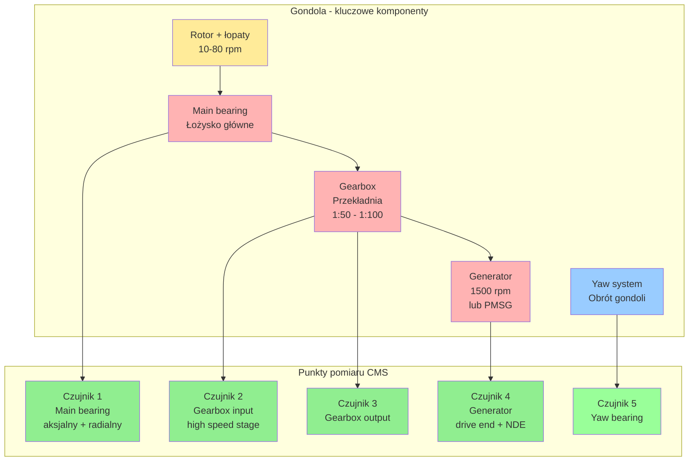

import { 
  SlideContainer, 
  Slide, 
  KeyPoints, 
  SupportingDetails, 
  InstructorNotes,
  VisualSeparator,
  LearningObjective,
  KeyConcept,
  Example
} from '@site/src/components/SlideComponents';
import { InteractiveQuiz } from '@site/src/components/InteractiveQuiz';

<LearningObjective>
Po tej sekcji student potrafi:
- Dobrać odpowiednie czujniki wibracji i akustyki dla różnych komponentów turbiny wiatrowej
- Zaprojektować system Condition Monitoring System (CMS) z uwzględnieniem częstotliwości próbkowania i lokalizacji czujników
- Zinterpretować widma FFT i zidentyfikować charakterystyczne częstotliwości usterek (BPFO, BPFI, harmoniki przekładni)
- Zastosować podstawowe metody analizy drgań do diagnostyki predykcyjnej
</LearningObjective>

<SlideContainer>

<Slide title="🌪️ Monitoring wibracji – cele i ekonomia" type="info">

<KeyPoints title="📋 Dlaczego monitorujemy wibracje?">

**Wibracje to kluczowy wskaźnik stanu technicznego turbiny**. Większość awarii mechanicznych objawia się wzrostem amplitudy drgań na charakterystycznych częstotliwościach.

**Główne cele monitoringu:**
1. **Predykcyjna konserwacja** – wykrycie uszkodzenia 3-12 miesięcy przed awarią
2. **Redukcja OPEX** – planowane przestoje vs. awarie (5-10× tańsze!)
3. **Bezpieczeństwo** – katastrofalne awarie mogą prowadzić do pożarów
4. **Optymalizacja O&M** – interwencje w optymalnych warunkach pogodowych

</KeyPoints>

<KeyPoints title="💰 Koszty i ROI">

**Typowe koszty awarii:**
- Main bearing: 200-500k EUR + downtime ~2-4 tyg.
- Gearbox: 150-400k EUR + downtime ~1-3 tyg.
- Utracona produkcja: 500-2000 EUR/dzień

**ROI systemu CMS:** 
- Koszt: 10-30k EUR/turbinę
- Wykrycie 1 awarii → zwrot 5-15×

</KeyPoints>

<InstructorNotes>

Wprowadzenie do monitoringu wibracji – około pięć do siedmiu minut.

**Kluczowy przekaz**: wibracje to nie tylko szum czy dyskomfort – to **okno do wnętrza mechaniki turbiny**. Wzrost amplitudy na charakterystycznych częstotliwościach (BPFO dla łożysk, mesh frequency dla przekładni) to wczesny sygnał uszkodzenia, często trzy do dwunastu miesięcy przed całkowitą awarią.

Predykcyjna konserwacja versus awarie awaryjne – **różnica w kosztach pięć do dziesięć razy**. Planowana wymiana łożyska to dwieście do trzystu tysięcy euro plus dwa tygodnie downtime, awaryjna (katastroficzna) to czterysta do pięćset tysięcy plus cztery tygodnie (trzeba więcej demontażu, uszkodzenia wtórne).

ROI systemu CMS: koszt dziesięć do trzydzieści tysięcy euro na turbinę. **Wykrycie jednej awarii głównego łożyska zwraca koszt całego systemu pięć do piętnastu razy**. To jest argument dla każdego operatora farmy wiatrowej.

Bezpieczeństwo – katastrofalne awarie łożysk lub przekładni mogą prowadzić do pożarów (olej, tarcie, iskry). Monitoring CMS wykrywa problem wcześnie, zanim dojdzie do niebezpiecznej sytuacji.

</InstructorNotes>

</Slide>

<VisualSeparator type="default" />

<Slide title="⚙️ Komponenty turbiny – architektura" type="info">



<KeyPoints title="📋 Punkty pomiaru CMS">

Typowa turbina &gt;2 MW ma **5-8 czujników wibracji**:
- Main bearing: aksjalny + radialny (wykrycie wear, misalignment)
- Gearbox: input + high-speed stage + output (3 punkty minimum)
- Generator: drive end + non-drive end (łożyska)
- Yaw: bearing + brake system (opcjonalne)

</KeyPoints>

<InstructorNotes>

Architektura turbiny i punkty pomiaru – około pięć do siedmiu minut. **Diagram jest wyjątkiem, może być większy**.

Przejdź przez diagram. **Rotor obraca się powoli** (dziesięć do osiemdziesięciu obrotów na minutę), przekładnia zwiększa prędkość pięćdziesiąt do sto razy, generator pracuje przy tysiąc pięćset obrotach na minutę (lub zmiennie dla PMSG).

**Punkty pomiaru**: minimum pięć czujników w typowej turbinie. Main bearing (łożysko główne) to krytyczny punkt – dwa czujniki, aksjalny i radialny, bo uszkodzenie może być kierunkowe. Gearbox wymaga minimum trzech punktów (wejście, szybki stopień, wyjście) – to najbardziej awaryjny komponent.

Podkreśl różnice prędkości obrotowych. **Rotor to dziesięć do dwudziestu obrotów na minutę, generator tysiąc pięćset**. To ogromna różnica – przekładnia musi to obsłużyć, stąd wysokie obciążenia i awarie.

**Przekładnia to słabe ogniwo** – dwadzieścia do trzydziestu procent awarii turbin dotyczy gearbox. Wysokie obciążenia zmienne (wiatr porywisty), smarowanie (degradacja oleju), zużycie zębów.

Nowoczesne turbiny powyżej czterech megawatów często stosują **direct-drive bez przekładni** – PMSG (permanent magnet) bezpośrednio na wolnym wale. Droższe (plus trzydzieści do pięćdziesięciu procent CAPEX), ale wyższa niezawodność (brak gearbox) i mniej OPEX długoterminowo.

CMS to standard w turbinach powyżej dwóch megawatów, opcjonalne w mniejszych (prosumenckich, poniżej megawata).

Jeśli ktoś zapyta, dlaczego nie wszędzie direct-drive – **koszt**. PMSG dla trzech megawatów to plus trzydzieści do pięćdziesięciu procent ceny względem standardowej konfiguracji z przekładnią. Ale trend idzie w stronę direct-drive, bo OPEX oszczędności w długim terminie.

</InstructorNotes>

</Slide>

<VisualSeparator type="default" />

<Slide title="📊 Częstotliwości i typowe uszkodzenia" type="info">

**Charakterystyczne pasma częstotliwości:**

| Komponent | Prędkość obrotowa | Charakterystyczne pasma | Typowe uszkodzenia |
|-----------|-------------------|-------------------------|-------------------|
| **Main bearing** | 10-20 rpm | BPFO: 5-15 Hz<br/>BPFI: 8-25 Hz | Pittingi, spalling, wear |
| **Gearbox** | Stage 1: 10-20 rpm<br/>Stage 3: 800-1500 rpm | Mesh freq: 50-800 Hz<br/>Harmoniki | Zużycie zębów, pęknięcia |
| **Generator** | 1500 rpm (4-pole)<br/>lub variable (PMSG) | 25 Hz (synch)<br/>2× bar pass: 50-200 Hz | Łożyska, niezbalansowanie |
| **Yaw bearing** | {'<'}1 rpm | {'<'}1 Hz, ultra-low | Zużycie zębów, braking |

<InstructorNotes>

Tabela częstotliwości to praktyczna ściągawka – około cztery do pięciu minut.

Przejdź przez tabelę wiersz po wierszu. **Main bearing** – prędkość dziesięć do dwudziestu obrotów na minutę przekłada się na BPFO (Ball Pass Frequency Outer race) pięć do piętnastu herców. To charakterystyczna częstotliwość uszkodzenia zewnętrznej bieżni łożyska.

**Gearbox** – mesh frequency (częstotliwość zazębienia) to pięćdziesiąt do ośmiuset herców, zależy od liczby zębów i prędkości obrotowej. Harmoniki mesh frequency (dwa razy, trzy razy) wskazują na zużycie lub uszkodzenie zębów.

**Generator** – przy tysiąc pięćset obrotach na minutę (dwadzieścia pięć herców) główna częstotliwość to dwadzieścia pięć herców. Bar pass frequency (dwukrotność liczby prętów wirnika) to pięćdziesiąt do dwustu herców.

**Yaw bearing** – obraca się bardzo wolno (poniżej jeden obrot na minutę), więc częstotliwości ultra-niskie (poniżej jeden herc). Wymaga specjalnych czujników lub długich okien pomiaru.

Typowy błąd studentów: **mylenie herców z obrotami na minutę**. Pamiętaj: jeden herc to sześćdziesiąt obrotów na minutę. Dziesięć obrotów na minutę to zero przecinek siedemnaście herca.

Podkreśl, że **normalne turbiny też drgają** – to nie oznacza awarii. Monitoring polega na wykryciu wzrostu amplitudy na charakterystycznych częstotliwościach lub pojawienia się nowych pików w widmie FFT.

</InstructorNotes>

</Slide>

<VisualSeparator type="technical" />

<Slide title="📡 Akcelerometry piezoelektryczne – standard CMS" type="tip">

<KeyPoints title="📋 Akcelerometry piezoelektryczne (piezo)">

**Zasada działania**: Kryształ piezo generuje ładunek proporcjonalny do przyspieszenia

**Parametry:**
- **Zakres częstotliwości**: 1 Hz – 10 kHz (standardowe), do 50 kHz (high-freq)
- **Czułość**: Typowo 100 mV/g (g = 9.81 m/s²)
- **Zakres dynamiczny**: ±5 g (normalne), ±50 g (ekstremalne)

**Zalety:**
- Szerokie pasmo częstotliwości
- Trwałe, odporne na środowisko
- Małe wymiary (20-50 g)

**Wady:**
- Wymaga przetwornika ładunku lub IEPE (integrated electronics)

**Koszt**: 200-1000 EUR (IEPE), 50-200 EUR (proste piezo)

**Zastosowanie**: ⭐ **Standard dla CMS w turbinach wiatrowych**

</KeyPoints>

<KeyConcept title="IEPE (Integrated Electronics Piezo-Electric)">

IEPE to ulepszona wersja piezo z wbudowaną elektroniką:
- **2-wire**: Sygnał + zasilanie w jednym przewodzie (uproszczenie instalacji)
- **Low impedance output**: Odporność na zakłócenia EMI
- **Typowe zasilanie**: 18-30 V DC (constant current ~2-4 mA)
- **Standard przemysłowy** – 90% czujników w CMS to IEPE

</KeyConcept>

<InstructorNotes>

Akcelerometry piezoelektryczne to fundament CMS – około pięć do siedmiu minut.

**Zasada działania**: kryształ piezoelektryczny pod wpływem naprężenia mechanicznego (przyspieszenia) generuje ładunek elektryczny proporcjonalny do siły. To najprostszy i najtrwalszy sposób pomiaru wibracji.

Zakres częstotliwości jeden herc do dziesięć kiloherców to pokrywa praktycznie wszystkie interesujące częstotliwości w turbinach (BPFO pięć do piętnastu herców, mesh frequency sto do ośmiuset herców). Czujniki high-frequency (do pięćdziesięciu kiloherców) stosuje się do ultrasonic monitoring (wczesne uszkodzenia łożysk).

**Czułość sto miliwoltów na g** to typowa wartość. Przy przyspieszeniu jeden g (9,81 metra na sekundę kwadrat) czujnik daje sto miliwoltów. Dla niskich wibracji (main bearing) stosuje się wyższą czułość (pięćset do tysiąc mV/g) dla lepszego stosunku sygnału do szumu.

**IEPE to game-changer** w przemyśle. Zamiast delikatnego wysokoimpedancyjnego sygnału ładunku (wymaga charge amplifier, ekranowane przewody), IEPE ma wbudowaną elektronikę – **niskoimpedancyjne wyjście odporne na zakłócenia**. Plus: zasilanie i sygnał w jednym przewodzie (2-wire), upraszcza instalację.

Koszt: dwieście do tysiąc euro za IEPE przemysłowy (PCB Piezotronics, Bruel & Kjaer, Kistler). Proste piezo bez elektroniki to pięćdziesiąt do dwustu euro, ale wymaga charge amplifier (dodatkowe sto do trzysta euro).

**Standard przemysłowy: dziewięćdziesiąt procent czujników w CMS to IEPE**. To pewna, sprawdzona technologia.

</InstructorNotes>

</Slide>

<VisualSeparator type="default" />

<Slide title="📡 Inne typy czujników wibracji" type="tip">

<KeyPoints title="📋 Alternatywne technologie">

**Czujniki prędkości drgań (velocity sensors)**
- Cewka w polu magnetycznym → napięcie proporcjonalne do prędkości
- Zakres: 10 Hz – 1 kHz (węższe niż piezo)
- Zalety: Bezpośredni pomiar prędkości (normy ISO 10816)
- Wady: Większe, cięższe, gorsze dla wysokich częstotliwości
- Zastosowanie: Starsze instalacje, pomiary referencyjne

**Akcelerometry MEMS**
- Mikromechaniczne struktury, pomiar przemieszczenia masy
- Zakres: 0 Hz (DC) – 2 kHz
- Zalety: Bardzo małe, tanie (5-50 EUR), cyfrowy interfejs (I2C, SPI)
- Wady: Niższa czułość, dryft, szumy
- Zastosowanie: Monitoring low-cost, IoT, strukturalne (tower)

**Mikrofony kierunkowe (akustyka)**
- Pomiar ciśnienia akustycznego [Pa] lub poziom dźwięku [dB]
- Zakres: 20 Hz – 20 kHz (audio)
- Zastosowanie: Wykrywanie nietypowych dźwięków, diagnostyka łopat

</KeyPoints>

<InstructorNotes>

Alternatywne technologie czujników – około cztery do pięciu minut.

**Czujniki prędkości** (velocity sensors) to starsza technologia – cewka porusza się w polu magnetycznym, generuje napięcie proporcjonalne do prędkości drgań. Zaleta: bezpośredni pomiar prędkości (ISO 10816 definiuje progi w milimetrach na sekundę). Wada: większe (kilkaset gramów), cięższe, węższe pasmo (dziesięć do tysiąc herców). Stosowane w starszych instalacjach i pomiarach referencyjnych.

**MEMS** to nowoczesna, budżetowa alternatywa. Bardzo małe (kilka milimetrów), tanie (pięć do pięćdziesięciu euro), cyfrowy interfejs (I2C, SPI) – łatwo integrować z Raspberry Pi, Arduino. Wady: **niższa czułość, dryft, szumy**. Okej do monitoringu strukturalnego (drgania wieży) lub niskobudżetowych systemów IoT, ale nie do diagnostyki łożysk i przekładni w turbinach megawatowych.

**Mikrofony** to pomoc diagnostyczna – wykrywają nietypowe dźwięki (trzaski, grzechotanie, świsty). Świetne do diagnostyki łopat (trzaski mogą wskazywać pęknięcia), ale nie zastępują akcelerometrów. Niektóre zaawansowane systemy CMS łączą wibracje plus akustykę (multi-modal monitoring).

Jeśli ktoś zapyta o czujniki bezprzewodowe – są dostępne (Bluetooth, LoRa), ale w turbinach powyżej dwóch megawatów **preferowane przewodowe** z powodu niezawodności, zasilania (baterie w gondoli przy minus trzydziestu stopniach to problem) i opóźnień transmisji.

Pytanie o smartfona jako czujnik – do edukacji okej (mamy MEMS wbudowany), do produkcyjnego CMS absolutnie nie (brak kalibracji, dryft, IP rating, żywotność).

</InstructorNotes>

</Slide>

<VisualSeparator type="default" />

<Slide title="🔧 Parametry doboru i montażu czujników" type="tip">

<KeyPoints title="📋 Częstotliwość próbkowania (sampling rate)">

**Twierdzenie Nyquista**: f_sample ≥ 2 × f_max (w praktyce: 2.5-5×)

**Typowe wybory:**
- **Main bearing** (BPFO ~5-15 Hz): f_sample = 200-500 Hz
- **Gearbox** (mesh freq ~100-800 Hz): f_sample = 5-10 kHz
- **Generator** (bar pass ~50-200 Hz): f_sample = 2-5 kHz

**Trade-off**: Wyższa częstotliwość = więcej danych → koszt storage  
**Rozwiązanie**: Tryby próbkowania:
- Ciągły: 1-10 kHz, krótkie okna (10-60 s) co 10-60 min
- Triggered: 10-25 kHz tylko gdy wykryto anomalię

</KeyPoints>

<KeyPoints title="📋 Montaż i orientacja">

**Metody montażu:**
- **Stud mounting** (wkręt M6/M8): Najlepszy kontakt, pasmo do 10 kHz
- **Magnes**: Szybki montaż, pasmo do 3-5 kHz
- **Klej**: Trwałe, pasmo do 7 kHz
- **Taśma**: ❌ NIE STOSOWAĆ (pasmo {'<'}500 Hz, degradacja)

**Orientacja:** 
- **Radialna**: Prostopadła do osi → wykrywa niezbalansowanie, misalignment
- **Aksjalna**: Wzdłuż osi → wykrywa thrust bearing issues
- Typowo: 2 czujniki (radial + axial) na punkt

**IP rating**: Min. IP65, lepiej IP67 (ekstremalne warunki w gondoli)

</KeyPoints>

<InstructorNotes>

Parametry doboru i montażu – około sześć do ośmiu minut.

**Częstotliwość próbkowania to kluczowa decyzja**. Według Nyquista minimum dwa razy maksymalna interesująca częstotliwość, w praktyce dwa i pół do pięć razy zapas.

Main bearing ma BPFO pięć do piętnastu herców, ale potrzebujemy harmonicznych (do piątej harmonicznej, czyli siedemdziesiąt pięć herców) – **próbkowanie dwieście do pięćset herców**. Gearbox z mesh frequency sto do ośmiuset herców wymaga pięć do dziesięć kiloherców.

**Trade-off**: więcej danych to wyższy koszt storage i transmisji. W farmie wiatrowej dziesięć turbin po jedenaście kanałów każda przy dziesięć kiloherców ciągłym próbkowaniu to **gigabajty danych dziennie**. Niepraktyczne.

Rozwiązanie: tryby próbkowania. **Ciągły tryb low-rate** (jeden do dziesięciu kiloherców) przez krótkie okna (dziesięć do sześćdziesięciu sekund) co dziesięć do sześćdziesięciu minut. **Triggered high-rate** (dziesięć do dwadzieścia pięć kiloherców) tylko gdy wykryto anomalię. To redukuje data rate sto do tysiąc razy.

Montaż – **stud mounting to złoty standard**: wkręt M6 lub M8 wkręcony w obudowę łożyska lub przekładni. Najlepszy kontakt mechaniczny, pasmo do dziesięciu kiloherców. Magnes to szybkie, ale kontakt nie idealny (pasmo do trzech do pięciu kiloherców). Klej (cyanoacrylate) to trwałe, pasmo do siedmiu kiloherców.

**Taśma dwustronna to absolutnie nie** – pasmo poniżej pięćset herców, degradacja od temperatury i wilgoci. Widziałem instalacje, gdzie czujniki odkleiły się po roku.

Orientacja – **radialna wykrywa niezbalansowanie i misalignment** (prostopadle do osi obrotu), **aksjalna wykrywa problemy thrust bearing** (wzdłuż osi). Typowo montujemy dwa czujniki na każdy krytyczny punkt (radial plus axial).

IP rating – gondola turbiny to ekstremalne środowisko: minus trzydzieści do plus siedemdziesięciu stopni, wilgotność do stu procent (kondensacja). **Minimum IP65 (kurz, woda), lepiej IP67** (zanurzenie chwilowe).

</InstructorNotes>

</Slide>

<VisualSeparator type="default" />

<Slide title="💼 Przykład: Konfiguracja CMS dla turbiny 3 MW" type="success">

<Example title="Kompletna konfiguracja systemu monitoringu">

**Specyfikacja turbiny:**
- Moc: 3 MW, rotor 110 m, 3 łopaty
- Gearbox: 3-stage, ratio 1:97
- Generator: asynchronous, 1500 rpm
- High-speed shaft: ~1500 rpm

**Konfiguracja czujników:**

| Punkt pomiarowy | Typ | Czułość | Orientacja | f_sample | Tryb |
|-----------------|-----|---------|------------|----------|------|
| Main bearing | IEPE | 500 mV/g | Rad + ax | 2 kHz | Cont 30s/10min |
| Gearbox input | IEPE | 100 mV/g | Radial | 10 kHz | Cont 60s/60min |
| Gearbox output (HSS) | IEPE | 100 mV/g | Rad + ax | 10 kHz | Cont 60s/60min |
| Generator DE | IEPE | 100 mV/g | Rad + ax | 5 kHz | Cont 30s/30min |
| Generator NDE | IEPE | 100 mV/g | Radial | 5 kHz | Cont 30s/30min |
| Tower top | MEMS | 2000 mV/g | 2× horiz | 100 Hz | Continuous |

**Łącznie**: 11 kanałów, ~150 MB/dzień (po kompresji)

**System**: CompactDAQ + 4G/LTE → cloud  
**Koszt**: ~15 000 EUR

</Example>

<InstructorNotes>

Przykład konkretnej konfiguracji – około pięć do siedmiu minut.

Przejdź przez tabelę wiersz po wierszu. **Main bearing** – czułość pięćset miliwoltów na g (wysoka, bo wibracje niskie), orientacja radialna plus aksjalna (dwa czujniki), próbkowanie dwa kilohercy. Tryb ciągły przez trzydzieści sekund co dziesięć minut – to wystarczy do wykrycia trendów.

**Gearbox** – krytyczny komponent, dlatego trzy punkty pomiaru. Czułość sto miliwoltów na g (niższa, bo wibracje wyższe – unikamy saturacji), próbkowanie dziesięć kiloherców (mesh frequency do ośmiuset herców, potrzeba zapasu).

**Generator** – dwa punkty (drive end i non-drive end), próbkowanie pięć kiloherców wystarczy (bar pass frequency do dwustu herców).

**Tower** – monitoring strukturalny, MEMS wystarczy (tani, niskie częstotliwości poniżej dziesięciu herców), ciągłe próbkowanie sto herców.

Łącznie jedenaście kanałów daje około sto pięćdziesiąt megabajtów dziennie po kompresji (raw byłoby gigabajty). **Edge processing** oblicza features (RMS, kurtosis, FFT peaks) lokalnie, wysyła tylko istotne dane do chmury.

System akwizycji: CompactDAQ (National Instruments) lub equivalent, dwudziesto-cztery-bitowy ADC, Ethernet do SCADA w podstawie gondoli, stamtąd 4G/LTE do cloud.

Koszt całkowity około piętnaście tysięcy euro (czujniki plus DAQ plus instalacja) to **mniej niż dwa procent wartości turbiny** (trzy megawaty to około milion euro), ale decyduje o wykryciu awarii kosztujących setki tysięcy.

</InstructorNotes>

</Slide>

<VisualSeparator type="technical" />

<Slide title="🔬 Analiza sygnałów wibracji – domeny analizy" type="info">

<KeyConcept title="Trzy domeny analizy wibracji">

**1. Domena czasu (time domain)**
- Surowy sygnał: Przyspieszenie [g] vs. czas [s]
- Metryki: RMS, peak, crest factor, kurtosis
- Zalety: Prosty, bezpośredni
- Wady: Trudno zidentyfikować konkretną usterkę

**2. Domena częstotliwości (FFT)**
- Transformata Fouriera: Rozkład sygnału na składowe harmoniczne
- Wykres: Amplituda [g] vs. częstotliwość [Hz]
- **KLUCZOWA dla diagnostyki** – każda usterka ma "swoją" częstotliwość

**3. Domena czasu-częstotliwości (STFT, Wavelet)**
- Dla sygnałów niestacjonarnych (zmienne obroty)
- Order tracking: Widmo w "order" (wielokrotności RPM)
- Envelope analysis: Demodulacja, wczesne uszkodzenia łożysk

</KeyConcept>

<InstructorNotes>

Wprowadzenie do analizy sygnałów – około pięć do siedmiu minut.

**Trzy domeny analizy** to fundamentalne podejścia do przetwarzania sygnałów wibracji.

**Domena czasu** – surowy sygnał, przyspieszenie versus czas. Obliczamy metryki statystyczne: RMS (root mean square, wartość skuteczna), peak (maksimum), crest factor (stosunek peak do RMS), kurtosis (spłaszczenie rozkładu). **Proste, ale trudno zdiagnozować konkretną usterkę** – wszystko wygląda jak "szum".

**Domena częstotliwości** – **to jest game-changer**. Transformata Fouriera FFT rozkłada sygnał na składowe harmoniczne. Dostajemy wykres amplitudy versus częstotliwości. **Każda usterka ma charakterystyczną częstotliwość** – BPFO dla zewnętrznej bieżni łożyska, mesh frequency dla przekładni. To kluczowe narzędzie diagnostyczne.

**Domena czasu-częstotliwości** – dla sygnałów niestacjonarnych (turbiny mają zmienne obroty przez zmienność wiatru). STFT (Short-Time Fourier Transform) to FFT dla przesuwanych okien czasowych. Wavelet to analiza wieloskalowa. Order tracking synchronizuje widmo z prędkością obrotową – dostajemy widmo w "order" (wielokrotności RPM) zamiast w hercach.

**Envelope analysis** – demodulacja wysokoczęstotliwościowej resonancji (pięć do dwudziestu kiloherców), która jest modulowana przez BPFO/BPFI. Pozwala wykryć wczesne uszkodzenia łożysk (mikro-pittingi), które są niewidoczne w zwykłym FFT. To zaawansowana technika, ale dostępna w komercyjnych systemach CMS.

</InstructorNotes>

</Slide>

<VisualSeparator type="default" />

<Slide title="📐 Częstotliwości usterek łożysk" type="info">

<SupportingDetails title="📊 Charakterystyczne częstotliwości łożysk">

Każde łożysko ma **4 charakterystyczne częstotliwości**:

**BPFO (Ball Pass Frequency Outer race)** – zewnętrzna bieżnia:
$$
BPFO = \frac{n \cdot f_r}{2} \left(1 + \frac{d}{D} \cos \phi \right)
$$

**BPFI (Ball Pass Frequency Inner race)** – wewnętrzna bieżnia:
$$
BPFI = \frac{n \cdot f_r}{2} \left(1 - \frac{d}{D} \cos \phi \right)
$$

**BSF (Ball Spin Frequency)** – kulka/rolka:
$$
BSF = \frac{D \cdot f_r}{2 \cdot d} \left(1 - \left(\frac{d}{D} \cos \phi \right)^2 \right)
$$

**FTF (Fundamental Train Frequency)** – koszyk:
$$
FTF = \frac{f_r}{2} \left(1 - \frac{d}{D} \cos \phi \right)
$$

Gdzie: $f_r$ [Hz], $n$ – liczba kulek, $d$, $D$ [mm], $\phi$ [°]

**Interpretacja:**
- **BPFO** – najczęstsze (obciążenie statyczne, outer race)
- **BPFI** – inner race
- **BSF** – uszkodzenie kulki/rolki
- **FTF** – uszkodzenie koszyka

</SupportingDetails>

<InstructorNotes>

Wzory charakterystycznych częstotliwości łożysk – około cztery do pięciu minut. **To może być techniczne**, ale studenci inżynierowie muszą to znać.

Każde łożysko ma cztery charakterystyczne częstotliwości – BPFO, BPFI, BSF, FTF. **Wzory wyglądają strasznie**, ale w praktyce producenci łożysk (SKF, FAG, Schaeffler) podają te wartości w katalogach i kartach technicznych.

**BPFO to najczęstsza częstotliwość uszkodzenia** – zewnętrzna bieżnia łożyska nosi obciążenie statyczne (ciężar wału, rotora). Pittingi i spalling pojawiają się tam najpierw.

Nie wymagaj od studentów zapamiętania wzorów – **ważniejsze jest zrozumienie, że każda część łożyska ma swoją częstotliwość**. W diagnostyce FFT szukamy peaków na tych częstotliwościach i ich harmonicznych.

Przykładowo: dla main bearing przy piętnastu obrotach na minutę (zero przecinek dwadzieścia pięć herca) i liczbie kulek dwadzieścia, BPFO to około dziesięć do dwunastu herców. **Pik na tej częstotliwości w FFT to sygnał alarmowy** – zewnętrzna bieżnia ma uszkodzenie.

Podkreśl, że **w praktyce nie liczymy tych wzorów ręcznie** – software CMS (SKF @ptitude, Emerson AMS, Bruel & Kjaer) ma wbudowane bazy danych łożysk i automatycznie oblicza te częstotliwości na podstawie prędkości obrotowej i typu łożyska.

</InstructorNotes>

</Slide>

<VisualSeparator type="default" />

<Slide title="⚙️ Mesh frequency przekładni" type="info">

<KeyPoints title="📋 Częstotliwość zazębienia">

**Mesh frequency**:
$$
f_{mesh} = z_1 \cdot f_{shaft1} = z_2 \cdot f_{shaft2}
$$

Gdzie: $z_1, z_2$ – liczba zębów, $f_{shaft}$ – częstotliwość obrotowa [Hz]

**Harmoniczne**: Uszkodzenia zazębienia → sidebands wokół $f_{mesh}$ i harmonicznych (2×, 3×)

**Przykład (turbina 3 MW):**
- Gearbox stage 1: $z_1 = 20$, $z_2 = 80$, ratio 1:4
- Rotor: 15 rpm = 0.25 Hz
- Intermediate shaft: 60 rpm = 1 Hz
- **Mesh freq stage 1**: $f_{mesh} = 20 \times 0.25 = 5$ Hz

</KeyPoints>

<InstructorNotes>

Mesh frequency przekładni – około trzy do czterech minut.

**Mesh frequency to częstotliwość zazębienia** – ile razy na sekundę zęby jednego koła zazębiają się z drugim kołem. Wzór prosty: liczba zębów razy częstotliwość obrotowa wału.

Przykład: koło dwadzieścia zębów obraca się z zero przecinek dwadzieścia pięć herca (rotor piętnaście obrotów na minutę). Mesh frequency to dwadzieścia razy zero przecinek dwadzieścia pięć równa się pięć herców.

**Diagnostyka**: uszkodzenie zazębienia (zużycie zębów, pęknięcia, misalignment) pojawia się jako **sidebands** wokół mesh frequency i jej harmonicznych. Sideband to dodatkowy pik przesunięty o częstotliwość wału (plus minus jeden herc w naszym przykładzie).

Przykładowo: mesh frequency pięć herców, widzimy piki na cztery, pięć, sześć herców – to wskazuje na uszkodzenie zazębienia modulowane przez obroty wału.

Podkreśl, że **to prostsze niż łożyska** – jeden wzór, łatwa interpretacja. Software CMS automatycznie oblicza mesh frequencies dla wszystkich stopni przekładni.

</InstructorNotes>

</Slide>

<VisualSeparator type="default" />

<Slide title="📈 Studium przypadku: Uszkodzenie main bearing" type="success">

<Example title="Wykrywanie uszkodzenia main bearing – case study">

**Kontekst:**
- Turbina 2.5 MW, eksploatacja 8 lat
- CMS pokazuje wzrost RMS w kanale main bearing radial (3 miesiące trend)

**Analiza FFT:**

```
Częstotliwość [Hz]    Amplituda [g]    Identyfikacja
-----------------------------------------------------
0.25                  0.05             1× RPM (rotor speed)
0.50                  0.02             2× RPM
12.8                  0.15             BPFO (outer race defect)
25.6                  0.08             2× BPFO
38.4                  0.04             3× BPFO
```

**Diagnoza:**
- Wyraźny peak na BPFO i harmoniczne (2×, 3×) → **uszkodzenie zewnętrznej bieżni main bearing**
- Amplituda BPFO wzrosła z 0.02 g (baseline, 6 miesięcy temu) do 0.15 g → **progresja**

**Zalecenie:**
- Wymiana main bearing w ciągu 2-3 miesięcy (planowany przestój)
- Zwiększenie częstotliwości monitoringu (co tydzień zamiast co miesiąc)

**Rzeczywiste działanie:**
- Wymiana wykonana po 2 miesiącach (letnia przerwa serwisowa)
- Koszt: 350 000 EUR (bearing + crane + downtime 3 tygodnie)
- **Uniknięto katastroficznej awarii** (potencjalne uszkodzenie gearbox, koszt >1 mln EUR)

**ROI CMS w tym przypadku: >30×** (koszt CMS ~10 000 EUR vs. koszt unikniętej awarii katastrofalnej)

</Example>

<InstructorNotes>

**Czas**: 16-18 min

**Przebieg**:
1. Wprowadzenie do trzech domen analizy (4 min) – pokaż przykładowy sygnał w time i frequency domain
2. Charakterystyczne częstotliwości łożysk i przekładni (6 min) – wyprowadź wzór na BPFO lub pokaż tabelę
3. Case study uszkodzenia main bearing (4 min) – pokaż rzeczywisty wykres FFT (jeśli dostępny)
4. Dyskusja: Jak studenci zinterpretowaliby wzrost amplitudy na nieznanej częstotliwości? (2 min)
5. Q&A (2 min)

**Punkty kluczowe**:
- **FFT to "lupa" na sygnał** – pozwala zobaczyć, co jest ukryte w time domain
- Diagnostyka wibracji = detektyw + fizyka + doświadczenie. Algorytmy (ML) pomagają, ale nie zastąpią eksperta
- Wzory na BPFO/BPFI wyglądają strasznie, ale w praktyce: bierzemy z katalogu łożyska!

**Demonstracja praktyczna**:
- Live FFT w Python (matplotlib, scipy.fft) – studenci mogą zobaczyć jak działa
- Audio playback wibracji z uszkodzonym vs. zdrowym łożyskiem (różnica słyszalna!)
- Pokaż Waterfall plot (3D: freq × time × amplitude) – piękna wizualizacja progresji uszkodzenia

**Materiały pomocnicze**:
- SKF Bearing Calculator (online tool do BPFO/BPFI)
- ISO 20816-1:2016 – Mechanical vibration (acceptance criteria)
- Przykład raportu CMS z prawdziwej turbiny (PDF, zanonimizowany)

**Typowe błędy studenckie**:
- Mylenie $f_r$ w [rpm] vs. [Hz] w równaniach – ZAWSZE Hz!
- Niezrozumienie, że BPFO ≠ stała wartość – zależy od RPM (dlatego order tracking!)
- Myślenie, że każdy peak w FFT to uszkodzenie – mogą być resonance, harmoniczne, artefakty

**Pytania studenckie**:
- Q: Jak rozróżnić BPFO od innej częstotliwości (np. mesh frequency)?
- A: (1) Porównanie z katalogowymi wartościami łożyska, (2) envelope analysis (BPFO występuje w modulacji high-freq), (3) tracking zmian w czasie (BPFO rośnie przy uszkodzeniu)

- Q: Czy ML/AI może zastąpić analizę FFT?
- A: Częściowo. ML (np. CNN na spektrogramach) świetnie wykrywa anomalie, ale ekspert musi zweryfikować diagnozę i podjąć decyzję o interwencji. Hybrid approach: ML do screeningu, ekspert do final diagnosis.

</InstructorNotes>

</Slide>

</SlideContainer>