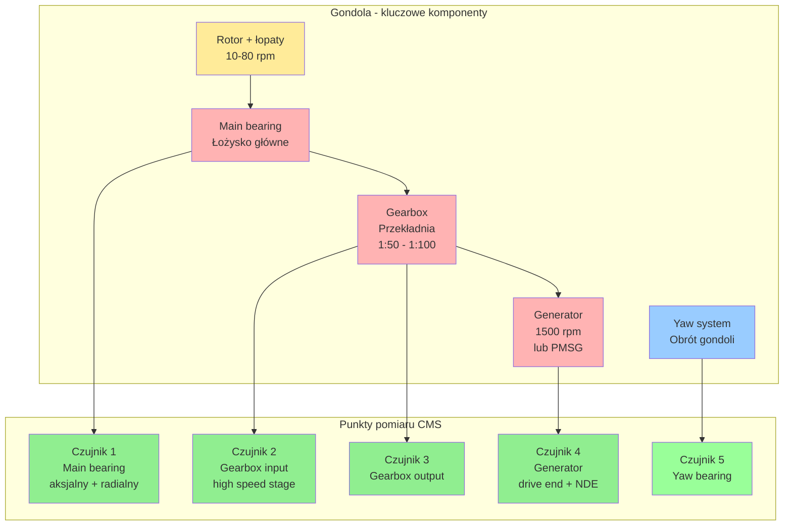

import { 
  SlideContainer, 
  Slide, 
  KeyPoints, 
  SupportingDetails, 
  InstructorNotes,
  VisualSeparator,
  LearningObjective,
  KeyConcept,
  Example
} from '@site/src/components/SlideComponents';
import { InteractiveQuiz } from '@site/src/components/InteractiveQuiz';

<LearningObjective>
Po tej sekcji student potrafi:
- Dobrać odpowiednie czujniki wibracji i akustyki dla różnych komponentów turbiny wiatrowej
- Zaprojektować system Condition Monitoring System (CMS) z uwzględnieniem częstotliwości próbkowania i lokalizacji czujników
- Zinterpretować widma FFT i zidentyfikować charakterystyczne częstotliwości usterek (BPFO, BPFI, harmoniki przekładni)
- Zastosować podstawowe metody analizy drgań do diagnostyki predykcyjnej
</LearningObjective>

<SlideContainer>

<Slide title="🌪️ Monitoring wibracji w turbinach wiatrowych – wprowadzenie" type="info">

<KeyPoints title="📋 Dlaczego monitorujemy wibracje?">

**Wibracje to kluczowy wskaźnik stanu technicznego turbiny wiatrowej**. Większość awarii mechanicznych (łożyska, przekładnie, wał) objawia się wzrostem amplitudy drgań na charakterystycznych częstotliwościach.

**Główne cele monitoringu wibracji:**

1. **Predykcyjna konserwacja (Predictive Maintenance)** – wykrycie uszkodzenia 3-12 miesięcy przed awarią
2. **Redukcja OPEX** – planowane przestoje vs. awarie awaryjne (5-10× tańsze!)
3. **Bezpieczeństwo** – katastrofalne awarie łożysk/przekładni mogą prowadzić do pożarów
4. **Optymalizacja O&M** – interwencje serwisowe w optymalnych warunkach pogodowych (dostęp, safe-to-climb)

**Typowe koszty awarii:**
- Wymiana głównego łożyska (main bearing): 200 000 – 500 000 EUR + downtime ~2-4 tygodnie
- Wymiana przekładni (gearbox): 150 000 – 400 000 EUR + downtime ~1-3 tygodnie
- Utracona produkcja: 500-2000 EUR/dzień (zależnie od wielkości turbiny i cen energii)

**ROI systemu CMS (Condition Monitoring System)**: 
Koszt CMS: 10 000 – 30 000 EUR/turbinę. Wykrycie 1 awarii głównego łożyska → zwrot 5-15×.

</KeyPoints>

<SupportingDetails title="🔧 Komponenty turbiny wiatrowej wymagające monitoringu">



**Kluczowe komponenty i ich typowe częstotliwości:**

| Komponent | Prędkość obrotowa | Charakterystyczne pasma | Typowe uszkodzenia |
|-----------|-------------------|-------------------------|-------------------|
| **Main bearing** | 10-20 rpm | BPFO: 5-15 Hz, BPFI: 8-25 Hz | Pittingi, spalling, wear |
| **Gearbox** | Stage 1: 10-20 rpm<br/>Stage 3: 800-1500 rpm | Mesh frequencies: 50-800 Hz<br/>Harmoniki przekładni | Zużycie zębów, pęknięcia |
| **Generator** | 1500 rpm (4-pole)<br/>lub variable (PMSG) | 25 Hz (synchronous)<br/>2× bar pass: 50-200 Hz | Łożyska, niezbalansowanie |
| **Yaw bearing** | &lt;1 rpm | &lt;1 Hz, ultra-low frequency | Zużycie zębów, braking system |

</SupportingDetails>

<InstructorNotes>

**Czas**: 12-15 min

**Przebieg**:
1. Wprowadzenie do monitoringu wibracji – dlaczego jest kluczowy? (3 min)
2. Omówienie komponentów turbiny z diagramem (4 min) – wskaż na różnice prędkości obrotowych (10 rpm rotor vs. 1500 rpm generator)
3. Przykłady kosztów awarii vs. koszt CMS (3 min) – podkreśl ROI
4. Dyskusja: Czy studenci widzieli turbinę od środka? (2 min)
5. Q&A (2 min)

**Punkty kluczowe**:
- **Przekładnia to "słabe ogniwo"** – ~20-30% awarii turbin dotyczy gearbox (wysokie obciążenia zmienne, smarowanie)
- Modern turbiny (&gt;4 MW) często stosują **direct-drive** (bez przekładni) → inne profile wibracji, PMSG
- CMS to standard w turbinach &gt;2 MW, opcjonalne w &lt;1 MW (prosumenckie)

**Demonstracja praktyczna**:
- Pokaż zdjęcia/filmy z wnętrza gondoli turbiny (jeśli dostępne)
- Wykres wibracji przed i po awarii łożyska (dramatyczny wzrost amplitudy)

**Materiały pomocnicze**:
- Schemat turbiny z komponentami (Vestas, Siemens Gamesa, GE)
- Przykładowy raport CMS z prawdziwej turbiny (zanonimizowany)
- ISO 10816 – Mechanical vibration – Evaluation of machine vibration

**Typowe błędy studenckie**:
- Mylenie częstotliwości obrotowej [Hz] z prędkością obrotowej [rpm] – pamiętaj: 1 Hz = 60 rpm
- Niezrozumienie, że przekładnia ZWIĘKSZA prędkość (rotor powolny → generator szybki)
- Myślenie, że wibracje zawsze oznaczają awarię – normalne turbiny też drgają!

**Pytania studenckie**:
- Q: Dlaczego nie stosuje się wszędzie direct-drive (bez przekładni)?
- A: Koszt! PMSG (permanent magnet synchronous generator) dla 3 MW jest ~30-50% droższy. Ale: wyższa niezawodność (brak gearbox), mniej OPEX long-term.

- Q: Jak często wymieniany jest olej w przekładni?
- A: Zależy od typu. Syntetyczne oleje: co 3-5 lat. Ale: regularne badania oleju (particle count, water content) co 6-12 miesięcy.

</InstructorNotes>

</Slide>

<VisualSeparator type="technical" />

<Slide title="📡 Czujniki wibracji – technologie i dobór" type="tip">

<KeyPoints title="📋 Typy czujników">

**1. Akcelerometry piezoelektryczne**
- **Zasada działania**: Kryształ piezo generuje ładunek proporcjonalny do przyspieszenia
- **Zakres częstotliwości**: 1 Hz – 10 kHz (standardowe), do 50 kHz (high-frequency)
- **Czułość**: Typowo 100 mV/g (g = 9.81 m/s²)
- **Zalety**: Szerokie pasmo, trwałe, małe (20-50 g), odporność na środowisko
- **Wady**: Wymaga przetwornika ładunku (charge amplifier) lub IEPE (integrated electronics)
- **Koszt**: 200-1000 EUR (IEPE), 50-200 EUR (proste piezo)
- **Zastosowanie**: **Standard dla CMS w turbinach wiatrowych**

**2. Czujniki prędkości drgań (velocity sensors)**
- **Zasada działania**: Cewka w polu magnetycznym, generuje napięcie proporcjonalne do prędkości
- **Zakres częstotliwości**: 10 Hz – 1 kHz (węższe niż piezo)
- **Zalety**: Bezpośredni pomiar prędkości (często stosowana w normach ISO 10816)
- **Wady**: Większe, cięższe, gorsze dla wysokich częstotliwości
- **Zastosowanie**: Starsze instalacje, pomiary referencyjne

**3. Akcelerometry MEMS**
- **Zasada działania**: Mikromechaniczne struktury, pomiar przemieszczenia masy
- **Zakres częstotliwości**: 0 Hz (DC) – 2 kHz
- **Zalety**: Bardzo małe, tanie (5-50 EUR), niskie pobór mocy, cyfrowy interfejs (I2C, SPI)
- **Wady**: Niższa czułość, dryft, szumy
- **Zastosowanie**: Monitoring low-cost, IoT, strukturalne (tower vibrations)

**4. Mikrofony kierunkowe (akustyka)**
- **Zasada działania**: Pomiar ciśnienia akustycznego [Pa] lub poziom dźwięku [dB]
- **Zakres częstotliwości**: 20 Hz – 20 kHz (audio)
- **Zastosowanie**: Wykrywanie nietypowych dźwięków (trzaski, grzechotanie), diagnostyka łopat, noise pollution monitoring

</KeyPoints>

<SupportingDetails title="🔧 Parametry kluczowe przy wyborze czujników">

### 1. Zakres dynamiczny i czułość

**Czułość akcelerometru** (sensitivity) – typowo 10-1000 mV/g:
- **Wysoka czułość (500-1000 mV/g)**: Dla niskich wibracji (main bearing, tower), lepszy SNR (signal-to-noise ratio)
- **Niska czułość (10-100 mV/g)**: Dla wysokich wibracji (gearbox, generator), unika saturacji

**Zakres pomiaru**: ±5 g (normalne), ±50 g (ekstremalne warunki, startupy)

### 2. Częstotliwość próbkowania (sampling rate)

**Twierdzenie Nyquista**: f_sample ≥ 2 × f_max (w praktyce: 2.5-5×)

**Typowe wybory:**
- **Main bearing** (BPFO ~5-15 Hz): f_sample = 200-500 Hz (zapas dla harmonicznych)
- **Gearbox** (mesh frequency ~100-800 Hz): f_sample = 5-10 kHz
- **Generator** (bar pass frequency ~50-200 Hz): f_sample = 2-5 kHz

**Trade-off**: Wyższa częstotliwość = więcej danych → wyższy koszt storage/transmisji. W praktyce: **CMS próbkuje w trybach:**
- Ciągły (continuous): 1-10 kHz dla krótkich okien (10-60 s) co 10-60 min
- Triggered: Wysoka częstotliwość (10-25 kHz) tylko gdy wykryto anomalię

### 3. Montaż i orientacja

**Metody montażu:**
- **Stud mounting** (wkręt M6/M8): Najlepszy kontakt, pasmo do 10 kHz
- **Magnes**: Szybki montaż, pasmo do 3-5 kHz (kontakt nie idealny)
- **Klej**: Trwałe, pasmo do 7 kHz
- **Taśma dwustronna**: NIE STOSOWAĆ (pasmo &lt;500 Hz, degradacja)

**Orientacja:** 
- Radialna (radial): Prostopadła do osi obrotu → wykrywa niezbalansowanie, misalignment
- Aksjalna (axial): Wzdłuż osi → wykrywa thrust bearing issues
- Typowo: 2 czujniki (radial + axial) na każdy punkt pomiarowy

### 4. Ochrona środowiskowa

Turbiny wiatrowe = ekstremalne środowisko:
- **Temperatura**: -30°C do +70°C (gondola latem)
- **Wilgotność**: Do 100% (kondensacja, deszcz przez uszczelki)
- **Wibracje**: Czujnik musi wytrzymać to, co mierzy!
- **IP rating**: Min. IP65 (kurz, strumienie wody), lepiej IP67 (zanurzenie chwilowe)

</SupportingDetails>

<Example title="Konfiguracja CMS dla turbiny 3 MW">

**Specyfikacja turbiny:**
- Moc: 3 MW, rotor 110 m, 3 łopaty
- Gearbox: 3-stage, ratio 1:97
- Generator: asynchronous, 1500 rpm (50 Hz grid)
- High-speed shaft: ~1500 rpm

**Konfiguracja czujników:**

| Punkt pomiarowy | Typ czujnika | Czułość | Orientacja | f_sample | Tryb |
|-----------------|--------------|---------|------------|----------|------|
| Main bearing (upwind) | IEPE piezo | 500 mV/g | Radial + axial | 2 kHz | Continuous 30s/10min |
| Gearbox input | IEPE piezo | 100 mV/g | Radial | 10 kHz | Continuous 60s/60min |
| Gearbox output (HSS) | IEPE piezo | 100 mV/g | Radial + axial | 10 kHz | Continuous 60s/60min |
| Generator DE (drive end) | IEPE piezo | 100 mV/g | Radial + axial | 5 kHz | Continuous 30s/30min |
| Generator NDE (non-drive end) | IEPE piezo | 100 mV/g | Radial | 5 kHz | Continuous 30s/30min |
| Tower top | MEMS | 2000 mV/g | 2× horizontal | 100 Hz | Continuous |

**Łącznie**: 11 kanałów, ~150 MB danych/dzień (po kompresji)

**System akwizycji:**
- **Edge device**: CompactDAQ (National Instruments) lub equival., 24-bit ADC
- **Komunikacja**: Ethernet → SCADA master w gondola base → 4G/LTE → cloud
- **Analiza**: Edge (basic FFT, alarmy) + cloud (advanced analytics, ML)

**Koszt całkowity**: ~15 000 EUR (czujniki + DAQ + instalacja)

</Example>

<InstructorNotes>

**Czas**: 18-20 min (dużo techniki!)

**Przebieg**:
1. Przegląd typów czujników (6 min) – pokaż przykładowy akcelerometr IEPE
2. Omówienie parametrów wyboru (6 min) – częstotliwość próbkowania to kluczowa decyzja
3. Montaż i orientacja (3 min) – pokaż zdjęcia różnych montaży
4. Przykład konfiguracji CMS (3 min) – omów trade-offy (liczba czujników vs. koszt vs. coverage)
5. Q&A (2 min)

**Punkty kluczowe**:
- **IEPE (Integrated Electronics Piezo-Electric)** to standard – wbudowana elektronika, prosty interfejs (2-wire: signal + zasilanie)
- Częstotliwość próbkowania: więcej ≠ lepiej! 10 kHz to max dla większości aplikacji (powyżej to ultrasonic, specjalistyczne)
- Redundancja: W krytycznych punktach (main bearing, gearbox HSS) stosuje się 2 czujniki (różne producenci) → fail-safe

**Demonstracja praktyczna**:
- Pokaż akcelerometr IEPE (jeśli dostępny) – małe urządzenie, M8 thread
- Wykres raw data (time domain) vs. FFT (frequency domain) – pokazuje siłę transformacji
- Audio playback wibracji (sonifikacja) – ciekawa demonstracja

**Materiały pomocnicze**:
- Datasheets: PCB Piezotronics 356A15 (standard industrial IEPE)
- ISO 10816-21:2015 – Wind turbines (normy dla CMS)
- Przykład instalacji czujników (zdjęcia z turbiny)

**Typowe błędy studenckie**:
- Mylenie prędkości drgań [mm/s] z przyspieszenia [m/s² lub g] – to różne wielkości!
- Stosowanie za niskiej częstotliwości próbkowania → aliasing (fałszywe częstotliwości)
- Ignorowanie montażu – źle przyklejony czujnik = bezużyteczne dane

**Pytania studenckie**:
- Q: Dlaczego nie stosuje się czujników bezprzewodowych (wireless)?
- A: Są dostępne (np. Bluetooth, LoRa), ale: (1) baterie w gondoli (-30°C, wibracje), (2) niezawodność, (3) opóźnienia. W turbinach >2 MW preferowane przewodowe.

- Q: Czy można używać smartfona jako czujnika wibracji (MEMS)?
- A: Do edukacji/demonstracji – tak. Do produkcyjnego CMS – nie (dryft, brak kalibracji, IP rating).

</InstructorNotes>

</Slide>

<VisualSeparator type="technical" />

<Slide title="🔬 Analiza sygnałów wibracji – od surowych danych do diagnostyki" type="info">

<KeyConcept title="Trzy domeny analizy wibracji">

**1. Domena czasu (time domain)**
- **Surowy sygnał**: Przyspieszenie [g] vs. czas [s]
- **Metryki**: RMS (root mean square), peak, crest factor, kurtosis
- **Zalety**: Prosty, bezpośredni, łatwy do wizualizacji
- **Wady**: Trudno zidentyfikować konkretną usterkę (wszystko "zaszumione")

**2. Domena częstotliwości (frequency domain) – FFT**
- **Transformata Fouriera**: Rozkład sygnału na składowe harmoniczne
- **Wykres**: Amplituda [g lub mm/s] vs. częstotliwość [Hz]
- **Zalety**: **KLUCZOWA dla diagnostyki** – każda usterka ma "swoją" częstotliwość
- **Wady**: Wymaga stacjonarności sygnału (constant speed)

**3. Domena czasu-częstotliwości (time-frequency) – STFT, Wavelet**
- **Short-Time Fourier Transform (STFT)**: FFT dla przesuwanych okien czasowych
- **Wavelet**: Analiza wieloskalowa
- **Zalety**: Dla sygnałów niestacjonarnych (zmienne obroty, transjenty)
- **Wady**: Bardziej skomplikowane, większe wymagania obliczeniowe

**Dla turbin wiatrowych (zmienne obroty!) stosuje się:**
- **Order tracking**: Synchronizacja z prędkością obrotową → widmo w "order" (wielokrotności RPM) zamiast Hz
- **Envelope analysis**: Demodulacja high-frequency, wykrywa wczesne uszkodzenia łożysk

</KeyConcept>

<SupportingDetails title="📊 Charakterystyczne częstotliwości usterek">

### Łożyska (bearings)

Każde łożysko ma **4 charakterystyczne częstotliwości**:

$$
BPFO = \frac{n \cdot f_r}{2} \left(1 + \frac{d}{D} \cos \phi \right) \quad \text{(Ball Pass Frequency Outer race)}
$$

$$
BPFI = \frac{n \cdot f_r}{2} \left(1 - \frac{d}{D} \cos \phi \right) \quad \text{(Ball Pass Frequency Inner race)}
$$

$$
BSF = \frac{D \cdot f_r}{2 \cdot d} \left(1 - \left(\frac{d}{D} \cos \phi \right)^2 \right) \quad \text{(Ball Spin Frequency)}
$$

$$
FTF = \frac{f_r}{2} \left(1 - \frac{d}{D} \cos \phi \right) \quad \text{(Fundamental Train Frequency)}
$$

Gdzie:
- $f_r$ – częstotliwość obrotowa [Hz]
- $n$ – liczba kulek/rolek
- $d$ – średnica kulki/rolki [mm]
- $D$ – średnica podziałowa łożyska (pitch diameter) [mm]
- $\phi$ – kąt przyłożenia (contact angle) [°]

**Interpretacja:**
- **BPFO** – uszkodzenie zewnętrznej bieżni (outer race) – najczęstsze (obciążenie statyczne)
- **BPFI** – uszkodzenie wewnętrznej bieżni (inner race)
- **BSF** – uszkodzenie kulki/rolki (ball/roller defect)
- **FTF** – uszkodzenie koszyka (cage)

**W praktyce:** Producenci łożysk podają te częstotliwości w katalogach (np. SKF, FAG, Schaeffler)

### Przekładnie (gears)

**Mesh frequency** (częstotliwość zazębienia):

$$
f_{mesh} = z_1 \cdot f_{shaft1} = z_2 \cdot f_{shaft2}
$$

Gdzie:
- $z_1, z_2$ – liczba zębów na kołach 1 i 2
- $f_{shaft1}, f_{shaft2}$ – częstotliwości obrotowe wałów [Hz]

**Harmoniczne**: Uszkodzenia zazębienia pojawiają się jako sidebands wokół $f_{mesh}$ i jej harmonicznych (2×, 3×, ...)

**Przykład (turbina 3 MW):**
- Gearbox stage 1: $z_1 = 20$, $z_2 = 80$, ratio 1:4
- Rotor: 15 rpm = 0.25 Hz
- Intermediate shaft: 15 × 4 = 60 rpm = 1 Hz
- Mesh freq stage 1: $f_{mesh} = 20 \times 0.25 = 5$ Hz

</SupportingDetails>

<Example title="Wykrywanie uszkodzenia main bearing – case study">

**Kontekst:**
- Turbina 2.5 MW, eksploatacja 8 lat
- CMS pokazuje wzrost RMS w kanale main bearing radial (3 miesiące trend)

**Analiza FFT:**

```
Częstotliwość [Hz]    Amplituda [g]    Identyfikacja
-----------------------------------------------------
0.25                  0.05             1× RPM (rotor speed)
0.50                  0.02             2× RPM
12.8                  0.15             BPFO (outer race defect)
25.6                  0.08             2× BPFO
38.4                  0.04             3× BPFO
```

**Diagnoza:**
- Wyraźny peak na BPFO i harmoniczne (2×, 3×) → **uszkodzenie zewnętrznej bieżni main bearing**
- Amplituda BPFO wzrosła z 0.02 g (baseline, 6 miesięcy temu) do 0.15 g → **progresja**

**Zalecenie:**
- Wymiana main bearing w ciągu 2-3 miesięcy (planowany przestój)
- Zwiększenie częstotliwości monitoringu (co tydzień zamiast co miesiąc)

**Rzeczywiste działanie:**
- Wymiana wykonana po 2 miesiącach (letnia przerwa serwisowa)
- Koszt: 350 000 EUR (bearing + crane + downtime 3 tygodnie)
- **Uniknięto katastroficznej awarii** (potencjalne uszkodzenie gearbox, koszt >1 mln EUR)

**ROI CMS w tym przypadku: >30×** (koszt CMS ~10 000 EUR vs. koszt unikniętej awarii katastrofalnej)

</Example>

<InstructorNotes>

**Czas**: 16-18 min

**Przebieg**:
1. Wprowadzenie do trzech domen analizy (4 min) – pokaż przykładowy sygnał w time i frequency domain
2. Charakterystyczne częstotliwości łożysk i przekładni (6 min) – wyprowadź wzór na BPFO lub pokaż tabelę
3. Case study uszkodzenia main bearing (4 min) – pokaż rzeczywisty wykres FFT (jeśli dostępny)
4. Dyskusja: Jak studenci zinterpretowaliby wzrost amplitudy na nieznanej częstotliwości? (2 min)
5. Q&A (2 min)

**Punkty kluczowe**:
- **FFT to "lupa" na sygnał** – pozwala zobaczyć, co jest ukryte w time domain
- Diagnostyka wibracji = detektyw + fizyka + doświadczenie. Algorytmy (ML) pomagają, ale nie zastąpią eksperta
- Wzory na BPFO/BPFI wyglądają strasznie, ale w praktyce: bierzemy z katalogu łożyska!

**Demonstracja praktyczna**:
- Live FFT w Python (matplotlib, scipy.fft) – studenci mogą zobaczyć jak działa
- Audio playback wibracji z uszkodzonym vs. zdrowym łożyskiem (różnica słyszalna!)
- Pokaż Waterfall plot (3D: freq × time × amplitude) – piękna wizualizacja progresji uszkodzenia

**Materiały pomocnicze**:
- SKF Bearing Calculator (online tool do BPFO/BPFI)
- ISO 20816-1:2016 – Mechanical vibration (acceptance criteria)
- Przykład raportu CMS z prawdziwej turbiny (PDF, zanonimizowany)

**Typowe błędy studenckie**:
- Mylenie $f_r$ w [rpm] vs. [Hz] w równaniach – ZAWSZE Hz!
- Niezrozumienie, że BPFO ≠ stała wartość – zależy od RPM (dlatego order tracking!)
- Myślenie, że każdy peak w FFT to uszkodzenie – mogą być resonance, harmoniczne, artefakty

**Pytania studenckie**:
- Q: Jak rozróżnić BPFO od innej częstotliwości (np. mesh frequency)?
- A: (1) Porównanie z katalogowymi wartościami łożyska, (2) envelope analysis (BPFO występuje w modulacji high-freq), (3) tracking zmian w czasie (BPFO rośnie przy uszkodzeniu)

- Q: Czy ML/AI może zastąpić analizę FFT?
- A: Częściowo. ML (np. CNN na spektrogramach) świetnie wykrywa anomalie, ale ekspert musi zweryfikować diagnozę i podjąć decyzję o interwencji. Hybrid approach: ML do screeningu, ekspert do final diagnosis.

</InstructorNotes>

</Slide>

<VisualSeparator type="default" />

<Slide title="📝 Quiz: Wibracje i monitoring turbin" type="info">

<InteractiveQuiz 
  questions={[
    {
      question: "Jaki typ czujnika jest standardem dla CMS (Condition Monitoring System) w turbinach wiatrowych >2 MW?",
      options: [
        "Akcelerometr MEMS (tani, małe wymiary)",
        "Czujnik prędkości drgań (velocity sensor)",
        "Akcelerometr piezoelektryczny IEPE (szerokie pasmo, trwały)",
        "Mikrofon kierunkowy (pomiar akustyki)"
      ],
      correctAnswer: 2,
      explanation: "Akcelerometry piezoelektryczne IEPE to standard – szerokie pasmo (1 Hz-10 kHz), wysoką niezawodność, trwałość w ekstremalnych warunkach. MEMS to budżetowe/IoT, velocity sensors to starsze technologie, mikrofony to pomoc diagnostyczna."
    },
    {
      question: "Turbina ma rotor obracający się z prędkością 18 rpm. Jaka jest minimalna częstotliwość próbkowania (f_sample) dla monitorowania main bearing z harmonicznymi do 5× BPFO (BPFO ≈ 12 Hz)?",
      options: [
        "50 Hz (wystarczy dla f_max = 60 Hz)",
        "150 Hz (2.5× Nyquist dla 60 Hz)",
        "300 Hz (5× Nyquist, zapas)",
        "10 kHz (always better to oversample)"
      ],
      correctAnswer: 1,
      explanation: "5× BPFO = 5 × 12 Hz = 60 Hz. Według Nyquista: f_sample ≥ 2 × 60 = 120 Hz. W praktyce 2.5× zapas → 150 Hz. 10 kHz to overkill (niepotrzebne dane, storage). 50 Hz to za mało (aliasing)."
    },
    {
      question: "W widmie FFT wibracji gearbox zauważono peak na częstotliwości 450 Hz oraz sidebands ±1 Hz. Co to najprawdopodobniej oznacza?",
      options: [
        "Uszkodzenie łożyska (BPFO)",
        "Mesh frequency przekładni z modulacją (uszkodzenie zębów/misalignment)",
        "Niezbalansowanie wirnika (1× RPM)",
        "Resonance mechaniczna konstrukcji"
      ],
      correctAnswer: 1,
      explanation: "Mesh frequency (typowo 50-800 Hz dla gearbox) + sidebands ±1 Hz (= shaft frequency) to klasyczna sygnatura uszkodzenia zazębienia lub misalignment. BPFO byłby niżej (~5-20 Hz), niezbalansowanie to 1× RPM (bez sidebands), resonance nie ma sidebands."
    },
    {
      question: "Jaki jest główny cel zastosowania envelope analysis w diagnostyce łożysk?",
      options: [
        "Zwiększenie amplitudy sygnału dla lepszej wizualizacji",
        "Demodulacja high-frequency resonance, wykrycie wczesnych uszkodzeń (spalling, pittingi)",
        "Redukcja szumów w time domain",
        "Obliczanie RMS sygnału"
      ],
      correctAnswer: 1,
      explanation: "Envelope analysis (analiza obwiedni) demoduluje wysokoczęstotliwościową resonancję (~5-20 kHz), która jest modulowana przez BPFO/BPFI. Pozwala wykryć wczesne uszkodzenia łożysk (mikro-pittingi), które są niewidoczne w zwykłym FFT."
    },
    {
      question: "Koszt CMS dla turbiny to 15 000 EUR. System wykrył uszkodzenie main bearing 3 miesiące przed awarią, umożliwiając planowaną wymianę (koszt 350 000 EUR) zamiast awaryjnej katastroficznej awarii (koszt >1 mln EUR). Jaki jest ROI (Return on Investment) CMS w tym przypadku?",
      options: [
        "23× (350 000 / 15 000)",
        "67× (1 000 000 / 15 000)",
        "43× ((1 000 000 - 350 000) / 15 000)",
        "Nie można obliczyć bez znajomości downtime"
      ],
      correctAnswer: 2,
      explanation: "ROI = (uniknięty koszt - rzeczywisty koszt) / koszt CMS = (1 000 000 - 350 000) / 15 000 ≈ 43×. Opcja (a) nie uwzględnia, że planowana wymiana też kosztuje. Opcja (b) zakłada, że nie byłoby żadnej wymiany (nierealistyczne). Downtime jest już wliczony w koszty."
    }
  ]}
/>

:::tip Rekomendacja po quizie
Jeśli uzyskałeś &lt;80% poprawnych odpowiedzi, przejrzyj sekcje o typach czujników, częstotliwości próbkowania (Nyquist) i charakterystycznych częstotliwościach usterek (BPFO, mesh frequency). Zrozumienie diagnostyki predykcyjnej to klucz do projektowania efektywnych systemów CMS.
:::

</Slide>

</SlideContainer>

---

## Podsumowanie i wnioski

**Kluczowe punkty z tej sekcji:**

1. **Monitoring wibracji to fundament predykcyjnej konserwacji turbin wiatrowych** – ROI systemu CMS to typowo 5-30× (wykrycie 1 awarii main bearing/gearbox zwraca koszt całego systemu).

2. **Akcelerometry piezoelektryczne IEPE to standard** – szerokie pasmo (1 Hz-10 kHz), trwałość, IEPE (2-wire) upraszcza instalację. MEMS to budżetowe alternatywy dla mniej krytycznych punktów.

3. **FFT (analiza w domenie częstotliwości) to kluczowe narzędzie diagnostyczne** – każda usterka ma charakterystyczne częstotliwości (BPFO dla łożysk, mesh frequency dla przekładni). Order tracking i envelope analysis dla zmiennych obrotów.

4. **Częstotliwość próbkowania: 2.5-5× Nyquist dla najwyższej interesującej częstotliwości** – trade-off między coverage a storage/transmisją. Typowo 2-10 kHz dla większości aplikacji.

5. **Diagnostyka = FFT + fizyka + doświadczenie** – algorytmy ML pomagają wykrywać anomalie, ale ostateczna diagnoza wymaga eksperta. Hybrid approach: ML screening + human final decision.

**Następne kroki:**
- Ćwiczenie 3: Analiza rzeczywistych danych wibracji (FFT w Python/MATLAB, identyfikacja BPFO)
- Przygotowanie do następnej sekcji: Monitoring innych technologii OZE (biogaz, hydro) – czujniki gazu, przepływu, poziomu

---

**Dodatkowe zasoby:**

- **ISO 10816-21:2015** – Mechanical vibration — Evaluation of machine vibration by measurements on non-rotating parts — Part 21: Horizontal axis wind turbines with gearbox
- **SKF Bearing Maintenance Handbook** – Comprehensive guide (free PDF)
- **NREL Technical Reports** – Wind turbine condition monitoring (research papers)
- **Vibration Institute** – Certification programs (CAT I-IV)

