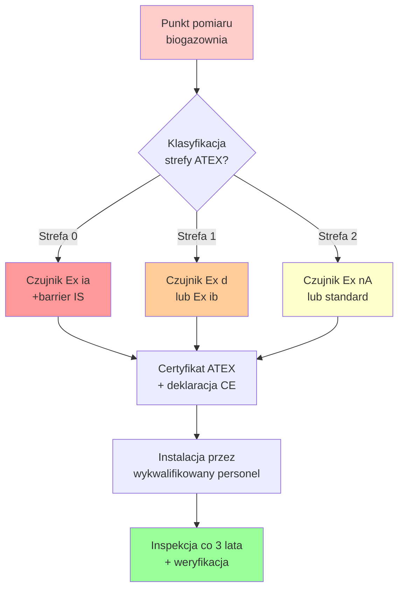
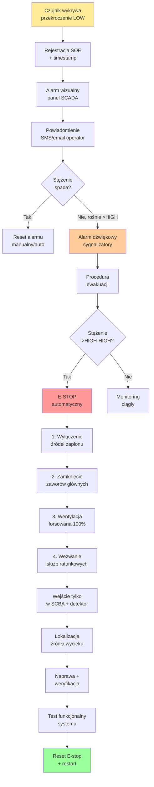

import { 
  SlideContainer, 
  Slide, 
  KeyPoints, 
  SupportingDetails, 
  InstructorNotes,
  VisualSeparator,
  LearningObjective,
  KeyConcept,
  Example
} from '@site/src/components/SlideComponents';
import { InteractiveQuiz } from '@site/src/components/InteractiveQuiz';

<LearningObjective>
Po tej sekcji student potrafi:
- Zidentyfikować kluczowe gazy w biogazowniach (CH₄, H₂S, CO₂, O₂, H₂) oraz ich zagrożenia
- Dobrać odpowiednie czujniki według technologii (katalityczne, IR, elektrochemiczne) i klasyfikacji ATEX
- Zaprojektować system detekcji gazów z progami alarmowymi i procedurami awaryjnymi (E-stop)
- Zaplanować kalibrację i konserwację czujników gazowych z uwzględnieniem środowiska agresywnego
</LearningObjective>

<SlideContainer>

<Slide title="⚠️ Monitoring gazów w biogazowniach – wprowadzenie" type="info">

<KeyPoints title="📋 Dlaczego monitorujemy gazy?">

**Biogazownie to środowisko o wysokim ryzyku** – obecność gazów palnych (CH₄, H₂), toksycznych (H₂S), korozyjnych i duszących (CO₂). System monitoringu gazów to wymóg:
- **Bezpieczeństwa pracowników** (BHP, dyrektywa ATEX 1999/92/EC)
- **Ochrony środowiska** (emisje, wycieki metanu do atmosfery)
- **Optymalizacji procesu** (skład biogazu = efektywność fermentacji)
- **Zgodności z normami** (ISO 23553, VDI 3475, krajowe przepisy)

**Kluczowe gazy i ich zagrożenia:**

| Gaz | Stężenie typowe | Zagrożenie | LEL/TWA/IDLH | Detekcja |
|-----|-----------------|------------|---------------|----------|
| **CH₄** (metan) | 50-75% v/v (biogaz) | Palny, wybuchowy | LEL = 5% (50 000 ppm) | Katalityczny, IR |
| **H₂S** (siarkowodór) | 100-5000 ppm (raw biogas) | Toksyczny, korozyjny, palny | TWA = 10 ppm, IDLH = 100 ppm | Elektrochemiczny |
| **CO₂** (dwutlenek węgla) | 25-45% v/v (biogaz) | Duszący (wypiera O₂) | TWA = 5000 ppm (8h) | IR (NDIR) |
| **O₂** (tlen) | ~20.9% (powietrze) | Deficyt &lt;19.5% → uduszenie | Min. bezpieczne: 19.5% | Elektrochemiczny, paramagnetyczny |
| **H₂** (wodór) | &lt;1% (proces) | Palny, wybuchowy | LEL = 4% (40 000 ppm) | Katalityczny, elektrochem. |
| **NH₃** (amoniak) | &lt;100 ppm | Toksyczny, żrący | TWA = 25 ppm, IDLH = 300 ppm | Elektrochemiczny |

**Definicje:**
- **LEL (Lower Explosive Limit)**: Dolna granica wybuchowości – minimalne stężenie palne w powietrzu
- **TWA (Time-Weighted Average)**: Dopuszczalne stężenie średnie ważone w czasie (8h)
- **IDLH (Immediately Dangerous to Life or Health)**: Stężenie natychmiastowo zagrażające życiu

:::caution Zagrożenie H₂S
Siarkowodór to "cichy zabójca" biogazowni. Już przy 100-150 ppm powoduje paraliż węchu (nie czuje się ostrzegawczego zapachu zgniłych jaj!), przy 500-1000 ppm – utrata przytomności w ciągu minut, powyżej 1000 ppm – śmierć. **Detekcja H₂S to absolutny priorytet.**
:::

</KeyPoints>

<SupportingDetails title="🔥 Klasyfikacja stref ATEX">

**Dyrektywa ATEX 1999/92/EC** (Atmosphères Explosibles) klasyfikuje strefy zagrożenia wybuchem:

### Strefy gazowe:

- **Strefa 0**: Atmosfera wybuchowa obecna **stale** lub przez długi czas (>1000h/rok)
  - Przykład: Wnętrze zbiorników biogazu, szczelne komory fermentacyjne
  - Wymagany sprzęt: **Ex ia** (iskrobezpieczny kategoria ia) lub Ex s (specjalny)

- **Strefa 1**: Atmosfera wybuchowa może wystąpić **sporadycznie** w normalnej eksploatacji (10-1000h/rok)
  - Przykład: Pomieszczenia z otwartymi zbiornikami, wokół zaworów/złączy
  - Wymagany sprzęt: **Ex ib, Ex d** (obudowa przeciwwybuchowa)

- **Strefa 2**: Atmosfera wybuchowa występuje **rzadko** i krótkotrwale (&lt;10h/rok), tylko w warunkach awaryjnych
  - Przykład: Wokół biogazowni (wentylowane otoczenie)
  - Wymagany sprzęt: **Ex nA** (nieiskrzący)

### Dobór czujników według ATEX:

**Koszty czujników ATEX:**
- Standard (non-ATEX): 200-500 EUR
- Ex nA (Strefa 2): 400-800 EUR
- Ex d/ib (Strefa 1): 800-1500 EUR
- Ex ia (Strefa 0): 1500-3000 EUR + barrier 300-600 EUR

</SupportingDetails>

<InstructorNotes>

**Czas**: 14-16 min

**Przebieg**:
1. Wprowadzenie do gazów w biogazowniach – dlaczego są niebezpieczne? (3 min)
2. Omówienie tabeli gazów i zagrożeń (4 min) – podkreśl H₂S jako największe zagrożenie
3. Strefy ATEX i dobór czujników (5 min) – użyj diagramu, pokaż przykładowy czujnik Ex
4. Dyskusja: Czy studenci wiedzieli o ATEX przed wykładem? (2 min)
5. Q&A (2 min)

**Punkty kluczowe**:
- **H₂S to killer nr 1** – każdego roku kilka śmiertelnych wypadków w biogazowniach/oczyszczalniach
- ATEX to nie opcja, to WYMÓG PRAWNY (UE, Polska: rozporządzenie MPiPS)
- Koszt certyfikacji ATEX to 2-3× czujnika standardowego, ale to MUST

**Demonstracja praktyczna**:
- Pokaż przykładowy czujnik Ex ia lub Ex d (jeśli dostępny) – charakterystyczna obudowa
- Film z testowania czujników gazowych (exposure test)
- Symulacja alarmu H₂S (audio + wizualny) – pokazuje procedurę awaryjną

**Materiały pomocnicze**:
- Dyrektywa ATEX 1999/92/EC (wybrane fragmenty)
- Przykładowa instrukcja bezpieczeństwa biogazowni (PDF)
- Datasheets: Dräger Polytron 8000 (H₂S Ex), Honeywell Sensepoint XCD (CH₄ IR)

**Typowe błędy studenckie**:
- Mylenie LEL (explosive limit) z TWA (occupational exposure) – to różne pojęcia!
- Niezrozumienie, że O₂ &lt;19.5% to zagrożenie (deficyt), nie tylko O₂ = 0%
- Myślenie, że jeden czujnik CH₄ wystarczy – potrzeba redundancji i różnych lokalizacji

**Pytania studenckie**:
- Q: Dlaczego H₂S jest tak niebezpieczny, skoro stężenia są "tylko" 100-5000 ppm?
- A: 100 ppm to IDLH (immediately dangerous). Dla porównania: CO (tlenek węgla) ma IDLH = 1200 ppm. H₂S jest 12× bardziej toksyczny!

- Q: Czy można stosować czujniki non-ATEX w pomieszczeniach wentylowanych?
- A: Tylko jeśli pomieszczenie zostało sklasyfikowane jako "niebędące strefą ATEX" przez uprawnionego rzeczoznawcę. W praktyce: wszystko wokół biogazu = ATEX.

</InstructorNotes>

</Slide>

<VisualSeparator type="technical" />

<Slide title="🔬 Technologie czujników gazowych" type="tip">

<KeyPoints title="📋 Przegląd metod detekcji">

**1. Czujniki katalityczne (pellistory)**
- **Zasada**: Spalanie katalityczne gazu palnego na podgrzanym drucie platynowym → wzrost temperatury → zmiana rezystancji (most Wheatstone'a)
- **Gazy**: CH₄, H₂, LPG (wszystkie palne)
- **Zakres**: 0-100% LEL (typowo 0-5% v/v dla CH₄)
- **Zalety**: Tanio (200-400 EUR), niezawodne, szybka odpowiedź (&lt;30 s)
- **Wady**: 
  - Trucie przez H₂S, silikony, ołów → degradacja czułości
  - Wymaga O₂ (min. 10-12%) do spalania
  - Dryft kalibr. ~5-10% rocznie
- **Żywotność**: 2-5 lat (zależnie od środowiska)
- **Zastosowanie**: **Podstawowy czujnik CH₄ w biogazowniach** (monitoring LEL)

**2. Czujniki podczerwieni (IR, NDIR)**
- **Zasada**: Absorpcja promieniowania IR na charakterystycznych długościach fali (CH₄: 3.3 µm, CO₂: 4.26 µm)
- **Gazy**: CH₄, CO₂, propan (molekuły dwu-/wieloatomowe)
- **Zakres**: 0-100% v/v (CH₄), 0-100% v/v (CO₂)
- **Zalety**: 
  - NIE wymaga O₂
  - Odporny na trucie
  - Długa żywotność (5-10 lat)
  - Niski dryft (&lt;2% rocznie)
- **Wady**: Drogi (800-2000 EUR), wrażliwy na kondensację, większe wymiary
- **Zastosowanie**: **Analiza składu biogazu** (proces control), duplikacja czujników katalitycznych

**3. Czujniki elektrochemiczne**
- **Zasada**: Reakcja elektrodowa gazu na elektrodzie roboczej → prąd proporcjonalny do stężenia
- **Gazy**: H₂S, O₂, NH₃, CO, H₂ (toksyczne i O₂)
- **Zakres**: 
  - H₂S: 0-100 ppm lub 0-1000 ppm (two-electrode, three-electrode)
  - O₂: 0-25% v/v
- **Zalety**: 
  - Wysoka selektywność (elektroda specyficzna dla gazu)
  - Czułość (ppb-ppm)
  - Kompaktowe (20-50 mm Ø)
- **Wady**: 
  - Krótka żywotność (1-3 lata dla H₂S, 3-5 lat dla O₂)
  - Wrażliwe na temperaturę i wilgotność
  - Cross-sensitivity (np. H₂S czujnik reaguje na SO₂)
  - Dryft zera (offset drift)
- **Koszt**: 150-500 EUR (sensor replacement)
- **Zastosowanie**: **Standard dla H₂S, O₂, NH₃**

**4. Czujniki półprzewodnikowe (MOS – Metal Oxide Semiconductor)**
- **Zasada**: Zmiana przewodności warstwy SnO₂ (tlenek cyny) w obecności gazów redukujących
- **Gazy**: CH₄, H₂, lotne związki organiczne (VOC)
- **Zalety**: Bardzo tanie (10-50 EUR), małe, niskie pobór mocy
- **Wady**: 
  - Niska selektywność (reaguje na wszystko!)
  - Duży dryft
  - Wrażliwy na wilgotność
  - NIE nadaje się do safety-critical
- **Zastosowanie**: Detekcja jakościowa ("coś jest"), indoor air quality, NIE w biogazowniach ATEX

</KeyPoints>

<SupportingDetails title="📊 Tabela porównawcza technologii">

| Parametr | Katalityczny | IR (NDIR) | Elektrochemiczny | Półprzewodnikowy |
|----------|--------------|-----------|------------------|------------------|
| **Gazy** | CH₄, H₂ (palne) | CH₄, CO₂ | H₂S, O₂, NH₃ | Szerokie spektrum |
| **Zakres** | 0-100% LEL | 0-100% v/v | ppb-ppm (H₂S) %-v/v (O₂) | ppm-% (nieskalowany) |
| **Selektywność** | Średnia | Bardzo wysoka | Wysoka | Niska |
| **Żywotność** | 2-5 lat | 5-10 lat | 1-3 lat (H₂S) 3-5 lat (O₂) | 2-3 lata |
| **Dryft** | 5-10%/rok | &lt;2%/rok | 5-15%/rok | Wysoki |
| **Wymaga O₂** | ✅ Tak (>10%) | ❌ Nie | ❌ Nie | ❌ Nie |
| **Trucie** | ✅ H₂S, silikony | ❌ Odporny | ⚠️ Cross-sens. | ⚠️ Wilgotność |
| **ATEX** | ✅ Dostępny | ✅ Dostępny | ✅ Dostępny | ⚠️ Rzadko |
| **Koszt** | €€ | €€€€ | €€ | € |
| **Aplikacja** | LEL CH₄ | Skład biogazu | Safety H₂S/O₂ | Nie dla ATEX |

:::tip Dobra praktyka: redundancja
W krytycznych punktach (np. wejście do fermenterów, pomieszczenia zamknięte) stosuje się **2 czujniki różnych technologii**:
- CH₄: katalityczny (primary) + IR (backup)
- H₂S: elektrochemiczny (primary) + tape colorimetric (backup/portable)

Koszt dodatkowy ~1000 EUR, ale eliminuje single point of failure.
:::

</SupportingDetails>

<Example title="Konfiguracja systemu detekcji gazów – biogazownia 1 MW">

**Parametry instalacji:**
- Moc elektryczna: 1 MW (BHKW – kogeneracja)
- 2 fermentery (2000 m³ każdy), 1 zbiornik końcowy (1500 m³)
- Produkcja biogazu: ~400 m³/h (raw biogas: 60% CH₄, 38% CO₂, 1500 ppm H₂S)
- Oczyszczanie biogazu: Desulfuryzacja biologiczna (H₂S → 50-100 ppm) + filtr węglowy

**Punkty pomiarowe i czujniki:**

| Lokalizacja | Gaz | Technologia | Zakres | ATEX | Ilość | Koszt jedn. |
|-------------|-----|-------------|--------|------|-------|-------------|
| Fermenter 1/2 (górna część) | CH₄ | Katalityczny | 0-100% LEL | Ex d | 2 | 900 EUR |
| Fermenter 1/2 (space) | H₂S | Elektrochemiczny | 0-100 ppm | Ex ib | 2 | 700 EUR |
| Fermenter 1/2 (space) | O₂ | Elektrochemiczny | 0-25% | Ex ib | 2 | 600 EUR |
| Linia biogazu (pre-desulf) | H₂S | Elektrochemiczny | 0-5000 ppm | Ex d | 1 | 1200 EUR |
| Linia biogazu (post-desulf) | H₂S | Elektrochemiczny | 0-200 ppm | Ex d | 1 | 800 EUR |
| Analiza składu (dashboard) | CH₄, CO₂ | IR dual-channel | 0-100% | Ex d | 1 | 3500 EUR |
| Pomieszczenie BHKW | CH₄ | Katalityczny | 0-100% LEL | Ex nA | 2 | 700 EUR |
| Pomieszczenie BHKW | CO | Elektrochemiczny | 0-500 ppm | Ex nA | 1 | 500 EUR |
| Stacja dozowania (FeCl₃) | Cl₂ | Elektrochemiczny | 0-10 ppm | — | 1 | 800 EUR |

**Łącznie**: 13 czujników, **koszt ~13 000 EUR** (czujniki + kontroler + instalacja)

**System centralny:**
- Kontroler gazowy: Dräger Regard 7000 (16 kanałów, Modbus RTU/TCP)
- Alarmy: 3-poziomowe (LOW, HIGH, HIGH-HIGH) z eskalacją
- Integracja SCADA: OPC UA → wizualizacja + rejestracja SOE (Sequence of Events)
- Procedury awaryjne: E-stop, wentylacja forsowana, zamknięcie zaworów

**Kalibracja:**
- H₂S: co 3 miesiące (bump test) + co 12 miesięcy (full calibration)
- CH₄, O₂: co 6 miesięcy
- Gaz kalibracyjny: certyfikowane mieszanki (np. 50 ppm H₂S + N₂ balance)

**OPEX (rocznie):**
- Wymiana czujników H₂S (żywotność 2 lata): 2× 800 EUR = 1600 EUR
- Gazy kalibracyjne: 800 EUR
- Serwis (external): 1200 EUR
- **Łącznie: ~3600 EUR/rok**

</Example>

<InstructorNotes>

**Czas**: 18-20 min (dużo techniki!)

**Przebieg**:
1. Przegląd technologii czujników (8 min) – katalityczne, IR, elektrochemiczne, MOS
2. Tabela porównawcza (4 min) – podkreśl trade-offy (koszt vs. żywotność vs. selektywność)
3. Przykład konfiguracji biogazowni 1 MW (4 min) – pokazuje real-world deployment
4. Dyskusja: Dlaczego tyle różnych czujników? (2 min) – różne gazy, różne zakresy
5. Q&A (2 min)

**Punkty kluczowe**:
- **Nie ma uniwersalnego czujnika** – każdy gaz wymaga dedykowanej technologii
- Katalityczny dla CH₄ LEL, elektrochemiczny dla H₂S/O₂, IR dla składu (process control)
- Żywotność elektrochemicznych H₂S to TYLKO 1-3 lata (agresywne środowisko) → plan wymiany!

**Demonstracja praktyczna**:
- Pokaż czujnik katalityczny (pellistor) – charakterystyczna perforowana czapka sinterowana
- Czujnik elektrochemiczny H₂S – mały, cylindryczny (20-30 mm Ø)
- Gaz kalibracyjny w butli (50 ppm H₂S) – pokaż etykietę z certyfikatem

**Materiały pomocnicze**:
- Datasheets: Dräger Polytron 8000 series, Honeywell Sensepoint XCD
- Norma EN 60079-29-1 (detekcja gazów palnych)
- Przykład planu kalibracji (Excel/PDF)

**Typowe błędy studenckie**:
- Myślenie, że czujnik "działa wiecznie" – NO! Elektrochemiczne H₂S: 1-3 lata, potem wymiana
- Stosowanie katalitycznego do pomiaru składu biogazu (%) – NIE, tylko do LEL! Do składu: IR
- Ignorowanie kalibracji – czujnik bez kalibracji to false sense of security

**Pytania studenckie**:
- Q: Dlaczego elektrochemiczny H₂S ma tak krótką żywotność?
- A: Elektrolit (roztwór kwasowy) degraduje się przez reakcję z H₂S, temperatura, wilgotność. W ekstremalnych warunkach (>1000 ppm non-stop) nawet &lt;1 rok.

- Q: Czy można używać jednego czujnika IR do CH₄ i CO₂ jednocześnie?
- A: TAK! Dual-channel IR (dwie długości fali) mierzy oba. Koszt ~3000-4000 EUR, ale dostajemy pełny skład.

</InstructorNotes>

</Slide>

<VisualSeparator type="default" />

<Slide title="🚨 Progi alarmowe i procedury awaryjne" type="success">

<KeyConcept title="System 3-poziomowych alarmów">

**Standardowa konfiguracja alarmów gazowych:**

### Dla CH₄ (metan):

- **LOW alarm** (20-25% LEL): Ostrzeżenie, zwiększona wentylacja, rejestracja zdarzenia
- **HIGH alarm** (40-50% LEL): Alarm dźwiękowy/wizualny, procedura ewakuacji, wstrzymanie prac
- **HIGH-HIGH** (60% LEL): **E-stop** (emergency stop) – automatyczne odcięcie źródeł zapłonu, wentylacja forsowana, zamknięcie zaworów

**Dlaczego 60% LEL, a nie 100%?**
- Zapas bezpieczeństwa (niepewność czujnika ±5-10%, zmiany lokalne stężenia)
- Czas reakcji (między HIGH-HIGH a LEL = 100% musi być margin na działanie)

### Dla H₂S (siarkowodór):

- **LOW alarm** (10 ppm): Równa TWA (8h exposure limit), procedura sprawdzająca
- **HIGH alarm** (20-30 ppm): Natychmiastowa ewakuacja pomieszczenia, wentylacja
- **HIGH-HIGH** (50-100 ppm): **E-stop**, tylko wejście z aparatami SCBA (Self-Contained Breathing Apparatus)

### Dla O₂ (tlen):

- **LOW alarm** (19.5%): Deficyt O₂, ewakuacja
- **VERY LOW** (18%): E-stop, zakaz wejścia

**Diagram sekwencji alarmowej:**

</KeyConcept>

<SupportingDetails title="🔍 Studium przypadku: Automatyczna reakcja na wzrost H₂S">

**Kontekst: Biogazownia 0.8 MW, luty 2023**

### Faza 1: Detekcja anomalii

- **Czas**: 14:23, środa
- **Czujnik**: H₂S w linii biogazu (post-fermenter, pre-desulfuryzacja)
- **Odczyt**: Wzrost z typowych 1200 ppm do **2400 ppm** w ciągu 20 min
- **Alarm**: LOW (1500 ppm) → HIGH (2000 ppm) w ciągu 10 min

### Faza 2: Automatyczna reakcja systemu

System SCADA zainicjował sekwencję:

1. **14:24** – Zwiększenie wentylacji fermenterów (z 50% do 100%)
2. **14:25** – Przełączenie biogazu na bypass (omijając BHKW, spalanie w flarze)
3. **14:26** – Zwiększenie dozowania FeCl₃ (chlorek żelaza) z 15 L/h do 30 L/h
4. **14:30** – Powiadomienie operatora (SMS + email)

### Faza 3: Diagnoza (operator)

Operator (przyjazd na miejsce 14:45) zidentyfikował przyczynę:
- **Zmiana substratu** (zwiększony udział odpadów białkowych) → więcej siarki organicznej
- **Temperatura fermentera** wyższa o 2°C (42°C zamiast 40°C) → wzmożona aktywność bakterii siarkowych

### Faza 4: Korekta procesu

- Obniżenie temp. fermentera do 40°C (chłodzenie)
- Zmiana receptury substratu (mniej odpadów białkowych, więcej kiszonki kukurydzy)
- Kontynuacja zwiększonego dozowania FeCl₃ przez 48h

### Faza 5: Powrót do normy

- **16:00** (1.5h później) – H₂S spadł do 1000 ppm
- **18:00** – H₂S stabilny ~600 ppm
- **Następny dzień** – H₂S powrót do typowych 200-400 ppm, restart BHKW

**Skutki:**
- ✅ **Uniknięto uszkodzenia BHKW** (H₂S >2000 ppm przez >4h → korozja, koszt naprawy >50 000 EUR)
- ✅ **Brak przestoju produkcji** (bypass na flarę to strata revenue, ale lepsza niż awaria)
- ✅ **Bezpieczeństwo zachowane** (H₂S w pomieszczeniach &lt;10 ppm przez cały czas)

**ROI systemu detekcji:**
- Koszt systemu: ~13 000 EUR
- Uniknięty koszt: >50 000 EUR (BHKW repair) + downtime
- **Zwrot w jednym zdarzeniu: >3×**

</SupportingDetails>

<Example title="Procedura kalibracji czujnika H₂S (elektrochemiczny)">

**Częstotliwość:**
- **Bump test** (test funkcjonalny): Co 3 miesiące
- **Full calibration** (kalibracja 2-punktowa): Co 12 miesięcy

**Procedura bump test (15 min):**

1. **Przygotowanie**:
   - Gaz testowy: 50 ppm H₂S (certyfikat, data ważności &lt;12 miesięcy)
   - Adapter flow (cap) dopasowany do czujnika
   - Dokumentacja: formularz testu + timestamp

2. **Wykonanie**:
   - Przyłożenie adaptera z gazem do czujnika (flow ~0.5 L/min)
   - Czas ekspozycji: 60 s
   - Odczyt: Czujnik powinien wskazać 50 ±5 ppm (±10% tolerancja)

3. **Kryteria akceptacji**:
   - ✅ **PASS**: Odczyt 45-55 ppm, czas reakcji &lt;30 s, powrót do zera &lt;60 s
   - ❌ **FAIL**: Odchylenie >±10%, brak reakcji, bardzo wolny powrót do zera → wymiana czujnika

**Procedura full calibration (30-45 min):**

1. **Zero calibration** (kalibracja zera):
   - Gaz: Czysty azot N₂ (zero gas, brak H₂S)
   - Ekspozycja: 2-3 min
   - Czujnik powinien wskazać 0 ppm → jeśli nie, adjust offset w kontrolerze

2. **Span calibration** (kalibracja zakresu):
   - Gaz: 50 ppm lub 100 ppm H₂S (certyfikowany)
   - Ekspozycja: 2-3 min
   - Czujnik powinien wskazać stężenie gazu ±2% → jeśli nie, adjust span (gain)

3. **Verification**:
   - Test z gazem pośrednim (np. 25 ppm jeśli span = 50 ppm)
   - Powinien wskazać 25 ±3 ppm

4. **Dokumentacja**:
   - Protokół kalibracji (data, osoba, wyniki, nr czujnika, nr butelki z gazem)
   - Naklejka na czujniku z datą następnej kalibracji

**Typowe problemy i rozwiązania:**

| Problem | Przyczyna | Rozwiązanie |
|---------|-----------|-------------|
| Odczyt stale &gt;5 ppm (zero drift) | Degradacja elektrolitu | Wymiana czujnika |
| Bardzo wolna reakcja (&gt;60 s) | Zatykanie membrany (pył, wilgoć) | Czyszczenie lub wymiana |
| Brak reakcji na gaz | Czujnik "martwy" (end of life) | Wymiana |
| Odczyt &lt;90% expected (span drift) | Normalna degradacja | Re-calibration, jeśli &gt;10% → wymiana |

</Example>

<InstructorNotes>

**Czas**: 14-16 min

**Przebieg**:
1. System 3-poziomowych alarmów (4 min) – wyjaśnij dlaczego LOW/HIGH/HIGH-HIGH
2. Diagram sekwencji awaryjnej (3 min) – omów flowchart step-by-step
3. Studium przypadku wzrostu H₂S (4 min) – real-world response
4. Procedura kalibracji (3 min) – bump test vs. full calibration
5. Q&A (2 min)

**Punkty kluczowe**:
- **E-stop to automatyczny, nie manual** – w sytuacji HIGH-HIGH nie ma czasu na decyzje ludzkie
- Progi alarmowe: LOW = procedura check, HIGH = ewakuacja, HIGH-HIGH = E-stop
- Kalibracja to NIE opcja – czujnik bez kalibracji = false sense of security

**Demonstracja praktyczna**:
- Pokaż bump test na prawdziwym czujniku (jeśli możliwe, z gazem testowym)
- Symulacja alarmu w SCADA (screenshot lub live) – jak wygląda ekran operatora
- Protokół kalibracji (PDF) – przykład dokumentacji

**Materiały pomocnicze**:
- Przykładowa procedura E-stop biogazowni (PDF)
- ISO 23553 – Safety and control devices for gas burners and gas-burning appliances
- Film: response drill w biogazowni (trening ewakuacji)

**Typowe błędy studenckie**:
- Myślenie, że alarm LOW = nie trzeba reagować – NO! LOW to pierwszy sygnał, trzeba sprawdzić przyczynę
- Ignorowanie bump testów ("przecież czujnik działa") – drift może być stopniowy, bump test go wykrywa
- Stosowanie przeterminowanego gazu kalibracyjnego – gaz "starzeje się" (reakcje w butli), max. 12 miesięcy

**Pytania studenckie**:
- Q: Dlaczego HIGH-HIGH dla CH₄ to 60% LEL, a nie bliżej 100%?
- A: (1) Niepewność czujnika ±5-10%, (2) lokalne koncentracje mogą być wyższe, (3) czas reakcji systemu (ventilation, shutdown). 60% to best practice (safety margin).

- Q: Co się dzieje jeśli czujnik sam się uszkodzi i wyśle false alarm?
- A: Dobra praktyka: redundancja (2 czujniki) + voting logic (alarm tylko jeśli ≥2 czujniki potwierdzą). Koszt dodatkowy, ale eliminuje false trips.

</InstructorNotes>

</Slide>

<VisualSeparator type="default" />

<Slide title="📝 Quiz: Czujniki gazów w biogazowniach" type="info">

<InteractiveQuiz 
  questions={[
    {
      question: "Jaką technologię czujnika należy zastosować do pomiaru H₂S w zakresie 0-100 ppm w biogazowni (strefa ATEX 1)?",
      options: [
        "Katalityczny (pellistor)",
        "Infrared (IR/NDIR)",
        "Elektrochemiczny (three-electrode)",
        "Półprzewodnikowy (MOS)"
      ],
      correctAnswer: 2,
      explanation: "Elektrochemiczny to standard dla H₂S w zakresie ppm (toksyczność). Katalityczny to dla gazów palnych (LEL), IR nie działa dla H₂S (brak absorpcji w IR), MOS nie ma selektywności i nie jest ATEX-certified."
    },
    {
      question: "Czujnik katalityczny CH₄ wymaga minimum 10-12% O₂ do działania. Co się stanie w atmosferze 80% CH₄ + 20% CO₂ (brak O₂)?",
      options: [
        "Czujnik wskaże 80% LEL (poprawnie)",
        "Czujnik wskaże 0% LEL (błędnie, brak spalania)",
        "Czujnik ulegnie uszkodzeniu (przegrzanie)",
        "Czujnik przestawi się na tryb IR (automatycznie)"
      ],
      correctAnswer: 1,
      explanation: "Bez O₂ nie ma spalania katalitycznego → czujnik wskaże 0% LEL mimo obecności 80% CH₄! To poważne zagrożenie. Dlatego w atmosferze bogatej w biogaz (>60% CH₄) stosuje się czujniki IR (nie wymagają O₂) + czujnik O₂ deficyt."
    },
    {
      question: "Żywotność czujnika elektrochemicznego H₂S w biogazowni to typowo 1-3 lata. Co jest główną przyczyną degradacji?",
      options: [
        "Mechaniczne uszkodzenie membrany przez pył",
        "Wyczerpanie elektrolitu przez reakcję z H₂S i warunki środowiskowe (temperatura, wilgotność)",
        "Przegrzanie elementu czujnikowego",
        "Trucie przez CH₄ i CO₂"
      ],
      correctAnswer: 1,
      explanation: "Elektrolit (kwasowy roztwór) degraduje się przez ciągłą reakcję elektrodową z H₂S + temperatura + wilgotność. Nie można 'naładować' – trzeba wymienić cały czujnik. Pył to problem secondary (membrany są filtry), przegrzanie nie występuje (temp. pracy do +50°C), CH₄/CO₂ nie trują (selektywność elektrody)."
    },
    {
      question: "W biogazowni czujnik H₂S pokazuje 2000 ppm (HIGH alarm). System automatycznie zwiększa dozowanie FeCl₃. Jaka jest reakcja chemiczna?",
      options: [
        "FeCl₃ reaguje z CH₄ tworząc CH₃Cl (chlorometan)",
        "FeCl₃ + H₂S → FeS (siarczek żelaza) + HCl (wytrącanie siarki)",
        "FeCl₃ utlenia CO₂ do O₂ (regeneracja)",
        "FeCl₃ reaguje z H₂O tworząc Fe(OH)₃ (wodorotlenek)"
      ],
      correctAnswer: 1,
      explanation: "FeCl₃ (chlorek żelaza) to klasyczny 'scavenger' H₂S w biogazowniach: 2 FeCl₃ + 3 H₂S → 2 FeS + 6 HCl + S. Siarczek żelaza (FeS) wytrąca się jako czarny osad. To metoda chemiczna desulfuryzacji (alternative: biologiczna z bakteriami tlenowymi)."
    },
    {
      question: "HIGH-HIGH alarm dla CH₄ to 60% LEL. Dla metanu LEL = 5% v/v. Jakie jest rzeczywiste stężenie CH₄ w powietrzu przy tym alarmie?",
      options: [
        "3% v/v (60% × 5%)",
        "5% v/v (= LEL)",
        "60% v/v (alarm = stężenie)",
        "0.6% v/v (60% × 0.01)"
      ],
      correctAnswer: 0,
      explanation: "60% LEL = 60% z 5% = 0.6 × 5% = 3% v/v. To stężenie wybuchowe (w zakresie 5-15% v/v dla CH₄), stąd E-stop. Opcja (b) to 100% LEL. Opcja (c) myląc alarm (% LEL) z stężeniem (% v/v). Opcja (d) błędne mnożenie."
    }
  ]}
/>

:::tip Rekomendacja po quizie
Jeśli uzyskałeś &lt;80% poprawnych odpowiedzi, przejrzyj sekcje o technologiach czujników (katalityczny vs. elektrochemiczny) i reakcjach chemicznych w biogazowniach (FeCl₃ desulfuryzacja). Zrozumienie ograniczeń czujników (np. wymóg O₂) jest kluczowe dla projektowania bezpiecznych systemów.
:::

</Slide>

</SlideContainer>

---

## Podsumowanie i wnioski

**Kluczowe punkty z tej sekcji:**

1. **Biogazownie = środowisko wysokiego ryzyka** – CH₄ (palny), H₂S (toksyczny, killer), CO₂ (duszący). System detekcji gazów to WYMÓG ATEX.

2. **Technologie czujników:**
   - **Katalityczne**: CH₄ LEL (monitoring wybuchowości), wymagają O₂
   - **IR (NDIR)**: CH₄/CO₂ skład (process control), nie wymagają O₂, drogie
   - **Elektrochemiczne**: H₂S/O₂/NH₃ (safety), żywotność 1-3 lata dla H₂S

3. **System 3-poziomowych alarmów**: LOW (procedura check) → HIGH (ewakuacja) → HIGH-HIGH (E-stop automatyczny). Progi: CH₄ 60% LEL, H₂S 50-100 ppm.

4. **Kalibracja to konieczność**: Bump test co 3 miesiące, full calibration co 12 miesięcy. Czujnik bez kalibracji = false sense of security.

5. **ROI systemu detekcji: 3-10×** – jedno uniknięte zdarzenie (BHKW damage, H₂S exposure) zwraca koszt całego systemu.

**Następne kroki:**
- Ćwiczenie 4: Projekt systemu detekcji gazów dla biogazowni (dobór czujników, lokalizacje, progi, CAPEX/OPEX)
- Przygotowanie do następnej sekcji: Przepływ, poziom, ciśnienie – czujniki procesowe

---

**Dodatkowe zasoby:**
- **Dyrektywa ATEX 1999/92/EC** + polska implementacja
- **EN 60079-29-1** – Gas detectors – Performance requirements
- **ISO 23553** – Safety and control devices for biogas installations
- **Dräger / Honeywell application notes** – biogas monitoring (free PDFs)
