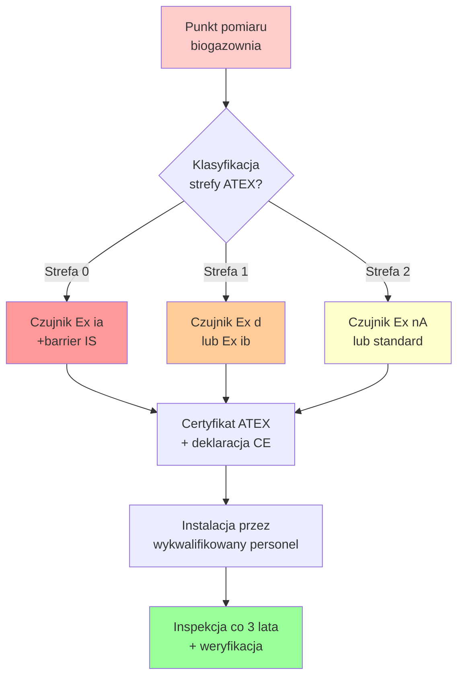
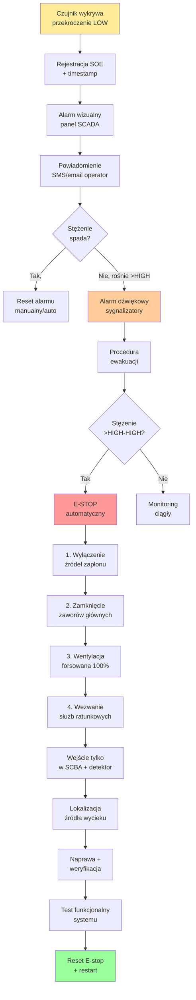

import { 
  SlideContainer, 
  Slide, 
  KeyPoints, 
  SupportingDetails, 
  InstructorNotes,
  VisualSeparator,
  LearningObjective,
  KeyConcept,
  Example
} from '@site/src/components/SlideComponents';
import { InteractiveQuiz } from '@site/src/components/InteractiveQuiz';

<LearningObjective>
Po tej sekcji student potrafi:
- Zidentyfikować kluczowe gazy w biogazowniach (CH₄, H₂S, CO₂, O₂, H₂) oraz ich zagrożenia
- Dobrać odpowiednie czujniki według technologii (katalityczne, IR, elektrochemiczne) i klasyfikacji ATEX
- Zaprojektować system detekcji gazów z progami alarmowymi i procedurami awaryjnymi (E-stop)
- Zaplanować kalibrację i konserwację czujników gazowych z uwzględnieniem środowiska agresywnego
</LearningObjective>

<SlideContainer>

<Slide title="⚠️ Monitoring gazów w biogazowniach – wprowadzenie" type="info">

<KeyPoints title="📋 Dlaczego monitorujemy gazy?">

**Biogazownie to środowisko o wysokim ryzyku** – obecność gazów palnych (CH₄, H₂), toksycznych (H₂S), korozyjnych i duszących (CO₂). 

**System monitoringu gazów to wymóg:**
- **Bezpieczeństwa pracowników** (BHP, dyrektywa ATEX 1999/92/EC)
- **Ochrony środowiska** (emisje, wycieki metanu)
- **Optymalizacji procesu** (skład biogazu = efektywność fermentacji)
- **Zgodności z normami** (ISO 23553, VDI 3475)

**Definicje kluczowe:**
- **LEL (Lower Explosive Limit)**: Dolna granica wybuchowości
- **TWA (Time-Weighted Average)**: Dopuszczalne stężenie średnie (8h)
- **IDLH (Immediately Dangerous to Life or Health)**: Stężenie śmiertelne

:::caution Zagrożenie H₂S
Siarkowodór to "cichy zabójca". Już przy 100-150 ppm powoduje paraliż węchu, przy 500-1000 ppm – utrata przytomności w ciągu minut, powyżej 1000 ppm – śmierć. **Detekcja H₂S to absolutny priorytet.**
:::

</KeyPoints>

<InstructorNotes>

Wprowadzenie do monitoringu gazów – około pięć do siedmiu minut.

**Kluczowy przekaz**: biogazownie to **środowisko wysokiego ryzyka**. Metan jest palny (LEL pięć procent), siarkowodór toksyczny (IDLH sto ppm), dwutlenek węgla duszący (wypiera tlen).

Wyjaśnij definicje. **LEL to dolna granica wybuchowości** – minimalne stężenie, przy którym gaz może się zapalić. Dla metanu to pięć procent objętościowych (pięćdziesiąt tysięcy ppm). **TWA to dopuszczalne stężenie średnie ważone w czasie** – dla ośmiu godzin pracy. **IDLH to stężenie natychmiastowo zagrażające życiu**.

Podkreśl **zagrożenie H₂S**. Sto ppm to już IDLH – natychmiastowe zagrożenie życia. Dla porównania: tlenek węgla (CO) ma IDLH tysiąc dwieście ppm. **Siarkowodór jest dwanaście razy bardziej toksyczny**. Plus: paraliż węchu przy stu do stu pięćdziesięciu ppm – nie czujesz ostrzegawczego zapachu!

System monitoringu to nie opcja – **wymóg prawny** (dyrektywa ATEX, polskie rozporządzenie MPiPS). Każdego roku kilka śmiertelnych wypadków w biogazowniach i oczyszczalniach ścieków przez H₂S.

</InstructorNotes>

</Slide>

<VisualSeparator type="default" />

<Slide title="📊 Kluczowe gazy i ich zagrożenia" type="warning">

| Gaz | Stężenie typowe | Zagrożenie | LEL/TWA/IDLH | Detekcja |
|-----|-----------------|------------|---------------|----------|
| **CH₄** | 50-75% v/v | Palny, wybuchowy | LEL = 5% | Katalityczny, IR |
| **H₂S** | 100-5000 ppm | Toksyczny, korozyjny | TWA = 10 ppm IDLH = 100 ppm | Elektrochemiczny |
| **CO₂** | 25-45% v/v | Duszący | TWA = 5000 ppm | IR (NDIR) |
| **O₂** | ~20.9% | Deficyt &lt;19.5% → uduszenie | Min. 19.5% | Elektrochemiczny |
| **H₂** | &lt;1% | Palny, wybuchowy | LEL = 4% | Katalityczny |
| **NH₃** | &lt;100 ppm | Toksyczny, żrący | TWA = 25 ppm IDLH = 300 ppm | Elektrochemiczny |

<InstructorNotes>

Tabela gazów to praktyczna ściągawka – około pięć do siedmiu minut.

Przejdź przez tabelę wiersz po wierszu. **Metan** (CH₄) to główny składnik biogazu (pięćdziesiąt do siedemdziesięciu pięciu procent objętościowych). LEL pięć procent – **to granica wybuchowości**. Poniżej za mało do spalenia, powyżej za mało tlenu. Zakres wybuchowości metanu: pięć do piętnastu procent.

**Siarkowodór** (H₂S) to największe zagrożenie. Stężenia w surowym biogazie: sto do pięciu tysięcy ppm. TWA (dopuszczalne przez osiem godzin) to zaledwie dziesięć ppm. **IDLH to sto ppm** – natychmiastowe zagrożenie życia. Każda biogazownia musi mieć czujniki H₂S w kluczowych punktach.

**Dwutlenek węgla** (CO₂) to dwadzieścia pięć do czterdzieści pięć procent biogazu. Sam nie jest toksyczny przy niskich stężeniach, ale **wypiera tlen** – deficyt O₂ poniżej 19,5% to uduszenie. Dlatego monitoring O₂ jest równie ważny.

**Tlen** (O₂) – normalne stężenie w powietrzu 20,9%. **Poniżej 19,5% to zagrożenie** – zawroty głowy, dezorientacja. Poniżej 16% – utrata przytomności. Monitor O₂ to must w zamkniętych przestrzeniach biogazowni.

Wodór i amoniak to mniejsze zagrożenia w typowych biogazowniach, ale warto je monitorować jeśli proces obejmuje hydrolizę lub wysokoazotowe substraty.

Detekcja: **katalityczne dla metanu** (tanie, sprawdzone), **elektrochemiczne dla H₂S, O₂, NH₃** (selektywność, czułość w ppm), **IR dla CO₂** (bez zużycia, długa żywotność).

</InstructorNotes>

</Slide>

<VisualSeparator type="default" />

<Slide title="🔥 Klasyfikacja stref ATEX" type="warning">

**Dyrektywa ATEX 1999/92/EC** klasyfikuje strefy zagrożenia wybuchem:

<KeyPoints title="📋 Strefy gazowe">

**Strefa 0**: Atmosfera wybuchowa **stale** (>1000h/rok)
- Przykład: Wnętrze zbiorników biogazu, komory fermentacyjne
- Wymagany sprzęt: **Ex ia** (iskrobezpieczny) lub Ex s

**Strefa 1**: Atmosfera wybuchowa **sporadycznie** (10-1000h/rok)
- Przykład: Pomieszczenia z otwartymi zbiornikami, wokół zaworów
- Wymagany sprzęt: **Ex ib, Ex d** (obudowa przeciwwybuchowa)

**Strefa 2**: Atmosfera wybuchowa **rzadko** (&lt;10h/rok), warunki awaryjne
- Przykład: Wokół biogazowni (wentylowane otoczenie)
- Wymagany sprzęt: **Ex nA** (nieiskrzący)

</KeyPoints>

<KeyPoints title="💰 Koszty czujników ATEX">

- Standard (non-ATEX): 200-500 EUR
- Ex nA (Strefa 2): 400-800 EUR
- Ex d/ib (Strefa 1): 800-1500 EUR
- Ex ia (Strefa 0): 1500-3000 EUR + barrier 300-600 EUR

</KeyPoints>

<InstructorNotes>

Klasyfikacja ATEX to wymóg prawny – około pięć do siedmiu minut.

**Dyrektywa ATEX** (Atmosphères Explosibles) klasyfikuje strefy według prawdopodobieństwa wystąpienia atmosfery wybuchowej. **Strefa zero to stale** (powyżej tysiąc godzin rocznie) – wnętrze zbiorników biogazu, szczelne komory. **Strefa jeden to sporadycznie** (dziesięć do tysiąc godzin) – pomieszczenia z otwartymi zbiornikami, wokół zaworów. **Strefa dwa to rzadko** (poniżej dziesięć godzin) – tylko awarie.

Wymagania sprzętu różnią się drastycznie. **Strefa zero wymaga Ex ia** (iskrobezpieczny kategoria ia) – energia elektryczna w obwodzie jest tak niska, że nawet zwarcie nie może wywołać iskry. Plus: barrier (bariera iskrobezpieczna) separująca obwody safe i hazardous. **Koszt: tysiąc pięćset do trzech tysięcy euro za czujnik plus trzysta do sześćset euro za barrier**.

Strefa jeden: Ex d (obudowa przeciwwybuchowa - wybuch wewnątrz, ale nie przedostaje się na zewnątrz) lub Ex ib (iskrobezpieczny kategoria ib). Koszt osiemset do tysiąc pięćset euro.

Strefa dwa: Ex nA (nieiskrzący) lub czasem standard non-ATEX (jeśli strefa sklasyfikowana jako nie-ATEX przez rzeczoznawcę). Koszt czterysta do ośmiuset euro.

**Certyfikacja ATEX** to proces – czujnik musi mieć certyfikat od notified body (np. DEKRA, TÜV), instalacja przez wykwalifikowany personel, inspekcja co trzy lata. To nie fanaberia – **wymóg prawny, brak certyfikacji to podstawa do zamknięcia instalacji** przez inspekcję PIP.

Jeśli ktoś zapyta o czujniki non-ATEX w wentylowanych pomieszczeniach – tylko jeśli **pomieszczenie sklasyfikowane jako nie-ATEX przez uprawnionego rzeczoznawcę**. W praktyce: wszystko wokół biogazu to ATEX (strefa jeden lub dwa minimum).

</InstructorNotes>

</Slide>

<VisualSeparator type="default" />

<Slide title="🔄 Dobór czujników według ATEX – schemat" type="info">

<InstructorNotes>

Schemat decyzyjny ATEX – około trzy do czterech minut. **Diagram może być większy, to wyjątek**.

Przejdź przez schemat krok po kroku. **Pierwszy krok**: klasyfikacja strefy przez uprawnionego rzeczoznawcę (inżynier z certyfikatem ATEX). Nie można tego zrobić "na oko" – to wymaga analizy ryzyka, obliczeń wentylacji, scenariuszy awaryjnych.

**Dobór czujnika** według strefy: zero wymaga Ex ia plus barrier, jeden wymaga Ex d lub Ex ib, dwa wymaga Ex nA lub czasem standard.

**Certyfikat ATEX** – czujnik musi mieć certyfikat od notified body, oznaczenie CE, deklarację zgodności. **Instalacja tylko przez wykwalifikowany personel** – to nie jest praca dla elektryka bez certyfikatu ATEX.

**Inspekcja co trzy lata** plus weryfikacja – wymóg prawny. Sprawdza się stan czujników, kalibrację, dokumentację, procedury awaryjne.

Podkreśl, że **to nie jest opcjonalne** – brak certyfikacji ATEX to podstawa do zamknięcia instalacji przez inspekcję PIP (Państwowa Inspekcja Pracy).

</InstructorNotes>

</Slide>

<VisualSeparator type="technical" />

<Slide title="🔬 Czujniki katalityczne i IR" type="tip">

<KeyPoints title="📋 Czujniki katalityczne (pellistory)">

**Zasada**: Spalanie katalityczne gazu → wzrost T → zmiana rezystancji

**Parametry:**
- Gazy: CH₄, H₂, LPG (wszystkie palne)
- Zakres: 0-100% LEL (0-5% v/v dla CH₄)
- Żywotność: 2-5 lat

**Zalety**: Tanie (200-400 EUR), niezawodne, szybka odpowiedź (&lt;30 s)

**Wady**: 
- Trucie przez H₂S, silikony → degradacja
- **Wymaga O₂** (min. 10-12%) do spalania
- Dryft ~5-10%/rok

**Zastosowanie**: ⭐ **Podstawowy czujnik CH₄** (monitoring LEL)

</KeyPoints>

<KeyPoints title="📋 Czujniki podczerwieni (IR, NDIR)">

**Zasada**: Absorpcja IR na charakterystycznych długościach fali

**Parametry:**
- Gazy: CH₄ (3.3 µm), CO₂ (4.26 µm)
- Zakres: 0-100% v/v
- Żywotność: 5-10 lat

**Zalety**: 
- **NIE wymaga O₂**
- Odporny na trucie
- Niski dryft (&lt;2%/rok)

**Wady**: Drogi (800-2000 EUR), wrażliwy na kondensację

**Zastosowanie**: **Analiza składu biogazu** (process control)

</KeyPoints>

<InstructorNotes>

Czujniki katalityczne i IR – około sześć do ośmiu minut.

**Czujniki katalityczne** (pellistory) to podstawa monitoringu metanu. Zasada: podgrzany drut platynowy z katalizatorem – w obecności metanu i tlenu zachodzi spalanie katalityczne, temperatura rośnie, rezystancja drucika się zmienia. Most Wheatstone'a mierzy zmianę. **Proste, tanie (dwieście do czterystu euro), niezawodne**.

Wady: **wymaga tlenu** – minimum dziesięć do dwunastu procent. W atmosferze bogatej w biogaz (osiemdziesiąt procent CH₄, brak O₂) czujnik pokaże zero procent LEL mimo wysokiego stężenia metanu. **To poważne zagrożenie** – false negative. Dlatego w takich miejscach stosuje się IR.

Trucie przez siarkowodór – H₂S degraduje katalizator platynowy, obniża czułość. Po roku w biogazowni dryft pięć do dziesięciu procent – wymaga częstej kalibracji.

**Czujniki IR** (infrared, NDIR - non-dispersive) to technologia optyczna. Metan absorbuje promieniowanie podczerwone na 3,3 mikrometra, dwutlenek węgla na 4,26 mikrometra. **Nie wymaga tlenu, odporny na trucie, długa żywotność pięć do dziesięć lat**.

Wady: droższe (osiemset do dwóch tysięcy euro), większe wymiary (sto do dwustu milimetrów), wrażliwe na kondensację (krople wody na optyce = false reading).

Zastosowanie IR: **analiza składu biogazu** – stosunek metanu do dwutlenku węgla pokazuje efektywność fermentacji. Plus: backup dla czujników katalitycznych w strefach zero (gdzie O₂ może być deficyt).

</InstructorNotes>

</Slide>

<VisualSeparator type="default" />

<Slide title="🔬 Czujniki elektrochemiczne i MOS" type="tip">

<KeyPoints title="📋 Czujniki elektrochemiczne">

**Zasada**: Reakcja elektrodowa → prąd proporcjonalny do stężenia

**Parametry:**
- Gazy: H₂S, O₂, NH₃, CO
- Zakres: H₂S 0-100 ppm lub 0-1000 ppm | O₂ 0-25%
- Żywotność: 1-3 lata (H₂S), 3-5 lat (O₂)

**Zalety**: 
- Wysoka selektywność
- Czułość (ppb-ppm)
- Kompaktowe (20-50 mm Ø)

**Wady**: 
- Krótka żywotność
- Wrażliwe na T i wilgotność
- Dryft zera

**Koszt**: 150-500 EUR  
**Zastosowanie**: ⭐ **Standard dla H₂S, O₂, NH₃**

</KeyPoints>

<KeyPoints title="📋 Czujniki półprzewodnikowe (MOS)">

**Zasada**: Zmiana przewodności SnO₂ w obecności gazów

**Zalety**: Bardzo tanie (10-50 EUR), małe

**Wady**: 
- Niska selektywność (reaguje na wszystko!)
- Duży dryft
- NIE nadaje się do safety-critical

**Zastosowanie**: Indoor air quality, **NIE w biogazowniach ATEX**

</KeyPoints>

<InstructorNotes>

Czujniki elektrochemiczne i MOS – około pięć do siedmiu minut.

**Elektrochemiczne** to standard dla gazów toksycznych (H₂S, NH₃) i tlenu. Zasada: elektroda robocza, elektroda referencyjna, elektrolit (roztwór kwasowy). Gaz dyfunduje przez membranę, reaguje na elektrodzie – **prąd proporcjonalny do stężenia**.

Selektywność wysoka – elektroda H₂S reaguje głównie na siarkowodór (cross-sensitivity do SO₂ około dziesięć procent, ale to można skorygować). Czułość w ppb do ppm – idealnie do monitorowania niskich stężeń toksycznych.

Wady: **krótka żywotność**. Dla H₂S w biogazowni to **rok do trzech lat** – elektrolit degraduje się przez ciągłą reakcję plus wilgotność plus temperatura. Nie można "naładować" – trzeba wymienić cały czujnik. Koszt wymiany sto pięćdziesiąt do pięciuset euro.

Dryft zera – czujnik "zapomina" gdzie jest zero. Wymaga regularnej kalibracji (bump test co trzy miesiące, full calibration co rok).

**MOS** (Metal Oxide Semiconductor) to tlenek cyny (SnO₂) podgrzany do trzystu stopni. W obecności gazów redukujących przewodność rośnie. **Bardzo tanie** (dziesięć do pięćdziesięciu euro), małe, niski pobór mocy (idealny dla IoT).

Ale: **niska selektywność** – reaguje na metan, wodór, alkohole, lotne organiczne, praktycznie wszystko. **Nie nadaje się do safety-critical** – nie można polegać na tym do alarmów w biogazowni ATEX. Okej do indoor air quality (mieszkania, biura), nie do przemysłu.

Podkreśl, że **nie ma uniwersalnego czujnika**. Każdy gaz wymaga dedykowanej technologii. Metan to katalityczny lub IR, siarkowodór to elektrochemiczny, tlen to elektrochemiczny lub paramagnetyczny.

</InstructorNotes>

</Slide>

<VisualSeparator type="default" />

<Slide title="📊 Porównanie technologii czujników" type="info">

| Parametr | Katalityczny | IR (NDIR) | Elektrochemiczny | MOS |
|----------|--------------|-----------|------------------|-----|
| **Gazy** | CH₄, H₂ | CH₄, CO₂ | H₂S, O₂, NH₃ | Szerokie |
| **Selektywność** | Średnia | Bardzo wysoka | Wysoka | Niska |
| **Żywotność** | 2-5 lat | 5-10 lat | 1-3 lat (H₂S) | 2-3 lata |
| **Dryft** | 5-10%/rok | &lt;2%/rok | 5-15%/rok | Wysoki |
| **Wymaga O₂** | ✅ Tak | ❌ Nie | ❌ Nie | ❌ Nie |
| **ATEX** | ✅ Dostępny | ✅ Dostępny | ✅ Dostępny | ⚠️ Rzadko |
| **Koszt** | €€ | €€€€ | €€ | € |
| **Aplikacja** | LEL CH₄ | Skład | Safety H₂S/O₂ | Nie dla ATEX |

:::tip Dobra praktyka: redundancja
W krytycznych punktach stosuje się **2 czujniki różnych technologii**:
- CH₄: katalityczny (primary) + IR (backup)
- H₂S: elektrochemiczny (primary) + tape colorimetric (backup/portable)

Koszt dodatkowy ~1000 EUR, eliminuje single point of failure.
:::

<InstructorNotes>

Tabela porównawcza to synteza – około cztery do pięciu minut.

Przejdź przez tabelę kolumna po kolumnie. **Selektywność**: IR bardzo wysoka (absorpcja na konkretnej długości fali), elektrochemiczny wysoka (specyficzna elektroda), katalityczny średnia (reaguje na wszystkie gazy palne), MOS niska (reaguje na wszystko).

**Żywotność**: IR najdłuższa (pięć do dziesięciu lat, brak zużycia), katalityczny dwa do pięciu lat (trucie, degradacja katalizatora), **elektrochemiczny H₂S najkrótsza (rok do trzech lat)** – elektrolit degraduje się szybko. To oznacza **plan wymiany co dwa lata**.

**Wymaga O₂**: tylko katalityczny. To krytyczne ograniczenie – **w atmosferze bogatej w biogaz (poniżej dziesięciu procent O₂) czujnik katalityczny nie działa**. Dlatego stosuje się IR jako backup.

**Koszty**: MOS najtańszy (dziesięć do pięćdziesięciu euro), ale bezużyteczny dla ATEX. Katalityczny i elektrochemiczny dwieście do pięćset euro. IR najdroższy (osiemset do dwóch tysięcy euro), ale długa żywotność amortyzuje koszt.

Redundancja – **w krytycznych punktach stosujemy dwa czujniki różnych technologii**. CH₄: katalityczny jako primary, IR jako backup. H₂S: elektrochemiczny jako primary, tape colorimetric (taśmy wskaźnikowe) jako backup/portable. Koszt dodatkowy około tysiąc euro, ale eliminuje single point of failure – **bezpieczeństwo to priorytet**.

</InstructorNotes>

</Slide>

<VisualSeparator type="default" />

<Slide title="💼 Przykład: System detekcji – biogazownia 1 MW" type="success">

<Example title="Kompletna konfiguracja systemu gazowego">

**Parametry instalacji:**
- Moc elektryczna: 1 MW (BHKW – kogeneracja)
- 2 fermentery (2000 m³ każdy), 1 zbiornik końcowy (1500 m³)
- Produkcja biogazu: ~400 m³/h (raw biogas: 60% CH₄, 38% CO₂, 1500 ppm H₂S)
- Oczyszczanie biogazu: Desulfuryzacja biologiczna (H₂S → 50-100 ppm) + filtr węglowy

**Punkty pomiarowe i czujniki:**

| Lokalizacja | Gaz | Technologia | Zakres | ATEX | Ilość | Koszt jedn. |
|-------------|-----|-------------|--------|------|-------|-------------|
| Fermenter 1/2 (górna część) | CH₄ | Katalityczny | 0-100% LEL | Ex d | 2 | 900 EUR |
| Fermenter 1/2 (space) | H₂S | Elektrochemiczny | 0-100 ppm | Ex ib | 2 | 700 EUR |
| Fermenter 1/2 (space) | O₂ | Elektrochemiczny | 0-25% | Ex ib | 2 | 600 EUR |
| Linia biogazu (pre-desulf) | H₂S | Elektrochemiczny | 0-5000 ppm | Ex d | 1 | 1200 EUR |
| Linia biogazu (post-desulf) | H₂S | Elektrochemiczny | 0-200 ppm | Ex d | 1 | 800 EUR |
| Analiza składu (dashboard) | CH₄, CO₂ | IR dual-channel | 0-100% | Ex d | 1 | 3500 EUR |
| Pomieszczenie BHKW | CH₄ | Katalityczny | 0-100% LEL | Ex nA | 2 | 700 EUR |
| Pomieszczenie BHKW | CO | Elektrochemiczny | 0-500 ppm | Ex nA | 1 | 500 EUR |
| Stacja dozowania (FeCl₃) | Cl₂ | Elektrochemiczny | 0-10 ppm | — | 1 | 800 EUR |

**Łącznie**: 13 czujników, **koszt ~13 000 EUR** (czujniki + kontroler + instalacja)

**System centralny:**
- Kontroler gazowy: Dräger Regard 7000 (16 kanałów, Modbus RTU/TCP)
- Alarmy: 3-poziomowe (LOW, HIGH, HIGH-HIGH) z eskalacją
- Integracja SCADA: OPC UA → wizualizacja + rejestracja SOE (Sequence of Events)
- Procedury awaryjne: E-stop, wentylacja forsowana, zamknięcie zaworów

**Kalibracja:**
- H₂S: co 3 miesiące (bump test) + co 12 miesięcy (full calibration)
- CH₄, O₂: co 6 miesięcy
- Gaz kalibracyjny: certyfikowane mieszanki (np. 50 ppm H₂S + N₂ balance)

**OPEX (rocznie):**
- Wymiana czujników H₂S (żywotność 2 lata): 2× 800 EUR = 1600 EUR
- Gazy kalibracyjne: 800 EUR
- Serwis (external): 1200 EUR
- **Łącznie: ~3600 EUR/rok**

</Example>

<InstructorNotes>

**Czas**: 18-20 min (dużo techniki!)

**Przebieg**:
1. Przegląd technologii czujników (8 min) – katalityczne, IR, elektrochemiczne, MOS
2. Tabela porównawcza (4 min) – podkreśl trade-offy (koszt vs. żywotność vs. selektywność)
3. Przykład konfiguracji biogazowni 1 MW (4 min) – pokazuje real-world deployment
4. Dyskusja: Dlaczego tyle różnych czujników? (2 min) – różne gazy, różne zakresy
5. Q&A (2 min)

**Punkty kluczowe**:
- **Nie ma uniwersalnego czujnika** – każdy gaz wymaga dedykowanej technologii
- Katalityczny dla CH₄ LEL, elektrochemiczny dla H₂S/O₂, IR dla składu (process control)
- Żywotność elektrochemicznych H₂S to TYLKO 1-3 lata (agresywne środowisko) → plan wymiany!

**Demonstracja praktyczna**:
- Pokaż czujnik katalityczny (pellistor) – charakterystyczna perforowana czapka sinterowana
- Czujnik elektrochemiczny H₂S – mały, cylindryczny (20-30 mm Ø)
- Gaz kalibracyjny w butli (50 ppm H₂S) – pokaż etykietę z certyfikatem

**Materiały pomocnicze**:
- Datasheets: Dräger Polytron 8000 series, Honeywell Sensepoint XCD
- Norma EN 60079-29-1 (detekcja gazów palnych)
- Przykład planu kalibracji (Excel/PDF)

**Typowe błędy studenckie**:
- Myślenie, że czujnik "działa wiecznie" – NO! Elektrochemiczne H₂S: 1-3 lata, potem wymiana
- Stosowanie katalitycznego do pomiaru składu biogazu (%) – NIE, tylko do LEL! Do składu: IR
- Ignorowanie kalibracji – czujnik bez kalibracji to false sense of security

**Pytania studenckie**:
- Q: Dlaczego elektrochemiczny H₂S ma tak krótką żywotność?
- A: Elektrolit (roztwór kwasowy) degraduje się przez reakcję z H₂S, temperatura, wilgotność. W ekstremalnych warunkach (>1000 ppm non-stop) nawet &lt;1 rok.

- Q: Czy można używać jednego czujnika IR do CH₄ i CO₂ jednocześnie?
- A: TAK! Dual-channel IR (dwie długości fali) mierzy oba. Koszt ~3000-4000 EUR, ale dostajemy pełny skład.

</InstructorNotes>

</Slide>

<VisualSeparator type="default" />

<Slide title="🚨 Progi alarmowe dla gazów" type="warning">

<KeyPoints title="📋 System 3-poziomowych alarmów">

**Dla CH₄ (metan):**
- **LOW** (20-25% LEL): Ostrzeżenie, zwiększona wentylacja
- **HIGH** (40-50% LEL): Alarm dźwiękowy, ewakuacja
- **HIGH-HIGH** (60% LEL): **E-stop** – odcięcie źródeł zapłonu

**Dlaczego 60% LEL, a nie 100%?**
- Zapas bezpieczeństwa (niepewność czujnika ±5-10%)
- Czas reakcji (margin na działanie przed LEL = 100%)

**Dla H₂S (siarkowodór):**
- **LOW** (10 ppm): Równa TWA, procedura sprawdzająca
- **HIGH** (20-30 ppm): Natychmiastowa ewakuacja
- **HIGH-HIGH** (50-100 ppm): **E-stop**, wejście tylko w SCBA

**Dla O₂ (tlen):**
- **LOW** (19.5%): Deficyt O₂, ewakuacja
- **VERY LOW** (18%): E-stop, zakaz wejścia

</KeyPoints>

<InstructorNotes>

Progi alarmowe to praktyczne kwestie bezpieczeństwa – około pięć do siedmiu minut.

**System trójpoziomowy**: LOW to ostrzeżenie (procedura sprawdzająca), HIGH to ewakuacja (alarm dźwiękowy), HIGH-HIGH to E-stop automatyczny (odcięcie źródeł zapłonu, zamknięcie zaworów, wentylacja forsowana).

Dla metanu: LOW dwadzieścia do dwudziestu pięciu procent LEL, HIGH czterdzieści do pięćdziesiąt procent, **HIGH-HIGH sześćdziesiąt procent**. Dlaczego nie sto procent? **Zapas bezpieczeństwa** – niepewność czujnika plus minus pięć do dziesięciu procent, zmiany lokalne stężenia, czas reakcji systemu. Między sześćdziesięciu a stu procent LEL musi być margin na automatyczne działanie (zamknięcie zaworów, wentylacja, wyłączenie zapłonu).

Dla siarkowodoru: LOW dziesięć ppm (równe TWA - dopuszczalne przez osiem godzin), HIGH dwadzieścia do trzydziestu ppm (natychmiastowa ewakuacja), **HIGH-HIGH pięćdziesiąt do stu ppm** (E-stop, wejście tylko w aparatach SCBA - Self-Contained Breathing Apparatus). Pamiętaj: sto ppm to IDLH – natychmiastowe zagrożenie życia.

Dla tlenu: LOW 19,5% (deficyt, ewakuacja), VERY LOW osiemnaście procent (E-stop, zakaz wejścia). Normalne stężenie to 20,9% – już przy 19,5% są zawroty głowy.

Podkreśl, że **alarmy nie są arbitralne** – wynikają z norm BHP, limitów TWA/IDLH, analizy ryzyka. Każda biogazownia musi mieć udokumentowaną analizę zagrożeń i procedury awaryjne zatwierdzone przez PIP.

</InstructorNotes>

</Slide>

<VisualSeparator type="default" />

<Slide title="🔄 Diagram sekwencji alarmowej" type="info">

<InstructorNotes>

Diagram sekwencji alarmowej – około cztery do pięciu minut. **Diagram może być większy, to wyjątek**.

Przejdź przez sekwencję krok po kroku. **LOW alarm** – rejestracja SOE (Sequence of Events) z timestampem UTC, alarm wizualny na panelu SCADA, powiadomienie operatora SMS/email.

Jeśli stężenie spada poniżej LOW – reset alarmu (może być manualny lub automatyczny, zależy od konfiguracji). Jeśli rośnie powyżej HIGH – **alarm dźwiękowy, sygnalizatory świetlne**, procedura ewakuacji.

**HIGH-HIGH to E-stop automatyczny** – bez interwencji człowieka. Sekwencja: (1) wyłączenie źródeł zapłonu (przełączniki, sprzęt elektryczny), (2) zamknięcie zaworów głównych (stop dopływu biogazu), (3) wentylacja forsowana sto procent, (4) wezwanie służb ratunkowych.

Wejście do pomieszczenia tylko w **SCBA** (Self-Contained Breathing Apparatus) – aparat powietrzny jak dla strażaków, plus przenośny detektor gazowy. Lokalizacja źródła wycieku, naprawa, weryfikacja, test funkcjonalny całego systemu, dopiero potem reset E-stop i restart.

Podkreśl, że **to nie jest teoria** – każda biogazownia musi mieć te procedury pisemne, przećwiczone (ćwiczenia co rok), zatwierdzone przez PIP. Brak procedur to podstawa do wstrzymania eksploatacji.

</InstructorNotes>

</Slide>

<VisualSeparator type="default" />

<Slide title="📈 Studium przypadku: Wzrost H₂S – detekcja" type="success">

<KeyPoints title="📋 Kontekst i detekcja">

**Biogazownia 0.8 MW, luty 2023**

**Faza 1: Detekcja anomalii (14:23)**
- Czujnik: H₂S w linii biogazu (pre-desulfuryzacja)
- Odczyt: Wzrost z 1200 ppm → **2400 ppm** w 20 min
- Alarm: LOW (1500 ppm) → HIGH (2000 ppm) w 10 min

**Faza 2: Automatyczna reakcja systemu**
1. **14:24** – Zwiększenie wentylacji (50% → 100%)
2. **14:25** – Bypass biogazu (BHKW → flara)
3. **14:26** – Zwiększenie dozowania FeCl₃ (15 → 30 L/h)
4. **14:30** – Powiadomienie operatora (SMS/email)

</KeyPoints>

<InstructorNotes>

Pierwsze dwie fazy studium przypadku – około pięć do siedmiu minut.

**Przedstaw kontekst**: biogazownia 0,8 megawata, luty, środowe popołudnie. Czujnik H₂S w linii biogazu pokazuje **wzrost z tysiąc dwustu do dwóch tysięcy czterystu ppm w dwadzieścia minut**. To dramatyczny wzrost – normalne zmiany to plus minus dwieście ppm w ciągu godziny.

Alarm LOW (tysiąc pięćset ppm) następuje o 14:23, alarm HIGH (dwa tysiące ppm) dziesięć minut później. **System reaguje automatycznie**, bez czekania na operatora.

Sekwencja reakcji: (1) zwiększenie wentylacji fermenterów do stu procent – wyrzuca nadmiar H₂S, (2) przełączenie biogazu na bypass – zamiast do BHKW (kogeneracja) idzie do flary (spalanie awaryjne), **to chroni silnik BHKW przed korozją**, (3) zwiększenie dozowania FeCl₃ (chlorek żelaza) – chemiczna desulfuryzacja, reaguje z H₂S tworząc siarczek żelaza, (4) powiadomienie operatora.

**Kluczowe**: system działa automatycznie w ciągu trzech minut. Operator dostaje powiadomienie, ale **najważniejsze działania są już wykonane** – to ratuje sprzęt.

Podkreśl znaczenie automatyki. Gdyby czekać na operatora (przyjazd 14:45, czyli dwadzieścia minut) – H₂S mogłoby wzrosnąć do trzech do czterech tysięcy ppm, BHKW pracowałby w korozyjnym środowisku przez godzinę – **uszkodzenia silnika, koszt naprawy powyżej pięćdziesięciu tysięcy euro**.

</InstructorNotes>

</Slide>

<VisualSeparator type="default" />

<Slide title="💡 Studium przypadku: Diagnoza i rozwiązanie" type="success">

<KeyPoints title="📋 Fazy 3-5: Korekta i powrót do normy">

**Faza 3: Diagnoza (operator, 14:45)**
- **Zmiana substratu**: Zwiększony udział odpadów białkowych → więcej siarki organicznej
- **Temperatura fermentera**: +2°C (42°C vs. 40°C) → wzmożona aktywność bakterii siarkowych

**Faza 4: Korekta procesu**
- Obniżenie temp. fermentera do 40°C (chłodzenie)
- Zmiana receptury substratu
- Kontynuacja dozowania FeCl₃ przez 48h

**Faza 5: Powrót do normy**
- **16:00** – H₂S spadł do 1000 ppm
- **18:00** – H₂S stabilny ~600 ppm
- **Następny dzień** – H₂S powrót do 200-400 ppm, restart BHKW

</KeyPoints>

<KeyConcept title="💰 ROI i skutki">

**Skutki:**
- ✅ Uniknięto uszkodzenia BHKW (>50 000 EUR repair)
- ✅ Brak przestoju produkcji
- ✅ Bezpieczeństwo zachowane (H₂S &lt;10 ppm w pomieszczeniach)

**ROI systemu:**
- Koszt: ~13 000 EUR
- Uniknięty koszt: >50 000 EUR + downtime
- **Zwrot: >3× w jednym zdarzeniu**

</KeyConcept>

<InstructorNotes>

Diagnoza, korekta i podsumowanie – około pięć do siedmiu minut.

Operator przyjeżdża o 14:45 (dwadzieścia minut po alarmie). **Diagnoza**: zmiana substratu – więcej odpadów białkowych (mięso, odpady kuchenne) oznacza więcej siarki organicznej, która jest metabolizowana przez bakterie siarkowe do H₂S. Plus temperatura fermentera wyższa o dwa stopnie (czterdzieści dwa zamiast czterdziestu) – **wzmożona aktywność bakterii**.

Korekta procesu: obniżenie temperatury (chłodzenie), zmiana receptury substratu (mniej białka, więcej kiszonki kukurydzy), kontynuacja dozowania chlorku żelaza przez czterdzieści osiem godzin.

Powrót do normy: **półtorej godziny po działaniach** H₂S spada do tysiąc ppm, po czterech godzinach stabilny sześćset ppm, następnego dnia powrót do dwustu do czterystu ppm. Restart BHKW, produkcja wraca do normalnej.

**ROI**: system detekcji kosztował trzynaście tysięcy euro. Uniknięto uszkodzenia BHKW (koszt naprawy powyżej pięćdziesięciu tysięcy euro plus przestój produkcji tydzień do dwóch tygodni – kolejne dziesięć do dwadzieścia tysięcy euro strat). **Zwrot ponad trzykrotny w jednym zdarzeniu**.

Kluczowa lekcja: **automatyka ratuje sprzęt**. Gdyby czekać na operatora, BHKW pracowałby w H₂S powyżej dwóch tysięcy ppm przez godzinę – korozja, uszkodzenie tłoków, zaworów, turbosprężarki. Automatyczne przełączenie na bypass po trzech minutach od alarmu – **to jest wartość inteligentnego systemu SCADA**.

Bezpieczeństwo – przez cały incydent H₂S w pomieszczeniach pozostało poniżej dziesięciu ppm (daleko od IDLH stu ppm). **Monitoring i automatyka zapobiegły zagrożeniu dla ludzi**.

</InstructorNotes>

</Slide>

<VisualSeparator type="default" />

<Slide title="🔧 Kalibracja czujników gazowych" type="tip">

<Example title="Procedura kalibracji czujnika H₂S (elektrochemiczny)">

**Częstotliwość:**
- **Bump test** (test funkcjonalny): Co 3 miesiące
- **Full calibration** (kalibracja 2-punktowa): Co 12 miesięcy

**Procedura bump test (15 min):**

1. **Przygotowanie**:
   - Gaz testowy: 50 ppm H₂S (certyfikat, data ważności &lt;12 miesięcy)
   - Adapter flow (cap) dopasowany do czujnika
   - Dokumentacja: formularz testu + timestamp

2. **Wykonanie**:
   - Przyłożenie adaptera z gazem do czujnika (flow ~0.5 L/min)
   - Czas ekspozycji: 60 s
   - Odczyt: Czujnik powinien wskazać 50 ±5 ppm (±10% tolerancja)

3. **Kryteria akceptacji**:
   - ✅ **PASS**: Odczyt 45-55 ppm, czas reakcji &lt;30 s, powrót do zera &lt;60 s
   - ❌ **FAIL**: Odchylenie >±10%, brak reakcji, bardzo wolny powrót do zera → wymiana czujnika

**Procedura full calibration (30-45 min):**

1. **Zero calibration** (kalibracja zera):
   - Gaz: Czysty azot N₂ (zero gas, brak H₂S)
   - Ekspozycja: 2-3 min
   - Czujnik powinien wskazać 0 ppm → jeśli nie, adjust offset w kontrolerze

2. **Span calibration** (kalibracja zakresu):
   - Gaz: 50 ppm lub 100 ppm H₂S (certyfikowany)
   - Ekspozycja: 2-3 min
   - Czujnik powinien wskazać stężenie gazu ±2% → jeśli nie, adjust span (gain)

3. **Verification**:
   - Test z gazem pośrednim (np. 25 ppm jeśli span = 50 ppm)
   - Powinien wskazać 25 ±3 ppm

4. **Dokumentacja**:
   - Protokół kalibracji (data, osoba, wyniki, nr czujnika, nr butelki z gazem)
   - Naklejka na czujniku z datą następnej kalibracji

**Typowe problemy i rozwiązania:**

| Problem | Przyczyna | Rozwiązanie |
|---------|-----------|-------------|
| Odczyt stale &gt;5 ppm (zero drift) | Degradacja elektrolitu | Wymiana czujnika |
| Bardzo wolna reakcja (&gt;60 s) | Zatykanie membrany (pył, wilgoć) | Czyszczenie lub wymiana |
| Brak reakcji na gaz | Czujnik "martwy" (end of life) | Wymiana |
| Odczyt &lt;90% expected (span drift) | Normalna degradacja | Re-calibration, jeśli &gt;10% → wymiana |

</Example>

<InstructorNotes>

**Czas**: 14-16 min

**Przebieg**:
1. System 3-poziomowych alarmów (4 min) – wyjaśnij dlaczego LOW/HIGH/HIGH-HIGH
2. Diagram sekwencji awaryjnej (3 min) – omów flowchart step-by-step
3. Studium przypadku wzrostu H₂S (4 min) – real-world response
4. Procedura kalibracji (3 min) – bump test vs. full calibration
5. Q&A (2 min)

**Punkty kluczowe**:
- **E-stop to automatyczny, nie manual** – w sytuacji HIGH-HIGH nie ma czasu na decyzje ludzkie
- Progi alarmowe: LOW = procedura check, HIGH = ewakuacja, HIGH-HIGH = E-stop
- Kalibracja to NIE opcja – czujnik bez kalibracji = false sense of security

**Demonstracja praktyczna**:
- Pokaż bump test na prawdziwym czujniku (jeśli możliwe, z gazem testowym)
- Symulacja alarmu w SCADA (screenshot lub live) – jak wygląda ekran operatora
- Protokół kalibracji (PDF) – przykład dokumentacji

**Materiały pomocnicze**:
- Przykładowa procedura E-stop biogazowni (PDF)
- ISO 23553 – Safety and control devices for gas burners and gas-burning appliances
- Film: response drill w biogazowni (trening ewakuacji)

**Typowe błędy studenckie**:
- Myślenie, że alarm LOW = nie trzeba reagować – NO! LOW to pierwszy sygnał, trzeba sprawdzić przyczynę
- Ignorowanie bump testów ("przecież czujnik działa") – drift może być stopniowy, bump test go wykrywa
- Stosowanie przeterminowanego gazu kalibracyjnego – gaz "starzeje się" (reakcje w butli), max. 12 miesięcy

**Pytania studenckie**:
- Q: Dlaczego HIGH-HIGH dla CH₄ to 60% LEL, a nie bliżej 100%?
- A: (1) Niepewność czujnika ±5-10%, (2) lokalne koncentracje mogą być wyższe, (3) czas reakcji systemu (ventilation, shutdown). 60% to best practice (safety margin).

- Q: Co się dzieje jeśli czujnik sam się uszkodzi i wyśle false alarm?
- A: Dobra praktyka: redundancja (2 czujniki) + voting logic (alarm tylko jeśli ≥2 czujniki potwierdzą). Koszt dodatkowy, ale eliminuje false trips.

</InstructorNotes>

</Slide>

</SlideContainer>
