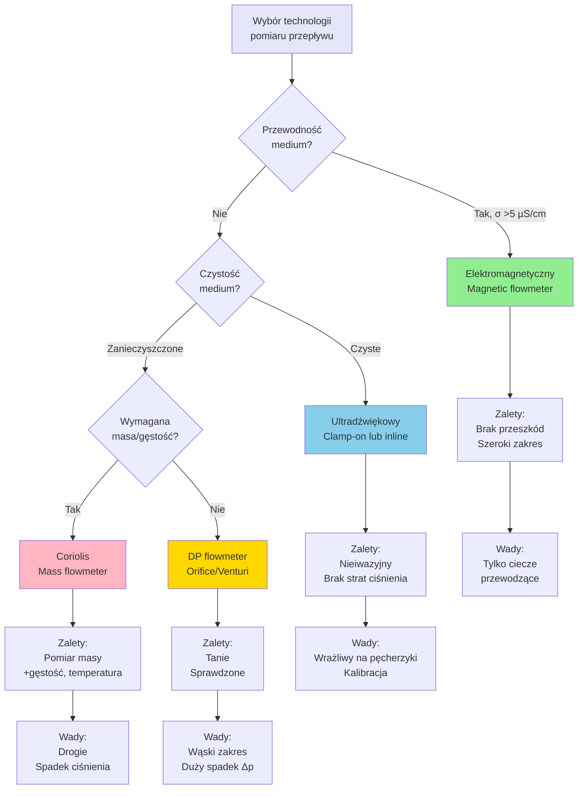

import { 
  SlideContainer, 
  Slide, 
  KeyPoints, 
  SupportingDetails, 
  InstructorNotes,
  VisualSeparator,
  LearningObjective,
  KeyConcept,
  Example
} from '@site/src/components/SlideComponents';
import { InteractiveQuiz } from '@site/src/components/InteractiveQuiz';

<LearningObjective>
Po tej sekcji student potrafi:
- Dobrać odpowiednią technologię pomiaru przepływu (elektromagnetyczny, ultradźwiękowy, Coriolis, DP) według właściwości medium
- Zaprojektować system pomiaru poziomu w zbiornikach (hydrostatyczny, radar, ultradźwięki) z kompensacją temperatury
- Wybrać przetwornik ciśnienia z uwzględnieniem zakresu, medium i wymagań dokładności
- Zinterpretować dane procesowe do diagnostyki i optymalizacji instalacji OZE (biogazownie, hydro, pompy ciepła)
</LearningObjective>

<SlideContainer>

<Slide title="🌊 Pomiar przepływu – zastosowania w OZE" type="info">

<KeyPoints title="📋 Dlaczego mierzymy przepływ?">

**Pomiar przepływu to fundamentalna wielkość w instalacjach OZE:**

**Biogazownie:**
- Przepływ substratu [m³/h, kg/h] → bilans masowy, dozowanie
- Przepływ biogazu [Nm³/h] → produkcja, rozliczenia
- Przepływ wody chłodzącej [m³/h] → kontrola temperatury

**Elektrownie wodne:**
- Przepływ wody przez turbinę [m³/s] → moc (P = ρ g Q H)
- Przepływ w kanale [m³/s] → prognozowanie

**Pompy ciepła:**
- Przepływ czynnika [kg/h] → efektywność COP
- Przepływ glikolu [L/min] → monitoring obiegów

**Instalacje biomasy:**
- Przepływ paliwa [kg/h] → sterowanie spalaniem
- Przepływ spalin [Nm³/h] → bilans, emisje

</KeyPoints>

<InstructorNotes>

Wprowadzenie do pomiaru przepływu – około pięć do siedmiu minut.

**Kluczowy przekaz**: przepływ to fundamentalna wielkość w instalacjach OZE. Bez pomiaru przepływu nie można obliczyć bilansu masowego, energetycznego, efektywności.

Przejdź przez aplikacje. **Biogazownie**: przepływ substratu do fermenterów (siano, gnojowica, odpady) – to podstawa sterowania dozowaniem. Przepływ biogazu to monitorowanie produkcji i rozliczenia (sprzedaż do sieci gazowej). Przepływ wody chłodzącej kontroluje temperaturę fermentacji (optymalna trzydzieści osiem do czterdzieści dwa stopnie).

**Elektrownie wodne**: przepływ wody przez turbinę to kluczowy parametr do obliczania mocy. Wzór: P = ρ g Q H (gęstość razy grawitacja razy przepływ razy wysokość spadu). Przepływ w kanale dopływowym to prognozowanie dostępności mocy.

**Pompy ciepła**: przepływ czynnika roboczego (R134a, R410A) wpływa na efektywność COP. Przepływ glikolu w kolektorach gruntowych to monitoring obiegów.

**Biomasa**: przepływ paliwa (pellet, zrębki) steruje spalaniem. Przepływ spalin to bilans energetyczny i monitoring emisji.

Podkreśl, że **jednostki różnią się**: objętość [m³/h], masa [kg/h], prędkość [m/s], przepływ normalny [Nm³/h - przy warunkach normalnych zero stopni, jeden bar]. Trzeba wiedzieć, co mierzymy.

</InstructorNotes>

</Slide>

<VisualSeparator type="default" />

<Slide title="⚙️ Parametry medium – wpływ na dobór" type="info">

**Kluczowe parametry medium:**

| Parametr | Wpływ na dobór | Przykład |
|----------|----------------|----------|
| **Przewodność elektryczna** | Elektromagnetyczny wymaga σ >5 µS/cm | Woda: OK, olej: NIE |
| **Lepkość** | Wysoką η → Coriolis lub termiczny | Gliceryna: 1000 mPa·s |
| **Zawiesina/zanieczyszczenia** | Ultradźwięki → problemy z akustyką | Osady w biogazowni |
| **Temperatura** | Ograniczenia materiałowe | >150°C → specjalne |
| **Ciśnienie** | Wytrzymałość mechaniczna | Hydro: do 40 bar |
| **Zakres przepływów** | Turndown ratio (min/max) | 1:10 (DP) vs. 1:100 (mag) |

<InstructorNotes>

Parametry medium to kluczowe kryteria wyboru – około cztery do pięciu minut.

**Przewodność elektryczna** – elektromagnetyczny flowmeter działa tylko dla cieczy przewodzących (sigma powyżej pięć mikrosimensów na centymetr). Woda, gnojowica, osady: OK. Olej, benzynę, destylaty: NIE.

**Lepkość** – dla wysokiej lepkości (gliceryna tysiąc milipaskali-sekund, miód, osady) lepsze są Coriolis lub termiczne. Turbinowy się zatka, DP ma ogromny spadek ciśnienia.

**Zawiesiny** – ultradźwięki transit-time wymagają czystego medium (pęcherzyki powietrza, zawiesiny zakłócają propagację fali). Dla zawiesin stosuje się Doppler (mierzy przesunięcie częstotliwości od poruszających się cząstek) lub elektromagnetyczny (odporny na zawiesiny).

**Temperatura** – powyżej stu pięćdziesięciu stopni wymagane specjalne materiały (uszczelki, elektronika). Coriolis ma limit około stu pięćdziesięciu stopni, DP może więcej (metal, bez elektroniki w rurze).

**Ciśnienie** – elektrownie wodne to do czterdziestu bar. Elektromagnetyczny i Coriolis muszą mieć odpowiednią klasę ciśnieniową (droższe flansze, grubsze ścianki).

**Turndown ratio** – stosunek maksymalnego do minimalnego przepływu przy zachowaniu dokładności. Elektromagnetyczny i Coriolis mają jeden do stu (szeroki zakres), DP (zwężki) tylko jeden do dziesięciu. **To oznacza, że zwężka mierzy dobrze tylko w wąskim zakresie**.

Podkreśl, że **nie ma uniwersalnej metody** – każde medium, każda aplikacja wymaga analizy trade-off'ów.

</InstructorNotes>

</Slide>

<VisualSeparator type="default" />

<Slide title="🔄 Diagram wyboru technologii przepływu" type="info">



<InstructorNotes>

Diagram wyboru technologii – około cztery do pięciu minut. **Diagram może być większy, to wyjątek**.

Przejdź przez diagram krok po kroku. **Pierwsze pytanie: czy medium przewodzi elektrycznie?** Sigma powyżej pięć mikrosimensów na centymetr – woda, gnojowica, roztwory wodne: tak. Olej, benzyna, gazy: nie.

Jeśli tak – **elektromagnetyczny to najlepszy wybór**. Brak przeszkód w rurze (nic się nie zatyka), szeroki turndown ratio jeden do stu, dokładność plus minus 0,2-0,5%. Koszt około tysiąc do trzech tysięcy euro zależnie od rozmiaru.

Jeśli nie przewodzi – **drugie pytanie: czy medium czyste?** Woda pitna, olej hydrauliczny: czyste. Gnojowica, osady, ciecze z pęcherzykami: zanieczyszczone.

Czyste – **ultradźwiękowy** (transit-time lub clamp-on). Nieiwazyjny (montaż na zewnątrz rury, bez przerywania przepływu), brak strat ciśnienia. Świetne do retrofitów.

Zanieczyszczone – **trzecie pytanie: czy potrzeba masy i gęstości?** Jeśli tak (rozliczenia, bilanse energetyczne) – Coriolis. Jeśli nie wystarczy objętość – DP flowmeter (zwężka, Venturi).

**Coriolis** to premium – pomiar masy plus gęstość plus temperatura w jednym urządzeniu. Dokładność plus minus 0,1-0,4% (masa). Wady: drogie (trzy do dziesięciu tysięcy euro), średni spadek ciśnienia.

**DP** (differential pressure) to tanie (pięćset do dwóch tysięcy euro), sprawdzone (norma ISO 5167), ale wąski turndown (jeden do dziesięciu) i duży spadek ciśnienia. Plus: zależność Δp proporcjonalna do Q kwadrat – nieliniowa, wymaga pierwiastkowania.

</InstructorNotes>

</Slide>

<VisualSeparator type="default" />

<Slide title="📊 Porównanie technologii przepływu" type="info">

| Metoda | Zasada | Medium | Turndown | Dokładność | Δp | Koszt |
|--------|--------|--------|----------|------------|-----|-------|
| **Elektromagnetyczny** | Faraday: U ∝ v×B | Ciecze przew. | 1:100 | ±0.2-0.5% | Brak | €€€ |
| **Ultradźw (transit)** | Czas przelotu fali | Ciecze czyste | 1:100 | ±0.5-2% | Brak | €€€ |
| **Ultradźw (Doppler)** | Doppler od cząstek | Zawiesiny | 1:50 | ±2-5% | Brak | €€ |
| **Coriolis** | Siła Coriolisa | Ciecze, gazy | 1:100 | ±0.1-0.4% | Średni | €€€€ |
| **DP (zwężka)** | Bernoulli: Δp∝Q² | Ciecze, gazy | 1:10 | ±1-5% | Duży | €€ |
| **Vortex** | Wiry von Kármána | Ciecze, gazy | 1:20 | ±1% | Średni | €€ |
| **Turbinowy** | Obroty ∝ Q | Ciecze czyste | 1:10 | ±0.5-1% | Mały | €€ |
| **Termiczny** | Chłodzenie | Gazy | 1:100 | ±1-2% | Brak | €€€ |

<KeyPoints title="📋 Dobór dla typowych aplikacji OZE">

**Biogazownia - substrat**: Elektromagnetyczny (gnojowica przewodzi)  
**Biogazownia - biogaz**: Termiczny mass flow (gaz, małe Q)  
**Hydro - turbina**: Ultradźw clamp-on (retrofit) lub Venturi (nowe)  
**Pompa ciepła**: Coriolis (masa czynnika) lub turbinowy (glikol)

</KeyPoints>

<InstructorNotes>

Tabela porównawcza to synteza – około pięć do siedmiu minut.

Przejdź przez tabelę wiersz po wierszu. **Elektromagnetyczny**: workhorse przemysłu, turndown jeden do stu, dokładność plus minus 0,2-0,5%, brak spadku ciśnienia. Wymaga przewodzącego medium (sigma powyżej pięć mikrosimensów).

**Ultradźwiękowy transit-time**: dla czystych cieczy, clamp-on to montaż bez przerywania rury (świetne do retrofitów). Doppler dla zawiesin (mierzy przesunięcie częstotliwości od poruszających się cząstek).

**Coriolis**: najdokładniejszy (plus minus 0,1-0,4% masy), plus daje gęstość i temperaturę. Drogi (trzy do dziesięciu tysięcy euro), ale zwraca się w aplikacjach wymagających precyzyjnych bilansów (rozliczenia, process control).

**DP (zwężka, Venturi)**: najtańszy (pięćset do dwóch tysięcy euro), ale wąski turndown (jeden do dziesięciu) i duży spadek ciśnienia. Zależność nieliniowa (Δp proporcjonalne do Q kwadrat).

**Vortex**: mierzy częstotliwość wirów von Kármána za przeszkodą (bluff body). Dobry dla pary, gazów, cieczy (universal), turndown jeden do dwudziestu.

**Turbinowy**: obroty turbinki proporcjonalne do przepływu. Dokładny (plus minus 0,5-1%), ale tylko dla czystych cieczy (zawiesiny zatykają turbinkę).

**Termiczny mass**: dla gazów, mierzy masę bezpośrednio (chłodzenie podgrzanego elementu proporcjonalne do masy przepływu). Świetny turndown jeden do stu.

Dobór dla OZE: **biogazownia substrat to elektromagnetyczny** (gnojowica przewodzi), **biogaz to termiczny mass**, **hydro to clamp-on lub Venturi**, **pompa ciepła to Coriolis lub turbinowy**.

Typowy błąd: stosowanie elektromagnetycznego do oleju – **nie przewodzi, nie zadziała**. Ultradźwięki w medium z pęcherzykami – transit-time da błędy plus dziesięć do pięćdziesięciu procent, trzeba Doppler.

Pytanie o turndown ratio – stosunek maksymalnego do minimalnego przepływu. **Jeden do stu** oznacza, że flowmeter mierzy od jeden procent do stu procent zakresu z tą samą dokładnością. Zwężki mają słaby turndown (jeden do trzech, jeden do dziesięciu) – mierzą dobrze tylko w wąskim zakresie.

</InstructorNotes>

</Slide>

<VisualSeparator type="technical" />

<Slide title="📏 Pomiar poziomu – przegląd technologii" type="tip">

<KeyPoints title="📋 Metody pomiaru poziomu">

**1. Hydrostatyczny (ciśnienie słupa cieczy)**
- Zasada: p = ρ g h → czujnik na dnie zbiornika
- Zalety: Prosty, tani (300-800 EUR)
- Wady: Wymaga kompensacji T (gęstość ρ = f(T)), kontakt z medium
- Dokładność: ±0.1-0.5% FS

**2. Radarowy (FMCW)**
- Zasada: Czas przelotu microwave (26 GHz) od powierzchni
- Zalety: Bezkontaktowy, odporny na T/p/pary, dokładność ±2-5 mm
- Wady: Drogi (2000-5000 EUR)
- Zastosowanie OZE: ⭐ Fermentery biogazowni

**3. Ultradźwiękowy (bezkontaktowy)**
- Zasada: Czas przelotu ultradźwięków (40-80 kHz)
- Zalety: Tani (500-1500 EUR), prosty montaż
- Wady: Wrażliwy na T powietrza, para, dead zone ~0.3-0.5 m
- Kompensacja: v_sound = 331.5 + 0.6×T [m/s]

</KeyPoints>

<InstructorNotes>

Przegląd technologii pomiaru poziomu – około sześć do ośmiu minut.

Zacznij od **hydrostatycznego** – najprostszy, czujnik ciśnienia na dnie zbiornika. Ciśnienie słupa cieczy p = ρ g h, więc poziom h = p/(ρ g). **Prosty, niezawodny, tani** (trzysta do osiemset euro). Wada: **wymaga kompensacji temperatury**, bo gęstość zmienia się z temperaturą (rozszerzalność objętościowa). Plus: kontakt z medium – ryzyko korozji w agresywnych środowiskach.

**Radarowy FMCW** – fala elektromagnetyczna (microwave, dwadzieścia sześć gigaherców) odbija się od powierzchni cieczy. Czas przelotu daje odległość. **Bezkontaktowy, odporny na wszystko** (temperatura, ciśnienie, pary, zawiesiny), dokładność plus minus dwa do pięciu milimetrów. Wada: drogi (dwa do pięciu tysięcy euro). **To premium wybór dla fermenterów biogazowni** – osady na czujniku kontaktowym to problem, radar tego unika.

**Ultradźwiękowy** – fala dźwiękowa (czterdzieści do osiemdziesięciu kiloherców) odbija się od powierzchni. Tani (pięćset do tysiąc pięćset euro), prosty montaż (przykręcony do pokrywy zbiornika). Wady: **wrażliwy na temperaturę powietrza** (prędkość dźwięku zmienia się 0,6 metra na sekundę na stopień Celsjusza), problemy z parą (absorbuje ultradźwięki), dead zone (martwa strefa) trzydzieści do pięćdziesięciu centymetrów od przetwornika.

Kompensacja temperatury ultradźwięków: v = 331,5 + 0,6 razy T. Przy dwudziestu stopniach to 343 m/s, przy zero stopni 331,5 m/s. **Bez kompensacji błąd około trzy do czterech procent** na dwadzieścia stopni różnicy.

</InstructorNotes>

</Slide>

<VisualSeparator type="default" />

<Slide title="📏 Pomiar poziomu – technologie dodatkowe" type="tip">

<KeyPoints title="📋 Inne metody pomiaru">

**4. Pojemnościowy**
- Zmiana pojemności elektrycznej między sondą a ścianką przy zmianie poziomu
- Zalety: Prosty, brak części ruchomych, może mierzyć interface (granica faz)
- Wady: Wrażliwy na osady na sondzie, zmiana ε medium

**5. Pływakowy**
- Pływak mechanicznie połączony z potencjometrem/enkoderem
- Zalety: Bardzo tani (50-200 EUR), niezawodny dla prostych aplikacji
- Wady: Części ruchome (wear), problemy z zawiesinami

**6. Laserowy / LIDAR**
- Time-of-flight lasera (650-905 nm)
- Zalety: Bardzo wysoka dokładność (±1 mm), duże odległości (300 m)
- Wady: Bardzo drogi (5000-15000 EUR), wrażliwy na pary/pył

</KeyPoints>

<InstructorNotes>

Dodatkowe technologie – około cztery do pięciu minut. Przejdź szybko przez trzy mniej popularne metody.

**Pojemnościowy** – sonda zanurzona w medium, pojemność elektryczna między sondą a ścianką zbiornika zmienia się z poziomem. Może mierzyć interface (granicę dwóch faz, np. olej/woda). Wrażliwy na osady na sondzie (zmienia pojemność parazytyczną) i wilgotność medium (zmienia stałą dielektryczną epsilon).

**Pływakowy** – stara, mechaniczna metoda. Pływak pływa na powierzchni, mechanicznie połączony z potencjometrem (rezystancja zmienia się z pozycją) lub enkoderem optycznym. **Bardzo tani** (pięćdziesiąt do dwustu euro), ale części ruchome – wear, problemy z zatykaniem w zawiesinach. Stosowany jako backup w prostych aplikacjach.

**Laserowy/LIDAR** – time-of-flight lasera. **Dokładność plus minus jeden milimetr**, wąska wiązka (można mierzyć małe obiekty), duże odległości (do trzystu metrów dla systemów LIDAR). Wady: bardzo drogi (pięć do piętnastu tysięcy euro), wrażliwy na pary i pył (absorbują laser). Stosowany w specjalistycznych aplikacjach (zbiorniki chemiczne, duże odległości).

W OZE rzadko stosowane – za drogie dla typowych zastosowań. Radar wystarczy i jest tańszy.

</InstructorNotes>

</Slide>

<VisualSeparator type="default" />

<Slide title="🏭 Dobór czujników poziom – aplikacje OZE" type="success">

<SupportingDetails title="🔧 Dobór według aplikacji">

**Fermenter biogazowni (20 m, gnojowica + osady):**
- Wymagania: ATEX Strefa 0/1, ciśnienie nadmuchowe 50-200 mbar
- **Rekomendacja: Radar FMCW (Ex ia)** – bezkontaktowy, odporny
- Koszt: 3000-4500 EUR
- **Alternative: Hydrostatyczny** z membraną ceramiczną – 800-1200 EUR

**Zbiornik końcowy biogazowni (10 m, biogaz):**
- Medium względnie czyste, powierzchnia spokojna
- **Rekomendacja: Ultradźwiękowy** bezkontaktowy
- Koszt: 800-1200 EUR

**Hydro – zbiornik górny (100 m wysokości):**
- Duży zakres (0-10 bar), czysta woda
- **Rekomendacja: Hydrostatyczny** (submersible pressure sensor)
- Koszt: 500-1000 EUR

</SupportingDetails>

<InstructorNotes>

Dobór czujników dla konkretnych aplikacji – około cztery do pięciu minut.

**Fermenter biogazowni**: dwadzieścia metrów wysokości, medium agresywne (gnojowica plus osady), temperatura trzydzieści pięć do czterdziestu dwóch stopnie, ciśnienie nadmuchowe pięćdziesiąt do dwustu milibarów (biogaz nad cieczą), **ATEX Strefa zero wnętrze, Strefa jeden flansza**.

Rekomendacja: **Radar FMCW z certyfikatem Ex ia**. Bezkontaktowy (osady na czujniku to problem), odporny na ciśnienie nadmuchowe i pary, ATEX-certified. Koszt trzy do czterech i pół tysiąca euro – drogo, ale to must w tej aplikacji.

Alternative: hydrostatyczny z membranową separacją (ceramika odporna na H₂S) plus kompensacja ciśnienia nadmuchowego (pomiar różnicowy: p_dno minus p_góra). Koszt osiemset do tysiąc dwieście euro – tańsze, ale ryzyko zatykania membrany osadami.

**Zbiornik końcowy** – dziesięć metrów, medium czyste (po fermentacji), powierzchnia względnie spokojna. **Ultradźwiękowy bezkontaktowy** wystarczy – koszt osiemset do tysiąc dwieście euro.

**Hydro zbiornik górny** – sto metrów wysokości (odpowiada dziesięciu barom ciśnienia), czysta woda. **Hydrostatyczny submersible** (zanurzalny czujnik ciśnienia) – koszt pięćset do tysiąc euro. Alternative: radar lub laser jeśli dostęp od góry.

</InstructorNotes>

</Slide>

<VisualSeparator type="default" />

<Slide title="🌡️ Kompensacja temperatury – pomiar hydrostatyczny" type="info">

<Example title="Wpływ temperatury na pomiar">

**Problem**: Fermenter biogazowni, wysokość 15 m, medium: woda + organika

**Parametry:**
- Gęstość ρ₀ = 1050 kg/m³ (T = 40°C, baseline)
- Współczynnik rozszerzalności β ≈ 3×10⁻⁴ /°C
- Czujnik ciśnienia: zakres 0-2 bar (0-200 kPa)

**Scenariusz bez kompensacji:**

1. **Warunki normalne** (T = 40°C):
   - Poziom h = 12 m
- Ciśnienie: p = ρ g h = 1050 × 9.81 × 12 = 123.6 kPa
   - Czujnik wskazuje: h = 12 m ✅

2. **Przegrzanie fermentera** (T = 50°C):
   - Gęstość spadła: ρ = 1046.9 kg/m³
   - Ciśnienie (ten sam poziom): p = 123.2 kPa
   - **Czujnik wskaże**: h = 11.96 m ❌

**Błąd: -4 cm** (zaniżenie przez spadek gęstości)

</Example>

<InstructorNotes>

Problem kompensacji temperatury – około cztery do pięciu minut.

Zacznij od **praktycznego scenariusza fermentera biogazowni**. Wysokość piętnaście metrów, medium to woda plus organika (gnojowica, osady). Gęstość nominalnie tysiąc pięćdziesiąt kilogramów na metr sześcienny przy czterdziestu stopniach Celsjusza.

**Kluczowy przekaz**: pomiar hydrostatyczny to nie "plug and play". Gęstość medium zmienia się z temperaturą według współczynnika rozszerzalności objętościowej beta. Dla wody plus organika beta około trzy razy dziesięć do minus czwartej na stopień Celsjusza.

Przejdź przez scenariusz krok po kroku. **Warunki normalne** – czterdzieści stopni, poziom dwanaście metrów. Ciśnienie na dnie: p = ρ g h = 1050 × 9,81 × 12 = 123,6 kilopaskala. Czujnik pokazuje dwanaście metrów – wszystko OK.

Teraz **przegrzanie fermentera** do pięćdziesięciu stopni (może się zdarzyć przy awarii chłodzenia). Gęstość spada do 1046,9 kg/m³. Ten sam poziom dwanaście metrów daje teraz ciśnienie 123,2 kPa. **Czujnik bez kompensacji wskaże 11,96 metra** – błąd minus cztery centymetry.

Podkreśl: **cztery centymetry błędu w zbiorniku o średnicy dziesięć metrów to około trzy metry sześcienne objętości** – znacząca różnica w kontroli procesu fermentacji.

</InstructorNotes>

</Slide>

<VisualSeparator type="default" />

<Slide title="💻 Kompensacja temperatury – rozwiązanie" type="success">

**Wzór kompensacji:**

$$
h_{\text{true}} = \frac{p}{\rho(T) \times g} = \frac{p}{\rho_0 \times g} \times \left[1 + \beta (T - T_0)\right]
$$

**Implementacja w SCADA:**

```python
# Python code - temperatura compensation
rho_0 = 1050  # kg/m³ at T_0 = 40°C
beta = 3e-4   # /°C
g = 9.81      # m/s²

p_measured = 123.2e3  # Pa (from pressure sensor)
T_measured = 50       # °C (from PT1000)
T_0 = 40              # °C (baseline)

rho_actual = rho_0 / (1 + beta * (T_measured - T_0))
h_corrected = p_measured / (rho_actual * g)

print(f"Level (compensated): {h_corrected:.2f} m")
# Output: 12.00 m ✅
```

:::tip Kluczowe wnioski
- Bez kompensacji temperatury: błąd do ±0.5-1% na 10°C
- **Zawsze mierz T medium** przy pomiarach hydrostatycznych!
- PT100/PT1000 w fermentarze: koszt ~100-200 EUR
:::

<InstructorNotes>

Rozwiązanie problemu kompensacji – około cztery do pięciu minut.

Pokaż **wzór kompensacji** – poziom prawdziwy to ciśnienie podzielone przez gęstość zależną od temperatury razy grawitacja. Można to zapisać jako wzór z gęstością bazową ρ₀ i współczynnikiem beta.

Przejdź do **implementacji w SCADA**. Python to popularny język dla edge computing i przetwarzania danych. Pokazany kod to realistyczny przykład – odczyt z czujnika ciśnienia (Pa), odczyt z PT1000 (temperatura medium), obliczenie gęstości przy aktualnej temperaturze, korekcja poziomu.

**Kluczowy element**: dodatkowy czujnik temperatury PT1000 kosztuje sto do dwustu euro. To niewiele w porównaniu do kosztów błędnego pomiaru poziomu. **Zwrot z inwestycji jest natychmiastowy** – od pierwszego dnia mamy poprawne dane.

Podkreśl praktyczne aspekty. W systemie SCADA (Grafana, InfluxDB, Node-RED) taka kompensacja to **kilka linii kodu w funkcji transformującej dane**. Można to zautomatyzować całkowicie – czujnik temperatury wysyła dane co dziesięć sekund, algorytm kompensuje w czasie rzeczywistym.

Typowy błąd: stosowanie stałej gęstości nominalnej bez kompensacji. **To działa tylko jeśli temperatura jest stabilna** (co w praktyce rzadko się zdarza).

</InstructorNotes>

</Slide>

<VisualSeparator type="default" />

<Slide title="🔧 Pomiar ciśnienia – typy przetworników" type="info">

<KeyPoints title="📋 Technologie przetworników ciśnienia">

**1. Piezorezystancyjne (strain gauge)** ⭐ Najpopularniejszy
- Zasada: Deformacja membrany → zmiana rezystancji (most Wheatstone'a)
- Zakres: 0-1 bar do 0-1000 bar
- Dokładność: ±0.1-0.5% FS
- Koszt: 200-800 EUR | **80% rynku przemysłowego**

**2. Pojemnościowe (capacitive)**
- Zasada: Zmiana pojemności między membraną a elektroadą
- Zakres: 0-10 mbar do 0-100 bar
- Dokładność: ±0.05-0.2% FS (lepsze niż piezo)
- Koszt: 500-1500 EUR | Precyzyjne pomiary, vakuum

**3. Piezoelektryczne**
- Zasada: Kryształ piezo generuje ładunek przy zmianie ciśnienia
- **Tylko dynamiczne** (NIE mierzy ciśnienia statycznego!)
- Częstotliwość: Do 100 kHz | Spalanie, eksplozje

**4. Rezonansowe (resonant)**
- Dokładność: ±0.01-0.05% FS (ultra-precyzyjne)
- Koszt: 3000-10000 EUR | Metrologia, standardy

</KeyPoints>

<KeyPoints title="📋 Typy pomiaru">

**Absolutne (absolute)**: Pomiar względem próżni (0 bar abs = vacuum)  
**Względne (gauge)**: Pomiar względem p_atm (0 bar g = 1 atm)  
**Różnicowe (DP)**: Różnica ΔP = p₁ - p₂

:::caution Uwaga
1 bar gauge ≠ 1 bar absolute! Krytyczna różnica w projektowaniu.
:::

</KeyPoints>

<InstructorNotes>

Typy przetworników ciśnienia – około pięć do sześciu minut.

**Piezorezystancyjne to osiemdziesiąt procent rynku** – dobry kompromis koszt versus performance. Zasada: membrana odkształca się pod ciśnieniem, tensometry (strain gauges) na membranie zmieniają rezystancję, most Wheatstone'a zamienia to na napięcie. Zakres od zero do jeden bar do zero do tysiąc bar. Dokładność plus minus 0,1-0,5% FS (full scale). **Koszt dwieście do osiemset euro** – to workhorse przemysłu.

**Pojemnościowe** – membrana i elektroda tworzą kondensator, ciśnienie zmienia pojemność. Lepsze niż piezo (plus minus 0,05-0,2%), ale droższe (pięćset do tysiąc pięćset euro). Bardzo dobra stabilność długoterminowa, niski dryft. Stosowane w precyzyjnych pomiarach i vakuum.

**Piezoelektryczne** – kryształ piezo generuje ładunek tylko przy ZMIANIE ciśnienia (dF/dt). **Nie mierzy ciśnienia statycznego** – ładunek wycieka przez rezystancję izolacji (stała czasowa jeden do dziesięciu sekund). Bardzo szybkie (do stu kiloherców), stosowane w spalaniu (cylindry silników), eksplozjach, testach dynamicznych.

**Rezonansowe** – ultra-precyzyjne (plus minus 0,01-0,05%), ale bardzo drogie (trzy do dziesięciu tysięcy euro). Stosowane w metrologii, kalibracjach, standardach.

**Typy pomiaru – kluczowa różnica**: absolutne mierzy względem próżni (zero bar absolute to vacuum), gauge mierzy względem ciśnienia atmosferycznego (zero bar gauge to jeden atm), differential to różnica między dwoma punktami. **Typowy błąd studentów: mylenie absolutne versus gauge**. Jeden bar gauge to dwa bary absolute (jeden plus atmosfera). KRYTYCZNE w projektowaniu!

</InstructorNotes>

</Slide>

<VisualSeparator type="default" />

<Slide title="🌐 Pomiar ciśnienia – zastosowania OZE" type="info">

**Biogazownie:**

| Punkt pomiaru | Typ | Zakres | Zastosowanie |
|---------------|-----|--------|--------------|
| Biogaz w fermentarze | Gauge | 0-500 mbar | Produkcja, safety |
| Przed BHKW | Gauge | 0-200 mbar | Kontrola dostawy |
| ΔP filtr biogazu | Differential | 0-100 mbar | Detekcja zatkania |
| Pompowanie substratu | Gauge | 0-10 bar | Sterowanie pompą |

**Elektrownie wodne:**

| Punkt pomiaru | Typ | Zakres | Zastosowanie |
|---------------|-----|--------|--------------|
| Przed turbiną | Gauge | 0-40 bar | Moc: P = η ρ g Q H |
| ΔP turbina | Differential | 0-20 bar | Efektywność |
| Draft tube | Gauge/vacuum | -1 to +2 bar | Monit. kavitacji |

**Pompy ciepła:**

| Punkt pomiaru | Typ | Zakres | Zastosowanie |
|---------------|-----|--------|--------------|
| Ssanie (suction) | Gauge | 0-10 bar | COP calculation |
| Tłoczenie (discharge) | Gauge | 0-40 bar | Monit. kompresora |
| ΔP wymiennik | Differential | 0-2 bar | Detekcja osadów |

:::tip Membrany separacyjne dla mediów agresywnych
**Problem**: H₂S w biogazie → korozja membrany stalowej  
**Rozwiązanie**: Membrana z tantalem/Hastelloy/PTFE, wypełnienie olejem  
**Koszt**: +300-800 EUR
:::

<InstructorNotes>

Zastosowania w OZE – około cztery do pięciu minut. Przejdź przez tabele.

**Biogazownie**: ciśnienie biogazu w fermentarze (zero do pięćset milibarów gauge) to monitoring produkcji i safety – jeśli ciśnienie za wysokie, ryzyko wybuchu. Ciśnienie przed BHKW (block heat and power, kogeneracja) to kontrola dostawy gazu. ΔP filtr to detekcja zatkania – jeśli rośnie, filtr trzeba wymienić.

**Elektrownie wodne**: ciśnienie przed turbiną (do czterdziestu barów) to kluczowy parametr do obliczania mocy. Wzór: P = η ρ g Q H, gdzie H (wysokość spadu) wynika z ciśnienia: H = p/(ρ g). ΔP turbina to różnica wlot-wylot, mierzy efektywność. Draft tube (wylot turbiny) – monitoring kavitacji, musi być powyżej ciśnienia pary wodnej.

**Pompy ciepła**: ssanie i tłoczenie to monitoring kompresora, obliczanie COP. ΔP wymiennik to detekcja osadów i zabrudzenia – jeśli rośnie, wymiennik trzeba wyczyścić.

**Membrany separacyjne**: dla agresywnych mediów (H₂S w biogazie, kwasy) stalowa membrana koroduje. Rozwiązanie: membrana separacyjna z tantalem, Hastelloy, PTFE, ceramiki. Olej silikonowy przekazuje ciśnienie, izoluje medium od czujnika. Koszt dodatkowy trzysta do osiemset euro – ale to must w biogazowniach.

</InstructorNotes>

</Slide>

<VisualSeparator type="default" />

<Slide title="💧 Przykład: Moc turbiny wodnej" type="success">

<Example title="Obliczanie mocy turbiny z pomiaru ciśnienia">

**Kontekst: MEW, turbina Francisa**

**Dane pomiarowe:**
- Ciśnienie przed turbiną: p = 12.5 bar = 1250 kPa
- Przepływ: Q = 3.2 m³/s
- η_turbine = 90%, η_generator = 96%

**Obliczenia:**

1. **Wysokość spadu**: H = p/(ρ g) = 1250000/(1000 × 9.81) = **127.4 m**

2. **Moc hydrauliczna**: P_hydr = ρ g Q H = 1000 × 9.81 × 3.2 × 127.4 = **4000 kW**

3. **Moc mechaniczna**: P_mech = 4000 × 0.90 = **3600 kW**

4. **Moc elektryczna**: P_el = 3600 × 0.96 = **3456 kW**

**Monitoring w SCADA:**
- Pomiar p i Q co 1 s → obliczenie P_el
- Porównanie z wattomierzem na generatorze
- **Jeśli różnica >5%** → alarm (kavitacja, zatkanie)

**Monitoring kavitacji (draft tube):**
- p_draft > p_vapor(T) (ciśnienie pary wodnej)
- Dla T=10°C: p_vapor ≈ 0.012 bar → p_draft >0.1-0.2 bar

**Rzeczywiste dane (24h):**
- P_el_calculated: 3456 kW | P_el_measured: 3390 kW
- Różnica: -66 kW (-1.9%) → **OK**

</Example>

<InstructorNotes>

Przykład turbiny wodnej – około pięć do sześciu minut. Obliczenia na tablicy lub slajdzie live.

**Kontekst**: mała elektrownia wodna (MEW), turbina Francisa (to najpopularniejszy typ dla średnich spadów sto do dwustu metrów). Ciśnienie przed turbiną 12,5 bara gauge (tysiąc dwieście pięćdziesiąt kilopaskali), przepływ 3,2 metra sześciennego na sekundę.

Przejdź przez obliczenia krok po kroku. **Krok 1: wysokość spadu** H = p/(ρ g). To kluczowy wzór – ciśnienie to słup wody, więc można przeliczyć na wysokość. 127,4 metra spadu.

**Krok 2: moc hydrauliczna** – to moc dostępna w wodzie: P = ρ g Q H. Tysiąc razy 9,81 razy 3,2 razy 127,4 = cztery tysiące kilowatów. To potencjał energetyczny wody.

**Krok 3: moc mechaniczna** na wale turbiny – turbina ma sprawność dziewięćdziesiąt procent (typowa dla Francisa w nominalnym punkcie pracy). Cztery tysiące razy 0,9 = trzy tysiące sześćset kilowatów.

**Krok 4: moc elektryczna** – generator ma sprawność dziewięćdziesiąt sześć procent. Trzy tysiące sześćset razy 0,96 = trzy tysiące czterysta pięćdziesiąt sześć kilowatów elektrycznych (net).

**System monitoringu w SCADA**: ciągły pomiar p i Q co sekundę, agregacja do jednej minuty, obliczenie mocy elektrycznej. Porównanie z rzeczywistym pomiarem z wattomierza na generatorze. **Jeśli różnica większa niż pięć procent – alarm**. Możliwe przyczyny: kavitacja, zatkanie, spadek sprawności (wear, osady).

**Monitoring kavitacji**: ciśnienie w draft tube (wylot turbiny) musi być powyżej ciśnienia pary wodnej przy danej temperaturze. Dla dziesięciu stopni Celsjusza p_vapor około 0,012 bara. Draft tube powinno być powyżej 0,1-0,2 bara (margin bezpieczeństwa). Jeśli spada poniżej – **kavitacja** – pęcherzyki pary implodują, erozja łopatek turbiny.

Rzeczywiste dane z monitoringu: moc obliczona trzy tysiące czterysta pięćdziesiąt sześć kilowatów, zmierzona trzy tysiące trzysta dziewięćdziesiąt kilowatów. Różnica minus sześćdziesiąt sześć kilowatów (minus 1,9%) – **OK, w tolerancji**.

</InstructorNotes>

</Slide>

</SlideContainer>