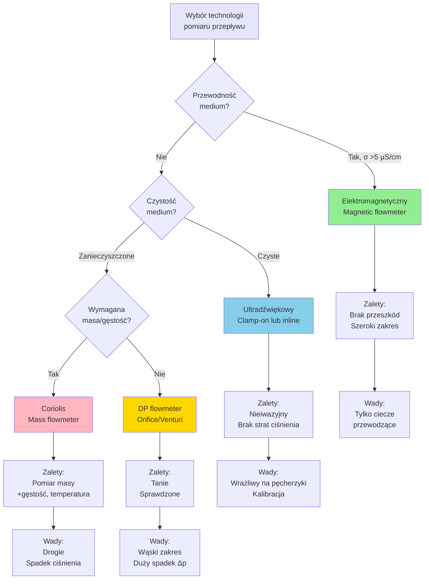

import { 
  SlideContainer, 
  Slide, 
  KeyPoints, 
  SupportingDetails, 
  InstructorNotes,
  VisualSeparator,
  LearningObjective,
  KeyConcept,
  Example
} from '@site/src/components/SlideComponents';
import { InteractiveQuiz } from '@site/src/components/InteractiveQuiz';

<LearningObjective>
Po tej sekcji student potrafi:
- Dobrać odpowiednią technologię pomiaru przepływu (elektromagnetyczny, ultradźwiękowy, Coriolis, DP) według właściwości medium
- Zaprojektować system pomiaru poziomu w zbiornikach (hydrostatyczny, radar, ultradźwięki) z kompensacją temperatury
- Wybrać przetwornik ciśnienia z uwzględnieniem zakresu, medium i wymagań dokładności
- Zinterpretować dane procesowe do diagnostyki i optymalizacji instalacji OZE (biogazownie, hydro, pompy ciepła)
</LearningObjective>

<SlideContainer>

<Slide title="🌊 Pomiar przepływu – wprowadzenie i zastosowania" type="info">

<KeyPoints title="📋 Dlaczego mierzymy przepływ?">

**Pomiar przepływu to fundamentalna wielkość w instalacjach OZE:**

**Biogazownie:**
- Przepływ substratu do fermenterów [m³/h, kg/h] → bilans masowy, sterowanie dozowaniem
- Przepływ biogazu [Nm³/h] → monitorowanie produkcji, rozliczenia
- Przepływ wody chłodzącej [m³/h] → kontrola temperatury fermentacji

**Elektrownie wodne:**
- Przepływ wody przez turbinę [m³/s] → obliczanie mocy (P = ρ g Q H)
- Przepływ w kanale dopływowym [m³/s] → prognozowanie dostępności

**Pompy ciepła:**
- Przepływ czynnika roboczego [kg/h] → efektywność COP
- Przepływ glikolu w kolektorach [L/min] → monitoring obiegów

**Instalacje biomasy:**
- Przepływ paliwa (pellet, zrębki) [kg/h] → sterowanie spalaniem
- Przepływ spalin [Nm³/h] → bilans energetyczny, emisje

**Kluczowe parametry medium wpływające na wybór technologii:**

| Parametr | Wpływ na dobór | Przykład |
|----------|----------------|----------|
| **Przewodność elektryczna** | Elektromagnetyczny wymaga σ >5 µS/cm | Woda: OK, olej: NIE |
| **Lepkość** | Wysoką η → Coriolis lub termiczny | Gliceryna: 1000 mPa·s |
| **Zawiesina/zanieczyszczenia** | Ultradźwięki → problemy z akustyką | Osady w biogazowni |
| **Temperatura** | Ograniczenia materiałowe | >150°C → specjalne |
| **Ciśnienie** | Wytrzymałość mechaniczna | Hydro: do 40 bar |
| **Zakres przepływów** | Turndown ratio (min/max) | 1:10 (DP) vs. 1:100 (mag) |

</KeyPoints>

<SupportingDetails title="📊 Przegląd technologii pomiaru przepływu">



### Porównanie metod:

| Metoda | Zasada działania | Medium | Zakres | Turndown | Dokładność | Δp | Koszt |
|--------|------------------|--------|--------|----------|------------|-------|-------|
| **Elektromagnetyczny** | Prawo Faradaya: U ∝ v × B | Ciecze przewodzące | 0.01-10 m/s | 1:100 | ±0.2-0.5% | Brak | €€€ |
| **Ultradźwiękowy (transit-time)** | Różnica czasu przelotu fali | Ciecze czyste | 0.01-10 m/s | 1:100 | ±0.5-2% | Brak (clamp) | €€€ |
| **Ultradźwiękowy (Doppler)** | Przesunięcie Dopplera od cząstek | Zawiesiny, pęcherzyki | 0.3-10 m/s | 1:50 | ±2-5% | Brak | €€ |
| **Coriolis** | Siła Coriolisa → masa | Ciecze, gazy | 0-max | 1:100 | ±0.1-0.4% (masa) | Średni | €€€€ |
| **DP (zwężka, Venturi)** | Bernoulli: Δp ∝ Q² | Ciecze, gazy | 0.3-max | 1:10 | ±1-5% | Duży | €€ |
| **Vortex** | Częstotliwość wirów von Kármána | Ciecze, gazy, para | 0.5-max | 1:20 | ±1% | Średni | €€ |
| **Turbinowy** | Obroty turbinki ∝ Q | Ciecze czyste | 0.3-max | 1:10 | ±0.5-1% | Mały | €€ |
| **Termiczny (mass)** | Chłodzenie elementu grzejnego | Gazy | 0-max | 1:100 | ±1-2% | Brak | €€€ |

</SupportingDetails>

<InstructorNotes>

**Czas**: 14-16 min

**Przebieg**:
1. Wprowadzenie – dlaczego przepływ? (3 min) – przykłady z biogazowni, hydro
2. Diagram wyboru technologii (4 min) – omów flowchart krok po kroku
3. Tabela porównawcza (5 min) – podkreśl trade-offy (dokładność vs. koszt vs. Δp)
4. Dyskusja: Jaką metodę wybraliby studenci dla biogazowni? (2 min)
5. Q&A (2 min)

**Punkty kluczowe**:
- **Nie ma uniwersalnej metody** – dobór zależy od medium, zakresu, budżetu
- **Elektromagnetyczny to workhorse biogazowni** – woda, substrat (jeśli przewodzący)
- **Ultradźwięki clamp-on** – świetne do retofitów (montaż bez przerywania rury!)
- **Coriolis** – gdy potrzeba masy (bilans energetyczny, rozliczenia)

**Demonstracja praktyczna**:
- Pokaż ultradźwiękowy clamp-on (dwa przetworniki, mocowane na rurze)
- Elektromagnetyczny flowmeter (przekrój poprzeczny – brak przeszkód w rurze)
- Film: vortex shedding (wiry von Kármána) – wizualizacja

**Materiały pomocnicze**:
- ISO 5167 – Measurement of fluid flow by means of pressure differential devices
- Endress+Hauser, Krohne, Emerson application guides (free PDFs)
- Kalkulator Δp dla zwężek (online tool)

**Typowe błędy studenckie**:
- Stosowanie elektromagnetycznego do oleju/benzyny (NIE PRZEWODZI!)
- Ultradźwięki transit-time w medium z pęcherzykami (błędy +10-50%) → Doppler
- Ignorowanie Δp – w biogazowni z małym ciśnieniem (200 mbar) zwężka z Δp = 100 mbar to katastrofa

**Pytania studenckie**:
- Q: Dlaczego Coriolis mierzy masę, a nie objętość?
- A: Siła Coriolisa zależy od MASY przepływającego medium (m = ρ × Q). Bonus: Coriolis daje też gęstość i temperaturę!

- Q: Co to turndown ratio?
- A: Stosunek max/min przepływu przy zachowaniu dokładności. 1:100 = mierzy od 1% do 100% zakresu z tą samą accuracy. DP (zwężki) mają słaby turndown 1:3-1:10.

</InstructorNotes>

</Slide>

<VisualSeparator type="technical" />

<Slide title="📏 Pomiar poziomu – technologie i zastosowania" type="tip">

<KeyPoints title="📋 Metody pomiaru poziomu">

**1. Hydrostatyczny (ciśnienie słupa cieczy)**
- **Zasada**: p = ρ g h → czujnik ciśnienia na dnie zbiornika
- **Zastosowanie**: Zbiorniki otwarte/zamknięte, ciecze czyste i zanieczyszczone
- **Zalety**: Prosty, niezawodny, tani (300-800 EUR)
- **Wady**: 
  - Wymaga kompensacji ciśnienia nadmuchowego (w zamkniętych zbiornikach)
  - Gęstość ρ musi być stała (wpływ temperatury!)
  - Kontakt z medium → ryzyko korozji
- **Dokładność**: ±0.1-0.5% FS

**2. Radarowy (FMCW – Frequency Modulated Continuous Wave)**
- **Zasada**: Czas przelotu fali elektromagnetycznej (microwave, 26 GHz) odbijej od powierzchni
- **Zastosowanie**: Zbiorniki (ciecze, sypkie), bezkontaktowy, ATEX
- **Zalety**: 
  - Bezkontaktowy (nie dotyka medium)
  - Odporny na temperaturę, ciśnienie, pary
  - Wysoka dokładność (±2-5 mm)
  - Nie zależy od gęstości medium
- **Wady**: Drogi (2000-5000 EUR), problemy z pianą/kondensacją na antenie
- **Zastosowanie OZE**: Fermentery biogazowni, zbiorniki substratów

**3. Ultradźwiękowy (bezkontaktowy)**
- **Zasada**: Czas przelotu fali ultradźwiękowej (40-80 kHz) odbijej od powierzchni
- **Zastosowanie**: Zbiorniki otwarte (ciecze, sypkie), odległości do 15 m
- **Zalety**: Tani (500-1500 EUR), prosty montaż
- **Wady**: 
  - Wrażliwy na temperaturę powietrza (prędkość dźwięku = f(T))
  - Problemy z parą, kondensacją, turbulencjami
  - "Dead zone" (martwa strefa) ~0.3-0.5 m od przetwornika
- **Kompensacja temperatury**: v_sound = 331.5 + 0.6 × T [m/s, °C]

**4. Pojemnościowy**
- **Zasada**: Zmiana pojemności elektrycznej między sondą a ścianką zbiornika przy zmianie poziomu
- **Zastosowanie**: Ciecze przewodzące i nieprzewodzące, sypkie
- **Zalety**: Prosty, brak części ruchomych, można mierzyć interface (granica faz)
- **Wady**: Wrażliwy na osady na sondzie, zmiana ε medium (wilgotność)

**5. Pływakowy / Hydrostatyka różnicowa**
- **Zasada**: Pływak mechanicznie połączony z potencjometrem lub enkoderem
- **Zastosowanie**: Proste zbiorniki, backup systems
- **Zalety**: Bardzo tani (50-200 EUR), niezawodny dla prostych aplikacji
- **Wady**: Części ruchome (wear), problemy z zawiesinami (blokada)

**6. Laserowy / LIDAR**
- **Zasada**: Time-of-flight lasera (650-905 nm)
- **Zastosowanie**: Precyzyjne pomiary, czyste media, duże odległości (do 300 m)
- **Zalety**: Bardzo wysoka dokładność (±1 mm), wąska wiązka (małe obiekty)
- **Wady**: Bardzo drogi (5000-15000 EUR), wrażliwy na pary/pył

</KeyPoints>

<SupportingDetails title="🔧 Dobór metody według aplikacji">

### Fermenter biogazowni (20 m wysokości, medium: gnojowica + osady):

**Wymagania:**
- Zakres: 0-20 m
- Medium: agresywne, zanieczyszczone, zawiesiny
- Temperatura: 35-42°C (fermentacja mezofilna)
- Ciśnienie nadmuchowe: 50-200 mbar (biogaz)
- ATEX: Strefa 0 (wnętrze) / Strefa 1 (flange)

**Rekomendacja: Radar FMCW (Ex d/ia)**
- Bezkontaktowy (osady na przetwornikach = problem)
- Odporny na ciśnienie nadmuchowe i parę
- ATEX-certified (Ex ia dla Strefy 0)
- **Koszt: 3000-4500 EUR**

**Alternative (backup): Hydrostatyczny z membranową separacją**
- Czujnik ciśnienia z membraną ceramiczną (odporną na H₂S)
- Kompensacja ciśnienia nadmuchowego (pomiar różnicowy)
- **Koszt: 800-1200 EUR**

### Zbiornik końcowy biogazowni (10 m, biogaz nad cieczą):

**Rekomendacja: Ultradźwiękowy bezkontaktowy**
- Medium względnie czyste (po fermentacji)
- Powierzchnia spokojna
- **Koszt: 800-1200 EUR**

### Hydro – poziom wody w zbiorniku górnym (100 m wysokości):

**Rekomendacja: Hydrostatyczny (submersible pressure sensor)**
- Duży zakres (0-10 bar)
- Medium: czysta woda
- **Koszt: 500-1000 EUR**
- **Alternative**: Radar lub laser (jeśli dostęp od góry)

</SupportingDetails>

<Example title="Kompensacja temperatury w pomiarze hydrostatycznym">

**Problem**: Fermenter biogazowni, wysokość 15 m, medium: woda + organika

**Parametry:**
- Gęstość ρ₀ = 1050 kg/m³ (T = 40°C, baseline)
- Współczynnik rozszerzalności objętościowej β ≈ 3×10⁻⁴ /°C (woda + organika)
- Czujnik ciśnienia na dnie: zakres 0-2 bar (0-200 kPa)

**Pomiar bez kompensacji:**
- Poziom nominalny: h = 12 m
- Ciśnienie: p = ρ g h = 1050 × 9.81 × 12 = 123.6 kPa
- T = 40°C → czujnik wskazuje h = 12 m ✅

**Zmiana temperatury → T = 50°C (przegrzanie fermentera):**
- Gęstość: ρ = ρ₀ / (1 + β ΔT) = 1050 / (1 + 3×10⁻⁴ × 10) = 1046.9 kg/m³
- Ciśnienie (przy tym samym poziomie h = 12 m): p = 1046.9 × 9.81 × 12 = 123.2 kPa
- **Czujnik (bez kompensacji) wskaże**: h = 123.2 / (1050 × 9.81) = **11.96 m**

**Błąd: -4 cm** (zaniżenie, bo gęstość spadła)

**Rozwiązanie: Kompensacja przez pomiar T:**

$$
h_{true} = \frac{p}{\rho(T) \times g} = \frac{p}{\rho_0 \times g} \times \left[1 + \beta (T - T_0)\right]
$$

W systemie SCADA:
```python
# Python code example
rho_0 = 1050  # kg/m³ at T_0 = 40°C
beta = 3e-4   # /°C
g = 9.81      # m/s²

p_measured = 123.2e3  # Pa (from sensor)
T_measured = 50       # °C (from PT1000)
T_0 = 40              # °C (baseline)

rho_actual = rho_0 / (1 + beta * (T_measured - T_0))
h_corrected = p_measured / (rho_actual * g)

print(f"Level (compensated): {h_corrected:.2f} m")  # Output: 12.00 m ✅
```

**Wnioski:**
- Bez kompensacji temperatury: błąd do ±0.5-1% na 10°C
- Zawsze mierz T medium przy pomiarach hydrostatycznych!

</Example>

<InstructorNotes>

**Czas**: 16-18 min

**Przebieg**:
1. Przegląd technologii pomiaru poziomu (6 min) – radar, ultradźwięki, hydrostatyka
2. Dobór metody według aplikacji (4 min) – fermenter vs. zbiornik końcowy
3. Przykład kompensacji temperatury (4 min) – obliczenia na tablicy lub slajdzie
4. Dyskusja: Dlaczego radar jest drogi, ale popularny? (2 min)
5. Q&A (2 min)

**Punkty kluczowe**:
- **Radar to premium, ale worth it** dla trudnych mediów (osady, piana, ATEX)
- Hydrostatyczny: prosty, ale WYMAGA kompensacji T (dla ρ = f(T))
- Ultradźwięki: OK dla spokojnych powierzchni, problemy z parą/turbuencjami
- Dead zone ultradźwięków ~0.3-0.5 m – nie montować w pełnym zbiorniku!

**Demonstracja praktyczna**:
- Pokaż radar (horn antenna, rod antenna) – różne typy dla różnych aplikacji
- Ultradźwiękowy (czujnik + stożek odbijający) – konstrukcja
- Wykres: wpływ T na gęstość wody (1000 kg/m³ @ 4°C, 958 kg/m³ @ 100°C)

**Materiały pomocnicze**:
- VEGA, Endress+Hauser radar datasheets (Vegapuls, Micropilot)
- ISO/TR 11044 – Level measurement in silos/bins
- Przykład instalacji radaru w fermentarze (zdjęcie, schemat)

**Typowe błędy studenckie**:
- Myślenie, że hydrostatyka to "plug and play" – NO! Kompensacja ρ(T), p_nadmuch
- Ultradźwięki w parze wodnej (>80°C) – echo słabe/brak (absorpcja)
- Radar bez właściwego flange/nozzle – odbicia od ścianek → false readings

**Pytania studenckie**:
- Q: Czemu radar jest tak drogi (3000-5000 EUR)?
- A: Technologia high-frequency (26 GHz), cyfrowe przetwarzanie sygnału (DSP), ATEX certification, lifetime 10-20 lat (vs. ultradźwięki 5-10 lat).

- Q: Czy można używać jednego czujnika do 2 zbiorników?
- A: NIE dla radaru/ultradźwięków (jeden przetwornik = jeden zbiornik). TAK dla hydrostatyki (przełączanie zaworów, ale niepraktyczne).

</InstructorNotes>

</Slide>

<VisualSeparator type="default" />

<Slide title="🔧 Pomiar ciśnienia – przetworniki i zastosowania" type="info">

<KeyPoints title="📋 Typy przetworników ciśnienia">

**1. Piezorezystancyjne (strain gauge)**
- **Zasada**: Deformacja membrany → zmiana rezystancji tensometrów (most Wheatstone'a)
- **Zakres**: 0-1 bar do 0-1000 bar
- **Dokładność**: ±0.1-0.5% FS
- **Zalety**: Tanie (200-800 EUR), szerokie zastosowanie, kompaktowe
- **Wady**: Dryft temperaturowy (wymaga kompensacji), wrażliwe na overload
- **Zastosowanie**: **Najpopularniejszy typ** – ciśnienie wody, powietrza, gazu

**2. Pojemnościowe (capacitive)**
- **Zasada**: Zmiana pojemności między membraną a elektroadą stałą
- **Zakres**: Niskie ciśnienia (0-10 mbar) do 0-100 bar
- **Dokładność**: ±0.05-0.2% FS (lepsze od piezo)
- **Zalety**: Bardzo dobra stabilność długoterminowa, niski dryft
- **Wady**: Droższe (500-1500 EUR), wrażliwe na temperaturę
- **Zastosowanie**: Precyzyjne pomiary, vakuum, czyste media

**3. Piezoelektryczne**
- **Zasada**: Kryształ piezo generuje ładunek proporcjonalny do siły (ciśnienia)
- **Zakres**: Dynamiczne ciśnienia (szybkie zmiany), >1 bar
- **Częstotliwość**: Do 100 kHz (szybka odpowiedź)
- **Zalety**: Bardzo szybkie, odporność na overload
- **Wady**: NIE mierzy ciśnienia statycznego (tylko zmiany), wymaga charge amplifier
- **Zastosowanie**: Spalanie (cylindry silników), eksplozje, testy

**4. Rezonansowe (resonant)**
- **Zasada**: Zmiana częstotliwości rezonansowej elementu pod wpływem ciśnienia
- **Dokładność**: ±0.01-0.05% FS (ultra-precyzyjne)
- **Zalety**: Bardzo stabilny, cyfrowy output (częstotliwość)
- **Wady**: Bardzo drogi (3000-10000 EUR), złożone
- **Zastosowanie**: Metrology, kalibrace, standardy

### Typy pomiaru ciśnienia:

- **Absolutne (absolute)**: Pomiar względem próżni (0 bar abs = vacuum)
- **Względne (gauge)**: Pomiar względem ciśnienia atmosferycznego (0 bar g = 1 atm)
- **Różnicowe (differential, DP)**: Różnica między dwoma punktami (ΔP = p₁ - p₂)

**Konwersja jednostek:**
- 1 bar = 100 kPa = 10 m H₂O (słup wody) = 0.987 atm
- 1 psi = 6.895 kPa = 0.06895 bar

</KeyPoints>

<SupportingDetails title="🌐 Zastosowania w instalacjach OZE">

### Biogazownie:

| Punkt pomiaru | Typ | Zakres | Zastosowanie |
|---------------|-----|--------|--------------|
| Ciśnienie biogazu w fermentarze | Gauge | 0-500 mbar | Monitoring produkcji, safety |
| Ciśnienie przed BHKW | Gauge | 0-200 mbar | Kontrola dostawy gazu |
| ΔP filtr biogazu | Differential | 0-100 mbar | Detekcja zatkania |
| Ciśnienie pompowania substratu | Gauge | 0-10 bar | Sterowanie pompą |

### Elektrownie wodne (hydro):

| Punkt pomiaru | Typ | Zakres | Zastosowanie |
|---------------|-----|--------|--------------|
| Ciśnienie przed turbiną | Gauge | 0-40 bar | Obliczanie mocy: P = η ρ g Q H |
| ΔP turbina (wlot-wylot) | Differential | 0-20 bar | Efektywność turbiny |
| Ciśnienie w draft tube | Gauge / vacuum | -1 bar to +2 bar | Kavitacja (cavitation monitoring) |

### Pompy ciepła:

| Punkt pomiaru | Typ | Zakres | Zastosowanie |
|---------------|-----|--------|--------------|
| Ciśnienie ssania (suction) | Gauge | 0-10 bar | COP calculation |
| Ciśnienie tłoczenia (discharge) | Gauge | 0-40 bar | Monitoring kompresora |
| ΔP wymiennik | Differential | 0-2 bar | Detekcja osadów/zabrudzenia |

### Membrany separacyjne (dla mediów agresywnych):

**Problem**: H₂S w biogazie → korozja membrany stalowej przetwornika

**Rozwiązanie**: Membrana separacyjna (diaphragm seal)
- Materiał: Tantal, Hastelloy, PTFE, ceramika
- Wypełnienie: Olej silikonowy (przekazuje ciśnienie, izoluje medium)
- **Koszt dodatkowy**: +300-800 EUR

</SupportingDetails>

<Example title="Obliczanie mocy turbiny wodnej z pomiaru ciśnienia">

**Kontekst: Mała elektrownia wodna (MEW), turbina Francisa**

**Dane pomiarowe:**
- Ciśnienie przed turbiną: p = 12.5 bar (gauge) = 1250 kPa
- Przepływ wody: Q = 3.2 m³/s (z flowmetera elektromagnetycznego)
- Temperatura wody: T = 10°C
- Gęstość wody: ρ = 1000 kg/m³ (w przybliżeniu)
- Sprawność turbiny: η_turbine = 90% (z danych producenta)
- Sprawność generatora: η_generator = 96%

**Obliczenie wysokości spadu (hydraulic head):**

$$
H = \frac{p}{\rho \times g} = \frac{1250000}{1000 \times 9.81} = 127.4 \text{ m}
$$

**Moc hydrauliczna (dostępna):**

$$
P_{hydraulic} = \rho \times g \times Q \times H = 1000 \times 9.81 \times 3.2 \times 127.4 = 4000 \text{ kW}
$$

**Moc mechaniczna na wale turbiny:**

$$
P_{mechanical} = P_{hydraulic} \times \eta_{turbine} = 4000 \times 0.90 = 3600 \text{ kW}
$$

**Moc elektryczna (net):**

$$
P_{electrical} = P_{mechanical} \times \eta_{generator} = 3600 \times 0.96 = 3456 \text{ kW}
$$

**System monitoringu w SCADA:**
- Ciągły pomiar p i Q (co 1 s)
- Agregacja do 1 min → obliczenie P_electrical
- Porównanie z rzeczywistym pomiarem mocy (wattomierz na generatorze)
- **Jeśli różnica >5%** → alarm (możliwa kavitacja, zatkanie, spadek η)

**Monitorowanie kavitacji:**
- Ciśnienie w draft tube (wylot turbiny): p_draft
- Kryterium: p_draft > p_vapor(T) (ciśnienie pary wodnej)
- Jeśli p_draft < p_vapor → **kavitacja** → uszkodzenia turbiny (erozja łopatek)
- Dla T = 10°C: p_vapor ≈ 0.012 bar → p_draft powinno być >0.1-0.2 bar (margin)

**Rzeczywiste dane (monitoring 24h):**
- P_electrical_calculated: 3456 kW (z p, Q)
- P_electrical_measured: 3390 kW (wattomierz)
- Różnica: -66 kW (-1.9%) → **OK, w tolerancji**

Gdyby różnica była >5% → inspekcja turbiny (osady, wear, misalignment).

</Example>

<InstructorNotes>

**Czas**: 14-16 min

**Przebieg**:
1. Typy przetworników ciśnienia (5 min) – piezo, pojemnościowe, resonant
2. Zastosowania w OZE (4 min) – biogazownie, hydro, pompy ciepła
3. Przykład obliczania mocy turbiny hydro (4 min) – live calculations
4. Dyskusja: Dlaczego membrany separacyjne? (2 min)
5. Q&A (2 min)

**Punkty kluczowe**:
- **Piezorezystancyjne to 80% rynku** – dobry kompromis koszt/performance
- Absolutne vs. gauge vs. differential – trzeba wiedzieć, czego potrzebujemy!
- Membrany separacyjne dla agresywnych mediów (H₂S, kwasy) – MUST
- Hydro: ciśnienie = wysokość spadu (p = ρ g H) → kluczowe dla P

**Demonstracja praktyczna**:
- Pokaż przetwornik ciśnienia (typowy industrial: 0-10 bar, 4-20 mA)
- Przekrój przetwornika z membraną separacyjną (diagram lub zdjęcie)
- Kalkulator: konwersja bar ↔ psi ↔ m H₂O (online tool)

**Materiały pomocnicze**:
- Endress+Hauser, Wika, Rosemount datasheets
- IEC 61298 – Process measurement and control devices (pressure transmitters)
- Aplikacja: Pressure Unit Converter (smartphone app)

**Typowe błędy studenckie**:
- Mylenie absolutne vs. gauge – KRYTYCZNE! 1 bar gauge ≠ 1 bar absolute
- Używanie stalowej membrany w H₂S → korozja po miesiącach
- Ignorowanie kompensacji temperatury – dryft do 0.3%/10°C dla tanich czujników

**Pytania studenckie**:
- Q: Dlaczego piezoelektryczne NIE mierzy ciśnienia statycznego?
- A: Kryształ piezo generuje ładunek tylko przy ZMIANIE siły (dF/dt). Stałe ciśnienie → stały ładunek → ładunek "wycieka" przez rezystancję izolacji. Stała czasowa ~1-10 s.

- Q: Jaka jest różnica między overload a burst pressure?
- A: Overload = max ciśnienie bez trwałego uszkodzenia (np. 2× FS). Burst = ciśnienie zniszczenia (pęknięcie membrany, np. 10× FS). Zawsze wybieraj zakres z marginem!

</InstructorNotes>

</Slide>

<VisualSeparator type="default" />

<Slide title="📝 Quiz: Przepływ, poziom, ciśnienie" type="info">

<InteractiveQuiz 
  questions={[
    {
      question: "Jaką technologię pomiaru przepływu należy zastosować dla przewodzącego substratu (gnojowica) w biogazowni?",
      options: [
        "Ultradźwiękowy clamp-on (nieiwazyjny)",
        "Elektromagnetyczny (magnetic flowmeter)",
        "Turbinowy (turbine meter)",
        "DP z zwężką (orifice plate)"
      ],
      correctAnswer: 1,
      explanation: "Elektromagnetyczny to standard dla przewodzących cieczy z zawiesinami (gnojowica, osady). Ultradźwięki mają problem z akustyką w zawiesinach. Turbinowy zatka się. DP ma duży Δp i wąski turndown. Wymóg: σ >5 µS/cm (gnojowica: OK)."
    },
    {
      question: "Pomiar poziomu hydrostatyczny w fermentarze (ρ = 1050 kg/m³, h = 12 m) daje ciśnienie p = 123.6 kPa. Temperatura wzrosła z 40°C do 50°C (β = 3×10⁻⁴ /°C). Jaki jest rzeczywisty poziom BEZ kompensacji temperatury?",
      options: [
        "12.00 m (bez zmian)",
        "11.96 m (zaniżony, bo ρ↓)",
        "12.04 m (zawyżony, bo ρ↑)",
        "Nie można obliczyć bez pomiaru T"
      ],
      correctAnswer: 1,
      explanation: "Wzrost T → spadek ρ (rozszerzalność). Przy tym samym h ciśnienie jest niższe → czujnik (bez kompensacji) wskaże za mało. Błąd: ~0.3% na 10°C. Odpowiedź (d) błędna – pytanie mówi 'BEZ kompensacji', czyli ignorujemy T."
    },
    {
      question: "Czujnik ultradźwiękowy mierzy poziom w zbiorniku. Temperatura powietrza spadła z 20°C do 0°C. Jak zmieni się odczyt BEZ kompensacji?",
      options: [
        "Bez zmian (ultradźwięki nie zależą od T)",
        "Poziom wzrośnie (false high) – prędkość dźwięku spadła",
        "Poziom spadnie (false low) – prędkość dźwięku wzrosła",
        "Czujnik przestanie działać przy T &lt;5°C"
      ],
      correctAnswer: 1,
      explanation: "Prędkość dźwięku: v = 331.5 + 0.6×T [m/s]. Spadek T 20°C → 0°C: v zmienia się z 343 m/s do 331.5 m/s (-3.4%). Czujnik (bez kompensacji) zakłada stałe v → oblicza zbyt długi czas → zawyża odległość → zaniża poziom... STOP! Czekaj: odległość = v × t. Jeśli v↓ a t mierzone, to d↓ → poziom (h = H_tank - d) rośnie! Odpowiedź: poziom FALSE HIGH."
    },
    {
      question: "Elektrownia wodna: ciśnienie przed turbiną p = 15 bar (gauge), przepływ Q = 2.5 m³/s, η_turbine = 88%, η_gen = 95%. Jaka jest moc elektryczna?",
      options: [
        "3100 kW",
        "3700 kW",
        "4200 kW",
        "Nie można obliczyć bez wysokości spadu H"
      ],
      correctAnswer: 0,
      explanation: "H = p/(ρg) = 1500000/(1000×9.81) = 153 m. P_hydr = ρgQH = 1000×9.81×2.5×153 = 3754 kW. P_mech = 3754×0.88 = 3303 kW. P_elec = 3303×0.95 = 3138 kW ≈ 3100 kW. Odpowiedź (d) błędna – p można przeliczyć na H!"
    },
    {
      question: "Flowmeter Coriolis mierzy masę, nie objętość. Jaką dodatkową informację można uzyskać z czujnika Coriolis?",
      options: [
        "Tylko przepływ masowy [kg/h]",
        "Przepływ masowy + gęstość medium ρ",
        "Przepływ masowy + gęstość ρ + temperatura T",
        "Przepływ masowy + lepkość η"
      ],
      correctAnswer: 2,
      explanation: "Coriolis to 'smart sensor' – z pomiaru siły Coriolisa dostajemy masę, z częstotliwości rezonansu rurki → gęstość ρ, z rezystancji RTD (wbudowanej) → temperatura T. Lepkość NIE jest mierzona bezpośrednio (można estymować z damping, ale nieprecyzyjnie)."
    }
  ]}
/>

:::tip Rekomendacja po quizie
Jeśli uzyskałeś &lt;80% poprawnych odpowiedzi, przejrzyj sekcje o wpływie temperatury na pomiary (kompensacja ρ, v_sound) i konwersje jednostek (bar → m H₂O). Zrozumienie fizyki czujników jest kluczowe dla unikania błędów systematycznych w systemach monitoringu.
:::

</Slide>

</SlideContainer>

---

## Podsumowanie i wnioski

**Kluczowe punkty z tej sekcji:**

1. **Pomiar przepływu – dobór według medium:**
   - **Elektromagnetyczny**: Ciecze przewodzące, brak przeszkód, wide turndown (1:100)
   - **Ultradźwiękowy**: Nieiwazyjny (clamp-on), czyste media, retrofit-friendly
   - **Coriolis**: Masa + gęstość + T, najdokładniejszy (±0.1%), ale drogi
   - **DP (zwężka)**: Tani, ale wąski turndown (1:10) i duży spadek ciśnienia

2. **Pomiar poziomu – kompensacja temperatury jest kluczowa:**
   - **Hydrostatyczny**: Prosty, ale WYMAGA kompensacji ρ(T) i ciśnienia nadmuchowego
   - **Radar FMCW**: Premium (3000-5000 EUR), bezkontaktowy, ATEX, odporny na wszystko
   - **Ultradźwiękowy**: Tani, ale wrażliwy na T powietrza, parę, turbulencje

3. **Pomiar ciśnienia – typy i zastosowania:**
   - **Piezorezystancyjny**: 80% rynku, 200-800 EUR, 0-1000 bar
   - **Absolutne vs. gauge vs. differential** – musisz wiedzieć, czego potrzebujesz!
   - **Membrany separacyjne** dla agresywnych mediów (H₂S, kwasy) – dodatkowe 300-800 EUR

4. **Aplikacje OZE:**
   - **Biogazownie**: Przepływ substratu/biogazu, poziom fermenterów, ciśnienie gazu
   - **Hydro**: Ciśnienie → wysokość spadu → obliczanie mocy (P = η ρ g Q H)
   - **Pompy ciepła**: Ciśnienia suction/discharge → COP, diagnostyka

5. **Błędy do unikania:**
   - Elektromagnetyczny dla mediów nieprzewodzących (olej, gaz)
   - Brak kompensacji T w hydrostatyce → błąd 0.3-1%
   - Ultradźwięki w parze (>80°C) → brak echa

**Następne kroki:**
- Ćwiczenie 5: Projektowanie systemu monitoringu procesowego dla biogazowni (dobór czujników, lokalizacje, CAPEX/OPEX)
- Przygotowanie do następnej sekcji: Kondycjonowanie sygnałów (filtry, izolacja, ochrona przed przepięciami)

---

**Dodatkowe zasoby:**
- **ISO 5167** – Measurement of fluid flow (DP devices)
- **IEC 61298** – Process measurement devices (pressure, level)
- **Endress+Hauser, Krohne, Emerson** – Application guides (free PDFs)
- **VEGA** – Radar level measurement handbook
