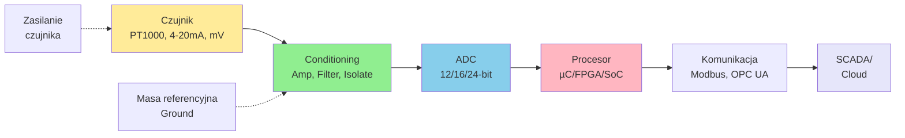
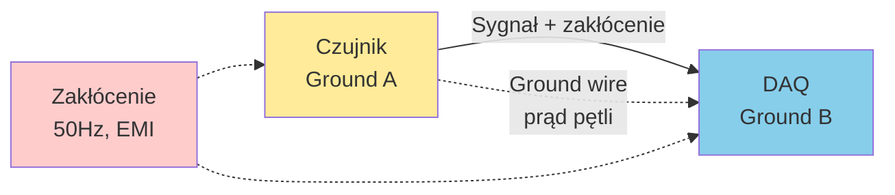

import { 
  SlideContainer, 
  Slide, 
  KeyPoints, 
  SupportingDetails, 
  InstructorNotes,
  VisualSeparator,
  LearningObjective,
  KeyConcept,
  Example
} from '@site/src/components/SlideComponents';
import { InteractiveQuiz } from '@site/src/components/InteractiveQuiz';

<LearningObjective>
Po tej sekcji student potrafi:
- Zaprojektować tor pomiarowy z odpowiednim kondycjonowaniem sygnału (wzmacnianie, filtracja, liniaryzacja)
- Dobrać filtr antyaliasingowy z uwzględnieniem częstotliwości Nyquista
- Zapewnić izolację galwaniczną i ekranowanie w środowisku przemysłowym (EMI/RFI)
- Zidentyfikować typowe problemy w akwizycji danych (ground loops, aliasing, przesłuchy) i zastosować rozwiązania
</LearningObjective>

<SlideContainer>

<Slide title="⚙️ Kondycjonowanie sygnałów – wprowadzenie" type="info">

<KeyPoints title="📋 Co to jest kondycjonowanie sygnału i dlaczego jest kluczowe?">

**Kondycjonowanie sygnału** (signal conditioning) to proces przygotowania surowego sygnału z czujnika do postaci odpowiedniej dla systemu akwizycji danych (DAQ) lub sterownika (PLC/SCADA).

**Główne cele:**

1. **Dopasowanie poziomów** – Czujnik: 0-10 mV, ADC: 0-10 V → potrzeba wzmocnienia ×1000
2. **Filtracja szumów** – Usunięcie zakłóceń EMI/RFI, linii 50/60 Hz, wysokoczęstotliwościowych
3. **Liniaryzacja** – Termopara, NTC mają nieliniową charakterystykę → korekta programowa lub sprzętowa
4. **Izolacja galwaniczna** – Przerwanie ground loops, ochrona sprzętu, bezpieczeństwo operatora
5. **Ochrona przed przepięciami** – Transile voltage suppressors (TVS), ograniczniki, separacja

**Typowy łańcuch akwizycji danych:**



**Problemy bez kondycjonowania:**
- Szumy ±10% sygnału → dane bezużyteczne
- Aliasing (niewłaściwa częstotliwość próbkowania) → fałszywe częstotliwości
- Ground loops (pętle masowe) → przemieszczenie zera o dziesiątki mV
- Przepięcia (pioruny, komutacje) → uszkodzenie ADC/procesora (koszt: setki EUR do tysięcy)

</KeyPoints>

<SupportingDetails title="🔧 Kategorie kondycjonowania">

### 1. **Wzmacnianie (Amplification)**

**Wzmacniacz instrumentacyjny (instrumentation amplifier, in-amp):**
- CMRR (Common Mode Rejection Ratio): &gt;100 dB (odrzuca zakłócenia wspólne)
- Wysoka impedancja wejściowa (&gt;1 GΩ) – nie obciąża czujnika
- Niski szum (&lt;1 µV RMS)
- Typowe wzmocnienia: 1×, 10×, 100×, 1000×

**Przykład:** Tensometr (strain gauge) z sygnałem 0-20 mV → wzmocnienie ×500 → 0-10 V dla ADC

### 2. **Filtracja (Filtering)**

**Filtry dolnoprzepustowe (low-pass, LP):**
- Usuwanie wysokoczęstotliwościowych szumów
- **Antyaliasing** – kluczowe przed ADC (f_cutoff < f_sample/2.5)

**Filtry górnoprzepustowe (high-pass, HP):**
- Usuwanie dryftu DC, offsetu
- Blokowanie składowej stałej (DC blocking)

**Filtry pasmowoprzepustowe (band-pass, BP):**
- Izolacja konkretnego pasma (np. 10-1000 Hz dla wibracji)

**Filtry notch (band-stop):**
- Tłumienie wąskiego pasma (np. 50 Hz – zakłócenia sieciowe)

**Typy implementacji:**
- **Analogowe**: RC pasywne, aktywne (Butterworth, Chebyshev, Bessel)
- **Cyfrowe**: FIR, IIR (po ADC, w procesorze)

### 3. **Liniaryzacja (Linearization)**

**Czujniki nieliniowe:**
- **Termopara** (typu K): U = f(T) nieliniowa → tablica lookup lub wielomian
- **NTC**: R = R₀ exp[β(1/T - 1/T₀)] → Steinhart-Hart equation
- **Flowmeters DP**: Q ∝ √Δp → pierwiastek w oprogramowaniu

**Metody:**
- Hardware: układy log/exp, dzielniki analogowe
- Software: lookup table (LUT), interpolacja, wielomiany

### 4. **Izolacja galwaniczna (Galvanic Isolation)**

**Cel:** Przerwanie połączenia elektrycznego między częścią pomiarową a sterującą

**Technologie:**
- **Transformatory** (magnetic coupling): 1-10 kV izolacji, pasmo DC-MHz (z modulacją)
- **Optocouplers** (optical isolation): LED + fotodioda, 2.5-5 kV, DC-MHz
- **Pojemnościowa** (capacitive): kondensatory jako bariery, wysokie pasmo

**Zastosowania:**
- Przerwanie ground loops
- Ochrona operatora (pomiary wysokiego napięcia)
- Separacja stref ATEX / non-ATEX

### 5. **Ochrona przed przepięciami (Overvoltage Protection)**

**Elementy:**
- **TVS (Transient Voltage Suppressor)**: Diody lawinowe, szybkie (&lt;1 ns)
- **Varistory (MOV)**: Metal Oxide Varistor, dla wyższych energii
- **Gas Discharge Tubes (GDT)**: Dla piorunów (kV), wolniejsze
- **Polyfuses**: Ochrona prądowa (self-resetting fuses)

**Normy:**
- IEC 61000-4-5 (surge immunity): Poziomy 1-4 (0.5 kV - 4 kV)
- IEC 61326 (EMC dla instrumentacji)

</SupportingDetails>

<InstructorNotes>

**Czas**: 14-16 min

**Przebieg**:
1. Wprowadzenie do kondycjonowania – dlaczego potrzebne? (3 min)
2. Diagram łańcucha akwizycji (2 min) – omów każdy blok
3. Przegląd kategorii kondycjonowania (7 min) – amplification, filtering, isolation
4. Dyskusja: Jakie problemy studenci widzieli w laboratoriach? (2 min) – ground loops, aliasing
5. Q&A (2 min)

**Punkty kluczowe**:
- **Kondycjonowanie to NIE opcja** – surowy sygnał z czujnika rzadko nadaje się bezpośrednio do ADC
- CMRR >100 dB w in-amp = redukcja zakłóceń o 100 000× (!)
- Filtr antyaliasing PRZED ADC – po ADC już za późno (aliased frequency nie do odzyskania)
- Izolacja galwaniczna = koszt +50-200 EUR/kanał, ale eliminuje ground loops

**Demonstracja praktyczna**:
- Pokaż oscyloskop: sygnał przed i po filtrowaniu (redukcja szumu 50 Hz)
- In-amp vs. zwykły op-amp – różnica w CMRR (symulacja lub oscyloskop)
- TVS diode (fizyczny element) – jak wygląda, charakterystyka I-V

**Materiały pomocnicze**:
- Analog Devices: "A Designer's Guide to Instrumentation Amplifiers" (free PDF)
- TI: "Anti-Aliasing Filters" application note
- Datasheets: AD620 (in-amp), INA128, ISO124 (isolation amplifier)

**Typowe błędy studenckie**:
- Myślenie, że filtr cyfrowy (software) zastąpi antyaliasing – NIE! Aliasing się już stał, software nie cofnie
- Ignorowanie ground loops ("przecież wszystko jest uziemione") – problem pojawia się, gdy masa nie jest wspólna
- Stosowanie zwykłego op-ampa zamiast in-ampa → niski CMRR → zakłócenia

**Pytania studenckie**:
- Q: Czemu wzmacniacz instrumentacyjny ma 3 rezystory (differential amp ma 4)?
- A: In-amp to specjalna topologia (2× wzmacniacze buforujące + diff amp). Single-resistor gain setting = łatwiejsza kalibracja, matched resistors internal → wysoki CMRR.

- Q: Czy można użyć filtru RC zamiast Butterworth?
- A: TAK, RC (1st order) to najprostszy LP filtr. Ale: -20 dB/decade roll-off (powolne). Butterworth (4th order) = -80 dB/decade → ostrzejsze odcięcie, lepszy antyaliasing.

</InstructorNotes>

</Slide>

<VisualSeparator type="technical" />

<Slide title="📡 Filtracja antyaliasingowa – kluczowa przed ADC" type="tip">

<KeyConcept title="Twierdzenie o próbkowaniu (Nyquist-Shannon)">

**Aby prawidłowo zrekonstruować sygnał o maksymalnej częstotliwości f_max, częstotliwość próbkowania musi wynosić:**

\[
f_{sample} \geq 2 \times f_{max} \quad \text{(Nyquist rate)}
\]

**W praktyce: f_sample ≥ 2.5-5 × f_max** (zapas na nieperfektne filtry)

**Co się dzieje jeśli f_sample < 2 × f_max?**

**Aliasing** – wysokie częstotliwości "zawijają się" (fold back) i pojawiają jako fałszywe niskie częstotliwości.

**Przykład aliasing:**
- Sygnał rzeczywisty: f_signal = 900 Hz
- Częstotliwość próbkowania: f_sample = 1000 Hz (za niska!)
- Częstotliwość alias: f_alias = |f_signal - f_sample| = |900 - 1000| = **100 Hz**

ADC "widzi" sygnał 100 Hz zamiast 900 Hz → **niemożliwe do odzyskania po próbkowaniu!**

**Rozwiązanie: Filtr antyaliasing (analogowy LP przed ADC)**

\[
f_{cutoff} = \frac{f_{sample}}{2.5} \quad \text{do} \quad \frac{f_{sample}}{5}
\]

**Przykład (monitoring wibracji):**
- Interesujące pasmo: 10 Hz - 5 kHz (BPFO, mesh freq)
- f_sample wybrane: 15 kHz (3× zapas)
- Filtr LP cutoff: f_c = 15000 / 2.5 = **6 kHz** (Butterworth 4th order, -24 dB/octave)

**Dlaczego nie można użyć filtru cyfrowego?**

Filtr cyfrowy działa PO ADC → jeśli aliasing już wystąpił, nie można go cofnąć. Analogowy filtr PRZED ADC zapobiega dostaniu się wysokich częstotliwości do ADC.

</KeyConcept>

<SupportingDetails title="🎛️ Projektowanie filtru antyaliasing">

### Filtr Butterworth 4th order (aktywny, Sallen-Key topology):

**Charakterystyka:**
- Płaska charakterystyka w paśmie przepustowym (maximally flat)
- Roll-off: -80 dB/decade (-24 dB/octave)
- Brak tętnień (ripple) w pasmie

**Schemat (uproszczony, single stage = 2nd order):**

```
     R1        R2
Vin --/\/\/\--+--/\/\/\--+-- Vout
              |          |
             C1         C2
              |          |
             GND    Op-Amp (+)
                         |
                    Feedback
```

**Kaskada 2× 2nd order = 4th order**

**Dobór elementów (dla f_c = 6 kHz):**

Wzór: \( f_c = \frac{1}{2\pi \sqrt{R_1 R_2 C_1 C_2}} \)

Standardowe wartości (dla equal-component Sallen-Key):
- R1 = R2 = 2.7 kΩ
- C1 = C2 = 10 nF
- f_c = 1 / (2π × 2700 × 10×10⁻⁹) ≈ **5.9 kHz** ✅

**Op-amp requirements:**
- Bandwidth (GBW): >10× f_c = 60 kHz (typowy op-amp: 1-10 MHz → OK)
- Slew rate: >1 V/µs
- Low noise: <10 nV/√Hz
- Przykład: TL072, OPA2134, AD8610

### Weryfikacja filtru (測試):

**Frequency response (odpowiedź częstotliwościowa):**
- Pomiar: Network analyzer lub generator funkcyjny + oscyloskop
- Sprawdź: 
  - @ f_c: attenuation = -3 dB (50% mocy)
  - @ 2×f_c: attenuation = -24 dB (Butterworth 4th order)
  - @ 10×f_c: attenuation = -80 dB

**Test aliasing:**
1. Podaj sygnał f = 15 kHz (= f_sample)
2. Bez filtru: ADC widzi alias @ 0 Hz (DC)
3. Z filtrem: ADC widzi <0.001× amplitudy (-60 dB) → neglectable

</SupportingDetails>

<Example title="Problem i rozwiązanie: Monitoring wibracji bez antyaliasing">

**Kontekst: Turbina wiatrowa, monitoring wibracji main bearing**

### Konfiguracja błędna (bez filtru antyaliasing):

- Czujnik: Akcelerometr IEPE, pasmo DC-10 kHz
- ADC: 24-bit, f_sample = 5 kHz
- **BRAK filtru LP przed ADC**

### Objaw problemu:

- Analiza FFT pokazuje **dziwne peaki**:
  - 200 Hz (spodziewany: BPFO main bearing) ✅
  - **300 Hz** (niespodziewany, silny peak)
  - **700 Hz** (niespodziewany, średni peak)

### Diagnoza:

Inżynier podejrzewa aliasing. Test:
- Zmiana f_sample z 5 kHz → 10 kHz
- Peak 300 Hz **zniknął**!
- Peak 700 Hz **przesunął się** do 1.2 kHz

**Wniosek:**
- 300 Hz to alias od **4.7 kHz** (EMI z inwertera PWM): |4700 - 5000| = 300 Hz
- 700 Hz to alias od **5.7 kHz** (bearing high-frequency): |5700 - 5000| = 700 Hz

### Rozwiązanie:

**Instalacja filtru LP Butterworth 4th order, f_c = 2 kHz (< f_sample/2.5)**

Po instalacji:
- Peak 300 Hz (alias) **zniknął** (4.7 kHz zafiltrowane -80 dB)
- Peak 700 Hz (alias) **zniknął**
- Pozostał tylko **200 Hz (BPFO)** + harmoniczne 400, 600 Hz

**Koszty:**
- Filtr (PCB + komponenty): ~30 EUR/kanał
- Czas instalacji: 2h
- **Benefit**: Wiarygodne dane, uniknięto false alarm (koszt interwencji serwisowej: ~5000 EUR)

**Lekcja:** Antyaliasing to MUST, nie "nice to have". Koszt filtru << koszt błędnej diagnozy.

</Example>

<InstructorNotes>

**Czas**: 16-18 min (to kluczowa sekcja techniczna!)

**Przebieg**:
1. Twierdzenie Nyquista i aliasing (4 min) – wyjaśnij na przykładzie liczbowym
2. Projektowanie filtru Butterworth (5 min) – omów schemat i dobór elementów
3. Case study: aliasing w monitoringu wibracji (5 min) – real-world problem
4. Dyskusja: Czy studenci widzieli aliasing w laboratoriach? (2 min)
5. Q&A (2 min)

**Punkty kluczowe**:
- **Nyquist to PRAWO, nie sugestia** – łamanie prowadzi do aliasing
- Filtr cyfrowy NIE ZASTĄPI antyaliasing – musi być analogowy, przed ADC
- Butterworth 4th order to dobry kompromis (flat passband, sharp roll-off)
- f_cutoff = f_sample / 2.5-5 (zapas na nieperfektny filtr)

**Demonstracja praktyczna**:
- Symulacja aliasing: generator 900 Hz + sampling 1 kHz → pokazuje 100 Hz na oscyloskopie
- Bode plot filtru Butterworth (software: LTspice, Matlab, online calculator)
- Comparison: 2nd order (-40 dB/dec) vs. 4th order (-80 dB/dec) – widać różnicę

**Materiały pomocnicze**:
- TI: "Understanding Anti-Aliasing Filters" (application note)
- Analog Filter Wizard (online tool: analog.com)
- Example: FFT before/after anti-aliasing filter (spectrum plot)

**Typowe błędy studenckie**:
- Myślenie, że f_sample = 2× f_max wystarczy – NO! Potrzeba 2.5-5× zapas (real-world filters aren't perfect)
- Stosowanie 1st order RC (20 dB/dec) jako antyaliasing → za wolny roll-off, potrzeba min. 4th order
- Ignorowanie GBW op-ampa – jeśli GBW < 10× f_c, filtr nie działa jak Butterworth (gain peaking)

**Pytania studenckie**:
- Q: Czy można użyć filtru cyfrowego (IIR/FIR) zamiast analogowego?
- A: NIE przed ADC! Cyfrowy działa po sampling → aliasing już się stał. Cyfrowy MOŻE być dodatkowy (po ADC) dla dalszej filtracji.

- Q: Dlaczego Butterworth, a nie Chebyshev (ostrzejszy roll-off)?
- A: Chebyshev ma ripple w passband (±1-3 dB) → zniekształca sygnał. Butterworth = maximally flat. Dla antyaliasing: flat passband > steep roll-off (można zwiększyć order).

</InstructorNotes>

</Slide>

<VisualSeparator type="default" />

<Slide title="🔌 Ground loops i izolacja galwaniczna" type="success">

<KeyConcept title="Co to jest ground loop i dlaczego jest problemem?">

**Ground loop (pętla masowa)** powstaje, gdy dwa urządzenia mają różne potencjały "masy" (ground), ale są połączone przewodem sygnałowym.

**Mechanizm:**



**Różnica potencjałów:**
- Ground A: 0.0 V (lokalny)
- Ground B: 0.05 V (lokalny, ale inne miejsce!)
- **Różnica V_AB = 50 mV** – wpływa na linie 50 Hz, prądy ziemnozwarciowe

**Efekt na sygnał:**
- Sygnał nominalny: 10 mV (z tensometru)
- Zakłócenie z ground loop: 50 mV (50 Hz + harmoniczne)
- **SNR (signal-to-noise ratio): -14 dB** → dane bezużyteczne

**Typowe źródła różnic potencjałów:**
- Prądy zwarciowe w instalacji elektrycznej
- Długie przewody (10-100 m) – rezystancja × prąd = V_drop
- Różne punkty uziemienia
- EMI indukowane w pętli ground

</KeyConcept>

<SupportingDetails title="🛡️ Rozwiązania ground loops">

### Metoda 1: **Single-Point Grounding (Star Ground)**

**Zasada:** Wszystkie urządzenia łączymy do JEDNEGO punktu ground (star point)

```
        Ground Star Point
               |
       ________|________
      |        |        |
   Device1  Device2  Device3
```

**Zalety:** Eliminuje pętle (brak zamkniętego obwodu)  
**Wady:** Trudne w dużych instalacjach (setki metrów przewodów)

### Metoda 2: **Izolacja galwaniczna**

**Zasada:** Przerwanie połączenia elektrycznego między czujnikiem a DAQ

**Technologie:**
- **Transformatory** (modulated signal through magnetic coupling)
- **Optocouplers** (LED → fotodioda, zero electrical connection)
- **Capacitive isolation** (signal through capacitors)

**Przykład:** ISO124 (isolation amplifier, Burr-Brown/TI)
- Izolacja: 1500 V RMS continuous
- Pasmo: DC-60 kHz
- Gain: 1×, 10×, 100×
- **Koszt: ~10-15 EUR/szt.**

**Rezultat:** Ground A i Ground B są **elektrycznie oddzielone** → brak prądu pętli → brak zakłócenia

### Metoda 3: **Differential Signaling (4-20 mA Loop)**

**Zasada:** Przekaz sygnału jako prąd (nie napięcie) w pętli różnicowej

- Nadajnik (czujnik): konwersja 0-100°C → 4-20 mA
- Odbiornik (PLC): pomiar prądu przez rezystor (250 Ω): 4-20 mA → 1-5 V

**Dlaczego działa?**
- Prąd jest taki sam w całej pętli (prawo Kirchhoffa)
- Zakłócenia napięciowe (EMI, ground loops) **nie wpływają na prąd**
- Długość przewodu: do 1000 m bez degradacji sygnału

**Standard przemysłowy:** Czujniki 4-20 mA to workhorse w SCADA (90% instalacji)

### Metoda 4: **Ekranowanie (Shielding)**

**Zasada:** Przewód ekranowany (shielded cable) – metalowy oplot wokół żył sygnałowych

**Topologie:**
- **Ekran uziemiony jednostronnie** (sensor end): Dla f <1 MHz, długość <100 m
- **Ekran uziemiony obustronnie** (both ends): Dla f >1 MHz (high-frequency EMI)
- **Ekran floating** (nie podłączony): NIE STOSOWAĆ (shield działa jak antena!)

**Zasada:** Ekran przechwytuje EMI i odprowadza do ground → sygnał wewnątrz chronionym

### Metoda 5: **Twisted Pair (skrętka)**

**Zasada:** Dwie żyły skręcone spiralnie → EMI indukuje równe napięcia w obu (common-mode)

- Differential receiver (np. in-amp) odrzuca common-mode (CMRR >100 dB)
- **Rezultat:** EMI eliminowane, tylko różnicowy sygnał pozostaje

**Standard:** RS-485 (Modbus RTU), CAN bus, Ethernet – wszystkie używają twisted pair

</SupportingDetails>

<Example title="Case study: Ground loop w biogazowni – diagnoza i rozwiązanie">

**Kontekst: Biogazownia 1 MW, system SCADA**

### Problem zgłoszony (styczeń 2023):

- Pomiar temperatury fermenteru (PT1000, 0-100°C) pokazuje **dziwne oscylacje ±2°C @ 50 Hz**
- Temperatura rzeczywista: stabilna 40°C (weryfikacja ręcznym termometrem)
- **Alarm przeciążenia** fałszywie triggeruje (T > 42°C threshold)

### Diagnoza (przez inżyniera automation):

**Krok 1: Pomiar oscyloskopem**
- Sygnał PT1000 (linia A-B): 2-wire, 0-10 V (po konwersji R→V)
- Oscyloskop pokazuje: **50 Hz hum, amplituda ±500 mV** (!)

**Krok 2: Sprawdzenie ground**
- Ground @ czujnik PT1000 (fermenter): 0.00 V (lokalny)
- Ground @ PLC (control room, 50 m dalej): **0.08 V** (50 Hz, 80 mV RMS)
- **Źródło:** Prąd zwarciowy w instalacji elektrycznej (pobliski silnik 15 kW)

**Krok 3: Identyfikacja ground loop**
- PT1000 ma wspólną masę z konstrukcją fermenteru (ground A)
- PLC ma masę podłączoną do rozdzielnicy elektrycznej (ground B)
- Przewód sygnałowy 2-wire (signal + ground) → **ground loop!**

```
Fermenter (Ground A) --[PT1000 signal]-- PLC (Ground B)
        |                                        |
        +----[Ground wire with 80mV @ 50Hz]-----+
```

### Rozwiązanie zastosowane:

**Opcja wybrana: Izolacja galwaniczna (isolation amplifier)**

- Zainstalowano: Phoenix Contact MCR-SL-PT100-UI-NC (DIN rail isolation transmitter)
- Specyfikacja:
  - Input: PT100/PT1000, 2/3/4-wire
  - Output: 4-20 mA (isolated)
  - Isolation: 2.5 kV
  - **Koszt: 180 EUR**

**Rezultat:**
- Oscylacje 50 Hz **zniknęły** (poniżej ±0.1°C)
- Ground loop przerwany (PT1000 side vs. PLC side elektrycznie oddzielone)
- Brak false alarms
- **Czas instalacji: 1h** (wymiana w DIN rail)

### Alternatywne rozwiązania (rozważane, ale niewyбrane):

1. **4-wire PT1000 z differential input:**
   - Koszt: ~80 EUR (PLC input card)
   - Problem: Ground loop wciąż istnieje (tylko common-mode rejection)

2. **Star grounding (przeprowadzenie dedykowanego ground):**
   - Koszt: ~500 EUR (50 m przewodu Cu 6 mm², praca)
   - Problem: Interwencja w instalacji elektrycznej (shutdown wymagany)

3. **Wireless transmitter:**
   - Koszt: ~300 EUR
   - Problem: Baterie (wymiana co 2-3 lata), niezawodność w ATEX

**Wnioski:**
- Izolacja galwaniczna to **najszybsze i najbardziej niezawodne** rozwiązanie
- Koszt 180 EUR << koszt false alarms (interwencje serwisowe niepotrzebne: ~500 EUR każda)
- **ROI: <1 miesiąc**

</Example>

<InstructorNotes>

**Czas**: 16-18 min

**Przebieg**:
1. Wyjaśnienie ground loops – mechanizm (4 min) – użyj diagramu
2. Przegląd rozwiązań (6 min) – star ground, isolation, 4-20 mA, shielding
3. Case study biogazowni (5 min) – real-world diagnosis and solution
4. Dyskusja: Czy studenci widzieli 50 Hz hum w laboratoriach? (2 min)
5. Q&A (2 min)

**Punkty kluczowe**:
- **Ground loop to najczęstszy problem w akwizycji przemysłowej** – każdy inżynier to spotka
- Różnica potencjałów 50-100 mV to NORMA w instalacjach elektrycznych (prądy zwarciowe)
- Izolacja galwaniczna (isolation amplifier) = 100-200 EUR, ale eliminuje problem raz na zawsze
- 4-20 mA loop to standard przemysłowy (SCADA) – immune do ground loops i EMI

**Demonstracja praktyczna**:
- Oscyloskop: pokazuje 50 Hz hum w sygnale z ground loop (live lub recording)
- Isolation amplifier (fizyczny moduł) – jak wygląda (DIN rail, Phoenix Contact, Weidmüller)
- Shielded cable vs. unshielded – przekrój poprzeczny (pokaż oplot ekranujący)

**Materiały pomocnicze**:
- Analog Devices: "Grounding and Shielding" (application note MT-031)
- Phoenix Contact: "Isolation technology" catalog (free PDF)
- IEC 61000-5 series – Grounding and earthing (installation guidelines)

**Typowe błędy studenckie**:
- Myślenie, że "wszystko uziemione" = brak ground loops – NO! Problem to RÓŻNE potencjały ground
- Stosowanie ekranowania jednostronnie + shield floating (nie podłączony) – shield musi być uziemiony!
- Uziemianie ekranu po obu stronach w DC/low-freq → może tworzyć pętlę (ale dla >1 MHz jest OK)

**Pytania studenckie**:
- Q: Dlaczego 4-20 mA, a nie 0-20 mA?
- A: 4 mA to "live zero" – jeśli przewód się zerwie, odbiornik widzi 0 mA (nie 4 mA) → alarm "sensor fault". Z 0-20 mA: przewód zerwany = 0 mA = sygnał nominalny (fałsz!).

- Q: Czy można użyć wireless (WiFi, Bluetooth) zamiast przewodów?
- A: TAK, ale: (1) baterie (wymiana, niezawodność), (2) ATEX (wireless w strefie 0/1 = special certification), (3) latency, (4) interference. W critical applications: przewodowe > wireless.

</InstructorNotes>

</Slide>

<VisualSeparator type="default" />

<Slide title="📝 Quiz: Kondycjonowanie sygnałów" type="info">

<InteractiveQuiz 
  questions={[
    {
      question: "Akcelerometr generuje sygnał 0-50 mV, ADC wymaga 0-5 V. Jakie wzmocnienie należy zastosować w wzmacniaczu instrumentacyjnym?",
      options: [
        "10× (0.5 V)",
        "50× (2.5 V)",
        "100× (5 V)",
        "1000× (50 V, za dużo)"
      ],
      correctAnswer: 2,
      explanation: "Wzmocnienie = V_out / V_in = 5 V / 0.05 V = 100×. Opcja (d) błędna: 50 mV × 1000 = 50 V (saturacja ADC i op-amp!). Zawsze dopasuj wzmocnienie do zakresu ADC."
    },
    {
      question: "System akwizycji wibracji ma f_sample = 10 kHz. Jaka powinna być częstotliwość cut-off filtru antyaliasing (Butterworth 4th order)?",
      options: [
        "5 kHz (f_sample / 2, Nyquist)",
        "4 kHz (f_sample / 2.5, zapas)",
        "2 kHz (f_sample / 5, duży zapas)",
        "Nie potrzeba filtru, 10 kHz wystarczy"
      ],
      correctAnswer: 1,
      explanation: "f_cutoff = f_sample / 2.5 = 10000 / 2.5 = 4 kHz. Opcja (a) to teoretyczny Nyquist, ale real-world filtry nie są idealne (slope skończony). Opcja (c) to overkill (za dużo sygnału zafiltrowane). Opcja (d) BŁĄD – bez antyaliasing będzie aliasing!"
    },
    {
      question: "Sygnał 4.5 kHz próbkowany z f_sample = 5 kHz (BRAK filtru antyaliasing). Jaka częstotliwość pojawi się w ADC (alias)?",
      options: [
        "4.5 kHz (bez zmian)",
        "500 Hz (|4500 - 5000|)",
        "9.5 kHz (4500 + 5000)",
        "0.5 kHz (4500 / 5000)"
      ],
      correctAnswer: 1,
      explanation: "Aliasing: f_alias = |f_signal - n × f_sample|. Dla n=1: |4500 - 5000| = 500 Hz. Sygnał 4.5 kHz 'zawija się' i pojawia jako 500 Hz w ADC. Opcja (c) to suma (nie dzieje się). Opcja (d) to dzielenie (niepoprawne)."
    },
    {
      question: "Ground loop powoduje zakłócenie 50 Hz w sygnale 10 mV z tensometru. Co jest NAJLEPSZYM rozwiązaniem?",
      options: [
        "Zwiększenie wzmocnienia (amplify signal and noise together)",
        "Filtr notch 50 Hz (tłumi zakłócenie, ale też może sygnał)",
        "Izolacja galwaniczna (isolation amplifier, przerywa pętlę)",
        "Skrócenie przewodu sygnałowego (zmniejsza rezystancję)"
      ],
      correctAnswer: 2,
      explanation: "Izolacja galwaniczna to root cause fix – przerywa ground loop elektryczne. Opcja (a) wzmacnia też szum (SNR bez zmiany!). Opcja (b) działa, ale jeśli sygnał ma składowe @ 50 Hz – zostanie zafiltrowany. Opcja (d) pomaga trochę, ale nie eliminuje różnicy potencjałów ground."
    },
    {
      question: "Dlaczego w przemyśle stosuje się 4-20 mA zamiast 0-10 V do transmisji sygnałów?",
      options: [
        "4-20 mA jest tańsze (mniejsze komponenty)",
        "4-20 mA jest immune do zakłóceń EMI i ground loops (prąd stały w pętli)",
        "4-20 mA ma większą dokładność (±0.01%)",
        "4-20 mA nie wymaga zasilania czujnika"
      ],
      correctAnswer: 1,
      explanation: "Prąd w pętli jest taki sam niezależnie od spadków napięcia (EMI, ground loops). 4 mA to 'live zero' (zerwany przewód = 0 mA = alarm). 0-10 V wrażliwe na zakłócenia napięciowe. Opcja (c) nieprawda (dokładność zależy od DAC/ADC). Opcja (d) nieprawda (4-20 mA wymaga power supply, np. 24 V)."
    }
  ]}
/>

:::tip Rekomendacja po quizie
Jeśli uzyskałeś <80% poprawnych odpowiedzi, przejrzyj sekcje o twierdzeniu Nyquista (aliasing), ground loops i różnicy między 4-20 mA vs. 0-10 V. Zrozumienie kondycjonowania sygnałów jest fundamentem wiarygodnego monitoringu w środowisku przemysłowym.
:::

</Slide>

</SlideContainer>

---

## Podsumowanie i wnioski

**Kluczowe punkty z tej sekcji:**

1. **Kondycjonowanie sygnału to NIE opcja** – surowy sygnał z czujnika rzadko nadaje się bezpośrednio do ADC. Wymaga: wzmacniania, filtracji, liniaryzacji, izolacji.

2. **Filtr antyaliasing (analogowy LP przed ADC) jest OBOWIĄZKOWY** – po sampling aliased frequency nie jest do odzyskania. f_cutoff = f_sample / 2.5-5, Butterworth 4th order to dobry wybór.

3. **Ground loops to najczęstszy problem w przemyśle** – różnice potencjałów ground (50-100 mV @ 50 Hz) indukują zakłócenia. Rozwiązania:
   - Izolacja galwaniczna (isolation amplifier): 100-200 EUR, eliminuje problem
   - 4-20 mA loops: standard SCADA, immune do EMI/ground loops
   - Ekranowanie + twisted pair: redukcja, ale nie eliminacja

4. **Wzmacniacz instrumentacyjny (in-amp) > zwykły op-amp** – CMRR >100 dB eliminuje zakłócenia common-mode. Koszt: 2-10 EUR/szt. (AD620, INA128).

5. **Topologie 4-wire dla czujników rezystancyjnych** (PT100/1000) – kompensacja rezystancji przewodów, kluczowe dla długich dystansów (>10 m).

6. **Ochrona przed przepięciami** (TVS, varistory) – koszt 1-5 EUR, ale ratuje sprzęt za setki/tysiące EUR (ADC, procesory).

**Typowe błędy do unikania:**
- Brak filtru antyaliasing → aliasing → fałszywe częstotliwości
- Ignorowanie ground loops → zakłócenia 50 Hz → dane bezużyteczne
- Stosowanie zwykłego op-ampa zamiast in-amp → niski CMRR → wrażliwość na EMI
- Ekran floating (nie podłączony) → shield działa jak antena

**Następne kroki:**
- Ćwiczenie 6: Projekt toru pomiarowego (czujnik → conditioning → ADC → µC) z symulacją w LTspice/Matlab
- Lab hands-on: Budowa filtru antyaliasing, test z generatorem i oscyloskopem
- Przygotowanie do egzaminu: Powtórka całego wykładu 02 (czujniki + akwizycja)

---

**Dodatkowe zasoby:**
- **Analog Devices**: "A Designer's Guide to Instrumentation Amplifiers" (MT-070)
- **TI**: "Understanding Data Converters" (SLAA013)
- **Ott, Henry**: "Electromagnetic Compatibility Engineering" (książka, biblia EMC)
- **IEC 61326** – EMC requirements for electrical equipment for measurement
- **Grounding and Shielding** (Ralph Morrison) – klasyk, praktyczne podejście
