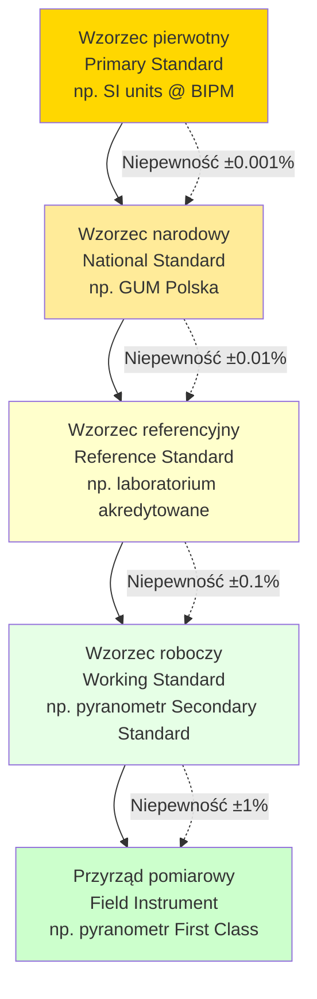
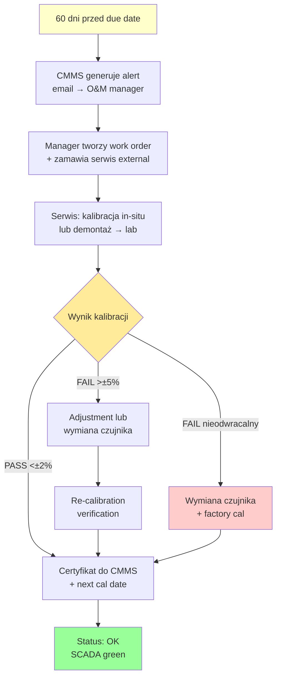

import { 
  SlideContainer, 
  Slide, 
  KeyPoints, 
  SupportingDetails, 
  InstructorNotes,
  VisualSeparator,
  LearningObjective,
  KeyConcept,
  Example
} from '@site/src/components/SlideComponents';
import { InteractiveQuiz } from '@site/src/components/InteractiveQuiz';

<LearningObjective>
Po tej sekcji student potrafi:
- Zdefiniować ślad metrologiczny (traceability) i wyjaśnić jego znaczenie dla wiarygodności pomiarów
- Zaplanować procedury kalibracji czujników z uwzględnieniem interwałów i warunków pracy
- Obliczyć niepewność pomiarową (measurement uncertainty) według zasad GUM
- Zorganizować system zarządzania kalibracjami (rejestr certyfikatów, historia, audyty)
</LearningObjective>

<SlideContainer>

<Slide title="📏 Kalibracja i metrologia – podstawowe pojęcia" type="info">

<KeyPoints title="📋 Definicje kluczowych terminów">

**Kalibracja (calibration)**  
Operacja ustalająca **relację między wskazaniem przyrządu pomiarowego a wartością wzorcową** w określonych warunkach. Kalibracja NIE zmienia przyrządu (to jest adjustment/justowanie).

**Przykład:**  
Pyranometr pokazuje 980 W/m² gdy wzorzec referencyjny (Secondary Standard) wskazuje 1000 W/m² → **błąd -2%**. To informacja z kalibracji. Jeśli korygujemy (adjustment), aby pokazywał 1000 W/m² → to już justowanie.

---

**Ślad metrologiczny (metrological traceability)**  
Własność wyniku pomiaru polegająca na tym, że wynik można powiązać z **odniesieniem** (wzorcem) przez **nieprzerwaną i udokumentowaną sekwencję kalibracji**, z których każda wnosi wkład do niepewności.

**Łańcuch wzorcowania:**

**Dlaczego traceability jest kluczowy?**
- **Porównywalność pomiarów** między różnymi lokalizacjami/laboratoriami
- **Zgodność z normami** (ISO 9001, ISO/IEC 17025, ISO 50001 dla energetyki)
- **Wymogi prawne** (gwarancje PR w PV, rozliczenia energii, ATEX)
- **Wiarygodność danych** dla inwestorów, audytorów, organów regulacyjnych

---

**Niepewność pomiarowa (measurement uncertainty)**  
Parametr związany z wynikiem pomiaru, charakteryzujący **rozrzut wartości**, które można w uzasadniony sposób przypisać wielkości mierzonej.

**Wyrażana jako:**
- **Niepewność standardowa** u: odchylenie standardowe (1σ)
- **Niepewność rozszerzona** U: u × k (coverage factor, typowo k=2 dla 95% confidence level)

**Przykład:**  
Temperatura T = 40.0 °C ± 0.3 °C (U, k=2)  
Oznacza: z 95% prawdopodobieństwem prawdziwa wartość T ∈ [39.7, 40.3] °C

</KeyPoints>

<SupportingDetails title="🎯 Rodzaje kalibracji">

### 1. **Kalibracja fabryczna (factory calibration)**
- Wykonywana przez producenta przed wysyłką
- Certyfikat zawiera: stałą kalibracji, niepewność, warunki
- **Ważność**: Do pierwszego użycia lub max. 12-24 miesiące od daty wystawienia

### 2. **Kalibracja akredytowana (accredited calibration)**
- Przez laboratorium z akredytacją (np. PCA – Polskie Centrum Akredytacji)
- Zgodna z ISO/IEC 17025
- **Traceability do wzorców narodowych/międzynarodowych**
- Certyfikat zawiera: pełną analizę niepewności, logo akredytacji
- **Koszt**: 300-1500 EUR (zależnie od typu czujnika)

### 3. **Kalibracja in-situ (field calibration)**
- W miejscu instalacji, bez demontażu
- Porównanie z przenośnym wzorcem referencyjnym
- **Szybka** (1-2h), **tańsza** niż akredytowana
- Stosowana do weryfikacji między kalibracjami akredytowanymi

### 4. **Bump test (functional test)**
- Szybki test funkcjonalności (czy czujnik reaguje?)
- Gaz wzorcowy / sygnał testowy
- **NIE zastępuje kalibracji**, tylko weryfikacja sprawności
- Typowo: co 1-3 miesiące dla czujników gazowych

</SupportingDetails>

<InstructorNotes>

**Czas**: 14-16 min

**Przebieg**:
1. Definicje: kalibracja, traceability, niepewność (5 min)
2. Diagram łańcucha wzorcowania (3 min) – omów każdy poziom
3. Rodzaje kalibracji (4 min) – podkreśl różnice między akredytowaną a in-situ
4. Dyskusja: Czy studenci widzieli certyfikaty kalibracji? (2 min)
5. Q&A (2 min)

**Punkty kluczowe**:
- **Kalibracja ≠ justowanie** – częste mylenie tych pojęć
- Traceability to łańcuch (nie wystarczy 1 poziom), każdy dodaje niepewność
- Niepewność rozszerzona U (k=2) to standard w certyfikatach
- Akredytacja (ISO/IEC 17025) = złoty standard dla critical measurements

**Demonstracja praktyczna**:
- Pokaż przykładowy certyfikat kalibracji (pyranometr, czujnik ciśnienia)
- Omów sekcje certyfikatu: traceability statement, uncertainty budget, conditions
- Przykład obliczenia niepewności złożonej (root sum of squares)

**Materiały pomocnicze**:
- JCGM 100:2008 (GUM) – Guide to the Expression of Uncertainty in Measurement (free PDF)
- ISO/IEC 17025:2017 – General requirements for competence of testing and calibration laboratories
- EA-4/02 – Evaluation of the Uncertainty of Measurement in Calibration (European Accreditation)

**Typowe błędy studenckie**:
- Myślenie, że kalibracja "naprawia" czujnik – NO! Tylko dokumentuje błąd
- Ignorowanie niepewności ("wynik to 40°C, koniec") – zawsze podawać ±U!
- Stosowanie nieważnych certyfikatów (expired > 2-5 lat temu)

**Pytania studenckie**:
- Q: Czy można samemu skalibrować czujnik (bez laboratorium)?
- A: Można zrobić adjustment (justowanie), ale BEZ traceability i certyfikatu akredytowanego. OK dla wewnętrznych celów, NIE dla audytów/rozliczeń.

- Q: Co to znaczy "k=2" w niepewności rozszerzonej?
- A: Coverage factor. k=2 → 95% confidence level (±2σ). k=3 → 99.7%. Standard w przemyśle: k=2.

</InstructorNotes>

</Slide>

<VisualSeparator type="technical" />

<Slide title="🔬 Procedury kalibracji dla różnych typów czujników" type="tip">

<KeyPoints title="📋 Kalibracja czujników w systemach OZE">

### **1. Pyranometry (irradiancja)**

**Metoda: Outdoor comparison**
- Montaż pyranometru testowanego obok wzorca referencyjnego (Secondary Standard)
- Pomiar równoległy w warunkach słonecznych (clear sky, zmienne G)
- Minimum 3 dni pomiarów (różne warunki: rano, południe, wieczór)
- Agregacja danych: 1-min mean

**Procedura:**
1. Czyszczenie kopuł obu pyranometrów (woda destylowana)
2. Sprawdzenie poziomu (libella) – nachylenie &lt;0.5°
3. Synchronizacja dataloggerów (UTC time, f_sample = 1 Hz)
4. Pomiar ciągły: 08:00-16:00, 3 dni
5. Analiza: scatter plot, linear regression, obliczenie sensitivity ratio

**Kryterium akceptacji:**
- Sensitivity ratio: 0.98-1.02 (±2%) dla First Class
- Korelacja R² > 0.999

**Interwał:** Co 2 lata (First Class), co 5 lat (Secondary Standard)

**Koszt:** 300-600 EUR (porównanie) lub 800-1500 EUR (akredytowane w laboratorium)

---

### **2. Akcelerometry (wibracje)**

**Metoda: Vibration exciter (ISO 16063-21)**
- Montaż akcelerometru na wibratorze kalibracyjnym
- Wzbudzenie sinusoidalne o znanej amplitudzie i częstotliwości
- Pomiar przy różnych częstotliwościach: 10 Hz, 100 Hz, 1 kHz, 5 kHz
- Porównanie z czujnikiem referencyjnym (laser interferometer lub akcelerometr wzorcowy)

**Procedura:**
1. Montaż stud (moment dokręcenia wg specyfikacji, typowo 1-2 Nm)
2. Testy przy: 10 Hz / 1 g, 100 Hz / 1 g, 1 kHz / 10 g, 5 kHz / 10 g
3. Sprawdzenie nieliniowości, poprzecznej czułości (transverse sensitivity)
4. Pomiar przy różnych temperaturach: -20°C, 20°C, 60°C (opcjonalnie)

**Kryterium akceptacji:**
- Czułość (sensitivity): ±5% wartości nominalnej (100 mV/g ±5 mV/g)
- Poprzeczna czułość: &lt;5%
- Nieliniowość: &lt;1%

**Interwał:** Co 2-3 lata (przemysłowe), rocznie (critical monitoring)

**Koszt:** 200-500 EUR (basic) lub 800-1500 EUR (full calibration z temp sweep)

---

### **3. Czujniki gazowe (H₂S, CH₄, O₂)**

**Metoda: Certyfikowane gazy wzorcowe**

**A) Bump test (co 1-3 miesiące):**
- Gaz testowy: np. 50 ppm H₂S w N₂ balance
- Adapter flow cap na czujnik, przepływ 0.5 L/min, czas 60 s
- **Akceptacja**: Odczyt 45-55 ppm (±10%), czas reakcji &lt;30 s, return to zero &lt;60 s
- **FAIL**: Wymiana czujnika

**B) Full calibration (co 12 miesięcy):**
1. **Zero calibration**: Czysty N₂ → adjust offset do 0 ppm
2. **Span calibration**: 50 ppm H₂S → adjust gain
3. **Verification**: Gaz pośredni 25 ppm → sprawdź linearność (25 ±3 ppm)
4. **Dokumentacja**: Data, nr butli, wyniki, next cal due date

**Kryterium akceptacji:**
- Odchylenie zera: &lt;5 ppm
- Odchylenie span: &lt;±5% (50 ppm: 47.5-52.5 ppm)
- Linearność w mid-range: &lt;±10%

**Interwał:** 
- Bump test: co 1-3 miesiące
- Full cal: co 12 miesięcy
- **Wymiana czujnika**: H₂S co 1-3 lata (degradacja elektrolitu)

**Koszt:** 
- Gaz wzorcowy (butla 10L): 150-300 EUR (wystarcza na ~50 kalibracji)
- Serwis zewnętrzny: 100-200 EUR/czujnik

---

### **4. Przetworniki ciśnienia**

**Metoda: Dead weight tester lub pressure calibrator**
- Wzorzec ciśnienia (0.01-0.05% FS accuracy)
- Kalibracja w 5-10 punktach (0%, 25%, 50%, 75%, 100% zakresu)
- Histereza: pomiar wzrost → spadek

**Procedura:**
1. Demontaż przetwornika (lub in-situ jeśli możliwe)
2. Połączenie z kalibratorem ciśnienia
3. Pomiar przy: 0, 2.5, 5, 7.5, 10 bar (dla zakresu 0-10 bar)
4. Reverse sweep: 10 → 0 bar (check hysteresis)
5. Obliczenie: linearity error, hysteresis, repeatability

**Kryterium akceptacji:**
- Błąd liniowości: &lt;±0.5% FS (dla klasy 0.5)
- Histereza: &lt;±0.2% FS
- Powtarzalność: &lt;±0.1% FS

**Interwał:** Co 2 lata (przemysłowe), rocznie (safety-critical)

**Koszt:** 150-400 EUR (akredytowane)

</KeyPoints>

<SupportingDetails title="📊 Interwały kalibracji – jak ustalić?">

### Czynniki wpływające na częstotliwość kalibracji:

| Czynnik | Wpływ | Przykład |
|---------|-------|----------|
| **Krytyczność pomiaru** | HIGH → częściej | Rozliczenia energii: rocznie. Monit. prosty: 3-5 lat |
| **Warunki pracy** | Agresywne → częściej | H₂S (korozja): 1-3 lata. Czysta woda: 5 lat |
| **Historia dryftu** | Wysoki → częściej | Jeśli ostatnie 3 kalibracje pokazały drift >5%: skróć interwał |
| **Wymagania normatywne** | Legal → fixed | Rozliczeniowe liczniki: co 12 mies. (prawo) |
| **Koszty downtime** | Wysokie → rzadziej | Offshore wind: kalibracja podczas planned maintenance (2-3 lata) |
| **Dostępność** | Trudna → rzadziej | Wnętrze fermentera: kalibracja podczas shutdownu (5 lat) |

### Typowe interwały dla czujników OZE:

- **Pyranometry**: 2 lata (First Class), 5 lat (Secondary Standard)
- **PT100/1000**: 2 lata (jeśli ±0.1°C accuracy required), 5 lat (±0.5°C OK)
- **Akcelerometry**: 2-3 lata (przemysł), rocznie (critical CMS)
- **Czujniki H₂S**: 1-3 lata (WYMIANA całego czujnika, nie rekalibracja!)
- **Czujniki CH₄, O₂**: 12 miesięcy (cal), 1-3 miesiące (bump test)
- **Ciśnienie**: 2 lata (standard), rocznie (safety-critical)
- **Przepływomierze**: 2-5 lat (zależnie od medium: woda czysta = 5 lat, osady = 2 lata)

### Dobra praktyka: Risk-Based Calibration Intervals

Zamiast fixed intervals → **dynamiczne dostosowywanie** na podstawie:
1. **Trend dryftu**: Jeśli ostatnie 3 kalibracje pokazały &lt;1% drift → wydłuż interwał o 50%
2. **Warunki eksploatacji**: Jeśli środowisko mniej agresywne niż zakładano → wydłuż
3. **Redundancja**: Jeśli masz 2 czujniki (primary + backup) → primary częściej, backup rzadziej

**Software wsparcie:** Calibration Management System (CMMS) z algorytmami predykcji dryftu

</SupportingDetails>

<Example title="System zarządzania kalibracjami – farma PV 10 MWp">

**Kontekst: Farma fotowoltaiczna 10 MWp, 500 czujników**

### Inwentaryzacja czujników:

| Typ czujnika | Ilość | Interwał kalibracji | Koszt/cal | Koszt roczny |
|--------------|-------|---------------------|-----------|--------------|
| Pyranometry (POA) | 10 | 2 lata | 500 EUR | 2500 EUR |
| Pyranometry (GHI) | 5 | 2 lata | 500 EUR | 1250 EUR |
| PT1000 (T_mod) | 50 | 5 lat | 150 EUR | 1500 EUR |
| Anemometry | 5 | 2 lata | 300 EUR | 750 EUR |
| String monitors (I,V) | 400 | 5 lat (verification) | 50 EUR | 4000 EUR |
| Przetworniki ciśnienia | 10 | 2 lata | 200 EUR | 1000 EUR |
| Czujniki gazowe (H₂S) | 20 | 12 mies (bump) + wymiana co 2 lata | 100+600 EUR | 2000+6000 EUR |
| **TOTAL** | **500** | — | — | **~19 000 EUR/rok** |

### System zarządzania (CMMS – Computerized Maintenance Management System):

**Funkcje:**
1. **Rejestr czujników**: ID, lokalizacja, S/N, data instalacji, manufacturer
2. **Historia kalibracji**: Daty, certyfikaty (PDF), wyniki, drift trends
3. **Harmonogram**: Auto-alert 60 dni przed due date → zamówienie kalibracji
4. **Certyfikaty**: Repozytorium PDF z wersjonowaniem, backup w cloud
5. **Raporty audytowe**: Lista czujników overdue, export do Excel/PDF
6. **Integracja SCADA**: Czujnik z expired cal → yellow/red flag w wizualizacji

**Software:** 
- MaintiMizer (open-source)
- Prometheus + Grafana (custom dashboard)
- SAP PM (enterprise)

### Procedura kalibracji (workflow):

### ROI zarządzania kalibracjami:

**Korzyści:**
- **Zgodność z audytami** (ISO 9001, ISO 50001) – wymóg dla certyfikacji
- **Unikanie false readings** → błędne decyzje O&M (koszt: 5000-50 000 EUR/incident)
- **Wiarygodność gwarancji PR** → unikanie sporów z inwestorami (koszty prawne: 20 000-100 000 EUR)

**Koszty:**
- CMMS software: 2000-10 000 EUR/rok (zależnie od skali)
- Kalibracje: ~19 000 EUR/rok (dla 10 MWp)
- Personel (part-time cal coordinator): ~10 000 EUR/rok

**Net benefit**: Uniknięcie 1 sporu PR (20 000 EUR) → **ROI > 50%** rocznie

### Audyt kalibracji (przykład checklist):

✅ Wszystkie czujniki mają aktualne certyfikaty (&lt;interwał)  
✅ Certyfikaty zawierają traceability statement  
✅ CMMS zawiera pełną historię (min. 5 lat wstecz)  
✅ Procedury kalibracji zgodne z ISO/IEC 17025  
✅ Bump testy czujników gazowych wykonywane quarterly  
✅ Backup certyfikatów w cloud (disaster recovery)  
✅ Czujniki critical (rozliczenia) mają redundancję  

</Example>

<InstructorNotes>

**Czas**: 18-20 min (dużo praktyki!)

**Przebieg**:
1. Procedury kalibracji różnych czujników (8 min) – pyranometry, akcelerometry, gazy, ciśnienie
2. Ustalanie interwałów kalibracji (4 min) – risk-based approach
3. System zarządzania (CMMS) – przykład farmy PV (4 min)
4. Dyskusja: Jak studenci widzą organizację kalibracji? (2 min)
5. Q&A (2 min)

**Punkty kluczowe**:
- **Procedury są specyficzne dla typu czujnika** – nie ma universal approach
- **Interwały to kompromis**: Zbyt często = koszty, zbyt rzadko = ryzyko dryftu
- **CMMS to must** dla >50 czujników – Excel spreadsheet nie wystarczy
- **Audyty wymagają dokumentacji** – certyfikaty PDF, historia, procedures

**Demonstracja praktyczna**:
- Pokaż bump test czujnika H₂S (film lub live jeśli możliwe)
- Certyfikat kalibracji pyranometru – omów każdą sekcję
- Screenshot CMMS (MaintiMizer, Prometheus) – calibration due dashboard

**Materiały pomocnicze**:
- ISO 16063-21:2003 – Methods for calibration of vibration transducers (accelerometers)
- ISO 9847:1992 – Solar energy — Calibration of field pyranometers
- WMO Guide to Meteorological Instruments (Chapter on pyranometer calibration)
- Example calibration certificate (pyranometer, pressure transducer) – annotated

**Typowe błędy studenckie**:
- Myślenie, że bump test = kalibracja – NO! To tylko functional check
- Stosowanie expired certyfikatów ("przecież czujnik działa") – nieakceptowalne w audytach
- Brak backup certyfikatów → pożar/zalanie office = loss of traceability

**Pytania studenckie**:
- Q: Czy można kalibrować czujnik w miejscu instalacji (in-situ)?
- A: TAK, dla niektórych (pyranometry, ciśnienie). NIE dla innych (akcelerometry – potrzeba vibration exciter). In-situ: szybciej/taniej, ale mniejsza dokładność vs. lab.

- Q: Co jeśli czujnik FAIL kalibracji (drift >10%)?
- A: (1) Jeśli drift systematic → adjustment (re-zero, re-span). (2) Jeśli nieodwracalny (degradacja) → wymiana. (3) Zawsze re-calibration po adjustment (verification).

</InstructorNotes>

</Slide>

<VisualSeparator type="default" />

<Slide title="📊 Niepewność pomiarowa – obliczanie według GUM" type="info">

<KeyConcept title="Guide to the Expression of Uncertainty in Measurement (GUM)">

**Standard ISO/IEC Guide 98-3 (GUM)** definiuje metodologię obliczania niepewności pomiarowej.

### Proces 5-krokowy:

**Krok 1: Model matematyczny**

Zdefiniuj równanie pomiaru:

$$
Y = f(X_1, X_2, ..., X_N)
$$

Gdzie Y to wielkość mierzona (measurand), X₁...Xₙ to wielkości wejściowe.

**Przykład (Performance Ratio):**

$$
PR = \frac{E_{actual}}{P_{STC} \times \frac{G_{POA}}{1000} \times [1 + \gamma (T_{mod} - 25)]}
$$

Wielkości wejściowe: E_actual, P_STC, G_POA, T_mod, γ

**Krok 2: Identyfikacja źródeł niepewności**

Dla każdej wielkości wejściowej Xᵢ określ:
- **Typ A**: Niepewność statystyczna (powtarzalność, odchylenie standardowe z serii pomiarów)
- **Typ B**: Niepewność systematyczna (z certyfikatu kalibracji, specyfikacji producenta, doświadczenia)

**Przykład dla G_POA:**
- Typ A: Powtarzalność pomiaru: u_A = 2 W/m² (SD z 10 pomiarów)
- Typ B (kalibracja): u_B(cal) = 10 W/m² (z certyfikatu: ±20 W/m², k=2 → u = 10 W/m²)
- Typ B (rezolucja ADC): u_B(res) = 0.5 W/m² (rezolucja 1 W/m² → u = 1/√12 = 0.29)
- Typ B (drift): u_B(drift) = 5 W/m² (estymacja: 1%/rok, 6 miesięcy od cal)

**Krok 3: Obliczenie złożonej niepewności wejściowej**

Dla każdej Xᵢ:

$$
u(X_i) = \sqrt{u_A^2 + u_{B1}^2 + u_{B2}^2 + ...}
$$

**Przykład G_POA:**

$$
u(G_{POA}) = \sqrt{2^2 + 10^2 + 0.5^2 + 5^2} = \sqrt{4 + 100 + 0.25 + 25} = \sqrt{129.25} = 11.4 \text{ W/m}^2
$$

**Krok 4: Propagacja niepewności (prawo propagacji)**

$$
u_c(Y) = \sqrt{\sum_{i=1}^{N} \left( \frac{\partial f}{\partial X_i} \right)^2 u^2(X_i)}
$$

Współczynniki wrażliwości: $c_i = \frac{\partial f}{\partial X_i}$

**Dla PR (uproszczony przykład):**

$$
\frac{\partial PR}{\partial G_{POA}} = \frac{-E_{actual}}{P_{STC} \times G_{POA}^2 \times ...}
$$

(W praktyce: używamy numerical differentiation lub software – GUM Workbench, Python `uncertainties` library)

**Krok 5: Niepewność rozszerzona**

$$
U = k \times u_c(Y)
$$

Typowo k=2 (95% confidence level, rozkład normalny)

**Wynik końcowy:**

$$
PR = 0.82 \pm 0.03 \quad (U, k=2)
$$

Oznacza: Z 95% prawdopodobieństwem prawdziwe PR ∈ [0.79, 0.85]

</KeyConcept>

<SupportingDetails title="🧮 Przykład numeryczny: Niepewność pomiaru PR w farmie PV">

**Dane wejściowe (1 godzina, lipiec, południe):**
- E_actual = 850 kWh (z licznika energii)
- P_STC = 1000 kWp (moc nominalna farmy)
- G_POA = 950 W/m² (pyranometr)
- T_mod = 55 °C (PT1000)
- γ = -0.40 %/°C (współczynnik temperaturowy)

**Niepewności wejściowe:**

| Wielkość | Wartość | u (standard) | Źródło |
|----------|---------|--------------|--------|
| E_actual | 850 kWh | 2.5 kWh | Licznik klasy 0.5 (±0.5% → u = 0.5/2 = 0.25%) → 0.0025×850 = 2.1, + repeatability 1 kWh → √(2.1²+1²) = 2.3 |
| P_STC | 1000 kWp | 5 kWp | Tolerancja modułów ±3% (k=√3 → u = 3/√3 = 1.73%) → 0.0173×1000 ≈ 17, ale po flash test: u = 5 kWp |
| G_POA | 950 W/m² | 15 W/m² | Kalibracja ±20 W/m² (k=2) → u=10, + drift 5, + repeatability 2 → √(10²+5²+2²) = 11.4, zaokr. 15 |
| T_mod | 55 °C | 0.3 °C | PT1000 Class A: ±0.15°C @ 0°C, ±0.35°C @ 100°C, interpolacja: ±0.25°C (k=2) → u = 0.125, + repeatability 0.1 → √(0.125²+0.1²) = 0.16, ADC 0.05 → √(0.16²+0.05²) = 0.17, zaokr. 0.2, ale conservatively 0.3 |
| γ | -0.40%/°C | 0.02%/°C | Datasheet: -0.40±0.05 (k=2) → u = 0.025, zaokr. 0.02 |

**Obliczenie PR:**

$$
PR = \frac{850}{1000 \times \frac{950}{1000} \times [1 + (-0.004) \times (55 - 25)]}
$$

$$
= \frac{850}{1000 \times 0.95 \times 0.88} = \frac{850}{836} = 1.017
$$

**Propagacja niepewności (symplifikacja – używamy wzorów):**

Wkłady poszczególnych źródeł do u_c(PR)²:

- E_actual: (∂PR/∂E × u(E))² ≈ (1/836 × 2.5)² = (0.00299)² = 8.94e-6
- P_STC: (∂PR/∂P × u(P))² ≈ (-850/836² × 5)² = (-0.00508)² = 25.8e-6
- G_POA: (∂PR/∂G × u(G))² ≈ (-850/(950²×...) × 15)² ≈ 0.000256² = 65.5e-6
- T_mod: (∂PR/∂T × u(T))² ≈ (sensitivity × 0.3)² ≈ 49e-6
- γ: (∂PR/∂γ × u(γ))² ≈ (sensitivity × 0.02)² ≈ 16e-6

**Suma (root sum of squares):**

$$
u_c(PR) = \sqrt{8.94 + 25.8 + 65.5 + 49 + 16} \times 10^{-6} = \sqrt{165.2} \times 10^{-6} = 0.0129
$$

**Niepewność rozszerzona (k=2):**

$$
U(PR) = 2 \times 0.0129 = 0.026 \approx 0.03
$$

**Wynik końcowy:**

$$
\boxed{PR = 1.02 \pm 0.03 \quad (U, k=2, 95\% \text{ CL})}
$$

**Interpretacja:**
- Niepewność względna: 0.03 / 1.02 = **2.9%**
- Największy wkład: G_POA (40% wariancji), potem T_mod (30%), P_STC (16%)
- **Wniosek**: Poprawa dokładności pyranometru (lepszy typ, częstsza kalibracja) najbardziej zredukuje U(PR)

</SupportingDetails>

<InstructorNotes>

**Czas**: 16-18 min (matematyka!)

**Przebieg**:
1. Wprowadzenie do GUM (3 min) – 5 kroków metodologii
2. Przykład obliczenia u(G_POA) – krok po kroku (4 min)
3. Propagacja niepewności dla PR (6 min) – omów wzory, pokaż wynik
4. Interpretacja: Które źródła dominują? (2 min)
5. Q&A (2 min)

**Punkty kluczowe**:
- **GUM to standard ISO** – obowiązuje w laboratoriach akredytowanych
- Typ A (statystyczna) + Typ B (systematyczna) → root sum of squares
- **k=2 to standard** (95% CL) w przemyśle i nauce
- Dominant uncertainty source → priorytet poprawy

**Demonstracja praktyczna**:
- Live calculation w Python (library `uncertainties`) – pokazuje auto-propagację
- Spreadsheet Excel z wzorami – studenci mogą pobrać i użyć
- GUM Workbench (software komercyjny) – demo obliczenia z sensitivity coefficients

**Materiały pomocnicze**:
- JCGM 100:2008 (GUM) – pełny dokument (free PDF)
- NIST TN 1297 – Guidelines for Evaluating and Expressing the Uncertainty of NIST Measurement Results (simplified GUM)
- Python library: `uncertainties` – auto-propagation (https://pythonhosted.org/uncertainties/)
- Excel template: Uncertainty Budget Calculator (do pobrania)

**Typowe błędy studenckie**:
- Dodawanie niepewności liniowo (u_total = u1 + u2) – BŁĄD! Zawsze RSS (root sum of squares)
- Mylenie k=2 (95%) z k=3 (99.7%) – standard to k=2
- Ignorowanie korelacji między Xᵢ – w zaawansowanych przypadkach (np. G i T skorelowane) trzeba uwzględnić covariance

**Pytania studenckie**:
- Q: Czy można obliczyć niepewność "na oko"?
- A: Nie dla celów formalnych (audyty, publikacje). Ale rule of thumb: Jeśli masz 3 źródła u ≈ 1%, 2%, 3% → u_c ≈ √(1²+2²+3²) = 3.7%. Zawsze verify z GUM.

- Q: Co jeśli nie mam wszystkich danych (np. brak u(P_STC))?
- A: Oszacuj conservatively (pessimistic estimate). Np. jeśli brak danych → u = 5% (bezpieczny margines). Lepiej overestimate niż underestimate.

</InstructorNotes>

</Slide>

<VisualSeparator type="default" />

<Slide title="📝 Quiz: Kalibracja i niepewność" type="info">

<InteractiveQuiz 
  questions={[
    {
      question: "Co oznacza traceability (ślad metrologiczny) w kontekście kalibracji?",
      options: [
        "Czujnik został skalibrowany w ciągu ostatnich 12 miesięcy",
        "Wynik pomiaru można powiązać z wzorcem (standard) przez nieprzerwaną sekwencję kalibracji, każda z udokumentowaną niepewnością",
        "Czujnik ma certyfikat od producenta",
        "Dane pomiarowe są zapisywane w bazie danych (audit trail)"
      ],
      correctAnswer: 1,
      explanation: "Traceability to łańcuch (chain) kalibracji prowadzący do wzorca narodowego/międzynarodowego (SI units). Każdy poziom dodaje niepewność. Bez traceability pomiar nie jest wiarygodny dla audytów/rozliczeń."
    },
    {
      question: "Pyranometr ma certyfikat kalibracji: U = ±20 W/m² (k=2). Jaka jest niepewność standardowa u?",
      options: [
        "u = 20 W/m² (bez zmian)",
        "u = 10 W/m² (U/k = 20/2)",
        "u = 40 W/m² (U×k = 20×2)",
        "Nie można obliczyć bez znajomości typu rozkładu"
      ],
      correctAnswer: 1,
      explanation: "U (rozszerzona) = k × u (standardowa). Dla k=2: u = U/2 = 20/2 = 10 W/m². k=2 odpowiada 95% confidence level (±2σ dla rozkładu normalnego)."
    },
    {
      question: "Czujnik H₂S przeszedł bump test (50 ppm gaz → odczyt 48 ppm, czas reakcji 25s). Czy czujnik PASS?",
      options: [
        "PASS – odczyt w tolerancji ±10% (45-55 ppm) i czas reakcji &lt;30s",
        "FAIL – odczyt poniżej 50 ppm (niedokładny)",
        "PASS, ale wymaga adjustment (re-span do 50 ppm)",
        "Nie można ocenić bez full calibration (zero + span)"
      ],
      correctAnswer: 0,
      explanation: "Bump test acceptance criteria: Odczyt ±10% (50 ppm: 45-55 ppm ✓), czas reakcji &lt;30 s (25 s ✓), return to zero &lt;60 s. 48 ppm jest w tolerancji → PASS. Bump test to functional check, nie wymaga adjustment."
    },
    {
      question: "Obliczanie niepewności złożonej u_c z kilku źródeł (u1=3, u2=4, u3=5). Jaki jest u_c?",
      options: [
        "u_c = 3+4+5 = 12 (suma liniowa)",
        "u_c = (3+4+5)/3 = 4 (średnia)",
        "u_c = √(3²+4²+5²) = √50 ≈ 7.07 (root sum of squares)",
        "u_c = max(3,4,5) = 5 (dominujące źródło)"
      ],
      correctAnswer: 2,
      explanation: "Niepewności łączy się przez RSS (root sum of squares): u_c = √(u1² + u2² + u3²) = √(9+16+25) = √50 ≈ 7.07. Suma liniowa (a) jest zbyt pesymistyczna. Średnia (b) i max (d) są błędne."
    },
    {
      question: "Farma PV ma 10 pyranometrów (interwał kalibracji: 2 lata). Po ilu latach WSZYSTKIE będą wymagały rekalibracji jednocześnie (worst case)?",
      options: [
        "2 lata (wszyscy razem)",
        "20 lat (10 czujników × 2 lata każdy)",
        "Zależy od harmonogramu zakupu i instalacji – jeśli rozłożone w czasie, nigdy wszyscy jednocześnie",
        "4 lata (2× interwał = druga runda)"
      ],
      correctAnswer: 2,
      explanation: "Jeśli pyranometry były instalowane w różnym czasie (np. rok 1: 3 szt., rok 2: 5 szt., rok 3: 2 szt.), ich due dates są rozłożone → NIGDY wszyscy jednocześnie. Tylko jeśli zainstalowano wszystkie w tym samym dniu → wszyscy po 2 latach. Dobra praktyka: celowo rozłożyć harmonogram (stagger) aby uniknąć peak workload."
    }
  ]}
/>

:::tip Rekomendacja po quizie
Jeśli uzyskałeś &lt;80% poprawnych odpowiedzi, przejrzyj sekcje o traceability, obliczaniu niepewności (RSS) i procedurach kalibracji (bump test vs. full calibration). Zrozumienie tych pojęć jest fundamentem metrologii przemysłowej.
:::

</Slide>

</SlideContainer>

---

## Podsumowanie i wnioski

**Kluczowe punkty z tej sekcji:**

1. **Kalibracja ≠ justowanie** – kalibracja dokumentuje błąd, justowanie go koryguje. Traceability wymaga nieprzerwwanej sekwencji kalibracji do wzorców.

2. **Interwały kalibracji to kompromis** – zbyt często = koszty, zbyt rzadko = ryzyko dryftu. Risk-based approach: dostosuj interwał na podstawie krytyczności, warunków pracy, historii dryftu.

3. **Procedury są specyficzne dla typu czujnika**:
   - Pyranometry: outdoor comparison (3 dni, różne warunki)
   - Akcelerometry: vibration exciter (ISO 16063-21)
   - Czujniki gazowe: bump test (co 1-3 mies.) + full cal (rocznie) + **wymiana** co 1-3 lata

4. **System zarządzania (CMMS) to must dla >50 czujników** – automatyczne alerty, historia, certyfikaty, compliance. Koszt: 2000-10000 EUR/rok, ROI: unikn ięcie 1 sporu = zwrot.

5. **Niepewność pomiarowa (GUM)** – metoda 5-krokowa: model, źródła, kombinacja (RSS), propagacja, k=2. Dominant source → priorytet poprawy.

6. **Typowe koszty:**
   - Pyranometr akredytowany: 500-1500 EUR / 2 lata
   - Akcelerometr: 200-500 EUR / 2-3 lata
   - H₂S czujnik: Wymiana 600 EUR + bump testy 100 EUR/rok
   - Farma 10 MWp (500 czujników): ~19 000 EUR/rok total

**Następne kroki:**
- Ćwiczenie 7: Obliczenie niepewności PR z rzeczywistych danych (Excel/Python)
- Lab hands-on: Bump test czujnika H₂S, interpretacja certyfikatu kalibracji
- Przygotowanie do następnej sekcji: Próbkowanie i anti-aliasing

---

**Dodatkowe zasoby:**
- **JCGM 100:2008 (GUM)** – Guide to Uncertainty (free PDF)
- **ISO/IEC 17025:2017** – Calibration laboratories requirements
- **ISO 9847:1992** – Solar energy — Calibration of field pyranometers
- **ISO 16063-21:2003** – Vibration calibration by comparison to reference transducer
- **Python library**: `uncertainties` – Auto-propagation of uncertainty
- **Webinar**: "Calibration Management Best Practices" (NIST, YouTube)
