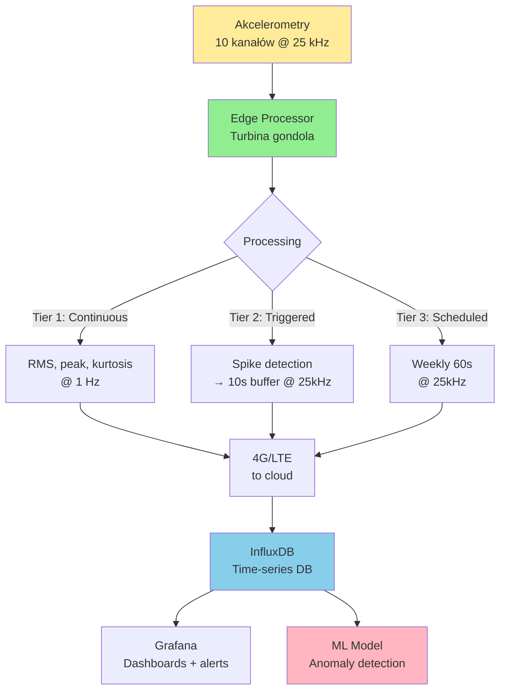

import { 
  SlideContainer, 
  Slide, 
  KeyPoints, 
  SupportingDetails, 
  InstructorNotes,
  VisualSeparator,
  LearningObjective,
  KeyConcept,
  Example
} from '@site/src/components/SlideComponents';
import { InteractiveQuiz } from '@site/src/components/InteractiveQuiz';

<LearningObjective>
Po tej sekcji student potrafi:
- Zastosować twierdzenie Nyquista-Shannona do doboru częstotliwości próbkowania dla różnych sygnałów
- Zaprojektować system akwizycji z właściwym filtrem anty-aliasing (typ, rząd, częstotliwość odcięcia)
- Określić optymalne parametry próbkowania dla aplikacji OZE (PV, wiatr, biogaz)
- Zdiagnozować i naprawić problemy związane z aliasing i niewystarczającą częstotliwością próbkowania
</LearningObjective>

<SlideContainer>

<Slide title="📊 Twierdzenie Nyquista-Shannona – fundament próbkowania" type="info">

<KeyPoints title="📋 Podstawy teorii próbkowania">

**Twierdzenie Nyquista-Shannona (1928/1949)**

Aby **wiernie zrekonstruować** sygnał ciągły (analog) z próbek dyskretnych (digital), częstotliwość próbkowania musi spełniać:

$$
f_{sample} \geq 2 \times f_{max}
$$

Gdzie:
- $f_{sample}$ – częstotliwość próbkowania [Hz lub samples/s]
- $f_{max}$ – maksymalna częstotliwość w sygnale [Hz]
- **Częstotliwość Nyquista**: $f_{Nyquist} = 2 \times f_{max}$

**W praktyce (ZAWSZE!):**

$$
f_{sample} \geq (2.5 - 5) \times f_{max}
$$

**Dlaczego zapas?**
1. **Filtry nie są idealne** – Slope roll-off jest skończony (-20 dB/dec dla 1st order, -80 dB/dec dla 4th order)
2. **Transition band** – Między passband a stopband jest przejście (nie instant cut-off)
3. **Component tolerances** – Rezystory/kondensatory mają tolerancje ±5-10%
4. **Temperature drift** – Częstotliwość odcięcia filtru zmienia się z T

---

### Co się dzieje przy f_sample < 2 × f_max?

**ALIASING** – wysokie częstotliwości "zawijają się" (fold back) i pojawiają jako **fałszywe** niskie częstotliwości.

**Wzór na częstotliwość alias:**

$$
f_{alias} = |f_{signal} - n \times f_{sample}|
$$

Gdzie n = 1, 2, 3, ... (integer)

**Przykład liczbowy:**
- Sygnał: f_signal = 4700 Hz (EMI z inwertera PWM)
- Próbkowanie: f_sample = 5000 Hz
- Alias: f_alias = |4700 - 1×5000| = |4700 - 5000| = **300 Hz**

ADC "widzi" sygnał 300 Hz zamiast 4700 Hz!

**Graficzna ilustracja (sinusoid undersampling):**

Jeśli próbkujesz sinusoidę 900 Hz z f_sample = 1000 Hz, próbki "wyglądają jakby" pochodziły z sinusoidy 100 Hz.

```
Original 900 Hz:  ~~~~~~~~~~~~~~~  (szybka oscylacja)
Samples @ 1 kHz:  * . . . * . . . * . . . * . . .
Alias 100 Hz:     \_____/         \_____/          (wolna oscylacja)
```

**Kluczowe:** Po próbkowaniu NIE DA SIĘ odzyskać pierwotnej częstotliwości – informacja jest nieodwracalnie utracona!

</KeyPoints>

<SupportingDetails title="🎛️ Strategia doboru f_sample dla różnych aplikacji">

### Metodologia 3-krokowa:

**Krok 1: Określ f_max (maksymalna interesująca częstotliwość)**

Analiza spektrum sygnału:
- **PV (prąd/napięcie stringów)**: f_max ≈ 1-5 Hz (wolne zmiany, cloud transients)
- **Wibracje main bearing**: f_max ≈ 100-500 Hz (BPFO, BPFI harmoniczne)
- **Wibracje gearbox high-speed**: f_max ≈ 5-10 kHz (mesh frequency harmonics)
- **Gazy (H₂S process control)**: f_max ≈ 0.01-0.1 Hz (bardzo wolne zmiany)
- **Acoustic emission (bearing cracks)**: f_max ≈ 50-100 kHz (ultrasonic)

**Krok 2: Wybierz zapas (oversampling ratio)**

$$
OSR = \frac{f_{sample}}{2 \cdot f_{max}}
$$

Typowe wartości:
- **OSR = 1.25-1.5×** (barely Nyquist, wymaga bardzo stromego filtru – 8th order+)
- **OSR = 2-3×** (standard w przemyśle, 4th order Butterworth wystarczy)
- **OSR = 5-10×** (conservative, prosty filtr 2nd order OK)

**Krok 3: Dobierz f_sample z dostępnych wartości ADC**

ADC mają dyskretne f_sample (często potęgi 2):
- 1 kHz, 2 kHz, 5 kHz, 10 kHz, 20 kHz, 50 kHz, 100 kHz, ...

**Zawsze wybieraj najbliższą WYŻSZĄ** wartość dostępną.

---

### Parametry próbkowania dla typowych aplikacji OZE:

| Aplikacja | f_max | f_sample recommended | ADC resolution | Passband filter | Przykład sprzętu |
|-----------|-------|----------------------|----------------|-----------------|------------------|
| **PV string monitoring** | 5 Hz | 50-100 Hz | 16-bit | 10 Hz LP | NI USB-6009 |
| **Pyranometer (G_POA)** | 1 Hz | 10 Hz | 16-bit | 2 Hz LP | Campbell CR1000 |
| **Temperature (PT1000)** | 0.1 Hz | 1 Hz | 24-bit | 0.2 Hz LP | Datataker DT85 |
| **Vibration (low freq)** | 500 Hz | 2.5 kHz | 24-bit | 1 kHz LP, Butterworth 4th | PCB 356A15 + NI 9234 |
| **Vibration (high freq)** | 10 kHz | 50 kHz | 24-bit | 20 kHz LP, Butterworth 6th | Brüel & Kjær 4507 + LAN-XI |
| **Gas sensors (H₂S)** | 0.05 Hz | 1 Hz | 16-bit | 0.1 Hz LP | Modbus RTU @ 1s interval |
| **SCADA trends** | 0.01 Hz | 0.1 Hz (10s) | 16-bit | N/A (już wolne) | InfluxDB aggregation |

**Wnioski:**
- **Wolne procesy** (temp, gazy): f_sample = 1-10 Hz wystarczy
- **Dynamiczne procesy** (wibracje): f_sample = kilkadziesiąt kHz
- **Zawsze filtr anty-aliasing!** (poza bardzo wolnymi: &lt;0.1 Hz)

</SupportingDetails>

<InstructorNotes>

**Czas**: 14-16 min

**Przebieg**:
1. Twierdzenie Nyquista – definicja i przykład liczbowy (4 min)
2. Aliasing – co to jest i dlaczego nieodwracalny (3 min) – użyj grafiki/animacji
3. Metodologia 3-krokowa doboru f_sample (4 min)
4. Tabela parametrów dla OZE (2 min) – omów typowe wartości
5. Q&A (2 min)

**Punkty kluczowe**:
- **Nyquist to MINIMUM teoretyczne** – zawsze 2.5-5× zapas w praktyce
- **Aliasing to nieodwracalna strata** – nie można cofnąć po próbkowaniu
- f_sample zależy od f_max sygnału (nie od "jak szybko chcemy danych"!)
- ADC resolution (bit depth) ≠ f_sample (to różne parametry!)

**Demonstracja praktyczna**:
- Animacja aliasing (Python/Matlab): sygnał 900 Hz próbkowany @ 1 kHz → wygląda jak 100 Hz
- Oscyloskop: undersampling sinusoidy – wizualizacja envelope
- Audio playback: sound @ 4 kHz → sampled @ 5 kHz → playback sounds like 1 kHz (perceptible)

**Materiały pomocnicze**:
- Lyons, "Understanding Digital Signal Processing" (Chapter 2: Sampling)
- Application note: "ADC Sampling Frequency & Aliasing" (TI, AN-282)
- Python script: aliasing_demo.py (https://github.com/.../aliasing-visualization)
- Interactive tool: Nyquist demo (Wolfram Alpha widget)

**Typowe błędy studenckie**:
- Myślenie, że f_sample = 2× f_max wystarczy w praktyce – NO! To MINIMUM teoretyczne
- Mylenie f_sample (sampling rate) z data logging interval (może być różne: sample @ 1 kHz, log mean co 1 min)
- Stosowanie f_sample zbyt niskiego "żeby oszczędzić storage" – NIGDY kosztem aliasing!

**Pytania studenckie**:
- Q: Dlaczego nie zawsze próbkować z max. f_sample ADC (np. 100 kHz)?
- A: (1) Koszt storage/transmisji (100 kHz × 24-bit × 10 kanałów = 2.4 MB/s), (2) CPU load (przetwarzanie FFT), (3) Power consumption (w IoT battery-powered). Wybierz f_sample adekwatną do f_max sygnału.

- Q: Czy można użyć filtru cyfrowego zamiast analogowego przed ADC?
- A: NIE do anti-aliasing! Cyfrowy działa PO sampling → aliasing już wystąpił. Ale: cyfrowy MOŻE być dodatkowy (post-processing) dla dalszej redukcji szumu.

</InstructorNotes>

</Slide>

<VisualSeparator type="technical" />

<Slide title="🔍 Filtr anti-aliasing – projektowanie i implementacja" type="tip">

<KeyConcept title="Dlaczego potrzebujemy filtru przed ADC?">

**Problem:** Sygnał real-world zawiera:
- Sygnał użyteczny (f < f_max)
- Szumy (f > f_max): EMI, RF interference, harmonics

Bez filtru → szumy >f_Nyquist **się aliasują** i pojawiają w paśmie sygnału → nie do usunięcia!

**Rozwiązanie:** Filtr dolnoprzepustowy (low-pass) PRZED ADC:

$$
f_{cutoff} = \frac{f_{sample}}{2 \times OSR} = \frac{f_{sample}}{2.5 - 5}
$$

**Przykład:**
- f_sample = 10 kHz (wybrane dla systemu akwizycji)
- OSR = 2.5× (standard)
- f_cutoff = 10000 / 2.5 = **4 kHz**

</KeyConcept>

<SupportingDetails title="📐 Dobór typu i rzędu filtru">

### Typy filtrów (frequency response):

**1. Butterworth**
- **Charakterystyka**: Maximally flat passband (brak ripple), monotoniczny roll-off
- **Roll-off**: -20 dB/decade × order (1st: -20, 2nd: -40, 4th: -80, 8th: -160 dB/dec)
- **Phase**: Nieliniowa (group delay varies)
- **Zastosowanie**: **Najbardziej popularny** – dobry kompromis

**2. Chebyshev**
- **Charakterystyka**: Steeper roll-off niż Butterworth, ALE ripple w passband (±0.5-3 dB)
- **Roll-off**: Szybszy (lepszy stop-band)
- **Wady**: Ripple zniekształca sygnał → rzadko w anti-aliasing
- **Zastosowanie**: Gdy potrzeba bardzo stromego roll-off i tolerujesz ripple

**3. Bessel**
- **Charakterystyka**: Najlepsza phase linearity (constant group delay)
- **Roll-off**: Wolniejszy niż Butterworth
- **Zastosowanie**: Gdy phase response ma znaczenie (pulse, transient analysis)
- **W anti-aliasing**: Rzadko (wolny roll-off wymaga wyższego order)

**4. Elliptic (Cauer)**
- **Charakterystyka**: Najstromiejszy roll-off, ALE ripple w passband I stopband
- **Zastosowanie**: Bardzo specjalistyczne (komunikacja)
- **W anti-aliasing**: Prawie nigdy (ripple problem)

---

### Dobór rzędu (order) filtru:

**Wymaganie:** Attenuation @ f_sample/2 (f_Nyquist) powinien być >60-80 dB

**Butterworth roll-off:**
- 1st order: -20 dB/decade
- 2nd order: -40 dB/decade
- 4th order: -80 dB/decade (**standard dla anti-aliasing**)
- 8th order: -160 dB/decade (bardzo stromy, ale drogi i trudny)

**Przykład obliczenia:**

System: f_cutoff = 4 kHz, f_sample = 10 kHz, f_Nyquist = 5 kHz

Potrzebna attenuation @ 5 kHz (octave = 5/4 = 1.25):

- **2nd order Butterworth**: -40 dB/dec × log₁₀(1.25) = -40 × 0.097 = **-3.9 dB/octave** × 0.32 octaves = **-12.5 dB** (NIEDOSTATECZNE!)
- **4th order Butterworth**: -80 dB/dec × 0.32 octaves = **-25 dB** (LEPIEJ, ale wciąż mało)
- **6th order Butterworth**: -120 dB/dec × 0.32 octaves = **-38 dB** (DOBRE ✓)

**Wniosek**: Dla OSR = 2.5×, potrzeba **min. 6th order** Butterworth. Dla OSR = 5×, wystarczy **4th order**.

---

### Implementacja (aktywny vs. pasywny):

**Pasywny (RC, LC):**
- **Zalety**: Tani, prosty, brak zasilania
- **Wady**: Brak wzmocnienia, obciąża source (loading), trudny dobór dla high-order
- **Zastosowanie**: Low-order (1st, 2nd), non-critical

**Aktywny (op-amp based):**
- **Zalety**: Wzmocnienie, high input impedance, łatwy high-order (kaskada)
- **Wady**: Wymaga zasilania, noise, GBW op-amp limit
- **Topologie**: Sallen-Key, Multiple Feedback (MFB), State Variable
- **Zastosowanie**: **Standard dla anti-aliasing** (4th-8th order)

**Kaskada 2nd order stages:**

4th order = 2× 2nd order Sallen-Key  
8th order = 4× 2nd order Sallen-Key

Każdy stage ma Q factor (resonance) – dla Butterworth: Q₁, Q₂ z tablic

</SupportingDetails>

<Example title="Projektowanie filtru anti-aliasing dla systemu wibracji">

**Specyfikacja:**
- **Aplikacja**: Monitoring wibracji main bearing (turbina wiatrowa)
- **Interesujące pasmo**: 10 Hz - 2 kHz (BPFO, BPFI, harmonics)
- **ADC**: NI 9234 (f_sample options: 1.6, 3.2, 6.4, 12.8, 25.6, 51.2 kHz)
- **Czujnik**: Akcelerometr IEPE, flat response 1 Hz - 10 kHz

### Krok 1: Wybór f_sample

f_max = 2 kHz (górna granica interesującego pasma)  
f_Nyquist = 2 × 2000 = 4 kHz (absolute minimum)  
f_sample (z zapasem OSR = 3×) = 3 × 2 × 2000 = **12 kHz**

Z opcji ADC: 12.8 kHz jest najbliższe → **f_sample = 12.8 kHz** ✓

### Krok 2: Obliczenie f_cutoff

OSR actual = 12800 / (2 × 2000) = **3.2×**

f_cutoff = 12800 / (2 × 3.2) = **2000 Hz** (dokładnie f_max – w praktyce trochę wyżej dla marginesu)

Wybieramy **f_cutoff = 2.5 kHz** (daje pasmo dla nieznanych harmonics + margines na tolerancje)

### Krok 3: Dobór typu i rzędu filtru

**Typ**: Butterworth (flat passband, dobry roll-off)

**Rząd**: Sprawdź attenuation @ f_Nyquist = 6.4 kHz:

Octave ratio = 6.4 / 2.5 = **2.56** (log₂(2.56) = 1.36 octaves)

- 4th order: -24 dB/octave × 1.36 = **-32.6 dB** (akceptowalne)
- 6th order: -36 dB/octave × 1.36 = **-49 dB** (bardzo dobre)

Wybieramy **4th order Butterworth** (kompromis koszt/performance).

### Krok 4: Implementacja (Sallen-Key kaskada)

**Stage 1 (2nd order):**
- Q₁ = 0.541 (z tablic Butterworth 4th order)
- f_c1 = 2.5 kHz
- R1 = R2 = 6.8 kΩ
- C1 = C2 = 10 nF
- Op-amp: TL072 (GBW = 3 MHz >> 2.5 kHz, wystarczy)

**Stage 2 (2nd order):**
- Q₂ = 1.307 (z tablic)
- f_c2 = 2.5 kHz
- R3 = R4 = 6.8 kΩ
- C3 = C4 = 10 nF
- Op-amp: TL072

**Koszt BOM**: ~5 EUR (2× op-amp IC, 4× rezystory, 4× kondensatory ceramiczne, PCB)

### Krok 5: Weryfikacja (pomiar z network analyzer)

Wymierzone @ f = 6.4 kHz (f_Nyquist):
- Attenuation: **-34 dB** ✓ (close to calculated -32.6 dB)
- Phase: -270° (expected for 4th order @ high freq)

Pasmo użyteczne (passband -3 dB): DC - 2.7 kHz ✓ (powyżej 2.5 kHz design)

**PASS** – filtr gotowy do produkcji!

### Krok 6: Test w systemie (anti-aliasing effectiveness)

**Before filter:**
- Sygnał testowy: 8 kHz sinusoid (powyżej f_Nyquist)
- ADC @ 12.8 kHz widzi: **alias @ |8 - 12.8| = 4.8 kHz** ❌

**After filter:**
- 8 kHz sinusoid attenuated: -34 dB → amplitude reduced 50× (98% suppression)
- Alias @ 4.8 kHz: **-34 dB poniżej sygnału użytecznego** → neglectable ✓

**Sukces!** System działa poprawnie, brak artefaktów aliasing w analizie FFT.

</Example>

<InstructorNotes>

**Czas**: 18-20 min (to kompleksowa sekcja!)

**Przebieg**:
1. Dlaczego filtr przed ADC (3 min) – wyjaśnij problem szumów >f_Nyquist
2. Typy filtrów (4 min) – Butterworth, Chebyshev, Bessel, porównanie
3. Dobór rzędu (4 min) – obliczenia attenuation dla różnych orders
4. Case study: Filtr dla wibracji (5 min) – full design flow
5. Q&A (2 min)

**Punkty kluczowe**:
- **Butterworth = workhorse** anti-aliasing (95% aplikacji)
- **4th-6th order** to standard (8th to overkill dla większości)
- OSR = 3-5× pozwala na 4th order (OSR = 2× wymaga 6th-8th)
- **Always verify z network analyzer** po zbudowaniu

**Demonstracja praktyczna**:
- Bode plot różnych orders (1st vs. 2nd vs. 4th) – widać różnicę w roll-off
- Breadboard 4th order Butterworth + function generator + oscyloskop
- LTspice simulation (pokazuje -3 dB punkt, roll-off slope)

**Materiały pomocnicze**:
- TI FilterPro Desktop (free software) – auto-design Butterworth/Chebyshev
- Analog Devices Filter Wizard (online tool)
- Butterworth Q factors table (dla różnych orders 2-10)
- Sallen-Key calculator (online: http://sim.okawa-denshi.jp/en/Fkeisan.htm)

**Typowe błędy studenckie**:
- Stosowanie 1st order RC (20 dB/dec) jako anti-aliasing – ZA WOLNY roll-off!
- Mylenie f_cutoff filtru (np. 2 kHz) z f_sample (np. 10 kHz) – to różne częstotliwości
- GBW op-amp za niski (np. 100 kHz dla f_c = 50 kHz) → filtr nie działa jak Butterworth (peaking)

**Pytania studenckie**:
- Q: Czy można stosować switched-capacitor filters zamiast aktywnych RC?
- A: TAK (np. MAX7400 series). Zalety: No external components, easy f_cutoff tuning (clock frequency). Wady: Clock noise, limited f_cutoff (max ~100 kHz). W anti-aliasing: OK dla f_c &lt;50 kHz.

- Q: Dlaczego Butterworth, a nie Chebyshev (steeper roll-off)?
- A: Chebyshev ma ripple w passband (±1-3 dB) → zniekształca sygnał. W precision measurement: inacceptable. Butterworth = flat ±0.1 dB → preferred.

</InstructorNotes>

</Slide>

<VisualSeparator type="default" />

<Slide title="⚙️ Parametryzacja strumieni danych – praktyczne strategie" type="success">

<KeyPoints title="📋 Adaptive sampling strategies">

### **Fixed-rate sampling (klasyczne)**

Stała f_sample przez cały czas:
- **Zalety**: Prosty, przewidywalny data rate, łatwy w analizie (FFT)
- **Wady**: Waste bandwidth w okresach "spokoju" (low dynamics)

**Zastosowanie**: 
- Continuous monitoring (CMS wibracji)
- Real-time control loops
- Gdy storage/bandwidth nie jest problemem

---

### **Triggered sampling (event-based)**

Próbkowanie tylko gdy trigger condition spełniony:
- **Trigger**: Threshold crossing, slope, pattern matching
- **Pre-trigger buffer**: Zapisz N próbek PRZED triggerem (circular buffer)
- **Post-trigger**: Kontynuuj M próbek PO triggerze

**Przykład:**
- Wibracje: Trigger @ acceleration >2 g (spike detection)
- Record: 100 ms pre-trigger + 500 ms post-trigger @ 25 kHz
- **Data reduction**: 95% (triggeruje 5% czasu)

**Zastosowanie**:
- Transient events (shocks, impacts, electrical faults)
- Anomaly detection

---

### **Multi-rate sampling (hierarchical)**

Różne f_sample dla różnych kanałów/pasm:
- **Slow channels**: Temp, pressure @ 1-10 Hz
- **Medium channels**: Voltage, current @ 100-1000 Hz
- **Fast channels**: Vibration @ 10-50 kHz

**Synchronizacja**: Common time base (GPS, PTP), different decimation ratios

**Data reduction**: 10-100× vs. sampling everything @ max rate

**Zastosowanie**:
- Multi-sensor systems (SCADA)
- Mixed slow/fast dynamics

---

### **Adaptive sampling (intelligent)**

f_sample dynamicznie dostosowuje się do dynamics sygnału:
- **High dynamics** (rapid changes) → increase f_sample
- **Low dynamics** (steady state) → decrease f_sample
- **Algorithm**: Slope detection, variance, autocorrelation

**Przykład:**
- Baselinebaseline: 100 Hz
- Detect rapid change (slope >threshold) → boost to 1 kHz for 10 s
- Return to baseline

**Data reduction**: 50-90% vs. fixed high rate

**Zastosowanie**:
- IoT (battery-powered)
- Cloud transmission (minimize bandwidth)

---

### **Compressed sensing (advanced)**

Sample at sub-Nyquist rate, reconstruct with sparsity algorithms:
- **Theory**: Jeśli sygnał jest "sparse" w jakiejś domenie (time, frequency, wavelet), można sample &lt;f_Nyquist
- **Reconstruction**: L1-minimization, matching pursuit

**Zastosowanie**: Very niche (research), NIE dla general-purpose monitoring

</KeyPoints>

<SupportingDetails title="📊 Tabela parametrów dla typowych strumieni OZE">

| Strumień danych | Dynamics | f_sample | Data rate (1 kanal, 16-bit) | Agregacja typical | Retention |
|-----------------|----------|----------|------------------------------|-------------------|-----------|
| **PV string (I, V)** | Wolne (cloud trans.) | 10-100 Hz | 1.2-12 KB/s | 1-min mean | 10 lat (raw: 3 miesiące) |
| **Pyranometer (G_POA)** | Wolne | 1-10 Hz | 0.12-1.2 KB/s | 1-min mean | 10 lat |
| **Temp (PT1000)** | Bardzo wolne | 0.1-1 Hz | 0.012-0.12 KB/s | 5-min mean | 10 lat |
| **Wind speed/dir** | Średnie | 1-10 Hz | 0.12-1.2 KB/s | 10-min mean/max/gust | 10 lat |
| **Vibration (low)** | Dynamiczne | 1-5 kHz | 12-60 KB/s | 10-min RMS, peak, kurtosis | 1 rok (raw: 1 mies.) |
| **Vibration (high)** | Bardzo dynamiczne | 25-50 kHz | 300-600 KB/s | On-demand (triggered) | 1 mies. (raw: 1 tydzień) |
| **Gas sensors (H₂S)** | Wolne | 0.1-1 Hz | 0.012-0.12 KB/s | 1-min mean | 5 lat |
| **SCADA trends** | Wolne | 0.01-0.1 Hz | 0.001-0.012 KB/s | Pre-aggregated | 20 lat |
| **Electrical events (SOE)** | Impulsowe | Triggered @ kHz | Variable (events only) | Event log | 10 lat |

**Obserwacje:**
- **Slow processes** (temp, gaz): &lt;1 Hz → data rate neglectable (&lt;1 MB/day)
- **Fast processes** (vibration high-freq): 50 kHz → data rate massive (>50 GB/day) → triggered sampling MUST
- **Aggregation** redukuje long-term storage 100-1000× (raw→mean)

</SupportingDetails>

<Example title="Optymalizacja strategii sampling – farma wiatrowa 100 MW">

**Kontekst: 50 turbin × 2 MW, każda ma CMS (Condition Monitoring System)**

### Wyzwanie:

**Naive approach (continuous high-rate):**
- Każda turbina: 10 kanałów wibracji @ 25 kHz × 16-bit
- Data rate PER turbina: 10 × 25000 × 2 bytes = **500 KB/s** = 43 GB/day
- **Całość farmy**: 50 × 43 GB = **2150 GB/day** = 2.1 TB/day
- **Miesięcznie**: 63 TB
- **Rocznie**: 760 TB

**Koszt storage (cloud):**
- AWS S3: $0.023/GB/month (standard)
- 63 TB/month × $23/TB = **$1450/month** = **$17 400/year** TYLKO storage (!)
- Plus: Upload bandwidth (egress), CPU processing

**NIE DO PRZYJĘCIA** – zbyt kosztowne.

---

### Optymalizacja (multi-tier strategy):

**Tier 1: Continuous low-rate (diagnostic features)**
- Frequency: 1 Hz (decimated z 25 kHz przez RMS/peak/kurtosis calculation @ edge)
- Features per kanał: RMS, peak, kurtosis, crest factor (4× values)
- Data rate PER turbina: 10 kanałów × 4 features × 1 Hz × 4 bytes (float32) = **160 bytes/s** = 13.8 MB/day
- **Całość farmy**: 50 × 13.8 MB = **690 MB/day**

**Tier 2: Triggered high-rate (event capture)**
- Trigger condition: RMS spike >3σ (standard deviation), OR kurtosis >4 (impulsive)
- Capture: 10 s @ 25 kHz (pre-trigger 1 s + post-trigger 9 s)
- Frequency: ~1-5 events/day per turbina (depends on health)
- Data per event: 10 s × 25 kHz × 10 kanałów × 2 bytes = **5 MB**
- Data rate: 5 events/day × 5 MB = **25 MB/day** per turbina
- **Całość farmy**: 50 × 25 MB = **1250 MB/day**

**Tier 3: Scheduled high-rate (periodic diagnostics)**
- Frequency: 1× per tydzień (weekly deep analysis)
- Duration: 60 s @ 25 kHz (full FFT analysis)
- Data per turbina: 60 s × 25 kHz × 10 × 2 = **30 MB**
- **Całość farmy per week**: 50 × 30 MB = **1500 MB/week** = **214 MB/day** (averaged)

---

### Total data rate (optimized):

- Tier 1: 690 MB/day
- Tier 2: 1250 MB/day
- Tier 3: 214 MB/day
- **TOTAL**: **2154 MB/day** ≈ **2.1 GB/day**

**Reduction factor**: 2150 GB → 2.1 GB = **1000× reduction!**

**Koszt storage (optimized):**
- 2.1 GB/day × 30 = **63 GB/month**
- $0.023/GB × 63 = **$1.45/month** = **$17/year**

**Savings: $17 400 → $17 = 99.9% cost reduction** ✓

---

### Architektura implementacji:



**Edge processing (in gondola):**
- Industrial PC (Raspberry Pi 4 or NVIDIA Jetson Nano)
- Software: Python + NumPy/SciPy (DSP)
- Power: 5-15 W (turbina ma power, no problem)

**Benefits:**
- **Bandwidth savings**: 1000× reduction → możliwość 4G/LTE (nie potrzeba fiber)
- **Storage savings**: 99.9% reduction → cloud affordable
- **Latency**: Edge detects anomalies w czasie rzeczywistym (ms), nie czeka na cloud
- **Privacy**: Raw data stays local (tylko features/events do cloud)

</Example>

<InstructorNotes>

**Czas**: 16-18 min

**Przebieg**:
1. Przegląd strategii sampling (5 min) – fixed, triggered, multi-rate, adaptive
2. Tabela parametrów OZE (3 min)
3. Case study optymalizacji farmy wiatrowej (6 min) – pokazuje 1000× reduction
4. Dyskusja: Jak studenci podeszliby do problemu? (2 min)
5. Q&A (2 min)

**Punkty kluczowe**:
- **Continuous high-rate = EXPENSIVE** (storage, bandwidth)
- **Edge processing** (extract features locally) radykalnie redukuje data rate
- **Triggered sampling** dla events (transients, anomalies) – 90-99% reduction
- **Multi-tier** strategy balances: continuous monitoring + event capture + deep diagnostics

**Demonstracja praktyczna**:
- Pokaż dashboard Grafana z Tier 1 (RMS trends) + Tier 2 (triggered events)
- Obliczenia data rate na tablicy – studenci zobaczą skalę problemu
- Python script: DSP feature extraction (RMS, kurtosis, crest factor) – live demo

**Materiały pomocnicze**:
- Industrial IoT data strategies (whitepaper: AWS, Azure)
- Edge computing for wind turbines (case study: GE Digital, Siemens)
- InfluxDB retention policies (documentation)
- Grafana + telegraf for edge data aggregation (tutorial)

**Typowe błędy studenckie**:
- Myślenie, że "więcej danych = lepiej" – NO! Quality > quantity, context > raw
- Ignorowanie kosztów storage/bandwidth – w cloud: $$$ per GB
- Brak aggregation strategy – keeping raw data forever = bankruptcy

**Pytania studenckie**:
- Q: Czy można używać compression (gzip, etc.) zamiast decimation?
- A: TAK, ale: (1) Compression ratio dla time-series ~2-5× (nie 1000×), (2) CPU cost (na edge: limited power), (3) Trzeba decompress przed analysis. Feature extraction + triggered sampling > compression alone.

- Q: Co jeśli triggered sampling MISS critical event (między triggers)?
- A: Risk mitigation: (1) Conservative thresholds (trigger wcześniej), (2) Redundancja (multiple trigger algorithms), (3) Periodic full-rate (Tier 3) catches slow-developing issues. W critical: Tier 1 continuous features + Tier 2 triggered → catch 99%+ events.

</InstructorNotes>

</Slide>

<VisualSeparator type="default" />

<Slide title="📝 Quiz: Próbkowanie i anti-aliasing" type="info">

<InteractiveQuiz 
  questions={[
    {
      question: "Sygnał ma maksymalną częstotliwość f_max = 5 kHz. Jaka jest minimalna częstotliwość próbkowania według Nyquista?",
      options: [
        "5 kHz (równa f_max)",
        "10 kHz (2 × f_max)",
        "12.5 kHz (2.5 × f_max, practical)",
        "25 kHz (5 × f_max, conservative)"
      ],
      correctAnswer: 1,
      explanation: "Twierdzenie Nyquista: f_sample ≥ 2 × f_max. Dla f_max = 5 kHz → f_Nyquist = 10 kHz (MINIMUM teoretyczne). W praktyce: 2.5-5× (12.5-25 kHz), ale pytanie o Nyquist → 10 kHz."
    },
    {
      question: "Mamy f_sample = 8 kHz. Sygnał zakłócający ma częstotliwość 7 kHz (powyżej f_Nyquist = 4 kHz). Jaka częstotliwość alias pojawi się w ADC?",
      options: [
        "7 kHz (bez zmian)",
        "1 kHz (|7 - 8|)",
        "3 kHz (7 - 4)",
        "15 kHz (7 + 8)"
      ],
      correctAnswer: 1,
      explanation: "Alias: f_alias = |f_signal - n×f_sample|. Dla n=1: |7 - 8| = 1 kHz. Sygnał 7 kHz 'zawija się' i pojawia jako 1 kHz. Opcja (c) to błędne odejmowanie f_Nyquist. Opcja (d) to suma (nie ma sensu)."
    },
    {
      question: "Projektujemy filtr anti-aliasing dla systemu z f_sample = 20 kHz. OSR (oversampling ratio) = 4×. Jaka powinna być f_cutoff filtru?",
      options: [
        "10 kHz (f_sample/2, Nyquist)",
        "5 kHz (f_sample/4)",
        "2.5 kHz (f_sample/8 = f_sample/(2×OSR))",
        "20 kHz (równa f_sample)"
      ],
      correctAnswer: 2,
      explanation: "OSR = f_sample / (2 × f_max) → f_max = f_sample / (2 × OSR). Dla OSR=4: f_max = 20000 / (2×4) = 2500 Hz. f_cutoff ≈ f_max. Alternatywnie: f_cutoff = f_sample / (2×OSR) = 20000/8 = 2.5 kHz."
    },
    {
      question: "Filtr Butterworth 4th order ma roll-off -80 dB/decade. Po przesunięciu o 1 octave (podwojenie częstotliwości) od f_cutoff, jaka jest attenuation?",
      options: [
        "-24 dB/octave × 1 = -24 dB",
        "-80 dB (całkowita dekada)",
        "-40 dB (połowa dekady = octave)",
        "Nie można obliczyć bez logarytmów"
      ],
      correctAnswer: 0,
      explanation: "-80 dB/decade = -24 dB/octave (bo decade = 10×, octave = 2×, log₁₀(2) ≈ 0.3). 1 octave → -24 dB. Opcja (c) myląco sugeruje -40 dB, ale to dla 2nd order. Opcja (d) nieprawda – prosta konwersja: -80 dB/dec ÷ 3.32 ≈ -24 dB/oct."
    },
    {
      question: "W farmie wiatrowej 100 MW (50 turbin) stosowano continuous sampling @ 25 kHz (2.1 TB/day). Po optymalizacji (edge processing + triggered + scheduled) data rate spadł do 2.1 GB/day. Jaki jest reduction factor?",
      options: [
        "100× (2100/21)",
        "1000× (2100 GB / 2.1 GB)",
        "10× (tylko jeden rząd wielkości)",
        "Nie można porównać (różne units)"
      ],
      correctAnswer: 1,
      explanation: "2.1 TB = 2100 GB. Reduction: 2100 GB / 2.1 GB = 1000×. Opcja (a) błędnie dzieli 2100/21 = 100 (brak konwersji TB→GB). Opcja (d) nieprawda – obie są w GB po konwersji."
    }
  ]}
/>

:::tip Rekomendacja po quizie
Jeśli uzyskałeś &lt;80% poprawnych odpowiedzi, przejrzyj sekcje o twierdzeniu Nyquista (f_sample ≥ 2×f_max), obliczaniu aliasing (|f - n×f_s|), i konwersji dB/decade ↔ dB/octave. Zrozumienie tych fundamentów jest kluczowe dla projektowania systemów akwizycji.
:::

</Slide>

</SlideContainer>

---

## Podsumowanie i wnioski

**Kluczowe punkty z tej sekcji:**

1. **Twierdzenie Nyquista: f_sample ≥ 2 × f_max** – to MINIMUM teoretyczne. W praktyce: **2.5-5× zapas** dla real-world filtrów.

2. **Aliasing to nieodwracalna strata** – wysokie częstotliwości "zawijają się" jako fałszywe niskie. Po sampling NIE DA SIĘ cofnąć → filtr anty-aliasing PRZED ADC to must.

3. **Filtr Butterworth 4th order to standard** – flat passband, -80 dB/decade roll-off. Dla OSR=3-5× wystarczy 4th order. OSR=2× wymaga 6th-8th order.

4. **Parametry sampling zależą od dynamics sygnału:**
   - Slow (temp, gas): 0.1-1 Hz
   - Medium (PV strings): 10-100 Hz
   - Fast (vibration low-freq): 1-5 kHz
   - Very fast (vibration high-freq): 25-50 kHz

5. **Multi-tier sampling strategy** radykalnie redukuje data rate:
   - Tier 1: Continuous low-rate (features: RMS, kurtosis) @ 1 Hz
   - Tier 2: Triggered high-rate (events) @ 25 kHz, 1-5% czasu
   - Tier 3: Scheduled deep analysis @ 25 kHz, weekly
   - **Reduction: 100-1000×** vs. continuous high-rate → savings $$$ storage/bandwidth

6. **Edge processing to game-changer** – extract features locally (DSP @ edge), send only relevant data to cloud. Raspberry Pi/Jetson może przetwarzać 10 kanałów @ 25 kHz real-time.

**Typowe błędy do unikania:**
- f_sample = 2×f_max (Nyquist) w praktyce – zawsze 2.5-5× zapas!
- Brak filtru anty-aliasing ("filter cyfrowy po ADC wystarczy") – aliasing już się stał
- Continuous high-rate dla wszystkiego – koszty storage/bandwidth eksplodują
- Ignorowanie edge processing – wysyłanie raw data to waste bandwidth

**Następne kroki:**
- Ćwiczenie 8: Obliczanie f_sample, projektowanie filtru Butterworth (online calculator)
- Lab hands-on: Breadboard 4th order filter + test z function generator
- Przygotowanie do następnej sekcji: Synchronizacja czasu (NTP/PTP)

---

**Dodatkowe zasoby:**
- **Lyons**: "Understanding Digital Signal Processing" (bible of DSP)
- **TI**: "ADC Sampling Frequency Selection" (AN-282)
- **Analog Devices Filter Wizard**: Online tool (https://tools.analog.com/en/filterwizard/)
- **Python**: `scipy.signal` library – Butterworth design, `lfilter()` simulation
- **LTspice**: Free circuit simulator – design/test filters (https://www.analog.com/ltspice)
