import { 
  SlideContainer, 
  Slide, 
  KeyPoints, 
  SupportingDetails, 
  InstructorNotes,
  VisualSeparator,
  LearningObjective,
  KeyConcept,
  Example
} from '@site/src/components/SlideComponents';
import { InteractiveQuiz } from '@site/src/components/InteractiveQuiz';

<LearningObjective>
Po tej sekcji student potrafi:
- Wyjaśnić znaczenie synchronizacji czasu w systemach rozproszonych (SCADA, IIoT, multi-site)
- Porównać protokoły NTP i PTP (IEEE 1588) pod kątem dokładności, wymagań sieciowych i zastosowań
- Zaprojektować hierarchię serwerów czasu (stratum, master/slave) dla instalacji OZE
- Zidentyfikować typowe problemy synchronizacji (drift, jitter, asymmetric delays) i zastosować rozwiązania
</LearningObjective>

<SlideContainer>

<Slide title="⏰ Dlaczego synchronizacja czasu jest krytyczna?" type="info">

<KeyPoints title="📋 Znaczenie spójnego czasu w systemach OZE">

**Problem: Systemy rozproszone bez synchronizacji**

Typowa instalacja OZE (np. farma PV 10 MWp) ma:
- 500+ czujników (string monitors, pyranometry, temp, wiatr)
- 20-50 inwerterów (każdy z własnym zegarkiem)
- 5-10 gateway devices (edge computing)
- 1-2 servery SCADA/historian
- Połączenia: Modbus, OPC UA, MQTT, HTTP/REST

**Każde urządzenie ma własny zegar** → drift (zmiana) 10-100 ppm (parts per million)
- 10 ppm = **0.86 s/day** drift
- 100 ppm = **8.6 s/day** drift

Po tygodniu bez synchronizacji: **różnice do 1 minuty** między urządzeniami!

---

### Konsekwencje braku synchronizacji:

**1. Niemożność korelacji zdarzeń**

Przykład: Analiza wyłączenia inwertera
- Inwerter wyłączył się @ 14:32:17 (według jego zegara)
- Pyranometr zanotował spadek G @ 14:32:45 (według jego zegara)
- **Pytanie**: Czy wyłączenie spowodowało spadek G (cień), czy odwrotnie (chmura → wyłączenie przez undervoltage)?
- **Odpowiedź**: **Nie wiemy** jeśli zegary nie są zsynchronizowane ±1 s!

**2. Błędy w obliczeniach energii (billing errors)**

Performance Ratio:
$$
PR = \frac{E_{\text{actual}}(t_1, t_2)}{P_{\text{STC}} \times \int_{t_1}^{t_2} G(t) \, dt}
$$

Jeśli t_1, t_2 różnią się między E i G (różne zegary) → błąd do ±5-10% w PR!

**3. Fałszywe alarmy / Missed events**

SOE (Sequence of Events) w SCADA:
- Alarm "Undervoltage Grid" @ 08:15:23.456
- Alarm "Inverter Trip" @ 08:15:23.123

Który był PIERWSZY? Jeśli dryft >0.5 s → **nie wiadomo** (causa vs. effect)

**4. Regulacyjne/audytowe compliance**

Normy (IEC 61850, IEEE 1815 DNP3) **wymagają** synchronizacji:
- **IEC 61850**: ±1 ms dla protection events
- **ISO 50001** (energy management): ±10 s dla billing
- **GDPR audit logs**: ±1 s dla cybersecurity events

---

### Rodzaje aplikacji i wymagana dokładność:

| Aplikacja | Wymagana dokładność | Protokół | Przykład |
|-----------|---------------------|----------|----------|
| **SCADA trends** (trendowanie) | ±10 s - ±1 min | NTP | Grafana dashboards, InfluxDB |
| **Energy billing** (rozliczenia) | ±1 s | NTP | Liczniki energii, PR calculations |
| **Event correlation** (analiza zdarzeń) | ±100 ms | NTP (stratum 2) | SOE analysis, alarm correlation |
| **Grid protection** (ochrony) | ±1 ms | PTP (IEEE 1588) | IEC 61850 substations, synchrophasors |
| **High-speed data acquisition** (fast DAQ) | ±1 µs | PTP w/ hardware timestamp | Synchronized waveform capture (PMU) |
| **Cybersecurity logs** | ±1 s | NTP | Audit trails, intrusion detection |

</KeyPoints>

<SupportingDetails title="🔍 Typowe źródła błędów czasu">

### 1. **Clock drift (dryft zegara)**

**Przyczyna**: Niedokładność oscylatora (crystal)
- Cheap quartz: 50-100 ppm (±8 s/day)
- Standard quartz (TCXO): 1-10 ppm (±0.1-0.9 s/day)
- High-precision (OCXO): 0.01-0.1 ppm (±0.001-0.01 s/day)

**Rozwiązanie**: Regularna synchronizacja (NTP co 10-60 min, PTP continuous)

### 2. **Network delays (opóźnienia sieciowe)**

Packet transit time zmienne (jitter):
- LAN: 0.1-1 ms (Ethernet, switch latency)
- WAN: 10-100 ms (routing, congestion)
- Wireless (WiFi): 5-50 ms (collision, retransmission)

**Rozwiązanie**: NTP algorytm kompensuje asymmetric delays, PTP wymaga symmetric network

### 3. **Temperature drift**

Częstotliwość oscylatora zmienia się z T:
- Standard crystal: ±0.035 ppm/°C
- W turbinie wiatrowej (gondola -30°C do +60°C) → drift do ±3 ppm (±0.26 s/day)

**Rozwiązanie**: TCXO (Temperature-Compensated Crystal Oscillator) lub frequent sync

### 4. **Software delays (kernel jitter)**

OS scheduler latency:
- Linux (standard kernel): 1-10 ms jitter
- Linux (real-time, PREEMPT_RT): 50-100 µs
- RTOS (VxWorks, QNX): 10-50 µs

**Rozwiązanie**: Hardware timestamping (PTP), kernel tuning

</SupportingDetails>

<InstructorNotes>

**Czas**: 12-14 min

**Przebieg**:
1. Problem braku synchronizacji (4 min) – przykład korelacji zdarzeń
2. Konsekwencje (3 min) – billing errors, false alarms, compliance
3. Wymagana dokładność dla aplikacji (2 min) – tabela
4. Źródła błędów (2 min) – drift, network delays, temperature
5. Q&A (2 min)

**Punkty kluczowe**:
- **Drift 10-100 ppm = kilka sekund/dzień** – szybko akumuluje się
- **Korelacja zdarzeń wymaga ±100 ms** – inaczej causa/effect unclear
- **Billing/PR wymaga ±1 s** – większy błąd = disputes z inwestorami
- **Grid protection = ±1 ms** (PTP) vs. SCADA trends = ±10 s (NTP)

**Demonstracja praktyczna**:
- Pokaż wykres: drift zegara przez 1 tydzień bez sync (exponential divergence)
- SOE log z SCADA – jak timestamp pomaga w root cause analysis
- ntpq -p command (Linux) – shows current time servers and offsets

**Materiały pomocnicze**:
- RFC 5905 (NTPv4 specification)
- IEEE 1588-2019 (PTPv2.1 standard)
- IEC 61850-5: Communication requirements for functions and device models (timing)

**Typowe błędy studenckie**:
- Myślenie, że "zegar komputera jest dokładny" – NO! Drift 50-100 ppm typowy
- Ignorowanie timezone (UTC vs. local) – ZAWSZE używaj UTC w logach/bazach
- Stosowanie system time() call do timestampów high-frequency – jitter 1-10 ms

**Pytania studenckie**:
- Q: Czemu nie użyć GPS do synchronizacji (dokładność &lt;100 ns)?
- A: MOŻNA (GPS clock modules ~100-500 EUR). Ale: (1) wymaga anteny outdoor (w gondoli OK, w data center NO), (2) GNSS jamming/spoofing risk. W praktyce: GPS dla master, NTP/PTP dystrybuuje do slaves.

- Q: Co to jest "leap second"?
- A: UTC periodic adjustment (co 1-2 lata) +1 s, bo rotation Ziemi zwalnia. NTP/PTP handle automatically, ale legacy systems mogą mieć problemy (crashes). Last leap second: 2016-12-31 23:59:60.

</InstructorNotes>

</Slide>

<VisualSeparator type="technical" />

<Slide title="🌐 NTP vs. PTP – porównanie protokołów" type="tip">

<KeyConcept title="Network Time Protocol (NTP) – RFC 5905">

**Architektura hierarchiczna (stratum):**

```mermaid
graph TB
    S0[Stratum 0<br/>Atomic clock, GPS<br/>±10 ns] --> S1A[Stratum 1<br/>NTP Server A<br/>±1 µs]
    S0 --> S1B[Stratum 1<br/>NTP Server B<br/>±1 µs]
    
    S1A --> S2A[Stratum 2<br/>Corporate NTP<br/>±10 ms LAN]
    S1B --> S2A
    S1A --> S2B[Stratum 2<br/>ISP NTP<br/>±50 ms WAN]
    
    S2A --> S3[Stratum 3<br/>Edge devices<br/>±50-100 ms]
    S2B --> S3
    
    S3 --> S4[Stratum 4+<br/>Sensors, PLCs<br/>±100-500 ms]
    
    style S0 fill:#ffd700
    style S1A fill:#ffeb99
    style S1B fill:#ffeb99
    style S2A fill:#ffffcc
    style S3 fill:#e6ffe6
    style S4 fill:#ccffcc
```



**Dokładność typowa:**
- **Stratum 1**: ±1-10 µs (bezpośrednio od GPS/atomic)
- **Stratum 2** (LAN): ±1-10 ms
- **Stratum 3** (WAN, internet): ±10-100 ms
- **Stratum 4+**: ±100-500 ms (za dużo hopów)

**Algorytm synchronizacji** (uproszczony):
1. Client wysyła request → Server (timestamp T1)
2. Server odbiera (T2), wysyła response (T3)
3. Client odbiera (T4)
4. **Obliczenie offset**: θ = [(T2-T1) + (T3-T4)] / 2
5. **Obliczenie delay**: δ = (T4-T1) - (T3-T2)

**Korekta zegara**: Stepwise (jeśli |θ| &gt;128 ms) lub slew (stopniowa, &lt;128 ms)

---

**Zalety NTP:**
- ✅ Prosty, szeroko wspierany (każdy OS, device)
- ✅ Działa przez Internet/WAN (toleruje asymmetric routing)
- ✅ Algorytm outlier rejection (wybiera best servers)
- ✅ Cheap (software-only, no special hardware)

**Wady NTP:**
- ❌ Dokładność limited do ±1-10 ms (LAN), ±10-100 ms (WAN)
- ❌ Software timestamps (kernel jitter 1-10 ms)
- ❌ Nie nadaje się do sub-millisecond applications

</KeyConcept>

<SupportingDetails title="⚙️ Precision Time Protocol (PTP) – IEEE 1588">

**Architektura master-slave:**


**Kluczowe cechy:**
- **Hardware timestamping**: Timestamps at PHY layer (Ethernet MAC), nie w kernelu → eliminuje software jitter
- **Transparent clocks**: PTP-aware switches korygują delays → eliminuje switch latency uncertainties
- **Peer delay measurement**: Każdy link mierzy propagation delay niezależnie

**Message exchange** (Sync + Follow_Up + Delay_Req + Delay_Resp):
1. Master → Sync message (timestamp T1 @ PHY)
2. Master → Follow_Up (zawiera precyzyjny T1)
3. Slave → Delay_Req (timestamp T3)
4. Master → Delay_Resp (zawiera T4 = receive time of Delay_Req)

**Obliczenia** (similar to NTP ale hardware timestamps):
- Offset: θ = [(T2-T1) - (T4-T3)] / 2
- Mean path delay: δ = [(T2-T1) + (T4-T3)] / 2

---

**Dokładność PTP:**
- **Hardware timestamping**: ±100 ns - ±1 µs (typowo ±200-500 ns)
- **Software timestamping** (fallback): ±10-100 µs (lepsze niż NTP, ale gorsze niż hardware)

**Zalety PTP:**
- ✅ Dokładność sub-microsecond (±100 ns - ±1 µs)
- ✅ Hardware timestamps → eliminate software jitter
- ✅ Scalable (hundreds of slaves per master)
- ✅ Deterministic (w przeciwieństwie do NTP który używa statistics)

**Wady PTP:**
- ❌ Wymaga PTP-aware network infrastructure (switches, NICs) – **KOSZTOWNE** (+30-50% vs. standard switches)
- ❌ Symmetric network path required (PTP założenie: delay Master→Slave = Slave→Master)
- ❌ NIE działa przez Internet/WAN (routing asymmetry)
- ❌ Complexity: Configuration, VLAN setup, multicast/unicast choice

---

### Porównanie tabelaryczne:

| Parametr | NTP | PTP (hardware) |
|----------|-----|----------------|
| **Dokładność (LAN)** | ±1-10 ms | ±100 ns - ±1 µs |
| **Timestamping** | Software (kernel) | Hardware (PHY/MAC) |
| **Network req.** | Standard (any) | PTP-aware switches |
| **WAN support** | ✅ YES | ❌ NO (symmetric only) |
| **Koszt infrastruktury** | $ (software) | $$$ (HW switches, NICs) |
| **Complexity** | Niski | Średni-Wysoki |
| **Zastosowanie** | SCADA, IoT, general | Industrial automation, test/measurement, grid protection |

</SupportingDetails>

<Example title="Implementacja hierarchii NTP – farma PV 50 MWp">

**Architektura:**

```
Stratum 0: GPS clock module (outdoor, roof data center)
    ↓
Stratum 1: 2× NTP servers (Linux, redundancja)
    ↓
Stratum 2: Edge gateways (50× w terenie, per 1 MWp)
    ↓
Stratum 3: Sensors, inverters, PLCs (5000+ devices)
```

**Szczegóły implementacji:**

**Stratum 1 (NTP servers):**
- Hardware: 2× Raspberry Pi 4 (redundancja) + GPS HAT (u-blox NEO-M8N, &lt;50 EUR)
- OS: Raspberry Pi OS + chrony (modern NTP daemon, lepszy niż ntpd)
- Config `chrony.conf`:
```
# GPS jako reference clock
refclock SHM 0 refid GPS precision 1e-3 offset 0.5 delay 0.1
# Serve NTP dla local network
allow 192.168.0.0/16
local stratum 1
```
- Monitoring: `chronyc tracking` (check offset, drift)

**Stratum 2 (Edge gateways):**
- Hardware: Siemens SIMATIC IoT2050, Raspberry Pi 4 (w terenie)
- Config `/etc/chrony/chrony.conf`:
```
server ntp-server-1.local iburst prefer
server ntp-server-2.local iburst
pool ntp.local iburst maxsources 4
makestep 1 3  # Step if offset >1s in first 3 updates
```
- Sync interval: 64-1024 s (adaptive, zależnie od drift)

**Stratum 3 (Devices):**
- **Inwertery** (SMA, Fronius): Modbus register "Set Time" (write UTC timestamp co 1h)
- **String monitors**: SNMP `sysTime` set (co 10 min)
- **Dataloggers** (Campbell, Datataker): Built-in NTP client → point to local gateway
- **PLCs** (Siemens, Schneider): NTP client module (opcjonalny, +200 EUR) lub Modbus time write

---

**Wyniki (po 6 miesiącach eksploatacji):**

| Stratum | Device count | Typical offset | Max offset observed |
|---------|--------------|----------------|---------------------|
| **Stratum 1** | 2 | ±10 µs (GPS) | ±50 µs (GPS signal loss transient) |
| **Stratum 2** | 50 | ±3-8 ms (LAN) | ±15 ms (peak LAN congestion) |
| **Stratum 3** | 5000 | ±10-50 ms (Modbus/SNMP latency) | ±200 ms (few legacy devices) |

**Korelacja zdarzeń:**
- SOE (Sequence of Events) w SCADA: ±50 ms accuracy → wystarczające do 95% analiz
- Alarm correlation: "Grid undervoltage" @ 14:23:45.123 → "Inverters trip" @ 14:23:45.201-14:23:45.389 (78-266 ms later) → **CLEAR causa-effect**

**Koszty:**
- **CAPEX**: 2× GPS modules + Raspberry Pi = 2×(50+80) EUR = **260 EUR**
- **OPEX**: Monitoring (1h/month) = **50 EUR/year**
- **Total 5-year TCO**: 260 + 5×50 = **510 EUR**

**ROI:**
- Uniknięto 1 dispute z inwestorem (PR calculation mismatch przez timestamp errors) → koszt potencjalny: **10 000 EUR** (prawnik, audyt)
- **Zwrot: >19×** w jednym incydencie

---

**Lessons learned:**
1. **GPS antenna placement kluczowy** – roof, clear sky view, NO obstructions (drzewa, maszty)
2. **Redundancja Stratum 1** (2 servery) – jeśli 1 GPS fail, drugi przejmuje
3. **Monitoring drift** – dashboard Grafana z `chronyc tracking` metrics → early warning dryftu
4. **Firmware updates** devices → czasem reset time config, trzeba re-apply
5. **Legacy devices** (old inverters) nie mają NTP → manual Modbus time sync script (cron co 1h)

</Example>

<InstructorNotes>

**Czas**: 16-18 min

**Przebieg**:
1. NTP – architektura stratum, algorytm (5 min)
2. PTP – hardware timestamping, wymagania (4 min)
3. Porównanie NTP vs. PTP – tabela (2 min)
4. Case study: Implementacja NTP w farmie PV (5 min)
5. Q&A (2 min)

**Punkty kluczowe**:
- **NTP = ±1-10 ms, PTP = ±100 ns-1 µs** – rzędy wielkości różnicy
- **PTP wymaga hardware** (switches, NICs) → $$$ expensive
- **NTP dla 90% aplikacji OZE wystarczy** (SCADA, billing)
- **PTP dla grid protection, synchrophasors** (IEC 61850)

**Demonstracja praktyczna**:
- `chronyc tracking` output – pokazuje offset, drift, jitter
- Wireshark capture: NTP packets (4 messages), PTP packets (Sync, Follow_Up, etc.)
- GPS antenna + Raspberry Pi + chrony – live demo (jeśli dostępne)

**Materiały pomocnicze**:
- RFC 5905 (NTPv4) – official specification
- IEEE 1588-2019 – PTP standard (expensive, but IEEE Xplore w uczelniach)
- Chrony documentation (https://chrony.tuxfamily.org/)
- Meinberg: "Introduction to NTP and PTP" (whitepaper, free)

**Typowe błędy studenckie**:
- Myślenie, że NTP "synchronizuje instantly" – NO! Algorytm stopniowy (slew), trwa minuty
- Stosowanie `ntpdate` (deprecated) zamiast chrony/ntpd
- Brak monitoringu drift → nie wiedzą, że clock desynced

**Pytania studenckie**:
- Q: Czy można używać public NTP servers (pool.ntp.org) zamiast local GPS?
- A: TAK dla non-critical (±10-100 ms accuracy OK). NIE dla critical (billing, protection) – chcesz local stratum 1 (±1-10 ms) i kontrolę (no Internet dependency).

- Q: Co jeśli GPS signal lost (jamming, antenna fail)?
- A: NTP server holdover: używa last known drift correction, accuracy degrades stopniowo (±1 ms/day drift typical for TCXO). Po >24h bez GPS: switch to stratum 2 (use other NTP servers jako backup).

</InstructorNotes>

</Slide>

</SlideContainer>