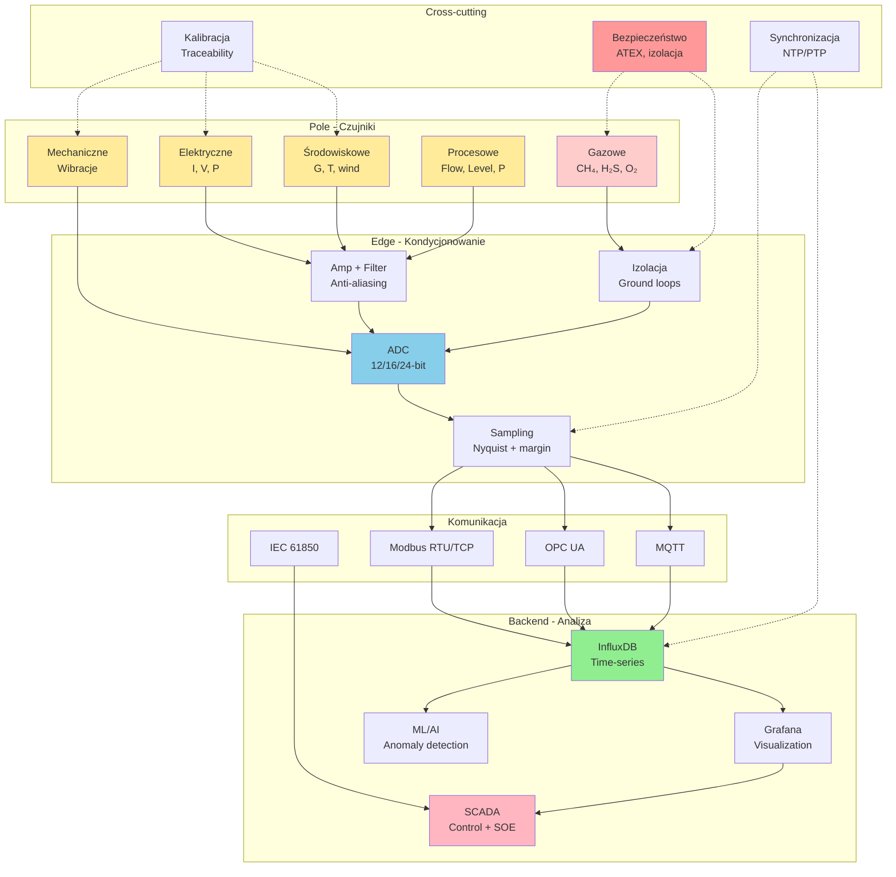

import { 
  SlideContainer, 
  Slide, 
  KeyPoints, 
  SupportingDetails, 
  InstructorNotes,
  VisualSeparator,
  LearningObjective,
  KeyConcept,
  Example
} from '@site/src/components/SlideComponents';

<LearningObjective>
Po tym wykładzie student potrafi:
- Dobrać odpowiednie czujniki dla różnych wielkości fizycznych (elektryczne, środowiskowe, mechaniczne, gazowe)
- Zaprojektować kompletny łańcuch akwizycji danych (czujnik → conditioning → ADC → procesor → komunikacja)
- Zastosować principles metrologii (kalibracja, niepewność, traceability) w praktyce
- Zintegrować system monitoring w instalacji OZE z uwzględnieniem praktycznych wymagań (ATEX, synchronizacja, storage)
</LearningObjective>

<SlideContainer>

<Slide title="📚 Przegląd kluczowych tematów Wykładu 02" type="info">

<KeyPoints title="📋 Struktura wykładu - 10 sekcji">

### **Część 1: Czujniki i pomiary (sekcje 01-06)**

**01. Pomiary elektryczne (DC/AC, PV strings)**
- Czujniki prądu: Shunt, Hall, DCCT, CT, Rogowski
- Dobór według napięcia, medium, accuracy requirements
- Monitoring stringowy: diagnostyka mismatch, zabrudzenia (ROI: 1-3 lata)
- **Key insight**: Granularność ma znaczenie – string-level vs. inverter-level

**02. Irradiancja i temperatura**
- Pyranometry ISO 9060: First Class (±5%), Secondary Standard (±3%)
- POA vs. GHI – POA kluczowe dla PR
- Temperatura modułów (PT1000): kompensacja γ = -0.35 to -0.50%/°C
- **Key insight**: Bez T_mod kompensacji błąd PR >10 p.p.!

**03. Wibracje turbin wiatrowych**
- Akcelerometry IEPE: monitoring CMS (main bearing, gearbox, generator)
- FFT analysis: BPFO, BPFI, mesh frequency → diagnostyka predykcyjna
- f_sample: 10-50 kHz (zależnie od pasma interesującego)
- **Key insight**: Early detection (3-12 miesięcy) → oszczędności >30× koszt CMS

**04. Gazy w biogazowniach**
- CH₄ (katalityczny/IR), H₂S (elektrochemiczny), O₂ (elektrochemiczny)
- ATEX classification: Strefa 0/1/2 → dobór czujników Ex ia/ib/d
- 3-level alarms: LOW/HIGH/HIGH-HIGH (E-stop)
- **Key insight**: H₂S czujniki life 1-3 lata (wymiana, nie kalibracja!)

**05. Przepływ, poziom, ciśnienie**
- Przepływ: Elektromagnetyczny (przewodzące), ultradźwiękowy, Coriolis (masa)
- Poziom: Hydrostatyczny (kompensacja ρ(T)!), radar FMCW, ultradźwiękowy
- Ciśnienie: Piezorezystancyjny (workhorse), pojemnościowy (precision)
- **Key insight**: Kompensacja temperatury kluczowa dla hydrostatyki i gęstości-dependent measurements

**06. Kondycjonowanie sygnału**
- Wzmacnianie (in-amp, CMRR >100 dB)
- Filtracja (anty-aliasing PRZED ADC – kluczowe!)
- Izolacja galwaniczna (ground loops → 50 Hz hum)
- **Key insight**: 4-20 mA loop immune do EMI/ground loops → standard SCADA

---

### **Część 2: Jakość danych i integracja (sekcje 07-10)**

**07. Kalibracja i metrologia**
- Traceability: Łańcuch kalibracji do wzorców (Primary → National → Reference → Working → Field)
- Niepewność (GUM): Type A + Type B → RSS, U = k×u_c (k=2 dla 95% CL)
- Interwały: Risk-based (2-5 lat typowo), zależnie od krytyczności i warunków
- **Key insight**: Kalibracja ≠ justowanie; certyfikaty &lt;2 lata dla critical measurements

**08. Próbkowanie i anti-aliasing**
- Nyquist: f_sample ≥ 2×f_max (teoria), 2.5-5× (praktyka)
- Aliasing nieodwracalny → filtr LP przed ADC obowiązkowy
- Multi-tier sampling: Continuous low-rate + triggered high-rate → 100-1000× data reduction
- **Key insight**: Butterworth 4th order + OSR=3-5× to standard industrial

**09. Synchronizacja czasu (NTP/PTP)**
- NTP: ±1-10 ms (LAN), stratum hierarchia, software timestamps
- PTP: ±100 ns-1 µs (hardware timestamps), PTP-aware switches required
- Aplikacje: SCADA trends (±10 s OK) vs. grid protection (±1 ms wymaga PTP)
- **Key insight**: Drift 10-100 ppm = kilka s/day → sync co 10-60 min (NTP) lub continuous (PTP)

**10. Podsumowanie i synteza** ← **TEN SLAJD**

</KeyPoints>

<SupportingDetails title="🎯 Praktyczne zastosowania – mapa integracji">



### **Syntezy według typu instalacji:**

| Instalacja | Kluczowe czujniki | f_sample | Komunikacja | Storage strategy |
|------------|-------------------|----------|-------------|------------------|
| **PV 1 MWp** | String monitors (I,V), Pyranometry (G_POA), PT1000 (T_mod) | 10-100 Hz | Modbus TCP, OPC UA | 1-min mean, raw 3 mies., aggregated 10 lat |
| **Wind 100 MW** | Akcelerometry (CMS), Anemometry, Encoders | 25-50 kHz (vib), 1-10 Hz (wind) | Modbus, MQTT | Multi-tier (features 1 Hz, triggered events 25 kHz) |
| **Biogas 1 MW** | H₂S, CH₄, O₂ (gazy), Flow (substrat, biogaz), Level (fermentery), P (gaz) | 0.1-1 Hz (gaz), 1-10 Hz (proces) | Modbus RTU, MQTT | 1-min mean, 5 lat retention |
| **Hydro 10 MW** | Ciśnienie (turbina), Flow (woda), Wibracje (CMS) | 10-50 kHz (vib), 1-10 Hz (proces) | IEC 61850, Modbus | Real-time + 15-min aggregation |

</SupportingDetails>

<InstructorNotes>

**Czas**: 12-15 min

**Przebieg**:
1. Szybki przegląd 10 sekcji (5 min) – przypomnienie kluczowych punktów
2. Mapa integracji (diagram) (3 min) – pokazuje big picture
3. Tabela aplikacji (2 min) – konkretne przykłady
4. Mini-ćwiczenie (3 min) – studenci projektują łańcuch pomiarowy
5. Q&A finalne (2 min)

**Punkty kluczowe**:
- **Big picture**: Czujnik → Conditioning → ADC → Communication → Storage → Analysis
- **Cross-cutting concerns**: Calibration, Synchronization, Safety (ATEX)
- **Trade-offs wszędzie**: Cost vs. Accuracy, Bandwidth vs. Storage, Continuous vs. Triggered

**Demonstracja praktyczna**:
- Pokaż dashboard Grafana z real instalacji – wszystkie czujniki razem
- Timeline: Od surowego sygnału (oscyloskop) → przetworzony (FFT) → dashboard (Grafana)

**Materiały pomocnicze**:
- Lecture 02 mindmap (PDF) – synthesizes all topics
- Example BOM (Bill of Materials) dla farmy PV 1 MWp – pokazuje koszty

**Typowe błędy studenckie**:
- Zapominanie o którymś elemencie (np. anty-aliasing, kalibracja)
- Brak big picture – focus na pojedynczym czujniku, nie na systemie
- Niedocenianie kosztów storage/bandwidth (continuous high-rate)

**Pytania studenckie**:
- Q: Co jest najważniejsze z całego wykładu?
- A: (1) Dobór czujnika according to application, (2) Anti-aliasing przed ADC, (3) Kalibracja + traceability, (4) Synchronizacja czasu. Te 4 pillars.

- Q: Jak przygotować się do egzaminu?
- A: (1) Zrozum trade-offs (nie memorize), (2) Potrenuj obliczenia (f_sample, niepewność, aliasing), (3) Przejrzyj case studies (pokazują aplikację teorii).

</InstructorNotes>

</Slide>

<VisualSeparator type="technical" />

<Slide title="🔧 Mini-ćwiczenie: Projekt łańcucha pomiarowego" type="success">

<KeyConcept title="Zadanie: Zaprojektuj system monitoringu dla farmy PV 500 kWp">

**Specyfikacja instalacji:**
- Moc: 500 kWp (1250 modułów × 400 Wp)
- 20 stringów (po 62-63 moduły każdy)
- 2 inwertery × 250 kW
- Lokalizacja: Dolny Śląsk (51°N, 16°E)
- Wymogi: Performance Ratio (PR) monitoring, rozliczenia z inwestorem, zgodność ISO 50001

**Wymagania projektowe:**

1. **Dobór czujników** (jakie wielkości, ilu czujników, typy, lokalizacje)
2. **Kondycjonowanie sygnału** (wzmacnianie, filtracja, izolacja gdzie potrzebna)
3. **Parametry akwizycji** (f_sample dla każdego typu czujnika, resolution ADC)
4. **Synchronizacja** (NTP stratum, dokładność, redundancja)
5. **Plan kalibracji** (interwały, koszty roczne)
6. **Architektura komunikacji** (protokoły, topologia)
7. **Storage strategy** (raw vs. aggregated, retention periods)
8. **Budżet** (CAPEX + OPEX 5-year)

</KeyConcept>

<SupportingDetails title="🎯 Przykładowe rozwiązanie (guidance dla studentów)">

### **1. Dobór czujników**

| Wielkość | Typ czujnika | Ilość | Lokalizacja | Uzasadnienie |
|----------|--------------|-------|-------------|--------------|
| **I_dc, V_dc** (stringi) | Hall effect (0-15 A, 0-1000 V), ±0.5% | 8 | 8 reprezentatywnych stringów (40% coverage) | Diagnostyka mismatch, cost-effective vs. all 20 strings |
| **G_POA** | Pyranometr First Class (ISO 9060) | 2 | 2 lokalizacje (redundancja) | PR calculation, wymóg ISO 50001 |
| **T_mod** | PT1000 Class A | 4 | 4 moduły (różne orientacje) | Kompensacja temp. w PR |
| **T_amb** | PT100 | 1 | Weather station | Meteo correlation |
| **Wind** | Anemometr | 1 | 5 m nad modułami | Soiling rate estimation |
| **P_ac, E_ac** | CT 250A/5A + analyzer | 2 | Output każdego inwertera | Rozliczenia energii |

**Koszty czujników (CAPEX):**
- 8× String monitors: 8 × 150 EUR = **1200 EUR**
- 2× Pyranometry First Class: 2 × 1200 EUR = **2400 EUR**
- 4× PT1000 + 1× PT100: 5 × 80 EUR = **400 EUR**
- 1× Anemometr: **400 EUR**
- 2× CT + analyzers: 2 × 600 EUR = **1200 EUR**
- **TOTAL czujniki: 5600 EUR**

### **2. Kondycjonowanie sygnału**

- **String monitors**: Built-in conditioning (Hall sensors z analog out 0-10 V) → direct to ADC
- **Pyranometry**: Amplifier (termopile output ~10 mV → 0-10 V), LP filter 2 Hz (anti-aliasing dla f_sample = 10 Hz)
- **PT1000/PT100**: 4-wire configuration (eliminuje lead resistance), precision ADC 24-bit
- **CT output**: Burden resistor (5 A → 0-5 V), LP filter 500 Hz

**Izolacja galwaniczna:**
- **Nie wymagana** dla czujników w tej instalacji (wszystkie na tym samym ground plane, brak long runs >100 m)
- **Opcjonalnie**: Isolation dla string monitors jeśli długie przewody (>50 m) → +200 EUR/kanał

### **3. Parametry akwizycji**

| Kanał | f_max | f_sample | ADC resolution | Uzasadnienie |
|-------|-------|----------|----------------|--------------|
| **I_dc, V_dc** | 5 Hz (cloud trans.) | 100 Hz | 16-bit | Nyquist × 10 (conservative), ±0.01% accuracy |
| **G_POA** | 1 Hz | 10 Hz | 16-bit | Standard meteo, 2 Hz LP filter |
| **T_mod, T_amb** | 0.1 Hz | 1 Hz | 24-bit | Very slow, precision 0.01°C |
| **Wind** | 5 Hz (gusts) | 10 Hz | 16-bit | Standard meteo |
| **P_ac, E_ac** | 50 Hz (grid) | 1 kHz | 16-bit | Nyquist × 10 for harmonics |

**Data rate (raw):**
- 8 strings × 2 (I,V) × 100 Hz × 2 bytes = **3.2 KB/s**
- 2 pyranometry × 10 Hz × 2 = **40 bytes/s**
- Temp, wind: neglectable (&lt;1 KB/s)
- **TOTAL raw: ~4 KB/s = 345 MB/day**

### **4. Synchronizacja**

**Architektura NTP:**
- **Stratum 1**: Raspberry Pi 4 + GPS HAT (outdoor roof) → **180 EUR**
- **Stratum 2**: Edge gateway (Raspberry Pi) w field → sync co 60 s
- **Stratum 3**: Dataloggers, inwertery → Modbus time write co 10 min

**Dokładność expected:**
- Stratum 2 (gateways): ±5-10 ms (LAN)
- Stratum 3 (devices): ±20-50 ms (Modbus latency)
- **Wystarczające dla PR (±1 s requirement) i SOE (±100 ms)**

### **5. Plan kalibracji**

| Czujnik | Interwał | Metoda | Koszt/cal | Koszt roczny |
|---------|----------|--------|-----------|--------------|
| Pyranometry | 2 lata | Outdoor comparison (akredytowane) | 500 EUR | **500 EUR** (2 czujniki, co 2 lata → 500/2 = 250, ale × 2 czujniki = 500/2 = ... wait: (2 czujniki × 500) / 2 lata = **500 EUR/year**) |
| PT1000 | 5 lat | Lab calibration | 150 EUR | **120 EUR** (4 × 150 / 5 = 120) |
| String monitors | 5 lat | Verification (in-situ) | 50 EUR | **80 EUR** (8 × 50 / 5) |
| **TOTAL** | — | — | — | **700 EUR/year** |

### **6. Architektura komunikacji**

```
String monitors + Pyranometry + Temp
    ↓ (Modbus RTU, RS-485)
Edge Gateway (Raspberry Pi)
    ↓ (MQTT over 4G/LTE)
Cloud (InfluxDB)
    ↓
Grafana dashboards + ML anomaly detection
```

**Protokoły:**
- **Field level**: Modbus RTU (RS-485, reliable, proven)
- **Edge-to-cloud**: MQTT (lightweight, IoT-friendly, TLS encryption)
- **Inwertery → Cloud**: OPC UA (inwertery modern mają built-in OPC UA server)

### **7. Storage strategy**

| Data type | Raw sampling | Aggregation | Retention raw | Retention aggregated |
|-----------|--------------|-------------|---------------|----------------------|
| **String I,V** | 100 Hz | 1-min mean/max/min | 3 miesiące | 10 lat |
| **G_POA** | 10 Hz | 1-min mean | 1 rok | 10 lat |
| **T_mod** | 1 Hz | 5-min mean | 1 rok | 10 lat |
| **P_ac, E_ac** | 1 kHz | 1-min mean (P), 15-min sum (E) | 1 miesiąc | 10 lat |

**Storage volume:**
- Raw (active): 345 MB/day × 90 days = **31 GB**
- Aggregated (archive): ~100 MB/year × 10 years = **1 GB**
- **TOTAL: ~32 GB** (neglectable, local SSD 1 TB = 30 EUR)

### **8. Budżet (5-year TCO)**

| Kategoria | CAPEX | OPEX/year | 5-year total |
|-----------|-------|-----------|--------------|
| **Czujniki** | 5600 EUR | — | **5600 EUR** |
| **Conditioning + ADC** | 1500 EUR | — | **1500 EUR** |
| **Edge gateways (2×)** | 400 EUR | 100 EUR (connectivity) | **900 EUR** |
| **NTP server (GPS)** | 180 EUR | 50 EUR (maintenance) | **430 EUR** |
| **Kalibracja** | — | 700 EUR | **3500 EUR** |
| **Cloud (InfluxDB, Grafana)** | — | 500 EUR | **2500 EUR** |
| **Installation labor** | 2000 EUR | — | **2000 EUR** |
| **TOTAL** | **9680 EUR** | **1350 EUR/year** | **16 430 EUR** |

**Cost per kWp**: 16430 / 500 = **32.9 EUR/kWp**

**ROI analysis:**
- Bez monitoring: Potential losses z undetected faults ~2-5% produkcji/year = 10-25 MWh/year @ 0.15 EUR/kWh = **1500-3750 EUR/year**
- Z monitoring: Early detection → losses &lt;0.5% = **250-500 EUR/year**
- **Savings: 1250-3250 EUR/year** → **ROI: 3-8 lat**

Plus: Compliance (ISO 50001), investor confidence, gwarancje PR → intangible benefits

</SupportingDetails>

<Example title="Peer review (studenci oceniają rozwiązania)">

**Kryteria oceny projektów studentów:**

1. **Kompletność** (30%):
   - Czy wszystkie wielkości pokryte? (elektryczne, środowiskowe, etc.)
   - Czy kalibracja zaplanowana?
   - Czy synchronizacja addressed?

2. **Adekwatność techniczna** (30%):
   - Czy f_sample odpowiednie (Nyquist + margin)?
   - Czy anti-aliasing gdzie potrzebny?
   - Czy accuracy czujników matches requirements?

3. **Ekonomia** (20%):
  - Czy koszt reasonable? (&lt;50 EUR/kWp dla systemu tego typu)
  - Czy ROI uzasadniony? (&lt;10 lat payback)

4. **Praktyczność** (20%):
   - Czy instalacja feasible? (dostępność komponentów, montaż)
   - Czy maintenance realistic? (nie wymaga Ph.D. do obsługi)

**Typowe błędy w projektach studentów:**
- ❌ Za dużo czujników (overkill) → koszt >100 EUR/kWp
- ❌ Za mało czujników (underkill) → nie pokrywa requirements (np. brak pyranometru → no PR!)
- ❌ Brak filtru anti-aliasing → aliasing problems
- ❌ Ignorowanie kalibracji → compliance fail
- ❌ Single point of failure (1 pyranometr, 1 NTP server) → no redundancy

</Example>

<InstructorNotes>

**Czas**: 20-30 min (to główna aktywność podsumowania!)

**Przebieg**:
1. Przedstawienie zadania (3 min) – specyfikacja farmy PV
2. Studenci pracują w grupach 3-4 osoby (15 min) – projektują system
3. Prezentacje grup (2 min każda, 3-4 grupy = 6-8 min)
4. Peer review + dyskusja (5 min) – co dobre, co można poprawić
5. Pokazanie przykładowego rozwiązania (5 min) – omów slides powyżej
6. Wnioski (2 min)

**Punkty kluczowe**:
- **Integracja wiedzy** z całego wykładu – nie da się zrobić bez zrozumienia wszystkich sekcji
- **Trade-offs** w każdym wyborze – cost vs. accuracy, coverage vs. budget
- **Practical constraints** – nie tylko teoria, ale feasibility

**Materiały pomocnicze**:
- Worksheet (PDF) do wypełnienia – template z sekcjami 1-8
- Example BOMs (Bill of Materials) z real suppliers (Krohne, Endress+Hauser, etc.)
- Cost calculator spreadsheet (Excel) – studenci mogą inputować choices, see total cost

**Ocena pracy grupowej**:
- Każda grupa submits PDF z projektem (1-2 strony)
- Peer review (anonimowe oceny między grupami)
- Prowadzący gives feedback + grade (0-10 points, counts 10% final grade)

**Pytania studenckie podczas exercise**:
- Q: Czy 8 stringów to wystarczająco (z 20 total)?
- A: 40% coverage to good compromise. Więcej = better diagnostics, ale $$$ (każdy string monitor = 150 EUR). W praktyce: 20-50% stringów monitorowanych w farmach komercyjnych.

- Q: Czy trzeba 2 pyranometry (redundancja)?
- A: Best practice: TAK. Jeśli 1 pyranometr fail (zabrudzona kopuła, uszkodzenie), nie wiesz przez miesiące. 2nd pyranometr = cross-check, alerty jeśli divergence. Koszt +1200 EUR = ubezpieczenie.

</InstructorNotes>

</Slide>

<VisualSeparator type="default" />

<Slide title="🎓 Przygotowanie do Wykładu 03 i dalszych" type="info">

<KeyPoints title="📋 Co dalej? Roadmap kursu">

### **Wykład 03: PLC/SCADA i protokoły komunikacyjne**

**Tematy:**
- Architektury SCADA (edge-fog-cloud, role każdej warstwy)
- Protokoły przemysłowe: Modbus RTU/TCP (praktyka), OPC UA (architektura), MQTT (IoT)
- IEC 61850 (standardy grid integration)
- Edge computing i IIoT

**Connection z Wykładem 02:**
- Czujniki (W2) → **Komunikacja** (W3) → Storage & analysis (W4-W5)
- Modbus registers, data types, polling vs. pub-sub
- OPC UA information models (jak strukturyzować dane z czujników)

**Przygotowanie:**
- Review: Modbus basics (function codes, registers)
- Install: Node-RED (open-source for testing Modbus/MQTT flows)
- Read: OPC UA specification Part 1 (overview, free from OPC Foundation)

---

### **Wykład 04: Standardy i integracja z systemem energetycznym**

**Tematy:**
- IEC 61850 (komunikacja w substacjach, logical nodes)
- IEEE 2030.5 (smart grid, demand response)
- DERMS (Distributed Energy Resource Management Systems)
- Grid codes (wymagania dla farm PV/wind przyłączonych do sieci)

**Connection:**
- Data acquisition (W2) → Protocols (W3) → **Standards & grid integration** (W4)
- Jak dane z czujników przekładają się na IEC 61850 logical nodes (MMXU, XCBR, etc.)

---

### **Wykład 05: Jakość danych, inżynieria strumieni**

**Tematy:**
- Data quality (completeness, accuracy, consistency, timeliness)
- Stream processing (Apache Kafka, Flink, InfluxDB)
- Data cleaning, outlier detection, interpolation
- Schema design (time-series databases)

**Connection:**
- Raw data (W2) → Communication (W3) → **Processing & storage** (W5)
- Multi-tier sampling strategies (z W2) → stream processing pipelines

---

### **Wykład 06: Analityka i wykrywanie anomalii**

**Tematy:**
- Statistical methods (CUSUM, control charts)
- ML for anomaly detection (Isolation Forest, autoencoders)
- Root cause analysis (SOE, correlation)
- Predictive maintenance (CMS, failure prediction)

**Connection:**
- Vibration data (W2) → **FFT analysis & ML** (W6) → maintenance decisions
- Time synchronization (W2) → event correlation (W6)

---

### **Wykłady 07-10: Aplikacje specyficzne**

- **W07**: Monitoring PV (I-V curves, soiling, degradation)
- **W08**: Monitoring wiatr/biogaz/hydro (specific dla każdej technologii)
- **W09**: Edge AI, digital twins (advanced topics)
- **W10**: Systemy bezpieczeństwa (fire, thermal runaway BESS, ATEX)

</KeyPoints>

<SupportingDetails title="🎯 Kluczowe umiejętności do rozwinięcia">

### **Technical skills (hard skills):**

1. **Sensor selection & integration**
   - Ability to read datasheets, compare specifications
   - Understanding trade-offs (accuracy vs. cost, range vs. resolution)

2. **Signal processing fundamentals**
   - Nyquist theorem, aliasing, filtering (nie tylko theory, ale praktyka)
   - FFT, spectrum analysis (dla wibracji, electrical)

3. **Communication protocols**
   - Hands-on z Modbus, OPC UA, MQTT (labwork w W3)
   - Packet capture (Wireshark), debugging communication issues

4. **Data management**
   - Time-series databases (InfluxDB queries, retention policies)
   - Dashboarding (Grafana, custom panels)

5. **Metrology & calibration**
   - Uncertainty calculations (GUM methodology)
   - Traceability documentation

---

### **Soft skills:**

1. **Systems thinking**
   - Big picture: jak wszystko się łączy (nie tylko pojedyncze czujniki)
   - Identifying bottlenecks, single points of failure

2. **Cost-benefit analysis**
   - ROI calculations, TCO (Total Cost of Ownership)
   - Making business cases dla inwestycji w monitoring

3. **Troubleshooting**
   - Methodical approach: hypothesize → test → verify
   - Root cause analysis (5 whys, fishbone diagrams)

4. **Communication** (z różnymi stakeholders):
   - Technical reports dla inżynierów
   - Executive summaries dla management
   - Compliance documents dla audytorów

---

### **Recommended self-study:**

**Książki:**
- "Practical Industrial Data Communications" (Steve Mackay) – protocols
- "Time Series Databases" (Ted Dunning, Ellen Friedman) – InfluxDB, stream processing
- "Understanding Digital Signal Processing" (Richard Lyons) – DSP bible

**Online courses:**
- Coursera: "Industrial IoT" (University of Colorado)
- edX: "Data Science for Engineers" (MIT)
- YouTube: "Andreas Spiess" channel (IoT hardware reviews)

**Praktyka:**
- **Build home lab**: Raspberry Pi + sensors (DHT22, MPU6050) + Node-RED + InfluxDB + Grafana
  - Koszt: &lt;150 EUR, learning value: OGROMNY
- **Contribute to open-source**: OpenEMS (energy management), Home Assistant (integrations)
- **Kaggle competitions**: Time-series forecasting, anomaly detection

</SupportingDetails>

<InstructorNotes>

**Czas**: 10-12 min

**Przebieg**:
1. Preview W3-W10 (4 min) – pokazuje roadmap kursu
2. Kluczowe umiejętności (3 min) – co student powinien rozwijać
3. Self-study recommendations (2 min) – książki, kursy, labwork
4. Final Q&A (3 min) – pytania o kurs, egzamin, projekty

**Punkty kluczowe**:
- **Wykład 02 to fundament** – następne wykłady build on top
- **Hands-on practice kluczowa** – teoria bez praktyki = 50% learning
- **System thinking** – nie tylko czujniki, ale cały pipeline

**Demonstracja praktyczna**:
- Pokaż example home lab (Raspberry Pi + sensors + dashboard) – inspiruje studentów
- Live demo: Node-RED flow (Modbus read → InfluxDB write → Grafana) – 2 min teaser W3

**Materiały pomocnicze**:
- Syllabus W3-W10 (detailed topics, literature)
- Lab exercise list (5 hands-on labs through semester)
- Exam format (theory 40%, calculations 30%, case study 30%)

**Pytania studenckie**:
- Q: Czy będzie projekt zaliczeniowy?
- A: TAK. Projekt mini (3-4 osoby): Zaprojektowanie systemu monitoringu dla wybranej instalacji OZE (PV/wind/biogas). Deadline: tydzień przed egzaminem. Prezentacja 10 min + Q&A 5 min. Counts 30% final grade.

- Q: Jakie materiały na egzamin?
- A: Allowed: 1 strona A4 (own notes, handwritten/printed). Calculator OK. NO laptop/phone. Exam: 90 min, 10 pytań (theory + calculations + case study).

- Q: Czy mogę użyć Python/MATLAB na egzaminie?
- A: NO (egzamin pisemny, no computers). Ale: w projekcie TAK (encouraged! simulation, calculations).

</InstructorNotes>

</Slide>

</SlideContainer>

---

## 🎯 Końcowe podsumowanie – Key Takeaways

**Wykład 02 w trzech zdaniach:**

1. **Dobór czujników** to kompromis między accuracy, cost i feasibility → zrozum wymagania aplikacji PRZED wyborem sprzętu.

2. **Łańcuch akwizycji** (sensor → conditioning → ADC → comm → storage) wymaga attention to detail na KAŻDYM etapie → jeden słaby link = cały system unreliable.

3. **Cross-cutting concerns** (calibration, synchronization, anti-aliasing, ATEX safety) są równie ważne jak wybór czujników → nie ignoruj!

---

## 📚 Zasoby dodatkowe

**Normy i standardy** (dostępne przez uczelnię lub IEEE Xplore):
- **ISO 9060:2018** – Solar energy — Specification and classification of instruments for measuring hemispherical solar and direct solar radiation
- **IEC 61298** – Process measurement and control devices (pressure, temperature)
- **ISO 16063** – Methods for the calibration of vibration and shock transducers
- **IEEE 1588-2019** – Precision Clock Synchronization Protocol (PTP)
- **IEC 61850** – Communication networks and systems for power utility automation

**Książki i publikacje:**
- Fraunhofer ISE: "Photovoltaics Report" (annual, free PDF) – industry data, technologies
- NREL: "Wind Turbine Technology Overview" (technical reports, free)
- Analog Devices: "Data Acquisition Handbook" (comprehensive, free PDF)

**Software (open-source):**
- **InfluxDB + Grafana**: Time-series DB + visualization (industry standard)
- **Node-RED**: Visual programming for IoT flows (drag-and-drop Modbus/MQTT)
- **Python**: pandas, numpy, scipy, matplotlib (data analysis)
- **LTspice**: Circuit simulation (filters, conditioning)

**Hardware dla self-study:**
- **Raspberry Pi 4** + sensors: Temperature (DS18B20), accelerometer (MPU6050), gas (MQ-series)
- **Arduino**: Cheaper alternative, good for prototyping
- **ESP32**: WiFi/Bluetooth, great for IoT projects

---

## ✅ Checklist: Czy jesteś gotowy na Wykład 03?

- [ ] Rozumiem trade-offs w doborze czujników (accuracy, cost, range, environment)
- [ ] Potrafię obliczyć f_sample z Nyquist theorem + zapas
- [ ] Wiem czym jest anti-aliasing i dlaczego PRZED ADC
- [ ] Rozumiem ground loops i ich rozwiązania (izolacja, 4-20 mA)
- [ ] Potrafię obliczyć niepewność pomiarową (RSS, k=2)
- [ ] Znam różnicę między NTP (±1-10 ms) a PTP (±1 µs)
- [ ] Wiem jakie są typowe interwały kalibracji (2-5 lat)
- [ ] Rozumiem ATEX classification (Strefa 0/1/2) i dobór czujników Ex
- [ ] Potrafię zaprojektować prosty łańcuch pomiarowy (sensor → ADC → comm)
- [ ] Mam pomysł na własny mini-projekt (home lab lub simulation)

**Jeśli ≥8/10: READY ✅**  
**Jeśli 5-7/10: Review sekcje gdzie słabiej**  
**Jeśli &lt;5/10: Przejrzyj cały wykład ponownie + konsultacje**

---

**Dziękuję za uwagę! Questions? 🙋**

<details>
<summary>📝 Notatki prowadzącego</summary>

**Czas total**: 45-60 min (mini-ćwiczenie + podsumowanie + Q&A)

**Cel**:
- Synteza całego wykładu (not just recap, but integration)
- Przygotowanie do kolejnych wykładów (roadmap)
- Motywacja do self-study (pokazać, że to jest exciting field!)

**Format**:
- Interactive (mini-exercise w grupach)
- Forward-looking (co dalej w kursie?)
- Practical (checklist, resources)

**Atmosfera**:
- Celebratory (ukończyli trudny wykład!)
- Supportive (są zasoby i pomoc dostępna)
- Inspiring (pokazać real-world impact monitoringu OZE)

**Final message**: "Monitoring systems are the nervous system of renewable energy – invisible but critical. Mastering this gives you superpower in energy transition! 🚀"

</details>
