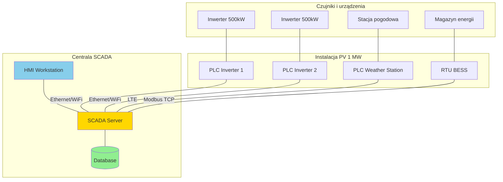
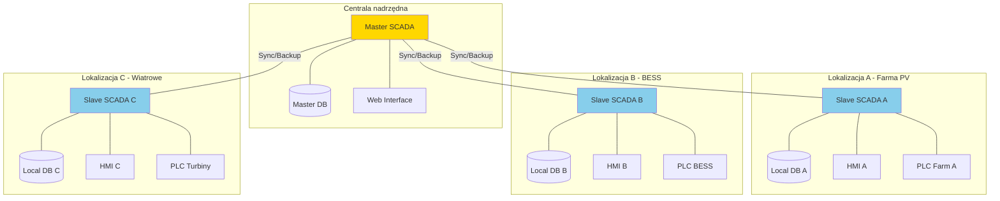
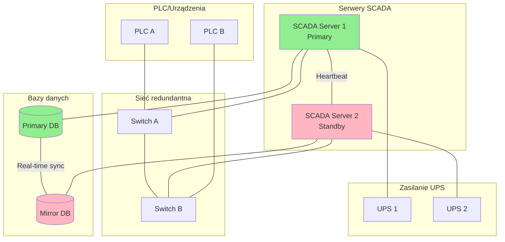

import { 
  SlideContainer, 
  Slide, 
  KeyPoints, 
  SupportingDetails, 
  InstructorNotes,
  VisualSeparator,
  LearningObjective,
  KeyConcept,
  Example
} from '@site/src/components/SlideComponents';

<LearningObjective>
Po tej sekcji student potrafi:
- Rozróżnić podstawowe topologie SCADA (centralna, rozproszona, hybrydowa) i wybrać odpowiednią dla instalacji OZE
- Zbadać architekturę systemu SCADA z podziałem na warstwy: HMI, SCADA Server, PLC, czujniki
- Zaprojektować rozwiązanie z uwzględnieniem redundancji i wysokiej dostępności
- Zidentyfikować potencjalne punkty awarii w architekturze SCADA
</LearningObjective>

<SlideContainer>

<Slide title="🏗️ Wprowadzenie do systemów SCADA" type="info">

<KeyPoints title="📋 Co to jest SCADA?">
- **SCADA** = Supervisory Control and Data Acquisition
- **Nadzoruje i kontroluje** zdalne procesy przemysłowe
- **Zbiera dane** z urządzeń polowych (PLC, czujniki, inwertery)
- **Wizualizuje procesy** poprzez interfejs operacyjny (HMI)
- **Automatyzuje sterowanie** podstawowymi funkcjami
</KeyPoints>

<SupportingDetails title="🎯 Zastosowania w OZE">

**Systemy SCADA w instalacjach OZE pełnią kluczowe funkcje:**

**Monitoring**: Ciągły nadzór nad parametrami produkcyjnymi (moc, napięcia, prądy, temperatura)

**Sterowanie**: Automatyczne uruchamianie/wyłączanie urządzeń, regulacja mocy, zarządzanie bateriami

**Alarmowanie**: Powiadomienia o awariach, przekroczeniach parametrów, potencjalnych zagrożeniach

**Archiwizacja**: Długoterminowe przechowywanie danych dla raportów i analiz

**Komunikacja**: Integracja z systemami nadrzędnymi (TSO, agregatorzy, EMS)

</SupportingDetails>

<InstructorNotes>

Zacznij od podstawowego pytania: **dlaczego potrzebujemy SCADA w instalacjach OZE?** Nie wystarczy, że panele produkują prąd. Musimy wiedzieć, ile, kiedy, czy wszystko działa poprawnie, i móc reagować na problemy.

**Kluczowe dla studentów**: SCADA to nie opcja, to konieczność dla instalacji powyżej 100 kW. Operatorzy sieci (TSO, OSD) wymagają informacji o produkcji w czasie rzeczywistym, możliwości zdalnego sterowania, raportów regulacyjnych.

Podstawowe komponenty: **HMI** (human-machine interface – ekran z wykresami), **SCADA Server** (serwer zbierający dane), **PLC** (sterowniki programowalne), **czujniki/urządzenia polowe** (inwertery, czujniki pogodowe, BMS).

**Czas**: 5-7 minut na wprowadzenie. Przejdź szybko do topologii.

</InstructorNotes>

</Slide>

<VisualSeparator type="default" />

<Slide title="🏛️ Topologia centralna SCADA" type="info">

<KeyPoints title="📋 Charakterystyka topologii centralnej">
- **Jeden centralny serwer SCADA** obsługuje całą instalację
- **PLC/RTU** (Remote Terminal Units) zbierają dane lokalnie
- **Komunikacja** głównie przez Ethernet/WiFi/LTE do centrali
- **Wszystkie dane** przekazywane do jednego punktu nadzoru
</KeyPoints>

**Architektura centralna:**

<KeyConcept title="✅ Zalety topologii centralnej">
- **Prosta architektura** – łatwa do zrozumienia i utrzymania
- **Centralizacja danych** – wszystkie informacje w jednym miejscu
- **Łatwość backupów** – jeden serwer do zabezpieczenia
- **Koszty** – niższe koszty licencji i infrastruktury dla małych instalacji
</KeyConcept>

<KeyConcept title="❌ Wady topologii centralnej">
- **Pojedynczy punkt awarii** – awaria serwera = utrata nadzoru
- **Ograniczenia skalowania** – problemy z dużymi instalacjami
- **Zależność od łączności** – wymaga stabilnego internetu
- **Opóźnienia** – wszystkie dane przez centralną sieć
</KeyConcept>

<InstructorNotes>

Topologia centralna to **klasyczny model** - jeden serwer, wszystkie dane do niego. **Najlepsza dla małych i średnich instalacji** (do 1-2 MW).

Pokaż diagram architektury. **Zwróć uwagę na różne ścieżki komunikacji**: Ethernet dla bliskich urządzeń, WiFi dla pośrednich dystansów, LTE/modem dla odległych lokalizacji (np. stacje pogodowe na polu).

**Kluczowa kwestia**: co się dzieje, gdy serwer pada? **Całkowita utrata nadzoru**. To dlatego w instalacjach komercyjnych migruje się w stronę topologii rozproszonej.

**Zastosowania w praktyce**: farmy PV do 1-2 MW, małe farmy wiatrowe, instalacje BESS w domach, instalacje demonstracyjne.

**Czas**: 4-5 minut na omówienie z diagramem.

</InstructorNotes>

</Slide>

<VisualSeparator type="default" />

<Slide title="🌐 Topologia rozproszona SCADA" type="info">

<KeyPoints title="📋 Charakterystyka topologii rozproszonej">
- **Wiele serwerów SCADA** rozmieszczonych lokalnie
- **Lokalne bazy danych** w każdej lokalizacji
- **Synchronizacja** między serwerami w czasie rzeczywistym
- **Autonomia lokalnych systemów** – działają nawet bez centrali
</KeyPoints>

**Architektura rozproszona:**

<SupportingDetails title="🔄 Mechanizmy synchronizacji">

**Typowe metody synchronizacji danych:**

1. **Replikacja bazy danych** – automatyczne kopiowanie zmian
2. **Event-driven sync** – przesyłanie tylko przy zmianach
3. **Batch synchronization** – okresowe synchronizacje (np. co godzinę)
4. **Real-time streaming** – ciągły strumień danych

**Zarządzanie konfliktami:**
- Master-slave model (centrala ma priorytet)
- Timestamp-based resolution (najnowsze dane wygrywają)
- Manual conflict resolution (operator decyduje)

</SupportingDetails>

<InstructorNotes>

Topologia rozproszona to **nowoczesne podejście** dla dużych, złożonych instalacji. **Każda lokalizacja ma własny SCADA**, ale wszystko synchronizuje się z centralą.

**Kluczowe zalety**: **odporność na awarie** – jeśli padnie łączność z centralą, lokalne instalacje działają samodzielnie. **Skalowalność** – łatwo dodawać nowe lokalizacje.

**Pokaż przykład**: duża firma ma 3 farmy PV po 10 MW każda + magazyn energii + farmę wiatrową. Każda ma własny SCADA, ale wszystkie raportują do centrali gdzie jest **Grafana dashboard** pokazujący całkowitą produkcję.

**Mechanizmy synchronizacji** to kluczowy temat. **Replikacja** może być kosztowna (bandwidth), **event-driven** bardziej efektywne, ale wymaga dobrego projektu sieci.

**Czas**: 6-7 minut z diagramem i przykładami praktycznymi.

</InstructorNotes>

</Slide>

<VisualSeparator type="technical" />

<Slide title="🔄 Topologia redundantna i wysokiej dostępności" type="warning">

<KeyPoints title="📋 Wymagania wysokiej dostępności">
- **Uptime**: 99.9%+ (maksymalnie 8.76h przestoju/rok)
- **Recovery Time**: < 30 sekund przy awarii
- **Data Loss**: zero (wszystkie dane powinny być dostępne)
- **Compliance**: wymogi regulacyjne dla operatorów sieci
</KeyPoints>

**Architektura redundantna:**

<SupportingDetails title="🔧 Mechanizmy redundancji">

**1. Serwer redundantny (Active/Standby)**
- Primary server obsługuje ruch, Standby tylko monitoruje
- **Heartbeat monitoring** – jeśli Primary nie odpowiada, Standby przejmuje kontrolę
- **Failover time**: 5-30 sekund

**2. Baza danych z mirroring**
- Real-time replication między serwerami baz
- **Automatic failover** przy awarii Primary DB
- **Data consistency** gwarantowana przez transakcje

**3. Redundantne połączenia sieciowe**
- Multiple Ethernet links do każdego urządzenia
- **Link aggregation** (LACP) dla zwiększonej przepustowości
- **Spanning Tree Protocol** zapobiega pętlom

</SupportingDetails>

<Example title="Przykład: Farma PV 50 MW z redundancją">

**Konfiguracja:**
- 2x SCADA Server (Windows Server 2019)
- 2x SQL Server z Always On Availability Groups
- 2x network switches z redundantną łącznością
- 2x UPS (zasilanie awaryjne 4h)

**Koszty vs. korzyści:**
- Koszt dodatkowej infrastruktury: ~40% więcej
- Uptime: z 98.5% do 99.95%
- Oszczędności z uniknięcia kar regulacyjnych: ~100k EUR/rok

</Example>

<InstructorNotes>

Redundancja to **kluczowa kwestia** w instalacjach komercyjnych powyżej 5-10 MW. Operatorzy sieci karzą za przestoje, ubezpieczyciele wymagają określonego uptime.

**Heartbeat monitoring** – mechanizm, gdzie Primary wysyła sygnały "żyję" co kilka sekund. Jeśli brak sygnału przez 10-15 sekund, Standby automatycznie przejmuje.

**Częsty błąd studentów**: myślą, że redundancja = backup raz dziennie. To nieprawda! **Redundancja = działanie bez przerwy**. Standby server musi być ciągle zsynchronizowany i gotowy do przejęcia w każdym momencie.

**Pokaż kalkulację kosztów**: instalacja 50 MW, koszt redundancji ~200k EUR, ale uniknięcie kar za przestoje to 100k EUR/rok. **ROI w 2 lata**.

**Czas**: 7-8 minut z praktycznymi przykładami i kalkulacją.

</InstructorNotes>

</Slide>

<VisualSeparator type="default" />

<Slide title="📊 Porównanie topologii SCADA" type="info">

### Tabela porównawcza topologii

| Kryterium | Centralna | Rozproszona | Redundantna |
|-----------|-----------|-------------|-------------|
| **Koszt wdrożenia** | €€ | €€€€ | €€€€€ |
| **Uptime** | 95-98% | 98-99% | 99.9%+ |
| **Skalowalność** | Słaba | Bardzo dobra | Bardzo dobra |
| **Łatwość utrzymania** | Łatwa | Średnia | Trudna |
| **Odporność na awarie** | Niska | Wysoka | Bardzo wysoka |
| **Złożoność** | Prosta | Średnia | Wysoka |
| **Zastosowanie** | < 1 MW | 1-50 MW | > 10 MW+regulatory |

<KeyConcept title="🎯 Zasady wyboru topologii">

**Topologia centralna** - dla:
- Instalacji < 1 MW
- Prototypów i demonstracji  
- Budżet ograniczony
- Klucz: stabilna łączność internetowa

**Topologia rozproszona** - dla:
- Instalacji 1-50 MW
- Więcej niż 2 lokalizacje
- Wymagana autonomia lokalna
- Klucz: synchronizacja danych

**Topologia redundantna** - dla:
- Instalacji > 10 MW
- Wymogi regulacyjne (TSO)
- Krytyczne aplikacje (szpitale, data center)
- Klucz: zero downtime requirements

</KeyConcept>

<InstructorNotes>

**Praktyczna decyzja projektowa**: jaką topologię wybrać? Przejdź przez tabelę kryterium po kryterium.

**Koszt** - centralna to 50k EUR, rozproszona 200k EUR, redundantna 500k EUR dla typowej farmy 10 MW. **Ale koszt awarii to też realny czynnik** - godzina przestoju w farmie 50 MW to ~10k EUR strat.

**Uptime** - operatorzy sieci wymagają minimum 99% uptime dla instalacji powyżej 10 MW. **Below that you get penalties**.

Zapytaj studentów: **instalacja 5 MW, 3 lokalizacje, budżet ograniczony** - co wybieracie? Odpowiedź: prawdopodobnie rozproszona bez redundancji, ale z dobrym backup strategy.

**Czas**: 5-6 minut na porównanie i dyskusję.

</InstructorNotes>

</Slide>

</SlideContainer>
